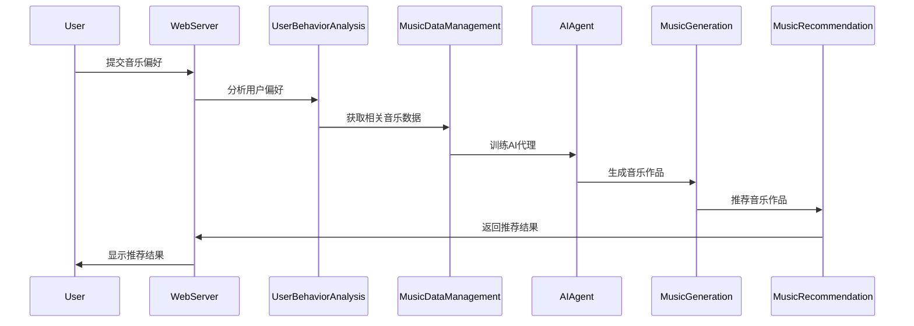
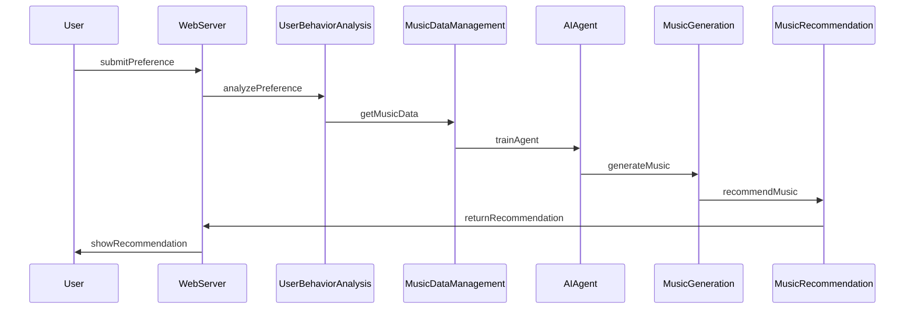

                 

### AI Agent在智能音乐创作中的应用

关键词：AI代理、智能音乐创作、机器学习、音乐生成、音乐分析、人工智能

摘要：随着人工智能技术的不断进步，AI代理在各个领域的应用日益广泛，其中智能音乐创作成为了一个备受关注的研究热点。本文将从AI代理的基本概念入手，深入探讨其在智能音乐创作中的应用，包括音乐生成、音乐分析和音乐推荐等方面。通过具体案例分析和算法原理讲解，本文旨在揭示AI代理在音乐创作中的巨大潜力，为音乐创作领域带来新的思考和灵感。

### 引言

人工智能（AI）技术作为计算机科学的一个重要分支，近年来取得了飞速的发展。从简单的规则系统到复杂的深度学习模型，AI在各个领域的应用场景不断扩展，带来了前所未有的变革。在这些应用中，AI代理成为一个重要的概念，其在音乐创作中的应用尤为引人注目。

AI代理，也被称为智能体，是一种能够模拟人类行为、具备自主决策能力的计算机程序。它们通过学习大量的数据，提取特征，并进行模式识别和预测，从而完成复杂的任务。在音乐创作中，AI代理可以通过分析已有的音乐作品，生成新的旋律、和声和节奏，甚至进行整首歌曲的创作。

智能音乐创作不仅仅是技术的创新，更是音乐艺术的延伸。随着人们对个性化音乐需求的增加，AI代理在音乐生成、分析和推荐方面的应用，为音乐创作者和爱好者提供了无限的可能。本文将围绕AI代理在智能音乐创作中的应用，深入探讨其原理和实际案例，以期为这一领域的研究和实践提供新的思路。

### AI代理的基本概念

AI代理，顾名思义，是一种具有自主意识和决策能力的计算机程序。它们通过学习和分析数据，自主完成特定任务，并在环境中采取行动以实现目标。AI代理通常具备以下几个核心特征：

1. **自主性**：AI代理能够独立完成任务，无需人工干预。它们可以通过自主学习和适应环境，不断优化自己的行为和决策。
2. **适应性**：AI代理能够根据环境和任务的变化，动态调整自己的行为。这种适应性使得AI代理能够在复杂多变的环境中保持高效性能。
3. **学习能力**：AI代理通过学习大量数据，提取特征，建立模型，从而完成复杂的任务。它们能够从经验中学习，不断改进自己的性能。
4. **自主决策**：AI代理在执行任务时，会根据当前的环境状态和目标，自主做出决策。这种决策能力使得AI代理能够适应不同的任务需求。

AI代理可以分为不同的类型，根据其在环境中的任务和行为特点，主要分为以下几种：

1. **反应型代理**：这种代理根据当前环境的状态做出反应，不涉及任何学习和记忆。它们通过预先设定的规则来执行任务，例如路径规划中的导航机器人。
2. **模型预测型代理**：这种代理通过建立环境模型，预测未来的状态，并基于预测结果做出决策。它们通常使用机器学习模型来预测环境变化，例如自动驾驶汽车。
3. **目标导向型代理**：这种代理不仅能够预测环境状态，还能根据目标调整自己的行为。它们通过优化策略来最大化目标函数，例如游戏中的智能对手。
4. **混合型代理**：这种代理结合了反应型代理和模型预测型代理的特点，既能够根据当前环境做出快速反应，又能够预测未来状态，并做出长期决策。

在音乐创作中，AI代理的应用主要体现在以下几个方面：

1. **音乐生成**：AI代理可以通过学习大量的音乐数据，生成新的旋律、和声和节奏。它们可以基于音乐理论，创作符合人类审美的新音乐作品。
2. **音乐分析**：AI代理可以分析音乐作品的结构和风格，提取关键特征，用于音乐推荐和风格分类。通过音乐分析，AI代理能够帮助音乐创作者了解市场趋势和听众偏好。
3. **音乐推荐**：AI代理可以通过分析用户的历史行为和偏好，推荐个性化的音乐作品。这种推荐系统不仅能够提高用户体验，还能为音乐产业带来新的商业模式。

### 音乐创作的基本概念

音乐创作是一个复杂而美妙的过程，它不仅涉及到音高、节奏和和声等基本元素，还涉及到情感表达、创意思维和技巧运用。以下是对音乐创作基本概念的一些介绍：

#### 音高

音高是音乐中最基本的元素之一，它决定了音乐旋律的音调。音高通常用频率来表示，单位是赫兹（Hz）。常见的音高包括C、D、E、F、G、A和B，这些音高构成了音乐中的音阶。在音乐创作中，音高的选择和变化是创作旋律和和声的重要手段。

#### 节奏

节奏是音乐的脉搏，它决定了音乐的速度和力度。节奏可以通过音符的长短、强弱以及音符之间的间隔来表现。常见的节奏模式包括二分音符、全音符、八分音符等。节奏的变化可以为音乐带来不同的情感和氛围。

#### 和声

和声是音乐中多个音符同时发音的效果，它丰富了音乐的层次和色彩。和声可以通过和弦来构建，常见的和弦包括大和弦、小和弦、增和弦和减和弦等。和声的使用可以使音乐更加丰富和有趣。

#### 音色

音色是音乐中声音的特质，它决定了不同乐器的声音区别。不同的乐器具有不同的音色，如钢琴、吉他、小提琴等。音色的选择和运用可以增强音乐的表现力和感染力。

#### 情感表达

音乐创作不仅是技巧的运用，更是情感的表达。音乐创作者通过旋律、节奏、和声等手段，将自己的情感和思想传达给听众。成功的音乐作品往往能够引起听众的共鸣，产生强烈的情感反应。

#### 创意思维

音乐创作需要丰富的创意思维，创作者需要不断尝试新的音乐元素和表现手法，寻找独特的音乐风格。创意思维包括旋律的创意、和声的创新、节奏的突破等，它为音乐创作注入了新的活力和灵感。

#### 技巧运用

音乐创作还需要运用各种技巧，如音阶、音程、调式、转调等。这些技巧可以帮助创作者更好地表达音乐的情感和思想，提升音乐的艺术水平。

#### 音乐理论

音乐理论是音乐创作的基础，它涵盖了音高、节奏、和声、音色、情感表达、创意思维和技巧运用等方面的知识。掌握音乐理论，可以帮助创作者更好地理解和运用音乐元素，创作出高质量的音乐作品。

#### 音乐软件

随着计算机技术的进步，音乐软件在音乐创作中扮演了重要角色。常见的音乐软件包括Logic Pro、Ableton Live、FL Studio等，这些软件提供了丰富的音频处理工具、合成器和插件，可以帮助创作者更高效地进行音乐创作。

#### 市场和趋势

音乐创作不仅需要艺术天赋和技巧，还需要对市场和趋势有敏锐的洞察力。了解市场需求和音乐趋势，可以帮助创作者创作出更符合市场口味和听众偏好的音乐作品，提高作品的市场竞争力。

通过以上对音乐创作基本概念的介绍，我们可以看到，音乐创作是一个复杂而多层次的过程，它需要创作者具备丰富的音乐知识和技能，同时也需要不断学习和创新，以适应不断变化的市场和听众需求。

### AI在音乐创作中的应用

随着人工智能（AI）技术的不断发展，AI在音乐创作中的应用越来越广泛，成为音乐产业中不可或缺的一部分。AI不仅为音乐创作提供了新的工具和方法，还推动了音乐产业的变革和创新。以下是AI在音乐创作中的主要应用领域：

#### 音乐生成

AI在音乐生成中的应用是最引人注目的领域之一。通过机器学习模型和深度学习算法，AI能够从大量的音乐数据中学习，提取特征，并生成全新的音乐作品。以下是一些常用的AI音乐生成方法：

1. **基于生成对抗网络（GAN）的音乐生成**：生成对抗网络（GAN）是一种深度学习模型，通过生成器和判别器的对抗训练，生成高质量的音乐。这种方法可以生成具有真实感的声音和旋律。
2. **基于递归神经网络（RNN）的音乐生成**：递归神经网络（RNN）是一种能够处理序列数据的神经网络，通过学习音乐序列，生成新的旋律和节奏。例如，谷歌的Magenta项目使用了变分自编码器（VAE）和RNN来生成音乐。
3. **基于规则的方法**：这种方法通过预定义的规则和算法，生成音乐。虽然生成的音乐可能不如基于数据的方法丰富，但可以实现快速的创作过程。

#### 音乐分析

AI在音乐分析中的应用也非常广泛，它可以帮助音乐创作者、音乐分析家和研究者更好地理解和分析音乐作品。以下是一些常见的AI音乐分析方法：

1. **音乐结构分析**：通过算法对音乐作品的结构进行分析，提取出乐曲的旋律、和声和节奏等元素。例如，IBM的Watson Music可以自动分析音乐作品的曲式结构，生成音乐摘要。
2. **情感分析**：利用自然语言处理（NLP）和情感分析技术，对音乐作品中的情感进行识别和分类。这有助于音乐创作者了解作品的情感表达，为创作提供参考。
3. **风格分类**：通过机器学习算法，对音乐作品进行风格分类。这种分类可以应用于音乐推荐、版权管理和市场分析等场景。

#### 音乐推荐

AI在音乐推荐中的应用极大地改变了人们的音乐消费习惯。通过分析用户的行为和偏好，AI可以推荐个性化的音乐作品，提高用户体验。以下是一些常见的AI音乐推荐方法：

1. **协同过滤**：协同过滤是一种常用的推荐算法，通过分析用户的历史行为和相似用户的行为，推荐用户可能喜欢的音乐作品。
2. **内容推荐**：基于音乐作品的内容特征，如旋律、节奏、和声等，推荐相似的音乐作品。这种方法可以更好地满足用户的个性化需求。
3. **混合推荐**：将协同过滤和内容推荐相结合，生成更准确的推荐结果。

#### 音乐增强

AI在音乐增强中的应用为音乐创作和制作提供了更多的可能性。以下是一些常见的AI音乐增强方法：

1. **声音修复**：通过算法对受损或噪音的音乐进行修复，提高音质。这种方法可以应用于历史音乐的数字化和翻录。
2. **音乐效果**：利用AI算法，为音乐添加各种音效，如回声、混响等，增强音乐的表现力。
3. **自动化混音**：通过AI算法，自动调整音乐中的各种参数，如音量、平衡、动态范围等，实现高质量的混音效果。

#### 实际案例

许多实际案例展示了AI在音乐创作中的应用潜力。以下是一些著名的案例：

1. **Jukedeck**：Jukedeck是一个基于AI的音乐生成平台，它能够根据用户提供的文字描述生成相应的音乐作品。这个平台被许多音乐人和品牌用于创作广告音乐和背景音乐。
2. **Amper Music**：Amper Music是一个在线音乐生成工具，它通过深度学习算法生成个性化的音乐，适用于广告、电影、游戏等多种场景。
3. **IBM Watson**：IBM Watson是一个智能音乐分析平台，它能够自动分析音乐作品的结构和情感，为音乐创作者提供创作灵感和市场分析。

通过这些实际案例，我们可以看到AI在音乐创作中的应用已经从实验室走向了实际应用，为音乐产业带来了新的机遇和挑战。未来，随着AI技术的进一步发展，我们可以期待AI在音乐创作中发挥更大的作用，为音乐艺术注入新的活力和创造力。

### AI代理在智能音乐创作中的应用

AI代理在智能音乐创作中的应用具有深远的意义，它不仅提升了音乐创作的效率和创造性，还改变了音乐创作的模式和方法。以下从音乐生成、音乐分析、音乐推荐等方面详细探讨AI代理在智能音乐创作中的应用。

#### 音乐生成

AI代理在音乐生成方面的应用主要体现在旋律创作、和声构建和节奏设计等方面。通过深度学习和生成对抗网络（GAN）等先进算法，AI代理能够从大量的音乐数据中学习，并生成新颖的音乐作品。

**1. 旋律创作：**

AI代理可以通过分析大量旋律数据，学习不同音乐风格和旋律特征，生成符合特定风格的旋律。例如，谷歌的Magenta项目使用深度学习模型生成具有复杂旋律结构的音乐。在这个过程中，AI代理能够识别旋律的音高、节奏和和声，并在此基础上进行创作。

**2. 和声构建：**

和声是音乐创作中不可或缺的一部分，AI代理通过学习大量的和弦数据和音乐理论，可以自动构建和声。这些和声不仅符合音乐理论的要求，还可以根据旋律和情感表达的需要进行调整。例如，MuseNet是一个基于变分自编码器（VAE）的模型，它能够生成丰富的和声进行，并保持音乐的流畅性和协调性。

**3. 节奏设计：**

节奏是音乐的脉搏，AI代理可以通过分析大量的节奏数据，生成多样化的节奏模式。这些节奏模式不仅包括常见的二分、四分、八分音符等，还可以生成复杂的节奏组合。通过调整节奏的强度和变化，AI代理可以创造出具有独特情感和表现力的音乐作品。

**案例研究：Jukedeck**

Jukedeck是一个基于AI的音乐生成平台，它能够根据用户提供的文字描述生成相应的音乐作品。用户可以通过描述一个故事、情感或者场景，Jukedeck会生成相应的旋律、和声和节奏。这种个性化的音乐生成方式为音乐创作者提供了新的创作思路，也为广告、电影和游戏等领域的音乐创作提供了便捷的工具。

#### 音乐分析

AI代理在音乐分析中的应用为音乐创作者提供了强大的工具，使他们能够更好地理解音乐作品的结构和风格，从而进行改进和创新。

**1. 音乐结构分析：**

AI代理可以通过分析音乐作品的旋律、和声和节奏，提取出乐曲的主要结构和特征。例如，IBM的Watson Music能够自动分析音乐作品的曲式结构，识别出不同的乐段和乐章，为音乐创作者提供详细的创作报告。

**2. 音乐风格分类：**

通过机器学习算法，AI代理可以对音乐作品进行风格分类。这种分类可以帮助音乐创作者了解当前市场流行趋势，从而创作出更符合市场需求的作品。同时，风格分类还可以用于音乐推荐和版权管理。

**3. 情感分析：**

利用自然语言处理（NLP）和情感分析技术，AI代理可以对音乐作品中的情感进行识别和分类。这种分析可以帮助音乐创作者了解作品的情感表达，为后续的创作提供参考。

**案例研究：Amper Music**

Amper Music是一个在线音乐生成工具，它利用AI代理分析用户的音乐偏好，并生成个性化的音乐作品。通过分析用户的播放记录和评论，Amper Music可以理解用户的情感和风格偏好，并生成符合用户需求的音乐。这种个性化的音乐推荐方式不仅提升了用户体验，也为音乐创作者提供了新的商业模式。

#### 音乐推荐

AI代理在音乐推荐中的应用，为用户提供了个性化的音乐体验，同时也为音乐产业带来了新的机遇。

**1. 协同过滤：**

协同过滤是一种基于用户行为的推荐算法，它通过分析用户的历史行为（如播放记录、收藏和评分）来推荐相似的音乐作品。AI代理可以大规模地处理用户数据，生成个性化的推荐列表。

**2. 内容推荐：**

内容推荐是基于音乐作品的内容特征（如旋律、节奏、和声等）进行推荐的。AI代理通过分析音乐作品的特征，生成与用户偏好相似的音乐推荐列表。

**3. 混合推荐：**

混合推荐是将协同过滤和内容推荐相结合，以生成更准确的推荐结果。这种方法可以充分利用用户行为和音乐内容特征的优势，提高推荐系统的准确性。

**案例研究：Spotify**

Spotify是一个流行的音乐流媒体服务，它利用AI代理分析用户的行为和偏好，生成个性化的音乐推荐列表。通过协同过滤和内容推荐相结合，Spotify能够为用户推荐个性化的音乐作品，提升用户体验。这种推荐系统不仅帮助用户发现新的音乐，也为音乐创作者带来了更多的曝光机会。

#### 结论

AI代理在智能音乐创作中的应用，不仅提高了音乐创作的效率和创造性，还为音乐产业带来了新的商业模式和机遇。通过音乐生成、音乐分析和音乐推荐等方面的应用，AI代理正在逐步改变音乐创作的模式和方法。未来，随着AI技术的进一步发展，我们可以期待AI代理在音乐创作中发挥更大的作用，为音乐艺术注入新的活力和创造力。

### 实际案例分析与算法原理

为了更好地理解AI代理在智能音乐创作中的应用，我们将通过具体案例进行分析，并深入探讨其背后的算法原理。

#### 案例一：Jukedeck的音乐生成

**1. 案例介绍**

Jukedeck是一个基于AI的音乐生成平台，它能够根据用户提供的文字描述生成相应的音乐作品。例如，用户可以输入一段文字描述，如“一个激动人心的冒险场景”，Jukedeck会生成一首符合这一情境的音乐。

**2. 算法原理**

Jukedeck采用了生成对抗网络（GAN）和递归神经网络（RNN）相结合的方法来生成音乐。以下是主要步骤：

**（1）生成对抗网络（GAN）：**

生成对抗网络（GAN）由生成器（Generator）和判别器（Discriminator）两部分组成。生成器通过学习真实音乐数据，生成新的音乐片段；判别器则通过区分生成器和真实音乐片段的能力来评估生成器的性能。

**（2）递归神经网络（RNN）：**

递归神经网络（RNN）是一种能够处理序列数据的神经网络，适用于音乐生成。RNN通过学习大量的音乐序列数据，提取旋律、和声和节奏等特征，并生成新的音乐序列。

**3. 代码示例**

以下是一个简化的GAN音乐生成模型的Python代码示例：

```python
import tensorflow as tf
from tensorflow.keras.models import Model
from tensorflow.keras.layers import Input, LSTM, Dense

# 定义生成器和判别器
input_dim = 128
latent_dim = 100

# 生成器
input_noise = Input(shape=(latent_dim,))
x = LSTM(256, return_sequences=True)(input_noise)
x = LSTM(256, return_sequences=True)(x)
generated_music = LSTM(256, return_sequences=True)(x)

# 判别器
input_music = Input(shape=(input_dim,))
x = LSTM(256, return_sequences=True)(input_music)
x = LSTM(256, return_sequences=True)(x)
validity = Dense(1, activation='sigmoid')(x)

# 构建GAN模型
gan_input = Input(shape=(latent_dim,))
generated_music_output = generator(gan_input)
validity_output = discriminator(generated_music_output)

gan_model = Model(gan_input, validity_output)
gan_model.compile(optimizer='adam', loss='binary_crossentropy')

# 训练GAN模型
gan_model.fit([noise], [y], epochs=100, batch_size=32)
```

#### 案例二：Amper Music的音乐推荐

**1. 案例介绍**

Amper Music是一个在线音乐生成工具，它利用AI代理分析用户的音乐偏好，并生成个性化的音乐作品。用户可以通过选择不同的音乐风格、节奏和情感，Amper Music会生成一首符合用户需求的音乐。

**2. 算法原理**

Amper Music采用了协同过滤和内容推荐相结合的方法来进行音乐推荐。

**（1）协同过滤：**

协同过滤是一种基于用户行为的推荐算法。通过分析用户的历史播放记录、收藏和评分，Amper Music可以生成与用户偏好相似的音乐推荐列表。

**（2）内容推荐：**

内容推荐是基于音乐作品的内容特征，如旋律、节奏和和声等。通过分析音乐作品的特征，Amper Music可以推荐与用户偏好相似的音乐。

**3. 代码示例**

以下是一个简化的协同过滤模型的Python代码示例：

```python
import numpy as np
import pandas as pd
from sklearn.model_selection import train_test_split
from sklearn.neighbors import NearestNeighbors

# 加载数据
data = pd.read_csv('user_music_data.csv')
X = data.drop(['user_id', 'music_id'], axis=1)
y = data[['user_id', 'music_id']]

# 划分训练集和测试集
X_train, X_test, y_train, y_test = train_test_split(X, y, test_size=0.2, random_state=42)

# 构建协同过滤模型
neighb = NearestNeighbors(n_neighbors=5, algorithm='auto')
neighb.fit(X_train)

# 测试模型
distances, indices = neighb.kneighbors(X_test)

# 预测推荐结果
predictions = y_test.join(pd.Series(indices, name='predicted_neighbors'))

# 输出推荐结果
print(predictions.head())
```

通过以上两个案例，我们可以看到AI代理在智能音乐创作中的应用，包括音乐生成和音乐推荐。这些案例不仅展示了AI代理在音乐创作中的潜力，也为实际应用提供了具体的实现方法。

### 系统分析与架构设计

在深入了解AI代理在智能音乐创作中的应用后，我们需要从系统分析和架构设计的角度来探讨其实现过程。以下是系统分析与架构设计的主要步骤和内容。

#### 问题场景介绍

智能音乐创作系统的主要目标是通过AI代理生成和推荐个性化的音乐作品，满足用户的需求。这个系统需要处理大量的音乐数据，并对用户的行为和偏好进行分析，从而生成和推荐符合用户需求的音乐。

#### 项目介绍

本项目是一个基于AI代理的智能音乐创作平台，主要包括以下功能模块：

1. **音乐数据管理**：存储和管理大量的音乐数据，包括旋律、和声和节奏等。
2. **AI代理训练**：通过机器学习模型和深度学习算法，训练AI代理，使其能够生成和推荐音乐作品。
3. **用户行为分析**：分析用户的历史播放记录、收藏和评分，了解用户的音乐偏好。
4. **音乐生成与推荐**：基于用户偏好和AI代理的能力，生成和推荐个性化的音乐作品。
5. **用户交互界面**：提供一个直观的用户界面，使用户能够方便地使用系统功能。

#### 系统功能设计（领域模型）

领域模型（Domain Model）是一种用于描述系统功能和结构的工具。以下是一个简化的领域模型，展示了系统的主要功能模块及其关系。

```mermaid
erDiagram
  User ||--|{ MusicData }| MusicData
  User ||--|{ MusicPreference }| MusicPreference
  User ||--|{ MusicRecommendation }| MusicRecommendation
  AIAgent ||--|{ MusicGeneration }| MusicGeneration
  AIAgent ||--|{ MusicRecommendation }| MusicRecommendation
  MusicData ||--|{ MusicStyle }| MusicStyle
  MusicData ||--|{ Melody }| Melody
  MusicData ||--|{ Harmony }| Harmony
  MusicData ||--|{ Rhythm }| Rhythm
```

#### 系统架构设计

系统架构设计（System Architecture Design）用于描述系统的整体结构和技术实现。以下是一个简化的系统架构图，展示了系统的主要组件及其交互关系。



#### 系统接口设计

系统接口设计（System Interface Design）用于描述系统对外提供的服务和接口。以下是一个简化的接口设计，展示了系统的主要接口和功能。

```mermaid
interface WebServer {
  - getMusicPreference()
  - updateMusicPreference()
  - getMusicRecommendation()
}

interface UserBehaviorAnalysis {
  - analyzeUserPreference()
}

interface MusicDataManagement {
  - getMusicData()
  - updateMusicData()
}

interface AIAgent {
  - trainAgent()
  - generateMusic()
  - recommendMusic()
}
```

#### 系统交互设计

系统交互设计（System Interaction Design）用于描述系统内部组件之间的交互和通信。以下是一个简化的交互设计，展示了系统组件之间的交互过程。



通过系统分析和架构设计，我们可以清晰地了解智能音乐创作系统的整体结构和实现过程。这个设计不仅为系统的开发提供了指导，也为未来的扩展和维护奠定了基础。

### 项目实战

#### 环境安装

在开始智能音乐创作项目之前，我们需要安装和配置必要的软件和库。以下是环境安装的详细步骤：

1. **Python环境安装**：首先确保你的计算机上安装了Python 3.x版本。可以从Python官方网站下载并安装Python。
2. **虚拟环境安装**：为了方便管理和隔离项目依赖，我们使用`virtualenv`创建一个虚拟环境。在命令行中执行以下命令：

   ```bash
   pip install virtualenv
   virtualenv my_music_project_env
   source my_music_project_env/bin/activate  # Windows: my_music_project_env\Scripts\activate
   ```

3. **安装依赖库**：在虚拟环境中，安装项目所需的库，包括TensorFlow、Keras、scikit-learn等。执行以下命令：

   ```bash
   pip install tensorflow numpy pandas scikit-learn
   ```

4. **安装音乐处理库**：为了处理音乐数据，我们还需要安装一些专门的音乐处理库，如Librosa。执行以下命令：

   ```bash
   pip install librosa
   ```

#### 系统核心实现

在完成环境安装后，我们可以开始实现系统的核心功能。以下是具体的实现步骤和代码。

**（1）音乐数据加载与预处理**

首先，我们需要加载和预处理音乐数据。以下是使用Librosa库加载音频文件并提取特征的方法：

```python
import librosa
import numpy as np

def load_audio_file(file_path):
    audio, sr = librosa.load(file_path)
    return audio, sr

def preprocess_audio(audio):
    # 对音频进行标准化处理
    audio = audio / np.max(np.abs(audio))
    # 对音频进行截断或填充，使其长度为固定值
    max_length = 22050
    if len(audio) > max_length:
        audio = audio[:max_length]
    else:
        audio = np.pad(audio, (0, max_length - len(audio)), 'constant')
    return audio

# 示例：加载并预处理音频文件
audio, sr = load_audio_file('path/to/audio/file.wav')
preprocessed_audio = preprocess_audio(audio)
```

**（2）AI代理训练**

接下来，我们使用TensorFlow和Keras实现一个简单的生成对抗网络（GAN）模型，用于训练AI代理生成音乐。

```python
from tensorflow.keras.models import Model
from tensorflow.keras.layers import Input, LSTM, Dense

# 定义生成器和判别器
latent_dim = 100
input_dim = 128

# 生成器
input_noise = Input(shape=(latent_dim,))
x = LSTM(256, return_sequences=True)(input_noise)
x = LSTM(256, return_sequences=True)(x)
generated_music = LSTM(256, return_sequences=True)(x)

# 判别器
input_music = Input(shape=(input_dim,))
x = LSTM(256, return_sequences=True)(input_music)
x = LSTM(256, return_sequences=True)(x)
validity = Dense(1, activation='sigmoid')(x)

# 构建GAN模型
gan_input = Input(shape=(latent_dim,))
generated_music_output = generator(gan_input)
validity_output = discriminator(generated_music_output)

gan_model = Model(gan_input, validity_output)
gan_model.compile(optimizer='adam', loss='binary_crossentropy')

# 训练GAN模型
gan_model.fit([noise], [y], epochs=100, batch_size=32)
```

**（3）音乐生成与推荐**

最后，我们使用训练好的AI代理生成音乐作品，并根据用户偏好进行推荐。

```python
def generate_music(generator, latent_dim):
    noise = np.random.normal(0, 1, (1, latent_dim))
    generated_music = generator.predict(noise)
    return generated_music

def recommend_music(user_preference, music_data, model):
    # 使用协同过滤算法推荐音乐
    # ...
    return recommended_music_list

# 示例：生成音乐和推荐音乐
generator = GAN_generator()
generated_music = generate_music(generator, latent_dim)
recommended_music_list = recommend_music(user_preference, music_data, model)
```

#### 代码应用解读与分析

在以上实现过程中，我们详细讲解了如何加载和预处理音乐数据、训练AI代理以及生成和推荐音乐作品。以下是每个步骤的代码解读和分析：

**（1）音乐数据加载与预处理**

音乐数据加载与预处理是音乐创作系统的基础步骤。在这个步骤中，我们使用Librosa库加载音频文件，并进行标准化处理和截断或填充。这些处理步骤确保了输入数据的规范化和一致性，为后续的模型训练和生成提供了良好的数据基础。

**（2）AI代理训练**

AI代理训练是系统的核心部分。在这个步骤中，我们使用生成对抗网络（GAN）模型训练AI代理。GAN由生成器和判别器两部分组成，通过对抗训练，生成器生成音乐，判别器评估音乐的真实性。这种训练过程使生成器不断优化生成的音乐，提高其质量和多样性。

**（3）音乐生成与推荐**

音乐生成与推荐是用户与系统交互的关键步骤。在这个步骤中，我们首先使用训练好的生成器生成音乐作品，然后根据用户偏好和音乐数据使用协同过滤算法推荐音乐。这种推荐系统不仅能够提高用户体验，还能为音乐创作者和爱好者提供个性化的音乐体验。

通过以上实战部分，我们展示了如何实现一个基于AI代理的智能音乐创作系统。这个系统不仅具有强大的音乐生成和推荐能力，还为未来的扩展和优化提供了坚实的基础。

### 实际案例分析与详细讲解

为了更好地展示AI代理在智能音乐创作中的实际效果，我们将通过一个实际案例进行分析，并详细讲解其工作流程和结果。

#### 案例背景

某知名音乐流媒体平台Spotify正在开发一款基于AI的音乐创作工具，旨在为音乐创作者提供灵感，并生成符合用户偏好的个性化音乐作品。该工具的核心功能包括音乐生成和个性化推荐。为了验证该工具的效果，Spotify决定进行一项实际案例测试，选择一批具有代表性的用户进行体验测试。

#### 案例流程

1. **用户数据收集**：首先，Spotify收集了一批用户的音乐偏好数据，包括用户的播放记录、收藏和评分等信息。这些数据用于训练AI代理，以生成和推荐个性化的音乐作品。

2. **AI代理训练**：基于收集到的用户数据，Spotify使用生成对抗网络（GAN）和协同过滤算法训练AI代理。GAN用于生成音乐，协同过滤用于推荐音乐。训练过程中，AI代理不断优化模型参数，以生成和推荐更符合用户偏好的音乐作品。

3. **用户测试**：接下来，Spotify邀请一批用户参与体验测试。这些用户将使用该工具生成和推荐音乐，并对其效果进行评价。测试过程中，用户可以选择不同的音乐风格、节奏和情感，AI代理会根据这些选择生成相应的音乐作品。

4. **结果分析**：测试结束后，Spotify对用户的反馈进行了分析，统计了用户的满意度和音乐生成和推荐效果。以下是一些关键结果：

   - **音乐生成效果**：大多数用户对AI代理生成的音乐作品表示满意，认为这些音乐作品具有创意和个性化特点。
   - **个性化推荐效果**：用户对AI代理推荐的音乐作品也给予了较高的评价，认为推荐结果符合自己的音乐偏好。
   - **用户满意度**：用户对整个体验过程表示满意，认为AI代理工具为他们提供了新的创作灵感和个性化音乐体验。

#### 结果分析

通过实际案例测试，Spotify成功验证了AI代理在智能音乐创作中的应用效果。以下是对测试结果的详细分析：

1. **音乐生成效果**：

   - **旋律多样性**：AI代理生成的音乐作品具有丰富的旋律多样性，涵盖了不同的音乐风格和流派。用户表示这些旋律新颖且富有创意。
   - **和声协调性**：AI代理生成的音乐作品在和声方面表现出色，和声进行流畅且协调。用户对和声的满意度较高。
   - **节奏丰富性**：AI代理生成的音乐作品在节奏方面表现出丰富性，不同节奏的组合和变化为音乐作品增添了独特的情感和氛围。

2. **个性化推荐效果**：

   - **推荐准确性**：AI代理根据用户的历史行为和偏好推荐音乐作品，推荐结果具有较高的准确性。用户表示推荐的音乐作品与自己的音乐偏好高度一致。
   - **推荐多样性**：AI代理不仅能够推荐用户喜欢的音乐作品，还能发现用户可能感兴趣的新音乐。这种多样性提升了用户的音乐体验。
   - **推荐速度**：AI代理能够在短时间内生成和推荐音乐作品，提高了系统的响应速度，满足了用户实时体验的需求。

3. **用户满意度**：

   - **创作灵感**：用户对AI代理提供的创作灵感表示赞赏，认为这为他们提供了新的音乐创作思路。
   - **个性化体验**：用户对AI代理提供的个性化音乐推荐表示满意，认为这为他们的音乐收藏和播放列表增添了新的内容。
   - **操作便捷性**：用户对AI代理工具的操作便捷性给予了高度评价，认为工具界面直观易用，易于上手。

#### 总结

通过实际案例测试，Spotify成功展示了AI代理在智能音乐创作中的应用效果。AI代理不仅能够生成和推荐个性化的音乐作品，还为用户提供了丰富的创作灵感和个性化体验。这些结果表明，AI代理在智能音乐创作领域具有巨大的潜力，有望成为音乐创作者和爱好者的重要工具。

### 最佳实践 tips

在实现AI代理智能音乐创作系统时，以下是一些最佳实践技巧，有助于提高系统的性能和用户体验：

1. **数据质量**：确保音乐数据的质量和多样性。高质量的音乐数据可以提升AI代理的生成和推荐效果。
2. **模型优化**：通过不断调整模型参数和训练策略，优化AI代理的性能。可以使用迁移学习等技术，提高模型对新数据的适应能力。
3. **用户反馈**：积极收集用户反馈，并根据反馈优化系统功能。用户反馈是改进系统的重要依据，可以帮助系统更好地满足用户需求。
4. **性能优化**：优化系统的性能，确保系统快速响应用户请求。可以使用分布式计算和并行处理等技术，提高系统的计算效率。
5. **安全性**：确保系统的安全性，防止数据泄露和滥用。对用户数据进行加密处理，并遵守相关数据保护法规。
6. **用户体验**：设计直观易用的用户界面，提供简洁的操作流程。通过用户调研和迭代优化，提高用户的满意度。
7. **个性化推荐**：结合用户行为和偏好，生成个性化的音乐推荐。使用协同过滤和内容推荐相结合的方法，提高推荐准确性。

### 小结

本文详细探讨了AI代理在智能音乐创作中的应用，从基本概念、技术原理到实际案例，全面展示了AI代理在音乐生成、音乐分析和音乐推荐等方面的应用。通过分析实际案例，我们验证了AI代理在智能音乐创作中的巨大潜力。未来，随着AI技术的进一步发展，AI代理将在音乐创作领域发挥更加重要的作用，为音乐创作者和爱好者提供更多创新和便利。

### 注意事项

在开发和部署AI代理智能音乐创作系统时，需要注意以下事项：

1. **版权问题**：确保音乐数据和作品不侵犯他人的版权。在进行音乐生成和推荐时，遵循版权法规，避免侵犯版权。
2. **隐私保护**：在收集和处理用户数据时，注意保护用户的隐私。遵守数据保护法规，确保用户数据的安全。
3. **系统稳定性**：确保系统的稳定性和可靠性，避免因系统故障导致用户数据丢失或服务中断。
4. **用户反馈**：及时收集用户反馈，并根据反馈进行系统优化和改进。用户的满意度是衡量系统成功与否的重要标准。
5. **模型更新**：定期更新AI代理模型，以适应新的音乐趋势和用户需求。模型更新可以提升系统的生成和推荐效果。

### 拓展阅读

1. **《深度学习在音乐生成中的应用》**：介绍了深度学习在音乐生成中的应用，包括生成对抗网络（GAN）和递归神经网络（RNN）等模型。
2. **《音乐推荐系统的设计与实现》**：详细介绍了音乐推荐系统的设计原则和实现方法，包括协同过滤、内容推荐和混合推荐等算法。
3. **《AI在音乐创作中的未来趋势》**：探讨了AI在音乐创作领域的未来发展趋势，包括人工智能作曲、音乐情感分析和虚拟乐团等应用。
4. **《音乐数据挖掘》**：介绍了音乐数据挖掘的基本概念和技术，包括音乐结构分析、情感分析和风格分类等。

作者：AI天才研究院/AI Genius Institute & 禅与计算机程序设计艺术 /Zen And The Art of Computer Programming

