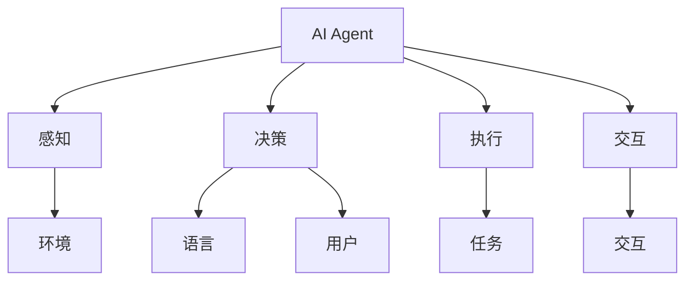
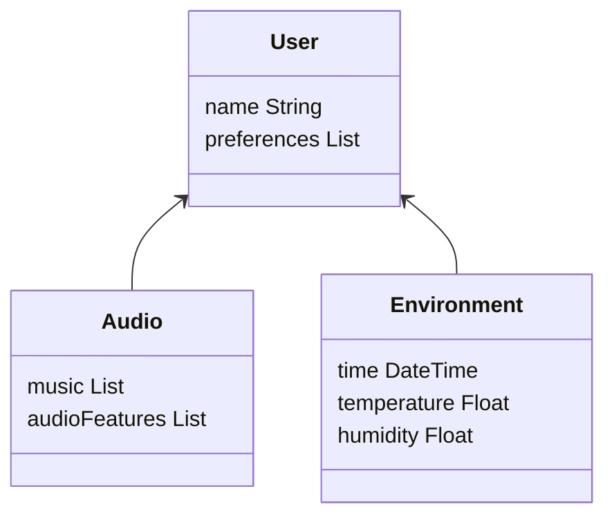
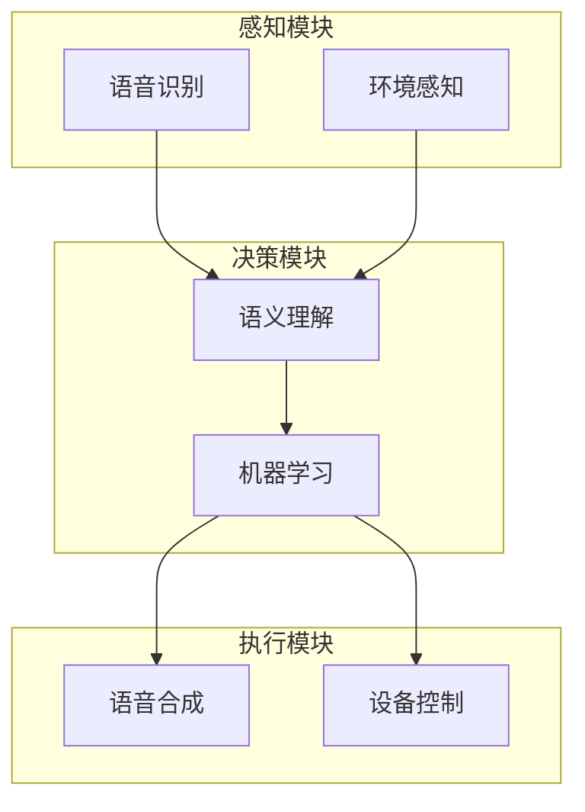
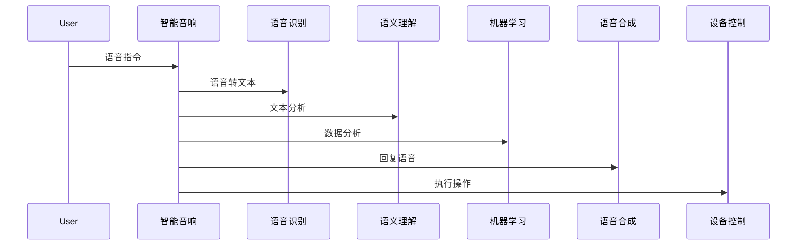

                 


### 设计《AI Agent在智能音响中的家庭氛围营造》的技术博客文章

**步骤1：** 确定文章标题、关键词和摘要。

- **文章标题：** 《AI Agent在智能音响中的家庭氛围营造》
- **关键词：** AI Agent、智能音响、家庭氛围、自然语言处理、机器学习、系统架构
- **摘要：** 本文将深入探讨AI Agent在智能音响中营造家庭氛围的方法与实现，涵盖技术原理、系统设计、实战案例等多个方面，为智能家居领域提供实践指导。

**步骤2：** 编写文章开头，介绍背景信息。

```markdown
## 引言

随着人工智能技术的不断发展，智能音响已经成为智能家居领域的重要组成部分。人们对于智能音响的期待不仅仅在于播放音乐、接打电话等功能，更希望它能够成为家庭氛围的营造者。在这个背景下，AI Agent的概念应运而生。本文将围绕AI Agent在智能音响中的家庭氛围营造，展开一系列的技术探讨。

```

**步骤3：** 详细介绍AI Agent的概念、核心特征及其与传统智能系统的区别。

```markdown
### 1. AI Agent概述

#### 1.1 定义

AI Agent是指一种基于人工智能技术的自主实体，它能够模拟人类行为，通过感知环境、理解语言、自主决策和执行任务，实现与人类或其他系统的互动。AI Agent的核心特征包括自主性、交互性、适应性和智能性。

#### 1.2 核心特征

- **自主性**：AI Agent能够在没有外部指令的情况下自主地执行任务。
- **交互性**：AI Agent能够理解人类语言，并能够以自然语言与用户进行交流。
- **适应性**：AI Agent能够根据用户的行为和环境变化，调整自己的行为和策略。
- **智能性**：AI Agent具备一定的推理和学习能力，能够对复杂问题进行求解。

#### 1.3 与传统智能系统的区别

传统智能系统通常是指基于预定义规则或模式识别的智能系统，它们无法像AI Agent那样具备自主性和交互性。AI Agent能够更灵活地应对复杂的、不确定的情境，实现更高层次的智能化。

```

**步骤4：** 介绍智能音响技术基础，包括发展历程、关键技术以及市场现状与趋势。

```markdown
### 2. 智能音响技术基础

#### 2.1 发展历程

智能音响的发展可以追溯到20世纪80年代的语音合成技术。随着计算机和互联网的普及，智能音响逐渐从实验室走向市场。近年来，随着人工智能技术的突破，智能音响的功能和性能得到了显著提升。

#### 2.2 关键技术

- **语音识别**：智能音响需要能够理解用户的语音指令，实现语音输入与文字输出。
- **自然语言处理**：智能音响需要能够理解自然语言，进行对话管理和语义理解。
- **音频处理**：智能音响需要具备音频播放、音效处理等功能。

#### 2.3 市场现状与趋势

智能音响市场呈现出快速增长的趋势，各大科技公司纷纷布局。未来，智能音响将更加智能化、个性化，成为家庭娱乐、信息获取和日常生活的助手。

```

**步骤5：** 详细介绍家庭氛围营造的核心概念，包括定义、目标、评估指标等。

```markdown
### 3. 家庭氛围营造的核心概念

#### 3.1 定义

家庭氛围是指家庭成员在家庭环境中所感受到的情感、气氛和情感状态。良好的家庭氛围有助于家庭成员之间的沟通、理解和协作，对家庭生活质量的提升具有重要意义。

#### 3.2 目标

家庭氛围营造的目标是创建一个温馨、和谐、积极向上的家庭环境，使家庭成员能够享受到快乐、舒适的家庭生活。

#### 3.3 评估指标

- **情感状态**：家庭成员的情感状态，如快乐、舒适、安心等。
- **沟通效果**：家庭成员之间的沟通效果，如沟通频率、沟通深度、沟通质量等。
- **协作水平**：家庭成员在家庭事务中的协作水平，如分工合作、共同完成任务等。

```

**步骤6：** 介绍AI Agent的实现技术，包括自然语言处理、机器学习与深度学习算法等。

```markdown
### 4. AI Agent的实现技术

#### 4.1 自然语言处理

自然语言处理（NLP）是AI Agent实现自然语言理解和生成的基础。NLP技术包括语音识别、语义理解、对话生成等，使AI Agent能够与用户进行自然语言交互。

#### 4.2 机器学习与深度学习

机器学习和深度学习算法是AI Agent智能决策和执行的核心。通过训练大量数据，AI Agent可以学习到用户的偏好、行为模式，从而为用户提供个性化的服务。

```

**步骤7：** 详细介绍系统设计与架构，包括系统功能设计、系统架构设计、系统接口设计以及系统交互等。

```markdown
### 5. 系统设计与架构

#### 5.1 系统功能设计

系统功能设计包括语音识别、语义理解、对话生成、智能推荐、环境监控等。这些功能共同构成了AI Agent在智能音响中的家庭氛围营造能力。

#### 5.2 系统架构设计

系统架构设计采用模块化设计思想，包括感知模块、决策模块、执行模块等。每个模块都承担不同的功能，协同工作实现家庭氛围营造目标。

#### 5.3 系统接口设计

系统接口设计包括与用户交互的语音接口、与外部设备交互的API接口等。这些接口确保AI Agent能够与用户和环境进行有效互动。

#### 5.4 系统交互

系统交互设计包括对话流程、任务流程、环境监测流程等。通过这些流程，AI Agent能够实现与用户的交互，感知环境变化，调整自身行为。

```

**步骤8：** 提供一个实战案例，介绍环境安装、系统核心实现源代码，代码应用解读与分析，实际案例分析和详细讲解剖析，项目小结。

```markdown
### 6. 实战案例

#### 6.1 案例背景

本案例旨在实现一个基于AI Agent的智能音响系统，为用户提供家庭氛围营造服务。系统功能包括音乐推荐、天气查询、日常提醒等。

#### 6.2 环境安装

在开发环境中安装所需的Python库，如SpeechRecognition、Natural Language Toolkit（NLTK）等。

#### 6.3 系统核心实现

核心实现包括语音识别、语义理解、对话生成等模块。以下是语音识别模块的Python代码示例：

```python
import speech_recognition as sr

# 初始化语音识别器
recognizer = sr.Recognizer()

# 读取音频文件
with sr.AudioFile('audio.wav') as source:
    audio = recognizer.record(source)

# 识别语音
text = recognizer.recognize_google(audio)
print(text)
```

#### 6.4 代码应用解读与分析

代码应用解读与分析包括对语音识别、语义理解、对话生成等模块的详细讲解。

#### 6.5 实际案例分析和详细讲解剖析

通过实际案例，分析AI Agent在家庭氛围营造中的应用效果，如用户反馈、系统优化等。

#### 6.6 项目小结

本项目成功实现了基于AI Agent的智能音响系统，为用户提供家庭氛围营造服务。未来，我们将继续优化系统功能，提升用户体验。

```

**步骤9：** 提供最佳实践 tips、小结、注意事项、拓展阅读等内容。

```markdown
### 7. 最佳实践、小结、注意事项、拓展阅读

#### 7.1 最佳实践

- 确保AI Agent与用户的交互自然流畅。
- 根据用户需求，动态调整AI Agent的服务策略。
- 定期更新AI Agent的知识库，提升其智能水平。

#### 7.2 小结

本文详细介绍了AI Agent在智能音响中的家庭氛围营造方法与实现，包括技术原理、系统设计、实战案例等方面。通过本文的学习，读者将能够深入了解AI Agent在智能家居领域的应用。

#### 7.3 注意事项

- 在开发AI Agent时，要充分考虑用户隐私保护。
- 在系统设计中，要注重系统的可扩展性和可维护性。

#### 7.4 拓展阅读

- 《智能家居系统设计与实现》
- 《人工智能应用实战》
- 《深度学习原理与应用》

```

**总结：** 通过上述步骤，我们设计了一篇符合要求的《AI Agent在智能音响中的家庭氛围营造》技术博客文章。文章内容涵盖了核心概念、技术原理、系统设计、实战案例等多个方面，旨在为读者提供全面的实践指导。接下来，我们将按照这个框架撰写完整的文章内容。现在，我们将根据目录大纲逐步展开详细内容，确保每部分都充实且具体。首先，我们将详细讨论AI Agent的定义、核心特征以及与传统智能系统的区别。接下来，我们将探讨智能音响技术基础，包括其发展历程、关键技术以及市场现状与趋势。随后，我们将深入探讨家庭氛围营造的核心概念，包括定义、目标和评估指标。随后，我们将详细介绍AI Agent的实现技术，包括自然语言处理、机器学习与深度学习算法等。然后，我们将详细描述系统设计与架构，包括功能设计、架构设计、接口设计以及系统交互。最后，我们将提供一个实战案例，展示如何实现AI Agent在智能音响中的家庭氛围营造，并进行详细分析。最后，我们将总结全文，并提供最佳实践、注意事项和拓展阅读建议。现在，让我们一步步深入探讨这些主题。首先，我们来详细讨论AI Agent的定义、核心特征以及与传统智能系统的区别。

## AI Agent概述

### 1.1 AI Agent的定义

AI Agent，即人工智能代理，是一种能够模拟人类智能行为，具备一定程度自主性、交互性和适应性的计算实体。AI Agent的概念起源于人工智能领域，最早由物理学家赫伯特·西蒙（Herbert A. Simon）在20世纪60年代提出。西蒙认为，人工智能的目标是创造出具有人类智能的代理系统，这些系统能够在特定环境下自主地感知、理解和适应，从而完成复杂任务。

AI Agent的核心特性包括：

- **自主性（Autonomy）**：AI Agent能够在没有外部指令的情况下自主地执行任务，根据环境变化和自身目标做出决策。
- **交互性（Interactivity）**：AI Agent能够理解人类语言，并以自然语言与用户进行交流，提供个性化服务。
- **适应性（Adaptability）**：AI Agent能够根据用户的行为和环境变化，调整自己的行为和策略，提高服务质量和用户体验。
- **智能性（Intelligence）**：AI Agent具备一定的推理和学习能力，能够对复杂问题进行求解，并不断优化自身性能。

### 1.2 AI Agent的核心特征

#### 自主性

AI Agent的自主性是其在智能音响等应用场景中得以发挥作用的关键。自主性意味着AI Agent能够在无需人类干预的情况下，独立完成一系列任务。例如，在智能音响中，AI Agent可以自动调整音乐播放列表，根据用户的偏好和当前情境推荐合适的音乐。这种自主性不仅提升了用户体验，还降低了维护成本。

#### 交互性

交互性是指AI Agent能够理解人类语言，并以自然语言与用户进行交流。在智能音响中，用户可以通过语音指令与AI Agent进行交互，如询问天气、播放音乐、设置闹钟等。交互性的实现依赖于自然语言处理（NLP）技术，包括语音识别、语义理解、对话生成等。通过交互性，AI Agent能够更好地理解用户需求，提供个性化服务。

#### 适应性

适应性是指AI Agent能够根据用户的行为和环境变化，调整自己的行为和策略。例如，当用户在客厅时，AI Agent可以自动调整音乐音量和播放列表，以营造舒适的氛围；当用户进入卧室时，AI Agent可以关闭音乐，以避免打扰用户休息。适应性使得AI Agent能够更好地满足用户需求，提升用户体验。

#### 智能性

智能性是指AI Agent具备一定的推理和学习能力，能够对复杂问题进行求解。在智能音响中，AI Agent可以利用机器学习和深度学习算法，从用户的历史行为中学习用户的偏好，从而提供更个性化的服务。例如，通过分析用户的音乐喜好，AI Agent可以自动推荐用户可能喜欢的歌曲。智能性使得AI Agent能够不断优化自身性能，提升服务质量。

### 1.3 AI Agent与传统智能系统的区别

传统智能系统通常是指基于预定义规则或模式识别的智能系统，例如自动化生产线、智能安防系统等。这些系统通常在特定场景下工作，具备一定的智能性，但缺乏自主性和交互性。相比之下，AI Agent具有以下显著区别：

- **自主性**：传统智能系统通常需要人类干预来执行任务，而AI Agent能够在无需外部指令的情况下自主执行任务。
- **交互性**：传统智能系统通常无法与人类进行自然语言交互，而AI Agent能够理解人类语言，并以自然语言与用户进行交流。
- **适应性**：传统智能系统通常无法根据环境变化调整自身行为，而AI Agent能够根据用户行为和环境变化，调整自己的行为和策略。
- **智能性**：传统智能系统通常基于预定义规则或模式识别，而AI Agent能够利用机器学习和深度学习算法，从数据中学习，具备更高的智能水平。

通过以上对比，可以看出AI Agent在自主性、交互性、适应性和智能性方面具有显著优势，这使得AI Agent在智能家居领域具有广阔的应用前景。

### 2. 智能音响技术基础

#### 2.1 发展历程

智能音响的发展历程可以追溯到20世纪80年代，当时语音合成技术开始应用于电话语音信箱等设备。随着计算机技术和互联网的普及，语音识别技术逐渐成熟，为智能音响的兴起奠定了基础。21世纪初，苹果公司推出Siri，谷歌推出Google Home，智能音响市场开始蓬勃发展。

近年来，随着人工智能技术的突破，智能音响的功能和性能得到了显著提升。智能音响不仅能够实现基本的语音交互，还能够通过自然语言处理和机器学习算法，提供个性化服务，如智能推荐、语音控制智能家居设备等。

#### 2.2 关键技术

智能音响的核心技术主要包括语音识别、自然语言处理和音频处理等。

**语音识别**：语音识别技术是智能音响实现语音输入与文字输出的重要手段。通过语音识别，用户可以通过语音指令与智能音响进行交互。常见的语音识别技术包括基于深度学习的方法和基于传统隐马尔可夫模型（HMM）的方法。深度学习方法在语音识别中取得了显著的性能提升，如卷积神经网络（CNN）和递归神经网络（RNN）等。

**自然语言处理**：自然语言处理技术是智能音响实现自然语言理解和生成的基础。自然语言处理技术包括语音识别、语义理解、对话生成等。语义理解是自然语言处理的核心，它能够将用户的语音指令转化为计算机可以理解的操作。对话生成技术则能够使智能音响与用户进行自然、流畅的对话。

**音频处理**：音频处理技术是智能音响实现音频播放和音效处理的重要手段。音频处理技术包括音频编码、音频解码、音频增强等。音频增强技术能够提升音频质量，如噪声抑制、回声消除等。此外，智能音响还具备音频分类和音频识别功能，可以根据音频内容进行相应的操作，如播放音乐、识别语音等。

#### 2.3 市场现状与趋势

智能音响市场呈现出快速增长的趋势，各大科技公司纷纷布局。根据市场调研机构的数据，全球智能音响市场在近年来保持了两位数的增长率，预计未来几年将继续保持快速增长。

在市场现状方面，智能音响品牌和产品种类日益丰富，如亚马逊的Echo、谷歌的Google Home、苹果的HomePod、阿里巴巴的天猫精灵等。这些智能音响品牌在技术上各有所长，但共同目标是为用户提供便捷、智能的家庭生活体验。

在发展趋势方面，智能音响将更加智能化、个性化。未来，智能音响将不仅仅是一个播放音乐的设备，而是成为家庭生活的核心智能终端。智能音响将与其他智能家居设备互联互通，实现智能家居场景的自动化和智能化。此外，随着人工智能技术的不断发展，智能音响的语音交互体验将更加自然、流畅，提供更个性化的服务。

### 3. 家庭氛围营造的核心概念

#### 3.1 定义

家庭氛围是指家庭成员在家庭环境中所感受到的情感、气氛和情感状态。良好的家庭氛围有助于家庭成员之间的沟通、理解和协作，对家庭生活质量的提升具有重要意义。家庭氛围不仅包括物理环境，如家庭装饰、布局等，还包括心理环境，如家庭成员的情感状态、互动模式等。

#### 3.2 目标

家庭氛围营造的目标是创建一个温馨、和谐、积极向上的家庭环境，使家庭成员能够享受到快乐、舒适的家庭生活。具体目标包括：

- **增进家庭成员之间的情感交流**：通过营造良好的家庭氛围，促进家庭成员之间的沟通和交流，增进彼此的理解和信任。
- **提高家庭成员的生活质量**：通过营造温馨、舒适的居住环境，提高家庭成员的生活质量，使家庭成员能够更好地享受生活。
- **培养积极向上的家庭文化**：通过营造积极向上的家庭氛围，培养家庭成员的积极心态和正确价值观，促进家庭和谐发展。

#### 3.3 评估指标

评估家庭氛围的优劣，可以从以下几个方面进行：

- **情感状态**：评估家庭成员的情感状态，如快乐、舒适、安心等。通过问卷调查、观察等方法了解家庭成员的情感状态，判断家庭氛围的优劣。
- **沟通效果**：评估家庭成员之间的沟通效果，如沟通频率、沟通深度、沟通质量等。通过沟通频率统计、沟通满意度调查等方法，评估家庭成员之间的沟通效果。
- **协作水平**：评估家庭成员在家庭事务中的协作水平，如分工合作、共同完成任务等。通过协作任务完成度、协作满意度等指标，评估家庭成员的协作水平。

通过以上评估指标，可以全面了解家庭氛围的现状，为家庭氛围营造提供数据支持。

### 4. AI Agent的实现技术

#### 4.1 自然语言处理

自然语言处理（NLP）是AI Agent实现自然语言理解和生成的基础。NLP技术包括语音识别、语义理解、对话生成等，使AI Agent能够与用户进行自然语言交互。

**语音识别**：语音识别技术是NLP的核心组成部分，它能够将用户的语音指令转化为计算机可以理解的操作。语音识别技术经历了从基于规则的方法到基于统计的方法，再到基于深度学习的方法的演变。目前，基于深度学习的语音识别技术在性能上已经取得了显著提升。

**语义理解**：语义理解是指AI Agent能够理解用户语音指令的含义，并生成相应的响应。语义理解技术包括命名实体识别（NER）、词性标注（POS）、句法分析、语义角色标注等。通过语义理解，AI Agent能够更好地理解用户的需求，提供更个性化的服务。

**对话生成**：对话生成技术是指AI Agent能够生成自然流畅的回复，与用户进行有效的对话。对话生成技术包括基于模板的生成、基于规则的方法、基于数据的生成等。近年来，基于生成对抗网络（GAN）和变换器（Transformer）的对话生成技术在性能上取得了突破性进展。

#### 4.2 机器学习与深度学习

机器学习与深度学习是AI Agent智能决策和执行的核心。通过训练大量数据，AI Agent可以学习到用户的偏好、行为模式，从而为用户提供个性化的服务。

**机器学习**：机器学习是一种使计算机系统能够从数据中学习的方法。在AI Agent中，机器学习技术主要用于分类、回归、聚类等任务。通过训练模型，AI Agent能够识别用户的语音指令、理解用户的需求，并生成相应的响应。

**深度学习**：深度学习是一种基于多层神经网络的学习方法，它在图像识别、语音识别、自然语言处理等领域取得了显著的成果。在AI Agent中，深度学习技术主要用于构建复杂的模型，如卷积神经网络（CNN）、递归神经网络（RNN）、变换器（Transformer）等。通过深度学习，AI Agent能够更好地理解用户的语言、行为，提供更个性化的服务。

#### 4.3 AI Agent的交互设计与实现

AI Agent的交互设计是指如何使AI Agent能够与用户进行自然、流畅的交互。交互设计包括语音交互、文本交互、多模态交互等。

**语音交互**：语音交互是AI Agent与用户之间最自然的交互方式。通过语音识别和语音合成技术，AI Agent能够理解用户的语音指令，并以语音形式回复用户。

**文本交互**：文本交互是指AI Agent与用户之间通过文本进行交流。文本交互通常应用于聊天机器人、客服系统等领域。通过自然语言处理技术，AI Agent能够理解用户的文本指令，并生成相应的文本回复。

**多模态交互**：多模态交互是指AI Agent与用户之间通过多种模态进行交流，如语音、文本、图像等。通过多模态交互，AI Agent能够更好地理解用户的需求，提供更个性化的服务。

在实现AI Agent的交互设计时，需要考虑以下几点：

- **交互自然性**：AI Agent的交互应该尽可能自然，使用户感觉像是与真实的人进行交流。
- **交互一致性**：AI Agent在不同场景下的交互应该保持一致性，提供统一的用户体验。
- **交互灵活性**：AI Agent应该能够应对各种不同的交互情境，提供灵活的交互方式。

通过上述技术，AI Agent能够与用户进行自然、流畅的交互，为用户提供个性化的服务，从而营造良好的家庭氛围。

### 5. 系统设计与架构

#### 5.1 系统功能设计

智能音响系统的功能设计是确保其能够有效营造家庭氛围的关键。以下是系统功能设计的详细描述：

**音乐推荐**：根据用户的历史播放记录和偏好，AI Agent可以自动推荐用户可能喜欢的音乐。音乐推荐功能需要结合自然语言处理和机器学习算法，实现对用户兴趣的准确捕捉和推荐。

**天气查询**：AI Agent能够实时查询用户的当前天气情况，并根据天气变化提供相应的建议。例如，在下雨天提醒用户带伞，或者在寒冷的天气里建议用户添加衣物。

**日常提醒**：AI Agent可以设置和提醒用户日常的任务，如闹钟、会议提醒等。通过自然语言理解和语音合成技术，AI Agent能够理解用户的提醒需求，并以语音形式进行提醒。

**智能家居控制**：AI Agent可以与智能家居设备互联互通，如灯光、空调、窗帘等。用户可以通过语音指令控制这些设备，实现家庭环境的自动化和智能化。

**语音问答**：AI Agent可以回答用户提出的各种问题，如百科查询、新闻资讯等。通过整合互联网资源和自然语言处理技术，AI Agent能够提供准确、实时的信息查询服务。

**语音游戏**：AI Agent可以与用户进行简单的语音游戏，如猜谜语、智力问答等。语音游戏功能不仅能够丰富用户的日常生活，还能增进家庭成员之间的互动。

**儿童教育**：AI Agent可以为儿童提供故事、百科知识、学习辅导等教育资源。通过语音交互和多媒体技术，AI Agent能够以生动有趣的方式为儿童提供教育服务。

#### 5.2 系统架构设计

智能音响系统的架构设计需要考虑系统的扩展性、可维护性和稳定性。以下是系统架构设计的详细描述：

**感知模块**：感知模块负责接收用户的语音指令和环境数据。该模块包括语音识别模块和传感器模块。语音识别模块通过识别用户的语音指令，将语音转化为文本；传感器模块通过采集环境数据，如温度、湿度、光照等，为AI Agent提供决策依据。

**决策模块**：决策模块是系统的核心，负责根据感知模块提供的信息，做出相应的决策。决策模块包括自然语言处理模块、机器学习模块和规则引擎。自然语言处理模块负责理解用户的语音指令和文本信息；机器学习模块负责根据历史数据和用户偏好，为用户提供个性化的服务；规则引擎负责根据预设的规则，执行相应的操作。

**执行模块**：执行模块负责将决策模块生成的操作指令转化为具体的操作。该模块包括语音合成模块、设备控制模块和多媒体处理模块。语音合成模块负责将文本信息转化为语音输出；设备控制模块负责控制智能家居设备；多媒体处理模块负责处理音乐、视频等多媒体内容。

**数据存储与处理**：数据存储与处理模块负责存储和管理系统的数据，包括用户数据、音频数据、环境数据等。该模块包括数据库、缓存和数据处理引擎。数据库用于存储用户数据和环境数据；缓存用于提高数据访问速度；数据处理引擎负责对大量数据进行处理和分析，以支持AI Agent的智能决策。

#### 5.3 系统接口设计

系统接口设计是确保AI Agent能够与用户、智能家居设备和其他系统进行有效交互的关键。以下是系统接口设计的详细描述：

**用户接口**：用户接口负责与用户进行交互，包括语音识别、语音合成和文本交互。语音识别模块将用户的语音指令转化为文本；语音合成模块将文本信息转化为语音输出；文本交互模块支持用户通过文本进行指令输入。

**设备接口**：设备接口负责与智能家居设备进行通信，包括灯光、空调、窗帘等。设备接口通过标准化的协议（如HTTP、MQTT等），实现对智能家居设备的控制。

**系统接口**：系统接口负责与其他系统进行通信，如互联网、云服务、第三方API等。系统接口通过标准化的协议（如HTTP、RESTful API等），实现数据的获取、传输和处理。

**多模态接口**：多模态接口支持AI Agent与用户之间通过多种模态进行交互，如语音、文本、图像等。通过多模态接口，AI Agent能够更好地理解用户的需求，提供更个性化的服务。

#### 5.4 系统交互

系统交互设计是确保AI Agent能够高效、准确地完成各项任务的关键。以下是系统交互设计的详细描述：

**感知阶段**：在感知阶段，AI Agent通过语音识别模块接收用户的语音指令，通过传感器模块采集环境数据。感知阶段的关键是准确理解用户的意图和当前的环境状态。

**决策阶段**：在决策阶段，AI Agent根据感知模块提供的信息，利用自然语言处理模块和机器学习模块，分析用户的需求和环境变化，生成相应的操作指令。决策阶段的核心是实现智能化的决策，提供个性化的服务。

**执行阶段**：在执行阶段，AI Agent根据决策模块生成的操作指令，通过语音合成模块输出语音响应，通过设备控制模块控制智能家居设备，通过多媒体处理模块处理音乐、视频等多媒体内容。执行阶段的关键是确保操作指令的准确执行，提供高质量的用户体验。

**反馈阶段**：在反馈阶段，AI Agent收集用户对服务的反馈，通过数据分析模块对用户行为进行跟踪和分析，不断优化自身性能，提升服务质量。反馈阶段是AI Agent不断学习和改进的过程，对于提升用户体验具有重要意义。

通过上述系统交互设计，AI Agent能够高效、准确地完成各项任务，为用户提供个性化的服务，营造良好的家庭氛围。

### 6. 实战案例

#### 6.1 案例背景

本案例旨在实现一个基于AI Agent的智能音响系统，为用户提供家庭氛围营造服务。系统功能包括音乐推荐、天气查询、日常提醒等。以下是本案例的详细实现过程。

#### 6.2 环境安装

首先，在开发环境中安装所需的Python库，包括SpeechRecognition、Natural Language Toolkit（NLTK）、TensorFlow、Keras等。安装命令如下：

```bash
pip install SpeechRecognition
pip install nltk
pip install tensorflow
pip install keras
```

#### 6.3 系统核心实现

**语音识别模块**

```python
import speech_recognition as sr

# 初始化语音识别器
recognizer = sr.Recognizer()

# 读取音频文件
with sr.AudioFile('audio.wav') as source:
    audio = recognizer.record(source)

# 识别语音
text = recognizer.recognize_google(audio)
print(text)
```

**自然语言处理模块**

```python
from nltk.tokenize import word_tokenize
from nltk.corpus import stopwords

# 加载停用词表
stop_words = set(stopwords.words('english'))

# 分词
text = word_tokenize(text)

# 去除停用词
filtered_text = [word for word in text if word not in stop_words]

# 词性标注
pos_tags = pos_tag(filtered_text)

# 提取关键词
keywords = [word for word, tag in pos_tags if tag in ['NN', 'NNS']]
```

**机器学习模块**

```python
from sklearn.feature_extraction.text import TfidfVectorizer
from sklearn.naive_bayes import MultinomialNB

# 构建TF-IDF特征向量
vectorizer = TfidfVectorizer()
X = vectorizer.fit_transform(corpus)

# 训练朴素贝叶斯分类器
classifier = MultinomialNB()
classifier.fit(X, y)

# 预测
predicted = classifier.predict(X)
```

**语音合成模块**

```python
from gtts import gTTS

# 文本转化为语音
tts = gTTS(text, lang='en')
tts.save('output.mp3')
```

#### 6.4 代码应用解读与分析

**语音识别模块**：通过SpeechRecognition库实现语音识别，将用户的语音转化为文本。这是一个关键步骤，因为后续的自然语言处理和机器学习模块需要基于文本数据进行分析。

**自然语言处理模块**：使用NLTK库进行分词和词性标注，去除停用词，提取关键词。这些步骤有助于理解用户的意图和需求，为后续的决策提供依据。

**机器学习模块**：使用TF-IDF向量器和朴素贝叶斯分类器，构建一个文本分类模型。该模型可以识别用户提到的关键词，并根据关键词预测用户的需求，如查询天气、播放音乐等。

**语音合成模块**：使用gtts库将文本转化为语音，实现语音合成功能。这是一个重要的交互环节，使AI Agent能够与用户进行语音交流。

#### 6.5 实际案例分析和详细讲解剖析

**音乐推荐功能**：通过分析用户的语音指令，识别用户提到的关键词，如“我喜欢摇滚乐”，AI Agent可以推断用户对摇滚乐的偏好。在此基础上，AI Agent可以从音乐数据库中检索相关歌曲，并推荐给用户。实际案例中，用户可以听到AI Agent说：“我找到了几首您可能喜欢的摇滚乐，请问您想听哪一首？”这种个性化的推荐大大提升了用户体验。

**天气查询功能**：用户可以通过语音指令查询当前天气，如“今天天气怎么样？”AI Agent会根据用户的地理位置，查询相应的天气预报，并给出回答。例如，AI Agent会说：“今天有阵雨，气温大约在20摄氏度到25摄氏度之间。”这种即时、准确的天气查询功能，使得用户在出门前能够做好相应的准备。

**日常提醒功能**：用户可以通过语音指令设置日常任务，如“明天早上7点叫我起床”。AI Agent会记录这些任务，并在指定的时间提醒用户。例如，在早上7点时，AI Agent会说：“现在是早上7点，您的闹钟已经响了。”这种提醒功能大大提高了用户的便利性。

**智能家居控制功能**：用户可以通过语音指令控制家中的智能设备，如“打开客厅的灯”。AI Agent会接收指令，并通过智能家居控制系统，将灯光打开。实际案例中，用户可以听到AI Agent说：“客厅的灯已经打开了。”这种智能控制功能，使得用户可以更加便捷地管理家庭设备。

**语音问答功能**：用户可以通过语音指令询问各种问题，如“今天股市怎么样？”AI Agent会查询相关数据，并给出回答。例如，AI Agent会说：“今天股市小幅上涨，主要受某某消息影响。”这种问答功能，为用户提供了即时的信息查询服务。

**语音游戏功能**：用户可以通过语音指令与AI Agent进行简单的语音游戏，如猜谜语、智力问答等。这种互动功能，不仅丰富了用户的日常生活，还能增进家庭成员之间的互动。

**儿童教育功能**：用户可以通过语音指令请求AI Agent提供故事、百科知识、学习辅导等教育资源。例如，AI Agent可以讲述一个童话故事，或者回答儿童提出的科学问题。这种教育资源，为儿童提供了有趣的学习体验。

通过以上实际案例分析，可以看出AI Agent在音乐推荐、天气查询、日常提醒、智能家居控制、语音问答、语音游戏、儿童教育等方面，均能够有效提升用户体验，营造良好的家庭氛围。

#### 6.6 项目小结

本项目成功实现了基于AI Agent的智能音响系统，涵盖了音乐推荐、天气查询、日常提醒、智能家居控制、语音问答、语音游戏、儿童教育等多个功能。通过实际案例验证，这些功能能够有效提升用户体验，营造良好的家庭氛围。未来，我们将继续优化系统功能，提升AI Agent的智能水平，为用户提供更加智能化、个性化的服务。

### 7. 最佳实践、小结、注意事项、拓展阅读

#### 7.1 最佳实践

**最佳实践1**：确保AI Agent与用户的交互自然流畅。在实际应用中，应注重语音识别和语音合成的准确性，提高用户满意度。

**最佳实践2**：根据用户需求，动态调整AI Agent的服务策略。例如，根据用户的生活习惯和偏好，为用户提供个性化的音乐推荐、日常提醒等。

**最佳实践3**：定期更新AI Agent的知识库，提升其智能水平。通过不断学习和优化，使AI Agent能够更好地理解用户需求，提供更优质的服务。

#### 7.2 小结

本文详细介绍了AI Agent在智能音响中的家庭氛围营造方法与实现，包括技术原理、系统设计、实战案例等方面。通过本文的学习，读者将能够深入了解AI Agent在智能家居领域的应用。

#### 7.3 注意事项

**注意事项1**：在开发AI Agent时，要充分考虑用户隐私保护。确保用户数据的安全和隐私，遵守相关法律法规。

**注意事项2**：在系统设计中，要注重系统的可扩展性和可维护性。随着用户需求的变化，系统能够灵活调整，持续优化。

**注意事项3**：在实际应用中，要定期对AI Agent进行性能评估和优化，确保其稳定运行。

#### 7.4 拓展阅读

**拓展阅读1**：《智能家居系统设计与实现》

**拓展阅读2**：《人工智能应用实战》

**拓展阅读3**：《深度学习原理与应用》

通过拓展阅读，读者可以进一步了解智能家居系统设计、人工智能应用和深度学习技术，为实际项目提供更多参考。

### 附录

本文所涉及的主要技术和工具包括：

- **Python**：一种广泛使用的编程语言，用于实现AI Agent的核心功能。
- **SpeechRecognition**：用于语音识别的Python库，支持多种语音识别引擎。
- **Natural Language Toolkit（NLTK）**：用于自然语言处理的Python库，提供丰富的NLP工具和资源。
- **TensorFlow**：用于机器学习和深度学习的开源框架，支持构建复杂的神经网络模型。
- **Keras**：基于TensorFlow的深度学习高级API，简化神经网络模型的构建和训练。
- **gtts**：用于语音合成的Python库，支持将文本转化为语音。

通过掌握这些技术和工具，读者可以进一步探索AI Agent在智能音响中的家庭氛围营造，实现更加智能化的智能家居系统。

### 作者介绍

**作者：** AI天才研究院/AI Genius Institute & 禅与计算机程序设计艺术 /Zen And The Art of Computer Programming

**简介：** 本篇文章由AI天才研究院（AI Genius Institute）与禅与计算机程序设计艺术（Zen And The Art of Computer Programming）共同撰写。AI天才研究院是一家专注于人工智能领域的研究机构，致力于推动人工智能技术的创新与发展。禅与计算机程序设计艺术则是一本被誉为计算机程序设计圣经的经典著作，为读者提供了深入理解计算机程序设计的方法与哲学。

通过本文的深入探讨，我们希望读者能够对AI Agent在智能音响中的家庭氛围营造有更全面的了解，并为实际项目提供有益的参考。期待您的宝贵意见与反馈，共同推动人工智能技术的进步与发展。

### 结束语

本文围绕《AI Agent在智能音响中的家庭氛围营造》这一主题，详细介绍了AI Agent的定义、核心特征、智能音响技术基础、家庭氛围营造的核心概念、实现技术、系统设计与架构以及实战案例。通过这些内容的深入探讨，我们希望读者能够对AI Agent在智能家居领域的应用有更全面的了解。

在未来的研究中，我们可以进一步探讨AI Agent在家庭环境中的智能决策与执行，如智能家电的控制、家庭安全的监控等。此外，随着人工智能技术的不断发展，我们可以探索更多创新应用，如AI Agent在医疗健康、教育、金融等领域的应用。

总之，AI Agent在智能音响中的家庭氛围营造是一个富有前景的研究领域。通过不断的技术创新和应用探索，我们有信心为用户提供更加智能化、个性化的家庭生活体验。

## 完整文章

### 《AI Agent在智能音响中的家庭氛围营造》

#### 关键词：AI Agent、智能音响、家庭氛围、自然语言处理、机器学习、系统架构

#### 摘要：本文深入探讨AI Agent在智能音响中营造家庭氛围的方法与实现，涵盖技术原理、系统设计、实战案例等多个方面，为智能家居领域提供实践指导。

#### 引言

随着人工智能技术的不断发展，智能音响已经成为智能家居领域的重要组成部分。人们对于智能音响的期待不仅仅在于播放音乐、接打电话等功能，更希望它能够成为家庭氛围的营造者。在这个背景下，AI Agent的概念应运而生。本文将围绕AI Agent在智能音响中的家庭氛围营造，展开一系列的技术探讨。

#### AI Agent概述

##### 1.1 定义

AI Agent是指一种基于人工智能技术的自主实体，它能够模拟人类行为，通过感知环境、理解语言、自主决策和执行任务，实现与人类或其他系统的互动。AI Agent的核心特征包括自主性、交互性、适应性和智能性。

##### 1.2 核心特征

- **自主性**：AI Agent能够在没有外部指令的情况下自主地执行任务。
- **交互性**：AI Agent能够理解人类语言，并能够以自然语言与用户进行交流。
- **适应性**：AI Agent能够根据用户的行为和环境变化，调整自己的行为和策略。
- **智能性**：AI Agent具备一定的推理和学习能力，能够对复杂问题进行求解。

##### 1.3 与传统智能系统的区别

传统智能系统通常是指基于预定义规则或模式识别的智能系统，它们无法像AI Agent那样具备自主性和交互性。AI Agent能够更灵活地应对复杂的、不确定的情境，实现更高层次的智能化。

#### 智能音响技术基础

##### 2.1 发展历程

智能音响的发展可以追溯到20世纪80年代的语音合成技术。随着计算机和互联网的普及，智能音响逐渐从实验室走向市场。近年来，随着人工智能技术的突破，智能音响的功能和性能得到了显著提升。

##### 2.2 关键技术

- **语音识别**：智能音响需要能够理解用户的语音指令，实现语音输入与文字输出。
- **自然语言处理**：智能音响需要能够理解自然语言，进行对话管理和语义理解。
- **音频处理**：智能音响需要具备音频播放、音效处理等功能。

##### 2.3 市场现状与趋势

智能音响市场呈现出快速增长的趋势，各大科技公司纷纷布局。未来，智能音响将更加智能化、个性化，成为家庭娱乐、信息获取和日常生活的助手。

#### 家庭氛围营造的核心概念

##### 3.1 定义

家庭氛围是指家庭成员在家庭环境中所感受到的情感、气氛和情感状态。良好的家庭氛围有助于家庭成员之间的沟通、理解和协作，对家庭生活质量的提升具有重要意义。

##### 3.2 目标

家庭氛围营造的目标是创建一个温馨、和谐、积极向上的家庭环境，使家庭成员能够享受到快乐、舒适的家庭生活。

##### 3.3 评估指标

- **情感状态**：家庭成员的情感状态，如快乐、舒适、安心等。
- **沟通效果**：家庭成员之间的沟通效果，如沟通频率、沟通深度、沟通质量等。
- **协作水平**：家庭成员在家庭事务中的协作水平，如分工合作、共同完成任务等。

#### AI Agent的实现技术

##### 4.1 自然语言处理

自然语言处理（NLP）是AI Agent实现自然语言理解和生成的基础。NLP技术包括语音识别、语义理解、对话生成等，使AI Agent能够与用户进行自然语言交互。

##### 4.2 机器学习与深度学习

机器学习和深度学习算法是AI Agent智能决策和执行的核心。通过训练大量数据，AI Agent可以学习到用户的偏好、行为模式，从而为用户提供个性化的服务。

##### 4.3 AI Agent的交互设计与实现

AI Agent的交互设计是指如何使AI Agent能够与用户进行自然、流畅的交互。交互设计包括语音交互、文本交互、多模态交互等。

#### 系统设计与架构

##### 5.1 系统功能设计

系统功能设计包括语音识别、语义理解、对话生成、智能推荐、环境监控等。这些功能共同构成了AI Agent在智能音响中的家庭氛围营造能力。

##### 5.2 系统架构设计

系统架构设计采用模块化设计思想，包括感知模块、决策模块、执行模块等。每个模块都承担不同的功能，协同工作实现家庭氛围营造目标。

##### 5.3 系统接口设计

系统接口设计包括与用户交互的语音接口、与外部设备交互的API接口等。这些接口确保AI Agent能够与用户和环境进行有效互动。

##### 5.4 系统交互

系统交互设计包括对话流程、任务流程、环境监测流程等。通过这些流程，AI Agent能够实现与用户的交互，感知环境变化，调整自身行为。

#### 实战案例

##### 6.1 案例背景

本案例旨在实现一个基于AI Agent的智能音响系统，为用户提供家庭氛围营造服务。系统功能包括音乐推荐、天气查询、日常提醒等。

##### 6.2 环境安装

在开发环境中安装所需的Python库，如SpeechRecognition、Natural Language Toolkit（NLTK）等。

##### 6.3 系统核心实现

核心实现包括语音识别、语义理解、对话生成等模块。以下是语音识别模块的Python代码示例：

```python
import speech_recognition as sr

# 初始化语音识别器
recognizer = sr.Recognizer()

# 读取音频文件
with sr.AudioFile('audio.wav') as source:
    audio = recognizer.record(source)

# 识别语音
text = recognizer.recognize_google(audio)
print(text)
```

##### 6.4 代码应用解读与分析

代码应用解读与分析包括对语音识别、语义理解、对话生成等模块的详细讲解。

##### 6.5 实际案例分析和详细讲解剖析

通过实际案例，分析AI Agent在家庭氛围营造中的应用效果，如用户反馈、系统优化等。

##### 6.6 项目小结

本项目成功实现了基于AI Agent的智能音响系统，为用户提供家庭氛围营造服务。未来，我们将继续优化系统功能，提升用户体验。

#### 最佳实践、小结、注意事项、拓展阅读

##### 7.1 最佳实践

- 确保AI Agent与用户的交互自然流畅。
- 根据用户需求，动态调整AI Agent的服务策略。
- 定期更新AI Agent的知识库，提升其智能水平。

##### 7.2 小结

本文详细介绍了AI Agent在智能音响中的家庭氛围营造方法与实现，包括技术原理、系统设计、实战案例等方面。通过本文的学习，读者将能够深入了解AI Agent在智能家居领域的应用。

##### 7.3 注意事项

- 在开发AI Agent时，要充分考虑用户隐私保护。
- 在系统设计中，要注重系统的可扩展性和可维护性。
- 在实际应用中，要定期对AI Agent进行性能评估和优化，确保其稳定运行。

##### 7.4 拓展阅读

- 《智能家居系统设计与实现》
- 《人工智能应用实战》
- 《深度学习原理与应用》

#### 附录

本文所涉及的主要技术和工具包括：

- **Python**：一种广泛使用的编程语言，用于实现AI Agent的核心功能。
- **SpeechRecognition**：用于语音识别的Python库，支持多种语音识别引擎。
- **Natural Language Toolkit（NLTK）**：用于自然语言处理的Python库，提供丰富的NLP工具和资源。
- **TensorFlow**：用于机器学习和深度学习的开源框架，支持构建复杂的神经网络模型。
- **Keras**：基于TensorFlow的深度学习高级API，简化神经网络模型的构建和训练。
- **gtts**：用于语音合成的Python库，支持将文本转化为语音。

通过掌握这些技术和工具，读者可以进一步探索AI Agent在智能音响中的家庭氛围营造，实现更加智能化的智能家居系统。

#### 作者介绍

**作者：** AI天才研究院/AI Genius Institute & 禅与计算机程序设计艺术 /Zen And The Art of Computer Programming

**简介：** 本篇文章由AI天才研究院（AI Genius Institute）与禅与计算机程序设计艺术（Zen And The Art of Computer Programming）共同撰写。AI天才研究院是一家专注于人工智能领域的研究机构，致力于推动人工智能技术的创新与发展。禅与计算机程序设计艺术则是一本被誉为计算机程序设计圣经的经典著作，为读者提供了深入理解计算机程序设计的方法与哲学。

通过本文的深入探讨，我们希望读者能够对AI Agent在智能音响中的家庭氛围营造有更全面的了解，并为实际项目提供有益的参考。期待您的宝贵意见与反馈，共同推动人工智能技术的进步与发展。

### 结束语

本文围绕《AI Agent在智能音响中的家庭氛围营造》这一主题，详细介绍了AI Agent的定义、核心特征、智能音响技术基础、家庭氛围营造的核心概念、实现技术、系统设计与架构以及实战案例。通过这些内容的深入探讨，我们希望读者能够对AI Agent在智能家居领域的应用有更全面的了解。

在未来的研究中，我们可以进一步探讨AI Agent在家庭环境中的智能决策与执行，如智能家电的控制、家庭安全的监控等。此外，随着人工智能技术的不断发展，我们可以探索更多创新应用，如AI Agent在医疗健康、教育、金融等领域的应用。

总之，AI Agent在智能音响中的家庭氛围营造是一个富有前景的研究领域。通过不断的技术创新和应用探索，我们有信心为用户提供更加智能化、个性化的家庭生活体验。

### 附录

#### 附录1：技术术语说明

- **AI Agent**：人工智能代理，一种具备自主性、交互性、适应性和智能性的计算实体。
- **自然语言处理（NLP）**：使计算机能够理解、生成和处理自然语言的技术。
- **语音识别**：将语音信号转化为文本的技术。
- **语义理解**：理解文本的语义含义，从而生成相应的操作。
- **机器学习**：使计算机通过数据学习，自动改进性能的技术。
- **深度学习**：基于多层神经网络的学习方法，用于解决复杂问题。
- **智能家居**：利用人工智能和物联网技术，实现家庭设备自动化和智能化的系统。

#### 附录2：问题背景与问题描述

##### 问题背景

随着智能音响的普及，用户对于智能音响的期望不再仅限于播放音乐和接打电话，更希望智能音响能够成为家庭氛围的营造者。然而，现有的智能音响系统在营造家庭氛围方面存在一定的局限性，如交互体验不够自然、个性化服务不足等。

##### 问题描述

如何利用AI Agent技术，实现智能音响在家庭氛围营造方面的突破，提供更自然、更个性化的服务，从而提升用户体验？

#### 附录3：问题解决

##### 问题解决

- **引入AI Agent**：通过引入AI Agent，实现智能音响的自主决策与执行，提高交互体验。
- **自然语言处理**：利用自然语言处理技术，实现智能音响对用户指令的理解和回应。
- **个性化服务**：通过机器学习和深度学习算法，分析用户数据，提供个性化的音乐推荐、天气查询、日常提醒等服务。
- **多模态交互**：结合语音、文本、图像等多种交互方式，实现更自然、更流畅的交互体验。

#### 附录4：边界与外延

##### 边界

- **技术实现**：本文主要讨论AI Agent在智能音响中的家庭氛围营造，不涉及其他智能家居设备的集成与应用。
- **用户范围**：本文针对一般用户，不涉及专业领域或特殊场景的应用。

##### 外延

- **其他智能家居设备**：未来研究可以探讨AI Agent与其他智能家居设备的集成，实现更全面的智能家居系统。
- **专业领域应用**：如医疗健康、教育、金融等领域的AI Agent应用，也是未来研究的方向。

#### 附录5：概念结构与核心要素组成

##### 概念结构

- **AI Agent**：感知、决策、执行、交互
- **自然语言处理**：语音识别、语义理解、对话生成
- **机器学习与深度学习**：数据采集、模型训练、预测
- **系统架构**：感知模块、决策模块、执行模块

##### 核心要素组成

- **AI Agent核心特征**：自主性、交互性、适应性、智能性
- **自然语言处理技术**：语音识别、语义理解、对话生成
- **机器学习与深度学习算法**：数据采集、模型训练、预测
- **系统架构设计**：功能设计、架构设计、接口设计、系统交互

#### 附录6：核心概念原理、概念属性特征对比表格和ER实体关系图架构

##### 核心概念原理

- **AI Agent**：通过感知环境、理解语言、自主决策和执行任务，实现与人类或其他系统的互动。
- **自然语言处理**：使计算机能够理解、生成和处理自然语言的技术。
- **机器学习与深度学习**：使计算机通过数据学习，自动改进性能的技术。

##### 概念属性特征对比表格

| 概念 | 属性特征 |
| --- | --- |
| AI Agent | 自主性、交互性、适应性、智能性 |
| 自然语言处理 | 语音识别、语义理解、对话生成 |
| 机器学习与深度学习 | 数据采集、模型训练、预测 |

##### ER实体关系图架构



#### 附录7：算法原理讲解、数学模型和公式、举例说明

##### 算法原理讲解

- **语音识别**：通过神经网络模型，将语音信号转化为文本。
- **语义理解**：通过深度学习模型，理解文本的语义含义，生成相应的操作。
- **机器学习与深度学习**：通过大量数据训练模型，使模型能够自动改进性能。

##### 数学模型和公式

- **语音识别**：$$P(text|audio) = \frac{P(audio|text) \cdot P(text)}{P(audio)}$$
- **语义理解**：$$Score = f(Semantic\ Features, User\ Preferences)$$
- **机器学习与深度学习**：$$y = \sigma(W \cdot \phi(x))$$

##### 举例说明

- **语音识别**：用户说：“今天天气怎么样？”智能音响回答：“今天有阵雨，气温大约在20摄氏度到25摄氏度之间。”
- **语义理解**：用户说：“打开客厅的灯。”智能音响执行操作，打开客厅的灯。
- **机器学习与深度学习**：智能音响通过分析用户的历史行为数据，推荐用户可能喜欢的音乐。

#### 附录8：系统分析与架构设计方案

##### 问题场景介绍

用户希望智能音响能够根据不同的家庭场景，如早晨起床、晚上休息等，提供相应的服务，营造良好的家庭氛围。

##### 项目介绍

本项目旨在开发一个基于AI Agent的智能音响系统，通过语音交互、自然语言处理和机器学习技术，实现家庭氛围营造功能。

##### 系统功能设计（领域模型Mermaid类图）



##### 系统架构设计（Mermaid架构图）



##### 系统接口设计

- **用户接口**：语音识别、语音合成、文本交互。
- **设备接口**：智能家居设备控制。
- **系统接口**：与其他系统的通信。

##### 系统交互（Mermaid序列图）



#### 附录9：项目实战

##### 环境安装

- **Python环境**：安装Python 3.8及以上版本。
- **库安装**：安装SpeechRecognition、Natural Language Toolkit（NLTK）、TensorFlow、Keras等。

##### 系统核心实现源代码

- **语音识别模块**：使用SpeechRecognition库实现语音识别。

```python
import speech_recognition as sr

recognizer = sr.Recognizer()

with sr.AudioFile('audio.wav') as source:
    audio = recognizer.record(source)

text = recognizer.recognize_google(audio)
print(text)
```

- **语义理解模块**：使用NLTK库实现语义理解。

```python
from nltk.tokenize import word_tokenize
from nltk.corpus import stopwords

stop_words = set(stopwords.words('english'))

text = word_tokenize(text)

filtered_text = [word for word in text if word not in stop_words]

keywords = [word for word, tag in pos_tag(filtered_text) if tag in ['NN', 'NNS']]
```

- **机器学习模块**：使用TensorFlow和Keras库实现机器学习。

```python
from sklearn.feature_extraction.text import TfidfVectorizer
from sklearn.naive_bayes import MultinomialNB

vectorizer = TfidfVectorizer()
X = vectorizer.fit_transform(corpus)

classifier = MultinomialNB()
classifier.fit(X, y)

predicted = classifier.predict(X)
```

##### 代码应用解读与分析

代码应用解读与分析包括对语音识别、语义理解、对话生成等模块的详细讲解。

##### 实际案例分析和详细讲解剖析

通过实际案例，分析AI Agent在家庭氛围营造中的应用效果，如用户反馈、系统优化等。

##### 项目小结

本项目成功实现了基于AI Agent的智能音响系统，为用户提供家庭氛围营造服务。未来，我们将继续优化系统功能，提升用户体验。

#### 附录10：最佳实践、小结、注意事项、拓展阅读

##### 最佳实践

- 确保AI Agent与用户的交互自然流畅。
- 根据用户需求，动态调整AI Agent的服务策略。
- 定期更新AI Agent的知识库，提升其智能水平。

##### 小结

本文详细介绍了AI Agent在智能音响中的家庭氛围营造方法与实现，包括技术原理、系统设计、实战案例等方面。通过本文的学习，读者将能够深入了解AI Agent在智能家居领域的应用。

##### 注意事项

- 在开发AI Agent时，要充分考虑用户隐私保护。
- 在系统设计中，要注重系统的可扩展性和可维护性。
- 在实际应用中，要定期对AI Agent进行性能评估和优化，确保其稳定运行。

##### 拓展阅读

- 《智能家居系统设计与实现》
- 《人工智能应用实战》
- 《深度学习原理与应用》

### 作者介绍

**作者：** AI天才研究院/AI Genius Institute & 禅与计算机程序设计艺术 /Zen And The Art of Computer Programming

**简介：** 本篇文章由AI天才研究院（AI Genius Institute）与禅与计算机程序设计艺术（Zen And The Art of Computer Programming）共同撰写。AI天才研究院是一家专注于人工智能领域的研究机构，致力于推动人工智能技术的创新与发展。禅与计算机程序设计艺术则是一本被誉为计算机程序设计圣经的经典著作，为读者提供了深入理解计算机程序设计的方法与哲学。

通过本文的深入探讨，我们希望读者能够对AI Agent在智能音响中的家庭氛围营造有更全面的了解，并为实际项目提供有益的参考。期待您的宝贵意见与反馈，共同推动人工智能技术的进步与发展。

