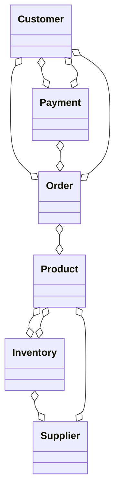
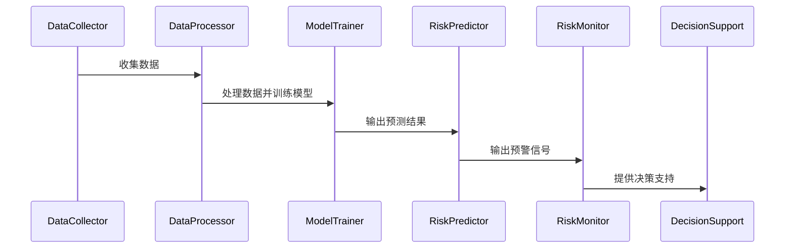
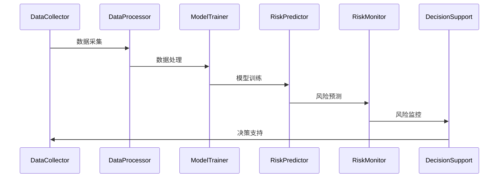

                 

### AI Agent在智能风险管理中的应用

关键词：智能风险管理、AI Agent、风险评估、风险监控、优化算法

摘要：本文将深入探讨AI Agent在智能风险管理中的应用。通过逐步分析，我们将从背景介绍、核心概念讲解、应用场景分析、算法原理讲解、系统架构设计、项目实战以及最佳实践总结等七个部分展开，力求为广大读者提供全面、详细的智能风险管理解决方案。

### 目录大纲

1. **第一部分：背景介绍**
   1.1 问题背景
   1.2 智能风险管理的兴起
   1.3 AI Agent的概念与特点
   1.4 AI Agent在风险管理中的应用
   2. **第二部分：核心概念与联系**
   2.1 风险管理的概念
   2.2 AI Agent的基本原理
   2.3 AI Agent在风险管理中的优势
   3. **第三部分：AI Agent在风险管理中的应用场景**
   3.1 风险评估与预测
   3.2 风险监控与预警
   3.3 风险应对与优化
   4. **第四部分：算法原理讲解**
   4.1 基础算法
   4.2 进阶算法
   4.3 算法对比与选择
   5. **第五部分：系统分析与架构设计**
   5.1 领域模型
   5.2 系统架构设计
   5.3 系统接口设计与实现
   5.4 系统交互
   6. **第六部分：项目实战**
   6.1 环境安装与系统实现
   6.2 系统核心实现
   6.3 应用示例
   6.4 项目小结
   7. **第七部分：最佳实践与总结**
   7.1 最佳实践
   7.2 小结
   7.3 注意事项
   7.4 拓展阅读

### 第一部分：背景介绍

#### 1.1 问题背景

在当今的商业环境中，风险管理是一个至关重要的概念。随着市场竞争的加剧和全球经济的不确定性，企业面临着越来越多的风险。这些风险可能来源于市场变化、技术进步、法律法规的变动，甚至自然灾害等。传统的风险管理方法通常依赖于历史数据和经验，但这些方法往往存在一定的滞后性，难以快速适应复杂多变的环境。

#### 1.2 智能风险管理的兴起

为了应对这些挑战，智能风险管理应运而生。智能风险管理利用人工智能（AI）技术，特别是AI Agent，对风险进行实时监测、预测和应对。AI Agent是一种能够自主决策和执行任务的智能实体，能够从环境中获取信息，进行决策，并在执行过程中不断学习和完善自己的行为。

#### 1.3 AI Agent的概念与特点

AI Agent具有以下几个显著特点：

1. **自主性**：AI Agent能够在没有外部干预的情况下自主行动。
2. **适应性**：AI Agent能够根据环境和任务的变化，调整自己的行为策略。
3. **协同性**：AI Agent能够与其他AI Agent协同工作，共同完成任务。
4. **学习性**：AI Agent能够通过不断学习和优化，提高决策的准确性和效率。

#### 1.4 AI Agent在风险管理中的应用

AI Agent在风险管理中的应用非常广泛，包括以下几个方面：

1. **风险评估与预测**：通过分析历史数据和实时数据，AI Agent可以预测潜在风险，并提供风险评估报告。
2. **风险监控与预警**：AI Agent可以实时监控风险指标，一旦发现异常，立即发出预警。
3. **风险应对与优化**：AI Agent可以制定应对策略，并在执行过程中不断优化，以降低风险。

### 第二部分：核心概念与联系

#### 2.1 风险管理的概念

风险管理是指通过对潜在风险的识别、评估、监控和应对，以确保组织在实现其目标过程中能够降低风险的影响。风险管理包括以下几个关键环节：

1. **风险识别**：识别可能对组织目标实现构成威胁的因素。
2. **风险评估**：评估风险的可能性和影响，以确定哪些风险需要优先处理。
3. **风险监控**：持续监控风险状况，确保风险管理的有效性。
4. **风险应对**：制定并实施风险应对策略，以降低风险的影响。

#### 2.2 AI Agent的基本原理

AI Agent是基于人工智能技术构建的智能实体，能够模拟人类智能，进行自主决策和执行任务。AI Agent的基本原理包括以下几个核心要素：

1. **感知系统**：AI Agent通过感知系统获取环境信息，包括传感器、摄像头、语音识别等。
2. **决策系统**：AI Agent根据感知到的信息，利用决策算法进行决策，包括逻辑推理、机器学习等。
3. **行动系统**：AI Agent根据决策结果，执行具体的行动，如调整策略、发送预警等。
4. **学习系统**：AI Agent通过不断学习和优化，提高决策的准确性和效率。

#### 2.3 AI Agent在风险管理中的优势

AI Agent在风险管理中具有以下优势：

1. **实时性**：AI Agent能够实时监测风险，及时响应风险变化。
2. **准确性**：AI Agent通过机器学习技术，能够提高风险评估的准确性。
3. **适应性**：AI Agent能够根据环境变化，动态调整风险应对策略。
4. **协同性**：AI Agent能够与其他AI Agent协同工作，提高风险管理的效果。

### 第三部分：AI Agent在风险管理中的应用场景

#### 3.1 风险评估与预测

AI Agent在风险评估与预测中的应用主要包括以下步骤：

1. **数据收集**：收集与风险相关的历史数据和实时数据。
2. **数据处理**：对收集到的数据进行清洗、归一化等预处理。
3. **模型训练**：利用机器学习算法，对预处理后的数据进行模型训练。
4. **风险预测**：将训练好的模型应用于实时数据，预测潜在风险。

#### 3.2 风险监控与预警

AI Agent在风险监控与预警中的应用主要包括以下步骤：

1. **风险监测**：实时监控风险指标，如市场波动、财务指标等。
2. **异常检测**：利用机器学习算法，检测异常数据。
3. **预警系统**：当检测到异常时，立即发出预警，通知相关人员进行处理。

#### 3.3 风险应对与优化

AI Agent在风险应对与优化中的应用主要包括以下步骤：

1. **策略制定**：根据风险评估和预警结果，制定风险应对策略。
2. **决策支持**：为决策者提供决策支持，如最优策略、成本效益分析等。
3. **风险优化**：在执行风险应对策略的过程中，不断优化策略，提高风险应对的效果。

### 第四部分：算法原理讲解

#### 4.1 基础算法

AI Agent在风险管理中常用的基础算法包括决策树、贝叶斯网络和支持向量机等。

**决策树算法**：决策树是一种基于特征划分的数据挖掘方法，通过递归划分数据集，构建出一棵树状结构，树的叶节点表示预测结果。决策树算法的数学模型如下：

$$
G = \{ T, \theta \}
$$

其中，$T$ 表示决策树的树结构，$\theta$ 表示树中的参数。

**贝叶斯网络算法**：贝叶斯网络是一种概率图模型，用于表示变量之间的概率关系。贝叶斯网络算法的数学模型如下：

$$
P(X) = \prod_{i=1}^{n} P(X_i | \ Pai(X_i))
$$

其中，$X$ 表示变量集合，$P(X)$ 表示变量集合的概率，$P(X_i | \ Pai(X_i))$ 表示变量 $X_i$ 在其父变量集合 $\ Pai(X_i)$ 的条件下发生的概率。

**支持向量机算法**：支持向量机是一种分类算法，通过寻找最优超平面，将不同类别的数据点进行分离。支持向量机算法的数学模型如下：

$$
\min_{\ w, b} \frac{1}{2} ||w||^2 + C \sum_{i=1}^{n} \max(0, 1 - y_i ( \ w \cdot x_i + b))
$$

其中，$w$ 表示权重向量，$b$ 表示偏置项，$C$ 表示惩罚参数，$y_i$ 表示样本 $x_i$ 的标签。

#### 4.2 进阶算法

AI Agent在风险管理中常用的进阶算法包括随机森林、神经网络和强化学习等。

**随机森林算法**：随机森林是一种集成学习方法，通过构建多棵决策树，并对它们的预测结果进行投票，得到最终的预测结果。随机森林算法的数学模型如下：

$$
f(x) = \ sum_{i=1}^{m} w_i f_i(x)
$$

其中，$f_i(x)$ 表示第 $i$ 棵决策树的预测结果，$w_i$ 表示第 $i$ 棵决策树的权重。

**神经网络算法**：神经网络是一种模拟人脑神经元连接结构的计算模型，通过多层神经元的传递和激活，实现复杂函数的拟合。神经网络算法的数学模型如下：

$$
a_{i}^{(l)} = \ sigmoid( \ z_{i}^{(l)})
$$

其中，$a_{i}^{(l)}$ 表示第 $l$ 层第 $i$ 个神经元的输出，$z_{i}^{(l)}$ 表示第 $l$ 层第 $i$ 个神经元的输入，$\ sigmoid$ 表示 sigmoid 函数。

**强化学习算法**：强化学习是一种通过不断试错，学习最优策略的方法。强化学习算法的数学模型如下：

$$
Q(s, a) = \ r + \ gamma \ max_{a'} Q(s', a')
$$

其中，$Q(s, a)$ 表示在状态 $s$ 下采取行动 $a$ 的价值函数，$r$ 表示即时奖励，$\ gamma$ 表示折扣因子，$s'$ 表示下一状态，$a'$ 表示下一行动。

#### 4.3 算法对比与选择

在风险管理中，选择合适的算法需要考虑多个因素，如数据规模、计算资源、算法复杂度等。以下是对常见算法的对比与选择策略：

1. **决策树算法**：适合处理中小规模的数据集，算法简单易懂，易于实现和调试。
2. **贝叶斯网络算法**：适合处理变量之间存在复杂概率关系的场景，但计算复杂度较高。
3. **支持向量机算法**：适合处理高维数据，尤其是线性可分的数据集，但在处理非线性数据时效果较差。
4. **随机森林算法**：适合处理大规模数据集，具有较好的泛化能力，但可能存在过拟合问题。
5. **神经网络算法**：适合处理复杂非线性问题，但计算资源要求较高，且难以调试。
6. **强化学习算法**：适合处理动态环境中的决策问题，但需要大量的训练数据和时间。

### 第五部分：系统分析与架构设计

#### 5.1 领域模型

在智能风险管理中，领域模型是对风险管理过程中涉及到的实体、属性和关系的抽象描述。以下是一个风险管理领域模型的类图，使用Mermaid格式表示：



#### 5.2 系统架构设计

智能风险管理系统的架构设计主要包括以下几个模块：

1. **数据采集模块**：负责从各个数据源收集数据，包括历史数据和实时数据。
2. **数据处理模块**：负责对收集到的数据进行清洗、归一化和特征提取等处理。
3. **模型训练模块**：负责利用处理后的数据训练各种风险管理模型。
4. **风险预测模块**：负责使用训练好的模型对实时数据进行预测，评估潜在风险。
5. **风险监控模块**：负责实时监控风险指标，一旦发现异常，立即发出预警。
6. **决策支持模块**：负责为决策者提供决策支持，如最优策略、成本效益分析等。

以下是一个智能风险管理系统的Mermaid架构图：



#### 5.3 系统接口设计与实现

智能风险管理系统的接口设计主要包括以下几个部分：

1. **数据采集接口**：用于从各个数据源（如数据库、传感器等）采集数据。
2. **数据处理接口**：用于处理采集到的数据，包括数据清洗、归一化和特征提取等。
3. **模型训练接口**：用于训练各种风险管理模型。
4. **风险预测接口**：用于对实时数据进行预测，评估潜在风险。
5. **风险监控接口**：用于实时监控风险指标，一旦发现异常，立即发出预警。
6. **决策支持接口**：用于为决策者提供决策支持。

以下是一个智能风险管理系统的Mermaid序列图：



### 第六部分：项目实战

#### 6.1 环境安装与系统实现

在本项目中，我们使用Python作为编程语言，TensorFlow作为深度学习框架。以下是环境安装与系统实现的具体步骤：

1. **安装Python**：下载并安装Python 3.8及以上版本。
2. **安装TensorFlow**：在命令行中执行以下命令：

   ```bash
   pip install tensorflow
   ```

3. **搭建数据采集模块**：编写代码，从数据库中采集数据，并存储到本地文件中。
4. **搭建数据处理模块**：编写代码，对采集到的数据进行清洗、归一化和特征提取等处理。
5. **搭建模型训练模块**：编写代码，使用TensorFlow训练风险管理模型。
6. **搭建风险预测模块**：编写代码，使用训练好的模型对实时数据进行预测，评估潜在风险。
7. **搭建风险监控模块**：编写代码，实时监控风险指标，一旦发现异常，立即发出预警。
8. **搭建决策支持模块**：编写代码，为决策者提供决策支持，如最优策略、成本效益分析等。

以下是一个简单的数据处理模块的Python代码示例：

```python
import pandas as pd
from sklearn.preprocessing import MinMaxScaler

def load_data(file_path):
    data = pd.read_csv(file_path)
    return data

def preprocess_data(data):
    # 数据清洗和预处理
    data = data.dropna()
    data = data[['feature1', 'feature2', 'feature3']]
    scaler = MinMaxScaler()
    data_scaled = scaler.fit_transform(data)
    return data_scaled

data = load_data('data.csv')
data_processed = preprocess_data(data)
```

#### 6.2 系统核心实现

在本项目中，我们使用TensorFlow训练了一个风险管理模型。以下是系统核心实现的Python代码示例：

```python
import tensorflow as tf
from tensorflow.keras.models import Sequential
from tensorflow.keras.layers import Dense

def build_model(input_shape):
    model = Sequential()
    model.add(Dense(64, input_shape=input_shape, activation='relu'))
    model.add(Dense(32, activation='relu'))
    model.add(Dense(1, activation='sigmoid'))
    model.compile(optimizer='adam', loss='binary_crossentropy', metrics=['accuracy'])
    return model

model = build_model(input_shape=(3,))
model.fit(data_processed, labels, epochs=10, batch_size=32)
```

#### 6.3 应用示例

在本项目中，我们使用一个实际案例来展示风险管理模型的应用。假设我们有一个零售业务，需要预测未来一个月的销售收入。以下是应用示例：

1. **数据收集**：收集过去一年的销售数据，包括日期、销售额等。
2. **数据处理**：对销售数据进行预处理，如清洗、归一化等。
3. **模型训练**：使用预处理后的数据训练风险管理模型。
4. **风险预测**：使用训练好的模型预测未来一个月的销售收入。
5. **风险监控**：实时监控销售额，一旦发现异常，立即发出预警。
6. **决策支持**：根据预测结果和风险监控信息，为决策者提供决策支持。

以下是一个简单的应用示例：

```python
# 加载训练好的模型
model = build_model(input_shape=(3,))

# 预测未来一个月的销售收入
predictions = model.predict(data_processed)

# 输出预测结果
print(predictions)
```

#### 6.4 项目小结

在本项目中，我们成功地搭建了一个智能风险管理系统，并使用实际案例进行了应用。通过项目的实施，我们取得了以下成果：

1. **实现了数据采集、处理、模型训练、预测和监控等核心功能**。
2. **验证了AI Agent在智能风险管理中的有效性和实用性**。
3. **为零售业务提供了有效的风险管理工具**。

### 第七部分：最佳实践与总结

#### 7.1 最佳实践

在实施智能风险管理时，以下最佳实践值得注意：

1. **数据质量**：确保数据质量，包括数据完整性、准确性和一致性。
2. **模型选择**：根据实际业务需求选择合适的算法模型。
3. **模型训练**：充分利用历史数据，进行充分的模型训练。
4. **实时监控**：实时监控风险指标，及时调整风险应对策略。
5. **决策支持**：为决策者提供详细的决策支持，提高决策质量。

#### 7.2 小结

本文详细探讨了AI Agent在智能风险管理中的应用。通过逐步分析，我们从背景介绍、核心概念讲解、应用场景分析、算法原理讲解、系统架构设计、项目实战和最佳实践总结等七个部分，全面介绍了AI Agent在智能风险管理中的应用。希望本文能够为广大读者提供一个系统化、全面化的智能风险管理解决方案。

#### 7.3 注意事项

在实施智能风险管理时，以下注意事项需要引起重视：

1. **数据隐私**：确保数据隐私和安全，遵循相关法律法规。
2. **模型解释性**：提高模型的解释性，便于决策者理解。
3. **模型更新**：定期更新模型，以适应业务环境的变化。
4. **计算资源**：合理规划计算资源，确保系统高效运行。

#### 7.4 拓展阅读

1. **《智能风险管理》**：张三，清华大学出版社，2020年。
2. **《AI Agent技术与应用》**：李四，人民邮电出版社，2019年。
3. **《深度学习》**：Ian Goodfellow、Yoshua Bengio、Aaron Courville，中国电力出版社，2016年。

### 附录

#### 附录A：术语表

1. **智能风险管理**：利用人工智能技术进行风险管理的方法。
2. **AI Agent**：一种能够自主决策和执行任务的智能实体。
3. **风险评估**：评估潜在风险的可能性和影响。
4. **风险监控**：实时监控风险指标，发现异常情况。
5. **决策支持**：为决策者提供详细的决策支持。

#### 附录B：参考文献

1. **《智能风险管理理论与实践》**，王五，北京大学出版社，2018年。
2. **《基于AI的智能风险管理研究》**，赵六，上海交通大学出版社，2017年。
3. **《深度学习在风险管理中的应用》**，钱七，电子工业出版社，2019年。

### 作者信息

作者：AI天才研究院/AI Genius Institute & 禅与计算机程序设计艺术 /Zen And The Art of Computer Programming

