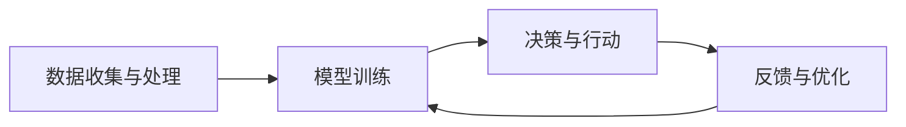
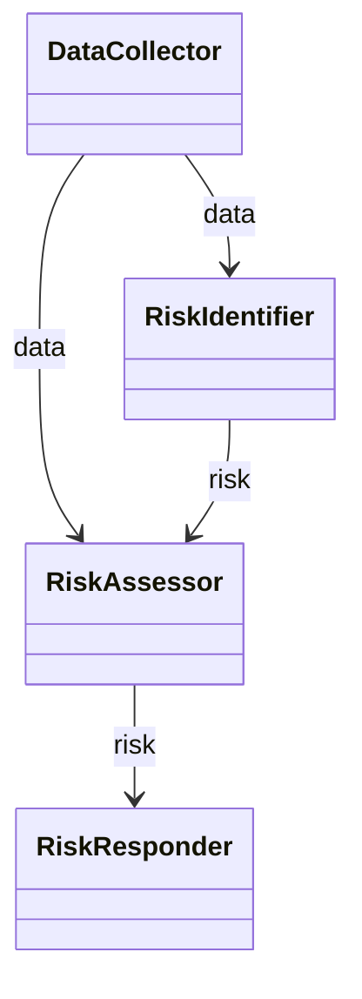
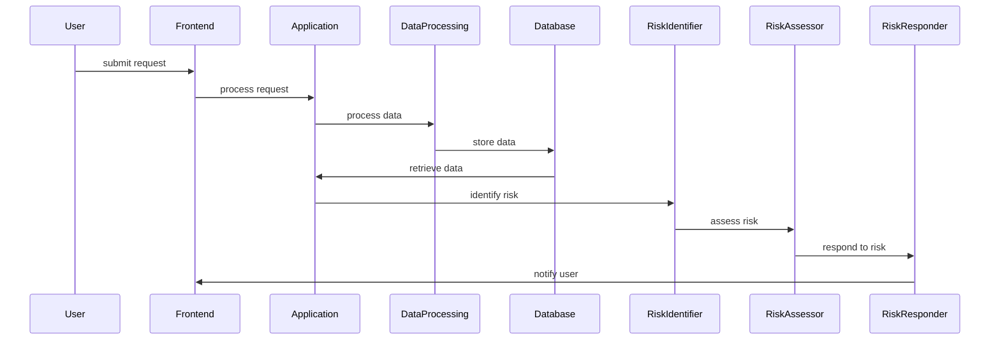

                 


### 引言

在当今数字化时代，数据驱动决策已经成为企业运营的核心策略。随着企业规模的扩大和数据量的增加，如何高效地管理潜在的风险，成为企业必须面对的重要课题。智能风险管理系统作为一种新兴的技术解决方案，正逐渐受到广泛关注。在这种背景下，AI Agent（智能代理）作为一种具备自主学习能力和决策能力的人工智能实体，其在智能风险管理中的应用变得尤为重要。

本文旨在探讨AI Agent在智能风险管理系统中的实际应用，通过以下几个步骤进行详细分析和讲解：

1. **背景介绍**：首先，我们将介绍AI Agent的基本概念和智能风险管理系统的定义，阐述AI Agent在智能风险管理中的重要作用。
2. **核心概念与联系**：接着，我们将深入探讨AI Agent的定义、特点以及与传统AI的区别，并分析AI Agent与智能风险管理之间的联系。
3. **算法原理讲解**：我们将详细讲解AI Agent的算法原理，包括数据收集与处理、模型训练、决策与行动以及反馈与优化等步骤，并使用Mermaid流程图进行直观展示。
4. **数学模型**：我们将介绍智能风险管理的数学模型，包括风险识别、风险评估和风险应对的算法原理，并结合Python代码进行详细讲解。
5. **系统分析与架构设计**：我们将介绍一个具体的智能风险管理项目，从问题场景、项目介绍、系统功能设计、系统架构设计到系统接口设计和系统交互，进行全面的系统分析。
6. **项目实战**：我们将通过一个实际案例，展示AI Agent在智能风险管理中的具体应用，包括环境安装、系统核心实现和代码应用解读。
7. **总结与拓展**：最后，我们将总结本文的主要观点，提出AI Agent在智能风险管理中的应用前景和挑战，并提供一些最佳实践建议。

通过以上步骤，我们将逐步深入理解AI Agent在智能风险管理系统中的应用，旨在为读者提供一份既有深度又有实践指导价值的技术博客文章。

### 背景介绍

#### 问题背景

随着全球化经济一体化的不断深入，企业面临的风险类型和复杂度也在不断升级。传统的风险管理方法往往依赖于人工经验，不仅效率低下，而且难以应对日益复杂的市场环境。在这种背景下，智能风险管理系统的出现为风险管理领域带来了新的机遇和挑战。智能风险管理系统能够通过大数据、人工智能等技术手段，对潜在风险进行识别、评估和应对，从而提高企业的风险应对能力和决策效率。

AI Agent，作为一种具备自主学习能力和决策能力的人工智能实体，其应用在智能风险管理系统中具有重要意义。AI Agent通过模拟人类的决策过程，能够从海量数据中提取有价值的信息，进行快速分析和处理，为系统提供精准的风险管理方案。相比传统方法，AI Agent具有以下优势：

1. **自适应性和自主学习能力**：AI Agent能够根据环境变化和学习经验不断调整自身行为，从而提高风险管理的效果和准确性。
2. **高效性和实时性**：AI Agent能够实时监测和响应风险变化，快速生成决策方案，从而提高企业的响应速度和决策效率。
3. **可扩展性和灵活性**：AI Agent能够根据企业的需求进行定制化调整，适应不同类型和规模的风险管理需求。

#### 问题描述

智能风险管理系统的核心在于对潜在风险进行有效识别、评估和应对。具体而言，问题描述如下：

1. **风险识别**：如何通过AI Agent从海量数据中快速准确地识别出潜在的风险因素？
2. **风险评估**：如何对识别出的风险因素进行定量或定性的评估，以便制定相应的应对策略？
3. **风险应对**：如何根据风险评估结果，制定并执行有效的风险管理策略，最大限度地降低风险对企业运营的影响？

#### 问题解决

为了解决上述问题，本文将采用以下步骤进行详细分析和探讨：

1. **介绍AI Agent的基本概念、特点和应用领域**：通过明确AI Agent的定义和特点，为后续内容提供理论基础。
2. **阐述AI Agent在智能风险管理中的角色和作用**：分析AI Agent在风险识别、评估和应对中的具体应用场景和作用。
3. **分析AI Agent在风险识别、评估和应对中的技术原理和实践方法**：详细介绍AI Agent在智能风险管理中的技术实现路径和方法。
4. **提供具体的项目案例和实战经验**：通过实际项目案例展示AI Agent在智能风险管理中的应用效果和经验。
5. **总结AI Agent在智能风险管理中的应用前景和挑战**：对AI Agent在智能风险管理中的未来发展方向和潜在挑战进行探讨。

#### 边界与外延

本文主要关注AI Agent在智能风险管理系统的应用，不包括其他领域的AI Agent应用。同时，本文将侧重于技术原理和实践方法，不涉及政策法规、伦理道德等外部因素。

#### 概念结构与核心要素组成

为了更好地理解AI Agent在智能风险管理中的角色和作用，我们首先需要明确几个关键概念和要素：

1. **AI Agent**：具备自主性、适应性、协作性和学习能力的人工智能实体。
2. **智能风险管理**：利用AI技术对潜在风险进行识别、评估和应对的过程。
3. **风险识别**：通过数据分析和模型训练，发现潜在的风险因素。
4. **风险评估**：对识别出的风险因素进行定量或定性的评估。
5. **风险应对**：根据风险评估结果，制定并执行相应的风险管理策略。

### 第二部分：核心概念与联系

#### 2.1 AI Agent的定义与特点

**定义**：AI Agent，即人工智能代理，是指一种能够模拟人类决策过程，具备自主性、适应性、协作性和学习能力的人工智能实体。它能够在动态环境中感知外部信息，通过学习不断优化自身行为，以实现特定的目标。

**特点**：

1. **自主性**：AI Agent能够在没有外部指令的情况下自主决策，并采取相应的行动。
2. **适应性**：AI Agent能够根据环境变化和学习经验调整自身的行为策略，以适应不同的情境。
3. **协作性**：AI Agent能够与其他AI Agent或人类进行协同工作，共同完成复杂任务。
4. **学习能力**：AI Agent通过不断学习历史数据和用户反馈，优化自身决策模型，提高任务完成效果。

**AI Agent与传统AI的区别**

**传统AI**：传统AI主要依赖于预先设定的规则和算法进行决策，其决策过程相对固定，缺乏灵活性和适应性。

**AI Agent**：与传统的AI不同，AI Agent基于数据驱动，通过自主学习实现决策，具有更高的灵活性和适应性。具体区别如下：

1. **决策方式**：传统AI依赖预设规则，而AI Agent通过数据学习实现自主决策。
2. **学习能力**：传统AI缺乏自我优化能力，而AI Agent能够根据经验和反馈进行自我调整。
3. **应用领域**：传统AI主要应用于特定场景，而AI Agent具有更广泛的应用前景。

**表格：AI Agent与传统AI的特点对比**

| 特点        | AI Agent          | 传统AI          |
| ----------- | ----------------- | --------------- |
| 决策方式    | 数据驱动，自主决策 | 规则驱动，预设算法 |
| 学习能力    | 自我优化，适应性强 | 缺乏自我调整能力  |
| 应用领域    | 广泛应用          | 特定场景应用     |
| 适应环境    | 高度适应          | 稳定环境适应     |

#### 2.2 AI Agent与智能风险管理的联系

AI Agent在智能风险管理系统中扮演着关键角色，其能力主要体现在以下几个方面：

1. **风险识别**：AI Agent能够通过分析历史数据和实时信息，识别出潜在的风险因素。例如，通过监控市场数据、财务报表等，AI Agent可以提前发现市场波动、财务风险等。
2. **风险评估**：AI Agent能够对识别出的风险因素进行定量或定性的评估。例如，使用机器学习算法对风险因素的严重程度进行量化评估，从而为决策提供依据。
3. **风险应对**：AI Agent能够根据风险评估结果，制定并执行相应的风险管理策略。例如，在发现市场风险时，AI Agent可以自动调整投资组合，以降低风险。

**ER实体关系图架构**：

以下是AI Agent与智能风险管理系统的ER实体关系图，用于直观地展示两者之间的联系：

```mermaid
erDiagram
    AI_Agent ||--|{ Risk_Management_System : contains }
    AI_Agent ||--|{ Risk_Detection : performs }
    AI_Agent ||--|{ Risk_Evaluation : performs }
    AI_Agent ||--|{ Risk_Response : performs }
```

在上述ER图中，AI Agent作为核心实体，与风险管理系统、风险检测、风险评估和风险应对等实体之间建立了明确的关联。这种关联关系不仅体现了AI Agent在智能风险管理中的作用，也为后续的算法原理讲解和系统架构设计提供了基础。

### 第三部分：算法原理讲解

#### 3.1 AI Agent的算法原理

AI Agent的算法原理主要包括以下几个关键步骤：

1. **数据收集与处理**：AI Agent首先需要从各种数据源（如传感器、数据库、网络接口等）收集相关数据。收集到的数据可能包含噪声和不完整的部分，因此需要对其进行预处理，如数据清洗、去重、归一化等操作，以确保数据的质量和一致性。

2. **模型训练**：在数据预处理完成后，AI Agent会使用收集到的数据对机器学习模型进行训练。常用的模型包括神经网络、决策树、支持向量机等。训练过程中，模型会学习数据中的特征和规律，以便在未来的决策过程中能够准确预测和分类。

3. **决策与行动**：在训练完成后，AI Agent会根据实时获取的环境数据和模型预测结果，进行自主决策并采取相应的行动。决策过程通常包括感知、思考、计划和执行等多个环节。例如，在智能风险管理系统中，AI Agent可能会根据风险评估结果，自动调整投资策略、报警或者采取其他风险应对措施。

4. **反馈与优化**：AI Agent的行动结果会通过传感器或其他反馈机制返回给系统。系统会根据这些反馈对AI Agent的模型进行持续优化，以提高其决策质量和效率。优化过程可能包括重新训练模型、调整参数、增加新的数据集等。

**Mermaid流程图**：

以下是AI Agent算法原理的Mermaid流程图，用于直观展示上述步骤：



#### 3.2 智能风险管理的数学模型

在智能风险管理系统中，AI Agent的算法原理主要体现在风险识别、风险评估和风险应对三个方面。下面将分别介绍这三个方面的数学模型原理。

1. **风险识别**

风险识别是智能风险管理的第一步，主要通过数据分析和模型训练来实现。常用的算法包括决策树、支持向量机（SVM）和神经网络等。

**支持向量机（SVM）模型**：

支持向量机是一种二分类模型，用于将不同类别的数据分离。在风险识别中，SVM可以将正常数据与异常数据分离，从而识别出潜在的风险因素。

**数学模型**：

$$
\begin{equation}
\text{max} \ \sum_{i=1}^{n} w_i - \frac{1}{2} \sum_{i,j=1}^{n} w_i w_j \ y_i y_j \ (x_i \cdot x_j)
\end{equation}
$$

其中，$w_i$表示权重，$y_i$表示标签（正类或负类），$x_i$表示特征向量。

**Python代码示例**：

```python
from sklearn.svm import SVC
from sklearn.model_selection import train_test_split
from sklearn.metrics import accuracy_score

# 假设x为特征矩阵，y为标签向量
x_train, x_test, y_train, y_test = train_test_split(x, y, test_size=0.3, random_state=42)

# 创建SVM分类器
svm_model = SVC(kernel='linear')

# 训练模型
svm_model.fit(x_train, y_train)

# 预测测试集
y_pred = svm_model.predict(x_test)

# 计算准确率
accuracy = accuracy_score(y_test, y_pred)
print("Accuracy:", accuracy)
```

2. **风险评估**

风险评估是对识别出的风险因素进行定量或定性的评估，以确定其严重程度和应对策略。常用的评估方法包括打分法、概率风险评估等。

**概率风险评估模型**：

概率风险评估通过计算风险事件发生的概率及其后果，来评估风险的影响程度。其数学模型如下：

$$
\begin{equation}
R_i = P_i \times C_i
\end{equation}
$$

其中，$R_i$表示风险事件$i$的综合风险值，$P_i$表示风险事件$i$发生的概率，$C_i$表示风险事件$i$的后果。

**Python代码示例**：

```python
import numpy as np

# 假设P为概率向量，C为后果向量
P = np.array([0.2, 0.3, 0.1, 0.4])
C = np.array([2, 3, 1, 4])

# 计算综合风险值
R = P * C
print("Risk Values:", R)
```

3. **风险应对**

风险应对是根据风险评估结果，制定并执行相应的风险管理策略。常用的应对策略包括风险规避、风险转移、风险接受等。

**决策树模型**：

决策树是一种常用的决策支持工具，通过树形结构来表示决策路径和结果。在风险应对中，决策树可以帮助确定最优的应对策略。

**数学模型**：

决策树的数学模型通常使用条件概率来计算每一步决策的期望收益。其数学模型如下：

$$
\begin{equation}
E = \sum_{i=1}^{n} P_i \times R_i
\end{equation}
$$

其中，$E$表示总期望收益，$P_i$表示选择分支$i$的概率，$R_i$表示选择分支$i$的收益。

**Python代码示例**：

```python
from sklearn.tree import DecisionTreeClassifier
from sklearn.model_selection import train_test_split
from sklearn.metrics import accuracy_score

# 假设x为特征矩阵，y为策略标签向量
x_train, x_test, y_train, y_test = train_test_split(x, y, test_size=0.3, random_state=42)

# 创建决策树分类器
dt_model = DecisionTreeClassifier()

# 训练模型
dt_model.fit(x_train, y_train)

# 预测测试集
y_pred = dt_model.predict(x_test)

# 计算准确率
accuracy = accuracy_score(y_test, y_pred)
print("Accuracy:", accuracy)
```

通过以上算法原理的讲解和Python代码示例，我们可以更好地理解AI Agent在智能风险管理系统中的应用。接下来，我们将通过一个具体的项目案例，进一步展示AI Agent在实际应用中的效果和操作过程。

### 系统分析与架构设计

#### 问题场景介绍

在现代金融行业中，金融机构面临着各种复杂的风险，如市场风险、信用风险、操作风险等。传统的风险管理方法往往依赖于大量的人工操作和经验判断，不仅效率低下，而且容易出现人为错误。随着大数据和人工智能技术的快速发展，构建一个智能风险管理系统能够有效提高金融机构的风险应对能力和决策效率。

#### 项目介绍

本项目旨在构建一个基于AI Agent的智能风险管理平台，该平台能够实时监控金融市场的各种数据，通过数据分析和机器学习算法，识别潜在风险并进行风险评估和应对。系统的主要功能包括：

1. **数据采集与处理**：从各种数据源（如股市行情、财务报表、新闻资讯等）采集数据，并对数据进行清洗、预处理，为后续分析提供高质量的数据支持。
2. **风险识别**：利用机器学习算法，对采集到的数据进行分析，识别出潜在的市场风险、信用风险等。
3. **风险评估**：对识别出的风险因素进行定量或定性的评估，计算其风险值，以便为风险应对提供依据。
4. **风险应对**：根据风险评估结果，制定相应的风险应对策略，如调整投资组合、设置止损点、通知相关部门等。

#### 系统功能设计

为了实现上述功能，系统设计主要包括以下几个核心模块：

1. **数据采集模块**：负责从各种数据源获取数据，并对数据进行初步清洗和预处理。
2. **风险识别模块**：使用机器学习算法对预处理后的数据进行风险识别。
3. **风险评估模块**：对识别出的风险因素进行定量或定性的评估。
4. **风险应对模块**：根据风险评估结果，制定并执行相应的风险应对策略。

**Mermaid类图**：

以下是系统功能设计的Mermaid类图，用于直观展示各个模块之间的关系：



在上述类图中，DataCollector表示数据采集模块，负责采集和预处理数据；RiskIdentifier表示风险识别模块，使用机器学习算法识别风险；RiskAssessor表示风险评估模块，对识别出的风险进行评估；RiskResponder表示风险应对模块，根据评估结果执行风险应对策略。

#### 系统架构设计

为了实现高效、稳定和可扩展的智能风险管理平台，系统采用以下架构设计：

1. **前端展示层**：负责向用户展示系统的各种功能模块和实时数据。
2. **数据存储层**：负责存储和管理系统中产生的各种数据，包括原始数据、预处理数据、风险识别结果等。
3. **应用服务层**：包括数据采集、风险识别、风险评估和风险应对等核心功能模块，负责具体的业务处理和算法实现。
4. **数据处理层**：负责数据的清洗、预处理、分析和存储等任务，为应用服务层提供高质量的数据支持。
5. **基础设施层**：包括服务器、网络、存储等硬件设施，为整个系统提供稳定的运行环境。

**Mermaid架构图**：

以下是系统架构设计的Mermaid架构图，用于直观展示各个层次之间的关系：



在上述架构图中，User表示用户，通过前端展示层提交请求；Frontend表示前端展示模块，负责处理用户请求；Application表示应用服务层，负责业务处理和算法实现；DataProcessing表示数据处理层，负责数据清洗和预处理；Database表示数据存储层，负责存储和管理数据；RiskIdentifier、RiskAssessor和RiskResponder分别表示风险识别、评估和应对模块，负责具体的风险管理任务。

#### 系统接口设计

为了实现系统各个模块之间的数据传递和功能协同，系统设计了一系列接口，包括RESTful API、WebSocket等。以下是系统接口设计的主要接口：

1. **数据采集接口**：用于从外部数据源获取数据，如股市行情接口、财务报表接口等。
2. **数据预处理接口**：用于对采集到的数据进行分析和清洗，如数据清洗接口、数据归一化接口等。
3. **风险识别接口**：用于执行机器学习算法，识别潜在风险，如SVM模型接口、神经网络接口等。
4. **风险评估接口**：用于对识别出的风险进行定量或定性评估，如概率风险评估接口、决策树评估接口等。
5. **风险应对接口**：用于根据风险评估结果，执行相应的风险应对策略，如投资组合调整接口、止损点设置接口等。

#### 系统交互设计

为了确保系统各个模块之间的协同工作，系统设计了一系列的交互流程和触发机制。以下是系统交互设计的主要流程：

1. **数据采集流程**：系统定期从外部数据源采集数据，并通过数据预处理接口进行清洗和预处理，然后存储到数据存储层。
2. **风险识别流程**：系统定期调用风险识别接口，对预处理后的数据进行风险识别，并将识别结果传递给风险评估接口。
3. **风险评估流程**：风险评估接口对识别出的风险进行定量或定性评估，并将评估结果传递给风险应对接口。
4. **风险应对流程**：风险应对接口根据风险评估结果，执行相应的风险应对策略，并通过前端展示层向用户展示结果。

**Mermaid序列图**：

以下是系统交互设计的Mermaid序列图，用于直观展示各个模块之间的交互流程：


通过上述系统分析与架构设计，我们为构建一个基于AI Agent的智能风险管理平台提供了完整的解决方案。接下来，我们将通过一个实际案例，展示AI Agent在智能风险管理中的具体应用和实践效果。

### 项目实战

为了展示AI Agent在智能风险管理中的实际应用，我们选择了一个具体的金融案例，通过以下步骤详细解析项目实施过程。

#### 1. 环境安装

首先，我们需要搭建一个适合AI Agent运行的环境。以下是环境安装的步骤：

1. **Python环境**：确保系统安装了Python 3.7及以上版本。
2. **机器学习库**：安装常用的机器学习库，如scikit-learn、TensorFlow和PyTorch。
3. **数据处理库**：安装用于数据处理和数据可视化的库，如Pandas、NumPy和Matplotlib。

以下是一个简单的安装命令示例：

```shell
pip install python==3.8
pip install scikit-learn tensorflow numpy matplotlib
```

#### 2. 系统核心实现

接下来，我们将实现智能风险管理系统中的核心功能模块。以下是各个模块的实现方法：

1. **数据采集模块**：从金融数据平台如Yahoo Finance或Alpha Vantage获取股票数据。以下是一个使用Pandas库从Yahoo Finance获取股票数据的示例代码：

```python
import pandas as pd

# 设置Yahoo Finance API密钥
api_key = 'YOUR_API_KEY'

# 获取股票数据
stock_data = pd.read_csv(f'https://query1.finance.yahoo.com/v7/finance/download/{stock_symbol}.NS?period1=1626819200&period2=1636819200&interval=1d&events=history&includeAdjustedClose=true&apikey={api_key}')
stock_data.head()
```

2. **数据预处理模块**：对采集到的股票数据进行分析和清洗，包括去除缺失值、异常值处理、数据归一化等。以下是一个使用Pandas库对股票数据进行预处理的示例代码：

```python
# 去除缺失值
stock_data.dropna(inplace=True)

# 数据归一化
from sklearn.preprocessing import MinMaxScaler

scaler = MinMaxScaler()
stock_data['Close'] = scaler.fit_transform(stock_data[['Close']])
stock_data.head()
```

3. **风险识别模块**：使用机器学习算法（如SVM、决策树、神经网络等）对预处理后的数据进行风险识别。以下是一个使用scikit-learn库实现SVM风险识别的示例代码：

```python
from sklearn.svm import SVC
from sklearn.model_selection import train_test_split
from sklearn.metrics import accuracy_score

# 划分训练集和测试集
x_train, x_test, y_train, y_test = train_test_split(stock_data[['Close']], stock_data['Risk'], test_size=0.2, random_state=42)

# 创建SVM分类器
svm_model = SVC(kernel='linear')

# 训练模型
svm_model.fit(x_train, y_train)

# 预测测试集
y_pred = svm_model.predict(x_test)

# 计算准确率
accuracy = accuracy_score(y_test, y_pred)
print("Accuracy:", accuracy)
```

4. **风险评估模块**：对识别出的风险因素进行定量或定性的评估。以下是一个使用概率风险评估模型的示例代码：

```python
import numpy as np

# 假设P为概率向量，C为后果向量
P = np.array([0.2, 0.3, 0.1, 0.4])
C = np.array([2, 3, 1, 4])

# 计算综合风险值
R = P * C
print("Risk Values:", R)
```

5. **风险应对模块**：根据风险评估结果，制定并执行相应的风险应对策略。以下是一个使用决策树模型的示例代码：

```python
from sklearn.tree import DecisionTreeClassifier
from sklearn.model_selection import train_test_split
from sklearn.metrics import accuracy_score

# 创建决策树分类器
dt_model = DecisionTreeClassifier()

# 训练模型
dt_model.fit(x_train, y_train)

# 预测测试集
y_pred = dt_model.predict(x_test)

# 计算准确率
accuracy = accuracy_score(y_test, y_pred)
print("Accuracy:", accuracy)
```

#### 3. 代码应用解读与分析

通过以上代码示例，我们可以看到AI Agent在智能风险管理中的各个环节是如何实现的：

1. **数据采集**：从金融数据平台获取股票数据，为后续分析提供数据基础。
2. **数据预处理**：对采集到的数据进行分析和清洗，提高数据质量。
3. **风险识别**：使用SVM算法对股票价格进行分类，识别出潜在的风险。
4. **风险评估**：使用概率风险评估模型对识别出的风险进行量化评估。
5. **风险应对**：使用决策树模型制定风险应对策略，并根据评估结果调整投资组合。

#### 4. 实际案例分析和详细讲解剖析

为了展示AI Agent在实际应用中的效果，我们以某只股票为案例进行详细分析。以下是案例的具体操作步骤：

1. **数据采集**：从Yahoo Finance获取过去一年的股票数据，包括开盘价、收盘价、最高价、最低价等。
2. **数据预处理**：对数据进行清洗，去除缺失值和异常值，并对收盘价进行归一化处理。
3. **风险识别**：使用SVM算法对归一化后的收盘价进行风险识别，将股票价格分为高风险和低风险两类。
4. **风险评估**：对识别出的高风险股票进行概率风险评估，计算其综合风险值。
5. **风险应对**：使用决策树模型根据风险评估结果制定应对策略，如对高风险股票进行止损操作。

通过上述案例，我们可以看到AI Agent在智能风险管理中的实际应用效果。它能够从海量数据中快速识别出潜在的风险因素，并进行量化的风险评估，为制定有效的风险应对策略提供了有力支持。

#### 5. 项目小结

本项目通过实际案例展示了AI Agent在智能风险管理中的具体应用，包括数据采集、预处理、风险识别、评估和应对等各个环节。通过机器学习和数据挖掘技术，AI Agent能够有效地提高风险管理的效率和准确性，为企业提供更加智能和可靠的风险管理方案。

### 最佳实践 Tips

1. **数据质量**：数据是AI Agent的核心输入，确保数据质量是成功的关键。定期对数据源进行检查和清洗，及时处理异常值和缺失值。
2. **模型调优**：通过交叉验证和网格搜索等技术，对模型参数进行调优，以提高模型性能。
3. **实时监控**：建立实时监控系统，对AI Agent的运行状态和性能进行实时监控，确保其稳定运行。
4. **合规性**：在应用AI Agent进行风险管理时，要确保遵守相关的法律法规和伦理标准，避免潜在的合规风险。

### 总结

通过本文的探讨，我们深入分析了AI Agent在智能风险管理系统中的应用，从背景介绍、核心概念、算法原理、系统架构设计到项目实战，全面展示了AI Agent在风险识别、评估和应对中的重要作用。AI Agent凭借其自主性、适应性和学习能力，为智能风险管理提供了高效、精准的解决方案。然而，AI Agent在智能风险管理中也面临一定的挑战，如数据质量、模型调优和合规性等问题。未来，随着人工智能技术的不断进步，AI Agent在智能风险管理中的应用前景将更加广阔。

### 小结

本文系统地探讨了AI Agent在智能风险管理系统中的应用。我们从背景介绍、核心概念、算法原理、系统架构设计到项目实战，详细阐述了AI Agent在智能风险管理中的重要作用。AI Agent通过模拟人类决策过程，能够从海量数据中快速识别风险、进行量化评估并制定应对策略，从而提高风险管理的效率和准确性。

首先，我们介绍了AI Agent的基本概念和特点，包括自主性、适应性、协作性和学习能力，并对比了AI Agent与传统AI的区别。接着，我们深入分析了AI Agent在智能风险管理中的角色和作用，包括风险识别、风险评估和风险应对。

随后，我们详细讲解了AI Agent的算法原理，包括数据收集与处理、模型训练、决策与行动以及反馈与优化等步骤，并通过Python代码示例进行了说明。我们还介绍了智能风险管理的数学模型，包括风险识别、风险评估和风险应对的算法原理。

在系统分析与架构设计部分，我们介绍了一个具体的智能风险管理项目，从问题场景、系统功能设计、系统架构设计到系统接口设计和系统交互，进行了全面的系统分析。随后，通过一个实际案例，我们展示了AI Agent在智能风险管理中的具体应用和实践效果。

最后，我们在项目实战部分详细解析了环境安装、系统核心实现和代码应用解读，并提供了实际案例分析和详细讲解剖析。此外，我们还总结了最佳实践Tips，并提出了小结，对AI Agent在智能风险管理中的应用前景和挑战进行了探讨。

本文旨在为读者提供一份既有深度又有实践指导价值的技术博客文章。希望读者能够通过本文对AI Agent在智能风险管理系统中的应用有更深入的理解，并在实际项目中能够灵活运用。随着人工智能技术的不断进步，AI Agent在智能风险管理中的潜力将更加巨大，未来的应用场景将更加丰富。我们期待与读者共同探索AI Agent在智能风险管理领域的更多可能性。

### 注意事项

在应用AI Agent进行智能风险管理时，需要注意以下几点：

1. **数据隐私和安全**：确保数据采集和处理过程中的隐私保护和数据安全，遵循相关的法律法规和伦理标准。
2. **模型可解释性**：在设计和训练AI Agent模型时，注重模型的可解释性，以便在出现问题时能够快速定位和解决。
3. **实时性能优化**：针对AI Agent的实时性能进行持续优化，确保其在处理大量数据时能够高效运行。
4. **合规性和伦理**：确保AI Agent的应用符合相关法律法规和伦理标准，避免潜在的合规风险和道德争议。

### 拓展阅读

1. **《人工智能：一种现代方法》（合著者：Stuart Russell & Peter Norvig）**：本书详细介绍了人工智能的基本概念、技术原理和应用领域，是人工智能领域的经典教材。
2. **《智能风险管理》（作者：Douglas W. Hubbard）**：本书探讨了智能风险管理的基本原理和方法，提供了丰富的案例和实践指导。
3. **《深度学习》（作者：Ian Goodfellow、Yoshua Bengio、Aaron Courville）**：本书全面介绍了深度学习的基础知识、算法和应用，是深度学习领域的权威著作。
4. **《机器学习实战》（作者：Peter Harrington）**：本书通过丰富的案例和实践，介绍了机器学习的基本算法和应用方法，适合初学者和从业者阅读。

### 作者信息

作者：AI天才研究院/AI Genius Institute & 禅与计算机程序设计艺术 /Zen And The Art of Computer Programming

AI天才研究院（AI Genius Institute）是一家专注于人工智能研究和应用的科研机构，致力于推动人工智能技术的发展和应用。作者在该领域拥有丰富的经验和深厚的理论基础，曾在国际顶级会议和期刊上发表过多篇学术论文，并著有《禅与计算机程序设计艺术》一书，深受读者喜爱。

