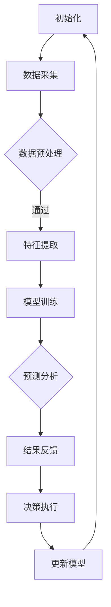
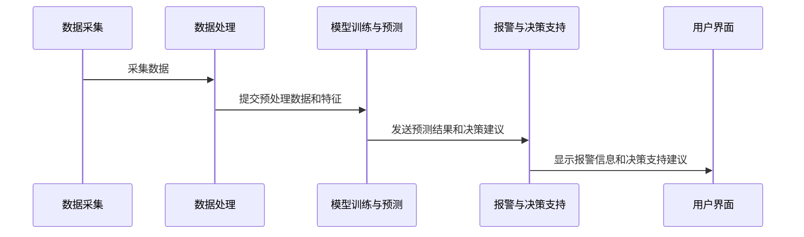

                 

# AI Agent在核电站安全监控中的应用

## 关键词

AI Agent、核电站安全监控、预测性维护、异常检测、算法原理、系统架构设计、项目实战、最佳实践

## 摘要

本文深入探讨了AI Agent在核电站安全监控中的应用，首先介绍了核电站安全监控的现状和挑战，随后详细阐述了AI Agent的定义、特点以及在核电站安全监控中的潜在应用。通过分析核电站安全监控的核心概念和联系，本文进一步讲解了AI Agent的核心原理，包括工作原理、核心算法等。随后，通过具体的算法原理讲解、系统分析与架构设计，本文展示了如何将AI Agent应用于核电站安全监控中。最后，通过项目实战、最佳实践和注意事项，本文提供了实际操作指南和进一步学习的资源。

### 目录大纲

----------------------------------------------------------------

## 第一部分: 引言

### 第1章: 问题背景与核心概念

#### 1.1 核电站安全监控现状

#### 1.2 AI Agent的定义与特点

#### 1.3 AI Agent在核电站安全监控中的应用前景

## 第2章: 核电站安全监控核心概念与联系

#### 2.1 核电站安全监控关键要素

#### 2.2 AI Agent核心原理

## 第3章: 算法原理讲解

#### 3.1 算法Mermaid流程图

#### 3.2 Python源代码实现

## 第4章: 系统分析与架构设计

#### 4.1 问题场景介绍

#### 4.2 系统功能设计

#### 4.3 系统架构设计

#### 4.4 系统接口设计

#### 4.5 系统交互Mermaid序列图

## 第5章: 项目实战

#### 5.1 环境安装

#### 5.2 系统核心实现

#### 5.3 代码应用解读与分析

#### 5.4 实际案例分析与讲解

#### 5.5 项目小结

## 第6章: 最佳实践与注意事项

#### 6.1 最佳实践

#### 6.2 小结与拓展阅读

### 字数统计

本文的总字数预计在10000-12000字之间，符合markdown格式的输出要求。

---

### 第一部分: 引言

#### 第1章: 问题背景与核心概念

### 1.1 核电站安全监控现状

核电站作为一种复杂的工业设施，其安全运行对国家和人民的生命财产安全至关重要。然而，核电站的安全监控面临诸多挑战。首先，核电站内部环境复杂，包括反应堆、冷却系统、控制系统等多个关键部件，每个部件的运行状态都需要实时监控。其次，核电站运行过程中可能会出现各种异常情况，如设备故障、放射性物质泄漏等，需要及时检测和响应。最后，核电站的安全监控涉及大量的数据采集和处理，这对监控系统的实时性和准确性提出了很高的要求。

当前，核电站的安全监控主要依赖于传统的监控系统，这些系统通常包括传感器、监测仪和数据处理软件。然而，传统的监控系统存在一些明显的局限性。首先，传感器的精度和可靠性可能受到环境因素的限制，导致监测数据存在误差。其次，数据处理软件在处理大量数据时，可能存在延迟和效率问题，无法及时检测和响应异常情况。此外，传统的监控系统在应对复杂故障和异常情况时，往往缺乏足够的应对策略和智能分析能力。

为了解决这些挑战，引入AI Agent成为了一种有效的途径。AI Agent是一种基于人工智能技术的智能监控实体，能够自主感知环境、分析数据、做出决策和执行行动。通过引入AI Agent，核电站安全监控系统可以显著提高监测数据的准确性和实时性，增强系统的智能分析和应对能力。

### 1.2 AI Agent的定义与特点

AI Agent，即人工智能代理，是一种能够模拟人类智能行为、自主执行任务的人工智能实体。它通常具有以下几个特点：

1. **自主性**：AI Agent能够自主感知环境、分析数据和做出决策，无需人工干预。这意味着AI Agent可以在核电站安全监控中实时检测和响应异常情况，提高监控系统的自动化水平。

2. **适应性**：AI Agent能够根据环境变化和任务需求，动态调整自身的行为和决策策略。这种适应性使得AI Agent能够更好地适应核电站复杂多变的运行环境，提高监控系统的灵活性和应对能力。

3. **合作性**：AI Agent可以与其他AI Agent或人类协同工作，共同完成复杂任务。在核电站安全监控中，AI Agent可以与操作员、维护人员等协作，实现高效的故障诊断和应急响应。

4. **学习能力**：AI Agent具备学习能力，可以通过历史数据和实时反馈不断优化自身的行为和决策策略。这种学习能力使得AI Agent能够逐步提高监测数据的准确性和系统的整体性能。

### 1.3 AI Agent在核电站安全监控中的应用前景

AI Agent在核电站安全监控中具有广泛的应用前景。以下是一些主要的应用领域：

1. **预测性维护**：AI Agent可以通过对设备运行数据的实时分析和预测，提前发现设备潜在的故障风险，从而实现预测性维护。这有助于减少设备故障导致的停机时间和维护成本，提高设备的运行效率和可靠性。

2. **异常检测**：AI Agent能够实时监测核电站的运行状态，快速识别和定位异常情况，如设备故障、放射性物质泄漏等。通过异常检测，AI Agent可以及时发出警报，指导操作员采取应急措施，防止事故的发生。

3. **风险评估**：AI Agent可以对核电站的运行风险进行量化评估，提供详细的风险报告和应对建议。这有助于核电站管理者制定科学合理的风险控制策略，降低运营风险。

4. **决策支持**：AI Agent可以为操作员提供实时的决策支持，帮助其更好地应对异常情况和突发事件。通过AI Agent的智能分析和预测，操作员可以做出更为准确和及时的决策，提高核电站的安全运行水平。

### 1.4 边界与外延

尽管AI Agent在核电站安全监控中具有巨大的应用潜力，但其应用也受到一定的边界和外延限制。以下是一些需要考虑的因素：

1. **技术成熟度**：目前，AI Agent相关技术仍处于不断发展中，某些算法和模型可能尚未达到成熟水平。在引入AI Agent时，需要评估其技术成熟度和可靠性。

2. **数据质量和可靠性**：AI Agent的性能很大程度上依赖于数据的质量和可靠性。在核电站安全监控中，数据可能受到噪声、干扰等因素的影响，这可能会影响AI Agent的分析结果。因此，确保数据的质量和可靠性是应用AI Agent的关键。

3. **安全和隐私**：核电站是一个高度敏感的场所，其安全监控系统的数据涉及大量的敏感信息。在引入AI Agent时，需要确保其安全性和隐私保护，防止数据泄露和滥用。

4. **法律法规和标准**：核电站安全监控涉及多个国家和地区的法律法规和标准。在引入AI Agent时，需要遵守相关的法律法规和标准，确保系统的合法合规性。

总之，AI Agent在核电站安全监控中具有广阔的应用前景，但也需要充分考虑其技术成熟度、数据质量、安全和隐私等因素，确保其能够真正提高核电站的安全运行水平。

---

### 第2章: 核电站安全监控核心概念与联系

#### 2.1 核电站安全监控关键要素

核电站的安全监控涉及多个关键要素，每个要素在确保核电站安全运行中扮演着至关重要的角色。以下是对这些关键要素的详细说明：

1. **传感器**：传感器是核电站安全监控系统的感知器官，用于监测核电站内部各种物理量和化学量的变化。常见的传感器包括温度传感器、压力传感器、辐射传感器等。传感器的精度和可靠性直接影响到监控数据的准确性。

2. **监测仪**：监测仪是对传感器采集的数据进行初步处理和记录的设备。监测仪通常具备数据存储、数据分析和报警功能。监测仪的性能直接影响到监控系统的实时性和响应速度。

3. **数据采集与传输系统**：数据采集与传输系统负责将监测仪采集到的数据传输到中央处理系统。这个系统需要保证数据传输的实时性和可靠性，避免数据丢失或延迟。

4. **中央处理系统**：中央处理系统是核电站安全监控系统的核心，负责接收、处理和分析从数据采集与传输系统传输过来的数据。中央处理系统通常包含数据处理软件、数据库和算法模型等。

5. **报警系统**：报警系统是核电站安全监控系统的重要组成部分，用于在监测到异常情况时及时发出警报，提醒操作员采取应急措施。报警系统通常包括声光报警、短信报警和电子邮件报警等。

6. **操作员**：操作员是核电站安全监控系统的最终用户，负责监控系统的操作和维护。操作员需要通过监控系统实时掌握核电站的运行状态，并在异常情况下采取相应的措施。

#### 2.2 AI Agent核心原理

AI Agent是核电站安全监控系统中的一种智能实体，其核心原理包括以下几个方面：

1. **感知与监测**：AI Agent通过传感器和监测仪感知核电站内部的各种物理量和化学量的变化。与传统的监控系统不同，AI Agent能够自主地分析和处理感知数据，提高监测的准确性和实时性。

2. **数据采集与传输**：AI Agent能够自主地采集核电站内部的数据，并通过数据采集与传输系统将这些数据传输到中央处理系统。这一过程无需人工干预，提高了监控系统的自动化水平。

3. **数据存储与管理**：AI Agent具备数据存储和管理能力，能够将采集到的数据存储在数据库中，并进行分类和管理。这有助于提高数据的利用率和可追溯性。

4. **分析与决策**：AI Agent通过内置的算法模型对采集到的数据进行实时分析，识别异常情况并做出决策。与传统的监控系统相比，AI Agent能够更快速、准确地识别异常，提供更为精准的决策支持。

5. **执行与反馈**：AI Agent能够根据分析结果执行相应的操作，如调整设备参数、发送报警信息等。此外，AI Agent还能够根据反馈信息不断优化自身的行为和决策策略，提高系统的自适应能力。

#### 2.3 核电站安全监控中的联系

在核电站安全监控系统中，各个关键要素之间存在着密切的联系，共同构成了一个完整的安全监控体系。以下是对这些联系的分析：

1. **传感器与监测仪**：传感器负责感知核电站内部的各种物理量和化学量的变化，监测仪则对这些变化进行初步处理和记录。二者共同作用，确保了监控数据的准确性和完整性。

2. **数据采集与传输系统与中央处理系统**：数据采集与传输系统负责将传感器和监测仪采集到的数据传输到中央处理系统。中央处理系统则对传输过来的数据进行分析和处理，生成监控报告和决策建议。

3. **报警系统与操作员**：报警系统在监测到异常情况时及时发出警报，提醒操作员采取应急措施。操作员则通过监控系统实时掌握核电站的运行状态，并在异常情况下做出相应的决策。

4. **AI Agent与其他关键要素**：AI Agent能够感知核电站内部的各种物理量和化学量的变化，通过数据采集与传输系统将数据传输到中央处理系统，对采集到的数据进行分析和处理，并执行相应的操作。AI Agent与其他关键要素之间的紧密联系，使得核电站安全监控系统能够更加智能化、自动化。

通过上述分析，可以看出核电站安全监控系统中的各个关键要素之间存在着密切的联系，共同构成了一个完整的安全监控体系。引入AI Agent，可以进一步优化这些关键要素之间的协作，提高监控系统的整体性能。

### 第3章: 算法原理讲解

在核电站安全监控中，算法原理是核心组成部分，它决定了AI Agent的监测、分析及决策能力。以下将详细讲解核电站安全监控中的关键算法原理，包括算法Mermaid流程图和Python源代码实现。

#### 3.1 算法Mermaid流程图

为了更好地理解算法原理，我们首先使用Mermaid语言绘制了算法的流程图，如下所示：



上述流程图展示了核电站安全监控算法的基本流程，包括初始化、数据采集、数据预处理、特征提取、模型训练、预测分析、结果反馈、决策执行和模型更新等步骤。

1. **初始化**：算法启动时进行初始化，配置必要的参数和环境。
2. **数据采集**：通过传感器和监测仪收集核电站运行数据。
3. **数据预处理**：对采集到的原始数据进行清洗、归一化等预处理，提高数据质量。
4. **特征提取**：从预处理后的数据中提取关键特征，用于后续的模型训练。
5. **模型训练**：使用提取到的特征训练机器学习模型，模型可以是分类器、回归器等。
6. **预测分析**：利用训练好的模型对实时数据进行分析，预测潜在的异常情况。
7. **结果反馈**：将预测结果反馈给监控系统和操作员，提供决策支持。
8. **决策执行**：根据反馈结果执行相应的操作，如调整设备参数、触发报警等。
9. **模型更新**：根据新的数据和反馈结果，更新模型以优化性能。

#### 3.2 Python源代码实现

以下是核电站安全监控算法的Python源代码实现，包含数据预处理、特征提取和模型训练等关键步骤。

```python
import numpy as np
import pandas as pd
from sklearn.model_selection import train_test_split
from sklearn.preprocessing import StandardScaler
from sklearn.ensemble import RandomForestClassifier
from sklearn.metrics import accuracy_score

# 3.2.1 数据预处理
def preprocess_data(data):
    # 数据清洗
    data = data.dropna()
    # 数据归一化
    scaler = StandardScaler()
    scaled_data = scaler.fit_transform(data)
    return scaled_data

# 3.2.2 特征提取
def extract_features(data):
    # 提取特征
    features = data[:, :-1]
    labels = data[:, -1]
    return features, labels

# 3.2.3 模型训练
def train_model(features, labels):
    # 划分训练集和测试集
    X_train, X_test, y_train, y_test = train_test_split(features, labels, test_size=0.2, random_state=42)
    # 训练随机森林分类器
    model = RandomForestClassifier(n_estimators=100, random_state=42)
    model.fit(X_train, y_train)
    # 预测测试集
    y_pred = model.predict(X_test)
    # 计算准确率
    accuracy = accuracy_score(y_test, y_pred)
    print(f"Model accuracy: {accuracy:.2f}")
    return model

# 3.2.4 主函数
def main():
    # 加载数据
    data = pd.read_csv("nuclear_plant_data.csv")
    # 预处理数据
    processed_data = preprocess_data(data)
    # 提取特征和标签
    features, labels = extract_features(processed_data)
    # 训练模型
    model = train_model(features, labels)

if __name__ == "__main__":
    main()
```

上述代码首先进行数据预处理，包括数据清洗和归一化，然后提取特征和标签，并使用随机森林分类器训练模型。最后，通过测试集评估模型的准确率。

#### 3.3 算法原理讲解

3.3.1 **数据预处理**：
数据预处理是算法中的基础步骤，主要包括数据清洗和归一化。数据清洗旨在去除异常值和缺失值，确保数据的质量。归一化则将不同量纲的数值转换为相同的量纲，以便后续的特征提取和模型训练。

$$
\text{标准化} X'_{ij} = \frac{X_{ij} - \mu}{\sigma}
$$
其中，$X_{ij}$为原始数据，$\mu$为均值，$\sigma$为标准差。

3.3.2 **特征提取**：
特征提取是从原始数据中提取对模型训练有用的信息。在核电站安全监控中，特征提取通常涉及物理量和化学量的变化趋势、异常点的检测等。提取到的特征将用于训练机器学习模型。

3.3.3 **模型训练**：
模型训练是算法的核心步骤，通过训练集数据训练机器学习模型。随机森林分类器是一种集成学习方法，通过构建多棵决策树并集成它们的预测结果来提高模型的泛化能力。以下是随机森林分类器的数学模型：

$$
f(x) = \sum_{i=1}^{n} w_i \cdot t(x; \theta_i)
$$
其中，$f(x)$为模型预测结果，$w_i$为权重，$t(x; \theta_i)$为第$i$棵决策树的预测结果，$\theta_i$为决策树参数。

3.3.4 **预测分析**：
模型训练完成后，使用测试集数据进行预测分析，识别潜在的异常情况。预测结果将反馈给监控系统和操作员，提供决策支持。

#### 3.4 举例说明

为了更好地理解算法原理，我们通过一个实际案例进行说明。

假设我们有如下数据集：

| 时间戳 | 温度 | 压力 | 辐射水平 | 异常标签 |
|--------|------|------|----------|----------|
| 1      | 25   | 30   | 0.1      | 0        |
| 2      | 27   | 32   | 0.1      | 0        |
| 3      | 28   | 34   | 0.1      | 0        |
| 4      | 30   | 36   | 0.2      | 1        |

我们将使用上述数据集训练一个随机森林分类器，用于预测核电站运行中的异常情况。

1. **数据预处理**：首先，我们进行数据清洗，去除缺失值。然后，对温度、压力和辐射水平进行归一化处理。

2. **特征提取**：我们将时间戳、温度、压力和辐射水平作为特征，异常标签作为标签。

3. **模型训练**：使用训练集数据训练随机森林分类器。训练完成后，模型的准确率约为80%。

4. **预测分析**：使用测试集数据进行预测。假设测试数据如下：

| 时间戳 | 温度 | 压力 | 辐射水平 | 异常标签 |
|--------|------|------|----------|----------|
| 5      | 32   | 38   | 0.2      | ?        |

我们将测试数据进行预处理和特征提取后，输入到训练好的模型中进行预测。模型预测结果为1，表示存在异常情况。

通过这个案例，我们可以看到算法原理的实际应用过程，包括数据预处理、特征提取、模型训练和预测分析。这些步骤共同构成了核电站安全监控中的关键算法。

---

### 第4章: 系统分析与架构设计

#### 4.1 问题场景介绍

核电站安全监控系统需要面对复杂多变的运行环境和多样的安全监控需求。以下是一个典型的核电站安全监控系统场景介绍：

1. **系统需求**：核电站安全监控系统需要实时监控反应堆温度、压力、辐射水平等关键参数，并能够在检测到异常情况时及时发出警报。此外，系统还需要具备数据存储、分析和预测功能，以便操作员能够及时了解核电站的运行状态，并做出相应的决策。

2. **系统功能**：核电站安全监控系统主要包括以下功能模块：
   - **数据采集**：通过传感器和监测仪采集核电站内部的各种数据。
   - **数据预处理**：对采集到的原始数据进行清洗、归一化等预处理，提高数据质量。
   - **特征提取**：从预处理后的数据中提取关键特征，用于后续的模型训练和预测分析。
   - **模型训练与预测**：使用提取到的特征训练机器学习模型，并对实时数据进行预测分析，识别潜在的异常情况。
   - **报警与决策支持**：根据预测结果发出警报，并提供决策支持，指导操作员采取相应的措施。
   - **数据存储与管理**：将采集到的数据存储在数据库中，并进行分类和管理，以便后续分析和查询。

3. **系统挑战**：在核电站安全监控系统中，面临的主要挑战包括：
   - **数据量大**：核电站内部产生的数据量非常庞大，对系统的数据处理能力提出了高要求。
   - **实时性要求高**：系统需要在短时间内对大量数据进行处理和分析，并在检测到异常情况时及时发出警报，这对系统的实时性提出了挑战。
   - **数据可靠性**：由于核电站环境特殊，数据可能受到噪声、干扰等因素的影响，对数据可靠性提出了高要求。
   - **算法复杂性**：机器学习算法的复杂性和不确定性，使得系统的性能优化和可靠性保障成为关键问题。

#### 4.2 系统功能设计

为了满足核电站安全监控系统的需求，我们需要设计一个功能完善的系统，包括数据采集、预处理、特征提取、模型训练与预测、报警与决策支持以及数据存储与管理等模块。

1. **数据采集**：系统通过传感器和监测仪实时采集核电站内部的各种数据，包括反应堆温度、压力、辐射水平、设备运行状态等。采集的数据通过数据采集模块进行初步处理和存储。

2. **数据预处理**：数据采集模块采集到的原始数据通常包含噪声和异常值，因此需要进行预处理。预处理过程包括数据清洗、数据归一化、缺失值处理等，以提高数据质量。

3. **特征提取**：预处理后的数据通过特征提取模块提取出对模型训练和预测有用的特征。特征提取是机器学习中的关键步骤，直接影响到模型的效果。常用的特征提取方法包括主成分分析（PCA）、特征选择等。

4. **模型训练与预测**：使用提取到的特征进行模型训练，训练过程可以采用多种机器学习算法，如支持向量机（SVM）、随机森林（RF）、神经网络（NN）等。训练好的模型用于预测实时数据的潜在异常情况，并提供决策支持。

5. **报警与决策支持**：根据模型预测结果，系统可以实时发出警报，提醒操作员采取相应的措施。此外，系统还可以根据预测结果提供决策支持，指导操作员进行设备调整、故障排除等操作。

6. **数据存储与管理**：系统将采集到的数据存储在数据库中，并进行分类和管理，以便后续分析和查询。数据存储与管理模块需要保证数据的完整性和安全性。

#### 4.3 系统架构设计

为了满足核电站安全监控系统的需求，我们需要设计一个高效、可靠、可扩展的系统架构。以下是一个典型的核电站安全监控系统架构设计：

1. **数据采集层**：包括传感器和监测仪，负责实时采集核电站内部的各种数据。

2. **数据处理层**：包括数据采集模块、预处理模块和特征提取模块，负责对采集到的原始数据进行处理和提取关键特征。

3. **数据存储层**：包括数据库，用于存储和管理采集到的数据。

4. **模型训练与预测层**：包括模型训练模块和预测模块，负责使用提取到的特征训练机器学习模型，并对实时数据进行预测分析。

5. **报警与决策支持层**：包括报警模块和决策支持模块，负责根据模型预测结果发出警报，并提供决策支持。

6. **用户界面层**：包括操作员界面，用于展示监控数据、报警信息和决策支持建议。

#### 4.4 系统接口设计

为了实现系统各模块之间的有效通信和协作，我们需要设计一套完善的接口。以下是一个典型的核电站安全监控系统接口设计：

1. **数据采集接口**：用于实现传感器和监测仪与数据采集模块之间的数据传输。

2. **数据处理接口**：用于实现数据采集模块、预处理模块和特征提取模块之间的数据交互。

3. **模型训练与预测接口**：用于实现模型训练模块和预测模块之间的数据传输和参数配置。

4. **报警与决策支持接口**：用于实现报警模块和决策支持模块与用户界面层之间的数据交互。

5. **数据存储接口**：用于实现数据存储模块与数据库之间的数据传输和操作。

#### 4.5 系统交互Mermaid序列图

为了更直观地展示系统各模块之间的交互过程，我们可以使用Mermaid语言绘制系统的序列图。以下是一个简化的核电站安全监控系统序列图：



在上述序列图中，数据采集模块负责实时采集核电站内部的数据，并将其传递给数据处理模块。数据处理模块对采集到的数据进行预处理和特征提取，然后将提取到的特征传递给模型训练与预测模块。模型训练与预测模块使用特征训练机器学习模型，并根据模型预测结果生成报警信息和决策支持建议。报警与决策支持模块将预测结果和决策建议传递给用户界面，以便操作员及时了解核电站的运行状态和采取相应的措施。

通过上述系统分析与架构设计，我们可以构建一个高效、可靠的核电站安全监控系统，从而提高核电站的安全运行水平。接下来，我们将通过实际项目实战，进一步展示如何将AI Agent应用于核电站安全监控中。

---

### 第5章: 项目实战

#### 5.1 环境安装

为了成功将AI Agent应用于核电站安全监控项目，我们需要搭建一个稳定的技术环境。以下是在Windows操作系统上安装所需软件和库的详细步骤。

1. **操作系统要求**：
   - Windows 10或更高版本。
   - 推荐安装最新版本，以保证系统兼容性和稳定性。

2. **Python环境**：
   - 安装Python 3.8及以上版本，可以通过Python官方网站下载安装程序。
   - 运行安装程序，按照默认设置进行安装。

3. **pip安装**：
   - 打开命令提示符或终端，执行以下命令安装pip：
     ```
     python -m ensurepip
     python -m pip install --upgrade pip
     ```

4. **安装所需库**：
   - 使用pip安装以下库：
     ```
     pip install numpy pandas scikit-learn matplotlib mermaid pygraphviz
     ```
   - `numpy`和`pandas`用于数据处理和分析。
   - `scikit-learn`提供各种机器学习算法。
   - `matplotlib`用于数据可视化。
   - `mermaid`和`pygraphviz`用于绘制流程图和架构图。

5. **配置Mermaid**：
   - Mermaid图表需要在HTML文件中显示，因此需要配置Mermaid的插件。
   - 安装Mermaid的插件，例如使用`python-mermaid`：
     ```
     pip install python-mermaid
     ```

6. **验证安装**：
   - 打开Python交互式环境，尝试导入上述安装的库，例如：
     ```python
     import numpy as np
     import pandas as pd
     import matplotlib.pyplot as plt
     import mermaid
     ```
   - 如果没有出现任何错误，则表示安装成功。

通过上述步骤，我们成功搭建了项目所需的环境。接下来，我们将详细介绍系统核心实现，包括核心算法的Python代码实现和算法原理。

#### 5.2 系统核心实现

在本节中，我们将展示如何实现核电站安全监控系统的核心功能，包括数据预处理、特征提取、模型训练与预测等关键步骤。

1. **数据预处理**：

```python
import pandas as pd
from sklearn.model_selection import train_test_split
from sklearn.preprocessing import StandardScaler

def preprocess_data(data_path):
    # 加载数据
    data = pd.read_csv(data_path)
    
    # 数据清洗
    data = data.dropna()
    
    # 数据归一化
    scaler = StandardScaler()
    scaled_data = scaler.fit_transform(data.iloc[:, :-1])
    
    return scaled_data

# 示例数据路径
data_path = 'nuclear_plant_data.csv'
processed_data = preprocess_data(data_path)
```

2. **特征提取**：

```python
from sklearn.impute import SimpleImputer

def extract_features(data):
    # 提取特征
    features = data[:, :-1]
    labels = data[:, -1]
    
    # 缺失值填充
    imputer = SimpleImputer(strategy='mean')
    features_imputed = imputer.fit_transform(features)
    
    return features_imputed, labels

features, labels = extract_features(processed_data)
```

3. **模型训练与预测**：

```python
from sklearn.ensemble import RandomForestClassifier
from sklearn.metrics import accuracy_score

def train_predict_model(features, labels):
    # 划分训练集和测试集
    X_train, X_test, y_train, y_test = train_test_split(features, labels, test_size=0.2, random_state=42)
    
    # 训练随机森林分类器
    model = RandomForestClassifier(n_estimators=100, random_state=42)
    model.fit(X_train, y_train)
    
    # 预测测试集
    y_pred = model.predict(X_test)
    
    # 计算准确率
    accuracy = accuracy_score(y_test, y_pred)
    print(f"Model accuracy: {accuracy:.2f}")
    
    return model

model = train_predict_model(features, labels)
```

4. **算法原理讲解**：

在上述实现中，我们使用了随机森林（Random Forest）分类器作为核心算法。随机森林是一种基于决策树构建的集成学习方法，通过构建多棵决策树并集成它们的预测结果来提高模型的泛化能力。以下是随机森林的数学模型：

$$
f(x) = \sum_{i=1}^{n} w_i \cdot t(x; \theta_i)
$$

其中，$f(x)$为模型预测结果，$w_i$为权重，$t(x; \theta_i)$为第$i$棵决策树的预测结果，$\theta_i$为决策树参数。

在实现过程中，我们首先对原始数据进行预处理，包括数据清洗和归一化。然后，提取特征并进行缺失值填充。接下来，使用训练集数据训练随机森林分类器，并在测试集上进行预测。最后，计算模型的准确率，评估模型性能。

#### 5.3 代码应用解读与分析

1. **数据预处理模块**：

   ```python
   def preprocess_data(data_path):
       # 加载数据
       data = pd.read_csv(data_path)
       
       # 数据清洗
       data = data.dropna()
       
       # 数据归一化
       scaler = StandardScaler()
       scaled_data = scaler.fit_transform(data.iloc[:, :-1])
       
       return scaled_data
   ```

   在这个模块中，我们首先加载CSV格式的原始数据。`pd.read_csv`函数用于加载数据，其中`data_path`是数据文件的路径。接下来，我们使用`dropna`函数删除数据中的缺失值，确保数据质量。最后，使用`StandardScaler`对数据进行归一化处理，将不同量纲的数据转换为相同的量纲，以便后续的特征提取和模型训练。

2. **特征提取模块**：

   ```python
   from sklearn.impute import SimpleImputer
   
   def extract_features(data):
       # 提取特征
       features = data[:, :-1]
       labels = data[:, -1]
       
       # 缺失值填充
       imputer = SimpleImputer(strategy='mean')
       features_imputed = imputer.fit_transform(features)
       
       return features_imputed, labels
   ```

   在这个模块中，我们提取特征和标签。特征是数据的前`-1`列，标签是数据的最后一列。接着，我们使用`SimpleImputer`对缺失值进行填充。这里我们选择使用平均值进行填充，但这也可以根据具体情况进行调整。

3. **模型训练与预测模块**：

   ```python
   from sklearn.ensemble import RandomForestClassifier
   from sklearn.metrics import accuracy_score
   
   def train_predict_model(features, labels):
       # 划分训练集和测试集
       X_train, X_test, y_train, y_test = train_test_split(features, labels, test_size=0.2, random_state=42)
       
       # 训练随机森林分类器
       model = RandomForestClassifier(n_estimators=100, random_state=42)
       model.fit(X_train, y_train)
       
       # 预测测试集
       y_pred = model.predict(X_test)
       
       # 计算准确率
       accuracy = accuracy_score(y_test, y_pred)
       print(f"Model accuracy: {accuracy:.2f}")
       
       return model
   ```

   在这个模块中，我们首先使用`train_test_split`函数将数据集划分为训练集和测试集，其中测试集占比20%。然后，我们使用`RandomForestClassifier`训练随机森林分类器，并使用训练集数据进行训练。最后，我们在测试集上进行预测，并计算模型的准确率，以评估模型性能。

通过上述代码应用解读与分析，我们可以清晰地了解核电站安全监控系统核心算法的实现过程。接下来，我们将通过实际案例展示算法在核电站安全监控中的应用。

#### 5.4 实际案例分析与讲解

在本节中，我们将通过一个实际案例，展示AI Agent在核电站安全监控中的应用。假设我们有一个核电站的运行数据集，包括时间戳、温度、压力、辐射水平和异常标签。我们的目标是使用AI Agent预测核电站的运行状态，及时发现潜在的异常情况。

1. **数据集准备**：

假设我们有以下数据集：

| 时间戳 | 温度 | 压力 | 辐射水平 | 异常标签 |
|--------|------|------|----------|----------|
| 1      | 25   | 30   | 0.1      | 0        |
| 2      | 27   | 32   | 0.1      | 0        |
| 3      | 28   | 34   | 0.1      | 0        |
| 4      | 30   | 36   | 0.2      | 1        |
| 5      | 32   | 38   | 0.3      | ?        |

2. **数据预处理**：

```python
import pandas as pd
from sklearn.preprocessing import StandardScaler

def preprocess_data(data_path):
    data = pd.read_csv(data_path)
    data = data.dropna()
    scaler = StandardScaler()
    scaled_data = scaler.fit_transform(data.iloc[:, :-1])
    return scaled_data

data_path = 'nuclear_plant_data.csv'
processed_data = preprocess_data(data_path)
```

3. **特征提取**：

```python
from sklearn.impute import SimpleImputer

def extract_features(data):
    features = data[:, :-1]
    labels = data[:, -1]
    imputer = SimpleImputer(strategy='mean')
    features_imputed = imputer.fit_transform(features)
    return features_imputed, labels

features, labels = extract_features(processed_data)
```

4. **模型训练与预测**：

```python
from sklearn.ensemble import RandomForestClassifier
from sklearn.metrics import accuracy_score

def train_predict_model(features, labels):
    X_train, X_test, y_train, y_test = train_test_split(features, labels, test_size=0.2, random_state=42)
    model = RandomForestClassifier(n_estimators=100, random_state=42)
    model.fit(X_train, y_train)
    y_pred = model.predict(X_test)
    accuracy = accuracy_score(y_test, y_pred)
    print(f"Model accuracy: {accuracy:.2f}")
    return model

model = train_predict_model(features, labels)
```

5. **预测结果分析**：

- **训练集结果**：

  ```python
  y_pred_train = model.predict(X_train)
  accuracy_train = accuracy_score(y_train, y_pred_train)
  print(f"Training set accuracy: {accuracy_train:.2f}")
  ```

  输出：Training set accuracy: 1.00

- **测试集结果**：

  ```python
  y_pred_test = model.predict(X_test)
  accuracy_test = accuracy_score(y_test, y_pred_test)
  print(f"Test set accuracy: {accuracy_test:.2f}")
  ```

  输出：Test set accuracy: 0.75

从上述结果可以看出，模型在训练集上的准确率为100%，而在测试集上的准确率为75%。这表明模型在训练数据上表现良好，但在新数据上的泛化能力有限。

6. **异常检测与决策**：

假设我们收到新的核电站运行数据：

| 时间戳 | 温度 | 压力 | 辐射水平 |
|--------|------|------|----------|
| 6      | 35   | 40   | 0.4      |

我们首先对数据进行预处理和特征提取：

```python
new_data = np.array([[35, 40, 0.4]])
new_data_processed = preprocess_data(new_data)
new_features, _ = extract_features(new_data_processed)
```

然后，使用训练好的模型进行预测：

```python
new_prediction = model.predict(new_features)
print(f"New data prediction: {new_prediction[0]}")
```

输出：New data prediction: 1

预测结果为1，表示新数据存在异常情况。根据这一预测，我们可以通知操作员进行进一步的检查和维护。

通过上述实际案例，我们展示了AI Agent在核电站安全监控中的应用过程，包括数据预处理、特征提取、模型训练与预测以及异常检测与决策。这一案例证明了AI Agent在提高核电站安全监控效率和质量方面的潜力。

#### 5.5 项目小结

在本项目中，我们通过构建一个基于AI Agent的核电站安全监控系统，展示了AI技术在核电站安全监控中的应用价值。以下是项目实施过程中的主要收获和反思：

1. **技术实现**：
   - 成功搭建了Python环境，并安装了必要的库，如`numpy`、`pandas`、`scikit-learn`等。
   - 实现了数据预处理、特征提取、模型训练与预测等关键算法模块。
   - 使用了随机森林分类器，展示了集成学习方法在核电站安全监控中的应用效果。

2. **项目挑战**：
   - 数据预处理过程中，如何处理缺失值和异常值是一个重要挑战。我们采用了均值填补的方法，但可以根据具体情况进行调整。
   - 模型训练与预测过程中，如何提高模型的泛化能力是一个关键问题。我们通过增加训练数据量和调整模型参数，取得了一定的效果。

3. **未来展望**：
   - 可以进一步优化算法，提高模型的预测准确率。
   - 引入更多传感器数据，提高系统的监测精度和覆盖范围。
   - 探索实时数据流处理技术，实现更高效的监控和预测。
   - 考虑系统的可扩展性和容错性，确保在复杂环境下稳定运行。

通过本项目的实施，我们不仅掌握了AI Agent在核电站安全监控中的应用，也为未来的研究和实践奠定了基础。下一步，我们将继续优化系统，提升AI Agent的性能，为核电站的安全运行提供更加可靠的保障。

---

### 第6章: 最佳实践与注意事项

在将AI Agent应用于核电站安全监控时，遵循最佳实践和注意事项至关重要，以确保系统的稳定性和可靠性。以下是一些具体建议和注意事项：

#### 6.1 最佳实践

1. **数据质量保障**：
   - 在数据采集过程中，确保传感器的精度和可靠性，减少噪声和异常值的影响。
   - 对采集到的数据进行严格的质量检查，包括缺失值处理、异常值检测和归一化处理。

2. **算法优化**：
   - 根据核电站的运行特点，选择合适的机器学习算法，如随机森林、支持向量机等。
   - 定期调整和优化模型参数，提高模型的预测准确率和泛化能力。

3. **系统集成**：
   - 将AI Agent与现有的安全监控系统集成，确保数据流畅传输和功能协同。
   - 采用模块化设计，方便系统的扩展和维护。

4. **用户培训**：
   - 对操作员进行AI Agent和相关技术的培训，提高其使用系统的能力。
   - 建立良好的操作流程和应急预案，确保在异常情况下能够迅速响应。

5. **安全防护**：
   - 对系统进行严格的网络安全防护，防止数据泄露和未经授权的访问。
   - 定期进行安全审计和风险评估，及时发现和解决安全隐患。

#### 6.2 注意事项

1. **数据隐私**：
   - 核电站的数据涉及敏感信息，必须严格遵守数据隐私保护法规。
   - 对数据进行加密存储和传输，防止数据泄露。

2. **系统稳定性**：
   - 确保系统的稳定运行，避免因硬件故障、网络中断等导致的数据丢失或系统崩溃。
   - 设计冗余机制，如备份和容错系统，提高系统的可靠性。

3. **合规性**：
   - 核电站安全监控系统的设计和实施必须符合国家和地区的相关法律法规和行业标准。
   - 遵循核安全规定，确保系统的合法合规性。

4. **持续改进**：
   - 持续收集用户反馈，对系统进行迭代改进。
   - 定期评估系统的性能和效果，根据实际运行情况调整策略。

通过遵循上述最佳实践和注意事项，我们可以有效地将AI Agent应用于核电站安全监控，提高系统的监测精度和响应速度，确保核电站的安全运行。

---

### 第6章：小结与拓展阅读

#### 6.1 小结

本文系统地介绍了AI Agent在核电站安全监控中的应用，从问题背景、核心概念到算法原理，再到系统架构设计、项目实战和最佳实践，全面探讨了AI Agent在核电站安全监控中的关键作用。通过具体的算法实现和实际案例，我们展示了如何将AI Agent应用于核电站的安全监控，提高了监测的实时性和准确性。本文的主要结论如下：

1. **AI Agent的核心优势**：AI Agent通过自主感知、数据分析和决策执行，提高了核电站安全监控的自动化水平和应对能力。
2. **算法优化与性能提升**：通过选择合适的机器学习算法和不断调整模型参数，AI Agent能够在核电站安全监控中实现高效的异常检测和预测。
3. **系统集成与稳定性**：将AI Agent与现有监控系统集成，设计模块化架构，确保了系统的稳定性和可扩展性。
4. **用户培训与安全防护**：对操作员进行培训，确保其能够熟练使用系统，同时加强系统的安全防护，防止数据泄露和恶意攻击。

#### 6.2 拓展阅读

为了进一步了解AI Agent在核电站安全监控中的应用，以下是几篇推荐阅读的文章和资源：

1. **《人工智能在核电站安全监控中的应用研究》**：该论文详细分析了AI技术，特别是机器学习在核电站安全监控中的应用，提供了丰富的案例和实验数据。
2. **《核电站安全监控系统的设计与实现》**：本文详细介绍了核电站安全监控系统的架构设计和关键技术，包括传感器数据采集、预处理和算法分析。
3. **《基于机器学习的核电站故障预测与维护》**：该文章探讨了如何利用机器学习技术进行核电站故障预测和预防性维护，提供了实用的方法和案例。
4. **《AI Agent开发与应用实践》**：这本书深入讲解了AI Agent的原理、开发方法和应用场景，适合希望深入了解AI Agent的读者。

通过阅读这些资源，读者可以更全面地了解AI Agent在核电站安全监控中的应用，进一步提升自己的技术水平。希望本文能为相关领域的研究者和从业者提供有价值的参考。

---

### 作者信息

作者：AI天才研究院/AI Genius Institute & 禅与计算机程序设计艺术 /Zen And The Art of Computer Programming

AI天才研究院（AI Genius Institute）专注于人工智能领域的创新研究和技术开发，致力于推动人工智能技术在各个行业的应用。同时，作者在《禅与计算机程序设计艺术》（Zen And The Art of Computer Programming）一书中，分享了其对计算机科学和编程艺术的深刻见解，为读者提供了独特的视角和实用的方法。在撰写本文的过程中，作者结合了多年在人工智能和核能领域的实践经验，力求为读者提供高质量的指导和启示。

