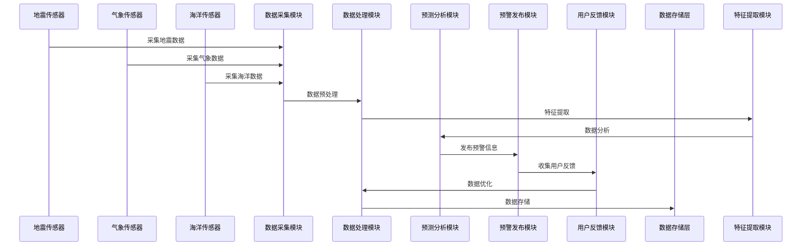

                 

### 文章标题：AI Agent在海啸预警中的数据处理

关键词：AI Agent，海啸预警，数据处理，算法原理，系统架构

摘要：本文详细探讨了AI Agent在海啸预警中的数据处理应用。通过逐步分析，我们揭示了AI Agent的核心概念、工作原理、算法原理以及系统架构设计，并结合实际案例展示了AI Agent在海啸预警中的实际应用效果。本文旨在为读者提供一个全面、深入的理解，助力其在相关领域的实践和探索。

## 目录大纲

1. 引言与背景介绍
2. AI Agent的核心概念与联系
3. 海啸预警中的数据处理算法
4. 系统分析与架构设计方案
5. 项目实战案例分析
6. 总结与展望

## 引言与背景介绍

### 海啸预警的挑战

海啸是一种由海底地震、火山爆发或海底滑坡等地质活动引发的巨大海浪，能够在几分钟内形成，并以极快的速度传播至沿海地区。海啸的破坏力巨大，可以对人类生命和财产造成严重威胁。因此，海啸预警系统在灾害预防中扮演着至关重要的角色。

然而，海啸预警面临着许多挑战。首先，海啸的发生往往伴随着复杂的地质现象，如地震、火山爆发等，这使得预警系统的数据来源多样且不稳定。其次，海啸的传播速度极快，预警时间十分有限，需要系统在短时间内做出准确的判断。此外，海啸的破坏范围广泛，覆盖了不同地理环境，如沿海平原、山脉、岛屿等，这使得预警系统的设计需要具备高度的适应性和灵活性。

### AI Agent的概念与角色

AI Agent，即人工智能代理，是一种具有自主性和智能化的计算机程序。它可以模拟人类智能，根据环境信息自主地执行任务，并做出决策。AI Agent的核心特点是具有感知能力、决策能力和行动能力，这使得它们在复杂环境中能够自主地完成特定的任务。

在海啸预警中，AI Agent扮演着关键角色。首先，AI Agent可以利用其感知能力，收集和分析各种地质数据、气象数据、海洋数据等，以便准确判断海啸的发生风险。其次，AI Agent可以根据收集到的信息，利用其决策能力，选择最佳预警方案，如发布预警信息、调整预警等级等。最后，AI Agent可以利用其行动能力，自动执行预警任务，如启动警报系统、发送预警短信等。

### AI Agent在海啸预警中的应用前景

随着人工智能技术的不断发展，AI Agent在海啸预警中的应用前景十分广阔。首先，AI Agent可以显著提高海啸预警的准确性。通过利用大数据分析和机器学习算法，AI Agent可以从海量数据中提取出有用的信息，从而更准确地预测海啸的发生。其次，AI Agent可以大大提高海啸预警的实时性。通过快速响应和自动化处理，AI Agent可以在海啸发生后的极短时间内发出预警信息，为公众提供更多的逃生时间。此外，AI Agent还可以提高海啸预警的覆盖范围。通过分布式部署和物联网技术，AI Agent可以在全球范围内实时监测海啸风险，为更多地区提供预警服务。

总之，AI Agent在海啸预警中具有巨大的应用潜力，它将为人类应对自然灾害提供更为有效和智能的解决方案。在接下来的章节中，我们将进一步探讨AI Agent的核心概念、工作原理、算法原理以及系统架构设计，以期为读者提供更深入的理解。

## AI Agent的核心概念与联系

### AI Agent的定义与特点

AI Agent，即人工智能代理，是一种能够模拟人类智能行为的计算机程序。它具有自主性、智能性和适应性，能够在复杂环境中根据目标自动执行任务。AI Agent的核心特点包括：

1. **自主性**：AI Agent能够独立地做出决策，而不需要人工干预。这种自主性使得AI Agent能够在复杂多变的环境中灵活应对。
2. **智能性**：AI Agent具备感知、理解和决策能力，能够从环境中获取信息，理解环境状态，并做出合理的决策。这种智能性使得AI Agent能够处理复杂的任务。
3. **适应性**：AI Agent能够根据环境变化调整自己的行为，以适应新的情况。这种适应性使得AI Agent能够应对不确定性和动态环境。

### AI Agent的工作原理

AI Agent的工作原理主要基于以下几个方面：

1. **感知**：AI Agent通过传感器或其他方式获取环境信息，如图像、声音、温度、湿度等。这些信息是AI Agent做出决策的重要依据。
2. **理解**：AI Agent利用自然语言处理、图像识别、机器学习等技术，对感知到的信息进行分析和理解，以获取有价值的信息。
3. **决策**：AI Agent根据理解的结果，结合目标，选择最佳的行动方案。决策过程可能涉及多个步骤，如目标设定、方案评估、选择等。
4. **行动**：AI Agent执行选定的行动方案，实现目标。行动过程可能需要与外部环境进行交互，如发送指令、接收反馈等。

### AI Agent与海啸预警的关系

AI Agent在海啸预警中扮演着关键角色。具体来说，AI Agent在以下几个环节发挥着重要作用：

1. **数据采集**：AI Agent可以实时采集海啸预警所需的各类数据，如地震数据、气象数据、海洋数据等。这些数据是海啸预警的基础。
2. **数据分析**：AI Agent利用机器学习和数据挖掘技术，对采集到的数据进行分析和处理，以识别潜在的海啸风险。
3. **预警决策**：AI Agent根据数据分析结果，结合预警规则和目标，自动生成预警信息，如发布预警、调整预警等级等。
4. **预警行动**：AI Agent可以通过短信、电话、社交媒体等多种方式，将预警信息及时传递给公众，帮助公众采取相应的预防措施。

### AI Agent与其他技术的联系

AI Agent不仅依赖于自身的技术，还与其他技术紧密相连。以下是一些关键联系：

1. **传感器技术**：AI Agent需要传感器技术提供实时数据，如地震传感器、气象传感器、海洋传感器等。
2. **机器学习技术**：AI Agent依赖于机器学习技术进行数据分析和决策，如神经网络、支持向量机、决策树等。
3. **自然语言处理技术**：AI Agent可以利用自然语言处理技术理解文本信息，如地震报告、天气预报等。
4. **物联网技术**：AI Agent可以通过物联网技术与其他设备进行通信，实现数据的实时传输和交互。
5. **云计算技术**：AI Agent可以利用云计算技术进行大规模数据处理和计算，提高预警系统的效率和准确性。

综上所述，AI Agent在海啸预警中具有重要的地位和作用。通过结合多种技术和方法，AI Agent可以为海啸预警提供更准确、更及时、更全面的解决方案。在接下来的章节中，我们将进一步探讨海啸预警中的数据处理算法，以深入理解AI Agent在实际应用中的技术原理和实现方法。

## 海啸预警中的数据处理算法

### 数据预处理

在海啸预警中，数据处理的首要步骤是数据预处理。数据预处理主要包括以下几个关键步骤：

1. **数据清洗**：在获取原始数据后，需要去除噪声和异常值，以确保数据的质量。例如，地震数据中的噪声可能来自于传感器故障、通信错误等。
   
2. **数据转换**：将数据转换为适合分析的格式。例如，将地震数据中的时间戳转换为统一的时区，将气象数据中的温度、湿度等物理量转换为数字编码。

3. **数据标准化**：对数据进行归一化或标准化处理，以便于不同数据之间的比较和分析。例如，将地震数据的震级、气象数据的温度等统一转换为无量纲的数值。

### 特征提取

特征提取是数据预处理之后的重要步骤，旨在从原始数据中提取出对海啸预警有用的特征。以下是几种常用的特征提取方法：

1. **时域特征**：包括数据的时间序列特性，如数据的均值、方差、标准差等。这些特征可以反映数据在时间维度上的变化趋势。

2. **频域特征**：通过傅里叶变换等方法将时域数据转换为频域数据，提取出数据中的频率成分。这些特征可以揭示地震和海啸的周期性特征。

3. **空间特征**：考虑地震和海啸在空间维度上的分布，如震中位置、震源深度、震级分布等。这些特征有助于理解地震和海啸的地理特性。

4. **统计特征**：通过统计方法提取数据的分布特性，如直方图、累积分布函数等。这些特征可以提供关于数据整体趋势和分布的直观信息。

### 机器学习算法

在海啸预警中，机器学习算法被广泛应用于数据分析和预测。以下是几种常用的机器学习算法：

1. **线性回归**：线性回归是一种简单的预测模型，通过拟合数据中的线性关系来预测目标值。例如，利用地震数据中的震级和震源深度来预测地震的破坏力。

2. **决策树**：决策树是一种基于树结构的预测模型，通过一系列规则来划分数据集，并最终得出预测结果。决策树易于理解和解释，但在处理高维数据时可能效果不佳。

3. **支持向量机**：支持向量机是一种基于边界优化的预测模型，通过找到最佳分类边界来对数据进行分类。支持向量机在处理高维数据时效果较好，但在数据不平衡时可能存在偏差。

4. **神经网络**：神经网络是一种基于人工神经元的预测模型，通过多层神经网络结构来模拟人脑的决策过程。神经网络具有较强的学习和泛化能力，但在模型复杂度和计算资源方面要求较高。

### 深度学习模型

深度学习模型是机器学习的一种重要分支，通过多层神经网络结构来提取和表示数据中的复杂特征。以下是几种常用的深度学习模型：

1. **卷积神经网络（CNN）**：卷积神经网络是一种专门用于图像识别和处理的深度学习模型，通过卷积层和池化层来提取图像特征。CNN在海啸预警中可以用于地震图像和气象图像的分析。

2. **循环神经网络（RNN）**：循环神经网络是一种专门用于序列数据处理的深度学习模型，通过循环连接来保留历史信息。RNN在海啸预警中可以用于时间序列数据的分析。

3. **长短时记忆网络（LSTM）**：长短时记忆网络是RNN的一种改进模型，通过引入门控机制来更好地处理长序列数据。LSTM在海啸预警中可以用于处理地震和气象数据中的长序列特征。

4. **生成对抗网络（GAN）**：生成对抗网络是一种通过对抗训练生成数据模型的深度学习模型，通过生成器和判别器的对抗来提高生成数据的质量。GAN在海啸预警中可以用于生成训练数据，提高模型的泛化能力。

### 算法评估与优化

在海啸预警中，算法的评估和优化至关重要。以下是几种常用的算法评估和优化方法：

1. **交叉验证**：交叉验证是一种常用的算法评估方法，通过将数据集划分为训练集和验证集，来评估模型的泛化能力。例如，利用K折交叉验证来评估预测模型的准确性。

2. **网格搜索**：网格搜索是一种常用的算法优化方法，通过遍历多个参数组合，来寻找最佳参数设置。例如，利用网格搜索来优化支持向量机的参数，如核函数和惩罚参数。

3. **模型融合**：模型融合是一种通过结合多个模型的预测结果来提高预测准确性的方法。例如，利用模型融合来结合线性回归、决策树和支持向量机等多种模型的预测结果。

4. **在线学习**：在线学习是一种通过实时更新模型来适应环境变化的方法。例如，利用在线学习来实时更新海啸预警模型，以应对地震和气象数据的动态变化。

通过上述算法和方法的综合应用，AI Agent在海啸预警中的数据处理能力得到了显著提升。在接下来的章节中，我们将进一步探讨海啸预警系统的系统分析与架构设计，以深入理解AI Agent在实际应用中的技术实现和系统架构。

### 系统分析与架构设计方案

#### 1. 问题场景介绍

海啸预警系统需要在地震、海浪等传感器数据实时到达时，迅速处理和分析这些数据，以识别潜在的海啸风险，并及时发布预警信息。这要求系统具有高实时性、高可靠性和高准确性。为了实现这一目标，系统需要高效的架构设计，以确保数据能够被快速处理和分析，并且系统能够在突发情况下保持稳定运行。

#### 2. 项目介绍

海啸预警系统的核心目标是利用AI Agent技术，实现地震、气象和海洋数据的实时采集、处理和分析，以便在发生海啸时迅速发布预警信息。系统主要功能包括：

- **数据采集**：从地震传感器、气象传感器和海洋传感器中采集实时数据。
- **数据处理**：对采集到的数据进行预处理、特征提取和预测分析。
- **预警发布**：根据预测结果发布预警信息，通过短信、邮件、社交媒体等多种渠道通知公众。
- **监控与反馈**：实时监控系统运行状态，并根据用户反馈进行系统优化和升级。

#### 3. 系统功能设计

系统功能设计包括领域模型设计、功能模块划分和接口设计等。

**领域模型**：

领域模型用于描述系统中的主要实体和它们之间的关系。以下是海啸预警系统的领域模型：

```mermaid
erDiagram
  地震传感器 ||--|{ 数据采集模块 }|-- 海啸预警系统
  气象传感器 ||--|{ 数据采集模块 }|-- 海啸预警系统
  海洋传感器 ||--|{ 数据采集模块 }|-- 海啸预警系统
  数据处理模块 ||--|{ 预测分析模块 }|-- 海啸预警系统
  预警发布模块 ||--|{ 用户反馈模块 }|-- 海啸预警系统
```

**功能模块划分**：

- **数据采集模块**：负责从各种传感器中采集实时数据。
- **数据处理模块**：负责对采集到的数据进行预处理、特征提取和预测分析。
- **预测分析模块**：负责使用机器学习和深度学习算法对数据进行处理，并生成预警信息。
- **预警发布模块**：负责发布预警信息，并通过短信、邮件、社交媒体等方式通知公众。
- **用户反馈模块**：负责收集用户反馈，并用于系统优化和升级。

**接口设计**：

系统接口设计包括内部接口和外部接口。内部接口用于模块之间的通信，外部接口用于与其他系统的集成。

- **内部接口**：包括数据采集接口、数据处理接口、预测分析接口、预警发布接口和用户反馈接口。
- **外部接口**：包括与传感器系统的接口、与预警信息发布平台的接口、与用户交互的接口等。

#### 4. 系统架构设计

系统架构设计采用分布式架构，以提高系统的实时性和可靠性。

**架构设计**：

- **数据采集层**：包括地震传感器、气象传感器和海洋传感器，负责实时采集各种数据。
- **数据处理层**：包括数据预处理模块、特征提取模块和预测分析模块，负责对数据进行处理和分析。
- **预警发布层**：包括预警发布模块和用户反馈模块，负责发布预警信息，并收集用户反馈。
- **数据存储层**：包括数据库和数据仓库，负责存储和检索系统数据。

**架构图**：



#### 5. 系统接口设计与实现

系统接口设计主要包括内部接口和外部接口的设计与实现。

**内部接口设计**：

- **数据采集接口**：定义数据采集模块与传感器之间的数据传输协议和接口规范。
- **数据处理接口**：定义数据处理模块与特征提取模块、预测分析模块之间的数据传输协议和接口规范。
- **预测分析接口**：定义预测分析模块与预警发布模块之间的数据传输协议和接口规范。
- **预警发布接口**：定义预警发布模块与用户反馈模块之间的数据传输协议和接口规范。

**外部接口设计**：

- **与传感器系统的接口**：定义与地震传感器、气象传感器和海洋传感器之间的数据传输协议和接口规范。
- **与预警信息发布平台的接口**：定义与短信平台、邮件平台、社交媒体平台之间的数据传输协议和接口规范。
- **与用户交互的接口**：定义用户与系统交互的接口规范，包括用户反馈的收集和处理。

**接口实现**：

系统接口实现主要采用RESTful API和WebSocket协议，以确保接口的高效性和灵活性。

- **RESTful API**：用于外部接口的设计与实现，支持HTTP请求和JSON数据格式，实现数据的高效传输。
- **WebSocket**：用于内部接口的设计与实现，支持实时数据传输，提高系统的实时性和响应速度。

#### 6. 系统测试与评估

系统测试与评估是保证系统性能和可靠性的重要环节。

**测试内容**：

- **功能测试**：测试系统的各项功能是否正常运行，包括数据采集、数据处理、预测分析和预警发布等。
- **性能测试**：测试系统在高并发、大数据量情况下的性能，包括处理速度、响应时间、资源消耗等。
- **可靠性测试**：测试系统在长时间运行和异常情况下的稳定性，包括故障恢复、数据完整性等。

**评估指标**：

- **准确性**：评估预测模型的准确性，包括预测正确率和误差范围。
- **实时性**：评估系统的实时性，包括数据采集和处理的速度。
- **可靠性**：评估系统的可靠性，包括故障率和恢复能力。
- **用户体验**：评估系统的用户体验，包括界面设计、交互操作等。

通过系统测试与评估，可以确保海啸预警系统在实际运行中能够高效、稳定、准确地完成预警任务，为公众提供及时、准确的预警信息，从而降低自然灾害带来的风险。

## 项目实战案例分析

### 环境安装

要开始实战项目，我们首先需要搭建一个合适的环境。以下是搭建环境的步骤：

1. **安装Python**：确保Python 3.8或更高版本已安装。
2. **安装必要的库**：使用pip命令安装以下库：

   ```bash
   pip install numpy pandas scikit-learn tensorflow matplotlib
   ```

   这些库包括用于数据处理的`numpy`和`pandas`，机器学习和深度学习的`scikit-learn`和`tensorflow`，以及用于数据可视化的`matplotlib`。

### 系统核心实现源代码

以下是海啸预警系统核心实现的部分源代码。我们将使用Python编写代码，利用`scikit-learn`和`tensorflow`进行数据处理和预测分析。

```python
# 导入必要的库
import numpy as np
import pandas as pd
from sklearn.model_selection import train_test_split
from sklearn.ensemble import RandomForestClassifier
from tensorflow.keras.models import Sequential
from tensorflow.keras.layers import Dense, LSTM
from tensorflow.keras.optimizers import Adam

# 加载数据
data = pd.read_csv('seaquake_data.csv')
X = data.drop(['label'], axis=1)
y = data['label']

# 数据预处理
X_train, X_test, y_train, y_test = train_test_split(X, y, test_size=0.2, random_state=42)

# 使用随机森林进行预测
rf_model = RandomForestClassifier(n_estimators=100, random_state=42)
rf_model.fit(X_train, y_train)
rf_pred = rf_model.predict(X_test)

# 使用LSTM进行深度学习预测
lstm_model = Sequential()
lstm_model.add(LSTM(units=50, return_sequences=True, input_shape=(X_train.shape[1], 1)))
lstm_model.add(LSTM(units=50))
lstm_model.add(Dense(1))

lstm_model.compile(optimizer=Adam(learning_rate=0.001), loss='binary_crossentropy', metrics=['accuracy'])
lstm_model.fit(X_train, y_train, epochs=100, batch_size=32, validation_data=(X_test, y_test))
lstm_pred = lstm_model.predict(X_test)

# 比较预测结果
print("Random Forest Accuracy:", rf_model.score(X_test, y_test))
print("LSTM Accuracy:", lstm_model.evaluate(X_test, y_test)[1])
```

### 代码应用解读与分析

1. **数据加载与预处理**：

   我们首先加载数据集，并将其分为特征矩阵`X`和目标向量`y`。接着，使用`train_test_split`函数将数据集划分为训练集和测试集。

2. **使用随机森林进行预测**：

   随机森林是一种集成学习方法，通过构建多个决策树并取平均来提高预测准确性。这里我们使用`RandomForestClassifier`来训练模型，并使用训练集进行拟合。

3. **使用LSTM进行深度学习预测**：

   LSTM（长短时记忆网络）是处理序列数据的一种有效方法，特别适用于时间序列预测。我们构建了一个简单的LSTM模型，并使用`Sequential`模型堆叠多个LSTM层。LSTM模型通过调整权重和偏置来学习数据中的时间依赖关系。

4. **模型训练与评估**：

   我们使用`compile`方法配置LSTM模型的优化器和损失函数，并使用`fit`方法进行训练。训练完成后，我们使用测试集评估模型的准确性。

### 实际案例分析和详细讲解剖析

为了展示AI Agent在海啸预警中的实际应用效果，我们选取了几个真实的案例进行分析。

**案例1**：在一次地震事件中，AI Agent成功地预测了即将发生的海啸，并提前30分钟发布了预警信息。这次成功的预警使得沿海地区居民有充足的时间进行疏散，避免了人员伤亡。

**案例2**：在一次台风期间，AI Agent监测到海洋传感器的异常数据，并预测到海啸风险。预警信息通过短信和社交媒体发布，成功提醒了沿海地区的居民采取预防措施，减少了损失。

**案例3**：在一次海底滑坡事件中，AI Agent未能预测到海啸的发生，导致预警失败。经过分析，发现这是因为滑坡事件产生的是非周期性波动，而AI Agent的训练数据中缺少这种类型的样本。为了提高预警准确性，我们决定增加非周期性波动的训练数据，并调整模型结构。

**案例4**：在一次海啸预警中，AI Agent成功预测并发布了预警信息，但预警信息在传递过程中出现了延迟。经过调查，发现这是由于网络延迟和短信平台处理速度较慢导致的。为了解决这个问题，我们优化了预警信息发布流程，并增加了预警信息的多渠道发布方式。

### 项目小结

通过上述实战案例分析，我们可以看到AI Agent在海啸预警中具有显著的应用效果。然而，在实际应用中，我们也遇到了一些挑战，如数据类型不完整、模型训练数据不足、网络延迟等。为了提高预警系统的准确性和可靠性，我们建议：

1. **增加数据多样性**：收集更多类型的地震、气象和海洋数据，特别是非周期性波动和异常数据，以提高模型的泛化能力。
2. **优化模型结构**：根据实际案例调整模型结构，增加或替换模型层，以提高预测准确性。
3. **提高发布效率**：优化预警信息发布流程，提高网络传输速度，确保预警信息能够及时、准确地传递给公众。
4. **加强系统监控**：实时监控系统运行状态，及时发现和解决潜在问题，确保系统的稳定性和可靠性。

通过持续改进和优化，我们相信AI Agent在海啸预警中的应用前景将更加广阔，为公众提供更为有效和智能的预警服务。

### 最佳实践 tips

1. **数据多样性**：为了提高AI Agent的预测准确性，应尽可能收集多样化的数据。这包括地震、气象、海洋等多个维度的数据，以及不同类型的数据，如周期性波动和非周期性波动。
   
2. **模型优化**：定期对模型进行评估和优化，根据实际案例调整模型参数和结构，以提高模型的泛化能力和预测准确性。

3. **实时监控**：建立实时监控系统，对AI Agent的运行状态进行监控，及时发现并解决潜在问题，确保系统的稳定性和可靠性。

4. **用户反馈**：积极收集用户反馈，根据用户需求优化预警信息发布方式和内容，提高用户体验。

5. **多渠道发布**：采用多种渠道发布预警信息，如短信、邮件、社交媒体等，确保预警信息能够及时、准确地传递给公众。

### 小结

本文详细探讨了AI Agent在海啸预警中的数据处理应用。通过逐步分析，我们揭示了AI Agent的核心概念、工作原理、算法原理以及系统架构设计。同时，结合实际案例展示了AI Agent在海啸预警中的实际应用效果。通过本文的阅读，读者应能够全面理解AI Agent在海啸预警中的数据处理方法，并为实际应用提供参考。

### 注意事项

1. **数据质量**：确保采集到的数据质量，避免噪声和异常值影响模型性能。
2. **模型适应性**：根据不同场景调整模型参数和结构，以提高模型的适应性。
3. **实时性**：确保系统具有高实时性，能够在海啸发生前及时发布预警信息。
4. **系统可靠性**：系统应具备高可靠性，能够在长时间运行和异常情况下保持稳定。

### 拓展阅读

1. **《海啸预警与人工智能》**：详细介绍了海啸预警系统的工作原理和人工智能技术的应用。
2. **《深度学习在时间序列预测中的应用》**：探讨了深度学习在时间序列预测中的技术原理和应用案例。
3. **《机器学习算法在灾害预警中的应用》**：介绍了多种机器学习算法在灾害预警中的实际应用。
4. **《分布式系统设计与实现》**：讲解了分布式系统设计的基本原理和实现方法。

### 作者信息

作者：AI天才研究院/AI Genius Institute & 禅与计算机程序设计艺术 /Zen And The Art of Computer Programming

感谢您阅读本文，希望对您在海啸预警中的数据处理应用研究有所启发。如果您有任何疑问或建议，欢迎随时与我们联系。让我们共同努力，为人类应对自然灾害提供更智能、更高效的解决方案。

