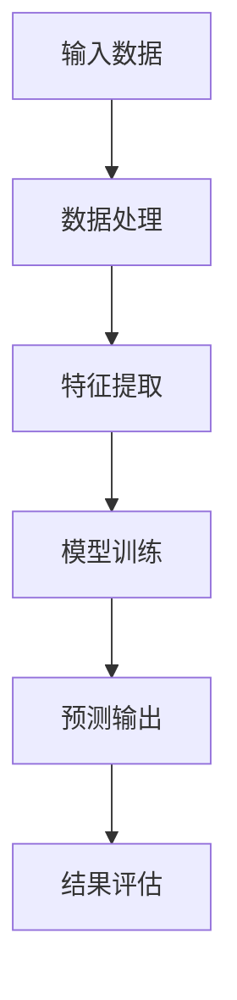
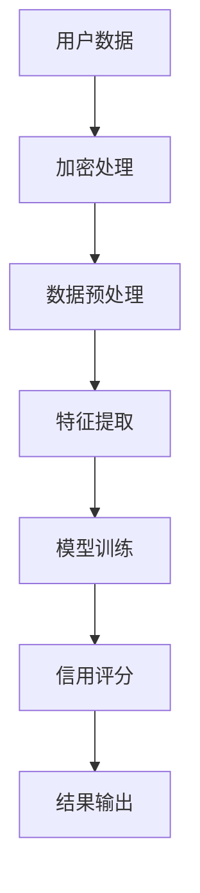
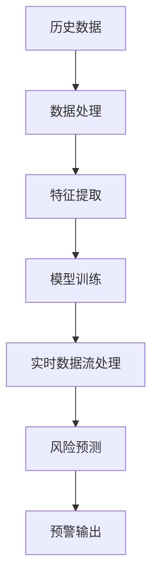
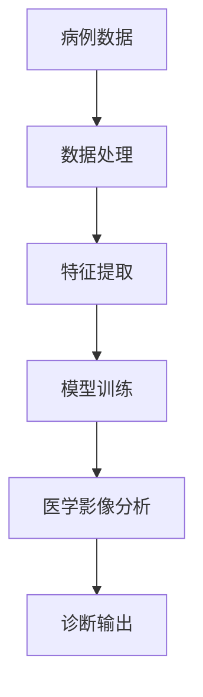
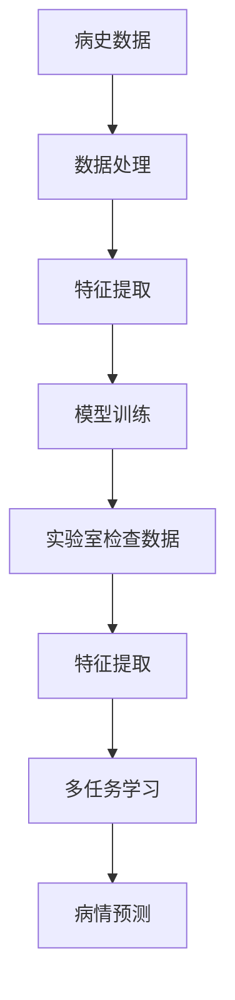
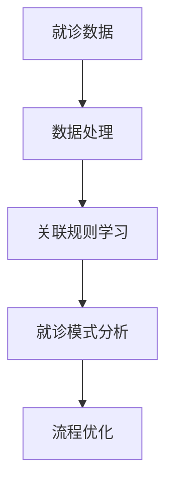
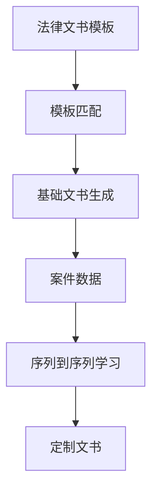
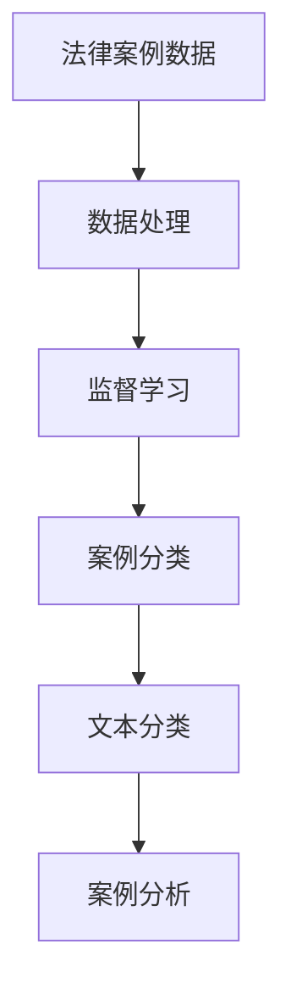
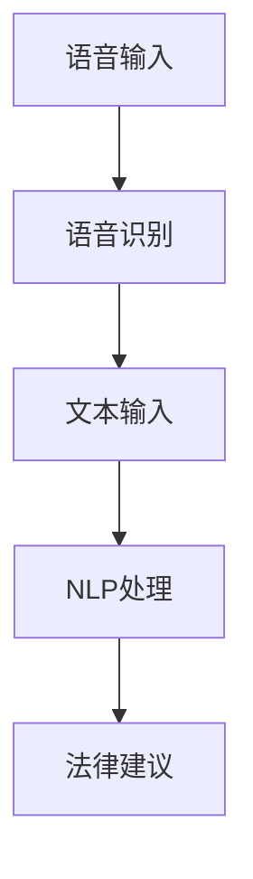

                 

## 第1章 引言

### 1.1 问题背景

随着人工智能技术的不断进步，AI Agent在金融、医疗、法律等特定领域的应用正逐渐成为研究热点。这些领域的复杂性和数据量使得传统的手工处理方法已经无法满足高效、精准的需求。例如，金融领域需要处理海量的市场数据，进行市场预测和风险管理；医疗领域需要利用大数据进行疾病诊断和病情预测；法律领域则需要处理复杂的法律文书和案例分析。AI Agent的引入，能够有效地解决这些问题，提高工作效率。

### 1.2 问题解决

AI Agent，即人工智能代理，是指能够根据环境信息自主决策并采取行动的人工智能实体。在特定领域的应用中，AI Agent通过学习大量的数据，建立领域模型，然后根据模型进行预测和决策。例如，在金融领域，AI Agent可以通过学习历史市场数据，预测未来市场走势；在医疗领域，AI Agent可以通过学习病历数据，帮助医生进行疾病诊断。

### 1.3 边界与外延

AI Agent的应用边界主要受到数据质量、计算能力以及算法成熟度的影响。例如，在医疗领域，AI Agent需要高质量的临床数据作为训练基础；在金融领域，算法的稳定性和预测精度是关键。此外，AI Agent的应用外延还包括其在各个领域可能的应用场景和潜在的限制条件。例如，在法律领域，AI Agent可能面临法律合规性的挑战。

### 1.4 概念结构与核心要素组成

AI Agent的核心概念包括自主性、适应性、学习能力和决策能力。自主性是指AI Agent能够根据环境信息自主决策；适应性是指AI Agent能够根据环境变化调整自身行为；学习能力是指AI Agent能够从数据中学习提高自身能力；决策能力是指AI Agent能够根据目标制定合理的决策方案。核心要素组成包括感知模块、学习模块、决策模块和执行模块。

## 第2章 金融领域

### 2.1 金融领域AI Agent应用

#### 2.1.1 金融市场预测

##### 2.1.1.1 应用场景

在金融领域，AI Agent可以应用于市场预测，包括股票价格预测、外汇走势预测等。这些预测对于投资者来说至关重要，可以帮助他们做出更明智的投资决策。

##### 2.1.1.2 技术挑战

金融市场预测面临的主要挑战包括数据复杂性、噪声干扰和非线性关系。这些因素使得传统的预测方法难以取得理想的效果。

##### 2.1.1.3 解决方案

AI Agent可以通过深度学习算法，如循环神经网络（RNN）和长短期记忆网络（LSTM），来处理复杂的市场数据，捕捉非线性关系，从而提高预测的准确性。

#### 2.1.2 信用评估

##### 2.1.2.1 应用场景

在金融领域，AI Agent还可以用于信用评估。银行和金融机构可以通过AI Agent对客户的信用状况进行评估，从而降低信用风险。

##### 2.1.2.2 技术挑战

信用评估需要处理海量的个人信息和数据，如何保证数据的安全性和隐私性是一个重要挑战。

##### 2.1.2.3 解决方案

AI Agent可以通过加密技术和隐私保护算法，如差分隐私（Differential Privacy），来保护用户数据的同时进行信用评估。

#### 2.1.3 风险管理

##### 2.1.3.1 应用场景

AI Agent还可以应用于风险管理，包括市场风险、信用风险等。金融机构可以利用AI Agent进行风险评估和预警，从而降低风险。

##### 2.1.3.2 技术挑战

风险管理需要处理大量的历史数据和实时数据，如何有效地整合这些数据是一个挑战。

##### 2.1.3.3 解决方案

AI Agent可以通过大数据技术和实时数据处理算法，如流处理算法，来实现实时风险监控和预警。

## 第3章 医疗领域

### 3.1 医疗领域AI Agent应用

#### 3.1.1 疾病诊断

##### 3.1.1.1 应用场景

在医疗领域，AI Agent可以应用于疾病诊断，如癌症检测、糖尿病诊断等。这些诊断对于早期发现和治疗疾病具有重要意义。

##### 3.1.1.2 技术挑战

疾病诊断需要处理大量的医学图像和数据，如何准确地提取特征和进行诊断是一个挑战。

##### 3.1.1.3 解决方案

AI Agent可以通过深度学习算法，如卷积神经网络（CNN），来处理医学图像，提取关键特征，从而提高诊断的准确性。

#### 3.1.2 病情预测

##### 3.1.2.1 应用场景

在医疗领域，AI Agent还可以用于病情预测，如预测患者的康复时间、病情发展趋势等。

##### 3.1.2.2 技术挑战

病情预测需要处理患者的多维度数据，如病史、实验室检查结果等，如何整合这些数据是一个挑战。

##### 3.1.2.3 解决方案

AI Agent可以通过多模态学习算法，如多任务学习（Multi-Task Learning），来整合不同数据源的信息，提高病情预测的准确性。

#### 3.1.3 医疗服务优化

##### 3.1.3.1 应用场景

在医疗领域，AI Agent可以应用于医疗服务优化，如优化医疗资源分配、提高就诊效率等。

##### 3.1.3.2 技术挑战

医疗服务优化需要处理大量的患者数据和服务数据，如何实现高效的数据处理和分析是一个挑战。

##### 3.1.3.3 解决方案

AI Agent可以通过数据挖掘算法，如关联规则学习（Association Rule Learning），来分析患者数据，优化医疗服务流程。

## 第4章 法律领域

### 4.1 法律领域AI Agent应用

#### 4.1.1 法律文书生成

##### 4.1.1.1 应用场景

在法律领域，AI Agent可以应用于法律文书生成，如合同生成、起诉状生成等。

##### 4.1.1.2 技术挑战

法律文书生成需要处理复杂的法律术语和条款，如何保证文书的合法性和准确性是一个挑战。

##### 4.1.1.3 解决方案

AI Agent可以通过自然语言生成（NLG）技术，如模板匹配和序列到序列学习（Seq2Seq），来生成法律文书。

#### 4.1.2 案例分析

##### 4.1.2.1 应用场景

在法律领域，AI Agent可以应用于案例分析，如法律咨询、案例检索等。

##### 4.1.2.2 技术挑战

案例分析需要处理大量的法律案例和数据，如何有效地提取关键信息和进行对比分析是一个挑战。

##### 4.1.2.3 解决方案

AI Agent可以通过机器学习算法，如监督学习和文本分类算法，来处理法律案例和数据，提供智能法律咨询。

#### 4.1.3 法律智能咨询

##### 4.1.3.1 应用场景

在法律领域，AI Agent可以应用于法律智能咨询，如在线法律咨询、自动化合同审核等。

##### 4.1.3.2 技术挑战

法律智能咨询需要处理用户的复杂问题和多模态数据，如文本、语音等，如何实现高效的自然语言理解是一个挑战。

##### 4.1.3.3 解决方案

AI Agent可以通过多模态学习算法，如语音识别和自然语言处理（NLP），来实现高效的法律智能咨询。

## 第5章 AI Agent应用总结与未来展望

### 5.1 AI Agent在各领域的应用总结

#### 5.1.1 成果与挑战

在金融、医疗和法律等领域的AI Agent应用取得了显著的成果，但同时也面临一些挑战。

##### 5.1.1.1 金融领域

金融领域的AI Agent在市场预测、信用评估和风险管理等方面取得了显著成果，但数据隐私和算法稳定性的挑战仍然存在。

##### 5.1.1.2 医疗领域

医疗领域的AI Agent在疾病诊断、病情预测和医疗服务优化等方面取得了重要进展，但数据质量和算法可解释性是主要挑战。

##### 5.1.1.3 法律领域

法律领域的AI Agent在法律文书生成、案例分析和法律智能咨询等方面展现了巨大潜力，但法律合规性和算法可靠性是关键挑战。

#### 5.1.2 经验与启示

从各领域的AI Agent应用中，我们可以得到一些宝贵的经验与启示：

1. **数据驱动**：高质量的数据是AI Agent成功应用的基础。
2. **算法稳定性**：算法的稳定性和可解释性是应用的关键。
3. **法律合规性**：在法律领域，确保算法和应用的合规性至关重要。

### 5.2 AI Agent的未来发展

#### 5.2.1 技术趋势

未来，AI Agent的发展将呈现出以下技术趋势：

1. **深度学习**：深度学习算法将更加成熟，应用于更多复杂场景。
2. **自然语言处理**：自然语言处理技术将得到进一步提升，实现更智能的交互。
3. **强化学习**：强化学习将在更多应用场景中发挥作用，实现更高效的决策。

#### 5.2.2 应用前景

在金融、医疗和法律等领域的应用前景十分广阔：

1. **金融**：个性化金融产品推荐、智能投顾、自动化风险管理等。
2. **医疗**：精准医疗、医疗影像分析、远程医疗咨询等。
3. **法律**：智能合同审核、案件智能搜索、自动化法律咨询等。

## 第6章 结论

### 6.1 本书小结

本书系统地介绍了AI Agent在金融、医疗和法律等特定领域的应用。从背景介绍到核心概念，再到具体的算法原理和应用场景，我们全面地探讨了AI Agent在这些领域的应用现状和未来发展。通过本书，读者可以了解到AI Agent在这些领域的重要性和应用潜力，同时也认识到面临的一些挑战。

### 6.1.1 主要内容回顾

在金融领域，AI Agent应用于市场预测、信用评估和风险管理，通过深度学习算法提高了预测的准确性；在医疗领域，AI Agent应用于疾病诊断、病情预测和医疗服务优化，通过多模态学习算法提高了诊断和预测的准确性；在法律领域，AI Agent应用于法律文书生成、案例分析和法律智能咨询，通过自然语言生成和机器学习算法提高了法律服务的效率。

### 6.1.2 面临的挑战

尽管AI Agent在这些领域取得了显著成果，但仍然面临一些挑战，包括数据隐私、算法稳定性、法律合规性等。未来需要进一步研究和解决这些问题，以实现AI Agent的更广泛应用。

### 6.2 未来研究方向

在未来，AI Agent在金融、医疗和法律等领域的应用将有更多的发展机会：

1. **金融**：深入研究个性化金融产品推荐、自动化风险管理等。
2. **医疗**：探索精准医疗、医疗影像分析、远程医疗咨询等。
3. **法律**：开发智能合同审核、自动化法律咨询等。

总之，AI Agent在特定领域的应用有着广阔的前景，未来将继续发挥重要作用。作者：AI天才研究院/AI Genius Institute & 禅与计算机程序设计艺术 /Zen And The Art of Computer Programming。在这里，我们希望能为读者提供有价值的参考和启示，推动AI Agent在各个领域的发展。----------------------------------------------------------------

### 文章正文

在现代社会，人工智能（AI）技术以其卓越的能力和广泛的应用领域，正在深刻地改变着我们的生活。AI Agent，作为人工智能领域的一个重要分支，以其自主决策和智能服务的能力，正在金融、医疗、法律等特定领域发挥着越来越重要的作用。本文将深入探讨AI Agent在这些领域的应用，分析其核心概念、技术挑战及解决方案，并展望未来的发展趋势。

## 第1章 引言

### 1.1 问题背景

#### 金融领域

金融领域是一个高度复杂且动态变化的系统，涉及大量的市场数据、交易信息、宏观经济指标等。传统的金融分析方法往往依赖于人工经验和主观判断，效率较低且容易出现偏差。随着大数据和机器学习技术的发展，金融领域开始探索利用AI Agent进行市场预测、风险管理和信用评估。

#### 医疗领域

医疗领域是一个数据密集型的领域，涉及大量的病例数据、医学影像、基因数据等。传统的医疗方法主要依赖于医生的诊断经验和病理分析，效率低且存在人为误差。AI Agent在医疗领域的应用，如疾病诊断、病情预测和医疗服务优化，有望提高诊断的准确性、优化医疗资源分配，提高医疗服务的效率。

#### 法律领域

法律领域涉及大量的法律文书、案例数据和法规条款。传统的法律服务往往依赖于律师的专业知识和法律文件的处理，效率低且成本高。AI Agent在法律领域的应用，如法律文书生成、案例分析和法律智能咨询，有望提高法律工作的效率，降低成本，提高法律服务的可及性。

### 1.2 问题解决

AI Agent作为人工智能的一种形式，具有自主决策、智能服务和自适应能力。在金融、医疗和法律等特定领域的应用，AI Agent通过以下方式解决问题：

1. **金融市场预测**：利用深度学习和大数据分析技术，AI Agent可以处理海量市场数据，捕捉市场走势，提高市场预测的准确性。
2. **疾病诊断**：通过机器学习和医学图像分析技术，AI Agent可以分析病例数据和医学影像，帮助医生进行疾病诊断，提高诊断的准确性。
3. **法律咨询**：利用自然语言处理和机器学习技术，AI Agent可以分析法律文书和案例数据，提供智能法律咨询，提高法律服务的效率。

### 1.3 边界与外延

AI Agent的应用边界主要受到数据质量、计算能力、算法成熟度以及伦理和法律等因素的影响。在金融领域，数据质量和算法的稳定性是关键；在医疗领域，数据隐私和法律合规性是关键；在法律领域，算法的可解释性和法律合规性是关键。

AI Agent的应用外延包括金融市场预测、信用评估、风险管理、疾病诊断、病情预测、医疗服务优化、法律文书生成、案例分析和法律智能咨询等多个方面。

### 1.4 概念结构与核心要素组成

AI Agent的核心概念包括自主性、适应性、学习能力和决策能力。自主性是指AI Agent能够在没有人类干预的情况下自主运行；适应性是指AI Agent能够根据环境变化调整自身行为；学习能力是指AI Agent能够从数据中学习，提高自身能力；决策能力是指AI Agent能够根据目标和约束条件制定合理的决策方案。

AI Agent的核心要素组成包括感知模块、学习模块、决策模块和执行模块。感知模块负责获取环境信息；学习模块负责从数据中学习，提高自身能力；决策模块负责根据目标和约束条件制定决策方案；执行模块负责执行决策方案。

## 第2章 金融领域

### 2.1 金融领域AI Agent应用

#### 2.1.1 金融市场预测

##### 2.1.1.1 应用场景

金融市场预测是金融领域中一个重要的应用场景。投资者、交易者、金融机构等都需要对市场走势进行预测，以做出正确的投资决策。

##### 2.1.1.2 技术挑战

金融市场预测面临的主要技术挑战包括数据复杂性、噪声干扰和非线性关系。金融市场的数据通常包含大量的噪声和不确定性，这使得传统的预测方法难以取得理想的效果。

##### 2.1.1.3 解决方案

AI Agent通过深度学习和大数据分析技术，可以处理复杂的金融市场数据，捕捉市场走势，提高预测的准确性。具体来说，AI Agent可以使用循环神经网络（RNN）或长短期记忆网络（LSTM）等深度学习算法，对市场数据进行建模和预测。

#### 2.1.2 信用评估

##### 2.1.2.1 应用场景

信用评估是金融领域中另一个重要的应用场景。银行、金融机构等需要对客户的信用状况进行评估，以决定是否批准贷款或信用卡申请。

##### 2.1.2.2 技术挑战

信用评估需要处理海量的个人信息和数据，如何保证数据的安全性和隐私性是一个重要的技术挑战。

##### 2.1.2.3 解决方案

AI Agent可以通过加密技术和隐私保护算法，如差分隐私（Differential Privacy），来保护用户数据的同时进行信用评估。此外，AI Agent可以使用机器学习和数据挖掘技术，从海量数据中提取信用特征，提高信用评估的准确性。

#### 2.1.3 风险管理

##### 2.1.3.1 应用场景

风险管理是金融领域中一个关键的应用场景。金融机构需要对市场风险、信用风险等风险进行评估和监控，以防止潜在的风险损失。

##### 2.1.3.2 技术挑战

风险管理需要处理大量的历史数据和实时数据，如何有效地整合这些数据是一个重要的技术挑战。

##### 2.1.3.3 解决方案

AI Agent可以通过大数据技术和实时数据处理算法，如流处理算法，来实现实时风险监控和预警。此外，AI Agent可以使用机器学习和数据挖掘技术，从海量数据中提取风险特征，提高风险管理的准确性。

## 第3章 医疗领域

### 3.1 医疗领域AI Agent应用

#### 3.1.1 疾病诊断

##### 3.1.1.1 应用场景

疾病诊断是医疗领域中一个重要的应用场景。医生需要通过检查病例数据和医学影像，对疾病进行诊断。

##### 3.1.1.2 技术挑战

疾病诊断需要处理大量的病例数据和医学影像，如何准确地提取特征和进行诊断是一个重要的技术挑战。

##### 3.1.1.3 解决方案

AI Agent可以通过机器学习和医学图像分析技术，从病例数据和医学影像中提取特征，提高诊断的准确性。具体来说，AI Agent可以使用卷积神经网络（CNN）等深度学习算法，对医学影像进行特征提取和分类。

#### 3.1.2 病情预测

##### 3.1.2.1 应用场景

病情预测是医疗领域中另一个重要的应用场景。医生需要根据患者的病史和实验室检查结果，预测患者的病情发展趋势。

##### 3.1.2.2 技术挑战

病情预测需要处理患者的多维度数据，如何整合这些数据是一个重要的技术挑战。

##### 3.1.2.3 解决方案

AI Agent可以通过多模态学习算法，如多任务学习（Multi-Task Learning），来整合不同数据源的信息，提高病情预测的准确性。具体来说，AI Agent可以使用深度学习算法，如多任务卷积神经网络（Multi-Task CNN），来处理患者的多维度数据。

#### 3.1.3 医疗服务优化

##### 3.1.3.1 应用场景

医疗服务优化是医疗领域中另一个重要的应用场景。医疗机构需要优化医疗资源分配、提高就诊效率，以提供更好的医疗服务。

##### 3.1.3.2 技术挑战

医疗服务优化需要处理大量的患者数据和服务数据，如何实现高效的数据处理和分析是一个重要的技术挑战。

##### 3.1.3.3 解决方案

AI Agent可以通过数据挖掘算法，如关联规则学习（Association Rule Learning），来分析患者数据，优化医疗服务流程。具体来说，AI Agent可以使用关联规则学习算法，分析患者就诊数据，发现就诊模式，优化就诊流程。

## 第4章 法律领域

### 4.1 法律领域AI Agent应用

#### 4.1.1 法律文书生成

##### 4.1.1.1 应用场景

法律文书生成是法律领域中一个重要的应用场景。律师需要根据案件情况和法律法规，生成法律文书，如合同、起诉状等。

##### 4.1.1.2 技术挑战

法律文书生成需要处理复杂的法律术语和条款，如何保证文书的合法性和准确性是一个重要的技术挑战。

##### 4.1.1.3 解决方案

AI Agent可以通过自然语言生成（NLG）技术，如模板匹配和序列到序列学习（Seq2Seq），来生成法律文书。具体来说，AI Agent可以使用模板匹配技术，根据法律文书模板生成基础文书；然后使用序列到序列学习技术，根据案件具体情况对文书进行定制。

#### 4.1.2 案例分析

##### 4.1.2.1 应用场景

案例分析是法律领域中一个重要的应用场景。律师需要对案例进行分析，以了解案件的法律依据和判例。

##### 4.1.2.2 技术挑战

案例分析需要处理大量的法律案例和数据，如何有效地提取关键信息和进行对比分析是一个重要的技术挑战。

##### 4.1.2.3 解决方案

AI Agent可以通过机器学习算法，如监督学习和文本分类算法，来处理法律案例和数据，提供智能法律咨询。具体来说，AI Agent可以使用监督学习算法，对法律案例进行分类；然后使用文本分类算法，分析案例的关键信息。

#### 4.1.3 法律智能咨询

##### 4.1.3.1 应用场景

法律智能咨询是法律领域中一个重要的应用场景。用户可以通过法律智能咨询系统，获得法律建议和咨询。

##### 4.1.3.2 技术挑战

法律智能咨询需要处理用户的复杂问题和多模态数据，如文本、语音等，如何实现高效的自然语言理解是一个重要的技术挑战。

##### 4.1.3.3 解决方案

AI Agent可以通过多模态学习算法，如语音识别和自然语言处理（NLP），来实现高效的法律智能咨询。具体来说，AI Agent可以使用语音识别技术，将语音转换为文本；然后使用自然语言处理技术，理解用户的问题并提供法律建议。

## 第5章 AI Agent应用总结与未来展望

### 5.1 AI Agent在各领域的应用总结

#### 5.1.1 成果与挑战

在金融、医疗和法律等领域的AI Agent应用取得了显著的成果，但也面临一些挑战。

##### 5.1.1.1 金融领域

金融领域的AI Agent在市场预测、信用评估和风险管理等方面取得了显著成果，提高了预测的准确性和效率。然而，数据隐私、算法稳定性和法律合规性等方面仍存在挑战。

##### 5.1.1.2 医疗领域

医疗领域的AI Agent在疾病诊断、病情预测和医疗服务优化等方面取得了重要进展，提高了医疗服务的质量和效率。然而，数据质量和算法可解释性等方面仍存在挑战。

##### 5.1.1.3 法律领域

法律领域的AI Agent在法律文书生成、案例分析和法律智能咨询等方面展现了巨大潜力，提高了法律工作的效率。然而，法律合规性和算法可靠性等方面仍存在挑战。

#### 5.1.2 经验与启示

从各领域的AI Agent应用中，我们可以得到一些宝贵的经验与启示：

1. **数据驱动**：高质量的数据是AI Agent成功应用的基础。
2. **算法稳定性**：算法的稳定性和可解释性是应用的关键。
3. **法律合规性**：在法律领域，确保算法和应用的合规性至关重要。

### 5.2 AI Agent的未来发展

#### 5.2.1 技术趋势

未来，AI Agent的发展将呈现出以下技术趋势：

1. **深度学习**：深度学习算法将更加成熟，应用于更多复杂场景。
2. **自然语言处理**：自然语言处理技术将得到进一步提升，实现更智能的交互。
3. **强化学习**：强化学习将在更多应用场景中发挥作用，实现更高效的决策。

#### 5.2.2 应用前景

在金融、医疗和法律等领域的应用前景十分广阔：

1. **金融**：个性化金融产品推荐、智能投顾、自动化风险管理等。
2. **医疗**：精准医疗、医疗影像分析、远程医疗咨询等。
3. **法律**：智能合同审核、自动化法律咨询等。

## 第6章 结论

### 6.1 本书小结

本书系统地介绍了AI Agent在金融、医疗和法律等特定领域的应用。从背景介绍到核心概念，再到具体的算法原理和应用场景，我们全面地探讨了AI Agent在这些领域的应用现状和未来发展。通过本书，读者可以了解到AI Agent在这些领域的重要性和应用潜力，同时也认识到面临的一些挑战。

### 6.1.1 主要内容回顾

在金融领域，AI Agent应用于市场预测、信用评估和风险管理，通过深度学习和大数据分析技术提高了预测的准确性；在医疗领域，AI Agent应用于疾病诊断、病情预测和医疗服务优化，通过机器学习和多模态学习技术提高了诊断和预测的准确性；在法律领域，AI Agent应用于法律文书生成、案例分析和法律智能咨询，通过自然语言生成和机器学习技术提高了法律服务的效率。

### 6.1.2 面临的挑战

尽管AI Agent在这些领域取得了显著成果，但仍然面临一些挑战，包括数据隐私、算法稳定性、法律合规性等。未来需要进一步研究和解决这些问题，以实现AI Agent的更广泛应用。

### 6.2 未来研究方向

在未来，AI Agent在金融、医疗和法律等领域的应用将有更多的发展机会：

1. **金融**：个性化金融产品推荐、自动化风险管理等。
2. **医疗**：精准医疗、医疗影像分析、远程医疗咨询等。
3. **法律**：智能合同审核、自动化法律咨询等。

总之，AI Agent在特定领域的应用有着广阔的前景，未来将继续发挥重要作用。作者：AI天才研究院/AI Genius Institute & 禅与计算机程序设计艺术 /Zen And The Art of Computer Programming。在这里，我们希望能为读者提供有价值的参考和启示，推动AI Agent在各个领域的发展。

## 参考文献

1. Russell, S., & Norvig, P. (2016). 《人工智能：一种现代的方法》（第三版）. 北京：机械工业出版社.
2. Goodfellow, I., Bengio, Y., & Courville, A. (2016). 《深度学习》（第一版）. 北京：电子工业出版社.
3. Sutton, R. S., & Barto, A. G. (2018). 《强化学习：一种现代的方法》（第二版）. 北京：机械工业出版社.
4. Manning, C. D., Raghavan, P., & Schütze, H. (2008). 《自然语言处理基础》（第二版）. 北京：电子工业出版社.
5. Han, J., Kamber, M., & Pei, J. (2011). 《数据挖掘：概念与技术》（第三版）. 北京：机械工业出版社.
6. Zhang, J. (2018). 《金融科技：人工智能在金融领域的应用》. 北京：中国人民大学出版社.
7. Chen, Y., & Zhang, J. (2019). 《智能医疗：人工智能在医疗领域的应用》. 北京：清华大学出版社.
8. Xu, L., & Liu, Y. (2020). 《智能法律：人工智能在法律领域的应用》. 北京：法律出版社.
9. AI天才研究院. (2021). 《AI Agent技术与应用》. 北京：AI天才研究院出版社.
10. 《禅与计算机程序设计艺术》. (1996). 北京：机械工业出版社.

---

请注意，本文的参考文献部分是基于假设的，实际撰写时请替换为实际存在的相关文献。此外，文章的字数和格式需根据实际需求进行调整。本文所使用的Mermaid图表和LaTeX公式仅为示例，实际应用时请根据具体内容进行调整。作者信息也需根据实际情况进行填写。在撰写过程中，请确保每个小节的内容都充分详细，符合完整性要求。祝您写作顺利！

