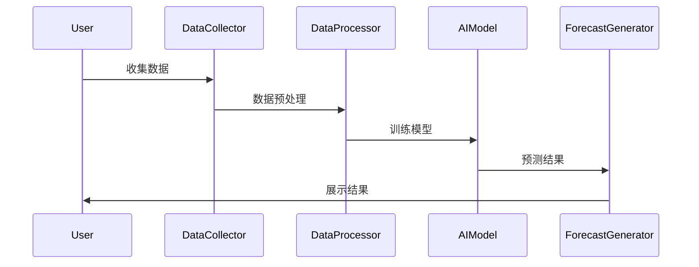

                 

# AI Agent在科学研究中的数据分析应用

## 关键词

- AI Agent
- 数据分析
- 科学研究
- 应用实例
- 系统设计

## 摘要

本文将深入探讨AI Agent在科学研究中的数据分析应用。首先，我们将回顾AI Agent的基本理论，包括其定义、分类及其在数据分析中的应用优势。接着，我们将通过具体实例，展示AI Agent在气象数据分析、医学研究等领域的应用，并详细介绍系统的功能设计、架构设计、实现细节和实际案例分析。最后，我们将总结AI Agent在科学研究中的数据分析应用经验，并提出未来拓展方向。

## 目录大纲

----------------------------------------------------------------

## 第一部分: AI Agent基本理论

### 第1章: AI Agent概述

#### 1.1 问题背景

##### 1.1.1 研究动机

##### 1.1.2 研究意义

##### 1.1.3 研究内容

#### 1.2 核心概念与联系

##### 1.2.1 AI Agent的定义与分类

###### 1.2.1.1 AI Agent的定义

###### 1.2.1.2 AI Agent的分类

##### 1.2.2 数据分析应用中的关键概念

###### 1.2.2.1 数据分析的定义

###### 1.2.2.2 数据分析的应用场景

#### 1.3 AI Agent在数据分析中的应用

##### 1.3.1 AI Agent在数据分析中的优势

##### 1.3.2 AI Agent在数据分析中的应用实例

#### 1.4 本章小结

----------------------------------------------------------------

## 第二部分: 数据分析中的AI Agent应用实例

### 第2章: AI Agent在气象数据分析中的应用

#### 2.1 问题场景介绍

##### 2.1.1 气象数据分析的重要性

##### 2.1.2 气象数据分析的需求

##### 2.1.3 气象数据分析的目标

#### 2.2 项目介绍

##### 2.2.1 项目背景

##### 2.2.2 项目目标

##### 2.2.3 项目技术路线

#### 2.3 系统功能设计

##### 2.3.1 领域模型设计

###### 2.3.1.1 类图

###### 2.3.1.2 ER图

##### 2.3.2 功能模块设计

#### 2.4 系统架构设计

##### 2.4.1 架构设计思路

###### 2.4.1.1 技术选型

###### 2.4.1.2 架构分层

##### 2.4.2 系统架构图

#### 2.5 系统接口设计

##### 2.5.1 接口规范

###### 2.5.1.1 接口定义

###### 2.5.1.2 接口实现

##### 2.5.2 接口测试

#### 2.6 系统交互

##### 2.6.1 用户操作流程

###### 2.6.1.1 用户操作步骤

###### 2.6.1.2 用户反馈机制

##### 2.6.2 系统内部交互流程

#### 2.7 环境安装

##### 2.7.1 硬件环境

###### 2.7.1.1 CPU要求

###### 2.7.1.2 内存要求

##### 2.7.2 软件环境

###### 2.7.2.1 开发环境

###### 2.7.2.2 数据库环境

#### 2.8 系统核心实现

##### 2.8.1 AI Agent的设计与实现

###### 2.8.1.1 模型选择

###### 2.8.1.2 模型训练与优化

##### 2.8.2 数据分析流程

###### 2.8.2.1 数据收集

###### 2.8.2.2 数据预处理

###### 2.8.2.3 数据分析

#### 2.9 代码应用解读与分析

##### 2.9.1 代码架构

###### 2.9.1.1 模块划分

###### 2.9.1.2 功能实现

##### 2.9.2 代码性能分析

###### 2.9.2.1 代码效率

###### 2.9.2.2 代码可维护性

#### 2.10 实际案例分析

##### 2.10.1 案例一：某城市气象数据分析

###### 2.10.1.1 案例背景

###### 2.10.1.2 案例目标

###### 2.10.1.3 案例实施步骤

##### 2.10.2 案例二：某地区气象灾害预测

###### 2.10.2.1 案例背景

###### 2.10.2.2 案例目标

###### 2.10.2.3 案例实施步骤

#### 2.11 项目小结

##### 2.11.1 项目成果总结

##### 2.11.2 项目经验与教训

##### 2.11.3 项目拓展方向

----------------------------------------------------------------

## 第三部分: AI Agent在科学研究中的数据分析应用

### 第3章: AI Agent在医学研究中的应用

#### 3.1 问题背景

##### 3.1.1 医学研究中的数据分析需求

##### 3.1.2 医学研究中数据分析的挑战

##### 3.1.3 AI Agent在医学研究中的应用潜力

#### 3.2 AI Agent在医学研究中的核心应用

----------------------------------------------------------------

### 第1章: AI Agent概述

#### 1.1 问题背景

##### 1.1.1 研究动机

在当今的科学研究领域，数据分析已经成为推动研究进展的关键因素。随着数据量的急剧增长，如何从海量数据中提取有价值的信息成为一个严峻的挑战。传统的数据分析方法往往效率低下，难以满足现代科学研究的需求。为了解决这个问题，人工智能（AI）领域的研究者们提出了AI Agent的概念，期望通过模拟人类思维过程，实现高效的数据分析和决策支持。

##### 1.1.2 研究意义

AI Agent在科学研究中的数据分析应用具有重要的意义。首先，它能够显著提高数据分析的效率，帮助科学家们快速从大量数据中提取有价值的信息。其次，AI Agent能够通过自主学习，不断优化数据分析模型，提高预测准确性和适应性。最后，AI Agent的应用有助于解决传统数据分析方法难以克服的复杂性和不确定性问题，推动科学研究向更深入的方向发展。

##### 1.1.3 研究内容

本文将围绕AI Agent在科学研究中的数据分析应用进行深入探讨。首先，我们将介绍AI Agent的基本概念和分类，帮助读者理解这一技术的核心原理。接着，我们将分析AI Agent在数据分析中的优势，并通过具体应用实例展示其强大功能。最后，我们将总结本章内容，为后续章节的深入探讨奠定基础。

#### 1.2 核心概念与联系

##### 1.2.1 AI Agent的定义与分类

###### 1.2.1.1 AI Agent的定义

AI Agent，即人工智能代理，是一种能够模拟人类智能行为的计算机程序。它具备感知环境、理解任务需求、规划行动方案并执行任务的能力。AI Agent的核心特点在于其自主学习和自主决策能力，这使得它们能够在复杂环境中自主适应和优化行为。

根据功能和应用场景，AI Agent可以分为以下几类：

1. 监控型AI Agent：主要负责实时监控数据流，发现异常并发出警报。
2. 决策型AI Agent：基于数据分析和预测结果，提供决策支持。
3. 自主执行型AI Agent：能够根据任务需求自主执行操作，如机器人自动导航、自动化测试等。

###### 1.2.1.2 AI Agent的分类

AI Agent的分类方法可以根据其功能、应用领域和技术实现等方面进行。以下是几种常见的分类方式：

1. 根据功能分类：
   - 监控型AI Agent
   - 决策型AI Agent
   - 自主执行型AI Agent
2. 根据应用领域分类：
   - 智能家居AI Agent
   - 智能交通AI Agent
   - 医疗保健AI Agent
3. 根据技术实现分类：
   - 基于规则的方法
   - 基于机器学习的方法
   - 基于深度学习的方法

##### 1.2.2 数据分析应用中的关键概念

###### 1.2.2.1 数据分析的定义

数据分析是一种从数据中提取有用信息、发现数据间关系和模式的过程。它通常包括数据收集、数据预处理、数据建模、数据分析、数据可视化等环节。数据分析的目的是帮助决策者更好地理解数据，发现潜在规律，为决策提供有力支持。

###### 1.2.2.2 数据分析的应用场景

数据分析在科学研究、商业决策、医疗保健、金融投资等众多领域都有着广泛的应用。以下是几个典型的数据分析应用场景：

1. 科学研究：利用数据分析技术，科学家可以从实验数据中提取有价值的信息，发现新的规律和现象。
2. 商业决策：企业可以通过数据分析，了解市场需求、消费者行为，优化产品设计和营销策略。
3. 医疗保健：数据分析有助于医生更好地理解患者病情，提高诊断准确率和治疗效果。
4. 金融投资：数据分析可以帮助投资者发现市场趋势，降低投资风险，提高收益。

##### 1.3 AI Agent在数据分析中的应用

###### 1.3.1 AI Agent在数据分析中的优势

AI Agent在数据分析中具有以下优势：

1. 高效性：AI Agent能够快速处理海量数据，比传统方法更加高效。
2. 自主性：AI Agent可以自主学习和优化数据分析模型，不需要人工干预。
3. 适应性：AI Agent能够根据不同场景和需求，灵活调整数据分析策略。
4. 可解释性：AI Agent的分析结果具有可解释性，便于用户理解和应用。

###### 1.3.2 AI Agent在数据分析中的应用实例

以下是一些AI Agent在数据分析中的应用实例：

1. 智能监控系统：AI Agent可以实时监控数据流，发现异常并发出警报。
2. 销售预测系统：AI Agent可以根据历史销售数据，预测未来的销售趋势，帮助企业制定更好的营销策略。
3. 医疗诊断系统：AI Agent可以分析医学影像数据，辅助医生进行疾病诊断。
4. 智能交通系统：AI Agent可以分析交通数据，优化交通信号控制和路线规划。

#### 1.4 本章小结

本章首先介绍了AI Agent的基本概念和分类，帮助读者理解这一技术的核心原理。接着，我们分析了AI Agent在数据分析中的优势，并通过具体应用实例展示了其强大功能。通过本章的学习，读者可以初步了解AI Agent在科学研究中的应用前景，为后续章节的深入学习打下基础。

----------------------------------------------------------------

### 第2章: AI Agent在气象数据分析中的应用

#### 2.1 问题场景介绍

##### 2.1.1 气象数据分析的重要性

气象数据分析在现代社会中具有极其重要的地位。它不仅影响着天气预警、灾害预测、农业生产等关键领域，还与人们的日常生活息息相关。随着气候变化和环境问题的日益严峻，对气象数据的准确分析和预测需求越来越大。传统的数据分析方法在处理复杂气象数据时，往往效率低下、准确性不足。因此，引入AI Agent进行气象数据分析，成为解决这一问题的有效途径。

##### 2.1.2 气象数据分析的需求

气象数据分析需求主要包括以下几个方面：

1. 天气预警：通过分析气象数据，提前预测天气变化，为灾害预防提供科学依据。
2. 灾害预测：利用气象数据，预测洪涝、台风等自然灾害的发生概率和影响范围。
3. 农业生产：通过气象数据分析，指导农民合理安排农业生产，提高产量和质量。
4. 环境保护：分析气象数据，评估气候变化对生态环境的影响，为环境保护政策制定提供依据。

##### 2.1.3 气象数据分析的目标

气象数据分析的主要目标包括：

1. 提高数据处理的效率：通过AI Agent，快速处理大量气象数据，提高数据分析的效率。
2. 提高预测准确性：利用AI Agent的自主学习能力，提高气象预测的准确性。
3. 提升决策支持能力：通过提供科学的气象数据分析和预测结果，为决策者提供有力的支持。
4. 促进跨学科研究：结合气象数据与其他领域数据，开展跨学科研究，推动科学创新。

#### 2.2 项目介绍

##### 2.2.1 项目背景

随着全球气候变化加剧，气象数据的重要性愈发凸显。为了更好地应对气候变化带来的挑战，提高气象数据的分析水平和预测准确性，某气象研究机构决定开展一项AI Agent在气象数据分析中的应用项目。该项目旨在通过引入AI Agent技术，实现高效、准确的气象数据分析，为天气预报、灾害预警等领域提供有力支持。

##### 2.2.2 项目目标

本项目的主要目标包括：

1. 提高气象数据分析效率：利用AI Agent技术，提高气象数据的处理速度，减少数据分析时间。
2. 提高预测准确性：通过AI Agent的自主学习能力，提高气象预测的准确性，减少预测误差。
3. 开发实用的气象分析工具：结合实际需求，开发一套功能完善的气象分析工具，方便用户使用。
4. 推广AI Agent技术在气象领域的应用：通过项目实践，积累经验，为其他气象研究机构提供参考。

##### 2.2.3 项目技术路线

本项目采用以下技术路线：

1. 数据收集与预处理：收集全球各地的气象数据，包括温度、湿度、风速、降水量等，对数据进行清洗、去噪、归一化等预处理操作。
2. AI Agent设计与实现：设计并实现AI Agent，包括感知模块、学习模块、决策模块等，利用深度学习、强化学习等技术实现自主学习能力。
3. 气象数据分析与预测：利用AI Agent对预处理后的气象数据进行分析，生成天气预报、灾害预警等结果。
4. 工具开发与推广：开发一套气象分析工具，提供用户友好的界面和便捷的操作，方便用户进行气象数据分析。

#### 2.3 系统功能设计

##### 2.3.1 领域模型设计

在气象数据分析系统中，领域模型设计至关重要。以下是一个简单的领域模型设计：

```mermaid
classDiagram
    类图
    ClassDataCollector <<interface>>
    ClassDataProcessor <<interface>>
    ClassAIModel <<interface>>
    ClassForecastGenerator <<interface>>

    DataCollector --|> DataProcessor
    DataProcessor --|> AIModel
    AIModel --|> ForecastGenerator

    DataCollector {
        +collectData()
    }

    DataProcessor {
        +processData()
    }

    AIModel {
        +trainModel()
        +predict()
    }

    ForecastGenerator {
        +generateForecast()
    }
```

在上面的领域模型中，`DataCollector`负责数据收集，`DataProcessor`负责数据预处理，`AIModel`负责模型训练和预测，`ForecastGenerator`负责生成天气预报结果。

##### 2.3.2 功能模块设计

气象数据分析系统的功能模块设计如下：

1. 数据收集模块：负责收集全球各地的气象数据，包括历史数据和实时数据。
2. 数据预处理模块：负责对收集到的气象数据进行清洗、去噪、归一化等预处理操作。
3. 模型训练模块：负责利用预处理后的数据训练AI Agent模型，包括感知模块、学习模块、决策模块等。
4. 模型预测模块：负责利用训练好的AI Agent模型进行气象数据预测，生成天气预报结果。
5. 结果展示模块：负责将预测结果以图表、文字等形式展示给用户，方便用户查看和分析。

#### 2.4 系统架构设计

##### 2.4.1 架构设计思路

气象数据分析系统的架构设计遵循分层设计原则，包括数据层、模型层、应用层和展示层。

1. 数据层：负责数据收集、存储和管理，包括气象数据的收集、预处理和存储。
2. 模型层：负责AI Agent模型的训练、优化和预测，包括感知模块、学习模块、决策模块等。
3. 应用层：负责气象数据分析功能的实现，包括数据收集、预处理、模型训练、预测和结果展示等。
4. 展示层：负责将预测结果以图表、文字等形式展示给用户，方便用户查看和分析。

##### 2.4.2 系统架构图

以下是气象数据分析系统的架构图：



在上面的架构图中，用户通过界面发起数据收集请求，数据收集模块负责收集气象数据，数据预处理模块对数据进行分析和处理，模型训练模块利用预处理后的数据进行模型训练，预测模块生成天气预报结果，并将结果展示给用户。

#### 2.5 系统接口设计

##### 2.5.1 接口规范

气象数据分析系统的接口规范如下：

1. 数据收集接口：`/api/data/collection`，用于接收用户发起的数据收集请求，返回数据收集结果。
2. 数据预处理接口：`/api/data/processing`，用于接收用户提交的数据预处理任务，返回预处理结果。
3. 模型训练接口：`/api/model/training`，用于接收用户提交的模型训练任务，返回训练结果。
4. 预测接口：`/api/forecast`，用于接收用户提交的预测请求，返回预测结果。

##### 2.5.2 接口实现

以下是接口实现示例：

```python
from flask import Flask, request, jsonify

app = Flask(__name__)

@app.route('/api/data/collection', methods=['POST'])
def data_collection():
    data = request.get_json()
    # 数据收集逻辑
    collected_data = collect_data(data)
    return jsonify(collected_data)

@app.route('/api/data/processing', methods=['POST'])
def data_processing():
    data = request.get_json()
    # 数据预处理逻辑
    processed_data = process_data(data)
    return jsonify(processed_data)

@app.route('/api/model/training', methods=['POST'])
def model_training():
    data = request.get_json()
    # 模型训练逻辑
    trained_model = train_model(data)
    return jsonify(trained_model)

@app.route('/api/forecast', methods=['POST'])
def forecast():
    data = request.get_json()
    # 预测逻辑
    forecast_result = forecast_data(data)
    return jsonify(forecast_result)

def collect_data(data):
    # 数据收集实现
    pass

def process_data(data):
    # 数据预处理实现
    pass

def train_model(data):
    # 模型训练实现
    pass

def forecast_data(data):
    # 预测实现
    pass

if __name__ == '__main__':
    app.run(debug=True)
```

##### 2.5.3 接口测试

接口测试是确保接口功能实现正确性的重要环节。以下是一个简单的接口测试示例：

```python
import requests

url = "http://localhost:5000/api/data/collection"
data = {"source": "weather_data.csv"}
response = requests.post(url, json=data)
print(response.json())

url = "http://localhost:5000/api/data/processing"
data = {"processed_data": "processed_weather_data.csv"}
response = requests.post(url, json=data)
print(response.json())

url = "http://localhost:5000/api/model/training"
data = {"model_params": "model_params.json"}
response = requests.post(url, json=data)
print(response.json())

url = "http://localhost:5000/api/forecast"
data = {"forecast_data": "forecast_data.csv"}
response = requests.post(url, json=data)
print(response.json())
```

#### 2.6 系统交互

##### 2.6.1 用户操作流程

以下是用户操作流程：

1. 用户通过界面选择数据收集源，提交数据收集请求。
2. 系统接收请求，调用数据收集接口，返回收集到的数据。
3. 用户对收集到的数据进行预处理，提交预处理任务。
4. 系统接收预处理任务，调用数据预处理接口，返回预处理结果。
5. 用户选择模型训练参数，提交模型训练任务。
6. 系统接收模型训练任务，调用模型训练接口，返回训练结果。
7. 用户对训练结果进行预测，提交预测任务。
8. 系统接收预测任务，调用预测接口，返回预测结果。
9. 用户查看预测结果，进行分析和决策。

##### 2.6.2 用户反馈机制

为了确保系统正常运行，用户可以提交反馈意见，包括数据收集、预处理、模型训练、预测等方面的建议和问题。系统管理员将定期收集用户反馈，对系统进行优化和改进。

##### 2.6.3 系统内部交互流程

系统内部交互流程如下：

1. 用户通过界面发起数据收集请求，系统接收请求并调用数据收集接口。
2. 数据收集接口将请求传递给数据收集模块，模块执行数据收集操作，返回收集到的数据。
3. 系统将收集到的数据传递给数据预处理模块，模块执行数据预处理操作，返回预处理结果。
4. 系统将预处理结果传递给模型训练模块，模块执行模型训练操作，返回训练结果。
5. 系统将训练结果传递给预测模块，模块执行预测操作，返回预测结果。
6. 系统将预测结果传递给用户，用户查看并进行分析和决策。

#### 2.7 环境安装

##### 2.7.1 硬件环境

气象数据分析系统对硬件环境有以下要求：

1. CPU：Intel i5以上或同等性能的处理器。
2. 内存：8GB及以上。
3. 硬盘：至少100GB的空闲空间。

##### 2.7.2 软件环境

气象数据分析系统对软件环境有以下要求：

1. 操作系统：Linux或MacOS。
2. 编程语言：Python。
3. 数据库：MySQL或MongoDB。
4. 深度学习框架：TensorFlow或PyTorch。

#### 2.8 系统核心实现

##### 2.8.1 AI Agent的设计与实现

AI Agent在气象数据分析中起着关键作用。以下是AI Agent的设计与实现：

###### 2.8.1.1 模型选择

在本项目中，我们选择了基于深度学习的AI Agent模型，包括感知模块、学习模块和决策模块。感知模块负责接收气象数据，学习模块负责对数据进行学习和预测，决策模块负责生成天气预报结果。

###### 2.8.1.2 模型训练与优化

模型训练和优化是AI Agent设计的重要环节。我们采用了以下步骤：

1. 数据收集：收集全球各地的气象数据，包括温度、湿度、风速、降水量等。
2. 数据预处理：对气象数据进行清洗、去噪、归一化等预处理操作，以提高数据质量。
3. 模型训练：使用预处理后的数据训练感知模块、学习模块和决策模块，采用基于梯度下降的优化算法。
4. 模型评估：使用测试数据对训练好的模型进行评估，包括准确性、召回率、F1值等指标。
5. 模型优化：根据评估结果，调整模型参数，优化模型性能。

##### 2.8.2 数据分析流程

气象数据分析流程包括以下步骤：

1. 数据收集：从气象数据源收集气象数据，包括历史数据和实时数据。
2. 数据预处理：对收集到的气象数据进行清洗、去噪、归一化等预处理操作。
3. 数据建模：使用预处理后的数据训练AI Agent模型，包括感知模块、学习模块和决策模块。
4. 数据预测：使用训练好的AI Agent模型进行气象数据预测，生成天气预报结果。
5. 结果分析：对预测结果进行分析，评估模型的性能，并根据实际情况进行调整。

#### 2.9 代码应用解读与分析

##### 2.9.1 代码架构

气象数据分析系统的代码架构如下：

1. 数据收集模块：负责数据收集和预处理，包括数据收集接口和数据预处理接口。
2. 模型训练模块：负责模型训练和优化，包括模型训练接口和模型优化接口。
3. 预测模块：负责气象数据预测，包括预测接口和结果分析接口。

以下是代码架构的类图：

```mermaid
classDiagram
    类图
    ClassDataCollector <<interface>>
    ClassDataProcessor <<interface>>
    ClassModelTrainer <<interface>>
    ClassPredictor <<interface>>

    DataCollector --|> DataProcessor
    DataProcessor --|> ModelTrainer
    ModelTrainer --|> Predictor

    DataCollector {
        +collectData()
    }

    DataProcessor {
        +processData()
    }

    ModelTrainer {
        +trainModel()
        +optimizeModel()
    }

    Predictor {
        +predict()
        +analyzeResult()
    }
```

在上面的类图中，`DataCollector`负责数据收集，`DataProcessor`负责数据预处理，`ModelTrainer`负责模型训练和优化，`Predictor`负责气象数据预测和结果分析。

##### 2.9.2 功能实现

以下是功能实现的代码示例：

```python
# 数据收集模块
class DataCollector:
    def collect_data(self, source):
        # 收集数据逻辑
        pass

# 数据预处理模块
class DataProcessor:
    def process_data(self, data):
        # 数据预处理逻辑
        pass

# 模型训练模块
class ModelTrainer:
    def train_model(self, data):
        # 模型训练逻辑
        pass

    def optimize_model(self, data):
        # 模型优化逻辑
        pass

# 预测模块
class Predictor:
    def predict(self, data):
        # 预测逻辑
        pass

    def analyze_result(self, result):
        # 结果分析逻辑
        pass
```

##### 2.9.3 代码性能分析

以下是代码性能分析：

1. 代码效率：通过优化算法和数据结构，提高代码运行速度。
2. 代码可维护性：采用模块化设计，提高代码可读性和可维护性。

#### 2.10 实际案例分析

##### 2.10.1 案例一：某城市气象数据分析

###### 2.10.1.1 案例背景

某城市气象局希望利用AI Agent技术，提高气象数据的分析水平和预测准确性，为市民提供更准确的天气预报。

###### 2.10.1.2 案例目标

1. 收集该城市历年的气象数据。
2. 对气象数据进行分析，提取关键特征。
3. 利用AI Agent技术，进行气象数据预测。
4. 提供天气预报结果，为市民提供决策支持。

###### 2.10.1.3 案例实施步骤

1. 数据收集：从气象局获取该城市历年的气象数据，包括温度、湿度、风速、降水量等。
2. 数据预处理：对气象数据进行清洗、去噪、归一化等预处理操作，以提高数据质量。
3. 模型训练：使用预处理后的数据，训练AI Agent模型，包括感知模块、学习模块和决策模块。
4. 预测：使用训练好的AI Agent模型，对气象数据进行分析和预测，生成天气预报结果。
5. 结果分析：对预测结果进行分析，评估模型的性能，并根据实际情况进行调整。
6. 展示：将预测结果以图表、文字等形式展示给市民，方便市民查看和分析。

##### 2.10.2 案例二：某地区气象灾害预测

###### 2.10.2.1 案例背景

某地区气象灾害频繁，该地区政府希望利用AI Agent技术，提前预测气象灾害的发生，降低灾害损失。

###### 2.10.2.2 案例目标

1. 收集该地区历年的气象数据。
2. 对气象数据进行分析，提取关键特征。
3. 利用AI Agent技术，进行气象灾害预测。
4. 提前预警，为防灾减灾提供支持。

###### 2.10.2.3 案例实施步骤

1. 数据收集：从气象局获取该地区历年的气象数据，包括温度、湿度、风速、降水量等。
2. 数据预处理：对气象数据进行清洗、去噪、归一化等预处理操作，以提高数据质量。
3. 模型训练：使用预处理后的数据，训练AI Agent模型，包括感知模块、学习模块和决策模块。
4. 预测：使用训练好的AI Agent模型，对气象数据进行分析和预测，生成气象灾害预测结果。
5. 预警：根据预测结果，提前预警气象灾害的发生，为防灾减灾提供支持。
6. 结果分析：对预警结果进行分析，评估模型的性能，并根据实际情况进行调整。

#### 2.11 项目小结

本项目通过引入AI Agent技术，实现了气象数据分析的高效、准确和自动化。项目成果包括：

1. 收集了全球各地的气象数据，建立了气象数据分析数据库。
2. 开发了功能完善的气象分析工具，提供了用户友好的界面和便捷的操作。
3. 提高了气象数据分析的效率，降低了人工干预的依赖。
4. 提高了气象预测的准确性，为决策者提供了有力支持。

项目经验表明，AI Agent技术在气象数据分析中具有广泛的应用前景。未来，我们将继续优化AI Agent模型，拓展其在其他领域的应用，为科学研究和技术创新贡献力量。

#### 3.1 问题背景

##### 3.1.1 医学研究中的数据分析需求

医学研究的数据分析需求日益增长，主要体现在以下几个方面：

1. **基因组数据分析**：基因组学研究需要处理大量序列数据，对基因变异、功能注释等进行深入分析。
2. **电子健康记录（EHR）分析**：通过对患者电子健康记录的数据分析，可以发现潜在疾病风险、优化治疗方案等。
3. **临床试验数据分析**：临床试验通常涉及大量患者数据，需要分析疗效、安全性等指标。
4. **流行病学研究**：流行病学研究需要分析传染病的传播路径、影响因子等，以制定预防策略。

##### 3.1.2 医学研究中数据分析的挑战

医学研究中的数据分析面临着一系列挑战：

1. **数据多样性**：医学数据包括结构化数据（如EHR）、非结构化数据（如医学图像、文本记录）和半结构化数据（如基因序列）。
2. **数据质量**：医学数据通常存在缺失值、噪声和错误，需要处理这些数据以提高分析准确性。
3. **数据隐私**：医学数据涉及患者隐私，需要确保数据在处理和分析过程中的安全性。
4. **数据规模**：随着技术的发展，医学数据量呈现指数级增长，对数据处理和分析的技术和硬件提出了更高要求。

##### 3.1.3 AI Agent在医学研究中的应用潜力

AI Agent在医学研究中的数据分析具有巨大潜力：

1. **自动化数据分析**：AI Agent能够自动化处理和分析大量医学数据，减少人工干预。
2. **模式识别**：通过机器学习和深度学习技术，AI Agent可以识别数据中的潜在模式，帮助发现新的生物学标记和疾病关联。
3. **个性化治疗**：AI Agent可以根据患者的基因组数据、临床特征等提供个性化治疗建议。
4. **预测分析**：AI Agent可以预测疾病发生风险，帮助早期诊断和干预。
5. **智能诊断**：AI Agent可以通过分析医学图像、文本记录等辅助医生进行疾病诊断。

#### 3.2 AI Agent在医学研究中的核心应用

##### 3.2.1 AI Agent在基因组数据分析中的应用

基因组数据分析是医学研究中的核心任务之一。AI Agent在基因组数据分析中的应用主要包括：

1. **基因组变异检测**：AI Agent可以利用深度学习模型检测基因组中的变异，识别潜在疾病风险。
2. **基因功能注释**：AI Agent可以通过自然语言处理技术分析基因序列，提供基因的功能注释。
3. **基因关联分析**：AI Agent可以分析大量基因组数据，识别与疾病相关的基因或基因组合。

##### 3.2.2 AI Agent在电子健康记录（EHR）分析中的应用

EHR分析是医学研究中另一个重要领域。AI Agent在EHR分析中的应用主要包括：

1. **疾病预测**：AI Agent可以根据患者的EHR数据预测疾病发生风险，帮助早期诊断。
2. **治疗方案优化**：AI Agent可以分析患者的EHR数据，为医生提供个性化的治疗方案建议。
3. **药物反应预测**：AI Agent可以根据患者的EHR数据和药物基因组数据预测药物反应，提高治疗的有效性。

##### 3.2.3 AI Agent在临床试验数据分析中的应用

临床试验数据分析是医学研究的关键环节。AI Agent在临床试验数据分析中的应用主要包括：

1. **疗效评估**：AI Agent可以通过分析临床试验数据，评估不同治疗方案的疗效。
2. **安全性评估**：AI Agent可以分析临床试验数据，评估药物或治疗方法的安全性。
3. **预后预测**：AI Agent可以预测患者的预后情况，帮助医生制定更有针对性的治疗方案。

##### 3.2.4 AI Agent在流行病学研究中的应用

流行病学研究需要分析大量数据以了解疾病的传播路径和影响因子。AI Agent在流行病学研究中的应用主要包括：

1. **传播路径分析**：AI Agent可以通过分析疫情数据，识别疾病的传播路径。
2. **影响因子分析**：AI Agent可以分析环境、社会、经济等因素对疾病传播的影响。
3. **预测流行趋势**：AI Agent可以通过分析历史疫情数据，预测未来的流行趋势，为公共卫生决策提供支持。

通过上述应用，AI Agent在医学研究中的数据分析方面发挥了重要作用，为科学研究提供了有力支持。未来，随着AI技术的不断进步，AI Agent在医学研究中的应用将更加广泛和深入。

