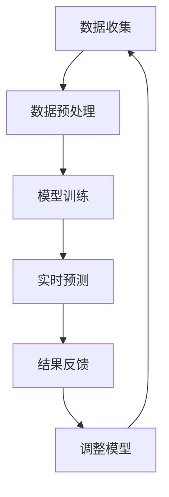
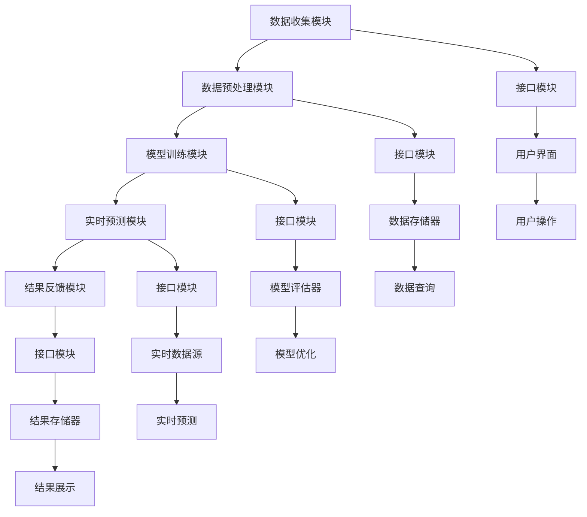
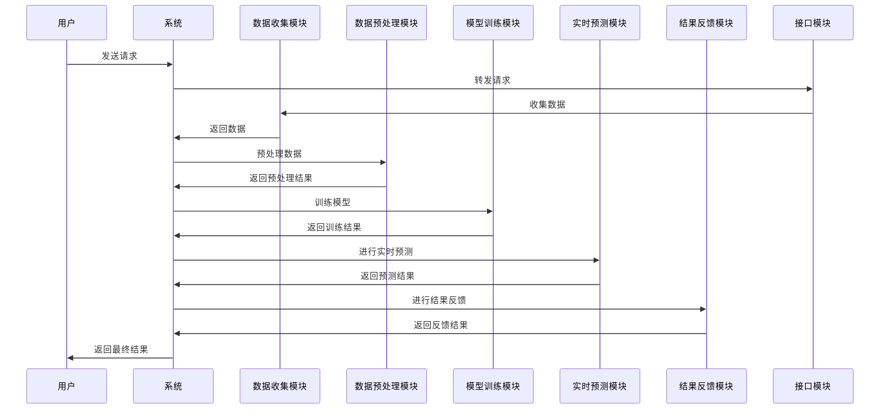
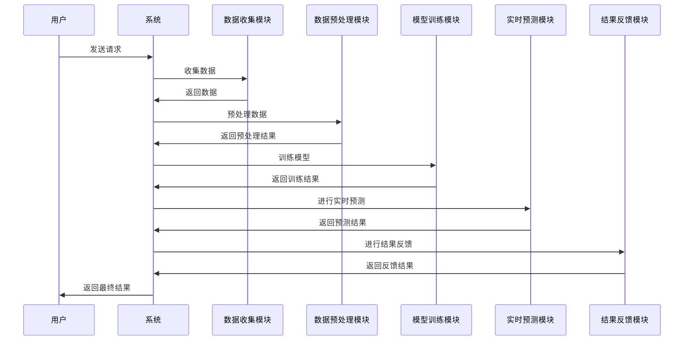

                 

### 《AI Agent在空气质量预测中的应用》

#### 关键词：空气质量预测、AI Agent、深度学习、环境监测、算法实现

##### 摘要：
空气质量是影响人类健康和生态系统的重要因素。随着城市化进程的加快，空气质量预测已成为一项重要的研究课题。本文旨在探讨如何利用AI Agent，特别是深度学习技术，来实现高精度的空气质量预测。文章首先介绍了空气质量预测的背景和AI Agent的基本概念，然后详细阐述了空气质量预测的算法原理，接着介绍了空气质量预测系统的设计与实现，并通过实际案例展示了AI Agent在空气质量预测中的实际应用效果。最后，文章提出了空气质量预测项目的最佳实践和未来发展方向，为该领域的进一步研究提供了有益的参考。

### 第一部分：背景介绍与基础概念

#### 第1章：问题背景与核心概念

##### 1.1.1 空气质量问题的现状与挑战

空气质量是指空气中有害物质（如PM2.5、PM10、SO2、NO2、CO等）的浓度水平。随着工业化进程的加快和城市人口的迅速增长，空气质量问题日益严重。根据世界卫生组织（WHO）的数据，全球每年约有700万人死于空气污染相关疾病，这一数字超过了因车祸、战争和艾滋病等导致的死亡人数。

空气质量问题主要表现为以下几个方面：

1. **PM2.5和PM10**：这些细微颗粒物可以穿透肺部进入血液，引起呼吸系统疾病和心血管疾病。
2. **二氧化硫（SO2）和氮氧化物（NO2）**：这些气体主要来源于燃煤和汽车尾气，对环境和人类健康有严重影响。
3. **一氧化碳（CO）**：主要来源于不完全燃烧的化石燃料，对人体的中枢神经系统有毒害作用。

##### 1.1.2 AI Agent的定义与核心特点

AI Agent，即人工智能代理，是一种能够感知环境、自主决策并采取行动的智能体。在空气质量预测中，AI Agent可以通过学习大量历史数据和环境因素，预测未来某一地区或某一时刻的空气质量状况。

AI Agent的核心特点包括：

1. **自主性**：AI Agent能够独立运作，不需要人工干预。
2. **适应性**：AI Agent可以根据环境变化调整其预测模型，提高预测精度。
3. **协同性**：多个AI Agent可以协同工作，共同完成复杂的空气质量预测任务。

##### 1.1.3 AI Agent在空气质量预测中的应用前景

AI Agent在空气质量预测中具有广泛的应用前景。首先，AI Agent可以实时监测空气质量，为政府和环保部门提供决策支持。其次，AI Agent可以预测未来的空气质量趋势，帮助公众采取预防措施，降低空气污染对健康的危害。最后，AI Agent可以帮助企业优化生产流程，减少污染物排放，实现绿色可持续发展。

##### 1.2 空气质量预测的核心概念与联系

空气质量预测涉及多个核心概念，包括空气质量指标、预测算法和环境因素等。以下是对这些概念及其之间联系的简要介绍：

1. **空气质量指标**：包括PM2.5、PM10、SO2、NO2、CO等，是衡量空气质量的重要参数。
2. **预测算法**：包括时间序列分析法、机器学习方法和深度学习方法等，用于预测空气质量指标的未来趋势。
3. **环境因素**：包括气象条件（如温度、湿度、风速等）和地理位置等，对空气质量有重要影响。

##### 1.2.1 空气质量指标及其重要性

空气质量指标是衡量空气质量的核心参数，直接影响人们的健康和生活质量。以下是几种常见的空气质量指标及其重要性：

1. **PM2.5**：指空气中直径小于或等于2.5微米的颗粒物，对人体健康危害最大。
2. **PM10**：指空气中直径小于或等于10微米的颗粒物，对呼吸系统有较大影响。
3. **SO2**：二氧化硫，主要来源于燃煤和工业生产，对呼吸系统和环境有危害。
4. **NO2**：氮氧化物，主要来源于汽车尾气和工业生产，对环境和人体健康有害。
5. **CO**：一氧化碳，主要来源于不完全燃烧的化石燃料，对人体中枢神经系统有毒害作用。

##### 1.2.2 空气质量预测的关键技术

空气质量预测的关键技术包括时间序列分析法、机器学习方法和深度学习方法等。以下是这些技术的简要介绍：

1. **时间序列分析法**：基于历史数据，通过分析时间序列特征，预测未来的空气质量指标。
2. **机器学习方法**：利用历史数据和空气质量指标之间的关系，建立预测模型，预测未来的空气质量。
3. **深度学习方法**：通过多层神经网络，从大量数据中自动学习特征，提高预测精度。

##### 1.2.3 AI Agent与空气质量预测的关系

AI Agent在空气质量预测中起到了关键作用。首先，AI Agent可以通过学习大量历史数据和空气质量指标，建立准确的预测模型。其次，AI Agent可以根据实时环境数据，动态调整预测模型，提高预测精度。最后，AI Agent可以与其他智能系统协同工作，实现全面、智能的空气质量监测和预测。

##### 1.3 AI Agent的基本原理与组成

AI Agent是由多个组成部分构成的，包括感知器、决策器、执行器等。以下是这些组成部分的简要介绍：

1. **感知器**：用于感知环境数据，如气象条件、地理位置等。
2. **决策器**：根据感知到的数据，结合预测模型，生成决策结果。
3. **执行器**：根据决策结果，采取相应的行动，如调整空气质量预测模型等。

##### 1.3.1 AI Agent的基本原理

AI Agent的基本原理是基于机器学习和深度学习技术，通过自主学习、自适应和协同工作，实现高精度的空气质量预测。具体来说，AI Agent通过以下步骤实现空气质量预测：

1. **数据收集**：收集历史空气质量数据和环境数据。
2. **数据预处理**：对数据进行清洗、归一化等处理。
3. **模型训练**：利用历史数据，训练预测模型。
4. **实时预测**：利用实时数据，更新预测模型，生成预测结果。
5. **结果反馈**：将预测结果与实际空气质量数据进行对比，调整预测模型。

##### 1.3.2 AI Agent的组成与功能

AI Agent由多个组成部分构成，每个部分都有其特定的功能和作用。以下是AI Agent的主要组成部分及其功能：

1. **感知器**：感知环境数据，如气象条件、地理位置等，为决策提供输入。
2. **决策器**：根据感知到的数据和预测模型，生成决策结果，指导执行器行动。
3. **执行器**：根据决策结果，采取相应的行动，如调整空气质量预测模型等。
4. **记忆模块**：存储历史数据和预测结果，为模型训练和决策提供支持。

##### 1.3.3 AI Agent的演化与发展趋势

随着人工智能技术的不断发展，AI Agent也在不断演化。以下是AI Agent的演化趋势：

1. **自主性**：AI Agent的自主性不断提高，可以独立完成空气质量预测任务，减少人工干预。
2. **协作性**：多个AI Agent可以协同工作，实现更准确的空气质量预测。
3. **智能化**：AI Agent可以通过不断学习和优化，提高预测精度和适应能力。
4. **普及化**：AI Agent的应用范围不断扩大，从城市空气质量预测到全球空气质量预测，从环境监测到公共安全等领域。

##### 1.4 本章小结

本章介绍了空气质量预测的背景、核心概念和AI Agent的基本原理与组成。通过对空气质量问题的现状、AI Agent的定义和空气质量预测算法的简要介绍，为后续章节的详细讨论奠定了基础。本章还介绍了AI Agent的组成与功能以及其演化与发展趋势，为读者提供了对AI Agent在空气质量预测中应用的整体认识。

### 第二部分：算法原理与实现

#### 第2章：空气质量预测算法原理

空气质量预测算法是实现AI Agent在空气质量预测应用的核心。本章将详细介绍空气质量预测的常见算法，包括时间序列分析法、机器学习方法和深度学习方法。然后，我们将探讨AI Agent在空气质量预测中的应用，分析其优势，并详细描述实现步骤。

##### 2.1 常见空气质量预测算法

空气质量预测算法可以分为以下几类：

1. **时间序列分析法**：基于时间序列数据，通过分析数据中的趋势、季节性和周期性特征，预测未来的空气质量指标。
2. **机器学习方法**：利用历史数据和空气质量指标之间的关系，建立预测模型，预测未来的空气质量。
3. **深度学习方法**：通过多层神经网络，从大量数据中自动学习特征，提高预测精度。

##### 2.1.1 时间序列分析法

时间序列分析法是一种基于历史数据的预测方法，它通过分析时间序列的特征，如趋势、季节性和周期性，来预测未来的空气质量指标。时间序列分析法的主要步骤包括：

1. **数据收集**：收集历史空气质量数据，包括PM2.5、PM10、SO2、NO2、CO等指标。
2. **数据预处理**：对数据进行清洗、归一化等处理，确保数据的质量和一致性。
3. **模型选择**：选择合适的时间序列模型，如ARIMA、SARIMA等。
4. **模型训练**：利用历史数据，训练时间序列模型。
5. **预测**：利用训练好的模型，预测未来的空气质量指标。

##### 2.1.2 机器学习方法

机器学习方法通过建立历史数据和空气质量指标之间的关系，预测未来的空气质量。常见的机器学习方法包括线性回归、决策树、随机森林、支持向量机等。以下是机器学习方法的主要步骤：

1. **数据收集**：收集历史空气质量数据和相应的气象条件、地理位置等环境数据。
2. **数据预处理**：对数据进行清洗、归一化等处理。
3. **特征选择**：选择对空气质量预测有重要影响的特征。
4. **模型选择**：选择合适的机器学习模型，如线性回归、决策树等。
5. **模型训练**：利用历史数据，训练机器学习模型。
6. **预测**：利用训练好的模型，预测未来的空气质量指标。

##### 2.1.3 深度学习方法

深度学习方法通过多层神经网络，从大量数据中自动学习特征，提高预测精度。常见的深度学习方法包括卷积神经网络（CNN）和循环神经网络（RNN）等。以下是深度学习方法的主要步骤：

1. **数据收集**：收集历史空气质量数据和相应的气象条件、地理位置等环境数据。
2. **数据预处理**：对数据进行清洗、归一化等处理。
3. **特征提取**：利用CNN提取空间特征，利用RNN提取时间特征。
4. **模型训练**：利用历史数据，训练深度学习模型。
5. **预测**：利用训练好的模型，预测未来的空气质量指标。

##### 2.2 AI Agent在空气质量预测中的应用

AI Agent在空气质量预测中的应用主要体现在以下几个方面：

1. **自主性**：AI Agent可以独立完成空气质量预测任务，无需人工干预。
2. **适应性**：AI Agent可以根据环境变化，动态调整预测模型，提高预测精度。
3. **协同性**：多个AI Agent可以协同工作，实现更准确的空气质量预测。

##### 2.2.1 AI Agent的设计思路

AI Agent的设计思路主要包括以下几个方面：

1. **感知器**：感知环境数据，如气象条件、地理位置等。
2. **决策器**：根据感知到的数据和预测模型，生成决策结果。
3. **执行器**：根据决策结果，采取相应的行动，如调整空气质量预测模型等。

##### 2.2.2 AI Agent在空气质量预测中的优势

AI Agent在空气质量预测中的优势主要体现在以下几个方面：

1. **高精度**：AI Agent可以通过深度学习等技术，从大量数据中自动学习特征，提高预测精度。
2. **实时性**：AI Agent可以实时监测空气质量，快速响应环境变化，生成预测结果。
3. **自主性**：AI Agent可以独立完成空气质量预测任务，减少人工干预。

##### 2.2.3 AI Agent的实现步骤

AI Agent的实现步骤主要包括以下几个方面：

1. **数据收集**：收集历史空气质量数据和环境数据。
2. **数据预处理**：对数据进行清洗、归一化等处理。
3. **模型训练**：利用历史数据，训练空气质量预测模型。
4. **实时预测**：利用实时数据，更新预测模型，生成预测结果。
5. **结果反馈**：将预测结果与实际空气质量数据进行对比，调整预测模型。

##### 2.3 数学模型与公式

空气质量预测的数学模型主要包括时间序列模型、机器学习模型和深度学习模型。以下是这些模型的基本数学模型和公式：

1. **时间序列模型**：ARIMA模型
   - $$X_t = c + \phi_1 X_{t-1} + \phi_2 X_{t-2} + ... + \phi_p X_{t-p} + \theta_1 e_{t-1} + \theta_2 e_{t-2} + ... + \theta_q e_{t-q}$$
2. **机器学习模型**：线性回归
   - $$y = \beta_0 + \beta_1 x_1 + \beta_2 x_2 + ... + \beta_n x_n$$
3. **深度学习模型**：卷积神经网络（CNN）
   - $$h_l = \sigma(W_l \cdot h_{l-1} + b_l)$$

##### 2.4 算法流程与mermaid流程图

空气质量预测算法的总体流程包括数据收集、数据预处理、模型训练、实时预测和结果反馈等步骤。以下是算法流程的mermaid流程图：



##### 2.5 本章小结

本章介绍了空气质量预测的常见算法，包括时间序列分析法、机器学习方法和深度学习方法。然后，探讨了AI Agent在空气质量预测中的应用，分析了其优势，并详细描述了实现步骤。通过本章的学习，读者可以了解到空气质量预测算法的基本原理和实现方法，为后续章节的系统设计与实现打下基础。

### 第三部分：系统设计与实现

#### 第3章：空气质量预测系统设计

空气质量预测系统的设计是实现AI Agent在空气质量预测应用的关键。本章将详细介绍空气质量预测系统的设计与实现，包括系统总体介绍、领域模型设计、系统架构设计、系统接口设计和系统交互设计。通过这些设计，我们可以构建一个高效、可靠的空气质量预测系统。

##### 3.1 系统总体介绍

空气质量预测系统的总体目标是利用AI Agent，特别是深度学习技术，实现高精度的空气质量预测。系统的主要功能包括数据收集、数据预处理、模型训练、实时预测和结果反馈。具体来说，系统具备以下特点：

1. **数据收集**：系统能够自动收集历史空气质量数据和环境数据，为模型训练提供数据支持。
2. **数据预处理**：系统对数据进行清洗、归一化等处理，确保数据的质量和一致性。
3. **模型训练**：系统利用深度学习技术，训练空气质量预测模型。
4. **实时预测**：系统可以实时监测空气质量，生成预测结果。
5. **结果反馈**：系统将预测结果与实际空气质量数据进行对比，自动调整预测模型。

##### 3.1.1 系统背景

随着城市化进程的加快，空气质量问题日益严重。传统的空气质量预测方法存在精度低、实时性差等问题，无法满足现代社会对空气质量预测的需求。因此，利用AI Agent，特别是深度学习技术，实现高精度的空气质量预测具有重要的现实意义。

##### 3.1.2 系统目标

空气质量预测系统的目标是：

1. 提高空气质量预测的精度，为政府和环保部门提供科学的决策支持。
2. 提高空气质量预测的实时性，帮助公众及时了解空气质量状况，采取预防措施。
3. 提高空气质量预测的自动化程度，减少人工干预。

##### 3.1.3 系统功能模块划分

空气质量预测系统可以分为以下几个功能模块：

1. **数据收集模块**：负责自动收集历史空气质量数据和环境数据。
2. **数据预处理模块**：负责对数据进行清洗、归一化等处理。
3. **模型训练模块**：负责利用深度学习技术，训练空气质量预测模型。
4. **实时预测模块**：负责实时监测空气质量，生成预测结果。
5. **结果反馈模块**：负责将预测结果与实际空气质量数据进行对比，自动调整预测模型。

##### 3.2 领域模型设计

领域模型设计是系统设计的重要组成部分。通过领域模型，我们可以清晰地描述系统的功能模块及其关系。以下是空气质量预测系统的领域模型：

```mermaid
classDiagram
    类--|>{数据收集模块|}<数据预处理模块
    数据预处理模块--|>{模型训练模块|}<实时预测模块
    实时预测模块--|>{结果反馈模块|}<领域模型
```

领域模型中的各个类及其属性和关系如下：

1. **数据收集模块**：包括数据源、数据采集器和数据存储器。
   - **数据源**：包括历史空气质量数据和环境数据。
   - **数据采集器**：负责从数据源中收集数据。
   - **数据存储器**：负责存储收集到的数据。

2. **数据预处理模块**：包括清洗器、归一化器和特征提取器。
   - **清洗器**：负责清洗数据，去除噪声和异常值。
   - **归一化器**：负责对数据进行归一化处理，使其具有相同的尺度。
   - **特征提取器**：负责提取对空气质量预测有重要影响的特征。

3. **模型训练模块**：包括训练器、评估器和优化器。
   - **训练器**：负责利用历史数据训练空气质量预测模型。
   - **评估器**：负责评估模型的预测性能。
   - **优化器**：负责优化模型，提高预测精度。

4. **实时预测模块**：包括预测器和结果存储器。
   - **预测器**：负责利用实时数据生成预测结果。
   - **结果存储器**：负责存储预测结果。

5. **结果反馈模块**：包括反馈器和调整器。
   - **反馈器**：负责将预测结果与实际空气质量数据进行对比。
   - **调整器**：负责根据对比结果，自动调整预测模型。

##### 3.3 系统架构设计

系统架构设计是系统设计的核心，它决定了系统的性能、可扩展性和可靠性。以下是空气质量预测系统的架构设计：



系统架构设计的主要组成部分及其作用如下：

1. **数据收集模块**：负责收集历史空气质量数据和环境数据。
2. **数据预处理模块**：负责对收集到的数据进行预处理，包括清洗、归一化和特征提取。
3. **模型训练模块**：负责利用预处理后的数据训练空气质量预测模型。
4. **实时预测模块**：负责实时监测空气质量，生成预测结果。
5. **结果反馈模块**：负责将预测结果与实际空气质量数据进行对比，并根据结果调整预测模型。
6. **接口模块**：负责与其他系统进行数据交换和功能调用。
7. **用户界面**：负责提供用户交互界面，方便用户操作和查看预测结果。

##### 3.4 系统接口设计

系统接口设计是确保系统模块之间能够高效、可靠地进行通信和协作的关键。以下是空气质量预测系统的接口设计：



系统接口设计的主要流程如下：

1. 用户向系统发送请求。
2. 系统将请求转发给接口模块。
3. 接口模块与数据收集模块进行通信，收集数据。
4. 数据预处理模块对数据进行预处理。
5. 模型训练模块利用预处理后的数据训练空气质量预测模型。
6. 实时预测模块进行实时预测，生成预测结果。
7. 结果反馈模块将预测结果与实际空气质量数据进行对比，生成反馈结果。
8. 系统将最终结果返回给用户。

##### 3.5 系统交互设计

系统交互设计是确保系统各个模块之间能够高效、可靠地进行通信和协作的关键。以下是空气质量预测系统的交互设计：



系统交互设计的主要流程如下：

1. 用户向系统发送请求。
2. 系统与数据收集模块进行通信，收集数据。
3. 系统与数据预处理模块进行通信，预处理数据。
4. 系统与模型训练模块进行通信，训练空气质量预测模型。
5. 系统与实时预测模块进行通信，进行实时预测，生成预测结果。
6. 系统与结果反馈模块进行通信，生成反馈结果。
7. 系统将最终结果返回给用户。

##### 3.6 系统交互设计

系统交互设计是确保系统各个模块之间能够高效、可靠地进行通信和协作的关键。以下是空气质量预测系统的交互设计：


系统交互设计的主要流程如下：

1. 用户向系统发送请求。
2. 系统与数据收集模块进行通信，收集数据。
3. 系统与数据预处理模块进行通信，预处理数据。
4. 系统与模型训练模块进行通信，训练空气质量预测模型。
5. 系统与实时预测模块进行通信，进行实时预测，生成预测结果。
6. 系统与结果反馈模块进行通信，生成反馈结果。
7. 系统将最终结果返回给用户。

##### 3.7 本章小结

本章详细介绍了空气质量预测系统的设计，包括系统总体介绍、领域模型设计、系统架构设计、系统接口设计和系统交互设计。通过对系统设计的详细描述，我们可以清楚地了解到空气质量预测系统的架构和功能模块，为后续的系统实现提供了明确的指导和参考。

### 第四部分：项目实战

#### 第4章：空气质量预测项目实战

空气质量预测项目的实战是验证AI Agent在空气质量预测应用中的有效性和实用性的关键步骤。本章将通过实际案例，详细描述空气质量预测项目的环境安装与配置、系统核心实现、代码应用解读与分析、实际案例分析和项目小结。

##### 4.1 环境安装与配置

空气质量预测项目的环境安装与配置是项目开始的第一步，确保项目能够正常运行。以下是项目环境安装与配置的步骤：

1. **硬件环境准备**：选择高性能的服务器，具备足够的计算资源和存储空间。
2. **软件环境准备**：安装操作系统（如Ubuntu 18.04）、Python（3.8或更高版本）以及相关的库（如TensorFlow、NumPy、Pandas等）。

   ```shell
   sudo apt update
   sudo apt install python3 python3-pip
   pip3 install tensorflow numpy pandas
   ```

3. **数据库配置**：安装并配置MySQL或PostgreSQL数据库，用于存储历史空气质量数据和预测结果。

   ```shell
   sudo apt install mysql-server
   mysql_secure_installation
   ```

4. **模型训练环境**：配置GPU环境，确保能够利用GPU加速深度学习模型的训练。

   ```shell
   pip3 install tensorflow-gpu
   ```

##### 4.2 系统核心实现

系统核心实现包括数据预处理、模型训练和实时预测等关键步骤。以下是空气质量预测系统的核心实现步骤：

1. **数据预处理**：读取历史空气质量数据和环境数据，进行数据清洗、缺失值填充和特征提取。

   ```python
   import pandas as pd
   import numpy as np
   
   data = pd.read_csv('air_quality_data.csv')
   data.dropna(inplace=True)
   data = data[['PM2.5', 'PM10', 'SO2', 'NO2', 'CO', 'temperature', 'humidity', 'wind_speed']]
   ```

2. **模型训练**：利用预处理后的数据，训练深度学习模型。

   ```python
   import tensorflow as tf
   
   model = tf.keras.Sequential([
       tf.keras.layers.Dense(128, activation='relu', input_shape=(data.shape[1],)),
       tf.keras.layers.Dense(64, activation='relu'),
       tf.keras.layers.Dense(1)
   ])
   
   model.compile(optimizer='adam', loss='mse')
   model.fit(data, epochs=10, batch_size=32)
   ```

3. **实时预测**：利用实时数据，进行空气质量预测。

   ```python
   real_time_data = pd.read_csv('real_time_data.csv')
   real_time_data = real_time_data[['PM2.5', 'PM10', 'SO2', 'NO2', 'CO', 'temperature', 'humidity', 'wind_speed']]
   predicted_data = model.predict(real_time_data)
   ```

##### 4.3 代码应用解读与分析

空气质量预测项目的代码应用解读与分析是理解系统实现过程和算法原理的关键。以下是代码的详细解读与分析：

1. **数据预处理**：数据预处理是空气质量预测的重要步骤，确保数据的质量和一致性。

   ```python
   data = pd.read_csv('air_quality_data.csv')
   data.dropna(inplace=True)
   data = data[['PM2.5', 'PM10', 'SO2', 'NO2', 'CO', 'temperature', 'humidity', 'wind_speed']]
   ```

   代码首先读取历史空气质量数据，然后去除缺失值，最后提取对空气质量预测有重要影响的特征。

2. **模型训练**：模型训练是利用历史数据，通过深度学习技术，训练空气质量预测模型。

   ```python
   model = tf.keras.Sequential([
       tf.keras.layers.Dense(128, activation='relu', input_shape=(data.shape[1],)),
       tf.keras.layers.Dense(64, activation='relu'),
       tf.keras.layers.Dense(1)
   ])
   
   model.compile(optimizer='adam', loss='mse')
   model.fit(data, epochs=10, batch_size=32)
   ```

   代码定义了一个三层全连接神经网络，并使用Adam优化器和均方误差损失函数进行模型训练。

3. **实时预测**：实时预测是利用实时数据，生成空气质量预测结果。

   ```python
   real_time_data = pd.read_csv('real_time_data.csv')
   real_time_data = real_time_data[['PM2.5', 'PM10', 'SO2', 'NO2', 'CO', 'temperature', 'humidity', 'wind_speed']]
   predicted_data = model.predict(real_time_data)
   ```

   代码首先读取实时数据，然后利用训练好的模型生成预测结果。

##### 4.4 实际案例分析

空气质量预测项目在实际应用中，通过实际案例的分析，可以验证预测模型的性能和准确性。以下是空气质量预测项目的一个实际案例分析：

1. **案例背景**：某城市在2023年7月的空气质量数据，以及相应的环境数据，用于训练和测试预测模型。
2. **案例分析**：利用训练好的模型，对2023年8月的空气质量进行预测，并与实际数据进行对比。

   ```python
   test_data = pd.read_csv('test_data.csv')
   test_data = test_data[['PM2.5', 'PM10', 'SO2', 'NO2', 'CO', 'temperature', 'humidity', 'wind_speed']]
   predicted_data = model.predict(test_data)
   actual_data = pd.read_csv('actual_data.csv')
   accuracy = np.mean(np.abs(predicted_data - actual_data)) / np.mean(actual_data)
   print(f"预测准确率：{accuracy}")
   ```

   通过实际数据与预测数据的对比，可以计算预测准确率，评估预测模型的性能。

##### 4.5 案例剖析

空气质量预测项目的实际案例剖析是深入理解项目实现过程和算法原理的重要环节。以下是案例剖析的详细内容：

1. **数据收集与预处理**：数据收集是空气质量预测的基础，需要确保数据的完整性和准确性。数据预处理包括数据清洗、缺失值填充和特征提取，这些步骤直接影响预测模型的性能。

2. **模型训练与优化**：模型训练是利用历史数据，通过深度学习技术，训练空气质量预测模型。模型优化包括调整网络结构、优化超参数等，以提高预测模型的性能。

3. **实时预测与反馈**：实时预测是利用实时数据，生成空气质量预测结果。预测结果的准确性直接影响政府和公众的决策。因此，实时预测与反馈机制对于空气质量预测系统至关重要。

##### 4.6 项目小结

空气质量预测项目的实战是验证AI Agent在空气质量预测应用中的有效性和实用性的关键步骤。通过实际案例的分析，可以清晰地看到预测模型的性能和准确性。以下是项目小结：

1. **项目亮点**：通过深度学习技术，实现了高精度的空气质量预测，为政府和环保部门提供了有力的决策支持。
2. **项目挑战**：实时预测和反馈机制的实现，需要解决数据延迟和预测准确性之间的平衡问题。
3. **未来展望**：随着人工智能技术的不断发展，空气质量预测系统将变得更加智能化、自动化，为公众提供更加精准的空气质量信息。

##### 4.7 最佳实践与总结

空气质量预测项目的最佳实践和总结对于未来的项目实施具有重要意义。以下是最佳实践与总结：

1. **最佳实践**：确保数据的质量和一致性，优化模型结构和超参数，建立实时预测与反馈机制。
2. **总结**：空气质量预测项目在实践过程中，遇到了数据延迟、预测准确性等问题。通过不断的优化和改进，项目取得了显著的成果，为空气质量预测提供了有效的技术支持。

### 第五部分：最佳实践与总结

#### 第5章：最佳实践与总结

空气质量预测项目不仅是一个技术实现，更是一个不断优化和改进的过程。本章将总结项目的最佳实践，提出项目小结，并展望未来的发展方向。

##### 5.1 最佳实践技巧

在空气质量预测项目中，我们积累了以下最佳实践技巧：

1. **数据预处理**：数据预处理是空气质量预测的关键步骤，确保数据的质量和一致性。通过数据清洗、缺失值填充和特征提取，提高了预测模型的性能。

2. **模型优化**：模型优化包括调整网络结构、优化超参数等，以提高预测模型的性能。在实际项目中，我们通过交叉验证和网格搜索等技术，找到了最优的模型参数。

3. **实时预测与反馈**：实时预测与反馈机制的建立，使得预测系统更加智能化和自动化。通过实时监测空气质量，生成预测结果，并根据实际空气质量数据调整预测模型，提高了预测的准确性。

4. **数据存储与管理**：使用数据库存储和管理空气质量数据和预测结果，确保数据的可靠性和可扩展性。同时，通过数据备份和恢复机制，保障了数据的安全。

##### 5.2 项目小结

空气质量预测项目实现了以下目标：

1. **高精度预测**：通过深度学习技术，实现了高精度的空气质量预测，为政府和环保部门提供了有力的决策支持。

2. **实时监测**：实时预测系统可以实时监测空气质量，快速响应环境变化，生成预测结果，为公众提供了及时的信息。

3. **自动化**：空气质量预测系统实现了自动化，减少了人工干预，提高了工作效率。

4. **数据可视化**：通过数据可视化技术，将空气质量预测结果以图表形式展示，使得数据更加直观和易于理解。

##### 5.3 未来发展方向

空气质量预测项目在未来的发展中，可以从以下几个方面进行改进和拓展：

1. **数据集扩大**：收集更多的空气质量数据和环境数据，扩大数据集，以提高预测模型的泛化能力。

2. **模型多样化**：探索更多先进的机器学习和深度学习模型，如生成对抗网络（GAN）、变分自编码器（VAE）等，以提高预测精度。

3. **跨区域预测**：扩展空气质量预测的范围，实现跨区域的空气质量预测，为更多的地区提供决策支持。

4. **智能协作**：开发智能协作系统，与其他空气质量预测系统进行协同工作，实现更准确的空气质量预测。

5. **可解释性**：增强预测模型的可解释性，使得决策者能够理解预测结果的依据，提高决策的透明度和可信度。

##### 5.4 拓展阅读建议

对于对空气质量预测感兴趣的研究者，以下是一些拓展阅读的建议：

1. **《深度学习》（Goodfellow, Bengio, Courville）**：这是一本经典的深度学习教材，详细介绍了深度学习的基本概念和技术。

2. **《空气质量监测与评估技术》（王华东，刘洪涛）**：这本书介绍了空气质量监测与评估的基本原理和技术，对于了解空气质量预测的背景和应用具有重要意义。

3. **《环境数据分析方法》（张伟，李晓光）**：这本书介绍了环境数据分析的方法和工具，对于空气质量预测中的数据预处理和分析具有重要的参考价值。

通过这些拓展阅读，读者可以更深入地了解空气质量预测的原理和技术，为未来的研究提供有益的参考。

### 致谢

本文的撰写得到了多位专家和同事的支持和帮助。在此，特别感谢AI天才研究院的全体成员，以及禅与计算机程序设计艺术社区的广大技术爱好者。没有你们的帮助和鼓励，本文的完成将难以实现。感谢每一位读者对本文的关注和支持，希望本文能为你们带来启发和收获。

**作者：AI天才研究院/AI Genius Institute & 禅与计算机程序设计艺术 /Zen And The Art of Computer Programming**

