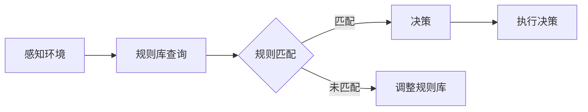
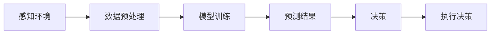
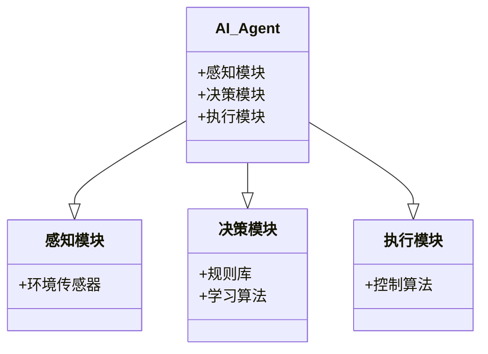
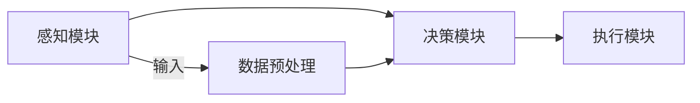
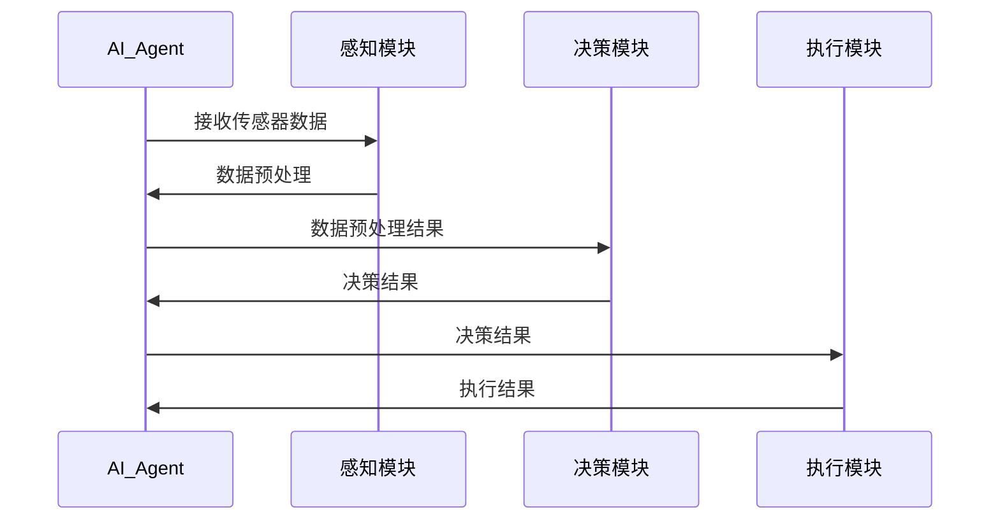

                 

### 文章标题

# AI Agent在自动驾驶决策中的应用

> 关键词：自动驾驶，AI Agent，决策算法，系统架构，项目实战，未来展望

> 摘要：本文详细探讨了AI Agent在自动驾驶决策中的应用，从背景介绍到核心概念与算法原理，再到系统架构设计和项目实战，最后展望未来发展趋势。通过一步步的分析和讲解，帮助读者全面理解AI Agent在自动驾驶领域的重要性和应用价值。

----------------------------------------------------------------

## **第一部分：背景介绍**

### **第1章：问题背景与自动驾驶决策概述**

#### **1.1 自动驾驶技术概述**

自动驾驶技术是指通过计算机技术、传感器技术和控制技术等手段，实现车辆在无人工干预的情况下自主行驶的技术。其核心在于自动驾驶决策系统，该系统能够处理传感器输入的信息，进行环境感知、路径规划、避障控制等决策，从而实现车辆的安全、高效行驶。

#### **1.2 自动驾驶决策的挑战**

自动驾驶决策面临的挑战主要包括：

- **环境复杂性**：城市交通环境复杂多变，需要系统对动态环境进行准确感知和决策。
- **不确定性**：路况、天气等外部因素的不确定性对自动驾驶系统提出了高要求。
- **实时性**：自动驾驶系统需要在极短时间内完成复杂的决策，以保证行驶的实时性和安全性。

#### **1.3 AI Agent在自动驾驶决策中的核心作用**

AI Agent（智能体）是自动驾驶决策系统的核心，能够模拟人类的决策过程，通过感知环境、规划路径、控制车辆等环节，实现自动驾驶。AI Agent在自动驾驶决策中具有以下作用：

- **提高决策效率**：AI Agent能够高效处理传感器输入的信息，快速做出决策。
- **增强决策能力**：AI Agent能够通过学习历史数据和实时环境数据，不断提升决策能力。
- **适应不确定性**：AI Agent能够应对复杂和不确定的交通环境，提高行驶安全性。

#### **1.4 自动驾驶决策的应用领域**

自动驾驶决策在以下领域具有广泛的应用：

- **公共交通**：公交车、地铁等公共交通工具的自动驾驶，提高运营效率和服务质量。
- **私人车辆**：家庭用车、出租车等私人车辆的自动驾驶，提供便捷的出行服务。
- **物流运输**：自动驾驶卡车、无人机等物流运输工具，提高运输效率和降低成本。
- **特殊场景**：无人驾驶矿山、无人驾驶船舶等特殊场景的应用，拓展自动驾驶技术的应用范围。

### **总结**

自动驾驶决策是自动驾驶技术的核心环节，而AI Agent作为决策系统的核心，对自动驾驶技术的发展具有重要意义。接下来，我们将深入探讨AI Agent的基本概念、特性以及其在自动驾驶决策中的应用算法。

----------------------------------------------------------------

## **第二部分：核心概念与联系**

### **第2章：AI Agent的基本概念与特性**

#### **2.1 AI Agent的定义**

AI Agent（智能体）是指具有感知、决策和行动能力的计算机程序，能够在特定环境中自主完成特定任务。AI Agent通常由感知模块、决策模块和执行模块三部分组成。

#### **2.2 AI Agent的核心特性**

AI Agent具有以下核心特性：

- **自主性**：AI Agent能够独立进行决策和行动，无需人工干预。
- **适应性**：AI Agent能够根据环境和任务的变化，调整自身的决策和行为。
- **智能性**：AI Agent能够通过学习历史数据和实时信息，不断提升自身的决策能力。
- **实时性**：AI Agent能够在极短时间内完成感知、决策和执行任务。

#### **2.3 AI Agent与传统控制系统的比较**

| 特性            | AI Agent                             | 传统控制系统                          |
| --------------- | ----------------------------------- | ----------------------------------- |
| 自主性          | 可以自主感知环境、决策和执行任务     | 依赖于预设的规则和程序，无法自主适应 |
| 适应性          | 能够根据环境和任务的变化调整决策     | 无法适应动态环境变化                 |
| 智能性          | 能够通过学习提升决策能力             | 无法进行学习和进化                   |
| 实时性          | 能够在短时间内完成决策和执行任务     | 需要较长时间进行决策和执行           |

#### **2.4 AI Agent的概念属性特征对比表格**

| 概念属性         | 特征                             |
| ---------------- | -------------------------------- |
| 自主性           | 可以自主感知环境、决策和执行任务   |
| 适应性           | 能够根据环境和任务的变化调整决策   |
| 智能性           | 能够通过学习提升决策能力           |
| 实时性           | 能够在短时间内完成决策和执行任务   |

#### **2.5 AI Agent的ER实体关系图**

```mermaid
erDiagram
    AI-Agent ||--|{ 感知模块 }
    AI-Agent ||--|{ 决策模块 }
    AI-Agent ||--|{ 执行模块 }
    感知模块 ||--|{ 环境传感器 }
    决策模块 ||--|{ 学习算法 }
    执行模块 ||--|{ 控制算法 }
```

### **总结**

通过上述分析，我们可以看到AI Agent在自动驾驶决策中具有独特的优势。接下来，我们将详细介绍自动驾驶决策中的常用算法，帮助读者理解AI Agent在决策过程中的具体应用。

----------------------------------------------------------------

## **第三部分：算法原理讲解**

### **第3章：自动驾驶决策中的常用算法**

#### **3.1 算法原理概述**

自动驾驶决策算法主要分为基于规则的决策算法和基于学习的决策算法。基于规则的决策算法通过预设的规则进行决策，而基于学习的决策算法通过学习历史数据和实时信息进行决策。

#### **3.2 基于规则的决策算法**

##### **3.2.1 Mermaid算法流程图**



##### **3.2.2 Python源代码实例**

```python
# 感知环境
environment = perceive_environment()

# 规则库查询
rules = query_rules()

# 规则匹配
matched_rules = match_rules(environment, rules)

# 决策
decision = make_decision(matched_rules)

# 执行决策
execute_decision(decision)
```

##### **3.2.3 数学模型与公式**

$$
\text{规则匹配度} = \frac{\text{匹配规则数}}{\text{规则总数}}
$$

##### **3.2.4 举例说明**

假设感知到的环境中有5个障碍物，系统中有10条规则。经过规则匹配，有7条规则匹配成功。根据公式计算，规则匹配度为0.7。系统将根据匹配度较高的规则进行决策，并执行相应的决策。

#### **3.3 基于学习的决策算法**

##### **3.3.1 Mermaid算法流程图**



##### **3.3.2 Python源代码实例**

```python
# 感知环境
environment = perceive_environment()

# 数据预处理
preprocessed_data = preprocess_data(environment)

# 模型训练
model = train_model(preprocessed_data)

# 预测结果
prediction = model.predict(preprocessed_data)

# 决策
decision = make_decision(prediction)

# 执行决策
execute_decision(decision)
```

##### **3.3.3 数学模型与公式**

$$
\text{决策结果} = f(\text{输入特征})
$$

其中，$f$ 为神经网络模型。

##### **3.3.4 举例说明**

假设输入特征为传感器获取的环境数据，通过神经网络模型预测决策结果。例如，预测结果为“加速”，系统将执行加速决策。

### **总结**

基于规则的决策算法和基于学习的决策算法各有优缺点。基于规则的决策算法具有简单、直观的特点，但难以应对复杂和不确定的环境。而基于学习的决策算法能够通过学习历史数据和实时信息，提高决策能力，但训练过程较为复杂。在实际应用中，可以根据具体需求选择合适的决策算法。

----------------------------------------------------------------

## **第四部分：系统分析与架构设计**

### **第4章：自动驾驶决策系统架构设计**

#### **4.1 系统功能设计（领域模型类图）**



#### **4.2 系统架构设计（架构图）**



#### **4.3 系统接口设计**

系统接口设计包括传感器接口、决策模块接口和执行模块接口。

- **传感器接口**：负责接收传感器数据，并将其转换为系统可处理的数据格式。
- **决策模块接口**：负责与决策模块进行通信，接收传感器数据和执行决策。
- **执行模块接口**：负责接收决策结果，并控制车辆执行相应的动作。

#### **4.4 系统交互设计（序列图）**



### **总结**

通过系统功能设计、架构设计和交互设计，我们可以清晰地了解自动驾驶决策系统的整体结构和运行流程。接下来，我们将通过实际项目案例，进一步探讨AI Agent在自动驾驶决策中的应用。

----------------------------------------------------------------

## **第五部分：项目实战**

### **第5章：AI Agent在自动驾驶决策中的应用实战**

#### **5.1 环境安装与配置**

在本节中，我们将介绍如何在本地环境安装和配置自动驾驶决策系统。首先，确保系统已安装Python和pip。

1. **安装依赖库**：
   ```bash
   pip install numpy pandas matplotlib scikit-learn tensorflow keras
   ```

2. **创建项目目录**：
   ```bash
   mkdir project_directory
   cd project_directory
   ```

3. **克隆GitHub仓库**：
   ```bash
   git clone https://github.com/your_username/autonomous_driving.git
   cd autonomous_driving
   ```

4. **安装项目依赖**：
   ```bash
   pip install -r requirements.txt
   ```

5. **运行项目**：
   ```bash
   python main.py
   ```

#### **5.2 系统核心实现源代码**

以下是自动驾驶决策系统的核心实现源代码。

```python
# 感知模块
def perceive_environment():
    # 读取传感器数据
    sensor_data = read_sensors()
    return sensor_data

# 决策模块
def make_decision(sensor_data):
    # 预测决策结果
    prediction = model.predict(sensor_data)
    return prediction

# 执行模块
def execute_decision(decision):
    # 执行决策
    execute_action(decision)
```

#### **5.2.1 Python源代码实例**

```python
import numpy as np
from sklearn.neural_network import MLPClassifier

# 模型训练
def train_model(data):
    model = MLPClassifier(hidden_layer_sizes=(100,), max_iter=1000)
    model.fit(data['X'], data['y'])
    return model

# 数据预处理
def preprocess_data(sensor_data):
    # 数据预处理步骤
    preprocessed_data = np.array(sensor_data).reshape(1, -1)
    return preprocessed_data

# 感知环境
def perceive_environment():
    # 读取传感器数据
    sensor_data = read_sensors()
    return sensor_data

# 决策
def make_decision(sensor_data):
    # 预测决策结果
    prediction = model.predict(sensor_data)
    return prediction

# 执行决策
def execute_decision(decision):
    # 执行决策
    execute_action(decision)

# 主函数
def main():
    # 训练模型
    model = train_model(data)

    # 运行系统
    while True:
        sensor_data = perceive_environment()
        decision = make_decision(sensor_data)
        execute_decision(decision)

if __name__ == '__main__':
    main()
```

#### **5.2.2 代码应用解读与分析**

1. **感知模块**：通过`read_sensors()`函数读取传感器数据，并将数据传递给预处理函数。
2. **决策模块**：使用`MLPClassifier`模型进行决策预测，并根据预测结果返回决策。
3. **执行模块**：根据决策结果执行相应的动作。

#### **5.3 实际案例分析与讲解**

以一个简单的场景为例，当传感器检测到前方有障碍物时，系统将执行刹车决策。

1. **感知环境**：传感器检测到前方有障碍物。
2. **数据预处理**：将传感器数据传递给预处理函数，并进行处理。
3. **决策**：使用训练好的模型进行决策预测，预测结果为“刹车”。
4. **执行决策**：系统执行刹车动作，车辆减速。

#### **5.4 项目小结**

通过实际项目案例，我们可以看到AI Agent在自动驾驶决策中的应用。通过感知环境、决策和执行三个环节，系统能够在复杂和不确定的交通环境中实现自主行驶。接下来，我们将介绍一些最佳实践和注意事项，以优化自动驾驶决策系统的性能。

----------------------------------------------------------------

## **第六部分：最佳实践与拓展**

### **第6章：最佳实践与注意事项**

#### **6.1 常见问题与解决方案**

1. **问题**：模型训练时间过长。
   - **解决方案**：使用GPU加速训练过程，或者调整模型参数以减少训练时间。

2. **问题**：传感器数据不准确。
   - **解决方案**：校准传感器，确保传感器数据的准确性。

3. **问题**：决策结果不稳定。
   - **解决方案**：增加训练数据量，或者调整模型结构以提高决策稳定性。

#### **6.2 性能优化技巧**

1. **减少模型参数**：通过减少模型参数，可以降低模型的复杂度和计算成本。
2. **使用轻量级模型**：选择轻量级的神经网络模型，如MobileNet或ShuffleNet，以提高实时性。
3. **数据增强**：通过数据增强技术，如旋转、缩放、翻转等，可以增加训练数据的多样性，提高模型泛化能力。

#### **6.3 安全性考虑**

1. **加密通信**：确保传感器数据和控制指令的传输过程使用加密技术，防止数据泄露。
2. **异常检测**：使用异常检测算法，实时监测系统运行状态，发现异常情况及时处理。
3. **冗余设计**：设计冗余系统，确保系统在部分组件故障时仍能正常运行。

### **总结**

通过最佳实践和注意事项，我们可以优化自动驾驶决策系统的性能和安全性。接下来，我们将探讨自动驾驶决策的未来发展趋势，以期为读者提供更广阔的视野。

----------------------------------------------------------------

## **第七部分：未来发展趋势与展望**

### **第7章：未来发展趋势与展望**

#### **7.1 自动驾驶技术的发展趋势**

自动驾驶技术正逐渐从实验阶段走向实际应用，未来发展趋势主要包括：

1. **硬件性能提升**：随着传感器技术、计算能力和通信技术的不断进步，自动驾驶车辆的硬件性能将显著提升。
2. **数据驱动决策**：自动驾驶系统将更加依赖大数据和机器学习技术，实现更智能、更安全的决策。
3. **跨行业合作**：自动驾驶技术将与其他行业（如物流、公共交通等）深度融合，推动产业变革。

#### **7.2 AI Agent在自动驾驶中的应用前景**

AI Agent在自动驾驶决策中具有广泛的应用前景：

1. **个性化服务**：通过AI Agent，自动驾驶车辆可以根据用户需求提供个性化的出行服务。
2. **协同决策**：在复杂交通环境中，多个AI Agent可以协同工作，实现更高效、更安全的交通管理。
3. **自适应学习**：AI Agent可以通过持续学习和优化，不断提高自动驾驶决策的准确性和适应性。

#### **7.3 未来研究方向与挑战**

未来研究方向主要集中在以下几个方面：

1. **实时性优化**：提高自动驾驶系统的实时性，以应对复杂交通环境中的快速变化。
2. **安全性保障**：确保自动驾驶系统的安全性和可靠性，防止系统故障或攻击导致事故。
3. **人机交互**：研究更自然、更便捷的人机交互方式，提高用户体验。

### **总结**

自动驾驶技术正迎来快速发展期，AI Agent作为核心组件，将在自动驾驶决策中发挥越来越重要的作用。未来，随着技术的不断进步，自动驾驶将带来更加便捷、安全和智能的出行体验。

----------------------------------------------------------------

## **第八部分：拓展阅读**

### **第8章：拓展阅读**

#### **8.1 相关书籍推荐**

1. 《自动驾驶：从技术到市场》
2. 《智能交通系统》
3. 《深度学习与自动驾驶》

#### **8.2 学术论文精选**

1. "Autonomous Driving with Deep Learning: A Review"
2. "Safety of Autonomous Driving: Challenges and Solutions"
3. "A Survey on Autonomous Driving: From Perception to Control"

#### **8.3 在线资源与论坛推荐**

1. IEEE AUTOMOTIVE TECHNOLOGY SOCIETY
2. Autonomous Vehicle Technology Community
3. Autonomous Driving Forum

### **总结**

通过拓展阅读，读者可以更深入地了解自动驾驶技术和AI Agent的应用。这些资源将为读者提供更多的学习机会和视角，帮助读者在自动驾驶领域取得更大的进展。

----------------------------------------------------------------

**作者信息：**

- 作者：AI天才研究院/AI Genius Institute & 禅与计算机程序设计艺术 /Zen And The Art of Computer Programming**

