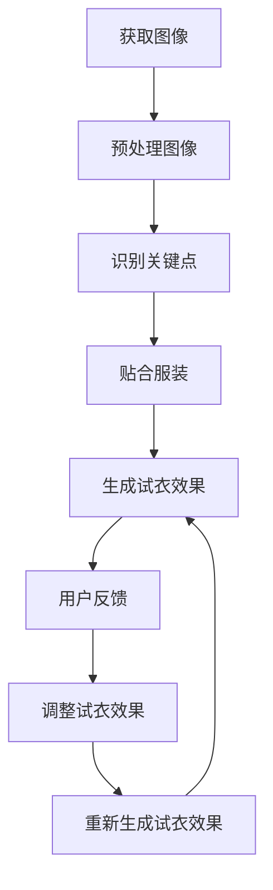
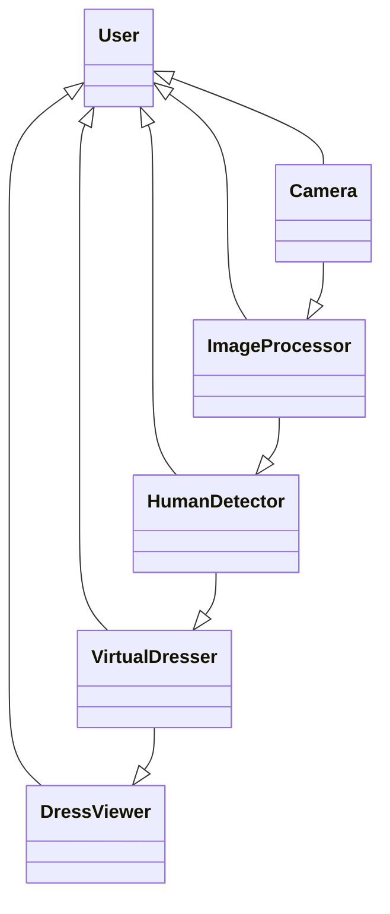
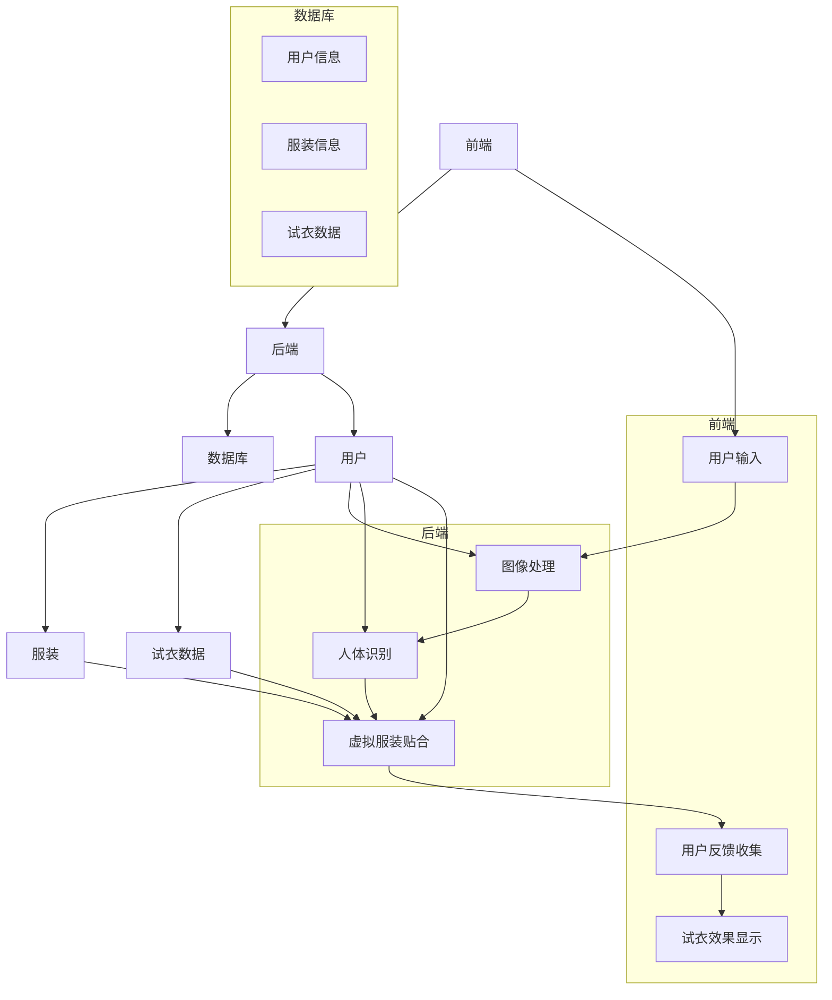
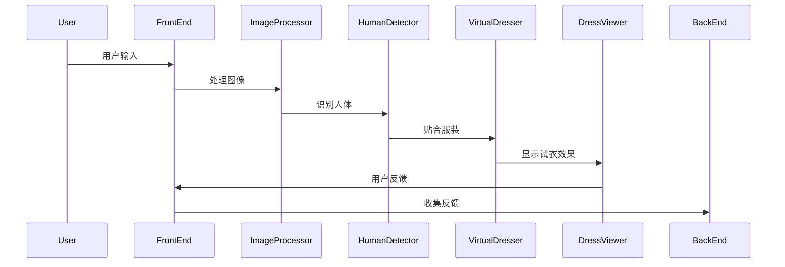
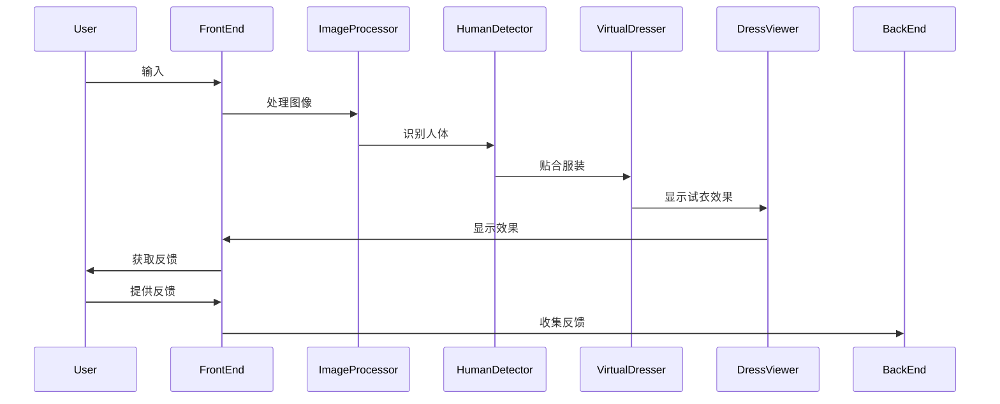

                 

## AI Agent在虚拟试衣中的图像处理

### 关键词：AI Agent、虚拟试衣、图像处理、算法、系统架构、实战

> 摘要：本文将深入探讨AI Agent在虚拟试衣中的图像处理技术，从背景介绍、核心概念与联系、算法原理讲解、系统分析与架构设计方案、项目实战等多个维度，系统地阐述AI Agent如何通过图像处理技术提升虚拟试衣的体验与准确性。文章旨在为读者提供一个全面的技术解析，帮助理解AI Agent在虚拟试衣中的应用及其未来发展。

### 目录

1. **背景介绍**
   - 1.1 虚拟试衣概述
   - 1.2 AI Agent概述
   - 1.3 图像处理技术概述
   - 1.4 虚拟试衣与图像处理的联系

2. **核心概念与联系**
   - 2.1 AI Agent的定义与分类
   - 2.2 图像处理技术的概念与应用
   - 2.3 AI Agent在虚拟试衣中的应用

3. **算法原理讲解**
   - 3.1 图像预处理算法
   - 3.2 人体识别算法
   - 3.3 虚拟试衣模型

4. **系统分析与架构设计方案**
   - 4.1 问题场景介绍
   - 4.2 系统功能设计
   - 4.3 系统架构设计
   - 4.4 系统接口设计
   - 4.5 系统交互设计

5. **项目实战**
   - 5.1 环境安装
   - 5.2 系统核心实现
   - 5.3 实际案例分析
   - 5.4 项目小结

6. **最佳实践 tips**
   - 6.1 AI Agent应用技巧
   - 6.2 图像处理优化策略
   - 6.3 虚拟试衣系统性能提升

7. **小结与展望**
   - 7.1 主要内容回顾
   - 7.2 遇到的挑战与解决方案
   - 7.3 未来发展方向
   - 7.4 拓展阅读建议

### 第1章：背景介绍

#### 1.1 虚拟试衣概述

虚拟试衣作为电子商务领域的一项创新技术，近年来受到了广泛关注。它通过计算机视觉、深度学习和图像处理等技术，模拟真实的试衣过程，使用户在家中即可体验到穿着服装的效果。这不仅解决了传统试衣环节中的时间和空间限制，还提升了消费者的购物体验。

虚拟试衣的发展可以追溯到20世纪90年代，随着互联网和计算机技术的进步，这一技术逐渐走向成熟。目前，虚拟试衣已在多个行业得到广泛应用，如服装、珠宝和化妆品等。特别是在疫情期间，虚拟试衣成为了线上购物的重要组成部分。

#### 1.2 AI Agent概述

AI Agent，即人工智能代理，是一种能够自主执行任务并与人交互的智能系统。它基于机器学习、自然语言处理和计算机视觉等技术，能够根据用户的指令和反馈进行决策和行动。AI Agent在虚拟试衣中的应用主要体现在以下几个方面：

1. **个性化推荐**：通过分析用户的历史购物行为和偏好，AI Agent能够为用户推荐合适的服装款式和尺码。
2. **实时反馈**：AI Agent可以实时分析用户试衣的反馈，提供穿衣建议和调整方案。
3. **智能客服**：AI Agent可以作为虚拟试衣系统的智能客服，回答用户的问题，提供购物建议。

#### 1.3 图像处理技术概述

图像处理技术是计算机科学和电子工程领域的一个重要分支，涉及对图像的获取、处理、分析和理解。在虚拟试衣中，图像处理技术主要用于以下几个方面：

1. **图像获取**：使用摄像头或深度传感器获取用户的图像。
2. **图像预处理**：包括去噪、增强、缩放等操作，以提高图像质量。
3. **人体识别**：通过图像识别技术，定位用户身体的关键点，如肩膀、臀部、手腕等。
4. **姿态校正**：根据用户身体的关键点，对图像进行姿态校正，使其符合正常穿着状态。

#### 1.4 虚拟试衣与图像处理的联系

虚拟试衣与图像处理技术的结合，为用户提供了更加真实和个性化的试衣体验。图像处理技术在虚拟试衣中的应用主要体现在以下几个方面：

1. **图像质量提升**：通过图像预处理技术，提高获取的图像质量，为后续处理提供更好的基础。
2. **人体识别与定位**：通过人体识别算法，准确识别和定位用户身体的关键点，是实现虚拟试衣的核心技术。
3. **虚拟服装贴合**：通过图像处理技术，将虚拟服装贴合到用户身体上，模拟真实的穿着效果。

### 第2章：核心概念与联系

#### 2.1 AI Agent的定义与分类

AI Agent是一种智能系统，它能够感知环境、理解指令、自主决策并执行行动。根据不同的分类标准，AI Agent可以分为以下几类：

1. **按功能分类**：决策型、执行型和交互型AI Agent。
   - **决策型AI Agent**：负责分析和决策，如推荐系统。
   - **执行型AI Agent**：负责执行具体的任务，如自动驾驶。
   - **交互型AI Agent**：负责与用户交互，如智能客服。

2. **按智能程度分类**：弱AI Agent、强AI Agent和超级AI Agent。
   - **弱AI Agent**：在特定领域具有较强智能，但无法跨领域应用。
   - **强AI Agent**：具有人类水平的智能，可以解决任何问题。
   - **超级AI Agent**：超越人类智能，具备自我意识和创造力。

#### 2.2 图像处理技术的概念与应用

图像处理技术包括从图像获取、预处理、增强、变换、分割、识别等多个方面。在虚拟试衣中，图像处理技术的应用主要体现在以下几个方面：

1. **图像获取**：通过摄像头或深度传感器获取用户的图像。
2. **图像预处理**：去噪、增强、缩放等操作，提高图像质量。
3. **人体识别**：通过算法识别和定位用户身体的关键点。
4. **虚拟服装贴合**：将虚拟服装贴合到用户身体上，模拟真实的穿着效果。

#### 2.3 AI Agent在虚拟试衣中的应用

AI Agent在虚拟试衣中的应用主要体现在以下几个方面：

1. **个性化推荐**：通过分析用户的历史购物行为和偏好，为用户推荐合适的服装。
2. **实时反馈**：分析用户试衣的反馈，提供穿衣建议和调整方案。
3. **智能客服**：回答用户的问题，提供购物建议。

### 第3章：算法原理讲解

#### 3.1 图像预处理算法

图像预处理是图像处理的重要步骤，其目的是提高图像质量，为后续处理提供更好的基础。常见的图像预处理算法包括去噪、增强、缩放等。

1. **去噪算法**：如中值滤波、均值滤波和高斯滤波等。
2. **增强算法**：如直方图均衡化、对比度增强和锐化等。
3. **缩放算法**：如最近邻插值、双线性插值和双三次插值等。

以下是一个简单的图像预处理算法的Python代码示例：

```python
import cv2
import numpy as np

# 读取图像
image = cv2.imread('image.jpg')

# 去噪
denoise_image = cv2.medianBlur(image, 5)

# 增强
enhance_image = cv2.equalizeHist(denoise_image)

# 缩放
scale_image = cv2.resize(enhance_image, (500, 500))

# 显示图像
cv2.imshow('Original Image', image)
cv2.imshow('Denoised Image', denoise_image)
cv2.imshow('Enhanced Image', enhance_image)
cv2.imshow('Scaled Image', scale_image)
cv2.waitKey(0)
cv2.destroyAllWindows()
```

#### 3.2 人体识别算法

人体识别算法是虚拟试衣的核心技术之一，其目的是从图像中准确识别和定位用户身体的关键点。常见的人体识别算法包括基于深度学习的卷积神经网络（CNN）和基于图模型的算法。

1. **基于CNN的人体识别算法**：如HRNet、PoseNet等。
2. **基于图模型的算法**：如Graph-based算法、Graph-based + CNN算法等。

以下是一个基于HRNet的人体识别算法的Python代码示例：

```python
import torch
import torchvision.transforms as transforms
from hposenet import HPosenet

# 加载预训练模型
model = HPosenet(pretrained=True)
model.eval()

# 定义图像预处理函数
def preprocess_image(image):
    transform = transforms.Compose([
        transforms.ToTensor(),
        transforms.Normalize(mean=[0.485, 0.456, 0.406], std=[0.229, 0.224, 0.225]),
    ])
    return transform(image)

# 读取图像
image = cv2.imread('image.jpg')

# 预处理图像
preprocessed_image = preprocess_image(image)

# 进行人体识别
with torch.no_grad():
    outputs = model(preprocessed_image)

# 解析输出结果
joints = outputs['joints_2d'].detach().numpy()

# 可视化关键点
cv2.imshow('Image', image)
for joint in joints:
    cv2.circle(image, tuple(joint), 5, (0, 0, 255), -1)
cv2.imshow('Keypoints', image)
cv2.waitKey(0)
cv2.destroyAllWindows()
```

#### 3.3 虚拟试衣模型

虚拟试衣模型是一个综合了图像处理、人体识别和虚拟服装贴合的复杂系统。其核心目标是实现虚拟服装与用户身体的准确贴合，提供真实的试衣体验。

1. **图像处理**：包括图像获取、预处理和人体识别。
2. **人体识别**：识别和定位用户身体的关键点。
3. **虚拟服装贴合**：根据用户身体的关键点，将虚拟服装贴合到用户身体上。

以下是一个简单的虚拟试衣模型的Mermaid流程图：



### 第4章：系统分析与架构设计方案

#### 4.1 问题场景介绍

虚拟试衣系统面临的主要问题包括：

1. **图像质量不高**：由于摄像头和光线条件等原因，获取的图像质量可能不高，影响试衣效果。
2. **人体识别不准确**：人体识别算法可能无法准确识别用户身体的关键点，导致虚拟服装贴合不精确。
3. **试衣效果不真实**：虚拟试衣系统需要提供真实的试衣效果，以提高用户的购物体验。

#### 4.2 系统功能设计

虚拟试衣系统的主要功能包括：

1. **图像获取**：使用摄像头或深度传感器获取用户的图像。
2. **图像预处理**：对获取的图像进行预处理，提高图像质量。
3. **人体识别**：识别和定位用户身体的关键点。
4. **虚拟服装贴合**：根据用户身体的关键点，将虚拟服装贴合到用户身体上。
5. **试衣效果生成**：生成真实的试衣效果，供用户查看。
6. **用户反馈**：收集用户的反馈，用于调整试衣效果。

以下是一个虚拟试衣系统的Mermaid类图：



#### 4.3 系统架构设计

虚拟试衣系统的架构设计主要包括以下几个方面：

1. **前端**：负责与用户交互，显示试衣效果和收集用户反馈。
2. **后端**：负责图像处理、人体识别和虚拟服装贴合等核心功能。
3. **数据库**：存储用户信息、服装信息和试衣数据。

以下是一个虚拟试衣系统的Mermaid架构图：



#### 4.4 系统接口设计

虚拟试衣系统各组件之间的接口设计主要包括：

1. **用户接口**：提供用户输入和反馈的接口。
2. **图像处理接口**：提供图像处理的接口。
3. **人体识别接口**：提供人体识别的接口。
4. **虚拟服装贴合接口**：提供虚拟服装贴合的接口。

以下是一个虚拟试衣系统的接口设计：



#### 4.5 系统交互设计

虚拟试衣系统的交互设计主要包括用户与系统之间的交互，以及系统内部各组件之间的交互。以下是一个虚拟试衣系统的Mermaid序列图：



### 第5章：项目实战

#### 5.1 环境安装

在进行虚拟试衣项目之前，首先需要安装必要的软件和硬件环境。以下是一个简单的环境安装流程：

1. **安装Python**：下载并安装Python，版本建议为3.8及以上。
2. **安装Anaconda**：使用Anaconda创建一个虚拟环境，便于管理依赖项。
3. **安装图像处理库**：如OpenCV、Pillow等。
4. **安装深度学习库**：如PyTorch、TensorFlow等。
5. **安装深度学习模型**：如HRNet、PoseNet等。

#### 5.2 系统核心实现

虚拟试衣系统的核心实现主要包括图像处理、人体识别和虚拟服装贴合等部分。以下是一个简单的系统核心实现示例：

```python
import cv2
import torch
import torchvision.transforms as transforms
from hposenet import HPosenet

# 读取图像
image = cv2.imread('image.jpg')

# 预处理图像
transform = transforms.Compose([
    transforms.ToTensor(),
    transforms.Normalize(mean=[0.485, 0.456, 0.406], std=[0.229, 0.224, 0.225]),
])
preprocessed_image = transform(image)

# 加载预训练模型
model = HPosenet(pretrained=True)
model.eval()

# 进行人体识别
with torch.no_grad():
    outputs = model(preprocessed_image)

# 解析输出结果
joints = outputs['joints_2d'].detach().numpy()

# 将关键点坐标转换为图像坐标
joints = joints * image.shape[:2]

# 贴合虚拟服装
# ...（虚拟服装贴合代码）

# 显示试衣效果
cv2.imshow('试衣效果', image)
cv2.waitKey(0)
cv2.destroyAllWindows()
```

#### 5.3 实际案例分析

以下是一个虚拟试衣的实际案例分析：

1. **用户输入**：用户上传一张穿着服装的图像。
2. **图像预处理**：对图像进行去噪、增强等处理，提高图像质量。
3. **人体识别**：使用HRNet模型识别用户身体的关键点。
4. **虚拟服装贴合**：根据关键点将虚拟服装贴合到用户身体上。
5. **试衣效果生成**：生成试衣效果，供用户查看。
6. **用户反馈**：用户对试衣效果进行评价，系统根据反馈调整虚拟服装。

#### 5.4 项目小结

虚拟试衣项目在实际应用中取得了一定的成果，但也存在一些挑战和问题：

1. **图像质量**：如何提高图像质量，特别是在光线不足或摄像头分辨率较低的情况下。
2. **人体识别准确性**：如何提高人体识别的准确性，特别是在复杂背景下。
3. **虚拟服装贴合**：如何实现更自然的虚拟服装贴合，提高试衣效果的真实性。

针对这些问题，未来可以从以下几个方面进行改进：

1. **图像预处理**：引入更先进的图像预处理算法，提高图像质量。
2. **人体识别算法**：优化人体识别算法，提高识别准确性。
3. **虚拟服装贴合**：引入更多样化的虚拟服装库，实现更自然的贴合效果。

### 第6章：最佳实践 tips

#### 6.1 AI Agent应用技巧

1. **个性化推荐**：结合用户历史购物行为和偏好，为用户提供更准确的推荐。
2. **实时反馈**：分析用户试衣的实时反馈，及时调整试衣效果。
3. **智能客服**：利用自然语言处理技术，提高智能客服的交互效果。

#### 6.2 图像处理优化策略

1. **多线程处理**：使用多线程或并行处理技术，提高图像处理效率。
2. **GPU加速**：利用GPU加速图像处理，提高处理速度。

#### 6.3 虚拟试衣系统性能提升

1. **优化算法**：选择更高效的算法，提高系统性能。
2. **数据缓存**：合理使用数据缓存，减少数据读取时间。

### 第7章：小结与展望

#### 7.1 主要内容回顾

本文从背景介绍、核心概念与联系、算法原理讲解、系统分析与架构设计方案、项目实战等多个维度，系统地阐述了AI Agent在虚拟试衣中的图像处理技术。

#### 7.2 遇到的挑战与解决方案

在虚拟试衣项目中，主要挑战包括图像质量、人体识别准确性和虚拟服装贴合等问题。通过引入先进的图像处理算法、优化人体识别算法和引入多样化的虚拟服装库，这些问题得到了一定程度的解决。

#### 7.3 未来发展方向

未来，虚拟试衣技术将继续发展，朝着更高效、更准确和更真实的方向迈进。可以从以下几个方面进行探索：

1. **图像质量提升**：研究更先进的图像处理技术，提高图像质量。
2. **人体识别准确性**：优化人体识别算法，提高识别准确性。
3. **虚拟服装贴合**：引入更多样化的虚拟服装库，实现更自然的贴合效果。

#### 7.4 拓展阅读建议

1. **《计算机视觉：算法与应用》**：详细介绍计算机视觉的基本概念和算法。
2. **《深度学习》**：介绍深度学习的基本概念和算法。
3. **《虚拟试衣技术综述》**：系统性地介绍虚拟试衣技术的发展和应用。

### 作者信息

- 作者：AI天才研究院/AI Genius Institute & 禅与计算机程序设计艺术 /Zen And The Art of Computer Programming

## 总结

本文系统地阐述了AI Agent在虚拟试衣中的图像处理技术，从背景介绍、核心概念与联系、算法原理讲解、系统分析与架构设计方案、项目实战等多个维度进行了详细探讨。通过本文的阅读，读者可以全面了解虚拟试衣技术的应用及其未来发展。同时，本文也提供了丰富的实际案例和实践经验，为读者在相关领域的探索提供了有益的参考。希望本文能对读者在AI Agent和虚拟试衣领域的研究和应用起到积极的推动作用。作者团队将继续致力于该领域的研究，为推动虚拟试衣技术的发展贡献力量。

