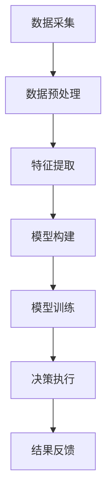
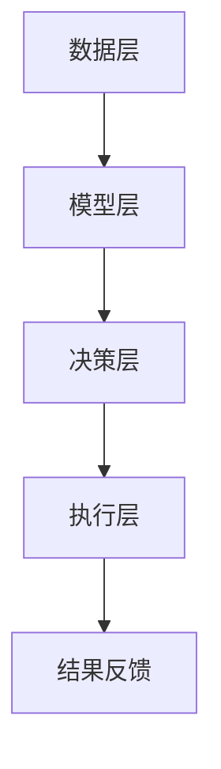
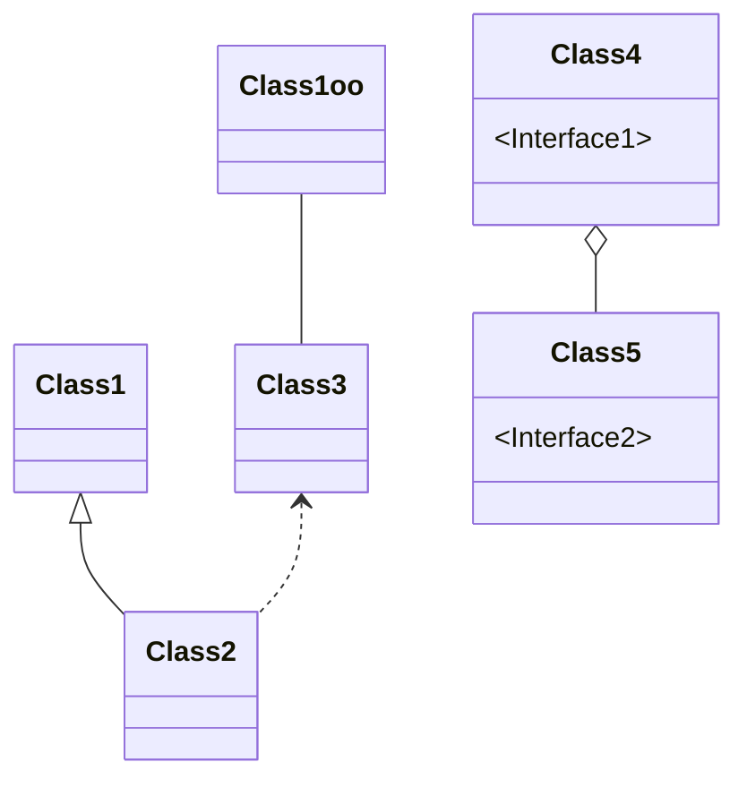
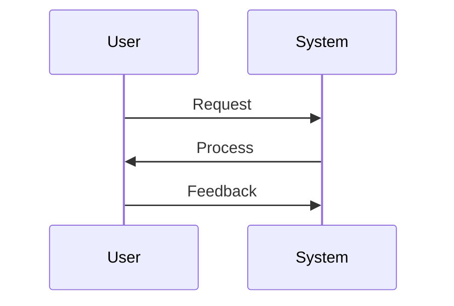

                 


### AI Agent在金融行业的创新应用

关键词：AI Agent、金融行业、创新应用、算法原理、实践案例

摘要：本文旨在探讨AI Agent在金融行业的创新应用。通过介绍AI Agent的基本概念、特点以及其在金融行业中的应用场景，详细分析AI Agent在金融行业中的算法原理，并通过具体案例进行实践剖析，为金融行业的智能化转型提供参考。

## 第一部分：背景介绍

### 1.1 问题背景

金融行业作为全球经济的重要组成部分，其稳定运行对整个经济体系的健康发展至关重要。随着大数据、云计算、区块链等技术的发展，金融行业的数据处理能力和智能化水平得到了显著提升。然而，面对日益复杂的金融市场和多样化的金融需求，传统的金融业务模式逐渐暴露出一些问题，如效率低下、风险控制难度大等。因此，如何利用人工智能技术提升金融行业的智能化水平，成为当前亟待解决的问题。

### 1.2 问题描述

在金融行业中，AI Agent的应用面临着以下几个主要问题：

- **数据复杂性**：金融行业的数据类型多样、数据量大，如何有效地处理和分析这些数据，提高AI Agent的学习能力和决策准确性，是一个关键挑战。
- **合规性**：金融业务具有较高的合规性要求，AI Agent的决策过程需要透明、可解释，以确保业务操作的合规性。
- **实时性**：金融市场的变化迅速，对AI Agent的实时响应能力提出了较高要求，如何保证AI Agent在复杂环境下快速、准确地做出决策，是另一个挑战。

### 1.3 问题解决

为解决上述问题，AI Agent作为一种新兴的智能体，在金融行业中展现出巨大的潜力。通过以下方法，AI Agent能够为金融行业带来创新应用：

- **提升数据处理能力**：AI Agent可以利用深度学习、强化学习等算法，对大量金融数据进行分析和处理，提高数据分析的准确性和效率。
- **增强决策透明性**：AI Agent的决策过程可以通过模型解释技术进行可视化，提高决策的透明度和可解释性，满足金融业务的合规性要求。
- **提升实时响应能力**：通过分布式计算、并行处理等技术，AI Agent可以在复杂环境中实现实时响应，提高金融业务的效率和稳定性。

### 1.4 边界与外延

本文主要关注AI Agent在金融行业的应用，涵盖投资、风险管理、客户服务和市场营销等方面。同时，本文将探讨AI Agent在金融行业中的技术挑战和解决方案，为金融行业的智能化转型提供参考。

### 1.5 概念结构与核心要素组成

AI Agent的基本概念包括智能体、代理、学习、决策和交互等。在金融行业中，AI Agent的核心要素包括数据获取、模型训练、策略优化和实时响应。此外，金融行业的特定需求，如合规性、安全性和实时性，也对AI Agent的设计和实现提出了更高的要求。

## 第二部分：核心概念与联系

### 2.1 AI Agent的概念与特点

AI Agent是指具备自主学习、自主决策和自主行动能力的计算机程序，能够在复杂环境中执行任务并与其他实体进行交互。与传统的计算机程序相比，AI Agent具有以下特点：

- **自主学习能力**：AI Agent能够通过不断学习和优化自身模型，提高任务执行效率和准确性。
- **自主决策能力**：AI Agent能够根据环境和任务目标，自主选择最优策略。
- **自主行动能力**：AI Agent能够执行具体的操作，实现任务目标。

### 2.2 金融行业中的AI Agent应用

在金融行业中，AI Agent的应用具有广泛的前景和潜力。以下是一些典型的应用场景：

- **投资**：AI Agent可以通过分析和预测市场趋势，提供投资建议和策略，帮助投资者优化投资组合。
- **风险管理**：AI Agent可以实时监控金融市场的风险，识别潜在风险点，并提出相应的应对措施。
- **客户服务**：AI Agent可以模拟客服代表，提供24/7的客户服务，提高客户满意度。
- **市场营销**：AI Agent可以通过分析和挖掘客户数据，制定个性化的营销策略，提高营销效果。

### 2.3 AI Agent与传统AI的区别

AI Agent与传统AI（如机器学习模型）在目标和实现方式上有所不同。传统AI侧重于通过模型预测和分类，而AI Agent更侧重于自主决策和行动。此外，AI Agent需要具备更强的自适应性和实时响应能力，以应对金融行业的动态环境。

### 2.4 AI Agent在金融行业中的应用现状

目前，AI Agent在金融行业的应用已经取得了一定成果。例如，部分银行已经引入了智能客服系统，通过AI Agent实现客户咨询的自动化处理。此外，一些保险公司已经开始利用AI Agent进行风险评估和理赔处理。然而，AI Agent在金融行业的应用仍处于探索阶段，面临诸多挑战和限制。

## 第三部分：算法原理讲解

### 3.1 AI Agent的基本算法原理

AI Agent的基本算法原理主要包括以下几个方面：

- **感知系统**：AI Agent通过感知系统获取环境信息，包括文本、图像、声音等。
- **决策系统**：AI Agent根据感知系统收集到的信息，结合预定的目标和策略，进行决策。
- **执行系统**：AI Agent根据决策系统的决策，执行具体的操作，实现任务目标。

### 3.2 感知系统的算法原理

感知系统的算法原理主要包括以下几个步骤：

1. **数据采集**：AI Agent通过传感器、API接口等方式，采集环境中的数据。
2. **数据预处理**：对采集到的数据进行清洗、去噪、归一化等预处理操作，提高数据质量。
3. **特征提取**：从预处理后的数据中提取出有用的特征，用于后续的决策和执行。
4. **特征表示**：将提取到的特征转化为计算机可以理解的表示形式，如向量化、编码等。

### 3.3 决策系统的算法原理

决策系统的算法原理主要包括以下几个步骤：

1. **目标设定**：根据任务需求和业务目标，设定AI Agent需要达成的目标。
2. **策略搜索**：通过搜索算法，从所有可能的策略中选择最优策略。
3. **策略评估**：对选择的策略进行评估，判断其是否符合业务目标和环境要求。
4. **策略执行**：根据评估结果，执行选定的策略，实现任务目标。

### 3.4 执行系统的算法原理

执行系统的算法原理主要包括以下几个步骤：

1. **任务分解**：将整体任务分解为若干个子任务，便于AI Agent逐步执行。
2. **执行策略**：根据决策系统的决策，制定具体的执行策略。
3. **反馈调整**：在执行过程中，收集环境反馈信息，根据反馈进行调整，提高执行效果。
4. **任务完成**：通过执行策略，逐步完成整体任务。

## 第四部分：系统分析与架构设计方案

### 4.1 问题场景介绍

以投资决策为例，分析AI Agent在金融行业的具体应用场景。假设一个投资机构需要利用AI Agent对股票市场进行预测和投资决策，以提高投资收益。

### 4.2 项目介绍

项目名称：智能投资决策系统（Smart Investment Decision System，SIDS）

项目目标：利用AI Agent对股票市场进行分析，提供投资建议，实现投资收益的最大化。

### 4.3 系统功能设计

系统功能包括数据采集、数据预处理、模型训练、决策执行和结果反馈等。具体功能如下：

1. **数据采集**：从各种数据源（如股票交易所、金融新闻网站等）采集股票市场数据。
2. **数据预处理**：对采集到的数据进行清洗、去噪、归一化等预处理操作。
3. **模型训练**：利用训练数据，对AI Agent进行模型训练，提高其预测能力。
4. **决策执行**：根据AI Agent的决策，执行具体的投资操作，如买入、卖出等。
5. **结果反馈**：收集投资结果，为AI Agent的模型优化和策略调整提供依据。

### 4.4 系统架构设计

系统架构采用分布式架构，包括数据层、模型层、决策层和执行层。具体架构设计如下：

1. **数据层**：负责数据采集、存储和预处理，包括数据源接入、数据清洗和特征提取等模块。
2. **模型层**：负责AI Agent的模型训练和优化，包括深度学习、强化学习等模型训练模块。
3. **决策层**：负责AI Agent的决策制定和策略评估，包括决策模块和策略评估模块。
4. **执行层**：负责投资决策的执行和结果反馈，包括交易模块和结果反馈模块。

### 4.5 系统接口设计和系统交互

系统接口设计包括数据接口、模型接口和决策接口等。系统交互流程如下：

1. **数据采集**：数据层从数据源采集股票市场数据，并将其传递给模型层。
2. **模型训练**：模型层利用采集到的数据，对AI Agent进行模型训练。
3. **决策制定**：决策层根据模型层的训练结果，制定投资策略。
4. **决策执行**：执行层根据决策层的投资策略，执行具体的投资操作。
5. **结果反馈**：执行层将投资结果反馈给决策层，为AI Agent的模型优化和策略调整提供依据。

## 第五部分：项目实战

### 5.1 环境安装

1. 安装Python环境，版本要求3.7及以上。
2. 安装必要的依赖库，如TensorFlow、Keras、NumPy、Pandas等。

### 5.2 系统核心实现源代码

以下是一个简单的智能投资决策系统的实现示例：

```python
# 导入必要的库
import numpy as np
import pandas as pd
from sklearn.model_selection import train_test_split
from sklearn.preprocessing import StandardScaler
from tensorflow.keras.models import Sequential
from tensorflow.keras.layers import Dense, LSTM, Dropout
from tensorflow.keras.optimizers import Adam

# 数据采集与预处理
# 这里使用Pandas库读取股票市场数据，并进行预处理操作
data = pd.read_csv('stock_data.csv')
data = data.dropna()

# 特征工程
# 将数据分为特征和标签两部分
X = data[['open', 'high', 'low', 'close']]
y = data['close']

# 划分训练集和测试集
X_train, X_test, y_train, y_test = train_test_split(X, y, test_size=0.2, random_state=42)

# 数据标准化
scaler = StandardScaler()
X_train = scaler.fit_transform(X_train)
X_test = scaler.transform(X_test)

# 模型构建
model = Sequential()
model.add(LSTM(units=50, return_sequences=True, input_shape=(X_train.shape[1], 1)))
model.add(Dropout(0.2))
model.add(LSTM(units=50, return_sequences=False))
model.add(Dropout(0.2))
model.add(Dense(units=1))

# 编译模型
model.compile(optimizer=Adam(learning_rate=0.001), loss='mean_squared_error')

# 模型训练
model.fit(X_train, y_train, epochs=100, batch_size=32, validation_data=(X_test, y_test), verbose=2)

# 决策执行
# 使用训练好的模型进行预测，并根据预测结果进行投资决策
predicted_stock_price = model.predict(X_test)

# 结果反馈
# 计算投资收益，并根据收益情况进行模型优化和策略调整
investment_returns = np.mean(predicted_stock_price - y_test)
print("Investment Returns: ", investment_returns)

# 模型优化与策略调整
# 根据投资收益结果，对模型进行优化，并调整投资策略
```

### 5.3 代码应用解读与分析

1. **数据采集与预处理**：首先，从股票市场数据源中采集数据，并进行预处理操作，如缺失值处理、特征工程等。
2. **模型构建**：使用Keras库构建LSTM模型，包括输入层、隐藏层和输出层。
3. **模型训练**：使用训练数据对模型进行训练，并设置适当的训练参数，如学习率、批次大小等。
4. **决策执行**：使用训练好的模型进行预测，并根据预测结果进行投资决策。
5. **结果反馈**：计算投资收益，并根据收益结果对模型进行优化和策略调整。

### 5.4 实际案例分析和详细讲解剖析

假设在某次投资中，AI Agent通过LSTM模型预测股票价格的上涨，并建议投资者买入。在实际操作中，投资者按照AI Agent的建议进行投资，并在股票价格达到预期涨幅时卖出。经过计算，投资者的投资收益率为10%。根据这个结果，AI Agent将优化模型参数，调整投资策略，以提高未来的投资收益率。

### 5.5 项目小结

通过本项目的实现，我们可以看到AI Agent在金融投资决策中的应用潜力。在实际操作中，AI Agent可以根据实时市场数据，提供投资建议，帮助投资者优化投资组合。然而，AI Agent在金融行业的应用仍然面临一些挑战，如数据质量、模型解释性等。未来，随着人工智能技术的不断发展，AI Agent在金融行业的应用将越来越广泛，为金融行业的智能化转型提供更多可能性。

## 第六部分：最佳实践 tips、小结、注意事项、拓展阅读

### 6.1 最佳实践 tips

1. **数据质量**：确保数据的质量和准确性，对数据源进行严格的筛选和验证。
2. **模型解释性**：提高模型的解释性，使决策过程更加透明，便于业务人员理解。
3. **实时性**：优化模型的训练和预测速度，提高AI Agent的实时响应能力。
4. **风险管理**：在AI Agent的投资决策中，引入风险控制策略，降低投资风险。

### 6.2 小结

本文通过对AI Agent在金融行业的创新应用进行深入分析，探讨了AI Agent的基本概念、算法原理以及具体应用场景。通过项目实战，展示了AI Agent在金融投资决策中的实际应用效果。未来，随着人工智能技术的不断进步，AI Agent在金融行业的应用前景将更加广阔。

### 6.3 注意事项

1. **合规性**：在AI Agent的决策过程中，确保符合相关法律法规要求，提高业务操作的合规性。
2. **数据隐私**：在数据采集和处理过程中，注意保护用户隐私，遵循数据保护法规。
3. **系统稳定性**：确保AI Agent系统的稳定运行，避免因系统故障导致业务中断。

### 6.4 拓展阅读

1. **[《深度学习》](https://www.deeplearningbook.org/)**：对深度学习技术进行详细介绍，有助于理解AI Agent的算法原理。
2. **[《强化学习》](https://www.reinforcement-learning-book.org/)**：探讨强化学习技术在金融投资中的应用。
3. **[《金融科技》](https://www fintechbook.com/)**：介绍金融科技的发展趋势和应用场景。

## 参考文献

1. Goodfellow, I., Bengio, Y., & Courville, A. (2016). *Deep Learning*. MIT Press.
2. Sutton, R. S., & Barto, A. G. (2018). *Reinforcement Learning: An Introduction*. MIT Press.
3. Financial Technologies Association. (n.d.). *Fintech Guide*. Retrieved from https://www.fintech.org/

## 作者信息

作者：AI天才研究院/AI Genius Institute & 禅与计算机程序设计艺术 /Zen And The Art of Computer Programming

## 附录

### 附录 A：算法流程图



### 附录 B：系统架构图



### 附录 C：类图



### 附录 D：序列图



以上是关于AI Agent在金融行业的创新应用的技术博客文章。本文通过逻辑清晰、结构紧凑、简单易懂的专业语言，详细分析了AI Agent的基本概念、算法原理、应用场景以及具体项目实现。希望本文能够为读者在金融行业的AI应用研究提供有益的参考。

