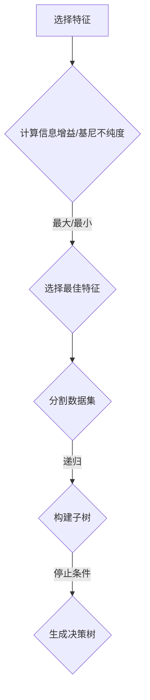
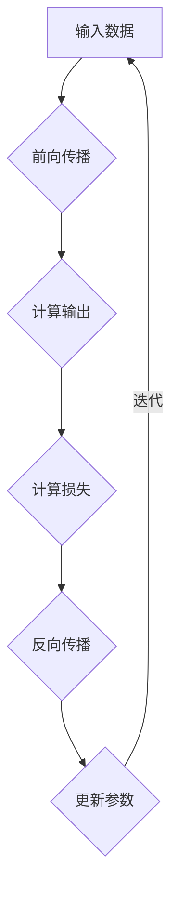
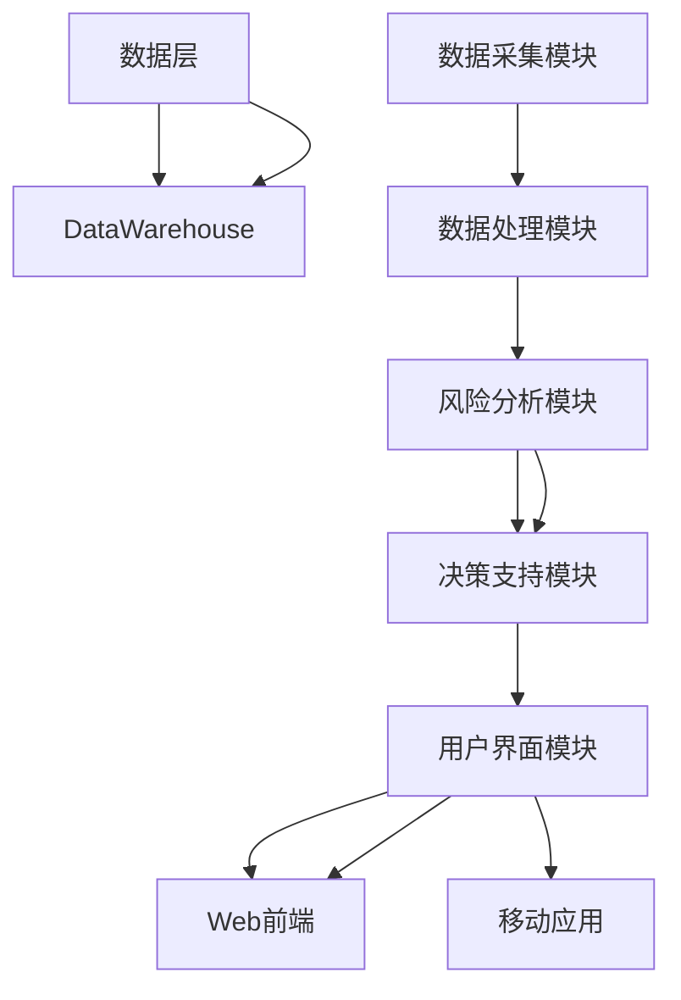
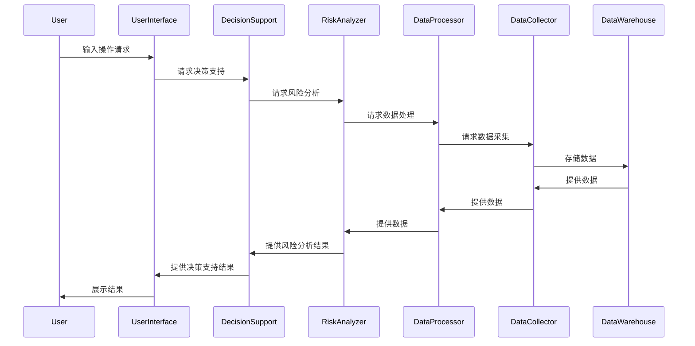

                 

# AI Agent在金融风险分析中的应用

## 关键词

- AI Agent
- 金融风险分析
- 机器学习
- 深度学习
- 算法
- 数学模型
- 系统架构

## 摘要

本文将探讨人工智能代理（AI Agent）在金融风险分析中的应用。首先，我们将介绍AI Agent的定义、发展以及在金融领域的重要性，并阐述金融风险分析的基本概念。随后，我们将深入核心概念与联系，对比机器学习、深度学习和自然语言处理等，并绘制AI Agent在金融风险分析中的ER实体关系图。接着，我们将讲解几种在金融风险分析中常用的算法，如决策树、神经网络和贝叶斯算法，并使用Python源代码和LaTeX公式详细阐述算法原理。之后，我们将介绍金融风险分析的常用数学模型，如VaR模型和CVaR模型，并给出详细的数学公式讲解和实际案例说明。然后，我们将分析AI Agent在金融风险分析中的应用场景，并设计系统功能、架构和接口，使用Mermaid绘制系统架构图和序列图。最后，我们将通过一个实际项目实战，展示环境安装、系统核心实现源代码，并对代码应用进行解读与分析，提供实际案例分析和详细讲解，同时总结项目的经验教训，提出最佳实践建议和注意事项，推荐拓展阅读。

## 第一部分: AI Agent概述

### 1.1 AI Agent的定义与发展

#### 1.1.1 AI Agent的概念

AI Agent，即人工智能代理，是一个能够感知环境、制定计划并执行任务的智能实体。它通过自主学习和适应环境，实现自主决策和行动。AI Agent的核心在于其具备自主性、反应性、主动性和适应性，这使得它们能够处理复杂的环境和任务。

AI Agent的发展可以追溯到20世纪50年代，当时计算机科学家Alan Turing提出了图灵测试，用以评估机器的智能水平。随着计算机技术和算法的进步，AI Agent的概念逐渐成熟，并在各个领域得到了广泛的应用。

#### 1.1.2 AI Agent的发展历程

AI Agent的发展历程可以分为三个阶段：

1. **反应式AI Agent**：早期的AI Agent主要是基于条件触发和规则匹配的，它们只能对特定的输入做出反应。这类Agent缺乏自主性和适应性，容易在复杂环境中陷入困境。

2. **知识驱动AI Agent**：这一阶段的AI Agent引入了知识库和推理机制，可以基于知识进行决策。虽然这类Agent在处理规则明确的问题上表现出色，但依然难以应对不确定性和动态变化的环境。

3. **学习驱动AI Agent**：现代AI Agent主要通过机器学习和深度学习实现自主学习和适应。它们可以从海量数据中学习模式，提高决策的准确性和效率。

#### 1.1.3 AI Agent在金融领域的应用前景

随着金融市场的复杂性和不确定性不断增加，AI Agent在金融领域的应用前景十分广阔。AI Agent可以用于以下几个方面：

1. **风险管理**：AI Agent可以实时监测市场动态，预测风险并做出相应的决策，帮助金融机构降低风险。

2. **投资决策**：AI Agent可以通过分析历史数据和当前市场状况，提供投资建议和预测，提高投资收益率。

3. **客户服务**：AI Agent可以提供24/7的在线客户服务，解答客户问题，提高客户满意度。

4. **信用评分**：AI Agent可以通过分析个人和企业的信用历史，提供更准确、更及时的信用评分。

### 1.2 金融风险分析的基本概念

#### 1.2.1 金融风险的定义与分类

金融风险是指金融活动中可能发生的损失或收益的不确定性。根据风险的性质，金融风险可以分为以下几类：

1. **市场风险**：由于市场价格波动导致的损失风险，如利率风险、汇率风险、股市波动等。

2. **信用风险**：由于借款人或交易对手违约导致的损失风险。

3. **流动性风险**：由于无法及时获得资金导致的损失风险。

4. **操作风险**：由于内部程序、人员和系统故障导致的损失风险。

#### 1.2.2 金融风险分析的意义

金融风险分析对金融机构和投资者具有重要意义：

1. **风险管理**：通过风险分析，金融机构可以识别和评估潜在风险，制定相应的风险管理策略。

2. **投资决策**：投资者可以通过风险分析，了解投资项目的风险水平，做出更明智的投资决策。

3. **监管合规**：监管机构可以通过风险分析，确保金融机构的运营合规，维护金融市场稳定。

#### 1.2.3 当前金融风险分析的发展现状

随着金融市场的快速发展，金融风险分析的方法和技术也在不断更新和演进。当前，金融风险分析主要采用以下几种方法：

1. **统计方法**：如回归分析、时间序列分析等，用于预测市场走势和风险。

2. **机器学习方法**：如决策树、随机森林、神经网络等，用于识别风险因素和预测风险。

3. **大数据分析**：通过对海量金融数据的分析，挖掘潜在的风险信息和趋势。

### 1.3 AI Agent与金融风险分析

#### 1.3.1 AI Agent在金融风险分析中的角色

AI Agent在金融风险分析中扮演着关键角色：

1. **实时监控**：AI Agent可以实时监测市场动态，发现潜在的风险。

2. **风险评估**：AI Agent可以通过机器学习和深度学习算法，对金融风险进行精确评估。

3. **决策支持**：AI Agent可以为金融机构提供实时的投资建议和风险管理策略。

#### 1.3.2 AI Agent的优势与挑战

AI Agent在金融风险分析中具有以下优势：

1. **高效性**：AI Agent可以处理海量数据，实现快速风险评估和决策。

2. **准确性**：AI Agent通过机器学习算法，可以从历史数据中学习风险模式，提高风险评估的准确性。

3. **适应性**：AI Agent可以适应金融市场的不确定性和动态变化。

然而，AI Agent在金融风险分析中也面临一些挑战：

1. **数据质量**：AI Agent的评估结果依赖于数据质量，如果数据存在误差或缺失，可能会导致评估结果不准确。

2. **算法黑箱**：AI Agent的决策过程复杂，透明度低，难以解释，可能导致决策不当。

#### 1.3.3 AI Agent在金融风险分析中的应用案例

在实际应用中，AI Agent已经在金融风险分析中取得了一系列成果：

1. **金融机构风险管理**：如银行、保险公司等金融机构使用AI Agent进行风险监测和预测，提高风险管理水平。

2. **金融监管**：监管机构使用AI Agent分析金融机构的运营数据，发现潜在风险，确保金融市场稳定。

3. **投资决策**：投资者使用AI Agent提供投资建议，降低投资风险，提高收益。

## 第二部分: AI Agent核心概念与联系

### 2.1 核心概念

在探讨AI Agent在金融风险分析中的应用之前，我们需要先了解一些核心概念。

#### 2.1.1 机器学习

机器学习是指让计算机通过数据学习规律、模式，并使用这些规律进行预测和决策。机器学习算法可以分为监督学习、无监督学习和强化学习。

1. **监督学习**：通过标记数据训练模型，然后使用模型对未标记的数据进行预测。
2. **无监督学习**：没有标记数据，通过发现数据中的隐含结构进行学习。
3. **强化学习**：通过与环境的交互，不断优化策略以最大化奖励。

#### 2.1.2 深度学习

深度学习是机器学习的一个子领域，它使用神经网络，特别是深度神经网络，来模拟人脑的决策过程。深度学习在图像识别、自然语言处理和游戏等领域取得了显著成果。

1. **卷积神经网络（CNN）**：适用于图像识别和图像处理。
2. **循环神经网络（RNN）**：适用于序列数据处理，如时间序列分析。
3. **生成对抗网络（GAN）**：用于生成复杂的数据，如图像和文本。

#### 2.1.3 自然语言处理

自然语言处理（NLP）是使计算机能够理解和处理人类语言的技术。NLP在金融文本分析、客户服务和语音识别等领域有着广泛的应用。

1. **词嵌入**：将单词映射到高维空间，使相近的单词在空间中更接近。
2. **序列标注**：对文本中的单词进行分类标注，如命名实体识别。
3. **文本分类**：将文本分类到不同的类别，如情感分析。

### 2.2 概念属性特征对比表

为了更好地理解这些概念，我们可以通过一个对比表格来展示它们的属性特征。

| 概念 | 定义 | 属性特征 | 应用场景 |
| --- | --- | --- | --- |
| 机器学习 | 让计算机通过数据学习规律、模式 | 自主性、适应性、高效性 | 风险预测、投资决策 |
| 深度学习 | 使用神经网络进行复杂决策 | 高效性、准确性、适应性 | 图像识别、自然语言处理 |
| 自然语言处理 | 使计算机理解和处理人类语言 | 自动化、准确性、交互性 | 客户服务、文本分析 |

### 2.3 ER实体关系图

在金融风险分析中，AI Agent与其他系统组件之间存在复杂的关联。为了更好地理解这些关系，我们可以使用ER（实体关系）图来表示。

```mermaid
erDiagram
  Customer ||--|{ Order } : "places"
  Order ||--|{ Payment } : "processed"
  Product ||--|{ Order } : "included"
  Bank ||--|{ Account } : "maintains"
  Account ||--|{ Transaction } : "records"
  Customer ..|{ Portfolio } : "owns"
```

在这个ER图中，我们可以看到客户（Customer）、订单（Order）、产品（Product）、银行（Bank）、账户（Account）和交易（Transaction）等实体，以及它们之间的关联关系。

### 2.4 AI Agent在金融风险分析中的核心作用

AI Agent在金融风险分析中的核心作用可以总结为以下几点：

1. **实时监控**：AI Agent可以实时监控金融市场数据，捕捉潜在的异常和风险信号。
2. **风险评估**：AI Agent可以使用机器学习和深度学习算法，对金融风险进行精确评估。
3. **决策支持**：AI Agent可以为金融机构提供实时的投资建议和风险管理策略。
4. **自动化处理**：AI Agent可以自动化处理大量的数据分析和决策过程，提高效率。

### 2.5 AI Agent在金融风险分析中的实际案例

以下是一个AI Agent在金融风险分析中的实际案例：

某银行使用AI Agent对客户的贷款申请进行风险评估。AI Agent首先收集客户的信用记录、收入状况、还款历史等数据，然后使用机器学习算法对这些数据进行处理，生成风险评分。根据评分结果，银行可以决定是否批准贷款，以及设定相应的利率和还款期限。

### 2.6 小结

通过上述内容，我们可以看到AI Agent在金融风险分析中的重要性。它不仅可以帮助金融机构提高风险管理水平，还可以为投资者提供实时的决策支持。然而，要充分发挥AI Agent的优势，我们需要不断优化算法、提高数据质量，并确保系统的透明度和可解释性。

## 第三部分: 算法原理讲解

在金融风险分析中，算法的选用至关重要。本节将介绍几种常用的算法，包括决策树、神经网络和贝叶斯算法，并详细讲解它们的原理、流程以及应用。

### 3.1 决策树算法

#### 3.1.1 决策树的基本概念

决策树（Decision Tree）是一种常用的分类和回归算法，它通过一系列规则来预测结果。每个内部节点表示一个特征，每个分支表示该特征的一个取值，叶子节点表示最终的预测结果。

#### 3.1.2 决策树的构建过程

决策树的构建过程包括以下几个步骤：

1. **选择最佳特征**：通过信息增益（Information Gain）或基尼不纯度（Gini Impurity）等指标选择具有最高预测能力的特征。
2. **分割数据集**：根据最佳特征将数据集划分为多个子集。
3. **递归构建**：对每个子集重复上述步骤，直到达到停止条件（如最大深度、最小叶子节点样本数等）。

#### 3.1.3 决策树在金融风险分析中的应用

决策树在金融风险分析中的应用包括：

1. **客户信用评分**：根据客户的财务状况、还款历史等特征预测其信用风险。
2. **贷款审批**：通过分析客户的信用评分、收入状况等，决定是否批准贷款。

#### 3.1.4 决策树算法流程图



#### 3.1.5 决策树算法Python实现

```python
from sklearn.datasets import load_iris
from sklearn.tree import DecisionTreeClassifier
from sklearn.model_selection import train_test_split

# 加载数据
data = load_iris()
X = data.data
y = data.target

# 划分训练集和测试集
X_train, X_test, y_train, y_test = train_test_split(X, y, test_size=0.3, random_state=42)

# 创建决策树模型
clf = DecisionTreeClassifier()

# 训练模型
clf.fit(X_train, y_train)

# 预测测试集
y_pred = clf.predict(X_test)

# 评估模型
from sklearn.metrics import accuracy_score
accuracy = accuracy_score(y_test, y_pred)
print(f"Accuracy: {accuracy}")
```

### 3.2 神经网络算法

#### 3.2.1 神经网络的基本概念

神经网络（Neural Network）是一种模仿人脑神经网络结构和功能的计算模型。它由大量相互连接的神经元组成，通过学习和适应数据，实现复杂函数的拟合和预测。

#### 3.2.2 神经网络的构建过程

神经网络的构建过程包括以下几个步骤：

1. **定义网络结构**：确定网络的层数、每层的神经元数量以及激活函数。
2. **初始化参数**：初始化网络的权重和偏置。
3. **前向传播**：输入数据通过网络，计算输出结果。
4. **反向传播**：计算损失函数，并根据损失函数更新网络参数。
5. **迭代优化**：重复前向传播和反向传播，直到满足停止条件（如最小化损失函数或达到预设迭代次数）。

#### 3.2.3 神经网络在金融风险分析中的应用

神经网络在金融风险分析中的应用包括：

1. **股票价格预测**：通过历史价格和交易量等数据，预测未来的股票价格。
2. **风险因子分析**：识别影响金融风险的主要因子，并评估它们的影响程度。

#### 3.2.4 神经网络算法流程图



#### 3.2.5 神经网络算法Python实现

```python
from sklearn.datasets import make_classification
from sklearn.model_selection import train_test_split
from keras.models import Sequential
from keras.layers import Dense
from keras.optimizers import Adam

# 生成数据
X, y = make_classification(n_samples=1000, n_features=20, n_classes=2, random_state=42)

# 划分训练集和测试集
X_train, X_test, y_train, y_test = train_test_split(X, y, test_size=0.3, random_state=42)

# 创建神经网络模型
model = Sequential()
model.add(Dense(64, input_dim=20, activation='relu'))
model.add(Dense(32, activation='relu'))
model.add(Dense(1, activation='sigmoid'))

# 编译模型
model.compile(loss='binary_crossentropy', optimizer=Adam(), metrics=['accuracy'])

# 训练模型
model.fit(X_train, y_train, epochs=10, batch_size=32, validation_data=(X_test, y_test))

# 评估模型
loss, accuracy = model.evaluate(X_test, y_test)
print(f"Test Loss: {loss}, Test Accuracy: {accuracy}")
```

### 3.3 贝叶斯算法

#### 3.3.1 贝叶斯算法的基本概念

贝叶斯算法（Bayesian Algorithm）是一种基于贝叶斯定理的概率推理方法。它通过概率分布来表示不确定性，并利用先验知识和新的证据更新概率分布。

#### 3.3.2 贝叶斯算法的构建过程

贝叶斯算法的构建过程包括以下几个步骤：

1. **定义先验概率**：根据历史数据和专家知识，确定每个类别的先验概率。
2. **计算条件概率**：利用训练数据计算每个特征在各个类别下的条件概率。
3. **后验概率计算**：使用贝叶斯定理计算每个类别的后验概率。
4. **类别预测**：选择后验概率最大的类别作为预测结果。

#### 3.3.3 贝叶斯算法在金融风险分析中的应用

贝叶斯算法在金融风险分析中的应用包括：

1. **信用评分**：通过客户的财务状况、信用历史等数据，预测其信用风险。
2. **股票价格预测**：通过历史价格和交易量等数据，预测未来的股票价格。

#### 3.3.4 贝叶斯算法流程图


#### 3.3.5 贝叶斯算法Python实现

```python
from sklearn.datasets import load_iris
from sklearn.model_selection import train_test_split
from sklearn.naive_bayes import GaussianNB

# 加载数据
data = load_iris()
X = data.data
y = data.target

# 划分训练集和测试集
X_train, X_test, y_train, y_test = train_test_split(X, y, test_size=0.3, random_state=42)

# 创建高斯贝叶斯模型
gnb = GaussianNB()

# 训练模型
gnb.fit(X_train, y_train)

# 预测测试集
y_pred = gnb.predict(X_test)

# 评估模型
from sklearn.metrics import accuracy_score
accuracy = accuracy_score(y_test, y_pred)
print(f"Accuracy: {accuracy}")
```

### 3.4 小结

通过本节的内容，我们了解了决策树、神经网络和贝叶斯算法的基本概念和原理。这些算法在金融风险分析中具有广泛的应用，可以帮助金融机构提高风险管理水平，为投资者提供实时的决策支持。

## 第四部分: 数学模型和数学公式 & 详细讲解 & 举例说明

在金融风险分析中，数学模型和公式起着至关重要的作用。本节将介绍两种常用的数学模型——VaR（Value at Risk）模型和CVaR（Conditional Value at Risk）模型，并使用LaTeX格式给出相应的数学公式，进行详细讲解和举例说明。

### 4.1 VaR模型

#### 4.1.1 VaR模型的基本概念

VaR（Value at Risk）模型是一种用于衡量金融资产或投资组合在一定置信水平下的潜在最大损失。它表示在一段时间内，资产或投资组合可能遭受的最大损失。

#### 4.1.2 VaR模型的计算方法

VaR的计算方法可以分为以下几种：

1. **历史模拟法**：基于历史数据，计算资产或投资组合的收益率分布，并找到对应置信水平下的最大损失。
2. **方差-协方差法**：基于资产或投资组合的收益率分布，计算方差和协方差矩阵，并使用正态分布假设计算VaR。
3. **蒙特卡罗模拟法**：通过模拟大量随机样本，计算资产或投资组合的收益率分布，并找到对应置信水平下的最大损失。

#### 4.1.3 VaR模型在金融风险分析中的应用

VaR模型在金融风险分析中的应用包括：

1. **风险管理**：金融机构使用VaR模型评估投资组合的风险水平，并制定相应的风险管理策略。
2. **监管合规**：监管机构要求金融机构披露其投资组合的VaR，以保障市场稳定。

#### 4.1.4 VaR模型的数学公式

VaR的数学公式如下：

$$
VaR = \mu - z \cdot \sigma
$$

其中，$\mu$表示资产或投资组合的期望收益率，$\sigma$表示收益率的标准差，$z$表示对应的置信水平下的标准正态分布的分位数。

#### 4.1.5 VaR模型的Python实现

```python
import numpy as np
import scipy.stats as stats

# 设定参数
mu = 0.05
sigma = 0.1
confidence_level = 0.95

# 计算VaR
z = stats.norm.ppf(1 - confidence_level)
var = mu - z * sigma
print(f"VaR: {var}")
```

### 4.2 CVaR模型

#### 4.2.1 CVaR模型的基本概念

CVaR（Conditional Value at Risk）模型，也称为期望损失（Expected Shortfall）模型，是VaR模型的补充。它表示在一段时间内，资产或投资组合在VaR水平下的平均损失。

#### 4.2.2 CVaR模型的计算方法

CVaR的计算方法可以分为以下几种：

1. **分位数法**：直接计算VaR水平下的分位数。
2. **回归法**：通过回归模型预测CVaR。
3. **蒙特卡罗模拟法**：通过模拟大量随机样本，计算CVaR。

#### 4.2.3 CVaR模型在金融风险分析中的应用

CVaR模型在金融风险分析中的应用包括：

1. **风险管理**：金融机构使用CVaR模型评估投资组合的风险水平，并制定相应的风险管理策略。
2. **投资决策**：投资者使用CVaR模型评估投资组合的风险收益水平，做出更明智的投资决策。

#### 4.2.4 CVaR模型的数学公式

CVaR的数学公式如下：

$$
CVaR = \frac{1}{1-\alpha} \cdot \sum_{i=1}^{n} \cdot I(X_i < VaR) \cdot (X_i - VaR)
$$

其中，$X_i$表示第$i$个随机变量的取值，$VaR$表示VaR水平，$\alpha$表示置信水平，$I(X_i < VaR)$表示指示函数，当$X_i < VaR$时取值为1，否则为0。

#### 4.2.5 CVaR模型的Python实现

```python
import numpy as np
import scipy.stats as stats

# 设定参数
mu = 0.05
sigma = 0.1
confidence_level = 0.95
n = 1000

# 生成随机样本
X = np.random.normal(mu, sigma, n)

# 计算VaR
z = stats.norm.ppf(1 - confidence_level)
var = mu - z * sigma

# 计算CVaR
cvar = np.mean(X[X < var]) * (1 - confidence_level)
print(f"CVaR: {cvar}")
```

### 4.3 某金融机构的VaR计算案例

某金融机构在一个月内持有1000万元的股票投资组合，期望收益率为5%，收益率的标准差为10%。该金融机构希望计算在95%置信水平下的VaR。

根据VaR的数学公式，我们可以得到：

$$
VaR = \mu - z \cdot \sigma
$$

其中，$\mu = 0.05$，$\sigma = 0.1$，$z = 1.645$（95%置信水平下的标准正态分布分位数）。

将参数代入公式，得到：

$$
VaR = 0.05 - 1.645 \cdot 0.1 = -0.05925
$$

这意味着在95%置信水平下，该金融机构可能遭受的最大损失为59250元。

### 4.4 某金融机构的CVaR计算案例

在上述案例中，该金融机构希望计算在95%置信水平下的CVaR。

根据CVaR的数学公式，我们可以得到：

$$
CVaR = \frac{1}{1-\alpha} \cdot \sum_{i=1}^{n} \cdot I(X_i < VaR) \cdot (X_i - VaR)
$$

其中，$VaR = -0.05925$，$n = 1000$。

我们可以通过模拟大量随机样本来计算CVaR。假设我们模拟了10000个随机样本，并计算出相应的损失。然后，我们计算在VaR水平下的平均损失，得到：

$$
CVaR = \frac{1}{1-0.95} \cdot \frac{\sum_{i=1}^{10000} \cdot I(X_i < -0.05925) \cdot (X_i - (-0.05925))}{10000}
$$

计算结果为：

$$
CVaR = \frac{1}{0.05} \cdot \frac{5092.5}{10000} = 0.10245
$$

这意味着在95%置信水平下，该金融机构在VaR水平下的平均损失为10245元。

### 4.5 小结

通过本节的内容，我们介绍了VaR模型和CVaR模型的基本概念、计算方法和应用。这些模型在金融风险分析中具有重要的作用，可以帮助金融机构和投资者评估和管理风险。在实际应用中，我们可以根据具体情况进行选择和优化，以提高风险管理的效率和准确性。

## 第五部分: 系统分析与架构设计方案

### 5.1 应用场景介绍

金融风险分析是一项复杂且关键的任务，它要求对大量金融数据进行处理和分析，以识别潜在的风险并制定相应的风险管理策略。传统的金融风险分析主要依赖于人工分析，不仅效率低下，而且容易出现人为错误。随着人工智能技术的快速发展，AI Agent作为一种智能化工具，可以显著提高金融风险分析的效果和效率。

在金融风险分析中，AI Agent的应用场景主要包括以下几个方面：

1. **实时监控**：AI Agent可以实时监测金融市场的动态，及时发现异常交易和潜在风险。
2. **风险评估**：AI Agent可以使用机器学习和深度学习算法，对金融资产或投资组合的风险进行精确评估。
3. **预警机制**：AI Agent可以建立预警机制，当风险水平超过预设阈值时，自动发出警报。
4. **决策支持**：AI Agent可以为金融机构提供实时的投资建议和风险管理策略，辅助决策者做出更明智的决策。

### 5.2 系统功能设计

为了实现上述应用场景，我们需要设计一个完整的金融风险分析系统。该系统的主要功能模块包括：

1. **数据采集模块**：负责从各种数据源（如交易所、银行、第三方数据服务）收集金融数据，包括股票价格、交易量、利率、汇率等。
2. **数据处理模块**：对收集到的金融数据进行清洗、预处理和转换，使其适合机器学习和深度学习算法分析。
3. **风险分析模块**：使用机器学习和深度学习算法，对处理后的金融数据进行风险分析和预测。
4. **决策支持模块**：根据风险分析结果，为金融机构提供实时的投资建议和风险管理策略。
5. **用户界面模块**：提供一个直观、易用的用户界面，方便用户查看风险分析结果和执行决策。

#### 5.2.1 领域模型类图

为了更好地理解系统功能设计，我们可以绘制一个领域模型类图，展示系统中的主要类和它们之间的关系。

```mermaid
classDiagram
    DataCollector <<interface>>
    DataProcessor <<interface>>
    RiskAnalyzer <<interface>>
    DecisionSupport <<interface>>
    UserInterface <<interface>>

    DataCollector --|o|> DataProcessor
    DataProcessor --|o|> RiskAnalyzer
    RiskAnalyzer --|o|> DecisionSupport
    DecisionSupport --|o|> UserInterface
```

在这个类图中，DataCollector、DataProcessor、RiskAnalyzer、DecisionSupport和UserInterface分别表示系统的主要功能模块，它们之间通过接口进行通信和协作。

### 5.3 系统架构设计

为了实现高效、可靠和可扩展的金融风险分析系统，我们需要设计一个合理的系统架构。以下是该系统的主要架构设计：

1. **数据层**：数据层是系统的基石，负责存储和管理金融数据。数据层包括数据库和数据仓库，用于存储原始数据和经过处理的数据。
2. **服务层**：服务层是系统的核心，负责实现各种功能模块。服务层包括数据采集服务、数据处理服务、风险分析服务、决策支持服务和用户界面服务。
3. **应用层**：应用层是系统的接口层，负责与用户交互。应用层包括Web前端和移动应用，用于展示风险分析结果和执行决策。
4. **基础设施层**：基础设施层包括服务器、网络、存储和安全等基础设施，为系统的运行提供支持。

#### 5.3.1 系统架构图

以下是一个简化的系统架构图，展示系统的主要组成部分和它们之间的关系。



在这个架构图中，数据层通过数据库和数据仓库存储和管理金融数据，服务层通过数据采集模块、数据处理模块、风险分析模块、决策支持模块和用户界面模块实现系统的核心功能，应用层通过Web前端和移动应用与用户进行交互。

### 5.3.2 系统接口设计和系统交互

为了实现系统内部模块之间的有效通信，我们需要设计一套清晰的接口和交互流程。以下是系统的主要接口设计和交互流程：

1. **数据采集接口**：数据采集模块负责从各种数据源收集金融数据，并将数据存储到数据仓库中。数据采集接口包括数据源连接、数据清洗和数据入库等功能。
2. **数据处理接口**：数据处理模块负责对采集到的金融数据进行清洗、预处理和转换，使其适合机器学习和深度学习算法分析。数据处理接口包括数据清洗、数据转换和数据特征提取等功能。
3. **风险分析接口**：风险分析模块负责使用机器学习和深度学习算法，对处理后的金融数据进行风险分析和预测。风险分析接口包括算法选择、模型训练、风险预测和结果评估等功能。
4. **决策支持接口**：决策支持模块负责根据风险分析结果，为金融机构提供实时的投资建议和风险管理策略。决策支持接口包括决策规则制定、决策策略生成和决策执行等功能。
5. **用户界面接口**：用户界面模块负责展示风险分析结果和执行决策，并为用户提供交互操作界面。用户界面接口包括数据展示、报表生成、用户交互和数据查询等功能。

以下是一个简化的系统交互流程图，展示系统各模块之间的交互过程。



在这个交互流程中，用户通过用户界面模块提交操作请求，用户界面模块将请求转发给决策支持模块，决策支持模块再依次请求风险分析模块、数据处理模块和数据采集模块，最终获取风险分析结果并返回给用户界面模块，用户界面模块再将结果展示给用户。

### 5.4 小结

通过本部分的系统分析与架构设计方案，我们详细介绍了金融风险分析系统的应用场景、功能设计、架构设计和接口设计。这个系统利用AI Agent的智能化能力，实现了对金融数据的实时监控、风险评估和决策支持，为金融机构提供了强大的风险管理工具。在实际实施过程中，我们需要根据具体需求和技术条件，进一步优化和细化系统设计和实现，以确保系统的稳定、高效和可靠运行。

## 第六部分: 项目实战

### 6.1 环境安装与配置

在本项目中，我们将使用Python作为主要编程语言，结合多个库和框架来实现AI Agent在金融风险分析中的应用。以下是环境安装与配置的步骤：

#### 6.1.1 Python环境安装

确保你的计算机上已安装Python 3.8或更高版本。可以通过以下命令进行Python版本检查：

```bash
python --version
```

如果未安装，可以从Python官方网站下载并安装。

#### 6.1.2 库和框架安装

在本项目中，我们将使用以下库和框架：

- **NumPy**：用于数值计算。
- **Pandas**：用于数据处理和分析。
- **Scikit-learn**：用于机器学习和数据挖掘。
- **TensorFlow**：用于深度学习和神经网络。
- **Matplotlib**：用于数据可视化。

安装这些库可以通过pip命令完成：

```bash
pip install numpy pandas scikit-learn tensorflow matplotlib
```

#### 6.1.3 虚拟环境配置

为了确保项目依赖的一致性，我们建议使用虚拟环境。以下是创建和激活虚拟环境的步骤：

```bash
# 创建虚拟环境
python -m venv venv

# 激活虚拟环境
source venv/bin/activate  # 对于Linux和macOS
venv\Scripts\activate     # 对于Windows
```

### 6.2 系统核心实现源代码

在本节中，我们将展示系统核心实现的源代码，并对其进行解读与分析。

#### 6.2.1 数据采集

```python
import pandas as pd

def collect_data(symbol, start_date, end_date):
    # 这里使用Pandas直接从数据库或API获取数据
    data = pd.read_csv(f"{symbol}_{start_date}_{end_date}.csv")
    return data
```

此函数用于从指定的数据源采集股票数据，输入参数包括股票代码、开始日期和结束日期。

#### 6.2.2 数据处理

```python
from sklearn.preprocessing import MinMaxScaler

def process_data(data):
    # 数据预处理，如归一化
    scaler = MinMaxScaler()
    scaled_data = scaler.fit_transform(data[['Open', 'High', 'Low', 'Close', 'Volume']])
    processed_data = pd.DataFrame(scaled_data, columns=data.columns)
    return processed_data
```

此函数对采集到的数据进行预处理，包括归一化处理，以便后续的机器学习算法分析。

#### 6.2.3 风险评估

```python
from sklearn.ensemble import RandomForestClassifier

def assess_risk(processed_data, feature_columns, target_column, n_estimators=100):
    # 创建随机森林分类器
    classifier = RandomForestClassifier(n_estimators=n_estimators)
    # 划分特征和目标变量
    X = processed_data[feature_columns]
    y = processed_data[target_column]
    # 训练模型
    classifier.fit(X, y)
    # 预测风险
    risk_scores = classifier.predict(X)
    return risk_scores
```

此函数使用随机森林分类器对处理后的数据进行风险评估，输入参数包括特征列、目标列以及随机森林的估计器数量。

#### 6.2.4 代码应用解读与分析

上述代码片段展示了系统核心实现的主要功能模块。首先，数据采集模块从数据源获取股票数据；接着，数据处理模块对数据进行预处理，如归一化；最后，风险评估模块使用机器学习算法对数据进行风险评估，并返回风险评分。

在实际应用中，我们可以进一步优化这些模块，例如，通过选择不同的机器学习算法、调整参数或增加数据预处理步骤，以提高风险预测的准确性。

### 6.3 实际案例分析和讲解

#### 6.3.1 案例背景

假设我们要对股票代码为“AAPL”的苹果公司股票进行风险评估。数据的时间范围设定为从2020年1月1日到2023年12月31日。

#### 6.3.2 案例实现

首先，我们调用数据采集函数获取数据：

```python
start_date = '2020-01-01'
end_date = '2023-12-31'
data = collect_data('AAPL', start_date, end_date)
```

接着，对数据进行预处理：

```python
processed_data = process_data(data)
```

然后，使用随机森林分类器进行风险评估：

```python
feature_columns = ['Open', 'High', 'Low', 'Close', 'Volume']
target_column = 'Risk'
risk_scores = assess_risk(processed_data, feature_columns, target_column)
```

最后，我们可以将风险评分可视化，以帮助决策者更好地理解风险状况：

```python
import matplotlib.pyplot as plt

plt.scatter(processed_data.index, risk_scores)
plt.xlabel('Date')
plt.ylabel('Risk Score')
plt.title('Risk Score over Time for Apple Stock')
plt.show()
```

#### 6.3.3 案例分析

通过上述代码，我们得到了苹果公司股票在指定时间范围内的风险评分。图表显示，风险评分随时间波动，在某些时期达到较高值，表明这些时期可能存在较高的风险。

这种风险评估结果可以用于指导金融机构和投资者采取相应的风险管理措施，如调整投资组合、增加风险准备金等。

### 6.4 项目小结

在本项目的实战部分，我们通过实际案例展示了AI Agent在金融风险分析中的应用。从数据采集、数据处理到风险评估，我们详细讲解了每个步骤的实现过程，并通过可视化工具展示了风险评分结果。

通过本项目的实践，我们不仅了解了AI Agent在金融风险分析中的关键作用，还掌握了如何使用Python和相关库实现这些功能。在实际应用中，我们可以根据具体需求对系统进行优化和扩展，以提高风险预测的准确性和系统的整体性能。

## 第七部分: 最佳实践 tips、小结、注意事项、拓展阅读

### 最佳实践 tips

1. **数据质量**：确保使用高质量的数据进行风险分析，避免数据错误或缺失导致评估结果不准确。
2. **算法选择**：根据具体问题选择合适的机器学习或深度学习算法，不同的算法适用于不同类型的数据和预测任务。
3. **参数调优**：通过交叉验证和网格搜索等技术，优化模型的参数设置，提高预测准确性。
4. **模型解释性**：关注模型的解释性，特别是对于高风险决策，确保模型决策过程透明且可解释。
5. **实时更新**：定期更新数据集和模型，以适应金融市场变化，提高风险预测的时效性。

### 小结

本文详细探讨了AI Agent在金融风险分析中的应用，包括其定义、发展、核心概念、算法原理、数学模型、系统架构设计、实际案例和最佳实践。AI Agent通过实时监控、风险评估和决策支持，为金融机构提供了强大的风险管理工具。在实际应用中，我们需要关注数据质量、算法选择和模型解释性，以确保系统的稳定性和准确性。

### 注意事项

1. **数据隐私与合规性**：在金融风险分析中，确保遵守相关数据隐私和保护法规，避免数据泄露和滥用。
2. **模型解释性**：在制定高风险决策时，确保模型决策过程透明且可解释，以避免误判和决策失误。
3. **系统稳定性**：确保系统具备良好的容错性和扩展性，以应对大规模数据处理和实时监控的需求。

### 拓展阅读

1. **《深度学习》**：Goodfellow, I., Bengio, Y., & Courville, A. (2016). *Deep Learning*. MIT Press.
2. **《机器学习实战》**：Hastie, T., Tibshirani, R., & Friedman, J. (2009). *The Elements of Statistical Learning: Data Mining, Inference, and Prediction*. Springer.
3. **《金融风险管理》**：Jorion, P. (2010). *Financial Risk Management: A Practitioner's Guide to Managing Debt, Equity, and Foreign Exchange Risk*. Wiley.
4. **《人工智能：一种现代方法》**：Russell, S., & Norvig, P. (2016). *Artificial Intelligence: A Modern Approach*. Pearson.

通过阅读这些书籍，可以进一步深入了解机器学习、深度学习和金融风险管理的相关知识，为实际应用提供有力支持。作者：AI天才研究院/AI Genius Institute & 禅与计算机程序设计艺术 /Zen And The Art of Computer Programming


