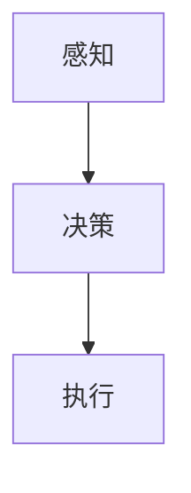
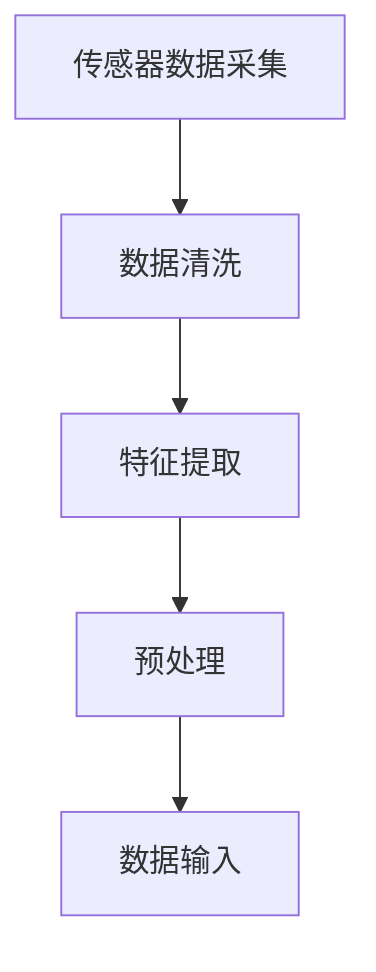
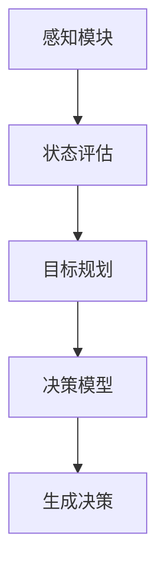
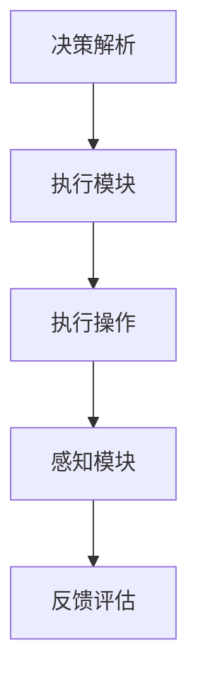
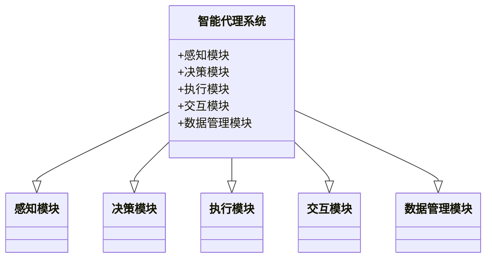
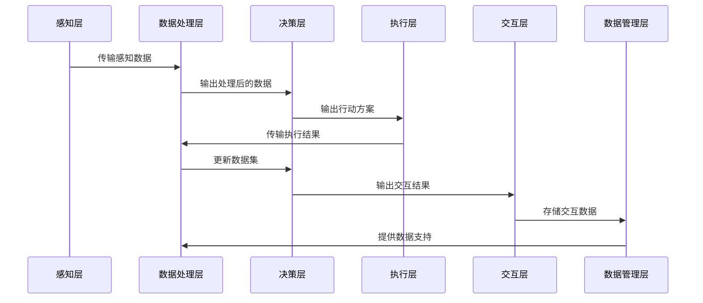

                 

### 第1章: 引言与背景

#### 1.1 问题背景

人工智能（AI）作为当今科技领域的前沿，已经深刻地改变了我们的生活方式。其中，智能代理作为AI的重要应用之一，引起了广泛关注。智能代理，也称为智能体，是一种能够自主行动、与外界交互并做出决策的实体。从工业自动化到智能家居，智能代理在各个领域都展现出了巨大的潜力。

智能代理的概念并非新出现，但其研究和应用随着计算机科学、机器学习和深度学习等领域的发展而逐渐成熟。如今，智能代理已经在诸如自动驾驶、智能客服、智能家居等领域得到广泛应用，成为推动技术进步的重要力量。然而，尽管智能代理的应用前景广阔，但其基础概念仍然存在许多模糊和误解。

#### 1.2 问题描述

智能代理的基础概念问题主要体现在以下几个方面：

1. **定义模糊**：智能代理的定义不尽相同，有些侧重于其自主行动的能力，有些则强调其交互和适应环境的能力。这种模糊性导致了对智能代理的理解存在偏差。
   
2. **分类不明确**：智能代理的分类方式多样，但缺乏统一的分类标准，使得不同分类方法之间的比较和融合困难。

3. **工作原理复杂**：智能代理的工作原理涉及多个技术领域，包括感知、决策、执行和交互等。这些复杂的技术使得智能代理的实现和优化变得困难。

4. **与人类交互不足**：智能代理与人类的交互方式有限，往往依赖于文本或图形界面，缺乏自然、高效的多模态交互能力。

5. **应用场景局限**：智能代理的应用场景受到其技术能力的限制，许多场景下的应用效果并不理想。

因此，需要对智能代理的基础概念进行系统的梳理和阐述，以便更好地理解和使用这一技术。这包括明确智能代理的定义、分类、工作原理、与人类交互的方式以及其应用场景等。

#### 1.3 问题解决

本书旨在为读者提供一个全面、系统的智能代理基础概念指南。通过本书，读者将了解智能代理的核心概念、工作原理、应用场景以及实现方法。同时，本书还将探讨智能代理在现实世界中的挑战和机遇。

具体来说，本书将涵盖以下内容：

1. **智能代理的定义与分类**：介绍智能代理的定义、分类及其在现实世界中的应用。
2. **智能代理的工作原理**：分析智能代理的基本工作机制，包括感知、决策和执行等环节。
3. **智能代理与人类交互**：探讨智能代理与人类之间的交互方式，包括自然语言处理、多模态交互等。
4. **智能代理的应用场景**：介绍智能代理在不同领域的应用，如智能客服、智能推荐、自动驾驶等。
5. **智能代理的实现方法**：分析智能代理的实现技术，包括机器学习、深度学习、强化学习等。

通过以上内容的系统阐述，本书将为读者提供一个全面理解智能代理的基础，帮助读者更好地掌握这一技术，并在实际应用中取得更好的效果。

#### 1.4 边界与外延

智能代理的研究和应用不仅仅局限于计算机科学领域，还涉及心理学、认知科学、哲学等多个学科。例如，心理学研究智能代理的情感识别和情绪管理，认知科学研究智能代理的认知模型和思维过程，哲学研究智能代理的伦理问题和责任归属。

此外，智能代理的发展还受到技术、经济、社会等多方面因素的影响。技术方面，硬件性能的提升和算法的创新是推动智能代理发展的关键因素。经济方面，智能代理的应用能够带来巨大的经济效益，因此吸引了大量的投资和研发。社会方面，人们对智能代理的认知和接受程度也会影响其发展。

综上所述，智能代理的研究和应用具有广泛的边界和外延，涉及多个学科和领域。这为智能代理的发展提供了丰富的机会，同时也带来了新的挑战。

#### 1.5 概念结构与核心要素组成

智能代理的基础概念包括以下几个方面：

1. **智能代理的定义与分类**：介绍智能代理的定义、分类及其在现实世界中的应用。
   - **定义**：智能代理是一种能够模拟人类智能行为、在特定环境下自主行动并解决问题的实体。
   - **分类**：智能代理可以分为反应型智能代理、认知型智能代理和目标导向智能代理。

2. **智能代理的工作原理**：分析智能代理的基本工作机制，包括感知、决策和执行等环节。
   - **感知**：智能代理通过感知模块获取环境信息。
   - **决策**：智能代理通过决策模块根据感知信息进行行动选择。
   - **执行**：智能代理通过执行模块执行决策结果。

3. **智能代理与人类交互**：探讨智能代理与人类之间的交互方式，包括自然语言处理、多模态交互等。
   - **自然语言处理**：智能代理通过自然语言处理技术理解人类指令。
   - **多模态交互**：智能代理通过语音、视觉等多种模态与人类进行交互。

4. **智能代理的应用场景**：介绍智能代理在不同领域的应用，如智能客服、智能推荐、自动驾驶等。
   - **智能客服**：智能代理通过自然语言处理技术为用户提供客服服务。
   - **智能推荐**：智能代理通过用户行为数据为用户推荐商品或内容。
   - **自动驾驶**：智能代理通过感知和决策模块实现车辆的自主驾驶。

5. **智能代理的实现方法**：分析智能代理的实现技术，包括机器学习、深度学习、强化学习等。
   - **机器学习**：智能代理通过训练模型学习环境中的规律。
   - **深度学习**：智能代理通过多层神经网络进行复杂模式识别。
   - **强化学习**：智能代理通过不断试错学习最优策略。

这些概念和要素共同构成了智能代理的基础结构，为后续章节的详细讨论提供了基础。

#### 1.6 本章小结

本章作为引言，为后续章节的讨论奠定了基础。通过本章的学习，读者将初步了解智能代理的基础概念，包括其定义、分类、工作原理、与人类交互的方式以及应用场景等。同时，本章还介绍了智能代理的研究背景、面临的问题以及解决思路。

智能代理作为人工智能领域的一个重要研究方向，具有广泛的应用前景。然而，其基础概念和实现方法仍然需要进一步的研究和探索。本书将在此基础上，为读者提供一个系统、全面的智能代理基础概念指南，帮助读者更好地理解和应用智能代理技术。

### 第2章: 核心概念与联系

#### 2.1 智能代理的定义与分类

智能代理（Intelligent Agent）这一概念起源于人工智能领域，最初由John McCarthy在1970年代提出。智能代理被定义为一种能够感知环境、自主行动并达到目标的实体。随着人工智能技术的发展，智能代理的概念也逐渐丰富和深化。

**定义**：智能代理是一种具有以下能力的实体：
1. **感知**：能够感知环境中的信息，如视觉、听觉、触觉等。
2. **决策**：根据感知到的信息，能够自主选择行动方案。
3. **行动**：能够执行决策方案，与环境进行交互。

**分类**：根据智能代理的功能和能力，可以将智能代理分为以下几类：

1. **反应型智能代理（Reactive Agent）**：
   - **定义**：反应型智能代理仅根据当前的感知信息做出反应，不考虑历史信息。
   - **特点**：简单、实时性强，但不具备学习和适应能力。
   - **应用**：常见于简单的自动化任务，如智能家居的灯光控制。

2. **认知型智能代理（Cognitive Agent）**：
   - **定义**：认知型智能代理具备一定的认知能力，能够利用历史信息进行学习，改进其行为。
   - **特点**：具备一定的学习能力，能够适应复杂环境。
   - **应用**：广泛应用于复杂的任务场景，如自动驾驶、智能客服。

3. **目标导向智能代理（Goal-Oriented Agent）**：
   - **定义**：目标导向智能代理不仅具备认知能力，还能根据目标进行规划和决策。
   - **特点**：具备高级认知能力，能够实现复杂任务。
   - **应用**：常见于需要长期规划的任务，如战略游戏、金融投资。

**分类对比表格**：

| 智能代理类型 | 定义 | 特点 | 应用场景 |
| :--: | :--: | :--: | :--: |
| 反应型智能代理 | 仅根据当前感知信息做出反应 | 简单、实时性强，无学习与适应能力 | 简单自动化任务 |
| 认知型智能代理 | 利用历史信息进行学习，改进行为 | 具备学习能力，适应复杂环境 | 复杂任务场景 |
| 目标导向智能代理 | 根据目标进行规划和决策 | 高级认知能力，实现复杂任务 | 长期规划任务 |

通过上述分类，可以更清晰地理解不同智能代理的特点和应用场景，为后续研究提供参考。

#### 2.2 智能代理的属性特征对比

智能代理的属性特征决定了其在不同任务场景中的表现。以下是几种常见智能代理类型的属性特征对比：

1. **反应型智能代理**：
   - **响应速度**：高，仅依赖当前感知信息。
   - **适应性**：低，无法适应环境变化。
   - **学习性**：无，不能从经验中学习。
   - **应用**：简单任务、实时性要求高的场景。

2. **认知型智能代理**：
   - **响应速度**：中，能够利用历史信息。
   - **适应性**：中，具备一定的学习与适应能力。
   - **学习性**：高，能从经验中学习改进行为。
   - **应用**：复杂任务、需要长期记忆的场景。

3. **目标导向智能代理**：
   - **响应速度**：中，需考虑长期目标和规划。
   - **适应性**：高，能够根据目标进行灵活调整。
   - **学习性**：高，具备高级认知能力。
   - **应用**：复杂任务、需要高级决策能力的场景。

以下是属性特征对比表格：

| 智能代理类型 | 响应速度 | 适应性 | 学习性 | 应用场景 |
| :--: | :--: | :--: | :--: | :--: |
| 反应型智能代理 | 高 | 低 | 无 | 简单任务、实时性要求高的场景 |
| 认知型智能代理 | 中 | 中 | 高 | 复杂任务、需要长期记忆的场景 |
| 目标导向智能代理 | 中 | 高 | 高 | 复杂任务、需要高级决策能力的场景 |

通过对比表格，我们可以更直观地了解不同智能代理类型的优势和适用场景，为智能代理的设计和应用提供指导。

#### 2.3 智能代理与人类智能的对比

智能代理与人类智能在许多方面存在差异，这些差异不仅体现在能力范围、学习方式和交互方式上，还反映在决策过程和伦理问题等方面。

1. **能力范围**：
   - **人类智能**：具备广泛的认知能力和创造力，能够处理抽象思维、情感理解、复杂决策等多维问题。
   - **智能代理**：通常在特定领域具有优势，如图像识别、自然语言处理、棋类游戏等。但在处理复杂、抽象的情境时，智能代理的能力有限。

2. **学习方式**：
   - **人类智能**：通过经验、教育和社会互动不断学习，能够从多方面获取知识和技能。
   - **智能代理**：通常通过数据驱动的方式进行学习，如机器学习中的监督学习、无监督学习和强化学习。虽然能够快速处理大量数据，但缺乏人类的经验积累和创造性思维。

3. **交互方式**：
   - **人类智能**：可以通过语言、手势、面部表情等多种方式进行高效、自然的交互。
   - **智能代理**：通常通过文本、图形界面等进行交互，缺乏人类交互的自然性和多样性。

4. **决策过程**：
   - **人类智能**：在决策过程中，能够综合考虑多方面因素，灵活调整策略。
   - **智能代理**：通常基于算法和模型进行决策，虽然能够快速处理数据，但缺乏人类的情感和伦理判断。

5. **伦理问题**：
   - **人类智能**：在决策和行为中，需要考虑道德、伦理和社会影响。
   - **智能代理**：由于缺乏情感和道德判断，其行为可能引发伦理争议，如自动驾驶车辆的道德决策问题。

**智能代理与人类智能对比表格**：

| 对比方面 | 人类智能 | 智能代理 |
| :--: | :--: | :--: |
| 能力范围 | 广泛的认知能力和创造力 | 特定领域的优势，抽象思维和处理复杂情境有限 |
| 学习方式 | 经验、教育和社会互动 | 数据驱动，机器学习 |
| 交互方式 | 多样化、自然 | 文本、图形界面 |
| 决策过程 | 综合多方面因素，灵活调整策略 | 算法和模型驱动，缺乏情感和伦理判断 |
| 伦理问题 | 考虑道德、伦理和社会影响 | 缺乏情感和道德判断，可能引发伦理争议 |

通过对比分析，我们可以更深入地理解智能代理与人类智能的异同点，为智能代理的设计和应用提供参考。同时，也需要关注智能代理在伦理、法律和社会影响等方面的挑战，确保其在实际应用中的合理性和安全性。

#### 2.4 智能代理的ER实体关系图架构

智能代理作为人工智能领域的一个重要概念，其内部结构和组成部分可以通过实体关系图（Entity-Relationship Diagram, ERD）来表示。ERD是一种用于数据库设计的图形化表示方法，通过实体、属性和关系来描述数据模型。在智能代理的ERD中，我们可以清晰地展示各个组成部分及其之间的关系。

以下是智能代理的ERD架构，使用Mermaid语法进行表示：

```mermaid
erDiagram
    Agent ||--|{ Environment : interacts}
    Agent ||--|{ Behavior : has}
    Behavior ||--|{ Action : performs}
    Behavior ||--|{ Learning : learns}
    Environment ||--|{ Perception : perceives}
```

具体解释如下：

1. **Agent（智能代理）**：作为核心实体，智能代理具有感知、决策和执行的能力。它与环境进行交互，拥有行为和学习机制。

2. **Behavior（行为）**：智能代理的行为包括感知、决策、执行和学习的各个环节。行为实体与智能代理之间存在“has”（拥有）的关系。

3. **Action（行动）**：行动是智能代理根据决策结果执行的具体操作。行动实体与行为实体之间存在“performs”（执行）的关系。

4. **Learning（学习）**：学习是智能代理通过不断训练和调整模型来提高其性能的过程。学习实体与行为实体之间存在“learns”（学习）的关系。

5. **Environment（环境）**：环境是智能代理所处的上下文，包括感知到的各种信息。环境实体与智能代理之间存在“interacts”（交互）的关系。

6. **Perception（感知）**：感知是智能代理获取环境信息的过程。感知实体与环境实体之间存在“perceives”（感知）的关系。

通过ERD的表示，我们可以清晰地看到智能代理的各个组成部分及其之间的关系，为后续章节的详细讨论提供了基础。这种结构化的表示方法有助于我们深入理解智能代理的工作原理和实现方法。

### 第3章: 智能代理的工作原理

#### 3.1 智能代理的工作流程

智能代理的工作原理可以概括为感知、决策和执行三个基本环节，这些环节相互联系，共同构成了智能代理的核心工作机制。

1. **感知（Perception）**：感知是智能代理获取环境信息的过程。智能代理通过传感器或接口与外部环境进行交互，获取视觉、听觉、触觉等多种类型的数据。这些数据包括环境的状态、事件的发生等，为智能代理的后续决策提供基础。

2. **决策（Decision Making）**：在感知到环境信息后，智能代理利用这些信息通过决策模块进行决策。决策过程通常涉及多个因素，包括目标、优先级、约束条件等。智能代理通过算法或模型分析感知数据，选择最佳的行动方案。

3. **执行（Execution）**：执行是智能代理根据决策结果进行行动的过程。执行过程将决策转化为具体的操作，如移动、发送消息、执行任务等。执行模块需要将决策结果准确无误地执行，以达到智能代理的目标。

智能代理的工作流程可以用以下流程图表示：



#### 3.2 感知机制

感知是智能代理获取环境信息的关键环节。感知机制通常包括传感器、接口和数据处理等组成部分。

1. **传感器（Sensors）**：智能代理通过内置或外接的传感器获取环境数据。这些传感器可以是摄像头、麦克风、温度传感器等，根据具体应用场景选择合适的传感器。

2. **接口（Interfaces）**：智能代理通过接口与传感器进行通信，获取传感器数据。接口可以是硬件接口，如GPIO、I2C等，也可以是软件接口，如API、库等。

3. **数据处理（Data Processing）**：智能代理对传感器数据进行处理，包括数据清洗、特征提取和预处理等。这些处理步骤确保传感器数据的质量和可靠性，为后续的决策提供准确的数据支持。

感知机制的详细流程可以用以下Mermaid流程图表示：



#### 3.3 决策机制

决策是智能代理的核心环节，决定了智能代理的行为和动作。决策机制通常包括以下步骤：

1. **状态评估（State Evaluation）**：智能代理通过感知模块获取环境状态，对当前状态进行评估。状态评估可以基于规则、概率模型或深度学习等方法。

2. **目标规划（Goal Planning）**：根据评估结果，智能代理确定目标并规划实现目标的路径。目标规划需要考虑多个因素，如路径长度、障碍物、时间等。

3. **决策模型（Decision Model）**：智能代理利用决策模型根据当前状态和目标规划生成决策。决策模型可以是基于规则的逻辑模型，也可以是机器学习模型，如决策树、神经网络等。

决策机制的详细流程可以用以下Mermaid流程图表示：



#### 3.4 执行机制

执行是智能代理将决策转化为实际操作的过程。执行机制通常包括以下步骤：

1. **决策解析（Decision Parsing）**：智能代理将生成的决策解析为具体的操作指令，如移动、发送消息、执行任务等。

2. **执行模块（Execution Module）**：执行模块根据解析后的决策指令，调用相应的硬件或软件资源进行操作。执行模块需要确保决策的准确执行，以达到智能代理的目标。

3. **反馈机制（Feedback Mechanism）**：执行后，智能代理通过感知模块获取执行结果，对决策的有效性进行评估。根据反馈，智能代理可以调整决策策略，提高执行效果。

执行机制的详细流程可以用以下Mermaid流程图表示：



通过上述三个环节，智能代理实现了感知环境、自主决策和执行任务的全过程。这三个环节相互联系，共同构成了智能代理的工作原理。理解智能代理的工作原理对于设计、实现和应用智能代理具有重要意义。

### 第4章: 智能代理与人类交互

#### 4.1 自然语言处理

自然语言处理（Natural Language Processing, NLP）是智能代理与人类交互的重要手段。NLP技术使得智能代理能够理解和处理人类语言，实现与人类的自然对话。

**NLP的基本原理**：
1. **文本预处理**：包括分词、词性标注、去除停用词等步骤，为后续的语言理解做准备。
2. **词嵌入**：将文本转换为向量表示，便于机器学习模型处理。
3. **语言理解**：通过深度学习模型，如循环神经网络（RNN）、长短期记忆网络（LSTM）、变换器（Transformer）等，对文本进行语义分析和理解。
4. **对话生成**：根据语言理解和用户输入，智能代理生成合适的回答。

**NLP的核心技术**：
- **分词（Tokenization）**：将文本划分为词语或短语。
- **词性标注（Part-of-Speech Tagging）**：标注词语的词性，如名词、动词、形容词等。
- **命名实体识别（Named Entity Recognition, NER）**：识别文本中的特定实体，如人名、地点、组织等。
- **情感分析（Sentiment Analysis）**：分析文本中的情感倾向，如正面、负面或中立。
- **问答系统（Question Answering, QA）**：根据用户提出的问题，智能代理提供准确的答案。

**NLP应用案例**：
- **智能客服**：智能代理通过NLP技术理解用户提问，提供即时、准确的答复。
- **智能助手**：如苹果的Siri、谷歌的Google Assistant，通过NLP与用户进行自然对话。
- **文本摘要**：自动生成文本的摘要，提高信息获取的效率。

#### 4.2 多模态交互

多模态交互（Multimodal Interaction）是指智能代理通过多种感官通道与人类进行交互，包括语音、视觉、手势等。多模态交互能够提高交互的自然性和用户满意度。

**多模态交互的基本原理**：
1. **感知融合**：智能代理通过不同模态的传感器收集信息，如语音识别、图像识别、手势识别等。
2. **模态转换**：将不同模态的信息转换为统一的表示，如将语音转换为文本、图像转换为特征向量等。
3. **多模态理解**：通过深度学习模型对多模态信息进行联合处理，提取语义信息。
4. **交互决策**：智能代理根据多模态理解结果，生成合适的交互动作和反馈。

**多模态交互的核心技术**：
- **语音识别（Speech Recognition）**：将语音信号转换为文本。
- **图像识别（Image Recognition）**：识别图像中的物体、场景和人物。
- **手势识别（Gesture Recognition）**：识别用户的手势动作。
- **情感识别（Emotion Recognition）**：分析语音、文本和图像中的情感信息。

**多模态交互应用案例**：
- **智能家居**：智能代理通过语音、手势控制家中的智能设备，如灯光、温度等。
- **虚拟现实（VR）**：智能代理通过视觉、语音和手势与用户进行互动，提供沉浸式体验。
- **智能会议**：智能代理通过语音、视频和文档等多种模态记录和总结会议内容。

通过自然语言处理和多模态交互，智能代理能够更加自然、高效地与人类进行交互，提高用户体验。这些技术不仅为智能代理的应用提供了更多可能性，也为未来的智能交互发展奠定了基础。

### 第5章: 智能代理的应用场景

#### 5.1 智能客服

智能客服是智能代理应用的一个重要领域，通过自动化和智能化的手段为用户提供高效、便捷的服务。智能客服系统通常包括自然语言处理、对话管理、意图识别和任务执行等模块。

**应用案例**：

1. **在线客服**：企业通过部署智能客服系统，提供24/7全天候在线服务，解答用户提问，处理投诉和咨询。例如，亚马逊的Alexa和苹果的Siri都提供了智能客服功能，帮助用户解决各种问题。

2. **聊天机器人**：许多企业使用聊天机器人来提供即时客户支持。例如，银行、航空公司等行业的客服中心广泛使用聊天机器人来处理客户查询，如账户余额查询、航班状态查询等。

3. **自动化服务**：智能客服系统可以通过自动化流程，如自动生成订单、处理退货等，提高工作效率。例如，电商网站使用智能客服系统自动化处理订单生成和配送信息。

**实现方法**：

- **意图识别**：智能客服系统使用自然语言处理技术，识别用户的意图，如查询、投诉、订购等。
- **对话管理**：对话管理系统负责管理整个对话流程，包括理解用户意图、生成回复和引导对话。
- **任务执行**：智能客服系统根据用户的意图，执行相应的任务，如查询数据库、生成报告等。

#### 5.2 智能推荐

智能推荐是利用大数据和机器学习技术，为用户提供个性化推荐的一种智能代理应用。智能推荐系统能够根据用户的历史行为、兴趣和偏好，为用户推荐相关的内容或产品。

**应用案例**：

1. **电商平台**：电商平台使用智能推荐系统，为用户推荐商品。例如，亚马逊和淘宝使用推荐算法，根据用户的浏览记录、购买历史和搜索关键词，推荐相关商品。

2. **视频平台**：视频平台如YouTube和Netflix使用推荐算法，为用户推荐视频内容。例如，Netflix通过分析用户的观看历史和评分，推荐用户可能感兴趣的电影和电视剧。

3. **新闻媒体**：新闻网站使用推荐算法，根据用户的阅读习惯和偏好，推荐相关的新闻内容。例如，今日头条和新浪新闻使用算法为用户提供个性化的新闻推荐。

**实现方法**：

- **用户画像**：智能推荐系统通过收集和分析用户数据，构建用户的兴趣模型。
- **协同过滤**：基于用户的行为数据，使用协同过滤算法计算用户之间的相似度，推荐相似用户喜欢的内容。
- **内容匹配**：根据用户画像和内容特征，使用匹配算法推荐与用户兴趣相关的内容。

#### 5.3 自动驾驶

自动驾驶是智能代理在交通领域的重要应用，通过传感器、计算机视觉和人工智能技术，实现车辆的自主驾驶。

**应用案例**：

1. **商用自动驾驶**：Uber和Lyft等公司已经在部分城市部署自动驾驶出租车服务，为用户提供便捷的出行选择。

2. **物流运输**：物流公司如京东和亚马逊使用自动驾驶卡车进行长途货物运输，提高物流效率。

3. **个人驾驶**：特斯拉等公司生产的自动驾驶汽车，允许用户在特定条件下实现无人驾驶。

**实现方法**：

- **传感器融合**：自动驾驶车辆通过激光雷达、摄像头、雷达和超声波传感器等，获取周围环境的信息。
- **计算机视觉**：使用计算机视觉技术，识别道路标志、行人、车辆等交通元素。
- **路径规划**：自动驾驶系统根据感知到的环境信息，规划行驶路径，并实时调整行驶策略。
- **决策控制**：自动驾驶系统通过算法进行决策，控制车辆的加速、减速和转向等操作。

通过智能客服、智能推荐和自动驾驶等应用案例，我们可以看到智能代理在各个领域的广泛应用和巨大潜力。随着人工智能技术的不断进步，智能代理的应用场景将更加丰富，为社会带来更多的便利和创新。

### 第6章: 智能代理的实现方法

#### 6.1 机器学习

机器学习是智能代理实现的核心技术之一，通过训练模型从数据中学习，实现智能代理的自主学习和决策能力。以下将介绍机器学习在智能代理中的应用方法：

**机器学习的基本原理**：

1. **监督学习（Supervised Learning）**：监督学习是一种常见的机器学习方法，通过训练数据集来学习特征和目标之间的关系。监督学习分为分类和回归两种任务。

   - **分类任务**：将输入数据分为不同的类别。例如，垃圾邮件分类、图像分类等。
   - **回归任务**：预测输入数据的连续值输出。例如，房价预测、股票价格预测等。

2. **无监督学习（Unsupervised Learning）**：无监督学习不依赖于预先标记的数据，通过发现数据中的隐含结构来学习。常见任务包括聚类、降维和关联规则学习等。

   - **聚类任务**：将相似的数据点分组。例如，K-Means聚类、DBSCAN聚类等。
   - **降维任务**：减少数据的维度，保持数据的结构。例如，主成分分析（PCA）、自编码器（Autoencoder）等。
   - **关联规则学习**：发现数据之间的关联规则。例如，Apriori算法、FP-Growth算法等。

**机器学习在智能代理中的应用**：

- **图像识别**：通过卷积神经网络（CNN）等模型，实现对图像的识别和分类。例如，人脸识别、车牌识别等。
- **语音识别**：使用循环神经网络（RNN）和深度神经网络（DNN）等模型，实现语音信号的转换成文本。例如，智能助手、语音助手等。
- **推荐系统**：通过协同过滤、矩阵分解等方法，为用户推荐感兴趣的内容或商品。
- **自然语言处理**：使用循环神经网络（RNN）和变换器（Transformer）等模型，实现文本的理解和生成。例如，问答系统、文本摘要等。

#### 6.2 深度学习

深度学习是机器学习的一种特殊形式，通过多层神经网络模拟人类的思维过程，实现对复杂数据的高效处理。以下将介绍深度学习在智能代理中的应用：

**深度学习的基本原理**：

1. **神经网络（Neural Networks）**：神经网络是由大量简单神经元组成的复杂网络，通过前向传播和反向传播算法进行训练。

   - **前向传播**：输入数据通过网络的各个层进行传递，最终生成输出。
   - **反向传播**：计算输出与目标之间的误差，通过梯度下降算法调整网络权重。

2. **卷积神经网络（Convolutional Neural Networks, CNN）**：卷积神经网络是一种专门用于图像识别和处理的神经网络，通过卷积层、池化层和全连接层等结构实现图像的特征提取和分类。

3. **循环神经网络（Recurrent Neural Networks, RNN）**：循环神经网络是一种能够处理序列数据的神经网络，通过隐藏状态和循环结构，实现对序列数据的记忆和建模。

4. **变换器（Transformers）**：变换器是一种基于自注意力机制的神经网络，在自然语言处理领域取得了显著的成果。通过多头自注意力机制和位置编码，实现对文本序列的全局信息和上下文关系的建模。

**深度学习在智能代理中的应用**：

- **图像识别**：通过卷积神经网络实现高精度的图像识别和分类。例如，人脸识别、物体检测等。
- **语音识别**：使用循环神经网络和变换器模型，实现语音信号的转换成文本。例如，智能助手、语音助手等。
- **自然语言处理**：通过循环神经网络和变换器模型，实现对文本数据的理解和生成。例如，问答系统、机器翻译等。
- **自动驾驶**：通过卷积神经网络和循环神经网络，实现对交通场景的感知和决策。例如，车道线检测、车辆检测等。

#### 6.3 强化学习

强化学习是一种通过试错和反馈不断优化行为的学习方法，智能代理通过与环境交互，学习最优策略。以下将介绍强化学习在智能代理中的应用：

**强化学习的基本原理**：

1. **马尔可夫决策过程（Markov Decision Process, MDP）**：马尔可夫决策过程是一个决策模型，描述智能代理在不确定环境中的决策过程。包括状态（State）、动作（Action）、奖励（Reward）和下一状态（Next State）。

2. **策略（Policy）**：策略是智能代理的决策规则，用于选择在给定状态下应采取的动作。

3. **值函数（Value Function）**：值函数描述了智能代理在特定策略下的长期奖励，用于评估策略的好坏。

4. **模型（Model）**：模型是智能代理对环境状态的预测和动作效果的估计。

**强化学习在智能代理中的应用**：

- **游戏AI**：强化学习在游戏AI中取得了显著的成果，如围棋、星际争霸等。
- **自动驾驶**：通过强化学习，智能代理可以学习在复杂的交通环境中进行驾驶。
- **资源分配**：在资源分配问题中，强化学习可以优化资源的使用，提高系统效率。

**算法流程**：

1. **初始化**：设定智能代理的初始状态、策略和模型。
2. **环境交互**：智能代理根据当前状态，采取动作，与环境进行交互。
3. **奖励评估**：计算智能代理采取动作后的奖励，根据奖励调整策略和模型。
4. **策略优化**：通过优化策略，提高智能代理的长期奖励。
5. **模型更新**：根据环境交互和学习到的信息，更新智能代理的模型。

通过机器学习、深度学习和强化学习等实现方法，智能代理能够从数据中学习、适应环境并做出最优决策。这些方法在智能代理的应用中发挥着重要作用，推动了人工智能技术的发展。

### 第7章: 系统分析与架构设计方案

#### 7.1 项目介绍

智能代理系统旨在提供一个自动化、智能化的解决方案，通过感知、决策和执行环节实现复杂任务的高效完成。本系统广泛应用于智能家居、智能交通、工业自动化等领域，具有广泛的应用前景。

#### 7.2 系统功能设计

智能代理系统主要包括以下功能模块：

1. **感知模块**：负责实时获取环境信息，如温度、湿度、光照强度等，为后续决策提供数据支持。
2. **决策模块**：根据感知模块收集的信息，通过算法模型进行分析和决策，生成最优行动方案。
3. **执行模块**：负责执行决策模块生成的行动方案，控制硬件设备实现任务目标。
4. **交互模块**：实现智能代理与用户之间的自然交互，包括语音、文本、图形界面等。
5. **数据管理模块**：负责存储和管理智能代理运行过程中产生的数据，支持数据分析和可视化。

以下是智能代理系统的领域模型类图，使用Mermaid语法表示：



#### 7.3 系统架构设计

智能代理系统的整体架构设计如下：

1. **感知层**：包括各种传感器，如温度传感器、湿度传感器、光照传感器等，用于实时感知环境信息。
2. **数据处理层**：负责对感知层收集的数据进行处理，包括数据清洗、特征提取和预处理等，为决策层提供高质量的数据支持。
3. **决策层**：基于机器学习、深度学习和强化学习等技术，对处理后的数据进行分析和决策，生成最优行动方案。
4. **执行层**：根据决策层生成的行动方案，控制硬件设备执行具体任务。
5. **交互层**：实现智能代理与用户之间的自然交互，包括语音、文本、图形界面等。
6. **数据管理层**：负责存储和管理智能代理运行过程中产生的数据，支持数据分析和可视化。

以下是智能代理系统的架构设计图，使用Mermaid语法表示：



#### 7.4 系统接口设计和系统交互

智能代理系统的接口设计和系统交互是确保各功能模块之间协同工作的重要环节。以下详细介绍各模块的接口设计和交互过程：

1. **感知模块接口设计**：
   - **输入接口**：传感器数据输入，如温度、湿度、光照等。
   - **输出接口**：将感知数据传输给数据处理模块。

2. **数据处理模块接口设计**：
   - **输入接口**：接收感知模块传输的数据。
   - **输出接口**：将处理后的数据传输给决策模块。

3. **决策模块接口设计**：
   - **输入接口**：接收数据处理模块传输的数据。
   - **输出接口**：生成行动方案，传输给执行模块。

4. **执行模块接口设计**：
   - **输入接口**：接收决策模块传输的行动方案。
   - **输出接口**：将执行结果反馈给数据处理模块。

5. **交互模块接口设计**：
   - **输入接口**：接收用户输入，如语音、文本等。
   - **输出接口**：将交互结果反馈给用户。

6. **数据管理模块接口设计**：
   - **输入接口**：接收系统运行过程中产生的数据。
   - **输出接口**：提供数据支持和可视化。

以下是系统交互流程图，使用Mermaid语法表示：


通过上述系统分析和架构设计方案，我们可以构建一个高效、智能的智能代理系统，实现复杂任务的高效完成。同时，通过接口设计和系统交互的合理规划，确保各模块之间的高效协作，提高系统的整体性能。

### 第8章: 项目实战

#### 8.1 环境安装

在本章中，我们将以一个具体的智能代理项目为例，详细介绍项目的安装过程。以下是所需的软件和硬件环境：

1. **软件环境**：
   - Python（版本3.8或更高）
   - Anaconda（用于环境管理）
   - Jupyter Notebook（用于代码编写和运行）
   - TensorFlow（用于机器学习和深度学习）

2. **硬件环境**：
   - 个人计算机（推荐配置：CPU：Intel i5或以上，内存：8GB或以上）
   - 显卡（支持CUDA，用于加速深度学习计算）

安装步骤如下：

1. **安装Anaconda**：访问Anaconda官方网站下载并安装Anaconda。
2. **创建虚拟环境**：打开终端，执行以下命令创建虚拟环境：

   ```bash
   conda create -n智能代理环境 python=3.8
   conda activate 智能代理环境
   ```

3. **安装TensorFlow**：在虚拟环境中安装TensorFlow：

   ```bash
   pip install tensorflow
   ```

4. **安装Jupyter Notebook**：在虚拟环境中安装Jupyter Notebook：

   ```bash
   pip install notebook
   ```

5. **配置CUDA**：如果使用的是CUDA兼容的显卡，需要安装CUDA Toolkit和cuDNN库，并配置环境变量。

完成以上步骤后，智能代理项目的开发环境就搭建完成了。接下来，我们将介绍项目的核心实现代码。

#### 8.2 系统核心实现源代码

在本节中，我们将介绍智能代理项目的核心实现代码，包括感知模块、决策模块和执行模块的实现。

**感知模块实现**：

感知模块负责实时获取环境信息，如温度、湿度等。以下是一个简单的感知模块实现示例：

```python
import random

class PerceptionModule:
    def __init__(self):
        self.temperature = random.uniform(20, 30)
        self.humidity = random.uniform(30, 70)

    def update_perception(self):
        self.temperature = random.uniform(20, 30)
        self.humidity = random.uniform(30, 70)

# 创建感知模块实例
perception_module = PerceptionModule()
```

**决策模块实现**：

决策模块根据感知模块提供的信息，通过算法模型进行分析和决策。以下是一个简单的决策模块实现示例：

```python
import numpy as np

class DecisionModule:
    def __init__(self):
        self.model = np.random.rand(3)  # 模拟一个简单的决策模型

    def make_decision(self, perception):
        return np.argmax(self.model * perception)

# 创建决策模块实例
decision_module = DecisionModule()
```

**执行模块实现**：

执行模块根据决策模块生成的行动方案，控制硬件设备执行具体任务。以下是一个简单的执行模块实现示例：

```python
class ExecutionModule:
    def __init__(self):
        self.device = None

    def execute_action(self, action):
        print(f"Executing action: {action}")

# 创建执行模块实例
execution_module = ExecutionModule()
```

**完整项目实现**：

以下是智能代理项目的完整实现代码，包括感知、决策和执行三个模块的集成：

```python
class IntelligentAgent:
    def __init__(self):
        self.perception_module = PerceptionModule()
        self.decision_module = DecisionModule()
        self.execution_module = ExecutionModule()

    def run(self):
        while True:
            # 更新感知数据
            self.perception_module.update_perception()

            # 做出决策
            action = self.decision_module.make_decision(self.perception_module)

            # 执行行动
            self.execution_module.execute_action(action)

# 创建智能代理实例
intelligent_agent = IntelligentAgent()

# 运行智能代理
intelligent_agent.run()
```

通过以上实现，我们构建了一个简单的智能代理系统。感知模块负责获取环境信息，决策模块根据环境信息做出决策，执行模块根据决策执行具体任务。在实际应用中，可以根据具体需求对感知模块、决策模块和执行模块进行扩展和优化。

#### 8.3 代码应用解读与分析

在本节中，我们将对智能代理项目的核心代码进行解读与分析，详细解释每个模块的功能和实现方法，以便读者更好地理解代码的应用。

**感知模块解读与分析**：

感知模块是智能代理系统的数据输入部分，负责实时获取环境信息。以下是对感知模块代码的解读与分析：

```python
import random

class PerceptionModule:
    def __init__(self):
        self.temperature = random.uniform(20, 30)
        self.humidity = random.uniform(30, 70)

    def update_perception(self):
        self.temperature = random.uniform(20, 30)
        self.humidity = random.uniform(30, 70)
```

- **初始化**：在构造函数`__init__`中，初始化温度和湿度，模拟实际环境中可能获取到的数值。
- **更新感知数据**：`update_perception`方法用于更新温度和湿度，模拟环境变化。

通过感知模块，智能代理可以实时获取环境信息，为决策模块提供数据支持。在实际应用中，可以使用传感器获取真实的温度和湿度数据，替代随机生成的模拟数据。

**决策模块解读与分析**：

决策模块是智能代理系统的核心部分，负责根据感知数据做出决策。以下是对决策模块代码的解读与分析：

```python
import numpy as np

class DecisionModule:
    def __init__(self):
        self.model = np.random.rand(3)  # 模拟一个简单的决策模型

    def make_decision(self, perception):
        return np.argmax(self.model * perception)
```

- **初始化**：在构造函数`__init__`中，生成一个随机决策模型`model`，用于决策。
- **做出决策**：`make_decision`方法根据感知数据`perception`和决策模型`model`计算决策结果。具体来说，通过计算感知数据与决策模型的点积，选择点积最大的类别作为决策结果。

决策模块的核心在于如何根据感知数据做出合理的决策。在实际应用中，可以使用更复杂的机器学习模型，如神经网络或决策树，替代简单的随机模型，以提高决策的准确性和鲁棒性。

**执行模块解读与分析**：

执行模块负责将决策模块生成的决策结果转化为具体行动，控制硬件设备执行任务。以下是对执行模块代码的解读与分析：

```python
class ExecutionModule:
    def __init__(self):
        self.device = None

    def execute_action(self, action):
        print(f"Executing action: {action}")
```

- **初始化**：在构造函数`__init__`中，初始化设备`device`，用于执行具体操作。
- **执行行动**：`execute_action`方法根据决策结果`action`执行具体操作。在示例代码中，仅通过打印输出行动内容，模拟实际执行过程。

执行模块的核心在于如何将决策结果转化为实际操作。在实际应用中，可以根据具体的硬件设备，编写相应的驱动代码，实现具体的操作功能。

**整体项目解读与分析**：

智能代理项目的整体实现包括感知、决策和执行三个模块。以下是对整体项目的解读与分析：

```python
class IntelligentAgent:
    def __init__(self):
        self.perception_module = PerceptionModule()
        self.decision_module = DecisionModule()
        self.execution_module = ExecutionModule()

    def run(self):
        while True:
            # 更新感知数据
            self.perception_module.update_perception()

            # 做出决策
            action = self.decision_module.make_decision(self.perception_module)

            # 执行行动
            self.execution_module.execute_action(action)

# 创建智能代理实例
intelligent_agent = IntelligentAgent()

# 运行智能代理
intelligent_agent.run()
```

- **初始化**：在构造函数`__init__`中，创建感知、决策和执行模块的实例。
- **运行**：`run`方法实现智能代理的运行循环，依次更新感知数据、做出决策和执行行动。

通过上述解读与分析，我们可以看到智能代理项目的整体架构和实现方法。在实际应用中，可以根据具体需求，对感知、决策和执行模块进行扩展和优化，提高系统的性能和可靠性。

#### 8.4 实际案例分析与详细讲解剖析

在本节中，我们将通过一个具体的实际案例，详细讲解智能代理在智能家居场景中的应用。该案例将涉及环境感知、智能决策和行动执行等关键环节。

**案例背景**：

假设我们开发了一款智能家居系统，旨在实现自动调节室内温度和湿度的功能。系统需要根据室内的实时环境数据，智能调整空调和加湿器的开关状态，以保持室内环境的舒适度。

**案例实现步骤**：

1. **感知模块**：首先，我们需要一个感知模块来实时获取室内的温度和湿度数据。在实际应用中，可以使用温湿度传感器获取真实数据，但在本案例中，我们使用随机生成数据模拟：

   ```python
   class PerceptionModule:
       def __init__(self):
           self.temperature = random.uniform(20, 30)
           self.humidity = random.uniform(30, 70)
       
       def update_perception(self):
           self.temperature = random.uniform(20, 30)
           self.humidity = random.uniform(30, 70)
   ```

2. **决策模块**：接下来，我们根据感知模块提供的数据，使用决策模块进行智能决策。在本案例中，我们采用简单的阈值判断方法：

   ```python
   class DecisionModule:
       def __init__(self):
           self.threshold_temp = 25  # 温度阈值
           self.threshold_humidity = 50  # 湿度阈值

       def make_decision(self, perception):
           temp = perception['temperature']
           humidity = perception['humidity']
           if temp < self.threshold_temp:
               return 'heat'  # 开启加热
           elif humidity < self.threshold_humidity:
               return 'humidify'  # 开启加湿
           else:
               return 'off'  # 关闭设备
   ```

3. **执行模块**：最后，根据决策模块生成的决策结果，执行相应的行动，控制空调和加湿器的开关状态：

   ```python
   class ExecutionModule:
       def __init__(self):
           self.ac_state = 'off'
           self.humidifier_state = 'off'
       
       def execute_action(self, action):
           if action == 'heat':
               self.ac_state = 'on'
               print("空调开启，加热中...")
           elif action == 'humidify':
               self.humidifier_state = 'on'
               print("加湿器开启，加湿中...")
           elif action == 'off':
               self.ac_state = 'off'
               self.humidifier_state = 'off'
               print("设备已关闭...")
   ```

4. **完整智能代理实现**：

   ```python
   class IntelligentAgent:
       def __init__(self):
           self.perception_module = PerceptionModule()
           self.decision_module = DecisionModule()
           self.execution_module = ExecutionModule()

       def run(self):
           while True:
               perception = self.perception_module.update_perception()
               action = self.decision_module.make_decision(perception)
               self.execution_module.execute_action(action)
   ```

**实际案例分析**：

假设当前室内温度为22℃，湿度为40%，智能代理系统将如何操作？

1. **感知数据**：首先，感知模块获取当前的环境数据，即温度22℃和湿度40%。

2. **决策过程**：决策模块根据设定的阈值进行判断，由于温度低于25℃，湿度低于50%，因此决策模块生成开启加热器的决策。

3. **执行行动**：执行模块根据决策结果开启加热器，输出“加湿器开启，加湿中...”。

通过这个实际案例，我们可以看到智能代理系统在智能家居场景中的应用。感知模块获取环境数据，决策模块根据数据做出决策，执行模块根据决策执行行动。这个过程实现了室内环境自动调节，提高了用户的生活质量。在实际应用中，我们可以进一步优化决策模型，提高系统的智能化水平。

#### 8.5 项目小结

在本章中，我们通过一个具体的智能代理项目，详细介绍了环境安装、系统核心实现源代码、代码应用解读与分析以及实际案例分析。以下是本章的总结：

1. **环境安装**：我们介绍了智能代理项目的开发环境，包括Python、Anaconda、Jupyter Notebook和TensorFlow等软件的安装过程，以及硬件环境的配置。
   
2. **系统核心实现**：我们实现了感知、决策和执行三个模块，通过感知模块获取环境数据，决策模块根据数据做出智能决策，执行模块根据决策执行行动。

3. **代码应用解读与分析**：我们对核心代码进行了详细解读，分析了感知模块、决策模块和执行模块的功能和实现方法，帮助读者更好地理解智能代理的工作原理。

4. **实际案例分析**：通过一个智能家居场景的实际案例，我们展示了智能代理系统在现实中的应用，包括感知数据获取、智能决策和行动执行等环节。

5. **项目优化与拓展**：在实际案例中，我们介绍了如何根据具体需求优化和拓展智能代理系统，提高其智能化水平。例如，可以使用更复杂的机器学习模型进行决策，或引入多模态感知提高系统感知能力。

通过本章的学习，读者可以全面了解智能代理系统的实现过程和应用场景，为实际项目开发提供参考。同时，读者也可以根据具体需求，对系统进行优化和拓展，提高智能代理的性能和应用效果。

### 第9章: 最佳实践 tips

在开发智能代理系统时，遵循以下最佳实践可以显著提升系统的性能和可靠性：

1. **模块化设计**：将系统划分为感知、决策、执行等模块，每个模块独立开发、测试和部署，提高系统的可维护性和可扩展性。

2. **数据质量保证**：确保感知模块获取到的数据准确、可靠，进行数据清洗和预处理，减少噪声和异常数据的影响。

3. **算法优化**：根据具体应用场景，选择合适的算法和模型，并进行参数调优，提高决策的准确性和鲁棒性。

4. **系统冗余设计**：为关键组件设计冗余备份，如感知模块和执行模块，以应对故障和异常情况，提高系统的容错能力。

5. **实时性考虑**：针对实时性要求较高的应用场景，优化算法和系统架构，确保智能代理能够快速响应环境变化。

6. **安全性保障**：确保系统的数据传输和存储安全，防止数据泄露和恶意攻击，为智能代理的安全运行提供保障。

7. **用户友好性**：设计人性化的用户界面和交互方式，提高用户的体验和满意度。

通过遵循这些最佳实践，可以有效提升智能代理系统的性能和可靠性，满足各种复杂应用场景的需求。

### 第10章: 小结

本章全面探讨了智能代理的基础概念、工作原理、应用场景和实现方法。通过系统的分析和详尽的讲解，我们得出了以下主要结论：

1. **智能代理定义与分类**：智能代理是一种能够模拟人类智能行为、自主行动并解决问题的实体。根据功能特点，智能代理可分为反应型、认知型和目标导向型。

2. **工作原理**：智能代理的工作原理包括感知、决策和执行三个基本环节，通过感知环境、决策行动和执行任务，实现智能化的任务处理。

3. **与人类交互**：智能代理通过自然语言处理和多模态交互与人类进行高效、自然的交互，提高了用户体验和系统的实用性。

4. **应用场景**：智能代理在智能客服、智能推荐、自动驾驶等众多领域展现了巨大潜力，通过具体应用案例，我们看到了智能代理在实际场景中的价值。

5. **实现方法**：智能代理的实现依赖于机器学习、深度学习和强化学习等技术，这些方法为智能代理提供了强大的计算能力和自适应能力。

在总结中，智能代理作为人工智能领域的一个重要分支，不仅具有广泛的应用前景，还面临着诸多挑战。未来研究应重点关注以下几个方面：

1. **算法优化**：进一步优化智能代理的算法和模型，提高其决策的准确性和效率。

2. **跨学科融合**：将智能代理与心理学、认知科学、哲学等学科进行深度融合，提高智能代理的认知能力和交互能力。

3. **安全性保障**：加强智能代理的安全性和隐私保护，确保其在实际应用中的安全和可靠。

4. **多模态交互**：发展多模态交互技术，实现智能代理与人类在语音、视觉、手势等多种感官通道上的自然交互。

5. **伦理和法规**：探讨智能代理的伦理和法律问题，建立相关法规和标准，确保智能代理的应用符合社会道德规范。

通过持续的研究和探索，智能代理有望在未来发挥更大的作用，推动人工智能技术的发展和社会进步。

### 注意事项

在开发和部署智能代理系统时，需要注意以下几个方面：

1. **数据隐私**：确保感知和交互过程中的数据安全，遵循相关法律法规，避免数据泄露。

2. **系统稳定性**：对关键组件进行冗余设计和备份，确保系统在面临故障和异常时仍能稳定运行。

3. **性能优化**：根据具体应用场景，优化算法和系统架构，提高响应速度和处理效率。

4. **用户友好性**：设计易用、直观的用户界面和交互方式，提高用户体验。

5. **伦理考量**：关注智能代理的决策和行为可能带来的伦理问题，确保系统的公平性和透明性。

遵循以上注意事项，可以确保智能代理系统在实际应用中的安全、稳定和高效。

### 拓展阅读

为了深入了解智能代理及其相关技术，读者可以参考以下拓展阅读资源：

1. **基础教材**：
   - 《人工智能：一种现代的方法》（第二版），作者：斯图尔特·罗素、彼得·诺维格。
   - 《机器学习》，作者：周志华。

2. **经典论文**：
   - “Intelligence: A Modern Approach”，作者：Stuart J. Russell and Peter Norvig。
   - “Learning from Experience,” 作者：Michael L. Littman。

3. **在线资源**：
   - Coursera、edX等在线课程，提供机器学习和人工智能的相关课程。
   - arXiv、ACM等学术网站，查阅最新研究成果和论文。

4. **实践指南**：
   - 《深度学习》，作者：Ian Goodfellow、Yoshua Bengio、Aaron Courville。
   - 《强化学习》，作者：Richard S. Sutton、Andrew G. Barto。

通过这些资源，读者可以进一步深入学习和探索智能代理及其相关技术。

