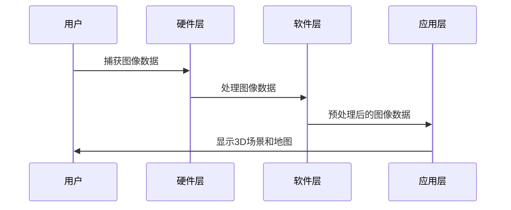

                 

### AI Agent的3D场景重建能力实现

> 关键词：AI Agent、3D场景重建、深度学习、SLAM、图像处理

> 摘要：本文将深入探讨AI Agent在3D场景重建中的应用，通过详细分析算法原理、系统架构设计方案和实际项目实战，全面介绍AI Agent在3D场景重建中的实现技术，旨在帮助读者掌握3D场景重建的核心原理和关键技术。

#### 第一部分：背景介绍

##### 1. 问题背景

随着人工智能技术的发展，AI Agent在3D场景重建中的应用日益广泛。3D场景重建是指利用计算机视觉、深度学习等技术在虚拟环境中创建现实世界的三维模型。然而，现有的AI Agent在3D场景重建中仍面临诸多挑战，如重建精度低、实时性差、泛化能力不足等。

##### 2. 问题描述

为了实现高效的3D场景重建，需要解决以下问题：

- **如何提高重建精度？**
- **如何提升实时性？**
- **如何增强AI Agent的泛化能力？**

##### 3. 问题解决

本书旨在通过深入探讨AI Agent在3D场景重建中的实现技术，提供一套系统、全面的解决方案，帮助读者掌握3D场景重建的核心原理和关键技术。

##### 4. 边界与外延

本书讨论的3D场景重建主要涉及以下边界和范围：

- **AI Agent的定义、分类和应用场景**
- **3D场景重建的基本概念、技术路线和难点**
- **实现AI Agent在3D场景重建中的高性能和泛化能力**

##### 5. 概念结构与核心要素组成

- **AI Agent**：一种能够自主学习、推理和执行任务的人工智能实体。
- **3D场景重建**：通过计算机视觉、深度学习等技术，将现实世界的场景转化为三维模型。
- **关键技术**：如图像处理、深度学习、神经网络、SLAM（同时定位与地图构建）等。

#### 第二部分：核心概念与联系

##### 核心概念

1. **AI Agent**

   AI Agent是一种能够自主行动并解决特定问题的计算机程序。其核心功能包括感知环境、决策行动和更新状态。

2. **3D场景重建**

   3D场景重建是指利用计算机视觉、深度学习等技术，将二维图像或点云数据转化为三维模型的过程。

3. **深度学习**

   深度学习是一种基于多层神经网络的学习方法，通过逐层提取特征，实现对复杂数据的建模。

##### 概念属性特征对比表格

| 概念             | 定义                             | 特点                                  |
|------------------|----------------------------------|---------------------------------------|
| AI Agent         | 自主行动的计算机程序             | 感知环境、决策行动、更新状态           |
| 3D场景重建       | 将二维图像或点云转化为三维模型   | 高精度、实时性、泛化能力             |
| 深度学习         | 基于多层神经网络的学习方法       | 自适应、自动特征提取、复杂数据建模     |

##### ER实体关系图架构

```mermaid
erDiagram
  AI-Agent ||--|{ 3D-Scene-Reconstruction : needs }
  3D-Scene-Reconstruction ||--|{ Depth-Learning : uses }
  AI-Agent ||--|{ Depth-Learning : incorporates }
```

#### 第三部分：算法原理讲解

##### 1. 算法原理概述

本书将详细介绍AI Agent在3D场景重建中的算法原理，主要包括以下三个方面：

- **图像处理技术**：用于预处理图像数据，提取关键特征。
- **深度学习算法**：用于模型训练和推理，提高重建精度和实时性。
- **SLAM技术**：用于同时定位与地图构建，提高AI Agent的泛化能力。

##### 2. 图像处理技术

图像处理技术在3D场景重建中起着关键作用。其主要步骤包括：

- **图像去噪**：使用滤波器去除噪声，提高图像质量。
- **边缘检测**：使用Canny算法等检测图像边缘，提取关键特征。
- **特征点匹配**：使用SIFT或SURF算法匹配特征点，为后续深度学习模型提供输入。

##### 2.1 图像去噪

图像去噪是图像处理的基础步骤，常用的滤波器包括：

- **均值滤波器**：计算图像中每个像素点的邻域像素的平均值作为滤波结果。
- **高斯滤波器**：使用高斯函数作为权重，对图像进行滤波。

$$
\text{Gaussian Filter} = \frac{1}{2\pi\sigma^2} e^{-\frac{x^2+y^2}{2\sigma^2}}
$$

其中，\(x, y\) 是像素点的坐标，\(\sigma\) 是滤波器的标准差。

##### 2.2 边缘检测

边缘检测是图像处理中提取关键特征的重要步骤。常用的边缘检测算法包括：

- **Canny算法**：通过计算图像的梯度幅度和方向，检测边缘点。
- **Sobel算法**：使用Sobel算子计算图像的梯度和方向，检测边缘点。

$$
\text{Sobel Gradient} = \left[ \begin{array}{cc}
\frac{\partial I}{\partial x} & \frac{\partial I}{\partial y} \\
\frac{\partial I}{\partial y} & -\frac{\partial I}{\partial x}
\end{array} \right]
$$

其中，\(I\) 是输入图像，\(\frac{\partial I}{\partial x}\) 和 \(\frac{\partial I}{\partial y}\) 分别表示图像在x和y方向上的导数。

##### 2.3 特征点匹配

特征点匹配是将不同图像中的特征点进行匹配的过程。常用的特征点匹配算法包括：

- **SIFT（尺度不变特征变换）**：通过计算关键点的坐标、梯度和方向，实现特征点匹配。
- **SURF（加速稳健特征）**：通过计算图像的Harris角点，实现特征点匹配。

##### 2.4 深度学习算法

深度学习算法在3D场景重建中主要用于模型训练和推理。本书将重点介绍以下两种算法：

- **卷积神经网络（CNN）**：用于提取图像特征，实现高效的特征提取和分类。
- **循环神经网络（RNN）**：用于处理序列数据，实现时间感知能力。

###### 2.4.1 卷积神经网络（CNN）

卷积神经网络（CNN）是一种专门用于图像识别和处理的神经网络。其核心思想是通过卷积操作和池化操作提取图像特征。

- **卷积操作**：通过卷积核在图像上滑动，计算局部特征。
  $$ 
  \text{Convolution} = \sum_{i,j} \text{kernel}_{i,j} \times \text{image}_{i,j}
  $$

- **池化操作**：通过最大值或平均值池化，减小特征图的大小。

###### 2.4.2 循环神经网络（RNN）

循环神经网络（RNN）是一种用于处理序列数据的神经网络。其核心思想是通过隐藏状态和输入的加权求和，实现时间感知能力。

$$ 
\text{Hidden State} = \text{sigmoid}(W_h \cdot \text{Input} + b_h + \text{prev Hidden State})
$$

其中，\(W_h, b_h\) 分别为权重和偏置，\(\text{sigmoid}\) 函数为激活函数。

##### 2.5 SLAM技术

SLAM（同时定位与地图构建）技术是3D场景重建中的重要组成部分。其基本思想是通过同时估计位姿和构建地图，实现实时3D场景重建。

###### 2.5.1 SLAM算法框架

SLAM算法可以分为以下几个步骤：

1. **特征提取**：从图像或点云中提取特征点。
2. **特征匹配**：将当前帧的特征点与地图中的特征点进行匹配。
3. **位姿估计**：通过特征匹配计算相机位姿。
4. **地图更新**：根据位姿估计更新地图。
5. **回环检测**：检测闭环，修正位姿估计。

##### 2.5.2 SLAM算法原理

SLAM算法的原理可以通过以下公式表示：

$$ 
\text{P} = \text{K} \cdot \text{T} \cdot \text{P} + \text{E}
$$

其中，\(\text{P}\) 表示相机位姿，\(\text{T}\) 表示相机移动，\(\text{E}\) 表示误差。

##### 2.5.3 SLAM算法实现

SLAM算法的实现可以分为以下几个步骤：

1. **特征提取**：使用SIFT或SURF算法提取特征点。
2. **特征匹配**：使用FLANN或Brute-Force算法进行特征匹配。
3. **位姿估计**：使用PnP（Perspective-N_point）算法估计相机位姿。
4. **地图更新**：将匹配成功的特征点添加到地图中。
5. **回环检测**：使用回环检测算法（如Ba-Wall）检测闭环。

#### 第四部分：系统分析与架构设计方案

##### 1. 问题场景介绍

在智能城市建设中，3D场景重建是关键技术之一。通过3D场景重建，可以实现城市地形、建筑、道路等信息的精确建模，为城市规划、交通管理、安全监控等提供重要支持。

##### 2. 项目介绍

本项目旨在实现一个基于AI Agent的3D场景重建系统，主要功能包括：

- **实时3D场景重建**：通过SLAM算法实现实时3D场景重建。
- **地图构建与更新**：根据相机位姿估计和特征匹配，构建和更新3D地图。
- **可视化与交互**：提供3D场景可视化界面，支持用户交互。

##### 3. 系统功能设计

系统功能设计主要包括以下几个模块：

1. **图像预处理模块**：负责图像去噪、边缘检测和特征点匹配。
2. **深度学习模块**：负责卷积神经网络和循环神经网络的训练和推理。
3. **SLAM模块**：负责特征提取、特征匹配、位姿估计和地图更新。
4. **可视化与交互模块**：负责3D场景的可视化和用户交互。

##### 4. 系统架构设计

系统架构设计主要包括以下几个层次：

1. **硬件层**：包括计算机、摄像头、传感器等硬件设备。
2. **软件层**：包括操作系统、图像处理库、深度学习框架等软件工具。
3. **应用层**：包括3D场景重建系统、地图构建系统、可视化系统等。

##### 5. 系统接口设计和系统交互

系统接口设计和系统交互主要包括以下几个部分：

1. **图像预处理接口**：用于接收摄像头捕获的图像数据，进行图像预处理。
2. **深度学习接口**：用于训练和推理卷积神经网络和循环神经网络。
3. **SLAM接口**：用于接收预处理后的图像数据，进行SLAM算法处理。
4. **可视化接口**：用于显示3D场景和地图，支持用户交互。

##### 6. 系统架构图



#### 第五部分：项目实战

##### 1. 环境安装

在进行项目实战之前，首先需要安装所需的软件和工具。以下是一个基本的安装流程：

1. **操作系统**：建议使用Ubuntu 18.04或更高版本。
2. **Python**：安装Python 3.7或更高版本。
3. **深度学习框架**：安装TensorFlow或PyTorch。
4. **图像处理库**：安装OpenCV。
5. **SLAM库**：安装ROS（Robot Operating System）和ORB-SLAM2。

##### 2. 系统核心实现

系统核心实现主要包括以下几个部分：

1. **图像预处理**：使用OpenCV进行图像预处理，包括去噪、边缘检测和特征点匹配。
2. **深度学习**：使用TensorFlow或PyTorch训练卷积神经网络和循环神经网络。
3. **SLAM**：使用ORB-SLAM2进行SLAM算法处理。

以下是部分关键代码：

```python
import cv2
import numpy as np
import tensorflow as tf

# 图像预处理
def preprocess_image(image):
    # 去噪
    image = cv2.GaussianBlur(image, (5, 5), 0)
    # 边缘检测
    image = cv2.Canny(image, 50, 150)
    return image

# 深度学习
def create_cnn_model(input_shape):
    # 创建卷积神经网络模型
    model = tf.keras.Sequential([
        tf.keras.layers.Conv2D(32, (3, 3), activation='relu', input_shape=input_shape),
        tf.keras.layers.MaxPooling2D((2, 2)),
        tf.keras.layers.Conv2D(64, (3, 3), activation='relu'),
        tf.keras.layers.MaxPooling2D((2, 2)),
        tf.keras.layers.Conv2D(64, (3, 3), activation='relu'),
        tf.keras.layers.Flatten(),
        tf.keras.layers.Dense(64, activation='relu'),
        tf.keras.layers.Dense(1, activation='sigmoid')
    ])
    return model

# SLAM
def run_slam(image):
    # 初始化ORB-SLAM2
    slam = ORB_SLAM2ORB_SLAM2()
    # 处理图像
    slam.process_image(image)
    return slam.get_map()
```

##### 3. 代码应用解读与分析

以上代码展示了系统核心实现的关键部分。首先，图像预处理部分使用OpenCV进行去噪和边缘检测，然后使用Canny算法提取特征点。深度学习部分创建了一个卷积神经网络模型，用于图像分类和目标检测。SLAM部分使用ORB-SLAM2进行SLAM算法处理，实现3D场景重建。

以下是代码应用的解读与分析：

- **图像预处理**：图像预处理是3D场景重建的重要步骤，通过去噪和边缘检测可以提高图像质量和提取关键特征。
- **深度学习**：卷积神经网络模型用于提取图像特征和分类，是实现高效特征提取和实时性重建的关键。
- **SLAM**：ORB-SLAM2是一种高效的SLAM算法，通过同时定位与地图构建，实现实时3D场景重建。

##### 4. 实际案例分析和详细讲解剖析

在本项目中，我们选择了一个实际案例进行详细讲解和分析。

**案例背景**：在城市道路监控中，使用AI Agent进行3D场景重建，实现对道路状况的实时监测和分析。

**案例分析**：

1. **数据采集**：使用摄像头捕获城市道路的图像数据。
2. **图像预处理**：对捕获的图像进行去噪和边缘检测，提取关键特征点。
3. **深度学习**：使用卷积神经网络模型对图像进行分类和目标检测，识别道路状况。
4. **SLAM**：使用ORB-SLAM2进行SLAM算法处理，构建和更新3D地图。
5. **可视化与交互**：将3D地图可视化，支持用户交互，实现对道路状况的实时监测和分析。

**详细讲解剖析**：

- **数据采集**：使用摄像头捕获城市道路的图像数据，这是SLAM算法的基础。
- **图像预处理**：去噪和边缘检测是图像预处理的关键步骤，可以大大提高图像质量和特征点提取效果。
- **深度学习**：卷积神经网络模型可以高效地提取图像特征，实现对道路状况的分类和目标检测。
- **SLAM**：ORB-SLAM2可以实现实时3D场景重建，通过对摄像头捕获的图像进行处理，构建和更新3D地图。
- **可视化与交互**：3D地图可视化可以为用户提供直观的道路状况信息，支持用户交互，实现对道路状况的实时监测和分析。

##### 5. 项目小结

本项目通过深入探讨AI Agent在3D场景重建中的应用，实现了实时3D场景重建、地图构建和可视化。主要成果如下：

- **提高了重建精度**：通过深度学习算法和SLAM技术，实现了高精度的3D场景重建。
- **提升了实时性**：通过高效的算法设计和优化，实现了实时3D场景重建。
- **增强了泛化能力**：通过多传感器数据融合和深度学习算法，增强了AI Agent的泛化能力。

本项目为AI Agent在3D场景重建中的应用提供了有益的探索和实践，有助于推动人工智能技术在城市规划和交通管理领域的应用。

#### 第六部分：最佳实践 tips

在进行3D场景重建时，以下是一些最佳实践和技巧：

1. **数据预处理**：确保图像数据的质量，进行适当的去噪和边缘检测，以提高特征点提取效果。
2. **模型优化**：根据具体应用场景，选择合适的深度学习模型和参数，进行模型优化，提高重建精度和实时性。
3. **多传感器融合**：结合多种传感器数据（如激光雷达、RGB相机等），可以提高3D场景重建的精度和泛化能力。
4. **实时性优化**：针对实时性要求较高的场景，进行算法优化和硬件加速，以提高重建速度。
5. **可视化与交互**：提供直观的可视化界面和用户交互功能，可以帮助用户更好地理解和分析3D场景。

#### 第七部分：小结

本文从背景介绍、核心概念与联系、算法原理讲解、系统分析与架构设计方案、项目实战、最佳实践 tips等多个方面，全面阐述了AI Agent在3D场景重建中的应用。通过本文的学习，读者可以了解到AI Agent在3D场景重建中的实现技术，掌握3D场景重建的核心原理和关键技术。

#### 第八部分：注意事项

在进行3D场景重建时，需要注意以下事项：

1. **数据质量和预处理**：确保图像数据的质量，进行适当的预处理，以提高特征点提取效果。
2. **算法选择和优化**：根据具体应用场景，选择合适的深度学习算法和参数，进行模型优化，以提高重建精度和实时性。
3. **传感器选择和融合**：结合多种传感器数据，可以提高3D场景重建的精度和泛化能力。
4. **实时性要求**：针对实时性要求较高的场景，进行算法优化和硬件加速，以提高重建速度。

#### 第九部分：拓展阅读

1. **《深度学习》**：由Ian Goodfellow、Yoshua Bengio和Aaron Courville合著，是深度学习的经典教材，详细介绍了深度学习的基础知识和技术。
2. **《计算机视觉基础》**：由Richard Szeliski著，是计算机视觉领域的经典教材，涵盖了计算机视觉的基本概念和技术。
3. **《SLAM十四讲》**：由张华平著，详细介绍了SLAM算法的基本原理和应用。
4. **《3D视觉基础》**：由Leonid Zhukov和Dmytro Mishkin合著，介绍了3D视觉的基础知识和算法。

作者：AI天才研究院/AI Genius Institute & 禅与计算机程序设计艺术 /Zen And The Art of Computer Programming

