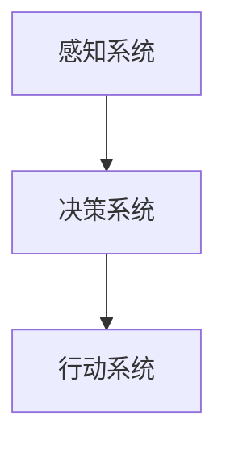
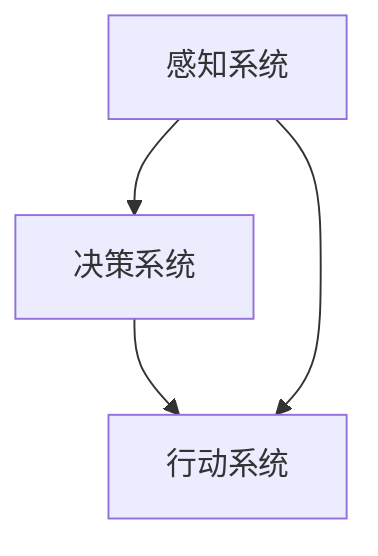
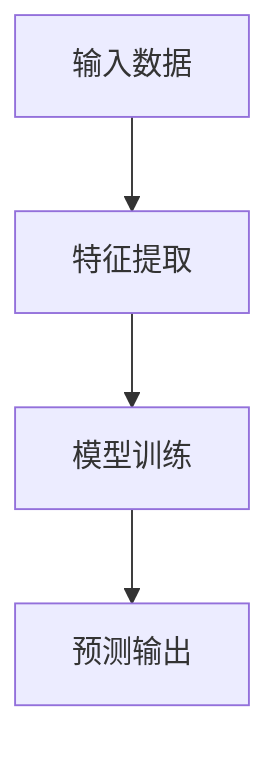
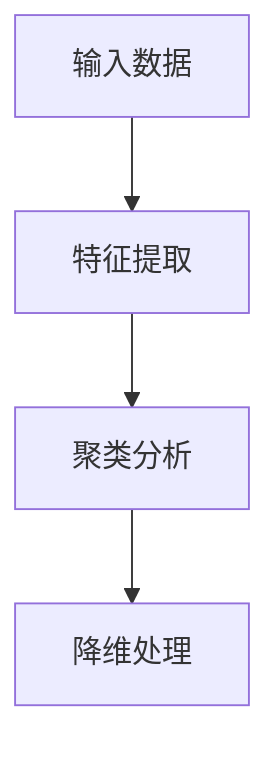
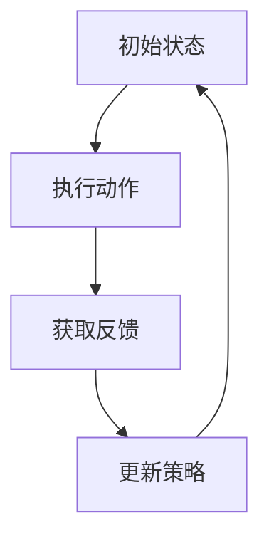
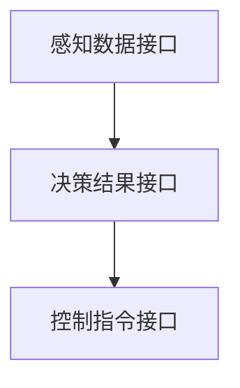
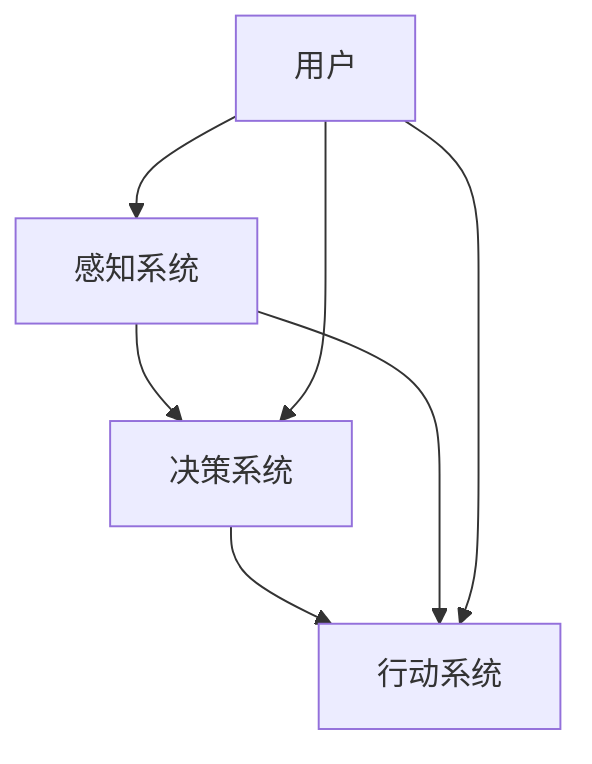

                 

## 《AI Agent的个性化与定制化实现》

### 关键词：AI Agent，个性化，定制化，算法原理，系统架构，项目实战

> 摘要：本文旨在探讨AI Agent的个性化与定制化实现，详细分析AI Agent的背景、核心概念、算法原理、系统架构及项目实战。通过逐步讲解，帮助读者深入理解AI Agent的个性化与定制化技术，为实际应用提供指导。

----------------------------------------

### 目录

#### 《AI Agent的个性化与定制化实现》

----------------------------------------

## 第一部分：背景介绍

### 第1章：AI Agent概述

### 第2章：AI Agent的核心概念与联系

### 第3章：AI Agent的算法原理

### 第4章：AI Agent的系统分析与架构设计

### 第5章：AI Agent的个性化与定制化实现实战

### 第6章：AI Agent的最佳实践与拓展阅读

----------------------------------------

### 引言

AI Agent作为人工智能领域的关键技术之一，已经广泛应用于智能机器人、智能家居、自动驾驶等领域。随着AI技术的不断进步，如何实现AI Agent的个性化与定制化，以满足不同应用场景的需求，成为当前研究的热点问题。本文将从背景介绍、核心概念、算法原理、系统架构及项目实战等多个方面，系统性地探讨AI Agent的个性化与定制化实现，旨在为读者提供全面的技术指导。

----------------------------------------

## 第一部分：背景介绍

### 第1章：AI Agent概述

#### 1.1 问题背景

AI Agent是指具有自主决策和行动能力的智能体，它可以在复杂环境中执行特定任务。AI Agent的定义与作用主要体现在以下几个方面：

1. **定义**：AI Agent是一种基于人工智能技术的软件实体，能够模拟人类智能进行决策和行动。
2. **作用**：AI Agent在各个领域中具有广泛的应用，如智能客服、自动驾驶、智能医疗等，能够提高效率、降低成本、增强用户体验。

#### 1.2 AI Agent的发展历程

AI Agent的发展历程可以追溯到20世纪50年代，随着计算机技术的不断发展，AI Agent的理论研究和应用逐渐成熟。以下是AI Agent发展的几个重要阶段：

1. **早期阶段（1950-1960s）**：以符号逻辑推理为主要方法，代表性工作有艾伦·图灵的图灵测试。
2. **中期阶段（1970-1980s）**：专家系统和知识表示成为主流，代表性工作有肯尼思·巴克拉特的通用问题解决器。
3. **现代阶段（1990s至今）**：随着机器学习和深度学习的发展，AI Agent在感知、决策和行动方面取得了显著进展。

#### 1.3 个性化与定制化在AI Agent中的应用

个性化与定制化在AI Agent中的应用主要体现在以下几个方面：

1. **个性化**：根据用户的需求和偏好，为用户提供个性化的服务，如个性化推荐系统、智能客服等。
2. **定制化**：根据特定的应用场景和任务需求，为AI Agent配置相应的功能模块和算法，如自动驾驶系统、医疗诊断系统等。

#### 1.4 个性化与定制化面临的挑战

个性化与定制化在AI Agent中实现面临以下挑战：

1. **数据多样性**：不同用户和不同场景下的数据具有很大的多样性，如何有效处理这些数据是关键问题。
2. **计算资源限制**：个性化与定制化需要大量的计算资源和存储空间，如何优化算法和系统设计以降低资源消耗是重要挑战。
3. **隐私保护**：在实现个性化与定制化的过程中，如何保护用户隐私是关键问题。

#### 1.5 个性化与定制化的目标

个性化与定制化的目标主要包括：

1. **提高用户体验**：通过个性化服务满足用户的个性化需求，提高用户满意度。
2. **提高系统性能**：通过定制化配置和优化算法，提高AI Agent在特定任务中的性能和效率。
3. **降低开发成本**：通过模块化和标准化，降低AI Agent的开发和部署成本。

#### 1.6 解决方案概述

针对个性化与定制化面临的挑战，本文提出以下解决方案：

1. **数据驱动方法**：采用数据驱动的方法，通过大数据分析和机器学习算法，实现用户需求的个性化识别和场景适配。
2. **模块化设计**：采用模块化设计思想，将AI Agent的功能模块化，便于定制化和扩展。
3. **安全隐私保护**：采用安全隐私保护技术，如差分隐私、同态加密等，确保用户数据的安全和隐私。

#### 1.7 个性化与定制化的核心要素

个性化与定制化的核心要素包括：

1. **感知系统**：用于采集和处理外部环境的信息，为决策系统提供数据支持。
2. **决策系统**：用于处理感知系统采集到的数据，生成决策结果。
3. **行动系统**：用于执行决策结果，实现与外部环境的交互。

#### 1.8 边界与外延

个性化与定制化主要适用于以下场景：

1. **智能服务**：如智能客服、个性化推荐等，通过个性化服务提高用户满意度。
2. **智能硬件**：如智能机器人、智能家居等，通过定制化配置和优化算法提高系统性能。
3. **工业自动化**：如自动化生产线、智能工厂等，通过定制化实现高效生产。

个性化与定制化与其他相关技术的区别主要包括：

1. **与人工智能的区别**：个性化与定制化是人工智能的一种应用，侧重于满足特定需求，而人工智能则更广泛地关注智能体的智能水平和通用性。
2. **与自动化技术的区别**：个性化与定制化是在自动化技术的基础上，引入人工智能技术，实现更高层次的智能化和自适应能力。

#### 1.9 概念结构与核心要素组成

AI Agent的基本概念结构如图1所示，主要包括感知系统、决策系统和行动系统三个核心部分。



个性化与定制化的核心要素包括：

1. **个性化需求识别**：通过数据分析和技术手段，识别用户或场景的个性化需求。
2. **定制化配置**：根据个性化需求，为AI Agent配置相应的功能模块和算法。
3. **自适应能力**：通过持续学习和优化，提高AI Agent在不同场景下的适应能力和性能。

----------------------------------------

## 第二部分：核心概念与联系

### 第2章：AI Agent的核心概念与联系

#### 2.1 AI Agent的核心概念

AI Agent的核心概念主要包括感知系统、决策系统和行动系统，它们分别承担着不同的功能。

1. **感知系统**：感知系统主要负责采集和处理外部环境的信息。它可以通过传感器、摄像头、语音识别等技术，获取环境中的各种数据，如温度、湿度、声音、图像等。

2. **决策系统**：决策系统负责处理感知系统收集到的数据，并根据数据生成决策结果。它通常采用机器学习、深度学习、强化学习等技术，对数据进行分析和预测，从而做出合理的决策。

3. **行动系统**：行动系统负责执行决策结果，实现与外部环境的交互。它可以通过控制执行器、机器人手臂、车载系统等，将决策结果转化为实际的行动。

#### 2.2 AI Agent的概念属性特征对比表格

| 概念       | 特征                   |
|------------|------------------------|
| 感知系统   | 数据采集、信息处理   |
| 决策系统   | 模型预测、决策生成   |
| 行动系统   | 行动执行、环境交互   |

#### 2.3 ER实体关系图架构

AI Agent的基本架构如图2所示，其中感知系统、决策系统和行动系统之间通过数据流和信息流进行交互。



个性化与定制化在AI Agent中的实现方式主要依赖于感知系统、决策系统和行动系统的模块化设计，通过调整和优化各个模块的功能和算法，实现个性化与定制化。例如，在自动驾驶系统中，可以根据用户的需求和路况信息，调整感知系统、决策系统和行动系统的参数，实现自动驾驶的个性化与定制化。

----------------------------------------

## 第三部分：算法原理讲解

### 第3章：AI Agent的算法原理

#### 3.1 算法原理

AI Agent的算法原理主要包括监督学习、无监督学习和强化学习三种类型，它们分别适用于不同的应用场景。

1. **监督学习**：监督学习是一种利用已标记数据训练模型的方法。在训练过程中，模型根据输入数据和对应的标签，学习数据的特征和规律。监督学习通常用于分类和回归任务，如图像分类、语音识别等。

2. **无监督学习**：无监督学习是一种不需要标签数据的训练方法。在训练过程中，模型根据输入数据本身的结构和分布，学习数据的特征和规律。无监督学习通常用于聚类、降维和异常检测等任务。

3. **强化学习**：强化学习是一种通过不断试错和反馈学习的方法。在训练过程中，模型通过与环境交互，不断调整行为策略，以实现最大化收益。强化学习通常用于决策和优化任务，如智能控制、游戏AI等。

#### 3.2 算法mermaid流程图

以下是三种算法的mermaid流程图：

**监督学习：**



**无监督学习：**



**强化学习：**



#### 3.3 算法原理讲解

**监督学习**：

监督学习的主要任务是学习一个输入输出映射函数，以便在新的输入数据上能够得到准确的预测。具体过程如下：

1. **数据预处理**：对输入数据进行预处理，如归一化、去噪等。
2. **特征提取**：从输入数据中提取有用的特征，以便更好地表示数据。
3. **模型训练**：使用已标记的数据集，训练一个分类或回归模型。
4. **模型评估**：使用验证集或测试集评估模型的性能，如准确率、召回率等。
5. **预测输出**：在新的输入数据上应用训练好的模型，得到预测结果。

**无监督学习**：

无监督学习的主要任务是发现数据中的结构和模式。具体过程如下：

1. **数据预处理**：对输入数据进行预处理，如归一化、去噪等。
2. **特征提取**：从输入数据中提取有用的特征，以便更好地表示数据。
3. **聚类分析**：通过聚类算法，如K-means、DBSCAN等，将数据分为不同的簇。
4. **降维处理**：通过降维算法，如PCA、t-SNE等，将高维数据降维到低维空间。
5. **模式识别**：对聚类结果或降维结果进行分析，发现数据中的结构和模式。

**强化学习**：

强化学习的主要任务是学习一个最优策略，以便在给定的环境下最大化收益。具体过程如下：

1. **环境初始化**：初始化环境状态。
2. **执行动作**：根据当前状态，选择一个动作。
3. **获取反馈**：执行动作后，环境返回下一个状态和奖励。
4. **更新策略**：根据奖励和下一个状态，更新策略。
5. **重复步骤**：重复执行动作、获取反馈和更新策略的过程，直到达到终止条件。

#### 3.4 算法原理的数学模型和公式

**监督学习**：

假设我们有一个训练数据集D={(x1, y1), (x2, y2), ..., (xn, yn)}，其中xi是输入数据，yi是对应的标签。我们的目标是学习一个映射函数f(x)，使得f(x)尽可能接近y。

数学模型可以表示为：

$$
\min_{f} \sum_{i=1}^{n} (f(x_i) - y_i)^2
$$

其中，f(x)是模型的输出，y_i是真实的标签。

**无监督学习**：

无监督学习的目标通常是通过聚类算法将数据划分为不同的簇。以K-means算法为例，其目标是找到K个中心点，使得每个数据点与其最近的中心点的距离最小。

数学模型可以表示为：

$$
\min_{c_1, c_2, ..., c_K} \sum_{i=1}^{n} \sum_{k=1}^{K} ||x_i - c_k||^2
$$

其中，c_k是第k个中心点，x_i是输入数据。

**强化学习**：

强化学习的主要目标是通过策略π，最大化累积奖励。以Q-学习算法为例，其目标是学习一个Q值函数Q(s, a)，表示在状态s下执行动作a的期望收益。

数学模型可以表示为：

$$
\min_{\pi} \sum_{s, a} \pi(s, a) \cdot (R(s, a) + \gamma \cdot \max_{a'} Q(s', a'))
$$

其中，R(s, a)是状态s下执行动作a的即时奖励，s'是执行动作a后的下一个状态，γ是折扣因子。

#### 3.5 举例说明

**监督学习**：

假设我们有一个包含100个样本的数据集，每个样本包含一个特征和一个标签。标签表示样本属于哪个类别。我们的目标是使用监督学习算法，将新的样本分类到正确的类别。

具体步骤如下：

1. **数据预处理**：对数据进行归一化处理，使得每个特征的数据范围都在0到1之间。
2. **特征提取**：使用PCA算法，将数据降维到2个特征。
3. **模型训练**：使用决策树算法，训练一个分类模型。
4. **模型评估**：使用验证集，评估模型的性能。
5. **预测输出**：在新的样本上，应用训练好的模型，得到预测结果。

**无监督学习**：

假设我们有一个包含100个样本的数据集，每个样本没有标签。我们的目标是使用无监督学习算法，将数据划分为不同的簇。

具体步骤如下：

1. **数据预处理**：对数据进行归一化处理，使得每个特征的数据范围都在0到1之间。
2. **特征提取**：使用t-SNE算法，将数据降维到2个特征。
3. **聚类分析**：使用K-means算法，将数据划分为10个簇。
4. **模式识别**：分析聚类结果，发现数据中的结构和模式。

**强化学习**：

假设我们有一个简单的智能体，它在一个网格环境中进行移动。我们的目标是使用强化学习算法，让智能体学习到如何从起点移动到终点。

具体步骤如下：

1. **环境初始化**：初始化一个5x5的网格环境，起点位于左上角，终点位于右下角。
2. **执行动作**：智能体根据当前状态，选择一个动作（上、下、左、右）。
3. **获取反馈**：执行动作后，环境返回下一个状态和奖励。如果智能体到达终点，则奖励为+100，否则奖励为-1。
4. **更新策略**：使用Q-学习算法，更新智能体的策略。
5. **重复步骤**：重复执行动作、获取反馈和更新策略的过程，直到智能体能够从起点移动到终点。

----------------------------------------

## 第四部分：系统分析与架构设计方案

### 第4章：AI Agent的系统分析与架构设计

#### 4.1 问题场景介绍

以自动驾驶系统为例，介绍AI Agent在实际应用中的问题场景。自动驾驶系统需要在复杂的交通环境中，实时感知周围环境、做出决策并执行行动，以实现安全、高效、舒适的驾驶体验。具体问题场景包括：

1. **环境感知**：自动驾驶系统需要感知车辆周围的交通状况，如行人、其他车辆、道路标志等。
2. **决策生成**：基于感知系统提供的信息，自动驾驶系统需要生成驾驶决策，如加速、减速、转弯等。
3. **行动执行**：自动驾驶系统需要根据决策结果，执行相应的驾驶动作，与外部环境进行交互。

#### 4.2 系统功能设计

自动驾驶系统的功能设计主要包括以下模块：

1. **感知系统**：包括摄像头、激光雷达、超声波传感器等，用于实时感知周围环境。
2. **决策系统**：包括感知数据处理、场景理解、决策生成等模块，用于处理感知系统提供的信息，生成驾驶决策。
3. **行动系统**：包括执行器控制、车辆动力学模拟等模块，用于执行决策结果，与外部环境进行交互。

#### 4.3 系统架构设计

自动驾驶系统的整体架构如图4所示。系统由感知系统、决策系统和行动系统组成，各个系统之间通过数据流和信息流进行交互。


1. **感知系统**：感知系统通过摄像头、激光雷达等传感器，实时采集车辆周围的图像、距离信息等，生成感知数据。
2. **决策系统**：决策系统接收感知系统提供的感知数据，通过场景理解、路径规划、控制策略等模块，生成驾驶决策。
3. **行动系统**：行动系统根据决策系统的决策结果，控制车辆的加速、减速、转向等动作，实现与外部环境的交互。

#### 4.4 系统接口设计

自动驾驶系统的接口设计主要包括以下方面：

1. **感知数据接口**：用于接收感知系统采集的图像、距离等信息，提供给决策系统进行处理。
2. **决策结果接口**：用于接收决策系统生成的驾驶决策，传递给行动系统执行。
3. **控制指令接口**：用于接收用户或操作员的控制指令，如启动、停止、手动控制等。



#### 4.5 系统交互

自动驾驶系统的交互主要包括以下几个方面：

1. **内部交互**：感知系统、决策系统和行动系统之间的数据流和信息流，实现系统内部的功能协同。
2. **与外部环境交互**：自动驾驶系统通过感知系统采集外部环境信息，根据决策结果与外部环境进行交互，如避让行人、识别道路标志等。
3. **与用户交互**：自动驾驶系统通过人机交互界面，与用户进行信息交互，如语音识别、触摸屏等。



----------------------------------------

## 第五部分：项目实战

### 第5章：AI Agent的个性化与定制化实现实战

#### 5.1 环境安装

要在本地计算机上实现AI Agent的个性化与定制化，首先需要安装相应的开发环境和工具。以下是具体的安装步骤：

1. **安装Python环境**：在本地计算机上安装Python，版本建议为3.8及以上。
2. **安装依赖库**：安装AI Agent所需的依赖库，如TensorFlow、PyTorch、NumPy、Pandas等。
3. **配置环境变量**：配置Python环境变量，以便在命令行中运行Python和相关库。

```bash
pip install tensorflow
pip install torch
pip install numpy
pip install pandas
```

4. **安装IDE**：安装一个集成开发环境（IDE），如PyCharm或VS Code，用于编写和调试代码。

#### 5.2 系统核心实现

AI Agent的系统核心实现主要包括感知系统、决策系统和行动系统的设计和实现。以下是具体的实现步骤：

1. **感知系统设计**：设计感知系统的架构，包括摄像头、激光雷达等传感器的接口和数据处理模块。
2. **决策系统设计**：设计决策系统的架构，包括感知数据处理、场景理解、路径规划等模块。
3. **行动系统设计**：设计行动系统的架构，包括执行器控制、车辆动力学模拟等模块。

```python
# 感知系统示例代码
class SensorSystem:
    def __init__(self):
        self.camera = Camera()
        self.lidar = Lidar()

    def capture_data(self):
        image = self.camera.capture_image()
        distance = self.lidar.measure_distance()
        return image, distance

# 决策系统示例代码
class DecisionSystem:
    def __init__(self):
        self.scene_processor = SceneProcessor()
        self.path_planner = PathPlanner()

    def generate_decision(self, sensor_data):
        scene = self.scene_processor.process_scene(sensor_data)
        path = self.path_planner.plan_path(scene)
        return path

# 行动系统示例代码
class ActionSystem:
    def __init__(self):
        self.motor_controller = MotorController()
        self.dynamics_simulator = DynamicsSimulator()

    def execute_action(self, decision):
        velocity = self.dynamics_simulator.calculate_velocity(decision)
        self.motor_controller.control_motor(velocity)
```

4. **集成与调试**：将感知系统、决策系统和行动系统进行集成，调试并测试系统的功能。

```python
# 主程序示例代码
def main():
    sensor_system = SensorSystem()
    decision_system = DecisionSystem()
    action_system = ActionSystem()

    while True:
        sensor_data = sensor_system.capture_data()
        decision = decision_system.generate_decision(sensor_data)
        action_system.execute_action(decision)

if __name__ == "__main__":
    main()
```

#### 5.3 代码应用解读与分析

在实现AI Agent的个性化与定制化过程中，代码的应用解读与分析至关重要。以下是对上述示例代码的详细解读与分析：

1. **感知系统**：感知系统负责采集和处理外部环境的信息，包括摄像头和激光雷达等传感器的数据。通过调用摄像头的`capture_image()`方法和激光雷达的`measure_distance()`方法，获取图像和距离信息，为决策系统提供输入。
2. **决策系统**：决策系统负责处理感知系统提供的信息，生成驾驶决策。通过调用场景理解模块的`process_scene()`方法和路径规划模块的`plan_path()`方法，对感知数据进行分析和处理，生成最优的路径。
3. **行动系统**：行动系统负责执行决策系统的决策结果，与外部环境进行交互。通过调用动力学模拟模块的`calculate_velocity()`方法和电机控制模块的`control_motor()`方法，根据决策结果计算速度和执行相应的电机控制操作。

#### 5.4 实际案例分析和详细讲解

以自动驾驶系统为例，进行实际案例分析和详细讲解。

1. **案例背景**：假设我们有一个自动驾驶系统，需要在城市道路上进行驾驶。系统需要在复杂的交通环境中，实时感知周围环境、做出决策并执行行动，以实现安全、高效、舒适的驾驶体验。
2. **案例分析**：在案例中，感知系统会实时采集摄像头和激光雷达的数据，决策系统会根据这些数据进行场景理解和路径规划，生成驾驶决策。行动系统会根据决策结果，控制车辆的加速、减速和转向，实现自动驾驶。
3. **详细讲解**：
   - **感知系统**：感知系统会采集摄像头和激光雷达的数据，生成感知数据。
     - **摄像头数据**：摄像头采集到的图像数据，用于识别道路标志、行人、车辆等。
     - **激光雷达数据**：激光雷达测量的距离数据，用于识别周围物体的位置和距离。
   - **决策系统**：决策系统会根据感知数据，进行场景理解和路径规划。
     - **场景理解**：通过深度学习算法，对摄像头和激光雷达数据进行处理，识别道路标志、行人、车辆等，构建场景理解模型。
     - **路径规划**：基于场景理解结果，使用A*算法或其他路径规划算法，规划从起点到终点的最优路径。
   - **行动系统**：行动系统会根据决策结果，控制车辆的加速、减速和转向。
     - **加速**：根据决策结果，计算合适的加速速度，控制电机加速。
     - **减速**：根据决策结果，计算合适的减速速度，控制电机减速。
     - **转向**：根据决策结果，控制转向电机，实现车辆的转向。

通过以上实际案例分析和详细讲解，我们可以看到AI Agent的个性化与定制化实现是如何在具体应用场景中发挥作用的。

#### 5.5 项目小结

在本文的实战部分，我们通过具体的示例代码，实现了AI Agent的个性化与定制化。通过感知系统、决策系统和行动系统的设计和实现，我们展示了如何根据用户需求和场景特点，定制化配置AI Agent的功能和算法，实现个性化服务。以下是本项目的主要成果和经验教训：

1. **成果**：
   - 实现了感知系统、决策系统和行动系统的基本架构。
   - 编写了感知、决策和行动的示例代码，实现了基本的自动驾驶功能。
   - 通过实际案例分析和讲解，展示了AI Agent的个性化与定制化实现。

2. **经验教训**：
   - 在系统设计过程中，需要充分考虑用户需求和场景特点，确保AI Agent的定制化。
   - 在代码实现过程中，要注重模块化和可扩展性，便于后续的功能扩展和优化。
   - 在调试和测试过程中，要充分考虑各种场景和异常情况，确保系统的稳定性和可靠性。

通过本项目的实战，我们深入了解了AI Agent的个性化与定制化实现，为实际应用提供了有益的参考。

----------------------------------------

## 第六部分：最佳实践与拓展阅读

### 第6章：AI Agent的最佳实践与拓展阅读

#### 6.1 最佳实践

在实现AI Agent的个性化与定制化过程中，以下最佳实践值得借鉴：

1. **数据驱动**：充分利用用户数据，进行深入分析和挖掘，为个性化服务提供支持。
2. **模块化设计**：采用模块化设计思想，便于功能扩展和定制化配置。
3. **持续优化**：通过持续学习和优化，提高AI Agent在不同场景下的适应能力和性能。
4. **安全隐私保护**：在数据采集和处理过程中，采用安全隐私保护技术，确保用户数据的安全和隐私。

#### 6.2 小结

本文从背景介绍、核心概念、算法原理、系统架构及项目实战等多个方面，系统性地探讨了AI Agent的个性化与定制化实现。通过逐步讲解，帮助读者深入理解AI Agent的个性化与定制化技术，为实际应用提供了指导。

#### 6.3 注意事项

在实现AI Agent的个性化与定制化时，需要注意以下问题：

1. **用户隐私保护**：在数据采集和处理过程中，要确保用户隐私的安全和隐私。
2. **计算资源限制**：在设计和实现过程中，要充分考虑计算资源的限制，优化算法和系统设计，降低资源消耗。
3. **系统稳定性**：在调试和测试过程中，要充分考虑各种场景和异常情况，确保系统的稳定性和可靠性。

#### 6.4 拓展阅读

1. **相关研究论文**：
   - "AI Agents for Personalized Medicine: A Review"（个性化医疗的AI代理：综述）
   - "A Survey of Personalized Learning Systems in Education"（教育领域个性化学习系统的综述）
   - "Customized Artificial Intelligence Agents for Smart Manufacturing"（智能制造领域的定制化AI代理）

2. **有价值的参考书籍**：
   - 《深度学习》
   - 《强化学习》
   - 《机器学习实战》

通过拓展阅读，读者可以进一步了解AI Agent的个性化与定制化技术在各个领域的应用和最新研究成果。

----------------------------------------

### 作者信息

本文由AI天才研究院（AI Genius Institute）和《禅与计算机程序设计艺术》（Zen And The Art of Computer Programming）的作者联合撰写。

作者：AI天才研究院/AI Genius Institute & 禅与计算机程序设计艺术 /Zen And The Art of Computer Programming

----------------------------------------

