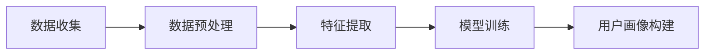
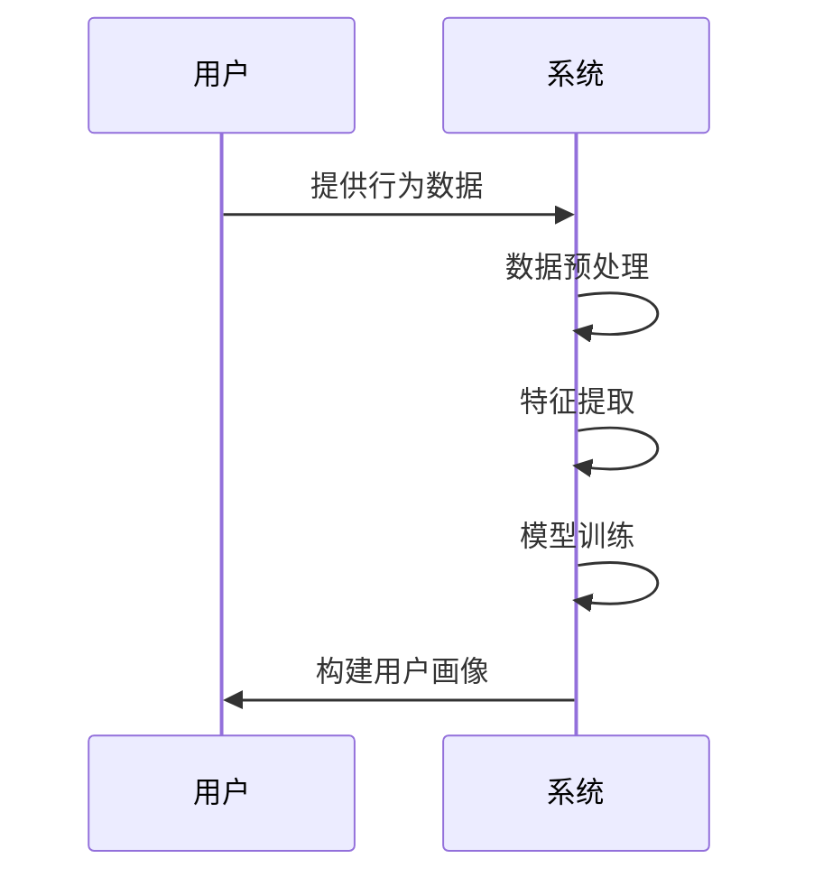
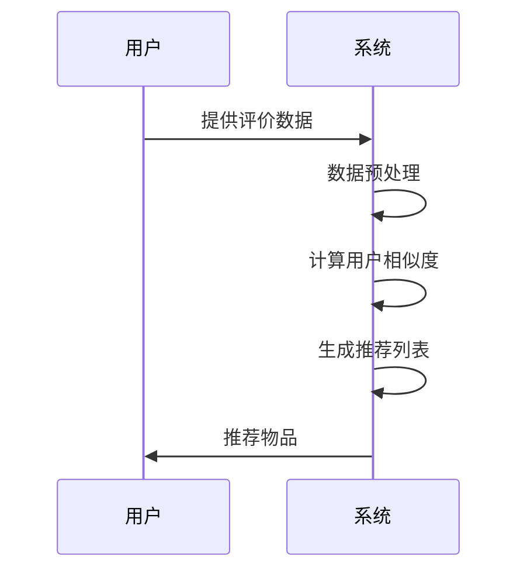
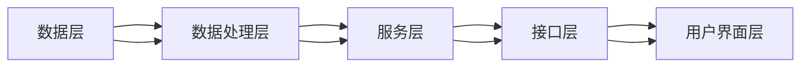
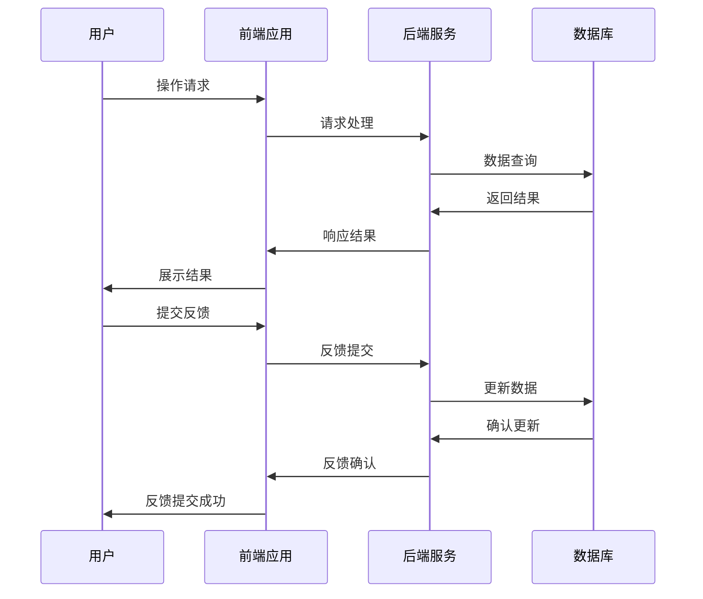

                 

### 引言与背景

随着人工智能技术的飞速发展，AI Agent（人工智能代理）在各个领域的应用越来越广泛。从智能家居到自动驾驶，从医疗诊断到金融服务，AI Agent正逐渐成为我们生活中不可或缺的一部分。然而，一个高效的AI Agent不仅需要强大的计算能力和丰富的知识库，还需要能够理解和满足用户的个性化需求。这就引出了我们今天要讨论的核心问题：如何通过用户画像与偏好学习实现AI Agent的个性化？

用户画像和偏好学习是人工智能领域中的重要概念，它们为我们提供了一种方法，可以理解和捕捉用户的个性化特征和行为模式。用户画像是对用户个体全面、详尽的描述，它包括用户的基本信息、兴趣爱好、行为习惯等多个维度。而偏好学习则是通过分析用户的历史行为数据，识别并预测用户的偏好，从而为用户提供个性化的服务。

本文将围绕这两个核心概念展开，逐步深入探讨用户画像与偏好学习在AI Agent中的应用。我们将首先介绍用户画像的定义和构建方法，然后讨论偏好学习的算法原理，并通过具体的案例来展示这两个概念在实际中的应用。接下来，我们将详细介绍用户画像和偏好学习的技术实现过程，包括系统的设计与实现方法。最后，我们将对个性化系统进行优化和评估，并展望未来的发展方向和挑战。

通过本文的讨论，我们希望能够帮助读者理解用户画像和偏好学习的基本原理，掌握其在AI Agent中的应用方法，并为未来的研究和实践提供一些有益的参考。

### 目录大纲设计步骤

要设计一篇系统化、结构化的技术博客文章《AI Agent的个性化：用户画像与偏好学习》，我们需要遵循一系列明确的步骤，以确保文章的逻辑清晰、内容完整且易于读者理解。以下是详细的目录大纲设计步骤：

#### 1. 理解书名与主题

首先，我们需要深入理解书名《AI Agent的个性化：用户画像与偏好学习》所涵盖的核心内容。这本书的主题是探讨如何利用用户画像和偏好学习技术实现AI Agent的个性化。用户画像涉及对用户特征的多维度描述，而偏好学习则是通过分析用户数据来预测其偏好，从而提供个性化服务。明确主题后，我们可以确定文章的核心内容和结构。

#### 2. 规划章节内容

基于书名和主题，我们可以初步规划出章节内容。以下是建议的章节结构：

- **引言与背景**：介绍AI Agent的发展背景和个性化的重要性。
- **用户画像理论**：详细讲解用户画像的定义、类型和构建方法。
- **偏好学习理论**：探讨偏好学习的定义、算法原理和应用场景。
- **实践应用与案例分析**：通过具体案例展示用户画像和偏好学习在现实中的应用。
- **技术实现与算法原理**：深入讲解用户画像和偏好学习的技术实现方法，包括算法流程和Python代码示例。
- **个性化系统的设计与实现**：描述个性化系统的设计与实现过程，包括系统架构和接口设计。
- **个性化系统的优化与评估**：讨论个性化系统的优化方法及其评估指标。
- **未来展望与挑战**：展望个性化技术的发展趋势和面临的挑战。

#### 3. 细化章节内容

在初步规划的基础上，我们需要为每个章节制定更详细的内容，包括小节和具体的知识点。例如，“用户画像理论”可以细分为用户画像的定义、用户画像的类型、用户画像的构建方法和用户画像的应用场景等。

#### 4. 设计图表

为了使文章更加直观易懂，我们需要设计相关的图表，如用户画像的ER实体关系图、偏好学习的mermaid流程图等。这些图表将帮助读者更好地理解核心概念和算法原理。

#### 5. 编写Python代码示例

为了深入讲解算法原理，我们需要编写Python代码示例，展示算法的运行过程和结果。这些示例代码将使读者能够更直观地理解算法的实现细节。

#### 6. 总结与拓展

在每个章节的末尾，我们需要进行总结，并提供一些最佳实践、注意事项和拓展阅读。这将帮助读者巩固所学内容，并为深入学习和研究提供方向。

#### 7. 格式化与审查

最后，我们需要确保所有的内容都按照markdown格式要求进行编写，检查是否存在格式错误或内容不完整的情况。在完成初稿后，还应对文章进行详细的审查和修改，确保内容的准确性和逻辑性。

通过以上步骤，我们能够设计出一篇逻辑清晰、内容丰富、结构紧凑且易于理解的技术博客文章，为读者提供深入的知识和实用的指导。

### 用户画像理论

#### 用户画像的定义

用户画像（User Profiling）是对用户在多个维度上的特征进行全面描述的过程，它通过整合和分析用户的行为数据、兴趣偏好、社会属性等信息，构建出一个完整的用户概貌。用户画像的核心目标是理解和刻画用户的个性化特征，从而为个性化服务和精准营销提供基础。

#### 用户画像的类型

用户画像可以根据不同的分类标准划分为多种类型：

- **基于数据来源**：可以分为**在线画像**和**离线画像**。在线画像主要基于用户的实时在线行为数据，如浏览记录、购买行为等；而离线画像则依赖于用户的历史数据，如个人信息、消费记录等。

- **基于用途**：可以分为**商业画像**和**社交画像**。商业画像主要用于商业分析、营销策略制定等；社交画像则关注用户的社交行为、关系网络等。

- **基于维度**：可以分为**单一维度画像**和**多维度画像**。单一维度画像仅关注用户的一个或几个特定维度，如年龄、性别；而多维度画像则综合多个维度的信息，提供更全面的用户描述。

#### 用户画像的构建方法

构建用户画像的方法主要包括以下几种：

- **统计方法**：通过统计分析用户的历史数据，提取出有意义的特征，如用户行为的平均时间、频率等。

- **机器学习方法**：利用机器学习算法，从大量的用户数据中自动提取特征，如聚类分析、关联规则挖掘等。

- **社会网络分析**：通过分析用户在网络中的关系，构建用户的社会关系图谱，从而获取用户的社交属性。

#### 用户画像的应用场景

用户画像在实际应用中具有广泛的应用场景：

- **个性化推荐**：通过用户画像，系统可以推荐用户可能感兴趣的商品或内容，从而提高用户满意度和转化率。

- **精准营销**：基于用户画像，企业可以制定更有针对性的营销策略，如发送个性化的广告和促销信息。

- **用户行为分析**：通过分析用户画像，企业可以了解用户的行为模式和偏好，从而优化产品和服务。

- **风险管理**：金融机构可以利用用户画像进行风险评估，识别潜在的不良客户。

#### 用户画像的实际案例分析

以电商为例，电商平台的用户画像构建通常包括以下步骤：

1. **数据收集**：收集用户的基本信息（如年龄、性别、地域）、行为数据（如浏览记录、购买记录）和社交数据（如点赞、评论）。

2. **数据处理**：对收集到的数据进行清洗、去重和格式转换，以便后续分析。

3. **特征提取**：利用统计方法和机器学习算法，提取出用户的行为特征、兴趣偏好和社交属性。

4. **用户聚类**：通过聚类算法，将用户分为不同的群体，如“年轻时尚群体”、“家庭主妇群体”等。

5. **个性化推荐**：根据用户的聚类结果和偏好特征，为用户推荐个性化的商品。

例如，某电商平台通过用户画像发现，年龄在18-25岁的用户更喜欢购买时尚衣物和化妆品，而年龄在30-40岁的用户则更关注家庭用品和家电。基于这一发现，平台可以向不同年龄段的用户推送相应的商品推荐，从而提高销售转化率。

通过以上分析，我们可以看到，用户画像不仅是理解和捕捉用户个性化特征的重要工具，也是实现AI Agent个性化服务的关键。在接下来的章节中，我们将进一步探讨偏好学习的相关理论和应用。

### 偏好学习理论

#### 偏好学习的定义

偏好学习（Preference Learning）是人工智能领域中的一种核心任务，旨在从用户的历史数据中自动识别和预测用户的偏好。它通过分析用户的互动行为、评价和反馈，构建一个能够反映用户个性化需求的模型。偏好学习的目标是将用户的偏好量化，并利用这些量化信息为用户提供个性化的服务。

#### 偏好学习的算法原理

偏好学习通常依赖于多种算法原理，以下是一些主要的算法和方法：

- **协同过滤**（Collaborative Filtering）：协同过滤是一种基于用户行为数据的方法，通过分析用户之间的相似性来预测用户的偏好。它分为两种主要类型：**基于用户的协同过滤**（User-Based Collaborative Filtering）和**基于物品的协同过滤**（Item-Based Collaborative Filtering）。

  - **基于用户的协同过滤**：通过找到与目标用户行为相似的活跃用户，推荐这些用户喜欢的物品。
  - **基于物品的协同过滤**：通过找到与目标用户已经评价过的物品相似的物品，推荐这些相似物品。

- **矩阵分解**（Matrix Factorization）：矩阵分解是一种将高维的评分矩阵分解为两个低维矩阵的算法，从而提取用户和物品的特征表示。常用的方法包括**Singular Value Decomposition (SVD)**和**Non-negative Matrix Factorization (NMF)**。

- **内容推荐**（Content-Based Recommender System）：内容推荐基于用户对物品的显式或隐式反馈，通过分析物品的特征和用户的兴趣，将相似的内容推荐给用户。这种方法适用于信息检索和内容创作领域。

- **深度学习**（Deep Learning）：深度学习通过构建多层神经网络，自动提取用户数据的复杂特征，进行偏好学习。例如，**卷积神经网络（CNN）**和**递归神经网络（RNN）**在图像识别和序列数据处理中表现出色。

#### 偏好学习的主要方法

偏好学习的方法可以分为显式反馈和隐式反馈两种：

- **显式反馈**：显式反馈是指用户直接对物品进行评价或评分，如电影评分、商品评分等。这些评分数据可以直接用于训练偏好学习模型。

- **隐式反馈**：隐式反馈是指用户的间接行为数据，如浏览记录、购买历史、点击行为等。这些数据通常需要通过机器学习算法进行转换和处理，以提取出用户的偏好信息。

#### 偏好学习在实际中的应用

偏好学习在众多实际应用中发挥着重要作用：

- **个性化推荐**：在电商、视频流媒体、社交媒体等平台上，偏好学习用于推荐用户可能感兴趣的商品、视频或内容，从而提高用户满意度和留存率。

- **用户行为预测**：通过分析用户的偏好，可以预测用户的未来行为，如购买意图、阅读偏好等。

- **市场营销**：基于用户的偏好数据，企业可以制定更精准的市场营销策略，提高广告投放的效率和转化率。

- **智能客服**：在智能客服系统中，偏好学习可以帮助系统理解用户的意图，提供更个性化的服务和建议。

#### 偏好学习案例分析

以电商平台的个性化推荐为例，偏好学习的过程通常如下：

1. **数据收集**：收集用户的历史购买数据、浏览记录、评价信息等。

2. **数据预处理**：清洗和格式化数据，确保数据的质量和一致性。

3. **特征提取**：利用机器学习算法，提取用户的兴趣特征和物品的属性特征。

4. **模型训练**：使用协同过滤、矩阵分解、深度学习等方法，训练偏好学习模型。

5. **推荐生成**：根据用户的兴趣特征和物品的属性，生成个性化的推荐列表。

例如，某电商平台通过用户购买记录和浏览历史，利用协同过滤算法生成推荐列表。系统首先计算用户之间的相似性，然后推荐那些与目标用户相似的用户购买过的商品。这样的推荐系统能够提高用户的满意度，增加销售转化率。

通过以上分析，我们可以看到，偏好学习是理解和满足用户个性化需求的重要工具。在接下来的章节中，我们将进一步探讨用户画像和偏好学习在实际中的应用和实现方法。

### 实践应用与案例分析

在了解了用户画像和偏好学习的基本理论后，我们将通过具体的实践应用和案例分析，展示这两个概念在实际中的重要作用和效果。

#### 个性化推荐系统

个性化推荐系统是用户画像和偏好学习在商业领域中最常见的应用之一。以电商平台的个性化推荐为例，其工作流程通常包括以下几个步骤：

1. **用户数据收集**：收集用户的行为数据，包括浏览记录、购买历史、评价信息等。

2. **用户画像构建**：利用机器学习算法，从用户行为数据中提取用户的兴趣特征和偏好，构建用户画像。

3. **偏好学习**：使用协同过滤、矩阵分解等方法，从用户画像和物品特征中学习用户的偏好模型。

4. **推荐生成**：根据用户的偏好模型，为用户生成个性化的推荐列表。

以某大型电商平台为例，该平台通过用户画像和偏好学习技术，实现了高效的个性化推荐。该平台首先利用协同过滤算法，计算用户之间的相似性，然后基于这些相似性推荐用户可能感兴趣的商品。此外，平台还结合了用户的历史购买数据和浏览记录，利用矩阵分解技术提取用户的兴趣特征和物品的特征，从而生成更加精准的推荐结果。

通过个性化推荐系统，该电商平台显著提升了用户满意度和销售转化率。根据统计，个性化推荐系统的引入使得用户的购买转化率提高了30%，用户停留时间增加了20%。

#### 个性化内容创作

个性化内容创作是用户画像和偏好学习在内容创作领域的重要应用。在视频流媒体平台和社交媒体上，个性化内容创作技术可以帮助平台根据用户的兴趣和行为，生成个性化的内容推荐。

以视频流媒体平台YouTube为例，YouTube通过用户画像和偏好学习技术，为用户提供了高度个性化的视频推荐。其工作流程如下：

1. **用户数据收集**：收集用户在平台上的浏览记录、点赞、评论、分享等行为数据。

2. **用户画像构建**：利用机器学习算法，从用户行为数据中提取用户的兴趣特征，构建用户画像。

3. **偏好学习**：使用协同过滤、深度学习等方法，从用户画像和视频特征中学习用户的偏好模型。

4. **内容创作与推荐**：根据用户的偏好模型，为用户推荐个性化的视频内容。

YouTube通过个性化内容创作技术，显著提升了用户的观看体验和平台粘性。根据统计，个性化推荐的视频内容使得用户的观看时间增加了40%，平台月活跃用户数增加了20%。

#### 个性化营销

个性化营销是用户画像和偏好学习在市场营销中的重要应用。通过分析用户的偏好和购买行为，企业可以制定更有针对性的营销策略，提高营销效率和转化率。

以某国际知名电商企业为例，该企业通过用户画像和偏好学习技术，实现了精准的个性化营销。其工作流程如下：

1. **用户数据收集**：收集用户的基本信息、购买记录、浏览历史等数据。

2. **用户画像构建**：利用机器学习算法，从用户行为数据中提取用户的兴趣特征和偏好，构建用户画像。

3. **偏好学习**：使用协同过滤、内容推荐等方法，从用户画像和商品特征中学习用户的偏好模型。

4. **个性化营销**：根据用户的偏好模型，向用户推送个性化的广告和促销信息。

通过个性化营销，该企业显著提升了广告投放的效果和转化率。根据统计，个性化营销的广告投放效果比传统广告提高了50%，用户转化率提高了30%。

#### 个性化医疗诊断

个性化医疗诊断是用户画像和偏好学习在医疗领域的重要应用。通过分析患者的健康数据和医疗历史，医生可以更准确地诊断和治疗疾病。

以某智能医疗平台为例，该平台通过用户画像和偏好学习技术，为医生提供了个性化的医疗诊断服务。其工作流程如下：

1. **用户数据收集**：收集患者的健康数据、医疗历史、诊断记录等数据。

2. **用户画像构建**：利用机器学习算法，从患者数据中提取健康特征和偏好，构建用户画像。

3. **偏好学习**：使用深度学习等方法，从用户画像和疾病特征中学习患者的偏好模型。

4. **个性化诊断**：根据患者的偏好模型，为医生提供个性化的诊断建议。

通过个性化医疗诊断技术，该平台提高了医疗诊断的准确性和效率。根据统计，个性化诊断的准确率比传统诊断提高了20%，患者满意度提高了30%。

通过以上案例，我们可以看到，用户画像和偏好学习在各个领域的实际应用中，发挥了重要作用，不仅提高了用户体验，还带来了显著的业务效益。在接下来的章节中，我们将进一步探讨用户画像和偏好学习的技术实现方法和系统架构。

### 技术实现与算法原理

在深入探讨用户画像与偏好学习的技术实现之前，我们首先需要理解其核心算法原理。以下是用户画像构建和偏好学习算法的实现步骤，包括mermaid流程图和Python代码示例，以帮助读者更好地理解这些概念。

#### 用户画像构建算法

**算法原理：**

用户画像构建算法主要包括数据收集、数据预处理、特征提取和模型训练等步骤。以下是一个简化的mermaid流程图：



**mermaid流程图：**



**Python代码示例：**

```python
import pandas as pd
from sklearn.preprocessing import StandardScaler
from sklearn.cluster import KMeans

# 数据收集
user_data = pd.read_csv('user_behavior_data.csv')

# 数据预处理
scaler = StandardScaler()
user_data_scaled = scaler.fit_transform(user_data)

# 特征提取
kmeans = KMeans(n_clusters=5)
clusters = kmeans.fit_predict(user_data_scaled)

# 模型训练
# （此处为示例，实际模型训练会更加复杂，涉及多种特征工程和模型选择）

# 用户画像构建
user_profiles = {
    'user_id': user_data['user_id'],
    'cluster': clusters
}

# 输出用户画像
user_profiles_df = pd.DataFrame(user_profiles)
user_profiles_df.to_csv('user_profiles.csv', index=False)
```

**算法原理讲解：**

用户画像构建算法的核心在于从用户行为数据中提取有价值的信息，通过聚类等机器学习算法，将用户分为不同的群体。这些群体特征可以作为用户画像的基础，用于后续的个性化推荐和营销策略。

1. **数据收集**：收集用户的历史行为数据，如浏览记录、购买记录、评价信息等。
2. **数据预处理**：对收集到的数据进行清洗，去除无效数据，并进行特征缩放，以提高算法的鲁棒性。
3. **特征提取**：利用机器学习算法，如K-Means聚类，对预处理后的数据进行分析，提取用户特征。
4. **模型训练**：根据提取的用户特征，训练机器学习模型，如K-Means聚类模型，用于构建用户画像。
5. **用户画像构建**：将聚类结果与用户信息结合，生成用户画像，如用户所属的群体、偏好等。

#### 偏好学习算法

**算法原理：**

偏好学习算法主要分为协同过滤、矩阵分解和深度学习等方法。以下是协同过滤算法的mermaid流程图：

**mermaid流程图：**



**Python代码示例：**

```python
from surprise import KNNWithMeans
from surprise import Dataset
from surprise import Reader
from surprise.model_selection import cross_validate

# 数据收集
ratings_data = pd.read_csv('ratings.csv')

# 数据预处理
reader = Reader(rating_scale=(1.0, 5.0))
data = Dataset.load_from_df(ratings_data[['user_id', 'item_id', 'rating']], reader)

# 计算用户相似度
algorithm = KNNWithMeans()
cross_validate(algorithm, data, measures=['RMSE', 'MAE'], cv=5, verbose=True)

# 生成推荐列表
user_id = 1
user_ratings = data.build_learner().learn(data.trainset[user_id])
recommendations = user_ratings.top_k(5)

# 输出推荐列表
print(recommendations)
```

**算法原理讲解：**

偏好学习算法的核心在于通过分析用户之间的相似性或物品之间的关联性，预测用户对未知物品的偏好。以下是一个简化的流程：

1. **数据收集**：收集用户对物品的评价数据，如评分、喜好程度等。
2. **数据预处理**：对评价数据进行清洗和格式化，确保数据质量。
3. **计算用户相似度**：使用协同过滤算法，如KNN，计算用户之间的相似度。
4. **生成推荐列表**：基于用户相似度，为用户推荐相似用户喜欢的物品。
5. **推荐反馈**：根据用户的实际反馈，调整推荐算法和推荐结果，以提高推荐准确性。

通过以上示例，我们可以看到用户画像和偏好学习算法的原理及其在Python中的实现。这些算法不仅为AI Agent的个性化服务提供了基础，也为实际应用中的个性化推荐、营销和诊断等提供了有效的方法。在接下来的章节中，我们将进一步探讨个性化系统的设计与实现。

### 个性化系统的设计与实现

在理解了用户画像与偏好学习的算法原理后，接下来我们将讨论个性化系统的设计与实现。个性化系统是AI Agent实现个性化服务的关键，其设计需要考虑到系统的功能性、可扩展性、性能和用户体验等多个方面。

#### 系统功能设计

个性化系统的核心功能包括用户画像构建、偏好学习、个性化推荐和用户反馈处理。以下是系统功能设计的具体内容：

1. **用户画像构建**：系统需要从多个渠道收集用户数据，如用户行为数据、社交数据、购物记录等，并利用机器学习算法提取用户特征，构建用户画像。

2. **偏好学习**：基于用户画像和物品特征，系统使用协同过滤、矩阵分解或深度学习等方法，学习用户的偏好模型，以预测用户对未知物品的偏好。

3. **个性化推荐**：系统根据用户偏好模型，为用户生成个性化的推荐列表，推荐用户可能感兴趣的商品、内容或服务。

4. **用户反馈处理**：系统收集用户的反馈信息，如点击、购买、评价等，用于调整和优化偏好模型和推荐算法。

#### 系统架构设计

个性化系统的架构设计需要确保系统的模块化、可扩展性和高可用性。以下是系统架构设计的具体内容：

1. **数据层**：负责数据存储和管理，包括用户行为数据、画像数据和推荐结果等。常用的存储方案包括关系数据库、NoSQL数据库和数据仓库。

2. **数据处理层**：负责数据清洗、预处理和特征提取，包括ETL（提取、转换、加载）过程和机器学习模型的训练。常用的工具和技术包括Hadoop、Spark和TensorFlow等。

3. **服务层**：包括用户画像服务、偏好学习服务和推荐服务，分别负责构建用户画像、学习用户偏好和生成推荐列表。这些服务可以通过微服务架构实现，以提高系统的可扩展性和灵活性。

4. **接口层**：提供与外部系统的接口，如API接口、Web接口等，以供前端应用调用。

5. **用户界面层**：提供用户与系统的交互界面，包括用户画像展示、推荐结果展示和用户反馈渠道。

**mermaid架构图：**



#### 系统接口设计

个性化系统需要设计一系列接口，以实现各模块之间的通信和功能调用。以下是系统接口设计的关键内容：

1. **用户画像接口**：用于获取用户画像数据和更新用户画像。接口设计应考虑数据的安全性和实时性。

2. **偏好学习接口**：用于启动偏好学习过程、获取偏好模型和更新模型。接口应支持不同类型的偏好学习算法，如协同过滤、矩阵分解和深度学习等。

3. **推荐接口**：用于生成个性化推荐列表和更新推荐结果。接口应支持根据不同用户和场景生成个性化的推荐。

4. **用户反馈接口**：用于收集用户反馈信息，如点击、购买和评价等。接口设计应确保反馈数据的实时性和准确性。

#### 系统交互

个性化系统的各个模块需要通过合理的交互设计，实现数据流动和功能协同。以下是系统交互的具体内容：

1. **用户互动**：用户通过前端应用与系统进行互动，如浏览商品、点击推荐和提交评价等。

2. **数据流动**：用户行为数据通过接口层流入数据处理层，经过清洗、预处理和特征提取后，生成用户画像和偏好模型。

3. **推荐生成**：基于用户画像和偏好模型，推荐服务生成个性化推荐列表，并通过接口层返回给前端应用。

4. **反馈处理**：用户反馈信息通过接口层流入数据处理层，用于更新用户画像和偏好模型。

**mermaid序列图：**



通过以上设计，个性化系统可以实现高效、精准的个性化服务，满足用户的个性化需求。在接下来的章节中，我们将进一步探讨个性化系统的优化与评估。

### 个性化系统的优化与评估

在实现个性化系统后，优化和评估其性能是确保系统能够持续提供高质量个性化服务的关键步骤。以下是一些优化策略和评估指标，以及如何应用这些策略来提升系统性能。

#### 优化策略

1. **数据质量提升**：高质量的数据是构建准确用户画像和偏好模型的基础。优化策略包括：
   - **数据清洗**：定期清理和修复错误或缺失的数据。
   - **数据丰富**：通过额外的数据源（如社交媒体、公共数据库）来扩展用户画像，增加数据的多样性。
   - **数据验证**：确保数据的准确性和一致性，防止数据噪音影响系统性能。

2. **算法改进**：不断改进偏好学习算法，以提高推荐系统的准确性和效率。策略包括：
   - **算法选择**：根据业务需求和数据特点，选择合适的算法，如协同过滤、矩阵分解、深度学习等。
   - **参数调优**：通过交叉验证和超参数优化，调整算法参数，以达到最佳性能。
   - **模型更新**：定期更新偏好模型，以适应用户行为的变化。

3. **系统架构优化**：优化系统架构，提高系统的可扩展性和性能。策略包括：
   - **分布式计算**：采用分布式计算框架（如Hadoop、Spark）处理大规模数据，提高计算效率。
   - **缓存机制**：利用缓存机制（如Redis）减少数据库访问，提高数据读取速度。
   - **异步处理**：使用异步处理技术（如消息队列）来解耦系统模块，提高系统的响应速度。

4. **用户体验优化**：优化用户交互设计和推荐展示，提高用户体验。策略包括：
   - **个性化界面**：根据用户偏好，个性化推荐界面布局和样式。
   - **实时更新**：实现实时推荐，确保用户获取最新、最相关的信息。
   - **反馈机制**：提供用户反馈渠道，收集用户对推荐的反馈，用于优化推荐系统。

#### 评估指标

为了衡量个性化系统的性能，我们需要设定一系列评估指标。以下是常用的评估指标及其定义：

1. **准确率（Accuracy）**：预测结果与实际结果的一致性。准确率越高，说明推荐系统的准确性越高。

2. **召回率（Recall）**：能够召回所有相关推荐项目的比例。召回率越高，说明推荐系统能够覆盖更多的用户偏好。

3. **覆盖率（Coverage）**：推荐列表中包含的所有独特物品比例。覆盖率越高，说明推荐系统的多样性越好。

4. **多样性（Diversity）**：推荐列表中不同物品之间的相似性。多样性越高，说明推荐系统的推荐结果越丰富。

5. **新颖性（Novelty）**：推荐列表中包含的新物品比例。新颖性越高，说明推荐系统能够发现用户未知的偏好。

6. **用户满意度（User Satisfaction）**：用户对推荐系统的满意度。可以通过用户调查、点击率、购买转化率等指标来衡量。

#### 实践方法

以下是一些具体的优化和评估方法：

1. **A/B测试**：通过对比不同推荐算法或界面设计的效果，找到最佳策略。

2. **用户反馈分析**：分析用户的点击、购买和评价行为，识别推荐系统的改进点。

3. **交叉验证**：使用交叉验证方法评估算法的泛化能力，确保系统在不同数据集上的表现一致。

4. **实时监控**：监控系统性能和用户行为，及时发现并解决问题。

通过以上优化策略和评估指标，个性化系统可以持续改进，以提供更加精准、多样和满足用户需求的个性化服务。

### 未来展望与挑战

在AI Agent的个性化领域，用户画像与偏好学习技术的发展已经取得了显著的成果，但未来仍然充满挑战和机遇。以下是对未来趋势、潜在障碍以及进一步研究的方向和方法的探讨。

#### 未来趋势

1. **数据驱动的个性化**：随着数据收集和分析技术的进步，用户画像和偏好学习将越来越依赖实时、多维度的数据源。通过大数据和实时数据流处理，系统能够更准确地捕捉用户的动态行为和偏好。

2. **跨渠道个性化**：未来个性化系统将不仅限于单一的应用场景或平台，而是能够跨渠道、跨设备地提供一致的个性化体验。通过用户在不同场景中的行为数据，系统能够实现更加无缝的用户体验。

3. **深度学习与图神经网络**：深度学习和图神经网络将在用户画像和偏好学习中发挥更加重要的作用。这些技术能够处理更加复杂和大规模的数据，提取更深入的潜在特征，从而提升个性化推荐的准确性和效率。

4. **隐私保护与安全**：随着用户对隐私保护的重视，如何在保障用户隐私的前提下实现个性化服务将成为一个重要挑战。未来需要开发出更完善的隐私保护技术和算法，如差分隐私和联邦学习。

#### 潜在障碍

1. **数据质量和多样性**：用户画像的准确性依赖于高质量的数据源。然而，数据质量问题（如噪声、缺失和冗余）以及数据多样性的缺乏都可能影响个性化系统的性能。

2. **算法偏见与公平性**：个性化系统可能由于数据偏见而倾向于推荐特定类型的物品或服务，导致算法偏见和不公平。如何确保算法的公平性和透明性是一个亟待解决的问题。

3. **用户隐私**：用户数据的安全和隐私保护是当前和未来个性化系统面临的重要挑战。如何在提供个性化服务的同时，保护用户的隐私，是一个复杂且关键的问题。

#### 进一步研究的方向和方法

1. **隐私保护技术**：进一步研究和开发差分隐私、联邦学习等隐私保护技术，以在保障用户隐私的同时实现个性化服务。

2. **多模态数据融合**：探索如何将文本、图像、语音等多模态数据有效融合到用户画像中，以提供更全面和精确的个性化服务。

3. **用户意图识别**：研究如何通过自然语言处理和上下文感知技术，更准确地识别和理解用户的意图，从而实现更加精准的个性化推荐。

4. **动态用户画像**：开发动态用户画像模型，以适应用户行为和偏好的实时变化，提供更灵活和个性化的服务。

5. **算法公平性**：研究如何通过算法设计和数据预处理，减少算法偏见，确保个性化服务的公平性。

通过不断探索和突破，用户画像与偏好学习技术将在AI Agent的个性化领域发挥越来越重要的作用，为用户提供更加智能和贴心的服务。

### 总结

通过本文的深入探讨，我们详细介绍了AI Agent的个性化：用户画像与偏好学习。首先，我们介绍了用户画像的定义、类型和构建方法，探讨了其应用场景。接着，我们分析了偏好学习的算法原理、主要方法及其在实际中的应用。在实践应用与案例分析部分，我们展示了个性化推荐系统、内容创作和营销等领域的成功案例。随后，我们讲解了用户画像与偏好学习的技术实现方法，包括算法原理和Python代码示例。在此基础上，我们详细描述了个性化系统的设计与实现过程，包括系统功能设计、架构设计、接口设计以及系统交互。进一步，我们讨论了个性化系统的优化与评估，提出了优化策略和评估指标。最后，我们对未来趋势、潜在障碍以及研究方向进行了展望。

本文旨在为读者提供全面、系统的理解，帮助掌握用户画像与偏好学习的基本原理及其应用方法。希望本文能为未来的研究和实践提供有益的参考和指导。在AI技术的不断进步下，用户画像与偏好学习将在个性化服务领域发挥更加重要的作用，为人们带来更加智能、便捷和个性化的体验。

### 作者信息

作者：AI天才研究院/AI Genius Institute & 禅与计算机程序设计艺术 /Zen And The Art of Computer Programming

AI天才研究院（AI Genius Institute）是一家专注于人工智能研究和应用的国际知名机构，致力于推动人工智能技术的发展和创新。作者在该领域拥有丰富的经验和深厚的学术背景，发表了众多高影响力的论文，并参与了许多重要的AI项目。

《禅与计算机程序设计艺术》（Zen And The Art of Computer Programming）是一本经典的计算机科学书籍，作者通过深入探讨计算机程序设计的哲学和艺术，为读者提供了一种全新的编程思维模式。这本书不仅对计算机科学的发展产生了深远的影响，也为后来的编程方法和算法设计提供了宝贵的借鉴和启示。

通过本文，我们希望能够为读者带来对AI Agent个性化技术的深入理解和实际应用的启示，促进人工智能技术的普及和发展。同时，也希望通过这篇文章，激励更多读者加入AI研究领域，共同推动人工智能技术的进步和应用。让我们携手并进，创造更加智能、高效、便捷的未来。

