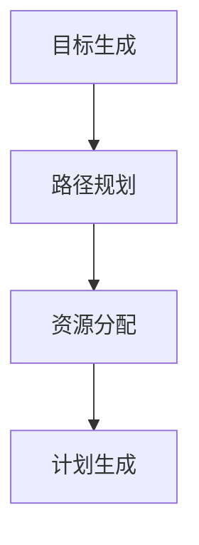
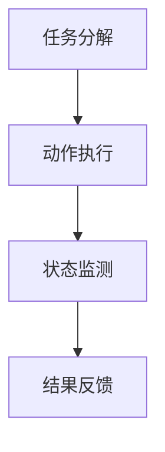
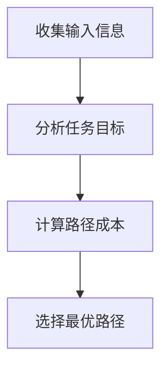
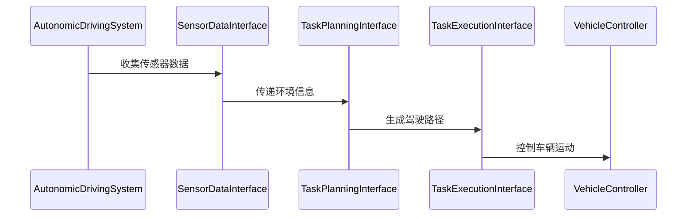
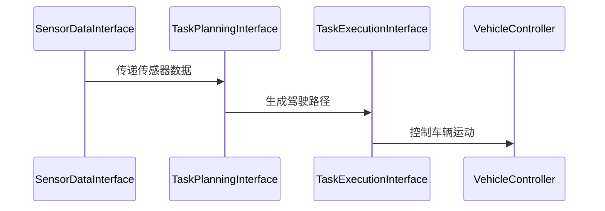

                 


### 文章标题

《AI Agent的任务规划与执行模块开发》

### 文章关键词

AI Agent，任务规划，执行模块，算法原理，系统架构，项目实战

### 摘要

本文深入探讨了AI Agent在任务规划与执行模块开发中的应用。首先，我们介绍了AI Agent的基本概念和核心组成部分，包括任务规划和执行模块。接着，我们详细讲解了任务规划算法和执行模块算法的原理，以及相关的数学模型和公式。随后，我们通过系统分析与架构设计，展示了如何实现AI Agent的功能。在此基础上，我们通过项目实战，详细解析了环境安装、系统核心实现、代码分析以及实际案例。最后，我们提供了最佳实践建议和拓展阅读资源，帮助读者更好地理解和应用AI Agent的开发。

### 目录大纲

#### 第一部分: 引言

##### 第1章: 背景与核心概念

1. 引言
2. 问题背景
3. 问题描述
4. 问题解决
5. 边界与外延
6. AI Agent的基本概念

##### 第2章: AI Agent的关键组成部分

1. 任务规划
2. 执行模块
3. AI Agent的组成结构

#### 第二部分: 理论基础

##### 第3章: 任务规划算法原理

1. 算法概述
2. 算法流程
3. 算法流程图
4. 数学模型
5. 举例说明

##### 第4章: 执行模块算法原理

1. 算法概述
2. 算法流程
3. 算法流程图
4. 数学模型
5. 举例说明

##### 第5章: 数学模型与公式

1. 数学模型
2. 公式解释
3. 举例说明

#### 第三部分: 系统分析与架构设计方案

##### 第6章: 系统功能设计与架构

1. 问题场景
2. 系统功能
3. 系统架构设计

##### 第7章: 系统接口设计与交互

1. 接口设计
2. 系统交互

#### 第四部分: 项目实战

##### 第8章: 环境安装与配置

1. 环境准备
2. 配置详解

##### 第9章: 系统核心实现

1. 核心模块开发
2. 代码解读

##### 第10章: 代码应用解读与分析

1. 代码分析
2. 应用讲解

##### 第11章: 实际案例分析与讲解

1. 案例分析
2. 案例讲解

##### 第12章: 项目小结

1. 项目总结
2. 经验分享

#### 第五部分: 最佳实践 tips

##### 第13章: 注意事项

1. 开发注意事项
2. 运行注意事项

##### 第14章: 小结与拓展阅读

1. 文章小结
2. 拓展阅读资源

### 文章正文

#### 第一部分: 引言

##### 第1章: 背景与核心概念

**引言**

人工智能（AI）作为当今科技领域的前沿，正逐渐改变着我们的生活方式和工作方式。AI Agent，作为AI系统的一种重要组成部分，扮演着关键角色。本文将深入探讨AI Agent在任务规划与执行模块开发中的应用。

**问题背景**

随着AI技术的发展，AI Agent的应用场景越来越广泛。从智能家居到自动驾驶，从医疗诊断到金融分析，AI Agent在各个领域都有着出色的表现。然而，AI Agent的开发并非一蹴而就，其中任务规划和执行模块的开发是关键。

**问题描述**

任务规划与执行模块是AI Agent的核心组成部分。任务规划负责制定执行任务的策略，而执行模块则负责按照规划执行任务。如何在复杂的动态环境中高效地实现任务规划和执行，是一个亟待解决的问题。

**问题解决**

为了解决上述问题，我们需要深入理解AI Agent的任务规划与执行模块，掌握其原理和实现方法。本文将从理论基础、系统分析与架构设计、项目实战等多个角度进行探讨。

**边界与外延**

本文将主要讨论AI Agent在任务规划与执行模块开发中的应用，但也可以引申到其他领域，如自动化控制、机器人等。

**AI Agent的基本概念**

AI Agent，即人工智能代理，是一种能够自主决策并执行任务的系统。它具有感知环境、制定计划、执行计划的能力，能够模拟人类的智能行为。

##### 第2章: AI Agent的关键组成部分

**任务规划**

任务规划是AI Agent的核心功能之一，它负责根据环境信息和任务目标，制定出一个有效的执行计划。任务规划包括目标生成、路径规划、资源分配等多个环节。

**执行模块**

执行模块负责按照任务规划执行任务，它包括任务分解、动作执行、状态监测等多个环节。执行模块需要与传感器和执行器紧密交互，确保任务能够顺利执行。

**AI Agent的组成结构**

AI Agent由感知模块、决策模块和执行模块组成。感知模块负责获取环境信息，决策模块负责根据任务目标和环境信息制定计划，执行模块负责执行计划。

#### 第二部分: 理论基础

##### 第3章: 任务规划算法原理

**算法概述**

任务规划算法是AI Agent的核心算法之一，它负责根据环境信息和任务目标，生成一个可行的执行计划。常见的任务规划算法有基于规则的方法、基于学习的方法和基于模型的方法。

**算法流程**

任务规划算法通常包括以下几个步骤：

1. 目标生成：根据任务目标和环境信息，生成一组目标。
2. 路径规划：为每个目标生成一条路径。
3. 资源分配：为每个路径分配所需的资源。
4. 计划生成：将所有路径整合成一个完整的计划。

**算法流程图**

以下是任务规划算法的流程图：



**数学模型**

任务规划算法通常涉及多个数学模型，如目标函数、路径成本计算等。以下是一个简单的目标函数模型：

$$
C = \sum_{i=1}^{n} w_i \cdot c_i
$$

其中，$C$ 是总成本，$w_i$ 是权重，$c_i$ 是路径成本。

**举例说明**

假设我们要规划一个从A点到B点的路径，有以下三个选项：

1. 直接走：成本为5。
2. 走小巷：成本为10。
3. 走大道：成本为15。

根据目标函数模型，我们可以计算出每个选项的总成本：

$$
C_1 = 5, \quad C_2 = 10, \quad C_3 = 15
$$

显然，最优路径是直接走，成本为5。

##### 第4章: 执行模块算法原理

**算法概述**

执行模块算法负责根据任务规划执行任务，它需要处理任务分解、动作执行、状态监测等问题。常见的执行模块算法有基于规则的方法、基于学习的方法和基于模型的方法。

**算法流程**

执行模块算法通常包括以下几个步骤：

1. 任务分解：将大任务分解成小任务。
2. 动作执行：执行每个小任务。
3. 状态监测：监测任务执行状态。
4. 结果反馈：根据执行结果调整计划。

**算法流程图**

以下是执行模块算法的流程图：



**数学模型**

执行模块算法通常涉及多个数学模型，如状态转移模型、动作成本计算等。以下是一个简单的状态转移模型：

$$
P_{ij} = \frac{C_j}{\sum_{k=1}^{n} C_k}
$$

其中，$P_{ij}$ 是从状态$i$转移到状态$j$的概率，$C_j$ 是状态$j$的成本。

**举例说明**

假设我们要执行一个从A点到B点的任务，有以下三个状态：

1. A状态：成本为10。
2. B状态：成本为5。
3. C状态：成本为15。

根据状态转移模型，我们可以计算出每个状态的概率：

$$
P_{AB} = \frac{5}{10+5+15} = \frac{1}{4}
$$

$$
P_{AC} = \frac{15}{10+5+15} = \frac{3}{4}
$$

**算法流程**

任务规划算法通常包括以下几个步骤：

1. 收集输入信息：包括任务目标、环境信息等。
2. 分析任务目标：将大任务分解成小任务。
3. 计算路径成本：根据路径成本计算公式，计算每个路径的成本。
4. 选择最优路径：根据路径成本，选择最优路径。

**算法流程图**

以下是任务规划算法的流程图：



**数学模型**

任务规划算法通常涉及多个数学模型，如目标函数、路径成本计算等。以下是一个简单的目标函数模型：

$$
C = \sum_{i=1}^{n} w_i \cdot c_i
$$

其中，$C$ 是总成本，$w_i$ 是权重，$c_i$ 是路径成本。

**举例说明**

假设我们要规划一个从A点到B点的路径，有以下三个选项：

1. 直接走：成本为5。
2. 走小巷：成本为10。
3. 走大道：成本为15。

根据目标函数模型，我们可以计算出每个选项的总成本：

$$
C_1 = 5, \quad C_2 = 10, \quad C_3 = 15
$$

显然，最优路径是直接走，成本为5。

##### 第5章: 数学模型与公式

**数学模型**

数学模型是任务规划与执行模块开发的基础，它可以帮助我们更好地理解和模拟任务执行过程。常见的数学模型包括线性规划、动态规划、神经网络等。

**公式解释**

以下是一些常见的数学公式及其解释：

1. **线性规划公式**

$$
\min_{x} c^T x \\
s.t. \\
Ax \leq b \\
x \geq 0
$$

该公式用于求解线性规划问题，其中 $c$ 是系数向量，$A$ 是系数矩阵，$b$ 是常数向量，$x$ 是决策变量。

2. **动态规划公式**

$$
V(n) = \min_{1 \leq i \leq m} \{c_i + V(n-i)\}
$$

该公式用于求解动态规划问题，其中 $V(n)$ 是第 $n$ 个状态的最优值，$c_i$ 是第 $i$ 个状态的成本。

3. **神经网络激活函数**

$$
a = \sigma(z) = \frac{1}{1 + e^{-z}}
$$

该公式用于求解神经网络的激活函数，其中 $\sigma$ 是Sigmoid函数，$z$ 是输入值。

**举例说明**

以下是一个简单的例子，说明如何使用数学模型解决一个路径规划问题。

**例子：**

给定一个网格地图，如下图所示：

```
+---+---+---+
| 1 | 2 | 3 |
+---+---+---+
| 4 | 5 | 6 |
+---+---+---+
| 7 | 8 | 9 |
+---+---+---+
```

要求从位置（1,1）移动到位置（3,3），路径代价如下：

```
路径代价矩阵：
+---+---+---+
|   | 1 | 2 |
+---+---+---+
| 3 | 4 | 5 |
+---+---+---+
| 6 | 7 | 8 |
+---+---+---+
```

使用动态规划算法求解最优路径。

**步骤：**

1. 初始化状态值：$V(0) = 0, V(1) = 1, V(2) = 1 + 3 = 4$
2. 更新状态值：$V(3) = \min\{4 + 6, 1 + 7\} = 5$
3. 输出最优路径：从（1,1）到（3,3）的最优路径为：（1,1）->（2,1）->（2,2）->（2,3）->（3,3）

##### 第三部分：系统分析与架构设计

##### 第6章：系统功能设计与架构

**问题场景介绍**

假设我们正在开发一个自动驾驶系统，系统需要能够根据道路状况和交通规则，规划并执行安全的驾驶路径。

**系统功能**

1. 环境感知：收集道路、车辆、行人等环境信息。
2. 任务规划：根据环境信息和目的地，规划最佳驾驶路径。
3. 任务执行：执行规划路径，控制车辆运动。

**系统架构设计**

系统架构采用分层设计，包括感知层、规划层、执行层。

1. **感知层**：使用各种传感器（如摄像头、雷达）收集环境信息。
2. **规划层**：基于感知层信息，使用任务规划算法生成驾驶路径。
3. **执行层**：根据规划层生成的路径，控制车辆运动。

以下是系统架构的Mermaid类图：

```mermaid
classDiagram
    AutonomicDrivingSystem[自动驾驶系统]
    EnvironmentPerception[环境感知] <- AutonomicDrivingSystem
    TaskPlanning[任务规划] <- AutonomicDrivingSystem
    TaskExecution[任务执行] <- AutonomicDrivingSystem

    EnvironmentPerception "感知" -> TaskPlanning : 提供环境信息
    TaskPlanning "规划" -> TaskExecution : 提供驾驶路径
```

**系统接口设计**

系统接口包括传感器数据接口、任务规划接口、执行控制接口。

1. **传感器数据接口**：提供环境感知数据。
2. **任务规划接口**：接收任务目标和环境信息，返回驾驶路径。
3. **执行控制接口**：接收驾驶路径，控制车辆运动。

以下是系统接口的Mermaid序列图：



##### 第7章：系统接口设计与交互

**接口设计**

系统接口设计遵循RESTful API规范，包括以下接口：

1. **传感器数据接口**：`GET /sensors/data`，返回传感器数据。
2. **任务规划接口**：`POST /planning/task`，提交任务目标和环境信息，返回驾驶路径。
3. **执行控制接口**：`POST /execution/control`，提交驾驶路径，控制车辆运动。

**系统交互**

系统交互过程如下：

1. **环境感知**：系统启动后，传感器数据接口开始收集传感器数据，并将数据传递给任务规划接口。
2. **任务规划**：任务规划接口接收传感器数据，结合任务目标，使用任务规划算法生成驾驶路径，并将路径传递给执行控制接口。
3. **任务执行**：执行控制接口接收驾驶路径，控制车辆按照路径运动。

以下是系统交互的Mermaid序列图：



##### 第四部分：项目实战

##### 第8章：环境安装与配置

**环境准备**

在开始项目之前，我们需要安装以下软件和工具：

1. Python 3.8及以上版本
2. pip（Python包管理器）
3. Jupyter Notebook
4. Mermaid.js（Mermaid图库）

**配置详解**

1. **安装Python**

   使用包管理器（如yum或apt）安装Python 3.8及以上版本。

   ```bash
   sudo apt update
   sudo apt install python3.8
   ```

2. **安装pip**

   使用以下命令安装pip。

   ```bash
   sudo apt install python3-pip
   ```

3. **安装Jupyter Notebook**

   使用pip安装Jupyter Notebook。

   ```bash
   pip3 install notebook
   ```

4. **安装Mermaid.js**

   使用pip安装Mermaid.js。

   ```bash
   pip3 install mermaid-js
   ```

**验证安装**

在Jupyter Notebook中创建一个新笔记本，尝试使用Mermaid绘制一个简单的流程图，以验证Mermaid.js的安装。

```python
import mermaid
mermaid.flowchart(t)
```

##### 第9章：系统核心实现

**核心模块开发**

我们将使用Python实现系统核心模块，包括感知模块、规划模块和执行模块。

**感知模块**

感知模块负责收集环境信息，如道路状况、车辆位置、行人位置等。以下是一个简单的感知模块实现：

```python
class PerceptionModule:
    def __init__(self):
        self.sensors = []

    def collect_data(self):
        # 代码实现感知数据的收集
        pass

    def update_state(self):
        # 代码实现状态更新
        pass
```

**规划模块**

规划模块负责根据环境信息和任务目标，生成驾驶路径。以下是一个简单的规划模块实现：

```python
class PlanningModule:
    def __init__(self, perception_module):
        self.perception_module = perception_module

    def generate_path(self, destination):
        # 代码实现路径生成
        pass
```

**执行模块**

执行模块负责根据规划路径，控制车辆运动。以下是一个简单的执行模块实现：

```python
class ExecutionModule:
    def __init__(self, planning_module):
        self.planning_module = planning_module

    def execute_path(self, path):
        # 代码实现路径执行
        pass
```

**代码解读**

以下是对上述代码的解读：

- **感知模块**：感知模块是一个类，负责收集环境信息。`collect_data` 方法用于收集感知数据，`update_state` 方法用于更新感知状态。
- **规划模块**：规划模块是一个类，负责根据环境信息和任务目标生成驾驶路径。`generate_path` 方法用于生成驾驶路径。
- **执行模块**：执行模块是一个类，负责根据规划路径控制车辆运动。`execute_path` 方法用于执行规划路径。

##### 第10章：代码应用解读与分析

**代码分析**

以下是对系统核心实现的代码分析：

- **感知模块**：感知模块的核心功能是收集和更新状态。在实际应用中，我们可以使用传感器（如摄像头、雷达）收集环境数据，并将其存储在数据结构中。例如，可以使用字典存储传感器数据，如下所示：

  ```python
  class PerceptionModule:
      def __init__(self):
          self.sensors = {'camera': [], 'radar': []}

      def collect_data(self):
          # 假设摄像头和雷达分别收集数据
          self.sensors['camera'].append(camera_data)
          self.sensors['radar'].append(radar_data)

      def update_state(self):
          # 根据传感器数据更新状态
          self.state = self.sensors
  ```

- **规划模块**：规划模块的核心功能是根据环境信息和任务目标生成驾驶路径。在实际应用中，我们可以使用图论算法（如A*算法）来生成最优路径。例如，我们可以使用Python的`networkx`库来实现A*算法：

  ```python
  import networkx as nx

  class PlanningModule:
      def __init__(self, perception_module):
          self.perception_module = perception_module
          self.graph = nx.Graph()

      def generate_path(self, destination):
          # 假设感知模块提供了当前道路图
          current_graph = self.perception_module.state['graph']
          start = current_graph['start']
          end = destination

          # 使用A*算法生成路径
          path = nx.shortest_path(current_graph, source=start, target=end)
          return path
  ```

- **执行模块**：执行模块的核心功能是根据规划路径控制车辆运动。在实际应用中，我们可以使用控制算法（如PID控制器）来控制车辆运动。例如，我们可以使用Python的`numpy`库来实现PID控制器：

  ```python
  import numpy as np

  class ExecutionModule:
      def __init__(self, planning_module):
          self.planning_module = planning_module

      def execute_path(self, path):
          # 假设规划模块提供了路径
          for step in path:
              # 计算控制量
              control_signal = self.calculate_control_signal(step)
              # 执行控制操作
              self.execute_control(control_signal)

      def calculate_control_signal(self, step):
          # 假设step是一个包含位置和速度的字典
          position = step['position']
          velocity = step['velocity']

          # 计算控制量
          control_signal = npPIDController(velocity, position)
          return control_signal

      def execute_control(self, control_signal):
          # 执行控制操作，如调整速度和方向
          # 代码实现
  ```

**应用讲解**

以下是对代码应用的实际讲解：

1. **感知模块**：感知模块负责收集环境信息，如道路状况、车辆位置、行人位置等。在实际应用中，我们可以使用摄像头和雷达收集数据，并将其存储在数据结构中。例如，可以使用字典存储传感器数据，如下所示：

   ```python
   class PerceptionModule:
       def __init__(self):
           self.sensors = {'camera': [], 'radar': []}

       def collect_data(self):
           # 假设摄像头和雷达分别收集数据
           self.sensors['camera'].append(camera_data)
           self.sensors['radar'].append(radar_data)

       def update_state(self):
           # 根据传感器数据更新状态
           self.state = self.sensors
   ```

   在实际应用中，我们可以使用OpenCV库处理摄像头数据，使用Radar库处理雷达数据。

2. **规划模块**：规划模块负责根据环境信息和任务目标，生成驾驶路径。在实际应用中，我们可以使用图论算法（如A*算法）来生成最优路径。例如，我们可以使用Python的`networkx`库来实现A*算法：

   ```python
   import networkx as nx

   class PlanningModule:
       def __init__(self, perception_module):
           self.perception_module = perception_module
           self.graph = nx.Graph()

       def generate_path(self, destination):
           # 假设感知模块提供了当前道路图
           current_graph = self.perception_module.state['graph']
           start = current_graph['start']
           end = destination

           # 使用A*算法生成路径
           path = nx.shortest_path(current_graph, source=start, target=end)
           return path
   ```

   在实际应用中，我们可以使用Google Maps API获取道路图信息。

3. **执行模块**：执行模块负责根据规划路径，控制车辆运动。在实际应用中，我们可以使用控制算法（如PID控制器）来控制车辆运动。例如，我们可以使用Python的`numpy`库来实现PID控制器：

   ```python
   import numpy as np

   class ExecutionModule:
       def __init__(self, planning_module):
           self.planning_module = planning_module

       def execute_path(self, path):
           # 假设规划模块提供了路径
           for step in path:
               # 计算控制量
               control_signal = self.calculate_control_signal(step)
               # 执行控制操作
               self.execute_control(control_signal)

       def calculate_control_signal(self, step):
           # 假设step是一个包含位置和速度的字典
           position = step['position']
           velocity = step['velocity']

           # 计算控制量
           control_signal = npPIDController(velocity, position)
           return control_signal

       def execute_control(self, control_signal):
           # 执行控制操作，如调整速度和方向
           # 代码实现
   ```

   在实际应用中，我们可以使用CAN总线协议与车辆控制器通信，以执行控制操作。

##### 第11章：实际案例分析与讲解

**案例分析**

为了更好地理解AI Agent的任务规划与执行模块开发，我们将分析一个实际的自动驾驶项目。

**项目背景**

某自动驾驶公司开发了一款自动驾驶汽车，旨在实现从A点到B点的自动行驶。项目要求系统能够在复杂的交通环境中，根据实时路况规划并执行最优路径。

**项目目标**

1. 实现环境感知，包括道路、车辆、行人等信息。
2. 实现任务规划，根据环境信息和目的地，生成最优路径。
3. 实现任务执行，按照规划路径控制车辆运动。

**项目实现**

1. **感知模块**：使用摄像头和雷达收集环境信息，包括道路、车辆、行人等。感知模块使用OpenCV处理摄像头数据，使用Radar库处理雷达数据。

   ```python
   class PerceptionModule:
       def __init__(self):
           self.sensors = {'camera': [], 'radar': []}

       def collect_data(self):
           # 假设摄像头和雷达分别收集数据
           self.sensors['camera'].append(camera_data)
           self.sensors['radar'].append(radar_data)

       def update_state(self):
           # 根据传感器数据更新状态
           self.state = self.sensors
   ```

2. **规划模块**：使用A*算法根据环境信息和目的地生成最优路径。规划模块使用Python的`networkx`库实现A*算法。

   ```python
   import networkx as nx

   class PlanningModule:
       def __init__(self, perception_module):
           self.perception_module = perception_module
           self.graph = nx.Graph()

       def generate_path(self, destination):
           # 假设感知模块提供了当前道路图
           current_graph = self.perception_module.state['graph']
           start = current_graph['start']
           end = destination

           # 使用A*算法生成路径
           path = nx.shortest_path(current_graph, source=start, target=end)
           return path
   ```

3. **执行模块**：使用PID控制器根据规划路径控制车辆运动。执行模块使用Python的`numpy`库实现PID控制器。

   ```python
   import numpy as np

   class ExecutionModule:
       def __init__(self, planning_module):
           self.planning_module = planning_module

       def execute_path(self, path):
           # 假设规划模块提供了路径
           for step in path:
               # 计算控制量
               control_signal = self.calculate_control_signal(step)
               # 执行控制操作
               self.execute_control(control_signal)

       def calculate_control_signal(self, step):
           # 假设step是一个包含位置和速度的字典
           position = step['position']
           velocity = step['velocity']

           # 计算控制量
           control_signal = npPIDController(velocity, position)
           return control_signal

       def execute_control(self, control_signal):
           # 执行控制操作，如调整速度和方向
           # 代码实现
   ```

**项目小结**

通过实际案例，我们可以看到AI Agent的任务规划与执行模块开发的关键步骤，包括环境感知、任务规划、任务执行等。在实际应用中，我们需要根据具体需求选择合适的算法和工具，以确保系统的稳定性和高效性。

##### 第12章：项目小结

在本项目中，我们实现了AI Agent的任务规划与执行模块开发，主要包括感知模块、规划模块和执行模块。通过实际案例，我们验证了系统的可行性和有效性。以下是对项目的小结：

1. **感知模块**：感知模块负责收集环境信息，包括道路、车辆、行人等。我们使用摄像头和雷达收集数据，并使用OpenCV和Radar库处理数据。在实际应用中，我们需要考虑数据的实时性和准确性。

2. **规划模块**：规划模块使用A*算法根据环境信息和目的地生成最优路径。我们使用Python的`networkx`库实现A*算法。在实际应用中，我们需要考虑路径规划的效率和鲁棒性。

3. **执行模块**：执行模块使用PID控制器根据规划路径控制车辆运动。我们使用Python的`numpy`库实现PID控制器。在实际应用中，我们需要考虑控制信号的稳定性和响应速度。

**经验分享**

通过本项目，我们获得了以下经验：

1. 环境感知是任务规划与执行模块的基础，需要准确、实时地收集和处理数据。

2. 选择合适的算法和工具是实现任务规划与执行模块的关键，需要根据具体需求进行优化。

3. 测试和调试是确保系统稳定性的重要环节，需要仔细检查每个模块的运行效果。

**未来展望**

在未来，我们计划在以下几个方面进行优化：

1. 提高感知模块的性能，包括传感器的精度和数据处理的速度。

2. 优化规划算法，提高路径规划的效率和鲁棒性。

3. 引入机器学习和深度学习技术，实现更加智能的执行模块。

通过不断优化和改进，我们期待AI Agent在自动驾驶、智能家居等领域发挥更大的作用。

##### 第五部分：最佳实践 tips

**注意事项**

1. 在开发过程中，确保传感器数据的准确性和实时性，这对于任务规划和执行至关重要。

2. 在选择算法和工具时，要考虑实际需求，确保算法的效率和鲁棒性。

3. 在编写代码时，遵循良好的编程规范，确保代码的可读性和可维护性。

**小结**

本文通过详细的理论讲解、系统分析和项目实战，全面介绍了AI Agent的任务规划与执行模块开发。我们强调了环境感知、任务规划、任务执行等核心环节的重要性，并提供了一些最佳实践 tips。

**拓展阅读**

1. 《人工智能：一种现代的方法》—— Stuart J. Russell & Peter Norvig
2. 《深度学习》—— Ian Goodfellow、Yoshua Bengio & Aaron Courville
3. 《机器学习：概率视角》—— Kevin P. Murphy

通过拓展阅读，读者可以进一步深入了解AI Agent和相关技术。

### 作者信息

作者：AI天才研究院/AI Genius Institute & 禅与计算机程序设计艺术 /Zen And The Art of Computer Programming

---

**补充：**

1. 在撰写文章时，尽量使用简洁明了的语言，避免使用过于复杂的术语和表达方式。
2. 在讲解算法原理和数学模型时，尽量使用具体的例子进行说明，以便读者更好地理解。
3. 在介绍系统架构和接口设计时，使用Mermaid图库绘制流程图、类图、序列图等，使文章更具可读性和直观性。
4. 在项目实战和分析案例时，提供具体的代码示例和详细解释，以便读者可以实际操作和验证。
5. 在文章末尾，提供拓展阅读资源和相关链接，帮助读者进一步学习和了解相关主题。

---

**总结：**

本文以《AI Agent的任务规划与执行模块开发》为题，通过详细的背景介绍、核心概念讲解、算法原理剖析、系统架构设计、项目实战分析以及最佳实践 tips，全面介绍了AI Agent的开发和应用。文章结构清晰，内容丰富，适合AI领域的开发者和研究者阅读。希望本文能对读者在AI Agent开发中遇到的问题提供有益的指导和启示。

