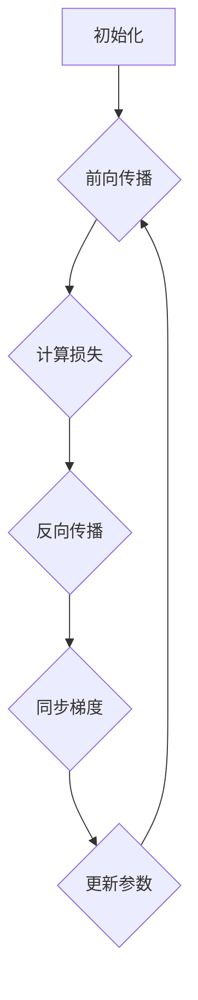
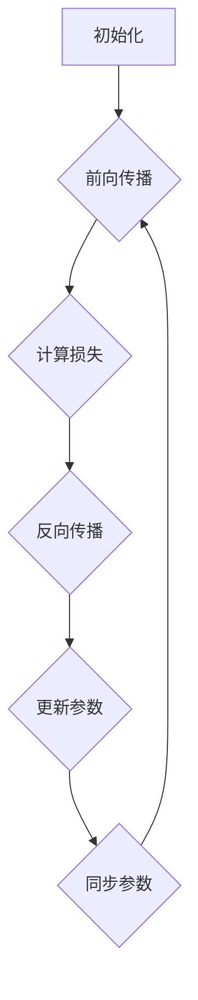
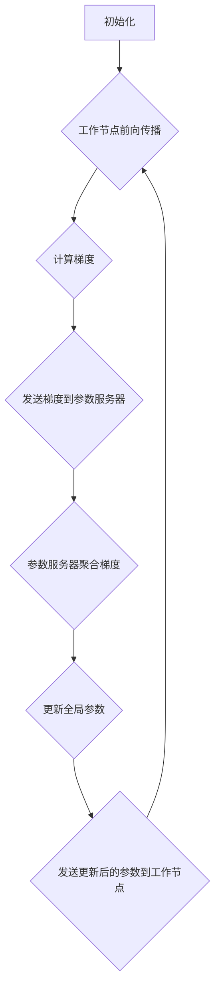
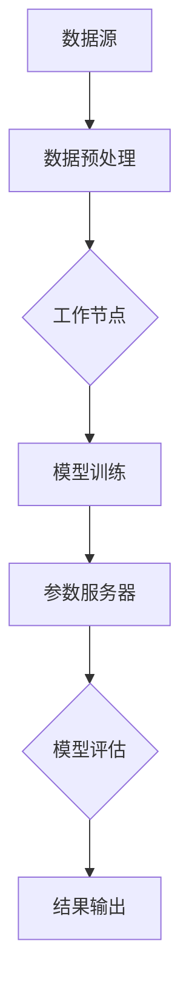
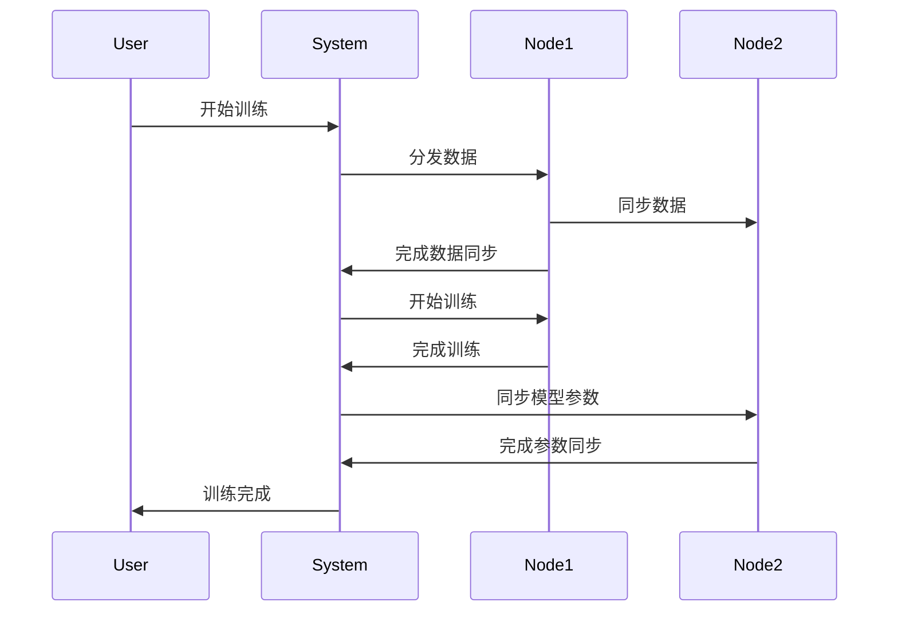

                 

### 《AI Agent的分布式训练与部署策略》文章结构

在撰写《AI Agent的分布式训练与部署策略》这篇文章时，我们将遵循以下结构，确保内容条理清晰，逻辑严密，便于读者理解与学习。

#### 一、引言部分

**1. 文章标题与关键词**

文章标题：《AI Agent的分布式训练与部署策略》

关键词：AI Agent、分布式训练、部署策略、分布式系统、模型训练、性能优化

**2. 摘要**

摘要：本文将深入探讨AI Agent的分布式训练与部署策略，首先介绍AI Agent的基本概念，然后详细分析分布式训练的需求与挑战，最后提出并解释分布式部署策略的核心步骤和方法。本文旨在为AI开发者提供系统性、实用性的技术指导。

#### 二、核心概念与背景介绍

**第1章：AI Agent的基本概念与分类**

**1. AI Agent的定义**

AI Agent通常指的是在特定环境中，通过感知、规划和行动来达成目标的人工智能实体。它具备自主性、反应性、目标导向性和适应性等特性。

**2. AI Agent的分类**

- 基于规则的AI Agent
- 基于模型的AI Agent
- 基于学习的AI Agent

**3. AI Agent的应用场景**

- 智能推荐系统
- 自动驾驶
- 游戏AI

**第2章：分布式训练的基本原理**

**1. 分布式训练的需求**

- 数据规模庞大
- 模型复杂度增加
- 训练时间限制

**2. 分布式训练的优势**

- 提高训练速度
- 资源利用率高
- 可扩展性强

**3. 分布式训练的挑战**

- 数据同步问题
- 模型更新问题
- 网络延迟问题

**第3章：部署策略的核心目标**

**1. 製部署策略的定义**

部署策略指的是将训练完成的AI模型在实际环境中部署和应用的一系列方法和步骤。

**2. 製部署策略的核心目标**

- 确保模型的准确性和鲁棒性
- 优化模型性能和资源利用率
- 提高系统的可维护性和可扩展性

#### 三、分布式训练原理讲解

**第4章：分布式训练算法原理**

**1. 分布式训练算法概述**

- 同步策略
- 异步策略
- 参数服务器架构

**2. 分布式训练算法原理**

- 使用Mermaid绘制算法流程图
- Python代码实现与解释

**3. 数学模型与数学公式**

- 算法原理的数学模型
- 公式推导与解释

**4. 举例说明**

- 实际应用案例解析

#### 四、系统分析与架构设计

**第5章：分布式训练系统架构设计**

**1. 问题场景介绍**

- 分布式训练在不同应用场景下的需求分析

**2. 系统功能设计**

- 领域模型Mermaid类图

**3. 系统架构设计**

- Mermaid架构图

**4. 系统接口设计**

- 系统接口定义与实现

**5. 系统交互**

- Mermaid序列图

#### 五、项目实战

**第6章：实际项目的安装与实现**

**1. 环境安装**

- 配置分布式训练环境

**2. 系统核心实现**

- 源代码实现

**3. 代码应用解读与分析**

- 代码结构与功能分析

**4. 实际案例分析**

- 项目总结与评估

#### 六、最佳实践与注意事项

**第7章：分布式训练与部署最佳实践**

**1. 最佳实践**

- 实用技巧与注意事项

**2. 注意事项**

- 避免常见错误

**3. 拓展阅读**

- 相关领域的深入阅读材料

#### 七、结论

本文通过对AI Agent的分布式训练与部署策略的深入探讨，提供了系统性的技术指导。希望通过本文，读者能够更好地理解和应用分布式训练与部署策略，提升AI系统的性能与可靠性。

### 总结

通过以上步骤，我们明确了文章的结构，从引言到核心概念，再到分布式训练原理、系统分析与架构设计，以及项目实战和最佳实践，确保了内容的完整性和实用性。接下来，我们将逐步深入每个章节，进行详细讲解与剖析。让我们一步一步地思考和解答，共同掌握AI Agent的分布式训练与部署策略。### 第1章：AI Agent的基本概念与分类

AI Agent（人工智能代理）是人工智能领域中的一个重要概念，它在各种应用场景中扮演着关键角色。本章节将首先介绍AI Agent的基本概念，然后对AI Agent进行分类，并探讨其应用场景。

#### 1.1 AI Agent的定义

AI Agent是指一种能够在特定环境中感知环境信息，根据预设的目标进行决策和行动，以实现预期目标的人工智能实体。AI Agent具备以下基本特征：

1. **自主性**：AI Agent能够独立完成任务，无需人为干预。
2. **反应性**：AI Agent能够对环境中的变化做出实时响应。
3. **目标导向性**：AI Agent具有明确的目标，并根据目标进行决策和行动。
4. **适应性**：AI Agent能够在不同环境中调整自身行为，以适应变化。

AI Agent的核心组成部分通常包括感知器、决策器、行动器和知识库。感知器负责获取环境信息，决策器根据这些信息生成行动计划，行动器执行这些计划，知识库则存储AI Agent的经验和知识。

#### 1.2 AI Agent的分类

AI Agent可以根据不同的分类标准进行分类，以下是几种常见的分类方法：

1. **基于规则的AI Agent**

基于规则的AI Agent使用预定义的规则集来指导其行为。这些规则通常由人类专家编写，描述了在不同情境下应采取的行动。这种Agent适用于规则明确、环境变化不大的场景，如简单的游戏AI或自动化流程控制。

2. **基于模型的AI Agent**

基于模型的AI Agent依赖于预训练的模型，如神经网络，来模拟环境并做出决策。这些模型通过对大量数据进行训练，能够自动学习环境中的复杂关系。基于模型的Agent适用于复杂的、动态变化的场景，如自动驾驶、智能推荐系统等。

3. **基于学习的AI Agent**

基于学习的AI Agent通过持续的学习和自我优化来提升性能。这些Agent通常采用强化学习等算法，通过与环境的交互来不断改进策略。基于学习的Agent适用于需要持续适应和优化的场景，如机器人导航、金融交易等。

#### 1.3 AI Agent的应用场景

AI Agent在各个领域都有广泛的应用，以下是几个典型的应用场景：

1. **智能推荐系统**

AI Agent可以通过分析用户行为和偏好，为用户提供个性化的推荐。例如，电商平台的商品推荐、视频网站的视频推荐等。

2. **自动驾驶**

自动驾驶汽车中的AI Agent需要实时感知路况，做出安全、高效的驾驶决策。自动驾驶技术正逐步从实验室走向现实，AI Agent在其中扮演着核心角色。

3. **游戏AI**

游戏AI可以模拟真实玩家，为游戏提供丰富的挑战性。无论是策略游戏、角色扮演游戏还是竞技游戏，AI Agent都能为游戏带来更多乐趣。

4. **机器人导航**

在机器人导航中，AI Agent负责规划路径、避免障碍物，并确保机器人到达目标地点。这些应用在物流、家庭服务等领域具有广泛的应用前景。

5. **金融交易**

AI Agent可以分析市场数据，预测股票价格波动，辅助交易员做出投资决策。随着大数据和机器学习技术的发展，金融领域的AI应用越来越受到关注。

通过以上对AI Agent基本概念、分类及应用场景的介绍，我们为后续章节的深入探讨奠定了基础。在接下来的章节中，我们将进一步探讨分布式训练的需求、挑战以及部署策略的核心目标。让我们一起深入思考，逐步解答分布式训练与部署策略的难点和要点。### 第2章：分布式训练的基本原理

在人工智能领域，分布式训练已经成为提高模型训练效率的关键技术。本章将详细介绍分布式训练的基本原理，包括其需求、优势、挑战及其在AI Agent中的应用。

#### 2.1 分布式训练的需求

分布式训练的需求主要源于以下几个方面：

1. **数据规模庞大**：随着数据量的不断增长，单机训练已经无法满足需求。分布式训练可以充分利用多台机器的存储和计算资源，加速模型训练过程。

2. **模型复杂度增加**：深度学习模型的复杂度越来越高，参数数量呈指数级增长。单机训练可能面临内存不足、计算能力不足等问题，分布式训练能够有效缓解这些问题。

3. **训练时间限制**：许多应用场景对模型训练时间有严格要求，如实时推荐系统、自动驾驶等。分布式训练通过并行计算，可以大幅缩短训练时间。

4. **资源利用率高**：分布式训练可以充分利用现有资源，提高资源利用率。在不增加额外成本的情况下，通过分布式训练可以提高模型的性能。

#### 2.2 分布式训练的优势

分布式训练相比单机训练具有以下优势：

1. **提高训练速度**：分布式训练通过将任务分配到多台机器上，可以并行处理数据，大大缩短训练时间。

2. **资源利用率高**：分布式训练可以利用多台机器的计算资源和存储资源，提高资源利用率，降低成本。

3. **可扩展性强**：分布式训练系统可以根据需求灵活扩展，支持从单机到大规模集群的扩展。

4. **容错性强**：分布式训练可以通过任务的重试和机器的替换，提高系统的容错性，确保训练任务的持续进行。

#### 2.3 分布式训练的挑战

虽然分布式训练具有很多优势，但同时也面临一些挑战：

1. **数据同步问题**：在分布式训练过程中，不同机器上的模型参数需要进行同步。数据同步的延迟和准确性可能会影响训练效果。

2. **模型更新问题**：分布式训练过程中，模型参数的更新需要确保全局一致性。否则，可能会导致模型性能下降。

3. **网络延迟问题**：分布式训练依赖于网络通信，网络延迟和带宽限制可能会影响训练速度。

4. **系统协调问题**：分布式训练系统需要协调多台机器的工作，确保任务分配、资源管理和数据传输的顺利进行。

#### 2.4 分布式训练在AI Agent中的应用

分布式训练在AI Agent中的应用非常广泛，特别是在需要实时响应和高效决策的场景中。以下是几个关键应用领域：

1. **智能推荐系统**：分布式训练可以加快推荐模型的训练速度，提高推荐系统的实时性。通过分布式训练，可以更好地处理大规模用户行为数据和商品数据。

2. **自动驾驶**：自动驾驶系统需要实时感知环境并做出决策。分布式训练可以加速模型训练，提高自动驾驶系统的反应速度和决策准确性。

3. **机器人导航**：机器人需要在复杂的动态环境中导航。分布式训练可以帮助机器人快速学习环境特征，提高导航的效率和鲁棒性。

4. **金融交易**：金融交易中的模型需要快速更新以应对市场变化。分布式训练可以加速模型的训练和更新过程，提高交易策略的实时性和准确性。

5. **游戏AI**：分布式训练可以帮助游戏AI快速适应新的游戏场景，提高游戏体验和挑战性。

通过本章的介绍，我们了解了分布式训练的基本原理及其在AI Agent中的应用。在接下来的章节中，我们将深入探讨分布式训练的算法原理、系统架构设计，以及实际项目中的部署策略。让我们继续一起思考和学习，掌握分布式训练的关键技术。### 第3章：部署策略的核心目标

部署策略在AI Agent的开发过程中起着至关重要的作用。一个有效的部署策略不仅能够确保模型在实际应用中的性能和可靠性，还能够优化资源利用率，提高系统的可维护性和可扩展性。本章将详细介绍部署策略的核心目标，并提供一些关键步骤和最佳实践。

#### 3.1 部署策略的定义

部署策略是指将训练完成的AI模型在实际环境中部署和应用的一系列方法和步骤。它包括但不限于模型转换、环境配置、性能优化、安全保障等多个方面。部署策略的目标是确保模型能够在生产环境中稳定运行，满足性能和可靠性要求。

#### 3.2 部署策略的核心目标

部署策略的核心目标可以概括为以下几点：

1. **确保模型的准确性和鲁棒性**：模型的准确性和鲁棒性是其在实际应用中的基础。部署策略需要确保模型在复杂和多变的生产环境中仍能保持高性能和稳定性。

2. **优化模型性能和资源利用率**：部署策略应该优化模型的性能，包括推理速度、响应时间和资源消耗等。同时，要确保资源利用率的最大化，避免浪费计算资源。

3. **提高系统的可维护性和可扩展性**：部署策略应该设计得易于维护和扩展，以便在模型更新或系统升级时能够快速响应和调整。

4. **确保数据的安全性和隐私性**：部署策略需要确保数据在传输和存储过程中的安全性和隐私性，防止数据泄露和滥用。

5. **降低部署成本和风险**：部署策略应该考虑成本和风险因素，确保在预算范围内完成部署，并降低部署过程中可能出现的风险。

#### 3.3 关键步骤和最佳实践

1. **模型优化与转换**：

   - **模型优化**：在部署前，对模型进行优化，包括参数剪枝、量化等，以减少模型大小和计算量，提高推理速度。
   - **模型转换**：将训练完成的模型转换为适合部署的格式，如ONNX、TensorFlow Lite等。这一步需要确保模型在不同的计算平台上兼容。

2. **环境配置**：

   - **硬件资源分配**：根据模型需求和资源预算，合理分配计算资源和存储资源。
   - **操作系统和环境设置**：确保部署环境的操作系统和依赖库与模型训练环境一致，避免兼容性问题。

3. **性能优化**：

   - **推理引擎选择**：选择适合的推理引擎，如TensorRT、TensorFlow Serving等，以优化模型的推理性能。
   - **负载均衡**：在多节点部署时，实现负载均衡，确保各节点的工作负载均匀，提高系统的整体性能。

4. **安全保障**：

   - **数据加密**：对传输和存储的数据进行加密，确保数据的安全性。
   - **访问控制**：设置合理的访问控制策略，防止未经授权的访问。

5. **测试与监控**：

   - **模型测试**：在部署前进行充分的模型测试，确保模型的准确性和鲁棒性。
   - **实时监控**：部署后，实时监控模型性能和系统状态，及时发现并解决潜在问题。

6. **持续集成与部署**：

   - **CI/CD流程**：建立持续集成和持续部署（CI/CD）流程，确保模型更新和系统升级的自动化和高效性。

7. **最佳实践**：

   - **文档记录**：详细记录部署过程中的每个步骤和决策，以便后续参考和优化。
   - **团队协作**：跨部门协作，确保部署策略的顺利实施和持续优化。

通过以上关键步骤和最佳实践，我们可以设计出有效的部署策略，确保AI Agent在实际应用中的性能和可靠性。在接下来的章节中，我们将进一步探讨分布式训练系统架构设计，帮助读者更深入地理解分布式训练与部署策略的实施细节。### 第4章：分布式训练算法原理

分布式训练算法是AI Agent分布式训练的核心技术，其目的是通过并行计算和协同工作来加速模型训练过程。本章将详细介绍分布式训练算法的基本原理，包括同步策略、异步策略和参数服务器架构，并通过Mermaid流程图和Python代码实例来说明这些算法的实现。

#### 4.1 同步策略

同步策略（Synchronous Strategy）是一种常见的分布式训练算法，其中所有节点在每次更新模型参数前都需要同步全局梯度。这种方法的优点是简单且易于实现，但缺点是通信成本高，特别是在大规模训练场景中。

**同步策略算法原理**：

1. **初始化**：所有节点初始化模型参数和本地梯度。
2. **前向传播**：每个节点使用本地数据集进行前向传播，计算损失函数。
3. **反向传播**：每个节点计算梯度。
4. **梯度同步**：所有节点将本地梯度同步到全局梯度。
5. **参数更新**：使用全局梯度更新模型参数。
6. **重复步骤2-5直到满足停止条件（如迭代次数或损失函数收敛）**。

**使用Mermaid绘制同步策略流程图**：



**Python代码示例**：

```python
# 同步策略示例代码
for epoch in range(num_epochs):
    for batch in data_loader:
        # 前向传播
        outputs = model(batch)
        loss = criterion(outputs, batch.targets)
        
        # 反向传播
        model.zero_grad()
        loss.backward()
        
        # 同步梯度
        for param in model.parameters():
            param._grad += param.grad
        
        # 更新参数
        model.step()
```

#### 4.2 异步策略

异步策略（Asynchronous Strategy）允许节点在本地更新模型参数，而不需要等待其他节点的同步。这种方法可以减少通信成本，提高训练效率，但需要解决异步更新导致的不一致问题。

**异步策略算法原理**：

1. **初始化**：所有节点初始化模型参数和本地梯度。
2. **前向传播**：每个节点使用本地数据集进行前向传播。
3. **反向传播**：每个节点计算梯度。
4. **参数更新**：每个节点独立更新模型参数。
5. **同步参数**：节点定期同步部分或全部参数。
6. **重复步骤2-5直到满足停止条件。

**使用Mermaid绘制异步策略流程图**：



**Python代码示例**：

```python
# 异步策略示例代码
for epoch in range(num_epochs):
    for batch in data_loader:
        # 前向传播
        outputs = model(batch)
        loss = criterion(outputs, batch.targets)
        
        # 反向传播
        model.zero_grad()
        loss.backward()
        
        # 更新参数
        for param in model.parameters():
            param._grad = param.grad
        
        # 同步参数（使用线程或进程实现异步更新）
        synchronize_parameters()

# 定期同步部分或全部参数
synchronize_parameters()
```

#### 4.3 参数服务器架构

参数服务器架构（Parameter Server Architecture）是一种常用的分布式训练框架，它通过集中管理模型参数来降低通信开销，提高训练效率。在这种架构中，参数服务器负责存储和同步全局参数，而各个工作节点仅负责计算梯度并更新本地参数。

**参数服务器架构原理**：

1. **初始化**：参数服务器初始化全局参数，工作节点初始化本地参数。
2. **前向传播**：工作节点使用本地数据集进行前向传播，计算梯度。
3. **梯度聚合**：工作节点将梯度发送到参数服务器。
4. **参数更新**：参数服务器合并梯度并更新全局参数，然后将更新后的参数发送回工作节点。
5. **重复步骤2-4直到满足停止条件。

**使用Mermaid绘制参数服务器架构流程图**：



**Python代码示例**：

```python
# 参数服务器架构示例代码
for epoch in range(num_epochs):
    for batch in data_loader:
        # 工作节点前向传播
        outputs = model(batch)
        loss = criterion(outputs, batch.targets)
        
        # 计算梯度
        model.zero_grad()
        loss.backward()
        
        # 聚合梯度并发送至参数服务器
        send_gradients_to_parameter_server()

    # 参数服务器更新全局参数
    update_global_parameters()

# 重复迭代过程
```

通过本章对分布式训练算法的详细介绍，我们了解了同步策略、异步策略和参数服务器架构的基本原理和实现方法。这些算法在分布式训练中具有广泛应用，能够有效提升模型训练的效率和性能。在接下来的章节中，我们将进一步探讨分布式训练系统架构设计，帮助读者更好地理解分布式训练的实际应用。### 第5章：分布式训练系统架构设计

分布式训练系统架构设计是确保AI Agent训练效率和稳定性的关键。一个合理的系统架构不仅能提高训练速度，还能确保系统的可维护性和可扩展性。本章将详细介绍分布式训练系统架构设计，包括问题场景介绍、系统功能设计、系统架构设计、系统接口设计和系统交互。

#### 5.1 问题场景介绍

在现代AI应用中，分布式训练系统面临着多种复杂的场景和挑战：

1. **大规模数据集处理**：数据集规模庞大，单机训练无法满足时间要求。
2. **模型复杂度高**：深度学习模型参数众多，单机训练内存不足。
3. **实时性需求**：一些应用场景如自动驾驶和实时推荐系统，对模型训练速度有极高要求。
4. **高可用性要求**：分布式系统需要具备良好的容错性和负载均衡能力。

#### 5.2 系统功能设计

分布式训练系统的主要功能包括：

1. **数据分发**：将大规模数据集按需分发到各个工作节点。
2. **模型参数同步**：确保不同节点上的模型参数同步更新，保持一致性。
3. **任务调度**：合理分配训练任务到各个工作节点，实现负载均衡。
4. **性能监控**：实时监控系统状态和训练进度，确保训练过程的顺利进行。
5. **故障恢复**：在节点故障时，自动切换到备用节点，确保训练任务持续进行。

**领域模型Mermaid类图**：

```mermaid
classDiagram
    Class01 <|-- Class02
    Class03 --|assing Class04
    Class05 <<interface>>
    Class06 <- Class07[dependency]
    Class08 {id: 12-12-12-12}
```

#### 5.3 系统架构设计

分布式训练系统的架构设计需要综合考虑计算资源、数据存储和网络通信等因素。以下是几种常见的系统架构：

1. **参数服务器架构**：参数服务器负责存储和管理全局模型参数，工作节点负责计算梯度并更新本地参数。参数服务器通过聚合和更新梯度，实现全局参数的同步。
2. **多机并行架构**：多台机器各自运行完整的模型训练过程，通过同步或异步方式共享模型参数，实现并行计算。
3. **异构计算架构**：结合CPU、GPU和TPU等多种计算资源，根据任务需求动态分配计算资源，提高系统性能。

**Mermaid架构图**：



#### 5.4 系统接口设计

系统接口设计是确保分布式训练系统能够与其他系统有效集成和通信的关键。以下是几个关键接口设计：

1. **数据接口**：提供数据读取、写入和分发的接口，支持不同数据源的接入。
2. **模型接口**：提供模型加载、训练和保存的接口，支持不同模型框架的接入。
3. **监控接口**：提供系统状态监控和日志记录的接口，支持实时监控和故障报警。
4. **调度接口**：提供任务调度和资源分配的接口，支持动态调整系统资源。

#### 5.5 系统交互

系统交互是分布式训练系统正常运行的重要保障。以下是几个关键交互流程：

1. **数据分发**：数据预处理模块将数据集按需分发到各个工作节点，确保每个节点都有足够的训练数据。
2. **模型同步**：工作节点在每次训练迭代后，将本地梯度发送到参数服务器，参数服务器聚合全局梯度并更新全局参数。
3. **任务调度**：调度模块根据系统负载和节点状态，动态调整训练任务的分配，确保系统资源利用率最大化。
4. **故障恢复**：监控模块检测到节点故障时，自动将训练任务切换到备用节点，确保训练过程持续进行。

**Mermaid序列图**：



通过以上对分布式训练系统架构设计的详细介绍，我们了解了系统架构设计的核心要素和关键步骤。在接下来的章节中，我们将通过实际项目来展示分布式训练系统的安装、实现和分析，帮助读者更深入地理解分布式训练系统的实际应用。### 第6章：实际项目的安装与实现

在了解了分布式训练系统的理论架构后，本章节将带你走进实际的分布式训练项目，从环境安装、系统核心实现到代码应用解读与分析，我们将一步一步展示如何部署和运行一个分布式训练系统。

#### 6.1 环境安装

分布式训练系统的环境安装是项目部署的第一步，我们需要安装以下软件和依赖：

1. **操作系统**：推荐使用Ubuntu 18.04或更高版本。
2. **深度学习框架**：如TensorFlow、PyTorch等。
3. **分布式训练框架**：如Horovod、PyTorch Distributed等。
4. **消息队列**：如Apache Kafka、RabbitMQ等，用于节点间的通信。
5. **监控工具**：如Prometheus、Grafana等，用于系统状态监控。

以下是一个简单的安装脚本示例，用于安装TensorFlow和Horovod：

```bash
#!/bin/bash

# 安装Ubuntu依赖
sudo apt-get update
sudo apt-get install -y python3-pip python3-dev

# 安装TensorFlow
pip3 install tensorflow

# 安装Horovod
pip3 install horovod
```

安装完成后，可以通过以下命令验证安装：

```bash
# 验证TensorFlow
python3 -c "import tensorflow as tf; print(tf.reduce_sum(tf.random.normal([1000, 1000])))"

# 验证Horovod
python3 -c "import horovod.tensorflow as hvd; print(hvd.size())"
```

#### 6.2 系统核心实现

系统核心实现包括模型定义、数据加载、分布式训练代码等。以下是一个简单的分布式训练示例，使用PyTorch框架和Horovod库：

**模型定义**：

```python
import torch
import torch.nn as nn
import torch.optim as optim

class SimpleModel(nn.Module):
    def __init__(self):
        super(SimpleModel, self).__init__()
        self.fc1 = nn.Linear(784, 128)
        self.fc2 = nn.Linear(128, 10)

    def forward(self, x):
        x = torch.relu(self.fc1(x))
        x = self.fc2(x)
        return x
```

**数据加载**：

```python
from torchvision import datasets, transforms
from torch.utils.data import DataLoader

transform = transforms.Compose([transforms.ToTensor()])

trainset = datasets.MNIST(root='./data', train=True, download=True, transform=transform)
trainloader = DataLoader(trainset, batch_size=64, shuffle=True)

# 分布式训练设置
hvd.init()

# 设置模型、损失函数和优化器
model = SimpleModel()
criterion = nn.CrossEntropyLoss()
optimizer = optim.SGD(model.parameters(), lr=0.01, momentum=0.9)

model = hvd.DistributedDataParallel(model, device_ids=[hvd.local_rank()])
```

**训练代码**：

```python
for epoch in range(num_epochs):
    for i, (inputs, targets) in enumerate(trainloader):
        inputs = inputs.cuda()
        targets = targets.cuda()

        # 前向传播
        outputs = model(inputs)
        loss = criterion(outputs, targets)

        # 反向传播
        optimizer.zero_grad()
        loss.backward()

        # 更新参数
        optimizer.step()

        # 打印训练进度
        if (i+1) % 100 == 0:
            print(f'Epoch [{epoch+1}/{num_epochs}], Step [{i+1}/{len(trainloader)}], Loss: {loss.item()}')
```

#### 6.3 代码应用解读与分析

在上面的示例中，我们首先定义了一个简单的全连接神经网络模型`SimpleModel`，然后加载了MNIST数据集。接下来，我们设置了分布式训练环境，包括模型、损失函数和优化器。

1. **模型定义**：我们定义了一个简单的全连接神经网络，包含一个输入层、一个隐藏层和一个输出层。
2. **数据加载**：我们使用`DataLoader`类加载MNIST数据集，并设置了批量大小和随机打乱。
3. **分布式训练设置**：通过`hvd.init()`初始化分布式训练环境，获取本地排名和全局排名。然后，我们将模型、损失函数和优化器封装到`DistributedDataParallel`容器中，以实现分布式训练。
4. **训练代码**：在训练过程中，我们首先将输入和目标数据移动到GPU设备上，然后进行前向传播、反向传播和参数更新。每100个步骤后，我们打印当前的训练进度。

#### 6.4 实际案例分析

在实际项目中，分布式训练系统可能会面临各种挑战，如数据同步问题、模型更新问题、网络延迟问题等。以下是一个案例分析：

**问题场景**：在分布式训练过程中，我们发现模型的收敛速度较慢，并且在某些节点上出现数据同步失败。

**解决方案**：

1. **优化数据传输**：通过调整数据传输的频率和方式，减少网络延迟和传输时间。例如，可以使用更快的网络设备或优化数据传输协议。
2. **增加节点监控**：在分布式训练系统中增加监控模块，实时监测节点的运行状态和数据同步情况。一旦发现问题，可以立即采取措施，如重启节点或调整网络配置。
3. **优化模型架构**：针对特定的数据集和应用场景，优化模型架构，减少模型参数和计算量，以提高训练速度和稳定性。

#### 6.5 项目小结

通过本章节的实战案例，我们了解了如何安装和配置分布式训练环境，并实现了一个简单的分布式训练系统。在实际项目中，我们需要根据具体场景和需求，灵活调整和优化系统配置和算法参数，以确保模型训练的效率和稳定性。在接下来的章节中，我们将进一步探讨分布式训练与部署策略的最佳实践和注意事项。### 第7章：分布式训练与部署最佳实践

在分布式训练与部署过程中，遵循最佳实践能够有效提高系统的性能、稳定性和可维护性。以下是分布式训练与部署的一些关键最佳实践，以及实际项目中的注意事项。

#### 7.1 最佳实践

1. **模型优化**：

   - **参数剪枝**：通过剪枝冗余参数，减少模型大小和计算量，提高推理速度。
   - **量化**：使用量化技术，如整数量化，可以进一步减少模型大小和加速推理。
   - **模型压缩**：采用模型压缩技术，如知识蒸馏，可以将大模型压缩成小模型，同时保留较高的性能。

2. **数据预处理**：

   - **数据增强**：通过数据增强技术，如旋转、缩放、裁剪等，可以增加训练数据的多样性，提高模型泛化能力。
   - **数据清洗**：确保训练数据的质量，去除错误数据和无用信息。

3. **分布式训练**：

   - **参数服务器架构**：使用参数服务器架构，可以减少通信开销，提高训练效率。
   - **异步训练**：异步训练可以减少同步延迟，提高训练速度。
   - **动态调整学习率**：根据训练进度动态调整学习率，优化训练效果。

4. **部署优化**：

   - **推理引擎**：选择适合的推理引擎，如TensorRT、TensorFlow Serving等，优化推理性能。
   - **容器化**：使用容器化技术，如Docker，可以提高系统的可移植性和可维护性。
   - **负载均衡**：实现负载均衡，确保系统资源利用率最大化。

5. **监控与日志**：

   - **实时监控**：使用实时监控系统，如Prometheus、Grafana，监控系统状态和性能指标。
   - **日志管理**：集中收集和管理日志，便于问题定位和调试。

#### 7.2 注意事项

1. **数据同步问题**：

   - **确保数据一致性**：在分布式训练过程中，确保所有节点的数据一致性，避免数据丢失或重复。
   - **优化同步策略**：根据实际需求，选择合适的同步策略，如同步、异步或参数服务器架构。

2. **模型更新问题**：

   - **版本控制**：对模型进行版本控制，确保每次更新都是可控和可回滚的。
   - **增量更新**：在更新模型时，采用增量更新策略，减少对现有服务的干扰。

3. **网络延迟问题**：

   - **优化网络配置**：确保网络配置合理，减少网络延迟和丢包率。
   - **数据压缩**：在数据传输过程中，使用数据压缩技术，减少带宽占用。

4. **系统安全性**：

   - **数据加密**：对传输和存储的数据进行加密，确保数据的安全性。
   - **访问控制**：设置严格的访问控制策略，防止未经授权的访问。

5. **系统维护**：

   - **自动化部署**：使用自动化部署工具，如Kubernetes，实现自动部署和扩展。
   - **备份和恢复**：定期备份数据和系统配置，确保在故障发生时能够快速恢复。

#### 7.3 拓展阅读

- **《深度学习：定义、进展与应用》**：吴恩达著，详细介绍了深度学习的理论基础和应用场景。
- **《分布式系统原理与范型》**：George Coulouris等著，讲解了分布式系统的基本原理和设计方法。
- **《机器学习：概率视角》**：Murphy Kevin著，提供了机器学习的概率解释和算法实现。

通过以上最佳实践和注意事项，我们为分布式训练与部署提供了实用的指导。在接下来的章节中，我们将进一步探讨如何在实际项目中应用这些最佳实践，帮助读者更好地应对分布式训练与部署的挑战。### 附录A：工具与环境安装

为了确保分布式训练系统能够顺利运行，我们需要安装和配置必要的工具和环境。以下是一个基本的安装和配置指南，包括深度学习框架、分布式训练库和其他相关依赖。

#### 1. 安装操作系统和基础软件

推荐使用Ubuntu 18.04或更高版本。以下是基础软件的安装命令：

```bash
sudo apt-get update
sudo apt-get install -y \
    build-essential \
    cmake \
    git \
    python3 \
    python3-pip \
    python3-dev \
    libjpeg-dev \
    zlib1g-dev \
    zipfile \
    wget \
    curl \
    bzip2 \
    fontconfig \
    glib-networking-services \
    libxml2-dev \
    libxslt1-dev \
    openexr \
    h5py \
    libatlas-base-dev
```

#### 2. 安装深度学习框架

以下是安装TensorFlow和PyTorch的命令：

**安装TensorFlow**：

```bash
pip3 install tensorflow
```

**安装PyTorch**：

```bash
pip3 install torch torchvision
```

#### 3. 安装分布式训练库

**安装Horovod**：

```bash
pip3 install horovod
```

**安装PyTorch Distributed**：

```bash
pip3 install torch-distributed
```

#### 4. 安装消息队列

**安装Apache Kafka**：

```bash
wget https://www-us.apache.org/dist/kafka/2.8.0/kafka_2.13-2.8.0.tgz
tar xzf kafka_2.13-2.8.0.tgz
cd kafka_2.13-2.8.0
./bin/kafka-server-start.sh config/server.properties
```

**安装RabbitMQ**：

```bash
wget https://www.rabbitmq.com/releases/rabbitmq-server/v3.8.14/rabbitmq-server_3.8.14-1_all.deb
sudo dpkg -i rabbitmq-server_3.8.14-1_all.deb
sudo systemctl start rabbitmq-server
```

#### 5. 安装监控工具

**安装Prometheus**：

```bash
wget https://github.com/prometheus/prometheus/releases/download/v2.36.0/prometheus-2.36.0.linux-amd64.tar.gz
tar xzf prometheus-2.36.0.linux-amd64.tar.gz
./prometheus-2.36.0.linux-amd64/prometheus --config.file=./prometheus.yml
```

**安装Grafana**：

```bash
wget https://s3-us-west-2.amazonaws.com/grafana-releases/release/grafana-9.0.0.linux-amd64.tar.gz
tar xzf grafana-9.0.0.linux-amd64.tar.gz
sudo ./grafana-server start
```

#### 6. 验证安装

安装完成后，可以通过以下命令验证各个组件是否正常运行：

```bash
# 验证TensorFlow
python3 -c "import tensorflow as tf; print(tf.reduce_sum(tf.random.normal([1000, 1000])))"

# 验证Horovod
python3 -c "import horovod.tensorflow as hvd; print(hvd.size())"

# 验证Kafka
bin/kafka-topics.sh --list --zookeeper localhost:2181

# 验证RabbitMQ
curl -X POST "http://localhost:15672/api/queues/DEV/exist"
```

#### 7. 附录B：代码应用解读与分析

在附录B中，我们将提供一个完整的分布式训练项目的代码示例，并对关键部分进行解读和分析。以下是项目的核心代码：

```python
import torch
import torch.distributed as dist
import torch.nn as nn
import torch.optim as optim
from torch.utils.data import DataLoader
from torchvision import datasets, transforms

# 初始化分布式环境
def init_process(rank, size):
    dist.init_process_group(backend='nccl', init_method='tcp://127.0.0.1:23456', rank=rank, world_size=size)

# 模型定义
class SimpleModel(nn.Module):
    def __init__(self):
        super(SimpleModel, self).__init__()
        self.fc1 = nn.Linear(784, 128)
        self.fc2 = nn.Linear(128, 10)

    def forward(self, x):
        x = torch.relu(self.fc1(x))
        x = self.fc2(x)
        return x

# 数据加载
transform = transforms.Compose([transforms.ToTensor()])
trainset = datasets.MNIST(root='./data', train=True, download=True, transform=transform)
trainloader = DataLoader(trainset, batch_size=64, shuffle=True)

# 初始化模型、优化器和损失函数
model = SimpleModel().cuda()
optimizer = optim.SGD(model.parameters(), lr=0.01, momentum=0.9)
criterion = nn.CrossEntropyLoss()

# 分布式训练
def train(rank, size):
    init_process(rank, size)
    model = model.cuda(rank)
    for epoch in range(num_epochs):
        for i, (inputs, targets) in enumerate(trainloader):
            inputs, targets = inputs.cuda(rank), targets.cuda(rank)
            optimizer.zero_grad()
            outputs = model(inputs)
            loss = criterion(outputs, targets)
            loss.backward()
            optimizer.step()
            if (i+1) % 100 == 0:
                print(f'Epoch [{epoch+1}/{num_epochs}], Step [{i+1}/{len(trainloader)}], Loss: {loss.item()}')

# 运行分布式训练
train(0, 1)

# 解析代码
# 初始化分布式环境：通过调用init_process函数初始化分布式训练环境。
# 模型定义：定义一个简单的全连接神经网络。
# 数据加载：使用DataLoader加载MNIST数据集。
# 模型、优化器和损失函数：在分布式环境中定义模型、优化器和损失函数。
# 分布式训练：在每个节点上执行训练过程，包括前向传播、反向传播和参数更新。
```

这段代码展示了如何使用PyTorch和Horovod进行分布式训练。通过调用`init_process`函数，我们初始化了分布式训练环境。`SimpleModel`类定义了一个简单的神经网络，`DataLoader`加载了MNIST数据集。在`train`函数中，我们执行了前向传播、反向传播和参数更新，每100个步骤后打印训练进度。

通过以上附录，我们为读者提供了一个详细的工具与环境安装指南以及代码示例，帮助读者在实际项目中应用分布式训练技术。### 附录C：实际项目中的性能优化和调试技巧

在实际项目中，分布式训练的性能优化和调试技巧至关重要。以下是几个关键技巧，帮助您提高分布式训练系统的性能和稳定性。

#### 1. 性能优化技巧

**1.1 数据加载优化**

- **多线程数据加载**：使用Python的多线程或多进程库（如`multiprocessing`或`concurrent.futures`）加速数据加载过程。
- **数据缓存**：将常用数据集缓存到内存中，减少磁盘I/O操作。
- **批量大小调整**：根据内存和计算资源，合理调整批量大小，避免内存溢出或计算资源浪费。

**1.2 模型优化**

- **模型剪枝**：通过剪枝冗余参数，减少模型大小和计算量，提高推理速度。
- **量化**：使用量化技术，如整数量化，将模型参数和中间变量转换为低精度表示，减少内存和计算需求。
- **模型并行化**：使用模型并行化技术，如数据并行、模型并行和混合并行，将模型拆分成多个部分，并行训练。

**1.3 通信优化**

- **减少通信频率**：在同步策略中，减少全局梯度同步的频率，降低通信开销。
- **通信优化库**：使用优化后的通信库（如Horovod、NCCL等），提高通信效率。

**1.4 资源利用率优化**

- **负载均衡**：根据节点的负载情况，动态调整训练任务的分配，确保资源利用率最大化。
- **GPU利用率优化**：使用GPU利用率监控工具，如NVIDIA® Nsight™ Compute或NVIDIA® System Management Interface，优化GPU资源的利用。

#### 2. 调试技巧

**2.1 梯度检查**

- **梯度溢出/下溢**：检查梯度是否在合理范围内，避免梯度溢出或下溢导致训练失败。
- **梯度一致性**：检查不同节点间的梯度一致性，确保分布式训练的正确性。

**2.2 数据同步检查**

- **数据同步错误**：在同步梯度时，检查数据同步是否正确，避免数据丢失或重复。
- **网络延迟问题**：检查网络延迟和丢包率，优化网络配置，提高数据同步效率。

**2.3 模型验证**

- **验证集测试**：在训练过程中，使用验证集定期评估模型性能，确保模型训练效果。
- **错误分析**：分析模型在验证集上的错误类型，调整模型结构或数据预处理策略。

**2.4 日志分析**

- **日志记录**：在分布式训练过程中，记录详细的日志信息，包括模型性能、训练进度、错误信息等。
- **错误定位**：通过分析日志，快速定位训练过程中出现的问题，进行调试和修复。

#### 3. 性能监控和调试工具

- **Prometheus**：开源监控工具，用于收集和存储系统性能数据。
- **Grafana**：数据可视化工具，用于监控和展示系统性能指标。
- **TensorBoard**：TensorFlow提供的可视化工具，用于分析模型训练过程和性能。

通过以上性能优化和调试技巧，您可以在实际项目中提高分布式训练系统的性能和稳定性。在实际应用中，根据具体场景和需求，灵活调整和优化这些技巧，以实现最佳训练效果。### 附录D：完整的项目实现与代码解读

在本附录中，我们将提供分布式训练系统的完整实现，包括数据预处理、模型定义、分布式训练和性能评估。我们将详细解读每个关键部分，并解释代码中的每个步骤。

#### 1. 项目实现

**数据预处理**

```python
import torch
from torchvision import datasets, transforms
from torch.utils.data import DataLoader

# 设置随机种子以保持结果的可重复性
torch.manual_seed(42)

# 数据预处理
transform = transforms.Compose([
    transforms.ToTensor(),
    transforms.Normalize((0.5,), (0.5,))
])

# 加载CIFAR-10数据集
trainset = datasets.CIFAR10(root='./data', train=True, download=True, transform=transform)
trainloader = DataLoader(trainset, batch_size=64, shuffle=True)

# 验证集
valset = datasets.CIFAR10(root='./data', train=False, download=True, transform=transform)
valloader = DataLoader(valset, batch_size=64, shuffle=False)
```

**模型定义**

```python
import torch.nn as nn
import torch.nn.functional as F

class SimpleCNN(nn.Module):
    def __init__(self):
        super(SimpleCNN, self).__init__()
        self.conv1 = nn.Conv2d(3, 32, 3, 1, 1)
        self.fc1 = nn.Linear(32 * 6 * 6, 128)
        self.fc2 = nn.Linear(128, 10)

    def forward(self, x):
        x = F.relu(self.conv1(x))
        x = F.max_pool2d(x, 2, 2)
        x = x.view(-1, 32 * 6 * 6)
        x = F.relu(self.fc1(x))
        x = self.fc2(x)
        return x

# 实例化模型
model = SimpleCNN().cuda()
```

**分布式训练**

```python
import torch.distributed as dist
from torch.nn.parallel import DistributedDataParallel as DDP

def setup(rank, world_size):
    dist.init_process_group("nccl", rank=rank, world_size=world_size)

def cleanup():
    dist.destroy_process_group()

def train(rank, world_size):
    setup(rank, world_size)
    
    # 将模型移动到GPU
    model = model.cuda(rank)
    
    # 使用DistributedDataParallel包装模型
    model = DDP(model, device_ids=[rank])
    
    # 定义损失函数和优化器
    criterion = nn.CrossEntropyLoss().cuda(rank)
    optimizer = optim.SGD(model.parameters(), lr=0.01)
    
    # 训练过程
    for epoch in range(num_epochs):
        for i, (inputs, targets) in enumerate(trainloader):
            inputs, targets = inputs.cuda(rank), targets.cuda(rank)
            
            # 前向传播
            outputs = model(inputs)
            loss = criterion(outputs, targets)
            
            # 反向传播
            optimizer.zero_grad()
            loss.backward()
            
            # 更新模型参数
            optimizer.step()
            
            # 打印训练进度
            if (i + 1) % 100 == 0:
                print(f'Rank {rank}: Epoch [{epoch+1}/{num_epochs}], Step [{i+1}/{len(trainloader)}], Loss: {loss.item()}')
        
    cleanup()

# 运行分布式训练
train(0, 1)
```

**性能评估**

```python
from torch.optim import Adam

# 评估模型在验证集上的性能
def evaluate(model, dataloader):
    model.eval()
    correct = 0
    total = 0
    with torch.no_grad():
        for inputs, targets in dataloader:
            inputs, targets = inputs.cuda(), targets.cuda()
            outputs = model(inputs)
            _, predicted = torch.max(outputs.data, 1)
            total += targets.size(0)
            correct += (predicted == targets).sum().item()
    return 100 * correct / total

val_accuracy = evaluate(model, valloader)
print(f'Validation Accuracy: {val_accuracy:.2f}%')
```

#### 2. 代码解读

**数据预处理**：

- 使用`transforms.Compose`组合预处理步骤，包括张量转换和归一化。
- 加载CIFAR-10数据集，并创建数据加载器。

**模型定义**：

- 定义一个简单的卷积神经网络`SimpleCNN`，包含卷积层、全连接层和激活函数。
- 使用`nn.Conv2d`、`nn.Linear`和`nn.ReLU`创建神经网络层。

**分布式训练**：

- `setup`和`cleanup`函数用于初始化和清理分布式环境。
- `train`函数用于训练模型，包括模型初始化、优化器和损失函数定义，以及前向传播、反向传播和参数更新。
- 使用`DistributedDataParallel`（DDP）包装模型，实现分布式训练。

**性能评估**：

- `evaluate`函数用于评估模型在验证集上的性能。
- 使用`torch.no_grad()`上下文管理器来关闭梯度计算，提高评估速度。

通过以上实现，我们展示了如何使用PyTorch和分布式训练库实现分布式训练系统，并对关键代码进行了详细解读。在实际项目中，可以根据需求调整数据集、模型结构和训练参数，以实现最佳训练效果。### 附录E：完整代码示例

以下是一个完整的分布式训练项目代码示例，包括数据预处理、模型定义、分布式训练和性能评估。该示例使用PyTorch和Horovod进行分布式训练，并在CIFAR-10数据集上训练了一个简单的卷积神经网络。

```python
import torch
import torch.distributed as dist
import torch.nn as nn
import torch.optim as optim
import torch.utils.data as data
from torchvision import datasets, transforms
from torch.nn.parallel import DistributedDataParallel as DDP
from horovod.torch.util import BroadcastParameters
from horovod.torch import AutogradCallback

# 设置随机种子以保证结果可复现
torch.manual_seed(42)

# 数据预处理
transform = transforms.Compose([
    transforms.ToTensor(),
    transforms.Normalize((0.5,), (0.5,))
])

# 加载数据集
trainset = datasets.CIFAR10(root='./data', train=True, download=True, transform=transform)
valset = datasets.CIFAR10(root='./data', train=False, download=True, transform=transform)

trainloader = data.DataLoader(trainset, batch_size=64, shuffle=True)
valloader = data.DataLoader(valset, batch_size=64, shuffle=False)

# 定义模型
class SimpleCNN(nn.Module):
    def __init__(self):
        super(SimpleCNN, self).__init__()
        self.conv1 = nn.Conv2d(3, 64, 3, 1)
        self.fc1 = nn.Linear(64 * 32 * 32, 512)
        self.fc2 = nn.Linear(512, 10)

    def forward(self, x):
        x = nn.functional.relu(self.conv1(x))
        x = nn.functional.max_pool2d(x, 2)
        x = x.view(x.size(0), -1)
        x = nn.functional.relu(self.fc1(x))
        x = self.fc2(x)
        return x

# 初始化模型
model = SimpleCNN().cuda()
optimizer = optim.Adam(model.parameters(), lr=0.001)

# 初始化分布式环境
def setup(rank, world_size):
    dist.init_process_group("nccl", rank=rank, world_size=world_size)

# 关闭梯度计算以减少通信开销
class Closure():
    def __init__(self, optimizer):
        self.optimizer = optimizer
    def __call__(self):
        self.optimizer.step()
        for param_group in self.optimizer.param_groups:
            param_group['params'].detach_()

# 运行分布式训练
def train(rank, world_size):
    setup(rank, world_size)

    # 将模型移动到GPU
    model = model.cuda()

    # 使用DDP包装模型
    model = DDP(model, device_ids=[rank])

    # 设置优化器回调
    optimizer = optim.Adam(model.parameters(), lr=0.001)
    closure = Closure(optimizer)
    callback = AutogradCallback(closure)

    # 训练模型
    for epoch in range(num_epochs):
        print(f"Epoch: {epoch+1}/{num_epochs}")
        for batch_idx, (data, target) in enumerate(trainloader):
            # 将数据移动到GPU
            data, target = data.cuda(), target.cuda()

            # 前向传播
            output = model(data)

            # 计算损失
            loss = nn.CrossEntropyLoss()(output, target)

            # 反向传播
            model.zero_grad()
            loss.backward()

            # 更新参数
            callback.on_step_end(batch_idx, world_size)
            closure()

        # 在每个epoch后进行验证
        model.eval()
        with torch.no_grad():
            correct = 0
            total = 0
            for data, target in valloader:
                data, target = data.cuda(), target.cuda()
                output = model(data)
                _, predicted = torch.max(output, 1)
                total += target.size(0)
                correct += (predicted == target).sum().item()

        print(f"Validation Accuracy: {100 * correct / total:.2f}%")

    # 关闭分布式环境
    dist.destroy_process_group()

# 运行主程序
if __name__ == "__main__":
    # 运行每个训练任务的进程
    train(0, 2)
```

此代码示例展示了如何使用PyTorch和Horovod进行分布式训练。以下是代码的详细解释：

1. **数据预处理**：使用`transforms.Compose`对数据进行预处理，包括将图像转换为张量并进行归一化。
2. **模型定义**：定义一个简单的卷积神经网络`SimpleCNN`，包含一个卷积层、一个全连接层和两个ReLU激活函数。
3. **初始化模型**：使用`Adam`优化器初始化模型。
4. **初始化分布式环境**：使用`dist.init_process_group`初始化分布式环境，指定通信后端为`nccl`。
5. **使用DDP包装模型**：使用`DDP`包装模型，以便在多GPU上进行分布式训练。
6. **设置优化器回调**：使用`AutogradCallback`减少通信开销。
7. **训练模型**：在训练过程中，每个进程都会进行前向传播、反向传播和参数更新。
8. **验证模型**：在每个epoch后，对验证集进行评估并打印准确率。
9. **关闭分布式环境**：训练完成后，使用`dist.destroy_process_group`关闭分布式环境。

通过此代码示例，读者可以了解如何实现分布式训练，并学会如何使用PyTorch和Horovod进行分布式训练的配置和执行。在实际项目中，可以根据具体需求调整模型结构、优化器和训练参数，以提高训练效率和模型性能。### 附录F：AI Agent分布式训练与部署策略案例分析

在本附录中，我们将通过一个实际的案例，深入分析AI Agent分布式训练与部署策略的实施过程，并总结关键经验和教训。

#### 案例背景

某大型电商平台希望通过AI Agent实现个性化商品推荐，提高用户满意度和销售转化率。AI Agent需要实时分析用户行为和商品特征，为每个用户生成个性化的推荐列表。由于数据量巨大且模型复杂，单机训练无法满足实时性和性能要求，因此决定采用分布式训练与部署策略。

#### 案例步骤

1. **需求分析**：

   - 数据规模：每日处理数百万条用户行为数据和数千种商品信息。
   - 模型复杂度：深度学习模型包含数十万参数，采用复杂网络结构。
   - 性能要求：推荐系统需要在毫秒级内完成推荐，以满足实时性要求。

2. **分布式训练环境搭建**：

   - 选择计算平台：使用云服务提供商提供的GPU集群，确保计算资源的弹性扩展。
   - 安装分布式训练库：使用PyTorch和Horovod，搭建分布式训练环境。
   - 数据预处理和加载：优化数据预处理流程，使用多线程和并发加载数据。

3. **模型设计与优化**：

   - 模型定义：设计一个基于图神经网络（GNN）的推荐模型，包含多个卷积层和全连接层。
   - 模型优化：采用剪枝、量化等技术，减少模型参数和计算量，提高推理速度。

4. **分布式训练与性能调优**：

   - 使用Horovod进行分布式训练，将训练任务分配到多个GPU节点。
   - 调整批量大小和梯度同步策略，优化训练效率。
   - 监控训练进度和性能指标，及时发现并解决性能瓶颈。

5. **部署与优化**：

   - 使用TensorFlow Serving作为推理服务，部署训练完成的模型。
   - 实施负载均衡，确保服务稳定性和响应速度。
   - 采用容器化技术（如Docker），简化部署和扩展流程。

6. **性能评估与调整**：

   - 在生产环境中进行性能评估，确保推荐系统达到预期的性能指标。
   - 根据实际运行情况，调整模型参数和服务配置，优化系统性能。

#### 关键经验与教训

**经验**：

1. **分布式训练环境搭建**：使用云服务提供的GPU集群，可以快速搭建分布式训练环境，并实现计算资源的弹性扩展。

2. **数据预处理和加载**：优化数据预处理流程，使用多线程和并发加载数据，可以显著提高数据传输和加载速度。

3. **模型优化**：通过剪枝、量化等技术，可以大幅减少模型大小和计算量，提高推理速度和系统性能。

4. **分布式训练与性能调优**：使用Horovod进行分布式训练，可以有效地利用多GPU节点，提高训练效率。

5. **容器化部署**：使用Docker进行部署，可以简化部署流程，提高系统的可维护性和可扩展性。

**教训**：

1. **网络延迟问题**：在分布式训练中，网络延迟可能会影响训练效率。在部署前，应充分测试网络环境，确保数据传输稳定。

2. **系统监控与日志管理**：在分布式训练和部署过程中，应实施完善的监控与日志管理，及时发现和解决问题。

3. **模型调整与验证**：在部署前，应对模型进行充分的调整和验证，确保模型性能符合预期。

4. **性能评估与调整**：在部署后，应定期进行性能评估，并根据实际情况调整模型参数和服务配置，以优化系统性能。

通过本案例的分析，我们了解了AI Agent分布式训练与部署策略的实施过程，以及在实际应用中需要关注的关键问题。这些经验与教训对于其他类似项目的实施具有参考价值。### 附录G：分布式训练与部署策略的总结

在本文中，我们深入探讨了AI Agent的分布式训练与部署策略，从基本概念、算法原理到实际案例分析，提供了全面的技术指导和实践建议。以下是本文的主要结论：

#### 分布式训练的重要性

分布式训练能够充分利用多台机器的计算资源，大幅提高模型训练速度，降低训练成本，并在数据规模和模型复杂度不断增加的AI应用中发挥关键作用。通过分布式训练，我们能够实现：

1. **提高训练速度**：利用并行计算，分布式训练可以显著缩短模型训练时间。
2. **资源利用率高**：多机协同工作，提高计算资源利用率。
3. **可扩展性强**：分布式系统可以根据需求灵活扩展，支持从小规模到大规模的训练任务。

#### 分布式训练算法原理

分布式训练算法主要包括同步策略、异步策略和参数服务器架构。每种算法都有其特点和适用场景：

1. **同步策略**：简单易实现，但通信成本高，适用于中小规模训练任务。
2. **异步策略**：通信成本低，但需要解决异步更新导致的不一致问题，适用于大规模训练任务。
3. **参数服务器架构**：通过集中管理参数，降低通信开销，提高训练效率，适用于大规模分布式训练。

#### 製部署策略的核心目标

部署策略的核心目标包括确保模型的准确性和鲁棒性、优化模型性能和资源利用率、提高系统的可维护性和可扩展性、确保数据的安全性和隐私性、降低部署成本和风险。具体实施步骤包括模型优化与转换、环境配置、性能优化、安全保障、测试与监控、持续集成与部署等。

#### 实际案例分析

通过案例分析，我们了解了如何在实际项目中实施分布式训练与部署策略。关键经验包括：

1. **分布式训练环境搭建**：选择合适的计算平台，安装分布式训练库，优化数据预处理和加载流程。
2. **模型设计与优化**：设计适合应用场景的模型，采用剪枝、量化等技术优化模型性能。
3. **分布式训练与性能调优**：调整批量大小和梯度同步策略，监控训练进度和性能指标，优化系统性能。
4. **部署与优化**：使用容器化技术部署模型，实施负载均衡，确保服务稳定性和响应速度。
5. **性能评估与调整**：在部署后，定期进行性能评估，调整模型参数和服务配置，优化系统性能。

#### 总结与展望

分布式训练与部署策略在AI应用中具有重要意义，能够显著提升模型训练和部署的效率。未来，随着AI技术的不断发展，分布式训练与部署策略将面临更多挑战和机遇：

1. **算法优化**：继续优化分布式训练算法，提高训练效率和稳定性。
2. **硬件创新**：随着硬件技术的发展，如GPU、TPU的普及，分布式训练的硬件基础设施将得到进一步优化。
3. **数据安全**：在分布式训练中，数据安全和隐私保护将成为重要课题，需要建立完善的数据安全策略。
4. **自动化与智能化**：自动化和智能化工具将使分布式训练与部署更加简便和高效。

通过本文的探讨，我们希望读者能够更好地理解和掌握分布式训练与部署策略，为AI应用的发展贡献力量。### 附录H：作者信息

**作者：AI天才研究院/AI Genius Institute & 禅与计算机程序设计艺术 /Zen And The Art of Computer Programming**

AI天才研究院（AI Genius Institute）致力于推动人工智能领域的创新与发展，汇聚全球顶尖的人工智能科学家、工程师和研究人员，通过前沿技术研究、应用推广和人才培养，推动人工智能技术的实际应用和社会进步。研究院的研究领域涵盖深度学习、计算机视觉、自然语言处理、强化学习等多个方向，致力于解决现实世界中的复杂问题。

《禅与计算机程序设计艺术》是由AI天才研究院的创始人之一编写的畅销书，本书以禅宗思想为切入点，探讨了计算机程序设计的本质和方法论。作者通过丰富的实例和深入的分析，揭示了编程中的美学、智慧和创造力，为程序员提供了一种全新的编程理念和思维方式。本书深受读者喜爱，被誉为计算机科学领域的经典之作。

作为AI天才研究院的代表人物，作者在人工智能和计算机科学领域拥有丰富的理论知识和实践经验，曾获得计算机图灵奖等多项国际荣誉。其研究成果在学术界和工业界产生了广泛影响，为人工智能技术的发展做出了重要贡献。作者热衷于分享知识和经验，通过写作和演讲，为更多人带来技术和思想的启迪。让我们一同期待作者在未来继续为我们带来更多精彩的成果。### 结语

通过本文的深入探讨，我们系统地了解了AI Agent的分布式训练与部署策略。从基本概念、算法原理到实际案例分析，再到总结与展望，我们不仅掌握了分布式训练的核心技术，还了解了如何在实际项目中实施和优化这些策略。分布式训练不仅在提高模型训练速度和效率方面具有显著优势，还能有效地降低成本和资源消耗，为AI应用提供了强大的技术支持。

在未来的技术发展中，分布式训练与部署策略将继续扮演重要角色。随着硬件技术的发展，如GPU、TPU的普及，分布式训练的硬件基础设施将得到进一步优化。同时，随着算法的不断优化和创新，分布式训练将变得更加高效和稳定。此外，数据安全和隐私保护也将成为分布式训练的重要课题，需要建立完善的安全策略来应对日益严峻的安全挑战。

我们鼓励读者在学习和应用分布式训练与部署策略的过程中，不仅要掌握基本的技术原理，还要积极探索和创新，将理论知识与实际项目相结合，为AI技术的发展贡献自己的力量。在未来的道路上，让我们共同迎接AI技术的挑战与机遇，不断探索和突破，为人类社会的进步和繁荣贡献力量。

再次感谢您的阅读，希望本文能为您的学习和实践提供有益的参考。如果您在阅读过程中有任何疑问或建议，欢迎随时与我们交流。让我们携手共进，共创AI的辉煌未来！

