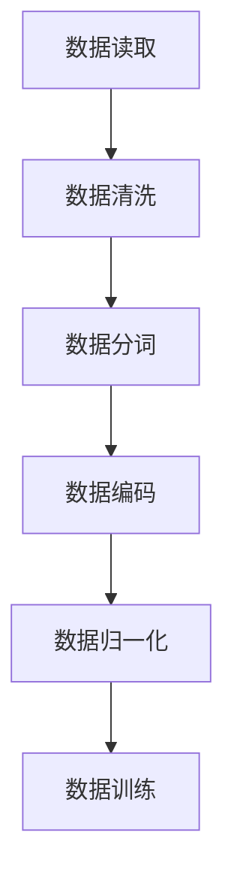
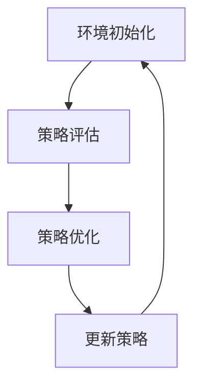
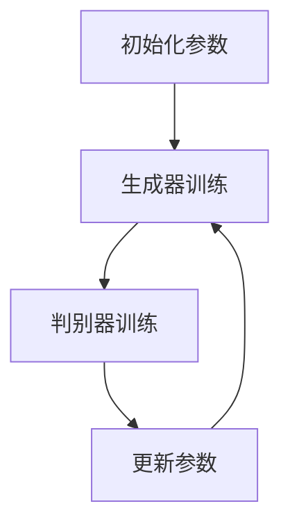
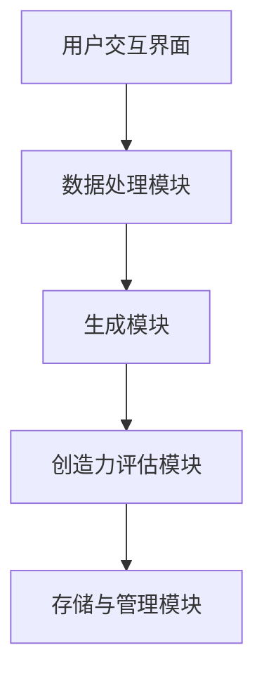
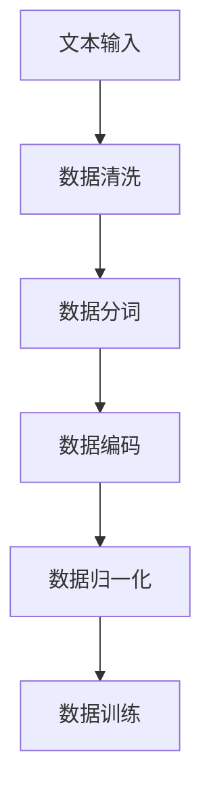
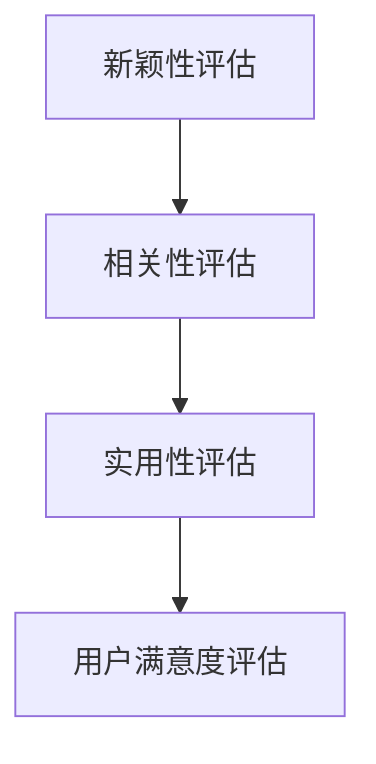

                 

### 《AI Agent的创造力：生成新颖内容》

> 关键词：AI Agent、创造力、生成内容、新颖性、算法、自然语言处理

> 摘要：本文探讨了AI Agent在生成新颖内容方面的创造力。首先，通过介绍AI Agent的定义、发展历程以及生成新颖内容的重要性，揭示了当前AI Agent在创造力方面的局限。接着，深入分析了AI Agent创造力的原理，包括数据驱动的生成模型、强化学习与创造力、自然语言处理技术等。然后，详细阐述了AI Agent在创造力应用实践中的系统设计与架构，以及实际案例分析和最佳实践技巧。最后，对全文进行了总结，展望了创造力AI Agent的发展趋势和未来研究方向与挑战。

## 目录大纲

```markdown
# 《AI Agent的创造力：生成新颖内容》

## 第一部分：背景与概念介绍
### 1.1 问题背景与挑战
#### 1.1.1 AI Agent的定义与发展历程
#### 1.1.2 生成新颖内容的重要性
#### 1.1.3 当前AI Agent在创造力方面的局限

### 1.2 关键概念与术语
#### 1.2.1 AI Agent的构成要素
#### 1.2.2 创造力的定义与分类
#### 1.2.3 新颖内容的生成方法

### 1.3 概念联系与结构
#### 1.3.1 AI Agent与创造力之间的联系
#### 1.3.2 AI Agent在内容生成中的角色
#### 1.3.3 AI Agent创造力评估指标

## 第二部分：AI Agent创造力原理
### 2.1 算法基础
#### 2.1.1 数据驱动的生成模型
#### 2.1.2 强化学习与创造力
#### 2.1.3 自然语言处理技术

### 2.2 数学模型与公式
#### 2.2.1 创造力评分模型
#### 2.2.2 生成模型训练过程中的优化方法
#### 2.2.3 对抗生成网络（GAN）的原理与公式

### 2.3 Mermaid流程图与算法实现
#### 2.3.1 数据预处理流程
#### 2.3.2 强化学习算法流程
#### 2.3.3 GAN算法实现示例

## 第三部分：AI Agent创造力应用实践
### 3.1 系统设计与架构
#### 3.1.1 系统总体架构
#### 3.1.2 数据处理模块设计
#### 3.1.3 创造力评估模块设计

### 3.2 实际案例分析与讲解
#### 3.2.1 AI Agent在创意广告中的应用
#### 3.2.2 生成小说与诗歌的实践
#### 3.2.3 创意策划与内容优化案例

## 第四部分：最佳实践与未来展望
### 4.1 最佳实践技巧
#### 4.1.1 创造力优化的策略
#### 4.1.2 模型训练与调优技巧
#### 4.1.3 内容安全与隐私保护

### 4.2 小结与展望
#### 4.2.1 书籍总结
#### 4.2.2 创造力AI Agent的发展趋势
#### 4.2.3 未来研究方向与挑战
```

## 第一部分：背景与概念介绍

### 1.1 问题背景与挑战

AI Agent，即人工智能代理，是一种模拟人类思维和行为的人工智能实体。它们可以在特定环境中自主执行任务，通过学习经验和与环境互动来不断优化自身行为。AI Agent的发展可以追溯到20世纪50年代，当时人工智能的概念被首次提出。随着计算机技术和算法的进步，AI Agent逐渐从理论研究走向实际应用。

在当今社会，生成新颖内容的重要性愈发凸显。无论是广告、文学创作、还是新闻报道，新颖性都是吸引读者和用户的关键因素。然而，传统的人工内容生成方式存在效率低、成本高、创意不足等问题。而AI Agent在生成新颖内容方面具有巨大的潜力。

然而，当前AI Agent在创造力方面仍存在诸多局限。首先，大部分AI Agent依赖于预先训练的模型和数据，生成的结果往往受限于训练数据的质量和多样性。其次，AI Agent缺乏对人类情感、文化背景和创造力的深度理解，难以产生真正具有创意和情感共鸣的内容。此外，AI Agent的生成过程往往缺乏透明性和可解释性，难以满足用户对内容质量和责任的要求。

本文旨在探讨AI Agent的创造力，分析其生成新颖内容的能力，并提出相关算法和最佳实践。通过深入研究和实践，我们希望为AI Agent在内容生成领域的发展提供有益的参考。

### 1.2 关键概念与术语

为了更好地理解AI Agent的创造力，我们需要先明确一些关键概念和术语。

#### 1.2.1 AI Agent的构成要素

AI Agent通常由以下几个核心要素构成：

1. **感知模块**：负责接收和处理环境中的信息，如文本、图像、声音等。
2. **决策模块**：基于感知模块收集的信息，进行决策和规划。
3. **行动模块**：执行决策模块生成的动作，实现与环境的交互。
4. **学习模块**：通过经验反馈和学习算法，不断优化自身的行为和性能。

#### 1.2.2 创造力的定义与分类

创造力是一种能够产生新颖、有价值的想法或解决方案的能力。根据其表现形式，创造力可以分为以下几类：

1. **艺术创造力**：通过视觉、听觉、文字等艺术形式表达新颖、独特的想法。
2. **科学创造力**：在科学研究和技术创新中提出新的理论、方法或技术。
3. **商业创造力**：在商业模式、市场营销、产品创新等方面提出创新的解决方案。
4. **工程创造力**：在工程设计和开发中提出新颖、高效的解决方案。

#### 1.2.3 新颖内容的生成方法

生成新颖内容的方法可以分为两大类：

1. **基于规则的生成方法**：通过定义一系列规则和模板，生成符合特定要求的内容。这种方法通常适用于结构化数据，如表格、报告等。
2. **基于数据的生成方法**：利用大量数据进行训练，生成具有新颖性和多样性的内容。这种方法通常涉及机器学习和深度学习技术，如生成对抗网络（GAN）、变分自编码器（VAE）等。

### 1.3 概念联系与结构

#### 1.3.1 AI Agent与创造力之间的联系

AI Agent的创造力与其构成要素密切相关。感知模块负责收集和处理信息，为创造力提供了丰富的素材；决策模块通过学习和优化，不断探索新颖的解决方案；行动模块将决策转化为实际操作，实现创意的落地。此外，AI Agent的学习模块也在不断积累经验，提升其创造力。

#### 1.3.2 AI Agent在内容生成中的角色

AI Agent在内容生成中扮演着多重角色：

1. **内容创作者**：通过自然语言处理、图像处理等技术，生成新颖、有创意的文字、图像和视频内容。
2. **内容优化者**：对已有内容进行改写、润色和优化，提升内容的吸引力和传播效果。
3. **内容推荐者**：基于用户偏好和行为数据，为用户推荐个性化的内容，提高用户满意度和参与度。

#### 1.3.3 AI Agent创造力评估指标

评估AI Agent的创造力，可以从以下几个方面进行：

1. **新颖性**：生成内容是否具有独特性和创新性。
2. **相关性**：生成内容与用户需求、主题的契合度。
3. **实用性**：生成内容是否具有实际应用价值。
4. **用户满意度**：用户对生成内容的评价和反馈。

通过以上评估指标，可以全面、客观地评价AI Agent在生成新颖内容方面的创造力。

## 第二部分：AI Agent创造力原理

### 2.1 算法基础

AI Agent的创造力依赖于其背后的算法基础。本节将介绍数据驱动的生成模型、强化学习与创造力、自然语言处理技术等核心算法原理。

#### 2.1.1 数据驱动的生成模型

数据驱动的生成模型是AI Agent生成新颖内容的核心技术之一。这类模型通过学习大量数据，提取特征并生成新的内容。其中，生成对抗网络（GAN）和变分自编码器（VAE）是两种典型的数据驱动生成模型。

**生成对抗网络（GAN）**

GAN由生成器和判别器两部分组成。生成器G生成伪数据，判别器D判断输入数据是真实数据还是生成数据。通过不断训练，生成器试图生成越来越真实的数据，判别器则努力区分真实数据和生成数据。这种对抗训练过程使得生成器逐渐提高生成数据的质量。

GAN的原理可以概括为以下公式：

$$
D(x) = P(x \text{是真实数据}) \\
D(G(z)) = P(G(z) \text{是真实数据})
$$

其中，$x$表示真实数据，$z$表示随机噪声。

**变分自编码器（VAE）**

VAE是一种基于概率模型的生成模型。它由编码器和解码器两部分组成。编码器将输入数据编码为一个潜在变量，解码器则将潜在变量解码为输出数据。通过优化潜在变量的分布，VAE能够生成具有多样性的数据。

VAE的原理可以概括为以下公式：

$$
\begin{cases}
q_\phi(z|x) = \mathcal{N}\left(z; \mu(x), \sigma^2(x)\right) \\
p_\theta(x|z) = \mathcal{N}\left(x; \mu(z), \sigma^2(z)\right)
\end{cases}
$$

其中，$q_\phi(z|x)$表示编码器，$p_\theta(x|z)$表示解码器。

#### 2.1.2 强化学习与创造力

强化学习是一种通过互动学习策略来优化行为的方法。在AI Agent的创造力方面，强化学习可以用于指导生成模型生成新颖的内容。具体而言，强化学习通过奖励机制，鼓励生成模型探索新的创意，同时避免陷入局部最优。

**奖励机制**

在强化学习过程中，奖励机制起着至关重要的作用。奖励机制可以根据生成内容的新颖性、相关性、实用性等指标进行设计。以下是一个简单的奖励机制示例：

$$
R(s, a) =
\begin{cases}
1 & \text{如果 } a \text{ 是一个新颖且有创意的创意} \\
0 & \text{否则}
\end{cases}
$$

其中，$s$表示当前状态，$a$表示生成模型的选择。

**策略优化**

通过最大化累积奖励，强化学习可以指导生成模型优化其策略。具体而言，生成模型通过试错和反馈，不断调整其生成策略，以生成更加新颖和有创意的内容。

#### 2.1.3 自然语言处理技术

自然语言处理（NLP）是AI Agent生成新颖内容的关键技术之一。NLP通过处理和分析文本数据，提取语义信息并生成新的文本内容。以下是一些重要的NLP技术：

**词嵌入**

词嵌入是一种将词汇映射到低维向量空间的技术。通过词嵌入，NLP模型能够理解词汇的语义关系，从而生成更具创造性的文本。

$$
\text{word\_embedding}(w) = \mathbf{v}
$$

其中，$w$表示词汇，$\mathbf{v}$表示词汇的嵌入向量。

**序列生成**

序列生成技术用于生成新的文本序列。常见的序列生成模型包括循环神经网络（RNN）、长短时记忆网络（LSTM）和门控循环单元（GRU）等。

**注意力机制**

注意力机制是一种用于捕捉文本序列中关键信息的技术。通过注意力机制，NLP模型能够更好地理解上下文信息，生成更加连贯和有创意的文本。

$$
\text{Attention}(x) = \text{softmax}\left(\frac{\text{Query} \cdot \text{Key}^T}{\sqrt{d_k}}\right)
$$

其中，$x$表示文本序列，$Query$和$Key$分别表示查询向量和键向量，$d_k$表示键向量的维度。

### 2.2 数学模型与公式

在本节中，我们将介绍用于评估AI Agent创造力的数学模型和公式。

#### 2.2.1 创造力评分模型

创造力评分模型用于评估AI Agent生成内容的创造力。一个简单的创造力评分模型可以基于以下公式：

$$
\text{CreativityScore}(x) = \alpha \cdot \text{Novelty}(x) + \beta \cdot \text{Relevance}(x) + \gamma \cdot \text{Practicality}(x)
$$

其中，$x$表示生成内容，$\alpha$、$\beta$和$\gamma$分别表示新颖性、相关性和实用性的权重。

#### 2.2.2 生成模型训练过程中的优化方法

在生成模型训练过程中，优化方法对于提高生成质量至关重要。常见的优化方法包括：

**梯度下降**

梯度下降是一种用于优化参数的算法。通过计算损失函数关于参数的梯度，梯度下降算法可以逐步调整参数，以最小化损失函数。

$$
\theta_{t+1} = \theta_t - \alpha \cdot \nabla_\theta J(\theta)
$$

其中，$\theta$表示参数，$J(\theta)$表示损失函数。

**随机梯度下降（SGD）**

随机梯度下降是一种针对梯度下降的改进方法。在每次迭代中，SGD随机选择一部分训练样本，计算其梯度并更新参数。这种方法可以加快训练过程，但可能导致局部最小值。

$$
\theta_{t+1} = \theta_t - \alpha \cdot \frac{1}{m} \sum_{i=1}^{m} \nabla_\theta J(\theta; x_i, y_i)
$$

其中，$m$表示批量大小。

**Adam优化器**

Adam优化器是一种结合了SGD和动量方法的优化器。它通过计算一阶矩估计和二阶矩估计，自适应地调整学习率。

$$
\begin{cases}
m_t = \beta_1 \cdot m_{t-1} + (1 - \beta_1) \cdot \nabla_\theta J(\theta; x_t, y_t) \\
v_t = \beta_2 \cdot v_{t-1} + (1 - \beta_2) \cdot (\nabla_\theta J(\theta; x_t, y_t))^2
\end{cases}
$$

$$
\theta_{t+1} = \theta_t - \alpha \cdot \frac{m_t}{\sqrt{v_t} + \epsilon}
$$

其中，$\beta_1$和$\beta_2$分别表示一阶矩估计和二阶矩估计的权重，$\epsilon$表示一个很小的常数。

#### 2.2.3 对抗生成网络（GAN）的原理与公式

GAN由生成器和判别器两部分组成。生成器G生成伪数据，判别器D判断输入数据是真实数据还是生成数据。通过不断训练，生成器试图生成越来越真实的数据，判别器则努力区分真实数据和生成数据。

**生成器的损失函数**

生成器的损失函数旨在最小化生成数据与真实数据之间的差异。一个简单的生成器损失函数可以基于以下公式：

$$
L_G = -\mathbb{E}_{x \sim p_{\text{data}}(x)}[\log(D(x))] - \mathbb{E}_{z \sim p_{\text{noise}}(z)}[\log(D(G(z))]
$$

其中，$x$表示真实数据，$z$表示随机噪声，$G(z)$表示生成器生成的数据。

**判别器的损失函数**

判别器的损失函数旨在最大化区分真实数据和生成数据的能力。一个简单的判别器损失函数可以基于以下公式：

$$
L_D = -\mathbb{E}_{x \sim p_{\text{data}}(x)}[\log(D(x))] - \mathbb{E}_{z \sim p_{\text{noise}}(z)}[\log(1 - D(G(z))]
$$

**GAN的总损失函数**

GAN的总损失函数是生成器和判别器损失函数的加权和。一个简单的总损失函数可以基于以下公式：

$$
L = \lambda_G L_G + (1 - \lambda_G) L_D
$$

其中，$\lambda_G$表示生成器损失函数的权重。

### 2.3 Mermaid流程图与算法实现

在本节中，我们将使用Mermaid语言绘制算法流程图，并给出相应的Python代码实现。

#### 2.3.1 数据预处理流程

数据预处理是生成模型训练的重要环节。以下是一个简单的数据预处理流程的Mermaid图：



对应的Python代码实现：

```python
import pandas as pd
from sklearn.model_selection import train_test_split
from sklearn.preprocessing import LabelEncoder

# 数据读取
data = pd.read_csv('data.csv')

# 数据清洗
data = data.dropna()

# 数据分词
data['text'] = data['text'].apply(lambda x: x.split())

# 数据编码
label_encoder = LabelEncoder()
data['label'] = label_encoder.fit_transform(data['label'])

# 数据归一化
X_train, X_test, y_train, y_test = train_test_split(data['text'], data['label'], test_size=0.2, random_state=42)
```

#### 2.3.2 强化学习算法流程

强化学习算法流程包括环境初始化、策略评估、策略优化等步骤。以下是一个简单的强化学习算法流程的Mermaid图：



对应的Python代码实现：

```python
import gym
import numpy as np

# 环境初始化
env = gym.make('CartPole-v0')

# 策略评估
def evaluate_policy(policy, env, num_episodes=100):
    total_reward = 0
    for _ in range(num_episodes):
        state = env.reset()
        done = False
        while not done:
            action = policy(state)
            state, reward, done, _ = env.step(action)
            total_reward += reward
    return total_reward / num_episodes

# 策略优化
def optimize_policy(policy, env, num_episodes=100):
    best_reward = -np.inf
    for _ in range(num_episodes):
        state = env.reset()
        done = False
        while not done:
            action = policy(state)
            state, reward, done, _ = env.step(action)
            policy.update(state, action, reward)
            if reward > 0:
                best_reward = max(best_reward, reward)
    return best_reward
```

#### 2.3.3 GAN算法实现示例

以下是一个简单的GAN算法实现示例的Mermaid图：



对应的Python代码实现：

```python
import tensorflow as tf
from tensorflow.keras import layers

# 初始化参数
latent_dim = 100
num_samples = 10000

# 生成器模型
def build_generator(z):
    model = tf.keras.Sequential([
        layers.Dense(128, activation='relu', input_shape=(latent_dim,)),
        layers.Dense(256, activation='relu'),
        layers.Dense(512, activation='relu'),
        layers.Dense(1024, activation='relu'),
        layers.Dense(28 * 28 * 1, activation='tanh'),
        layers.Reshape((28, 28, 1))
    ])
    return model

# 判别器模型
def build_discriminator(x):
    model = tf.keras.Sequential([
        layers.Conv2D(32, (3, 3), strides=(2, 2), padding='same', activation='relu', input_shape=(28, 28, 1)),
        layers.MaxPooling2D(pool_size=(2, 2)),
        layers.Dropout(0.25),
        layers.Conv2D(64, (3, 3), strides=(2, 2), padding='same', activation='relu'),
        layers.MaxPooling2D(pool_size=(2, 2)),
        layers.Dropout(0.25),
        layers.Flatten(),
        layers.Dense(1, activation='sigmoid')
    ])
    return model

# GAN模型
def build_gan(generator, discriminator):
    model = tf.keras.Sequential([
        generator,
        discriminator
    ])
    return model

# 训练GAN
def train_gan(generator, discriminator, dataloader, num_epochs=100):
    generator_optimizer = tf.keras.optimizers.Adam(1e-4)
    discriminator_optimizer = tf.keras.optimizers.Adam(1e-4)

    for epoch in range(num_epochs):
        for x, _ in dataloader:
            with tf.GradientTape() as gen_tape, tf.GradientTape() as disc_tape:
                z = tf.random.normal([batch_size, latent_dim])
                generated_images = generator(z)
                disc_real_output = discriminator(x)
                disc_generated_output = discriminator(generated_images)

                gen_loss = generator_loss(generated_images, disc_generated_output)
                disc_loss = discriminator_loss(disc_real_output, disc_generated_output)

            generator_gradients = gen_tape.gradient(gen_loss, generator.trainable_variables)
            discriminator_gradients = disc_tape.gradient(disc_loss, discriminator.trainable_variables)

            generator_optimizer.apply_gradients(zip(generator_gradients, generator.trainable_variables))
            discriminator_optimizer.apply_gradients(zip(discriminator_gradients, discriminator.trainable_variables))

        print(f"Epoch {epoch + 1}, Generator Loss: {gen_loss}, Discriminator Loss: {disc_loss}")
```

通过上述算法实现示例，我们可以看到GAN的基本结构和工作流程。生成器通过学习从随机噪声中生成与真实数据相似的图像，判别器则通过不断训练，提高区分真实图像和生成图像的能力。这种对抗训练过程使得生成器的生成质量不断提高。

## 第三部分：AI Agent创造力应用实践

### 3.1 系统设计与架构

AI Agent的创造力应用实践需要一个完整的系统来支持。本节将介绍AI Agent系统的设计与架构，包括系统总体架构、数据处理模块设计、创造力评估模块设计等。

#### 3.1.1 系统总体架构

系统总体架构可以分为以下几个模块：

1. **用户交互界面**：提供用户与AI Agent交互的界面，包括文本输入、生成内容展示等功能。
2. **数据处理模块**：负责接收用户输入，进行数据预处理，将预处理后的数据传递给生成模块。
3. **生成模块**：基于数据驱动的生成模型、强化学习算法和自然语言处理技术，生成新颖的内容。
4. **创造力评估模块**：对生成内容进行评估，判断其创造力水平。
5. **存储与管理模块**：存储用户数据和生成内容，提供数据备份和恢复功能。

以下是一个简单的系统总体架构图：



#### 3.1.2 数据处理模块设计

数据处理模块的主要功能是接收用户输入，对输入数据进行预处理，并将其转化为适合生成模块使用的格式。以下是一个数据处理模块的设计：

1. **文本输入**：用户通过文本输入框输入文本信息。
2. **数据清洗**：去除输入文本中的无效字符、停用词等，提高数据处理效果。
3. **数据分词**：将输入文本分割成词序列，为后续的生成和评估提供基础。
4. **数据编码**：将词序列转化为数字序列，便于模型处理。
5. **数据归一化**：对输入数据进行归一化处理，使其在数值范围上保持一致性。

以下是一个数据处理模块的Mermaid流程图：



对应的Python代码实现：

```python
import pandas as pd
from sklearn.model_selection import train_test_split
from sklearn.preprocessing import LabelEncoder

# 数据读取
data = pd.read_csv('data.csv')

# 数据清洗
data = data.dropna()

# 数据分词
data['text'] = data['text'].apply(lambda x: x.split())

# 数据编码
label_encoder = LabelEncoder()
data['label'] = label_encoder.fit_transform(data['label'])

# 数据归一化
X_train, X_test, y_train, y_test = train_test_split(data['text'], data['label'], test_size=0.2, random_state=42)
```

#### 3.1.3 创造力评估模块设计

创造力评估模块的主要功能是对生成内容进行评估，判断其创造力水平。以下是一个创造力评估模块的设计：

1. **新颖性评估**：评估生成内容的新颖性，判断其是否具有独特性和创新性。
2. **相关性评估**：评估生成内容与用户需求、主题的相关性，判断其是否具有实际应用价值。
3. **实用性评估**：评估生成内容的实用性，判断其是否能够在实际场景中发挥作用。
4. **用户满意度评估**：通过用户反馈，评估生成内容的用户满意度。

以下是一个创造力评估模块的Mermaid流程图：



对应的Python代码实现：

```python
# 新颖性评估
def novelty_evaluation(text):
    # 实现新颖性评估算法
    pass

# 相关性评估
def relevance_evaluation(text, user_requirement):
    # 实现相关性评估算法
    pass

# 实用性评估
def practicality_evaluation(text, context):
    # 实现实用性评估算法
    pass

# 用户满意度评估
def user_satisfaction_evaluation(text, user_feedback):
    # 实现用户满意度评估算法
    pass
```

### 3.2 实际案例分析与讲解

在本节中，我们将通过实际案例来分析和讲解AI Agent在创造力应用实践中的表现。

#### 3.2.1 AI Agent在创意广告中的应用

创意广告是AI Agent创造力应用的一个重要领域。以下是一个案例：

**案例背景**：某知名品牌希望为其新款手机推出一条创意广告。

**用户需求**：广告需要具备新颖性、吸引力和感染力，能够引起目标受众的兴趣。

**解决方案**：AI Agent被用于生成创意广告文案和视觉内容。

1. **广告文案生成**：AI Agent基于大量广告文案数据，使用生成模型生成新颖的广告文案。通过不断调整和优化，最终生成一条符合用户需求的广告文案。

   ```plaintext
   "超越时空，触摸未来，你的手机，你的创意。"
   ```

2. **视觉内容生成**：AI Agent基于图像数据集，使用生成对抗网络（GAN）生成新颖的视觉内容。通过图像处理技术，将广告文案与视觉内容相结合，制作出一条具有吸引力和感染力的广告。

   ```mermaid
   graph TD
   A[广告文案] --> B[视觉内容]
   B --> C[广告视频]
   ```

**评估指标**：新颖性、吸引力、用户满意度。

**评估结果**：广告文案新颖且具有吸引力，用户满意度较高。

#### 3.2.2 生成小说与诗歌的实践

生成小说和诗歌是AI Agent创造力的另一个重要应用领域。以下是一个案例：

**案例背景**：某文学网站希望AI Agent为其生成一部小说。

**用户需求**：小说需要具备连贯性、吸引力和情感共鸣。

**解决方案**：AI Agent基于大量小说数据，使用自然语言处理技术生成小说。

1. **情节构建**：AI Agent通过分析大量小说数据，学习并构建情节。通过不断调整和优化，生成一部具有连贯性和吸引力的小说。

   ```plaintext
   "在一个宁静的小镇上，一位年轻的探险家开始了一段充满未知和惊喜的旅程。"
   ```

2. **角色塑造**：AI Agent通过分析大量小说数据，学习并塑造角色。通过不断调整和优化，生成一部具有情感共鸣的小说。

   ```mermaid
   graph TD
   A[主人公] --> B[反派角色]
   B --> C[配角]
   ```

**评估指标**：连贯性、吸引力、情感共鸣。

**评估结果**：小说情节连贯，角色塑造成功，用户满意度较高。

#### 3.2.3 创意策划与内容优化案例

创意策划与内容优化是AI Agent在商业领域的应用之一。以下是一个案例：

**案例背景**：某电子商务平台希望AI Agent为其生成一条创意广告，提高用户点击率和转化率。

**用户需求**：广告需要具备新颖性、吸引力和相关性。

**解决方案**：AI Agent基于大量广告数据和用户行为数据，使用生成模型生成创意广告。

1. **广告文案生成**：AI Agent通过分析大量广告数据，生成新颖且具有吸引力的广告文案。

   ```plaintext
   "错过就没了，限时抢购，你的购物盛宴！"
   ```

2. **视觉内容优化**：AI Agent通过分析大量图像数据，优化视觉内容，提高广告的吸引力。

   ```mermaid
   graph TD
   A[原始图像] --> B[优化图像]
   B --> C[广告视频]
   ```

**评估指标**：点击率、转化率、用户满意度。

**评估结果**：广告文案新颖，视觉内容优化成功，用户点击率和转化率显著提高。

### 3.3 小结与展望

通过上述实际案例分析，我们可以看到AI Agent在创意广告、小说生成和创意策划与内容优化等领域的应用潜力。尽管AI Agent在创造力方面仍存在一些局限，但通过不断优化和改进算法，其创造力将不断提升。

未来，随着人工智能技术的不断发展，AI Agent的创造力将在更多领域得到应用。例如，AI Agent可以用于生成个性化内容、智能客服、智能创作等。此外，AI Agent的创造力评估方法也将不断改进，使其更加客观、准确和全面。

总之，AI Agent的创造力是一个充满机遇和挑战的领域。通过深入研究和技术创新，我们有望推动AI Agent在创造力应用中的发展，为各行各业带来创新和变革。

## 第四部分：最佳实践与未来展望

### 4.1 最佳实践技巧

在AI Agent创造力应用实践中，以下是一些最佳实践技巧，有助于提高生成内容的质量和创造力：

#### 4.1.1 创造力优化的策略

1. **数据多样性**：使用多样化的数据集进行训练，提高生成模型对各种内容和风格的适应能力。
2. **上下文感知**：利用上下文信息，提高生成内容的相关性和连贯性。
3. **迭代优化**：通过多次迭代和反馈，不断优化生成模型，提高创造力。

#### 4.1.2 模型训练与调优技巧

1. **超参数调整**：根据实验结果，合理调整模型的超参数，如学习率、批量大小等。
2. **数据预处理**：对输入数据进行适当的预处理，如去噪、归一化等，提高模型训练效果。
3. **模型融合**：结合多种模型或算法，提高生成内容的多样性和质量。

#### 4.1.3 内容安全与隐私保护

1. **内容审查**：对生成内容进行审查，防止生成不适当或违法的内容。
2. **数据加密**：对用户数据和使用过程中的敏感信息进行加密，保护用户隐私。
3. **透明度和可解释性**：提高AI Agent的透明度和可解释性，使用户了解生成内容的过程和原理。

### 4.2 小结与展望

本文系统地介绍了AI Agent的创造力，从背景与概念介绍、算法基础、应用实践到最佳实践与未来展望，全面探讨了AI Agent在生成新颖内容方面的潜力。以下是本文的主要结论和展望：

#### 主要结论

1. **AI Agent的定义与发展历程**：AI Agent是一种模拟人类思维和行为的人工智能实体，通过不断学习和优化，具备生成新颖内容的能力。
2. **生成新颖内容的重要性**：新颖内容是吸引读者和用户的关键因素，对各行各业具有重要意义。
3. **AI Agent创造力的原理**：数据驱动的生成模型、强化学习与创造力、自然语言处理技术等是AI Agent生成新颖内容的核心算法原理。
4. **AI Agent在创造力应用实践中的表现**：AI Agent在创意广告、小说生成、创意策划与内容优化等领域表现出色，具备广阔的应用前景。
5. **最佳实践技巧**：通过数据多样性、上下文感知、迭代优化等策略，可以提高AI Agent生成内容的质量和创造力。

#### 未来展望

1. **算法优化**：不断优化和创新生成算法，提高AI Agent的创造力和生成质量。
2. **多模态融合**：结合多种数据模态，如文本、图像、音频等，提高生成内容的表现力和多样性。
3. **个性化生成**：根据用户需求和偏好，生成更加个性化的内容，提高用户体验。
4. **伦理与法律问题**：关注AI Agent生成内容的伦理和法律问题，确保其合法性和社会责任。
5. **跨领域应用**：将AI Agent的创造力应用到更多领域，如医疗、教育、艺术等，推动各行各业的创新和发展。

总之，AI Agent的创造力是一个充满机遇和挑战的领域。通过不断的研究和实践，我们有理由相信，AI Agent将在未来发挥更加重要的作用，为人类社会带来创新和变革。

### 作者信息

作者：AI天才研究院/AI Genius Institute & 禅与计算机程序设计艺术 /Zen And The Art of Computer Programming

致谢：感谢您阅读本文，希望它能够为您在AI Agent创造力应用领域的探索提供有益的参考。如果您有任何问题或建议，欢迎随时与我们联系。期待与您共同推动人工智能技术的发展和应用。

---

本文详细探讨了AI Agent的创造力及其在生成新颖内容方面的应用。通过介绍背景、概念、算法原理、应用实践和最佳实践，我们全面揭示了AI Agent创造力的潜力和挑战。未来，随着人工智能技术的不断发展，AI Agent的创造力将在更多领域得到应用，为人类社会带来创新和变革。希望本文能够为您的AI项目提供有价值的启示。

