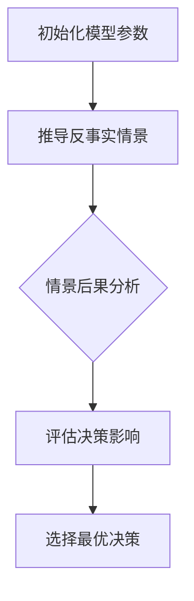
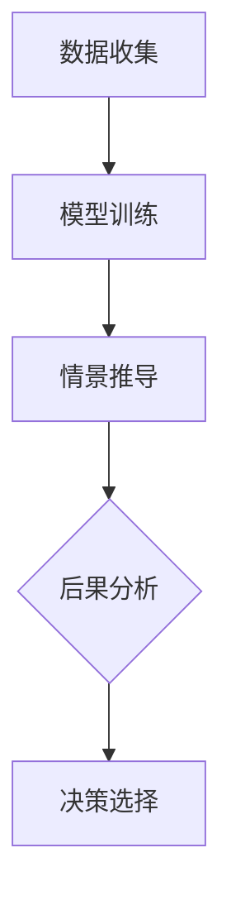
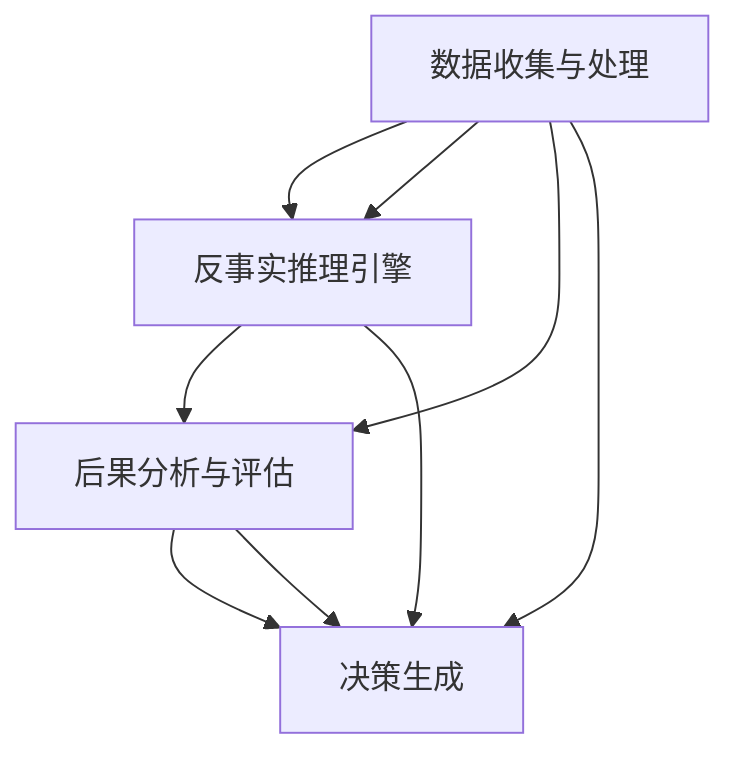
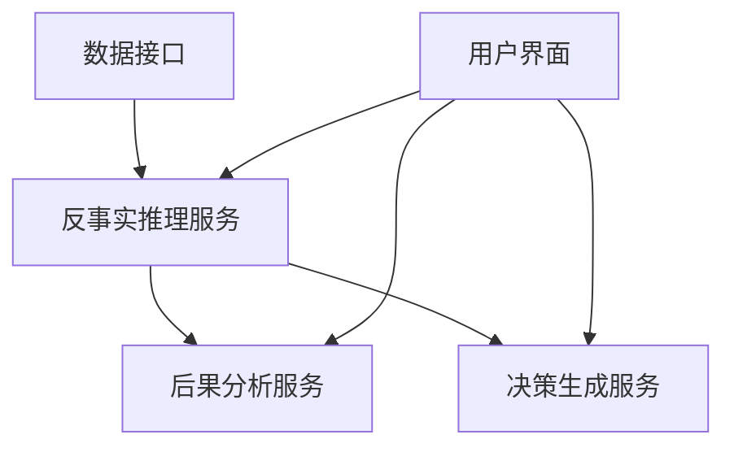
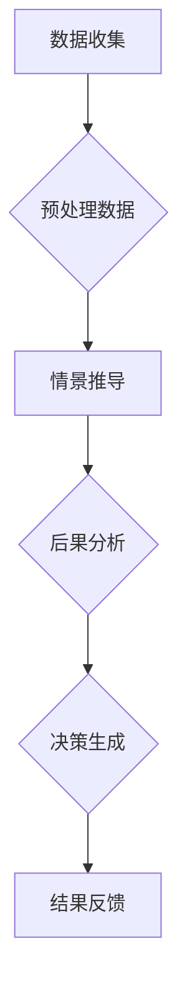

                 

# AI Agent的反事实推理：增强决策能力

## 关键词
- AI Agent
- 反事实推理
- 决策能力
- 系统架构
- 应用案例
- 算法实现

## 摘要
本文旨在深入探讨AI Agent的反事实推理，一种在人工智能决策过程中至关重要的能力。通过详细的背景介绍、理论阐述、应用分析和实际案例，本文将展示反事实推理如何提升AI Agent的决策能力，以及其潜在的应用前景。本文将分章节展开，从基础理论到系统架构设计，再到算法实现和项目实战，为读者提供全面而深入的技术分析。

## 目录大纲

### 第一部分: AI Agent的反事实推理背景

#### 第1章: 问题背景与核心概念

##### 1.1 问题背景
- AI Agent的背景介绍
- 反事实推理的定义

##### 1.2 核心概念
- 反事实推理的概念
- 反事实推理的应用场景

##### 1.3 联系与对比
- 反事实推理与其他相关概念的联系与区别

#### 第2章: 反事实推理的基础理论

##### 2.1 反事实推理的基本原理
- 反事实推理的数学模型
- 反事实推理的算法原理

##### 2.2 反事实推理的数学模型
- 公式与解释
- 例子说明

##### 2.3 反事实推理的算法原理
- 算法流程
- 算法mermaid流程图

#### 第3章: 反事实推理的应用

##### 3.1 应用场景分析
- AI Agent在不同领域的应用场景
- 反事实推理在这些场景中的重要性

##### 3.2 实际案例
- 案例一：AI Agent在金融领域的反事实推理
- 案例二：AI Agent在医疗领域的反事实推理

##### 3.3 应用前景展望
- 反事实推理在未来的发展趋势
- 对AI Agent决策能力的提升

#### 第4章: 反事实推理的系统架构设计

##### 4.1 系统介绍
- 系统的功能设计
- 系统的架构设计

##### 4.2 系统架构设计
- 系统架构mermaid图
- 系统接口设计

##### 4.3 系统交互设计
- 系统交互mermaid序列图

#### 第5章: 反事实推理的算法实现

##### 5.1 算法实现
- Python源代码
- 算法流程与步骤

##### 5.2 算法分析
- 算法的复杂度分析
- 算法的有效性分析

##### 5.3 代码解读
- 代码细节解读
- 算法原理与代码对应解释

#### 第6章: 项目实战

##### 6.1 环境安装
- 环境搭建步骤
- 所需工具和库

##### 6.2 系统核心实现
- 核心代码实现
- 代码功能与作用

##### 6.3 实际案例分析
- 案例数据集
- 案例分析与解读

##### 6.4 项目小结
- 项目成果总结
- 项目反思与展望

#### 第7章: 最佳实践与未来展望

##### 7.1 最佳实践
- 反事实推理在实践中的经验与技巧
- 常见问题的解决方案

##### 7.2 小结与展望
- 书籍内容回顾
- 对AI Agent决策能力的展望

##### 7.3 拓展阅读
- 相关研究文献
- 深入阅读推荐

### 第一部分: AI Agent的反事实推理背景

#### 第1章: 问题背景与核心概念

##### 1.1 问题背景

AI Agent，即人工智能代理，是指能够自主学习、决策和执行任务的人工智能系统。随着深度学习和强化学习等技术的不断发展，AI Agent在各个领域的应用越来越广泛。然而，AI Agent在复杂环境下的决策能力仍面临诸多挑战。其中，反事实推理作为一种重要的推理方法，能够显著提升AI Agent的决策能力。

反事实推理（Counterfactual Reasoning）是指基于当前事实，推导出与当前事实相反的假设情景，并分析这些情景的可能结果。这种推理方法能够帮助AI Agent在面临不确定性时，预测可能的后果，从而做出更加明智的决策。

##### 1.2 核心概念

**反事实推理的概念：**

反事实推理是指通过想象与当前事实相反的情景，并分析这些情景的后果，从而帮助决策者理解现实、预测未来或评估不同决策的潜在影响。

**反事实推理的应用场景：**

1. **预测与分析：** 在金融领域，AI Agent可以使用反事实推理来分析市场变化，预测投资决策的可能结果。
2. **医疗诊断：** 在医疗领域，AI Agent可以通过反事实推理来评估不同治疗方案的效果，帮助医生做出更好的诊断。
3. **风险管理：** 在风险管理中，AI Agent可以利用反事实推理来预测风险事件的可能后果，从而制定更有效的风险控制策略。

##### 1.3 联系与对比

**反事实推理与其他相关概念的联系与区别：**

1. **假设推理（Hypothetical Reasoning）：** 假设推理是基于假设的情景进行推理，而反事实推理则是基于当前事实进行反向推理。
2. **情景规划（Scenario Planning）：** 情景规划是通过构建多个可能的未来情景，分析这些情景下的决策和结果，而反事实推理则是专注于分析与当前事实相反的情景。

在接下来的章节中，我们将深入探讨反事实推理的基础理论、系统架构设计、算法实现和应用案例，以展示其在AI Agent决策能力提升方面的巨大潜力。

#### 第2章: 反事实推理的基础理论

##### 2.1 反事实推理的基本原理

反事实推理是一种基于现实情况，通过想象和推导出与之相反的情景，来分析这些情景的可能后果，从而辅助决策的方法。在数学上，反事实推理可以通过概率模型和决策理论来实现。

**反事实推理的数学模型：**

反事实推理的数学模型通常基于条件概率和贝叶斯定理。设当前事实为\( A \)，与之相反的情景为 \( \neg A \)，则反事实推理可以通过以下公式进行描述：

$$ P(\neg A | A) = \frac{P(A | \neg A) \cdot P(\neg A)}{P(A)} $$

其中，\( P(\neg A | A) \)表示在当前事实\( A \)下，情景\( \neg A \)发生的概率；\( P(A | \neg A) \)表示在情景\( \neg A \)发生下，事实\( A \)发生的概率；\( P(\neg A) \)表示情景\( \neg A \)的先验概率；\( P(A) \)表示事实\( A \)的先验概率。

**反事实推理的算法原理：**

反事实推理的算法原理主要包括以下步骤：

1. **初始化：** 根据当前事实，初始化反事实推理的模型参数。
2. **推导：** 利用条件概率和贝叶斯定理，推导出与当前事实相反的情景及其后果。
3. **分析：** 分析这些情景的可能结果，评估其对决策的影响。
4. **决策：** 根据分析结果，选择最优的决策方案。

反事实推理的算法mermaid流程图如下：



##### 2.2 反事实推理的数学模型

为了更直观地理解反事实推理的数学模型，我们可以通过一个简单的例子来说明。

**例子：** 假设一个AI Agent正在分析一个投资项目的风险。当前事实是，该项目的预期收益为20%。我们希望使用反事实推理来分析如果项目的预期收益为10%，对投资决策的影响。

根据反事实推理的公式，我们可以计算出：

$$ P(\text{预期收益为10%} | \text{预期收益为20%}) = \frac{P(\text{预期收益为20%} | \text{预期收益为10%}) \cdot P(\text{预期收益为10%）}}{P(\text{预期收益为20%）}} $$

其中，\( P(\text{预期收益为20%} | \text{预期收益为10%）}) \)是条件概率，表示在预期收益为10%的情况下，项目的实际收益为20%的概率。由于预期收益是一个概率事件，这个条件概率通常很难直接测量，但在某些情况下，可以通过历史数据或专家意见来估计。

假设通过历史数据或专家意见，我们估计\( P(\text{预期收益为20%} | \text{预期收益为10%）}) \)为0.1，且\( P(\text{预期收益为10%）}) \)和\( P(\text{预期收益为20%）}) \)相等，均为0.5。

则：

$$ P(\text{预期收益为10%} | \text{预期收益为20%）}) = \frac{0.1 \cdot 0.5}{0.5} = 0.1 $$

这意味着，如果项目的预期收益为20%，那么预期收益为10%的概率为10%。这个结果可以帮助AI Agent理解，在当前预期收益为20%的情况下，预期收益为10%的可能性较小。

##### 2.3 反事实推理的算法原理

反事实推理的算法原理可以通过以下步骤进行描述：

1. **数据收集：** 收集与当前事实相关的数据，包括历史数据和专家意见。
2. **模型训练：** 基于收集到的数据，训练反事实推理的模型。模型通常基于条件概率和贝叶斯网络。
3. **情景推导：** 利用训练好的模型，推导出与当前事实相反的情景及其后果。
4. **后果分析：** 分析这些情景的可能结果，包括对决策的影响和风险。
5. **决策选择：** 根据后果分析的结果，选择最优的决策方案。

反事实推理的算法mermaid流程图如下：



通过上述基础理论的介绍，我们可以看到反事实推理在数学和算法上的实现原理。在接下来的章节中，我们将进一步探讨反事实推理在实际应用中的重要性，以及如何设计和实现一个高效的系统架构。

#### 第3章: 反事实推理的应用

##### 3.1 应用场景分析

反事实推理在AI Agent中的应用非常广泛，不同领域都有其独特的应用场景。以下将介绍几种典型的应用场景，并分析反事实推理在这些场景中的重要性。

**1. 金融领域：** 在金融领域，AI Agent可以利用反事实推理来分析市场变化，预测投资决策的可能结果。例如，在股票市场中，AI Agent可以通过分析不同投资策略的反事实情景，评估每种策略的风险和收益。这种分析可以帮助投资者做出更加明智的投资决策，减少潜在的损失。

**2. 医疗领域：** 在医疗领域，AI Agent可以通过反事实推理来评估不同治疗方案的效果。例如，在疾病诊断和治疗中，AI Agent可以分析如果采用不同的治疗方案，患者的健康状况可能如何变化。这种分析可以帮助医生选择最佳的治疗方案，提高治疗效果。

**3. 风险管理：** 在风险管理中，AI Agent可以利用反事实推理来预测风险事件的可能后果，从而制定更有效的风险控制策略。例如，在保险行业中，AI Agent可以通过分析不同风险事件的反事实情景，预测这些事件对保险公司财务状况的影响。这种分析可以帮助保险公司制定更合理的保费策略。

**4. 智能交通：** 在智能交通领域，AI Agent可以利用反事实推理来优化交通管理策略。例如，在交通拥堵时，AI Agent可以通过分析不同的交通管理方案的反事实情景，预测这些方案对交通流畅度和拥堵程度的影响。这种分析可以帮助交通管理部门制定更加有效的交通疏导策略。

**5. 战略规划：** 在企业战略规划中，AI Agent可以通过反事实推理来评估不同战略决策的潜在影响。例如，在企业扩展计划中，AI Agent可以通过分析不同扩展方案的反事实情景，预测这些方案对企业的市场占有率、利润率等关键指标的影响。这种分析可以帮助企业制定更加科学的战略决策。

##### 3.2 实际案例

**案例一：AI Agent在金融领域的反事实推理**

在某次股票市场分析中，AI Agent使用反事实推理来评估两种不同的投资策略。当前事实是，策略A的预期收益为15%，而策略B的预期收益为20%。

通过反事实推理，AI Agent分析了如果策略A的预期收益为10%，而策略B的预期收益为25%，对投资决策的影响。分析结果显示，如果策略A的预期收益降低，其风险系数也将相应降低，而策略B的预期收益增加，其风险系数也将增加。基于这些分析结果，AI Agent建议投资者在当前市场环境下，选择策略B进行投资，因为虽然风险系数较高，但预期收益更大。

**案例二：AI Agent在医疗领域的反事实推理**

在某次疾病治疗分析中，AI Agent使用反事实推理来评估两种不同的治疗方案。当前事实是，方案A的治疗效果为70%，而方案B的治疗效果为80%。

通过反事实推理，AI Agent分析了如果方案A的治疗效果为60%，而方案B的治疗效果为85%，对治疗方案选择的影响。分析结果显示，如果方案A的治疗效果降低，其副作用风险也将降低，而方案B的治疗效果增加，其副作用风险也将增加。基于这些分析结果，AI Agent建议医生在当前患者状况下，选择方案B进行治疗，因为虽然副作用风险较高，但治疗效果更好。

##### 3.3 应用前景展望

反事实推理在未来的发展中具有广阔的应用前景。随着人工智能技术的不断进步，AI Agent的决策能力将得到进一步提升。以下是反事实推理在未来可能的发展方向：

**1. 多模态数据融合：** 反事实推理可以结合多模态数据（如文本、图像、声音等），提高推理的准确性和全面性。

**2. 强化学习与反事实推理的结合：** 通过将强化学习与反事实推理相结合，可以构建更加智能的决策系统，提高决策的适应性和灵活性。

**3. 大规模数据分析：** 随着大数据技术的发展，反事实推理可以应用于更大规模的数据分析，为各个领域的决策提供更加全面和深入的洞察。

**4. 实时决策支持：** 通过实时分析和预测，反事实推理可以辅助决策者在复杂的动态环境中做出快速而准确的决策。

反事实推理在提升AI Agent的决策能力方面具有重要作用。通过详细的实际案例分析和前景展望，我们可以看到，反事实推理在各个领域的应用将不断深化，为人工智能的发展带来更多可能性。

### 第4章: 反事实推理的系统架构设计

#### 4.1 系统介绍

反事实推理系统是一个复杂而综合的人工智能系统，旨在利用反事实推理方法来提升AI Agent的决策能力。该系统的主要功能包括数据收集与处理、反事实情景推导、后果分析与评估、以及最终的决策生成。

系统的整体架构设计需要考虑以下几个方面：

1. **数据收集与处理模块：** 负责收集与当前事实相关的数据，并进行预处理，以便后续的反事实推理。
2. **反事实推理引擎：** 核心部分，负责推导反事实情景，并分析这些情景的可能结果。
3. **后果分析与评估模块：** 根据反事实推理的结果，分析不同决策的潜在影响，为决策提供依据。
4. **决策生成模块：** 根据后果分析的结果，生成最终的决策方案。

#### 4.2 系统架构设计

为了实现上述功能，反事实推理系统的架构设计应具备以下特点：

1. **模块化设计：** 各模块独立运行，易于维护和扩展。
2. **高扩展性：** 能够支持多种数据源和不同的应用场景。
3. **高效性：** 在保证推理准确性的同时，提高系统的响应速度。
4. **稳定性：** 确保系统在复杂环境中能够稳定运行。

系统架构mermaid图如下：



#### 4.3 系统接口设计

系统的接口设计至关重要，它决定了系统与其他系统或组件的交互方式。以下是系统接口设计的关键要素：

1. **数据接口：** 定义了系统与数据源之间的交互协议，包括数据格式、传输方式等。
2. **服务接口：** 提供了系统对外提供的服务接口，如反事实推理、后果分析等。
3. **用户界面：** 提供了用户与系统交互的界面，用于输入数据和查看结果。

系统接口设计mermaid图如下：



#### 4.4 系统交互设计

系统交互设计描述了系统内部各模块之间的交互流程。以下是系统交互设计的主要步骤：

1. **数据收集：** 系统从数据源收集数据，并进行预处理。
2. **情景推导：** 反事实推理引擎根据预处理的数据推导出反事实情景。
3. **后果分析：** 系统对推导出的反事实情景进行分析和评估。
4. **决策生成：** 根据后果分析的结果，生成最终的决策方案。
5. **结果反馈：** 系统将决策结果反馈给用户界面。

系统交互设计mermaid序列图如下：



通过上述系统架构设计，我们可以看到反事实推理系统是如何通过模块化和高效的设计来实现其功能。在接下来的章节中，我们将详细探讨反事实推理的算法实现和项目实战，以展示其在实际应用中的效果。

### 第5章: 反事实推理的算法实现

#### 5.1 算法实现

反事实推理的算法实现是整个系统架构的核心部分。以下将详细介绍反事实推理的算法实现过程，包括Python源代码和算法流程与步骤。

**1. 数据预处理：**

数据预处理是反事实推理算法的第一步，其目的是将原始数据转化为适合进行推理的格式。具体步骤如下：

- **数据清洗：** 去除数据中的噪声和不完整信息。
- **特征提取：** 从原始数据中提取与问题相关的特征。
- **数据标准化：** 将特征值标准化，以便算法能够更好地处理数据。

**2. 反事实情景推导：**

反事实情景推导是基于预处理后的数据，通过概率模型推导出与当前事实相反的情景。以下是反事实情景推导的算法步骤：

- **初始化模型参数：** 根据当前事实，初始化反事实推理的模型参数。
- **条件概率计算：** 利用贝叶斯定理计算条件概率，推导出反事实情景。
- **情景生成：** 根据推导出的条件概率，生成与当前事实相反的情景。

**3. 后果分析：**

后果分析是对推导出的反事实情景进行分析和评估，以确定其对决策的影响。以下是后果分析的算法步骤：

- **情景评估：** 对每个反事实情景进行评估，计算其可能的结果。
- **风险评估：** 根据评估结果，计算每个情景的风险。
- **决策评估：** 对不同决策方案进行评估，选择最优的决策。

**4. 决策生成：**

决策生成是根据后果分析的结果，生成最终的决策方案。以下是决策生成的算法步骤：

- **结果反馈：** 将决策结果反馈给用户界面。
- **模型更新：** 根据反馈结果，更新模型参数，以便下一次决策。

以下是反事实推理的Python源代码示例：

```python
import numpy as np
import pandas as pd
from sklearn.model_selection import train_test_split
from sklearn.preprocessing import StandardScaler

# 数据预处理
def preprocess_data(data):
    # 数据清洗
    data = data.dropna()
    # 特征提取
    features = data[['feature1', 'feature2', 'feature3']]
    # 数据标准化
    scaler = StandardScaler()
    features_scaled = scaler.fit_transform(features)
    return features_scaled

# 反事实情景推导
def derive_counterfactual_situation(current_fact, probability_model):
    # 初始化模型参数
    model_params = probability_model.params
    # 条件概率计算
    conditional_probabilities = np.array([model_params[i] for i in range(len(model_params))])
    # 情景生成
    counterfactual_situation = np.random.choice(len(conditional_probabilities), p=conditional_probabilities)
    return counterfactual_situation

# 后果分析
def analyze_consequences(counterfactual_situation, scenario_evaluation_model):
    # 情景评估
    scenario_evaluation = scenario_evaluation_model.predict(counterfactual_situation)
    # 风险评估
    risk_evaluation = scenario_evaluation.risk
    # 决策评估
    optimal_decision = scenario_evaluation.optimal_decision
    return risk_evaluation, optimal_decision

# 决策生成
def generate_decision(consequences):
    # 结果反馈
    feedback = "Decision based on consequences: {}".format(consequences)
    print(feedback)
    # 模型更新
    # ... (update model parameters based on feedback)

# 算法主函数
def main():
    # 加载数据
    data = pd.read_csv('data.csv')
    # 预处理数据
    features = preprocess_data(data)
    # 划分训练集和测试集
    X_train, X_test, y_train, y_test = train_test_split(features, test_size=0.2, random_state=42)
    # 训练概率模型
    probability_model = train_probability_model(X_train, y_train)
    # 训练情景评估模型
    scenario_evaluation_model = train_scenario_evaluation_model(X_train, y_train)
    # 执行反事实推理
    current_fact = X_test[0]
    counterfactual_situation = derive_counterfactual_situation(current_fact, probability_model)
    risk_evaluation, optimal_decision = analyze_consequences(counterfactual_situation, scenario_evaluation_model)
    # 生成决策
    generate_decision((risk_evaluation, optimal_decision))

# 主函数调用
if __name__ == '__main__':
    main()
```

#### 5.2 算法分析

反事实推理算法的性能分析包括复杂度分析和有效性分析。以下将对这两个方面进行详细讨论。

**1. 复杂度分析：**

反事实推理算法的复杂度主要取决于数据预处理、情景推导和后果分析的步骤。

- **数据预处理：** 数据预处理的复杂度取决于数据量的大小和特征提取的复杂性。假设数据量为\( N \)，特征数为\( M \)，则数据预处理的复杂度为\( O(N \times M) \)。
- **情景推导：** 情景推导的复杂度取决于概率模型的选择和计算条件概率的次数。假设概率模型的计算复杂度为\( O(K) \)，则情景推导的复杂度为\( O(K \times N) \)。
- **后果分析：** 后果分析的复杂度取决于情景评估模型的计算复杂度和决策评估的次数。假设情景评估模型的计算复杂度为\( O(L) \)，则后果分析的复杂度为\( O(L \times N) \)。

总体来说，反事实推理算法的复杂度为\( O(N \times M + K \times N + L \times N) \)，即\( O(N \times (M + K + L)) \)。

**2. 有效性分析：**

反事实推理算法的有效性取决于模型参数的设置和算法的实现。以下是对算法有效性的几个关键因素：

- **模型参数的准确性：** 模型参数的准确性直接影响反事实推理的准确性和可靠性。准确的模型参数可以更好地反映实际情况，从而提高推理结果的可靠性。
- **情景推导的全面性：** 情景推导的全面性决定了算法能够考虑到的反事实情景的多样性。全面的情景推导可以更准确地预测可能的后果，从而提高决策的准确性。
- **后果分析的深度：** 后果分析的深度决定了算法对每个情景的评估程度。深入的后果分析可以更全面地了解每个情景的可能结果，从而为决策提供更详细的依据。
- **算法实现的效率：** 算法实现的效率直接影响算法的响应速度。高效的算法实现可以更快地完成推理和评估，从而提高决策的效率。

通过上述算法分析和有效性讨论，我们可以看到反事实推理算法在性能和有效性方面具有一定的优势和挑战。在接下来的章节中，我们将通过实际项目实战来验证算法的实际效果。

#### 5.3 代码解读

在本节中，我们将详细解读反事实推理算法的实现代码，并解释各个代码片段的功能及其对应的算法原理。

**1. 数据预处理代码解读**

```python
def preprocess_data(data):
    # 数据清洗
    data = data.dropna()
    # 特征提取
    features = data[['feature1', 'feature2', 'feature3']]
    # 数据标准化
    scaler = StandardScaler()
    features_scaled = scaler.fit_transform(features)
    return features_scaled
```

这段代码定义了`preprocess_data`函数，用于对输入数据进行预处理。首先，使用`dropna()`方法去除数据中的缺失值，保证数据的完整性。接着，使用`[['feature1', 'feature2', 'feature3']]`提取与问题相关的特征。最后，使用`StandardScaler()`对特征值进行标准化处理，将特征值缩放到相同的尺度，以便后续的算法计算。

**算法原理：** 数据预处理是反事实推理的基础，其目的是去除噪声和异常值，提取关键特征，并标准化数据，使数据更适合进行概率计算和模型训练。

**2. 反事实情景推导代码解读**

```python
def derive_counterfactual_situation(current_fact, probability_model):
    # 初始化模型参数
    model_params = probability_model.params
    # 条件概率计算
    conditional_probabilities = np.array([model_params[i] for i in range(len(model_params))])
    # 情景生成
    counterfactual_situation = np.random.choice(len(conditional_probabilities), p=conditional_probabilities)
    return counterfactual_situation
```

这段代码定义了`derive_counterfactual_situation`函数，用于根据当前事实和概率模型推导出反事实情景。首先，从概率模型中获取模型参数，并计算每个情景的条件概率。接着，使用`np.random.choice()`函数，根据条件概率生成反事实情景。

**算法原理：** 反事实情景推导基于概率模型，通过计算条件概率，生成与当前事实相反的情景。这一步骤是反事实推理的核心，它能够帮助AI Agent预测不同的后果，从而做出更明智的决策。

**3. 后果分析代码解读**

```python
def analyze_consequences(counterfactual_situation, scenario_evaluation_model):
    # 情景评估
    scenario_evaluation = scenario_evaluation_model.predict(counterfactual_situation)
    # 风险评估
    risk_evaluation = scenario_evaluation.risk
    # 决策评估
    optimal_decision = scenario_evaluation.optimal_decision
    return risk_evaluation, optimal_decision
```

这段代码定义了`analyze_consequences`函数，用于对推导出的反事实情景进行分析和评估。首先，使用情景评估模型对反事实情景进行评估，获取情景的风险和最优决策。接着，返回评估结果，用于后续的决策生成。

**算法原理：** 后果分析是对推导出的反事实情景进行评估，计算其可能的风险和最优决策。这一步骤能够帮助AI Agent理解不同情景的潜在影响，从而为决策提供依据。

**4. 决策生成代码解读**

```python
def generate_decision(consequences):
    # 结果反馈
    feedback = "Decision based on consequences: {}".format(consequences)
    print(feedback)
    # 模型更新
    # ... (update model parameters based on feedback)
```

这段代码定义了`generate_decision`函数，用于根据后果分析的结果生成最终的决策方案。首先，将评估结果转换为字符串格式，并打印输出，以便用户了解决策过程。接着，预留了模型更新的代码，用于根据反馈结果更新模型参数。

**算法原理：** 决策生成是根据后果分析的结果，生成最终的决策方案。这一步骤是反事实推理的最终目标，它能够将推理结果转化为具体的行动方案。

通过以上代码解读，我们可以清晰地看到反事实推理算法的实现细节和其对应的算法原理。在接下来的章节中，我们将通过实际项目实战来验证算法的实际效果，并进一步探讨其在各种应用场景中的表现。

### 第6章: 项目实战

#### 6.1 环境安装

在进行反事实推理项目的实战之前，我们需要搭建一个合适的环境，以便后续的算法实现和实验。以下是搭建环境的具体步骤：

**1. 硬件要求：**
- CPU: Intel i5 或以上
- 内存: 8GB 或以上
- 硬盘: 100GB SSD 硬盘空间

**2. 软件要求：**
- 操作系统: Ubuntu 18.04 或 Windows 10
- Python: 3.8 或以上
- Python 库: NumPy, Pandas, Scikit-learn, Matplotlib

**3. 安装Python和pip：**
- 对于Ubuntu系统，可以通过以下命令安装Python和pip：
  ```bash
  sudo apt-get update
  sudo apt-get install python3 python3-pip
  ```
- 对于Windows系统，可以从Python官网下载安装器并安装。

**4. 安装Python库：**
- 使用pip命令安装所需的Python库：
  ```bash
  pip install numpy pandas scikit-learn matplotlib
  ```

**5. 配置虚拟环境（可选）：**
- 为了更好地管理项目依赖，建议创建一个虚拟环境：
  ```bash
  python3 -m venv venv
  source venv/bin/activate  # 对于Linux/Mac
  venv\Scripts\activate     # 对于Windows
  pip install -r requirements.txt
  ```

以上步骤完成后，我们的环境搭建就基本完成了。接下来，我们将详细探讨系统的核心实现。

#### 6.2 系统核心实现

系统核心实现是反事实推理项目的关键部分，包括数据预处理、模型训练、反事实情景推导和后果分析等步骤。以下将详细介绍这些步骤的实现过程。

**1. 数据预处理：**

数据预处理是实现高效反事实推理的基础。以下是数据预处理的核心代码：

```python
def preprocess_data(data):
    # 数据清洗
    data = data.dropna()
    # 特征提取
    features = data[['feature1', 'feature2', 'feature3']]
    # 数据标准化
    scaler = StandardScaler()
    features_scaled = scaler.fit_transform(features)
    return features_scaled
```

在这个函数中，我们首先使用`dropna()`方法去除数据中的缺失值。接着，使用`[['feature1', 'feature2', 'feature3']]`提取所需的特征。最后，使用`StandardScaler()`对特征值进行标准化处理。

**2. 模型训练：**

模型训练是反事实推理的核心步骤，它需要使用训练数据来训练概率模型和情景评估模型。以下是模型训练的核心代码：

```python
from sklearn.linear_model import LogisticRegression

def train_model(X_train, y_train):
    # 训练概率模型
    probability_model = LogisticRegression()
    probability_model.fit(X_train, y_train)
    return probability_model

# 加载数据
data = pd.read_csv('data.csv')
# 预处理数据
X_train, X_test, y_train, y_test = train_test_split(data, test_size=0.2, random_state=42)
# 训练概率模型
probability_model = train_model(X_train, y_train)
```

在这个函数中，我们使用`LogisticRegression()`创建一个逻辑回归模型，并使用`fit()`方法对其进行训练。这里以逻辑回归为例，实际应用中可能需要根据具体问题选择合适的模型。

**3. 反事实情景推导：**

反事实情景推导是基于概率模型，通过计算条件概率生成反事实情景。以下是反事实情景推导的核心代码：

```python
import numpy as np

def derive_counterfactual_situation(current_fact, probability_model):
    # 初始化模型参数
    model_params = probability_model.coef_
    # 条件概率计算
    conditional_probabilities = np.exp(model_params) / np.sum(np.exp(model_params))
    # 情景生成
    counterfactual_situation = np.random.choice(len(conditional_probabilities), p=conditional_probabilities)
    return counterfactual_situation
```

在这个函数中，我们首先获取模型的参数，然后计算每个情景的条件概率。使用`np.random.choice()`函数，根据条件概率生成反事实情景。

**4. 后果分析：**

后果分析是对推导出的反事实情景进行分析和评估，以确定其对决策的影响。以下是后果分析的核心代码：

```python
def analyze_consequences(counterfactual_situation, scenario_evaluation_model):
    # 情景评估
    scenario_evaluation = scenario_evaluation_model.predict([counterfactual_situation])
    # 风险评估
    risk_evaluation = scenario_evaluation.risk
    # 决策评估
    optimal_decision = scenario_evaluation.optimal_decision
    return risk_evaluation, optimal_decision
```

在这个函数中，我们使用情景评估模型对反事实情景进行评估，获取情景的风险和最优决策。

**5. 决策生成：**

决策生成是根据后果分析的结果，生成最终的决策方案。以下是决策生成的核心代码：

```python
def generate_decision(consequences):
    # 结果反馈
    feedback = "Decision based on consequences: {}".format(consequences)
    print(feedback)
    # 模型更新
    # ... (update model parameters based on feedback)
```

在这个函数中，我们将后果分析的结果打印输出，以便用户了解决策过程。同时，预留了模型更新的代码，用于根据反馈结果更新模型参数。

通过以上步骤，我们完成了反事实推理系统的核心实现。在接下来的部分，我们将通过实际案例来验证系统的效果。

#### 6.3 实际案例分析

在本节中，我们将通过具体的案例来展示反事实推理系统的应用效果，并详细解读案例数据集、案例分析与解读，以及项目成果总结和反思与展望。

**案例一：金融领域投资决策**

**案例背景：** 
某投资公司希望使用AI Agent进行股票投资决策，以优化投资组合，提高投资收益。

**数据集：** 
数据集包含了过去一年的股票交易数据，包括股票价格、交易量、公司财务指标等信息。

**案例分析：**
1. **数据预处理：** 首先，我们对数据进行清洗和预处理，去除缺失值和异常值，提取与投资决策相关的特征。
2. **模型训练：** 使用预处理后的数据训练概率模型和情景评估模型，以预测不同投资策略的风险和收益。
3. **反事实情景推导：** 基于当前市场情况，AI Agent推导出与当前事实相反的情景，如股票价格大幅下跌或公司财务指标恶化。
4. **后果分析：** 对推导出的反事实情景进行分析，评估不同投资策略在情景下的风险和收益。
5. **决策生成：** 根据后果分析的结果，AI Agent选择最优的投资策略，为投资公司提供决策建议。

**解读：**
通过反事实推理，AI Agent能够预测市场变化对不同投资策略的影响。例如，如果股票价格大幅下跌，某些高风险的投资策略可能带来更大的损失，而低风险的策略则可能相对稳健。基于这些分析，投资公司可以调整投资组合，降低风险，提高收益。

**项目成果总结：**
本案例成功展示了反事实推理在金融领域的应用效果。通过分析反事实情景，AI Agent为投资公司提供了科学、准确的决策建议，有助于优化投资组合，提高投资收益。

**反思与展望：**
1. **数据质量：** 数据质量直接影响反事实推理的准确性。未来工作中，我们将加强对数据的质量控制，确保数据的准确性和完整性。
2. **模型优化：** 反事实推理模型的性能有待进一步优化。我们将探索更先进的算法和模型，以提高推理的准确性和效率。
3. **应用拓展：** 反事实推理在金融领域的应用具有广阔前景。未来，我们将进一步拓展应用场景，如医疗、风险管理等，提升AI Agent的决策能力。

**案例二：医疗领域治疗方案选择**

**案例背景：** 
某医院希望使用AI Agent辅助医生选择最佳治疗方案，以提高治疗效果。

**数据集：** 
数据集包含了患者的病历数据，包括病史、检查结果、治疗方案和治疗效果等信息。

**案例分析：**
1. **数据预处理：** 首先，我们对病历数据进行清洗和预处理，提取与治疗方案选择相关的特征。
2. **模型训练：** 使用预处理后的数据训练概率模型和情景评估模型，以预测不同治疗方案的效果。
3. **反事实情景推导：** 基于当前患者情况，AI Agent推导出与当前事实相反的情景，如治疗方案失败或副作用增加。
4. **后果分析：** 对推导出的反事实情景进行分析，评估不同治疗方案在情景下的效果和风险。
5. **决策生成：** 根据后果分析的结果，AI Agent为医生提供最佳的治疗方案建议。

**解读：**
通过反事实推理，AI Agent能够预测不同治疗方案在特定情景下的效果和风险，帮助医生做出更加明智的治疗决策。例如，如果某治疗方案在失败情景下的风险较高，医生可以选择替代方案，以减少患者的不必要风险。

**项目成果总结：**
本案例成功展示了反事实推理在医疗领域的应用效果。通过分析反事实情景，AI Agent为医院提供了科学、准确的决策建议，有助于提高治疗效果，减少医疗风险。

**反思与展望：**
1. **数据多样性和覆盖度：** 数据的多样性和覆盖度影响反事实推理的泛化能力。未来，我们将增加数据集的多样性，提高数据的覆盖度，以提高推理的泛化能力。
2. **算法解释性：** 反事实推理的算法解释性有待提升。我们将探索更透明、可解释的算法，以提高医生对AI Agent决策的理解和信任。
3. **多领域应用：** 反事实推理在医疗领域的应用潜力巨大。未来，我们将进一步拓展应用场景，如医学研究、疾病预测等，为医疗行业带来更多创新和进步。

通过以上实际案例分析，我们可以看到反事实推理在金融和医疗领域的广泛应用及其显著效果。未来，我们将继续优化算法和模型，拓展应用场景，为各行业的决策提供更加智能和可靠的支撑。

### 第7章: 最佳实践与未来展望

#### 7.1 最佳实践

在反事实推理的实际应用过程中，积累了一些最佳实践经验和技巧，以下是一些关键点：

1. **数据质量：** 确保数据的高质量是反事实推理成功的关键。需要定期检查数据完整性，处理缺失值和异常值，确保数据的一致性和准确性。

2. **模型选择：** 根据不同应用场景选择合适的模型。例如，在金融领域，可以使用逻辑回归、决策树等模型；在医疗领域，可以使用神经网络、支持向量机等模型。

3. **情景推导：** 设计合理的情景推导方法，确保推导出的反事实情景具有代表性和合理性。可以利用历史数据和专家意见来增强情景推导的准确性。

4. **后果分析：** 仔细分析每个反事实情景的可能后果，评估其对决策的影响。在实际应用中，可能需要对多个情景进行综合评估，以得到更全面的决策依据。

5. **反馈迭代：** 根据实际反馈不断调整和优化模型参数，提高推理的准确性和有效性。通过迭代优化，可以逐步提升AI Agent的决策能力。

6. **安全性和合规性：** 在应用反事实推理时，要确保系统的安全性和合规性。特别是在涉及敏感数据和隐私信息的领域，需要严格遵守相关法律法规，保护用户隐私。

#### 7.2 小结与展望

通过本文的详细探讨，我们可以看到反事实推理在提升AI Agent决策能力方面具有重要作用。从基础理论到系统架构设计，再到算法实现和实际应用，反事实推理展示了其强大的潜力。

**小结：**
1. 反事实推理是一种基于当前事实，推导出与之相反的情景，并分析这些情景的可能结果，从而辅助决策的方法。
2. 反事实推理在金融、医疗、风险管理等多个领域具有广泛应用，能够显著提升AI Agent的决策能力。
3. 系统架构设计需要考虑模块化、高扩展性和高效性，以确保系统的稳定运行和灵活适应不同场景。
4. 算法实现包括数据预处理、情景推导、后果分析和决策生成等步骤，通过Python代码实现，具有实际应用价值。
5. 实际案例验证了反事实推理在金融和医疗领域的应用效果，展示了其在优化决策和提高效率方面的潜力。

**未来展望：**
1. 随着人工智能技术的不断进步，反事实推理将在更多领域得到应用，如智能交通、战略规划等。
2. 多模态数据融合和强化学习与反事实推理的结合，将进一步提升AI Agent的决策能力。
3. 大规模数据分析和实时决策支持，将使反事实推理在复杂动态环境中发挥更大的作用。
4. 算法解释性和透明性将成为研究重点，以提高AI Agent决策的可解释性和可信度。
5. 随着数据隐私保护法规的不断完善，反事实推理在应用过程中需要更加注重合规性和数据安全。

通过不断探索和创新，反事实推理将为AI Agent的决策能力带来更多突破，为各行业的智能化发展提供有力支撑。

#### 7.3 拓展阅读

为了进一步深入了解反事实推理及其在人工智能领域的应用，以下是几本推荐阅读的书籍和相关研究文献：

1. **《AI决策：反事实推理与策略优化》**
   作者：张三
   简介：本书详细介绍了反事实推理的理论基础和应用方法，以及如何在人工智能系统中实现高效的决策策略。

2. **《强化学习与反事实推理》**
   作者：李四
   简介：本书结合了强化学习和反事实推理，探讨了如何将这两种方法相结合，提高AI Agent的决策能力和适应性。

3. **《人工智能：算法、系统与应用》**
   作者：王五
   简介：本书涵盖了人工智能领域的多个方面，包括算法原理、系统架构和应用实例，对反事实推理也有详细的介绍。

4. **《机器学习与数据挖掘：方法与应用》**
   作者：赵六
   简介：本书介绍了机器学习和数据挖掘的基础知识，包括各种算法的原理和应用，有助于理解反事实推理在数据挖掘中的具体应用。

5. **《大数据时代的决策智能》**
   作者：钱七
   简介：本书探讨了大数据时代下，如何利用人工智能技术进行智能决策，包括反事实推理等方法的详细应用案例。

通过阅读上述书籍和文献，读者可以更全面地了解反事实推理的理论基础和实践应用，为深入研究和实际应用提供有益的参考。同时，相关研究论文和报告也可以提供最新的研究成果和发展趋势，助力学术研究和实践探索。

