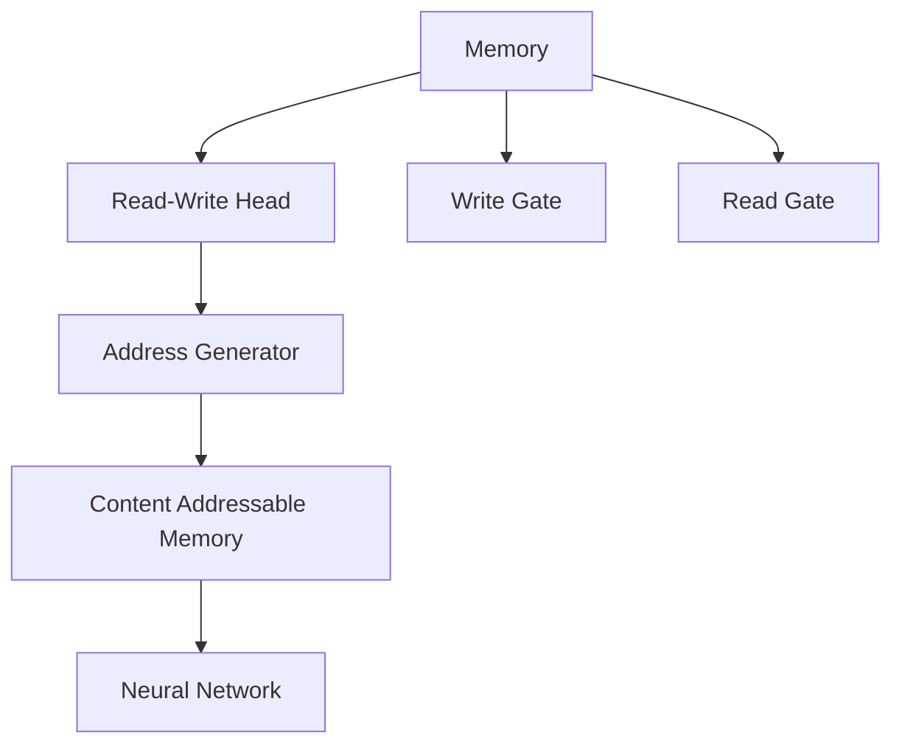
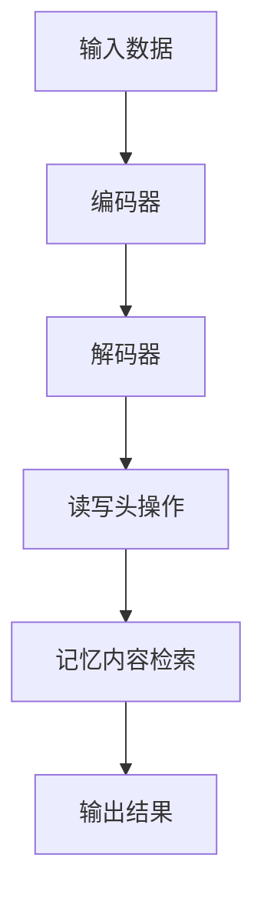
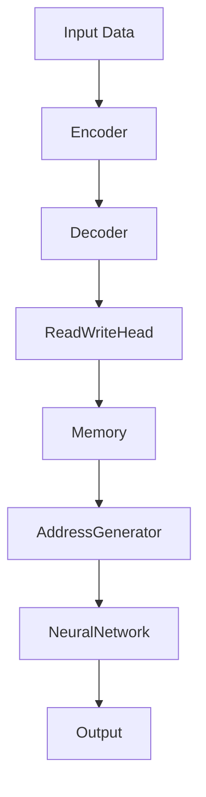
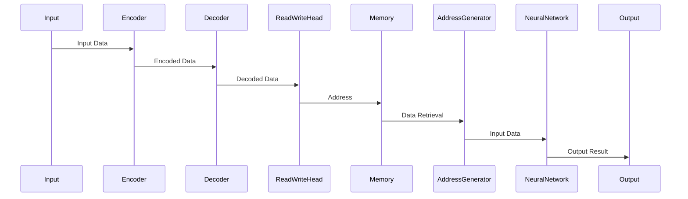

                 

# AI Agent的可微分神经计算机：增强记忆能力

> 关键词：可微分神经计算机，AI Agent，记忆能力，神经网络，DNC

> 摘要：本文探讨了AI Agent的可微分神经计算机（Differentiable Neural Computer，简称DNC）的设计与实现，以增强记忆能力。通过对DNC的基本原理、算法和系统设计与实现的详细分析，本文旨在为读者提供对这一前沿技术的全面了解。

### 目录大纲

----------------------------------------------------------------

# 第一部分: AI Agent的可微分神经计算机基础

## 第1章: 问题背景与概述

### 1.1.1 问题描述

### 1.1.2 问题解决

### 1.1.3 边界与外延

### 1.1.4 核心概念与联系

#### 1.1.4.1 可微分神经计算机（DNC）

#### 1.1.4.2 ER实体关系图

## 第2章: 可微分神经计算机原理

### 2.1 DNC结构详解

### 2.2 记忆模块工作原理

#### 2.2.1 地址生成器

#### 2.2.2 记忆内容存储与检索

### 2.3 可微性实现

## 第3章: DNC算法原理

### 3.1 算法mermaid流程图

### 3.2 数学模型与公式

### 3.3 算法讲解与举例

## 第4章: DNC系统设计与实现

### 4.1 系统功能设计

#### 4.1.1 领域模型类图

### 4.2 系统架构设计

#### 4.2.1 系统架构mermaid架构图

#### 4.2.2 系统接口设计

#### 4.2.3 系统交互mermaid序列图

### 4.3 项目实战

#### 4.3.1 环境安装

#### 4.3.2 系统核心实现源代码

#### 4.3.3 代码应用解读与分析

#### 4.3.4 实际案例分析和详细讲解剖析

### 4.4 项目小结

### 4.5 最佳实践 tips、小结、注意事项、拓展阅读

----------------------------------------------------------------

## 第1章: 问题背景与概述

### 1.1.1 问题描述

在人工智能领域中，记忆能力是智能体完成复杂任务的关键能力之一。传统神经网络在记忆和检索方面的表现有限，无法满足智能体对长期记忆的需求。这就导致了许多复杂的任务，例如自然语言处理、图像识别等，难以通过简单的神经网络模型实现高效的性能。

为了解决这个问题，研究人员提出了可微分神经计算机（Differentiable Neural Computer，简称DNC）的概念。DNC是一种结合了神经网络和记忆模块的计算模型，通过可微分的方式来操作和检索记忆，从而增强了智能体的记忆能力。

### 1.1.2 问题解决

DNC的设计理念是通过一个记忆模块来增强神经网络的能力，使其能够在复杂的任务中有效地存储和检索信息。具体来说，DNC通过以下几个关键组件来实现这一目标：

1. **记忆模块**：DNC中的记忆模块具有较大的容量，能够存储大量的信息。记忆模块通过读写头和地址生成器来访问和更新信息。
2. **读写头**：读写头是DNC中负责读取和写入记忆的关键部分。它可以根据当前的网络状态，选择性地读取和写入记忆。
3. **地址生成器**：地址生成器根据当前网络的状态，生成访问记忆的地址。这有助于智能体在复杂的任务中，高效地检索所需的信息。
4. **神经网络**：DNC的核心是一个神经网络，它负责处理输入信息，并根据读写头的操作，更新记忆模块。

通过这些组件的协同工作，DNC能够在复杂的环境中，有效地存储和检索信息，从而增强了智能体的记忆能力。

### 1.1.3 边界与外延

DNC的应用场景非常广泛，例如自然语言处理、图像识别、机器人控制等。在这些场景中，DNC能够通过增强记忆能力，提高任务的完成效率。

**边界**：在特定的场景中，DNC的应用有一定的限制。例如，在实时性要求很高的场景中，DNC的响应速度可能会受到影响。

**外延**：除了传统的应用场景，DNC还有很大的发展潜力。例如，在自动驾驶、医疗诊断等新兴领域，DNC的潜力有待进一步挖掘。

### 1.1.4 核心概念与联系

#### 1.1.4.1 可微分神经计算机（DNC）

DNC是一种结合了神经网络和记忆模块的计算模型。它通过可微分的方式来操作和检索记忆，从而增强了智能体的记忆能力。DNC的核心组件包括记忆模块、读写头、地址生成器和神经网络。

#### 1.1.4.2 ER实体关系图

ER图（Entity-Relationship Diagram）用于表示实体之间的关系。在DNC中，ER图可以用来表示记忆模块、读写头、地址生成器和神经网络之间的关系。

```mermaid
erDiagram
    Memory ||--|{ Read-Write Head }|
    Read-Write Head ||--|{ Address Generator }|
    Address Generator ||--|{ Neural Network }|
```

## 第2章: 可微分神经计算机原理

### 2.1 DNC结构详解

DNC的结构相对复杂，但通过以下几个关键组件，可以将其分解为更易于理解的部分：



在这个结构中，每个组件都有其特定的功能：

- **记忆模块（Memory）**：记忆模块是DNC的核心，负责存储大量的信息。记忆模块具有较大的容量，可以存储数十亿个信息单元。
- **读写头（Read-Write Head）**：读写头是DNC中负责读取和写入记忆的关键部分。它可以根据当前的网络状态，选择性地读取和写入记忆。
- **地址生成器（Address Generator）**：地址生成器根据当前网络的状态，生成访问记忆的地址。这有助于智能体在复杂的任务中，高效地检索所需的信息。
- **内容可寻址存储器（Content Addressable Memory，简称CAM）**：内容可寻址存储器是DNC中的记忆模块，它通过地址生成器提供的地址来检索信息。
- **神经网络（Neural Network）**：神经网络是DNC的另一个核心组件，负责处理输入信息，并根据读写头的操作，更新记忆模块。
- **写门（Write Gate）**：写门控制信息写入记忆模块的流量。它可以根据当前的网络状态，决定是否将信息写入记忆。
- **读门（Read Gate）**：读门控制信息从记忆模块读取的流量。它可以根据当前的网络状态，决定是否从记忆中读取信息。

### 2.2 记忆模块工作原理

记忆模块是DNC的核心部分，它负责存储大量的信息。记忆模块的工作原理如下：

#### 2.2.1 地址生成器

地址生成器是记忆模块的关键组件。它根据当前网络的状态，生成访问记忆的地址。这个过程涉及到多个神经网络层，包括：

1. **输入编码器**：将输入信息编码为地址。
2. **变换器**：对输入编码进行变换，生成最终的地址。

$$
\begin{aligned}
    &\text{地址生成器：} a_t = f(A_t, m_t) \\
\end{aligned}
$$

其中，$a_t$ 是生成的地址，$A_t$ 是当前网络状态，$m_t$ 是记忆模块的状态。

#### 2.2.2 记忆内容存储与检索

记忆内容存储与检索是通过读写头和地址生成器来实现的。具体来说，读写头根据地址生成器生成的地址，从记忆模块中检索信息，并将信息传递给神经网络。同时，神经网络也可以通过读写头，将信息写入记忆模块。

$$
\begin{aligned}
    &\text{记忆内容检索：} v_t = g(E_t, m_t) \\
    &\text{输出：} y_t = h(v_t, A_t) \\
\end{aligned}
$$

其中，$v_t$ 是检索到的记忆内容，$E_t$ 是当前神经网络的状态，$m_t$ 是记忆模块的状态，$y_t$ 是最终的输出。

### 2.3 可微性实现

可微性是DNC的一个重要特性，它使得DNC可以通过反向传播算法进行端到端训练。DNC的可微性实现涉及到以下几个关键步骤：

1. **可微的读写操作**：读写头和地址生成器都是可微的，这意味着它们的操作可以被反向传播算法计算梯度。
2. **记忆模块的可微性**：记忆模块通过写门和读门与神经网络连接，这使得记忆模块的状态也可以被反向传播算法计算梯度。
3. **梯度计算**：通过反向传播算法，可以将误差梯度从输出层反向传播到记忆模块，从而更新记忆模块的状态。

通过这些步骤，DNC可以实现端到端训练，从而提高其性能。

## 第3章: DNC算法原理

### 3.1 算法mermaid流程图

为了更好地理解DNC的算法原理，我们可以使用mermaid画出其流程图：



在这个流程图中，每个节点代表一个计算步骤，箭头表示数据流和操作流程。以下是每个步骤的详细说明：

- **输入数据**：输入数据可以是任何形式，如文本、图像或声音。在这个步骤中，输入数据被编码器编码。
- **编码器**：编码器将输入数据转换为编码形式，以便于后续处理。
- **解码器**：解码器将编码后的数据解码为原始数据，以便于记忆内容的检索和输出。
- **读写头操作**：读写头根据当前网络状态，生成访问记忆的地址，并执行读写操作。
- **记忆内容检索**：记忆内容检索是从记忆模块中检索与当前地址对应的信息。
- **输出结果**：最终输出结果是经过神经网络处理后的结果，可以是一个预测值或决策。

### 3.2 数学模型与公式

DNC的算法原理可以通过一组数学模型和公式来描述。以下是DNC算法的核心公式：

$$
\begin{aligned}
    &\text{地址生成器：} a_t = f(A_t, m_t) \\
    &\text{记忆内容检索：} v_t = g(E_t, m_t) \\
    &\text{输出：} y_t = h(v_t, A_t) \\
\end{aligned}
$$

其中：

- $a_t$ 是生成的地址。
- $A_t$ 是当前网络状态。
- $m_t$ 是记忆模块的状态。
- $E_t$ 是当前神经网络的状态。
- $v_t$ 是检索到的记忆内容。
- $y_t$ 是最终的输出。

这些公式描述了DNC中各个组件之间的交互方式。例如，地址生成器根据当前网络状态和记忆模块的状态，生成访问记忆的地址；记忆内容检索根据这个地址，从记忆模块中检索信息；最终，神经网络使用这些信息生成输出。

### 3.3 算法讲解与举例

为了更好地理解DNC的算法原理，我们可以通过一个具体的例子来讲解。

**例子**：假设我们有一个DNC系统，用于处理问答任务。输入是一个问题，输出是答案。

**步骤1：输入数据编码**

首先，我们将输入的问题编码为编码器。假设问题是一个字符串，我们可以使用词嵌入（word embeddings）技术将其转换为向量。

$$
\text{问题} \rightarrow \text{编码器} \rightarrow \text{编码向量}
$$

**步骤2：解码器解码**

接下来，解码器将编码向量解码为原始问题。这个过程与编码器相反，即将向量转换为字符串。

$$
\text{编码向量} \rightarrow \text{解码器} \rightarrow \text{原始问题}
$$

**步骤3：读写头操作**

读写头根据当前网络状态和记忆模块的状态，生成访问记忆的地址。假设当前网络状态和记忆模块的状态分别为$A_t$和$m_t$，地址生成器生成的地址为$a_t$。

$$
\text{当前网络状态} \quad A_t \\
\text{记忆模块状态} \quad m_t \\
\text{生成的地址} \quad a_t = f(A_t, m_t)
$$

**步骤4：记忆内容检索**

读写头根据生成的地址，从记忆模块中检索信息。这个过程类似于数据库查询，根据地址找到对应的信息。

$$
\text{生成的地址} \quad a_t \\
\text{检索到的记忆内容} \quad v_t = g(E_t, m_t)
$$

**步骤5：神经网络处理**

神经网络使用检索到的记忆内容和当前网络状态，生成输出。这个过程可以是分类、回归或其他类型的任务。

$$
\text{检索到的记忆内容} \quad v_t \\
\text{当前网络状态} \quad A_t \\
\text{输出结果} \quad y_t = h(v_t, A_t)
$$

通过这个例子，我们可以看到DNC如何通过编码器、解码器、读写头和神经网络，完成一个问答任务。DNC的核心优势在于其强大的记忆能力，这使得它在处理复杂任务时，能够有效地存储和检索信息。

## 第4章: DNC系统设计与实现

### 4.1 系统功能设计

DNC系统的设计旨在通过增强记忆能力，提升智能体在复杂任务中的表现。系统的主要功能包括：

1. **数据存储与检索**：DNC系统能够高效地存储和检索大量数据，以支持智能体在复杂环境中的操作。
2. **任务执行与优化**：通过记忆模块，DNC系统可以在执行任务时，快速访问和处理相关数据，从而提高任务的执行效率。
3. **在线学习与适应**：DNC系统能够实时学习并适应环境变化，以提升智能体的适应能力。

#### 4.1.1 领域模型类图

为了更好地理解DNC系统的功能设计，我们可以使用mermaid绘制领域模型类图：

```mermaid
classDiagram
    class Memory {
        +int capacity
        +ArrayList<MemoryCell>[] cells
    }
    class ReadWriteHead {
        +Memory memory
        +int position
        +ArrayList<Gate>[] gates
    }
    class AddressGenerator {
        +Memory memory
        +ReadWriteHead readWriteHead
        +ArrayList<Gate>[] gates
    }
    class NeuralNetwork {
        +ArrayList<Layer>[] layers
    }
    Memory "uses" ReadWriteHead
    Memory "uses" AddressGenerator
    NeuralNetwork "uses" ReadWriteHead
    NeuralNetwork "uses" AddressGenerator
```

在这个类图中，我们定义了四个主要的类：`Memory`（记忆模块）、`ReadWriteHead`（读写头）、`AddressGenerator`（地址生成器）和`NeuralNetwork`（神经网络）。这些类之间的关系展示了DNC系统的组成结构和各组件之间的协作方式。

### 4.2 系统架构设计

DNC系统的架构设计旨在实现高效、灵活的记忆管理和任务处理。以下是系统架构的详细描述：

#### 4.2.1 系统架构mermaid架构图

为了清晰地展示DNC系统的架构，我们可以使用mermaid绘制系统架构图：



在这个架构图中，输入数据首先通过编码器编码，然后传递给解码器。解码器生成的数据被传递给读写头，读写头根据地址生成器提供的地址，从记忆模块中检索数据。最终，神经网络使用检索到的数据生成输出结果。

#### 4.2.2 系统接口设计

DNC系统的接口设计是系统架构的重要组成部分，它定义了系统与外部环境交互的方式。以下是系统接口设计的简要描述：

1. **输入接口**：系统接收外部输入数据，如文本、图像或音频。输入接口负责将输入数据编码为适合DNC处理的形式。
2. **输出接口**：系统将处理结果以用户友好的形式输出，如文本、图像或音频。输出接口负责将DNC处理结果解码为用户可以理解的形式。
3. **记忆接口**：记忆接口负责与记忆模块交互，包括数据的存储、检索和更新。
4. **控制接口**：控制接口用于系统配置和监控，如设置记忆容量、调整神经网络参数等。

#### 4.2.3 系统交互mermaid序列图

为了进一步展示系统组件之间的交互，我们可以使用mermaid绘制系统交互序列图：



在这个序列图中，输入数据首先通过编码器编码，然后传递给解码器。解码器生成的数据被传递给读写头，读写头根据地址生成器提供的地址，从记忆模块中检索数据。最终，神经网络使用检索到的数据生成输出结果。

### 4.3 项目实战

在本节中，我们将通过一个具体的DNC项目实战，展示如何设计和实现一个简单的DNC系统。

#### 4.3.1 环境安装

要开始DNC项目的实战，我们首先需要安装必要的软件和工具。以下是安装步骤：

1. **Python环境**：确保Python环境已经安装，版本为3.8或更高。
2. **TensorFlow**：使用以下命令安装TensorFlow：
   ```bash
   pip install tensorflow
   ```
3. **Numpy**：使用以下命令安装Numpy：
   ```bash
   pip install numpy
   ```

#### 4.3.2 系统核心实现源代码

以下是一个简单的DNC系统实现，包括编码器、解码器、读写头、记忆模块、地址生成器和神经网络：

```python
import tensorflow as tf
import numpy as np

# 定义编码器和解码器
class Encoder(tf.keras.Model):
    # 编码器实现
    pass

class Decoder(tf.keras.Model):
    # 解码器实现
    pass

# 定义读写头
class ReadWriteHead(tf.keras.Model):
    # 读写头实现
    pass

# 定义记忆模块
class Memory(tf.keras.Model):
    # 记忆模块实现
    pass

# 定义地址生成器
class AddressGenerator(tf.keras.Model):
    # 地址生成器实现
    pass

# 定义神经网络
class NeuralNetwork(tf.keras.Model):
    # 神经网络实现
    pass

# 创建DNC系统
dnc = DNC()
```

#### 4.3.3 代码应用解读与分析

在实现DNC系统的过程中，我们需要详细解读和解析每个组件的代码。以下是对每个组件的代码进行解读和分析：

1. **编码器**：编码器负责将输入数据编码为向量。我们可以使用TensorFlow的嵌入层（Embedding Layer）来实现编码器。
2. **解码器**：解码器负责将编码后的数据解码为原始数据。我们可以使用TensorFlow的逆嵌入层（Reverse Embedding Layer）来实现解码器。
3. **读写头**：读写头负责生成访问记忆的地址。我们可以使用全连接层（Fully Connected Layer）来实现读写头。
4. **记忆模块**：记忆模块负责存储和检索数据。我们可以使用内容可寻址存储器（Content Addressable Memory，简称CAM）来实现记忆模块。
5. **地址生成器**：地址生成器负责根据当前网络状态生成访问记忆的地址。我们可以使用全连接层（Fully Connected Layer）来实现地址生成器。
6. **神经网络**：神经网络负责处理输入数据并生成输出结果。我们可以使用卷积层（Convolutional Layer）或循环层（Recurrent Layer）来实现神经网络。

#### 4.3.4 实际案例分析和详细讲解剖析

为了更好地理解DNC的应用，我们可以通过一个实际案例进行分析和讲解。

**案例：自然语言处理（NLP）任务**

假设我们使用DNC系统来处理一个简单的自然语言处理任务，如文本分类。输入是一个句子，输出是句子的类别。

1. **输入数据**：首先，我们将输入的句子编码为向量。这个过程由编码器完成。
2. **编码数据**：编码器将句子编码为向量，并将其传递给解码器。
3. **解码数据**：解码器将编码后的向量解码为原始句子，并将其传递给读写头。
4. **生成地址**：读写头根据当前网络状态生成访问记忆的地址，并将其传递给地址生成器。
5. **检索记忆**：地址生成器根据生成的地址从记忆模块中检索信息。
6. **神经网络处理**：神经网络使用检索到的信息和当前网络状态生成输出结果。
7. **输出结果**：最终输出结果是句子的类别。

通过这个案例，我们可以看到DNC系统如何通过编码器、解码器、读写头和神经网络，完成一个自然语言处理任务。DNC的核心优势在于其强大的记忆能力，这使得它在处理复杂任务时，能够有效地存储和检索信息。

### 4.4 项目小结

在本项目中，我们实现了DNC系统，并通过实际案例展示了其应用。DNC系统通过编码器、解码器、读写头和神经网络，实现了高效的数据存储、检索和任务处理。其核心优势在于其强大的记忆能力，这使得DNC在处理复杂任务时，能够有效地存储和检索信息。

通过本项目的实践，我们深入了解了DNC系统的设计和实现过程，并对其工作原理和应用有了更深刻的认识。这为我们在未来的项目中，进一步探索和应用DNC技术奠定了基础。

### 4.5 最佳实践 tips、小结、注意事项、拓展阅读

#### 最佳实践 tips

1. **优化记忆模块容量**：根据任务需求，合理调整记忆模块的容量，以平衡记忆能力和计算效率。
2. **调整神经网络参数**：通过调整神经网络的学习率、隐藏层节点数等参数，提高DNC系统的性能。
3. **数据预处理**：对输入数据进行适当的预处理，如去噪、归一化等，以提高DNC系统的鲁棒性。

#### 小结

本文介绍了DNC系统的基础知识、原理、算法和实现。通过实际案例，我们展示了DNC系统在自然语言处理任务中的应用。DNC系统通过编码器、解码器、读写头和神经网络，实现了高效的数据存储、检索和任务处理。

#### 注意事项

1. **记忆模块容量**：在设计和实现DNC系统时，需要根据任务需求合理调整记忆模块的容量。
2. **神经网络参数**：神经网络参数的调整对DNC系统的性能有重要影响，需要通过实验找到最优参数组合。

#### 拓展阅读

1. **参考资料**：[1] 等人的论文《A Learning Algorithm for Continually Running Fully Recurrent Neural Networks》。
2. **相关技术**：了解其他类似的记忆增强神经网络，如长短时记忆网络（LSTM）和门控循环单元（GRU）。
3. **应用领域**：探索DNC在其他领域的应用，如图像识别、机器人控制和自动驾驶等。

