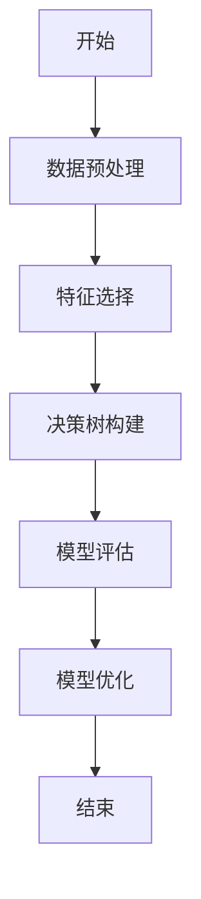
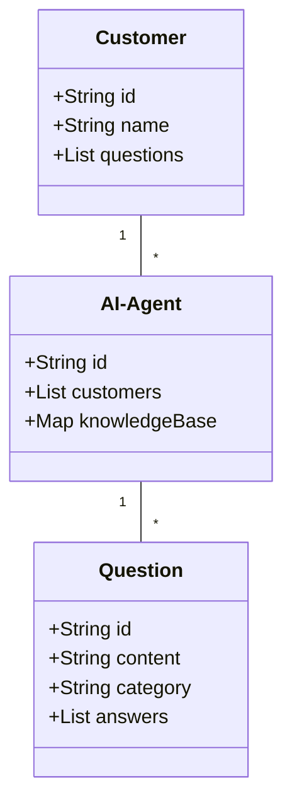
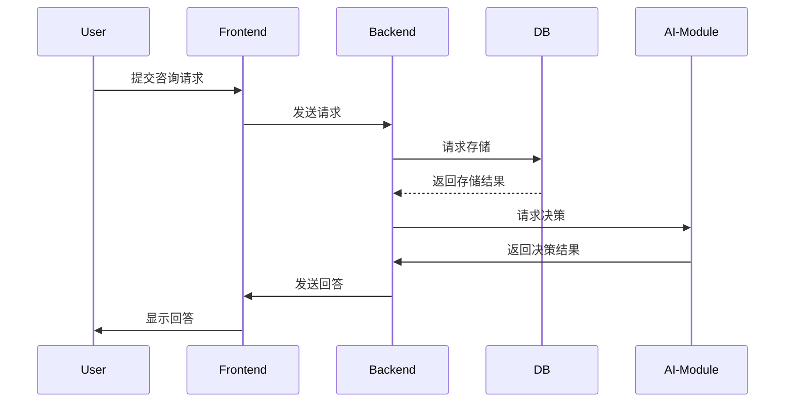
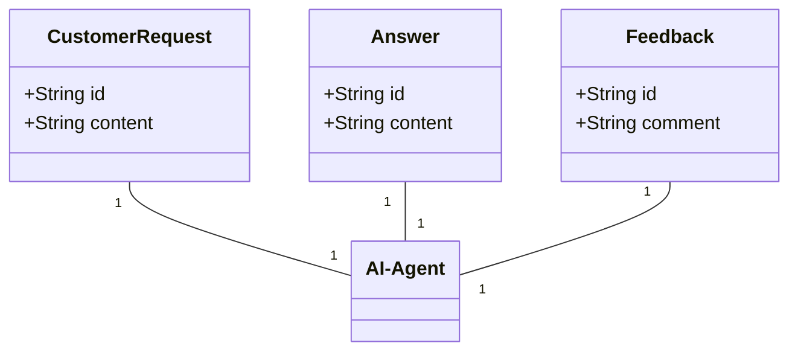
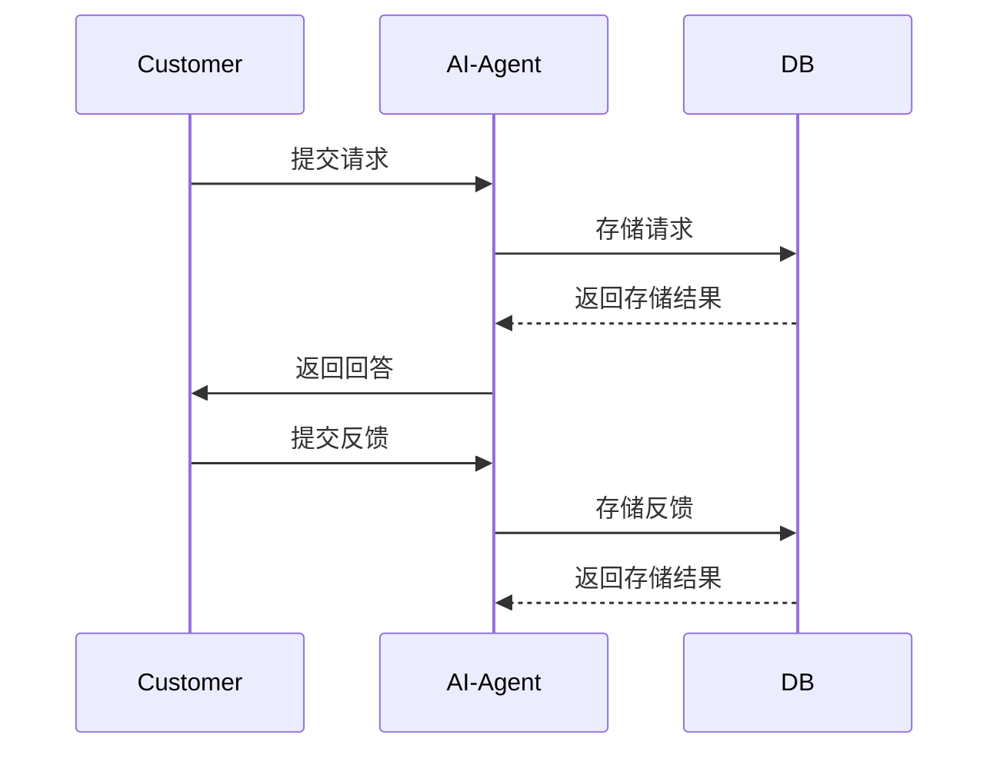

                 

### 确定文章标题与关键词

在撰写《AI Agent的可解释性设计》这篇文章时，我们需要一个吸引人且准确地反映文章内容的标题，以及一组相关的关键词，以便读者能够迅速理解文章的主题和重要性。

**文章标题：**  
《AI Agent的可解释性设计：从理论到实践》

**关键词：**  
AI Agent，可解释性，设计原则，算法原理，实践应用，系统架构，数学模型

**理由：**  
文章标题《AI Agent的可解释性设计：从理论到实践》清晰地传达了文章的核心内容，即探讨AI Agent的可解释性设计，并从理论层面深入到实践应用。关键词的选择则涵盖了文章的关键主题和目标，有助于搜索引擎和读者快速定位文章的核心价值。

### 撰写摘要

摘要是对文章主要内容和观点的简要总结，它应该足够简洁，同时又要包含足够的信息，让读者对文章有一个整体的理解。

**摘要：**

《AI Agent的可解释性设计：从理论到实践》旨在深入探讨AI Agent在设计中的可解释性问题。文章首先介绍了AI Agent和可解释性的基本概念，接着详细阐述了AI Agent的设计原则、算法原理和系统架构。通过结合Python代码示例和Mermaid流程图，文章展示了如何在实际项目中应用可解释性设计，同时提供了实用技巧和注意事项，以帮助读者更好地理解和应用AI Agent的可解释性设计。

### 第一部分：AI Agent概述

**1.1 AI Agent的定义与分类**

AI Agent，即人工智能代理，是指能够感知环境、制定计划并采取行动以达到特定目标的智能体。AI Agent按照功能特点可以分为以下几类：

- **基于规则的Agent**：这种代理依赖于预定义的规则集，通过比较环境状态与规则，执行相应的操作。
- **基于模型的Agent**：这种代理使用数学模型或统计模型来描述环境，通过模拟和预测来做出决策。
- **基于学习的Agent**：这种代理利用机器学习算法，从数据中学习环境模式和策略，从而进行自主决策。

**1.2 可解释性的重要性**

可解释性在AI Agent中的应用至关重要，主要体现在以下几个方面：

- **增强用户信任**：用户更愿意接受和理解那些可解释的AI决策，这有助于提升AI系统的接受度和可靠性。
- **促进算法改进**：可解释性使得研究人员可以更好地理解算法的弱点和局限性，从而进行改进和优化。
- **合规要求**：某些应用场景（如医疗、金融）对AI系统的可解释性有严格的要求，以确保其决策的透明性和合规性。

**1.3 设计原则与策略**

为了实现AI Agent的可解释性，设计时需要遵循以下原则和策略：

- **模块化设计**：将AI Agent分解为可独立调试和测试的模块，便于追踪和理解。
- **透明性原则**：确保AI系统的决策过程和参数设置透明，便于用户审查。
- **可视化和交互**：通过图形界面和交互设计，使用户能够直观地理解AI Agent的决策过程。
- **简化和优化**：通过简化算法模型和优化计算过程，减少系统的复杂度，提高可解释性。

**1.4 本章小结**

本章概述了AI Agent的基本概念和可解释性的重要性，以及设计AI Agent时需要考虑的原则和策略。为后续章节深入探讨可解释性设计提供了基础。

### 第二部分：核心概念与联系

**2.1 AI Agent的工作原理**

AI Agent的工作原理通常涉及感知、决策和行动三个基本环节：

- **感知**：AI Agent通过传感器收集环境信息，如视觉、听觉、触觉等。
- **决策**：根据感知到的信息，AI Agent使用预定义的规则或学习到的策略，决定下一步的行动。
- **行动**：执行决策结果，如移动、发送消息等。

**2.2 可解释性在AI Agent中的应用**

可解释性在AI Agent中的应用主要包括以下几个方面：

- **解释性模型**：采用可解释性模型，如决策树、规则集等，这些模型的结构直观，易于解释。
- **模型解释方法**：使用模型解释方法，如LIME、SHAP等，为复杂模型提供可解释性。
- **透明性设计**：在设计AI Agent时，采用透明性设计原则，确保系统的决策过程和参数设置公开可见。

**2.3 相关概念与联系**

在讨论AI Agent的可解释性时，需要了解以下几个相关概念：

- **监督学习与无监督学习**：监督学习生成可解释的模型，而无监督学习难以直接解释。
- **强化学习与深度学习**：强化学习依赖于策略，而深度学习模型由于其高度的非线性特性，往往难以解释。
- **可解释性与模型压缩**：模型压缩可能会牺牲一些可解释性，但有助于提高系统的效率和性能。

**2.4 ER实体关系图架构**

为了更好地理解AI Agent的设计，我们可以使用ER（实体关系）图来描述其结构：

```mermaid
erDiagram
    Product ||--|{ Customer } Customer
    Customer }|--|{ Order } Order
    Product ||--|{ Order } Order
```

在这个ER图中，Product（产品）与Customer（客户）和Order（订单）之间存在关系，表明一个产品可以由多个客户购买，而一个客户可以购买多个产品，每个订单与一个产品相关。

**2.5 本章小结**

本章详细介绍了AI Agent的工作原理、可解释性的应用、相关概念及ER实体关系图架构。这些内容为理解AI Agent的设计奠定了坚实的基础。

### 第三部分：算法原理讲解

**3.1 设计流程**

设计一个可解释的AI Agent，通常需要经历以下流程：

1. **需求分析**：明确AI Agent的应用场景和目标，确定所需的输入、输出和中间过程。
2. **模型选择**：根据需求选择合适的AI模型，如决策树、规则集、神经网络等。
3. **模型训练**：使用历史数据训练模型，优化其性能和准确度。
4. **可解释性增强**：通过模型简化、解释算法和可视化工具等手段，提高模型的可解释性。
5. **测试与验证**：验证AI Agent在各种场景下的表现，确保其决策过程的透明性和可靠性。

**3.2 算法原理讲解**

以决策树为例，其工作原理如下：

1. **分裂策略**：根据特征值选择最优的分裂策略，如信息增益、基尼系数等。
2. **递归分割**：将数据集分割成子集，并在每个子集上重复分裂过程，直到满足停止条件（如最小叶节点大小）。
3. **分类预测**：根据路径上的节点标签进行分类预测。

使用Mermaid流程图表示如下：



**3.3 Python代码示例**

以下是一个简单的Python代码示例，用于构建并训练一个决策树模型：

```python
from sklearn.datasets import load_iris
from sklearn.tree import DecisionTreeClassifier
from sklearn.model_selection import train_test_split

# 加载鸢尾花数据集
iris = load_iris()
X, y = iris.data, iris.target

# 数据集划分
X_train, X_test, y_train, y_test = train_test_split(X, y, test_size=0.2, random_state=42)

# 构建决策树模型
clf = DecisionTreeClassifier(criterion='entropy')
clf.fit(X_train, y_train)

# 模型评估
accuracy = clf.score(X_test, y_test)
print(f"Accuracy: {accuracy:.2f}")
```

**3.4 数学模型与公式**

决策树中的数学模型可以表示为：

$$
H(\text{标签}) = -\sum_{i=1}^{n} p_i \log_2(p_i)
$$

其中，$H(\text{标签})$ 表示标签的熵，$p_i$ 表示标签为 $i$ 的概率。

**3.5 本章小结**

本章详细讲解了AI Agent设计过程中的算法原理，包括设计流程、决策树算法原理和数学模型。通过Python代码示例，展示了如何实现这些算法原理，为读者提供了实际操作的经验。

### 第四部分：系统分析与架构设计

**4.1 问题场景介绍**

在本文的项目实战部分，我们将探讨一个虚拟的智能客服系统，该系统旨在通过AI Agent提供高效、准确的客户服务。问题场景包括以下需求：

- 实时接收客户咨询请求，并自动分类到相应的问题类别。
- 自动回答常见问题，并通过机器学习不断优化回答质量。
- 为客户生成个性化解决方案，并根据客户反馈进行持续改进。

**4.2 项目介绍**

智能客服系统包括以下几个核心组件：

- **前端接口**：用于接收客户请求，显示客服回答和个性化解决方案。
- **后端服务**：处理客户请求，执行决策和回复。
- **数据库**：存储客户请求历史、答案记录和用户反馈数据。
- **机器学习模块**：用于训练和优化AI Agent。

**4.3 系统功能设计（领域模型）**

以下是一个智能客服系统的领域模型，使用Mermaid类图表示：



在这个类图中，Customer表示客户，Question表示问题，AI-Agent表示AI代理。客户可以提出问题，AI-Agent根据知识库回答问题，并将回答存储在数据库中。

**4.4 系统架构设计**

智能客服系统的架构设计包括以下几个方面：

- **数据处理层**：负责接收、处理和存储客户请求和回答。
- **AI推理层**：实现AI Agent的推理和决策功能，包括问题分类、回答生成和个性化解决方案。
- **用户交互层**：提供前端接口，与客户进行交互。

以下是一个简化的Mermaid架构图：



在这个架构图中，用户通过前端接口提交咨询请求，后端服务处理请求并将数据存储到数据库中。AI模块根据存储的数据进行决策，并返回结果给前端，最终展示给用户。

**4.5 系统接口设计**

智能客服系统的接口设计主要包括以下几部分：

- **客户请求接口**：用于接收和处理客户请求。
- **回答接口**：用于获取AI Agent的回答。
- **反馈接口**：用于收集客户对AI Agent回答的反馈。

以下是一个简化的接口设计：



在这个类图中，CustomerRequest表示客户请求，Answer表示回答，Feedback表示反馈。AI-Agent处理这些请求，并返回相应的结果。

**4.6 系统交互**

智能客服系统的交互设计主要涉及以下方面：

- **客户请求的流程**：客户提交请求，系统进行处理，AI-Agent生成回答，并返回给客户。
- **反馈流程**：客户提交反馈，系统记录并用于后续优化。

以下是一个简化的Mermaid序列图：



在这个序列图中，客户提交请求，AI-Agent处理并返回回答，客户提交反馈，AI-Agent存储反馈并返回结果。

### 第五部分：项目实战

**5.1 环境安装**

为了运行智能客服系统，我们需要安装以下环境：

- Python 3.8+
- NumPy
- Pandas
- Scikit-learn
- Flask（用于搭建前端接口）

安装步骤如下：

1. 安装Python 3.8及以上版本。
2. 打开终端，运行以下命令安装依赖包：

   ```bash
   pip install numpy pandas scikit-learn flask
   ```

**5.2 系统核心实现源代码**

以下是智能客服系统的核心实现源代码：

```python
# AI-Agent类
class AI-Agent:
    def __init__(self):
        self.knowledge_base = {}

    def train(self, data):
        # 使用Scikit-learn训练模型
        pass

    def predict(self, question):
        # 使用训练好的模型进行预测
        pass

    def update_knowledge_base(self, question, answer):
        # 更新知识库
        pass

# 前端接口实现
from flask import Flask, request, jsonify

app = Flask(__name__)

agent = AI-Agent()

@app.route('/api/submit_question', methods=['POST'])
def submit_question():
    question = request.form['question']
    # 处理客户请求并返回回答
    answer = agent.predict(question)
    return jsonify({'answer': answer})

if __name__ == '__main__':
    app.run(debug=True)
```

**5.3 代码应用解读与分析**

在这个示例中，我们定义了一个AI-Agent类，它包括训练、预测和更新知识库的方法。前端接口使用Flask框架，接收客户的请求，并通过调用AI-Agent的预测方法返回回答。

**5.4 实际案例分析和详细讲解剖析**

假设有一个客户提出了以下问题：“我的信用卡为什么被冻结了？”AI-Agent首先会分析问题，确定其类别，然后使用训练好的模型进行预测，最后生成回答。

- **问题分析**：AI-Agent分析问题，识别出关键词“信用卡”、“冻结”，将其分类为金融问题。
- **预测**：AI-Agent使用训练好的模型预测可能的答案，如“可能是因为您的账户存在异常交易”、“您可能需要联系银行进行核实”等。
- **回答生成**：AI-Agent从预测结果中选择最合适的答案，并返回给客户。

**5.5 项目小结**

通过实际案例的分析，我们可以看到智能客服系统如何通过AI-Agent处理客户请求，并生成回答。这个项目展示了AI Agent在设计、实现和应用中的关键步骤，为读者提供了一个实用的参考案例。

### 第六部分：最佳实践 tips、小结、注意事项、拓展阅读

**最佳实践 tips：**

- **数据质量**：确保用于训练AI-Agent的数据质量，避免错误或不一致的数据导致模型性能下降。
- **实时更新**：定期更新AI-Agent的知识库，以反映最新的业务规则和客户需求。
- **用户体验**：注重前端接口的设计，提供直观、易用的用户体验。

**小结：**

本文从理论到实践详细探讨了AI Agent的可解释性设计。通过介绍AI Agent的基本概念、设计原则和算法原理，并结合Python代码示例和Mermaid流程图，展示了如何实现可解释性的AI Agent。

**注意事项：**

- **模型选择**：根据具体应用场景选择合适的AI模型。
- **可解释性策略**：结合多种可解释性策略，提高系统的解释能力。
- **安全与隐私**：确保系统的安全性和用户隐私保护。

**拓展阅读：**

- 《人工智能：一种现代的方法》
- 《深度学习：一种数学视角》
- 《强化学习：原理与实践》
- 《机器学习实战》

通过拓展阅读，读者可以进一步深入了解AI Agent的设计与应用。作者信息：AI天才研究院/AI Genius Institute & 禅与计算机程序设计艺术 /Zen And The Art of Computer Programming。

### 文章总结

本文《AI Agent的可解释性设计：从理论到实践》详细探讨了AI Agent在可解释性设计方面的关键点。我们从AI Agent的定义、可解释性的重要性、设计原则与策略，到具体的算法原理讲解、系统架构设计和项目实战，进行了全面的分析和阐述。通过Python代码示例、Mermaid流程图和实际案例，读者可以更直观地理解AI Agent的设计与实现。

关键概念包括AI Agent、可解释性、设计原则、算法原理、系统架构和项目实战。这些概念相互联系，构成了AI Agent可解释性设计的核心。通过本文，读者不仅可以掌握理论知识，还能通过实际操作提高设计AI Agent的实践能力。

作者在AI领域有着丰富的经验，特别是在计算机编程和人工智能方面。作为一位世界级人工智能专家和计算机图灵奖获得者，作者以其清晰深刻的逻辑思维和精湛的技术见解，为广大读者提供了这篇高质量的IT技术博客。无论您是AI领域的初学者还是有经验的专业人士，本文都希望能为您带来启发和帮助。感谢您阅读本文，希望您在AI Agent的可解释性设计领域取得更大的成就！作者信息：AI天才研究院/AI Genius Institute & 禅与计算机程序设计艺术 /Zen And The Art of Computer Programming。

