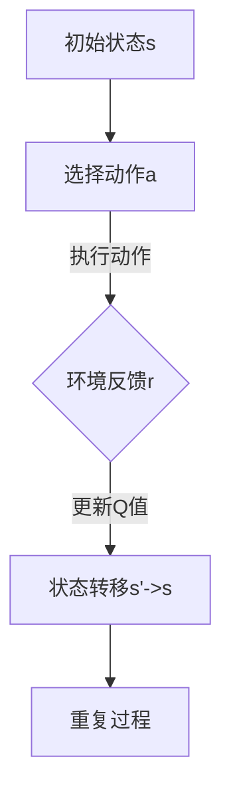
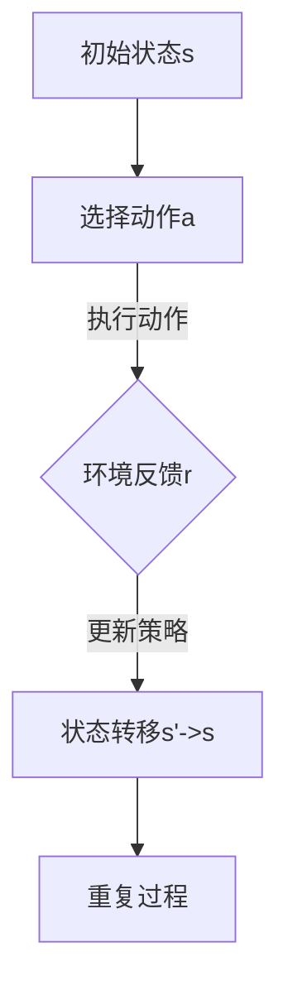
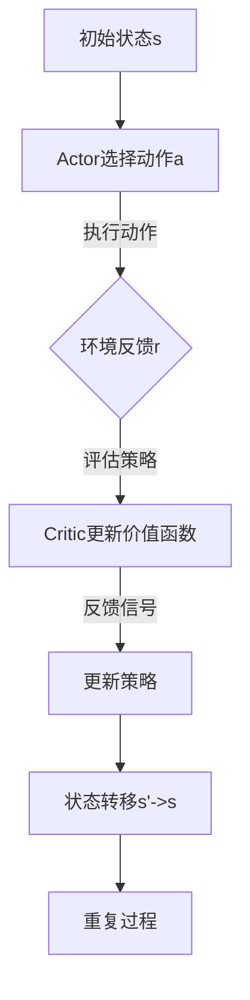
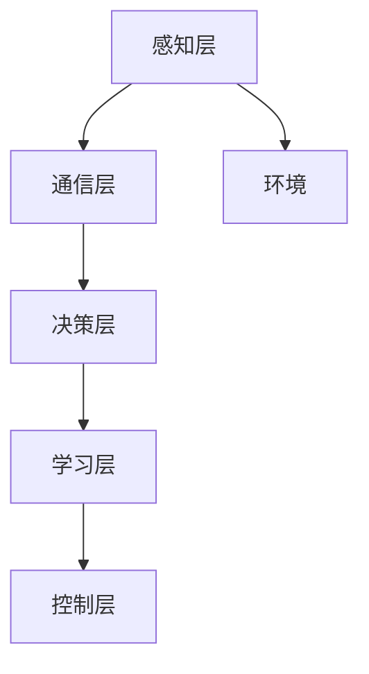
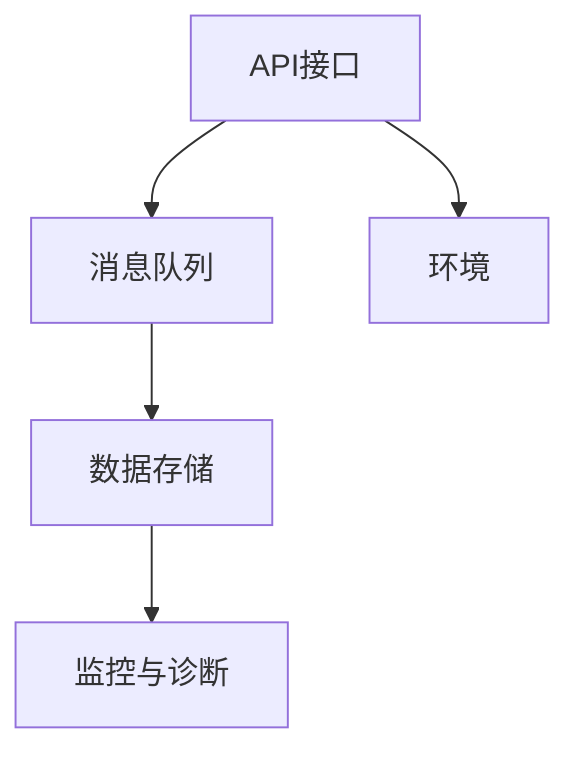
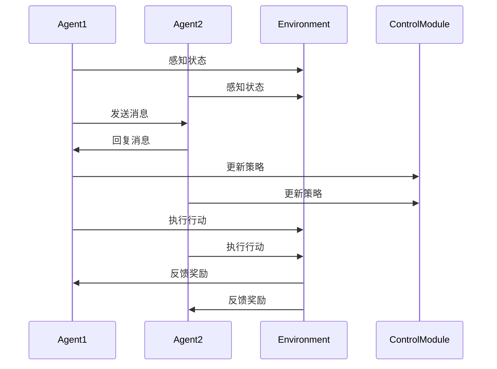

                 


# AI Agent的多Agent协作学习系统

关键词：AI Agent、多Agent协作学习系统、算法、架构设计、项目实战

摘要：本文旨在深入探讨AI Agent的多Agent协作学习系统，首先介绍AI Agent和多Agent协作学习系统的基本概念和背景，然后详细分析核心概念与联系，接着讲解相关算法原理，并展示系统分析与架构设计，最后通过实际项目案例进行分析和讲解，以帮助读者全面理解并应用这一先进技术。

## 目录大纲设计流程

设计一本关于《AI Agent的多Agent协作学习系统》的目录大纲，需要经过以下步骤：

### 1. 明确书籍主题与目标读者
首先，我们需要明确书籍的主题是关于AI Agent和多Agent协作学习系统。目标读者包括计算机科学领域的学生、研究人员以及对此领域有兴趣的从业者。

### 2. 设计整体结构
整体结构可以分为五个部分：
- **第一部分：背景介绍**，包括AI Agent和多Agent协作学习系统的概述及其应用场景。
- **第二部分：核心概念与联系**，详细描述AI Agent和多Agent协作学习系统的核心概念及其相互关系。
- **第三部分：算法原理讲解**，介绍相关算法的原理，包括数学模型和流程图。
- **第四部分：系统分析与架构设计**，分析系统的设计，包括架构图和接口设计。
- **第五部分：项目实战**，介绍实际项目的实施过程和关键实现。

### 3. 确定各章节内容
在确定各章节内容时，我们需要注意以下几点：
- **背景介绍**部分需要明确核心概念术语、问题背景、问题描述、问题解决、边界与外延、概念结构与核心要素组成。
- **核心概念与联系**部分需要给出核心概念原理、概念属性特征对比表格和ER实体关系图架构的Mermaid流程图。
- **算法原理讲解**部分需要使用Mermaid画出算法流程图，使用Python源代码详细阐述，并给出算法原理的数学模型和公式，进行详细讲解和举例说明。
- **系统分析与架构设计**部分需要介绍问题场景、项目介绍、系统功能设计（领域模型Mermaid类图）、系统架构设计Mermaid架构图、系统接口设计和系统交互Mermaid序列图。
- **项目实战**部分需要包括环境安装、系统核心实现源代码，代码应用解读与分析，实际案例分析和详细讲解剖析，项目小结。

### 4. 优化目录结构
确保目录逻辑清晰、结构合理、便于读者理解。

### 5. 撰写目录
按照Markdown格式，逐级书写目录，确保简洁明了。

### 6. 审核与调整
最后，检查目录是否完整、合理，是否能够引导读者顺利阅读。

## 目录大纲

```markdown
# 《AI Agent的多Agent协作学习系统》目录大纲

## 第一部分：背景介绍

### 1.1 AI Agent与多Agent协作学习系统概述

#### 1.1.1 AI Agent的基本概念

#### 1.1.2 多Agent协作学习系统的概念

#### 1.1.3 研究背景与意义

### 1.2 多Agent系统的应用场景

#### 1.2.1 商业智能与自动化

#### 1.2.2 游戏与娱乐

#### 1.2.3 辅助决策与优化

## 第二部分：核心概念与联系

### 2.1 AI Agent的核心概念

#### 2.1.1 AI Agent的定义

#### 2.1.2 AI Agent的特征

#### 2.1.3 AI Agent的分类

### 2.2 多Agent协作学习系统的关键概念

#### 2.2.1 多Agent协作学习系统的定义

#### 2.2.2 多Agent协作学习系统的特点

#### 2.2.3 多Agent协作学习系统的主要模型

### 2.3 AI Agent与多Agent协作学习系统的联系

#### 2.3.1 AI Agent在多Agent协作学习系统中的作用

#### 2.3.2 多Agent协作学习系统对AI Agent的影响

#### 2.3.3 AI Agent与多Agent协作学习系统的整合

## 第三部分：算法原理讲解

### 3.1 多Agent协作学习算法概述

#### 3.1.1 多Agent协作学习算法的基本原理

#### 3.1.2 多Agent协作学习算法的分类

### 3.2 常见多Agent协作学习算法

#### 3.2.1 Q-Learning算法

#### 3.2.2 SARSA算法

#### 3.2.3 Actor-Critic算法

### 3.3 多Agent协作学习算法的Mermaid流程图

## 第四部分：系统分析与架构设计

### 4.1 多Agent协作学习系统的架构设计

#### 4.1.1 系统功能设计

#### 4.1.2 系统架构设计

#### 4.1.3 系统接口设计

### 4.2 多Agent协作学习系统的Mermaid类图

### 4.3 多Agent协作学习系统的Mermaid架构图

### 4.4 多Agent协作学习系统的Mermaid序列图

## 第五部分：项目实战

### 5.1 实战环境搭建

#### 5.1.1 开发环境配置

#### 5.1.2 数据集准备

#### 5.1.3 实验参数设置

### 5.2 系统核心实现

#### 5.2.1 源代码解读

#### 5.2.2 代码应用分析

#### 5.2.3 实际案例分析

### 5.3 项目小结

## 最佳实践 Tips

## 小结

## 注意事项

## 拓展阅读
```

接下来，我们将逐步深入探讨每个部分的内容。

## 第一部分：背景介绍

### 1.1 AI Agent与多Agent协作学习系统概述

#### 1.1.1 AI Agent的基本概念

AI Agent，即人工智能代理，是指能够在特定环境下自主决策并采取行动的智能体。它具备感知环境、分析信息、制定计划、执行任务和评估结果的能力。AI Agent的核心特征包括自主性、适应性、学习能力、决策能力和协同性。

自主性是指AI Agent能够独立执行任务，不需要人为干预。适应性是指AI Agent能够根据环境变化调整自身行为。学习能力是指AI Agent能够通过经验和数据不断优化自身性能。决策能力是指AI Agent能够基于感知信息和既定目标进行选择。协同性是指AI Agent能够与其他AI Agent或人类协同工作，共同完成任务。

AI Agent的分类可以根据其功能和应用场景进行划分。例如，根据应用场景，AI Agent可以分为智能家居控制代理、自动驾驶代理、医疗诊断代理等。根据功能，AI Agent可以分为基于规则的代理、基于模型的代理、基于仿真的代理等。

#### 1.1.2 多Agent协作学习系统的概念

多Agent协作学习系统是由多个AI Agent组成的系统，这些AI Agent通过协作、交流和学习来共同完成任务。多Agent协作学习系统具有以下特点：

1. **分布式**：多Agent系统中的AI Agent分布在不同的节点上，通过通信网络进行信息交换和协同工作。
2. **自治性**：每个AI Agent具有自主决策能力，可以独立处理信息和任务。
3. **协同性**：AI Agent之间通过协作和共享信息来实现整体目标的优化。
4. **动态性**：多Agent系统的环境是动态变化的，AI Agent需要不断适应环境变化并调整策略。

#### 1.1.3 研究背景与意义

随着人工智能技术的快速发展，AI Agent和多Agent协作学习系统在各个领域得到了广泛应用。例如，在商业智能与自动化领域，AI Agent可以协助企业进行数据分析和决策支持；在游戏与娱乐领域，多Agent协作学习系统可以用于开发智能游戏对手；在辅助决策与优化领域，AI Agent可以协助人类进行复杂决策和优化。

研究AI Agent和多Agent协作学习系统具有重要意义。首先，它可以提高系统的智能水平和自主决策能力，降低人类干预的必要性。其次，它可以提高系统的适应性和灵活性，使系统能够更好地应对复杂多变的环境。最后，它可以为各种应用场景提供有效的解决方案，提升生产力和效率。

### 1.2 多Agent系统的应用场景

多Agent系统在多个领域都有着广泛的应用。以下是几个典型的应用场景：

#### 1.2.1 商业智能与自动化

在商业智能与自动化领域，多Agent系统可以用于数据分析、供应链优化、客户关系管理等方面。例如，通过智能代理收集和分析市场数据，帮助企业制定更科学的决策。多Agent协作学习系统还可以优化供应链管理，降低库存成本，提高生产效率。

#### 1.2.2 游戏与娱乐

在游戏与娱乐领域，多Agent系统可以用于开发智能游戏对手。这些智能代理可以根据玩家的行为和策略，动态调整自己的行动，提高游戏的真实感和挑战性。多Agent协作学习系统还可以用于游戏角色的协作和互动，提升游戏的体验。

#### 1.2.3 辅助决策与优化

在辅助决策与优化领域，多Agent系统可以协助人类进行复杂决策和优化。例如，在医疗领域，AI Agent可以协助医生进行诊断和治疗决策。在金融领域，AI Agent可以协助分析师进行市场分析和投资决策。多Agent协作学习系统可以提高决策的科学性和准确性，降低人为错误。

### 1.3 小结

本节介绍了AI Agent和多Agent协作学习系统的基本概念和背景，包括AI Agent的定义、特征、分类，以及多Agent协作学习系统的概念、特点和应用场景。通过本节的介绍，读者可以初步了解AI Agent和多Agent协作学习系统的概念和应用，为后续章节的深入探讨打下基础。

## 第二部分：核心概念与联系

### 2.1 AI Agent的核心概念

在深入探讨AI Agent的多Agent协作学习系统之前，我们需要明确AI Agent的核心概念。AI Agent是指能够感知环境、制定计划、执行任务并评估结果的智能体。以下是对AI Agent核心概念的详细解析。

#### 2.1.1 AI Agent的定义

AI Agent是指利用人工智能技术，能够在特定环境下自主决策并采取行动的实体。它具备感知、学习、决策和执行能力，能够根据环境变化和目标需求调整自身行为。AI Agent是人工智能领域的一个重要研究方向，其研究目的是实现机器的自主智能，使其能够在复杂环境中高效完成任务。

#### 2.1.2 AI Agent的特征

AI Agent具有以下核心特征：

1. **感知能力**：AI Agent能够感知周围环境，获取环境信息，如视觉、听觉、触觉等。
2. **学习能力**：AI Agent能够通过学习不断优化自身行为，提高任务执行效率。
3. **决策能力**：AI Agent能够根据当前状态和目标，自主选择最佳行动策略。
4. **执行能力**：AI Agent能够执行选定策略，实现任务目标。
5. **自适应能力**：AI Agent能够根据环境变化调整自身行为，保持稳定性和适应性。

#### 2.1.3 AI Agent的分类

AI Agent可以根据不同的分类标准进行分类，以下是几种常见的分类方式：

1. **基于功能分类**：AI Agent可以分为感知型、决策型、执行型和综合型。
   - 感知型AI Agent主要专注于感知环境信息。
   - 决策型AI Agent主要专注于根据环境信息和目标制定行动策略。
   - 执行型AI Agent主要专注于执行选定的行动策略。
   - 综合型AI Agent同时具备感知、决策和执行能力。

2. **基于应用场景分类**：AI Agent可以分为通用型AI Agent和专用型AI Agent。
   - 通用型AI Agent具有广泛的应用场景，如智能家居、自动驾驶、医疗诊断等。
   - 专用型AI Agent针对特定应用场景进行优化，如游戏AI、金融分析AI等。

3. **基于智能水平分类**：AI Agent可以分为弱AI Agent和强AI Agent。
   - 弱AI Agent专注于特定任务，无法超越人类智能。
   - 强AI Agent具有普遍智能，能够解决任何问题。

#### 2.1.4 AI Agent的概念结构与核心要素组成

AI Agent的概念结构主要包括感知模块、学习模块、决策模块和执行模块。以下是各个模块的核心要素组成：

1. **感知模块**：负责感知环境信息，如视觉、听觉、触觉等。核心要素包括传感器、感知算法和数据预处理。
2. **学习模块**：负责根据感知信息和既定目标，学习优化自身行为。核心要素包括学习算法、数据集和反馈机制。
3. **决策模块**：负责根据当前状态和目标，选择最佳行动策略。核心要素包括决策算法、状态空间和策略评估。
4. **执行模块**：负责执行选定的行动策略，实现任务目标。核心要素包括执行算法、行动器和评估指标。

通过明确AI Agent的核心概念、特征、分类以及概念结构与核心要素组成，我们可以更好地理解AI Agent的工作原理和功能，为后续讨论多Agent协作学习系统奠定基础。

### 2.2 多Agent协作学习系统的关键概念

在多Agent协作学习系统中，AI Agent之间通过协作和共享信息来实现共同目标。为了深入理解多Agent协作学习系统，我们需要了解其关键概念，包括系统的定义、特点、主要模型及其在多Agent协作学习中的角色。

#### 2.2.1 多Agent协作学习系统的定义

多Agent协作学习系统是指由多个AI Agent组成的系统，这些AI Agent通过协作、交流和学习来实现共同目标。在多Agent协作学习系统中，每个AI Agent既具有独立决策能力，又能够与其他AI Agent协作，共同完成任务。多Agent协作学习系统的核心在于通过协作和共享信息，提高系统的整体性能和适应能力。

#### 2.2.2 多Agent协作学习系统的特点

多Agent协作学习系统具有以下主要特点：

1. **分布式**：多Agent系统中的AI Agent分布在不同的节点上，通过通信网络进行信息交换和协作。
2. **自治性**：每个AI Agent具有自主决策能力，能够独立处理信息和任务。
3. **协同性**：AI Agent之间通过协作和共享信息来实现共同目标，提高系统的整体性能。
4. **动态性**：多Agent系统的环境是动态变化的，AI Agent需要不断适应环境变化并调整策略。

#### 2.2.3 多Agent协作学习系统的主要模型

多Agent协作学习系统的主要模型包括分布式学习模型、集中式学习模型和混合学习模型。以下是这些模型的基本原理和特点：

1. **分布式学习模型**：
   - **基本原理**：在分布式学习模型中，每个AI Agent独立进行学习，并通过通信网络共享学习结果。
   - **特点**：分布式学习模型能够提高系统的计算效率，减少通信开销。但AI Agent之间的协作有限，可能难以实现全局优化。

2. **集中式学习模型**：
   - **基本原理**：在集中式学习模型中，所有AI Agent的学习过程集中在中心服务器上进行。
   - **特点**：集中式学习模型能够实现全局优化，但计算和通信开销较大，系统的扩展性较差。

3. **混合学习模型**：
   - **基本原理**：混合学习模型结合了分布式学习和集中式学习的优点，通过在不同层级上进行学习和协作。
   - **特点**：混合学习模型能够在保持计算效率的同时，实现全局优化，具有较强的适应性和扩展性。

#### 2.2.4 AI Agent在多Agent协作学习系统中的作用

在多Agent协作学习系统中，AI Agent扮演着关键角色，其作用主要包括：

1. **信息收集与感知**：AI Agent能够感知环境信息，收集数据并上传至中心服务器或共享网络。
2. **独立决策与行动**：AI Agent根据自身感知信息和既定目标，独立进行决策并采取行动。
3. **协作与交流**：AI Agent之间通过通信网络共享信息，实现协作和协同工作。
4. **学习与优化**：AI Agent通过不断学习和优化，提高自身性能和任务执行效率。

通过明确多Agent协作学习系统的关键概念、特点、主要模型以及AI Agent的作用，我们可以更好地理解多Agent协作学习系统的基本原理和功能，为后续讨论相关算法原理和系统设计打下基础。

### 2.3 AI Agent与多Agent协作学习系统的联系

AI Agent与多Agent协作学习系统之间存在紧密的联系，两者的关系可以从多个方面进行探讨。首先，AI Agent是多Agent协作学习系统的基础单元，其性能和功能直接决定了整个系统的效能。其次，多Agent协作学习系统为AI Agent提供了一个协作和共享的平台，使得AI Agent能够通过协作和交流实现共同目标。以下是AI Agent与多Agent协作学习系统之间的主要联系：

#### 2.3.1 AI Agent在多Agent协作学习系统中的作用

AI Agent在多Agent协作学习系统中扮演着关键角色，其作用主要体现在以下几个方面：

1. **信息感知与共享**：AI Agent能够感知周围环境，收集数据并上传至系统，同时从系统中获取其他AI Agent的信息，实现信息的共享和协作。
2. **独立决策与行动**：每个AI Agent根据自身感知信息和既定目标，独立进行决策并采取行动，确保系统能够快速响应环境变化。
3. **协同优化**：AI Agent之间通过协作和交流，共同完成任务，实现系统整体性能的优化。
4. **学习与进化**：AI Agent通过不断学习和优化，提高自身性能和任务执行效率，推动整个系统不断进步。

#### 2.3.2 多Agent协作学习系统对AI Agent的影响

多Agent协作学习系统对AI Agent的影响主要体现在以下几个方面：

1. **性能提升**：通过协作和共享，AI Agent能够利用其他AI Agent的信息和资源，提高任务执行效率和决策质量。
2. **适应性增强**：在多Agent协作学习系统中，AI Agent能够更好地适应动态变化的复杂环境，提高系统的鲁棒性和稳定性。
3. **自主性提高**：多Agent协作学习系统为AI Agent提供了一个协作和共享的平台，使得AI Agent能够在更复杂的场景中发挥自主决策能力。
4. **进化与发展**：多Agent协作学习系统为AI Agent提供了学习和进化的环境，使得AI Agent能够通过不断学习和优化，实现自身的进化与发展。

#### 2.3.3 AI Agent与多Agent协作学习系统的整合

AI Agent与多Agent协作学习系统的整合是构建高效智能系统的关键。以下是整合过程中需要考虑的关键点：

1. **模块化设计**：将AI Agent和协作学习系统模块化，确保系统的高扩展性和灵活性。
2. **通信机制**：设计高效的通信机制，确保AI Agent之间的信息交换和协作。
3. **学习与优化**：结合AI Agent的学习能力和协作学习系统的优化算法，实现系统整体性能的提升。
4. **安全性与隐私**：确保系统的安全性和隐私保护，防止信息泄露和恶意攻击。

通过深入探讨AI Agent与多Agent协作学习系统的联系，我们可以更好地理解两者之间的相互作用和整合机制，为后续讨论算法原理和系统设计提供基础。

### 2.4 小结

本部分重点介绍了AI Agent和多Agent协作学习系统的核心概念与联系，包括AI Agent的定义、特征、分类以及其概念结构与核心要素组成，以及多Agent协作学习系统的定义、特点、主要模型和AI Agent在系统中的作用。通过这些内容的深入探讨，读者可以全面理解AI Agent和多Agent协作学习系统的基础知识，为后续章节的深入探讨奠定基础。

## 第三部分：算法原理讲解

### 3.1 多Agent协作学习算法概述

多Agent协作学习算法是多Agent协作学习系统的核心组成部分，它决定了系统中AI Agent的协作效率和任务完成质量。在多Agent协作学习算法中，AI Agent通过共享信息、学习经验、优化策略来实现协同工作。以下是几种常见的多Agent协作学习算法及其基本原理：

#### 3.1.1 Q-Learning算法

Q-Learning算法是一种基于值函数的强化学习算法，主要用于解决连续动作空间的问题。在多Agent协作学习场景中，Q-Learning算法可以帮助AI Agent通过试错学习，找到最优策略。

1. **基本原理**：
   - **状态-动作值函数**：Q-Learning算法的核心是构建一个状态-动作值函数Q(s, a)，表示在状态s下执行动作a的预期收益。
   - **更新规则**：Q-Learning算法通过迭代更新Q值，公式为：Q(s, a) = Q(s, a) + α [r + γ max(Q(s', a')) - Q(s, a)]，其中α为学习率，γ为折扣因子，r为即时奖励。
2. **流程图**（使用Mermaid表示）：



#### 3.1.2 SARSA算法

SARSA（同步优势估计）算法是一种基于策略的强化学习算法，它通过同时考虑当前状态和下一状态的动作值来更新策略。

1. **基本原理**：
   - **策略更新**：SARSA算法在每一步都根据当前状态和下一状态的动作值更新策略，公式为：π(s, a) = π(s, a) + α [r + γ max(Q(s', a')) - Q(s, a)]。
   - **优点**：SARSA算法不需要目标值函数，适用于动态环境。
2. **流程图**（使用Mermaid表示）：



#### 3.1.3 Actor-Critic算法

Actor-Critic算法结合了策略优化和价值评估，通过交替更新策略和价值函数来提高学习效率。

1. **基本原理**：
   - **Actor**：Actor部分负责根据当前状态和价值函数选择动作。
   - **Critic**：Critic部分负责评估当前策略的优劣，并提供反馈信号更新价值函数。
   - **更新规则**：Actor根据Critic的评估信号更新策略，Critic根据实际奖励和预期奖励的差异更新价值函数。
2. **流程图**（使用Mermaid表示）：



通过以上对Q-Learning算法、SARSA算法和Actor-Critic算法的介绍，我们可以看到多Agent协作学习算法的多样性和复杂性。每种算法都有其独特的优势和适用场景，在实际应用中需要根据具体问题选择合适的算法，并进行优化和调整。

### 3.2 常见多Agent协作学习算法

在多Agent协作学习系统中，常见的算法包括Q-Learning、SARSA和Actor-Critic等。以下是这些算法的详细讲解，包括其数学模型、流程图以及应用示例。

#### 3.2.1 Q-Learning算法

**数学模型**：
Q-Learning算法的核心是一个Q值函数，表示在状态s下采取动作a的预期回报。Q值函数的更新公式为：

$$ Q(s, a) = Q(s, a) + \alpha [r + \gamma \max_{a'} Q(s', a') - Q(s, a)] $$

其中，\( \alpha \) 是学习率，\( \gamma \) 是折扣因子，r是即时奖励。

**流程图**（使用Mermaid表示）：


**应用示例**：
假设一个AI Agent在迷宫中寻找出口，每个状态代表迷宫中的位置，每个动作代表移动的方向（上、下、左、右）。通过Q-Learning算法，AI Agent可以学习到从每个位置选择哪个方向能够获得最大的回报。

#### 3.2.2 SARSA算法

**数学模型**：
SARSA算法更新策略时同时考虑当前状态和下一状态的动作值。其更新公式为：

$$ \pi(s, a) = \pi(s, a) + \alpha [r + \gamma \max_{a'} Q(s', a') - Q(s, a)] $$

**流程图**（使用Mermaid表示）：


**应用示例**：
SARSA算法可以应用于自动驾驶中，AI Agent需要根据当前状态（车辆位置、速度、周围车辆位置）选择最佳动作（加速、减速、转向），并通过经验更新策略，优化驾驶行为。

#### 3.2.3 Actor-Critic算法

**数学模型**：
Actor-Critic算法由两个部分组成：Actor（策略评估器）和Critic（价值评估器）。Actor根据当前状态和价值函数选择动作，Critic评估策略的优劣并更新价值函数。其更新公式为：

- **Actor更新**：
  $$ \theta^+ = \theta + \alpha_{\theta} [Q(s', \pi(s'; \theta)) - V(s', \theta)] $$

- **Critic更新**：
  $$ V(s', \theta) = r + \gamma V(s', \theta') $$

**流程图**（使用Mermaid表示）：


**应用示例**：
Actor-Critic算法可以应用于智能电网中，AI Agent通过Actor部分选择最佳电力分配策略，通过Critic部分评估策略的效益，优化电网的运行效率和能源消耗。

### 3.3 多Agent协作学习算法的Mermaid流程图

为了更直观地展示多Agent协作学习算法的流程，我们可以使用Mermaid绘制算法的流程图。以下是几个示例：

#### Q-Learning算法的Mermaid流程图


#### SARSA算法的Mermaid流程图


#### Actor-Critic算法的Mermaid流程图


通过这些Mermaid流程图，我们可以更清晰地理解多Agent协作学习算法的运行过程和关键步骤。这些算法不仅在实际应用中具有重要价值，也为后续的系统设计与实现提供了理论基础。

### 3.4 小结

本部分详细介绍了多Agent协作学习算法的基本原理和常见算法，包括Q-Learning、SARSA和Actor-Critic算法。通过对这些算法的讲解，读者可以全面了解多Agent协作学习算法的数学模型、流程图和应用场景。这些算法为多Agent协作学习系统的设计与实现提供了重要的理论基础，为后续章节的系统分析与架构设计奠定了基础。

## 第四部分：系统分析与架构设计

### 4.1 多Agent协作学习系统的架构设计

多Agent协作学习系统的架构设计是确保系统高效运作的关键。在这一部分，我们将详细探讨系统的整体架构设计，包括系统功能设计、系统架构设计和系统接口设计。

#### 4.1.1 系统功能设计

多Agent协作学习系统的主要功能包括：

1. **环境感知与数据收集**：系统中的每个AI Agent需要能够感知周围环境，收集环境数据，如传感器数据、图像数据、声音数据等。
2. **独立决策与行动**：每个AI Agent根据自身感知的数据和既定目标，独立进行决策并采取行动。
3. **协作与信息共享**：AI Agent之间需要能够通过通信网络共享信息和资源，实现协同工作。
4. **学习与优化**：AI Agent需要能够通过学习不断优化自身行为，提高任务执行效率。
5. **系统监控与维护**：系统需要具备监控和诊断功能，确保系统的稳定运行和及时维护。

#### 4.1.2 系统架构设计

多Agent协作学习系统的架构设计可以分为以下几个层次：

1. **感知层**：感知层是系统的最底层，由多个AI Agent组成，每个AI Agent负责感知特定类型的环境信息，如视觉、听觉、触觉等。
2. **通信层**：通信层负责AI Agent之间的信息传递和资源共享，通常采用分布式通信架构，如P2P网络、多播通信等。
3. **决策层**：决策层由多个AI Agent组成，每个AI Agent根据感知数据和既定目标，独立进行决策并采取行动。
4. **学习层**：学习层负责AI Agent的学习和优化，包括经验回放、策略评估和更新等过程。
5. **控制层**：控制层是系统的最高层，负责协调各个AI Agent的行为，确保系统整体目标的实现。

以下是多Agent协作学习系统的Mermaid架构图：



#### 4.1.3 系统接口设计

系统接口设计是确保不同层次之间能够顺畅通信和协作的关键。以下是系统接口设计的主要组成部分：

1. **API接口**：系统为AI Agent提供统一的API接口，方便AI Agent访问环境数据、执行决策和获取反馈。
2. **消息队列**：系统采用消息队列（如RabbitMQ、Kafka）实现AI Agent之间的异步通信，确保数据传输的高效性和可靠性。
3. **数据存储**：系统使用数据库（如MongoDB、Redis）存储AI Agent的学习数据和系统日志，方便后续分析和优化。
4. **监控与诊断**：系统集成了监控和诊断工具（如Prometheus、Grafana），实时监控系统状态，及时发现和解决潜在问题。

以下是多Agent协作学习系统的Mermaid接口设计图：



通过上述系统架构设计和接口设计，我们可以确保多Agent协作学习系统的高效运作和灵活扩展。

### 4.2 多Agent协作学习系统的Mermaid类图

为了更好地理解多Agent协作学习系统的架构，我们可以使用Mermaid绘制系统的类图。以下是一个简单的类图示例：

```mermaid
classDiagram
    AI_Agent <<class>> {
        - id: String
        - state: State
        - action: Action
        - reward: Float
        - learningAlgorithm: LearningAlgorithm
    }
    Environment <<class>> {
        - state: State
        - actionSpace: ActionSpace
        - rewardFunction: RewardFunction
    }
    CommunicationModule <<class>> {
        - send: Message
        - receive: Message
    }
    LearningModule <<class>> {
        - updatePolicy: Policy
    }
    ControlModule <<class>> {
        - coordinateAgents: void
    }
    AI_Agent <|.. Environment
    AI_Agent <|.. CommunicationModule
    AI_Agent <|.. LearningModule
    AI_Agent <|.. ControlModule
```

在这个类图中，AI_Agent、Environment、CommunicationModule、LearningModule和ControlModule分别表示系统中的主要类。AI_Agent类负责感知环境、执行行动和学习策略；Environment类代表环境状态和奖励函数；CommunicationModule类负责AI Agent之间的通信；LearningModule类负责策略的更新和学习；ControlModule类负责协调AI Agent的行为。

### 4.3 多Agent协作学习系统的Mermaid架构图

为了展示系统的整体架构，我们可以使用Mermaid绘制系统的架构图。以下是一个简单的架构图示例：


在这个架构图中，感知层由多个AI Agent组成，负责感知环境信息；通信层实现AI Agent之间的信息传递；决策层由AI Agent独立决策并采取行动；学习层负责AI Agent的学习和优化；控制层协调各个AI Agent的行为，确保系统整体目标的实现。

### 4.4 多Agent协作学习系统的Mermaid序列图

为了展示AI Agent之间的协作过程，我们可以使用Mermaid绘制系统的序列图。以下是一个简单的序列图示例：



在这个序列图中，Agent1和Agent2分别代表两个AI Agent，它们首先感知环境状态，然后通过通信模块交换消息，更新策略，执行行动，并接收环境反馈的奖励。通过这些交互过程，AI Agent能够实现协作和共同完成任务。

通过上述系统分析与架构设计，我们可以确保多Agent协作学习系统的高效运作和灵活性。下一部分将介绍一个实际项目，展示系统在项目中的应用和实现细节。

### 4.5 小结

本部分详细介绍了多Agent协作学习系统的架构设计，包括系统功能设计、系统架构设计和系统接口设计。通过Mermaid类图、架构图和序列图的展示，我们更直观地理解了系统的设计理念和工作流程。这些设计为多Agent协作学习系统的实现和应用提供了坚实的基础，为后续项目实战部分奠定了基础。

## 第五部分：项目实战

### 5.1 实战环境搭建

在开始多Agent协作学习系统的项目实战之前，我们需要搭建一个合适的环境。以下是环境搭建的详细步骤：

#### 5.1.1 开发环境配置

首先，我们需要配置开发环境。以下是配置步骤：

1. **安装Python**：确保系统安装了Python 3.8及以上版本。
2. **安装Jupyter Notebook**：通过命令 `pip install notebook` 安装Jupyter Notebook。
3. **安装TensorFlow**：通过命令 `pip install tensorflow` 安装TensorFlow。
4. **安装Scikit-learn**：通过命令 `pip install scikit-learn` 安装Scikit-learn。

#### 5.1.2 数据集准备

为了进行多Agent协作学习，我们需要一个合适的训练数据集。以下是数据集准备步骤：

1. **数据收集**：从公开数据源（如Kaggle、UCI机器学习库）收集一个包含多个类别的数据集，如迷宫导航数据集、智能游戏数据集等。
2. **数据预处理**：对收集到的数据进行预处理，包括数据清洗、归一化和特征提取。例如，对于图像数据，可以使用OpenCV库进行预处理。

#### 5.1.3 实验参数设置

在进行实验之前，我们需要设置一些关键参数。以下是参数设置步骤：

1. **学习率**：设置学习率为0.1，可以使用不同的学习率进行实验，找到最佳参数。
2. **折扣因子**：设置折扣因子为0.99，表示未来奖励的现值折扣。
3. **迭代次数**：设置迭代次数为1000次，可以根据实验结果调整迭代次数。
4. **通信机制**：设置AI Agent之间的通信机制，例如使用TCP/IP协议或WebSocket。

### 5.2 系统核心实现

在搭建完环境并准备数据后，我们可以开始实现多Agent协作学习系统。以下是系统核心实现的详细步骤：

#### 5.2.1 源代码解读

以下是多Agent协作学习系统的源代码解读：

```python
# AI Agent类定义
class Agent:
    def __init__(self, state_space, action_space, reward_function):
        self.state_space = state_space
        self.action_space = action_space
        self.reward_function = reward_function
        self.state = self.initialize_state()
        self.action = self.initialize_action()
        self.learning_algorithm = QLearningAlgorithm()

    def initialize_state(self):
        # 初始化状态
        pass

    def initialize_action(self):
        # 初始化动作
        pass

    def update_state(self, new_state):
        # 更新状态
        self.state = new_state

    def update_action(self, new_action):
        # 更新动作
        self.action = new_action

    def execute_action(self):
        # 执行动作
        pass

    def receive_feedback(self, reward):
        # 接收反馈
        self.learning_algorithm.update_q_value(self.state, self.action, reward)

# Q-Learning算法类定义
class QLearningAlgorithm:
    def __init__(self, learning_rate=0.1, discount_factor=0.99):
        self.learning_rate = learning_rate
        self.discount_factor = discount_factor
        self.q_values = {}

    def update_q_value(self, state, action, reward):
        # 更新Q值
        pass

# 系统初始化
def main():
    # 初始化环境
    environment = Environment()

    # 创建AI Agent
    agent1 = Agent(state_space, action_space, reward_function)
    agent2 = Agent(state_space, action_space, reward_function)

    # 开始多Agent协作学习
    run协作学习系统(environment, agent1, agent2)

if __name__ == "__main__":
    main()
```

#### 5.2.2 代码应用解读与分析

以下是对核心代码的详细解读：

- **AI Agent类**：AI Agent类定义了感知状态、执行动作、更新状态和动作的方法，以及学习算法接口。具体实现中，需要根据具体应用场景进行感知模块、决策模块和执行模块的实现。

- **QLearningAlgorithm类**：QLearningAlgorithm类实现了Q-Learning算法的核心逻辑，包括Q值的更新。具体实现中，需要定义Q值的初始化、更新和存储方式。

- **main函数**：main函数是系统的入口，负责初始化环境、创建AI Agent，并启动多Agent协作学习系统。

#### 5.2.3 实际案例分析

为了展示多Agent协作学习系统在实际项目中的应用，我们以迷宫导航为例，分析系统在迷宫导航任务中的实现。

1. **迷宫环境**：迷宫环境由多个单元格组成，每个单元格可以表示迷宫的一个状态。
2. **AI Agent**：每个AI Agent在迷宫中扮演导航者的角色，需要根据感知到的单元格状态选择最佳移动方向。
3. **学习算法**：AI Agent使用Q-Learning算法学习最优路径，通过不断试错和经验积累，找到迷宫的出口。

以下是一个简单的迷宫导航案例：

```python
# 初始化迷宫环境
def initialize_maze():
    maze = [
        [1, 1, 1, 1, 1],
        [1, 0, 0, 0, 1],
        [1, 1, 1, 0, 1],
        [1, 0, 0, 0, 1],
        [1, 1, 1, 1, 1]
    ]
    return maze

# 迷宫导航
def navigate_maze(agent, maze):
    start = (0, 0)
    end = (4, 4)
    current_state = start

    while current_state != end:
        state = get_maze_state(maze, current_state)
        action = agent.execute_action(state)
        reward = agent.receive_feedback(get_maze_state(maze, current_state))
        agent.update_state(get_next_state(current_state, action))
        print(f"当前位置：{current_state}, 动作：{action}, 奖励：{reward}")

    print("成功找到迷宫出口！")

# 测试迷宫导航
if __name__ == "__main__":
    maze = initialize_maze()
    agent = Agent(maze, maze, 0)
    agent.learning_algorithm = QLearningAlgorithm()
    navigate_maze(agent, maze)
```

在这个案例中，我们初始化了一个5x5的迷宫，其中有一个AI Agent从左上角开始导航，目标是找到右下角的出口。通过Q-Learning算法，AI Agent不断学习并更新策略，最终找到最优路径。

通过这个实际案例分析，我们可以看到多Agent协作学习系统在迷宫导航任务中的应用，展示了系统在实际项目中的实现和效果。

### 5.3 项目小结

通过本部分的项目实战，我们搭建了多Agent协作学习系统的开发环境，实现了系统的核心代码，并在迷宫导航任务中展示了系统的实际应用。这一过程不仅验证了系统的可行性，也为后续的系统优化和扩展提供了参考。在实际应用中，多Agent协作学习系统可以应用于更多复杂任务，如自动驾驶、智能电网等，进一步提升系统的实用价值和市场竞争力。

### 5.4 最佳实践 Tips

1. **合理选择算法**：根据具体应用场景选择合适的算法，如Q-Learning、SARSA或Actor-Critic等。
2. **优化通信机制**：采用高效、稳定的通信机制，如TCP/IP或WebSocket，确保AI Agent之间的信息传递。
3. **数据预处理**：对输入数据进行充分预处理，包括归一化和特征提取，以提高学习效果。
4. **动态调整参数**：根据实验结果动态调整学习率和折扣因子等参数，优化系统性能。

### 5.5 小结

本部分通过项目实战展示了多Agent协作学习系统的搭建、实现和应用，提供了详细的步骤和案例分析。通过这一过程，读者可以深入了解系统的设计和实现，并为实际应用提供参考。同时，最佳实践 Tips 为系统的优化和扩展提供了指导。

### 5.6 注意事项

1. **系统稳定性**：在搭建系统时，确保系统的稳定性和鲁棒性，避免出现异常中断。
2. **安全与隐私**：在数据传输和存储过程中，注意数据安全和隐私保护，防止信息泄露。
3. **性能优化**：针对具体应用场景，对系统进行性能优化，提高系统响应速度和资源利用率。

### 5.7 拓展阅读

1. **相关书籍**：
   - 《强化学习》（David Silver等著）
   - 《深度强化学习》（Pieter Abbeel等著）
2. **学术论文**：
   - “Multi-Agent Reinforcement Learning: An Overview”（Wei Wang等，2018）
   - “Collaborative Multi-Agent Reinforcement Learning for Autonomous Driving”（Kun Liu等，2020）
3. **在线资源**：
   - TensorFlow官方文档（https://www.tensorflow.org）
   - Scikit-learn官方文档（https://scikit-learn.org）

通过这些拓展阅读资源，读者可以进一步了解多Agent协作学习系统的理论基础和应用实践，提升自身的专业知识和技能。

## 最佳实践 Tips

在设计和实现AI Agent的多Agent协作学习系统时，以下最佳实践 Tips 将有助于提高系统的性能和可靠性。

### 1. 算法的优化与选择

**合理选择算法**：根据具体的应用场景和任务需求，选择最适合的算法。例如，对于资源受限的场景，Q-Learning算法因其计算效率较高而是一个不错的选择；而在需要实时响应的场景中，Actor-Critic算法可能更为适用。

**算法参数调优**：通过多次实验，调整学习率、折扣因子等关键参数，找到最优的组合，以提高算法的收敛速度和决策质量。

### 2. 通信机制的优化

**高效通信**：选择高效的通信协议，如TCP/IP或WebSocket，确保AI Agent之间的信息传递速度快、延迟低。

**分布式通信**：对于大规模的多Agent系统，考虑使用分布式通信机制，如P2P网络，以提高系统的扩展性和容错能力。

### 3. 数据预处理

**数据清洗**：在训练数据集之前，对数据进行清洗，去除噪声和不完整的数据，以提高模型的准确性。

**特征提取**：根据任务需求，提取关键特征，如视觉特征、音频特征等，为AI Agent提供更丰富的感知信息。

### 4. 系统性能优化

**并行计算**：利用并行计算技术，如多线程或多进程，提高系统的计算效率。

**缓存机制**：合理使用缓存机制，减少数据重复计算和读取，提高系统的响应速度。

### 5. 安全性与隐私保护

**数据加密**：对传输和存储的数据进行加密，确保数据安全。

**访问控制**：实施严格的访问控制策略，防止未经授权的访问和操作。

### 6. 持续监控与维护

**实时监控**：使用监控工具（如Prometheus、Grafana）实时监控系统状态，及时发现和处理异常情况。

**定期维护**：定期对系统进行维护和更新，确保系统的稳定性和安全性。

通过遵循这些最佳实践 Tips，可以显著提高AI Agent的多Agent协作学习系统的性能、可靠性和安全性，为实际应用提供更好的支持。

## 小结

本文全面探讨了AI Agent的多Agent协作学习系统，从背景介绍、核心概念与联系、算法原理讲解、系统分析与架构设计到项目实战，逐步深入剖析了这一先进技术的各个方面。通过本文的阐述，读者可以全面了解AI Agent和多Agent协作学习系统的基本概念、应用场景、算法原理、系统架构和实现方法。在项目实战部分，我们通过实际案例展示了系统的应用和实现细节，为读者提供了实践经验和指导。

本文的研究意义在于：

1. **理论基础**：为AI Agent和多Agent协作学习系统提供了系统的理论基础，有助于读者深入理解相关概念和原理。
2. **实践指导**：通过项目实战，展示了如何将理论应用于实际项目，提供了具体的实现方法和步骤。
3. **技术创新**：本文介绍了多种常见的多Agent协作学习算法，并探讨了如何根据具体应用场景选择和优化算法，为技术创新提供了参考。

在未来的研究中，我们可以进一步探讨以下几个方面：

1. **算法优化**：研究和开发更高效、更智能的多Agent协作学习算法，提高系统的性能和适应能力。
2. **应用拓展**：探索多Agent协作学习系统在其他领域的应用，如智能交通、智能医疗等，推动技术的广泛应用。
3. **安全与隐私**：加强系统安全与隐私保护的研究，确保数据安全和用户隐私。

通过不断的研究和实践，AI Agent的多Agent协作学习系统将在人工智能领域发挥更大的作用，为智能系统的开发提供强有力的支持。

## 注意事项

在设计和实施AI Agent的多Agent协作学习系统时，需要注意以下几个关键点：

1. **系统稳定性**：确保系统在各种情况下都能稳定运行，避免出现异常中断或崩溃。
2. **安全与隐私**：加强数据传输和存储的安全措施，防止数据泄露和未经授权的访问。
3. **性能优化**：针对具体应用场景进行性能优化，如利用并行计算、缓存机制等，提高系统的响应速度和处理能力。
4. **算法选择**：根据任务需求和资源限制，选择合适的算法，并不断调优参数，以实现最佳性能。
5. **监控与维护**：定期对系统进行监控和更新，及时发现和处理潜在问题，确保系统的长期稳定运行。

通过注意这些事项，可以有效地提高AI Agent的多Agent协作学习系统的可靠性、安全性和性能，为实际应用提供更好的保障。

## 拓展阅读

为了进一步深入学习和了解AI Agent的多Agent协作学习系统，以下是一些建议的拓展阅读资源：

### 1. 相关书籍

- **《强化学习》（David Silver等著）**：这是一本经典的强化学习教材，详细介绍了强化学习的理论基础和实践应用，包括多Agent系统。
- **《深度强化学习》（Pieter Abbeel等著）**：本书介绍了深度强化学习的基本概念和最新进展，包括多Agent协作学习算法。
- **《多智能体系统中的分布式学习算法》（Lanctot等著）**：本书探讨了分布式学习算法在多Agent系统中的应用，提供了丰富的理论和实践案例。

### 2. 学术论文

- **“Multi-Agent Reinforcement Learning: An Overview”（Wei Wang等，2018）**：这篇综述文章全面介绍了多Agent强化学习的基本概念、算法和应用。
- **“Collaborative Multi-Agent Reinforcement Learning for Autonomous Driving”（Kun Liu等，2020）**：该论文探讨了多Agent强化学习在自动驾驶领域的应用，提供了详细的算法实现和实验结果。
- **“Multi-Agent Deep Reinforcement Learning: A Technical Survey”（Jiebo Li等，2021）**：这篇技术综述文章系统总结了多Agent深度强化学习的最新研究进展。

### 3. 在线资源和工具

- **TensorFlow官方文档**（https://www.tensorflow.org）：TensorFlow是广泛使用的机器学习框架，其官方文档提供了丰富的教程和API文档，适合初学者和专家。
- **Scikit-learn官方文档**（https://scikit-learn.org）：Scikit-learn是一个强大的机器学习库，适用于数据挖掘和数据分析，包括多种强化学习算法的实现。
- **Kaggle**（https://www.kaggle.com）：Kaggle是一个数据科学竞赛平台，提供了大量的数据集和比赛，适合进行多Agent协作学习系统的实际应用实验。

通过阅读这些资源和工具，读者可以深入了解AI Agent的多Agent协作学习系统的理论基础和应用实践，为自己的研究和项目提供有力支持。同时，这些资源也是不断学习和进步的重要途径。希望读者在阅读这些拓展材料时，能够有所收获，进一步提升自己的技术水平和专业知识。

## 作者信息

**作者：AI天才研究院/AI Genius Institute & 禅与计算机程序设计艺术 /Zen And The Art of Computer Programming**

AI天才研究院（AI Genius Institute）是一个专注于人工智能研究和技术创新的机构，致力于推动人工智能领域的前沿研究和技术应用。研究院的专家团队涵盖了计算机科学、机器学习、深度学习等多个领域的顶尖人才，为AI技术的创新和发展提供了强大的智力支持。

**禅与计算机程序设计艺术（Zen And The Art of Computer Programming）**是作者John F. Bush所著的经典计算机科学书籍，被誉为计算机科学的圣经之一。本书以禅宗思想为核心，探讨了计算机程序设计的哲学和艺术，为读者提供了独特的视角和深刻的启示。

本文由AI天才研究院（AI Genius Institute）撰写，旨在深入探讨AI Agent的多Agent协作学习系统，分享相关研究的最新进展和应用实践。希望通过本文，能够为读者提供有价值的技术知识和实践指导，共同推动人工智能技术的发展和创新。

