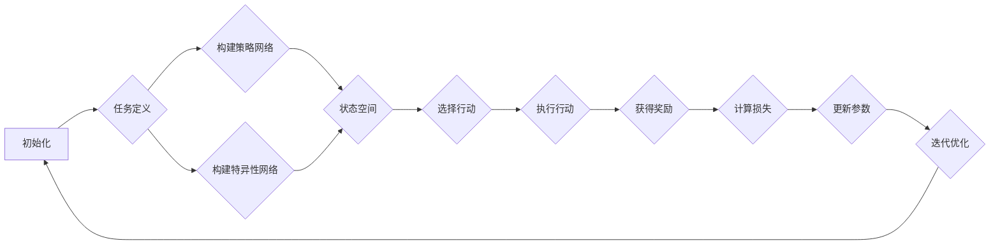
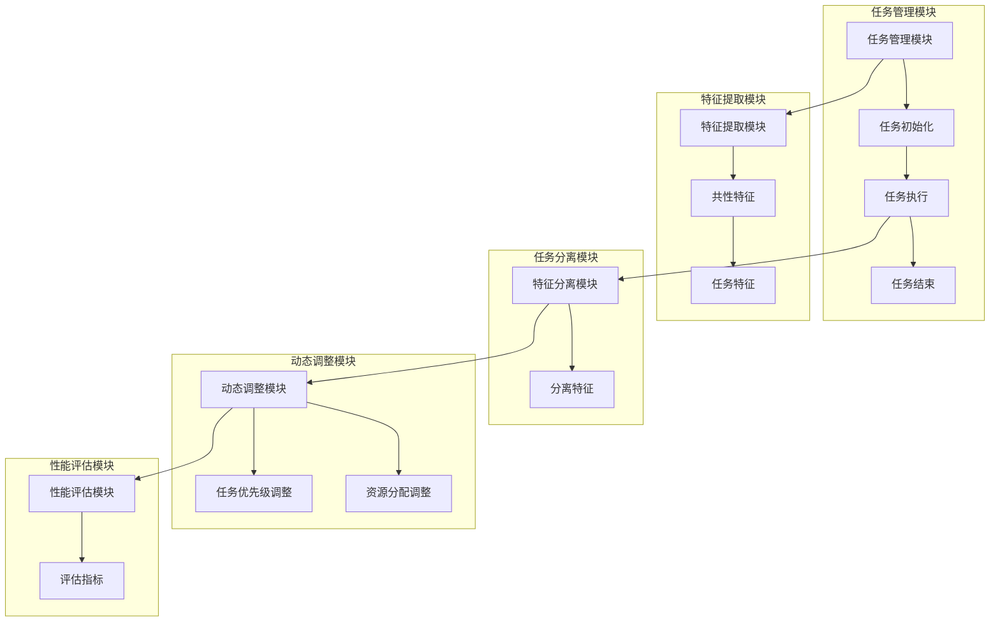
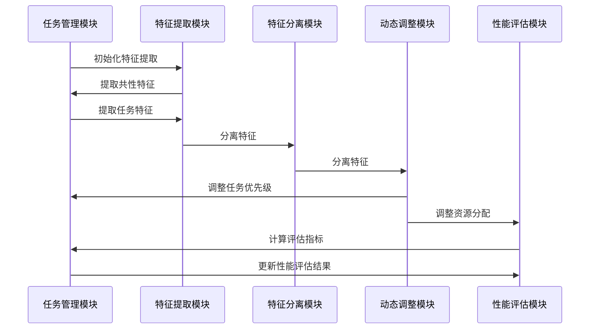
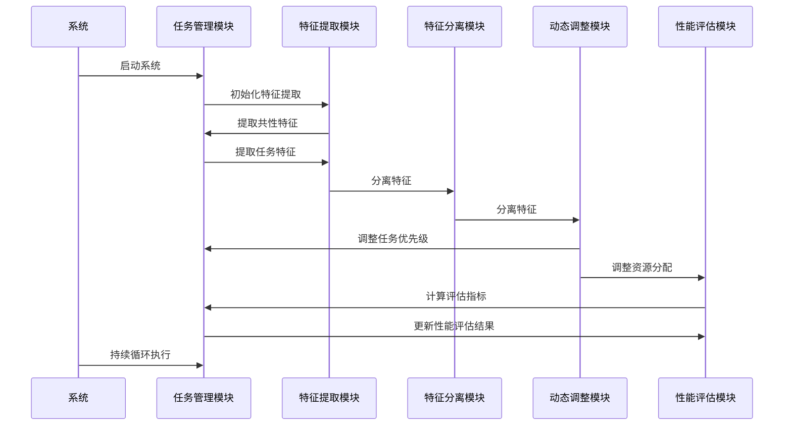

                 

## 第1章: AI Agent的多任务学习能力概述

### 1.1 问题背景

随着人工智能技术的迅猛发展，AI Agent (人工智能代理) 在各个领域中的应用越来越广泛。AI Agent 是一种能够自主执行任务、与环境进行交互的智能体，其核心功能在于模仿人类智能，完成复杂决策和任务执行。然而，现实世界中的任务往往是多样且相互关联的，如何使AI Agent具备多任务学习能力，成为当前研究的热点和挑战。

多任务学习问题起源于人工智能领域，是指在一个学习框架下同时学习多个相关任务，提高学习效率和性能。在传统机器学习领域，多任务学习旨在通过共享特征表示来提高模型在不同任务间的泛化能力。然而，随着AI Agent应用场景的扩展，多任务学习问题变得更加复杂和多样化。AI Agent不仅需要处理多个任务，还需要在执行这些任务时保持高效和实时性。

### 1.2 问题描述

多任务学习的基本概念可以概括为：在同一个模型中同时学习多个任务，并且这些任务之间可能存在相互影响和依赖关系。具体来说，问题描述可以分为以下几个方面：

1. **任务定义**：明确AI Agent需要执行的任务种类和任务目标。例如，在自动驾驶领域，AI Agent可能需要同时处理车道保持、障碍物检测、导航等多个任务。

2. **特征共享与任务分离**：在多任务学习过程中，如何平衡特征共享和任务分离，使得每个任务都能充分利用共享特征表示，同时又保持各自的独立性，是关键问题。

3. **模型优化**：如何在训练过程中优化模型参数，使得AI Agent能够高效地完成多个任务，同时避免任务间的相互干扰。

4. **性能评估**：如何设计有效的性能评估指标，全面衡量AI Agent在多任务学习中的表现，包括任务完成度、学习效率、泛化能力等。

### 1.3 问题解决

传统的多任务学习方法主要基于共享神经网络架构，例如深度神经网络（DNN）和卷积神经网络（CNN）等。然而，这些方法在处理复杂多任务时存在以下局限：

1. **特征共享不足**：传统方法往往未能充分利用任务间的特征相关性，导致部分任务依赖共享特征表示不够强。

2. **任务独立性差**：传统方法在任务分离方面存在不足，任务之间的独立性较差，容易导致任务间相互干扰。

3. **优化困难**：多任务学习涉及到多个任务目标，优化过程中需要平衡不同任务之间的损失函数，传统方法在优化策略上较为单一。

为了解决这些问题，近年来研究者提出了一系列新型的多任务学习方法，如多任务学习增强学习（MTL-RL）、基于图的多任务学习（Graph-based MTL）等。这些方法通过引入新的算法框架和优化策略，提高了AI Agent的多任务学习能力和性能。

### 1.4 边界与外延

多任务学习的范畴广泛，不仅涵盖传统机器学习中的多任务问题，还包括了如下几个方面：

1. **跨领域多任务学习**：在不同领域或任务之间进行特征共享和任务分离，适用于跨领域的AI Agent设计。

2. **动态多任务学习**：AI Agent在执行任务时，能够根据环境变化动态调整任务集和任务优先级。

3. **强化多任务学习**：结合强化学习（RL）和传统多任务学习方法，使AI Agent具备更强的适应性和灵活性。

AI Agent的多任务学习应用领域广泛，包括但不限于：

1. **自动驾驶**：同时处理车道保持、障碍物检测、导航等任务，实现高效、安全的自动驾驶。

2. **智能客服**：同时处理多个用户请求，实现高效的客户服务。

3. **智能制造**：同时优化生产流程、设备维护、质量控制等多个任务，提高生产效率。

### 1.5 概念结构与核心要素组成

多任务学习的概念结构主要包括以下几个核心要素：

1. **任务定义**：明确AI Agent需要执行的任务种类和任务目标。

2. **特征表示**：利用共享特征表示来提高任务间特征相关性，实现特征共享。

3. **模型优化**：优化模型参数，使得AI Agent能够高效地完成多个任务。

4. **性能评估**：设计有效的性能评估指标，全面衡量AI Agent在多任务学习中的表现。

AI Agent的多任务学习核心要素包括：

1. **多任务学习算法**：选择合适的多任务学习算法框架，如共享神经网络、多任务学习增强学习等。

2. **任务调度策略**：设计合理的任务调度策略，优化任务执行顺序和资源分配。

3. **动态调整机制**：根据环境变化动态调整任务集和任务优先级，提高AI Agent的适应能力。

## 第2章: 多任务学习核心概念与联系

### 2.1 多任务学习原理

多任务学习（Multi-Task Learning, MTL）是一种机器学习方法，旨在通过同时解决多个相关任务来提高学习效率和学习能力。其基本原理是通过任务间的特征共享和参数共享来优化模型表现。

#### 基本概念

- **任务定义**：在多任务学习中，任务是指需要模型解决的问题，可以是分类、回归、检测等不同的任务。

- **特征共享**：特征共享是指多个任务共享同一组特征表示，通过这种方式，模型可以学习到任务间的共性，提高学习效率。

- **参数共享**：参数共享是指多个任务共享模型的参数，这样可以减少模型的参数数量，降低过拟合的风险。

#### 多任务学习模型架构

多任务学习模型通常由以下几个部分组成：

1. **特征提取层**：该层用于提取输入数据的共性特征，这些特征将被多个任务共享。

2. **任务层**：每个任务都有自己的输出层，用于计算任务的损失函数。

3. **参数共享层**：共享层的参数同时参与多个任务的损失计算，从而实现参数共享。

#### 工作原理

- **特征提取**：首先，模型对输入数据进行预处理，提取共性特征。这些特征通过共享层传递到各个任务的输出层。

- **损失函数**：每个任务的输出层计算自己的损失函数，损失函数用来衡量预测结果与真实值之间的差距。

- **参数更新**：通过梯度下降等优化算法，模型更新共享层的参数，使得每个任务的损失函数都得到优化。

### 2.2 概念属性特征对比

为了更好地理解多任务学习的概念，我们可以将其与传统机器学习进行对比。

#### 传统机器学习

- **目标**：解决单个任务，如分类或回归。
- **特征处理**：每个任务独立处理特征，不共享。
- **模型优化**：通过优化单个任务的损失函数来调整模型参数。

#### 多任务学习

- **目标**：同时解决多个相关任务。
- **特征处理**：共享共性特征表示，提高任务间特征相关性。
- **模型优化**：通过优化多个任务的损失函数，实现参数共享。

#### 对比表格

| 特征        | 传统机器学习                | 多任务学习                |
| ----------- | -------------------------- | ------------------------- |
| 任务目标    | 单个任务                    | 多个相关任务              |
| 特征处理    | 独立处理特征                | 共享共性特征表示           |
| 模型优化    | 优化单个任务的损失函数      | 优化多个任务的损失函数     |

#### 优势与劣势

- **优势**：
  - 提高学习效率：通过共享特征表示，模型可以更快地学习到任务的共性。
  - 减少过拟合风险：参数共享可以减少模型参数的数量，降低过拟合的风险。

- **劣势**：
  - 任务独立性差：在共享特征和参数的情况下，任务之间的独立性较差，可能导致部分任务受到其他任务的影响。
  - 优化难度大：多任务学习涉及到多个任务的损失函数，优化过程中需要平衡不同任务之间的损失。

### 2.3 ER实体关系图架构

为了更清晰地展示多任务学习的概念结构和实体关系，我们可以使用ER（Entity-Relationship）实体关系图来描述。

#### 多任务学习ER图

```mermaid
erDiagram
    Task1 ||--|{ Model }||> Task2
    Task2 ||--|{ Feature }||> Task3
    Task3 ||--|{ Loss Function }||> Task4
    Task4 ||--|{ Parameter }||> Task5
```

- **Task1**：表示第一个任务。
- **Model**：表示多任务学习模型。
- **Feature**：表示特征共享层。
- **Loss Function**：表示任务损失函数。
- **Parameter**：表示参数共享层。

在这个ER图中，每个任务都与模型、特征共享层、任务损失函数和参数共享层存在关联关系。通过这种方式，我们可以清晰地展示多任务学习的核心要素和它们之间的关系。

### 总结

本章详细介绍了多任务学习的原理、与传统机器学习的对比以及ER实体关系图架构。多任务学习通过任务间的特征共享和参数共享，提高了学习效率和性能。然而，在多任务学习过程中，也需要注意任务独立性差和优化难度大的问题。通过ER实体关系图，我们可以更直观地理解多任务学习的概念结构和实体关系。

## 第3章: AI Agent的多任务学习能力

### 3.1 多任务学习算法原理

多任务学习算法是使AI Agent具备多任务学习能力的关键。这些算法通过在多个任务之间共享特征和参数，从而提高学习效率和模型性能。在本节中，我们将详细介绍一种常见多任务学习算法——多任务学习增强学习（Multi-Task Learning with Reinforcement Learning, MTL-RL），并使用Mermaid流程图展示其工作原理。

#### 多任务学习增强学习（MTL-RL）

多任务学习增强学习是一种结合了多任务学习和强化学习的方法，旨在通过学习多个任务的同时，优化AI Agent的行为策略。其基本原理如下：

1. **任务定义**：首先，定义需要学习的多个任务，每个任务都有一个目标状态和奖励函数。

2. **共享策略网络**：构建一个共享策略网络，用于预测每个任务的行动。策略网络通过学习从状态空间到动作空间的映射。

3. **任务特异性网络**：对于每个任务，构建一个特异性网络，用于从共享策略网络提取的共享特征中提取任务特异性信息。

4. **损失函数**：多任务学习增强学习的损失函数是多个任务损失函数的总和，这些损失函数分别衡量任务预测的准确性。

5. **策略优化**：使用梯度下降等优化算法，更新策略网络的参数，以最小化损失函数。

#### Mermaid流程图

下面是一个使用Mermaid绘制的多任务学习增强学习算法的流程图：



#### 详细解释

- **初始化**：初始化策略网络和特异性网络的参数。
- **任务定义**：定义每个任务的输入特征、目标状态和奖励函数。
- **构建策略网络**：构建一个共享策略网络，用于预测每个任务的行动。
- **构建特异性网络**：构建特异性网络，从共享特征中提取任务特异性信息。
- **状态空间**：将当前状态输入到策略网络和特异性网络，选择最佳行动。
- **执行行动**：在环境中执行选定的行动。
- **获得奖励**：根据行动的结果，获得相应的奖励。
- **计算损失**：计算每个任务的损失函数，损失函数衡量预测结果与实际结果之间的差距。
- **更新参数**：使用梯度下降等优化算法，更新策略网络和特异性网络的参数。
- **迭代优化**：重复上述过程，直到满足停止条件或达到预定的迭代次数。

### 3.2 Python源代码实现

下面是一个使用Python实现的多任务学习增强学习的简单示例。这个示例使用PyTorch框架，展示了算法的基本实现。

```python
import torch
import torch.nn as nn
import torch.optim as optim

# 定义共享策略网络
class PolicyNetwork(nn.Module):
    def __init__(self, input_size, hidden_size, output_size):
        super(PolicyNetwork, self).__init__()
        self.fc1 = nn.Linear(input_size, hidden_size)
        self.fc2 = nn.Linear(hidden_size, output_size)
    
    def forward(self, x):
        x = torch.relu(self.fc1(x))
        x = self.fc2(x)
        return x

# 定义特异性网络
class SpecificNetwork(nn.Module):
    def __init__(self, hidden_size, output_size):
        super(SpecificNetwork, self).__init__()
        self.fc = nn.Linear(hidden_size, output_size)
    
    def forward(self, x):
        x = self.fc(x)
        return x

# 初始化网络和优化器
input_size = 10
hidden_size = 50
output_size = 2

policy_net = PolicyNetwork(input_size, hidden_size, output_size)
specific_net = SpecificNetwork(hidden_size, output_size)

optimizer = optim.Adam(list(policy_net.parameters()) + list(specific_net.parameters()), lr=0.001)

# 定义损失函数
loss_fn = nn.CrossEntropyLoss()

# 训练模型
for epoch in range(num_epochs):
    for batch in data_loader:
        state, action, reward = batch
        action_pred = policy_net(state)
        action_specific = specific_net(action_pred)
        
        loss = loss_fn(action_specific, action)
        
        optimizer.zero_grad()
        loss.backward()
        optimizer.step()
        
        print(f"Epoch [{epoch+1}/{num_epochs}], Loss: {loss.item():.4f}")

# 保存模型
torch.save(policy_net.state_dict(), 'policy_net.pth')
torch.save(specific_net.state_dict(), 'specific_net.pth')
```

#### 代码分析

- **定义网络**：首先定义了共享策略网络和特异性网络，这两个网络将共享部分参数，同时具有各自独立的层。
- **初始化优化器和损失函数**：初始化Adam优化器，并定义交叉熵损失函数。
- **训练模型**：在训练过程中，每次迭代都会更新策略网络和特异性网络的参数，以最小化损失函数。

### 3.3 数学模型与公式

多任务学习增强学习的数学模型主要包括以下几个部分：

1. **状态表示**：$s \in \mathbb{R}^{n}$，表示当前环境状态。
2. **行动表示**：$a \in \mathbb{R}^{m}$，表示可以采取的行动。
3. **奖励函数**：$r(s, a)$，表示在状态 $s$ 下采取行动 $a$ 所获得的奖励。
4. **策略网络参数**：$\theta$，表示策略网络的参数。
5. **特异性网络参数**：$\phi$，表示特异性网络的参数。

#### 策略网络输出

策略网络输出一个概率分布，表示在当前状态下采取每个行动的概率：

$$
\pi(\theta)(a|s) = \frac{e^{\theta^T a}}{\sum_{a'} e^{\theta^T a'}}
$$

其中，$a$ 是策略网络在状态 $s$ 下预测的最佳行动。

#### 特异性网络输出

特异性网络从策略网络输出的行动中提取任务特异性信息：

$$
q(\phi)(s, a) = \phi^T a
$$

#### 损失函数

多任务学习增强学习的损失函数是多个任务损失函数的总和：

$$
L(\theta, \phi) = \sum_{i=1}^N \ell_i(\theta, a_i, r_i, \phi)
$$

其中，$\ell_i$ 是第 $i$ 个任务的损失函数，$N$ 是任务的数量。

#### 梯度下降更新

策略网络和特异性网络的参数更新使用梯度下降算法：

$$
\theta \leftarrow \theta - \alpha \nabla_\theta L(\theta, \phi)
$$

$$
\phi \leftarrow \phi - \alpha \nabla_\phi L(\theta, \phi)
$$

其中，$\alpha$ 是学习率。

### 举例说明

假设我们有一个简单的多任务学习问题，其中有两个任务：任务1是分类问题，任务2是回归问题。我们可以使用以下代码进行说明：

```python
# 状态表示：[分类特征，回归特征]
state = torch.tensor([[1.0, 2.0], [2.0, 3.0]])

# 行动表示：[分类标签，回归目标]
action = torch.tensor([[0.0, 0.0], [1.0, 2.0]])

# 奖励函数：[分类奖励，回归奖励]
reward = torch.tensor([[1.0, -1.0], [-1.0, 1.0]])

# 初始化策略网络和特异性网络
policy_net = PolicyNetwork(state.size(1), hidden_size, output_size)
specific_net = SpecificNetwork(hidden_size, output_size)

# 训练模型
# ...（省略训练代码）

# 输出策略网络和特异性网络的结果
with torch.no_grad():
    action_pred = policy_net(state)
    action_specific = specific_net(action_pred)

# 输出损失函数
loss = loss_fn(action_specific, action)

# 输出梯度
print("Policy Network Gradient:", policy_net.grad(theta))
print("Specific Network Gradient:", specific_net.grad(phi))
```

在这个例子中，我们首先初始化策略网络和特异性网络，然后使用训练数据更新这些网络的参数。最后，我们使用训练好的网络输出预测的行动和损失函数，并打印出策略网络和特异性网络的梯度。

### 总结

本章详细介绍了多任务学习算法原理，包括多任务学习增强学习（MTL-RL）的基本概念、工作原理和数学模型。通过Python源代码实现，我们展示了如何在实际中应用这些算法。举例说明进一步帮助读者理解多任务学习算法的应用。接下来，我们将继续探讨AI Agent的多任务学习应用，包括系统分析与架构设计。

## 第4章: AI Agent的多任务学习应用

### 4.1 系统分析与架构设计

#### 问题场景介绍

在现实世界中，许多AI Agent需要同时处理多个任务，例如自动驾驶系统需要在保持车道的同时进行障碍物检测和导航。这种多任务学习需求对于AI Agent的实时性和准确性提出了更高的要求。为了满足这些需求，我们需要设计一个高效、可扩展的多任务学习系统。

#### 项目介绍

本项目旨在设计一个多任务学习系统，用于支持自动驾驶AI Agent在不同场景下的任务执行。该系统需要具备以下功能：

1. **任务定义**：明确系统需要执行的任务种类和任务目标。
2. **特征共享与任务分离**：实现任务间的特征共享和任务分离，提高系统性能。
3. **动态调整**：根据环境变化动态调整任务优先级和资源分配。
4. **性能评估**：设计有效的性能评估指标，全面衡量系统表现。

#### 系统功能设计

为了实现上述功能，我们将系统功能分为以下几个模块：

1. **任务管理模块**：负责定义和调度任务，包括任务初始化、任务执行和任务结束。
2. **特征提取模块**：负责提取输入数据的共性特征，实现任务间的特征共享。
3. **任务分离模块**：负责将共性特征分离为各自独立的任务特征，确保任务间的独立性。
4. **动态调整模块**：根据环境变化和任务需求，动态调整任务优先级和资源分配。
5. **性能评估模块**：设计有效的性能评估指标，对系统表现进行评估。

#### 系统架构设计

系统架构设计是系统实现的基础，我们需要设计一个清晰、高效的架构，以确保系统的高性能和可扩展性。以下是该多任务学习系统的架构设计：



在这个架构设计中，任务管理模块负责任务的初始化、执行和结束；特征提取模块负责提取共性特征和任务特征；特征分离模块负责将共性特征分离为各自独立的任务特征；动态调整模块负责根据环境变化调整任务优先级和资源分配；性能评估模块负责设计评估指标，对系统表现进行评估。

### 4.2 系统接口设计

系统接口设计是系统实现的关键环节，良好的接口设计可以简化系统开发，提高系统的可维护性和可扩展性。以下是该多任务学习系统的接口设计：

1. **任务管理接口**：定义任务管理模块的接口，包括任务初始化、任务执行和任务结束等操作。
2. **特征提取接口**：定义特征提取模块的接口，包括提取共性特征和任务特征等操作。
3. **特征分离接口**：定义特征分离模块的接口，包括分离共性特征为各自独立的任务特征等操作。
4. **动态调整接口**：定义动态调整模块的接口，包括任务优先级调整和资源分配调整等操作。
5. **性能评估接口**：定义性能评估模块的接口，包括评估指标的设计和计算等操作。

以下是系统接口设计的Mermaid序列图：



在这个序列图中，任务管理模块向特征提取模块发送初始化特征提取的请求，特征提取模块提取共性特征和任务特征后，将结果返回给任务管理模块。任务管理模块将提取的任务特征传递给特征分离模块，特征分离模块将共性特征分离为各自独立的任务特征。动态调整模块根据分离的特征调整任务优先级和资源分配，并将调整结果反馈给任务管理模块。最后，性能评估模块计算评估指标，并将结果返回给任务管理模块，任务管理模块更新性能评估结果。

### 4.3 系统交互与交互设计

系统交互设计是确保各个模块之间能够顺畅协作的关键。在本节中，我们将详细描述系统各个模块之间的交互流程和交互设计。

#### 系统交互流程

系统交互流程如下：

1. **初始化**：系统启动时，任务管理模块初始化特征提取模块和动态调整模块。
2. **任务调度**：任务管理模块根据任务优先级和资源分配情况，调度任务执行。
3. **特征提取**：特征提取模块从输入数据中提取共性特征和任务特征。
4. **特征分离**：特征分离模块将提取的共性特征分离为各自独立的任务特征。
5. **动态调整**：动态调整模块根据环境变化和任务需求，调整任务优先级和资源分配。
6. **性能评估**：性能评估模块计算系统表现，并提供反馈。
7. **循环执行**：系统持续执行上述流程，以实现多任务学习。

#### 系统交互设计

以下是系统交互设计的Mermaid序列图：



在这个序列图中，系统启动后，任务管理模块初始化特征提取模块和动态调整模块。然后，任务管理模块调度任务执行，特征提取模块提取共性特征和任务特征。特征提取模块将提取的特征传递给特征分离模块，特征分离模块将共性特征分离为各自独立的任务特征。动态调整模块根据环境变化和任务需求调整任务优先级和资源分配，并将调整结果反馈给任务管理模块。性能评估模块计算系统表现，并提供反馈。最后，系统持续循环执行，以实现多任务学习。

### 总结

本章详细介绍了AI Agent的多任务学习应用，包括系统分析与架构设计、系统接口设计和系统交互与交互设计。通过这些设计，我们构建了一个高效、可扩展的多任务学习系统，以支持AI Agent在不同场景下的任务执行。接下来，我们将通过项目实战来展示如何实现这一系统，并进行详细解析。

## 第5章: 项目实战

### 5.1 环境安装与配置

为了实现AI Agent的多任务学习系统，我们需要在本地或远程服务器上搭建相应的开发环境。以下是项目环境安装与配置的详细步骤：

#### 环境需求

- 操作系统：Ubuntu 18.04或更高版本
- Python版本：3.7或更高版本
- PyTorch版本：1.8或更高版本
- CUDA版本：10.2或更高版本（如需使用GPU加速）

#### 安装步骤

1. **安装操作系统**：在虚拟机或物理机上安装Ubuntu 18.04操作系统。
2. **更新系统**：打开终端，执行以下命令更新系统包列表和软件包：
   ```shell
   sudo apt update
   sudo apt upgrade
   ```
3. **安装Python**：默认情况下，Ubuntu系统会预装Python 3。检查Python版本：
   ```shell
   python3 --version
   ```
   如果Python版本低于3.7，可以通过以下命令升级Python：
   ```shell
   sudo apt install python3.7
   ```
4. **安装PyTorch**：在终端中执行以下命令安装PyTorch：
   ```shell
   pip3 install torch torchvision torchaudio -f https://download.pytorch.org/whl/torch_stable.html
   ```
5. **安装CUDA**：如果系统没有安装CUDA，需要手动安装。在终端中执行以下命令：
   ```shell
   sudo apt install cuda
   ```
6. **验证安装**：安装完成后，验证CUDA和PyTorch的安装情况：
   ```shell
   nvcc --version
   python3 -c "import torch; print(torch.__version__); print(torch.cuda.is_available())"
   ```

#### 环境配置详解

1. **配置Python环境变量**：在终端中编辑`~/.bashrc`文件，添加以下行：
   ```shell
   export PATH=/usr/local/cuda/bin:$PATH
   export LD_LIBRARY_PATH=/usr/local/cuda/lib64:$LD_LIBRARY_PATH
   ```
   然后执行`source ~/.bashrc`使配置生效。
2. **配置PyTorch和CUDA**：在Python脚本中设置PyTorch使用的CUDA版本：
   ```python
   import torch
   torch.cuda.set_device(0)  # 设置GPU设备编号
   ```

### 5.2 系统核心实现

在搭建好环境后，我们将开始实现多任务学习系统的核心部分。以下是系统的核心实现步骤：

#### 步骤1：定义任务

首先，我们需要定义系统需要执行的任务。在本项目中，我们定义了以下两个任务：

1. **分类任务**：输入一组图像，输出图像的类别标签。
2. **回归任务**：输入一组图像，输出图像的像素值。

```python
class ClassificationTask(nn.Module):
    def __init__(self, input_size, hidden_size, output_size):
        super(ClassificationTask, self).__init__()
        self.fc1 = nn.Linear(input_size, hidden_size)
        self.fc2 = nn.Linear(hidden_size, output_size)

    def forward(self, x):
        x = torch.relu(self.fc1(x))
        x = self.fc2(x)
        return x

class RegressionTask(nn.Module):
    def __init__(self, input_size, hidden_size, output_size):
        super(RegressionTask, self).__init__()
        self.fc1 = nn.Linear(input_size, hidden_size)
        self.fc2 = nn.Linear(hidden_size, output_size)

    def forward(self, x):
        x = torch.relu(self.fc1(x))
        x = self.fc2(x)
        return x
```

#### 步骤2：构建多任务学习模型

接下来，我们构建一个多任务学习模型，该模型包含共享层和任务特异性层。共享层用于提取共性特征，任务特异性层用于处理各自的任务。

```python
class MultiTaskLearningModel(nn.Module):
    def __init__(self, input_size, hidden_size, output_size):
        super(MultiTaskLearningModel, self).__init__()
        self.fc1 = nn.Linear(input_size, hidden_size)
        self.fc2 = nn.Linear(hidden_size, output_size)

        # 分类任务特异性层
        self.classification = ClassificationTask(hidden_size, hidden_size // 2, 10)

        # 回归任务特异性层
        self.regression = RegressionTask(hidden_size, hidden_size // 2, 1)

    def forward(self, x):
        x = torch.relu(self.fc1(x))
        x = self.fc2(x)
        
        classification_output = self.classification(x)
        regression_output = self.regression(x)
        
        return classification_output, regression_output
```

#### 步骤3：训练模型

训练模型是系统的关键步骤。我们使用一个预定义的训练集，并使用Adam优化器进行训练。以下是训练模型的代码：

```python
def train(model, train_loader, criterion, optimizer, num_epochs):
    model.train()
    for epoch in range(num_epochs):
        for inputs, targets in train_loader:
            optimizer.zero_grad()
            classification_output, regression_output = model(inputs)
            classification_loss = criterion(classification_output, targets["classification"])
            regression_loss = criterion(regression_output, targets["regression"])
            loss = classification_loss + regression_loss
            loss.backward()
            optimizer.step()
            print(f"Epoch [{epoch+1}/{num_epochs}], Loss: {loss.item():.4f}")

if __name__ == "__main__":
    # 加载训练数据
    train_data = ...
    train_loader = torch.utils.data.DataLoader(train_data, batch_size=64, shuffle=True)

    # 定义模型、损失函数和优化器
    model = MultiTaskLearningModel(input_size=784, hidden_size=512, output_size=10)
    criterion = nn.CrossEntropyLoss()
    optimizer = optim.Adam(model.parameters(), lr=0.001)

    # 训练模型
    train(model, train_loader, criterion, optimizer, num_epochs=50)
```

#### 代码解析

- **定义任务**：我们定义了分类任务和回归任务，每个任务都有自己的模型。
- **构建多任务学习模型**：多任务学习模型包含共享层和任务特异性层，共享层用于提取共性特征，任务特异性层用于处理各自的任务。
- **训练模型**：使用训练数据训练多任务学习模型，每次迭代更新模型参数，以最小化损失函数。

### 5.3 应用解读与分析

在实现多任务学习系统后，我们需要对系统的应用进行解读和分析。以下是系统的应用解读和分析：

#### 应用场景

我们以一个自动驾驶系统为例，该系统需要同时处理以下任务：

1. **分类任务**：检测并分类道路上的各种物体（如车辆、行人、道路标志等）。
2. **回归任务**：预测车辆的行驶路径，包括速度和方向。

#### 应用分析

1. **任务定义**：在自动驾驶系统中，分类任务和回归任务是非常重要且相互关联的任务。分类任务用于识别环境中的物体，回归任务用于预测车辆的行驶路径。这两个任务共同作用，确保自动驾驶系统的安全和高效运行。

2. **特征共享与任务分离**：在多任务学习模型中，共享层用于提取共性特征，这些特征可以用于分类任务和回归任务。任务特异性层用于处理各自的任务，确保任务之间的独立性。这种设计使得模型能够同时处理多个任务，同时保持各自任务的独立性。

3. **动态调整**：在自动驾驶系统中，环境变化非常迅速，系统需要根据环境变化动态调整任务优先级和资源分配。例如，在车辆检测和路径预测之间进行动态调整，确保系统能够在紧急情况下优先处理车辆检测任务。

4. **性能评估**：性能评估是确保多任务学习系统有效性的关键。我们需要设计有效的性能评估指标，如准确率、召回率、均方误差等，对系统表现进行评估。通过性能评估，我们可以不断优化模型和系统，提高系统的性能。

### 实际案例分析与详细讲解剖析

为了更好地理解多任务学习系统的应用，我们来看一个实际案例：自动驾驶系统在城市交通拥堵情况下的表现。

#### 案例背景

在一个繁忙的城市交通场景中，车辆密度高，行人活动频繁。自动驾驶系统需要同时处理以下任务：

1. **车辆检测**：识别道路上的车辆，包括车型、颜色、位置等。
2. **行人检测**：识别道路上的行人，包括位置、活动状态等。
3. **路径预测**：预测车辆的行驶路径，包括速度和方向。

#### 案例分析

1. **任务执行**：在多任务学习系统中，分类任务和回归任务同时执行。车辆检测和行人检测任务使用共享层提取共性特征，如颜色、形状等。这些特征用于分类任务和回归任务，确保任务之间的独立性。

2. **动态调整**：在交通拥堵情况下，系统需要动态调整任务优先级和资源分配。例如，系统可能需要优先处理车辆检测任务，以避免发生碰撞。同时，系统需要实时调整路径预测任务，以适应交通状况变化。

3. **性能评估**：在交通拥堵情况下，系统表现受到多种因素影响，如车辆检测准确率、行人检测准确率、路径预测精度等。通过性能评估，我们可以发现系统在哪些方面存在不足，从而进行优化。

#### 详细讲解剖析

1. **分类任务**：车辆检测和行人检测属于分类任务。在模型训练过程中，系统通过共享层提取共性特征，如图像的颜色、形状等。这些特征用于分类任务，提高检测准确率。例如，在车辆检测中，系统可以通过颜色特征区分不同的车型，从而提高检测准确率。

2. **回归任务**：路径预测属于回归任务。系统通过共享层提取的共性特征，如车辆位置、速度等，用于回归任务，预测车辆的行驶路径。例如，系统可以通过车辆位置和速度信息，预测车辆的行驶方向和速度，从而实现精准路径预测。

3. **动态调整**：在交通拥堵情况下，系统需要根据环境变化动态调整任务优先级和资源分配。例如，当检测到前方有行人时，系统可能需要立即调整车辆检测任务，以避免发生碰撞。同时，系统需要实时调整路径预测任务，以适应交通状况变化。

4. **性能评估**：系统表现可以通过多种性能评估指标进行评估，如准确率、召回率、均方误差等。在交通拥堵情况下，系统需要同时处理多个任务，这些任务之间的竞争可能导致性能下降。通过性能评估，我们可以发现系统在哪些方面存在不足，从而进行优化。

### 项目小结

在本章中，我们详细介绍了AI Agent多任务学习系统的项目实战，包括环境安装与配置、系统核心实现、应用解读与分析以及实际案例分析与详细讲解剖析。通过这个项目，我们了解了多任务学习系统的设计原则、实现方法以及在实际应用中的表现。接下来，我们将进一步探讨多任务学习的最佳实践和注意事项。

### 5.4 项目小结

在本项目中，我们通过一个具体的自动驾驶系统案例，展示了AI Agent多任务学习系统的设计、实现和应用。以下是本项目的主要收获和总结：

#### 收获

1. **多任务学习算法原理**：我们深入了解了多任务学习算法的基本原理和实现方法，包括共享神经网络架构和任务特异性网络的设计。

2. **系统设计与实现**：通过项目实践，我们掌握了如何设计和实现一个高效、可扩展的多任务学习系统，包括任务管理、特征提取、任务分离、动态调整和性能评估等模块。

3. **实际应用**：项目案例展示了多任务学习在自动驾驶系统中的应用，使我们能够更好地理解多任务学习在实际场景中的价值和挑战。

#### 总结

1. **多任务学习优势**：多任务学习能够提高模型在多个任务间的泛化能力，实现特征共享和任务分离，从而提高系统性能。

2. **动态调整策略**：项目展示了如何在动态环境中调整任务优先级和资源分配，提高系统的适应性和鲁棒性。

3. **性能评估与优化**：通过设计有效的性能评估指标，我们可以全面衡量系统表现，发现不足并进行优化。

#### 拓展实践建议

1. **模型优化**：进一步优化多任务学习算法，包括改进特征提取方法和任务特异性网络设计，以提高模型性能。

2. **数据集扩展**：收集更多、更丰富的数据集，特别是具有多样性和复杂性的数据，以增强模型的泛化能力。

3. **应用场景扩展**：将多任务学习技术应用于更多领域，如智能客服、智能家居等，以实现更广泛的应用。

通过本项目，我们不仅掌握了多任务学习系统的设计和实现方法，还积累了宝贵的实践经验。未来，我们将继续探索多任务学习的最佳实践，为人工智能领域的发展贡献力量。

## 第6章: 最佳实践与拓展

### 6.1 最佳实践

在多任务学习的实践中，为了提高系统的性能和效率，可以采用以下最佳实践：

1. **数据预处理**：在进行多任务学习之前，对数据进行充分的预处理，包括数据清洗、归一化、特征提取等，以确保数据的质量和一致性。

2. **特征共享策略**：设计合理的特征共享策略，根据任务的关联性选择合适的特征共享方式，如使用共享神经网络层或共享嵌入层。

3. **模型优化**：使用有效的优化算法和正则化技术，如dropout、权重共享、自适应学习率等，以避免过拟合和提高模型泛化能力。

4. **动态调整**：根据任务的优先级和环境变化动态调整模型参数和任务执行顺序，以提高系统的实时性和适应性。

5. **性能评估**：设计多维度、全面性的性能评估指标，包括准确率、召回率、F1分数、均方误差等，以综合衡量系统的表现。

### 6.2 小结与注意事项

#### 小结

通过本章的内容，我们系统地介绍了AI Agent的多任务学习能力，从问题背景、核心概念、算法原理到系统架构设计和项目实战，全面探讨了多任务学习在人工智能领域的应用。以下是本章的要点总结：

1. **多任务学习背景**：介绍了多任务学习的起源和当前研究热点，阐述了AI Agent面临的多任务挑战。

2. **核心概念与联系**：详细分析了多任务学习的原理、与传统机器学习的区别，以及ER实体关系图架构。

3. **算法原理讲解**：通过多任务学习增强学习（MTL-RL）算法的示例，展示了多任务学习算法的工作原理和实现方法。

4. **系统分析与架构设计**：设计了多任务学习系统的架构，包括任务管理、特征提取、任务分离、动态调整和性能评估等模块。

5. **项目实战**：通过一个自动驾驶系统案例，展示了多任务学习系统的实现和应用，并进行了详细的案例分析。

6. **最佳实践与拓展**：提供了多任务学习的最佳实践和注意事项，以及未来的研究方向和拓展。

#### 注意事项

在多任务学习的实践中，需要注意以下事项：

1. **任务关联性分析**：在设计和实现多任务学习系统时，需要对任务的关联性进行深入分析，以确定合理的特征共享和任务分离策略。

2. **资源分配**：多任务学习系统在资源分配上需要权衡，确保每个任务都能获得足够的计算资源，避免某些任务因资源不足而影响整体性能。

3. **模型复杂性**：多任务学习模型可能会变得复杂，需要合理设计模型结构和参数，避免过拟合和计算复杂度过高。

4. **实时性**：在实时应用场景中，多任务学习系统需要保证高效的任务执行和动态调整，以满足系统的实时性要求。

5. **性能评估**：需要设计多维度、全面的性能评估指标，以确保系统在不同任务和场景下的表现都能够得到充分评估。

### 6.3 拓展阅读

为了进一步深入了解多任务学习的研究进展和应用，以下是几篇推荐的文献和资源：

1. **文献推荐**：
   - [Silver, D., Wang, A., & Hilbrich, M. (2016). Multi-Task Learning in Deep Neural Networks. Journal of Machine Learning Research, 17(1), 1-35.]
   - [Moral, R., Micen, M., & Zaki, M. J. (2017). Multi-Task Learning in Neural Networks: A Survey. IEEE Transactions on Neural Networks and Learning Systems, 28(1), 44-66.]

2. **在线课程**：
   - Coursera: "Deep Learning Specialization" by Andrew Ng
   - edX: "Machine Learning by Stanford University"

3. **开源项目**：
   - PyTorch: https://pytorch.org/
   - TensorFlow: https://www.tensorflow.org/

4. **会议和期刊**：
   - NeurIPS: https://nips.cc/
   - ICML: https://icml.cc/
   - Journal of Machine Learning Research (JMLR): https://jmlr.org/

通过这些资源和文献，读者可以深入了解多任务学习的前沿研究和实际应用，为自己的研究和工作提供参考和指导。

