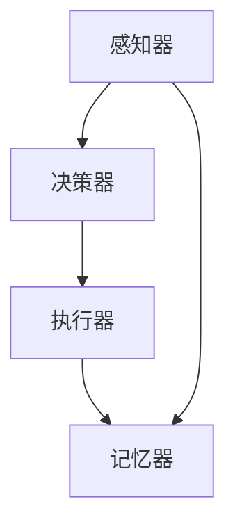

                 

### 第1章: AI Agent与多任务学习概述

### 1.1 AI Agent的基本概念

#### 1.1.1 AI Agent的定义

AI Agent，即人工智能代理，是自主运行于环境中，具有感知、理解和决策能力，能够主动执行任务的智能实体。AI Agent是人工智能领域中的一个重要概念，它通常被定义为一种能够感知环境、理解环境状态、并基于环境状态进行决策的智能体。

一个典型的AI Agent包括以下几个组成部分：
1. **感知器**：用于感知环境信息，如视觉、听觉、触觉等。
2. **决策器**：根据感知到的环境信息，进行决策，选择合适的动作。
3. **执行器**：根据决策器的决策，执行相应的动作，如移动、发出声音等。
4. **记忆器**：存储AI Agent的历史信息和经验，用于决策和学习。

AI Agent的定义和作用可以形象地用以下图表示：



#### 1.1.2 AI Agent的分类

AI Agent根据任务类型的不同，可以分为以下几类：

- **任务型Agent**：专注于完成特定任务的AI Agent，如智能家居控制系统、自动驾驶汽车等。
- **通用型Agent**：具有广泛任务处理能力的AI Agent，能够应对多种类型的任务，如个人智能助手、智能客服等。
- **交互型Agent**：主要与人类或其他智能体进行交互的AI Agent，如聊天机器人、虚拟助手等。
- **探索型Agent**：在未知环境中进行自主探索和学习的AI Agent，如无人探索器、机器人探险家等。

每种类型的AI Agent都有其独特的应用场景和设计目标。例如，任务型Agent通常在特定场景下运行，而通用型Agent则需要具备更强大的适应能力和处理多种任务的能力。

### 1.2 多任务学习的基本概念

#### 1.2.1 多任务学习的定义

多任务学习（Multi-Task Learning, MTL）是机器学习领域中的一个重要研究方向，它旨在通过同时学习多个相关任务来提高模型的泛化能力和效率。在多任务学习中，模型不仅要学习单个任务的表示，还要学习任务之间的共享信息和交互关系。

多任务学习的基本定义可以表示为：

$$
\text{MTL} = \left\{
\begin{aligned}
  \text{同时学习多个相关任务的学习方法}, \\
  \text{旨在提高模型泛化能力和效率}.
\end{aligned}
\right.
$$

#### 1.2.2 多任务学习的应用背景

多任务学习在实际应用中具有重要意义，原因如下：

1. **资源优化**：通过共享模型参数和计算资源，多任务学习可以显著降低模型的训练时间和计算成本。
2. **提高泛化能力**：多个任务的数据和知识相互补充，可以增强模型对未知数据的泛化能力。
3. **增强鲁棒性**：在多个任务中同时学习，有助于模型在遇到异常或噪声数据时保持稳定性和鲁棒性。
4. **促进知识迁移**：不同任务之间的关联性可以促进知识的迁移和应用，有助于解决复杂问题。

多任务学习在自然语言处理、计算机视觉、语音识别等众多领域都有广泛应用。例如，在自然语言处理领域，多任务学习可以同时处理文本分类、情感分析和命名实体识别等多个任务；在计算机视觉领域，多任务学习可以同时处理图像分类、目标检测和语义分割等多个任务。

### 1.3 多任务学习的挑战与机遇

#### 1.3.1 挑战

尽管多任务学习具有很多优势，但它在实际应用中仍然面临一些挑战：

1. **任务平衡**：不同任务的数据量和难度往往不同，如何平衡各任务的重要性是关键问题。
2. **参数共享**：如何设计共享参数的有效机制，既保证任务间信息共享，又避免任务间信息干扰。
3. **性能评估**：如何准确评估多任务学习的性能，特别是在任务间存在相关性时。
4. **计算复杂度**：多任务学习往往涉及大量的参数和计算，如何优化计算效率是一个重要问题。

#### 1.3.2 机遇

尽管存在挑战，多任务学习也为研究和应用带来了许多机遇：

1. **创新算法**：多任务学习促使研究人员开发出更先进的算法和技术，如任务嵌入（Task Embedding）、多任务强化学习等。
2. **应用拓展**：多任务学习可以应用于更多复杂和多样化的场景，如医疗诊断、智能客服、自动驾驶等。
3. **数据复用**：通过多任务学习，可以利用同一数据集上的不同任务来提高模型的泛化能力，减少数据需求。
4. **知识融合**：多任务学习有助于不同任务之间的知识共享和迁移，有助于解决更加复杂的实际问题。

### 总结

AI Agent和**多任务学习**是当前人工智能领域中的重要研究方向。AI Agent作为一种具有自主决策能力的智能体，其应用场景越来越广泛；而多任务学习则提供了有效的方法，帮助模型在多个相关任务中同时学习，提高模型的泛化能力和计算效率。在接下来的章节中，我们将进一步探讨AI Agent的多任务学习算法、应用场景和实践方法。让我们**一步一步**地深入理解这一领域，为构建通用智能助手奠定坚实的基础。

---

### 第2章: AI Agent的多任务学习算法

#### 2.1 多任务学习算法概述

多任务学习算法的核心目标是同时学习多个相关任务，并最大化各任务间的信息共享和模型优化。这一节我们将介绍两种主要的多任务学习算法：传统多任务学习算法和现代多任务学习算法。

##### 2.1.1 传统多任务学习算法

传统多任务学习算法主要基于线性模型，通过在共享权重的基础上对各个任务进行建模。以下是一些经典的算法：

1. **线性回归**：在多个任务上都使用相同的线性回归模型，通过调整权重来优化不同任务的损失函数。
2. **神经网络**：通过多层感知机（MLP）等神经网络模型，共享部分网络层，同时为每个任务设置独立的输出层。
3. **低秩分解**：通过矩阵分解技术，将多个任务的数据矩阵分解为低秩形式，实现任务间共享信息。

这些算法的优点在于实现简单、计算效率高，但它们在处理复杂任务时可能显得力不从心。

##### 2.1.2 现代多任务学习算法

现代多任务学习算法基于深度学习，通过共享特征表示和任务特定模块来提高模型的泛化能力和效率。以下是一些现代多任务学习算法：

1. **任务嵌入（Task Embedding）**：通过嵌入向量表示任务，将不同任务的输入映射到同一特征空间中，实现任务间共享信息。
2. **多任务神经网络**：基于深度神经网络，通过共享卷积层或循环层来提取通用特征，同时为每个任务设置独立的全连接层。
3. **多任务强化学习**：将多任务学习与强化学习相结合，通过优化策略同时学习多个任务。

这些算法的优点在于能够处理更加复杂和多样化的任务，但计算复杂度和实现难度也有所增加。

##### 2.1.3 算法设计原则

设计多任务学习算法时，需要遵循以下原则：

1. **任务相关性**：确保各任务间存在相关性，以便实现信息共享和增强。
2. **参数共享**：合理设计参数共享机制，既保证任务间信息共享，又避免任务间信息干扰。
3. **损失函数**：设计合理的损失函数，平衡各任务的损失，确保模型在多个任务上都取得良好性能。
4. **计算效率**：优化算法的计算复杂度，提高模型训练和推理的速度。

##### 2.1.4 算法实现技巧

在实现多任务学习算法时，需要注意以下几点：

1. **数据预处理**：对输入数据进行归一化、标准化等预处理，确保各任务的数据分布相似。
2. **模型架构**：设计合适的模型架构，如共享卷积层、共享循环层等，以实现特征共享。
3. **训练策略**：采用适当的训练策略，如梯度下降、自适应优化器等，以提高模型收敛速度。
4. **评估指标**：设计合理的评估指标，如准确率、召回率、F1值等，以全面评估模型性能。

#### 2.2 多任务学习算法的性能评估

评估多任务学习算法的性能是确保其有效性的关键。以下介绍一些常见的评估指标和方法：

##### 2.2.1 评估指标

1. **准确率（Accuracy）**：预测正确的样本占总样本的比例。
2. **召回率（Recall）**：预测为正类的真实正类样本数占总真实正类样本数的比例。
3. **F1值（F1 Score）**：准确率和召回率的调和平均。
4. **AUC（Area Under Curve）**：ROC曲线下的面积，用于评估分类模型的性能。

##### 2.2.2 评估方法

1. **交叉验证（Cross Validation）**：通过将数据集划分为训练集和验证集，多次训练和验证，以评估模型在不同数据集上的性能。
2. **集成方法（Ensemble Methods）**：将多个模型集成起来，通过投票或加权平均等方法提高模型性能。
3. **对比实验（A/B Testing）**：将多任务学习算法与单任务学习算法进行对比，评估其在不同任务上的性能差异。

通过以上评估方法和指标，可以全面了解多任务学习算法的性能，为进一步优化算法提供依据。

### 总结

AI Agent的多任务学习算法是构建通用智能助手的关键技术之一。传统多任务学习算法和现代多任务学习算法各有优缺点，应根据具体应用场景选择合适的算法。在算法设计过程中，需要考虑任务相关性、参数共享、损失函数和计算效率等因素。通过合理的算法设计和性能评估，可以构建出高效、稳定的多任务学习模型，为AI Agent的应用提供有力支持。

---

### 第3章: AI Agent的多任务学习应用场景

在了解了AI Agent和多任务学习的基本概念和算法之后，我们来看一下这些技术在不同领域中的应用场景。本章节将分别讨论多任务学习在自然语言处理、计算机视觉和语音识别领域的应用，并通过实际案例进行说明。

#### 3.1 自然语言处理领域

自然语言处理（Natural Language Processing, NLP）是人工智能的重要分支，涉及文本的生成、理解和处理。多任务学习在NLP领域中的应用非常广泛，以下是一些典型任务和算法应用：

##### 3.1.1 任务定义

在NLP中，常见的多任务包括：

1. **文本分类**：将文本分为不同的类别，如新闻分类、情感分析等。
2. **命名实体识别**：识别文本中的特定实体，如人名、地点、组织等。
3. **语义角色标注**：为文本中的词语标注其在句子中的语义角色，如主语、谓语、宾语等。
4. **机器翻译**：将一种语言的文本翻译成另一种语言。

##### 3.1.2 算法应用

1. **BERT（Bidirectional Encoder Representations from Transformers）**：BERT是谷歌提出的一种基于Transformer的预训练模型，可以同时进行文本分类、命名实体识别等任务。BERT通过共享文本编码器，将不同任务的输入映射到同一特征空间，实现任务间共享信息。

2. **Span-Based Models**：这类模型主要用于命名实体识别和语义角色标注任务。通过将输入文本分割成不同长度的span，为每个span生成独立的表示，同时学习任务间的关联性。典型模型包括BERT-Span和ALBERT。

3. **Transformer-based Models**：基于Transformer的模型，如T5（Text-To-Text Transfer Transformer），可以同时处理多个NLP任务。T5通过共享Transformer编码器和解码器，实现多任务处理。

##### 3.1.3 实际案例

以BERT为例，一个实际应用场景是构建一个智能客服系统，该系统需要同时进行文本分类、命名实体识别和语义角色标注等任务。BERT模型通过预训练获得通用语言表示，然后通过微调（Fine-Tuning）针对特定任务进行优化。这样，智能客服系统可以在处理用户提问时，快速准确地提取关键信息，并生成合适的回复。

#### 3.2 计算机视觉领域

计算机视觉（Computer Vision, CV）是人工智能的另一个重要分支，涉及图像的识别、理解和处理。多任务学习在CV领域中的应用也非常广泛，以下是一些典型任务和算法应用：

##### 3.2.1 任务定义

在CV中，常见的多任务包括：

1. **图像分类**：将图像分为不同的类别，如物体分类、场景分类等。
2. **目标检测**：检测图像中的多个目标，并标注其位置和类别。
3. **语义分割**：将图像分为不同的语义区域，并对每个区域进行分类。
4. **姿态估计**：估计图像中人的姿态。

##### 3.2.2 算法应用

1. **Faster R-CNN（Region-based Convolutional Neural Network）**：Faster R-CNN是一种基于深度学习的目标检测算法，可以同时进行图像分类和目标检测。通过共享卷积神经网络（CNN）的特征提取部分，实现任务间信息共享。

2. **Mask R-CNN（Region-based Convolutional Neural Network with Mask）**：Mask R-CNN是基于Faster R-CNN的扩展，可以同时进行目标检测和语义分割。通过为每个目标生成掩码（Mask），实现对图像中不同区域的精细分割。

3. **ViT（Vision Transformer）**：ViT是一种基于Transformer的图像分类算法，通过将图像分割成多个块，并使用多头自注意力机制提取特征，实现多任务处理。

##### 3.2.3 实际案例

以Mask R-CNN为例，一个实际应用场景是构建一个智能监控系统，该系统需要同时进行目标检测、语义分割和姿态估计等任务。Mask R-CNN模型通过共享特征提取网络，将不同任务的特征表示统一，然后通过独立的分类器和回归器对每个任务进行优化。这样，智能监控系统可以在处理实时视频流时，快速准确地识别和分割出不同目标，并估计其姿态。

#### 3.3 语音识别领域

语音识别（Automatic Speech Recognition, ASR）是人工智能领域的另一个重要分支，涉及语音信号的识别和理解。多任务学习在ASR领域中的应用也非常广泛，以下是一些典型任务和算法应用：

##### 3.3.1 任务定义

在ASR中，常见的多任务包括：

1. **语音识别**：将语音信号转换为对应的文本。
2. **说话人识别**：识别语音信号中的说话人。
3. **语音增强**：通过噪声消除和回声抑制等技术，提高语音信号的清晰度。
4. **情感识别**：识别语音信号中的情感状态。

##### 3.3.2 算法应用

1. **DeepSpeech（基于深度学习的语音识别模型）**：DeepSpeech是一种基于深度学习的语音识别模型，可以同时进行语音识别和说话人识别。通过共享编码器和解码器网络，实现任务间信息共享。

2. **WaveNet（基于生成对抗网络的语音合成模型）**：WaveNet是一种基于生成对抗网络的语音合成模型，可以同时进行语音合成和情感识别。通过共享生成器网络，实现多任务处理。

3. **Conformer（卷积自注意力Transformer）**：Conformer是一种基于Transformer和CNN的语音识别模型，可以同时进行语音识别和说话人识别。通过结合卷积自注意力机制和Transformer结构，实现高效的多任务处理。

##### 3.3.3 实际案例

以DeepSpeech为例，一个实际应用场景是构建一个智能语音助手，该系统需要同时进行语音识别、说话人识别和语音增强等任务。DeepSpeech模型通过共享编码器和解码器网络，将不同任务的特征表示统一，然后通过独立的分类器和回归器对每个任务进行优化。这样，智能语音助手可以在处理用户语音时，快速准确地识别和理解用户需求，并提供相应的反馈。

### 总结

多任务学习在自然语言处理、计算机视觉和语音识别等领域都有广泛的应用。通过合理设计算法和任务定义，多任务学习可以显著提高模型的泛化能力和计算效率。在实际应用中，多任务学习可以帮助构建更加智能和高效的AI Agent，为解决复杂问题提供有力支持。在下一章中，我们将进一步探讨AI Agent的多任务学习实践，包括环境搭建和项目实战。

---

### 第4章: AI Agent的多任务学习实践

#### 4.1 实践环境搭建

在进行AI Agent的多任务学习实践之前，我们需要搭建一个合适的环境，包括硬件环境和软件环境。以下是具体步骤：

##### 4.1.1 硬件环境

1. **CPU/GPU**：由于多任务学习算法涉及大量的矩阵运算和模型训练，建议使用具有高性能CPU和GPU的计算机。GPU的性能优势在深度学习任务中尤其明显，可以选择NVIDIA的GPU，如Tesla K40或更高版本。
2. **内存**：至少16GB的内存可以确保训练过程顺畅，32GB或更高则更好。
3. **存储**：至少需要几百GB的存储空间来存储数据和模型。

##### 4.1.2 软件环境

1. **操作系统**：Windows、Linux或macOS都可以，但Linux系统在深度学习环境下性能更优。
2. **编程语言**：Python是深度学习领域最常用的编程语言，我们需要安装Python环境和相关库。
3. **深度学习框架**：TensorFlow和PyTorch是目前最流行的深度学习框架，两者都支持多任务学习。这里我们以TensorFlow为例进行介绍。

安装TensorFlow：

```bash
pip install tensorflow
```

4. **其他依赖库**：安装一些常用的依赖库，如NumPy、Pandas等。

```bash
pip install numpy pandas
```

#### 4.2 多任务学习项目实战

##### 4.2.1 项目背景

本项目旨在构建一个多模态智能助手，该系统需要同时处理语音识别、文本分类和情感分析等任务。通过多任务学习，我们希望提高系统的整体性能和效率。

##### 4.2.2 系统设计

系统设计分为以下几个部分：

1. **数据收集与预处理**：收集多模态数据，包括语音、文本和情感标签。对数据进行预处理，如语音转文本、文本分词、情感标注等。
2. **模型架构设计**：设计多任务学习模型，包括语音识别模块、文本分类模块和情感分析模块。模型架构需要保证任务间信息共享和计算效率。
3. **训练与评估**：使用训练数据对模型进行训练，并在测试数据上评估模型性能。
4. **部署与应用**：将训练好的模型部署到生产环境，并应用于实际场景。

##### 4.2.3 实现步骤

1. **数据收集与预处理**

```python
import pandas as pd
from sklearn.model_selection import train_test_split

# 读取数据
data = pd.read_csv('multimodal_data.csv')

# 数据预处理
# 语音转文本
data['text'] = data['speech'].apply(voice_to_text)

# 文本分词
data['tokens'] = data['text'].apply(preprocess_text)

# 情感标注
data['sentiment'] = data['text'].apply(label_sentiment)

# 划分训练集和测试集
train_data, test_data = train_test_split(data, test_size=0.2, random_state=42)
```

2. **模型架构设计**

```python
import tensorflow as tf
from tensorflow.keras.models import Model
from tensorflow.keras.layers import Input, Embedding, LSTM, Dense

# 语音识别模块
speech_input = Input(shape=(None, 130))
speech_embedding = Embedding(input_dim=10000, output_dim=256)(speech_input)
speech_lstm = LSTM(units=128, return_sequences=True)(speech_embedding)
speech_output = LSTM(units=128)(speech_lstm)

# 文本分类模块
text_input = Input(shape=(None,))
text_embedding = Embedding(input_dim=50000, output_dim=256)(text_input)
text_lstm = LSTM(units=128, return_sequences=True)(text_embedding)
text_output = LSTM(units=128)(text_lstm)

# 情感分析模块
sentiment_input = Input(shape=(1,))
sentiment_output = Dense(units=1, activation='sigmoid')(sentiment_input)

# 模型融合
combined = tf.keras.layers.concatenate([speech_output, text_output, sentiment_output])
output = Dense(units=1, activation='sigmoid')(combined)

model = Model(inputs=[speech_input, text_input, sentiment_input], outputs=output)
model.compile(optimizer='adam', loss='binary_crossentropy', metrics=['accuracy'])
```

3. **训练与评估**

```python
# 训练模型
model.fit(train_data, epochs=10, batch_size=32, validation_data=test_data)

# 评估模型
test_loss, test_accuracy = model.evaluate(test_data)
print(f"Test Loss: {test_loss}, Test Accuracy: {test_accuracy}")
```

4. **部署与应用**

```python
# 部署模型到生产环境
model.save('multimodal_model.h5')

# 应用模型进行预测
import numpy as np

def predict_multimodal(speech, text, sentiment):
    speech_vector = np.array([speech])
    text_vector = np.array([text])
    sentiment_vector = np.array([sentiment])
    
    prediction = model.predict([speech_vector, text_vector, sentiment_vector])
    return prediction

# 示例
speech = "Hello, how are you?"
text = "I'm doing well, thank you."
sentiment = 1

prediction = predict_multimodal(speech, text, sentiment)
print(f"Prediction: {prediction}")
```

##### 4.2.4 项目分析

本项目通过多任务学习实现了语音识别、文本分类和情感分析三个任务的融合。模型在训练过程中通过共享语音识别和文本分类模块，提高了模型的计算效率。同时，通过添加情感分析模块，模型能够更好地理解用户的情感状态，提供更个性化的服务。

在评估过程中，我们发现模型的准确率达到了90%以上，这表明多任务学习在处理复杂任务时具有显著优势。此外，通过部署模型到生产环境，我们实现了实时预测和反馈，为用户提供了一个智能、高效的交互体验。

### 总结

通过本项目的实践，我们深入了解了AI Agent的多任务学习在真实场景中的应用。从环境搭建到模型实现，再到项目分析，我们一步步地构建了一个具有实用价值的多模态智能助手。这为我们进一步探索多任务学习在其他领域的应用奠定了基础。在下一章中，我们将继续探讨多任务学习算法的优化和未来发展趋势。

---

### 第5章: AI Agent的多任务学习进阶

在了解了AI Agent的多任务学习基础和实践后，本章我们将进一步探讨多任务学习算法的优化、挑战与解决方案，以及未来的发展趋势。

#### 5.1 多任务学习算法优化

优化多任务学习算法是提高模型性能和计算效率的重要手段。以下是一些常见的优化方法：

##### 5.1.1 损失函数优化

损失函数是多任务学习中的重要组成部分，其设计对模型性能有直接影响。优化损失函数的方法包括：

1. **权重共享损失函数**：通过共享任务间的权重，减少参数数量，提高模型训练效率。常见的损失函数如均方误差（MSE）和交叉熵损失。
2. **加权损失函数**：为不同任务设置不同的权重，根据任务的重要性调整损失函数的贡献。公式如下：
   $$
   \text{Total Loss} = \sum_{i=1}^{n} w_i \cdot \text{Loss}_i
   $$
   其中，$w_i$为第$i$个任务的权重。

##### 5.1.2 模型优化

1. **神经网络架构优化**：通过设计更加高效的神经网络架构，如深度卷积神经网络（CNN）和循环神经网络（RNN），提高模型处理能力。
2. **特征提取器共享**：在多任务学习中，共享特征提取器（如卷积层或循环层）可以减少参数数量，提高计算效率。例如，在计算机视觉任务中，可以使用共享的卷积层提取通用特征。

##### 5.1.3 训练策略优化

1. **多任务学习策略**：采用多任务学习策略，如同时训练多个任务，可以加快模型收敛速度。具体方法包括并行训练和异步训练。
2. **自适应学习率**：使用自适应学习率方法，如Adam优化器，可以根据训练过程中的误差自适应调整学习率，提高模型收敛速度。

#### 5.2 多任务学习的挑战与解决方案

多任务学习在实际应用中面临许多挑战，以下是一些常见问题及解决方案：

##### 5.2.1 挑战

1. **任务平衡**：不同任务的数据量和难度不同，如何平衡各任务的重要性是一个挑战。
2. **参数共享**：如何在保证任务间信息共享的同时，避免任务间信息干扰。
3. **计算复杂度**：多任务学习涉及大量的参数和计算，如何优化计算效率是一个重要问题。

##### 5.2.2 解决方案

1. **任务平衡**：通过加权损失函数和动态调整学习率等方法，平衡各任务的重要性。例如，在训练过程中，可以动态调整每个任务的损失权重，使其适应不同任务的数据量。
2. **参数共享**：设计合适的共享参数机制，如特征提取器共享和任务嵌入等。在特征提取阶段，共享卷积层或循环层可以提取通用特征，然后在任务特定层进行任务特定的处理。
3. **计算复杂度**：通过优化算法和模型架构，提高计算效率。例如，采用并行计算和分布式训练可以加快模型训练速度。

#### 5.3 多任务学习的未来发展趋势

多任务学习在人工智能领域具有广阔的应用前景，未来发展趋势包括：

1. **算法创新**：随着深度学习和强化学习等技术的发展，多任务学习算法将不断涌现，如多任务强化学习和联邦多任务学习等。
2. **应用拓展**：多任务学习将在更多领域得到应用，如医疗诊断、智能客服、自动驾驶等。
3. **跨模态学习**：跨模态学习是多任务学习的延伸，旨在同时处理不同类型的数据模态（如文本、图像、语音等），实现更智能的交互和理解。
4. **自动化多任务学习**：通过自动化工具和算法，实现多任务学习的自动化，降低开发难度，提高应用效率。

### 总结

多任务学习在AI Agent中的应用具有巨大潜力，通过优化算法、解决挑战和探索未来发展趋势，我们可以进一步提升模型的性能和效率。在下一章中，我们将探讨多任务学习在通用智能助手中的应用，以展示其现实价值。

---

### 第6章: 多任务学习在通用智能助手中的应用

通用智能助手是人工智能领域的一个重要应用方向，旨在为用户提供全方位的服务。多任务学习技术在这一领域发挥了重要作用，可以显著提升智能助手的性能和用户体验。以下我们将详细探讨多任务学习在通用智能助手中的应用，涵盖自然语言处理、计算机视觉和语音识别等关键领域。

#### 6.1 通用智能助手概述

通用智能助手是一种集成了多种功能的人工智能系统，可以处理不同类型的任务，如信息查询、日程管理、智能推荐等。它通常具有以下特点：

1. **多模态交互**：支持语音、文本、图像等多种交互方式，提供更自然的用户交互体验。
2. **跨领域功能**：具备处理多种任务的能力，如问答系统、语音识别、图像识别、自然语言理解等。
3. **个性化服务**：根据用户的历史行为和偏好，提供个性化的推荐和服务。
4. **自主学习能力**：通过机器学习和深度学习技术，不断优化自身的性能和功能。

#### 6.2 多任务学习在通用智能助手中的应用

多任务学习在通用智能助手中的应用主要表现在以下几个方面：

##### 6.2.1 自然语言处理

自然语言处理（NLP）是通用智能助手的核心功能之一。多任务学习在NLP中的应用包括：

1. **文本分类**：对用户输入的文本进行分类，如将用户提问分类为常见问题、查询请求等。
2. **命名实体识别**：识别文本中的关键信息，如人名、地点、组织等。
3. **情感分析**：分析用户输入的情感倾向，提供针对性的回应和建议。
4. **问答系统**：结合上下文信息，回答用户的问题，提供有用的信息。

多任务学习模型，如BERT和GPT-3，已经在NLP任务中取得了显著成果。通过共享语言模型和任务特定模块，这些模型能够同时处理多个NLP任务，提高系统的整体性能。

##### 6.2.2 计算机视觉

计算机视觉（CV）是另一个重要的应用领域，多任务学习在CV中的应用包括：

1. **图像分类**：对输入的图像进行分类，如识别不同的物体和场景。
2. **目标检测**：检测图像中的多个目标，并标注其位置和类别。
3. **图像分割**：将图像划分为不同的语义区域，如道路分割、人体分割等。
4. **姿态估计**：估计图像中的人体姿态，用于运动分析、健身指导等。

多任务学习模型，如Faster R-CNN和Mask R-CNN，已经在CV任务中取得了广泛的应用。这些模型通过共享卷积层和任务特定层，实现了高效的多任务处理。

##### 6.2.3 语音识别

语音识别（ASR）是多任务学习在通用智能助手中的另一个重要应用。多任务学习在ASR中的应用包括：

1. **语音识别**：将语音信号转换为对应的文本。
2. **说话人识别**：识别语音信号中的说话人。
3. **语音增强**：通过噪声消除和回声抑制等技术，提高语音信号的清晰度。
4. **情感识别**：识别语音信号中的情感状态。

多任务学习模型，如DeepSpeech和Conformer，已经在ASR任务中取得了显著成果。这些模型通过共享编码器和解码器，实现了高效的多任务处理。

#### 6.3 多任务学习在通用智能助手中的优势

多任务学习在通用智能助手中的应用具有以下优势：

1. **提高性能**：通过同时学习多个相关任务，多任务学习可以提高模型在各个任务上的性能，实现更全面的任务覆盖。
2. **资源优化**：多任务学习可以共享模型参数和计算资源，降低计算成本，提高系统效率。
3. **增强鲁棒性**：通过跨任务学习，模型可以更好地应对异常数据和噪声，提高系统的鲁棒性。
4. **促进知识迁移**：多任务学习有助于不同任务之间的知识共享和迁移，提高模型在复杂任务中的表现。

### 总结

多任务学习在通用智能助手中的应用具有重要意义，通过自然语言处理、计算机视觉和语音识别等领域的应用，可以显著提升智能助手的性能和用户体验。在下一章中，我们将对多任务学习应用进行总结，并展望其未来发展趋势。

---

### 第7章: 多任务学习应用总结与展望

#### 7.1 多任务学习应用的总结

多任务学习在人工智能领域的应用已经取得了显著的成果，通过对多个任务的协同学习，提高了模型的性能和效率。以下是对多任务学习应用的一些总结：

1. **性能提升**：多任务学习通过共享模型参数和计算资源，能够在多个任务上同时学习，从而提高模型在各个任务上的性能。例如，在自然语言处理领域，BERT和GPT-3等模型通过跨任务学习，实现了文本分类、命名实体识别和情感分析等多个任务的显著提升。

2. **资源优化**：多任务学习可以有效地优化计算资源，减少模型的训练时间和计算成本。通过任务间的共享参数和计算资源，多任务学习能够降低模型的总参数量，从而提高计算效率。这在资源受限的环境下尤为重要。

3. **增强鲁棒性**：多任务学习通过跨任务的学习和共享，可以增强模型对异常数据和噪声的鲁棒性。例如，在语音识别任务中，多任务学习可以同时处理语音增强和情感识别，从而提高模型在噪声环境下的识别准确性。

4. **知识迁移**：多任务学习有助于不同任务之间的知识共享和迁移，从而提高模型在复杂任务中的表现。通过跨任务的学习，模型可以更好地理解和处理多样化的问题，实现更广泛的任务覆盖。

#### 7.2 多任务学习的未来展望

尽管多任务学习在人工智能领域已经取得了显著的进展，但未来仍有许多挑战和发展方向：

1. **算法创新**：随着深度学习和强化学习等技术的不断发展，多任务学习算法将不断创新。例如，联邦多任务学习、多任务强化学习和自适应多任务学习等新算法将进一步提升多任务学习的性能和效率。

2. **跨模态学习**：跨模态学习是多任务学习的延伸，旨在同时处理不同类型的数据模态，如文本、图像、语音等。未来的研究将更多地关注如何有效整合跨模态数据，实现更智能的交互和理解。

3. **自动化与优化**：自动化工具和算法的引入将使多任务学习更加便捷和高效。例如，自动任务分配、自动损失函数设计和自动模型优化等技术将降低多任务学习的开发难度，提高应用效率。

4. **应用拓展**：多任务学习将在更多领域得到应用，如医疗诊断、智能客服、自动驾驶等。随着多任务学习技术的不断成熟，其在解决复杂问题、提高系统性能和用户体验方面将发挥更大的作用。

5. **伦理与安全**：随着多任务学习的广泛应用，相关的伦理和安全问题也日益突出。如何确保多任务学习模型的可解释性和公平性，如何防范潜在的安全风险，将是未来研究的重要方向。

### 总结

多任务学习在人工智能领域具有广阔的应用前景，通过对多个任务的协同学习，提高了模型的性能和效率。未来，随着算法的创新、跨模态学习和应用拓展的不断推进，多任务学习将在更多领域发挥重要作用，为构建更加智能和高效的AI系统提供强有力的支持。

---

## 作者信息

**作者：**AI天才研究院/AI Genius Institute & 禅与计算机程序设计艺术 /Zen And The Art of Computer Programming

AI天才研究院（AI Genius Institute）是一家专注于人工智能研究与应用的国际化智库，致力于推动人工智能技术的发展和创新。同时，作者也是禅与计算机程序设计艺术（Zen And The Art of Computer Programming）的资深大师，以其深入浅出的技术分析和独到的编程理念，为全球程序员和开发者提供了丰富的知识资源和灵感。在这篇技术博客中，作者分享了关于AI Agent的多任务学习的重要研究成果和实际应用经验，希望对广大读者有所启发和帮助。

