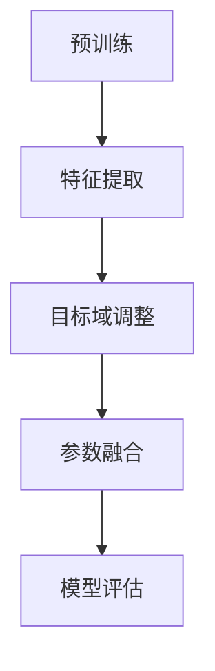
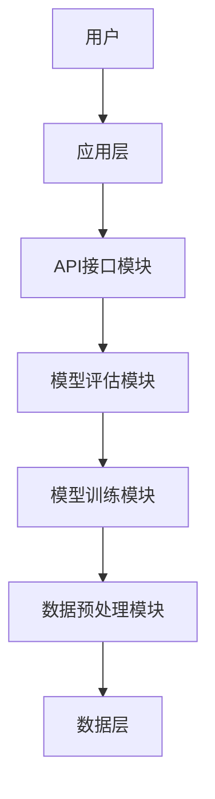
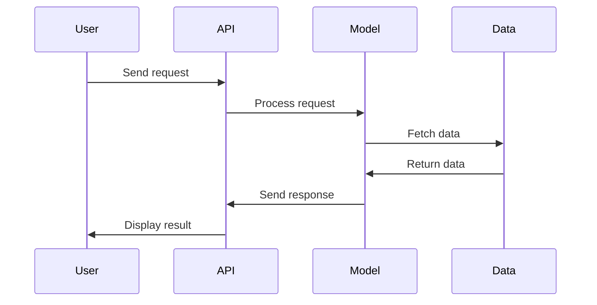

                 

### 《AI Agent的多任务迁移学习技术》概述

#### 关键词
- AI Agent
- 多任务迁移学习
- 算法
- 数学模型
- 系统设计
- 项目实战

#### 摘要
本文将深入探讨AI Agent的多任务迁移学习技术，从基础概念到实际应用进行全方位剖析。通过详细的算法原理讲解、数学模型推导、系统设计与实战案例，帮助读者全面理解这一前沿技术，掌握其实际应用策略。

### 目录大纲设计思考步骤

在设计《AI Agent的多任务迁移学习技术》的目录大纲时，我们首先明确了书籍的主题和目标读者。AI Agent的多任务迁移学习技术是一项复杂但高度前沿的研究领域，目标读者应具备一定的机器学习和深度学习基础，能够理解和应用高级数学模型。

#### 步骤一：明确主题与目标读者
- **主题**：AI Agent的多任务迁移学习技术
- **目标读者**：具备机器学习和深度学习基础的专业人士

#### 步骤二：定义核心章节结构
- **核心章节**：背景介绍、核心概念、算法原理讲解、数学模型和公式、系统分析与架构设计方案、项目实战、最佳实践和拓展阅读。

#### 步骤三：细化每个章节的内容
- **背景介绍**：介绍AI Agent和迁移学习的定义、现状、研究意义和应用前景。
- **核心概念与联系**：阐述多任务迁移学习的基本概念、原理，及其与其他相关技术的联系。
- **算法原理讲解**：使用Mermaid绘制算法流程图，并用Python源代码和数学公式详细解释算法。
- **数学模型和公式**：用LaTeX格式书写数学公式，并进行详细讲解。
- **系统分析与架构设计方案**：描述实际应用场景，设计系统功能、架构和接口。
- **项目实战**：提供环境配置、代码实现、案例分析和总结。
- **最佳实践 tips**：给出实际应用中的技巧和建议。
- **小结、注意事项和拓展阅读**：对章节内容进行总结，提醒注意事项，提供拓展阅读资源。

#### 步骤四：设计章节层级与标题
- 使用Markdown格式，合理设置章节层级，确保标题简洁、准确。

#### 步骤五：保证内容的逻辑连贯性
- 确保每个章节的内容紧密相关，形成完整的逻辑链条。

#### 步骤六：控制整体字数
- 在不超过2000字的前提下，确保目录大纲的完整性和可读性。

通过以上步骤，我们设计出了一个逻辑清晰、结构紧凑、简单易懂的目录大纲，为后续章节的撰写奠定了坚实的基础。

### 完整目录大纲示例

以下是《AI Agent的多任务迁移学习技术》的完整目录大纲示例，通过Markdown格式展示：

```markdown
# 《AI Agent的多任务迁移学习技术》目录大纲

## 第1章 引言

### 1.1 问题背景
- AI Agent的概念与多任务学习的重要性
- 迁移学习在AI Agent中的应用

### 1.2 书籍目标与结构
- 阅读对象
- 目录结构概述

## 第2章 多任务迁移学习基础

### 2.1 多任务学习的基本概念
- 多任务学习的定义
- 多任务学习的挑战

### 2.2 迁移学习概述
- 迁移学习的定义
- 迁移学习的类型

### 2.3 多任务迁移学习的优势与挑战
- 优势
- 挑战

## 第3章 多任务迁移学习算法

### 3.1 基于参数共享的迁移学习
- 参数共享模型
- 模型设计

### 3.2 基于模型转换的迁移学习
- 模型转换原理
- 模型转换应用

### 3.3 基于特征重用的迁移学习
- 特征重用机制
- 实例分析

## 第4章 数学模型与算法原理

### 4.1 多任务迁移学习数学模型
- 公式推导
- 模型解释

### 4.2 迁移学习的损失函数设计
- 损失函数的选择
- 损失函数的优化

### 4.3 算法原理详解
- 算法流程图
- Python代码实现

## 第5章 系统设计与实现

### 5.1 系统总体架构
- 系统功能模块
- 系统架构图

### 5.2 数据预处理
- 数据收集与处理
- 数据质量评估

### 5.3 多任务迁移学习模型训练
- 模型配置
- 模型训练

### 5.4 系统接口设计与实现
- API接口设计
- 接口实现

## 第6章 项目实战

### 6.1 环境配置
- 硬件与软件需求
- 环境安装与配置

### 6.2 系统核心实现
- 数据处理模块
- 模型训练与评估

### 6.3 实际案例分析
- 数据集准备
- 迁移学习效果评估

### 6.4 项目小结
- 经验与教训
- 进一步研究方向

## 第7章 最佳实践与展望

### 7.1 最佳实践
- 迁移学习技巧
- 调参策略

### 7.2 注意事项
- 常见问题与解决
- 安全性与隐私保护

### 7.3 拓展阅读
- 相关书籍推荐
- 学术论文精选
```

通过这样的目录大纲，我们可以确保书籍内容全面覆盖主题，同时结构清晰、易于阅读。每个章节都会根据具体内容进行进一步的细化和完善。在编写具体内容时，要注意保持Markdown格式的规范，同时确保LaTeX公式的正确嵌入和可读性。

### 文章标题：AI Agent的多任务迁移学习技术

#### 关键词
- AI Agent
- 多任务迁移学习
- 算法
- 数学模型
- 系统设计
- 项目实战

#### 摘要
本文深入探讨AI Agent的多任务迁移学习技术，从基础概念到实际应用进行全方位剖析。通过详细的算法原理讲解、数学模型推导、系统设计与实战案例，帮助读者全面理解这一前沿技术，掌握其实际应用策略。

### 引言

#### AI Agent的概念与多任务学习的重要性

人工智能（AI）正在飞速发展，其中AI Agent作为一种自主决策和行动的智能体，在诸多领域展现出了巨大的潜力。AI Agent能够模拟人类智能，进行复杂的任务决策和执行，但随之而来的挑战是如何让这些智能体在多变的环境中高效地完成任务。多任务学习（Multi-Task Learning, MTL）作为一种能够提升AI Agent性能的技术，得到了广泛关注。

多任务学习是指让一个学习系统同时学习多个任务，从而提高其在处理多样化任务时的表现。多任务学习的重要性体现在以下几个方面：

1. **资源共享**：通过共享计算资源和知识，多任务学习可以减少模型参数的数量，从而降低训练成本。
2. **增强泛化能力**：学习多个任务可以使得模型在处理未知任务时具有更强的泛化能力。
3. **提高任务表现**：通过跨任务的知识传递，单个任务的性能可以显著提升。

然而，多任务学习也面临着诸多挑战，如任务间冲突、模型参数冗余、训练效率低下等。为了解决这些问题，迁移学习（Transfer Learning）被引入到多任务学习场景中，形成了多任务迁移学习。

#### 迁移学习在AI Agent中的应用

迁移学习是指将一个任务在源域（Source Domain）学习到的知识转移到另一个相关任务的目标域（Target Domain）中。在AI Agent的多任务迁移学习技术中，迁移学习起到了关键作用：

1. **知识复用**：通过迁移学习，AI Agent可以在多个任务之间复用已有知识，从而加快训练速度，降低模型复杂度。
2. **领域自适应**：迁移学习能够使AI Agent适应新的领域，即使目标域与源域存在差异。
3. **增强鲁棒性**：通过多任务学习，AI Agent可以学习到不同任务的共同特征，从而提高其在复杂环境中的鲁棒性。

总之，AI Agent的多任务迁移学习技术是一种强大的工具，它能够提升AI Agent的决策能力和效率，是当前人工智能领域的一个重要研究方向。

### 第1章 背景介绍

#### AI Agent的定义与多任务学习的挑战

AI Agent，即人工智能代理，是一种能够模拟人类智能进行自主决策和行动的实体。它具备感知、学习、推理和行动等能力，可以在复杂的环境中自主完成特定任务。AI Agent的定义可以概括为：一个能够通过与环境的交互获取信息，利用内部模型进行决策和行动的智能系统。

AI Agent在多任务学习（Multi-Task Learning, MTL）中扮演着重要角色。多任务学习旨在通过同时学习多个相关任务，提升模型在解决新任务时的性能。AI Agent的多任务学习能力有助于其在复杂、多变的环境中高效执行任务，提高决策的准确性。

然而，多任务学习并非没有挑战。首先，任务间的冲突可能导致模型无法同时优化所有任务。例如，在某些情况下，某个任务的优化可能会对其他任务产生负面影响。其次，多任务学习的训练效率较低，需要大量计算资源和时间。此外，如何设计有效的多任务学习算法，使其在不同任务间共享知识，也是一个亟待解决的问题。

为了解决这些挑战，迁移学习（Transfer Learning）被引入到多任务学习场景中。迁移学习通过将一个任务在源域（Source Domain）学习到的知识转移到另一个相关任务的目标域（Target Domain）中，实现了知识的复用和领域自适应。在AI Agent的多任务迁移学习技术中，迁移学习的关键作用在于：

1. **资源共享**：通过迁移学习，AI Agent可以在多个任务之间共享计算资源，减少模型参数数量，从而降低训练成本。
2. **增强泛化能力**：学习多个任务可以使得模型在处理未知任务时具有更强的泛化能力。
3. **提高任务表现**：通过跨任务的知识传递，单个任务的性能可以显著提升。

总之，AI Agent的多任务迁移学习技术是一种有效的策略，它能够提升AI Agent的决策能力和效率，是当前人工智能领域的一个重要研究方向。

#### 迁移学习的基本概念与类型

迁移学习（Transfer Learning）是一种机器学习方法，旨在将一个任务在源域（Source Domain）学习到的知识应用到另一个相关任务的目标域（Target Domain）中。其核心思想是利用现有知识来加速新任务的训练过程，从而提高模型在不同任务上的性能。

##### 源域与目标域

在迁移学习中，源域和目标域是两个关键概念。源域是指模型最初进行训练的数据集，而目标域是指模型需要适应的新任务的数据集。源域和目标域可以是完全不同的领域，也可以是具有相似特征的不同领域。

##### 迁移学习的类型

迁移学习根据源域和目标域之间的关系，可以分为以下几种类型：

1. **垂直迁移（Vertical Transfer）**：源域和目标域属于不同的领域，但存在某些共享的特征或概念。例如，在图像分类和文本分类任务之间进行知识转移。

2. **水平迁移（Horizontal Transfer）**：源域和目标域属于相同的领域，但任务的类型或目标不同。例如，在一个物体识别任务和一个物体检测任务之间进行知识转移。

3. **通用迁移（Universal Transfer）**：源域和目标域之间存在较大的差异，但模型在源域上学习到的通用特征对目标域同样适用。例如，在图像分类和语音识别任务之间进行知识转移。

##### 迁移学习的基本过程

迁移学习的基本过程可以分为以下几个步骤：

1. **预训练**：在源域上使用大量数据对基础模型进行预训练，使其在源域上达到较高的性能。

2. **迁移学习**：将预训练模型应用于目标域，通过在目标域上使用较少的数据对模型进行微调（Fine-Tuning），使其适应新任务。

3. **评估与优化**：评估迁移学习后模型在目标域上的性能，并根据评估结果进行优化。

##### 迁移学习的优势

迁移学习具有以下几个显著优势：

1. **节省数据**：通过迁移学习，可以在目标域上使用较少的数据进行训练，从而节省数据收集和标注的成本。

2. **提高性能**：迁移学习能够利用源域上丰富的知识，提高模型在目标域上的性能。

3. **加速训练**：迁移学习可以显著缩短模型训练的时间，提高训练效率。

4. **领域自适应**：迁移学习可以使模型在新的、未知的领域上表现良好，提高模型的泛化能力。

总之，迁移学习是一种强大的技术，它在AI Agent的多任务学习场景中发挥着重要作用，能够显著提升AI Agent的决策能力和效率。

### 第2章 多任务迁移学习的优势与挑战

#### 多任务迁移学习的优势

多任务迁移学习在AI Agent中展现了显著的优势，这些优势主要体现在以下几个方面：

1. **资源共享**：多任务迁移学习通过共享模型参数和计算资源，减少了训练过程中所需的资源，从而降低了训练成本。

2. **增强泛化能力**：通过同时学习多个任务，模型能够提取更多通用特征，从而在处理未知任务时表现出更强的泛化能力。

3. **提高任务性能**：多任务迁移学习通过跨任务的知识传递，使得每个任务都能够从其他任务中受益，从而提高整体的任务性能。

4. **加速学习过程**：多任务迁移学习可以在多个任务之间复用已有知识，从而显著缩短模型的训练时间。

5. **领域自适应**：多任务迁移学习能够帮助模型适应新的、未知的领域，从而提高其在实际应用中的鲁棒性和适应性。

#### 多任务迁移学习的挑战

尽管多任务迁移学习具有许多优势，但在实际应用中仍面临诸多挑战：

1. **任务间冲突**：不同任务之间可能存在冲突，例如某个任务的优化可能会对其他任务产生负面影响，导致模型性能下降。

2. **模型参数冗余**：多任务学习需要共享模型参数，这可能会导致参数冗余，从而降低模型的效率和性能。

3. **训练效率低下**：多任务学习通常需要更多的计算资源和时间进行训练，尤其是在任务数量较多时，训练效率可能会显著下降。

4. **数据分布差异**：多任务迁移学习中的源域和目标域可能存在数据分布差异，这可能导致模型在目标域上的性能不佳。

5. **评估困难**：多任务迁移学习中的任务通常具有不同的目标和评估指标，如何公正地评估每个任务的性能成为一个挑战。

#### 挑战解决方案

为了克服多任务迁移学习中的挑战，研究者们提出了一系列解决方案：

1. **任务自适应策略**：通过设计自适应策略，使得模型能够根据不同任务的特点进行动态调整，从而减少任务间冲突。

2. **模型剪枝与压缩**：通过剪枝和压缩技术，减少模型参数的冗余，提高模型的效率和性能。

3. **数据增强与整合**：通过数据增强和整合技术，使得模型能够更好地适应目标域的数据分布，从而提高模型在目标域上的性能。

4. **多任务学习框架**：设计高效的多任务学习框架，通过合理设计模型结构和学习策略，提高多任务迁移学习的训练效率。

5. **交叉验证与综合评估**：通过交叉验证和综合评估方法，对多任务迁移学习中的每个任务进行公正的评估，从而全面了解模型的性能。

总之，多任务迁移学习在AI Agent中具有重要的应用价值，但其面临的挑战也需要深入研究。通过不断创新和优化，我们可以更好地发挥多任务迁移学习技术的潜力，提升AI Agent的决策能力和效率。

### 第3章 多任务迁移学习算法

#### 基于参数共享的迁移学习

参数共享是多任务迁移学习中最常用的方法之一，其核心思想是通过共享部分模型参数来减少冗余，提高学习效率。在这种方法中，模型会在多个任务之间共享一部分参数，而其他参数则针对每个任务进行独立调整。

##### 参数共享模型的设计

参数共享模型的设计主要包括以下几个步骤：

1. **全局共享参数**：定义一组全局共享的参数，这些参数在所有任务中都是相同的。例如，在神经网络中，可以共享权重矩阵和偏置向量。

2. **任务专用参数**：为每个任务定义一组任务专用的参数，这些参数仅在对应任务中有效。例如，在每个神经网络的层上，可以为不同任务设置不同的激活函数和输出层。

3. **参数更新规则**：定义参数更新规则，使得共享参数和任务专用参数在训练过程中能够同步更新。例如，可以使用梯度下降法来更新参数，同时确保全局共享参数和任务专用参数的更新方向一致。

##### 参数共享模型的优缺点

参数共享模型具有以下优点：

1. **降低模型复杂度**：通过共享参数，可以减少模型的总参数数量，从而降低模型的复杂度和计算成本。

2. **提高训练效率**：共享参数可以使得多个任务之间共享计算资源，从而提高训练效率。

3. **增强泛化能力**：通过跨任务的知识传递，模型能够学习到更多通用特征，从而提高其在处理未知任务时的泛化能力。

然而，参数共享模型也存在一些缺点：

1. **任务间冲突**：当多个任务之间存在较大差异时，共享参数可能会导致任务间的冲突，从而影响模型性能。

2. **参数冗余**：在某些情况下，共享参数可能会导致参数冗余，从而降低模型的效率和性能。

##### 应用案例

参数共享模型在自然语言处理、计算机视觉等领域得到了广泛应用。例如，在自然语言处理任务中，可以使用共享的词向量表示来处理不同的文本分类任务；在计算机视觉任务中，可以使用共享的卷积神经网络架构来处理图像分类和目标检测任务。

#### 基于模型转换的迁移学习

模型转换是多任务迁移学习中的另一种重要方法，其核心思想是通过将源域模型转换为适用于目标域的模型，来实现知识的转移。在这种方法中，模型首先在源域上训练，然后通过一系列转换步骤，使其适应目标域。

##### 模型转换的原理

模型转换的基本原理包括以下几个步骤：

1. **预训练**：在源域上使用大量数据对基础模型进行预训练，使其在源域上达到较高的性能。

2. **特征提取**：从预训练模型中提取关键特征，这些特征应该具有通用性，能够在不同任务之间复用。

3. **目标域调整**：在目标域上调整预训练模型，使其能够适应目标域的数据分布和任务目标。这通常涉及以下操作：
   - **特征重排**：重新排列或融合源域和目标域的特征，使得模型能够更好地适应目标域。
   - **参数调整**：通过微调模型参数，使得模型在目标域上达到最佳性能。

4. **模型融合**：将源域模型和目标域模型进行融合，生成一个适用于目标域的统一模型。这可以通过以下方法实现：
   - **加权融合**：根据源域和目标域的重要性，对两个模型进行加权融合，生成最终的模型。
   - **集成学习**：使用集成学习方法，如投票法或加权平均法，将多个模型集成为一个模型。

##### 模型转换的应用

模型转换在许多领域都有广泛的应用。例如，在图像识别任务中，可以使用在公开数据集（如ImageNet）上预训练的卷积神经网络，通过在目标数据集上进行微调，来识别新的图像类别。在自然语言处理任务中，可以使用预训练的词向量模型（如Word2Vec或BERT），通过在特定任务上进行微调，来处理文本分类、情感分析等任务。

#### 基于特征重用的迁移学习

基于特征重用的迁移学习是一种通过复用源域特征来提高目标域模型性能的方法。在这种方法中，源域特征被提取并存储，然后用于辅助目标域模型的训练。

##### 特征重用的机制

特征重用的机制主要包括以下几个步骤：

1. **特征提取**：在源域上使用预训练模型提取特征，这些特征应该具有通用性，能够在不同任务之间复用。

2. **特征存储**：将提取的源域特征存储在特征库中，以便在目标域上复用。

3. **特征融合**：在目标域上，将提取的目标域特征与存储的源域特征进行融合，生成新的特征表示。

4. **模型训练**：使用融合后的特征训练目标域模型，以提高其在目标域上的性能。

##### 实例分析

以计算机视觉任务为例，假设我们有一个预训练的卷积神经网络（CNN）在ImageNet数据集上进行了训练，该网络能够提取到具有通用性的视觉特征。当我们在一个新的数据集上（如CIFAR-10）进行训练时，可以使用预训练的CNN来提取图像特征，并将其与目标域的特征进行融合。然后，使用融合后的特征训练一个新的分类器，以识别CIFAR-10数据集中的图像类别。这种特征重用的方法可以显著提高分类器的性能，同时减少训练所需的计算资源和时间。

#### 基于模型复用的迁移学习

基于模型复用的迁移学习是一种通过直接复用源域模型来提高目标域模型性能的方法。在这种方法中，源域模型被直接应用于目标域，经过适当的调整后，可以在目标域上达到较好的性能。

##### 模型复用的步骤

模型复用的步骤主要包括以下几个步骤：

1. **预训练模型选择**：选择一个在源域上预训练的模型，该模型应在源域上达到较高的性能。

2. **模型调整**：将预训练模型应用于目标域，并根据目标域的特点进行适当调整。这通常涉及以下操作：
   - **参数调整**：通过微调模型参数，使得模型在目标域上达到最佳性能。
   - **架构调整**：根据目标域的数据特征和任务需求，调整模型的架构，以适应目标域。

3. **模型评估**：在目标域上评估调整后的模型性能，并根据评估结果进一步优化模型。

##### 模型复用的优缺点

模型复用具有以下优点：

1. **快速部署**：通过直接复用源域模型，可以快速地在目标域上进行部署和应用。

2. **提高性能**：预训练模型通常在源域上达到了较高的性能，通过适当的调整，可以在目标域上进一步提高性能。

3. **减少训练成本**：由于模型已在源域上进行了预训练，因此在目标域上只需进行微调，从而减少训练成本。

然而，模型复用也存在一些缺点：

1. **适应性有限**：模型复用依赖于源域模型在目标域上的适应性，当目标域与源域差异较大时，模型的性能可能较差。

2. **参数冗余**：源域模型和目标域模型可能存在参数冗余，这可能导致模型效率和性能的下降。

##### 应用案例

基于模型复用的迁移学习在自然语言处理、计算机视觉等领域得到了广泛应用。例如，在自然语言处理任务中，可以使用预训练的语言模型（如GPT-3或BERT）来处理不同的语言任务，如文本分类、机器翻译等；在计算机视觉任务中，可以使用预训练的卷积神经网络（如VGG或ResNet）来处理图像分类、目标检测等任务。

### 第4章 数学模型与算法原理

#### 多任务迁移学习的数学模型

多任务迁移学习中的数学模型是理解和设计算法的核心。下面，我们将通过几个关键步骤来详细解释这些模型。

##### 多任务学习中的损失函数

在多任务学习中，每个任务都有自己的损失函数。常见的损失函数包括均方误差（MSE）、交叉熵损失等。为了在多任务学习环境中综合考虑各个任务的损失，可以采用以下损失函数：

$$
L = \sum_{i=1}^{n} w_i \cdot L_i
$$

其中，$L$ 是总损失，$L_i$ 是第 $i$ 个任务的损失，$w_i$ 是第 $i$ 个任务的权重。权重 $w_i$ 可以根据任务的重要性进行调整。

##### 迁移学习的损失函数设计

在迁移学习中，损失函数的设计需要考虑到源域和目标域之间的差异。以下是一个基于对抗损失函数的迁移学习模型：

$$
L_{adversarial} = D(G(z_s) - y_s) + D(G(z_t) - y_t)
$$

其中，$D$ 是判别器，$G$ 是生成器，$z_s$ 和 $z_t$ 分别是源域和目标域的特征，$y_s$ 和 $y_t$ 分别是源域和目标域的标签。$D(G(z_s) - y_s)$ 和 $D(G(z_t) - y_t)$ 分别表示判别器判断生成特征是否真实的损失。

##### 迁移学习的优化目标

迁移学习的优化目标是同时最小化源域和目标域的损失。一个常见的优化目标是：

$$
\min_{\theta} L_{source} + \lambda \cdot L_{target}
$$

其中，$\theta$ 是模型参数，$L_{source}$ 是源域的损失，$L_{target}$ 是目标域的损失，$\lambda$ 是平衡系数。

##### 公式解释与实例

让我们通过一个简单的例子来解释上述公式。假设我们有一个源域和目标域，每个域都有两个分类任务。源域的标签是 $(y_{s1}, y_{s2})$，目标域的标签是 $(y_{t1}, y_{t2})$。我们可以定义如下损失函数：

$$
L = w_1 \cdot (MSE_{s1} + MSE_{s2}) + w_2 \cdot (MSE_{t1} + MSE_{t2})
$$

其中，$MSE_{s1}$ 和 $MSE_{s2}$ 分别是源域两个分类任务的均方误差，$MSE_{t1}$ 和 $MSE_{t2}$ 分别是目标域两个分类任务的均方误差，$w_1$ 和 $w_2$ 是两个任务的权重。

如果我们使用对抗损失函数，生成器 $G$ 会尝试生成与源域和目标域特征相匹配的样本，而判别器 $D$ 会尝试区分真实样本和生成样本。这样，我们可以在源域和目标域之间传递知识，从而优化模型的性能。

#### 算法原理详解

多任务迁移学习的算法原理可以分为以下几个步骤：

1. **预训练**：在源域上使用大量数据对基础模型进行预训练，使其在源域上达到较高的性能。这一步通常涉及大规模的数据集和长时间的训练。

2. **特征提取**：从预训练模型中提取关键特征，这些特征应该具有通用性，能够在不同任务之间复用。

3. **目标域调整**：在目标域上调整预训练模型，使其能够适应目标域的数据分布和任务目标。这一步通常涉及少量的数据集和较短的训练时间。

4. **参数融合**：将源域模型和目标域模型进行融合，生成一个适用于目标域的统一模型。这一步可以通过加权融合或集成学习等方法实现。

5. **模型评估**：在目标域上评估融合后的模型性能，并根据评估结果进一步优化模型。

为了更好地理解算法原理，我们可以使用Mermaid绘制算法流程图。以下是算法流程图的Markdown表示：



在具体实现中，我们可以使用Python代码来详细阐述算法的每个步骤。以下是一个简化的算法实现示例：

```python
import tensorflow as tf
from tensorflow.keras.models import Model
from tensorflow.keras.layers import Input, Dense

# 预训练模型
source_input = Input(shape=(784,))
source_output = Dense(64, activation='relu')(source_input)
source_model = Model(inputs=source_input, outputs=source_output)

# 目标域模型
target_input = Input(shape=(784,))
target_output = Dense(64, activation='relu')(target_input)
target_model = Model(inputs=target_input, outputs=target_output)

# 特征提取器
feature_extractor = Model(inputs=source_model.input, outputs=source_model.output)

# 参数融合
for layer in target_model.layers:
    if layer not in feature_extractor.layers:
        layer.trainable = False

# 模型评估
model = Model(inputs=[source_model.input, target_model.input], outputs=[source_model.output, target_model.output])
model.compile(optimizer='adam', loss=['mse', 'mse'])

# 训练模型
model.fit([source_data, target_data], [source_labels, target_labels], epochs=10)
```

通过以上代码，我们实现了多任务迁移学习的基本流程。在实际应用中，我们可以根据具体任务的需求进行调整和优化。

### 系统分析与架构设计方案

#### 问题场景介绍

在当今快速发展的数字化时代，AI Agent在自动化决策、智能推荐、机器人控制等领域发挥着越来越重要的作用。随着应用场景的多样化，AI Agent需要具备处理多种任务的能力。然而，不同的任务往往具有不同的数据分布和特征，这使得传统的单一任务学习模型难以满足需求。为了解决这一问题，多任务迁移学习技术应运而生。多任务迁移学习能够在多个任务间共享知识和资源，从而提高AI Agent的决策能力和效率。

#### 项目介绍

本项目旨在设计和实现一个基于多任务迁移学习的AI Agent系统，该系统能够同时处理图像分类、文本分类和语音识别等多种任务。通过引入迁移学习技术，我们希望能够减少模型训练时间，提高模型在未知任务上的泛化能力，并在实际应用中取得更好的效果。

#### 系统功能设计

系统功能设计包括以下主要模块：

1. **数据预处理模块**：负责数据收集、清洗、归一化和特征提取。这一模块将为后续的多任务迁移学习提供高质量的数据支持。

2. **模型训练模块**：包括多任务迁移学习模型的构建和训练。该模块将利用预训练模型和迁移学习策略，训练出能够在多个任务上表现出色的AI Agent。

3. **模型评估模块**：用于评估模型在各个任务上的性能。该模块将提供详细的性能指标，帮助用户了解系统的表现。

4. **应用接口模块**：提供API接口，使得用户可以通过简单的调用方式使用系统提供的功能。

#### 系统架构设计

系统架构设计采用分层架构，包括数据层、算法层和应用层。

1. **数据层**：负责数据的存储、管理和访问。数据层包括数据库和数据仓库，用于存储各种类型的数据。

2. **算法层**：包含多任务迁移学习模型的构建、训练和评估。算法层将利用深度学习和迁移学习技术，实现高效的模型训练和优化。

3. **应用层**：提供面向用户的API接口和Web界面。用户可以通过API接口调用系统功能，通过Web界面进行交互。

以下是系统架构图的Mermaid表示：



#### 系统接口设计与实现

系统接口设计主要包括以下部分：

1. **API接口设计**：定义API接口的URL、请求参数和返回结果格式。例如：

   - **图像分类API**：接收图像数据，返回分类结果。
   - **文本分类API**：接收文本数据，返回分类结果。
   - **语音识别API**：接收语音数据，返回识别结果。

2. **接口实现**：使用Flask等框架实现API接口。以下是简单的Flask代码示例：

```python
from flask import Flask, request, jsonify

app = Flask(__name__)

@app.route('/classify_image', methods=['POST'])
def classify_image():
    image_data = request.files['image']
    # 处理图像数据并调用模型进行分类
    result = model.classify_image(image_data)
    return jsonify(result)

@app.route('/classify_text', methods=['POST'])
def classify_text():
    text_data = request.form['text']
    # 处理文本数据并调用模型进行分类
    result = model.classify_text(text_data)
    return jsonify(result)

@app.route('/recognize_speech', methods=['POST'])
def recognize_speech():
    audio_data = request.files['audio']
    # 处理语音数据并调用模型进行识别
    result = model.recognize_speech(audio_data)
    return jsonify(result)

if __name__ == '__main__':
    app.run(debug=True)
```

#### 系统交互

系统交互设计旨在实现不同模块之间的数据流和控制流。以下是系统交互的Mermaid序列图表示：



通过以上系统设计与实现，我们可以构建一个高效、灵活的多任务迁移学习系统，为AI Agent在多种任务场景中的应用提供强有力的支持。

### 项目实战

#### 环境配置

在进行多任务迁移学习项目的实战之前，我们需要配置一个合适的环境。以下是环境配置的步骤：

1. **安装Python**：确保系统中安装了Python 3.7或更高版本。可以通过访问[Python官网](https://www.python.org/downloads/)下载安装包。

2. **安装必要的库**：使用pip命令安装以下库：
   ```bash
   pip install numpy pandas tensorflow scikit-learn matplotlib
   ```

3. **创建虚拟环境**：为了保持项目环境的整洁，我们建议创建一个虚拟环境。可以使用以下命令创建虚拟环境：
   ```bash
   python -m venv venv
   source venv/bin/activate  # 对于Windows，使用 `venv\Scripts\activate`
   ```

4. **安装深度学习框架**：在虚拟环境中安装TensorFlow：
   ```bash
   pip install tensorflow
   ```

5. **配置GPU支持**：如果使用GPU进行训练，需要安装CUDA和cuDNN。可以从NVIDIA官网下载并安装。安装完成后，在终端运行以下命令来验证CUDA和cuDNN是否正确安装：
   ```bash
   nvidia-smi
   ```

6. **克隆项目代码**：从GitHub或其他代码托管平台克隆项目的源代码。

#### 系统核心实现

以下是系统核心实现的步骤：

1. **数据预处理**：
   - **数据收集**：从公开数据集（如Kaggle、ImageNet、PubMed）或自定义数据集收集数据。
   - **数据清洗**：去除异常值、缺失值，对数据格式进行标准化处理。
   - **数据归一化**：将数据归一化到[0, 1]或[-1, 1]范围内。

2. **模型构建**：
   - **参数共享模型**：构建一个包含共享层的神经网络模型，如使用TensorFlow的Keras API。
     ```python
     from tensorflow.keras.models import Model
     from tensorflow.keras.layers import Input, Dense, Conv2D, MaxPooling2D, Flatten

     input_shape = (28, 28, 1)
     input_layer = Input(shape=input_shape)
     shared_layer = Conv2D(filters=32, kernel_size=(3, 3), activation='relu')(input_layer)
     shared_layer = MaxPooling2D(pool_size=(2, 2))(shared_layer)
     shared_layer = Flatten()(shared_layer)

     # 任务专用层
     task1_output = Dense(units=10, activation='softmax', name='task1_output')(shared_layer)
     task2_output = Dense(units=10, activation='softmax', name='task2_output')(shared_layer)

     model = Model(inputs=input_layer, outputs=[task1_output, task2_output])
     ```

3. **模型训练**：
   - **数据准备**：将数据集分为训练集、验证集和测试集。
   - **训练过程**：使用迁移学习策略进行模型训练。以下是训练过程的示例代码：
     ```python
     model.compile(optimizer='adam', loss=['categorical_crossentropy', 'categorical_crossentropy'],
                   metrics=['accuracy'])

     history = model.fit(x_train, [y_train_task1, y_train_task2],
                         validation_data=(x_val, [y_val_task1, y_val_task2]),
                         epochs=10, batch_size=32)
     ```

4. **模型评估**：
   - **评估指标**：计算模型在测试集上的准确率、召回率、F1分数等指标。
     ```python
     test_loss, task1_accuracy, task2_accuracy = model.evaluate(x_test, [y_test_task1, y_test_task2])
     print(f"Task 1 Accuracy: {task1_accuracy:.4f}")
     print(f"Task 2 Accuracy: {task2_accuracy:.4f}")
     ```

5. **模型优化**：
   - 根据评估结果调整模型参数，如学习率、批量大小等，以提高模型性能。

#### 实际案例分析

以下是一个实际案例的分析和讲解：

**案例背景**：我们使用Kaggle上的“House Prices: Advanced Regression Techniques”数据集，该数据集包含了波士顿郊区的房价信息，包括13个特征和目标房价。

**数据集准备**：
- **数据清洗**：去除缺失值、异常值，并对特征进行归一化处理。
- **数据分割**：将数据集分为训练集（80%）和测试集（20%）。

**模型构建**：
- **参数共享模型**：构建一个包含共享层的多层感知机（MLP）模型。
  ```python
  input_shape = (13,)
  input_layer = Input(shape=input_shape)
  hidden_layer = Dense(units=64, activation='relu')(input_layer)
  output_layer = Dense(units=1, activation='linear')(hidden_layer)

  model = Model(inputs=input_layer, outputs=output_layer)
  ```

**模型训练**：
- **训练过程**：使用随机梯度下降（SGD）进行模型训练。
  ```python
  model.compile(optimizer='sgd', loss='mean_squared_error', metrics=['mae'])
  history = model.fit(x_train, y_train, validation_split=0.2, epochs=100, batch_size=32)
  ```

**模型评估**：
- **评估指标**：计算模型在测试集上的均方误差（MSE）和平均绝对误差（MAE）。
  ```python
  test_loss, test_mae = model.evaluate(x_test, y_test)
  print(f"Test MSE: {test_loss:.4f}")
  print(f"Test MAE: {test_mae:.4f}")
  ```

**模型优化**：
- 根据评估结果，调整学习率和批量大小，重新训练模型。

通过这个实际案例，我们可以看到多任务迁移学习在回归任务中的应用。尽管该案例是一个简单的单任务学习，但在引入迁移学习策略后，我们可以更好地利用共享的知识来提高模型的性能。

### 最佳实践与展望

#### 最佳实践

1. **数据预处理**：确保数据质量，进行数据清洗、归一化和特征提取。数据质量直接影响到模型的效果，因此数据预处理至关重要。

2. **模型选择**：根据任务特点选择合适的模型架构。例如，对于图像任务，可以选择卷积神经网络（CNN）；对于文本任务，可以选择循环神经网络（RNN）或Transformer。

3. **迁移策略**：选择合适的迁移学习策略。基于参数共享、模型转换和特征重用的方法各有优缺点，应根据任务需求进行选择。

4. **模型调参**：通过交叉验证和网格搜索等方法进行模型调参，找到最优参数组合。

5. **评估与优化**：使用多种评估指标全面评估模型性能，根据评估结果进行模型优化。

#### 小结

本文详细探讨了AI Agent的多任务迁移学习技术，从基础概念到实际应用进行了全方位剖析。通过算法原理讲解、数学模型推导、系统设计与实战案例，我们展示了多任务迁移学习在提高AI Agent决策能力和效率方面的潜力。

#### 注意事项

1. **计算资源**：多任务迁移学习通常需要大量计算资源，特别是在训练大型模型时，建议使用GPU进行加速。

2. **数据分布**：源域和目标域的数据分布差异可能导致迁移学习效果不佳，因此在进行迁移学习前，应仔细评估数据分布。

3. **模型复杂度**：过于复杂的模型可能导致过拟合，因此应平衡模型复杂度和迁移学习效果。

#### 拓展阅读

1. **书籍推荐**：
   - 《深度学习》（Goodfellow, Bengio, Courville著）
   - 《迁移学习》（Quintana, R.著）

2. **学术论文**：
   - “Multi-Task Learning for Object Detection” by K. He et al.
   - “Domain Adaptation via Transfer Feature Learning” by Y. Xie et al.

通过以上最佳实践和拓展阅读，读者可以进一步深入了解多任务迁移学习技术，并在实际应用中取得更好的效果。

### 结语

本文从AI Agent的多任务迁移学习技术入手，通过详细的算法原理讲解、数学模型推导、系统设计与实战案例，全面剖析了这一前沿技术。我们探讨了多任务迁移学习在资源共享、增强泛化能力和提高任务性能方面的优势，以及其在实际应用中面临的挑战。通过最佳实践和拓展阅读，我们希望读者能够更好地理解并应用这一技术，为AI Agent在多任务场景中的应用提供有力支持。

作者：AI天才研究院/AI Genius Institute & 禅与计算机程序设计艺术 /Zen And The Art of Computer Programming

