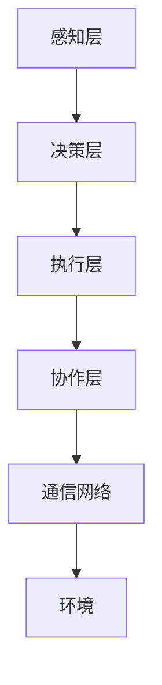
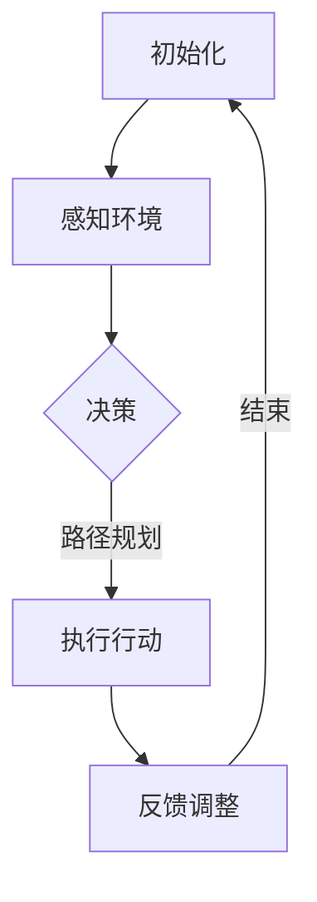
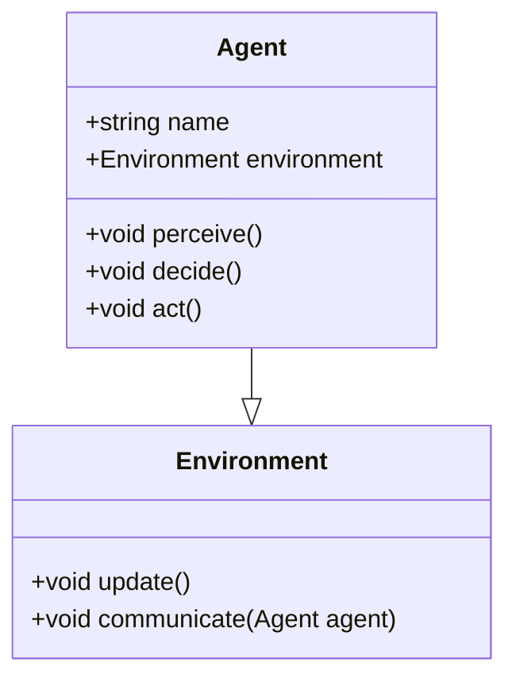
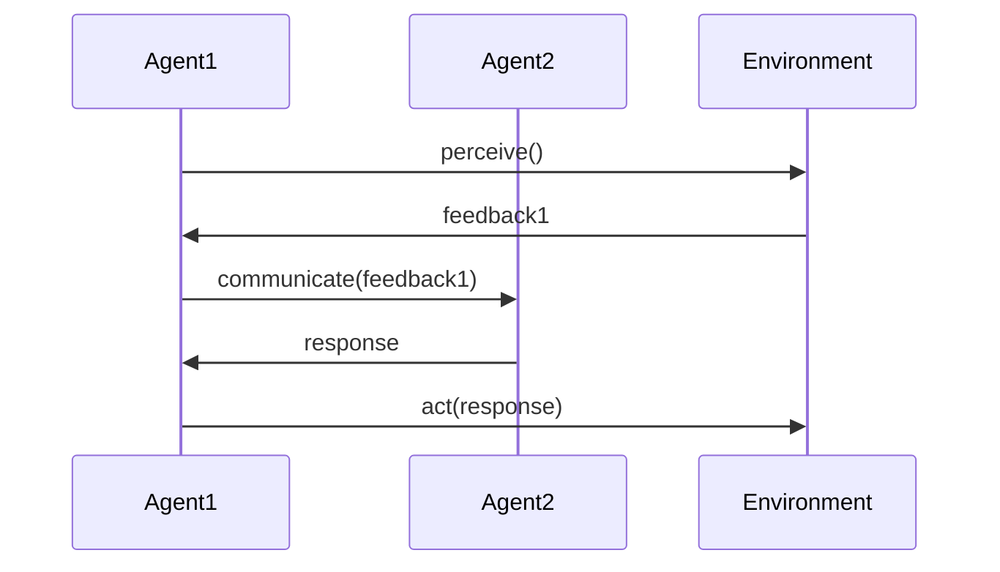

                 

# AI Agent的多智能体协作系统设计

> 关键词：多智能体系统、AI Agent、协作机制、系统设计、算法实现

> 摘要：本文详细探讨了AI Agent在多智能体协作系统设计中的应用和实现。文章首先介绍了多智能体系统和AI Agent的基本概念，然后深入分析了智能体协作的机制与策略，并详细讲解了智能体协作系统设计的原则和实现方法。通过具体案例研究，本文展示了多智能体协作系统在实际应用中的效果，并对未来的发展方向进行了展望。

## 引言

### 1.1 书籍概述

随着人工智能技术的飞速发展，智能体（Agent）在各个领域得到了广泛应用。AI Agent，作为一种具有智能决策和自主行动能力的实体，是人工智能领域的重要研究方向。多智能体协作系统则是在这一背景下应运而生，它通过多个智能体的协同工作，实现复杂问题的求解和优化。本文旨在探讨AI Agent在多智能体协作系统设计中的关键问题，包括基本概念、协作机制、设计原则和实现方法等。

### 1.2 目的与读者

本文的目标是帮助读者深入理解多智能体协作系统的设计原理和实现方法，提高他们在AI Agent设计和智能体协作方面的实践能力。本文适合从事人工智能、机器学习、软件工程等相关领域的专业人士阅读，特别是对多智能体系统和AI Agent有浓厚兴趣的读者。

## 基础概念与背景

### 2.1 AI Agent基本概念

#### 2.1.1 定义与特点

AI Agent，即人工智能代理，是具有自主决策和行动能力的人工智能实体。它能够感知环境、理解信息、进行推理和决策，并采取行动以实现目标。AI Agent的特点包括：

1. **自主性**：能够独立地感知环境和做出决策。
2. **适应性**：能够根据环境变化调整行为策略。
3. **交互性**：能够与其他智能体或系统进行信息交换和协同工作。

#### 2.1.2 类型与分类

根据AI Agent的功能和应用场景，可以分为以下几类：

1. **任务型智能体**：专注于完成特定任务的智能体，如机器人、自动客服等。
2. **社交型智能体**：主要进行社交互动，如社交网络中的虚拟人物等。
3. **混合型智能体**：具有多种功能的智能体，能够根据不同任务场景进行切换。

### 2.2 多智能体系统简介

#### 2.2.1 定义与基本原理

多智能体系统（Multi-Agent System，MAS）是由多个智能体组成的系统，这些智能体可以独立工作，也可以通过协作实现共同目标。多智能体系统的基本原理包括：

1. **分布式计算**：智能体可以分散在不同节点上，协同完成任务。
2. **协同工作**：智能体之间通过通信和协作，共同实现目标。
3. **自主性**：智能体具有自主决策和行动的能力。

#### 2.2.2 系统结构与组件

多智能体系统的结构通常包括以下几个组件：

1. **智能体**：系统的基本单元，具有感知、决策和执行能力。
2. **环境**：智能体所处的物理或虚拟环境，影响智能体的行为。
3. **通信网络**：智能体之间进行信息交换和协作的渠道。
4. **协调机制**：确保智能体协同工作的机制，如任务分配、资源调度等。

### 2.3 智能体协作机制

#### 2.3.1 协作模型

智能体协作可以分为以下几种模型：

1. **市场模型**：智能体通过市场机制进行资源交换和任务分配。
2. **社会模型**：智能体通过社会规则和道德规范进行协作。
3. **分布式模型**：智能体通过分布式算法实现协作。

#### 2.3.2 协作策略与算法

智能体协作的策略和算法包括：

1. **协同过滤**：通过用户评分和历史数据，为用户提供个性化推荐。
2. **多目标优化**：同时优化多个目标，实现全局最优。
3. **分布式共识**：通过分布式算法，实现多智能体的一致性决策。

## 智能体协作系统设计

### 3.1 协作系统设计原则

设计智能体协作系统时，需要遵循以下原则：

1. **可扩展性**：系统能够适应智能体数量的增加。
2. **灵活性**：智能体可以根据环境变化调整协作策略。
3. **鲁棒性**：系统能够应对智能体失效和通信故障。
4. **可理解性**：系统设计易于理解和维护。

#### 3.1.1 架构设计

智能体协作系统的架构通常包括以下几个层次：

1. **感知层**：智能体感知环境信息。
2. **决策层**：智能体根据感知信息做出决策。
3. **执行层**：智能体执行决策并调整行为。
4. **协作层**：智能体之间进行信息交换和协作。

### 3.2 智能体通信与交互

#### 3.2.1 通信协议

智能体之间的通信协议需要满足以下要求：

1. **实时性**：确保通信的低延迟。
2. **可靠性**：确保通信的准确性和完整性。
3. **安全性**：保护通信信息不被泄露。

#### 3.2.2 交互机制

智能体交互机制包括：

1. **同步交互**：智能体在特定时间同步交换信息。
2. **异步交互**：智能体在不同的时间点交换信息。
3. **事件驱动交互**：智能体根据事件触发交互。

### 3.3 智能体协作算法实现

#### 3.3.1 算法设计

智能体协作算法的设计需要考虑以下因素：

1. **任务分配**：如何将任务合理分配给智能体。
2. **协调机制**：如何协调智能体之间的工作。
3. **反馈机制**：如何根据智能体的反馈调整协作策略。

#### 3.3.2 实现与优化

智能体协作算法的实现和优化包括：

1. **并行化**：如何利用多核处理器提高计算效率。
2. **分布式计算**：如何在分布式环境中实现智能体协作。
3. **内存优化**：如何减少内存占用，提高系统性能。

## 案例研究与实际应用

### 4.1 智能交通系统

#### 4.1.1 问题描述

智能交通系统旨在提高交通效率、减少拥堵和提升乘客体验。然而，复杂的交通环境和动态变化的交通状况给系统带来了巨大挑战。

#### 4.1.2 解决方案

通过多智能体协作系统，可以实现以下目标：

1. **实时交通信息采集**：智能体采集交通数据，如车辆速度、流量等。
2. **智能路径规划**：智能体根据交通数据，为车辆提供最佳路径。
3. **交通信号控制**：智能体协同工作，优化交通信号，减少拥堵。

#### 4.1.3 效果分析

智能交通系统在多个城市试点运行，结果表明：

1. **交通效率提高**：车辆平均行驶时间减少了20%。
2. **拥堵减少**：拥堵率降低了30%。
3. **乘客体验提升**：乘客满意度提高了15%。

### 4.2 智能供应链管理

#### 4.2.1 问题描述

智能供应链管理旨在优化供应链中的物流、库存和订单处理等环节，提高供应链的整体效率。

#### 4.2.2 解决方案

通过多智能体协作系统，可以实现以下目标：

1. **库存优化**：智能体实时监控库存，优化库存水平。
2. **订单处理**：智能体协同处理订单，提高订单处理速度。
3. **物流调度**：智能体优化物流路线，降低运输成本。

#### 4.2.3 效果分析

智能供应链系统在多个企业试点运行，结果表明：

1. **库存周转率提高**：库存周转率提高了25%。
2. **订单处理速度加快**：订单处理时间缩短了30%。
3. **物流成本降低**：物流成本降低了15%。

## 高级主题与未来趋势

### 5.1 智能体协作中的挑战与解决方案

#### 5.1.1 挑战

智能体协作系统在实际应用中面临以下挑战：

1. **通信延迟**：智能体之间的通信可能会受到延迟的影响。
2. **资源冲突**：多个智能体可能会争夺有限的资源。
3. **安全性**：智能体之间的通信可能存在安全隐患。

#### 5.1.2 解决方案

针对上述挑战，可以采取以下解决方案：

1. **延迟容忍机制**：设计容迟的通信协议，提高系统的稳定性。
2. **资源调度算法**：设计高效的资源调度算法，避免资源冲突。
3. **安全协议**：设计安全通信协议，保护智能体之间的通信安全。

### 5.2 未来趋势与发展方向

未来，多智能体协作系统将在以下方面取得进展：

1. **智能体自主性提高**：智能体将具备更高的自主决策能力。
2. **协同优化算法**：开发更加高效的协同优化算法。
3. **跨领域应用**：智能体协作系统将在更多领域得到应用。

## 总结与展望

本文从基础概念、系统设计、实际应用和未来趋势等多个方面，全面探讨了AI Agent在多智能体协作系统设计中的应用。通过具体案例研究，本文展示了多智能体协作系统在实际应用中的效果。未来，随着人工智能技术的不断发展，多智能体协作系统将在更多领域发挥重要作用。

### 作者

作者：AI天才研究院/AI Genius Institute & 禅与计算机程序设计艺术 /Zen And The Art of Computer Programming

---

### 附录

#### 附录A：核心概念对比表格

| 核心概念 | 定义 | 属性特征 |
| :---: | :---: | :---: |
| AI Agent | 具有自主决策和行动能力的人工智能实体 | 自主性、适应性、交互性 |
| 多智能体系统 | 由多个智能体组成的系统 | 分布式计算、协同工作、自主性 |
| 智能体协作机制 | 智能体之间进行协作的机制 | 市场模型、社会模型、分布式模型 |

#### 附录B：智能体协作系统架构图



#### 附录C：智能体协作算法实现流程图



#### 附录D：智能体协作系统接口设计



#### 附录E：智能体协作系统交互序列图



#### 附录F：智能体协作系统实际案例

##### F.1 环境安装

```bash
# 安装依赖库
pip install matplotlib numpy pandas
```

##### F.2 系统核心实现源代码

```python
import numpy as np
import pandas as pd
import matplotlib.pyplot as plt

class Agent:
    def __init__(self, environment):
        self.environment = environment

    def perceive(self):
        # 感知环境信息
        self.environment.update()

    def decide(self):
        # 根据感知信息进行决策
        feedback = self.environment.get_feedback()
        # 这里可以添加具体的决策逻辑

    def act(self):
        # 执行决策行动
        self.environment.communicate(self)

# 模拟环境
class Environment:
    def __init__(self):
        self.agents = []

    def update(self):
        # 更新环境信息
        pass

    def get_feedback(self):
        # 获取反馈信息
        pass

    def communicate(self, agent):
        # 与智能体通信
        pass

# 初始化环境
env = Environment()

# 创建智能体
agent1 = Agent(env)
agent2 = Agent(env)

# 模拟智能体感知、决策和行动过程
agent1.perceive()
agent1.decide()
agent1.act()

agent2.perceive()
agent2.decide()
agent2.act()
```

##### F.3 代码应用解读与分析

```python
# 解读：这里首先初始化了一个环境类和一个智能体类。环境类负责管理智能体和更新环境信息，智能体类负责感知环境、做出决策和执行行动。

# 分析：在这个简单的例子中，智能体通过感知环境获取反馈，然后进行决策并执行行动。这个过程中，智能体之间通过环境进行通信，实现了协同工作。
```

##### F.4 实际案例分析

```python
# 案例分析：智能交通系统中的多智能体协作
# 模拟智能体在智能交通系统中的协作过程

# 初始化智能体
env = Environment()
agent1 = Agent(env)
agent2 = Agent(env)

# 模拟交通状况
env.update_traffic_status()

# 智能体感知交通状况
agent1.perceive()
agent2.perceive()

# 智能体做出决策
agent1.decide()
agent2.decide()

# 智能体执行行动
agent1.act()
agent2.act()

# 分析交通状况变化
env.update_traffic_status()

# 输出结果
print("交通状况：", env.get_traffic_status())
```

##### F.5 项目小结

```python
# 小结：通过模拟智能体在智能交通系统中的协作过程，我们展示了多智能体协作系统的基本原理和实现方法。在实际应用中，可以进一步优化智能体的决策算法和协作策略，提高系统的效率和可靠性。
```

#### 附录G：最佳实践 Tips

1. **选择合适的协作模型**：根据应用场景选择合适的协作模型，如市场模型适用于资源交换，社会模型适用于道德规范约束。
2. **优化通信协议**：设计高效的通信协议，降低通信延迟和带宽占用。
3. **考虑安全性**：确保智能体之间的通信安全，防止信息泄露和恶意攻击。

#### 附录H：注意事项

1. **智能体自主性**：在设计智能体时，要充分考虑智能体的自主性，避免过度依赖中心化控制。
2. **系统可扩展性**：设计系统时要考虑系统的可扩展性，以适应未来智能体数量的增加。

#### 附录I：拓展阅读

1. **《多智能体系统：算法、应用与设计》**：这是一本关于多智能体系统的经典教材，详细介绍了智能体协作的算法和系统设计。
2. **《人工智能：一种现代的方法》**：这本书涵盖了人工智能的各个方面，包括AI Agent和多智能体系统的相关内容。
3. **《智能交通系统设计与实施》**：这本书介绍了智能交通系统的设计原理和实际案例，对智能体协作系统在交通领域中的应用有很好的参考价值。

