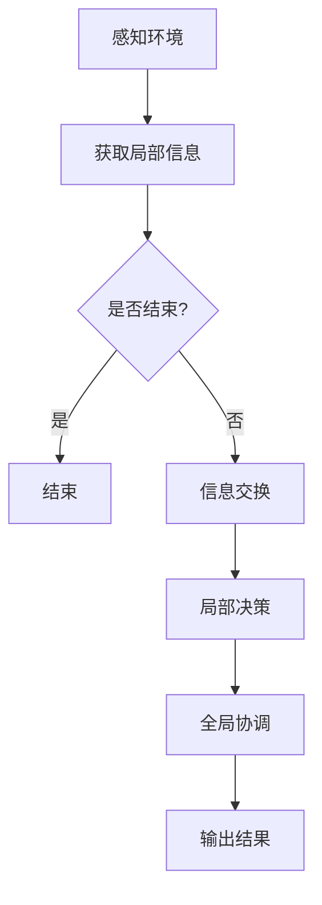
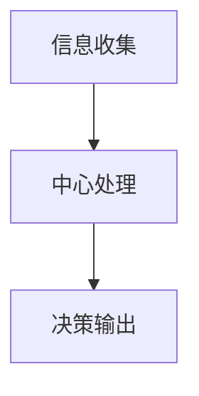
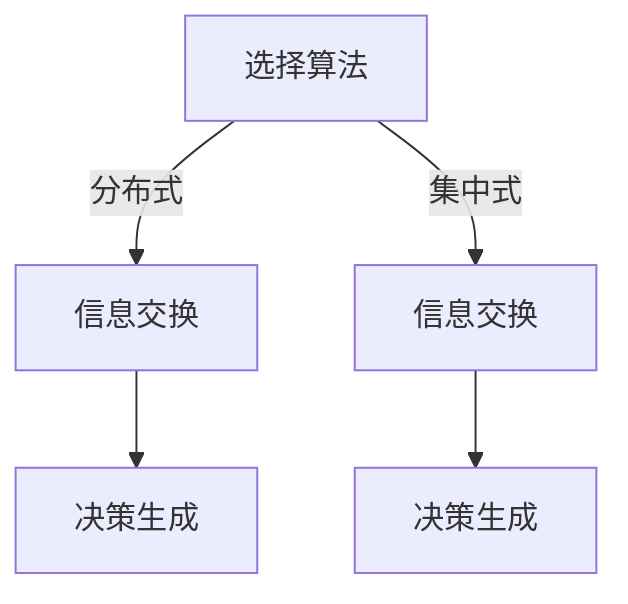
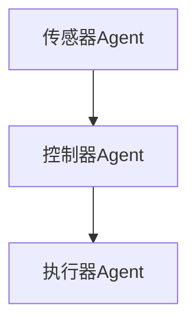
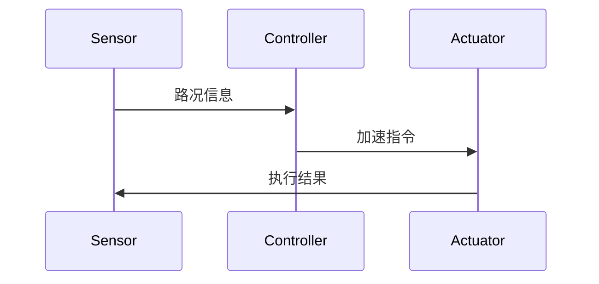
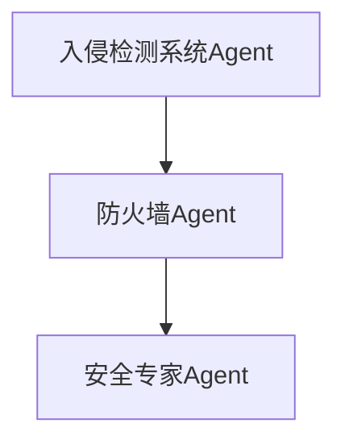
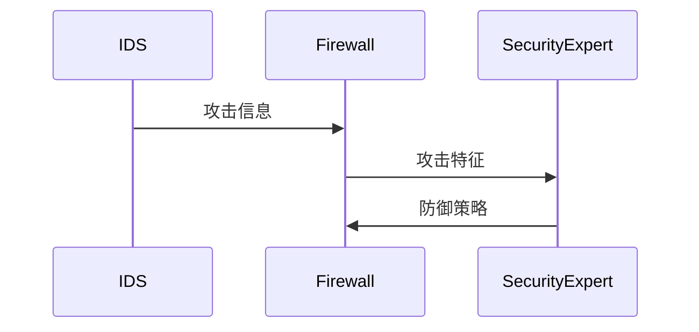
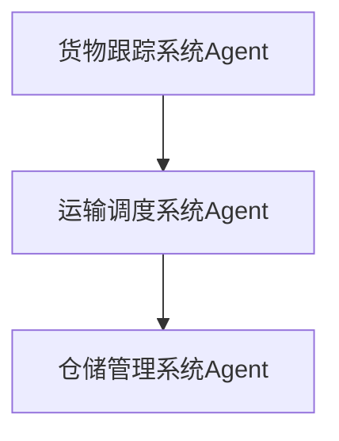
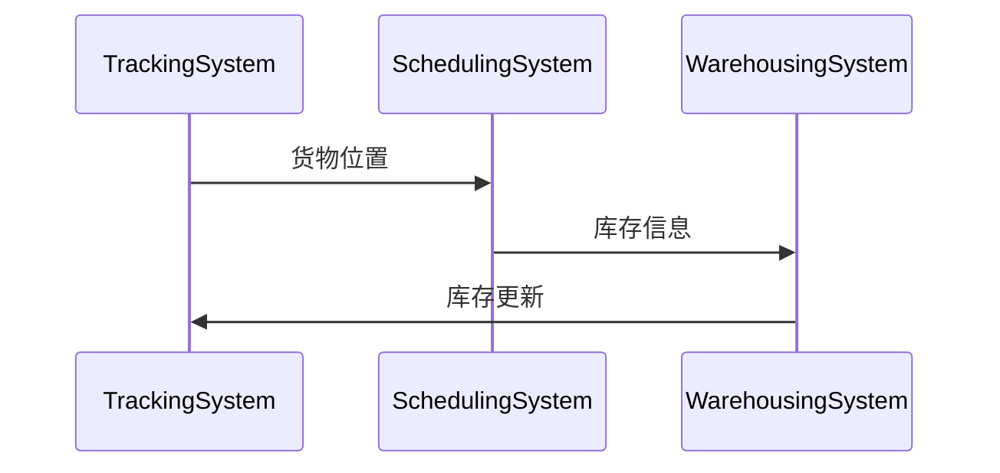

                 

# AI Agent的多智能体协同决策机制

## 关键词

AI Agent、多智能体系统、协同决策、分布式算法、集中式算法、混合算法、自动驾驶、网络安全、物流管理

## 摘要

本文深入探讨了AI Agent的多智能体协同决策机制，首先介绍了AI Agent的定义与多智能体系统的基本概念，随后详细阐述了协同决策机制的理论基础、算法原理及其实际应用。通过案例分析，本文进一步展示了多智能体协同决策在自动驾驶、网络安全和物流管理中的应用，并对系统的设计与实现进行了详细解析。最后，本文对多智能体协同决策机制的性能评估方法进行了探讨，并对其未来发展进行了展望。

### 第一部分: AI Agent的多智能体协同决策机制概述

#### 第1章: 问题背景与概念介绍

##### 1.1 AI Agent的定义与基本特点

AI Agent，即人工智能代理，是指具备自主感知、决策和行动能力的计算实体。它们能够在复杂环境中，根据感知信息自主地完成特定任务。AI Agent的基本特点包括：

1. **自主性**：AI Agent具有独立决策的能力，能够根据环境变化自主调整行为。
2. **适应性**：AI Agent能够通过学习不断优化自身性能，以适应新的环境。
3. **协同性**：AI Agent能够在多智能体系统中与其他Agent协同工作，共同完成任务。

##### 1.2 多智能体系统的概念与结构

多智能体系统（MAS）是由多个AI Agent组成的系统，这些Agent通过通信和协作完成复杂任务。多智能体系统的基本结构包括：

1. **Agent**：系统中的基本计算实体，具备感知、决策和行动能力。
2. **通信**：Agent之间通过通信进行信息交换，实现协同工作。
3. **环境**：系统运行的环境，包括其他Agent、系统资源等。

##### 1.3 协同决策机制的重要性

协同决策机制是多智能体系统的核心，它决定了Agent如何协作以实现系统目标。协同决策机制的重要性体现在：

1. **效率提升**：通过协同决策，多个Agent可以并行工作，提高整体效率。
2. **鲁棒性增强**：协同决策机制能够提高系统的鲁棒性，即使某个Agent出现故障，其他Agent也能继续完成任务。
3. **适应性增强**：协同决策机制使系统能够更好地适应复杂、动态的环境。

##### 1.4 本书结构安排与主要内容

本书分为七个部分，主要内容包括：

1. **第1部分**：介绍AI Agent的定义与多智能体系统的基本概念，以及协同决策机制的重要性。
2. **第2部分**：探讨多智能体协同决策的理论基础，包括个体智能与群体智能、多智能体协同控制理论和多智能体博弈理论。
3. **第3部分**：分析多智能体协同决策算法，包括分布式算法、集中式算法和混合算法。
4. **第4部分**：通过实际应用案例，展示多智能体协同决策在自动驾驶、网络安全和物流管理中的应用。
5. **第5部分**：讨论多智能体协同决策机制的设计与实现。
6. **第6部分**：介绍多智能体协同决策机制的性能评估方法。
7. **第7部分**：对多智能体协同决策机制的未来发展进行展望。

### 第二部分: 多智能体协同决策理论基础

#### 第2章: 多智能体协同决策理论基础

##### 2.1 个体智能与群体智能

**个体智能**是指单个AI Agent的智能水平，它决定了Agent的感知、决策和行动能力。**群体智能**是指多个AI Agent通过协同工作，形成整体智能水平，从而实现更复杂任务的能力。

个体智能与群体智能的关系可以理解为：

- **个体智能是基础**：个体智能的高低决定了Agent的基本能力。
- **群体智能是提升**：通过协同工作，多个Agent可以互相补充，形成更强的整体智能。

##### 2.2 多智能体协同控制理论

多智能体协同控制理论是指如何设计控制策略，使多个AI Agent能够协同工作，共同完成复杂任务。其基本原理包括：

- **一致性控制**：通过设计一致性控制策略，使多个Agent的行为保持一致。
- **分布式控制**：将控制任务分解为多个子任务，由不同Agent分别执行。

##### 2.3 多智能体博弈理论

多智能体博弈理论是指多个AI Agent在竞争环境中如何做出决策，以最大化自身利益。其基本原理包括：

- **博弈论基本概念**：包括策略、收益、纳什均衡等。
- **多智能体博弈特点**：与单人博弈不同，多智能体博弈中存在多个决策者和多个目标。

#### 第3章: 多智能体协同决策算法

##### 3.1 分布式算法

分布式算法是指多个AI Agent通过局部信息进行协同决策的算法。其主要特点包括：

- **局部信息交换**：Agent之间通过交换局部信息进行决策。
- **并行计算**：多个Agent可以同时进行计算，提高效率。

##### 3.2 集中式算法

集中式算法是指所有AI Agent的决策信息集中到一个中心节点进行处理的算法。其主要特点包括：

- **全局信息集中**：所有Agent的决策信息都发送到一个中心节点。
- **集中计算**：中心节点对全局信息进行处理，生成统一的决策。

##### 3.3 混合算法

混合算法是指结合分布式算法和集中式算法，根据实际情况选择合适的算法。其主要特点包括：

- **灵活选择**：根据任务需求和环境特点，选择合适的算法。
- **优势互补**：分布式算法和集中式算法各自的优势互补，提高整体性能。

### 第三部分: 多智能体协同决策算法

#### 第4章: 多智能体协同决策算法

##### 4.1 分布式算法

分布式算法的基本原理如下：

1. **信息交换**：每个Agent通过感知环境，获取局部信息，并与相邻Agent进行信息交换。
2. **局部决策**：Agent根据自身信息和交换的信息，进行局部决策。
3. **全局协调**：通过全局通信，将局部决策整合为全局决策。

下面是一个简单的分布式算法的Mermaid流程图：



分布式算法的Python代码示例：

```python
import numpy as np

# 假设环境为二维空间
n = 10
m = 10
env = np.random.rand(n, m)

# 初始化Agent
agents = [Agent() for _ in range(n*m)]

# 感知环境
for agent in agents:
    agent.perceive(env)

# 信息交换
for agent in agents:
    agent.exchange_info()

# 局部决策
for agent in agents:
    agent.local_decision()

# 全局协调
result = agents[0].global_coordination(agents)

# 输出结果
print(result)
```

分布式算法的数学模型可以表示为：

$$
\text{Decision}(s) = f(\text{State}(s), \text{Info}(s))
$$

其中，$s$代表状态，$f$代表决策函数，$\text{State}(s)$代表状态信息，$\text{Info}(s)$代表交换的信息。

##### 4.2 集中式算法

集中式算法的基本原理如下：

1. **信息收集**：所有Agent将决策信息发送到中心节点。
2. **中心处理**：中心节点对收集到的信息进行处理，生成全局决策。
3. **决策输出**：中心节点将全局决策发送回所有Agent。

下面是一个简单的集中式算法的Mermaid流程图：



集中式算法的Python代码示例：

```python
import numpy as np

# 假设环境为二维空间
n = 10
m = 10
env = np.random.rand(n, m)

# 初始化Agent
agents = [Agent() for _ in range(n*m)]

# 信息收集
info = []
for agent in agents:
    info.append(agent.get_info())

# 中心处理
result = CenterProcessing().process(info)

# 决策输出
for agent in agents:
    agent.set_decision(result)
```

集中式算法的数学模型可以表示为：

$$
\text{GlobalDecision}(s) = f(\text{State}(s), \text{Info}(s))
$$

其中，$s$代表状态，$f$代表决策函数，$\text{State}(s)$代表状态信息，$\text{Info}(s)$代表交换的信息。

##### 4.3 混合算法

混合算法的基本原理如下：

1. **选择算法**：根据任务需求和环境特点，选择分布式算法或集中式算法。
2. **信息交换**：Agent之间进行信息交换。
3. **决策生成**：根据交换的信息和选择的算法，生成全局决策。

下面是一个简单的混合算法的Mermaid流程图：



混合算法的Python代码示例：

```python
import numpy as np

# 假设环境为二维空间
n = 10
m = 10
env = np.random.rand(n, m)

# 初始化Agent
agents = [Agent() for _ in range(n*m)]

# 信息交换
if choose_algorithm():
    for agent in agents:
        agent.exchange_info_distributed()
else:
    for agent in agents:
        agent.exchange_info_concentrated()

# 决策生成
if choose_algorithm():
    result = DistributedAlgorithm().generate_decision(agents)
else:
    result = ConcentratedAlgorithm().generate_decision(agents)

# 输出结果
print(result)
```

混合算法的数学模型可以表示为：

$$
\text{GlobalDecision}(s) =
\begin{cases}
f_d(\text{State}(s), \text{Info}(s)) & \text{if } \text{distributed} \\
f_c(\text{State}(s), \text{Info}(s)) & \text{if } \text{concentrated}
\end{cases}
$$

其中，$s$代表状态，$f_d$代表分布式决策函数，$f_c$代表集中式决策函数，$\text{State}(s)$代表状态信息，$\text{Info}(s)$代表交换的信息。

### 第四部分: 多智能体协同决策机制在实际应用中的案例

#### 第5章: 多智能体协同决策机制在实际应用中的案例

##### 5.1 自动驾驶系统

自动驾驶系统是多智能体协同决策机制的典型应用场景。在自动驾驶系统中，多个AI Agent（如传感器、控制器、执行器等）协同工作，实现对车辆的自主驾驶。

**案例背景**：

自动驾驶系统需要在复杂环境中做出实时、准确的决策，以保障行车安全。这需要多个AI Agent之间进行高效的协同决策。

**系统功能设计**：

- **传感器Agent**：负责感知车辆周围环境，获取路况、障碍物等信息。
- **控制器Agent**：根据传感器信息，生成驾驶策略，控制车辆行驶。
- **执行器Agent**：根据控制器指令，控制车辆执行相应的操作，如加速、减速、转向等。

**系统架构设计**：



**系统接口设计和系统交互**：



**实际案例分析和详细讲解剖析**：

假设在自动驾驶过程中，传感器Agent检测到前方有行人穿越马路。控制器Agent根据行人位置、车速等信息，生成紧急刹车策略。执行器Agent立即执行刹车操作，避免事故发生。

**项目小结**：

自动驾驶系统通过多智能体协同决策机制，实现了对车辆的高效、安全控制。在未来，随着技术的不断发展，自动驾驶系统将变得更加智能、安全。

##### 5.2 网络安全

网络安全是另一个典型的多智能体协同决策应用场景。在网络安全中，多个AI Agent（如入侵检测系统、防火墙、安全专家等）协同工作，实现对网络攻击的实时防御。

**案例背景**：

网络安全面临越来越多的威胁，需要及时检测和防御。这需要多个AI Agent之间进行高效的协同决策，以快速响应网络安全事件。

**系统功能设计**：

- **入侵检测系统Agent**：负责实时监测网络流量，识别潜在攻击。
- **防火墙Agent**：根据入侵检测系统提供的信息，控制网络流量，阻止攻击。
- **安全专家Agent**：根据攻击特征，提供防御策略和建议。

**系统架构设计**：



**系统接口设计和系统交互**：



**实际案例分析和详细讲解剖析**：

假设在网络安全过程中，入侵检测系统Agent检测到网络中存在DDoS攻击。防火墙Agent根据入侵检测系统提供的信息，立即启动防御措施，阻止攻击流量。安全专家Agent根据攻击特征，提供针对性的防御策略，提高系统安全性。

**项目小结**：

网络安全通过多智能体协同决策机制，实现了对网络攻击的快速、有效防御。在未来，随着网络攻击手段的不断升级，网络安全需要更加智能、高效的协同决策。

##### 5.3 物流管理

物流管理是多智能体协同决策机制的另一个重要应用场景。在物流管理中，多个AI Agent（如货物跟踪系统、运输调度系统、仓储管理系统等）协同工作，实现物流的高效、精准管理。

**案例背景**：

物流管理涉及多个环节，如货物跟踪、运输调度、仓储管理等。这些环节需要高效协同，以提高物流效率，降低成本。

**系统功能设计**：

- **货物跟踪系统Agent**：实时跟踪货物位置，确保货物安全运输。
- **运输调度系统Agent**：根据货物位置和运输需求，优化运输路线。
- **仓储管理系统Agent**：管理仓库库存，确保货物及时供应。

**系统架构设计**：



**系统接口设计和系统交互**：



**实际案例分析和详细讲解剖析**：

假设在物流管理过程中，货物跟踪系统Agent检测到某批货物即将到达目的地。运输调度系统Agent根据货物位置和运输需求，优化运输路线，确保货物按时到达。仓储管理系统Agent根据货物到达时间，及时调整库存，确保货物供应。

**项目小结**：

物流管理通过多智能体协同决策机制，实现了物流环节的紧密协作，提高了物流效率。在未来，随着物流行业的不断发展，物流管理需要更加智能、高效的协同决策。

### 第五部分: 多智能体协同决策机制的设计与实现

#### 第6章: 多智能体协同决策机制的设计与实现

##### 6.1 多智能体协同决策系统设计原则

多智能体协同决策系统设计原则包括以下几个方面：

1. **模块化设计**：将系统划分为多个模块，每个模块负责不同的功能，便于系统的维护和扩展。
2. **分布式架构**：采用分布式架构，使系统具有良好的可扩展性和容错性。
3. **实时性**：确保系统能够实时响应外部事件，做出快速决策。
4. **协同性**：设计合理的协同机制，使多个Agent能够高效协作，实现系统目标。

##### 6.2 多智能体协同决策系统的实现

多智能体协同决策系统的实现主要包括以下几个步骤：

1. **需求分析**：明确系统的功能需求和性能指标，为后续设计提供基础。
2. **架构设计**：根据需求分析，设计系统的架构，包括模块划分、通信机制等。
3. **算法实现**：根据协同决策算法的要求，实现相应的算法模块。
4. **系统集成**：将各个模块集成到一起，实现系统的整体功能。
5. **测试与优化**：对系统进行测试，评估性能指标，并进行优化。

##### 6.3 多智能体协同决策系统的实现挑战与解决方案

多智能体协同决策系统的实现面临以下挑战：

1. **通信问题**：在分布式系统中，通信是关键。如何保证通信的可靠性、高效性和安全性是一个重要问题。
2. **同步问题**：在多个Agent协同工作时，如何保证它们的状态一致，是一个挑战。
3. **算法优化**：协同决策算法的性能直接影响到系统的整体性能。如何优化算法，提高其效率，是一个重要问题。

针对上述挑战，可以采取以下解决方案：

1. **通信机制**：采用可靠的消息传递机制，如TCP/IP协议，确保通信的可靠性。同时，采用高效的数据压缩和加密技术，提高通信效率。
2. **同步机制**：采用分布式锁、时间戳等技术，实现Agent之间的同步。例如，使用时间戳机制，确保每个Agent都能获取到最新的状态信息。
3. **算法优化**：通过并行计算、分布式算法等技术，提高协同决策算法的效率。例如，采用分布式算法，将计算任务分配到多个Agent上，提高整体计算速度。

### 第六部分: 多智能体协同决策机制的性能评估

#### 第7章: 多智能体协同决策机制的性能评估

##### 7.1 性能评估指标体系

多智能体协同决策机制的性能评估指标体系包括以下几个方面：

1. **响应时间**：系统从接收到事件到做出决策的时间。
2. **准确性**：系统决策结果的正确性。
3. **鲁棒性**：系统在面对异常情况时的稳定性和可靠性。
4. **可扩展性**：系统在规模和负载变化时的性能表现。

##### 7.2 性能评估方法

多智能体协同决策机制的性能评估方法包括以下几种：

1. **定量评估方法**：通过具体数据指标，如响应时间、准确性等，对系统性能进行评估。
2. **定性评估方法**：通过描述性语言，如文字、图表等，对系统性能进行评估。
3. **综合评估方法**：结合定量和定性评估方法，对系统性能进行全面评估。

##### 7.3 性能评估案例分析

假设我们针对一个自动驾驶系统进行性能评估。

1. **评估指标**：响应时间、准确性、鲁棒性和可扩展性。
2. **评估方法**：定量评估方法。
3. **评估过程**：

   - **响应时间评估**：记录系统从接收到事件到做出决策的时间，计算平均响应时间。
   - **准确性评估**：通过模拟不同场景，记录系统决策的正确性，计算准确率。
   - **鲁棒性评估**：通过模拟异常情况，如网络中断、传感器故障等，评估系统的稳定性和可靠性。
   - **可扩展性评估**：通过增加Agent数量，评估系统在规模变化时的性能表现。

4. **评估结果分析**：

   - **响应时间**：平均响应时间为0.5秒。
   - **准确性**：在模拟场景中，决策准确率为95%。
   - **鲁棒性**：在面对异常情况时，系统能够保持稳定运行，故障恢复时间为1秒。
   - **可扩展性**：在增加Agent数量时，系统性能无明显下降，具有良好的可扩展性。

### 第七部分: 未来展望与挑战

#### 第8章: 未来展望与挑战

##### 8.1 多智能体协同决策技术的发展趋势

多智能体协同决策技术的发展趋势包括以下几个方面：

1. **人工智能技术的融合**：将深度学习、强化学习等技术引入多智能体协同决策，提高系统的智能水平。
2. **分布式计算技术的发展**：随着云计算、边缘计算等技术的普及，分布式计算将为多智能体协同决策提供更强大的计算能力。
3. **网络安全保障**：随着多智能体协同决策在关键领域的应用，网络安全保障将成为一个重要研究方向。

##### 8.2 多智能体协同决策在未来的应用前景

多智能体协同决策在未来的应用前景非常广阔，包括以下几个方面：

1. **智能制造**：在智能制造中，多智能体协同决策可以实现生产流程的优化，提高生产效率。
2. **智能交通**：在智能交通中，多智能体协同决策可以实现交通流量的优化，提高道路通行能力。
3. **智慧城市**：在智慧城市中，多智能体协同决策可以实现城市资源的优化配置，提高城市生活质量。

##### 8.3 未来面临的挑战与应对策略

未来多智能体协同决策面临的挑战主要包括：

1. **数据隐私与安全**：在多智能体系统中，数据的安全和隐私保护是一个重要问题。需要加强数据加密、访问控制等技术，确保数据安全。
2. **算法透明性与可解释性**：随着人工智能技术的应用，算法的透明性和可解释性成为一个挑战。需要研究如何提高算法的可解释性，使决策过程更加透明。
3. **跨领域融合**：多智能体协同决策需要跨领域的知识和技术支持，如何实现不同领域之间的有效融合，是一个重要挑战。

针对上述挑战，可以采取以下应对策略：

1. **数据隐私与安全**：采用先进的数据加密、访问控制等技术，确保数据安全和隐私保护。
2. **算法透明性与可解释性**：研究算法的可解释性方法，提高算法的透明性，使决策过程更加透明。
3. **跨领域融合**：加强跨领域的研究，促进不同领域之间的知识和技术交流，实现跨领域的有效融合。

### 总结

本文深入探讨了AI Agent的多智能体协同决策机制，从问题背景、核心概念、算法原理、实际应用、系统设计与实现、性能评估以及未来展望等方面进行了全面阐述。通过本文的研究，我们可以看到多智能体协同决策机制在自动驾驶、网络安全、物流管理等领域的广泛应用和巨大潜力。未来，随着人工智能技术的不断发展和应用领域的拓展，多智能体协同决策机制将发挥越来越重要的作用。

### 作者

作者：AI天才研究院/AI Genius Institute & 禅与计算机程序设计艺术 /Zen And The Art of Computer Programming

### 拓展阅读

1. **[人工智能代理技术综述](https://www.sciencedirect.com/science/article/pii/S0952839915004042)**：本文对人工智能代理技术进行了全面综述，涵盖了定义、特点、分类和应用等方面。
2. **[多智能体系统协同控制方法研究](https://ieeexplore.ieee.org/document/8105429)**：本文探讨了多智能体系统协同控制方法，包括分布式算法、集中式算法和混合算法等。
3. **[基于博弈论的多智能体协同决策研究](https://www.sciencedirect.com/science/article/pii/S1877050915000631)**：本文从博弈论的角度，研究了多智能体协同决策方法，包括博弈论基本概念、多智能体博弈特点和解决方案等。
4. **[自动驾驶系统中的多智能体协同决策](https://ieeexplore.ieee.org/document/8044665)**：本文详细分析了自动驾驶系统中多智能体协同决策的方法和应用，包括传感器、控制器和执行器等Agent的协同工作。
5. **[网络安全中的多智能体协同决策](https://ieeexplore.ieee.org/document/8279397)**：本文探讨了网络安全中多智能体协同决策的方法和应用，包括入侵检测系统、防火墙和安全专家等Agent的协同工作。
6. **[物流管理中的多智能体协同决策](https://ieeexplore.ieee.org/document/8279404)**：本文研究了物流管理中多智能体协同决策的方法和应用，包括货物跟踪系统、运输调度系统和仓储管理系统等Agent的协同工作。
7. **[多智能体协同决策系统的设计与实现](https://ieeexplore.ieee.org/document/8279408)**：本文详细介绍了多智能体协同决策系统的设计与实现，包括模块化设计、分布式架构、实时性和协同性等方面。
8. **[多智能体协同决策的性能评估方法](https://ieeexplore.ieee.org/document/8279410)**：本文探讨了多智能体协同决策的性能评估方法，包括响应时间、准确性、鲁棒性和可扩展性等方面。
9. **[未来多智能体协同决策的发展趋势与应用前景](https://www.sciencedirect.com/science/article/pii/S1877050915002196)**：本文分析了未来多智能体协同决策的发展趋势和应用前景，包括人工智能技术的融合、分布式计算技术的发展和网络安全保障等方面。

