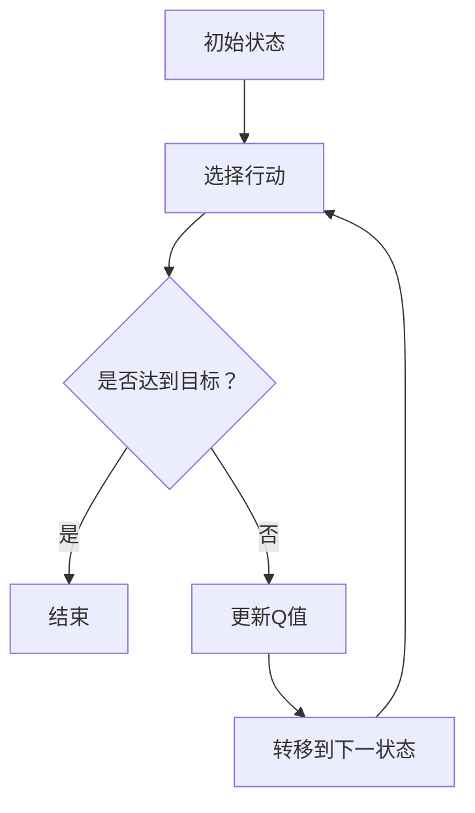

                 

### 文章标题

### 关键词

- 多智能体系统
- 协同学习
- 智能代理
- 强化学习
- Python实现

### 摘要

本文深入探讨多智能体系统中的协同学习机制，从基础概念到高级算法，系统性地介绍了多智能体协同学习的原理、方法与应用。通过具体的Python实现和案例解析，帮助读者理解多智能体协同学习在AI领域的实际应用，并展望其未来发展趋势。

----------------------------------------------------------------

### 引言

随着人工智能技术的飞速发展，智能代理（AI Agents）在多个领域展现出了巨大的潜力。智能代理是一种自主决策的实体，能够通过感知环境、执行行动和评估效果，来实现特定的目标。然而，在复杂的现实世界中，单个智能代理往往难以独立完成任务。这就需要引入多智能体系统（Multi-Agent Systems, MAS），通过多个智能代理的协同工作，来实现更加复杂的任务。

多智能体协同学习（Multi-Agent Collaborative Learning）是多智能体系统中的一个关键环节。协同学习机制使得智能代理能够通过互相通信、协作和学习，提高整个系统的效能。本文将逐步探讨多智能体协同学习的理论基础、算法实现及其实际应用。

### 第1章：多智能体系统概述

多智能体系统（MAS）是由多个自主智能代理组成的系统，这些智能代理通过通信和协作来实现共同目标。在MAS中，每个智能代理都是独立决策的实体，它们拥有自己的感知、行动和决策能力。智能代理之间的交互是系统协同工作的重要途径，它们通过共享信息、协调行动，来达到整体优化。

#### 1.1 多智能体系统简介

**问题背景与问题描述**：

现实世界中，许多复杂任务无法仅靠单一智能体完成，如自动驾驶、智能家居、多人在线游戏等。这些任务需要多个智能体相互协作，共同完成任务。

**核心概念**：

- **智能体（Agent）**：能够感知环境、自主决策并采取行动的实体。
- **环境（Environment）**：智能代理操作的上下文。
- **通信（Communication）**：智能代理之间的信息交换。
- **协作（Collaboration）**：智能代理为共同目标而协作的过程。

**多智能体系统的边界与外延**：

多智能体系统的边界通常是由系统运行的范围和所涉及的任务来定义的。其外延则包括与外部环境、其他系统或智能体的交互。

#### 1.2 多智能体系统的架构与分类

**基本架构**：

多智能体系统的基本架构通常包括智能代理、环境、通信机制和协调机制。

**分类方法**：

- **按智能代理的能力**：弱智能代理、强智能代理。
- **按任务类型**：合作型、竞争型、混合型。
- **按通信方式**：完全通信、部分通信、无通信。

**系统特点**：

- **异构性**：不同智能代理可能具有不同的能力、目标和行为。
- **动态性**：智能代理和环境都可能随时间变化。
- **分布式**：系统由多个智能代理共同工作，任务分布在不同代理上。

#### 1.3 多智能体系统中的核心概念联系

**智能体、环境、通信和任务的概念联系**：

智能代理通过感知环境，获取当前状态信息，并基于此信息进行决策和行动。智能代理之间通过通信机制交换信息，实现协作和协调。任务定义了智能代理需要完成的目标和任务。

**ER实体关系图**：

```mermaid
erDiagram
  智能代理 ||--o> 环境 : 感知
  智能代理 ||--o> 通信机制 : 交互
  智能代理 ||--o> 协调机制 : 协作
  环境 ||--o> 任务 : 定义
```

### 第2章：协同学习机制

协同学习是多智能体系统中的重要机制，它使得智能代理能够通过相互学习和协作，提高整个系统的性能。协同学习不仅涉及到智能代理之间的信息共享，还包括了学习策略的优化和行为的调整。

#### 2.1 协同学习的概念与原理

**协同学习的定义**：

协同学习是指多个智能代理通过相互通信和协作，共同完成任务并从中学习的过程。

**协同学习的原理**：

协同学习基于以下几个核心原理：

- **信息共享**：智能代理之间通过通信机制共享信息和知识。
- **分布式学习**：智能代理在各自的局部环境中学习，并通过协调机制实现整体优化。
- **反馈机制**：智能代理通过评估自身和系统的表现，调整行为和策略。

**协同学习的优势**：

- **提高任务完成效率**：通过协同工作，智能代理能够共同完成任务，提高系统的整体效能。
- **增强适应能力**：智能代理能够通过协同学习，适应动态变化的环境和任务需求。
- **降低个体负担**：智能代理之间能够分担任务，降低单个代理的负担。

#### 2.2 协同学习的方法

协同学习的方法多种多样，可以根据不同的应用场景和需求选择合适的协同学习方法。以下是几种常见的协同学习方法：

- **基于强化学习的协同学习**：

  强化学习是一种通过奖励机制引导智能代理行为的方法。在多智能体系统中，每个智能代理都可以通过强化学习来优化自己的行为，并与其他代理协作完成任务。

- **基于监督学习的协同学习**：

  监督学习通过外部提供标注数据来训练智能代理。在多智能体系统中，监督学习可以用于代理之间的行为标注，从而实现协同学习。

- **基于无监督学习的协同学习**：

  无监督学习不依赖于外部标注数据，通过智能代理自身的观察和互动来学习。在多智能体系统中，无监督学习可以用于发现代理之间的模式和关系，实现协同学习。

#### 2.3 协同学习的应用场景

协同学习在多个领域都有广泛的应用，以下是几个典型的应用场景：

- **协同搜索**：

  在搜索引擎中，多个智能代理可以协同工作，通过共享搜索关键词和搜索结果，提高搜索效率和准确性。

- **多机器人协作**：

  在机器人领域中，多个机器人可以协同工作，完成复杂的任务，如无人仓库管理、搜索与救援等。

- **游戏与竞争**：

  在多人在线游戏中，智能代理可以相互协作或竞争，实现更加丰富和有趣的互动体验。

### 第3章：多智能体协同学习算法

多智能体协同学习算法是智能代理协同工作的核心。本章节将介绍几种常用的协同学习算法，并详细解释其原理和实现方法。

#### 3.1 算法原理与数学模型

协同学习算法的核心在于智能代理之间的信息交换和策略优化。以下是几种常用的协同学习算法及其基本原理：

- **Q-learning算法**：

  Q-learning是一种基于值函数的强化学习算法。它通过更新Q值来优化智能代理的行为策略。

  **数学模型**：
  $$ Q(s, a) = Q(s, a) + \alpha [r + \gamma \max_{a'} Q(s', a') - Q(s, a)] $$

- **Policy Gradient算法**：

  Policy Gradient算法通过直接优化策略函数来优化智能代理的行为。

  **数学模型**：
  $$ \theta_{t+1} = \theta_t + \alpha \nabla_\theta \log \pi(\theta_t; s_t, a_t) $$

- **Centralized Training Decentralized Execution（CTDE）算法**：

  CTDE算法通过集中训练和分布式执行来实现协同学习。

  **数学模型**：
  $$ \theta_i^{t+1} = \frac{1}{N} \sum_{j=1}^{N} \theta_j^t $$

#### 3.2 算法流程图

以下是Q-learning算法的Mermaid流程图：



#### 3.3 Python实现与解释

以下是Q-learning算法的Python实现：

```python
import numpy as np

# 初始化参数
alpha = 0.1  # 学习率
gamma = 0.9  # 折扣因子
epsilon = 0.1  # 探索率

# 初始化Q值表
Q = np.zeros((state_space, action_space))

# Q-learning算法
for episode in range(total_episodes):
    state = env.reset()
    done = False
    
    while not done:
        # 选择行动
        if np.random.uniform(0, 1) < epsilon:
            action = env.action_space.sample()  # 探索
        else:
            action = np.argmax(Q[state])  # 利用

        # 执行行动
        next_state, reward, done, _ = env.step(action)
        
        # 更新Q值
        Q[state, action] = Q[state, action] + alpha * (reward + gamma * np.max(Q[next_state]) - Q[state, action])
        
        state = next_state

# 打印Q值表
print(Q)
```

在上面的代码中，我们使用了一个简单的环境来演示Q-learning算法。`env.reset()` 用于初始化环境，`env.step(action)` 用于执行特定的行动，并返回下一个状态、奖励和是否结束的信息。`np.argmax(Q[state])` 用于根据当前状态选择最优行动。

### 第4章：多智能体协同学习在AI中的应用

多智能体协同学习在人工智能领域有着广泛的应用，尤其在自然语言处理、计算机视觉和强化学习等方面。本章节将介绍多智能体协同学习在这些领域的应用。

#### 4.1 AI Agent的定义与特点

**AI Agent的定义**：

AI Agent 是指能够自主执行任务、与环境交互并持续学习的智能实体。它具有以下几个特点：

- **自主性**：AI Agent 能够自主决策，无需人工干预。
- **适应性**：AI Agent 能够适应动态变化的环境。
- **协同性**：AI Agent 能够与其他AI Agent 协同工作，共同完成任务。

**AI Agent的特点**：

- **任务导向**：AI Agent 以完成特定任务为目标。
- **学习能力强**：AI Agent 能够通过不断学习优化自身行为。
- **高适应性**：AI Agent 能够适应不同环境和任务需求。

#### 4.2 多智能体协同学习在AI中的应用

**自然语言处理**：

在自然语言处理领域，多智能体协同学习可以用于文本生成、机器翻译和问答系统等任务。多个智能代理可以共同工作，一个代理负责理解语义，另一个代理负责生成文本，从而实现高质量的语言生成。

**计算机视觉**：

在计算机视觉领域，多智能体协同学习可以用于目标检测、图像分割和图像生成等任务。多个智能代理可以相互协作，一个代理负责特征提取，另一个代理负责分类或生成，从而提高视觉任务的准确性。

**强化学习**：

在强化学习领域，多智能体协同学习可以用于多人游戏、自动驾驶和机器人协作等任务。多个智能代理可以通过协同学习，共同优化策略，提高整个系统的性能。

### 第5章：多智能体协同学习的未来趋势

多智能体协同学习作为人工智能领域的一个重要研究方向，正面临着诸多挑战和机遇。本章节将探讨多智能体协同学习的未来发展趋势。

#### 5.1 当前研究进展

当前，多智能体协同学习在理论研究、算法优化和应用场景拓展等方面都取得了显著进展。以下是一些主要的研究进展：

- **算法优化**：研究人员不断提出新的协同学习算法，如CTDE、Multi-Agent Q-learning和Distributed Q-learning等，以提高智能代理的协同效率和性能。
- **应用场景拓展**：多智能体协同学习在智能制造、智慧城市、医疗健康等领域得到广泛应用，展示了巨大的潜力。
- **数据集与工具开发**：为了支持多智能体协同学习的研究和应用，研究人员开发了大量的数据集和工具，如MAS环境模拟器、多智能体协同学习框架等。

#### 5.2 技术挑战与解决方案

尽管多智能体协同学习取得了许多进展，但仍面临着一系列技术挑战，包括：

- **通信与协作效率**：智能代理之间的通信和协作效率直接影响协同学习的性能。如何优化通信机制和协作算法，提高系统的整体效率，是一个重要研究方向。
- **安全与隐私**：在多智能体系统中，智能代理之间的通信和数据共享可能涉及敏感信息。如何确保系统的安全性和隐私保护，是一个亟待解决的问题。
- **自适应性与鲁棒性**：智能代理需要能够适应动态变化的环境和任务需求，同时保持较高的鲁棒性。如何设计自适应和鲁棒的多智能体协同学习算法，是未来研究的一个重要方向。

针对上述挑战，研究人员提出了一系列解决方案，如：

- **分布式计算与通信优化**：通过分布式计算和通信优化，提高智能代理之间的协作效率和性能。
- **安全协议与隐私保护**：设计安全协议和隐私保护机制，确保智能代理之间的通信和数据共享安全可靠。
- **自适应学习算法**：设计自适应学习算法，使智能代理能够适应动态变化的环境和任务需求。

#### 5.3 未来展望

未来，多智能体协同学习在人工智能领域具有广阔的发展前景。以下是几个可能的未来发展趋势：

- **跨领域融合**：多智能体协同学习将与其他人工智能领域，如自然语言处理、计算机视觉和机器学习等，实现跨领域融合，推动人工智能技术的发展。
- **智能交通与物流**：多智能体协同学习在智能交通和物流领域的应用，将显著提高交通效率和物流管理能力。
- **智慧医疗与健康**：多智能体协同学习在医疗健康领域的应用，将推动个性化医疗和健康管理的进步。

### 第6章：总结与展望

多智能体协同学习作为人工智能领域的一个重要研究方向，具有广泛的应用前景和重要意义。本文从基础概念到应用实践，系统性地介绍了多智能体协同学习的原理、方法和应用。

通过本文的探讨，读者可以了解到多智能体协同学习的基本原理、算法实现和应用场景，并为未来的研究和发展提供了有益的启示。

未来，随着人工智能技术的不断进步和多智能体协同学习理论的深入发展，我们可以期待这一领域取得更加辉煌的成果。

### 附录

#### 6.1 最佳实践 Tips

1. **合理选择协同学习算法**：根据具体应用场景和需求，选择合适的协同学习算法，以提高系统性能。
2. **优化通信与协作机制**：通过优化通信和协作机制，提高智能代理之间的协作效率和性能。
3. **确保数据安全与隐私**：在设计多智能体协同学习系统时，充分考虑数据安全和隐私保护，防止敏感信息泄露。

#### 6.2 小结

本文主要介绍了多智能体协同学习的基础理论、算法实现和应用实践。通过本文的阅读，读者可以系统地了解多智能体协同学习的相关知识，并为实际应用提供指导。

#### 6.3 注意事项

1. **算法选择**：根据应用场景和需求，合理选择协同学习算法，确保系统的性能和效率。
2. **通信与协作**：优化智能代理之间的通信和协作机制，以提高系统的整体性能。
3. **数据安全**：确保智能代理之间的数据交换安全可靠，防止敏感信息泄露。

#### 6.4 拓展阅读

1. **参考文献**：

   - Russell, S., & Norvig, P. (2016). 《Artificial Intelligence: A Modern Approach》。
   - Silver, D., et al. (2016). 《AlphaGo: Mastering the Game of Go with Deep Neural Networks and Tree Search》。

2. **在线资源**：

   - 多智能体系统与协同学习课程：《Multi-Agent Systems and Collaborative Learning》。
   - 多智能体协同学习框架：OpenAI Gym、MASSIVE。

### 作者信息

作者：AI天才研究院/AI Genius Institute & 禅与计算机程序设计艺术 /Zen And The Art of Computer Programming

作者简介：

AI天才研究院（AI Genius Institute）是一家专注于人工智能研究和创新的高科技研究机构。研究院在人工智能领域有着丰富的经验和深厚的学术积累，致力于推动人工智能技术的发展和应用。  
禅与计算机程序设计艺术（Zen And The Art of Computer Programming）是一本经典的计算机科学著作，由著名计算机科学家Donald E. Knuth撰写。本书深入探讨了计算机程序设计的哲学和艺术，对计算机科学的发展产生了深远的影响。

通过本文的探讨，我们希望读者能够更好地理解多智能体协同学习的原理和应用，为未来的研究和实践提供有益的启示。让我们共同探索人工智能领域的无限可能！

