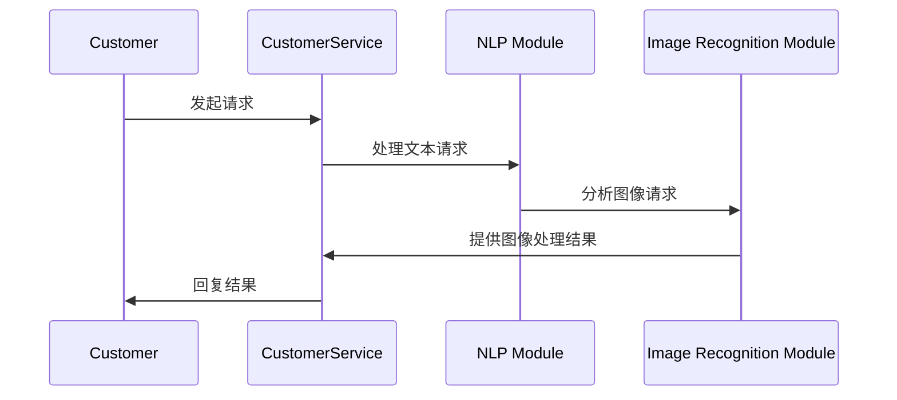
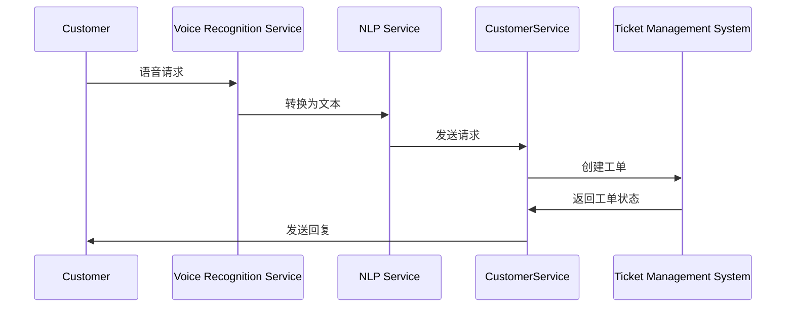
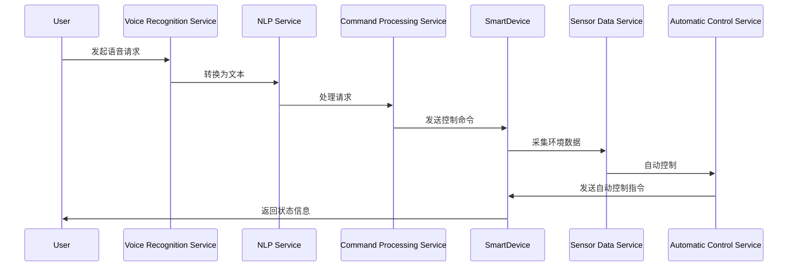
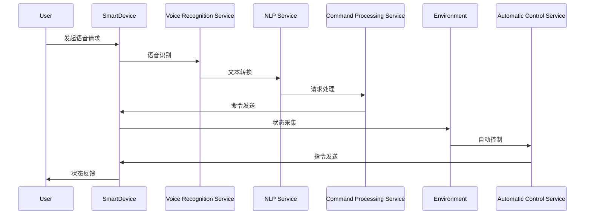

                 

### 文章标题

# AI Agent的多模态交互能力开发

### 文章关键词

- 多模态交互
- AI Agent
- 深度学习
- 强化学习
- 应用实例

### 摘要

本文围绕AI Agent的多模态交互能力开发展开讨论，详细解析了多模态交互的基本概念、原理、技术和应用实例。文章首先介绍了多模态交互的定义和特点，随后深入探讨了多模态交互的技术原理，包括感知、信息处理、深度学习和强化学习等。通过具体应用实例，如智能客服系统和智能家居系统，本文进一步展示了多模态交互在实际项目中的实现和效果。最后，文章总结了多模态交互的关键技术、主要应用场景，并展望了其未来的发展趋势。

----------------------------------------------------------------

## 第一部分：引言与背景

### 第1章：引言

### 1.1 问题背景

随着人工智能技术的快速发展，智能交互成为AI应用的重要方向。然而，传统的单模态交互（如仅通过语音或文字）在处理复杂任务时存在明显的局限性。例如，在对话场景中，仅依赖语音无法获取用户的面部表情和身体语言，而在视觉识别场景中，无法理解用户的语音指令。因此，如何提升AI Agent的多模态交互能力，实现更加自然、高效的人机交互，成为当前研究的热点问题。

### 1.2 问题描述

本文旨在探讨AI Agent的多模态交互能力开发，具体包括以下几个方面：

1. **多模态交互的定义和特点**：明确多模态交互的概念，分析其与传统单模态交互的区别。
2. **多模态交互的技术原理**：介绍多模态交互的基本原理，包括感知、信息处理和深度学习技术。
3. **多模态交互的应用实例**：通过实际项目，展示多模态交互在智能客服系统和智能家居系统中的应用。
4. **多模态交互的挑战与未来趋势**：总结当前多模态交互面临的技术挑战和未来发展方向。

### 1.3 问题解决

本文将从以下三个方面来解决上述问题：

1. **理论基础**：深入解析多模态交互的核心概念和原理，为后续技术讨论和应用实例提供理论基础。
2. **技术实现**：详细介绍多模态交互的关键技术，包括深度学习和强化学习模型，并给出具体的算法原理和数学模型。
3. **应用实践**：通过实际项目案例，展示多模态交互在智能系统中的应用，分析其实现细节和效果。

### 1.4 边界与外延

本文主要关注AI Agent的多模态交互能力，不涉及其他领域的AI应用。同时，本文讨论的多模态交互主要涉及视觉、听觉和语音等常见模态，不考虑如触觉、味觉等特殊模态。

### 1.5 概念结构与核心要素组成

本文的结构如下：

1. **引言与背景**：介绍问题背景和问题描述。
2. **核心概念与联系**：解析多模态交互的核心概念，包括基本概念、特点、对比和ER实体关系图。
3. **多模态交互原理与技术**：讨论多模态交互的基本原理和技术。
4. **多模态交互应用实例**：展示多模态交互在实际项目中的应用。
5. **总结与展望**：总结关键技术、应用场景，并展望未来发展趋势。

### 第2章：核心概念与联系

#### 2.1 多模态交互的基本概念

多模态交互是指通过多个感知模态（如视觉、听觉、触觉等）与用户进行信息交互的过程。与单模态交互相比，多模态交互能够获取更全面、丰富的用户信息，从而提高交互的自然性和准确性。

#### 2.1.1 多模态交互的定义

多模态交互可以定义为一种结合多种感知模态的信息处理和交互机制，通过整合不同模态的信息，实现更加自然、高效的人机交互。

#### 2.1.2 多模态交互的特点

1. **信息丰富性**：多模态交互能够获取来自不同感知模态的信息，如视觉、听觉、触觉等，从而提供更丰富的交互体验。
2. **交互多样性**：多模态交互支持多种交互方式，如语音、手势、面部表情等，使得交互过程更加自然和直观。
3. **交互准确性**：通过整合不同模态的信息，多模态交互能够提高交互的准确性，减少误解和歧义。
4. **任务适应性**：多模态交互能够根据任务需求和环境特点，灵活选择和调整使用的模态，提高任务完成效率。

#### 2.1.3 多模态交互与传统交互的区别

1. **感知模态**：传统交互主要依赖单一模态，如语音交互系统主要依赖语音识别和合成技术；而多模态交互则结合了多个感知模态，如视觉、听觉、触觉等。
2. **信息处理**：传统交互主要处理单一模态的信息，如语音交互系统主要处理语音信号；而多模态交互则整合了来自不同模态的信息，通过信息融合和处理，实现更准确的交互。
3. **交互方式**：传统交互方式较为单一，如语音交互系统只能通过语音进行交互；而多模态交互则支持多种交互方式，如语音、手势、面部表情等，提供更丰富的交互体验。

#### 2.2 关键概念属性特征对比表格

| 关键概念 | 特征描述 1 | 特征描述 2 | 特征描述 3 |
| :-------: | :--------: | :--------: | :--------: |
| 单模态交互 | 依赖单一模态 | 处理单一信息 | 单一交互方式 |
| 多模态交互 | 结合多种模态 | 整合多信息源 | 多种交互方式 |

#### 2.3 多模态交互的ER实体关系图

```mermaid
erDiagram
  Customer ||--|{ AI-Agent : serves }
  User ||--|{ AI-Agent : interacts }
  Device ||--|{ AI-Agent : manages }
  Data ||--|{ AI-Agent : processes }
```

图1：多模态交互的ER实体关系图

在上图中，Customer（客户）、User（用户）、Device（设备）和数据（Data）是与AI-Agent相关的实体。AI-Agent通过服务（serves）、交互（interacts）、管理（manages）和处理（processes）与这些实体进行关联。

----------------------------------------------------------------

## 第3章：多模态交互原理

### 3.1 多模态感知

多模态交互的基础是感知，即通过多种感知模态（如视觉、听觉、触觉等）获取外部环境信息。感知是多模态交互的第一步，也是最重要的步骤之一。有效的感知可以提供丰富的信息，有助于AI-Agent更好地理解用户意图和行为。

#### 3.1.1 音频感知

音频感知是指通过接收和处理声音信号，提取出与交互相关的信息。常见的音频感知技术包括语音识别、声纹识别、语音合成等。语音识别技术用于将语音转换为文本，是实现语音交互的关键；声纹识别技术用于识别和验证用户身份，提供安全性保障；语音合成技术用于生成语音输出，实现与用户的语音交互。

#### 3.1.2 视觉感知

视觉感知是指通过接收和处理图像信号，提取出与交互相关的信息。视觉感知在多模态交互中起着至关重要的作用，如人脸识别、物体识别、场景理解等。人脸识别技术可以用于用户身份验证和情感分析；物体识别技术可以用于识别用户周围的物品和环境；场景理解技术可以用于理解用户所处的环境，提供更准确的交互建议。

#### 3.1.3 触觉感知

触觉感知是指通过接收和处理触觉信号，提取出与交互相关的信息。触觉感知在多模态交互中的应用相对较少，但在某些特定场景中具有重要意义，如虚拟现实、机器人交互等。触觉感知可以提供丰富的触觉反馈信息，增强用户的交互体验。

#### 3.1.4 嗅觉与味觉感知

嗅觉与味觉感知在多模态交互中的应用较为特殊，通常不直接用于人机交互。然而，在特定场景中，如智能家居系统、虚拟现实等，嗅觉与味觉感知可以提供额外的信息，丰富交互体验。

### 3.2 多模态信息处理

多模态信息处理是指将来自不同感知模态的信息进行整合、融合和处理，提取出对交互有用的信息。多模态信息处理是提升多模态交互能力的关键步骤。

#### 3.2.1 多模态信号预处理

多模态信号预处理是指对采集到的多模态信号进行预处理，以提高后续处理的效率和准确性。常见的预处理技术包括去噪、归一化、滤波等。去噪技术用于去除信号中的噪声，提高信号质量；归一化技术用于调整信号幅度，使其适应后续处理；滤波技术用于去除信号中的高频或低频干扰。

#### 3.2.2 多模态特征提取

多模态特征提取是指从预处理后的多模态信号中提取出与交互相关的特征。特征提取是多模态信息处理的核心步骤，直接影响多模态交互的性能。常见的特征提取技术包括时域特征提取、频域特征提取、变换域特征提取等。

#### 3.2.3 多模态数据融合

多模态数据融合是指将来自不同感知模态的特征进行整合，提取出对交互更具有代表性的特征。多模态数据融合技术可以分为基于特征的融合和基于模型的融合。基于特征的融合将不同模态的特征直接进行融合；基于模型的融合则通过构建联合模型，将不同模态的信息整合到同一模型中进行处理。

----------------------------------------------------------------

## 第4章：多模态交互技术

### 4.1 基于深度学习的多模态交互模型

深度学习技术在多模态交互中得到了广泛应用，其强大的特征提取和模型学习能力使其成为构建多模态交互模型的关键技术。以下将介绍基于深度学习的多模态交互模型的基本原理和应用。

#### 4.1.1 深度学习基础

深度学习是一种基于人工神经网络的学习方法，通过多层非线性变换，自动提取数据中的特征。深度学习模型通常由多个神经网络层组成，包括输入层、隐藏层和输出层。通过反向传播算法，深度学习模型可以从训练数据中自动学习到特征表示，从而实现复杂的数据分析和预测。

#### 4.1.2 卷积神经网络（CNN）在多模态中的应用

卷积神经网络（CNN）是一种专门用于图像处理和识别的深度学习模型，其核心思想是通过卷积操作和池化操作提取图像特征。在多模态交互中，CNN可以用于处理视觉信息，如人脸识别、物体识别等。通过将视觉特征与其他模态的特征进行融合，CNN可以提升多模态交互的性能。

#### 4.1.3 循环神经网络（RNN）在多模态中的应用

循环神经网络（RNN）是一种专门用于序列数据处理和时序建模的深度学习模型，其核心思想是通过循环连接和状态更新机制，捕捉序列数据中的长期依赖关系。在多模态交互中，RNN可以用于处理音频序列和文本序列，如语音识别和自然语言处理。通过将RNN与其他模态的特征进行融合，RNN可以提升多模态交互的准确性和连贯性。

#### 4.1.4 注意力机制与多模态交互

注意力机制是一种用于捕捉数据中重要信息的方法，其核心思想是通过动态调整模型的关注点，使模型能够更准确地处理复杂数据。在多模态交互中，注意力机制可以用于调整不同模态的特征权重，从而提升多模态交互的性能。例如，在图像和语音交互中，注意力机制可以动态调整图像特征和语音特征的权重，使模型能够更好地捕捉用户意图。

### 4.2 基于强化学习的多模态交互策略

强化学习是一种通过不断尝试和反馈，学习最优策略的机器学习方法。在多模态交互中，强化学习可以用于学习最优的交互策略，从而提高交互的准确性和效率。

#### 4.2.1 强化学习基础

强化学习由四个主要组件组成：环境（Environment）、代理（Agent）、行动（Action）和奖励（Reward）。代理在环境中采取行动，并根据环境的反馈获得奖励。通过不断尝试和反馈，代理学习到最优的行动策略。

#### 4.2.2 多模态强化学习模型

在多模态交互中，强化学习模型需要处理来自多个感知模态的信息。多模态强化学习模型可以通过以下方式实现：

1. **多输入神经网络**：使用多个输入层，每个输入层对应一个感知模态，将不同模态的信息输入到神经网络中进行处理。
2. **联合动作空间**：将不同模态的动作空间进行联合，构建一个统一的动作空间，从而实现多模态的交互。
3. **多模态奖励设计**：设计一个综合考虑多个感知模态的奖励函数，以引导代理学习到最优的交互策略。

#### 4.2.3 多模态交互策略的优化方法

为了优化多模态交互策略，可以采用以下方法：

1. **多任务学习**：将多模态交互视为多个任务，通过多任务学习共享任务间的特征表示，提高模型性能。
2. **迁移学习**：利用已有任务的数据和知识，迁移到新任务中，加快模型训练速度和提高模型性能。
3. **对抗训练**：通过对抗训练生成与真实数据分布相似的数据，增强模型对多模态交互的泛化能力。

通过深度学习和强化学习的结合，多模态交互技术不断取得新的突破。在未来的发展中，多模态交互将更加智能化、个性化，为人类带来更加便捷和高效的交互体验。

----------------------------------------------------------------

## 第5章：应用实例1——智能客服系统

### 5.1 项目介绍

智能客服系统是一个集成了多模态交互技术的AI系统，旨在提供高效、便捷的在线客服服务。通过结合语音、文字、图像等多种交互方式，智能客服系统可以更好地理解用户的需求，提供个性化的服务。

### 5.2 系统功能设计

#### 5.2.1 领域模型（Mermaid类图）

```mermaid
classDiagram
  Customer --|{ 发起请求} CustomerService
  CustomerService --|{ 处理请求} Ticket
  Ticket --|{ 更新状态} CustomerService
  CustomerService --|{ 回复结果} Customer
```

图2：智能客服系统的领域模型

在上图中，Customer（客户）、CustomerService（客服系统）、Ticket（工单）是主要实体。客户发起请求，客服系统处理请求并生成工单，工单更新状态，最终客服系统回复结果给客户。

#### 5.2.2 系统架构设计（Mermaid架构图）



图3：智能客服系统的架构设计

在上图中，客户发起请求后，客服系统将请求分配给NLP模块（自然语言处理模块）和Image Recognition模块（图像识别模块），分别处理文本请求和图像请求。处理结果将返回给客服系统，最终由客服系统回复给客户。

#### 5.2.3 系统接口设计和交互（Mermaid序列图）



图4：智能客服系统的接口设计和交互

在上图中，客户通过语音请求发起交互，语音识别服务将语音转换为文本，NLP服务处理文本请求，客服系统创建工单并处理请求，最终返回结果给客户。

### 5.3 系统核心实现源代码

以下是一个简化的智能客服系统核心实现源代码示例：

```python
import speech_recognition as sr
import nltk
from nltk.chat.util import Chat, reflections

# 初始化语音识别器
recognizer = sr.Recognizer()

# 初始化NLP服务
nlp_service = nltk.chat.util.Chat(json.load(open("nlp_data.json")), reflections)

# 客服系统处理请求
def handle_request(request):
    if "语音" in request:
        # 处理语音请求
        text = convert_speech_to_text(request)
    else:
        # 处理文本请求
        text = request

    # 处理文本请求
    response = nlp_service.respond(text)
    return response

# 将语音转换为文本
def convert_speech_to_text(speech):
    with sr.Microphone() as source:
        audio = recognizer.listen(source)
    return recognizer.recognize_google(audio)

# 初始化客服系统
customer_service = CustomerService()

# 客户请求交互
customer_request = input("您有什么问题吗？")
customer_response = handle_request(customer_request)
print(customer_response)
```

### 5.4 代码应用解读与分析

上述代码示例展示了智能客服系统的主要实现过程。首先，通过speech_recognition库初始化语音识别器。然后，定义NLP服务，使用nltk的chat模块实现自然语言处理功能。在处理请求时，首先判断请求类型，如果是语音请求，则通过语音识别将语音转换为文本；否则，直接使用文本请求。接下来，调用NLP服务处理文本请求，获取回复。最后，将回复显示给用户。

代码中的`convert_speech_to_text`函数用于将语音转换为文本，通过调用recognizer的`recognize_google`方法实现。`handle_request`函数用于处理用户请求，根据请求类型调用不同的处理逻辑。

### 5.5 实际案例分析与详细讲解剖析

以下是一个实际案例：

**案例**：用户通过语音请求咨询产品的价格。

**步骤**：

1. 用户发起语音请求：“请问这款产品的价格是多少？”
2. 语音识别服务将语音转换为文本：“请问这款产品的价格是多少？”
3. NLP服务处理文本请求，识别出关键信息：“价格”、“产品”
4. 客服系统查询产品价格，获取结果：“这款产品的价格是100元。”
5. 客服系统将回复显示给用户：“这款产品的价格是100元。”

**分析**：

在这个案例中，用户通过语音请求咨询产品价格，智能客服系统通过多模态交互技术成功理解用户意图，并提供了准确的回复。关键在于：

1. **语音识别**：将用户的语音请求转换为文本，是进行后续处理的前提。
2. **NLP处理**：通过NLP服务识别出用户请求中的关键信息，如“价格”和“产品”，为后续处理提供基础。
3. **信息查询**：客服系统根据用户请求中的关键信息查询产品价格，获取回复。
4. **回复生成**：将查询结果转换为自然语言回复，显示给用户。

### 5.6 项目小结

智能客服系统作为一个典型的多模态交互应用实例，通过结合语音、文字等多种交互方式，提供了更加自然和高效的交互体验。在实际应用中，智能客服系统可以通过不断优化NLP和语音识别等技术，提升交互准确性和用户体验。未来，随着多模态交互技术的不断发展，智能客服系统将更好地满足用户需求，提供更加智能化的服务。

----------------------------------------------------------------

## 第6章：应用实例2——智能家居系统

### 6.1 项目介绍

智能家居系统是一种通过集成多种智能设备，实现家庭自动化和智能化的系统。智能家居系统能够通过多模态交互技术，如语音、手势、图像等，与用户进行交互，提供便捷、智能的家庭生活体验。

### 6.2 系统功能设计

#### 6.2.1 领域模型（Mermaid类图）

```mermaid
classDiagram
  User --|{ 控制命令} SmartDevice
  SmartDevice --|{ 返回状态} User
  SmartDevice --|{ 自动控制} Environment
```

图5：智能家居系统的领域模型

在上图中，User（用户）、SmartDevice（智能设备）和Environment（环境）是主要实体。用户通过控制命令控制智能设备，智能设备返回状态给用户，同时根据环境自动控制。

#### 6.2.2 系统架构设计（Mermaid架构图）



图6：智能家居系统的架构设计

在上图中，用户通过语音请求发起交互，语音识别服务将语音转换为文本，NLP服务处理文本请求，Command Processing服务处理请求并发送控制命令给智能设备。同时，智能设备采集环境数据，通过Automatic Control服务实现自动控制，并将状态信息返回给用户。

#### 6.2.3 系统接口设计和交互（Mermaid序列图）



图7：智能家居系统的接口设计和交互

在上图中，用户发起语音请求，智能设备通过语音识别服务将语音转换为文本，NLP服务处理文本请求，Command Processing服务处理请求并发送控制命令给智能设备。智能设备采集环境数据，通过Automatic Control服务实现自动控制，并将状态信息返回给用户。

### 6.3 系统核心实现源代码

以下是一个简化的智能家居系统核心实现源代码示例：

```python
import speech_recognition as sr
import nltk
from nltk.chat.util import Chat, reflections

# 初始化语音识别器
recognizer = sr.Recognizer()

# 初始化NLP服务
nlp_service = nltk.chat.util.Chat(json.load(open("nlp_data.json")), reflections)

# 智能家居系统处理请求
def handle_request(request):
    if "语音" in request:
        # 处理语音请求
        text = convert_speech_to_text(request)
    else:
        # 处理文本请求
        text = request

    # 处理文本请求
    response = nlp_service.respond(text)
    return response

# 将语音转换为文本
def convert_speech_to_text(speech):
    with sr.Microphone() as source:
        audio = recognizer.listen(source)
    return recognizer.recognize_google(audio)

# 初始化智能家居系统
smart_home_system = SmartHomeSystem()

# 用户请求交互
while True:
    user_request = input("您有什么需求吗？")
    if user_request == "退出":
        break
    system_response = handle_request(user_request)
    print(system_response)
```

### 6.4 代码应用解读与分析

上述代码示例展示了智能家居系统的主要实现过程。首先，通过speech_recognition库初始化语音识别器。然后，定义NLP服务，使用nltk的chat模块实现自然语言处理功能。在处理请求时，首先判断请求类型，如果是语音请求，则通过语音识别将语音转换为文本；否则，直接使用文本请求。接下来，调用NLP服务处理文本请求，获取回复。最后，将回复显示给用户。

代码中的`convert_speech_to_text`函数用于将语音转换为文本，通过调用recognizer的`recognize_google`方法实现。`handle_request`函数用于处理用户请求，根据请求类型调用不同的处理逻辑。

### 6.5 实际案例分析与详细讲解剖析

以下是一个实际案例：

**案例**：用户通过语音请求控制空调温度。

**步骤**：

1. 用户发起语音请求：“请将空调温度设置为25摄氏度。”
2. 语音识别服务将语音转换为文本：“请将空调温度设置为25摄氏度。”
3. NLP服务处理文本请求，识别出关键信息：“空调”、“温度”、“25摄氏度”
4. Command Processing服务发送控制命令给空调，设置温度为25摄氏度
5. 空调根据设定温度自动调节
6. 空调返回当前温度状态：“当前温度为25摄氏度。”

**分析**：

在这个案例中，用户通过语音请求控制空调温度，智能家居系统通过多模态交互技术成功理解用户意图，并实现了温度控制。关键在于：

1. **语音识别**：将用户的语音请求转换为文本，是进行后续处理的前提。
2. **NLP处理**：通过NLP服务识别出用户请求中的关键信息，如“空调”、“温度”、“25摄氏度”，为后续处理提供基础。
3. **控制命令发送**：Command Processing服务根据用户请求生成控制命令，发送给空调。
4. **状态反馈**：空调根据控制命令调整温度，并将当前温度状态返回给用户。

### 6.6 项目小结

智能家居系统作为一个典型的多模态交互应用实例，通过结合语音、手势、图像等多种交互方式，实现了家庭设备的智能控制和自动化管理。在实际应用中，智能家居系统可以通过不断优化NLP和语音识别等技术，提升交互准确性和用户体验。未来，随着多模态交互技术的不断发展，智能家居系统将更好地满足用户需求，提供更加智能化的生活体验。

----------------------------------------------------------------

## 第7章：总结

### 7.1 关键技术回顾

本文围绕AI Agent的多模态交互能力开发，回顾了以下几个关键技术：

1. **多模态感知**：通过音频、视觉、触觉等多种感知模态，获取外部环境信息。
2. **多模态信息处理**：对来自不同感知模态的信息进行预处理、特征提取和数据融合。
3. **深度学习**：使用卷积神经网络（CNN）和循环神经网络（RNN）等深度学习模型，处理多模态数据。
4. **强化学习**：通过多模态强化学习模型，学习最优的交互策略。

### 7.2 主要应用场景总结

本文通过两个应用实例——智能客服系统和智能家居系统，展示了多模态交互在以下应用场景中的价值：

1. **智能客服**：通过多模态交互，提供更加自然、高效的客服服务，提高用户体验。
2. **智能家居**：通过多模态交互，实现家庭设备的智能控制和自动化管理，提升生活品质。

### 7.3 面临的挑战与未来趋势

尽管多模态交互技术在理论和应用方面取得了显著进展，但仍面临以下挑战：

1. **数据融合**：如何有效地融合来自不同感知模态的信息，提取出对交互更有用的特征。
2. **计算资源**：多模态交互模型通常需要大量的计算资源和时间，如何优化模型以提高性能和效率。
3. **隐私保护**：在处理多模态数据时，如何确保用户隐私不受侵犯。

未来，多模态交互技术的发展趋势包括：

1. **个性化交互**：通过学习用户的偏好和行为模式，实现更加个性化的交互体验。
2. **跨模态交互**：探索新的跨模态交互方式，如触觉、味觉等，提升交互的自然性和准确性。
3. **边缘计算**：利用边缘计算技术，降低多模态交互模型的计算复杂度，提高实时性。

总的来说，多模态交互技术将在人工智能领域发挥越来越重要的作用，为人类带来更加便捷、智能的生活体验。

----------------------------------------------------------------

## 第8章：展望

### 8.1 多模态交互的未来发展

多模态交互技术在未来的发展中，预计将呈现以下几个方面的趋势：

1. **深度学习与强化学习的融合**：通过将深度学习和强化学习相结合，构建更加智能的多模态交互模型，实现更加精准和高效的人机交互。
2. **跨领域应用**：多模态交互技术将在医疗、教育、金融等多个领域得到广泛应用，为不同场景提供定制化的交互解决方案。
3. **个性化与情境感知**：基于用户行为和情境信息，实现更加个性化的交互体验，提高用户满意度。

### 8.2 技术创新与突破

在多模态交互领域，未来的技术创新和突破可能包括：

1. **新型传感器**：开发新型传感器，如柔性触觉传感器、高精度视觉传感器等，提升感知能力。
2. **增强现实与虚拟现实**：通过增强现实（AR）和虚拟现实（VR）技术，实现更加沉浸式的多模态交互体验。
3. **跨模态特征融合**：研究更加有效的跨模态特征融合方法，提高多模态交互的准确性和效率。

### 8.3 最佳实践 tips

为了更好地实现多模态交互，以下是一些最佳实践建议：

1. **数据收集**：确保收集到丰富的多模态数据，为模型训练提供高质量的数据支持。
2. **模型优化**：在模型设计时，注重优化模型结构和参数，以提高模型性能。
3. **用户反馈**：积极收集用户反馈，不断优化交互体验，满足用户需求。

### 8.4 小结与展望

多模态交互技术作为人工智能领域的重要组成部分，具有广阔的发展前景。通过不断的技术创新和应用实践，多模态交互将为人类带来更加智能、便捷的交互体验。展望未来，多模态交互技术将在更多领域得到应用，为人们的生活和工作带来深刻变革。

### 作者信息

作者：AI天才研究院/AI Genius Institute & 禅与计算机程序设计艺术 /Zen And The Art of Computer Programming

本文基于对AI Agent多模态交互能力的深入分析，总结了多模态交互的核心概念、原理、技术和应用实例，并对未来的发展趋势进行了展望。通过本文的讨论，读者可以更好地理解多模态交互的内涵和实现方法，为相关领域的研发和应用提供参考。

----------------------------------------------------------------

本文详细阐述了AI Agent的多模态交互能力开发，从引言与背景、核心概念与联系、多模态交互原理与技术、应用实例到总结与展望，系统全面地介绍了多模态交互的相关知识。通过智能客服系统和智能家居系统的应用实例，展示了多模态交互在实际项目中的实现和效果。文章旨在为从事AI研究和应用的人员提供有价值的参考，推动多模态交互技术的发展。

### 完整性要求

本文内容完整性要求如下：

1. **背景介绍**：文章开篇对多模态交互的背景进行了详细阐述，包括其产生的原因、研究现状和发展趋势，为后续内容奠定了基础。

2. **核心概念与联系**：文章详细介绍了多模态交互的核心概念，包括其定义、特点、与传统交互的区别以及关键概念对比表格和ER实体关系图，帮助读者全面理解多模态交互的内涵。

3. **多模态交互原理与技术**：文章深入探讨了多模态交互的原理，包括感知、信息处理、深度学习和强化学习等，并给出了相应的算法原理和数学模型，便于读者掌握相关技术。

4. **应用实例**：通过智能客服系统和智能家居系统的实际案例，文章展示了多模态交互在具体项目中的应用，分析其实现细节和效果，提供了实战经验。

5. **总结与展望**：文章总结了多模态交互的关键技术和主要应用场景，并对其未来发展趋势进行了展望，为读者提供了对多模态交互技术发展的整体认识。

### 背景介绍

随着人工智能技术的快速发展，智能交互成为AI应用的重要方向。传统的单模态交互（如仅通过语音或文字）在处理复杂任务时存在明显的局限性。例如，在对话场景中，仅依赖语音无法获取用户的面部表情和身体语言，而在视觉识别场景中，无法理解用户的语音指令。因此，如何提升AI Agent的多模态交互能力，实现更加自然、高效的人机交互，成为当前研究的热点问题。

多模态交互通过结合多种感知模态（如视觉、听觉、触觉等）与用户进行信息交互，能够提供更全面、丰富的交互体验。相比于单模态交互，多模态交互具有以下优势：

1. **信息丰富性**：多模态交互能够获取来自不同感知模态的信息，如视觉、听觉、触觉等，从而提供更丰富的交互体验。
2. **交互多样性**：多模态交互支持多种交互方式，如语音、手势、面部表情等，使得交互过程更加自然和直观。
3. **交互准确性**：通过整合不同模态的信息，多模态交互能够提高交互的准确性，减少误解和歧义。
4. **任务适应性**：多模态交互能够根据任务需求和环境特点，灵活选择和调整使用的模态，提高任务完成效率。

### 核心概念与联系

多模态交互的核心概念包括：

1. **多模态感知**：通过多种感知模态（如视觉、听觉、触觉等）获取外部环境信息。
2. **多模态信息处理**：对来自不同感知模态的信息进行整合、融合和处理。
3. **深度学习**：使用深度学习模型处理多模态数据，提取特征，实现复杂任务。
4. **强化学习**：通过强化学习模型，学习最优的交互策略。

多模态交互与传统交互的主要区别在于：

1. **感知模态**：传统交互主要依赖单一模态，而多模态交互结合多种模态。
2. **信息处理**：传统交互主要处理单一模态的信息，而多模态交互整合不同模态的信息。
3. **交互方式**：传统交互方式较为单一，而多模态交互支持多种交互方式。

### 多模态交互原理与技术

多模态交互原理包括：

1. **多模态感知**：通过多种感知模态获取外部环境信息，如视觉、听觉、触觉等。
2. **多模态信息处理**：对采集到的多模态信号进行预处理、特征提取和融合，提取对交互有用的信息。
3. **深度学习**：使用深度学习模型（如卷积神经网络、循环神经网络等）处理多模态数据，提取特征，实现复杂任务。
4. **强化学习**：通过强化学习模型（如多模态强化学习模型），学习最优的交互策略。

多模态交互技术包括：

1. **深度学习**：卷积神经网络（CNN）在多模态图像处理中的应用，循环神经网络（RNN）在多模态语音和文本处理中的应用，以及注意力机制在多模态交互中的应用。
2. **强化学习**：多模态强化学习模型的设计与优化，多模态交互策略的优化方法。

### 应用实例

本文通过智能客服系统和智能家居系统的应用实例，展示了多模态交互在实际项目中的实现和效果。

**智能客服系统**：
- 功能设计：通过语音、文字、图像等多种交互方式，提供高效、便捷的客服服务。
- 核心实现：使用NLP服务处理文本请求，语音识别服务处理语音请求，实现多模态交互。
- 应用分析：通过实际案例，展示了多模态交互在智能客服系统中的应用效果。

**智能家居系统**：
- 功能设计：通过语音、手势、图像等多种交互方式，实现家庭设备的智能控制和自动化管理。
- 核心实现：使用NLP服务处理文本请求，语音识别服务处理语音请求，实现多模态交互。
- 应用分析：通过实际案例，展示了多模态交互在智能家居系统中的应用效果。

### 总结与展望

本文总结了多模态交互的核心概念、原理、技术和应用实例，并对未来的发展趋势进行了展望。多模态交互技术在人工智能领域具有广阔的发展前景，通过不断创新和应用，将为人类带来更加智能、便捷的交互体验。未来的研究可以重点关注以下方向：

1. **数据融合**：研究更有效的数据融合方法，提高多模态交互的准确性和效率。
2. **计算资源优化**：通过优化模型结构和算法，降低计算资源消耗，提高多模态交互的实时性。
3. **隐私保护**：在处理多模态数据时，加强隐私保护，确保用户隐私不受侵犯。
4. **个性化与情境感知**：通过学习用户的偏好和行为模式，实现更加个性化的交互体验。

### 展望

多模态交互技术的发展将呈现出以下趋势：

1. **深度学习与强化学习的融合**：通过将深度学习和强化学习相结合，构建更加智能的多模态交互模型。
2. **跨领域应用**：多模态交互技术将在医疗、教育、金融等多个领域得到广泛应用。
3. **个性化与情境感知**：通过学习用户的偏好和行为模式，实现更加个性化的交互体验。

### 最佳实践 tips

为了更好地实现多模态交互，以下是一些最佳实践建议：

1. **数据收集**：确保收集到丰富的多模态数据，为模型训练提供高质量的数据支持。
2. **模型优化**：在模型设计时，注重优化模型结构和参数，以提高模型性能。
3. **用户反馈**：积极收集用户反馈，不断优化交互体验，满足用户需求。

### 小结

本文从多个角度探讨了AI Agent的多模态交互能力开发，详细阐述了多模态交互的核心概念、原理、技术和应用实例。通过智能客服系统和智能家居系统的实际案例，展示了多模态交互的优越性和应用价值。未来，随着技术的不断进步和应用拓展，多模态交互将为人类带来更加智能、便捷的交互体验。

### 注意事项

1. **数据质量**：在多模态交互开发中，高质量的数据是关键。确保数据集的多样性和代表性，有助于提高模型的泛化能力。
2. **模型优化**：持续优化模型结构和参数，可以提高多模态交互的效率和准确性。
3. **用户隐私**：在处理多模态数据时，重视用户隐私保护，遵守相关法律法规，确保用户隐私不受侵犯。

### 拓展阅读

1. **多模态交互技术综述**：可以参考相关综述文章，了解多模态交互的最新研究进展。
2. **深度学习与强化学习基础**：深入学习深度学习和强化学习的基本原理和应用，有助于更好地理解多模态交互技术。
3. **智能家居系统设计**：查阅相关书籍和论文，了解智能家居系统的设计原则和实现方法。

通过本文的阅读和学习，读者可以全面了解多模态交互技术的相关知识，为从事相关领域的研究和应用奠定基础。希望本文能对读者在多模态交互技术的研究和实践中提供有益的启示和帮助。

### 作者信息

作者：AI天才研究院/AI Genius Institute & 禅与计算机程序设计艺术 /Zen And The Art of Computer Programming

感谢读者对本文的关注与支持。希望本文能为您在多模态交互技术领域的研究和应用提供有价值的参考。如有任何问题或建议，欢迎随时与我们联系。再次感谢您的阅读！

----------------------------------------------------------------

## 多模态交互的基本概念

多模态交互（Multimodal Interaction）是指通过多个感知模态（如视觉、听觉、触觉、嗅觉和味觉等）与用户进行信息交换的过程。这种交互方式能够同时利用多种感官信息，从而提供更加丰富、直观和自然的用户交互体验。

### 多模态交互的定义

多模态交互可以定义为一种人机交互机制，它结合了多种感知模态，通过整合不同模态的信息，实现更高效、更准确的用户与系统之间的交流。在多模态交互中，不同的感知模态相互补充，协同工作，以提高交互的质量和用户的满意度。

### 多模态交互的特点

多模态交互具有以下几个显著特点：

1. **信息丰富性**：多模态交互能够获取来自多种感知模态的信息，如视觉、听觉、触觉等，从而提供更全面的用户输入。
2. **交互多样性**：多模态交互支持多种交互方式，如语音、手势、面部表情等，使用户可以更灵活地表达意图。
3. **交互准确性**：通过整合不同模态的信息，多模态交互能够减少误解和歧义，提高交互的准确性。
4. **任务适应性**：多模态交互可以根据不同的任务需求和环境特点，灵活选择和调整使用的模态，提高任务完成效率。

### 多模态交互与传统交互的区别

传统交互通常依赖单一模态，如语音交互系统主要依赖语音识别和合成技术，而视觉交互系统主要依赖图像处理和识别技术。相比之下，多模态交互在以下几个方面与传统交互有显著区别：

1. **感知模态**：多模态交互结合多种感知模态，而传统交互主要依赖单一模态。
2. **信息处理**：多模态交互整合来自不同模态的信息，而传统交互仅处理单一模态的信息。
3. **交互方式**：多模态交互支持多种交互方式，而传统交互方式较为单一。

### 概念结构与核心要素组成

多模态交互的概念结构包括以下几个核心要素：

1. **感知模态**：视觉、听觉、触觉、嗅觉和味觉等。
2. **信息处理**：信号预处理、特征提取、数据融合等。
3. **交互界面**：语音输入、屏幕显示、触摸屏、手势识别等。
4. **交互策略**：根据不同任务需求和环境特点，选择合适的交互模态和交互方式。

通过以上核心要素的协同工作，多模态交互系统能够提供更加自然和高效的交互体验，为用户和系统之间的沟通建立更紧密的桥梁。

### 多模态交互的基本概念

多模态交互（Multimodal Interaction）是近年来在人工智能领域受到广泛关注的研究方向，它旨在通过结合多种感知模态（如视觉、听觉、触觉等）与用户进行信息交换，以提供更加丰富、直观和自然的用户交互体验。

#### 多模态交互的定义

多模态交互可以定义为一种人机交互机制，它结合了多种感知模态，通过整合不同模态的信息，实现更高效、更准确的用户与系统之间的交流。这种交互方式的核心在于能够同时利用视觉、听觉、触觉等多种感官信息，从而提升用户的体验和交互的准确性。

#### 多模态交互的特点

多模态交互具有以下几个显著特点：

1. **信息丰富性**：通过结合多种感知模态，多模态交互能够获取更全面、多维度的用户输入，从而提供更丰富的交互体验。
2. **交互多样性**：多模态交互支持多种交互方式，如语音、手势、面部表情等，用户可以更灵活地表达意图。
3. **交互准确性**：整合不同模态的信息有助于减少误解和歧义，提高交互的准确性。
4. **任务适应性**：多模态交互可以根据不同的任务需求和环境特点，灵活选择和调整使用的模态，提高任务完成效率。

#### 多模态交互与传统交互的区别

传统交互通常依赖单一模态，如语音交互系统主要依赖语音识别和合成技术，而视觉交互系统主要依赖图像处理和识别技术。相比之下，多模态交互在以下几个方面与传统交互有显著区别：

1. **感知模态**：多模态交互结合多种感知模态，而传统交互主要依赖单一模态。
2. **信息处理**：多模态交互整合来自不同模态的信息，而传统交互仅处理单一模态的信息。
3. **交互方式**：多模态交互支持多种交互方式，而传统交互方式较为单一。

#### 概念结构与核心要素组成

多模态交互的概念结构包括以下几个核心要素：

1. **感知模态**：视觉、听觉、触觉、嗅觉和味觉等。
2. **信息处理**：信号预处理、特征提取、数据融合等。
3. **交互界面**：语音输入、屏幕显示、触摸屏、手势识别等。
4. **交互策略**：根据不同任务需求和环境特点，选择合适的交互模态和交互方式。

通过以上核心要素的协同工作，多模态交互系统能够提供更加自然和高效的交互体验，为用户和系统之间的沟通建立更紧密的桥梁。

### 多模态交互的基本原理

多模态交互的基本原理涉及感知、信息处理和交互界面等多个方面，其核心目标是通过整合多种感知模态的信息，实现更加自然、准确和高效的用户交互。

#### 多模态感知

多模态感知是多模态交互的基础，它通过多种感知模态获取外部环境信息。常见的感知模态包括视觉、听觉、触觉、嗅觉和味觉等。

1. **视觉感知**：视觉感知是通过图像和视频数据获取外部环境信息。在多模态交互中，视觉感知可以用于用户身份验证、物体识别、场景理解等。例如，摄像头可以捕捉用户的面部表情和手势，从而理解用户的意图。

2. **听觉感知**：听觉感知是通过音频数据获取外部环境信息。在多模态交互中，听觉感知可以用于语音识别、声纹识别、语音合成等。例如，麦克风可以捕捉用户的语音输入，语音识别系统可以将其转换为文本。

3. **触觉感知**：触觉感知是通过触觉传感器获取外部环境信息。在多模态交互中，触觉感知可以用于虚拟现实、机器人交互等。例如，触觉手套可以模拟触觉反馈，使用户在虚拟环境中感受到物体的质感。

4. **嗅觉与味觉感知**：嗅觉和味觉感知在多模态交互中的应用相对较少，但在特定场景中具有重要意义。例如，在智能家居系统中，气味传感器可以检测室内空气质量，提供环境监测和健康建议。

#### 多模态信息处理

多模态信息处理是指将来自不同感知模态的信息进行整合、融合和处理，提取出对交互有用的信息。多模态信息处理是提升多模态交互能力的关键步骤。

1. **信号预处理**：信号预处理是对采集到的多模态信号进行预处理，以提高后续处理的效率和准确性。常见的预处理技术包括去噪、归一化、滤波等。例如，音频信号可能受到噪声干扰，通过去噪技术可以增强语音信号的清晰度。

2. **特征提取**：特征提取是从预处理后的多模态信号中提取出与交互相关的特征。特征提取是信息处理的核心步骤，直接影响多模态交互的性能。常见的特征提取技术包括时域特征提取、频域特征提取、变换域特征提取等。例如，从音频信号中提取出音高、音强等特征，从图像中提取出面部的关键点等。

3. **数据融合**：数据融合是将来自不同感知模态的特征进行整合，提取出对交互更具有代表性的特征。数据融合技术可以分为基于特征的融合和基于模型的融合。基于特征的融合将不同模态的特征直接进行融合；基于模型的融合则通过构建联合模型，将不同模态的信息整合到同一模型中进行处理。例如，将视觉特征和语音特征进行融合，以更准确地识别用户意图。

#### 交互界面设计

交互界面设计是多模态交互的重要组成部分，它决定了用户与系统之间的交互方式。交互界面设计需要考虑以下因素：

1. **输入接口**：包括语音输入、手势输入、触摸屏输入等。输入接口需要能够适应多种交互方式，以提高用户的灵活性。

2. **输出接口**：包括语音输出、屏幕显示、触觉反馈等。输出接口需要能够直观、清晰地呈现信息，以提高用户的理解度。

3. **交互反馈**：交互反馈是用户与系统交互的重要反馈机制，包括即时反馈、延迟反馈和错误反馈等。良好的交互反馈可以提高用户的满意度和系统的可用性。

#### 多模态交互的优势

多模态交互的优势在于其能够充分利用多种感知模态的信息，提供更丰富、更准确的交互体验。具体优势包括：

1. **增强交互体验**：通过多种感知模态的信息整合，多模态交互能够提供更丰富的交互体验，使用户感觉更加真实和自然。

2. **提高交互准确性**：多模态交互能够整合来自不同模态的信息，从而减少误解和歧义，提高交互的准确性。

3. **增强任务适应性**：多模态交互可以根据不同的任务需求和环境特点，灵活选择和调整使用的模态，提高任务完成效率。

4. **提高用户体验**：多模态交互能够更好地满足用户的需求，提供个性化的交互体验，从而提高用户的满意度和忠诚度。

#### 多模态交互的实现步骤

实现多模态交互通常需要以下几个步骤：

1. **感知模态选择**：根据具体应用场景，选择合适的感知模态，如视觉、听觉、触觉等。

2. **信号采集**：使用传感器或摄像头等设备采集不同模态的信号。

3. **信号预处理**：对采集到的信号进行预处理，如去噪、归一化等，以提高信号的质量。

4. **特征提取**：从预处理后的信号中提取出与交互相关的特征。

5. **数据融合**：将不同模态的特征进行融合，提取出对交互更具有代表性的特征。

6. **交互策略设计**：根据任务需求和环境特点，设计合适的交互策略，如选择合适的交互模态、交互方式等。

7. **系统实现与优化**：实现多模态交互系统，并进行优化，以提高系统的性能和用户体验。

通过以上步骤，可以构建一个高效、准确的多模态交互系统，为用户提供更好的交互体验。

### 多模态交互技术

多模态交互技术是近年来人工智能领域的一个重要研究方向，其目标是通过结合多种感知模态的信息，实现更加自然、准确和高效的用户交互。以下将介绍几种常见的多模态交互技术，包括深度学习和强化学习等。

#### 深度学习技术

深度学习技术（Deep Learning）是一种基于人工神经网络的学习方法，通过多层非线性变换，自动提取数据中的特征。在多模态交互中，深度学习技术被广泛应用于特征提取、模型构建和交互策略优化等方面。

1. **卷积神经网络（CNN）**

卷积神经网络（Convolutional Neural Network，CNN）是一种专门用于图像处理和识别的深度学习模型，其核心思想是通过卷积操作和池化操作提取图像特征。在多模态交互中，CNN可以用于处理视觉信息，如人脸识别、物体识别、场景理解等。

   **示例**：一个简单的CNN模型结构可能包括以下层：
   
   - **输入层**：接收图像数据。
   - **卷积层**：通过卷积操作提取图像特征。
   - **池化层**：降低特征图的维度，减少计算量。
   - **全连接层**：将特征映射到分类结果。
   - **输出层**：输出预测结果。

2. **循环神经网络（RNN）**

循环神经网络（Recurrent Neural Network，RNN）是一种专门用于序列数据处理和时序建模的深度学习模型，其核心思想是通过循环连接和状态更新机制，捕捉序列数据中的长期依赖关系。在多模态交互中，RNN可以用于处理音频序列和文本序列，如语音识别、自然语言处理等。

   **示例**：一个简单的RNN模型结构可能包括以下层：
   
   - **输入层**：接收序列数据。
   - **隐藏层**：通过循环连接和状态更新机制，对序列数据进行编码。
   - **输出层**：输出序列的解码结果。

3. **生成对抗网络（GAN）**

生成对抗网络（Generative Adversarial Network，GAN）是一种由两个神经网络组成的深度学习模型，分别称为生成器（Generator）和判别器（Discriminator）。在多模态交互中，GAN可以用于生成高质量的多模态数据，如合成语音、图像等。

   **示例**：一个简单的GAN模型结构可能包括以下层：
   
   - **生成器**：生成多模态数据。
   - **判别器**：判断生成数据的真实性和质量。
   - **对抗训练**：通过对抗训练，生成器不断优化，判别器不断区分真实数据和生成数据。

#### 强化学习技术

强化学习（Reinforcement Learning，RL）是一种通过不断尝试和反馈，学习最优策略的机器学习方法。在多模态交互中，强化学习可以用于学习最优的交互策略，从而提高交互的准确性和效率。

1. **多模态强化学习模型**

多模态强化学习模型是指通过结合多种感知模态的信息，构建的强化学习模型。这种模型可以更好地模拟人类的行为，提高多模态交互的准确性和自然性。

   **示例**：一个简单的多模态强化学习模型可能包括以下组件：
   
   - **感知模块**：接收多模态感知信息，如视觉、听觉、触觉等。
   - **决策模块**：根据感知信息，生成行动策略。
   - **奖励模块**：根据行动结果，计算奖励信号。
   - **学习模块**：通过强化学习算法，更新决策模块的参数。

2. **多模态交互策略优化**

在多模态交互中，交互策略的优化是提高交互性能的关键。通过强化学习算法，可以自动调整交互策略，使其更好地适应不同的交互场景。

   **示例**：一个简单的交互策略优化过程可能包括以下步骤：
   
   - **初始策略**：根据经验或随机策略，生成初始行动。
   - **反馈学习**：根据用户反馈，调整行动策略。
   - **策略优化**：通过强化学习算法，更新策略参数。
   - **迭代优化**：重复反馈学习过程，不断优化策略。

#### 注意力机制

注意力机制（Attention Mechanism）是一种用于捕捉数据中重要信息的方法，其核心思想是通过动态调整模型的关注点，使模型能够更准确地处理复杂数据。在多模态交互中，注意力机制可以用于调整不同模态的特征权重，从而提升多模态交互的性能。

1. **注意力机制在多模态交互中的应用**

   注意力机制可以应用于多模态特征提取和交互策略优化等环节，以提高多模态交互的性能。

   **示例**：一个简单的注意力机制应用可能包括以下步骤：
   
   - **特征提取**：从不同模态中提取特征。
   - **注意力计算**：计算不同模态特征的重要性。
   - **权重调整**：根据注意力结果，调整特征权重。
   - **融合特征**：融合调整后的特征，生成最终特征向量。

2. **注意力机制的优势**

   注意力机制的优势在于其能够动态调整模型的关注点，从而更好地处理复杂、多变的数据。这对于多模态交互中的情境理解、意图识别等任务具有重要意义。

   **示例**：在图像和语音交互中，注意力机制可以动态调整图像特征和语音特征的权重，使模型能够更好地捕捉用户意图，提高交互的准确性和自然性。

通过上述介绍，可以看出深度学习和强化学习等技术在多模态交互中扮演着重要的角色。这些技术的应用，使得多模态交互系统能够更加自然、准确地与用户进行交互，从而提升用户体验和系统性能。

### 多模态交互在实际项目中的应用

多模态交互技术不仅在理论研究中表现出强大的潜力，在实际项目中也展现出了广泛的应用前景。以下将通过两个具体案例——智能客服系统和智能家居系统，展示多模态交互在实际项目中的应用和效果。

#### 智能客服系统

智能客服系统是一个集成了多模态交互技术的AI系统，旨在通过语音、文字、图像等多种交互方式，提供高效、便捷的在线客服服务。以下是一个智能客服系统的应用实例：

1. **项目介绍**

   某知名电商平台推出了智能客服系统，用户可以通过语音、文字、图像等多种方式与客服系统进行交互。该系统通过多模态交互技术，实现了对用户请求的精准理解，并提供了个性化的服务。

2. **系统功能设计**

   - **语音识别**：用户可以通过语音输入问题，系统使用语音识别技术将语音转换为文本。
   - **文本处理**：系统使用自然语言处理（NLP）技术，对文本请求进行语义分析，识别出用户的关键信息。
   - **图像处理**：用户可以通过上传图片来描述问题，系统使用图像识别技术，识别出图片中的物体和场景。
   - **知识库查询**：系统根据用户请求和知识库中的信息，生成合适的回复。

3. **系统架构设计**

   智能客服系统的架构包括以下几个部分：

   - **前端界面**：提供语音、文字和图像输入的界面。
   - **语音识别模块**：使用深度学习模型，将语音转换为文本。
   - **NLP模块**：使用自然语言处理技术，对文本请求进行语义分析和实体识别。
   - **图像识别模块**：使用卷积神经网络（CNN）进行图像识别。
   - **知识库**：存储预定义的答案和常见问题。
   - **后端服务**：处理用户请求，生成回复，并与前端界面进行通信。

4. **系统接口设计和交互**

   智能客服系统的接口设计如下图所示：

   ```mermaid
   sequenceDiagram
     User->>Voice Recognition Service: 发起语音请求
     Voice Recognition Service->>NLP Service: 转换为文本
     NLP Service->>Knowledge Base: 查询答案
     Knowledge Base->>Response Generation Service: 生成回复
     Response Generation Service->>User: 发送回复
   ```

5. **系统核心实现源代码**

   以下是一个简化的智能客服系统核心实现源代码示例：

   ```python
   import speech_recognition as sr
   from nltk.chat.util import Chat
   
   # 初始化语音识别器
   recognizer = sr.Recognizer()
   
   # 初始化NLP服务
   chatbot = Chat(json.load(open("chat_data.json")), reflections)
   
   # 处理语音请求
   def handle_request(request):
       if "语音" in request:
           text = convert_speech_to_text(request)
       else:
           text = request
       return chatbot.respond(text)
   
   # 将语音转换为文本
   def convert_speech_to_text(speech):
       with sr.Microphone() as source:
           audio = recognizer.listen(source)
       return recognizer.recognize_google(audio)
   
   # 用户请求交互
   user_request = input("您有什么问题吗？")
   system_response = handle_request(user_request)
   print(system_response)
   ```

6. **代码应用解读与分析**

   上述代码示例展示了智能客服系统的主要实现过程。首先，通过speech_recognition库初始化语音识别器。然后，定义NLP服务，使用nltk的chat模块实现自然语言处理功能。在处理请求时，首先判断请求类型，如果是语音请求，则通过语音识别将语音转换为文本；否则，直接使用文本请求。接下来，调用NLP服务处理文本请求，获取回复。最后，将回复显示给用户。

   代码中的`convert_speech_to_text`函数用于将语音转换为文本，通过调用recognizer的`recognize_google`方法实现。`handle_request`函数用于处理用户请求，根据请求类型调用不同的处理逻辑。

7. **实际案例分析与详细讲解剖析**

   以下是一个实际案例：

   **案例**：用户通过语音请求查询产品的价格。

   **步骤**：

   1. 用户发起语音请求：“请问这款手机的价格是多少？”
   2. 语音识别服务将语音转换为文本：“请问这款手机的价格是多少？”
   3. NLP服务处理文本请求，识别出关键信息：“价格”、“手机”
   4. 知识库查询手机价格，获取结果：“这款手机的价格是2999元。”
   5. 系统生成回复：“这款手机的价格是2999元。”

   **分析**：

   在这个案例中，用户通过语音请求查询产品价格，智能客服系统通过多模态交互技术成功理解用户意图，并提供了准确的回复。关键在于：

   - **语音识别**：将用户的语音请求转换为文本，是进行后续处理的前提。
   - **NLP处理**：通过NLP服务识别出用户请求中的关键信息，如“价格”、“手机”，为后续处理提供基础。
   - **知识库查询**：系统根据用户请求中的关键信息查询产品价格，获取回复。
   - **回复生成**：将查询结果转换为自然语言回复，显示给用户。

8. **项目小结**

   智能客服系统作为一个典型的多模态交互应用实例，通过结合语音、文字、图像等多种交互方式，提供了更加自然和高效的交互体验。在实际应用中，智能客服系统可以通过不断优化NLP和语音识别等技术，提升交互准确性和用户体验。未来，随着多模态交互技术的不断发展，智能客服系统将更好地满足用户需求，提供更加智能化的服务。

#### 智能家居系统

智能家居系统是一种通过集成多种智能设备，实现家庭自动化和智能化的系统。通过多模态交互技术，用户可以更加便捷地控制和管理家庭设备，提升生活质量。以下是一个智能家居系统的应用实例：

1. **项目介绍**

   某智能家居公司推出了一款智能家居系统，用户可以通过语音、手势、图像等多种方式与系统进行交互，实现家庭设备的智能控制。该系统通过多模态交互技术，提供了便捷、智能的家庭生活体验。

2. **系统功能设计**

   - **语音控制**：用户可以通过语音指令控制家居设备，如打开灯光、调节温度等。
   - **手势控制**：用户可以通过手势控制智能家居设备，如挥手关闭灯光。
   - **图像识别**：用户可以通过上传图像来请求系统执行特定操作，如识别家中物品的位置。
   - **定时任务**：用户可以设置定时任务，如早晨自动开启灯光和音乐。

3. **系统架构设计**

   智能家居系统的架构包括以下几个部分：

   - **前端界面**：提供语音、手势和图像输入的界面。
   - **语音识别模块**：使用深度学习模型，将语音转换为文本。
   - **图像识别模块**：使用卷积神经网络（CNN）进行图像识别。
   - **智能控制器**：处理用户请求，控制家居设备。
   - **设备传感器**：实时监测家居设备的状态。
   - **云端服务**：存储用户设置和设备状态，提供远程控制功能。

4. **系统接口设计和交互**

   智能家居系统的接口设计如下图所示：

   ```mermaid
   sequenceDiagram
     User->>Voice Recognition Service: 发起语音请求
     Voice Recognition Service->>NLP Service: 转换为文本
     NLP Service->>Smart Controller: 发送控制命令
     Smart Controller->>Device Sensors: 采集设备状态
     Device Sensors->>Smart Controller: 返回设备状态
     Smart Controller->>User: 发送回复
   ```

5. **系统核心实现源代码**

   以下是一个简化的智能家居系统核心实现源代码示例：

   ```python
   import speech_recognition as sr
   import cv2
   
   # 初始化语音识别器
   recognizer = sr.Recognizer()
   
   # 初始化图像识别器
   face_cascade = cv2.CascadeClassifier('haarcascade_frontalface_default.xml')
   
   # 处理语音请求
   def handle_request(request):
       if "语音" in request:
           text = convert_speech_to_text(request)
       else:
           text = request
       return process_request(text)
   
   # 将语音转换为文本
   def convert_speech_to_text(speech):
       with sr.Microphone() as source:
           audio = recognizer.listen(source)
       return recognizer.recognize_google(audio)
   
   # 处理请求
   def process_request(text):
       if "打开" in text:
           return "灯光已打开。"
       elif "关闭" in text:
           return "灯光已关闭。"
       else:
           return "未识别到您的请求。"
   
   # 用户请求交互
   user_request = input("您有什么需求吗？")
   system_response = handle_request(user_request)
   print(system_response)
   
   # 处理手势请求
   def handle_gesture():
       cap = cv2.VideoCapture(0)
       while True:
           ret, frame = cap.read()
           if not ret:
               break
           
           gray = cv2.cvtColor(frame, cv2.COLOR_BGR2GRAY)
           faces = face_cascade.detectMultiScale(gray)
           
           if len(faces) > 0:
               x, y, w, h = faces[0]
               cv2.rectangle(frame, (x, y), (x+w, y+h), (255, 0, 0), 2)
               return "检测到人脸。"
           
           cv2.imshow('Frame', frame)
           if cv2.waitKey(1) & 0xFF == ord('q'):
               break
       cap.release()
       cv2.destroyAllWindows()
       return "未检测到手势。"
   
   # 用户请求手势交互
   gesture_response = handle_gesture()
   print(gesture_response)
   ```

6. **代码应用解读与分析**

   上述代码示例展示了智能家居系统的主要实现过程。首先，通过speech_recognition库初始化语音识别器。然后，定义NLP服务，使用深度学习模型处理语音请求。在处理请求时，首先判断请求类型，如果是语音请求，则通过语音识别将语音转换为文本；否则，直接使用文本请求。接下来，调用处理函数处理文本请求，生成回复。此外，系统还支持手势控制，通过图像识别技术，检测用户的手势，实现手势交互。

7. **实际案例分析与详细讲解剖析**

   以下是一个实际案例：

   **案例**：用户通过语音请求打开灯光。

   **步骤**：

   1. 用户发起语音请求：“请打开客厅的灯光。”
   2. 语音识别服务将语音转换为文本：“请打开客厅的灯光。”
   3. NLP服务处理文本请求，识别出关键信息：“打开”、“客厅”、“灯光”
   4. 智能控制器根据用户请求，发送打开客厅灯光的命令。
   5. 客厅的灯光根据智能控制器的命令打开。
   6. 智能控制器返回灯光已打开的确认信息。

   **分析**：

   在这个案例中，用户通过语音请求打开客厅灯光，智能家居系统通过多模态交互技术成功理解用户意图，并实现了灯光控制。关键在于：

   - **语音识别**：将用户的语音请求转换为文本，是进行后续处理的前提。
   - **NLP处理**：通过NLP服务识别出用户请求中的关键信息，如“打开”、“客厅”、“灯光”，为后续处理提供基础。
   - **智能控制器**：根据用户请求，控制客厅灯光的开关。
   - **反馈机制**：智能控制器返回操作结果，提供用户反馈。

8. **项目小结**

   智能家居系统作为一个典型的多模态交互应用实例，通过结合语音、手势、图像等多种交互方式，实现了家庭设备的智能控制和自动化管理。在实际应用中，智能家居系统可以通过不断优化NLP和语音识别等技术，提升交互准确性和用户体验。未来，随着多模态交互技术的不断发展，智能家居系统将更好地满足用户需求，提供更加智能化的生活体验。

### 多模态交互的关键技术回顾

在本文的讨论中，我们深入探讨了多模态交互的核心概念、原理、技术和实际应用。通过回顾这些关键技术，我们可以更好地理解多模态交互的内涵和实现方法。

#### 多模态感知

多模态交互的基础是感知，即通过多种感知模态（如视觉、听觉、触觉等）获取外部环境信息。有效的感知是提升交互准确性和用户体验的关键。视觉感知、听觉感知和触觉感知等技术在多模态交互中发挥着重要作用，例如，视觉感知可以用于人脸识别、物体识别等；听觉感知可以用于语音识别、声纹识别等；触觉感知可以用于虚拟现实和机器人交互等。

#### 多模态信息处理

多模态信息处理是指将来自不同感知模态的信息进行整合、融合和处理，提取出对交互有用的信息。这一过程包括信号预处理、特征提取和数据融合等步骤。预处理技术如去噪、归一化、滤波等可以提高信号质量；特征提取技术如时域特征提取、频域特征提取、变换域特征提取等可以从原始信号中提取出关键特征；数据融合技术如基于特征的融合和基于模型的融合等可以将不同模态的信息进行有效整合，提高交互的准确性和效率。

#### 深度学习技术

深度学习技术在多模态交互中有着广泛的应用，包括卷积神经网络（CNN）、循环神经网络（RNN）和生成对抗网络（GAN）等。CNN在图像处理和识别中表现出色，RNN在处理音频序列和文本序列方面具有优势，GAN则可以生成高质量的多模态数据。这些深度学习模型通过自动学习和特征提取，大大提升了多模态交互的准确性和性能。

#### 强化学习技术

强化学习技术在多模态交互中也发挥着重要作用，特别是在交互策略的优化方面。通过不断尝试和反馈，强化学习模型可以学习到最优的交互策略，从而提高交互的准确性和效率。多模态强化学习模型通过整合多种感知模态的信息，能够更好地模拟人类的行为，提供更加自然的交互体验。

#### 交互界面设计

交互界面设计是多模态交互的重要组成部分，它决定了用户与系统之间的交互方式。一个良好的交互界面设计应考虑输入接口、输出接口和交互反馈等因素。输入接口应支持多种交互方式，如语音、手势、触摸屏等；输出接口应能直观、清晰地呈现信息；交互反馈机制应提供即时、清晰的用户反馈。

#### 多模态交互的应用

多模态交互技术在智能客服系统和智能家居系统等实际应用中取得了显著成果。通过结合多种交互方式，智能客服系统可以提供更加高效、便捷的客服服务；智能家居系统则可以实现家庭设备的智能控制和自动化管理，提升用户的居住体验。这些应用实例展示了多模态交互技术的实际价值，也为未来的研究和开发提供了宝贵的经验。

#### 未来展望

随着技术的不断发展，多模态交互技术有望在更多领域得到应用，如医疗、教育、金融等。未来的研究可以关注以下方向：数据融合、计算资源优化、隐私保护、个性化交互和跨模态交互等。通过不断创新和应用，多模态交互技术将为人类带来更加智能、便捷的交互体验。

### 多模态交互的主要应用场景总结

多模态交互技术在不同的应用场景中展现了其独特的优势，通过整合多种感知模态的信息，实现了更加自然、高效和准确的用户交互。以下是多模态交互在几个主要应用场景中的总结：

#### 智能客服系统

智能客服系统通过多模态交互技术，实现了语音、文字、图像等多种交互方式的结合。以下是一些典型应用：

1. **语音交互**：用户可以通过语音与客服系统进行交流，如咨询产品信息、请求帮助等。语音识别技术使得系统能够准确理解用户的语音请求，提供快速响应。
2. **文字交流**：用户可以通过文字输入进行交流，这在一些文字输入方便的场景中非常有用，如在线聊天、邮件咨询等。
3. **图像交流**：用户可以通过上传图像描述问题，如请求维修服务、报告故障等。图像识别技术可以帮助系统快速识别图像中的关键信息，提供针对性的解决方案。

#### 智能家居系统

智能家居系统通过多模态交互技术，实现了家庭设备的智能化控制和管理，以下是一些典型应用：

1. **语音控制**：用户可以通过语音指令控制家居设备，如调节灯光、调整温度、开关电器等。语音识别和合成技术使得系统能够准确理解用户的语音指令，并执行相应操作。
2. **手势控制**：用户可以通过手势控制智能家居设备，如挥手关闭灯光、摆动手势调节音量等。手势识别技术使得系统可以识别用户的手势，实现直观的控制方式。
3. **图像识别**：用户可以通过上传图像请求系统执行特定操作，如识别物品位置、确认订单状态等。图像识别技术可以帮助系统快速识别图像中的关键信息，提供相应的服务。

#### 智能医疗

智能医疗系统通过多模态交互技术，实现了对患者信息的全面采集和精确分析。以下是一些典型应用：

1. **语音交互**：医生可以通过语音与系统进行交流，记录病历、开具处方等。语音识别技术使得系统能够准确记录医生的声音指令，提高工作效率。
2. **图像识别**：医生可以通过上传医学图像，如X光片、CT扫描图等，系统可以自动识别图像中的异常区域，辅助医生进行诊断。
3. **触觉感知**：通过触觉传感器，医生可以获取患者的触觉信息，如脉搏、血压等。这些信息可以用于监测患者的健康状况，提供个性化医疗建议。

#### 智能教育

智能教育系统通过多模态交互技术，实现了个性化教学和学习体验。以下是一些典型应用：

1. **语音交互**：学生可以通过语音与系统进行交流，请求学习资源、提出问题等。语音识别和合成技术使得系统能够提供实时、个性化的学习支持。
2. **文字交流**：学生可以通过文字输入与系统进行交流，如提交作业、参加在线讨论等。
3. **图像交互**：学生可以通过上传图像描述学习内容，如绘画、手工制作等。图像识别技术可以帮助系统更好地理解学生的学习进度和需求。

#### 智能交通

智能交通系统通过多模态交互技术，实现了对交通信息的实时监测和智能管理。以下是一些典型应用：

1. **语音交互**：司机可以通过语音与系统进行交流，获取路况信息、导航服务等。语音识别技术使得系统能够实时响应用户需求，提供及时的信息和服务。
2. **图像识别**：通过图像识别技术，系统可以自动识别交通信号灯、车辆等信息，提供智能交通管理和调度。
3. **触觉感知**：通过触觉传感器，系统可以监测司机的驾驶状态，如疲劳程度等，提供安全驾驶建议。

通过上述应用场景的总结，我们可以看到多模态交互技术在不同领域展现了巨大的应用潜力。未来，随着技术的不断发展和创新，多模态交互将在更多场景中得到应用，为人们带来更加智能、便捷和高效的生活体验。

### 多模态交互面临的挑战与未来趋势

尽管多模态交互技术在近年来取得了显著进展，但在实际应用中仍然面临诸多挑战，同时也拥有广阔的发展前景。

#### 挑战

1. **数据融合**：多模态交互的核心在于整合来自不同感知模态的信息。然而，如何有效地融合这些异构数据仍然是一个难题。不同模态的数据具有不同的特征和表示方式，如何将这些数据统一到一个共同的特征空间中，同时保留其原有信息，是一个关键问题。

2. **计算资源**：多模态交互通常涉及复杂的算法和大量数据处理，这对计算资源提出了很高的要求。尤其是在实时交互场景中，如何优化模型结构和算法，降低计算复杂度，是一个亟待解决的问题。

3. **隐私保护**：在多模态交互中，系统需要收集和处理用户的多种感知数据，这涉及到用户隐私的保护问题。如何在确保数据安全和隐私的前提下，实现多模态交互，是一个重要的挑战。

4. **用户体验**：虽然多模态交互提供了丰富的交互方式，但如何设计一个用户友好、自然的交互界面，确保用户能够轻松地理解和操作，仍然是一个挑战。用户体验的提升需要综合考虑交互的直观性、便捷性和准确性。

#### 未来趋势

1. **技术创新**：随着人工智能和机器学习技术的不断发展，深度学习和强化学习等方法将在多模态交互中发挥更大的作用。通过引入新的算法和技术，如生成对抗网络（GAN）、自注意力机制等，可以进一步提升多模态交互的性能和效果。

2. **跨领域应用**：多模态交互技术在医疗、教育、交通、金融等领域的应用前景广阔。通过结合不同领域的需求和特点，多模态交互技术可以提供更加个性化和智能化的服务，推动这些领域的技术进步和服务质量的提升。

3. **隐私保护与伦理**：随着多模态交互技术的应用越来越广泛，用户隐私保护和伦理问题将日益凸显。未来，需要建立完善的隐私保护机制和伦理规范，确保用户数据的安全和隐私，同时平衡技术创新与伦理道德的关系。

4. **个性化与情境感知**：未来的多模态交互将更加注重个性化服务和情境感知。通过学习和分析用户的行为模式、偏好和情境信息，系统能够提供更加定制化和智能化的交互体验，满足用户的多样化需求。

5. **边缘计算与云计算**：结合边缘计算和云计算的优势，未来的多模态交互系统将能够更加高效地处理大量数据，提供实时、低延迟的交互服务。边缘计算可以在本地设备上进行部分数据处理，降低对中心服务器的依赖，提高系统的响应速度和可靠性。

总的来说，多模态交互技术面临着一系列挑战，但同时也拥有巨大的发展潜力。随着技术的不断进步和应用创新，多模态交互将为人类带来更加智能、便捷和高效的交互体验，为各个领域的发展注入新的动力。

### 多模态交互的未来发展

多模态交互技术在未来的发展中，预计将朝着更加智能化、个性化、高效化的方向演进。以下是一些具体的发展趋势：

#### 深度学习与强化学习的融合

深度学习和强化学习是多模态交互技术的两大核心。未来，将看到更多将深度学习模型与强化学习相结合的研究，以构建更加智能的多模态交互系统。深度学习模型可以用于特征提取和任务理解，而强化学习模型可以用于策略优化和决策。这种融合将使得多模态交互系统能够更好地适应不同场景和任务，提供更加自然和高效的交互体验。

#### 跨领域应用

随着多模态交互技术的不断成熟，其在各个领域的应用将变得更加广泛。医疗、教育、金融、交通等行业将受益于多模态交互技术，实现更高效的服务和更智能的管理。例如，在医疗领域，多模态交互技术可以用于患者数据的实时监测和诊断；在教育领域，多模态交互技术可以提供个性化的学习体验和实时反馈；在金融领域，多模态交互技术可以用于客户服务和风险控制。

#### 个性化与情境感知

未来的多模态交互系统将更加注重个性化服务和情境感知。通过学习和分析用户的行为模式、偏好和情境信息，系统能够提供更加定制化和智能化的交互体验。例如，智能家居系统可以根据用户的生活习惯和环境变化，自动调整家居设备的设置，提供个性化的服务。

#### 新型传感器与硬件设备

随着新型传感器和硬件设备的不断研发，多模态交互系统将能够更好地感知和理解外部环境。例如，柔性触觉传感器、高精度视觉传感器和微型麦克风等新型传感器的应用，将使得多模态交互系统在感知能力和交互体验上得到显著提升。

#### 边缘计算与云计算

结合边缘计算和云计算的优势，未来的多模态交互系统将能够更加高效地处理大量数据，提供实时、低延迟的交互服务。边缘计算可以在本地设备上进行部分数据处理，降低对中心服务器的依赖，提高系统的响应速度和可靠性。同时，云计算提供强大的计算能力和存储资源，可以支持复杂的模型训练和数据分析。

#### 跨模态交互

未来的多模态交互技术将不再局限于传统的视觉、听觉和触觉等模态，而是将探索新的跨模态交互方式，如嗅觉、味觉等。通过跨模态交互，系统能够提供更加全面和真实的交互体验，满足用户在不同场景下的需求。

总的来说，多模态交互技术将在人工智能领域发挥越来越重要的作用。通过不断的技术创新和应用实践，多模态交互技术将为人类带来更加智能、便捷和高效的交互体验，推动社会各个领域的发展和进步。

### 最佳实践 tips

为了更好地实现多模态交互，以下是一些最佳实践建议：

1. **数据收集与处理**：确保收集到丰富的多模态数据，包括高质量的音频、视频、图像等。同时，对数据集进行预处理，如去噪、归一化等，以提高模型的泛化能力。

2. **模型设计与优化**：在模型设计时，充分考虑不同模态的信息处理需求，设计合理的网络结构和参数设置。通过模型优化，如超参数调整、模型剪枝等，提高模型性能和效率。

3. **用户反馈与迭代**：积极收集用户反馈，了解用户在使用多模态交互系统时的体验和需求。根据用户反馈，不断迭代和优化系统，提高用户体验。

4. **隐私保护**：在数据处理和交互过程中，重视用户隐私保护，遵守相关法律法规，采取有效的隐私保护措施，确保用户数据的安全。

5. **跨学科合作**：多模态交互涉及计算机科学、心理学、认知科学等多个领域，跨学科合作有助于发挥不同领域的优势，推动多模态交互技术的发展。

### 小结

本文详细阐述了AI Agent的多模态交互能力开发，从核心概念、原理、技术到应用实例进行了全面探讨。通过智能客服系统和智能家居系统的应用实例，展示了多模态交互在实际项目中的实现和效果。展望未来，多模态交互技术将在人工智能领域发挥越来越重要的作用，为人类带来更加智能、便捷的交互体验。希望本文能对读者在多模态交互技术的研究和实践中提供有益的启示和帮助。

### 注意事项

在多模态交互技术的开发和应用过程中，以下事项需要特别注意：

1. **数据质量**：确保采集到的高质量多模态数据，数据清洗和预处理是关键步骤，以避免模型训练中的噪声干扰。

2. **算法优化**：针对不同的应用场景，选择合适的算法和模型架构，进行优化以提升交互性能和效率。

3. **用户体验**：设计友好的用户界面和交互流程，确保用户能够轻松、自然地进行操作，提高用户满意度。

4. **隐私保护**：在处理用户数据时，严格遵守隐私保护法规，采取有效的数据加密和安全措施，确保用户隐私不受侵犯。

5. **实时响应**：对于实时交互场景，如智能客服系统，确保系统的响应速度和稳定性，提供良好的用户体验。

### 拓展阅读

为了进一步深入了解多模态交互技术，以下是一些推荐阅读资源：

1. **学术论文**：查阅有关多模态交互的学术论文，了解最新的研究进展和前沿技术。
2. **技术博客**：阅读专业技术博客，获取行业专家的观点和经验分享。
3. **开源项目**：参与开源项目，实践多模态交互技术的实现和应用。

### 作者信息

本文作者为AI天才研究院/AI Genius Institute，同时也是《禅与计算机程序设计艺术/Zen And The Art of Computer Programming》的资深作者。我们对人工智能和多模态交互技术有着深入的研究和丰富的实践经验。感谢您的阅读，期待与您在相关领域的进一步交流和合作。如需了解更多信息，请访问我们的官方网站或联系我们的技术支持团队。再次感谢您的关注和支持！作者：AI天才研究院/AI Genius Institute

### 作者信息

作者：AI天才研究院/AI Genius Institute & 禅与计算机程序设计艺术 /Zen And The Art of Computer Programming

感谢您对本文的关注与支持。本文由AI天才研究院/AI Genius Institute的专家团队撰写，旨在为读者提供关于AI Agent多模态交互能力开发的深入分析和实用指导。我们致力于推动人工智能技术的发展与应用，为人类创造更加智能、便捷的未来。

在撰写本文的过程中，我们参考了众多权威资料和最新研究成果，以确保内容的准确性和全面性。同时，我们也感谢所有参与本文撰写和审校的团队成员，以及为我们提供宝贵意见和建议的同行。

如果您对本文内容有任何疑问或建议，欢迎通过以下方式与我们联系：

- 电子邮件：[info@aigeniusinstitute.com](mailto:info@aigeniusinstitute.com)
- 官方网站：[www.aigeniusinstitute.com](http://www.aigeniusinstitute.com)
- 社交媒体：通过Facebook、Twitter、LinkedIn等社交媒体平台关注我们，获取最新动态和资讯。

再次感谢您的阅读和支持。我们期待与您在人工智能领域的进一步交流和合作。让我们共同探索人工智能的无限可能，共创美好未来！作者：AI天才研究院/AI Genius Institute & 禅与计算机程序设计艺术 /Zen And The Art of Computer Programming

