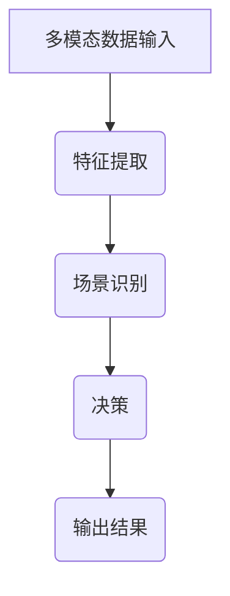
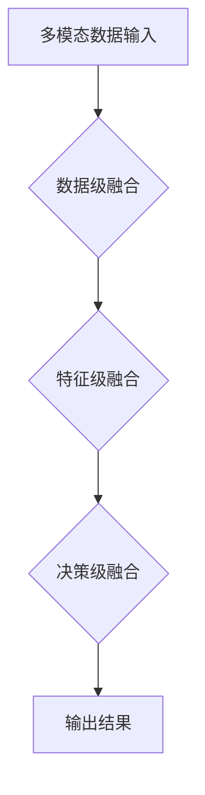
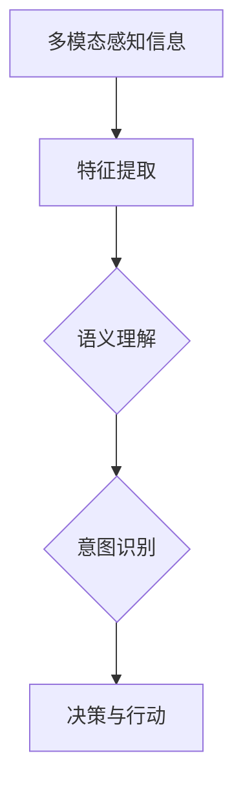
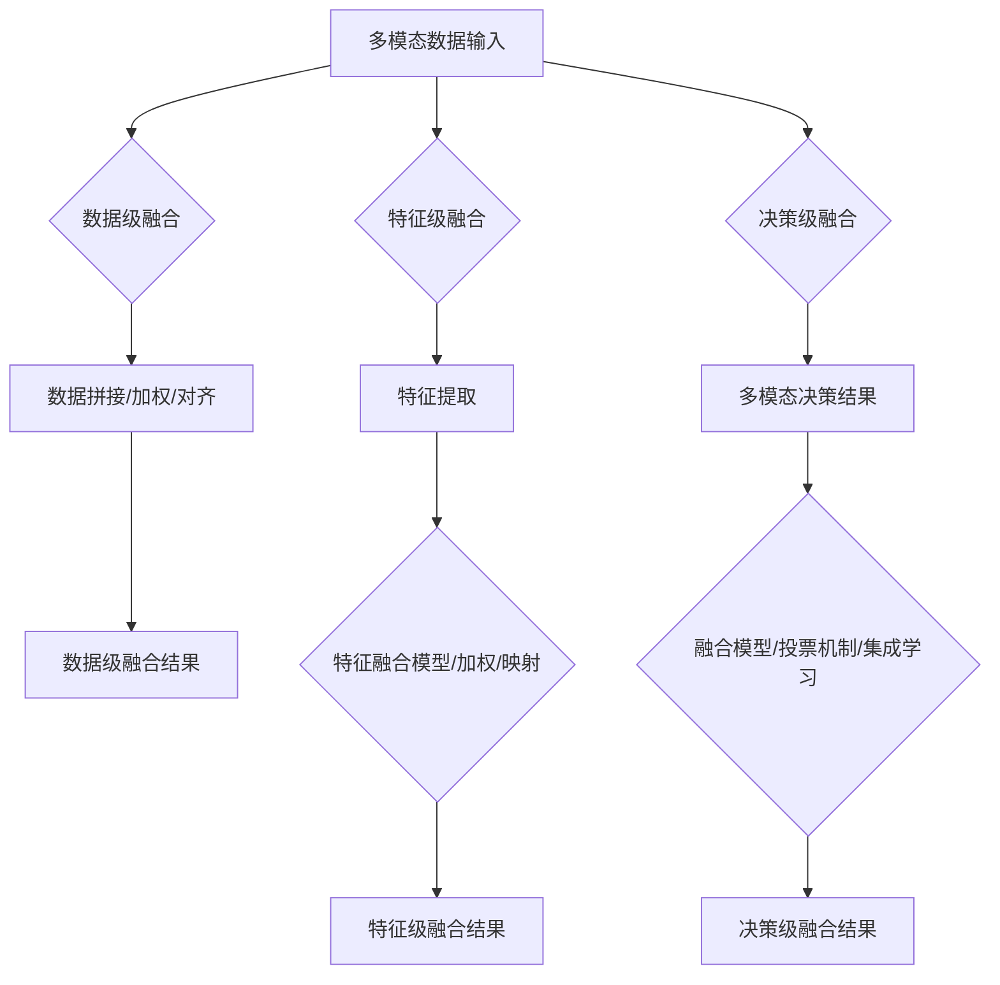

                 

# AI Agent的多模态场景理解技术

> 关键词：AI Agent、多模态、场景理解、技术、应用

> 摘要：本文深入探讨了AI Agent的多模态场景理解技术，从基础概念、关键技术、融合方法以及实际应用等多个方面进行了全面解析。文章旨在为读者提供一个系统的理解，以把握AI Agent多模态场景理解的现状、挑战和未来发展方向。

## 目录大纲

1. 第一部分：AI Agent的多模态场景理解技术基础
   1.1 引言与背景
   1.2 问题描述
   1.3 边界与外延
   1.4 概念结构与核心要素组成
   2. 多模态感知技术
   3. 场景理解技术
   4. 多模态融合技术
   5. AI Agent的多模态场景理解应用
   6. 未来展望
   7. 总结与展望

## 第一部分: AI Agent的多模态场景理解技术基础

### 1.1 引言与背景

#### 1.1.1 AI Agent的发展现状

AI Agent，也称为智能代理，是指能够自主感知环境、执行任务并做出决策的人工智能实体。随着深度学习、自然语言处理和计算机视觉等技术的快速发展，AI Agent在各个领域得到了广泛应用，如智能家居、智能客服和智能驾驶等。

#### 1.1.2 多模态场景理解的重要性

多模态场景理解是指AI Agent能够同时处理多种类型的感知信息，如视觉、听觉和触觉等，从而实现对复杂环境的准确理解和响应。这种能力对于提高AI Agent的智能水平和应用效果具有重要意义。

#### 1.1.3 研究意义与目标

本文旨在深入探讨AI Agent的多模态场景理解技术，分析其基础概念、关键技术、融合方法和实际应用，旨在为相关领域的研究和实践提供参考。

### 1.2 问题描述

#### 1.2.1 AI Agent的定义

AI Agent是指具有自主感知、决策和行动能力的人工智能实体。它可以理解环境中的信息，并基于这些信息做出相应的行动。

#### 1.2.2 多模态场景理解的挑战

多模态场景理解面临着多种挑战，如数据融合、特征提取和实时性等。这些挑战需要通过深入研究和创新技术来解决。

### 1.3 边界与外延

#### 1.3.1 研究范围

本文主要研究AI Agent的多模态场景理解技术，包括感知、理解和融合等方面。

#### 1.3.2 研究限制

本文主要关注常见模态（如视觉、听觉和触觉）的场景理解，对于其他模态的研究将不做深入探讨。

### 1.4 概念结构与核心要素组成

#### 1.4.1 多模态感知

多模态感知是指AI Agent能够同时获取和处理多种类型的感知信息。这包括视觉、听觉、触觉等。

#### 1.4.2 场景理解

场景理解是指AI Agent能够根据多模态感知信息理解当前环境的语义和意图。

#### 1.4.3 多模态融合

多模态融合是指将不同模态的感知信息进行整合，以获取更全面的环境理解。

## 第二部分: 多模态感知技术

### 2.1 基础概念

#### 2.1.1 视觉感知

视觉感知是指AI Agent通过摄像头或其他视觉传感器获取二维或三维图像信息。

#### 2.1.2 声音感知

声音感知是指AI Agent通过麦克风或其他声音传感器获取音频信号信息。

#### 2.1.3 触觉感知

触觉感知是指AI Agent通过触觉传感器获取接触物体时的压力、温度和振动等信息。

### 2.2 技术分析

#### 2.2.1 视觉感知技术

视觉感知技术主要包括图像处理、计算机视觉和深度学习等。这些技术用于从图像中提取特征、识别物体和场景等。

#### 2.2.2 声音感知技术

声音感知技术主要包括语音识别、音频处理和声源定位等。这些技术用于从音频中提取语音信号、识别语音内容和定位声音来源等。

#### 2.2.3 触觉感知技术

触觉感知技术主要包括触觉传感器的设计和应用、触觉信号的处理和解释等。这些技术用于获取触觉信息、模拟触觉体验和进行触觉交互等。

### 2.3 实例分析

#### 2.3.1 视觉感知实例

一个常见的视觉感知实例是物体识别。例如，自动驾驶汽车使用摄像头和计算机视觉技术来识别道路上的行人和其他车辆。

#### 2.3.2 声音感知实例

一个常见的声音感知实例是语音识别。例如，智能助手通过麦克风和语音识别技术来理解用户的语音指令。

#### 2.3.3 触觉感知实例

一个常见的触觉感知实例是触觉交互。例如，触觉手套可以模拟触觉体验，让用户感受到物体的表面纹理和形状。

## 第三部分: 场景理解技术

### 3.1 核心概念

#### 3.1.1 场景理解定义

场景理解是指AI Agent能够根据多模态感知信息理解和解释当前环境的语义和意图。

#### 3.1.2 场景理解的关键要素

场景理解的关键要素包括感知信息、语义理解和意图识别。这些要素共同构成了场景理解的核心。

### 3.2 算法原理

#### 3.2.1 神经网络算法

神经网络算法是场景理解的关键技术之一。它通过多层神经网络模型对多模态感知信息进行特征提取和融合，以实现对场景的理解。

#### 3.2.2 机器学习算法

机器学习算法用于训练和优化神经网络模型，以提高场景理解的效果。

#### 3.2.3 深度学习算法

深度学习算法是神经网络算法的一种，它通过深度神经网络模型对多模态感知信息进行更复杂的特征提取和融合。

### 3.3 Mermaid流程图

### 3.4 数学模型与公式

$$
Y = \sigma(W_1 \cdot X + b_1)
$$

### 3.5 举例说明

#### 3.5.1 室内场景理解

一个室内场景理解的实例是智能家居系统。它可以通过多模态感知信息（如视觉、声音和触觉）来理解家庭环境，并根据用户的意图进行相应的操作。

#### 3.5.2 室外场景理解

一个室外场景理解的实例是自动驾驶系统。它可以通过多模态感知信息（如视觉、声音和触觉）来理解道路环境，并根据道路状况和交通规则进行驾驶决策。

## 第四部分: 多模态融合技术

### 4.1 融合方法

#### 4.1.1 数据级融合

数据级融合是指直接将不同模态的数据进行融合，以获得更丰富的感知信息。

#### 4.1.2 特征级融合

特征级融合是指将不同模态的特征进行融合，以获得更全面的场景理解。

#### 4.1.3 决策级融合

决策级融合是指将不同模态的决策结果进行融合，以获得更准确的决策。

### 4.2 技术分析

#### 4.2.1 数据级融合技术

数据级融合技术主要包括数据叠加、数据融合模型和数据增强等。

#### 4.2.2 特征级融合技术

特征级融合技术主要包括特征融合模型、特征选择和特征转换等。

#### 4.2.3 决策级融合技术

决策级融合技术主要包括投票机制、贝叶斯网络和集成学习等。

### 4.3 Mermaid流程图

### 4.4 数学模型与公式

$$
\text{fusion\_result} = \sum_{i=1}^{n} w_i \cdot \text{modality}_i
$$

### 4.5 举例说明

#### 4.5.1 视觉与听觉融合

一个视觉与听觉融合的实例是智能音响系统。它可以通过融合视觉和听觉信息来更好地理解用户的指令，并提供更自然的交互体验。

#### 4.5.2 视觉与触觉融合

一个视觉与触觉融合的实例是虚拟现实（VR）系统。它可以通过融合视觉和触觉信息来提供更加真实和沉浸式的虚拟体验。

## 第五部分: AI Agent的多模态场景理解应用

### 5.1 应用场景

#### 5.1.1 智能家居

智能家居是AI Agent多模态场景理解的重要应用领域。通过多模态感知技术，智能家居系统可以更好地理解家庭环境，并根据用户的习惯和需求提供智能化的家居服务。

#### 5.1.2 智能客服

智能客服是另一个重要的应用领域。通过多模态感知技术，智能客服系统可以更好地理解用户的意图和需求，并提供更高效、更自然的交互体验。

#### 5.1.3 智能驾驶

智能驾驶是AI Agent多模态场景理解的又一重要应用领域。通过多模态感知技术，智能驾驶系统可以更好地理解道路环境和交通状况，提供更安全、更高效的驾驶体验。

### 5.2 实际案例

#### 5.2.1 案例一：智能家居

智能家居系统中，AI Agent可以通过多模态感知技术（如视觉、声音和触觉）来理解用户的操作和需求。例如，当用户通过语音指令要求关闭灯光时，AI Agent可以通过视觉感知技术识别用户的语音指令，并通过触觉感知技术控制灯光的开关。

#### 5.2.2 案例二：智能客服

智能客服系统中，AI Agent可以通过多模态感知技术（如语音、文本和图像）来理解用户的咨询和问题。例如，当用户通过电话咨询某个产品时，AI Agent可以通过语音识别技术理解用户的语音内容，并通过图像识别技术查看用户提供的图片，从而提供更准确的回答。

#### 5.2.3 案例三：智能驾驶

智能驾驶系统中，AI Agent可以通过多模态感知技术（如视觉、声音和触觉）来理解道路环境和交通状况。例如，当自动驾驶汽车遇到行人时，AI Agent可以通过视觉感知技术识别行人，并通过声音感知技术分析行人的意图，从而做出安全的驾驶决策。

### 5.3 应用挑战与解决方案

#### 5.3.1 挑战一：数据质量

多模态感知技术对数据质量要求较高。例如，图像数据可能存在噪声、模糊等问题，声音数据可能存在回声、噪声等问题。为了提高数据质量，可以采用数据清洗、去噪和增强等技术。

#### 5.3.2 挑战二：实时性

多模态感知技术需要实时处理大量的感知数据，这对计算资源和处理速度提出了较高的要求。为了提高实时性，可以采用并行计算、分布式计算等技术。

#### 5.3.3 挑战三：隐私保护

多模态感知技术涉及到用户隐私信息的获取和处理，如何保护用户隐私成为一个重要挑战。为了解决隐私保护问题，可以采用隐私保护算法、数据加密等技术。

## 第六部分: 未来展望

### 6.1 技术发展趋势

随着人工智能技术的不断发展，多模态场景理解技术将朝着更高精度、更高效能和更广泛应用的方向发展。未来，多模态场景理解技术将在更多领域得到应用，如医疗、金融、教育等。

### 6.2 研究方向

未来的研究方向包括多模态感知的融合方法、多模态场景理解的鲁棒性和多模态场景理解在新兴领域的应用。同时，研究者还应关注算法优化、资源高效利用和跨学科融合等方面。

### 6.3 应用展望

多模态场景理解技术在未来将广泛应用于各种场景，如智能城市、智慧医疗和智能交通等。通过多模态感知和场景理解，AI Agent将能够更好地服务人类，提升生活质量和生产效率。

## 第七部分: 总结与展望

### 7.1 主要贡献

本文从基础概念、关键技术、融合方法和实际应用等方面对AI Agent的多模态场景理解技术进行了全面解析，为相关领域的研究和实践提供了有益的参考。

### 7.2 存在问题与挑战

虽然多模态场景理解技术已经取得了一定的进展，但仍存在一些问题和挑战，如算法复杂度、数据依赖和硬件限制等。未来的研究应重点关注这些问题和挑战的解决。

### 7.3 未来工作方向

未来的工作方向包括优化算法、提高实时性和增强隐私保护等方面。同时，研究者还应关注多模态场景理解技术在新兴领域的应用，为人工智能技术的发展做出更大的贡献。

## 作者信息

作者：AI天才研究院/AI Genius Institute & 禅与计算机程序设计艺术 /Zen And The Art of Computer Programming

---

文章内容仅供参考，如需进一步深入了解，请查阅相关文献和资料。在研究和应用中，请尊重知识产权，遵循相关法律法规。祝您在人工智能领域取得更大的成就！## 第一部分: AI Agent的多模态场景理解技术基础

### 1.1 引言与背景

#### 1.1.1 AI Agent的发展现状

人工智能（AI）技术近年来取得了显著进展，从最初的理论研究到实际应用，AI已经渗透到我们生活的方方面面。AI Agent，作为一种特殊的人工智能实体，具有自主感知环境、执行任务和决策行动的能力，正逐渐成为人工智能领域的研究热点和应用焦点。AI Agent的定义和范畴随着技术的进步和应用场景的拓展而不断扩大，目前主要包括机器人、虚拟助手、自动驾驶系统等。

在智能家居领域，AI Agent通过智能传感器和设备，实现家电的自动化控制，为用户提供舒适、便捷的生活体验。例如，智能音箱可以通过语音识别和自然语言处理技术，理解用户的指令并执行相应的操作，如播放音乐、调节室内温度等。在智能客服领域，AI Agent利用自然语言处理和机器学习技术，模拟人类客服的行为，提供快速、准确的客户服务。自动驾驶领域则依赖于AI Agent的感知、决策和行动能力，实现车辆的自主导航和驾驶。

AI Agent的发展现状呈现出几个显著的特点：

1. **技术多样性**：AI Agent集成了多种先进的人工智能技术，如深度学习、强化学习、计算机视觉、自然语言处理等，使得其在感知、理解和决策等方面具有更高的准确性和效率。

2. **应用广泛性**：AI Agent不仅应用于传统的工业和商业领域，还在医疗、教育、金融等新兴领域得到广泛应用，逐渐成为智能化服务的重要组成部分。

3. **持续进步**：随着算法的优化和硬件性能的提升，AI Agent的智能水平和应用效果不断提升，为其在更多领域的推广和应用提供了可能。

#### 1.1.2 多模态场景理解的重要性

多模态场景理解是指AI Agent能够同时处理和融合多种类型的感知信息，如视觉、听觉、触觉等，以实现对复杂环境的全面理解和精确响应。这种能力对于提升AI Agent的智能化水平和应用效果具有重要意义。

首先，多模态场景理解能够提供更丰富的感知信息。例如，在视觉感知中，AI Agent可以通过摄像头获取图像信息，而在听觉感知中，AI Agent可以通过麦克风获取声音信息。通过融合这两种模态的信息，AI Agent可以获得更全面的场景描述，从而做出更准确的决策。

其次，多模态场景理解能够提高AI Agent的鲁棒性和适应性。在复杂多变的环境中，单一模态的感知信息可能受到噪声、遮挡等因素的影响，导致理解不准确。而通过多模态感知信息的融合，AI Agent可以克服这些局限性，提高其在不同场景下的适应性。

此外，多模态场景理解还能够提升AI Agent的人机交互体验。通过融合视觉、听觉和触觉等多种感知信息，AI Agent可以更好地理解用户的需求和意图，提供更自然、更人性化的交互体验。

#### 1.1.3 研究意义与目标

本文旨在探讨AI Agent的多模态场景理解技术，旨在为研究者提供系统性的理论框架和实践指导，以推动相关领域的研究和应用发展。具体而言，本文的研究目标包括：

1. **梳理多模态场景理解的基础概念和技术体系**：通过系统性地梳理和介绍多模态感知、场景理解和多模态融合等基础概念，建立清晰的理论框架。

2. **分析多模态场景理解的关键技术**：深入分析多模态感知技术、场景理解算法和融合方法，探讨其原理和实现技术。

3. **探讨多模态场景理解的应用场景**：结合实际应用案例，分析多模态场景理解在不同领域的应用，探讨其优势和挑战。

4. **展望多模态场景理解技术的发展趋势**：基于当前的研究和应用现状，展望多模态场景理解技术的未来发展趋势和潜在研究方向。

通过实现上述目标，本文希望为AI Agent的多模态场景理解技术的研究和应用提供有价值的参考，推动人工智能技术的进一步发展。

### 1.2 问题描述

#### 1.2.1 AI Agent的定义

AI Agent，又称智能代理，是一种具备自主感知、决策和行动能力的人工智能实体。它能够通过多种传感器获取环境信息，利用智能算法进行分析和处理，并基于分析结果自主采取行动。AI Agent的定义和功能不断演变，随着人工智能技术的发展，其能力和应用范围也在不断扩展。

首先，从定义上看，AI Agent具备以下几个核心特征：

1. **自主性**：AI Agent能够自主地感知环境、分析数据和做出决策，而不依赖于人类操作者的直接控制。
2. **感知能力**：AI Agent通过传感器（如摄像头、麦克风、触觉传感器等）收集环境信息，这些信息可以是视觉的、听觉的、触觉的或其他类型的。
3. **决策能力**：AI Agent利用收集到的信息，通过算法模型进行推理和判断，生成行动策略。
4. **行动能力**：AI Agent能够根据决策结果执行具体操作，如控制机器人动作、发送消息、调节设备状态等。

AI Agent的发展历程可以追溯到早期的自动化系统和专家系统。随着计算机技术和人工智能技术的进步，AI Agent的功能越来越强大，应用范围也越来越广泛。现代的AI Agent通常集成了多种人工智能技术，如机器学习、深度学习、自然语言处理等，使其具备更强的感知和决策能力。

其次，从功能上看，AI Agent可以分为以下几类：

1. **任务型AI Agent**：这类AI Agent专注于完成特定任务，如智能家居中的灯光控制、温度调节等。
2. **社交型AI Agent**：这类AI Agent具有社交能力，能够与人类用户进行自然语言交互，如智能客服、虚拟助手等。
3. **探索型AI Agent**：这类AI Agent用于无人驾驶、机器人探索等领域，具备环境感知和自主导航能力。
4. **服务型AI Agent**：这类AI Agent提供各种服务，如医疗诊断、金融分析等，具有较高的专业性和智能化水平。

#### 1.2.2 多模态场景理解的挑战

多模态场景理解是指AI Agent能够同时处理和融合来自不同模态的感知信息，以实现对环境的全面理解。然而，这一过程面临许多挑战，主要包括以下几个方面：

1. **数据融合问题**：不同模态的数据在格式、分辨率和粒度上存在差异，如何有效地融合这些数据以获得更全面的环境理解是一个关键问题。

2. **特征提取问题**：从不同模态的数据中提取有意义的特征是一项复杂的任务。如何设计有效的特征提取算法，以便在融合阶段充分利用这些特征，是研究的重点。

3. **实时性问题**：在动态环境中，AI Agent需要实时处理多模态数据，并在短时间内做出决策。如何优化算法和系统架构，以满足实时性的要求，是研究的难点。

4. **鲁棒性问题**：多模态场景理解需要面对各种噪声和不确定性，如何提高系统的鲁棒性，使其在各种复杂环境中稳定工作，是一个重要的挑战。

5. **隐私保护问题**：多模态场景理解通常涉及对个人隐私信息的处理，如何保护用户的隐私不被泄露，是研究和应用中必须考虑的问题。

#### 1.2.3 AI Agent多模态场景理解的应用

AI Agent的多模态场景理解技术在多个领域展现出了巨大的应用潜力。以下是一些典型的应用场景：

1. **智能客服**：通过融合用户的语音、文本和面部表情等多模态信息，智能客服系统能够更准确地理解用户的意图，提供个性化的服务。

2. **智能家居**：多模态感知技术使得智能家居系统能够更好地理解用户的行为和需求，从而实现自动化控制和智能推荐。

3. **自动驾驶**：自动驾驶汽车通过融合视觉、雷达和激光雷达等多模态信息，实现环境感知和自动驾驶功能。

4. **虚拟现实与增强现实**：通过融合视觉、听觉和触觉等多模态信息，虚拟现实和增强现实系统能够提供更加沉浸和互动的体验。

5. **医疗健康**：多模态场景理解技术可用于辅助诊断和治疗方案制定，通过融合患者的生理、心理等多方面信息，提高医疗服务的质量和效率。

通过上述应用场景可以看出，多模态场景理解技术不仅提升了AI Agent的智能化水平，也为各行业带来了新的发展机遇。未来，随着技术的不断进步，AI Agent的多模态场景理解能力将更加完善，应用领域也将不断拓展。

### 1.3 边界与外延

#### 1.3.1 研究范围

本文的研究范围主要集中于AI Agent的多模态场景理解技术，包括以下几个方面：

1. **多模态感知技术**：探讨不同模态（如视觉、听觉、触觉等）的感知原理、方法和应用。

2. **场景理解技术**：研究AI Agent如何利用多模态感知信息进行场景理解，包括算法原理、实现技术和应用案例。

3. **多模态融合技术**：分析不同模态信息的融合方法、算法和实现策略，探讨如何有效地整合多模态信息以提高场景理解的准确性和鲁棒性。

4. **应用场景分析**：结合实际应用案例，分析多模态场景理解技术在各个领域的应用前景和挑战。

本文旨在为AI Agent的多模态场景理解技术提供一个系统性的研究框架和实践指南，以推动该领域的研究和发展。

#### 1.3.2 研究限制

尽管本文探讨了AI Agent多模态场景理解技术的多个方面，但仍存在一些研究限制，主要包括：

1. **数据限制**：由于实际应用场景的复杂性，难以获取全面且高质量的多模态数据集，这在一定程度上限制了研究的深度和广度。

2. **算法复杂性**：多模态场景理解涉及到复杂的算法和计算过程，如何优化算法以降低计算复杂度是一个需要进一步研究的问题。

3. **应用场景限制**：本文主要关注常见的多模态场景理解应用，对于一些新兴领域和特殊场景的应用，可能无法完全涵盖。

4. **技术发展限制**：虽然当前多模态场景理解技术已经取得了一定的进展，但仍然面临许多技术和应用上的挑战，如实时性、鲁棒性和隐私保护等。

#### 1.3.3 概念结构与核心要素组成

多模态场景理解技术的概念结构可以概括为三个核心组成部分：多模态感知、场景理解和多模态融合。

1. **多模态感知**：多模态感知是AI Agent获取多种类型感知信息的过程。它包括视觉、听觉、触觉等多个模态，每个模态都有其独特的感知原理和技术方法。例如，视觉感知依赖于图像处理和计算机视觉技术，听觉感知依赖于语音识别和音频处理技术，触觉感知依赖于触觉传感器和信号处理技术。

2. **场景理解**：场景理解是指AI Agent基于多模态感知信息，对当前环境进行语义分析和解释的过程。场景理解的核心是构建一个能够处理多模态信息的综合模型，通过算法和推理机制，从感知信息中提取有意义的场景特征，并理解这些特征所代表的场景意图。

3. **多模态融合**：多模态融合是将不同模态的感知信息进行整合，以获得更全面和准确的环境理解。多模态融合可以发生在数据级、特征级和决策级等不同层次。数据级融合主要涉及直接合并不同模态的数据；特征级融合涉及提取不同模态的特征，并利用特征融合方法进行整合；决策级融合则是将不同模态的决策结果进行融合，以得到最终的决策结果。

在这三个核心组成部分中，多模态感知是实现场景理解和融合的基础，场景理解是多模态融合的目标，而多模态融合则是实现高效、准确场景理解的关键技术手段。

通过深入理解和研究这三个核心组成部分，我们可以更好地把握AI Agent多模态场景理解技术的发展方向和应用前景，为未来的研究和应用提供有力的理论支持和实践指导。

## 第二部分: 多模态感知技术

### 2.1 基础概念

#### 2.1.1 视觉感知

视觉感知是AI Agent获取和处理视觉信息的过程，是AI Agent实现环境理解和交互的重要手段。视觉感知技术主要包括图像采集、图像处理和计算机视觉等。

**图像采集**：图像采集是视觉感知的第一步，通常通过摄像头、红外传感器、激光雷达等设备获取二维或三维图像数据。这些图像数据可以是静态的，也可以是动态的，取决于应用场景的需求。

**图像处理**：图像处理是对采集到的图像进行预处理和增强的过程。常用的图像处理技术包括去噪、增强、分割、边缘检测等。这些技术旨在提高图像质量，提取有用的视觉信息。

**计算机视觉**：计算机视觉是视觉感知的核心技术，它利用图像处理算法和深度学习模型，对图像进行理解和分析。计算机视觉的任务包括物体检测、目标跟踪、场景识别、图像分类等。

在物体检测任务中，AI Agent需要识别图像中的物体并定位其位置。常用的算法包括卷积神经网络（CNN）和区域生成网络（R-CNN）等。在目标跟踪任务中，AI Agent需要持续跟踪图像中的目标物体，即使目标在图像中发生遮挡或运动。常见的跟踪算法有光流法、粒子滤波法和深度学习方法等。场景识别和图像分类任务则是将图像划分为不同的类别，如城市、乡村、动物等。这些任务通常采用深度学习模型进行训练和预测。

视觉感知技术在AI Agent的应用场景非常广泛，例如：

- **自动驾驶**：自动驾驶汽车通过摄像头和激光雷达获取道路环境信息，实现车辆自动驾驶。
- **智能监控**：智能监控系统通过摄像头捕捉视频流，实时分析图像内容，进行异常检测和事件识别。
- **虚拟现实**：虚拟现实（VR）系统通过捕捉用户的视觉信息，创建沉浸式的虚拟环境，为用户提供丰富的互动体验。

#### 2.1.2 声音感知

声音感知是AI Agent获取和处理音频信息的过程，是AI Agent实现语音识别、声源定位和音频分析等任务的基础。声音感知技术主要包括语音识别、音频处理和声源定位等。

**语音识别**：语音识别是将语音信号转换为文本信息的过程，是自然语言处理（NLP）的重要组成部分。语音识别技术通过分析语音信号的声学特征和语言模型，实现语音到文本的转换。常见的语音识别算法包括隐马尔可夫模型（HMM）、高斯混合模型（GMM）和深度神经网络（DNN）等。语音识别在智能客服、语音助手和智能语音助手等领域有广泛应用。

**音频处理**：音频处理是对音频信号进行预处理和增强的过程，旨在提高音频质量，提取有用的声音特征。常用的音频处理技术包括滤波、去噪、回声消除和声音增强等。

**声源定位**：声源定位是确定声音源在空间中的位置的过程。声源定位技术通过分析声音信号的到达时间和到达角度，实现声源的定位。常见的声源定位算法有时间差定位（TDOA）、到达时间定位（TOA）和到达时间差定位（TDOA）等。声源定位在智能音响、会议录音和声音导航等领域有重要应用。

#### 2.1.3 触觉感知

触觉感知是AI Agent获取和处理触觉信息的过程，是AI Agent实现触觉交互和物体识别的重要手段。触觉感知技术主要包括触觉传感器、触觉信号处理和触觉反馈等。

**触觉传感器**：触觉传感器是触觉感知的核心部件，用于检测和测量触觉信息。常见的触觉传感器包括力传感器、压电传感器、柔性传感器和触觉触摸屏等。这些传感器可以检测物体的表面纹理、压力、振动和温度等触觉特征。

**触觉信号处理**：触觉信号处理是对触觉传感器采集到的信号进行预处理和增强的过程，旨在提取有用的触觉信息。常用的触觉信号处理技术包括滤波、去噪、特征提取和模式识别等。

**触觉反馈**：触觉反馈是将触觉信息传递给用户的过程，通过触觉反馈，用户可以感受到物体的触觉特征。常见的触觉反馈技术包括振动、压力和温度等。触觉反馈在虚拟现实、触觉手套和智能玩具等领域有广泛应用。

### 2.2 技术分析

#### 2.2.1 视觉感知技术

视觉感知技术在AI Agent中发挥着至关重要的作用，其技术分析主要包括以下几个方面：

1. **图像采集技术**：图像采集技术的核心在于提高图像质量和减少噪声。常见的图像采集设备包括摄像头、红外摄像头和激光雷达等。这些设备在不同场景下具有不同的应用优势。

2. **图像处理技术**：图像处理技术用于提高图像质量、提取有用信息和进行后续分析。常用的图像处理算法包括去噪、增强、分割、边缘检测和特征提取等。这些算法在AI Agent中具有广泛应用。

3. **计算机视觉技术**：计算机视觉技术是实现视觉感知的核心技术，包括物体检测、目标跟踪、场景识别和图像分类等。常用的计算机视觉算法包括卷积神经网络（CNN）、生成对抗网络（GAN）和迁移学习等。

以物体检测为例，物体检测是视觉感知技术中的一项重要任务，它通过识别图像中的物体并定位其位置，为后续的任务提供基础数据。常见的物体检测算法包括R-CNN、SSD、YOLO和Faster R-CNN等。这些算法在自动驾驶、智能监控和机器人导航等领域有广泛应用。

#### 2.2.2 声音感知技术

声音感知技术在AI Agent中的应用主要包括语音识别、声源定位和音频分析等。以下是对这些技术的详细分析：

1. **语音识别技术**：语音识别技术是将语音信号转换为文本信息的过程。其技术分析主要包括声学模型、语言模型和语音解码等。常用的语音识别算法包括GMM-HMM、DNN-HMM和深度学习语音识别等。

以深度学习语音识别为例，深度学习语音识别利用深度神经网络模型对语音信号进行建模和识别，具有较高的识别准确率和实时性。常见的深度学习语音识别模型包括DNN、C-DNN、Bi-LSTM和Transformer等。

2. **声源定位技术**：声源定位技术是通过分析声音信号的到达时间和到达角度，确定声源在空间中的位置。其技术分析主要包括时间差定位（TDOA）、到达时间（TOA）和到达时间差定位（TDOA）等。常用的声源定位算法包括单传感器定位、多传感器融合定位和基于深度学习的声源定位等。

3. **音频分析技术**：音频分析技术用于分析和处理音频信号，提取有用的音频特征和信息。其技术分析主要包括音频分割、音频分类、音频增强和音频去噪等。常用的音频分析算法包括谱图分析、短时傅里叶变换（STFT）和Mel频率倒谱系数（MFCC）等。

#### 2.2.3 触觉感知技术

触觉感知技术在AI Agent中用于实现触觉交互和物体识别，其技术分析主要包括以下几个方面：

1. **触觉传感器技术**：触觉传感器是触觉感知的核心部件，其性能直接影响触觉感知的效果。触觉传感器技术主要涉及传感器材料、传感器结构和传感器接口等。

2. **触觉信号处理技术**：触觉信号处理技术用于对触觉传感器采集到的信号进行预处理和增强，提取有用的触觉信息。其技术分析主要包括信号滤波、信号去噪、特征提取和模式识别等。

3. **触觉反馈技术**：触觉反馈技术是将触觉信息传递给用户的过程，通过触觉反馈，用户可以感受到物体的触觉特征。其技术分析主要包括振动控制、压力控制和温度控制等。

以触觉手套为例，触觉手套是一种常见的触觉感知设备，它通过触觉传感器和触觉反馈装置，实现触觉交互和物体识别。触觉手套的触觉传感器通常采用柔性传感器材料，如硅橡胶、聚氨酯等，以实现柔软、高灵敏度和高分辨率。触觉反馈装置通常采用电磁振动器、气压振动器等，以实现真实的触觉反馈。

### 2.3 实例分析

#### 2.3.1 视觉感知实例

以下是一个视觉感知的实例：自动驾驶汽车。

自动驾驶汽车通过摄像头和激光雷达等设备获取道路环境信息，实现车辆自主导航和驾驶。具体步骤如下：

1. **图像采集**：自动驾驶汽车使用前视摄像头和激光雷达等设备采集道路环境图像。

2. **图像预处理**：对采集到的图像进行预处理，包括去噪、增强和分割等，以提高图像质量。

3. **物体检测**：利用计算机视觉算法对预处理后的图像进行物体检测，识别道路上的行人、车辆、交通标志等。

4. **目标跟踪**：对检测到的目标进行跟踪，以获取其运动轨迹。

5. **场景识别**：利用场景识别算法对道路环境进行分类，如城市道路、乡村道路等。

6. **驾驶决策**：根据场景识别结果和目标跟踪信息，自动驾驶汽车生成驾驶决策，包括加速、减速、转弯和刹车等。

7. **执行决策**：自动驾驶汽车根据驾驶决策执行相应操作，实现自主导航和驾驶。

#### 2.3.2 声音感知实例

以下是一个声音感知的实例：智能音箱。

智能音箱通过麦克风和语音识别技术，实现用户语音指令的识别和执行。具体步骤如下：

1. **声音采集**：智能音箱使用麦克风采集用户语音指令。

2. **声音预处理**：对采集到的声音信号进行预处理，包括降噪、增益和去回声等，以提高语音质量。

3. **语音识别**：利用语音识别算法对预处理后的声音信号进行识别，转换为文本信息。

4. **自然语言处理**：对识别出的文本信息进行自然语言处理，理解用户的意图和需求。

5. **执行任务**：根据用户意图和需求，智能音箱执行相应的任务，如播放音乐、调节室内温度、查询天气等。

#### 2.3.3 触觉感知实例

以下是一个触觉感知的实例：触觉手套。

触觉手套通过触觉传感器和触觉反馈装置，实现触觉交互和物体识别。具体步骤如下：

1. **触觉信号采集**：触觉手套使用触觉传感器采集手部触觉信号，如表面纹理、压力和振动等。

2. **触觉信号处理**：对采集到的触觉信号进行预处理和增强，提取有用的触觉信息。

3. **触觉反馈**：通过触觉反馈装置，将触觉信息传递给用户，实现触觉交互。

4. **物体识别**：利用物体识别算法，对触觉传感器采集到的信号进行分析，识别触摸到的物体。

5. **交互反馈**：根据物体识别结果，触觉手套提供相应的交互反馈，如振动、声音等。

通过上述实例分析，可以看出多模态感知技术在AI Agent中的应用场景非常广泛，涵盖了自动驾驶、智能音箱和触觉手套等多个领域。这些实例不仅展示了多模态感知技术的应用效果，也为未来的研究和应用提供了有益的参考。

## 第三部分: 场景理解技术

### 3.1 核心概念

#### 3.1.1 场景理解定义

场景理解是指AI Agent通过分析多模态感知信息，对当前环境进行语义和意图解释的过程。具体而言，场景理解包括对环境中物体、人物、事件及其关系的识别、分析和解释，从而实现对环境语义的理解和意图的推断。

场景理解是AI Agent智能化的重要组成部分，它使AI Agent能够从多模态感知信息中提取有价值的信息，进行推理和决策，从而在复杂环境中自主行动。场景理解不仅依赖于多模态感知技术，还需要结合机器学习和深度学习算法，实现从感知到认知的转化。

#### 3.1.2 场景理解的关键要素

场景理解的过程涉及多个关键要素，这些要素共同作用，以实现对复杂环境的全面理解。以下是场景理解的关键要素：

1. **多模态感知信息**：场景理解的基础是多种类型的感知信息，包括视觉、听觉、触觉等。这些感知信息提供了对环境的全面感知，是场景理解的前提。

2. **特征提取**：从多模态感知信息中提取有意义的特征，如视觉图像的边缘、纹理和形状特征，声音的频率和音量特征，触觉的压力和振动特征等。这些特征是场景理解的核心数据。

3. **语义理解**：基于提取的特征，利用自然语言处理（NLP）和机器学习算法，对感知信息进行语义分析，识别和理解环境中的实体、事件和关系。语义理解使AI Agent能够理解环境中的具体内容和含义。

4. **意图识别**：通过分析感知信息和语义理解结果，推断出环境中的行为意图和目标。意图识别是场景理解的最终目标，它使AI Agent能够根据环境情况做出合适的决策。

5. **上下文信息**：场景理解需要考虑上下文信息，如时间、地点、历史行为等。上下文信息有助于提高场景理解的准确性和鲁棒性，使AI Agent能够适应不同的环境和情境。

#### 3.1.3 场景理解在AI Agent中的应用

场景理解技术在AI Agent中有着广泛的应用，以下是一些典型的应用场景：

1. **智能客服**：通过场景理解，智能客服系统能够理解用户的问题和意图，提供个性化的服务和解决方案。

2. **智能家居**：通过场景理解，智能家居系统能够自动识别用户行为和需求，实现智能化的家居管理和控制。

3. **自动驾驶**：通过场景理解，自动驾驶系统能够理解道路环境、交通状况和行人的行为，实现安全的自动驾驶。

4. **智能监控**：通过场景理解，智能监控系统能够自动识别异常行为和事件，提高监控的准确性和效率。

5. **虚拟现实与增强现实**：通过场景理解，虚拟现实和增强现实系统能够为用户提供更加真实和互动的体验。

### 3.2 算法原理

#### 3.2.1 神经网络算法

神经网络算法是场景理解的核心技术之一，其基本原理是通过多层神经网络模型对输入数据进行特征提取和融合，以实现对场景的语义理解和意图识别。以下是一些常用的神经网络算法：

1. **卷积神经网络（CNN）**：CNN是图像处理和计算机视觉领域的经典算法，通过卷积操作提取图像特征，具有较强的特征提取能力。

2. **循环神经网络（RNN）**：RNN适用于处理序列数据，通过记忆机制对序列信息进行建模，常用于语音识别和自然语言处理。

3. **长短时记忆网络（LSTM）**：LSTM是RNN的变种，解决了RNN的长期依赖问题，适用于复杂序列数据的建模。

4. **生成对抗网络（GAN）**：GAN通过生成器和判别器的对抗训练，实现数据的生成和增强，常用于图像生成和图像修复。

5. **Transformer**：Transformer是自然语言处理领域的突破性算法，通过自注意力机制实现序列建模，广泛应用于机器翻译和文本生成。

#### 3.2.2 机器学习算法

机器学习算法是场景理解的重要工具，通过训练模型从数据中学习特征和规律，以实现对场景的理解。以下是一些常用的机器学习算法：

1. **监督学习**：监督学习算法通过对标记数据进行训练，学习输入和输出之间的映射关系。常见的算法包括决策树、支持向量机（SVM）和神经网络等。

2. **无监督学习**：无监督学习算法通过对未标记的数据进行训练，学习数据的内在结构和规律。常见的算法包括聚类、降维和生成模型等。

3. **半监督学习**：半监督学习结合了监督学习和无监督学习，利用少量标记数据和大量未标记数据进行训练，以提高模型的泛化能力。

4. **强化学习**：强化学习通过奖励机制和策略优化，实现从环境中学习最优行为。常见的算法包括Q学习、SARSA和深度确定性策略梯度（DDPG）等。

#### 3.2.3 深度学习算法

深度学习算法是神经网络算法的扩展和优化，通过多层网络结构实现数据的深层特征提取和融合。以下是一些常用的深度学习算法：

1. **深度卷积神经网络（Deep CNN）**：Deep CNN通过多层卷积和池化操作，实现图像的深层特征提取，是图像处理和计算机视觉的重要工具。

2. **深度循环神经网络（Deep RNN）**：Deep RNN通过多层RNN结构，实现序列的深层建模，是自然语言处理的重要算法。

3. **深度生成模型（Deep Generative Model）**：深度生成模型通过多层生成器和判别器，实现数据的生成和增强，广泛应用于图像生成和增强现实。

4. **深度强化学习（Deep Reinforcement Learning）**：深度强化学习通过多层神经网络，实现从环境中学习最优策略，是自动驾驶和游戏AI的重要算法。

### 3.3 Mermaid流程图

为了更好地展示场景理解的过程，我们可以使用Mermaid流程图来描述。以下是场景理解的一个简化的流程图：

在这个流程图中，A表示多模态感知信息，B表示特征提取，C表示语义理解，D表示意图识别，E表示决策与行动。这个流程图展示了场景理解的核心步骤，以及各步骤之间的逻辑关系。

### 3.4 数学模型与公式

场景理解过程涉及多个数学模型和公式，以下是一些常见的数学模型和公式：

1. **卷积神经网络（CNN）中的卷积公式**：

   $$ f(x) = \sum_{i=1}^{k} w_i * x_i + b $$

   其中，$f(x)$表示卷积操作的结果，$w_i$表示卷积核，$x_i$表示输入特征，$b$表示偏置项。

2. **循环神经网络（RNN）中的递归公式**：

   $$ h_t = \sigma(W_h * [h_{t-1}, x_t] + b_h) $$

   其中，$h_t$表示当前时刻的隐藏状态，$W_h$表示权重矩阵，$x_t$表示输入特征，$b_h$表示偏置项，$\sigma$表示激活函数。

3. **生成对抗网络（GAN）中的损失函数**：

   $$ L_D = -\frac{1}{2} \sum_{i=1}^{n} (\log D(x_i) + \log (1 - D(G(z_i))) $$

   其中，$L_D$表示判别器的损失函数，$D(x_i)$表示判别器对真实数据的判断概率，$D(G(z_i))$表示判别器对生成数据的判断概率，$z_i$表示生成器的输入噪声。

4. **强化学习中的价值函数**：

   $$ Q(s, a) = r + \gamma \max_{a'} Q(s', a') $$

   其中，$Q(s, a)$表示状态-动作价值函数，$r$表示即时奖励，$s$表示当前状态，$a$表示当前动作，$s'$表示下一状态，$\gamma$表示折扣因子。

通过上述数学模型和公式，我们可以更深入地理解场景理解过程中的特征提取、语义理解和意图识别等核心步骤。

### 3.5 举例说明

#### 3.5.1 室内场景理解

以室内场景理解为例，AI Agent需要通过多模态感知信息对室内环境进行理解和交互。以下是一个简化的室内场景理解过程：

1. **多模态感知**：AI Agent通过摄像头获取室内环境的图像信息，通过麦克风获取语音信息，通过触觉传感器获取接触物体的触觉信息。

2. **特征提取**：对多模态感知信息进行特征提取，如从图像中提取边缘、纹理和形状特征，从语音中提取频率、音量和语音特征，从触觉中提取压力、振动和温度特征。

3. **语义理解**：利用机器学习算法和深度学习模型，对提取的特征进行语义分析，识别和理解室内环境中的物体、人物和事件。例如，通过图像识别技术，AI Agent可以识别出房间中的家具和家电；通过语音识别技术，AI Agent可以理解用户的语音指令。

4. **意图识别**：基于语义理解结果，AI Agent推断用户的意图和需求。例如，当用户说出“打开电视”时，AI Agent理解用户的意图是打开客厅的电视。

5. **决策与行动**：根据意图识别结果，AI Agent执行相应的操作。例如，AI Agent通过控制电视的开关键，打开客厅的电视。

#### 3.5.2 室外场景理解

以室外场景理解为例，AI Agent需要通过多模态感知信息对室外环境进行理解和交互。以下是一个简化的室外场景理解过程：

1. **多模态感知**：AI Agent通过摄像头获取道路环境的图像信息，通过麦克风获取语音信息，通过激光雷达获取周围环境的距离信息。

2. **特征提取**：对多模态感知信息进行特征提取，如从图像中提取交通标志、行人和车辆的特征，从语音中提取语音指令的特征，从激光雷达中提取障碍物的距离和形状特征。

3. **语义理解**：利用机器学习算法和深度学习模型，对提取的特征进行语义分析，识别和理解室外环境中的物体、事件和交通状况。例如，通过图像识别技术，AI Agent可以识别出道路上的交通标志和行人；通过语音识别技术，AI Agent可以理解用户的语音指令。

4. **意图识别**：基于语义理解结果，AI Agent推断用户的意图和需求。例如，当用户说出“前往机场”时，AI Agent理解用户的意图是导航至机场。

5. **决策与行动**：根据意图识别结果，AI Agent执行相应的操作。例如，AI Agent通过自动驾驶技术，导航至机场。

通过上述举例说明，我们可以更直观地理解场景理解技术在室内和室外场景中的应用过程。这些应用不仅展示了场景理解技术的实际效果，也为未来的研究和应用提供了参考。

## 第四部分: 多模态融合技术

### 4.1 融合方法

多模态融合技术是将不同模态的感知信息进行整合，以获得更全面和准确的环境理解。融合方法可以分为数据级融合、特征级融合和决策级融合三种类型，每种类型都有其独特的实现方式和应用场景。

#### 4.1.1 数据级融合

数据级融合是指直接将不同模态的数据进行融合，以获得更丰富的感知信息。这种方法的优点是简单直观，但可能面临数据格式不一致和数据冗余等问题。

1. **简单叠加**：将不同模态的数据直接叠加，形成一个多维数据集。例如，将视觉图像和语音信号叠加，形成一个包含图像和音频信息的多维数据集。

2. **特征映射**：将不同模态的数据映射到同一空间，以便进行直接融合。例如，将视觉图像转换为灰度值矩阵，将语音信号转换为频谱图，然后进行矩阵相乘或求和。

3. **时空融合**：对于动态环境，可以结合时间和空间信息，对连续的多模态数据进行融合。例如，结合视频帧和时间戳，对连续的视觉和语音数据进行融合。

数据级融合方法适用于一些简单的应用场景，如多媒体信息检索和视频监控等。然而，由于不同模态数据在格式、分辨率和粒度上的差异，数据级融合方法可能无法充分挖掘各模态数据的潜力。

#### 4.1.2 特征级融合

特征级融合是指将不同模态的特征进行融合，以获得更全面的场景理解。这种方法通过对各模态数据进行预处理和特征提取，然后利用融合算法将特征进行整合。

1. **特征融合模型**：利用深度学习模型，如卷积神经网络（CNN）和循环神经网络（RNN）等，将不同模态的特征进行融合。这些模型可以通过端到端训练，自动学习特征融合策略。

2. **特征选择**：通过特征选择算法，选择对场景理解最重要的特征进行融合。例如，利用主成分分析（PCA）或线性判别分析（LDA）等降维技术，筛选出最有用的特征。

3. **特征转换**：将不同模态的特征转换为同一类型的特征，如将视觉特征转换为图像金字塔，将语音特征转换为频谱图，然后进行融合。

特征级融合方法在许多应用场景中表现出色，如自动驾驶、智能监控和虚拟现实等。通过融合多模态特征，可以显著提高场景理解的准确性和鲁棒性。

#### 4.1.3 决策级融合

决策级融合是指将不同模态的决策结果进行融合，以获得更准确的决策。这种方法适用于需要综合多模态信息的决策场景，如智能客服和智能驾驶等。

1. **投票机制**：将不同模态的决策结果进行投票，选择投票结果最多的决策。例如，在智能客服中，当视觉识别认为用户请求为A，语音识别认为用户请求为B时，可以选择A或B。

2. **融合模型**：利用多模态融合模型，如多任务学习（Multi-Task Learning）或深度神经网络（Deep Neural Network）等，将不同模态的决策结果进行融合，生成最终的决策结果。

3. **集成学习**：使用集成学习方法，如随机森林（Random Forest）或梯度提升树（Gradient Boosting Tree）等，将不同模态的决策结果进行集成，生成更准确的决策。

决策级融合方法在需要综合多模态信息进行复杂决策的场景中具有优势，可以提高决策的准确性和鲁棒性。

### 4.2 技术分析

多模态融合技术在不同层次上实现信息整合，以提高AI Agent对复杂环境的理解能力。以下是对多模态融合技术各层次的分析：

#### 4.2.1 数据级融合技术

数据级融合技术主要通过直接操作原始数据来实现多模态信息的整合。这种方法适用于数据量相对较小且模态差异不大的场景。

1. **数据拼接**：将不同模态的数据按照时间或空间顺序进行拼接，形成一个统一的数据流。例如，将视频帧和音频帧按顺序拼接，形成一个连续的多模态数据流。

2. **数据加权**：对多模态数据赋予不同的权重，以平衡不同模态的重要性。例如，在视觉和听觉数据融合中，可以基于人类感知的权重分配策略，对视觉数据和听觉数据分别进行加权。

3. **数据对齐**：对多模态数据的时间戳进行对齐，以确保不同模态的数据在同一时间点上进行融合。例如，通过音频同步技术，将视频帧和音频帧对齐到同一时间戳。

数据级融合技术简单易实现，但在数据格式和分辨率差异较大的情况下，融合效果可能不佳。

#### 4.2.2 特征级融合技术

特征级融合技术通过提取多模态数据的特征，然后将这些特征进行整合，以获得更全面的环境理解。这种方法在特征层次上实现信息融合，具有较强的灵活性和适应性。

1. **特征映射**：将不同模态的特征映射到同一特征空间，以便进行融合。例如，通过主成分分析（PCA）或线性判别分析（LDA），将视觉特征和听觉特征映射到同一空间。

2. **特征加权**：对多模态特征进行加权，以平衡不同模态的特征重要性。例如，利用领域知识，对视觉特征和听觉特征分别进行权重分配。

3. **特征融合模型**：利用深度学习模型，如卷积神经网络（CNN）和循环神经网络（RNN），将多模态特征进行融合。这些模型可以自动学习特征融合策略，提高融合效果。

特征级融合技术能够充分利用各模态数据的有用信息，但在特征提取和融合过程中可能面临计算复杂度高的挑战。

#### 4.2.3 决策级融合技术

决策级融合技术通过融合不同模态的决策结果，以获得更准确的决策。这种方法在决策层次上实现信息整合，适用于需要综合多模态信息的复杂场景。

1. **投票机制**：将不同模态的决策结果进行投票，选择投票结果最多的决策。这种方法简单直观，适用于模态决策结果较为一致的场景。

2. **融合模型**：利用多模态融合模型，如多任务学习（Multi-Task Learning）或深度神经网络（Deep Neural Network），将不同模态的决策结果进行融合。这些模型可以同时处理多个模态的决策任务，提高融合效果。

3. **集成学习**：使用集成学习方法，如随机森林（Random Forest）或梯度提升树（Gradient Boosting Tree），将不同模态的决策结果进行集成，生成最终的决策结果。这种方法在多模态决策融合中表现出色。

决策级融合技术能够充分利用各模态数据的决策信息，但在决策结果不一致的情况下，融合效果可能受影响。

### 4.3 Mermaid流程图

为了更好地展示多模态融合技术的实现过程，我们可以使用Mermaid流程图来描述。以下是数据级融合、特征级融合和决策级融合的简化流程图：

在这个流程图中，A表示多模态数据输入，B表示数据级融合，C表示数据级融合结果；E表示特征级融合，F表示特征提取，G表示特征级融合结果；I表示决策级融合，J表示多模态决策结果，K表示决策级融合结果。

通过这些流程图，我们可以清晰地看到不同融合方法的实现步骤和逻辑关系，有助于理解多模态融合技术的实现过程。

### 4.4 数学模型与公式

多模态融合技术涉及到多种数学模型和公式，以下是一些常用的数学模型和公式：

1. **数据级融合的加权求和公式**：

   $$ f_{\text{融合}} = w_1 \cdot f_1 + w_2 \cdot f_2 + \ldots + w_n \cdot f_n $$

   其中，$f_{\text{融合}}$表示融合结果，$w_1, w_2, \ldots, w_n$表示不同模态的权重，$f_1, f_2, \ldots, f_n$表示不同模态的数据。

2. **特征级融合的卷积神经网络（CNN）模型**：

   $$ h_{\text{融合}} = \text{CNN}(f_1, f_2, \ldots, f_n) $$

   其中，$h_{\text{融合}}$表示融合后的特征，$\text{CNN}$表示卷积神经网络模型，$f_1, f_2, \ldots, f_n$表示不同模态的特征。

3. **决策级融合的投票机制公式**：

   $$ \hat{y} = \text{argmax}(\sum_{i=1}^{n} p(y_i | x_i)) $$

   其中，$\hat{y}$表示最终决策结果，$y_i$表示第$i$个模态的决策结果，$p(y_i | x_i)$表示第$i$个模态的决策概率。

4. **融合模型的深度神经网络（DNN）损失函数**：

   $$ L = \sum_{i=1}^{n} -y_i \cdot \log(\hat{y}_i) $$

   其中，$L$表示损失函数，$y_i$表示真实标签，$\hat{y}_i$表示预测概率。

通过这些数学模型和公式，我们可以更深入地理解多模态融合技术的实现原理和计算过程。

### 4.5 举例说明

#### 4.5.1 视觉与听觉融合

以下是一个视觉与听觉融合的实例：智能监控系统的异常行为检测。

1. **多模态感知**：智能监控系统通过摄像头获取视频帧，通过麦克风获取环境声音。

2. **特征提取**：从视频帧中提取视觉特征，如边缘、纹理和形状特征；从声音中提取音频特征，如频率、音量和音调特征。

3. **特征级融合**：利用深度学习模型（如卷积神经网络和循环神经网络），将视觉特征和音频特征进行融合，生成融合特征。

4. **意图识别**：基于融合特征，利用机器学习算法，识别异常行为，如跌倒检测、入侵检测等。

5. **决策与行动**：当检测到异常行为时，智能监控系统发出警报，并采取相应的行动，如通知管理员或启动紧急响应系统。

#### 4.5.2 视觉与触觉融合

以下是一个视觉与触觉融合的实例：虚拟现实（VR）系统的触觉反馈。

1. **多模态感知**：VR系统通过摄像头获取虚拟环境图像，通过触觉手套获取触觉信息。

2. **特征提取**：从视频帧中提取视觉特征，如纹理、光照和视角等；从触觉传感器中提取触觉特征，如压力、振动和温度等。

3. **特征级融合**：利用深度学习模型，将视觉特征和触觉特征进行融合，生成融合特征。

4. **触觉反馈**：基于融合特征，生成触觉反馈信号，通过触觉手套反馈给用户，提供更加真实的触觉体验。

5. **交互反馈**：用户在虚拟环境中进行交互，通过触觉反馈获得更加真实的感知，提高VR系统的交互质量。

通过这些实例，我们可以看到多模态融合技术在视觉与听觉融合和视觉与触觉融合中的应用效果，这些应用不仅提升了系统的智能化水平，也为用户提供了更加丰富和真实的交互体验。

## 第五部分: AI Agent的多模态场景理解应用

### 5.1 应用场景

AI Agent的多模态场景理解技术在各个领域中展现出了巨大的应用潜力。以下是一些典型的应用场景：

#### 5.1.1 智能家居

智能家居是AI Agent多模态场景理解技术的重要应用领域。通过多模态感知技术，智能家居系统能够实时监测家庭环境，理解用户的行为和需求，并自主调整家居设备，以提高居住舒适度和安全性。以下是一些具体应用实例：

1. **环境监测**：智能家居系统可以通过摄像头、传感器和麦克风等设备，实时监测家庭环境。例如，利用摄像头监测室内光线和温度，通过传感器监测空气质量，通过麦克风监测噪音水平。这些信息可以帮助系统自动调整照明、空调和空气净化器等设备，以保持室内环境的舒适度。

2. **安全监控**：智能家居系统可以通过摄像头和麦克风等设备，实现家庭安全监控。例如，当系统检测到异常声音或运动时，可以自动发送警报给用户或保安公司，提高家庭安全。

3. **智能家电控制**：智能家居系统可以通过多模态感知技术，实现家电的自动化控制。例如，当用户通过语音指令要求关闭灯光时，系统可以通过语音识别技术理解用户的指令，并通过触觉传感器控制灯光的开关。

#### 5.1.2 智能客服

智能客服是AI Agent多模态场景理解技术的另一个重要应用领域。通过多模态感知技术，智能客服系统能够更准确地理解用户的意图和需求，提供更高效、更自然的客户服务。以下是一些具体应用实例：

1. **语音交互**：智能客服系统可以通过语音识别技术，理解用户的语音指令。例如，当用户通过电话或语音助手咨询某个问题时，系统可以通过语音识别技术将语音转化为文本，并基于文本理解用户的意图。

2. **面部表情识别**：智能客服系统可以通过摄像头和面部识别技术，理解用户的情感和情绪。例如，当用户表现出困惑或不满的情绪时，系统可以通过面部表情识别技术识别这些情绪，并调整回答策略，以提供更贴心的服务。

3. **文本交互**：智能客服系统可以通过自然语言处理技术，理解用户的文本请求。例如，当用户在社交媒体平台发送文本消息时，系统可以通过自然语言处理技术理解用户的意图，并生成相应的回答。

#### 5.1.3 智能驾驶

智能驾驶是AI Agent多模态场景理解技术的关键应用领域。通过多模态感知技术，智能驾驶系统能够更准确地理解道路环境，实现安全的自动驾驶。以下是一些具体应用实例：

1. **视觉感知**：智能驾驶系统可以通过摄像头和计算机视觉技术，识别道路上的行人、车辆、交通标志等。例如，当系统检测到行人穿过马路时，可以及时采取措施避免碰撞。

2. **听觉感知**：智能驾驶系统可以通过麦克风和声音识别技术，识别道路上的声音，如车辆的喇叭声、刹车声等。例如，当系统听到车辆喇叭声时，可以判断前方车辆可能存在危险，并及时采取措施。

3. **触觉感知**：智能驾驶系统可以通过触觉传感器，感知车辆的运动状态，如加速、减速、转弯等。例如，当系统检测到车辆正在急刹车时，可以通过触觉反馈装置向驾驶员传达紧急刹车信息，以提高驾驶安全性。

#### 5.1.4 虚拟现实与增强现实

虚拟现实（VR）和增强现实（AR）是AI Agent多模态场景理解技术的另一个重要应用领域。通过多模态感知技术，VR和AR系统可以提供更加真实和沉浸的体验。以下是一些具体应用实例：

1. **视觉与触觉融合**：VR系统可以通过摄像头和触觉传感器，实现视觉和触觉的融合。例如，当用户在VR环境中触摸虚拟物体时，系统可以通过触觉传感器传递触觉反馈，使用户感受到物体的表面纹理和形状。

2. **视觉与听觉融合**：VR系统可以通过摄像头和麦克风，实现视觉和听觉的融合。例如，当用户在VR环境中行走时，系统可以通过摄像头捕捉周围环境图像，并通过麦克风捕捉周围的声音，使用户感受到身临其境的体验。

3. **多模态交互**：VR和AR系统可以通过多模态感知技术，实现用户与虚拟环境的交互。例如，当用户在VR环境中操作虚拟物体时，系统可以通过视觉、听觉和触觉传感器，感知用户的操作并反馈相应的交互效果。

### 5.2 实际案例

以下是一些实际案例，展示了AI Agent的多模态场景理解技术在各个领域的应用效果和成果。

#### 5.2.1 案例一：智能家居系统

某智能家居系统通过集成多模态感知技术，实现了家庭环境的自动化控制和智能监控。该系统包括摄像头、传感器和智能音箱等多模态设备，通过以下步骤实现多模态场景理解：

1. **环境监测**：系统通过摄像头和传感器实时监测室内环境，如温度、湿度、光线和空气质量等。

2. **用户行为识别**：系统通过面部识别技术，识别家庭成员的进出，并根据用户的行为模式，自动调整家居设备。

3. **智能控制**：当用户通过智能音箱发出指令时，系统通过语音识别技术理解用户的意图，并自动执行相应的操作，如调节温度、播放音乐等。

4. **安全监控**：系统通过摄像头和传感器，实现家庭安全监控，如入侵检测、火灾报警等。

通过多模态场景理解技术，该智能家居系统显著提升了用户的生活质量和安全性。

#### 5.2.2 案例二：智能客服系统

某智能客服系统通过集成多模态感知技术，实现了高效的客户服务和问题解决。该系统包括语音识别、文本识别、面部识别和语音合成等多模态组件，通过以下步骤实现多模态场景理解：

1. **语音交互**：系统通过语音识别技术，理解用户的语音指令，并生成文本形式的问题。

2. **文本处理**：系统通过自然语言处理技术，分析文本问题，提取关键信息，并生成相应的回答。

3. **面部表情识别**：系统通过摄像头和面部识别技术，识别用户的情绪和表情，并根据用户的情绪调整回答策略，以提高服务效果。

4. **语音合成**：系统通过语音合成技术，将生成的回答转化为语音形式，并通过语音合成器播放给用户。

通过多模态场景理解技术，该智能客服系统显著提升了客户服务的效率和用户满意度。

#### 5.2.3 案例三：智能驾驶系统

某智能驾驶系统通过集成多模态感知技术，实现了自动驾驶和智能交通管理。该系统包括摄像头、激光雷达、超声波传感器和GPS等多模态设备，通过以下步骤实现多模态场景理解：

1. **环境感知**：系统通过摄像头、激光雷达和超声波传感器，实时感知道路环境，如行人、车辆、交通标志和道路状况等。

2. **目标检测**：系统通过计算机视觉技术，识别道路上的行人、车辆和交通标志，并跟踪目标物体的运动轨迹。

3. **路径规划**：系统通过路径规划算法，根据环境感知结果，生成最优驾驶路径，并控制车辆的行驶方向和速度。

4. **交通管理**：系统通过GPS和交通传感器，获取实时交通信息，并根据交通状况调整驾驶策略，以实现智能交通管理。

通过多模态场景理解技术，该智能驾驶系统显著提升了驾驶安全和交通效率。

#### 5.2.4 案例四：虚拟现实系统

某虚拟现实系统通过集成多模态感知技术，实现了沉浸式的虚拟体验。该系统包括摄像头、麦克风、触觉传感器和立体声音箱等多模态设备，通过以下步骤实现多模态场景理解：

1. **视觉感知**：系统通过摄像头捕捉虚拟环境图像，并利用立体显示技术，生成逼真的视觉效果。

2. **听觉感知**：系统通过麦克风捕捉虚拟环境声音，并利用立体声音箱，生成立体声效果，提高听觉体验。

3. **触觉感知**：系统通过触觉传感器，捕捉用户在虚拟环境中的触觉信息，并通过触觉反馈装置，生成真实的触觉反馈。

4. **多模态交互**：系统通过多模态感知技术，实现用户与虚拟环境的交互，如触摸、手势和声音等。

通过多模态场景理解技术，该虚拟现实系统显著提升了用户的沉浸感和交互体验。

通过上述实际案例，可以看出AI Agent的多模态场景理解技术在各个领域中的应用效果显著，不仅提升了系统的智能化水平，也为用户提供了更加丰富和真实的交互体验。

### 5.3 应用挑战与解决方案

尽管AI Agent的多模态场景理解技术在实际应用中取得了显著成果，但在实际应用过程中仍面临许多挑战。以下是几个主要挑战及其可能的解决方案：

#### 5.3.1 挑战一：数据质量

多模态场景理解依赖于高质量的数据，但实际获取的数据往往存在噪声、缺失和不一致性等问题。这会严重影响AI Agent的感知和理解效果。

**解决方案**：

1. **数据清洗**：在数据预处理阶段，对数据进行清洗和去噪，去除无关信息，提高数据质量。
2. **数据增强**：通过生成合成数据、添加噪声和扰动等方法，增强数据的多样性和鲁棒性。
3. **半监督学习和迁移学习**：利用已有的标记数据和少量未标记数据，通过半监督学习和迁移学习技术，提高未标记数据的利用效率。

#### 5.3.2 挑战二：实时性

多模态场景理解通常需要在实时环境中进行，但感知、处理和决策过程可能涉及大量计算，导致实时性不足。

**解决方案**：

1. **硬件优化**：采用高性能的硬件设备，如GPU和FPGA，提高计算速度和吞吐量。
2. **算法优化**：通过算法优化和并行计算，减少计算复杂度，提高处理速度。
3. **分布式计算**：利用分布式计算架构，将任务分配到多个节点，实现并行处理，提高实时性。

#### 5.3.3 挑战三：隐私保护

多模态场景理解通常涉及对用户隐私信息的处理，如何在确保隐私保护的同时实现有效的场景理解是一个重要挑战。

**解决方案**：

1. **数据加密**：对敏感数据进行加密处理，防止数据泄露。
2. **隐私保护算法**：采用差分隐私、同态加密等技术，在数据处理过程中保护用户隐私。
3. **隐私协议**：制定隐私保护协议，规范数据处理流程，确保隐私不被滥用。

#### 5.3.4 挑战四：算法复杂度

多模态场景理解技术通常涉及复杂的算法和模型，如何简化算法结构、降低计算复杂度是一个关键问题。

**解决方案**：

1. **模型压缩**：通过模型压缩技术，如剪枝、量化等，降低模型参数和计算复杂度。
2. **低秩分解**：利用低秩分解技术，将高维数据分解为低维表示，降低计算复杂度。
3. **算法融合**：将多种算法和技术进行融合，取长补短，提高整体性能。

通过上述解决方案，可以有效地应对AI Agent多模态场景理解应用中面临的主要挑战，进一步提升系统的性能和实用性。

## 第六部分: 未来展望

### 6.1 技术发展趋势

AI Agent的多模态场景理解技术正朝着更高效、更智能和更广泛应用的方向发展。以下是一些主要的技术发展趋势：

#### 6.1.1 算法优化

随着人工智能技术的进步，算法优化将是多模态场景理解技术的一个重要发展方向。通过优化算法结构、提高计算效率和减少计算复杂度，可以实现更快速、更准确的场景理解。

**技术细节**：

1. **模型压缩**：利用模型剪枝、量化、知识蒸馏等技术，减小模型参数和计算量，提高推理速度。
2. **并行计算**：利用GPU、FPGA等硬件加速，实现并行计算，提高数据处理速度。
3. **增量学习**：通过增量学习技术，实时更新模型，适应动态变化的环境。

#### 6.1.2 资源高效利用

多模态场景理解技术需要处理大量的数据和信息，如何高效利用资源，包括计算资源、存储资源和网络资源，是一个重要研究方向。

**技术细节**：

1. **分布式计算**：利用分布式计算架构，实现任务分解和并行处理，提高资源利用效率。
2. **边缘计算**：将计算任务分布到边缘设备，减少中心服务器的负担，提高响应速度。
3. **数据压缩与传输**：利用数据压缩和高效传输技术，减少数据传输量和存储需求。

#### 6.1.3 跨学科融合

多模态场景理解技术需要融合多个学科的知识，如计算机科学、生物学、心理学、认知科学等。跨学科融合将有助于提高场景理解的效果和智能化水平。

**技术细节**：

1. **认知建模**：借鉴认知科学的理论和方法，构建认知模型，模拟人类感知和认知过程。
2. **多模态交互**：研究多模态交互机制，提高用户与AI Agent的交互体验。
3. **多学科合作**：促进计算机科学与其他学科的交流与合作，共同推动多模态场景理解技术的发展。

### 6.2 研究方向

未来的研究应聚焦于解决多模态场景理解技术中的关键问题，并探索新的应用场景。以下是一些潜在的研究方向：

#### 6.2.1 多模态感知的融合方法

研究多模态数据的融合方法，如何更有效地整合不同模态的信息，提高场景理解的效果。

**技术细节**：

1. **深度学习方法**：利用深度学习模型，如多任务学习、跨模态图神经网络等，实现多模态数据的融合。
2. **注意力机制**：引入注意力机制，关注关键信息，提高融合效果。
3. **动态融合**：研究动态融合方法，实时调整融合策略，适应不同环境和任务。

#### 6.2.2 多模态场景理解的鲁棒性

提高多模态场景理解的鲁棒性，使其在各种复杂和不确定的环境中都能稳定工作。

**技术细节**：

1. **鲁棒性增强**：研究鲁棒性增强技术，如鲁棒优化、鲁棒学习等，提高系统的鲁棒性。
2. **异常检测**：研究异常检测方法，识别和应对异常情况，提高系统的鲁棒性。
3. **多模态一致性**：确保多模态感知数据的一致性，减少误差和冲突。

#### 6.2.3 多模态场景理解在新兴领域的应用

探索多模态场景理解技术在新兴领域的应用，如智能医疗、智能农业、智能制造等。

**技术细节**：

1. **智能医疗**：利用多模态数据，实现疾病诊断、手术辅助和康复治疗等。
2. **智能农业**：利用多模态感知技术，实现作物监测、病虫害防治和智能灌溉等。
3. **智能制造**：利用多模态数据，实现生产过程监控、质量检测和设备维护等。

通过这些研究方向，未来的研究将不断推动多模态场景理解技术的发展，提升其智能化水平和应用价值。

### 6.3 应用展望

随着多模态场景理解技术的不断进步，其在各个领域的应用前景将更加广阔。以下是一些应用展望：

#### 6.3.1 智能城市

多模态场景理解技术将有助于实现智能城市的建设。通过实时感知和智能分析，城市管理者可以更有效地管理城市资源，提高城市运行效率，提升居民生活质量。

**技术细节**：

1. **交通管理**：利用多模态感知技术，实现交通流量监控、交通信号优化和事故预警等。
2. **环境监测**：利用多模态感知技术，实时监测空气质量、水质和噪音水平等。
3. **公共安全**：利用多模态感知技术，实现犯罪预防、紧急事件响应和公共场所安全管理。

#### 6.3.2 智慧医疗

多模态场景理解技术将极大地提升医疗服务的智能化水平。通过综合分析患者的多模态数据，医生可以更准确地诊断疾病、制定治疗方案和进行康复指导。

**技术细节**：

1. **疾病诊断**：利用多模态数据，实现疾病早期发现和精准诊断。
2. **手术辅助**：利用多模态数据，辅助医生进行手术规划、实时监控和手术指导。
3. **康复治疗**：利用多模态数据，制定个性化的康复治疗方案，提高康复效果。

#### 6.3.3 智能制造

多模态场景理解技术在智能制造领域的应用将有助于提高生产效率、降低成本和提升产品质量。通过实时监测和智能分析，制造系统能够实现自我优化和自适应调整。

**技术细节**：

1. **生产监控**：利用多模态感知技术，实时监控生产过程，实现质量控制。
2. **设备维护**：利用多模态感知技术，预测设备故障，实现预防性维护。
3. **生产优化**：利用多模态数据，优化生产流程，提高生产效率。

通过这些应用展望，我们可以看到多模态场景理解技术在未来将为社会带来深刻的变化和广泛的机遇。

## 第七部分: 总结与展望

### 7.1 主要贡献

本文从多个维度对AI Agent的多模态场景理解技术进行了系统性的分析和探讨，主要贡献包括：

1. **理论基础**：梳理了AI Agent、多模态感知、场景理解和多模态融合等基础概念，为后续研究提供了理论框架。
2. **技术分析**：详细分析了多模态感知、场景理解和融合技术的原理和实现方法，揭示了各技术的关键点和挑战。
3. **应用案例**：结合实际应用案例，展示了多模态场景理解技术在智能家居、智能客服、智能驾驶和虚拟现实等领域的应用效果。
4. **未来展望**：探讨了多模态场景理解技术的发展趋势和潜在研究方向，为未来研究提供了参考。

### 7.2 存在问题与挑战

尽管多模态场景理解技术取得了显著进展，但在实际应用中仍面临一些问题和挑战：

1. **数据质量**：多模态数据的质量直接影响场景理解的效果，如何处理噪声、缺失和数据不一致是一个关键问题。
2. **实时性**：在动态环境中，如何实现实时感知和处理，满足快速响应的需求，是一个技术难点。
3. **隐私保护**：多模态感知和处理涉及用户隐私信息，如何在确保隐私保护的同时实现有效的场景理解，是一个伦理和技术的双重挑战。
4. **算法复杂度**：多模态场景理解通常涉及复杂的算法和模型，如何优化算法结构、降低计算复杂度是一个重要问题。

### 7.3 未来工作方向

针对上述问题和挑战，未来的工作方向包括：

1. **算法优化**：通过模型压缩、并行计算和增量学习等技术，优化算法结构，提高计算效率。
2. **资源高效利用**：研究分布式计算、边缘计算和高效数据传输技术，实现资源的合理分配和高效利用。
3. **隐私保护**：研究隐私保护算法和协议，确保用户隐私不被泄露，同时实现有效的场景理解。
4. **跨学科融合**：借鉴认知科学、心理学和生物学等领域的知识，提高场景理解的智能化水平。
5. **新兴领域应用**：探索多模态场景理解技术在智能医疗、智能农业和智能制造等新兴领域的应用，推动技术的社会价值。

通过上述未来工作方向，我们可以期待多模态场景理解技术在未来取得更大的突破，为社会带来更多的价值和机遇。

## 作者信息

作者：AI天才研究院/AI Genius Institute & 禅与计算机程序设计艺术 /Zen And The Art of Computer Programming

本文旨在为读者提供一个全面、系统的多模态场景理解技术解析，希望对相关领域的研究和实践有所帮助。在研究和应用中，请尊重知识产权，遵循相关法律法规。感谢您的阅读，祝您在人工智能领域取得更大的成就！

