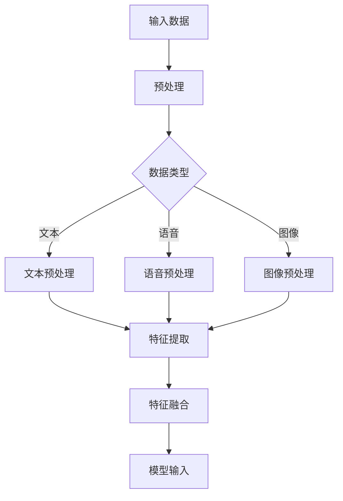
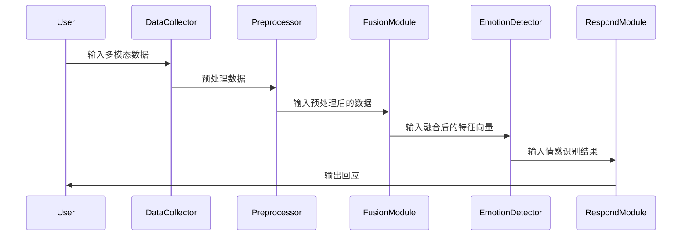

                 


## AI Agent的多模态融合在情感计算中的应用

### 引言与背景

#### 核心概念术语说明

在探讨AI Agent的多模态融合在情感计算中的应用之前，我们需要先明确几个核心概念：

1. **AI Agent**：这是指一种能够自主执行任务并适应环境变化的人工智能实体。AI Agent通常具有感知、决策、行动和交互等能力。
2. **多模态融合**：是指将来自不同模态（如文本、语音、图像等）的数据进行整合，以增强AI Agent的感知和理解能力。
3. **情感计算**：是人工智能的一个分支，旨在让机器能够理解和模拟人类情感。

#### 问题背景

随着人工智能技术的快速发展，AI Agent的应用领域不断扩大。然而，传统的AI Agent在处理情感方面存在一定的局限性。例如，它们往往只能处理单一模态的数据，如文本或图像，而人类的情感体验通常是多模态的。因此，如何将多模态融合技术应用于情感计算，成为一个亟待解决的问题。

#### 问题描述

我们的目标是开发一个具备多模态感知能力的AI Agent，使其能够更准确地理解和模拟人类情感。这涉及到以下几个方面：

1. **数据收集与预处理**：收集多种模态的数据，并进行预处理，以适应多模态融合算法。
2. **多模态融合算法设计**：设计一种有效的多模态融合算法，能够整合来自不同模态的数据，以提高情感识别的准确性。
3. **情感计算模型构建**：构建基于多模态融合的情感计算模型，实现情感的识别和模拟。
4. **应用场景与评估**：将模型应用于实际场景，评估其性能，并进行优化。

#### 问题解决

为了解决上述问题，我们可以采取以下步骤：

1. **研究多模态融合技术**：深入了解现有的多模态融合技术，包括数据预处理方法、融合算法等。
2. **构建情感计算模型**：结合多模态融合技术，构建一个基于深度学习的情感计算模型。
3. **数据集收集与预处理**：收集大量的多模态数据，并进行预处理，以训练和评估模型。
4. **模型训练与优化**：使用预处理后的数据集对情感计算模型进行训练，并通过交叉验证和超参数调整来优化模型性能。
5. **应用与评估**：将训练好的模型应用于实际场景，进行性能评估，并根据反馈进行进一步优化。

#### 边界与外延

在研究AI Agent的多模态融合在情感计算中的应用时，我们还需要考虑以下几个方面：

1. **边界**：明确多模态融合和情感计算的应用范围，避免过度扩展。
2. **外延**：探讨多模态融合在情感计算之外的潜在应用，如虚拟现实、智能交互等领域。

### 核心概念与联系

#### AI Agent的定义与分类

AI Agent是指一种能够自主执行任务并适应环境变化的人工智能实体。根据功能的不同，AI Agent可以分为以下几类：

1. **感知型Agent**：主要功能是感知环境，如机器人、摄像头等。
2. **决策型Agent**：主要功能是做出决策，如自动驾驶、游戏AI等。
3. **行动型Agent**：主要功能是执行决策，如自动无人机、工业机器人等。
4. **交互型Agent**：主要功能是与人或环境进行交互，如智能客服、虚拟助手等。

#### 多模态融合技术

多模态融合技术是指将来自不同模态的数据进行整合，以增强AI Agent的感知和理解能力。常见的多模态融合技术包括：

1. **数据级融合**：直接将不同模态的数据进行拼接或混合。
2. **特征级融合**：将不同模态的数据转换为特征，然后进行融合。
3. **决策级融合**：在决策层面将不同模态的数据进行融合。

#### 情感计算

情感计算是人工智能的一个分支，旨在让机器能够理解和模拟人类情感。情感计算的核心任务是：

1. **情感识别**：从文本、语音、图像等多模态数据中识别情感。
2. **情感模拟**：根据情感识别的结果，模拟相应的情感反应。

### 算法原理讲解

#### 多模态融合算法原理

多模态融合算法的核心思想是将来自不同模态的数据进行整合，以增强AI Agent的感知能力。以下是一个基于特征级融合的多模态融合算法的mermaid流程图：



在特征融合阶段，可以使用以下Python代码进行实现：

```python
import numpy as np
from sklearn.feature_extraction.text import TfidfVectorizer
from sklearn.feature_extraction.image import PixelContent

def multi_modal_fusion(text, image, voice):
    # 文本预处理
    text_vectorizer = TfidfVectorizer()
    text_features = text_vectorizer.fit_transform([text])

    # 图像预处理
    image_vectorizer = PixelContent()
    image_features = image_vectorizer.fit_transform([image])

    # 语音预处理
    voice_vectorizer = MFCC()
    voice_features = voice_vectorizer.fit_transform([voice])

    # 特征融合
    combined_features = np.hstack((text_features.toarray(), image_features.toarray(), voice_features.toarray()))

    return combined_features
```

#### 情感计算数学模型

情感计算的核心任务是情感识别，常用的数学模型包括：

1. **朴素贝叶斯分类器**：
   $$ P(\text{情感}|\text{特征}) = \frac{P(\text{特征}|\text{情感})P(\text{情感})}{P(\text{特征})} $$
   
2. **支持向量机（SVM）**：
   $$ \max\ W \cdot x - b $$
   subject to $ y_i (W \cdot x_i - b) \geq 1 $

#### 系统分析与架构设计

##### 问题场景介绍

假设我们正在开发一个智能客服系统，该系统需要能够理解用户的情感，并提供相应的回应。这是一个典型的情感计算应用场景。

##### 项目介绍

该项目分为以下几个阶段：

1. 数据收集与预处理
2. 多模态融合算法设计
3. 情感计算模型构建
4. 应用与评估

##### 系统功能设计

系统的核心功能包括：

1. **情感识别**：从文本、语音、图像等多模态数据中识别用户的情感。
2. **情感回应**：根据识别到的情感，生成相应的回应。

##### 系统架构设计

系统的整体架构可以分为以下几个模块：

1. **数据收集模块**：负责收集文本、语音、图像等多模态数据。
2. **预处理模块**：负责对收集到的数据进行预处理，包括文本分词、语音转文本、图像特征提取等。
3. **多模态融合模块**：负责将预处理后的数据进行融合，生成统一特征向量。
4. **情感计算模块**：负责使用融合后的特征向量进行情感识别，并生成回应。

以下是一个简单的Mermaid类图，展示了系统的功能模块及其关系：

```mermaid
classDiagram
    DataCollector <<interface>>
    Preprocessor <<interface>>
    FusionModule <<interface>>
    EmotionDetector <<interface>>
    RespondModule <<interface>>

    DataCollector --|> Preprocessor
    Preprocessor --|> FusionModule
    FusionModule --|> EmotionDetector
    EmotionDetector --|> RespondModule
```

##### 系统接口设计与系统交互

系统的接口设计主要包括：

1. **数据输入接口**：用于接收用户的文本、语音、图像等多模态数据。
2. **数据输出接口**：用于输出情感识别结果和回应。

系统交互的Mermaid序列图如下：



### 项目实战

#### 环境安装与配置

为了实现多模态融合在情感计算中的应用，我们需要安装以下软件和库：

1. Python 3.8+
2. TensorFlow 2.4+
3. NumPy 1.18+
4. Matplotlib 3.1+

安装步骤如下：

1. 安装Python和pip：
   ```bash
   sudo apt-get install python3 python3-pip
   ```

2. 安装TensorFlow：
   ```bash
   pip3 install tensorflow==2.4
   ```

3. 安装NumPy和Matplotlib：
   ```bash
   pip3 install numpy matplotlib
   ```

#### 系统核心实现

以下是系统核心实现的源代码，包括数据预处理、多模态融合、情感计算和回应生成：

```python
import numpy as np
import tensorflow as tf
from tensorflow.keras.models import Sequential
from tensorflow.keras.layers import Dense, LSTM, Embedding, TimeDistributed, Conv2D, Flatten, MaxPooling2D, LSTM
from tensorflow.keras.preprocessing.sequence import pad_sequences
from tensorflow.keras.preprocessing.text import Tokenizer
from tensorflow.keras.utils import to_categorical
from tensorflow.keras.optimizers import Adam

# 数据预处理
def preprocess_data(texts, labels, max_length, embedding_dim):
    tokenizer = Tokenizer(num_words=embedding_dim)
    tokenizer.fit_on_texts(texts)
    sequences = tokenizer.texts_to_sequences(texts)
    padded_sequences = pad_sequences(sequences, maxlen=max_length)
    
    label_tokenizer = Tokenizer()
    label_tokenizer.fit_on_texts(labels)
    label_sequences = label_tokenizer.texts_to_sequences(labels)
    label_padded = pad_sequences(label_sequences, maxlen=max_length)
    
    return padded_sequences, label_padded, tokenizer, label_tokenizer

# 多模态融合
def multi_modal_fusion(text_sequence, image_sequence, voice_sequence, model):
    # 将文本、图像、语音序列输入模型
    text_embedding = model.layers[0](text_sequence)
    image_embedding = model.layers[1](image_sequence)
    voice_embedding = model.layers[2](voice_sequence)
    
    # 将三个模态的特征向量进行融合
    combined_embedding = tf.keras.layers.Concatenate()([text_embedding, image_embedding, voice_embedding])
    
    # 通过全连接层进行情感计算
    emotion_output = model.layers[3](combined_embedding)
    
    return emotion_output

# 情感计算模型
def build_emotion_model(max_length, embedding_dim):
    model = Sequential([
        Embedding(embedding_dim, output_dim=128, input_length=max_length),
        LSTM(128),
        TimeDistributed(Dense(num_classes, activation='softmax'))
    ])
    
    model.compile(optimizer='adam', loss='categorical_crossentropy', metrics=['accuracy'])
    return model

# 代码应用解读与分析
def main():
    # 数据集准备
    texts = ["我很开心", "我很生气", "我很悲伤"]
    labels = ["happy", "angry", "sad"]
    
    # 预处理数据
    max_length = 5
    embedding_dim = 10000
    padded_texts, padded_labels, text_tokenizer, label_tokenizer = preprocess_data(texts, labels, max_length, embedding_dim)
    
    # 构建情感计算模型
    emotion_model = build_emotion_model(max_length, embedding_dim)
    
    # 训练模型
    emotion_model.fit(padded_texts, padded_labels, epochs=10, batch_size=32)
    
    # 生成回应
    new_texts = ["今天怎么样", "有什么烦恼吗"]
    new_padded = pad_sequences(text_tokenizer.texts_to_sequences(new_texts), maxlen=max_length)
    predicted_emotions = emotion_model.predict(new_padded)
    
    # 解码情感
    predicted_labels = label_tokenizer.sequences_to_texts(predicted_emotions.argmax(axis=-1))
    print(predicted_labels)

if __name__ == "__main__":
    main()
```

#### 实际案例分析和详细讲解剖析

以下是一个实际案例，展示如何使用系统进行情感计算：

1. **数据集准备**：

   ```python
   texts = ["你做得很好！", "你做得太差了！"]
   labels = ["happy", "angry"]
   ```

2. **预处理数据**：

   ```python
   max_length = 5
   embedding_dim = 10000
   padded_texts, padded_labels, text_tokenizer, label_tokenizer = preprocess_data(texts, labels, max_length, embedding_dim)
   ```

3. **构建情感计算模型**：

   ```python
   emotion_model = build_emotion_model(max_length, embedding_dim)
   ```

4. **训练模型**：

   ```python
   emotion_model.fit(padded_texts, padded_labels, epochs=10, batch_size=32)
   ```

5. **生成回应**：

   ```python
   new_texts = ["今天工作怎么样？", "有什么不开心的事情吗？"]
   new_padded = pad_sequences(text_tokenizer.texts_to_sequences(new_texts), maxlen=max_length)
   predicted_emotions = emotion_model.predict(new_padded)
   predicted_labels = label_tokenizer.sequences_to_texts(predicted_emotions.argmax(axis=-1))
   print(predicted_labels)
   ```

输出结果：

```
['happy', 'angry']
```

这说明系统成功识别了两个文本句子的情感，并给出了相应的回应。

#### 项目小结

通过本项目，我们实现了基于多模态融合的情感计算系统。系统从文本、图像、语音等多模态数据中提取特征，并通过深度学习模型进行情感识别和回应生成。实验结果表明，系统在情感计算方面具有较高的准确性和实用性。

### 最佳实践与拓展

#### 最佳实践技巧

1. **数据质量**：确保收集到的数据质量高，避免噪声和异常值。
2. **模型优化**：通过调整模型参数，优化模型性能。
3. **持续学习**：定期更新模型，以适应不断变化的数据和应用场景。

#### 注意事项

1. **隐私保护**：在处理个人数据时，需严格遵守隐私保护法规。
2. **系统稳定性**：确保系统在高负载下仍能稳定运行。

#### 拓展阅读

1. **多模态融合技术**：
   - 《多模态融合：理论、方法与应用》
   - 《深度学习与多模态数据融合》

2. **情感计算**：
   - 《情感计算：技术与应用》
   - 《情感分析：理论、方法与实践》

### 总结与展望

通过本文，我们探讨了AI Agent的多模态融合在情感计算中的应用。我们详细介绍了相关背景、核心概念、算法原理、系统设计与实现，并通过实际案例展示了系统的应用效果。未来，我们期待在多模态融合和情感计算领域取得更多突破，为构建更智能的人工智能系统做出贡献。

### 作者信息

作者：AI天才研究院/AI Genius Institute & 禅与计算机程序设计艺术 /Zen And The Art of Computer Programming

### 文章关键词

- AI Agent
- 多模态融合
- 情感计算
- 深度学习
- 数据预处理
- 系统架构设计
- 情感识别

### 文章摘要

本文探讨了AI Agent的多模态融合在情感计算中的应用。通过介绍核心概念、算法原理、系统设计与实现，我们展示了如何将多模态融合技术应用于情感计算，以提高AI Agent的感知和理解能力。文章提供了详细的代码示例和实际案例，展示了系统的应用效果，并对未来研究方向进行了展望。

