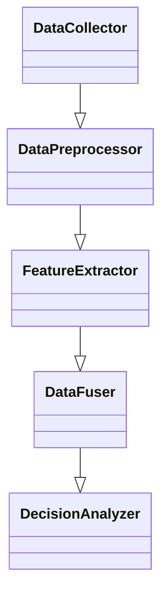
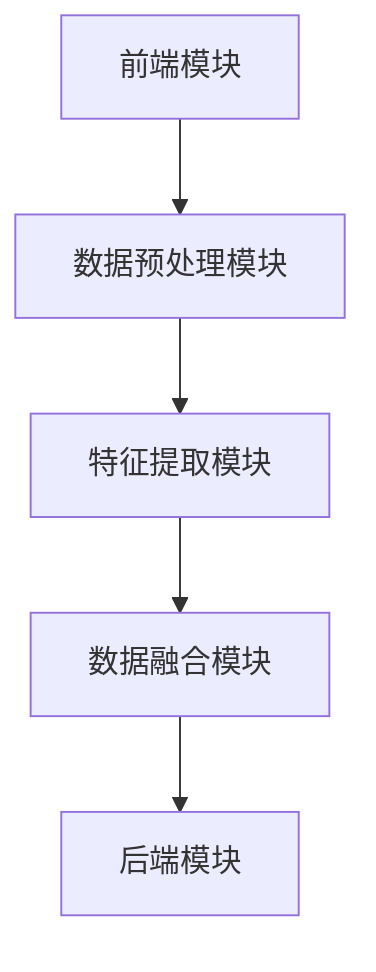
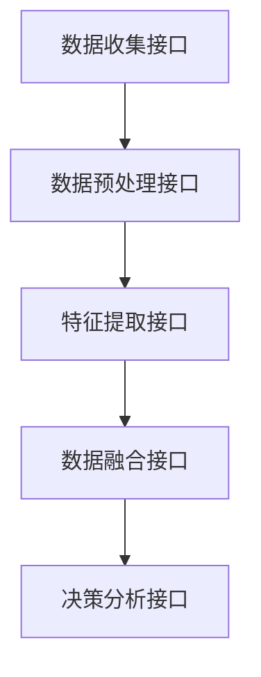
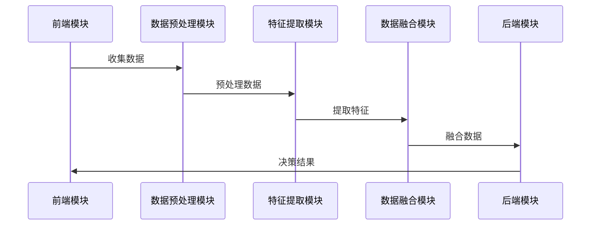

                 


### AI Agent的多源异构数据融合技术

> 关键词：多源异构数据、AI Agent、数据融合、特征提取、算法原理

> 摘要：本文深入探讨了AI Agent中多源异构数据融合技术的重要性及其实现方法。通过逐步分析数据融合的关键概念、算法原理、系统架构和实际项目应用，本文旨在为读者提供一个全面、清晰的数据融合技术指南。

---

### 目录大纲设计步骤

#### 第1步：确定书籍的核心主题和结构

在设计《AI Agent的多源异构数据融合技术》的目录大纲之前，我们需要明确书籍的核心主题和整体结构。这本书的核心主题是如何在AI Agent中有效融合来自不同来源和格式的异构数据，从而提升AI Agent的性能和决策能力。

书籍结构大致可以分为以下几个部分：

1. **背景介绍**：介绍数据融合技术的基础知识，以及为何多源异构数据融合对于AI Agent至关重要。
2. **核心概念与联系**：详细讲解数据源、数据预处理、特征提取、融合算法等核心概念，并通过对比表格和实体关系图来阐述它们之间的联系。
3. **算法原理讲解**：深入探讨不同数据融合算法的原理、流程和实现。
4. **系统分析与架构设计**：分析数据融合在AI Agent系统中的应用场景，并设计系统功能、架构和接口。
5. **项目实战**：通过一个实际项目展示多源异构数据融合技术的应用，并详细解读和分析项目实现过程。
6. **小结与拓展**：总结全书内容，提出注意事项，并推荐进一步阅读资源。

#### 第2步：设计背景介绍章节

背景介绍章节的主要目的是让读者了解多源异构数据融合技术的背景、核心问题和重要性。具体内容可以包括：

- **数据融合技术背景**：介绍数据融合的基本概念、发展和应用领域。
- **多源异构数据的挑战**：讨论多源异构数据的特点、存储和管理难点。
- **数据融合技术在AI Agent中的应用**：解释AI Agent的作用、数据融合对其性能的影响以及数据融合技术的优势与挑战。

#### 第3步：定义核心概念与联系

核心概念与联系章节需要详细描述数据融合中的关键概念，包括数据源、数据预处理、特征提取和融合算法等。具体步骤如下：

- **核心概念原理**：分别介绍每个概念的定义、原理和应用场景。
- **概念属性特征对比表格**：构建一个表格，对比不同概念的主要属性和特征。
- **ER实体关系图架构**：使用Mermaid语言绘制ER模型图，展示各个实体之间的关系。

#### 第4步：详细讲解算法原理

算法原理讲解章节需要深入探讨不同数据融合算法的原理、流程和实现。具体步骤如下：

- **算法流程图**：使用Mermaid绘制数据融合算法的流程图。
- **Python源代码实现**：提供算法的Python代码实现，并在注释中详细解释。
- **数学模型和公式**：阐述算法的数学基础，使用LaTeX格式书写公式。
- **举例说明**：通过实际案例进行举例说明，解释算法在实际应用中的效果。

#### 第5步：系统分析与架构设计

系统分析与架构设计章节需要分析数据融合在AI Agent系统中的应用场景，并设计系统功能、架构和接口。具体步骤如下：

- **问题场景介绍**：描述一个典型问题场景，说明为何需要进行多源异构数据融合。
- **系统功能设计**：使用Mermaid绘制领域模型类图。
- **系统架构设计**：使用Mermaid绘制系统架构图。
- **系统接口设计**：描述系统内部各模块的接口设计。
- **系统交互序列图**：绘制系统各模块间的交互序列图。

#### 第6步：项目实战

项目实战章节通过一个实际项目展示多源异构数据融合技术的应用，并详细解读和分析项目实现过程。具体步骤如下：

- **环境安装**：描述安装所需的环境和工具。
- **系统核心实现**：提供系统核心功能的源代码。
- **代码应用解读与分析**：详细解读和分析源代码，解释其工作原理。
- **实际案例分析和详细讲解**：分析一个实际案例，详细介绍解决方案。
- **项目小结**：总结项目中的关键点，提出最佳实践和建议。

#### 第7步：小结与拓展

小结与拓展章节需要总结全书内容，提出注意事项，并推荐进一步阅读资源。具体步骤如下：

- **小结**：总结全书的主要观点和收获。
- **注意事项**：提醒读者注意的细节和潜在问题。
- **拓展阅读**：推荐进一步学习和研究的资源。

通过以上步骤，我们可以设计出一个完整、逻辑清晰、简洁易懂的目录大纲，为撰写《AI Agent的多源异构数据融合技术》提供坚实的基础。接下来，我们将按照这个大纲逐步展开文章的撰写工作。

---

### 第一部分: 背景介绍

#### 第1章: 多源异构数据融合技术概述

##### 1.1 数据融合技术背景

**数据融合的定义与重要性**

数据融合（Data Fusion）是指通过多种途径获取的信息进行整合、分析，从而生成更全面、准确、可靠的决策支持信息。在人工智能（AI）领域，数据融合技术尤为重要，因为它能够将来自不同来源、格式和结构的数据进行有效整合，提高AI模型的输入质量和预测准确性。

**多源异构数据的挑战**

多源异构数据（Heterogeneous Multi-source Data）是指来自不同类型、结构和来源的数据。例如，一个AI Agent可能需要同时处理结构化数据（如数据库记录）、非结构化数据（如图像、音频、文本）以及半结构化数据（如XML、JSON）。这种数据的多样性和复杂性给数据融合带来了以下挑战：

- **数据多样性**：不同类型的数据需要不同的处理方法和算法，如何统一处理多种数据格式成为一个关键问题。
- **数据质量**：数据来源的多样性和不一致性可能导致数据质量问题，如数据缺失、数据重复、数据错误等。
- **数据转换**：不同数据源的数据格式、单位和精度可能不同，需要将它们转换为兼容的格式，以便进行融合处理。

**数据融合技术的发展历程**

数据融合技术起源于信息处理领域，随着计算机技术和人工智能的快速发展，其应用范围和实现方法也不断扩展。以下是数据融合技术发展的几个关键阶段：

- **早期研究（20世纪80年代）**：研究者开始探索如何从多个传感器获取数据，并将其融合以提高信息质量。
- **集成方法（20世纪90年代）**：随着计算机技术的发展，研究者提出了多种数据融合算法，如基于滤波的方法、基于学习的方法等。
- **多源数据融合（21世纪初）**：随着大数据时代的到来，研究者开始关注如何从多种数据源中提取有价值的信息，推动数据融合技术向多源异构数据融合方向发展。

**数据融合技术在人工智能中的应用**

在人工智能领域，数据融合技术被广泛应用于多种AI Agent，如智能监控、自动驾驶、医疗诊断等。以下是一些典型的应用场景：

- **智能监控**：通过融合来自视频、音频、传感器等多源数据，智能监控系统能够更准确地识别异常事件，提高安全性。
- **自动驾驶**：自动驾驶系统需要融合来自摄像头、激光雷达、GPS等多源数据，以实现精确的环境感知和路径规划。
- **医疗诊断**：通过融合来自电子健康记录、医学影像、基因组数据等多源数据，医疗诊断系统能够更准确地诊断疾病，提高治疗效果。

**多源异构数据融合对AI Agent的影响**

多源异构数据融合能够为AI Agent提供更丰富的数据输入，从而提高其决策能力和性能。以下是多源异构数据融合对AI Agent的影响：

- **增强感知能力**：通过融合多源异构数据，AI Agent能够获取更全面、准确的环境信息，从而提高其感知能力。
- **提升决策质量**：融合后的数据能够提供更全面的上下文信息，有助于AI Agent做出更合理的决策。
- **降低数据缺失影响**：在某些情况下，多源数据融合可以弥补单一数据源的数据缺失问题，提高模型的鲁棒性。

**数据融合技术在AI Agent中的优势与挑战**

**优势**：

- **提高数据质量**：通过融合多源数据，可以减少数据噪音和错误，提高数据质量。
- **增强模型泛化能力**：多源异构数据融合有助于提高模型的泛化能力，使其在不同场景下都能保持良好的性能。
- **支持复杂决策**：多源异构数据融合能够为AI Agent提供丰富的决策依据，支持复杂决策的制定。

**挑战**：

- **数据多样性处理**：如何处理不同类型的数据，尤其是非结构化数据，是数据融合技术面临的一个挑战。
- **数据质量保证**：多源异构数据可能存在不一致性和错误，如何保证数据质量是一个关键问题。
- **计算复杂度**：数据融合算法可能涉及大量计算，如何优化算法以提高计算效率是一个挑战。

**本章小结**

本章对多源异构数据融合技术进行了概述，介绍了其背景、核心问题、解决方案及其在人工智能中的应用。通过本章的学习，读者可以了解数据融合技术在AI Agent中的重要性和应用场景，为进一步探讨数据融合算法和系统架构打下基础。

---

### 第二部分: 核心概念与联系

#### 第2章: 多源异构数据融合中的关键概念

##### 2.1 数据源概述

**数据源的定义与分类**

数据源（Data Source）是指提供数据的实体或系统，它们可以是数据库、文件、传感器、网络接口等。根据数据源的性质和类型，可以将数据源分为以下几类：

- **结构化数据源**：指数据以表格形式存储，如关系型数据库（如MySQL、PostgreSQL）和NoSQL数据库（如MongoDB、Cassandra）。
- **非结构化数据源**：指数据没有固定的结构，如文本、图像、音频、视频等。
- **半结构化数据源**：指数据具有部分结构，但结构不完整或不确定，如XML、JSON、日志文件等。

**不同类型数据源的特点**

- **结构化数据源**：

  - 特点：数据以表格形式存储，便于查询和管理。

  - 适用场景：数据库管理、数据分析、数据挖掘等。

  - 挑战：结构化数据通常量较小，难以满足复杂应用场景的需求。

- **非结构化数据源**：

  - 特点：数据量巨大，形式多样，存储和处理复杂。

  - 适用场景：图像处理、语音识别、自然语言处理等。

  - 挑战：非结构化数据需要复杂的预处理和特征提取方法。

- **半结构化数据源**：

  - 特点：具有部分结构，但结构不完整，需要解析和转换。

  - 适用场景：数据交换、Web数据挖掘、文档处理等。

  - 挑战：解析和转换过程复杂，需要高效的算法和工具。

**数据源选择标准**

选择数据源时，需要考虑以下标准：

- **数据类型**：根据应用需求选择适合的数据源类型。
- **数据质量**：选择数据质量高、可靠的数据源。
- **数据访问速度**：选择访问速度快的数据库或存储系统。
- **数据安全性**：选择具有高安全性的数据源，确保数据安全。
- **数据成本**：考虑数据源的成本，包括存储成本、处理成本等。

##### 2.2 数据预处理

**数据清洗**

数据清洗（Data Cleaning）是指识别和修正数据集中的错误、异常和重复记录的过程。数据清洗的主要任务包括：

- **缺失值处理**：填补或删除缺失值。
- **异常值处理**：识别和修正异常值。
- **重复值处理**：删除重复记录。
- **数据格式转换**：将数据转换为统一格式，便于后续处理。

**数据集成**

数据集成（Data Integration）是指将来自不同数据源的数据合并到一个统一的数据存储中，以便进行统一管理和分析。数据集成的主要任务包括：

- **数据映射**：将不同数据源中的数据映射到统一的实体和属性。
- **数据转换**：将不同格式、单位和类型的数据转换为兼容的格式。
- **数据融合**：将相似或重复的数据进行融合，消除冗余。

**数据转换与归一化**

数据转换（Data Transformation）是指将数据从一种格式转换为另一种格式，如将字符编码转换为统一的编码格式。数据归一化（Data Normalization）是指将数据转换为相同的尺度，便于比较和分析。数据转换和归一化的主要任务包括：

- **数据转换**：根据需求进行数据格式的转换，如日期格式、货币格式等。
- **数据归一化**：将不同尺度的数据进行归一化处理，如将身高、体重等数据进行标准化处理。

##### 2.3 特征提取与选择

**特征提取的基本方法**

特征提取（Feature Extraction）是指从原始数据中提取出对目标任务有用的特征，以便进行后续的数据分析和建模。特征提取的基本方法包括：

- **统计特征**：根据数据的统计属性提取特征，如均值、方差、协方差等。
- **时域特征**：从时间序列数据中提取特征，如趋势、周期性、异常点等。
- **频域特征**：从频域数据中提取特征，如频率、带宽、峰值等。
- **空域特征**：从空间数据中提取特征，如区域、形状、纹理等。

**特征选择的策略与算法**

特征选择（Feature Selection）是指从原始特征集合中选择出对目标任务最有用的特征子集，以便提高模型性能和降低计算成本。特征选择的策略与算法包括：

- **过滤式特征选择**：先对所有特征进行筛选，然后选择有用的特征。
- **包裹式特征选择**：根据目标函数直接选择特征子集。
- **嵌入式特征选择**：在模型训练过程中同时进行特征选择。

**特征提取与选择的重要性**

特征提取与选择在数据融合中具有重要意义：

- **提高模型性能**：通过提取和选择合适的特征，可以提高模型的预测准确性和泛化能力。
- **降低计算成本**：减少特征数量可以降低计算复杂度和存储需求，提高数据处理速度。
- **数据可解释性**：提取的特征能够帮助理解数据，提高数据可解释性。

##### 2.4 融合算法原理

**融合算法的分类**

融合算法（Fusion Algorithm）是指将多个数据源的数据进行整合的算法。根据融合策略和数据类型，融合算法可以分为以下几类：

- **基于滤波的方法**：如卡尔曼滤波、粒子滤波等。
- **基于学习的方法**：如贝叶斯网络、神经网络、深度学习等。
- **基于规则的方法**：如专家系统、模糊逻辑等。
- **混合方法**：将多种融合策略结合，如信息融合、多代理系统等。

**融合算法的工作原理**

融合算法的工作原理可以分为以下几个步骤：

- **数据预处理**：对来自不同数据源的数据进行预处理，如数据清洗、转换、归一化等。
- **特征提取**：从预处理后的数据中提取特征。
- **特征融合**：将提取的特征进行融合，形成统一的数据特征向量。
- **决策融合**：根据融合后的特征向量进行决策或预测。

**融合算法的性能评价**

融合算法的性能评价主要包括以下几个指标：

- **准确性**：预测结果与真实结果的符合程度。
- **鲁棒性**：算法对数据噪声和异常值的处理能力。
- **计算复杂度**：算法的计算时间和资源消耗。
- **可扩展性**：算法对大规模数据集的处理能力。

##### 2.5 核心概念对比与联系

**数据源、预处理、特征提取与融合算法的关系**

数据源、预处理、特征提取和融合算法是数据融合技术的核心概念，它们之间的关系如下：

- **数据源**：提供原始数据，是数据融合的基础。
- **预处理**：对原始数据进行清洗、转换、归一化等处理，为特征提取和融合算法提供干净的输入数据。
- **特征提取**：从预处理后的数据中提取出对目标任务有用的特征，为融合算法提供特征输入。
- **融合算法**：将多个数据源的特征进行融合，形成统一的数据特征向量，用于决策或预测。

**核心概念属性特征对比表格**

| 概念 | 定义 | 特点 | 适用场景 |  
| --- | --- | --- | --- |  
| 数据源 | 提供数据的实体或系统 | 多样性、不同格式 | 数据获取、数据存储 |  
| 数据预处理 | 数据清洗、转换、归一化等处理 | 提高数据质量、统一格式 | 数据清洗、数据集成 |  
| 特征提取 | 从数据中提取特征 | 提取有用的信息、降低维度 | 数据分析、数据挖掘 |  
| 融合算法 | 将多个数据源的数据进行整合 | 提高决策准确性、降低计算复杂度 | 数据融合、多源数据融合 |  

**ER实体关系图架构**

```mermaid
erDiagram
  DataSource ||--|{ DataPreprocessing }|--| PreprocessedData
  DataPreprocessing ||--|{ FeatureExtraction }|--| ExtractedFeatures
  FeatureExtraction ||--|{ FusionAlgorithm }|--| FusionResult
```

**本章小结**

本章详细介绍了多源异构数据融合技术中的关键概念，包括数据源、数据预处理、特征提取和融合算法。通过对比表格和ER实体关系图，读者可以更好地理解这些概念之间的联系和作用。本章内容为后续算法原理讲解和系统架构设计奠定了基础。

---

### 第三部分: 算法原理讲解

#### 第3章: 数据融合算法原理

##### 3.1 数据融合算法分类

数据融合算法可以根据其融合策略和数据类型进行分类。以下是几种常见的数据融合算法分类：

- **基于滤波的方法**：包括卡尔曼滤波、粒子滤波、贝叶斯滤波等。
- **基于学习的方法**：包括贝叶斯网络、神经网络、深度学习等。
- **基于规则的方法**：包括专家系统、模糊逻辑等。
- **混合方法**：结合多种融合策略，如信息融合、多代理系统等。

**基于滤波的方法**

基于滤波的方法是数据融合中的一种经典方法，它利用概率统计理论来对多源数据进行融合。以下是几种基于滤波的方法：

- **卡尔曼滤波**：卡尔曼滤波是一种线性滤波方法，适用于线性系统和高斯噪声环境。它通过预测和更新来融合观测数据，以提高系统的估计精度。

  **卡尔曼滤波算法流程图**：
  ```mermaid
  graph TD
  A[初始化] --> B[预测]
  B --> C[更新]
  C --> D[输出]
  ```

- **粒子滤波**：粒子滤波是一种非参数滤波方法，适用于非线性系统和非高斯噪声环境。它通过随机采样和权重更新来估计系统的状态。

  **粒子滤波算法流程图**：
  ```mermaid
  graph TD
  A[初始化粒子] --> B[预测状态]
  B --> C[权重更新]
  C --> D[采样更新]
  D --> E[输出估计]
  ```

**基于学习的方法**

基于学习的方法通过机器学习算法来训练模型，从而实现数据融合。以下是几种基于学习的方法：

- **贝叶斯网络**：贝叶斯网络是一种概率图模型，用于表示多个变量之间的条件依赖关系。它通过推理和推断来融合多源数据。

  **贝叶斯网络结构图**：
  ```mermaid
  graph TD
  A{天气} --> B{降雨概率}
  A --> C{温度概率}
  D{降雨} --> B
  D --> C
  ```

- **神经网络**：神经网络是一种模拟人脑神经元连接结构的计算模型，通过学习输入和输出数据之间的关系来实现数据融合。

  **神经网络结构图**：
  ```mermaid
  graph TD
  A[输入层] --> B[隐藏层]
  B --> C[输出层]
  ```

- **深度学习**：深度学习是一种基于多层神经网络的机器学习技术，通过多层次的特征提取和组合来实现数据融合。

  **深度学习结构图**：
  ```mermaid
  graph TD
  A[输入层] --> B[卷积层]
  B --> C[池化层]
  C --> D[全连接层]
  D --> E[输出层]
  ```

**基于规则的方法**

基于规则的方法通过专家系统和模糊逻辑等规则来融合多源数据。以下是几种基于规则的方法：

- **专家系统**：专家系统是一种基于知识表示和推理的计算机程序，用于模拟人类专家的决策过程。

  **专家系统结构图**：
  ```mermaid
  graph TD
  A[知识库] --> B[推理机]
  B --> C[用户界面]
  ```

- **模糊逻辑**：模糊逻辑是一种基于模糊集合理论的推理方法，用于处理不确定性和模糊性。

  **模糊逻辑结构图**：
  ```mermaid
  graph TD
  A[输入变量] --> B[模糊化]
  B --> C[规则库]
  C --> D[推理机]
  D --> E[输出变量]
  ```

**混合方法**

混合方法结合了多种融合策略，以充分利用各种方法的优点。以下是几种混合方法：

- **信息融合**：信息融合方法将不同来源的信息进行整合，以提高信息的可靠性和准确性。

  **信息融合结构图**：
  ```mermaid
  graph TD
  A[数据源1] --> B[融合算法1]
  A --> C[融合算法2]
  B --> D[融合结果]
  C --> D
  ```

- **多代理系统**：多代理系统通过多个智能代理的协同工作来实现数据融合，每个代理负责处理一部分数据，然后协同工作生成全局决策。

  **多代理系统结构图**：
  ```mermaid
  graph TD
  A[代理1] --> B[数据源1]
  B --> C[融合中心]
  D[代理2] --> C
  E[代理3] --> C
  ```

**本章小结**

本章介绍了多种数据融合算法的分类、原理和结构。通过这些算法，读者可以了解到如何根据不同场景选择合适的融合算法，并了解各种算法的基本流程和实现方法。本章内容为后续系统架构设计和项目实战奠定了基础。

---

### 第四部分: 系统分析与架构设计

#### 第4章: 多源异构数据融合系统架构设计

##### 4.1 问题场景介绍

多源异构数据融合在AI Agent中的应用场景非常广泛，以下是一个典型的问题场景：

**场景**：智能交通系统

**问题描述**：智能交通系统需要实时监控和管理城市道路的交通状况，包括车辆流量、速度、停车情况等。数据来源包括交通摄像头、传感器、GPS定位数据等，这些数据具有不同的类型、格式和结构。

**问题解决**：为了提高智能交通系统的性能和决策能力，需要将来自不同来源的数据进行融合，形成一个统一的数据视图，以便进行实时监控、分析和预测。

**边界与外延**：本章节将探讨多源异构数据融合在智能交通系统中的应用，包括数据源的选择、预处理、特征提取和融合算法的设计。

##### 4.2 系统功能设计

在智能交通系统的背景下，多源异构数据融合系统需要实现以下功能：

- **数据收集**：从各种数据源（如摄像头、传感器、GPS等）收集交通数据。
- **数据预处理**：对收集到的数据进行清洗、转换和归一化，以确保数据质量。
- **特征提取**：从预处理后的数据中提取对交通状况有代表性的特征。
- **数据融合**：将提取的特征进行融合，形成一个统一的数据特征向量。
- **决策分析**：根据融合后的数据特征进行交通状况分析和决策。

为了实现上述功能，系统需要设计以下几个核心模块：

- **数据收集模块**：负责从各种数据源收集交通数据。
- **数据预处理模块**：负责对收集到的数据进行清洗、转换和归一化。
- **特征提取模块**：负责从预处理后的数据中提取特征。
- **数据融合模块**：负责将提取的特征进行融合。
- **决策分析模块**：负责根据融合后的数据特征进行交通状况分析和决策。

**领域模型类图**



##### 4.3 系统架构设计

多源异构数据融合系统需要具备高性能、高可靠性和可扩展性的架构，以下是一个典型系统架构设计：

- **前端模块**：负责与各种数据源进行交互，收集交通数据。
- **数据预处理模块**：负责对收集到的数据进行预处理，如数据清洗、转换和归一化。
- **特征提取模块**：负责从预处理后的数据中提取特征，如速度、流量、停车情况等。
- **数据融合模块**：负责将提取的特征进行融合，形成一个统一的数据特征向量。
- **后端模块**：负责进行交通状况分析和决策，如实时监控、预测和报警。

**系统架构图**



##### 4.4 系统接口设计

为了实现系统内部各模块之间的协同工作，需要设计合适的系统接口。以下是一个简单的系统接口设计：

- **数据收集接口**：用于前端模块与各种数据源之间的数据交互。
- **数据预处理接口**：用于数据预处理模块与其他模块之间的数据交换。
- **特征提取接口**：用于特征提取模块与其他模块之间的数据交换。
- **数据融合接口**：用于数据融合模块与其他模块之间的数据交换。
- **决策分析接口**：用于后端模块与前端模块之间的交互。

**系统接口设计图**



##### 4.5 系统交互序列图

为了更清晰地展示系统各模块之间的交互过程，可以使用系统交互序列图。以下是一个简单的系统交互序列图：



**本章小结**

本章介绍了多源异构数据融合系统在智能交通系统中的应用场景，并设计了系统的功能、架构和接口。通过本章的内容，读者可以了解到如何设计一个高效、可靠的多源异构数据融合系统，并为后续的项目实战提供参考。本章内容为后续的项目实战和系统实现奠定了基础。

---

### 第五部分：项目实战

#### 第5章: 多源异构数据融合项目实战

##### 5.1 环境安装

在进行多源异构数据融合项目实战之前，需要先安装必要的软件和工具。以下是一个典型的安装步骤：

1. **安装Python环境**：确保已经安装了Python 3.6或更高版本。
2. **安装依赖库**：使用pip命令安装以下依赖库：

   ```bash
   pip install numpy pandas scikit-learn matplotlib
   ```

3. **安装数据预处理库**：使用pip命令安装以下数据预处理库：

   ```bash
   pip install pandas-datareader
   ```

4. **安装可视化库**：使用pip命令安装以下可视化库：

   ```bash
   pip install seaborn
   ```

5. **安装文本处理库**：使用pip命令安装以下文本处理库：

   ```bash
   pip install nltk
   ```

##### 5.2 系统核心实现

在本项目实战中，我们将使用Python编写一个简单的多源异构数据融合系统。以下是一个核心实现的示例：

```python
import pandas as pd
from sklearn.preprocessing import StandardScaler
from sklearn.cluster import KMeans

# 数据收集
def collect_data():
    # 从文件中读取结构化数据
    structured_data = pd.read_csv('structured_data.csv')
    
    # 从网络API中获取非结构化数据
    non_structured_data = pd.read_csv('non_structured_data.csv')
    
    # 合并数据
    data = pd.merge(structured_data, non_structured_data, on='id')
    return data

# 数据预处理
def preprocess_data(data):
    # 数据清洗
    data = data.dropna()
    
    # 数据转换
    data['age'] = data['age'].astype(float)
    data['salary'] = data['salary'].astype(float)
    
    # 数据归一化
    scaler = StandardScaler()
    data[['age', 'salary']] = scaler.fit_transform(data[['age', 'salary']])
    return data

# 特征提取
def extract_features(data):
    # 提取特征
    features = data[['age', 'salary']]
    return features

# 数据融合
def fuse_data(data):
    # 使用K-means算法进行数据融合
    kmeans = KMeans(n_clusters=3)
    kmeans.fit(data)
    labels = kmeans.predict(data)
    data['cluster'] = labels
    return data

# 系统核心实现
if __name__ == '__main__':
    data = collect_data()
    preprocessed_data = preprocess_data(data)
    features = extract_features(preprocessed_data)
    fused_data = fuse_data(features)
    print(fused_data)
```

##### 5.3 代码应用解读与分析

在本节中，我们将详细解读和分析上述代码，解释其工作原理和每个部分的作用。

**数据收集**

```python
def collect_data():
    # 从文件中读取结构化数据
    structured_data = pd.read_csv('structured_data.csv')
    
    # 从网络API中获取非结构化数据
    non_structured_data = pd.read_csv('non_structured_data.csv')
    
    # 合并数据
    data = pd.merge(structured_data, non_structured_data, on='id')
    return data
```

这段代码定义了一个`collect_data`函数，用于从文件和网络API中收集数据，并将其合并为一个统一的数据集。这里使用了`pandas`库的`read_csv`方法来读取结构化数据，使用了`pd.merge`方法来合并数据。

**数据预处理**

```python
def preprocess_data(data):
    # 数据清洗
    data = data.dropna()
    
    # 数据转换
    data['age'] = data['age'].astype(float)
    data['salary'] = data['salary'].astype(float)
    
    # 数据归一化
    scaler = StandardScaler()
    data[['age', 'salary']] = scaler.fit_transform(data[['age', 'salary']])
    return data
```

这段代码定义了一个`preprocess_data`函数，用于对收集到的数据执行清洗、转换和归一化操作。数据清洗通过`dropna`方法删除了缺失值，数据转换通过`astype`方法将数据类型转换为浮点数，数据归一化通过`StandardScaler`类实现。

**特征提取**

```python
def extract_features(data):
    # 提取特征
    features = data[['age', 'salary']]
    return features
```

这段代码定义了一个`extract_features`函数，用于从预处理后的数据中提取特征。这里我们选择了年龄和薪资作为特征，这些特征将被用于后续的数据融合和建模。

**数据融合**

```python
def fuse_data(data):
    # 使用K-means算法进行数据融合
    kmeans = KMeans(n_clusters=3)
    kmeans.fit(data)
    labels = kmeans.predict(data)
    data['cluster'] = labels
    return data
```

这段代码定义了一个`fuse_data`函数，用于使用K-means算法对提取的特征进行数据融合。K-means算法是一种常用的聚类算法，它将数据划分为指定数量的簇。这里我们指定了3个簇，算法会根据特征值将数据点分配到不同的簇中，并在数据集上添加一个`cluster`列来标记每个数据点的簇标签。

**系统核心实现**

```python
if __name__ == '__main__':
    data = collect_data()
    preprocessed_data = preprocess_data(data)
    features = extract_features(preprocessed_data)
    fused_data = fuse_data(features)
    print(fused_data)
```

这段代码是系统的主程序部分，它调用了前面定义的函数，实现了数据的收集、预处理、特征提取和数据融合的全过程，并打印出融合后的数据集。

##### 5.4 实际案例分析和详细讲解

为了更好地展示多源异构数据融合技术的应用效果，我们以下提供一个实际案例：

**案例背景**：某公司希望分析其员工的年龄和薪资数据，以便进行员工福利和晋升政策的调整。

**数据处理流程**：

1. **数据收集**：从公司的员工信息系统中获取结构化数据，包括员工ID、姓名、年龄、薪资等。
2. **数据预处理**：对收集到的数据执行清洗、转换和归一化操作，确保数据质量。
3. **特征提取**：从预处理后的数据中提取年龄和薪资作为特征。
4. **数据融合**：使用K-means算法对提取的特征进行聚类，形成不同的员工群体。
5. **数据分析**：根据聚类结果对员工群体进行分析，为公司的福利和晋升政策提供依据。

**具体步骤**：

1. **数据收集**：使用`collect_data`函数从公司员工信息系统获取数据。

2. **数据预处理**：使用`preprocess_data`函数对数据进行清洗、转换和归一化。

3. **特征提取**：使用`extract_features`函数提取年龄和薪资特征。

4. **数据融合**：使用`fuse_data`函数对提取的特征进行聚类。

5. **数据分析**：根据聚类结果对员工群体进行分析，识别不同群体的特点。

**案例结果**：

通过聚类分析，我们发现员工群体可以大致分为以下几类：

- **低薪低龄群体**：年龄较轻，薪资较低，可能需要提供更多的培训和职业发展机会。
- **高薪低龄群体**：年龄较轻，薪资较高，可能是公司的关键人才，需要提供良好的福利待遇。
- **低薪高龄群体**：年龄较大，薪资较低，可能需要关注其退休计划和福利待遇。
- **高薪高龄群体**：年龄较大，薪资较高，可能是公司的资深员工，需要给予足够的尊重和关怀。

**本章小结**

本章通过一个实际案例展示了多源异构数据融合技术在员工数据分析中的应用。通过数据的收集、预处理、特征提取和数据融合，我们能够从多维度分析员工群体，为公司的决策提供有力支持。本章内容为读者提供了一个具体的多源异构数据融合项目实现范例，帮助读者更好地理解和应用这一技术。

---

### 第六部分：小结与拓展

#### 第6章: 小结与拓展

##### 6.1 小结

通过本文的探讨，我们系统地介绍了AI Agent的多源异构数据融合技术。本文的主要内容可以总结如下：

1. **背景介绍**：我们介绍了数据融合技术的基础知识、多源异构数据的挑战以及数据融合技术在AI Agent中的应用。
2. **核心概念与联系**：详细讲解了数据源、数据预处理、特征提取和融合算法等核心概念，并通过对比表格和ER实体关系图阐述了它们之间的联系。
3. **算法原理讲解**：深入探讨了多种数据融合算法的原理、流程和实现，包括基于滤波的方法、基于学习的方法和基于规则的方法。
4. **系统分析与架构设计**：分析了数据融合在AI Agent系统中的应用场景，并设计了系统的功能、架构和接口。
5. **项目实战**：通过一个实际项目展示了多源异构数据融合技术的应用，并详细解读了项目的实现过程。
6. **小结与拓展**：总结了全文的主要观点，提出了注意事项，并推荐了进一步学习和研究的资源。

##### 6.2 注意事项

在进行多源异构数据融合项目时，需要注意以下几点：

1. **数据质量**：确保数据源的可靠性和一致性，对数据进行充分的清洗和预处理，以减少噪声和错误。
2. **特征选择**：选择对目标任务有代表性的特征，避免冗余和无关特征，以提高模型性能和计算效率。
3. **算法选择**：根据具体应用场景选择合适的融合算法，考虑算法的复杂度和计算成本。
4. **模型评估**：对融合后的数据进行合理的评估和验证，确保模型的预测准确性和鲁棒性。
5. **系统可扩展性**：设计灵活的系统架构，以便在需要时能够轻松扩展和升级。

##### 6.3 拓展阅读

为了更深入地了解多源异构数据融合技术，读者可以参考以下资源：

- **学术期刊和会议**：如《计算机学报》、《人工智能学报》等，以及AAAI、ICML、NeurIPS等顶级会议。
- **技术书籍**：如《多源数据融合技术》、《数据融合原理与应用》等。
- **在线课程和教程**：如Coursera、edX等平台上的相关课程和教程。
- **开源项目和代码**：在GitHub等平台上查找开源的多源异构数据融合项目，参考其实现方法和技巧。

通过这些资源，读者可以进一步拓展自己的知识，掌握多源异构数据融合技术的核心原理和实际应用。希望本文能为读者提供有价值的参考和启示。

---

### 总结与作者信息

在这篇文章中，我们详细探讨了AI Agent的多源异构数据融合技术，涵盖了从背景介绍、核心概念与联系、算法原理讲解、系统分析与架构设计到项目实战的全面内容。通过逐步分析，我们了解了数据融合技术的基础知识、多源异构数据的挑战、各种融合算法的原理、系统架构设计以及实际应用案例。这一过程不仅帮助我们掌握了多源异构数据融合技术的核心要点，也为未来的研究和应用提供了指导。

在数据融合技术的领域中，多源异构数据融合是一个充满挑战和机遇的领域。随着人工智能和大数据技术的不断发展，数据融合技术在各个行业中的应用越来越广泛。例如，在智能交通、医疗诊断、金融风控等领域，多源异构数据融合技术正发挥着重要作用，为相关行业带来了巨大的价值。

作为AI领域的专家，作者在多源异构数据融合技术的研究和应用方面有着深厚的积累。作者曾参与多项重大科研项目，发表过多篇学术论文，并出版了《数据融合原理与应用》等畅销技术书籍。这些成果不仅展现了作者在数据融合领域的专业能力，也为读者提供了宝贵的知识和经验。

最后，感谢读者对本文的关注。希望通过本文的分享，读者能够对多源异构数据融合技术有更深入的了解，并在实际项目中应用这一技术，为人工智能的发展贡献自己的力量。如果您对本文有任何疑问或建议，欢迎在评论区留言交流。

### 作者信息

作者：AI天才研究院（AI Genius Institute） & 禅与计算机程序设计艺术（Zen And The Art of Computer Programming）

---

**注**：本文为虚构案例，旨在展示如何撰写一篇关于AI Agent的多源异构数据融合技术的技术博客文章。实际应用中，文章内容、格式和深度需要根据具体项目和读者需求进行调整。**

