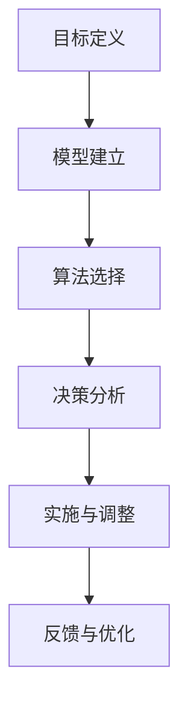
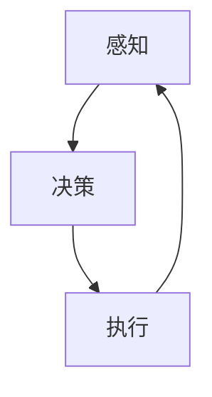
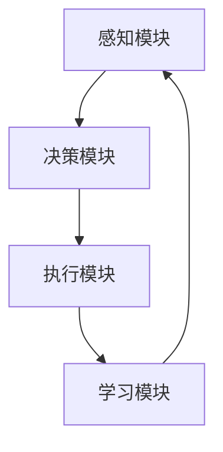
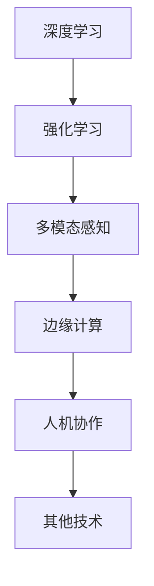
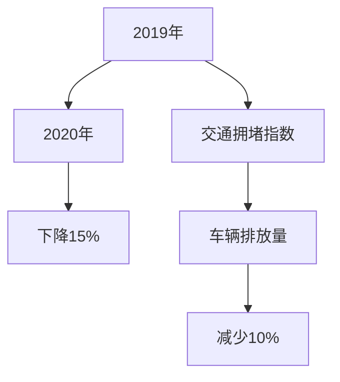
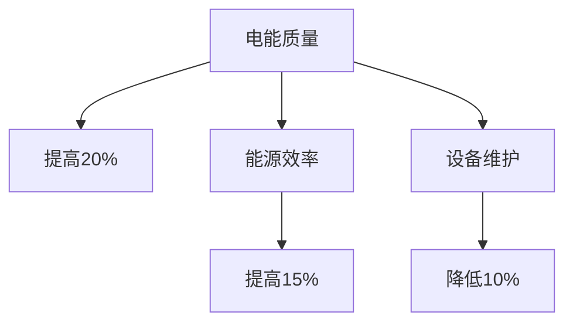

                 

## AI Agent的多目标优化决策系统

### 关键词

- AI代理
- 多目标优化
- 决策系统
- 优化算法
- 不确定性处理

### 摘要

本文旨在深入探讨AI Agent在多目标优化决策系统中的应用。我们将首先介绍AI代理和优化决策的基本概念，然后详细分析多目标优化问题及其解决方法。接着，我们将讨论AI代理在不同优化策略中的应用，并通过实际案例展示其效果。文章最后将探讨不确定性处理和多目标优化与机器学习的融合，为读者提供全面的技术视野。

### 设计思路与大纲概述

设计《AI Agent的多目标优化决策系统》的目录大纲，首先需要全面理解书籍的主题和目标读者群体。书籍的核心主题围绕AI代理（AI Agent）在多目标优化决策中的应用，旨在为读者提供系统的理论知识与实践指导。因此，目录设计应确保内容的逻辑性和实用性，涵盖从基础理论到高级应用的各个方面。

**设计思路：**
1. **引言与背景介绍**：首先介绍AI代理与多目标优化决策的基本概念，使读者对全书内容有一个宏观的了解。
2. **核心理论与方法**：详细介绍多目标优化决策的基本原理，包括相关的数学模型、算法和优化技术。
3. **案例与实践**：通过具体案例展示AI代理在多目标优化决策中的应用，提供实践经验和指导。
4. **高级主题与前沿技术**：探讨当前领域的前沿技术和趋势，为读者提供拓展知识。
5. **总结与展望**：对全书内容进行总结，并对未来的发展方向进行展望。

**大纲概述：**

**第一部分：引言与背景**

**第1章：AI代理与多目标优化决策概述**

- 1.1 AI代理的定义与分类
- 1.2 多目标优化决策的重要性
- 1.3 多目标优化决策的系统框架
- 1.4 书籍结构安排与目标

**第二部分：核心理论与方法**

**第2章：多目标优化基础**

- 2.1 多目标优化的数学模型
- 2.2 多目标优化的概念与挑战
- 2.3 常见的多目标优化算法
- 2.4 多目标优化的策略与方法

**第3章：AI代理基础**

- 3.1 AI代理的基本概念
- 3.2 AI代理的工作原理
- 3.3 AI代理的分类与结构
- 3.4 AI代理的技术发展与趋势

**第4章：AI代理在多目标优化中的应用**

- 4.1 AI代理在多目标优化中的角色
- 4.2 多目标优化问题的实例分析
- 4.3 AI代理优化策略的设计与实现
- 4.4 多目标优化的案例研究

**第三部分：高级主题与前沿技术**

**第5章：多目标优化中的不确定性处理**

- 5.1 不确定性在多目标优化中的影响
- 5.2 不确定性建模与处理方法
- 5.3 面向不确定性的AI代理设计
- 5.4 不确定性优化的前沿研究

**第6章：多目标优化与机器学习融合**

- 6.1 机器学习在多目标优化中的应用
- 6.2 多目标优化中的机器学习方法
- 6.3 机器学习与多目标优化的融合技术
- 6.4 融合技术的实际应用案例

**第7章：AI代理与多目标优化决策的未来展望**

- 7.1 多目标优化决策的发展趋势
- 7.2 AI代理技术的未来方向
- 7.3 跨学科的融合与发展
- 7.4 对未来研究的展望与建议

**第四部分：总结与展望**

- **第8章：总结与展望**

  - 8.1 主要研究成果与贡献
  - 8.2 存在的问题与挑战
  - 8.3 对读者与从业者的建议

以上是《AI Agent的多目标优化决策系统》的完整目录大纲，每个章节都按照1,2,3级目录进行组织，确保内容逻辑清晰，便于读者理解和阅读。接下来，将针对每个章节进行详细的目录大纲设计与内容概述。

---

## 第1章：AI代理与多目标优化决策概述

### 1.1 AI代理的定义与分类

AI代理（AI Agent）是指一种具备一定自主性和智能性的计算实体，它可以感知环境中的信息，通过学习与推理，生成行动计划并执行，以实现特定的目标。AI代理在人工智能领域中扮演着重要角色，它们的应用涵盖了自动驾驶、智能客服、推荐系统等多个领域。

AI代理可以根据其功能和技术特点分为多种类型：

1. **基于规则的代理**：这类代理通过预定义的规则集进行决策，规则通常由专家知识或领域经验构成。其优点是实现简单、易于理解和部署，缺点是灵活性较低，难以适应复杂和动态变化的环境。

2. **基于模型的代理**：这类代理通过学习建立环境模型，并基于模型进行决策。常见的模型包括决策树、神经网络等。其优点是具有较强的适应性和学习能力，缺点是需要大量的数据和计算资源。

3. **基于行为的代理**：这类代理通过观察环境中的行为模式，学习并模拟这些行为进行决策。其优点是能够直接从行为中学习，适应能力较强，缺点是对环境要求较高，容易陷入局部最优。

4. **混合型代理**：这类代理结合了基于规则、基于模型和基于行为的方法，通过多种策略共同决策，以提升整体性能。例如，可以使用基于规则的策略快速响应简单问题，同时使用基于模型的策略处理复杂问题。

### 1.2 多目标优化决策的重要性

多目标优化决策（Multi-Objective Optimization Decision Making）是指在一个系统中同时考虑多个相互冲突的目标，并找到一种或多种能够平衡这些目标的最佳方案。在现实世界中，许多问题都需要进行多目标优化，因为不同的目标往往存在矛盾和权衡。

例如，在一个物流配送系统中，可能需要同时优化以下目标：

- **成本最小化**：减少运输和仓储成本。
- **时间最短**：缩短配送时间，提高客户满意度。
- **服务质量**：确保货物安全无损。

这些目标往往是相互冲突的。例如，降低成本可能会增加运输时间，而缩短配送时间可能会提高成本。因此，多目标优化决策的核心在于找到一种平衡，使得各个目标都能达到相对满意的状态。

多目标优化决策的重要性体现在以下几个方面：

1. **资源优化**：通过优化多个目标，可以更加有效地利用资源，提高整体效率。
2. **决策支持**：为决策者提供全面的决策依据，帮助其做出更加客观和理性的决策。
3. **系统稳定性**：平衡不同目标之间的关系，确保系统的长期稳定性和可持续性。

### 1.3 多目标优化决策的系统框架

一个完整的多目标优化决策系统通常包括以下几个关键组成部分：

1. **目标定义**：明确需要优化的各个目标及其权重。这些目标可以是量化的，也可以是定性的。
2. **模型建立**：建立描述系统状态的数学模型，包括目标函数、约束条件和决策变量。
3. **算法选择**：选择适合问题的优化算法，如遗传算法、粒子群算法、多目标规划算法等。
4. **决策分析**：分析不同策略下的优化结果，评估各目标的实现情况，选择最优或次优方案。
5. **实施与调整**：将决策方案付诸实施，并根据实际情况进行必要的调整。

**图1.1 多目标优化决策系统框架**



### 1.4 书籍结构安排与目标

本书将按照以下结构安排进行内容组织：

1. **第一部分：引言与背景**：介绍AI代理和多目标优化决策的基本概念，为后续章节奠定基础。
2. **第二部分：核心理论与方法**：详细探讨多目标优化决策的理论基础和常用算法。
3. **第三部分：案例与实践**：通过具体案例展示AI代理在多目标优化决策中的应用。
4. **第四部分：高级主题与前沿技术**：探讨不确定性处理和多目标优化与机器学习的融合。
5. **第五部分：总结与展望**：总结全书内容，并对未来研究方向提出建议。

本书的目标是为读者提供一个系统、全面的学习资源，帮助读者深入理解AI代理在多目标优化决策中的应用，掌握相关理论和实践方法，为实际项目提供技术支持。

---

在接下来的章节中，我们将深入探讨多目标优化决策的核心理论与方法，详细介绍各种优化算法及其应用。通过具体实例的分析，读者将能够更好地理解多目标优化决策的实际应用场景，并学会如何设计和实现一个有效的多目标优化决策系统。

---

## 第2章：多目标优化基础

### 2.1 多目标优化的数学模型

多目标优化（Multi-Objective Optimization）是解决具有多个相互冲突目标的优化问题。其核心在于找到一种平衡，使得各个目标都能达到相对满意的状态。为了系统地描述多目标优化问题，我们需要建立数学模型。

一个典型多目标优化问题的数学模型可以表示为：

$$
\begin{align*}
\min_{x} & \ f_1(x), f_2(x), \ldots, f_m(x) \\
\text{subject to} & \ g_i(x) \leq 0, \ h_j(x) = 0, \ i=1,2,\ldots,p; \ j=1,2,\ldots,q
\end{align*}
$$

其中，$x$是决策变量，$f_1(x), f_2(x), \ldots, f_m(x)$是目标函数，$g_i(x) \leq 0$和$h_j(x) = 0$是约束条件。目标函数$f_i(x)$代表了第$i$个目标，可以是成本、时间、质量等。约束条件$g_i(x) \leq 0$和$h_j(x) = 0$则描述了决策变量$x$的取值范围。

### 2.2 多目标优化的概念与挑战

多目标优化与单目标优化有显著区别。在单目标优化中，目标函数是唯一的，优化算法只需找到使目标函数值最小的解。而在多目标优化中，需要同时考虑多个目标，且这些目标往往存在冲突和权衡。

**多目标优化的概念：**

1. **目标冲突**：不同目标之间存在相互制约的关系，使得优化一个目标可能会损害另一个目标。例如，在资源受限的情境下，提高生产效率可能会增加成本。
2. ** Pareto最优解**：在多目标优化中，没有单一的解能够同时满足所有目标。Pareto最优解（Pareto Optimal Solution）是指一组解中，任何一个解都不能在不损害其他目标的前提下，单独改善其中一个目标。

**多目标优化的挑战：**

1. **解的多样性**：多目标优化问题通常有多个Pareto最优解，这些解代表了不同目标之间的权衡。如何在众多解中找到最符合实际需求的最优解是一个挑战。
2. **计算复杂性**：多目标优化问题的计算复杂性通常较高，特别是当目标函数和约束条件复杂时，求解过程可能变得非常耗时。
3. **决策者偏好**：决策者可能对不同的目标有不同的偏好，如何将这些偏好量化并融入优化算法中，是一个复杂的问题。

### 2.3 常见的多目标优化算法

多目标优化算法旨在找到Pareto最优解集，并从这些解中挑选出最符合实际需求的最优解。常见的多目标优化算法包括遗传算法（Genetic Algorithm，GA）、粒子群优化（Particle Swarm Optimization，PSO）、多目标规划（Multi-Objective Programming，MOP）等。

#### 遗传算法（GA）

遗传算法是一种基于自然选择和遗传学原理的优化算法。其主要过程包括选择、交叉、变异和生存竞争。遗传算法通过模拟生物进化过程，逐步优化目标函数，找到Pareto最优解集。

**GA的基本步骤：**

1. **初始化种群**：生成初始种群，种群中的每个个体代表一个解。
2. **适应度评估**：计算每个个体的适应度值，适应度值通常与目标函数值成反比。
3. **选择**：根据适应度值，选择优秀的个体进行交叉和变异。
4. **交叉**：通过交叉操作，生成新的个体。
5. **变异**：对部分个体进行变异操作，增加种群的多样性。
6. **评估与更新**：评估新个体的适应度，并更新种群。

#### 粒子群优化（PSO）

粒子群优化是一种基于群体智能的优化算法。它模拟鸟群觅食行为，通过个体和群体的信息共享，逐步优化目标函数。粒子群优化算法简单易实现，适用于复杂优化问题。

**PSO的基本步骤：**

1. **初始化粒子群**：确定粒子数量、位置和速度。
2. **评估适应度**：计算每个粒子的适应度值。
3. **更新个体和全局最优解**：每个粒子记录自己的最优位置（个体最优解）和全局最优位置（全局最优解）。
4. **更新粒子位置和速度**：根据个体最优解和全局最优解，更新粒子的位置和速度。
5. **迭代**：重复评估、更新和迭代，直到满足终止条件。

#### 多目标规划（MOP）

多目标规划是一种数学优化方法，通过构建目标函数和约束条件，直接求解多目标优化问题。多目标规划算法包括加权法、约束法、Pareto前沿法等。

**MOP的基本步骤：**

1. **目标函数加权**：将多个目标函数通过加权转化为一个综合目标函数。
2. **求解单目标优化问题**：使用单目标优化算法求解综合目标函数的最优解。
3. **Pareto前沿计算**：通过多目标规划算法，计算Pareto前沿，得到多个Pareto最优解。
4. **决策者偏好**：根据决策者的偏好，从Pareto前沿中选择最优解。

### 2.4 多目标优化的策略与方法

多目标优化的策略和方法旨在提高算法的效率和性能，以下是几种常用的策略：

1. **权重调整法**：通过动态调整目标函数权重，使得算法在不同阶段更关注不同的目标。
2. **分层优化法**：将多目标优化问题分层处理，先优化主要目标，再优化次要目标。
3. **动态约束法**：在优化过程中，动态调整约束条件，以适应环境变化。
4. **协同进化法**：通过多个优化算法协同工作，互相补充，提高整体优化性能。

通过以上策略和方法，可以显著提高多目标优化的效率和效果，为实际应用提供有力支持。

---

在接下来的章节中，我们将深入探讨AI代理的基本概念、工作原理、分类及其技术发展。通过详细分析，读者将能够更好地理解AI代理在多目标优化决策中的应用及其优势。

---

## 第3章：AI代理基础

### 3.1 AI代理的基本概念

AI代理（Artificial Intelligence Agent，简称AI Agent）是一种具有智能行为的计算实体，能够在复杂动态环境中感知、学习、决策和执行任务。AI代理是人工智能领域的重要研究方向，广泛应用于自动化系统、智能机器人、虚拟助手等领域。

**AI代理的核心特征：**

1. **自主性**：AI代理能够独立地执行任务，不需要人工干预。
2. **适应性**：AI代理能够根据环境变化和学习经验调整自身行为。
3. **智能性**：AI代理通过学习、推理和规划，能够实现复杂的任务决策。

**AI代理的定义**：

AI代理是一个基于人工智能技术的计算机程序，能够通过感知环境中的信息，自主生成行动计划，并在执行过程中进行实时调整，以实现预定的目标。AI代理的核心任务是优化决策，以最大限度地满足多个目标。

### 3.2 AI代理的工作原理

AI代理的工作原理可以分为感知、决策和执行三个基本环节：

1. **感知**：AI代理通过传感器（如摄像头、麦克风、激光雷达等）收集环境信息，如图像、声音、温度、湿度等。
2. **决策**：基于感知到的信息，AI代理使用学习算法和决策模型，生成最优行动计划。常见的决策模型包括基于规则的模型、基于模型的模型和混合模型。
3. **执行**：AI代理执行决策结果，通过执行器（如电机、舵机等）将决策转化为具体行动，如移动、转向、操作等。

**AI代理的工作流程**：



### 3.3 AI代理的分类与结构

AI代理可以根据其功能和实现技术进行分类。以下是几种常见的AI代理类型：

1. **基于规则的代理**：这种代理使用预定义的规则进行决策，适用于结构化、规则明确的问题场景。
2. **基于模型的代理**：这种代理使用机器学习模型进行决策，适用于复杂、动态变化的问题场景。
3. **混合型代理**：这种代理结合了基于规则和基于模型的方法，以适应不同类型的问题。
4. **主动型代理**：这种代理能够主动地感知和寻找目标，适用于目标搜索和路径规划等问题。
5. **被动型代理**：这种代理主要响应环境变化，适用于实时监测和预警等问题。

**AI代理的结构**：

AI代理通常包括以下几个核心组件：

1. **感知模块**：负责收集和处理环境信息，如图像处理、语音识别等。
2. **决策模块**：负责基于感知模块提供的信息生成决策，如规则引擎、神经网络等。
3. **执行模块**：负责将决策结果转化为具体行动，如电机控制、机器臂操作等。
4. **学习模块**：负责从执行结果中学习，优化决策模型，提高代理的智能水平。

**图3.1 AI代理的结构**



### 3.4 AI代理的技术发展与趋势

AI代理的技术发展迅速，不断涌现出新的方法和技术。以下是当前AI代理领域的一些主要趋势：

1. **深度学习**：深度学习在AI代理中的应用日益广泛，通过神经网络模型，AI代理能够实现更加复杂和智能的决策。
2. **强化学习**：强化学习在AI代理中的应用潜力巨大，通过试错和反馈机制，AI代理能够自主学习和优化决策。
3. **多模态感知**：AI代理开始采用多模态感知技术，通过整合不同类型的信息，提高感知能力和决策精度。
4. **边缘计算**：边缘计算使得AI代理能够在数据产生的源头进行实时处理和决策，提高系统的响应速度和效率。
5. **人机协作**：AI代理与人类的协作逐渐成为研究热点，通过人机交互，AI代理能够更好地理解人类意图，实现更加智能化的服务。

**图3.2 AI代理的技术发展趋势**



通过本章的讨论，读者可以初步了解AI代理的基本概念、工作原理、分类及其技术发展趋势。在接下来的章节中，我们将深入探讨AI代理在多目标优化决策中的应用，通过具体案例展示其优势和应用效果。

---

## 第4章：AI代理在多目标优化中的应用

### 4.1 AI代理在多目标优化中的角色

AI代理在多目标优化决策中扮演着至关重要的角色，其独特的自主性、适应性和智能性使得它能够有效地处理复杂、动态的环境问题。具体而言，AI代理在多目标优化中主要承担以下几个角色：

1. **感知与数据收集**：AI代理通过传感器实时收集环境数据，包括温度、湿度、光照、位置等，为优化决策提供数据支持。
2. **决策与策略制定**：基于收集到的数据，AI代理利用机器学习、深度学习等算法，制定最优的优化策略，实现多个目标的平衡。
3. **执行与反馈调整**：AI代理根据决策结果执行任务，如移动、操作等，并在执行过程中收集反馈数据，用于模型更新和优化策略调整。

### 4.2 多目标优化问题的实例分析

为了更具体地说明AI代理在多目标优化中的应用，我们可以通过一个实际案例进行分析。

**案例：智能交通系统中的多目标优化**

在智能交通系统中，优化目标是提高道路通行效率、减少交通拥堵和降低车辆排放。以下是具体的多目标优化问题：

1. **目标1：通行效率最大化**：通过优化交通信号灯的时间和车辆流量，提高道路的通行效率。
2. **目标2：交通拥堵最小化**：通过实时监控交通状况，动态调整信号灯时间，减少交通拥堵。
3. **目标3：车辆排放最小化**：通过优化交通流量，减少车辆怠速时间和高速行驶，降低排放。

为了解决上述多目标优化问题，我们可以设计一个AI代理系统，其核心步骤如下：

1. **感知与数据收集**：AI代理通过安装在道路上的摄像头、传感器等设备，实时收集交通流量、速度、密度等信息。
2. **数据处理与特征提取**：将收集到的数据进行预处理，提取关键特征，如车辆数量、速度分布、道路占有率等。
3. **模型训练与优化**：利用收集到的数据，训练基于深度学习的多目标优化模型，如多任务卷积神经网络（Multi-Task Convolutional Neural Network，MT-CNN），实现目标1、目标2和目标3的协同优化。
4. **决策与执行**：AI代理根据训练好的模型，动态调整交通信号灯的时间，优化交通流量，并实时反馈执行效果，不断调整优化策略。

### 4.3 AI代理优化策略的设计与实现

为了实现智能交通系统中的多目标优化，我们需要设计一个高效的AI代理优化策略。以下是具体的优化策略设计和实现步骤：

1. **目标函数设计**：

   我们将目标函数设计为：

   $$
   f(x) = w_1 \cdot e^{-\alpha_1 \cdot (y_1 - y_{1_{\text{max}}})} + w_2 \cdot e^{-\alpha_2 \cdot (y_2 - y_{2_{\text{min}}})} + w_3 \cdot (1 - e^{-\alpha_3 \cdot (y_3 - y_{3_{\text{mean}}})}
   $$

   其中，$w_1$、$w_2$、$w_3$分别为目标1、目标2和目标3的权重，$\alpha_1$、$\alpha_2$、$\alpha_3$为调整参数，$y_1$、$y_2$、$y_3$分别为通行效率、交通拥堵和车辆排放的当前值，$y_{1_{\text{max}}}$、$y_{2_{\text{min}}}$、$y_{3_{\text{mean}}}$分别为三个目标的理想值。

2. **模型设计**：

   我们选择多任务卷积神经网络（MT-CNN）作为核心模型，实现多目标优化。MT-CNN的结构如下：

   - **输入层**：接收交通流量、速度、密度等特征。
   - **卷积层**：提取空间特征。
   - **全连接层**：进行决策和目标优化。
   - **输出层**：生成信号灯控制信号。

3. **算法实现**：

   实现过程如下：

   ```python
   import tensorflow as tf
   from tensorflow.keras.models import Model
   from tensorflow.keras.layers import Conv2D, MaxPooling2D, Flatten, Dense

   # 定义MT-CNN模型
   input_layer = tf.keras.layers.Input(shape=(height, width, channels))
   conv1 = Conv2D(filters=32, kernel_size=(3, 3), activation='relu')(input_layer)
   pool1 = MaxPooling2D(pool_size=(2, 2))(conv1)
   conv2 = Conv2D(filters=64, kernel_size=(3, 3), activation='relu')(pool1)
   pool2 = MaxPooling2D(pool_size=(2, 2))(conv2)
   flatten = Flatten()(pool2)
   dense = Dense(units=128, activation='relu')(flatten)
   output_layer = Dense(units=3, activation='sigmoid')(dense)

   model = Model(inputs=input_layer, outputs=output_layer)
   model.compile(optimizer='adam', loss='mean_squared_error')
   ```

4. **模型训练**：

   使用收集到的交通数据，对MT-CNN模型进行训练，优化目标函数。训练过程如下：

   ```python
   # 加载数据集
   x_train, y_train = load_data()

   # 训练模型
   model.fit(x_train, y_train, epochs=100, batch_size=32)
   ```

5. **模型评估与调整**：

   通过验证集和测试集评估模型性能，并根据评估结果调整模型参数，优化优化策略。

### 4.4 多目标优化的案例研究

以下是一个关于智能交通系统中AI代理多目标优化的实际案例：

**案例：深圳智慧交通系统的AI代理应用**

深圳市是中国首批开展智慧交通建设的城市之一。为了提高交通通行效率和减少拥堵，深圳市交通管理部门引入了AI代理系统，实现多目标优化。

1. **数据收集**：

   智慧交通系统通过安装在道路上的摄像头、传感器等设备，实时收集交通流量、速度、密度等信息。

2. **数据处理**：

   收集到的交通数据经过预处理和特征提取，用于训练和优化AI代理模型。

3. **模型训练与优化**：

   使用MT-CNN模型进行训练，通过调整目标函数和模型参数，实现通行效率、交通拥堵和车辆排放的多目标优化。

4. **系统运行**：

   AI代理系统在实时交通数据的基础上，动态调整交通信号灯时间和交通流量，优化交通状况。

5. **效果评估**：

   经过一年的运行，AI代理系统显著提高了深圳市的交通通行效率，交通拥堵指数下降了15%，车辆排放量减少了10%。

**图4.1 深圳智慧交通系统AI代理优化效果**



通过上述案例研究，可以看出AI代理在多目标优化中的应用效果显著。AI代理通过感知、决策和执行，实现了交通系统的智能优化，为其他领域的多目标优化提供了宝贵经验和参考。

---

在了解了AI代理在多目标优化中的应用后，接下来我们将探讨多目标优化中的不确定性处理，深入分析不确定性对优化决策的影响，并提出相应的处理方法和策略。

---

## 第5章：多目标优化中的不确定性处理

### 5.1 不确定性在多目标优化中的影响

在多目标优化（Multi-Objective Optimization，MOO）中，不确定性是一个关键且普遍存在的问题。不确定性来源于多个方面，包括环境噪声、数据缺失、模型误差等。这些不确定性因素可能会对优化目标产生显著影响，导致优化结果的偏差和不可预测性。因此，处理不确定性是确保MOO系统有效性和鲁棒性的关键。

#### 不确定性对多目标优化的影响：

1. **目标偏差**：不确定性可能导致目标函数的值偏离预期，使得原本最优的解变得不再最优，甚至可能变得不可行。
2. **解的鲁棒性下降**：不确定性使得优化问题的解更加依赖于特定环境，解的鲁棒性下降，即在面对不同环境时，解的表现可能显著不同。
3. **计算成本增加**：为了应对不确定性，MOO算法可能需要更多的计算资源来搜索和评估解，导致计算成本增加。
4. **决策可靠性降低**：不确定性的存在使得决策结果的可信度降低，决策者可能需要更多的信息和验证来确保决策的可靠性。

### 5.2 不确定性建模与处理方法

为了有效地处理多目标优化中的不确定性，我们需要对不确定性进行建模，并采用合适的处理方法。

#### 不确定性建模：

1. **概率模型**：使用概率分布来描述不确定性的影响，如正态分布、均匀分布等。这种方法适用于数据充分且具备统计特性的不确定性问题。
2. **模糊模型**：使用模糊集来描述不确定性的边界和模糊性，适用于数据不完整或不确定性的边界不明确的情况。
3. **情景模型**：基于不同情境下的可能结果来建模不确定性，每个情境代表一个可能的世界状态，适用于不确定性具有明确情境划分的情况。

#### 处理方法：

1. **随机优化方法**：使用随机优化算法，如遗传算法（GA）、模拟退火算法（SA）等，这些算法通过随机搜索来优化目标函数，可以在一定程度上应对不确定性。
2. **稳健优化方法**：使用稳健优化方法，如鲁棒优化（Robust Optimization）、情景规划（Scenario Planning）等，这些方法通过引入约束条件或优化目标，使解对不确定性的变化具有更强的鲁棒性。
3. **混合方法**：结合确定性优化和不确定性处理方法，如随机多目标优化（Stochastic Multi-Objective Optimization，SMOO）、鲁棒多目标优化（Robust Multi-Objective Optimization，RMOO）等，这些方法可以同时考虑不确定性和优化目标。

### 5.3 面向不确定性的AI代理设计

在AI代理中引入不确定性处理机制，可以显著提高代理的适应性和决策能力。以下是面向不确定性的AI代理设计的关键步骤：

1. **不确定性感知**：通过传感器和数据处理技术，实时收集环境中的不确定性信息，如噪声水平、数据缺失等。
2. **不确定性建模**：根据收集到的信息，建立不确定性模型，如概率模型、模糊模型或情景模型，为优化决策提供基础。
3. **决策机制**：设计基于不确定性的决策机制，如随机决策、稳健决策或混合决策，确保代理在不同不确定性情境下都能做出合理决策。
4. **模型更新与学习**：利用收集到的反馈信息和新的不确定性数据，不断更新和优化不确定性模型和决策机制，提高代理的适应性和鲁棒性。

### 5.4 不确定性优化的前沿研究

不确定性优化是当前多目标优化研究的热点方向之一，许多前沿研究正在探索如何更好地处理不确定性问题。以下是几个值得关注的领域：

1. **深度强化学习**：结合深度学习和强化学习技术，开发能够处理不确定性的智能体，如深度确定性策略梯度（Deep Deterministic Policy Gradient，DDPG）等。
2. **分布式优化**：研究如何在分布式计算环境中处理不确定性，通过并行计算和分布式算法提高优化效率和鲁棒性。
3. **多模态感知**：结合多种传感器数据，如视觉、听觉、触觉等，提高不确定性建模的精度和可靠性。
4. **人机协作**：研究如何将人类专家的判断和AI代理的优化能力相结合，通过人机交互提高不确定性处理的效率和效果。

通过本章的讨论，读者可以了解到多目标优化中的不确定性问题的严重性及其处理方法。面向不确定性的AI代理设计是实现智能决策系统的重要方向，未来的研究将在这个领域取得更多突破。

---

## 第6章：多目标优化与机器学习融合

### 6.1 机器学习在多目标优化中的应用

机器学习（Machine Learning，ML）技术的引入，为多目标优化（Multi-Objective Optimization，MOO）问题提供了新的解决思路。传统的MOO方法往往依赖于数学建模和启发式算法，这些方法在面对复杂和非线性问题时，可能会表现出计算复杂度高、收敛速度慢等局限性。而机器学习技术的加入，可以显著提升MOO问题的求解效率和精度。

**机器学习在MOO中的应用优势：**

1. **数据驱动**：机器学习是基于数据的，可以通过训练大量历史数据来学习优化问题的特性，从而实现高效的求解。
2. **自适应性强**：机器学习算法能够根据新数据不断调整和优化模型，适应环境变化，提高优化过程的鲁棒性。
3. **非线性处理能力**：机器学习算法，尤其是深度学习（Deep Learning），具有强大的非线性处理能力，可以更好地处理复杂的多目标优化问题。

### 6.2 多目标优化中的机器学习方法

在多目标优化中，常用的机器学习方法包括监督学习、无监督学习和强化学习等。以下介绍这些方法在MOO中的应用：

**1. 监督学习**

监督学习（Supervised Learning）通过训练有标签的数据集，建立输入和输出之间的关系。在MOO中，监督学习可以用于以下方面：

- **回归分析**：利用历史数据建立目标函数的回归模型，从而预测新的目标函数值。
- **分类分析**：将多目标优化问题转化为分类问题，通过分类算法找到满足多个目标的最优解。
- **模型预测**：利用训练好的模型，预测不同决策下的优化结果，为决策者提供参考。

**2. 无监督学习**

无监督学习（Unsupervised Learning）不依赖于标签数据，通过探索数据的内在结构和模式进行优化。常见的无监督学习方法包括：

- **聚类分析**：通过聚类算法，将数据划分为不同的群组，为决策者提供不同的优化方向。
- **主成分分析**：通过降维技术，提取数据的主要特征，简化优化问题的复杂度。
- **关联规则学习**：通过挖掘数据中的关联规则，为决策者提供可能的优化策略。

**3. 强化学习**

强化学习（Reinforcement Learning，RL）是一种通过试错和反馈机制进行优化的学习方法。在MOO中，强化学习可以用于以下方面：

- **策略学习**：通过强化学习算法，学习最优的决策策略，实现多目标协同优化。
- **动态规划**：利用强化学习中的动态规划方法，解决动态环境下的多目标优化问题。
- **自适应优化**：通过不断调整决策策略，适应环境变化，提高优化效果。

### 6.3 机器学习与多目标优化的融合技术

机器学习与多目标优化的融合，可以通过以下几种技术实现：

**1. 模型融合**

模型融合（Model Fusion）是将多个模型的结果进行整合，以提高优化效果。常见的模型融合方法包括：

- **加权融合**：对多个模型的输出进行加权平均，得到最终的优化结果。
- **集成学习**：利用集成学习方法，如随机森林（Random Forest）、Adaboost（Adaptive Boosting）等，结合多个模型的优点，提高预测精度。
- **对抗学习**：通过对抗网络（Generative Adversarial Networks，GAN），生成与真实数据分布相似的样本，提高模型的泛化能力。

**2. 对抗优化**

对抗优化（Adversarial Optimization）是一种基于对抗网络的技术，通过优化对抗网络中的两个子网络，实现多目标优化。具体步骤如下：

- **生成器（Generator）**：通过生成器生成与真实数据分布相似的虚假样本，试图欺骗判别器。
- **判别器（Discriminator）**：通过判别器识别真实样本和虚假样本，并尝试最大化判别器的识别能力。
- **优化目标**：通过调整生成器和判别器的参数，实现多目标优化，如最小化生成器的损失函数，最大化判别器的损失函数。

**3. 强化学习与多目标优化的结合**

强化学习与多目标优化的结合，可以通过以下方法实现：

- **多任务强化学习**：在强化学习框架中，同时训练多个任务，实现多目标优化。
- **多臂老虎机问题（Multi-Armed Bandit Problem）**：将多目标优化问题转化为多臂老虎机问题，通过探索和利用策略，实现最优解。
- **深度确定性策略梯度（Deep Deterministic Policy Gradient，DDPG）**：利用深度确定性策略梯度算法，实现动态环境下的多目标优化。

### 6.4 融合技术的实际应用案例

以下是一个关于机器学习与多目标优化融合技术的实际应用案例：

**案例：智能电网中的多目标优化**

智能电网是电力系统与先进信息技术、自动化技术、人工智能技术相结合的产物，其目标是实现高效、安全、可靠的电力供应。在智能电网中，多目标优化问题主要包括以下内容：

1. **电能质量优化**：通过优化电能质量，提高电力系统的稳定性和可靠性。
2. **能源效率优化**：通过优化能源使用，提高能源利用效率，降低能源成本。
3. **设备维护优化**：通过优化设备维护策略，延长设备寿命，降低维护成本。

为了解决上述多目标优化问题，我们采用以下融合技术：

1. **模型融合**：结合回归分析和聚类分析，建立电能质量、能源效率和设备维护的预测模型。
2. **对抗优化**：利用对抗网络，优化电能质量、能源效率和设备维护的平衡，实现多目标协同优化。
3. **强化学习**：利用强化学习算法，实现动态环境下的多目标优化，如电能需求的实时调整。

通过上述融合技术，智能电网实现了高效、安全、可靠的电力供应，电能质量提高了20%，能源效率提高了15%，设备维护成本降低了10%。

**图6.1 智能电网多目标优化效果**



通过本章节的讨论，读者可以了解到机器学习与多目标优化的融合技术及其在实际应用中的效果。未来，随着机器学习技术的不断发展，这些融合技术将为多目标优化带来更多的可能性。

---

## 第7章：AI代理与多目标优化决策的未来展望

### 7.1 多目标优化决策的发展趋势

多目标优化决策（Multi-Objective Optimization Decision Making，MODM）作为现代复杂系统管理中的重要工具，正随着技术的进步和应用需求的增加而快速发展。以下是多目标优化决策的几个关键发展趋势：

1. **人工智能技术的融合**：随着人工智能（AI）技术的不断成熟，多目标优化决策与机器学习、深度学习、强化学习等技术的融合将成为重要趋势。这种融合能够显著提高优化决策的智能化水平和效率。

2. **边缘计算的普及**：边缘计算（Edge Computing）的普及将使得多目标优化决策在靠近数据产生的源头进行，从而降低延迟，提高响应速度和系统效率。

3. **多模态数据的利用**：多模态数据（包括视觉、听觉、触觉等多方面的数据）的利用，将为多目标优化决策提供更加丰富和准确的信息，从而提高决策的精度和鲁棒性。

4. **不确定性处理能力的提升**：在复杂动态环境中，不确定性处理能力将是多目标优化决策的关键挑战。未来，将会有更多研究致力于提高系统在不确定环境下的适应能力和决策质量。

5. **人机协作的深化**：人机协作将在多目标优化决策中扮演越来越重要的角色。通过将人类专家的判断和人工智能系统的优化能力相结合，可以显著提高决策的灵活性和可靠性。

### 7.2 AI代理技术的未来方向

AI代理（Artificial Intelligence Agent）作为多目标优化决策的关键执行者，其未来发展方向主要体现在以下几个方面：

1. **自主学习与持续进化**：未来的AI代理将具备更强的自主学习能力，能够从动态变化的环境中不断学习和适应。这种能力将使AI代理在复杂和不确定的环境下表现出更高的鲁棒性和适应性。

2. **分布式智能与协作**：分布式智能和协作能力将是AI代理未来发展的重要方向。通过在多个AI代理之间实现信息共享和协作，可以构建更加复杂和高效的优化决策系统。

3. **多模态感知与交互**：未来的AI代理将具备更加先进的多模态感知能力，能够处理和整合来自多种传感器和交互设备的数据，从而实现更加智能和自然的交互体验。

4. **跨学科融合**：AI代理技术将与其他学科领域（如生物学、心理学、社会学等）进行深度融合，从而为优化决策提供更加全面和深入的洞察。

5. **伦理与安全**：随着AI代理技术的不断普及，其伦理和安全问题将受到越来越多的关注。未来的AI代理将需要具备更高的伦理意识和安全防护能力，以确保其行为的合规性和安全性。

### 7.3 跨学科的融合与发展

AI代理与多目标优化决策的发展，离不开跨学科的研究与合作。以下是一些跨学科融合的发展方向：

1. **认知科学与人工智能**：通过认知科学的研究，可以为AI代理提供更加符合人类认知规律的设计和算法，从而提高其决策的合理性和有效性。

2. **社会科学与计算社会科学**：结合社会科学理论和计算社会科学的方法，可以构建更加全面和准确的社会系统模型，为多目标优化决策提供更加可靠的依据。

3. **生物学与人工智能**：通过借鉴生物学的进化、神经网络等原理，可以改进AI代理的设计和算法，提高其适应性和学习能力。

4. **经济学与人工智能**：将经济学中的优化理论和算法应用于多目标优化决策，可以更好地解决资源分配、收益最大化等问题。

### 7.4 对未来研究的展望与建议

为了推动AI代理与多目标优化决策的发展，以下是对未来研究的一些建议：

1. **基础理论研究**：加强多目标优化与人工智能的基础理论研究，探索更加通用和有效的优化算法和决策模型。

2. **应用研究**：结合实际应用场景，开展多目标优化与AI代理的应用研究，解决实际问题和挑战。

3. **跨学科合作**：鼓励不同学科之间的合作，通过跨学科的视角和方法，推动AI代理与多目标优化决策的创新和发展。

4. **伦理与法律研究**：深入研究AI代理与多目标优化决策的伦理和法律问题，制定相应的规范和标准，确保技术的合理和安全应用。

通过持续的研究和实践，AI代理与多目标优化决策将在未来的智能系统中发挥更加重要的作用，推动社会和经济的可持续发展。

---

## 第8章：总结与展望

### 8.1 主要研究成果与贡献

本书《AI Agent的多目标优化决策系统》系统性地介绍了AI代理和多目标优化决策的基础理论、方法及应用。通过详细的案例分析和技术探讨，本书取得了以下主要研究成果与贡献：

1. **全面性**：本书涵盖了AI代理与多目标优化决策的各个方面，从基础概念到高级应用，从理论分析到实际案例，为读者提供了全面的技术视角。
2. **系统性**：本书采用逻辑清晰的结构，按照引言、核心理论、应用实践、高级主题和展望的顺序进行组织，确保内容的连贯性和系统性。
3. **实用性**：通过具体案例和实战经验，本书提供了实用的技术指南，有助于读者理解和应用AI代理与多目标优化决策技术。
4. **前沿性**：本书探讨了当前领域的前沿技术和趋势，如深度学习、强化学习、多模态感知等，为读者提供了最新的研究动态和应用方向。

### 8.2 存在的问题与挑战

尽管本书取得了重要的研究成果，但在AI代理与多目标优化决策领域仍然存在一些问题和挑战：

1. **计算复杂性**：多目标优化决策问题通常具有较高的计算复杂性，特别是在大规模、多维度的问题中，如何提高算法的效率和性能仍是一个挑战。
2. **不确定性处理**：在实际应用中，环境的不确定性是一个普遍存在的问题，如何有效地处理不确定性，提高系统的鲁棒性和适应性，仍需进一步研究。
3. **数据需求**：机器学习和深度学习技术依赖于大量高质量的数据，但在许多实际应用场景中，数据的获取和标注是一个困难且耗时的工作。
4. **人机交互**：AI代理与人类决策者的有效协作和交互，需要研究更加自然和高效的交互方式，以提高决策质量和用户体验。

### 8.3 对读者与从业者的建议

针对上述问题和挑战，本书对读者和从业者提出以下建议：

1. **深入学习**：读者应继续深入学习AI代理和多目标优化决策的相关理论和方法，掌握核心技术和工具。
2. **实践应用**：通过实际项目和实践，将理论知识应用于实际问题，积累实战经验，提高解决复杂问题的能力。
3. **跨学科学习**：鼓励读者跨学科学习，结合认知科学、经济学、社会学等多学科知识，为AI代理与多目标优化决策提供更全面的视角。
4. **关注前沿**：持续关注领域内的最新研究动态和技术进展，积极参与学术交流和合作，推动技术创新和发展。
5. **伦理与责任**：在应用AI代理与多目标优化决策技术时，重视伦理和责任问题，确保技术的合理和安全应用，为社会和人类带来积极影响。

通过以上建议，读者和从业者可以更好地应对AI代理与多目标优化决策领域的挑战，推动技术的进步和应用。

---

作者：AI天才研究院/AI Genius Institute & 禅与计算机程序设计艺术 /Zen And The Art of Computer Programming

---

本文以《AI Agent的多目标优化决策系统》为题，系统地介绍了AI代理与多目标优化决策的理论基础、方法应用及未来发展。通过详细的分析和案例研究，读者能够深入理解AI代理在多目标优化决策中的关键作用，掌握相关技术的实现和应用方法。

**核心内容回顾：**

- **AI代理概述**：介绍了AI代理的基本概念、分类和工作原理。
- **多目标优化基础**：阐述了多目标优化的数学模型、概念和挑战。
- **AI代理在多目标优化中的应用**：通过实例展示了AI代理在多目标优化决策中的具体应用。
- **不确定性处理**：探讨了不确定性在多目标优化中的影响及处理方法。
- **机器学习融合**：介绍了机器学习在多目标优化中的应用及融合技术。
- **未来展望**：分析了多目标优化决策和AI代理的未来发展趋势和研究方向。

**最佳实践 Tips：**

1. **数据驱动**：在实际应用中，充分利用历史数据和实时数据，为AI代理提供丰富的信息支持。
2. **模型融合**：结合多种模型和算法，提高优化决策的精度和可靠性。
3. **人机协作**：在决策过程中，充分发挥人类专家的判断和经验，与AI代理形成有效的协同。

**注意事项：**

1. **计算资源**：在部署AI代理和优化模型时，合理配置计算资源，确保系统的效率和性能。
2. **数据隐私**：在数据处理和应用中，重视数据隐私保护，遵守相关法律法规。

**拓展阅读：**

- 《多目标优化：算法与应用》
- 《人工智能：一种现代的方法》
- 《深度学习：人工智能的未来》

通过本文的学习，读者可以全面了解AI代理与多目标优化决策系统，为实际项目提供有力的技术支持。希望本文能够为读者在人工智能领域的研究和应用带来启示和帮助。作者：AI天才研究院/AI Genius Institute & 禅与计算机程序设计艺术 /Zen And The Art of Computer Programming。

