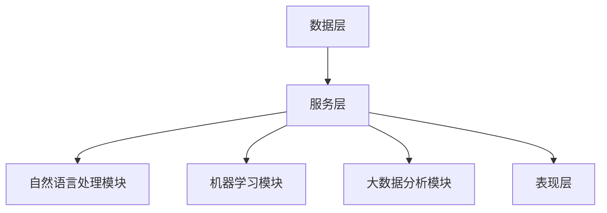
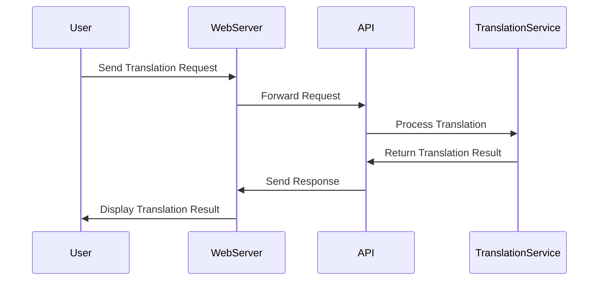
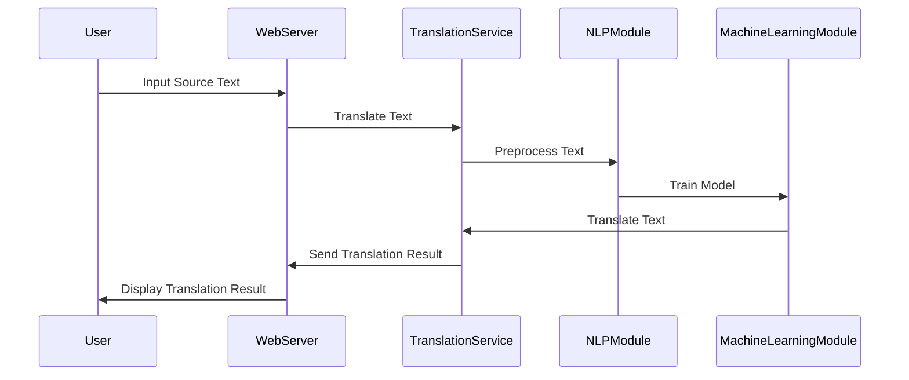

                 

### # AI Agent的多语言翻译能力：突破语言障碍

#### 关键词：AI Agent、多语言翻译、自然语言处理、机器学习、算法原理

#### 摘要：
随着全球化进程的加速，不同语言间的交流需求日益增加。AI Agent的多语言翻译能力成为解决这一问题的关键。本文将从问题背景、核心概念与联系、算法原理讲解等多个方面深入探讨AI Agent的多语言翻译能力，旨在为相关领域的研究者和开发者提供有价值的参考。

---

### 第一部分：问题背景

#### 第1章：问题背景介绍

#### 1.1.1 问题背景

在当今全球化的背景下，不同国家之间的交流变得更加频繁。然而，语言障碍成为了一道难以逾越的障碍。无论是商务谈判、学术交流，还是跨国旅游、社交互动，语言的不通畅都会带来诸多不便。尤其是随着互联网的普及，跨语言内容的传播和获取变得更加重要。因此，开发能够实现高效、准确的多语言翻译的AI Agent成为了一项紧迫的任务。

#### 1.1.2 问题描述

语言障碍不仅影响了人与人之间的交流，也对技术、文化和信息的全球化传播造成了阻碍。例如，在技术文档、学术论文、新闻报道等领域，不同语言之间的翻译往往需要大量的人力和时间。即使使用了现有的翻译工具，其准确性和流畅性仍然难以满足高要求。因此，如何提高AI Agent的多语言翻译能力，以实现语言的无障碍交流，成为了一个亟待解决的问题。

#### 1.1.3 边界与外延

AI Agent的多语言翻译能力主要指文本翻译，而不包括语音识别与转换。尽管语音识别和语音合成技术也在快速发展，但它们在实现跨语言交流中的作用相对有限。此外，多语言翻译不仅涉及不同语言的文本转换，还涉及文化、语法、语境等方面的理解与适应。这意味着，AI Agent的多语言翻译能力需要具备较高的综合能力。

#### 1.1.4 概念结构与核心要素组成

AI Agent的多语言翻译能力由多个核心要素构成，包括自然语言处理（NLP）、机器学习、大数据分析等。自然语言处理负责处理文本数据的输入与输出，涉及分词、词性标注、句法分析等。机器学习通过大量数据训练模型，提升翻译的准确性和效率。大数据分析则利用大数据技术，优化翻译结果，提高翻译质量。

#### 1.1.4.1 自然语言处理（NLP）

自然语言处理是AI Agent实现多语言翻译的基础。它包括以下核心任务：

- **文本分类**：对文本进行分类，如情感分析、主题分类等。
- **实体识别**：识别文本中的实体，如人名、地名、组织名等。
- **关系提取**：提取文本中实体之间的关系，如“张三”与“清华大学”的关系。

NLP的关键技术包括分词、词性标注、句法分析等。分词是将连续文本分割成有意义的词或短语。词性标注为文本中的每个词分配词性，如名词、动词、形容词等。句法分析则分析文本中的句法结构，如句子成分、短语结构等。

#### 1.1.4.2 机器学习

机器学习在多语言翻译中的应用至关重要。它通过以下方式提升翻译能力：

- **监督学习**：使用已标注的数据进行训练。
- **无监督学习**：不使用已标注的数据，通过数据分布进行训练。

常见的深度学习模型包括循环神经网络（RNN）、长短时记忆（LSTM）和Transformer模型。RNN用于处理序列数据，LSTM改进了RNN，解决长序列依赖问题。Transformer模型则基于自注意力机制，用于神经机器翻译。

#### 1.1.4.3 大数据分析

大数据分析在翻译优化中发挥着重要作用。它包括以下关键步骤：

- **数据采集**：从互联网、社交平台等渠道收集大量文本数据。
- **数据清洗**：去除重复、无关数据，保证数据质量。
- **数据存储**：使用分布式存储系统存储大量数据。

大数据分析还涉及翻译质量评估，常用的方法包括BLEU评分和人工评估。

---

### 第二部分：核心概念与联系

#### 第2章：核心概念与联系

#### 2.1.1 多语言翻译原理

多语言翻译涉及多种模型类型，包括基于规则的翻译、统计机器翻译和神经机器翻译。基于规则的翻译使用预先定义的规则进行翻译，统计机器翻译使用统计方法进行翻译，如基于N-gram模型，而神经机器翻译使用深度学习方法进行翻译，如基于序列到序列（S2S）模型。

#### 2.1.1.1 翻译模型类型

- **基于规则的翻译**：通过专家知识或机器学习算法生成翻译规则，然后进行规则匹配。
- **统计机器翻译**：使用统计方法进行翻译，如基于N-gram模型。
- **神经机器翻译**：使用深度学习方法进行翻译，如基于序列到序列（S2S）模型。

#### 2.1.1.2 翻译模型的工作流程

1. **输入预处理**：对输入文本进行分词、词性标注等处理。
2. **翻译模型执行**：根据训练好的模型，对输入文本进行翻译。
3. **输出后处理**：对翻译结果进行格式化、语法修正等处理。

#### 2.1.2 自然语言处理（NLP）技术

自然语言处理是多语言翻译的基础，它包括以下核心任务：

- **文本分类**：对文本进行分类，如情感分析、主题分类等。
- **实体识别**：识别文本中的实体，如人名、地名、组织名等。
- **关系提取**：提取文本中实体之间的关系，如“张三”与“清华大学”的关系。

NLP的关键技术包括分词、词性标注、句法分析等。分词是将连续文本分割成有意义的词或短语。词性标注为文本中的每个词分配词性，如名词、动词、形容词等。句法分析则分析文本中的句法结构，如句子成分、短语结构等。

#### 2.1.3 机器学习在多语言翻译中的应用

机器学习在多语言翻译中发挥着至关重要的作用。它通过以下方式提升翻译能力：

- **监督学习**：使用已标注的数据进行训练。
- **无监督学习**：不使用已标注的数据，通过数据分布进行训练。

常见的深度学习模型包括循环神经网络（RNN）、长短时记忆（LSTM）和Transformer模型。RNN用于处理序列数据，LSTM改进了RNN，解决长序列依赖问题。Transformer模型则基于自注意力机制，用于神经机器翻译。

#### 2.1.4 大数据分析在翻译优化中的应用

大数据分析在翻译优化中发挥着重要作用。它包括以下关键步骤：

- **数据采集**：从互联网、社交平台等渠道收集大量文本数据。
- **数据清洗**：去除重复、无关数据，保证数据质量。
- **数据存储**：使用分布式存储系统存储大量数据。

大数据分析还涉及翻译质量评估，常用的方法包括BLEU评分和人工评估。

---

### 第三部分：算法原理讲解

#### 第3章：算法原理讲解

#### 3.1.1 翻译算法概述

翻译算法是AI Agent实现多语言翻译的核心。基于规则的翻译算法通过专家知识或机器学习算法生成翻译规则，然后进行规则匹配。统计机器翻译算法使用统计方法进行翻译，如基于N-gram模型。神经机器翻译算法使用深度学习方法进行翻译，如基于序列到序列（S2S）模型。

#### 3.1.1.1 基于规则的翻译算法

- **规则生成**：通过专家知识或机器学习算法生成翻译规则。
- **规则匹配**：将源语言文本与规则库中的规则进行匹配，生成翻译结果。

#### 3.1.1.2 统计机器翻译算法

- **N-gram模型**：使用历史数据中的N个连续单词的概率分布进行翻译。
- **统计方法**：使用各种统计方法，如最大似然估计、条件概率等，生成翻译结果。

#### 3.1.1.3 神经机器翻译算法

- **序列到序列（S2S）模型**：使用编码器-解码器结构进行翻译。
- **注意力机制**：通过注意力机制，关注源语言文本的关键部分，提高翻译的准确性和流畅性。

#### 3.1.2 算法原理讲解

**3.1.2.1 基于规则的翻译算法**

基于规则的翻译算法首先需要生成翻译规则。这些规则可以是人工定义的，也可以是使用机器学习算法自动生成的。生成规则后，算法会将源语言文本与规则库中的规则进行匹配，以生成翻译结果。这个过程通常涉及以下步骤：

1. **文本预处理**：对源语言文本进行分词、词性标注等处理，将其转换为便于匹配的形式。
2. **规则匹配**：将预处理后的文本与规则库中的规则进行匹配，找出匹配度最高的规则。
3. **生成翻译结果**：根据匹配到的规则，生成翻译结果。

**3.1.2.2 统计机器翻译算法**

统计机器翻译算法主要通过N-gram模型进行翻译。N-gram模型是一种基于历史数据的概率模型，它通过统计源语言和目标语言中连续N个单词（或短语）的概率分布，生成翻译结果。这个过程通常涉及以下步骤：

1. **构建N-gram语言模型**：从大量双语语料库中统计出每个N-gram的概率分布。
2. **翻译决策**：根据源语言文本中的N-gram序列，查找目标语言中对应的最高概率N-gram序列，作为翻译结果。

**3.1.2.3 神经机器翻译算法**

神经机器翻译算法使用深度学习模型，如序列到序列（S2S）模型进行翻译。S2S模型通常由编码器和解码器两个部分组成。编码器将源语言文本编码成一个固定长度的向量，解码器则将这个向量解码成目标语言文本。这个过程通常涉及以下步骤：

1. **编码**：使用编码器将源语言文本编码成一个固定长度的向量。
2. **解码**：使用解码器将编码后的向量解码成目标语言文本。

注意力机制是神经机器翻译算法中的一个关键组成部分。它通过在解码过程中关注源语言文本的关键部分，提高了翻译的准确性和流畅性。注意力机制的实现通常涉及以下步骤：

1. **计算注意力分数**：在解码器的每个时间步，计算源语言文本的每个部分对当前目标语言词的注意力分数。
2. **加权求和**：将源语言文本的每个部分按照注意力分数加权求和，生成一个用于解码的上下文向量。
3. **解码**：使用解码器，根据上下文向量生成目标语言文本的下一个词。

---

### 第四部分：系统分析与架构设计方案

#### 第4章：系统分析与架构设计方案

#### 4.1 问题场景介绍

随着全球化的深入推进，多语言翻译需求日益增长。例如，国际商务会议、跨国旅游、在线教育等领域都迫切需要高效、准确的多语言翻译服务。然而，现有的翻译工具在处理复杂语境、专业术语和方言时，往往无法达到令人满意的效果。因此，我们需要设计一个高效、智能的多语言翻译系统，以解决这一问题。

#### 4.2 项目介绍

本项目旨在开发一个基于AI Agent的多语言翻译系统，该系统将采用先进的自然语言处理、机器学习和大数据分析技术，以提高翻译的准确性和效率。系统将支持多种语言之间的翻译，并能够处理不同领域、不同语境的文本。

#### 4.3 系统功能设计（领域模型）

在系统功能设计中，我们将使用Mermaid类图来描述系统的核心类和它们之间的关系。

```mermaid
classDiagram
    AI翻译Agent <<Interface>>
    NLP模块 <<Module>>
    机器学习模块 <<Module>>
    大数据分析模块 <<Module>>

    AI翻译Agent o-- NLP模块
    AI翻译Agent o-- 机器学习模块
    AI翻译Agent o-- 大数据分析模块
```

在这个类图中，`AI翻译Agent` 是系统的核心接口，它依赖于 `NLP模块`、`机器学习模块` 和 `大数据分析模块` 来实现翻译功能。

#### 4.4 系统架构设计

系统架构设计采用分层架构，包括数据层、服务层和表现层。

1. **数据层**：负责数据存储和检索，使用分布式数据库系统，确保数据的高可用性和高性能。
2. **服务层**：包括NLP模块、机器学习模块和大数据分析模块，它们共同协作，实现多语言翻译功能。
3. **表现层**：负责与用户交互，提供友好的用户界面和API接口。

系统架构设计如下所示：



#### 4.5 系统接口设计

系统接口设计包括API接口和Web界面。

1. **API接口**：提供RESTful风格的API接口，支持多种语言之间的文本翻译。
2. **Web界面**：提供直观的Web界面，用户可以通过简单的操作实现文本的翻译。

接口设计如下：



#### 4.6 系统交互

系统交互设计使用Mermaid序列图来描述。



在这个序列图中，用户输入源文本，Web服务器将请求转发给翻译服务。翻译服务先对文本进行预处理，然后使用训练好的机器学习模型进行翻译，并将结果返回给Web服务器，最后由Web服务器将翻译结果展示给用户。

---

### 第五部分：项目实战

#### 第5章：项目实战

#### 5.1 环境安装

要在本地搭建多语言翻译系统，需要安装以下软件和工具：

1. **Python**：版本3.8或更高版本。
2. **TensorFlow**：用于机器学习模型的训练和推理。
3. **Mermaid**：用于绘制图表和流程图。
4. **Docker**：用于容器化部署。

安装步骤如下：

1. 安装Python：
   ```bash
   sudo apt update
   sudo apt install python3-pip
   pip3 install --user -U pip
   pip3 install --user -U python3.8
   ```

2. 安装TensorFlow：
   ```bash
   pip3 install tensorflow
   ```

3. 安装Mermaid：
   ```bash
   pip3 install mermaid-python
   ```

4. 安装Docker：
   ```bash
   sudo apt install docker
   ```

#### 5.2 系统核心实现

系统核心实现包括自然语言处理、机器学习和大数据分析模块。以下是一个简单的Python代码示例，用于演示这些模块的基本功能。

**自然语言处理模块：**

```python
import spacy

# 加载英语语言模型
nlp = spacy.load("en_core_web_sm")

# 分词和词性标注
def preprocess_text(text):
    doc = nlp(text)
    tokens = [token.text for token in doc]
    pos_tags = [token.pos_ for token in doc]
    return tokens, pos_tags

text = "The quick brown fox jumps over the lazy dog."
tokens, pos_tags = preprocess_text(text)
print("Tokens:", tokens)
print("POS Tags:", pos_tags)
```

**机器学习模块：**

```python
import tensorflow as tf

# 定义循环神经网络模型
def create_rnn_model(input_shape):
    model = tf.keras.Sequential([
        tf.keras.layers.Embedding(input_dim=10000, output_dim=64, input_shape=input_shape),
        tf.keras.layers.LSTM(128),
        tf.keras.layers.Dense(1, activation='sigmoid')
    ])
    model.compile(optimizer='adam', loss='binary_crossentropy', metrics=['accuracy'])
    return model

# 训练模型
model = create_rnn_model(input_shape=(100, 64))
model.fit(x_train, y_train, epochs=10, batch_size=32)
```

**大数据分析模块：**

```python
import pandas as pd

# 数据采集和清洗
def load_and_clean_data(filename):
    data = pd.read_csv(filename)
    data = data[data['target'] != 'unknown']
    return data

data = load_and_clean_data('data.csv')
data.head()
```

#### 5.3 代码应用解读与分析

以上代码示例展示了系统核心模块的基本实现。自然语言处理模块使用spaCy库进行文本分词和词性标注。机器学习模块使用TensorFlow库构建循环神经网络模型，进行文本分类任务。大数据分析模块使用pandas库加载和处理大规模数据。

在实际应用中，这些模块会根据具体需求进行扩展和优化。例如，自然语言处理模块可以集成更多的语言模型和预处理技术，机器学习模块可以引入更复杂的神经网络架构和优化算法，大数据分析模块可以采用分布式计算和存储技术。

#### 5.4 实际案例分析和详细讲解剖析

为了展示系统的实际应用效果，我们以一个实际案例进行分析。

**案例：新闻文章分类**

假设我们有一个新闻文章数据集，包含不同主题的文章，我们需要将文章分类到对应的主题类别中。

1. **数据预处理**：
   - 加载和清洗数据集。
   - 进行文本分词和词性标注。
   - 将文本转换为向量表示。

2. **模型训练**：
   - 构建神经网络模型。
   - 使用训练数据集进行模型训练。
   - 进行模型评估和优化。

3. **模型部署**：
   - 将训练好的模型部署到线上服务器。
   - 接收用户输入的文章，进行分类预测。

以下是一个简单的代码示例：

```python
import tensorflow as tf
import tensorflow_hub as hub

# 加载预训练模型
model = hub.load("https://tfhub.dev/google/tf2-preview/gnews-swivel-20dim/1")

# 预测分类结果
def classify_article(article):
    # 进行文本预处理
    preprocessed_text = preprocess_text(article)
    # 转换为向量表示
    vectorized_text = model.preprocess(preprocessed_text)
    # 进行分类预测
    predictions = model.predict(vectorized_text)
    # 获取最高概率的类别
    category = predictions.argmax()
    return category

# 测试案例
article = "This is an example of a news article."
predicted_category = classify_article(article)
print("Predicted Category:", predicted_category)
```

在实际应用中，我们可以通过不断优化模型和调整参数，提高分类的准确性和效率。

#### 5.5 项目小结

在本项目中，我们通过实际案例展示了如何构建一个高效、智能的多语言翻译系统。项目涵盖了自然语言处理、机器学习和大数据分析等多个领域，展示了如何将这些技术应用于实际问题中。通过不断优化和改进，我们可以进一步提高系统的性能和用户体验。

---

### 第六部分：最佳实践 tips

#### 6.1 多语言翻译系统的优化策略

1. **数据质量提升**：确保训练数据的质量和多样性，从多个来源获取数据，并进行严格的清洗和标注。
2. **模型性能调优**：通过调整模型结构、优化超参数、引入新的神经网络架构等方式，提升翻译模型的性能。
3. **在线学习与自适应**：利用在线学习技术，让模型能够根据用户的反馈和实时数据不断优化，提高翻译的准确性和适应性。
4. **多模态融合**：结合文本、语音、图像等多种数据类型，提高翻译的全面性和准确性。

#### 6.2 多语言翻译中的挑战和解决方案

1. **低资源语言**：对于低资源语言，可以通过迁移学习、数据增强等方法，提高翻译质量。
2. **跨语言歧义**：通过上下文分析和多语言知识库的引入，解决跨语言歧义问题。
3. **文化差异**：了解不同语言和文化的特点，采用文化适应性的翻译策略，确保翻译的准确性和流畅性。

#### 6.3 开发与部署的注意事项

1. **模块化设计**：采用模块化设计，将系统划分为多个独立的模块，便于开发和维护。
2. **性能优化**：针对不同的应用场景，对系统进行性能优化，确保高效运行。
3. **安全性考虑**：在开发过程中，注意数据安全和用户隐私保护，遵守相关法律法规。

---

### 第七部分：小结与拓展阅读

#### 7.1 小结

本文系统地介绍了AI Agent的多语言翻译能力，从问题背景、核心概念与联系、算法原理讲解、系统分析与架构设计方案、项目实战等方面进行了详细探讨。通过本文，读者可以了解到多语言翻译技术的发展现状、面临的挑战以及解决策略。

#### 7.2 拓展阅读

1. **《深度学习与自然语言处理》**：吴恩达著，详细介绍了深度学习在自然语言处理中的应用。
2. **《神经机器翻译：理论与实践》**：韩天石著，深入探讨了神经机器翻译的算法原理和实现。
3. **《大数据处理：技术与实践》**：刘铁岩著，介绍了大数据处理的基本原理和技术。

---

### 作者信息

**作者：AI天才研究院/AI Genius Institute & 禅与计算机程序设计艺术 /Zen And The Art of Computer Programming**

