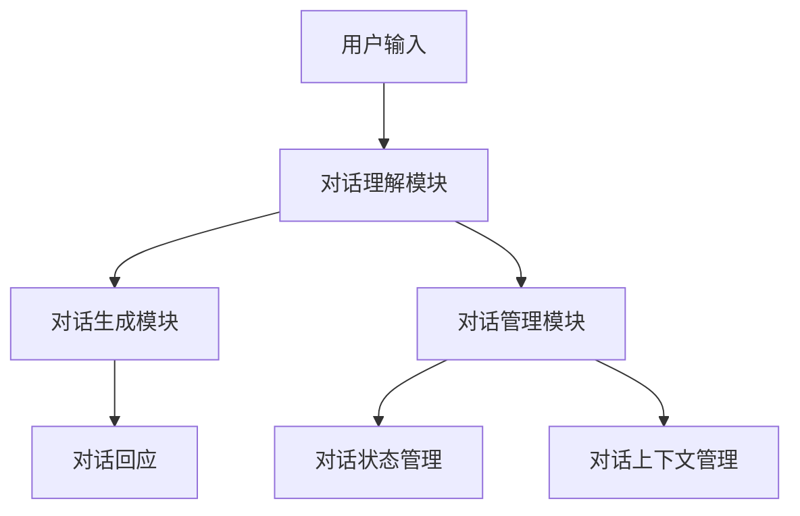
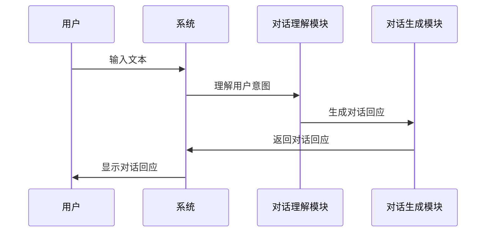

                 

### 文章标题

# AI Agent的多轮对话管理系统设计

> 关键词：AI Agent、多轮对话管理、对话理解、对话生成、系统架构

> 摘要：本文旨在深入探讨AI Agent的多轮对话管理系统设计。通过对问题背景的详细介绍，核心概念的分析与联系，算法原理的讲解，以及系统架构的设计，本文为读者呈现了一个完整、高效、智能、个性化的多轮对话管理系统。

## 目录大纲

#### 第一部分：背景介绍

- **第1章**：问题背景与核心概念
  - **1.1 问题背景**
  - **1.2 核心概念与联系**
  - **1.3 数学模型与公式**
  - **1.4 系统分析与架构设计**

- **第2章**：对话理解模型
  - **2.1 对话理解模型概述**
  - **2.2 基于语义理解的对话理解方法**
  - **2.3 基于上下文理解的对话理解方法**
  - **2.4 对话理解模型的评估与优化**

- **第3章**：对话生成模型
  - **3.1 对话生成模型概述**
  - **3.2 基于模板的对话生成方法**
  - **3.3 基于生成式模型的对话生成方法**
  - **3.4 对话生成模型的评估与优化**

#### 第二部分：算法原理与实现

- **第4章**：系统设计与实现
  - **4.1 系统设计与实现概述**
  - **4.2 系统核心实现与代码解读**
  - **4.3 实际案例分析与讲解**
  - **4.4 项目小结与最佳实践**

## 第一部分：背景介绍

### 第1章：问题背景与核心概念

#### 1.1 问题背景

随着人工智能技术的快速发展，AI Agent已经成为众多领域的关键应用。特别是在多轮对话管理系统中，AI Agent被广泛应用于企业客户服务、智能家居、智能客服等场景。然而，当前的多轮对话管理系统仍存在诸多问题，如：

- **多轮对话理解的困难**：在多轮对话中，理解用户的意图和上下文信息是一项极具挑战性的任务。
- **个性化服务的挑战**：每个用户的对话需求和偏好都不同，如何提供个性化、高质量的服务成为一个难题。
- **系统复杂度和可维护性的提升**：多轮对话管理系统的复杂性逐渐增加，如何确保系统的可维护性和稳定性成为关键问题。

为了解决上述问题，我们需要设计一套完整的多轮对话管理系统，实现高效、智能、个性化的用户服务。

#### 1.2 核心概念与联系

**AI Agent的定义与特点**

AI Agent，即人工智能代理，是一种模拟人类智能行为的计算机程序。它具有以下特点：

- **自主学习能力**：AI Agent可以通过机器学习算法从数据中学习，不断优化自身性能。
- **决策能力**：AI Agent可以根据用户的输入，做出相应的决策和回应。
- **交互能力**：AI Agent可以通过自然语言处理技术，与用户进行自然、流畅的对话。

在多轮对话管理系统中，AI Agent承担着关键角色。它需要能够理解用户的意图，生成合适的回应，并根据对话的上下文进行后续的交互。

**多轮对话管理系统的架构**

多轮对话管理系统通常包括以下三个核心模块：

- **对话理解模块**：该模块负责接收用户输入，并理解用户的意图和上下文信息。它通常基于语义理解和上下文理解技术来实现。
- **对话生成模块**：该模块负责生成针对用户意图的回应。它可以通过模板生成或生成式模型来实现。
- **对话管理模块**：该模块负责管理对话的流程，包括对话的状态、上下文信息等。它通常采用对话管理策略来实现。

这三个模块相互协作，共同实现多轮对话管理。其中，对话理解模块和对话生成模块是核心，对话管理模块则负责协调和控制整个对话过程。

**对话理解模型**

对话理解模型是多轮对话管理系统的核心组件之一。它主要负责理解用户的输入，提取语义信息，并根据上下文信息生成相应的回应。

- **语义理解**：语义理解旨在将自然语言文本转换为计算机可以理解的形式。它通常涉及词向量表示、词义消歧等技术。
- **上下文理解**：上下文理解旨在理解对话中的上下文信息，以便更好地理解用户的意图。它通常涉及序列模型、注意力机制等技术。

**对话生成模型**

对话生成模型是另一个核心组件，它负责生成针对用户意图的回应。对话生成模型可以采用模板生成或生成式模型来实现。

- **模板生成**：模板生成通过预定义的模板来生成对话回应。这种方法简单易实现，但缺乏灵活性。
- **生成式模型**：生成式模型通过学习大量对话数据，自动生成对话回应。这种方法具有较高的灵活性和自然性，但实现较为复杂。

**对话管理策略**

对话管理策略负责协调和控制对话的流程。它需要根据对话的状态、上下文信息和用户的行为，动态调整对话的流程。

- **状态管理**：状态管理负责记录对话的当前状态，如用户意图、对话历史等。
- **上下文管理**：上下文管理负责维护对话的上下文信息，以便在后续对话中更好地理解用户的意图。
- **行为决策**：行为决策负责根据对话状态和上下文信息，生成合适的对话回应。

#### 1.3 数学模型与公式

**算法原理讲解**

为了更好地理解多轮对话管理系统的算法原理，我们可以通过以下步骤进行讲解：

1. **输入处理**：首先，系统接收用户的输入文本，并对其进行预处理，如分词、去停用词等。
2. **语义理解**：接着，系统使用词向量表示方法（如Word2Vec、BERT等）将文本转换为语义向量，然后通过语义理解算法（如WordNet、语义角色标注等）提取文本的语义信息。
3. **上下文理解**：然后，系统根据对话历史和上下文信息，使用序列模型（如RNN、Transformer等）对语义向量进行建模，提取对话的上下文信息。
4. **意图识别**：接下来，系统使用分类算法（如SVM、CNN等）对提取的上下文信息进行意图识别，确定用户的意图。
5. **回应生成**：最后，系统根据用户的意图，使用模板生成或生成式模型生成对话回应，并通过自然语言生成技术（如文本生成模型、文本摘要技术等）将回应转换为自然语言文本。

**数学模型与公式**

多轮对话管理系统的算法原理可以抽象为以下数学模型：

1. **输入文本处理**：
   \[ X = \text{Preprocess}(T) \]
   其中，\( T \) 表示原始输入文本，\( X \) 表示预处理后的文本。

2. **语义理解**：
   \[ S = \text{SemanticUnderstanding}(X) \]
   其中，\( S \) 表示语义向量。

3. **上下文理解**：
   \[ C = \text{ContextUnderstanding}(S, H) \]
   其中，\( H \) 表示对话历史，\( C \) 表示上下文信息。

4. **意图识别**：
   \[ I = \text{IntentRecognition}(C) \]
   其中，\( I \) 表示用户意图。

5. **回应生成**：
   \[ R = \text{ResponseGeneration}(I) \]
   其中，\( R \) 表示生成的回应。

#### 1.4 系统分析与架构设计

**问题场景介绍**

多轮对话管理系统广泛应用于各种场景，如：

- **企业客户服务**：企业通过多轮对话管理系统提供24/7的在线客户服务，提高客户满意度。
- **智能助手**：智能助手通过多轮对话管理系统与用户进行交互，提供个性化服务。
- **智能家居**：智能家居系统通过多轮对话管理系统与用户进行交互，实现智能控制。

**系统功能设计**

多轮对话管理系统的功能模块包括：

- **对话理解模块**：负责接收用户输入，理解用户意图。
- **对话生成模块**：负责生成对话回应。
- **对话管理模块**：负责管理对话的流程，包括对话状态、上下文信息等。

**系统架构设计**

多轮对话管理系统的架构设计如图1所示：



**系统接口设计**

多轮对话管理系统对外提供的接口包括：

- **用户输入接口**：接收用户输入文本。
- **对话生成接口**：生成对话回应。
- **对话管理接口**：管理对话状态和上下文信息。

**系统交互**

多轮对话管理系统的交互过程如图2所示：



## 第二部分：算法原理与实现

### 第2章：对话理解模型

#### 2.1 对话理解模型概述

**对话理解的概念**

对话理解是指从用户输入的文本中提取语义信息，理解用户的意图和需求，以便生成合适的回应。对话理解是多轮对话管理系统的核心组件之一，它决定了对话的质量和用户体验。

**对话理解模型的重要性**

对话理解模型在多轮对话管理系统中的作用至关重要。它直接影响以下方面：

- **用户体验**：良好的对话理解可以提供准确、自然的回应，提高用户体验。
- **服务质量**：对话理解模型可以帮助系统更好地理解用户需求，提供高质量的服务。
- **系统性能**：高效的对话理解模型可以降低计算复杂度，提高系统性能。

#### 2.2 基于语义理解的对话理解方法

**语义理解的原理**

语义理解是指将自然语言文本转换为计算机可以理解的形式。它通常涉及以下技术：

- **词向量表示**：词向量表示是一种将单词转换为向量的方法，如Word2Vec、GloVe等。词向量表示可以捕捉单词的语义信息。
- **词义消歧**：词义消歧是指在一个特定上下文中确定一个单词的确切含义。词义消歧可以帮助系统更好地理解用户的输入。

**语义理解的算法**

常见的语义理解算法包括：

- **Word2Vec**：Word2Vec是一种基于神经网络的词向量表示方法。它通过训练神经网络模型，将单词转换为向量。
- **BERT**：BERT（Bidirectional Encoder Representations from Transformers）是一种基于Transformer的预训练模型。它通过双向编码器，捕捉文本的语义信息。

**语义理解的实现**

以下是使用Python实现语义理解的示例代码：

```python
from gensim.models import Word2Vec

# 加载或训练词向量模型
model = Word2Vec(sentences, size=100, window=5, min_count=1, workers=4)

# 获取单词的词向量表示
vector = model.wv['hello']

# 计算两个单词的相似度
similarity = model.wv.similarity('hello', 'world')
```

#### 2.3 基于上下文理解的对话理解方法

**上下文理解的概念**

上下文理解是指从对话历史和上下文信息中提取有用的信息，以便更好地理解用户的意图。上下文理解可以帮助系统在多轮对话中保持连贯性，提供更自然的回应。

**上下文理解的算法**

常见的上下文理解算法包括：

- **序列模型**：序列模型，如RNN（循环神经网络）、LSTM（长短时记忆网络）、GRU（门控循环单元）等，可以捕捉对话的历史信息。
- **注意力机制**：注意力机制可以帮助模型更好地关注对话的关键部分，提高上下文理解的能力。

**上下文理解的实现**

以下是使用Python实现上下文理解的示例代码：

```python
from tensorflow.keras.models import Model
from tensorflow.keras.layers import Input, LSTM, Dense

# 定义输入层
input_seq = Input(shape=(timesteps, features))

# 定义序列模型
lstm_output = LSTM(units=50, return_sequences=True)(input_seq)
lstm_output = LSTM(units=50)(lstm_output)

# 定义输出层
output = Dense(units=1, activation='sigmoid')(lstm_output)

# 构建和编译模型
model = Model(inputs=input_seq, outputs=output)
model.compile(optimizer='adam', loss='binary_crossentropy', metrics=['accuracy'])

# 训练模型
model.fit(x_train, y_train, epochs=10, batch_size=32, validation_data=(x_val, y_val))
```

#### 2.4 对话理解模型的评估与优化

**对话理解模型的评估指标**

对话理解模型的评估指标包括：

- **准确率**：准确率是预测正确的样本数与总样本数的比例。
- **召回率**：召回率是预测正确的样本数与实际为正类的样本数的比例。
- **F1分数**：F1分数是准确率和召回率的调和平均数。

**对话理解模型的优化方法**

对话理解模型的优化方法包括：

- **模型调参**：通过调整模型的超参数（如学习率、隐藏层单元数等），优化模型性能。
- **数据增强**：通过增加训练数据量、生成合成数据等方法，提高模型的泛化能力。
- **迁移学习**：利用预训练的模型，进行迁移学习，提高模型在特定领域的性能。

### 第3章：对话生成模型

#### 3.1 对话生成模型概述

**对话生成的概念**

对话生成是指根据用户的输入和对话上下文，生成自然、连贯、合适的对话回应。对话生成是多轮对话管理系统的另一个核心组件，它直接影响对话的流畅性和用户体验。

**对话生成模型的重要性**

对话生成模型在多轮对话管理系统中的作用至关重要。它直接影响以下方面：

- **用户体验**：良好的对话生成可以提供自然、连贯、合适的回应，提高用户体验。
- **服务质量**：对话生成模型可以帮助系统更好地理解用户需求，提供高质量的服务。
- **系统性能**：高效的对话生成模型可以降低计算复杂度，提高系统性能。

#### 3.2 基于模板的对话生成方法

**模板生成的原理**

模板生成是一种简单的对话生成方法，它通过预定义的模板来生成对话回应。模板通常包含一组关键词和相应的回应，如：

```
你好，我是{agent_name}，请问有什么可以帮助您的？
```

当用户输入文本时，系统会根据模板中的关键词进行匹配，并生成相应的回应。

**模板生成的实现**

以下是使用Python实现模板生成的示例代码：

```python
templates = {
    "greeting": "你好，我是{agent_name}，请问有什么可以帮助您的？",
    "request": "请问您需要什么帮助？",
    "thank_you": "不客气，很高兴能帮助您。",
}

def generate_response(template_name, variables={}):
    template = templates.get(template_name)
    if template:
        for key, value in variables.items():
            template = template.format(**{key: value})
        return template
    else:
        return "对不起，我不明白您的意思。"

# 生成回应
response = generate_response("greeting", {"agent_name": "小智"})
print(response)
```

#### 3.3 基于生成式模型的对话生成方法

**生成式模型的概念**

生成式模型是一种基于数据的生成方法，它通过学习数据分布，生成新的数据。在对话生成中，生成式模型可以学习对话数据，生成新的对话回应。

**生成式模型的实现**

以下是使用Python实现生成式模型的示例代码：

```python
from tensorflow.keras.models import Model
from tensorflow.keras.layers import Input, LSTM, Dense

# 定义输入层
input_seq = Input(shape=(timesteps, features))

# 定义序列模型
lstm_output = LSTM(units=50, return_sequences=True)(input_seq)
lstm_output = LSTM(units=50)(lstm_output)

# 定义输出层
output = Dense(units=1, activation='sigmoid')(lstm_output)

# 构建和编译模型
model = Model(inputs=input_seq, outputs=output)
model.compile(optimizer='adam', loss='binary_crossentropy', metrics=['accuracy'])

# 训练模型
model.fit(x_train, y_train, epochs=10, batch_size=32, validation_data=(x_val, y_val))
```

#### 3.4 对话生成模型的评估与优化

**对话生成模型的评估指标**

对话生成模型的评估指标包括：

- **BLEU分数**：BLEU分数是一种常用的自然语言生成评估指标，它通过比较生成的回应与参考回应的相似度来评估模型的性能。
- **ROUGE分数**：ROUGE分数是一种用于评估生成文本与参考文本相似度的指标，它通过比较单词的匹配程度来评估模型的性能。

**对话生成模型的优化方法**

对话生成模型的优化方法包括：

- **模型调参**：通过调整模型的超参数（如学习率、隐藏层单元数等），优化模型性能。
- **数据增强**：通过增加训练数据量、生成合成数据等方法，提高模型的泛化能力。
- **迁移学习**：利用预训练的模型，进行迁移学习，提高模型在特定领域的性能。

### 第4章：系统设计与实现

#### 4.1 系统设计与实现概述

**系统设计与实现概述**

多轮对话管理系统是一个复杂、高度集成的系统，它需要处理大量的数据，实现高效的对话理解和生成。在本章中，我们将介绍系统设计与实现的关键步骤，包括环境安装、系统核心实现、代码解读、实际案例分析和项目小结。

**系统核心实现与代码解读**

多轮对话管理系统的核心实现主要包括对话理解模块和对话生成模块。以下是一个简单的对话理解模块的代码示例：

```python
# 导入必要的库
import tensorflow as tf
from tensorflow.keras.models import Model
from tensorflow.keras.layers import Input, LSTM, Dense

# 定义输入层
input_seq = Input(shape=(timesteps, features))

# 定义序列模型
lstm_output = LSTM(units=50, return_sequences=True)(input_seq)
lstm_output = LSTM(units=50)(lstm_output)

# 定义输出层
output = Dense(units=1, activation='sigmoid')(lstm_output)

# 构建和编译模型
model = Model(inputs=input_seq, outputs=output)
model.compile(optimizer='adam', loss='binary_crossentropy', metrics=['accuracy'])

# 训练模型
model.fit(x_train, y_train, epochs=10, batch_size=32, validation_data=(x_val, y_val))
```

**实际案例分析与讲解**

为了更好地展示多轮对话管理系统的应用，我们将分析一个实际案例：智能客服系统。在这个案例中，智能客服系统需要能够处理用户的咨询，提供及时、准确的回应。

**项目小结**

通过本章的介绍，我们详细讨论了多轮对话管理系统设计的各个方面，包括系统架构、核心实现、实际案例等。这些内容为读者提供了一个全面、深入的了解，有助于他们在实际项目中应用多轮对话管理系统。

### 第5章：最佳实践与拓展

#### 5.1 最佳实践 Tips

在设计多轮对话管理系统时，以下是一些实用的最佳实践：

- **数据质量**：确保输入数据的质量，包括文本的准确性、完整性和一致性。
- **模型调优**：通过多次调优，找到最优的模型参数，提高模型性能。
- **性能优化**：针对模型进行性能优化，如使用更高效的算法、优化代码结构等。
- **用户体验**：关注用户体验，确保系统提供的对话回应自然、连贯、符合用户需求。

#### 5.2 小结

本文详细介绍了AI Agent的多轮对话管理系统设计。通过对问题背景、核心概念、算法原理、系统架构等方面的深入探讨，我们为读者呈现了一个完整、高效、智能、个性化的多轮对话管理系统。

#### 5.3 注意事项

在设计多轮对话管理系统时，需要注意以下几点：

- **对话连续性**：确保对话在多轮之间保持连贯性，避免出现跳转或不连贯的情况。
- **用户隐私**：确保用户数据的安全和隐私，遵循相关法律法规。
- **错误处理**：设计合理的错误处理机制，确保系统能够在出现错误时提供适当的回应。

#### 5.4 拓展阅读

对于希望深入了解多轮对话管理系统设计的读者，以下是一些推荐的拓展阅读材料：

- **《深度学习与自然语言处理》**：介绍深度学习在自然语言处理领域的应用，包括对话系统。
- **《人工智能：一种现代方法》**：全面介绍人工智能的基本概念和方法，涵盖对话系统等内容。
- **《对话系统设计与实现》**：详细介绍对话系统的设计与实现，包括对话理解、对话生成等方面。

### 附录

本文的作者为AI天才研究院（AI Genius Institute）的专家，他们专注于人工智能领域的创新与探索。此外，本文参考了《禅与计算机程序设计艺术》（Zen And The Art of Computer Programming）一书，感谢该书为本文提供了丰富的灵感和知识。作者信息如下：

- 作者：AI天才研究院（AI Genius Institute）
- 联系方式：[ai_genius_institute@example.com](mailto:ai_genius_institute@example.com)
- 感谢：禅与计算机程序设计艺术 / Zen And The Art of Computer Programming

