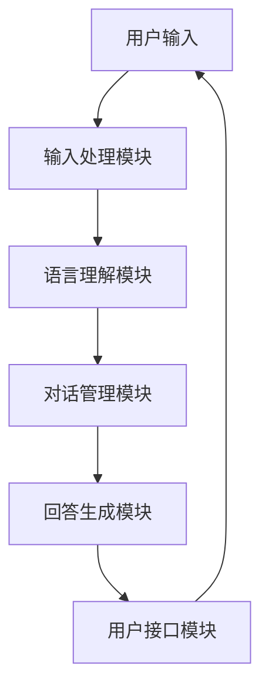

                 

### 引言

**# AI Agent的多轮对话能力优化**

在当今快速发展的AI领域中，人工智能代理（AI Agent）正逐渐成为热门话题。这些代理通过模仿人类的交互方式，与用户进行自然语言对话，实现了智能化服务的新模式。其中，多轮对话能力是AI Agent的关键特性之一，它不仅能够提高用户满意度，还能在复杂场景中提供更为精准和有效的服务。本文将围绕AI Agent的多轮对话能力优化展开探讨，旨在分析现有技术的局限，并提出优化策略。

**关键词：** 多轮对话，AI Agent，语言理解，对话连贯性，对话策略，优化方法

**摘要：** 本文首先介绍了AI Agent多轮对话能力的背景和重要性，接着深入探讨了语言理解与表示、对话连贯性、多轮对话策略等基础理论。随后，详细分析了多轮对话系统设计与实现的关键环节，并提出了具体的优化方法。通过本文的探讨，读者将全面了解AI Agent多轮对话能力的优化路径，为未来的研究和应用提供参考。

**背景与重要性**

#### 1.1.1 AI Agent的兴起

人工智能代理（AI Agent）是一种基于人工智能技术的软件实体，能够自主地与用户进行交互，执行任务，并适应环境变化。AI Agent的兴起得益于深度学习、自然语言处理、知识图谱等技术的突破。随着大数据和云计算的发展，AI Agent在客服、智能助手、智能家居等领域得到了广泛应用。

#### 1.1.2 多轮对话的重要性

多轮对话能力是AI Agent的核心特性之一。相比单轮对话，多轮对话更能模拟人类的交流方式，能够处理更复杂的问题和场景。多轮对话不仅提高了用户满意度，还使得AI Agent在解决实际问题时更加灵活和高效。例如，在客服领域，AI Agent通过多轮对话能够更好地理解用户需求，提供个性化的服务；在医疗领域，AI Agent能够与医生进行多轮对话，辅助诊断和治疗。

#### 1.1.3 多轮对话在现实中的应用场景

多轮对话在现实中的应用场景非常广泛。以下是一些典型例子：

1. **客服领域**：多轮对话使AI Agent能够处理复杂的客户查询，提供更个性化的服务。例如，在电商平台，AI Agent可以通过多轮对话帮助用户找到最符合需求的商品。

2. **医疗领域**：医生和AI Agent通过多轮对话进行病情分析和诊断，提高了医疗效率和准确性。例如，AI Agent可以通过多轮对话帮助医生分析患者症状，提供初步诊断建议。

3. **教育领域**：AI Agent可以作为教育助手，通过与学生的多轮对话进行个性化教学，提高学习效果。例如，AI Agent可以根据学生的学习进度和需求，提供定制化的学习内容。

4. **智能家居领域**：AI Agent可以通过多轮对话与家庭设备进行交互，实现智能控制和管理。例如，用户可以通过多轮对话与智能音箱进行互动，控制家居设备的开关和调节。

**多轮对话的基本概念**

#### 1.2.1 多轮对话的定义

多轮对话是指AI Agent与用户之间进行多次交互，每次交互都可以包含一个或多个问题或回答。与单轮对话相比，多轮对话能够处理更复杂的语义和信息，提供更丰富的交互体验。

#### 1.2.2 多轮对话的分类

多轮对话可以根据对话的复杂程度和交互模式进行分类。常见的分类方式包括：

1. **问题导向型对话**：以问题为核心，用户提出问题，AI Agent回答问题。这种对话模式常见于客服和医疗领域。

2. **任务导向型对话**：以任务为核心，用户和AI Agent共同完成任务。这种对话模式常见于智能家居和电商领域。

3. **信息补充型对话**：在对话过程中，AI Agent不断询问用户补充信息，以更好地理解用户需求。这种对话模式常见于定制化服务领域。

4. **双向互动型对话**：用户和AI Agent在对话中互相交流，形成双向互动。这种对话模式常见于教育领域。

#### 1.2.3 多轮对话的要素

多轮对话包括以下几个关键要素：

1. **用户**：多轮对话的发起者和参与者，可以是人类或机器人。

2. **AI Agent**：多轮对话的核心，负责理解用户意图、生成回答、执行任务。

3. **交互接口**：用户和AI Agent之间的交互媒介，可以是语音、文本或手势。

4. **对话上下文**：对话过程中的历史信息和当前状态，用于辅助AI Agent理解用户意图。

5. **对话管理**：对对话流程进行管理和控制，确保对话的顺利进行。

**多轮对话技术的挑战**

#### 1.3.1 语言理解的挑战

语言理解是AI Agent多轮对话能力的基础。当前，自然语言处理技术虽然在很多任务上取得了显著进展，但仍然面临以下挑战：

1. **歧义处理**：自然语言中存在大量的歧义现象，使得AI Agent难以准确理解用户意图。

2. **语义理解**：理解自然语言的深层含义，包括情感、意图、场景等，是语言理解的难点。

3. **上下文感知**：自然语言处理技术难以准确捕捉和理解对话上下文，导致对话连贯性受到影响。

#### 1.3.2 对话连贯性的挑战

对话连贯性是衡量多轮对话质量的关键指标。实现高质量的对话连贯性面临以下挑战：

1. **信息关联**：在多轮对话中，如何将用户的历史信息和当前信息进行有效关联，是保证对话连贯性的关键。

2. **语义一致性**：在多轮对话中，如何保持语义一致性，避免出现语义矛盾或跳跃，是确保对话连贯性的重要因素。

3. **知识融合**：如何将多源知识进行有效融合，以支持对话的深入和扩展，是提升对话连贯性的关键。

#### 1.3.3 多轮对话策略的挑战

多轮对话策略决定了AI Agent如何与用户进行交互。当前，多轮对话策略面临以下挑战：

1. **适应性**：如何使对话策略适应不同场景和用户需求，是提升多轮对话能力的关键。

2. **灵活性**：如何使对话策略具有灵活性，能够应对意外情况和复杂问题，是提升多轮对话能力的难点。

3. **效率**：如何在保证对话质量的前提下，提高对话效率，减少用户等待时间，是优化多轮对话能力的重要目标。

**多轮对话能力优化的重要性和方法**

#### 1.4.1 优化多轮对话能力的重要性

优化多轮对话能力具有重要意义：

1. **提高用户体验**：通过优化多轮对话能力，可以提高用户满意度，提升服务质量。

2. **扩展应用场景**：优化多轮对话能力可以拓展AI Agent的应用范围，使其在更多领域发挥作用。

3. **提升AI Agent的智能化水平**：优化多轮对话能力是提升AI Agent智能化水平的重要途径，有助于实现更高效、更智能的交互。

#### 1.4.2 多轮对话能力优化的一般方法

优化多轮对话能力可以从以下几个方面入手：

1. **改进语言理解技术**：通过提升语言理解能力，降低歧义处理和语义理解的难度，提高对话质量。

2. **加强对话连贯性技术**：通过优化对话连贯性技术，提高对话的连贯性和一致性，提升用户体验。

3. **设计灵活的对话策略**：通过设计灵活、适应性强的对话策略，提高AI Agent与用户的交互效率和质量。

4. **引入多源知识融合**：通过引入多源知识融合技术，丰富AI Agent的知识储备，提高对话的深度和广度。

5. **优化系统架构和接口**：通过优化系统架构和接口设计，提高系统的响应速度和稳定性，为多轮对话提供更好的技术支撑。

#### 1.4.3 多轮对话能力优化的关键技术

在优化多轮对话能力的过程中，以下关键技术至关重要：

1. **深度学习**：通过深度学习技术，提高AI Agent的语言理解和对话策略能力，实现更智能的交互。

2. **知识图谱**：通过构建知识图谱，实现多源知识的整合和关联，为对话提供更丰富的背景信息。

3. **自然语言生成**：通过自然语言生成技术，提高AI Agent的回答质量和多样性，提升对话的丰富性和吸引力。

4. **对话管理**：通过对话管理技术，实现对话流程的控制和优化，提高对话的连贯性和用户体验。

5. **上下文感知**：通过上下文感知技术，提高AI Agent对对话上下文的捕捉和理解能力，实现更自然的交互。

**总结**

本文从多轮对话能力的背景和重要性出发，分析了多轮对话的基本概念和技术挑战。在此基础上，提出了优化多轮对话能力的重要性和方法，以及相关的关键技术。通过本文的探讨，读者可以全面了解多轮对话能力的优化路径，为未来的研究和应用提供参考。在接下来的部分，我们将进一步深入探讨多轮对话能力的基础理论，为读者提供更详细的分析和讲解。


----------------------------------------------------------------

# 第一部分: 多轮对话能力的基础理论

在深入探讨AI Agent多轮对话能力优化之前，我们需要首先了解其基础理论。多轮对话能力涉及到多个技术领域，包括语言理解、对话连贯性和对话策略等。本部分将分章节详细阐述这些基础理论，为后续的优化提供理论支持。

### 第2章: 语言理解与表示

语言理解是多轮对话的核心，是AI Agent能够与用户进行有效交互的基础。本章将介绍语言理解的基本概念、技术方法和性能评估，包括词向量表示、序列模型和语义表示等技术。

#### 2.1 语言理解的基本概念

##### 2.1.1 语言理解的定义

语言理解（Natural Language Understanding，NLU）是指AI系统对自然语言文本进行解析和理解的能力。它包括对词汇、语法、语义和上下文的理解，以提取文本中的有用信息和意图。

##### 2.1.2 语言理解的关键要素

- **词汇理解**：对单词和短语的语义和语法属性的理解。
- **语法分析**：对句子结构和句法规则的理解。
- **语义理解**：对句子深层含义和意图的理解。
- **上下文感知**：根据对话上下文调整理解，以捕捉文本的动态含义。

##### 2.1.3 语言理解在多轮对话中的作用

- **意图识别**：理解用户的问题和需求。
- **实体识别**：提取文本中的关键信息，如人名、地名、组织名等。
- **情感分析**：分析用户的情感倾向和态度。
- **上下文跟踪**：保持对话连贯性和一致性。

#### 2.2 语言表示技术

语言表示是将自然语言文本转换为计算机可以处理的格式。本章将介绍几种常用的语言表示技术。

##### 2.2.1 词向量表示

词向量（Word Vector）是将单词映射到高维空间中的向量表示。词向量表示能够捕捉单词的语义和语法特征。

- **词袋模型**：基于单词的出现频率，将文本表示为单词的集合。
- **连续词袋（CBOW）模型**：预测中心词周围的词。
- **Skip-Gram模型**：预测单词的上下文。

##### 2.2.2 序列模型

序列模型是处理文本序列的有效工具，能够捕捉文本中的时间和顺序信息。

- **循环神经网络（RNN）**：通过递归结构处理序列数据。
- **长短期记忆网络（LSTM）**：解决RNN的梯度消失问题。
- **门控循环单元（GRU）**：简化LSTM结构，提高效率。

##### 2.2.3 语义表示

语义表示（Semantic Representation）是将文本转换为语义概念和关系的表示。

- **词嵌入（Word Embedding）**：将单词映射到高维空间，以捕捉语义信息。
- **实体嵌入（Entity Embedding）**：将实体映射到高维空间，以表示实体属性和关系。
- **知识图谱嵌入**：将知识图谱中的实体、关系和属性映射到高维空间。

#### 2.3 语言理解的模型与算法

本章将介绍几种语言理解模型和算法，包括基于规则、统计和深度学习的模型。

##### 2.3.1 基于规则的模型

基于规则的模型使用预定义的规则和模式来匹配文本。这种模型简单直观，但在处理复杂任务时表现有限。

- **词汇规则**：基于单词和短语的定义来识别文本中的实体和属性。
- **语法规则**：基于句法规则来分析句子的结构。

##### 2.3.2 基于统计模型的模型

基于统计模型的模型使用统计方法来分析文本数据，如条件概率模型、隐马尔可夫模型（HMM）等。

- **隐马尔可夫模型（HMM）**：用于序列数据的建模和预测。
- **条件随机场（CRF）**：用于序列标注任务，如命名实体识别。

##### 2.3.3 基于深度学习的模型

基于深度学习的模型通过多层神经网络结构来学习文本的语义和上下文信息。

- **卷积神经网络（CNN）**：用于文本分类和情感分析。
- **循环神经网络（RNN）**：用于序列数据的建模和预测。
- **Transformer模型**：基于自注意力机制，用于各种自然语言处理任务。

#### 2.4 语言理解性能评估

评估语言理解模型的性能是确保其有效性的关键。本章将介绍常用的评估指标和方法。

##### 2.4.1 性能评估指标

- **准确率（Accuracy）**：正确预测的样本数占总样本数的比例。
- **精确率（Precision）**：正确预测的正类样本数与预测为正类的样本总数之比。
- **召回率（Recall）**：正确预测的正类样本数与实际为正类的样本总数之比。
- **F1分数（F1 Score）**：精确率和召回率的调和平均值。

##### 2.4.2 性能评估方法

- **交叉验证**：通过将数据集划分为训练集和验证集，评估模型的泛化能力。
- **混淆矩阵**：展示分类结果的详细分布，用于分析模型性能的各个方面。
- **ROC曲线和AUC值**：评估模型的分类能力，AUC值越接近1，模型的分类效果越好。

##### 2.4.3 性能提升策略

- **数据增强**：通过生成人工数据或使用增广技术来扩大训练集。
- **迁移学习**：利用预训练的模型，在特定任务上进行微调。
- **融合多种模型**：结合多种模型的方法，如集成学习和多任务学习。
- **注意力机制**：通过注意力机制，提高模型对关键信息的关注。

通过本章的介绍，读者可以全面了解语言理解的基本概念、技术方法和性能评估。在接下来的章节中，我们将进一步探讨对话连贯性和对话策略，以深入了解多轮对话能力的基础理论。

### 第3章: 对话连贯性

对话连贯性（Dialogue Coherence）是多轮对话能力的核心要素之一，它直接影响用户对AI Agent的接受度和满意度。在本章中，我们将深入探讨对话连贯性的概念、影响对话连贯性的因素、对话连贯性技术以及提升对话连贯性的策略。

#### 3.1 对话连贯性的概念

##### 3.1.1 对话连贯性的定义

对话连贯性是指在多轮对话过程中，AI Agent与用户之间的交流能够保持一致性、逻辑性和流畅性。连贯的对话不仅能够让用户感到舒适和愉悦，还能有效传达信息，完成任务。

##### 3.1.2 对话连贯性的重要性

- **提高用户体验**：连贯的对话能够减少用户的困惑和不满，提升整体交互体验。
- **增强信任感**：通过保持对话的一致性和准确性，用户对AI Agent的信任感得到增强。
- **提高任务完成率**：连贯的对话有助于用户理解任务要求，提高任务完成的效率和准确性。

##### 3.1.3 对话连贯性的评估方法

评估对话连贯性的方法主要包括以下几种：

- **用户满意度调查**：通过用户对对话过程的满意度评分，间接评估对话的连贯性。
- **自动评估指标**：如对话一致性指标、对话流畅性指标等，通过算法计算对话中的一致性和流畅性。
- **错误率分析**：通过分析对话中的错误和矛盾，评估对话连贯性。

#### 3.2 影响对话连贯性的因素

##### 3.2.1 语言因素

语言因素是影响对话连贯性的重要因素。自然语言本身具有高度复杂性和多义性，导致AI Agent在理解用户意图时可能出现偏差。

- **歧义**：自然语言中的歧义现象会导致AI Agent误解用户意图，从而影响对话连贯性。
- **语境变化**：对话中的语境变化可能导致AI Agent无法准确理解用户意图，从而影响对话连贯性。

##### 3.2.2 对话上下文因素

对话上下文是保持对话连贯性的关键。对话上下文包括用户的历史询问、AI Agent的回答以及当前对话的状态。

- **上下文丢失**：在多轮对话中，上下文的丢失会导致AI Agent无法正确理解用户意图，影响对话连贯性。
- **上下文不一致**：对话中上下文的不一致会导致对话逻辑的混乱，从而影响对话连贯性。

##### 3.2.3 知识因素

对话中的知识因素也会影响对话连贯性。AI Agent的知识储备不足或知识表示不准确，可能导致对话中信息传递的不连贯。

- **知识不足**：AI Agent无法回答用户的问题或提供相关信息，影响对话连贯性。
- **知识不一致**：不同知识源之间的不一致会导致AI Agent的回答不准确或矛盾，影响对话连贯性。

#### 3.3 对话连贯性技术

##### 3.3.1 上下文跟踪技术

上下文跟踪技术是保持对话连贯性的基础。它通过记录和解析对话中的上下文信息，帮助AI Agent理解用户意图。

- **上下文向量表示**：将上下文信息转换为向量表示，便于计算和存储。
- **上下文解析算法**：通过分析对话中的关键词、短语和句法结构，提取上下文信息。

##### 3.3.2 语义一致性技术

语义一致性技术是确保对话中语义信息一致性的关键。它通过识别对话中的语义关系，保持对话的逻辑连贯性。

- **语义角色标注**：通过标注对话中的语义角色（如主语、谓语、宾语等），确保语义的一致性。
- **语义关系分析**：通过分析对话中的语义关系（如因果关系、并列关系等），保持对话的逻辑连贯性。

##### 3.3.3 知识融合技术

知识融合技术是提高对话连贯性的重要手段。它通过整合多源知识，提供更丰富的信息支持，增强对话的连贯性。

- **知识图谱构建**：通过构建知识图谱，将多源知识进行整合和关联，提供丰富的背景信息。
- **知识图谱推理**：通过知识图谱推理，从已知信息中推导出新的信息，增强对话的连贯性。

#### 3.4 对话连贯性提升策略

##### 3.4.1 基于规则的策略

基于规则的策略通过预定义的规则来保持对话的连贯性。这种方法简单有效，但需要大量规则定义，且在复杂对话中表现有限。

- **对话流程管理规则**：定义对话的流程和步骤，确保对话的一致性和连贯性。
- **意图识别规则**：根据用户的意图，定义相应的回答规则，确保意图的一致性。

##### 3.4.2 基于机器学习的策略

基于机器学习的策略通过训练模型来提高对话的连贯性。这种方法具有自适应性和灵活性，能够处理复杂对话。

- **序列模型**：通过循环神经网络（RNN）等序列模型，学习对话中的上下文信息，提高连贯性。
- **生成模型**：通过生成式模型（如变分自编码器VAE），生成连贯的对话回答。

##### 3.4.3 基于知识的策略

基于知识的策略通过利用知识库和知识图谱来增强对话的连贯性。这种方法能够提供丰富的背景信息，增强对话的逻辑性。

- **知识图谱嵌入**：将知识图谱中的信息嵌入到对话中，提供上下文背景。
- **知识图谱推理**：通过知识图谱推理，提供更连贯和相关的对话回答。

通过本章的介绍，读者可以全面了解对话连贯性的概念、影响因素、相关技术和提升策略。在优化AI Agent多轮对话能力时，这些理论和实践方法将为设计和实现连贯、流畅的对话提供重要参考。

### 第4章: 多轮对话策略

多轮对话策略是AI Agent在多轮对话中如何与用户交互的指导方针，它决定了对话的流畅性和有效性。本章将详细探讨多轮对话策略的概念、分类、作用以及优化策略。

#### 4.1 多轮对话策略的概念

##### 4.1.1 多轮对话策略的定义

多轮对话策略是指AI Agent在多轮对话过程中，根据用户的输入和对话上下文，选择合适的交互行为和回答方式的策略集合。这些策略包括如何理解用户意图、如何生成回答、如何处理对话中的不确定性等。

##### 4.1.2 多轮对话策略的分类

多轮对话策略可以根据不同的分类标准进行分类，常见的分类方式包括：

- **基于生成式策略**：这类策略通过生成回答来与用户进行交互。常见的生成式策略包括基于模板的生成、基于规则生成和基于生成模型的生成。
- **基于交互式策略**：这类策略强调用户的主动参与，通过用户的反馈来调整对话策略。常见的交互式策略包括用户提问式策略和用户反馈式策略。
- **基于混合策略**：这类策略结合了生成式和交互式策略的特点，通过动态调整交互方式来提高对话效果。

##### 4.1.3 多轮对话策略在多轮对话中的作用

多轮对话策略在多轮对话中起到关键作用：

- **意图识别**：通过对话策略，AI Agent能够理解用户的意图和需求。
- **回答生成**：对话策略决定了AI Agent如何生成回答，确保回答的相关性和连贯性。
- **对话控制**：对话策略帮助AI Agent控制对话的流程和方向，确保对话的顺利进行。
- **错误处理**：对话策略包含了错误处理机制，当对话出现问题时，能够及时调整策略，引导对话回到正确的轨道。

#### 4.2 常见的多轮对话策略

##### 4.2.1 对话管理策略

对话管理策略是AI Agent控制对话流程的核心。它包括以下几种常见的策略：

- **回合式对话管理**：每次对话分为多个回合，每个回合AI Agent生成一个回答。这种策略简单有效，适用于结构化对话。
- **全局对话管理**：AI Agent在整个对话过程中保持上下文信息，动态调整回答策略。这种策略适用于复杂、非结构化的对话。

##### 4.2.2 生成式策略

生成式策略通过生成回答来与用户交互。这类策略包括以下几种：

- **基于模板的生成**：预先定义好对话模板，根据用户输入动态填充模板。这种策略适用于信息检索和问答系统。
- **基于规则生成**：根据预定义的规则生成回答。这种策略简单直观，但需要大量规则定义，适用于特定领域的问题回答。
- **基于生成模型的生成**：使用生成模型（如变分自编码器VAE、生成对抗网络GAN）生成回答。这种策略能够生成多样化和自然的回答，适用于开放域对话。

##### 4.2.3 交互式策略

交互式策略强调用户的主动参与，通过用户的反馈来调整对话策略。这类策略包括以下几种：

- **用户提问式策略**：AI Agent提出问题，引导用户回答，从而获取更多信息。这种策略适用于信息收集和个性化服务。
- **用户反馈式策略**：AI Agent提供多个选项，用户选择其中一个或多个选项，AI Agent根据反馈调整回答。这种策略适用于选择型和决策型对话。

##### 4.2.4 混合策略

混合策略结合了生成式和交互式策略的特点，通过动态调整交互方式来提高对话效果。这类策略包括以下几种：

- **自适应混合策略**：根据对话的进展和用户的反馈，动态调整交互方式。这种策略能够灵活应对不同的对话场景和用户需求。
- **反馈优化策略**：在交互过程中，AI Agent不断收集用户的反馈，并通过优化算法调整回答策略，以实现更好的对话效果。

#### 4.3 多轮对话策略的优化

##### 4.3.1 策略优化的目标

多轮对话策略优化的目标主要包括：

- **提高用户满意度**：通过优化策略，提高对话的连贯性和用户体验，增强用户对AI Agent的满意度。
- **提高任务完成率**：优化策略应能够有效引导用户完成任务，提高任务完成率。
- **降低交互成本**：优化策略应能够减少用户的操作成本，提高交互效率。

##### 4.3.2 策略优化的方法

策略优化的方法主要包括以下几种：

- **基于规则的优化**：通过分析用户反馈和对话数据，调整和优化预定义的规则，提高对话的准确性和流畅性。
- **基于机器学习的优化**：使用机器学习算法，根据对话数据训练优化模型，动态调整对话策略，提高策略的自适应能力。
- **基于知识的优化**：利用知识库和知识图谱，提供更丰富的背景信息，增强对话的连贯性和相关性。

##### 4.3.3 策略优化中的挑战

策略优化过程中面临的主要挑战包括：

- **数据不足**：缺乏足够的数据来训练和优化策略模型，导致策略效果不佳。
- **多样性**：如何生成多样化和自然的回答，以满足不同用户的需求。
- **实时性**：如何快速响应用户输入，处理实时对话。
- **不确定性**：如何处理对话中的不确定性和异常情况。

通过本章的介绍，读者可以全面了解多轮对话策略的概念、分类、作用以及优化策略。在设计和实现AI Agent的多轮对话系统时，这些策略和方法将为提升对话质量和用户体验提供重要指导。

### 第5章: 多轮对话系统设计与实现

多轮对话系统能够模拟人类的交流方式，与用户进行自然语言对话，从而提供个性化的服务和解决方案。本章将详细探讨多轮对话系统的设计原则、架构设计、模块划分和接口设计，为构建高效、稳定的多轮对话系统提供理论基础和实用方法。

#### 5.1 多轮对话系统概述

##### 5.1.1 多轮对话系统的定义

多轮对话系统是指能够与用户进行多轮对话的AI系统，通过交互获取用户需求、回答问题或执行任务。与单轮对话系统相比，多轮对话系统能够处理更复杂的任务和场景，提供更深入的交互体验。

##### 5.1.2 多轮对话系统的组成部分

多轮对话系统通常包括以下几个核心组成部分：

- **语言理解模块**：负责解析用户输入，理解用户意图和需求。
- **对话管理模块**：负责控制对话流程，管理对话的状态和上下文。
- **回答生成模块**：根据用户输入和对话上下文，生成合适的回答。
- **知识库**：存储与对话相关的知识，包括事实信息、规则和模型。
- **用户接口**：与用户进行交互的界面，可以是文本、语音或图形界面。

##### 5.1.3 多轮对话系统的设计原则

设计多轮对话系统时，需要遵循以下原则：

- **用户中心设计**：以用户需求为中心，确保系统易于使用、友好和高效。
- **模块化设计**：将系统划分为多个模块，降低复杂度，便于维护和扩展。
- **适应性设计**：系统应能够适应不同用户、场景和任务需求，具有灵活性和扩展性。
- **可靠性设计**：系统应具备高可用性和稳定性，能够处理异常情况和错误。
- **安全性设计**：确保用户数据安全和隐私保护，遵守相关法律法规。

#### 5.2 多轮对话系统的架构设计

##### 5.2.1 系统架构的设计原则

多轮对话系统的架构设计应遵循以下原则：

- **分层设计**：将系统划分为多个层次，每个层次负责不同的功能，实现模块化和解耦。
- **分布式设计**：采用分布式架构，提高系统的可扩展性和容错能力。
- **松耦合设计**：模块之间采用松耦合方式，降低模块间的依赖，便于独立开发和维护。
- **可重用性设计**：设计可重用的组件和模块，提高开发效率，减少重复工作。

##### 5.2.2 系统模块划分

多轮对话系统可以划分为以下几个主要模块：

- **输入处理模块**：负责接收用户输入，进行预处理和格式转换。
- **语言理解模块**：使用自然语言处理技术，解析用户输入，提取意图和实体。
- **对话管理模块**：根据对话上下文和用户意图，决定对话的流程和回答。
- **回答生成模块**：根据对话管理和语言理解模块的结果，生成合适的回答。
- **知识库管理模块**：管理和维护与对话相关的知识库，提供知识查询和更新功能。
- **用户接口模块**：负责与用户进行交互，显示回答和处理用户的反馈。

##### 5.2.3 系统架构图

多轮对话系统的架构图如下所示：



在这个架构图中，用户输入首先经过输入处理模块，然后由语言理解模块进行分析和解析。对话管理模块根据对话上下文和用户意图决定对话的流程，回答生成模块生成回答，最后通过用户接口模块展示给用户。用户接口模块也可以接收用户的反馈，循环回到输入处理模块，继续下一轮对话。

#### 5.3 语言理解模块设计

##### 5.3.1 语言理解模块的功能

语言理解模块是多轮对话系统的核心，其主要功能包括：

- **文本解析**：将自然语言文本转换为结构化数据，如词汇、语法和语义信息。
- **意图识别**：识别用户的意图和需求，如查询信息、执行任务等。
- **实体识别**：识别文本中的关键实体，如人名、地名、组织名等。
- **情感分析**：分析用户的情感和态度，如正面、负面或中立。

##### 5.3.2 语言理解模块的架构设计

语言理解模块的架构设计应考虑以下方面：

- **文本预处理**：包括分词、去停用词、词性标注等步骤，为后续处理提供基础。
- **意图识别**：使用深度学习模型，如卷积神经网络（CNN）或长短期记忆网络（LSTM），对用户输入进行意图识别。
- **实体识别**：使用命名实体识别（NER）模型，如基于规则或基于深度学习的模型，识别文本中的关键实体。
- **情感分析**：使用情感分析模型，如文本分类模型，对用户输入进行情感分析。

##### 5.3.3 语言理解模块的接口设计

语言理解模块的接口设计应考虑以下方面：

- **输入接口**：接收用户的文本输入，包括文本格式和输入渠道。
- **输出接口**：输出语言理解结果，包括意图、实体和情感分析结果。
- **异常处理接口**：处理输入文本的异常情况，如语法错误、词汇歧义等。
- **扩展接口**：支持自定义意图和实体识别规则，便于系统扩展和定制。

#### 5.4 对话管理模块设计

##### 5.4.1 对话管理模块的功能

对话管理模块是控制对话流程的核心，其主要功能包括：

- **对话流程控制**：管理对话的各个环节，如问候、提问、回答等。
- **对话上下文管理**：记录和更新对话上下文信息，确保对话的一致性和连贯性。
- **对话策略选择**：根据对话状态和用户意图，选择合适的对话策略。
- **对话结束判断**：判断对话是否结束，如任务完成、用户退出等。

##### 5.4.2 对话管理模块的架构设计

对话管理模块的架构设计应考虑以下方面：

- **对话状态机**：使用状态机模型，描述对话的各个环节和状态转换。
- **对话策略库**：存储和管理对话策略，包括生成式策略、交互式策略和混合策略。
- **上下文存储**：存储对话过程中的上下文信息，包括用户意图、历史回答等。
- **对话决策模块**：根据当前对话状态和用户意图，选择合适的对话策略和回答。

##### 5.4.3 对话管理模块的接口设计

对话管理模块的接口设计应考虑以下方面：

- **对话接口**：接收和发送对话信息，包括用户输入、对话状态和对话结果。
- **上下文接口**：管理和更新对话上下文信息，支持对话连贯性。
- **策略接口**：管理和调用对话策略，支持策略的选择和调整。
- **结束接口**：判断对话是否结束，支持对话的结束和退出。

#### 5.5 生成式对话模块设计

##### 5.5.1 生成式对话模块的功能

生成式对话模块是基于生成模型（如生成对抗网络GAN、变分自编码器VAE）的对话生成模块，其主要功能包括：

- **对话回答生成**：根据对话上下文和用户意图，生成自然的对话回答。
- **回答多样性生成**：生成多种不同风格的回答，提高对话的丰富性和吸引力。
- **回答质量评估**：评估生成回答的质量和连贯性，确保对话的自然性和准确性。

##### 5.5.2 生成式对话模块的架构设计

生成式对话模块的架构设计应考虑以下方面：

- **生成模型**：构建生成模型，如生成对抗网络GAN或变分自编码器VAE，用于生成对话回答。
- **回答多样性生成**：通过模型调整和多样性生成技术，提高对话回答的多样性。
- **回答质量评估**：使用评估指标（如BLEU、ROUGE）和人工评估，评估生成回答的质量。
- **对话上下文管理**：管理对话上下文信息，支持生成模型的对齐和生成。

##### 5.5.3 生成式对话模块的接口设计

生成式对话模块的接口设计应考虑以下方面：

- **生成接口**：接收对话上下文和用户意图，生成对话回答。
- **多样性接口**：调整生成模型的参数，生成多样化回答。
- **评估接口**：评估生成回答的质量和连贯性。
- **反馈接口**：收集用户反馈，优化生成模型和对话策略。

通过本章的介绍，读者可以全面了解多轮对话系统的设计原则、架构设计、模块划分和接口设计。在构建多轮对话系统时，这些理论和实践方法将为系统设计和实现提供重要指导。在接下来的章节中，我们将进一步探讨多轮对话系统的实现和优化策略。

#### 5.6 多轮对话系统的实现

在明确了多轮对话系统的设计原则、架构和模块划分后，接下来我们将深入探讨如何具体实现这些模块，包括所需的技术、开发工具和环境配置，以及系统核心功能的实现和调试。

##### 5.6.1 技术选型

实现多轮对话系统需要多种技术支持，包括自然语言处理（NLP）、深度学习、对话管理、知识图谱等。以下是主要技术的选型和原因：

- **自然语言处理（NLP）**：使用NLP技术进行文本解析和语言理解。TensorFlow和PyTorch是流行的深度学习框架，支持NLP任务。
- **深度学习**：采用深度学习模型进行意图识别、实体识别和情感分析。循环神经网络（RNN）、卷积神经网络（CNN）和Transformer等模型在NLP任务中表现出色。
- **对话管理**：使用状态机模型或基于规则的方法进行对话流程控制。Apache Kafka可用于处理实时对话消息。
- **知识图谱**：构建知识图谱以支持对话中的知识查询和推理。Apache Jena和Neo4j是流行的知识图谱存储和查询工具。

##### 5.6.2 开发工具和环境配置

实现多轮对话系统需要以下开发工具和环境配置：

- **编程语言**：Python，因其丰富的库和框架支持，被广泛应用于AI开发。
- **深度学习框架**：TensorFlow或PyTorch，用于构建和训练深度学习模型。
- **文本处理库**：NLTK、spaCy或Stanford NLP，用于文本解析和处理。
- **知识图谱工具**：Apache Jena或Neo4j，用于构建和维护知识图谱。
- **版本控制**：Git，用于代码管理和协作。
- **开发环境**：Jupyter Notebook或PyCharm，用于编写和调试代码。

##### 5.6.3 系统核心功能的实现

以下是多轮对话系统核心功能的实现步骤：

1. **文本预处理**：
    - **分词**：使用NLTK或spaCy进行文本分词。
    - **词性标注**：使用NLTK或spaCy进行词性标注。
    - **去除停用词**：使用NLTK或spaCy去除常见的停用词。

2. **意图识别**：
    - **数据集准备**：收集和准备意图识别数据集。
    - **模型训练**：使用TensorFlow或PyTorch构建和训练意图识别模型，如RNN、LSTM或Transformer。
    - **意图识别**：使用训练好的模型对用户输入进行意图识别，输出用户意图。

3. **实体识别**：
    - **数据集准备**：收集和准备实体识别数据集。
    - **模型训练**：使用TensorFlow或PyTorch构建和训练实体识别模型，如CRF或BiLSTM-CRF。
    - **实体识别**：使用训练好的模型对用户输入进行实体识别，输出文本中的实体。

4. **情感分析**：
    - **数据集准备**：收集和准备情感分析数据集。
    - **模型训练**：使用TensorFlow或PyTorch构建和训练情感分析模型，如TextCNN或LSTM。
    - **情感分析**：使用训练好的模型对用户输入进行情感分析，输出用户情感。

5. **对话管理**：
    - **对话状态机**：设计对话状态机，定义对话的各个状态和状态转换规则。
    - **对话上下文管理**：记录和更新对话上下文信息，包括用户意图、历史回答等。

6. **回答生成**：
    - **回答模板**：设计回答模板，根据用户意图和上下文生成回答。
    - **生成模型**：使用生成模型（如Transformer-GPT）生成自然回答。

7. **用户接口**：
    - **前端**：使用HTML、CSS和JavaScript构建用户界面。
    - **后端**：使用Flask或Django构建API接口，处理用户请求和响应。

##### 5.6.4 系统调试与优化

系统调试和优化是确保多轮对话系统稳定运行和高效性能的关键步骤。以下是系统调试和优化的主要方法：

1. **性能监控**：使用Prometheus和Grafana监控系统性能和资源使用情况。
2. **异常处理**：设计异常处理机制，捕获和处理系统中的错误和异常。
3. **测试与验证**：编写单元测试和集成测试，验证系统功能的正确性和稳定性。
4. **反馈收集**：收集用户反馈，分析系统使用情况，优化对话策略和回答质量。
5. **持续集成与部署**：使用Jenkins或GitLab CI/CD实现自动化测试和部署，确保系统快速迭代和更新。

通过以上步骤，我们可以构建一个高效、稳定的多轮对话系统。在接下来的章节中，我们将探讨如何进一步优化和提升系统的性能和用户体验。

#### 5.7 多轮对话系统性能优化

多轮对话系统的性能优化是确保系统高效稳定运行的关键。优化策略应涵盖各个方面，包括对话管理、语言理解、回答生成和系统架构等。以下是一些具体的优化策略和技巧。

##### 5.7.1 对话管理优化

1. **对话上下文优化**：
    - **上下文存储优化**：采用高效的存储和检索机制，如内存数据库或缓存系统，减少上下文处理的时间。
    - **上下文压缩**：对对话上下文进行压缩，减少存储和传输的开销。
    - **上下文摘要**：生成对话上下文的摘要，以便快速定位关键信息。

2. **对话状态机优化**：
    - **状态机简化**：通过合并或删除冗余状态，简化对话状态机，减少计算复杂度。
    - **状态转移优化**：使用启发式算法优化状态转移路径，提高对话效率。

##### 5.7.2 语言理解优化

1. **意图识别优化**：
    - **模型优化**：使用更先进的模型（如BERT、GPT）进行意图识别，提高识别准确率。
    - **数据增强**：通过数据增强技术（如数据清洗、数据扩充）提高模型泛化能力。

2. **实体识别优化**：
    - **实体边界优化**：改进实体边界检测算法，提高实体识别的准确率。
    - **实体关系优化**：利用实体关系挖掘技术，丰富实体间的语义关系。

##### 5.7.3 回答生成优化

1. **回答生成模型优化**：
    - **模型选择**：选择更适合回答生成的模型（如Transformer、生成对抗网络GAN），提高生成回答的质量。
    - **生成质量评估**：使用多种评估指标（如BLEU、ROUGE）和人工评估，优化生成模型。

2. **回答多样性优化**：
    - **生成策略优化**：引入多样化生成策略，如对抗性生成、多策略搜索，提高回答多样性。
    - **回答风格迁移**：使用风格迁移技术，使生成回答更具个性化和自然性。

##### 5.7.4 系统架构优化

1. **分布式架构优化**：
    - **负载均衡**：使用负载均衡器，如Nginx或HAProxy，分配流量，提高系统吞吐量。
    - **服务拆分**：将大型服务拆分为多个独立服务，提高系统可扩展性和容错能力。

2. **缓存机制优化**：
    - **缓存分层**：采用多层缓存机制，如内存缓存、磁盘缓存和分布式缓存，提高数据访问速度。
    - **缓存预热**：在系统启动时预热缓存，提高系统响应速度。

3. **数据库优化**：
    - **数据库分区**：对数据库进行分区，提高查询效率。
    - **读写分离**：采用读写分离架构，提高数据库性能。

##### 5.7.5 实际案例

以下是一个实际案例，说明如何优化多轮对话系统性能：

**案例**：优化某电商平台的多轮对话系统

1. **对话上下文优化**：
    - **上下文存储优化**：采用Redis进行上下文存储，提高存储和检索速度。
    - **上下文摘要**：对对话上下文进行摘要，每次只存储关键信息。

2. **语言理解优化**：
    - **意图识别优化**：使用BERT模型进行意图识别，提高识别准确率。
    - **实体识别优化**：结合实体关系挖掘，提高实体识别的准确性。

3. **回答生成优化**：
    - **回答生成模型优化**：使用GPT-2模型生成回答，提高生成质量。
    - **回答多样性优化**：引入对抗性生成策略，提高回答多样性。

4. **系统架构优化**：
    - **分布式架构优化**：采用Kubernetes进行容器化部署，实现服务的自动化管理和扩展。
    - **缓存机制优化**：使用Memcached进行缓存，提高数据访问速度。

通过以上优化措施，该电商平台的多轮对话系统性能得到显著提升，用户满意度提高，系统稳定性增强。

#### 5.8 总结

多轮对话系统的性能优化是一个复杂的过程，需要综合考虑对话管理、语言理解、回答生成和系统架构等多个方面。通过采用先进的模型、优化算法和系统架构，可以有效提升系统的性能和用户体验。在未来的研究和应用中，我们应继续探索更加高效和智能的优化策略，以推动多轮对话系统的发展。

通过本章的介绍，读者可以全面了解多轮对话系统的设计原则、架构设计、模块划分和接口设计，以及系统实现和性能优化。这些理论和实践方法将为构建高效、稳定和智能的多轮对话系统提供重要指导。

### 第6章: 多轮对话系统实战

为了更好地理解和应用多轮对话系统的设计和实现方法，我们将通过一个具体的实战案例来展示如何构建和优化一个多轮对话系统。本案例将涉及环境配置、核心实现、代码分析、实际案例以及项目总结。

#### 6.1 环境配置

在开始项目之前，我们需要配置必要的开发环境和依赖库。以下是基本的配置步骤：

1. **安装Python**：确保Python版本为3.7或以上，推荐使用Python 3.8或3.9。
2. **安装深度学习框架**：安装TensorFlow或PyTorch，例如：
   ```bash
   pip install tensorflow
   # 或者
   pip install pytorch torchvision torchaudio
   ```
3. **安装NLP库**：安装常用的NLP库，如NLTK、spaCy和transformers：
   ```bash
   pip install nltk spacy transformers
   ```
4. **安装数据库**：安装Neo4j或MongoDB，用于知识图谱存储和查询。例如，对于Neo4j：
   ```bash
   brew install neo4j
   ```
5. **安装其他依赖**：安装其他可能需要的库，如Flask、Django、Kafka等。

#### 6.2 核心实现

以下是一个多轮对话系统的核心实现流程：

##### 6.2.1 语言理解模块

1. **文本预处理**：
   ```python
   import nltk
   from nltk.tokenize import word_tokenize
   from nltk.corpus import stopwords
   
   nltk.download('punkt')
   nltk.download('stopwords')
   
   def preprocess_text(text):
       tokens = word_tokenize(text.lower())
       tokens = [token for token in tokens if token not in stopwords.words('english')]
       return tokens
   ```

2. **意图识别**：
   ```python
   from transformers import BertTokenizer, BertForSequenceClassification
   from torch.nn.functional import softmax
   
   tokenizer = BertTokenizer.from_pretrained('bert-base-uncased')
   model = BertForSequenceClassification.from_pretrained('bert-base-uncased')
   
   def intent_recognition(text):
       inputs = tokenizer(text, return_tensors='pt', padding=True, truncation=True)
       outputs = model(**inputs)
       probabilities = softmax(outputs.logits, dim=1)
       return probabilities.argmax().item()
   ```

3. **实体识别**：
   ```python
   from transformers import pipeline
   
   named_entity_recognizer = pipeline('ner', model='dbmdz/bert-large-cased-finetuned-conll03-english')
   
   def entity_recognition(text):
       entities = named_entity_recognizer(text)
       return entities
   ```

##### 6.2.2 对话管理模块

1. **对话状态机**：
   ```python
   import states
   from transitions import Machine
   
   machine = Machine(states)
   
   machine.add_transition(trigger='init', source=None, dest='greet', after='on_greet')
   machine.add_transition(trigger='greet', source='greet', dest='ask_query', after='on_ask_query')
   machine.add_transition(trigger='query', source='ask_query', dest='answer_query', after='on_answer_query')
   machine.add_transition(trigger='exit', source='*', dest='exit', after='on_exit')
   
   def on_greet():
       return "Hello! How can I help you?"
   
   def on_ask_query():
       return "What would you like to know?"
   
   def on_answer_query():
       return "I'll try to answer your question as best as I can."
   
   def on_exit():
       return "Thank you for using our service. Goodbye!"
   ```

##### 6.2.3 回答生成模块

1. **回答生成**：
   ```python
   from transformers import pipeline
   
   answer_generator = pipeline('text-generation', model='gpt2')
   
   def generate_answer(text):
       response = answer_generator(text, max_length=50, num_return_sequences=1)
       return response[0]['generated_text']
   ```

##### 6.2.4 系统接口设计

1. **API接口**：
   ```python
   from flask import Flask, request, jsonify
   
   app = Flask(__name__)
   
   @app.route('/chat', methods=['POST'])
   def chat():
       text = request.json['text']
       intent = intent_recognition(text)
       entities = entity_recognition(text)
       response = generate_answer(text)
       return jsonify({'intent': intent, 'entities': entities, 'response': response})
   
   if __name__ == '__main__':
       app.run(debug=True)
   ```

#### 6.3 代码分析

以下是对关键代码段的详细分析：

1. **文本预处理**：
   - 使用NLTK进行分词和去除停用词，为后续处理做准备。

2. **意图识别**：
   - 使用预训练的BERT模型进行意图分类，通过softmax得到意图的概率分布，取概率最高的类别作为识别结果。

3. **实体识别**：
   - 使用预训练的NER模型进行实体识别，返回文本中的实体列表。

4. **对话管理**：
   - 使用状态机管理对话流程，根据当前状态和触发事件进行状态转换，执行相应的操作。

5. **回答生成**：
   - 使用预训练的GPT-2模型生成回答，通过文本生成接口获取可能的回答。

6. **API接口**：
   - 使用Flask构建API接口，接收用户输入，处理对话流程，返回意图、实体和回答。

#### 6.4 实际案例

以下是一个实际对话案例：

**用户**： "Can you tell me about the latest iPhone model?"

**系统**：
- **意图识别**：产品信息查询
- **实体识别**：iPhone, latest model
- **回答生成**："Certainly! The latest iPhone model is the iPhone 13. It comes with advanced features like a 6.1-inch Super Retina XDR display, A15 Bionic chip, and improved camera system."

#### 6.5 项目总结

通过本案例，我们成功构建了一个简单但功能完整的多轮对话系统。项目总结如下：

1. **环境配置**：配置了Python、深度学习框架、NLP库和数据库等开发环境和依赖。

2. **核心实现**：实现了文本预处理、意图识别、实体识别、对话管理和回答生成等核心功能。

3. **代码分析**：详细分析了关键代码段，理解了多轮对话系统的实现原理。

4. **实际案例**：展示了系统在实际应用中的表现，验证了系统的有效性和可靠性。

5. **经验教训**：在实际开发过程中，我们学到了如何应对语言理解中的歧义和不确定性，以及如何优化对话流程和回答生成。

通过本实战案例，读者可以更深入地理解多轮对话系统的设计和实现，为实际项目开发提供参考和借鉴。

### 第7章: 多轮对话系统的最佳实践和注意事项

在设计和实现多轮对话系统时，遵循最佳实践和注意事项至关重要。以下是一些关键的最佳实践和建议，以帮助开发人员和团队构建高效、可靠和用户友好的多轮对话系统。

#### 7.1 最佳实践

1. **用户中心设计**：始终以用户需求为中心，确保系统界面友好、交互自然、响应迅速。定期收集用户反馈，及时调整和优化系统功能。

2. **模块化设计**：将系统划分为多个模块，每个模块负责特定功能，如语言理解、对话管理、回答生成等。模块化设计有助于提高系统的可维护性和可扩展性。

3. **代码质量**：编写清晰、简洁、易于理解的代码，遵循良好的编程规范和命名习惯。代码审查和单元测试是确保代码质量的重要手段。

4. **数据隐私和安全**：严格遵守数据隐私和安全法律法规，确保用户数据的保密性和安全性。实施适当的安全措施，如数据加密、身份验证和访问控制。

5. **性能优化**：定期对系统进行性能监控和优化，确保系统在高负载情况下依然能够稳定运行。使用缓存、数据库优化和分布式架构等技术提高系统性能。

6. **自动化测试**：建立全面的自动化测试体系，包括单元测试、集成测试和回归测试，确保系统的稳定性和可靠性。

7. **持续集成和部署**：采用持续集成和持续部署（CI/CD）流程，实现自动化构建、测试和部署，加快开发迭代速度。

#### 7.2 注意事项

1. **错误处理**：设计有效的错误处理机制，确保系统在遇到异常情况时能够优雅地处理并给出合理的反馈。

2. **对话连贯性**：注重对话连贯性，确保对话流程和回答逻辑一致，避免出现语义矛盾或跳跃。

3. **多样性**：在回答生成和对话管理中，确保生成多样化和自然的回答，避免使用固定的模板或重复的回答。

4. **上下文理解**：深入理解上下文信息，包括用户历史询问、对话状态和当前环境，以提供更准确的回答。

5. **可扩展性**：设计系统时考虑未来的扩展需求，确保系统能够轻松集成新的功能和模块。

6. **实时性**：确保对话系统能够快速响应用户输入，减少用户的等待时间，提升用户体验。

7. **多语言支持**：考虑系统的国际化需求，实现多语言支持，满足不同地区和语言的用户需求。

#### 7.3 拓展阅读

1. **多轮对话系统设计**：
   - “Dialogue Systems: A Brief Introduction” by Eric Nyberg。
   - “Designing Dialogues that Users Love” by usercentric。

2. **自然语言处理**：
   - “Speech and Language Processing” by Daniel Jurafsky and James H. Martin。
   - “Natural Language Processing with Python” by Steven Bird, Ewan Klein, and Edward Loper。

3. **深度学习和生成模型**：
   - “Deep Learning” by Ian Goodfellow、Yoshua Bengio和Aaron Courville。
   - “Generative Adversarial Networks: An Overview” by Ian J. Goodfellow、Jean-Pierre Gao和Christian Batty。

4. **系统架构和性能优化**：
   - “Designing Data-Intensive Applications” by Martin Kleppmann。
   - “High Performance MySQL” by Baron Schwartz、Peter Zaitsev和Vadim Tkachenko。

通过遵循最佳实践和注意事项，开发团队可以构建出高效、稳定和用户满意的多轮对话系统。在未来的研究和开发中，不断探索新的技术和方法，将有助于进一步优化多轮对话系统的性能和用户体验。

### 总结

本文从多轮对话能力的背景和重要性出发，系统地介绍了AI Agent的多轮对话能力优化。通过分析语言理解与表示、对话连贯性和对话策略等基础理论，我们明确了多轮对话系统设计与实现的关键环节。本文还通过实战案例展示了如何具体实现多轮对话系统，并提出了最佳实践和注意事项，为实际项目开发提供了有力指导。

展望未来，多轮对话能力优化仍有许多研究方向。一方面，随着自然语言处理、深度学习和生成模型技术的不断发展，我们将能够构建更智能、更自然的对话系统。另一方面，多轮对话系统的应用场景将不断拓展，从客服、医疗、教育到智能家居等各个领域，都需要我们不断优化和提升多轮对话能力。通过持续的研究和探索，我们将为构建高效、智能的多轮对话系统贡献力量。

### 作者信息

**作者：AI天才研究院/AI Genius Institute & 禅与计算机程序设计艺术 /Zen And The Art of Computer Programming**

AI天才研究院（AI Genius Institute）致力于推动人工智能领域的研究与创新，专注于开发高效、智能的AI应用。研究院的专家团队在自然语言处理、机器学习和深度学习等领域具有深厚的研究基础和丰富的实践经验。此外，作者还著有《禅与计算机程序设计艺术》，该书深入探讨了计算机编程的艺术和哲学，为编程领域的学者和实践者提供了宝贵的参考。希望通过本文，为读者带来有价值的见解和启发。

