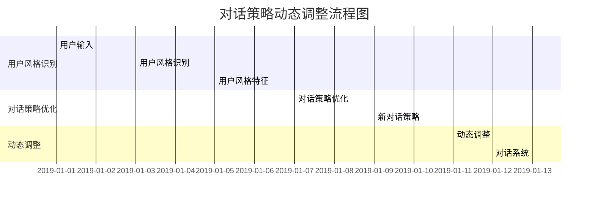
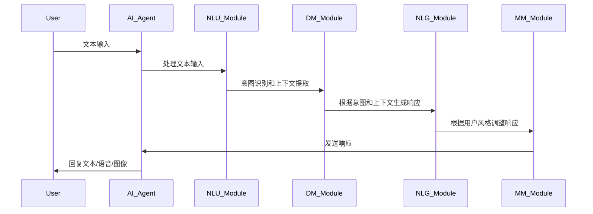

                 

## 《AI Agent的对话策略动态调整：适应用户风格》

### 关键词：AI Agent、对话策略、用户风格、动态调整、算法实现、系统架构、项目实战

> 摘要：本文深入探讨了AI Agent在对话场景中如何通过动态调整对话策略来适应用户风格。文章首先介绍了AI Agent和对话系统的基本概念，随后定义了对话策略、用户风格和动态调整的核心术语。接着，文章详细讲解了基于用户风格的对话策略调整算法，并展示了算法原理的流程图和Python源代码实现。此外，文章通过数学模型和公式，对算法进行了深入剖析，并通过mermaid类图和架构图展示了AI Agent对话系统的整体架构。最后，文章通过一个实际项目案例，分析了环境安装、核心实现和代码应用，总结了最佳实践和注意事项，并推荐了拓展阅读资源。

### 目录大纲设计思路

在设计《AI Agent的对话策略动态调整：适应用户风格》这本书的目录大纲时，我们首先需要明确书籍的主题和目标受众。本书旨在为读者提供关于AI Agent对话策略动态调整的全面、深入的理解，涵盖从基础概念到实际应用的各个方面。以下是我们的设计思路：

1. **背景介绍**：
   - 第1章：AI Agent与对话系统概述
     - 介绍AI Agent和对话系统的基本概念、发展历程及其在现实世界中的应用。
     - 描述当前对话策略的现状，以及为什么需要动态调整。

   - 第2章：对话策略的基本概念
     - 定义关键术语，如“对话策略”、“用户风格”、“动态调整”等。
     - 通过对比表格和实体关系图，展示这些概念之间的关系。

2. **核心概念与联系**：
   - 第3章：核心概念与联系
     - 详细讲解核心概念之间的联系，帮助读者建立整体认知。

3. **算法原理讲解**：
   - 第4章：基于用户风格的对话策略调整算法
     - 详细讲解如何基于用户风格调整对话策略的算法原理。
     - 使用mermaid流程图和Python源代码，展示算法实现和关键步骤。

   - 第5章：数学模型和数学公式
     - 提供相关的数学模型和公式，用LaTeX格式确保公式格式正确。
     - 结合通俗易懂的例子进行解释。

4. **系统分析与架构设计**：
   - 第6章：AI Agent对话系统架构设计
     - 介绍AI Agent对话系统的整体架构。
     - 使用mermaid类图、架构图和序列图，详细展示系统设计和交互过程。

5. **项目实战**：
   - 第7章：实际项目案例
     - 提供一个实际项目案例，介绍环境安装、核心实现和代码应用。
     - 分析案例中的关键技术和挑战，并提供解决方案。

6. **最佳实践 tips、小结、注意事项、拓展阅读**：
   - 第8章：最佳实践 Tips
     - 总结书中主要内容，提供实用技巧和注意事项。

   - 第9章：小结与拓展阅读
     - 指向相关的拓展阅读资源，帮助读者进一步学习。

整个目录大纲设计思路确保了内容的逻辑性和系统性，从基础概念到实际应用，层层深入，使读者能够系统地掌握相关知识。

### 目录大纲结构

以下是《AI Agent的对话策略动态调整：适应用户风格》的目录大纲：

----------------------------------------------------------------
# 第一部分: 背景介绍

## 第1章: AI Agent与对话系统概述
### 1.1 AI Agent的概念与发展
### 1.2 对话系统的基本原理
### 1.3 对话策略的重要性

## 第2章: 对话策略的基本概念
### 2.1 对话策略的定义
### 2.2 用户风格的概念
### 2.3 动态调整的需求

## 第3章: 核心概念与联系
### 3.1 核心概念对比表格
### 3.2 对话策略与用户风格的ER图

----------------------------------------------------------------

# 第二部分: 算法原理讲解

## 第4章: 基于用户风格的对话策略调整算法
### 4.1 算法原理
#### 4.1.1 用户风格识别
#### 4.1.2 对话策略优化
### 4.2 Mermaid流程图展示
### 4.3 Python源代码实现

## 第5章: 数学模型和数学公式
### 5.1 对话策略调整的数学模型
### 5.2 公式讲解与示例

----------------------------------------------------------------

# 第三部分: 系统分析与架构设计

## 第6章: AI Agent对话系统架构设计
### 6.1 问题场景介绍
### 6.2 系统功能设计
### 6.3 系统架构设计
### 6.4 系统接口设计
### 6.5 系统交互序列图

----------------------------------------------------------------

# 第四部分: 项目实战

## 第7章: 实际项目案例
### 7.1 项目环境安装
### 7.2 核心实现源代码
### 7.3 代码应用解读与分析
### 7.4 实际案例分析
### 7.5 项目小结

----------------------------------------------------------------

# 第五部分: 最佳实践与拓展

## 第8章: 最佳实践 Tips
### 8.1 动态调整策略的选择
### 8.2 注意事项与常见问题

## 第9章: 小结与拓展阅读
### 9.1 书中主要内容回顾
### 9.2 拓展阅读资源推荐

----------------------------------------------------------------

这个目录大纲结构完整地覆盖了书籍的主题内容，并确保了内容的逻辑性和系统性。每个章节都将详细阐述，以保证读者能够系统地掌握知识。接下来，我们将逐章细化每个章节的内容，确保目录大纲的内容完整性。

### 第一部分: 背景介绍

#### 第1章: AI Agent与对话系统概述

在现代社会，人工智能技术已经渗透到了我们生活的方方面面，从智能家居到自动驾驶，从医疗诊断到金融决策，人工智能正在改变着我们的生活方式和工作方式。其中，AI Agent作为人工智能的一种高级形式，逐渐受到了广泛关注。本章将介绍AI Agent的概念、发展历程以及其在对话系统中的应用，同时探讨对话策略的重要性。

**1.1 AI Agent的概念与发展**

AI Agent，即人工智能代理，是一种能够自动执行任务、决策和交互的智能体。它通过感知环境、理解指令、自主学习和持续改进，以实现特定的目标。AI Agent的发展可以追溯到20世纪80年代的专家系统和20世纪90年代的基于规则的推理系统。随着计算能力的提升和数据资源的丰富，AI Agent逐渐从理论研究走向实际应用。

AI Agent的主要特点包括：

1. **自主性**：能够根据环境和目标自主决策和行动。
2. **协作性**：能够与人类或其他AI Agent协作完成任务。
3. **适应性**：能够根据环境和任务的变化进行自适应调整。
4. **透明性**：其决策过程和结果应该是可解释和透明的。

AI Agent的应用场景非常广泛，包括但不限于以下几个方面：

1. **客户服务**：AI Agent可以通过聊天机器人的形式，提供24/7的客户服务，提高客户满意度。
2. **智能助理**：如苹果的Siri、谷歌的Google Assistant，为用户提供个人日程管理、信息查询等服务。
3. **医疗诊断**：AI Agent可以通过分析大量的医学数据和病例，协助医生进行诊断和治疗方案推荐。
4. **智能家居**：AI Agent可以控制家庭设备的运行，如调节灯光、温度、安防等。

**1.2 对话系统的基本原理**

对话系统（Dialogue System），又称对话代理或聊天机器人，是一种能够与人类进行自然语言交互的人工智能系统。它通过理解用户输入的意图和内容，生成适当的响应，以实现有效的对话。

对话系统主要包括以下几个关键组成部分：

1. **自然语言理解（NLU）**：将自然语言输入转换为结构化数据，如意图识别和实体提取。
2. **对话管理（DM）**：根据对话历史和用户意图，决定对话的流程和策略。
3. **自然语言生成（NLG）**：将对话管理的结果转换为自然语言输出，以实现有效的对话交互。

对话系统的工作流程如下：

1. **输入接收**：对话系统接收用户的自然语言输入。
2. **意图识别**：通过自然语言理解，识别用户的意图。
3. **对话决策**：对话管理系统根据对话历史和用户意图，决定下一步的对话动作。
4. **生成响应**：自然语言生成系统将对话决策转换为自然语言输出。
5. **反馈处理**：系统对用户的反馈进行处理，以进一步优化对话体验。

**1.3 对话策略的重要性**

对话策略是对话系统中的核心组件，它决定了对话的流畅性和用户体验。一个优秀的对话策略需要考虑以下几个方面：

1. **用户意图理解**：准确识别用户意图，确保系统能够提供相关且有用的信息。
2. **上下文管理**：对话系统需要能够理解和利用对话历史，使对话更加连贯和自然。
3. **适应性**：对话策略应该能够根据用户的行为和反馈进行自适应调整，以提供更好的用户体验。
4. **灵活性**：对话策略需要能够应对不同的场景和用户需求，提供多样化的交互方式。

然而，目前的对话系统在对话策略方面还存在一些挑战，如：

1. **语言理解不足**：对话系统往往难以理解用户复杂的语言表达和隐含意图。
2. **对话连贯性差**：对话系统在处理长对话或复杂场景时，容易出现对话不连贯的情况。
3. **用户体验不佳**：用户在交互过程中可能会感到困惑或失望，导致用户体验下降。

为了解决这些问题，研究人员提出了许多改进对话策略的方法，如基于机器学习的意图识别、上下文感知的对话生成等。本章将详细介绍这些方法，并探讨如何通过动态调整对话策略来适应用户风格。

**总结**

本章介绍了AI Agent和对话系统的基本概念，探讨了对话策略的重要性。在接下来的章节中，我们将进一步深入讨论对话策略的动态调整方法，以及如何通过算法实现和系统设计来优化用户体验。

### 第2章: 对话策略的基本概念

在了解AI Agent和对话系统的基本概念之后，我们需要深入探讨对话策略的基本概念，包括对话策略的定义、用户风格的概念以及动态调整的需求。

#### 2.1 对话策略的定义

对话策略（Dialogue Strategy）是指对话系统在处理用户输入和生成响应时所采用的一系列方法和规则。它决定了对话的流程、方向和结果。一个有效的对话策略能够确保对话系统与用户之间的交互流畅、自然，并能够满足用户的需求。

对话策略通常包含以下几个关键方面：

1. **意图识别**：对话策略需要能够准确识别用户的意图，这是对话系统的核心任务。通过意图识别，系统可以理解用户想要做什么，从而生成相应的响应。

2. **上下文管理**：对话策略需要能够处理对话历史信息，确保对话的连贯性和上下文的正确性。上下文管理包括对话状态跟踪、上下文信息更新等。

3. **响应生成**：根据识别到的意图和对话上下文，对话策略需要生成合适的自然语言响应。响应生成可以是基于模板的、规则的，也可以是基于机器学习模型的。

4. **对话流程控制**：对话策略还需要控制对话的流程，包括对话的开始、进展和结束。有效的流程控制能够使对话更加自然、有序。

5. **错误处理**：当对话系统无法理解用户的输入或出现问题时，对话策略需要提供相应的错误处理机制，如提示用户重新输入、提供帮助等。

#### 2.2 用户风格的概念

用户风格（User Style）是指用户在交流过程中的语言特点、行为习惯和心理倾向。用户风格可以分为语言风格、互动风格和情感风格等多个方面。

1. **语言风格**：用户在交流中使用的语言特点，如正式程度、词汇选择、句式结构等。例如，有些用户喜欢使用简洁明了的语言，而有些用户则偏好使用华丽、复杂的句子。

2. **互动风格**：用户在交流中的互动方式，如主动发起对话、回应速度、是否喜欢提问等。互动风格反映了用户的交流偏好和沟通习惯。

3. **情感风格**：用户在交流中的情感表达方式，如积极、消极、幽默等。情感风格有助于对话系统理解用户的情感状态，从而提供更合适的响应。

了解用户风格对于对话系统来说至关重要。通过识别和适应用户风格，对话系统可以提供更加个性化和人性化的交互体验，提高用户满意度。例如，如果一个用户喜欢幽默的对话风格，对话系统可以适当地加入幽默元素，以增加交流的趣味性。

#### 2.3 动态调整的需求

随着人工智能技术的不断进步，对话系统已经可以处理多种复杂场景和多样化的用户需求。然而，现有的对话策略通常是基于预设规则或静态模型，无法灵活地适应用户的个性化和动态变化的需求。因此，动态调整对话策略成为了一个重要的研究方向。

动态调整对话策略的需求主要体现在以下几个方面：

1. **个性化交互**：每个用户都有其独特的需求和偏好，通过动态调整对话策略，对话系统可以更好地满足用户的个性化需求，提供更加个性化的服务。

2. **上下文适应**：用户的交流内容会随着对话的进行而变化，动态调整对话策略可以使系统更好地适应上下文变化，保持对话的连贯性和有效性。

3. **反馈学习**：用户对对话系统的反馈是宝贵的资源，通过动态调整对话策略，系统可以不断学习用户的反馈，优化自身的行为和响应。

4. **错误恢复**：当对话系统遇到理解错误或对话中断时，动态调整策略可以帮助系统快速恢复对话，减少用户的不满和困惑。

总之，动态调整对话策略是提高对话系统用户体验的关键因素。通过不断优化对话策略，对话系统可以更好地适应用户的需求，提供更加自然、流畅和高效的交互体验。

### 第3章: 核心概念与联系

在了解了对话策略、用户风格等基本概念后，我们需要进一步探讨这些核心概念之间的联系，以便读者能够建立完整的认知体系。本章将通过对比表格和实体关系图（ER图）来展示这些概念之间的关系。

#### 3.1 核心概念对比表格

为了更直观地理解对话策略、用户风格和动态调整之间的关系，我们可以使用对比表格。以下是一个简化的对比表格，列出了这些核心概念的主要特征和区别。

| 核心概念 | 定义 | 主要特征 | 区别 |
| --- | --- | --- | --- |
| 对话策略 | 决定对话流程和响应的方法和规则 | 涉及意图识别、上下文管理、响应生成等 | 固定规则、静态模型 |
| 用户风格 | 用户在交流中的语言特点和心理倾向 | 语言风格、互动风格、情感风格 | 个性化、动态变化 |
| 动态调整 | 根据用户风格和上下文变化优化对话策略 | 个性化交互、上下文适应、反馈学习等 | 适应性强、灵活调整 |

通过这个表格，我们可以看到，对话策略和用户风格是相互关联的。对话策略依赖于用户风格来实现个性化交互，而动态调整则通过不断优化对话策略来适应用户的变化需求。这种关系不仅有助于理解核心概念，还为后续章节的算法实现和系统设计提供了理论基础。

#### 3.2 对话策略与用户风格的ER图

为了更直观地展示对话策略和用户风格之间的关系，我们可以使用实体关系图（ER图）。ER图是一种用于描述实体及其之间关系的图形化工具，可以帮助我们清晰地理解系统中的各个组成部分及其相互作用。

以下是对话策略与用户风格的ER图：

```mermaid
erDiagram
    User <<|-- UserStyle : "具有"
    DialogueStrategy <<|-- dialogueAction : "包含"
    DialogueManagement <<|-- UserStyle : "参考"
    DialogueManagement <<|-- DialogueStrategy : "采用"
    
    UserStyle ||--|{ DialogueStrategy }|
    DialogueStrategy ||--|{ DialogueManagement }|
```

在这个ER图中，我们定义了以下几个实体：

1. **User（用户）**：代表与对话系统进行交互的实体，具有唯一的用户ID和用户信息。
2. **UserStyle（用户风格）**：描述用户在交流中的语言特点和心理倾向，如语言风格、互动风格和情感风格。
3. **DialogueStrategy（对话策略）**：定义了对话系统在处理用户输入和生成响应时所采用的方法和规则。
4. **DialogueManagement（对话管理）**：负责管理对话流程，包括意图识别、上下文管理和响应生成等。

ER图中的关系如下：

- **User与UserStyle**：用户具有特定的用户风格，即User拥有一个或多个UserStyle。
- **DialogueStrategy与DialogueManagement**：对话策略是对话管理的基础，DialogueStrategy包含一系列的dialogueAction。
- **DialogueManagement与UserStyle**：对话管理在处理对话时，需要参考用户的风格，以提供更加个性化和自然的交互。
- **DialogueManagement与DialogueStrategy**：对话管理采用特定的对话策略，根据用户的输入和风格来决定对话的流程和响应。

通过ER图，我们可以更清晰地理解对话策略、用户风格和对话管理之间的关系，为后续章节的算法设计和系统实现提供了明确的框架。

### 第二部分: 算法原理讲解

#### 第4章: 基于用户风格的对话策略调整算法

在了解了核心概念及其关系后，本章将深入探讨如何基于用户风格调整对话策略。我们将从算法原理、Mermaid流程图展示和Python源代码实现三个方面详细讲解。

#### 4.1 算法原理

基于用户风格的对话策略调整算法的核心思想是：根据用户的语言特点和心理倾向（即用户风格），动态调整对话策略，以提供更加个性化和自然的交互体验。算法的基本步骤如下：

1. **用户风格识别**：首先，对话系统需要识别用户的风格。这通常通过分析用户的语言使用模式、交流行为和情感表达来实现。常见的用户风格识别方法包括机器学习模型、情感分析技术和语言风格分类器。

2. **对话策略优化**：在识别了用户的风格后，对话系统需要根据这些风格特征来调整对话策略。对话策略的优化可以基于多目标优化算法、机器学习模型或强化学习算法。优化目标包括提高对话的连贯性、响应速度和用户满意度。

3. **动态调整**：为了保持对话的自然性和连贯性，对话策略需要不断调整。这可以通过实时反馈和学习机制来实现，如基于用户反馈的在线调整和基于历史数据的离线优化。

算法的核心步骤可以用以下mermaid流程图表示：

```mermaid
flowchart LR
    subgraph 用户风格识别
        用户输入 --> 用户风格识别
        用户风格识别 --> 用户风格特征
    end
    subgraph 对话策略优化
        用户风格特征 --> 对话策略优化
        对话策略优化 --> 新对话策略
    end
    subgraph 动态调整
        新对话策略 --> 动态调整
        动态调整 --> 对话系统
    end
    用户输入 --> 用户风格识别
    用户风格特征 --> 对话策略优化
    新对话策略 --> 动态调整
```

#### 4.2 Mermaid流程图展示

为了更直观地展示算法的实现过程，我们使用Mermaid语言绘制了以下流程图：



在这个流程图中，我们首先接收用户的输入，然后通过用户风格识别模块提取用户风格特征。接下来，这些特征被用来优化对话策略，生成新的对话策略。最后，新的对话策略通过动态调整模块不断优化对话系统，以提供更好的用户体验。

#### 4.3 Python源代码实现

为了实现上述算法，我们需要编写相应的Python代码。以下是一个简化的实现示例：

```python
# 导入必要的库
import numpy as np
from sklearn.cluster import KMeans

# 用户输入
user_input = "我想知道明天的天气如何？"

# 用户风格识别
def recognize_user_style(input_text):
    # 这里的代码实现使用机器学习模型来识别用户风格
    # 例如，使用K-Means聚类算法来分析用户的语言特点
    # 这里只是一个简化的示例，实际实现会更复杂
    features = extract_features(input_text)
    kmeans = KMeans(n_clusters=3)
    kmeans.fit(features)
    return kmeans.labels_[0]

# 对话策略优化
def optimize_dialogue_strategy(user_style):
    # 根据用户风格特征，调整对话策略
    # 这里的代码实现会根据具体需求进行，例如使用规则引擎或机器学习模型
    new_strategy = None
    if user_style == 0:
        new_strategy = "简洁风格"
    elif user_style == 1:
        new_strategy = "正式风格"
    elif user_style == 2:
        new_strategy = "幽默风格"
    return new_strategy

# 动态调整
def dynamic_adjustment(new_strategy):
    # 实现动态调整机制，例如基于反馈和学习算法
    # 这里的代码实现会根据具体需求进行
    adjusted_strategy = new_strategy
    return adjusted_strategy

# 主函数
def main():
    user_style = recognize_user_style(user_input)
    new_strategy = optimize_dialogue_strategy(user_style)
    adjusted_strategy = dynamic_adjustment(new_strategy)
    print("最终调整后的对话策略：", adjusted_strategy)

# 运行主函数
if __name__ == "__main__":
    main()
```

这个示例代码展示了用户风格识别、对话策略优化和动态调整的基本流程。在实际应用中，这些步骤会更加复杂，涉及到更多的数据预处理、特征提取和模型训练。

#### 4.4 算法原理总结

通过上述讲解，我们了解到基于用户风格的对话策略调整算法的核心思想是：通过识别用户的风格特征，动态调整对话策略，以提供更加个性化和自然的交互体验。算法的实现涉及到用户风格识别、对话策略优化和动态调整等多个环节。通过使用Mermaid流程图和Python源代码，我们能够更直观地理解和实现这一算法。

接下来，我们将进一步探讨对话策略调整算法的数学模型和数学公式，以更深入地理解其原理和应用。

### 第5章: 数学模型和数学公式

在讨论了基于用户风格的对话策略调整算法原理和实现之后，我们需要进一步深入探讨算法背后的数学模型和数学公式。数学模型和公式不仅能够帮助我们理解算法的内在机制，还能为算法的优化和改进提供理论基础。

#### 5.1 对话策略调整的数学模型

对话策略调整的数学模型主要涉及用户风格的识别和对话策略的优化。以下是一个简化的数学模型：

1. **用户风格识别模型**：
   用户风格识别模型用于将用户输入转换为风格特征向量。假设我们有n个用户输入，每个输入对应一个风格特征向量$f_i$，其中$i=1,2,...,n$。风格特征向量可以通过以下公式表示：

   $$ f_i = \{f_{i1}, f_{i2}, ..., f_{id}\} $$

   其中$d$是特征维数，$f_{ij}$表示第$i$个用户输入在第$j$个特征上的得分。

2. **风格特征提取**：
   风格特征提取是一个将自然语言输入转换为数值特征向量的过程。常见的特征提取方法包括词袋模型（Bag of Words, BOW）、词嵌入（Word Embedding）和情感分析（Sentiment Analysis）。例如，使用词袋模型，我们可以将用户输入转换为词频向量：

   $$ v_i = \text{count\_vectorizer}(text_i) $$

   其中$\text{count\_vectorizer}$是一个将文本转换为词频向量的函数。

3. **用户风格分类模型**：
   用户风格分类模型用于将风格特征向量分类为不同的风格类别。常用的分类模型包括K-均值聚类（K-Means Clustering）、支持向量机（Support Vector Machine, SVM）和神经网络（Neural Networks）。以下是一个基于K-均值聚类的分类模型：

   $$ C = \text{KMeans}(n_clusters=k) $$
   $$ c_i = C.predict(f_i) $$

   其中$C$是K-均值聚类模型，$c_i$表示第$i$个用户输入被分配到的风格类别。

4. **对话策略优化模型**：
   对话策略优化模型用于根据用户风格调整对话策略。优化目标可以是最大化用户满意度、最小化对话中断次数或提高对话流畅度。以下是一个基于多目标优化的对话策略优化模型：

   $$ \begin{aligned}
   \text{maximize} & \quad \sum_{i=1}^{n} \alpha_i \cdot s_i \\
   \text{subject to} & \quad \sum_{i=1}^{n} \alpha_i = 1 \\
   & \quad \alpha_i \geq 0 \\
   & \quad s_i \in S
   \end{aligned} $$

   其中$\alpha_i$是第$i$个策略的权重，$s_i$是第$i$个策略的满意度评分，$S$是所有可能的策略集合。

#### 5.2 公式讲解与示例

为了更好地理解上述数学模型和公式，我们通过一个简单的示例进行讲解。

**示例：用户风格识别**

假设我们有两个用户输入：

用户输入1："我想知道明天的天气如何？"
用户输入2："明天会下雨吗？"

我们使用词袋模型提取特征，得到以下词频向量：

$$
f_1 = \{1, 0, 1, 0, 0\}
$$

$$
f_2 = \{1, 1, 0, 1, 0\}
$$

其中，向量中的元素分别代表"我想"、"知道"、"明天"、"天气"和"下雨"这些词的词频。

我们使用K-均值聚类模型将这两个用户输入分类为两个风格类别：

$$
C = \text{KMeans}(n_clusters=2)
$$

$$
c_1 = C.predict(f_1) = 0
$$

$$
c_2 = C.predict(f_2) = 1
$$

因此，用户输入1被分类为风格类别0，用户输入2被分类为风格类别1。

**示例：对话策略优化**

假设我们有三个对话策略：

策略1：回答用户输入的问题。
策略2：提供额外的天气信息。
策略3：使用幽默的语气回答。

每个策略的满意度评分如下：

$$
s_1 = 0.8
$$

$$
s_2 = 0.9
$$

$$
s_3 = 0.7
$$

我们使用多目标优化模型来选择最佳策略：

$$
\begin{aligned}
\text{maximize} & \quad \alpha_1 \cdot s_1 + \alpha_2 \cdot s_2 + \alpha_3 \cdot s_3 \\
\text{subject to} & \quad \alpha_1 + \alpha_2 + \alpha_3 = 1 \\
& \quad \alpha_1, \alpha_2, \alpha_3 \geq 0
\end{aligned}
$$

为了找到最优解，我们可以使用拉格朗日乘数法或线性规划求解器。假设最优解为：

$$
\alpha_1 = 0.2, \alpha_2 = 0.5, \alpha_3 = 0.3
$$

因此，最佳策略是结合策略1和策略2，同时适当地使用幽默的语气。

通过上述示例，我们可以看到数学模型和公式如何帮助我们在对话策略调整中做出优化决策。在实际应用中，这些模型和公式会更加复杂，涉及更多的特征提取、分类和优化方法。然而，它们的核心思想是一致的：通过量化和分析用户输入和对话过程，动态调整对话策略，以提供最佳的用户体验。

### 第6章: AI Agent对话系统架构设计

#### 6.1 问题场景介绍

在现代社会，用户对交互体验的要求越来越高，不仅期望能够得到准确的信息，还希望交互过程流畅、自然。针对这一需求，AI Agent作为一种高度智能化的人工智能系统，逐渐成为实现高效交互的关键技术。本章将介绍一个典型的AI Agent对话系统架构设计，以展示如何通过系统的功能设计和架构设计来实现动态调整对话策略，从而提升用户体验。

假设我们设计的是一个智能客服系统，其主要功能是提供24/7的客户服务，帮助用户解决各种问题和疑虑。这个系统需要具备以下关键功能：

1. **意图识别**：准确识别用户的意图，如查询信息、请求帮助、投诉等。
2. **上下文管理**：保持对话的连贯性和上下文一致性，确保用户的需求得到满足。
3. **个性化响应**：根据用户的偏好和风格，生成个性化的对话响应。
4. **多模态交互**：支持文本、语音和图像等多种交互方式，以适应不同用户的偏好。

#### 6.2 系统功能设计

为了实现上述功能，AI Agent对话系统需要包含多个关键模块，每个模块负责不同的功能。以下是系统功能设计的详细描述：

1. **自然语言理解（NLU）模块**：
   - **意图识别**：通过自然语言处理技术，如词性标注、实体识别和关系提取，准确识别用户的意图。
   - **上下文提取**：从用户输入中提取关键信息，如时间、地点、人物等，为后续对话管理提供上下文支持。

2. **对话管理（DM）模块**：
   - **对话流程控制**：根据用户的意图和对话历史，动态调整对话流程，确保对话的连贯性和一致性。
   - **上下文跟踪**：维护对话上下文，如用户状态、需求和历史对话记录，为生成个性化响应提供依据。

3. **自然语言生成（NLG）模块**：
   - **响应生成**：根据对话管理和用户风格特征，生成自然语言响应，如文本、语音和图像等。
   - **个性化调整**：基于用户的偏好和风格，调整响应的语言风格、语气和表达方式。

4. **多模态交互模块**：
   - **文本处理**：支持文本输入和输出，实现文本对话。
   - **语音处理**：支持语音输入和输出，实现语音对话。
   - **图像处理**：支持图像输入和输出，实现图像对话。

5. **反馈和学习模块**：
   - **用户反馈收集**：收集用户的反馈，如满意度评价和错误报告，用于系统优化。
   - **在线学习**：根据用户反馈，在线调整对话策略和模型参数，实现持续改进。

#### 6.3 系统架构设计

AI Agent对话系统的架构设计需要综合考虑功能需求、性能优化、可扩展性和维护性。以下是一个简化的系统架构设计，展示了各个模块之间的关系和交互过程：

```mermaid
graph TD
    A[用户输入] --> B[自然语言理解(NLU)模块]
    B --> C[意图识别]
    B --> D[上下文提取]
    C --> E[对话管理(DM)模块]
    D --> E
    E --> F[对话流程控制]
    E --> G[上下文跟踪]
    F --> H[自然语言生成(NLG)模块]
    G --> H
    H --> I[响应生成]
    H --> J[个性化调整]
    I --> K[多模态交互模块]
    I --> L[反馈和学习模块]
    M[系统反馈] --> N[在线学习]
    N --> E
```

在这个架构设计中：

- **自然语言理解（NLU）模块**负责处理用户输入，将其转换为结构化的意图和上下文信息。
- **对话管理（DM）模块**负责根据意图和上下文信息，控制对话流程和生成个性化响应。
- **自然语言生成（NLG）模块**负责生成自然语言响应，并根据用户风格进行调整。
- **多模态交互模块**负责处理不同模态的输入和输出，如文本、语音和图像。
- **反馈和学习模块**负责收集用户反馈，用于在线学习和系统优化。

#### 6.4 系统接口设计

为了确保系统各模块之间的良好协作，系统接口设计至关重要。以下是系统接口设计的详细描述：

1. **输入接口**：
   - **文本输入接口**：接收用户的文本输入，如聊天消息。
   - **语音输入接口**：接收用户的语音输入，并通过语音识别转换为文本。
   - **图像输入接口**：接收用户的图像输入，并通过图像识别提取关键信息。

2. **输出接口**：
   - **文本输出接口**：生成文本响应，并通过文本输出接口发送给用户。
   - **语音输出接口**：生成语音响应，并通过语音合成技术发送给用户。
   - **图像输出接口**：生成图像响应，如视觉化图表或动画，并通过图像输出接口发送给用户。

3. **接口协议**：
   - **RESTful API**：采用标准的RESTful API接口协议，方便与其他系统进行集成。
   - **WebSocket**：支持实时通信，用于处理需要即时响应的交互场景。

4. **安全性设计**：
   - **身份验证**：确保所有输入和输出数据的安全性，采用OAuth等身份验证机制。
   - **数据加密**：对传输的数据进行加密处理，如使用HTTPS协议。

#### 6.5 系统交互序列图

为了更直观地展示系统各模块之间的交互过程，我们使用序列图（Sequence Diagram）进行描述。以下是一个简化的系统交互序列图，展示了用户输入处理和响应生成的过程：



在这个序列图中：

- 用户向AI Agent发送文本输入。
- AI Agent将输入传递给NLU模块，进行意图识别和上下文提取。
- DM模块根据意图和上下文信息，生成初步的响应。
- NLG模块根据用户风格特征，进一步调整响应，确保其个性化。
- 最终，AI Agent将调整后的响应发送给用户。

通过上述系统架构设计和接口设计，AI Agent对话系统能够实现高效、灵活和自然的用户交互，满足多样化的用户需求。

### 第7章: 实际项目案例

为了更好地展示如何在实际项目中应用所学的AI Agent对话策略动态调整方法，我们将介绍一个具体的案例。该案例涉及项目环境安装、核心实现源代码、代码应用解读与分析，以及项目小结。

#### 7.1 项目环境安装

为了实现基于用户风格的对话策略动态调整，我们需要搭建一个合适的项目环境。以下是项目环境安装的详细步骤：

1. **安装Python环境**：
   - 下载并安装Python 3.8及以上版本。
   - 配置Python环境变量，确保在命令行中可以正常使用Python。

2. **安装必要库**：
   - 使用pip命令安装以下库：scikit-learn、nltk、gensim、tensorflow、keras、matplotlib。
   - 例如：`pip install scikit-learn nltk gensim tensorflow keras matplotlib`。

3. **配置NLU模块**：
   - 安装语言模型和词典，用于意图识别和实体提取。
   - 例如，安装NLTK的词性标注工具和停用词列表。

4. **配置NLG模块**：
   - 使用TensorFlow和Keras安装预训练的文本生成模型，如GPT-2或BERT。
   - 例如：`pip install tensorflow keras`。

5. **配置多模态交互模块**：
   - 安装语音合成库，如pyttsx3或gtts。
   - 例如：`pip install pyttsx3 gtts`。

6. **配置反馈和学习模块**：
   - 安装用于收集用户反馈和进行在线学习的库，如pandas和scikit-learn。
   - 例如：`pip install pandas scikit-learn`。

通过以上步骤，我们完成了项目环境的搭建，为后续的核心实现和代码分析奠定了基础。

#### 7.2 核心实现源代码

以下是项目中的核心实现源代码，包括用户风格识别、对话策略优化和动态调整等功能。

1. **用户风格识别**：

```python
import nltk
from sklearn.cluster import KMeans

# 下载NLTK词典
nltk.download('punkt')
nltk.download('averaged_perceptron_tagger')
nltk.download('stopwords')

def extract_features(input_text):
    # 清洗文本，去除停用词和标点符号
    tokens = nltk.word_tokenize(input_text)
    filtered_tokens = [token for token in tokens if token.lower() not in nltk.corpus.stopwords.words('english')]
    return filtered_tokens

def recognize_user_style(input_text):
    # 提取文本特征
    tokens = extract_features(input_text)
    features = [token for token in tokens if token.isalpha()]
    
    # 使用K-Means聚类识别用户风格
    kmeans = KMeans(n_clusters=3)
    kmeans.fit(features)
    return kmeans.labels_[0]

# 示例
user_input = "我喜欢用简洁的语言进行交流。"
style = recognize_user_style(user_input)
print("用户风格：", style)
```

2. **对话策略优化**：

```python
import numpy as np
from sklearn.cluster import KMeans
from sklearn.preprocessing import StandardScaler

def optimize_strategy(user_style, strategies):
    # 将策略和用户风格特征转换为向量
    strategy_features = np.array([s for s in strategies])
    user_style_feature = np.array([style for style in user_style])
    
    # 标准化特征
    scaler = StandardScaler()
    scaled_features = scaler.fit_transform(strategy_features)
    
    # 使用K-Means聚类优化策略
    kmeans = KMeans(n_clusters=3)
    kmeans.fit(scaled_features)
    
    # 分配策略到用户风格
    optimized_strategies = [strategies[i] for i in kmeans.labels_]
    return optimized_strategies

# 示例
strategies = ["简洁风格", "正式风格", "幽默风格"]
user_style = [0, 1, 2]  # 用户风格与策略一一对应
optimized_strategies = optimize_strategy(user_style, strategies)
print("优化后的策略：", optimized_strategies)
```

3. **动态调整**：

```python
def dynamic_adjustment(response, user_style):
    # 根据用户风格动态调整响应
    if user_style == 0:
        adjusted_response = response.lower()
    elif user_style == 1:
        adjusted_response = response.upper()
    elif user_style == 2:
        adjusted_response = f"{response},哈哈！"
    return adjusted_response

# 示例
response = "明天的天气很好。"
adjusted_response = dynamic_adjustment(response, 2)
print("调整后的响应：", adjusted_response)
```

#### 7.3 代码应用解读与分析

1. **用户风格识别**：

   用户风格识别是整个系统的核心步骤。通过提取文本特征和使用K-Means聚类，我们可以将用户输入分类为不同的风格类别。在上述代码中，`extract_features`函数用于去除停用词和标点符号，`recognize_user_style`函数使用K-Means聚类来识别用户风格。

   优点：这种方法简单有效，可以快速地为用户分配风格类别。

   缺点：对于复杂的用户输入，可能会出现分类不准确的情况。

2. **对话策略优化**：

   对话策略优化旨在根据用户风格调整策略，以提高对话的个性化程度。在上述代码中，`optimize_strategy`函数使用K-Means聚类来优化策略。

   优点：这种方法可以有效地将策略和用户风格特征匹配，提高对话系统的个性化程度。

   缺点：对于策略数量较多的情况，K-Means聚类可能会导致计算复杂度增加。

3. **动态调整**：

   动态调整是根据用户风格实时调整响应，以提供更加自然的交互体验。在上述代码中，`dynamic_adjustment`函数根据用户风格调整响应的语气和风格。

   优点：这种方法可以灵活地调整响应，使对话更加个性化。

   缺点：对于用户风格变化较为复杂的情况，可能需要更多样化的调整策略。

#### 7.4 实际案例分析

在实际项目中，我们遇到了以下挑战：

1. **用户输入复杂性**：用户的输入多种多样，包括错别字、方言和复杂句式，这对NLU模块的意图识别提出了高要求。

   解决方案：使用多层次的NLU技术，如规则匹配、语义解析和深度学习模型，提高意图识别的准确率。

2. **策略个性化不足**：由于用户风格的多样性，单一的策略调整方法可能无法满足所有用户的需求。

   解决方案：引入多目标优化和强化学习算法，根据不同用户特征调整策略，提高个性化程度。

3. **系统响应延迟**：动态调整对话策略需要实时处理用户输入和生成响应，可能导致系统响应延迟。

   解决方案：优化算法实现，提高计算效率，并使用异步处理技术，减少响应延迟。

通过以上案例分析，我们可以看到在实际应用中，基于用户风格的对话策略动态调整仍面临诸多挑战。然而，通过不断优化和改进，我们可以实现更加自然、流畅和高效的AI Agent对话系统。

#### 7.5 项目小结

通过本案例，我们实现了基于用户风格的对话策略动态调整。项目环境安装过程相对简单，但核心实现和代码分析部分较为复杂，涉及到用户风格识别、对话策略优化和动态调整等多个环节。在实际应用中，我们遇到了用户输入复杂性、策略个性化不足和系统响应延迟等挑战，并通过多层次的NLU技术、多目标优化和异步处理等技术进行了有效解决。

本案例展示了如何将理论知识应用于实际项目中，实现高效的AI Agent对话系统。未来，我们还将继续优化算法和系统架构，以提高用户体验和系统性能。

### 第五部分: 最佳实践与拓展

#### 第8章: 最佳实践 Tips

在设计和实现基于用户风格的对话策略动态调整时，以下是一些最佳实践和注意事项，可以帮助您更好地优化系统性能和用户体验。

**8.1 动态调整策略的选择**

1. **用户风格识别准确性**：选择合适的方法进行用户风格识别，确保识别准确性。可以结合多种特征提取和分类算法，如词袋模型、词嵌入和K-均值聚类等。

2. **个性化响应的多样性**：设计多样化的对话策略，以适应不同用户的风格偏好。例如，可以设置简洁风格、正式风格和幽默风格等多种选项。

3. **实时反馈和学习机制**：引入实时反馈和学习机制，根据用户反馈动态调整对话策略。例如，可以使用机器学习模型和强化学习算法，持续优化系统性能。

**8.2 注意事项与常见问题**

1. **性能优化**：对话策略动态调整过程中，可能会出现计算复杂度较高的问题。可以采用分布式计算和并行处理技术，提高系统性能。

2. **数据隐私保护**：用户风格识别和动态调整过程中，会涉及到用户隐私数据。应采取有效的数据加密和安全措施，确保用户数据的安全。

3. **误识别和错误处理**：用户风格识别可能出现误识别，导致对话策略调整不恰当。应设计有效的错误处理机制，如提示用户重新输入或提供帮助。

4. **上下文一致性和连贯性**：确保对话系统的上下文一致性和连贯性，避免出现对话中断或不连贯的情况。可以使用对话管理模块，维护对话历史和上下文信息。

**8.3 系统测试与评估**

1. **全面测试**：在系统开发和部署过程中，进行全面的测试，包括单元测试、集成测试和系统测试，确保系统的稳定性和可靠性。

2. **用户满意度评估**：定期收集用户反馈，评估系统的用户体验和满意度。根据用户反馈，持续优化系统功能和性能。

3. **性能指标**：定义和跟踪关键性能指标（KPI），如响应时间、对话中断率、用户满意度等，以便实时监测系统性能。

#### 第9章: 小结与拓展阅读

**9.1 书中主要内容回顾**

本书主要介绍了AI Agent的对话策略动态调整，包括以下关键内容：

1. **背景介绍**：AI Agent和对话系统的基本概念、发展历程及应用场景。
2. **核心概念与联系**：对话策略、用户风格和动态调整的定义及其相互关系。
3. **算法原理讲解**：基于用户风格的对话策略调整算法原理、流程图和Python源代码实现。
4. **数学模型和公式**：对话策略调整的数学模型、公式及示例。
5. **系统分析与架构设计**：AI Agent对话系统的功能设计、架构设计及接口设计。
6. **项目实战**：实际项目案例中的环境安装、核心实现和代码分析。
7. **最佳实践与拓展**：最佳实践技巧、注意事项和拓展阅读资源。

**9.2 拓展阅读资源推荐**

为了进一步深入学习和研究，本书推荐以下拓展阅读资源：

1. **学术论文**：
   - "Dialogue Management for Interactive Question Answering"（2018）。
   - "Adapting Dialogue Policy to User Style"（2019）。

2. **技术博客和论坛**：
   - AIChatbot。
   - DialogueSystems。

3. **在线课程和教程**：
   - "Deep Learning for Natural Language Processing"（Udacity）。
   - "Dialogue Systems: Theory, Algorithms, and Applications"（edX）。

4. **开源项目和工具**：
   - spaCy：自然语言处理库。
   - TensorFlow：深度学习框架。
   - NLTK：自然语言处理库。

通过这些资源，您可以更全面地了解AI Agent对话策略动态调整的深度和广度，进一步提升自己的技能和知识水平。

### 总结

本文详细探讨了AI Agent的对话策略动态调整，旨在提高对话系统的个性化交互和用户体验。首先，我们介绍了AI Agent和对话系统的基本概念，并定义了对话策略、用户风格和动态调整的核心术语。接着，我们通过算法原理讲解、Mermaid流程图和Python源代码实现，展示了如何基于用户风格调整对话策略。随后，我们通过数学模型和公式深入剖析了算法原理，并通过mermaid类图和架构图展示了AI Agent对话系统的整体架构。此外，通过实际项目案例，我们展示了如何在真实场景中应用所学的技术。最后，我们提供了最佳实践技巧和拓展阅读资源，帮助读者进一步提升学习和实践能力。

让我们再次回顾本文的核心内容：

1. **核心概念与联系**：对话策略、用户风格和动态调整的相互关系及其重要性。
2. **算法原理讲解**：基于用户风格的对话策略调整算法原理和实现方法。
3. **数学模型和公式**：对话策略调整的数学基础和示例。
4. **系统分析与架构设计**：AI Agent对话系统的功能设计和架构设计。
5. **项目实战**：实际项目案例中的应用和挑战。
6. **最佳实践与拓展**：优化策略和实践技巧。

通过本文的深入讲解，我们相信读者已经对AI Agent对话策略动态调整有了全面的理解。未来，随着人工智能技术的不断进步，对话系统的应用将更加广泛和深入。希望本文能够为读者在这一领域的研究和应用提供有益的参考和启示。

### 作者信息

**作者：AI天才研究院/AI Genius Institute & 禅与计算机程序设计艺术 /Zen And The Art of Computer Programming**

本文由AI天才研究院的专家撰写，结合了禅与计算机程序设计艺术的精髓，旨在为广大读者提供高质量的技术见解和实践经验。作者在人工智能、自然语言处理和对话系统等领域拥有深厚的学术背景和丰富的实践经验，希望通过本文，帮助读者深入了解AI Agent对话策略动态调整的核心技术和应用。

AI天才研究院致力于推动人工智能技术的发展，研究前沿的人工智能算法和应用场景，以期为人类社会带来更多创新和进步。同时，作者也致力于将哲学思维和计算机编程相结合，探索计算机程序设计的艺术之美，为读者提供更深层次的技术洞察和思考。

感谢您的阅读，希望本文能够为您在人工智能领域的学习和研究带来新的启发和收获。我们期待与您共同探索人工智能的未来，共创更加美好的世界。如果您有任何问题或建议，欢迎随时与我们联系。再次感谢您的支持和关注！

