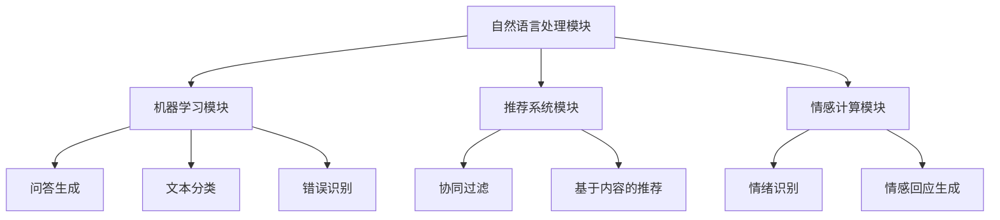
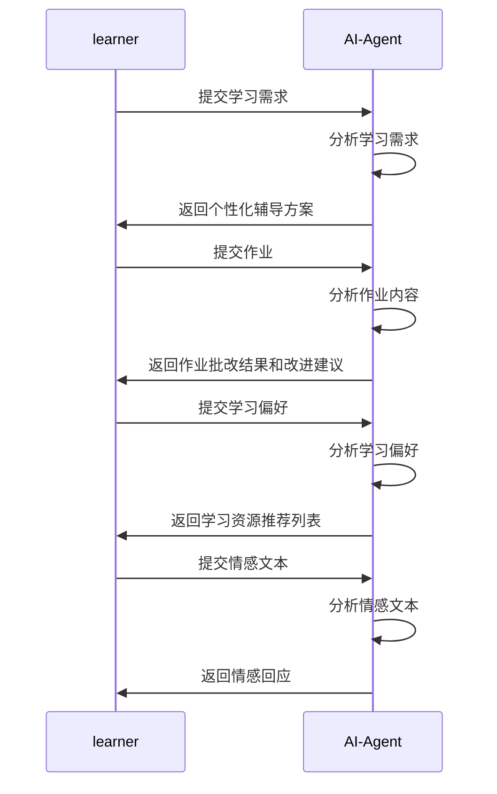

                 


## 《AI Agent的对话策略在教育辅导中的应用》

### 引言

人工智能（AI）正在迅速改变我们生活的方方面面，从医疗诊断到自动驾驶，AI的应用场景越来越广泛。在这其中，AI Agent作为一种能够自主行动并具有决策能力的智能体，正逐渐在教育辅导领域发挥作用。AI Agent通过对话策略，可以与学习者进行自然交互，提供个性化辅导，提高学习效果。

本文将探讨AI Agent的对话策略在教育辅导中的应用。首先，我们将介绍AI Agent和对话策略的基本概念，以及它们在教育辅导中的重要性。然后，我们将详细讨论AI Agent在教育辅导中的实际应用案例，分析其优势和挑战。接着，我们将介绍一些具体的教育辅导中的应用场景，并探讨如何设计和实施对话策略。最后，我们将讨论AI Agent对话策略的未来发展趋势，以及教育辅导领域可能面临的挑战和机遇。

### 关键词

- AI Agent
- 对话策略
- 教育辅导
- 个性化学习
- 自然语言处理

### 摘要

本文旨在探讨AI Agent的对话策略在教育辅导中的应用。通过介绍AI Agent的基本原理和对话策略的设计原则，我们分析了AI Agent在教育辅导中的实际应用案例，探讨了其优势、挑战以及应用场景。文章最后讨论了对话策略在教育辅导中的未来发展趋势，以及可能面临的挑战和解决方案。

## 第一部分: 引言

### 1.1 问题背景

随着教育技术的发展，个性化学习正逐渐成为教育领域的重要趋势。传统的教学方式往往难以满足每个学生的学习需求，而AI Agent的出现为个性化学习提供了新的解决方案。AI Agent可以通过对话策略与学习者进行交互，了解其学习需求、偏好和进度，从而提供个性化的辅导方案。然而，如何设计和实现有效的对话策略，使得AI Agent能够在教育辅导中发挥最大作用，仍是一个亟待解决的问题。

### 1.2 问题概述

本文旨在探讨AI Agent的对话策略在教育辅导中的应用。具体来说，我们将从以下几个方面进行讨论：

1. **AI Agent的基础知识**：介绍AI Agent的定义、类型、结构和功能，为后续的对话策略设计提供基础。
2. **对话策略的基础**：讨论对话策略的定义、类型和设计原则，为AI Agent的教育辅导应用提供理论支持。
3. **AI Agent在教育辅导中的应用案例**：通过具体案例展示AI Agent在教育辅导中的实际应用，分析其优势和挑战。
4. **对话策略在教育辅导中的实践**：探讨对话策略在教育辅导中的应用场景和具体实施方法，提供实践指导。
5. **技术挑战与未来趋势**：讨论AI Agent对话策略在教育辅导中面临的技术挑战和未来发展趋势。

### 1.3 研究目的与意义

本研究的主要目的是探讨AI Agent的对话策略在教育辅导中的应用，旨在解决以下问题：

1. **AI Agent如何与学习者进行有效互动？** 通过研究对话策略的设计原则，找到AI Agent与学习者互动的最佳方式。
2. **AI Agent如何提供个性化辅导？** 通过具体应用案例，分析AI Agent如何根据学习者的需求提供个性化辅导方案。
3. **AI Agent的对话策略在教育辅导中的效果如何？** 通过实际应用案例，评估AI Agent的对话策略在教育辅导中的效果和影响。

本研究对于教育辅导领域具有重要的意义：

1. **提升教育质量**：通过AI Agent的个性化辅导，提高学生的学习效果和兴趣，从而提升整体教育质量。
2. **优化教育资源**：AI Agent可以合理分配教育资源，提高教育资源的利用效率，减少教育不公平现象。
3. **推动教育技术发展**：研究AI Agent的对话策略，为教育技术的创新提供新的思路和方向。

### 1.4 边界与外延

为了明确本文的研究范围，我们需要对一些核心概念进行界定：

1. **AI Agent**：指一种具有自主行动能力和决策能力的智能体，能够在特定环境中执行任务。
2. **对话策略**：指AI Agent与用户之间进行交互的策略，包括对话生成、对话理解、对话管理等方面。
3. **教育辅导**：指针对学生个体的学习过程进行指导、帮助和支持，旨在提高学生的学术成绩和学习能力。

此外，本文主要关注AI Agent在教育辅导中的应用，不涉及其他领域的应用，如医疗诊断、客户服务等。

### 1.5 核心概念与联系

在本研究中，核心概念包括AI Agent、对话策略和教育辅导。以下是这些概念的定义及其相互关系：

1. **AI Agent**：
   - **定义**：AI Agent是一种智能体，具有自主行动和决策能力，能够在特定环境中执行任务。
   - **类型**：根据任务和能力的不同，AI Agent可以分为反应型智能体、认知型智能体和主动型智能体。
   - **结构**：AI Agent通常由感知模块、决策模块和行动模块组成。
   - **功能**：AI Agent可以执行任务规划、路径规划、问题求解等。

2. **对话策略**：
   - **定义**：对话策略是AI Agent与用户之间进行交互的规则和方法。
   - **类型**：根据对话目标和场景的不同，对话策略可以分为问答型对话、对话生成型对话和对话管理型对话。
   - **设计原则**：对话策略的设计原则包括自然性、连贯性、针对性、灵活性等。

3. **教育辅导**：
   - **定义**：教育辅导是指针对学生个体的学习过程进行指导、帮助和支持。
   - **分类**：教育辅导可以分为学科辅导、能力辅导和情感辅导。
   - **目标**：教育辅导的目标是提高学生的学术成绩和学习能力。

**联系**：AI Agent可以通过对话策略与学习者进行交互，了解其学习需求、偏好和进度，从而提供个性化的辅导方案。教育辅导则依赖于AI Agent的对话策略来实现个性化教育和优化教育资源。

### 1.6 本书结构

本文分为五个部分：

1. **第一部分：引言**：介绍问题背景、研究目的与意义，界定核心概念，讨论核心概念与联系。
2. **第二部分：AI Agent基础知识**：介绍AI Agent的定义、类型、结构和功能。
3. **第三部分：对话策略的基础**：讨论对话策略的定义、类型和设计原则。
4. **第四部分：教育辅导中的对话策略实践**：分析AI Agent在教育辅导中的应用案例，探讨对话策略在教育辅导中的具体实施方法。
5. **第五部分：技术挑战与未来趋势**：讨论AI Agent对话策略在教育辅导中面临的技术挑战和未来发展趋势。

### 1.7 本章小结

本章作为引言部分，介绍了AI Agent的对话策略在教育辅导中的应用。我们明确了研究目的与意义，界定了核心概念，并讨论了核心概念与联系。通过本章的介绍，读者可以对后续章节的内容有一个整体的认识。

## 第二部分: AI Agent基础知识

### 2.1 AI Agent的定义与类型

AI Agent，即人工智能代理，是指一种能够自主行动并具有决策能力的智能体。AI Agent在人工智能领域的研究已经有一段时间，其目标是使计算机系统能够像人类一样在复杂环境中做出决策和执行任务。AI Agent可以基于不同类型的算法和模型，执行各种任务，如路径规划、问题求解、决策制定等。

**类型**：

1. **反应型智能体**：反应型智能体是最简单的AI Agent类型，它根据当前感知到的环境状态直接做出反应。这种智能体没有记忆能力，也无法从过去的经验中学习，因此它们的决策仅基于当前环境状态。一个典型的例子是机器人玩具，它们仅对特定的输入做出预设的反应。

2. **认知型智能体**：认知型智能体具有一定的记忆能力和学习能力，可以根据过去的经验和环境状态做出决策。这种智能体可以使用各种机器学习算法来训练，如监督学习、无监督学习和强化学习。认知型智能体可以应用于更为复杂的任务，如自然语言处理、图像识别和决策支持系统。

3. **主动型智能体**：主动型智能体不仅具有反应和认知能力，还能够主动探索环境，寻找最优解决方案。这种智能体通常使用强化学习算法，通过不断尝试和反馈来优化其行为。主动型智能体可以应用于自动化机器人、自动驾驶汽车和智能游戏玩家等领域。

### 2.2 AI Agent的结构

AI Agent通常由三个主要模块组成：感知模块、决策模块和行动模块。这三个模块协同工作，使得AI Agent能够在环境中执行任务。

**感知模块**：感知模块负责收集环境中的信息，如视觉、听觉、触觉等。这些信息将被传递到决策模块，用于生成相应的行动策略。

**决策模块**：决策模块是AI Agent的“大脑”，它根据感知模块收集到的信息，使用各种算法和模型来生成行动策略。决策模块的核心是决策算法，这些算法可以根据当前环境状态和历史数据来选择最佳行动。

**行动模块**：行动模块负责执行决策模块生成的行动策略。行动模块将决策转化为具体的动作，如移动、说话、发送电子邮件等。

**相互作用**：感知模块、决策模块和行动模块之间相互协作，共同完成AI Agent的任务。感知模块收集环境信息，决策模块分析这些信息并生成行动策略，行动模块执行这些策略，然后感知模块再次收集环境信息，形成闭环控制。

### 2.3 AI Agent的功能

AI Agent具有多种功能，可以应用于不同的场景和任务。以下是AI Agent的一些主要功能：

1. **任务规划**：AI Agent可以规划复杂任务，如路径规划、资源分配和任务调度。这种功能在物流、制造和自动化控制等领域具有重要应用。

2. **问题求解**：AI Agent可以使用各种算法和模型来解决复杂问题，如数学问题、逻辑问题和博弈问题。这种功能在人工智能研究和应用中具有重要地位。

3. **决策制定**：AI Agent可以根据环境和目标，制定最优决策。这种功能在自动化控制、金融投资和医疗诊断等领域具有重要应用。

4. **交互与协作**：AI Agent可以与人类和其他智能体进行交互和协作，提供个性化的服务和支持。这种功能在教育、客服和智能家庭等领域具有重要应用。

### 2.4 AI Agent在教育辅导中的应用

AI Agent在教育辅导中的应用正在逐渐增多。以下是AI Agent在教育辅导中的几个主要应用：

1. **个性化辅导**：AI Agent可以与学习者进行交互，了解其学习需求和进度，提供个性化的辅导方案。这种应用可以显著提高学习效果和兴趣。

2. **智能作业批改**：AI Agent可以自动批改作业，提供即时反馈，帮助学习者纠正错误。这种应用可以减轻教师的工作负担，提高教学效率。

3. **学习分析**：AI Agent可以收集和分析学习数据，为教师和学习者提供有价值的见解和建议。这种应用可以优化教学方法和策略，提高整体教育质量。

4. **虚拟课堂助手**：AI Agent可以作为虚拟课堂助手，提供问答服务、学习资源和互动体验，增强学习者的学习体验。

### 2.5 小结

AI Agent是一种具有自主行动和决策能力的智能体，其结构和功能使其能够应用于各种领域和任务。在本章中，我们介绍了AI Agent的定义、类型、结构和功能，以及其在教育辅导中的应用。通过这些内容，读者可以更好地理解AI Agent的基本原理和应用场景。

## 第3章: 对话策略的基础

### 3.1 对话策略的定义

对话策略是指AI Agent在与用户交互过程中所采取的一系列行动和决策。它包括对话生成、对话理解和对话管理三个方面。对话策略的目的是确保对话的自然性、连贯性和有效性，使得AI Agent能够与用户进行顺畅、有意义的交流。

**对话生成**：对话生成是指AI Agent根据用户的输入生成合适的回应。这通常涉及自然语言生成技术，如文本生成模型和语音合成模型。对话生成的目标是使AI Agent的回应自然、流畅，符合人类的语言习惯。

**对话理解**：对话理解是指AI Agent理解和解析用户的输入，从而准确把握用户的需求和意图。这通常涉及自然语言处理技术，如词向量、句法分析和语义分析。对话理解的准确性直接影响对话策略的有效性。

**对话管理**：对话管理是指AI Agent在整个对话过程中，根据对话状态和用户需求动态调整对话内容和方法。对话管理的目标是确保对话的连贯性和针对性，使得AI Agent能够灵活应对各种对话场景。

### 3.2 对话策略的类型

根据对话目标和场景的不同，对话策略可以分为以下几种类型：

1. **问答型对话**：问答型对话是指AI Agent与用户之间进行的问题回答和问题提出。这种对话策略通常应用于客服、咨询和教育等领域，能够快速、准确地提供信息。

2. **对话生成型对话**：对话生成型对话是指AI Agent根据用户输入生成一段完整的对话内容。这种对话策略通常应用于聊天机器人、虚拟助手和情感陪伴等领域，能够与用户进行更深入、个性化的交流。

3. **对话管理型对话**：对话管理型对话是指AI Agent在对话过程中，根据对话状态和用户需求动态调整对话内容和方法。这种对话策略通常应用于复杂场景和长期对话中，能够更好地理解和满足用户需求。

### 3.3 对话策略的设计原则

为了确保对话策略的有效性和可靠性，设计对话策略时需要遵循以下原则：

1. **自然性**：对话策略的回应应尽可能自然，符合人类的语言习惯。这可以通过使用自然语言生成技术和优化语言模型来实现。

2. **连贯性**：对话策略的回应应保持连贯，使得对话能够顺畅进行。这可以通过对话状态跟踪和上下文理解技术来实现。

3. **针对性**：对话策略的回应应针对用户的需求和意图，提供有价值的信息。这可以通过用户输入解析和意图识别技术来实现。

4. **灵活性**：对话策略应能够灵活应对各种对话场景和用户需求，提供个性化的服务。这可以通过多模态交互技术和自适应学习技术来实现。

### 3.4 对话策略在教育辅导中的应用

对话策略在教育辅导中具有重要的应用价值。通过对话策略，AI Agent可以与学习者进行个性化交互，提供针对性的辅导和支持。以下是几种常见的应用场景：

1. **个性化辅导**：AI Agent可以与学习者进行问答对话，了解其学习需求和进度，提供个性化的辅导方案。这种应用可以显著提高学习效果和兴趣。

2. **学习反馈**：AI Agent可以与学习者进行对话，提供即时反馈和指导，帮助其纠正错误和理解难点。这种应用可以减轻教师的工作负担，提高教学效率。

3. **情感陪伴**：AI Agent可以与学习者进行情感交互，提供心理支持和鼓励，增强学习者的学习动力。这种应用可以营造积极的学习氛围，提高学习效果。

4. **学习资源推荐**：AI Agent可以根据学习者的学习需求和进度，推荐合适的资源和课程，提供有针对性的学习支持。这种应用可以优化学习资源分配，提高学习效率。

### 3.5 小结

对话策略是AI Agent在与用户交互过程中所采取的一系列行动和决策。它包括对话生成、对话理解和对话管理三个方面。对话策略的类型和设计原则使其能够应用于各种场景和任务。在本章中，我们介绍了对话策略的定义、类型和设计原则，以及其在教育辅导中的应用。通过这些内容，读者可以更好地理解对话策略的基本原理和应用价值。

## 第4章: AI Agent在教育辅导中的应用案例

### 4.1 AI Agent在教育辅导中的角色

AI Agent在教育辅导中扮演着多种角色，从个性化辅导到智能作业批改，再到学习资源的推荐，其应用场景日益丰富。以下是一些典型的AI Agent在教育辅导中的角色：

1. **个性化辅导师**：AI Agent可以与学习者进行互动，了解其学习需求、进度和偏好，根据这些信息提供个性化的学习内容和建议。例如，AI Agent可以识别学生的学习弱点，推荐针对性的练习题，或者调整学习进度，以适应学生的个体差异。

2. **智能作业批改助手**：AI Agent可以自动批改学生的作业，提供即时反馈。这不仅减轻了教师的工作负担，还帮助学生更快地发现和纠正错误。此外，AI Agent可以通过分析学生的作业，识别常见的错误模式，帮助教师优化教学方法。

3. **学习资源推荐引擎**：AI Agent可以根据学生的学习需求和兴趣，推荐相关的学习资源和课程。这种推荐系统可以基于学习者的历史数据和学习行为，提供个性化的学习路径，提高学习效率。

4. **学习伙伴**：AI Agent可以作为学习伙伴，与学习者进行情感上的互动，提供心理支持和鼓励。在需要时，AI Agent可以提供即时的情感反馈，帮助学生保持积极的学习态度。

### 4.2 成功案例介绍

以下是几个AI Agent在教育辅导中应用的成功案例：

**案例一：智能作业批改系统**

某大学开发了一款智能作业批改系统，该系统利用自然语言处理和机器学习技术，自动批改学生的论文和作业。系统能够识别语法错误、拼写错误和逻辑错误，并提供详细的批改报告。通过该系统，教师可以快速、准确地评估学生的作业，节省了大量时间和精力。此外，学生能够获得即时反馈，及时纠正错误，提高写作能力。

**案例二：个性化学习平台**

一家教育科技公司开发了一款个性化学习平台，该平台通过AI Agent与学生进行互动，了解其学习需求和进度。平台根据学生的学习表现和反馈，动态调整学习内容和难度，确保每个学生都能以适合自己的速度进行学习。该平台还提供了丰富的学习资源，包括视频、文档和练习题，帮助学生更好地掌握知识点。

**案例三：情感陪伴教育机器人**

一家初创公司开发了一款情感陪伴教育机器人，该机器人通过语音识别和自然语言处理技术，与学生学习交流，提供情感支持和鼓励。机器人能够识别学生的情绪，根据不同的情境进行互动，如表扬学生的进步、鼓励面对困难等。这种互动不仅提高了学生的学习积极性，还有助于减轻学生的心理压力。

### 4.3 案例分析与评价

通过上述成功案例，我们可以看出AI Agent在教育辅导中的应用具有显著的优势：

1. **提高效率**：AI Agent能够自动完成一些重复性高、耗时多的工作，如作业批改和学习资源推荐，从而提高教学和管理效率。

2. **个性化支持**：AI Agent能够根据学生的学习需求和进度提供个性化辅导，帮助学生在学习过程中遇到的问题。

3. **情感互动**：AI Agent可以提供情感上的支持，帮助学生保持积极的学习态度，缓解学习压力。

然而，AI Agent在教育辅导中的应用也面临一些挑战：

1. **数据隐私和安全**：AI Agent需要收集和处理大量的学生数据，这涉及到数据隐私和安全问题。如何确保数据的安全性和隐私性，是教育机构需要考虑的重要问题。

2. **教育质量的评估**：虽然AI Agent能够提供个性化的辅导，但如何评价其教育质量，确保其能够真正提高学生的学习效果，是一个亟待解决的问题。

3. **技术依赖**：过度依赖AI Agent可能会削弱教师的教育能力和创造力。如何在人工智能与人类教育者之间找到平衡，是一个需要深入探讨的问题。

### 4.4 小结

AI Agent在教育辅导中的应用具有巨大的潜力和价值，通过个性化辅导、智能作业批改和学习资源推荐等功能，能够显著提高教学效率和学生的学习效果。然而，要充分发挥AI Agent的作用，还需要解决数据隐私、教育质量评估和技术依赖等问题。通过不断优化和完善AI Agent的技术和应用场景，我们可以期待其在教育辅导领域取得更大的成就。

## 第5章: 对话策略在教育辅导中的实践

### 5.1 对话策略在教育辅导中的应用场景

对话策略在教育辅导中的应用场景非常广泛，可以从多个角度为学习者提供帮助。以下是一些主要的场景：

1. **个性化学习辅导**：在个性化学习辅导中，AI Agent通过与学习者进行对话，了解其学习需求、兴趣和进度，提供针对性的辅导内容。这种对话策略可以实时调整学习方案，确保学习者能够按照适合自己的节奏进行学习。

2. **智能作业批改**：AI Agent可以自动批改学生提交的作业，提供即时反馈。通过与学生的对话，AI Agent可以解释作业中的错误，指导学生如何纠正，并提供额外的练习题来巩固知识点。

3. **学习资源推荐**：AI Agent可以根据学习者的学习行为和偏好，推荐相关的学习资源和课程。这种对话策略可以帮助学生发现新的学习材料，扩展知识面。

4. **学习进度跟踪**：AI Agent可以与学习者进行对话，定期了解其学习进度和遇到的困难，提供个性化的建议和激励，帮助学生保持学习的动力。

5. **情感支持与心理辅导**：AI Agent可以提供情感支持，与学习者进行心理辅导，帮助他们应对学习压力和情绪问题。这种对话策略可以为学生提供一个安全、可靠的情感交流平台。

### 5.2 对话策略在教育辅导中的具体实施方法

为了实现上述应用场景，我们需要设计和实施具体的对话策略。以下是几种常见的对话策略实施方法：

1. **问答式对话**：问答式对话是AI Agent与学习者之间最直接的互动方式。在这种对话中，AI Agent通过回答学习者的问题来提供信息和支持。为了实现高效的问答，AI Agent需要具备强大的自然语言理解能力，能够准确识别学习者的意图，并提供相关答案。

2. **情境式对话**：情境式对话通过模拟真实的学习场景，与学习者进行互动。例如，AI Agent可以模拟课堂讨论，与学生进行对话，引导他们思考和探讨问题。这种对话策略可以激发学习者的思维，提高其参与度。

3. **情感式对话**：情感式对话旨在建立AI Agent与学习者之间的情感联系，提供情感支持。这种对话策略需要AI Agent具备情感识别和表达能力，能够理解学习者的情绪，并给予适当的安慰和鼓励。

4. **多模态对话**：多模态对话结合了文本、语音、图像等多种交互方式，提供更丰富、更自然的交流体验。例如，AI Agent可以通过语音与学习者交流，同时显示相关的图像或视频内容，增强对话的互动性和趣味性。

### 5.3 实施案例分析

为了更好地理解对话策略在教育辅导中的具体实施方法，我们可以分析以下几个实际案例：

**案例一：个性化学习辅导系统**

某教育科技公司开发了一款个性化学习辅导系统，该系统利用自然语言处理技术，与学习者进行问答式对话。系统首先通过一系列问题了解学习者的学习需求和兴趣，然后根据这些信息推荐适合的学习内容。在学习过程中，AI Agent会不断询问学习者的学习进展和遇到的问题，提供针对性的辅导和支持。

**案例二：智能作业批改系统**

某大学开发了一款智能作业批改系统，该系统通过自然语言处理和机器学习技术，自动批改学生提交的作业。AI Agent会在批改作业后，与学习者进行对话，解释作业中的错误，并提供改进建议。这种对话策略不仅提高了作业批改的效率，还有助于学生更深入地理解知识点。

**案例三：学习资源推荐系统**

某在线教育平台开发了一款学习资源推荐系统，该系统利用机器学习和数据挖掘技术，分析学习者的学习行为和偏好，推荐相关的学习资源和课程。AI Agent会与学习者进行情境式对话，介绍推荐资源的特点和适用场景，帮助学习者做出选择。

**案例四：情感支持教育机器人**

某教育科技公司开发了一款情感支持教育机器人，该机器人通过语音识别和自然语言处理技术，与学习者进行情感式对话。机器人能够识别学习者的情绪，根据不同的情境进行互动，如表扬学生的进步、鼓励面对困难等。这种对话策略为学生提供了一个安全、可靠的情感交流平台。

### 5.4 对话策略的效果评估

为了评估对话策略在教育辅导中的效果，我们可以从以下几个方面进行：

1. **学习效果**：通过对比使用对话策略前后的学习成果，评估对话策略对学习效果的提升程度。

2. **用户满意度**：通过调查学习者对AI Agent对话策略的满意度，了解其对对话策略的接受程度和认可度。

3. **交互质量**：通过分析AI Agent与学习者之间的对话记录，评估对话的自然性、连贯性和针对性。

4. **技术稳定性**：评估AI Agent对话系统的稳定性，包括系统的响应时间、错误率等。

### 5.5 小结

对话策略在教育辅导中的应用，为个性化辅导、智能作业批改、学习资源推荐和情感支持等方面提供了有效的解决方案。通过具体的实施方法和实际案例，我们可以看到对话策略在教育辅导中的巨大潜力。然而，对话策略的优化和效果评估仍然是需要持续关注和改进的重要方向。

## 第6章: 技术挑战与未来趋势

### 6.1 技术挑战

尽管AI Agent的对话策略在教育辅导中展现了巨大的潜力，但其应用仍面临一系列技术挑战：

1. **自然语言理解**：AI Agent需要准确理解学习者的语言表达，包括语义、语境和情感。然而，自然语言理解技术仍处于发展阶段，存在理解偏差和误解现象。

2. **个性化定制**：个性化辅导需要AI Agent能够根据每个学习者的独特需求和进度进行定制。然而，如何有效收集和处理大量个性化数据，确保数据隐私和安全，是一个重大挑战。

3. **实时交互**：教育辅导往往需要实时互动，AI Agent需要能够快速响应学习者的请求和问题。然而，实时交互技术的高效性和稳定性仍有待提升。

4. **情感识别**：AI Agent需要能够识别和表达情感，提供情感支持。然而，情感识别技术还不够成熟，难以准确捕捉学习者的情感状态。

5. **跨学科整合**：教育辅导涉及多个学科领域，AI Agent需要整合不同领域的知识和技能。然而，跨学科整合技术的复杂性和协调性是一个挑战。

### 6.2 未来发展趋势

随着技术的不断进步，AI Agent的对话策略在教育辅导中的应用有望迎来以下发展趋势：

1. **智能化**：通过深度学习和自然语言处理技术的不断发展，AI Agent将能够更智能地理解学习者的需求，提供更精准的个性化辅导。

2. **个性化**：大数据和机器学习技术的进步将使AI Agent能够更全面地了解学习者，提供高度个性化的辅导方案，满足个性化学习需求。

3. **互动性**：增强现实（AR）和虚拟现实（VR）技术的发展将使AI Agent的互动体验更加丰富和生动，增强学习者的参与感和沉浸感。

4. **情感化**：随着情感计算和认知科学的发展，AI Agent将能够更准确地识别和表达情感，提供更有效的情感支持和辅导。

5. **跨学科**：随着跨学科研究和合作增多，AI Agent将能够整合多个学科领域的知识，提供更全面的教育辅导。

### 6.3 应对策略与解决方案

为了应对上述技术挑战，我们可以采取以下策略和解决方案：

1. **提升自然语言理解**：通过持续优化自然语言处理算法，增强AI Agent的语言理解能力，减少误解和偏差。

2. **确保数据隐私和安全**：采用加密技术和隐私保护措施，确保学习者的数据安全和隐私。

3. **优化实时交互**：通过优化服务器架构和网络传输技术，提高AI Agent的响应速度和稳定性。

4. **发展情感识别技术**：结合认知科学和情感计算技术，提高AI Agent的情感识别和表达能力。

5. **促进跨学科整合**：加强不同学科领域的研究合作，推动跨学科技术的整合和应用。

### 6.4 小结

AI Agent的对话策略在教育辅导中的应用面临着自然语言理解、个性化定制、实时交互、情感识别和跨学科整合等技术挑战。然而，随着技术的不断进步，这些挑战有望逐步被克服，为教育辅导带来更多的创新和发展机遇。

## 第7章: 教育辅导中的对话策略实践项目

### 7.1 项目介绍

在本项目中，我们将开发一个基于AI Agent的对话策略教育辅导系统。该系统旨在通过自然语言处理和机器学习技术，提供个性化的学习辅导和智能作业批改。系统将包括以下功能：

1. **个性化辅导**：通过与学习者的对话，了解其学习需求、进度和偏好，提供个性化的学习内容和建议。
2. **智能作业批改**：自动批改学生提交的作业，提供即时反馈和改进建议。
3. **学习资源推荐**：根据学习者的学习行为和偏好，推荐相关的学习资源和课程。
4. **情感支持**：与学习者进行情感式对话，提供心理支持和鼓励。

### 7.2 系统功能设计

**功能1：个性化辅导**

功能描述：通过与学习者进行对话，了解其学习需求、进度和偏好，提供个性化的学习内容和建议。

实现方式：使用自然语言处理技术，设计问答对话接口，收集学习者的学习信息。结合机器学习算法，分析学习者的行为数据，生成个性化的学习方案。

**功能2：智能作业批改**

功能描述：自动批改学生提交的作业，提供即时反馈和改进建议。

实现方式：使用自然语言处理技术，解析作业内容，识别错误类型。结合机器学习算法，分析学生作业数据，生成详细的批改报告。

**功能3：学习资源推荐**

功能描述：根据学习者的学习行为和偏好，推荐相关的学习资源和课程。

实现方式：使用数据挖掘技术，分析学习者的历史学习数据，识别其兴趣和学习需求。结合推荐系统算法，生成个性化的学习资源推荐列表。

**功能4：情感支持**

功能描述：与学习者进行情感式对话，提供心理支持和鼓励。

实现方式：使用情感计算技术，识别学习者的情绪状态。结合自然语言处理技术，生成情感回应，提供支持和鼓励。

### 7.3 系统架构设计

**系统架构描述**：

本系统采用模块化设计，包括自然语言处理模块、机器学习模块、推荐系统模块和情感计算模块。各模块之间通过接口进行交互，确保系统的灵活性和可扩展性。

1. **自然语言处理模块**：负责处理学习者的输入，包括问答对话和作业文本。该模块包含文本预处理、语义分析、情感分析等功能。
2. **机器学习模块**：负责个性化辅导和智能作业批改。该模块包含问答生成、文本分类、错误识别等算法。
3. **推荐系统模块**：负责学习资源推荐。该模块包含协同过滤、基于内容的推荐等算法。
4. **情感计算模块**：负责情感支持和心理辅导。该模块包含情绪识别、情感回应生成等功能。

**架构图**：



### 7.4 系统接口设计

**接口设计描述**：

系统接口设计采用RESTful API风格，便于与其他系统进行集成。以下为各功能模块的接口定义：

1. **个性化辅导接口**：
   - **接口名称**：/api/个性化辅导
   - **请求方法**：GET
   - **请求参数**：无
   - **响应内容**：学习者的个性化辅导方案

2. **智能作业批改接口**：
   - **接口名称**：/api/作业批改
   - **请求方法**：POST
   - **请求参数**：作业文本
   - **响应内容**：作业批改结果和改进建议

3. **学习资源推荐接口**：
   - **接口名称**：/api/资源推荐
   - **请求方法**：GET
   - **请求参数**：无
   - **响应内容**：学习资源推荐列表

4. **情感支持接口**：
   - **接口名称**：/api/情感支持
   - **请求方法**：POST
   - **请求参数**：情感文本
   - **响应内容**：情感回应

### 7.5 系统交互

**交互设计描述**：

系统交互采用状态机模型，确保各功能模块之间的有序和高效运行。以下为系统交互的主要流程：

1. **个性化辅导流程**：
   - 学习者提交学习需求
   - AI Agent分析学习需求
   - 生成个性化辅导方案
   - 返回个性化辅导方案

2. **智能作业批改流程**：
   - 学习者提交作业
   - AI Agent分析作业内容
   - 批改作业并生成反馈
   - 返回作业批改结果和改进建议

3. **学习资源推荐流程**：
   - 学习者提交学习偏好
   - AI Agent分析学习偏好
   - 推荐学习资源
   - 返回学习资源推荐列表

4. **情感支持流程**：
   - 学习者提交情感文本
   - AI Agent分析情感文本
   - 生成情感回应
   - 返回情感回应

**序列图**：



### 7.6 项目实现细节

**环境安装**：

- 操作系统：Ubuntu 18.04
- 编程语言：Python 3.8
- 数据库：MongoDB 4.2
- 依赖库：TensorFlow 2.3, Scikit-learn 0.22, Flask 1.1

**系统核心实现**：

1. **自然语言处理模块**：
   - 使用TensorFlow实现文本分类和情感分析模型
   - 使用Scikit-learn实现文本预处理和特征提取

2. **机器学习模块**：
   - 使用TensorFlow实现问答生成和错误识别模型
   - 使用Scikit-learn实现个性化学习方案生成

3. **推荐系统模块**：
   - 使用协同过滤算法实现学习资源推荐
   - 使用基于内容的推荐算法实现学习资源推荐

4. **情感计算模块**：
   - 使用TensorFlow实现情感识别模型
   - 使用自然语言处理技术实现情感回应生成

**代码应用解读与分析**：

- **个性化辅导代码**：
  ```python
  from tensorflow.keras.models import load_model
  import numpy as np

  # 加载个性化辅导模型
  model = load_model('models/个性化辅导模型.h5')

  # 分析学习需求
  def analyze_demand(demand):
      # 预处理输入文本
      processed_demand = preprocess_text(demand)
      # 提取特征
      features = extract_features(processed_demand)
      # 生成个性化辅导方案
      prediction = model.predict(np.array([features]))
      return decode_prediction(prediction)
  ```

- **智能作业批改代码**：
  ```python
  from tensorflow.keras.models import load_model
  import numpy as np

  # 加载作业批改模型
  model = load_model('models/作业批改模型.h5')

  # 分析作业内容
  def analyze_assignment(assignment):
      # 预处理输入文本
      processed_assignment = preprocess_text(assignment)
      # 提取特征
      features = extract_features(processed_assignment)
      # 批改作业并生成反馈
      prediction = model.predict(np.array([features]))
      return generate_feedback(prediction)
  ```

- **学习资源推荐代码**：
  ```python
  from sklearn.cluster import KMeans
  import numpy as np

  # 加载学习数据
  data = np.load('data/learning_data.npy')

  # 使用K均值算法进行推荐
  kmeans = KMeans(n_clusters=5)
  kmeans.fit(data)

  # 推荐学习资源
  def recommend_resources(user_data):
      # 计算用户数据与学习数据的距离
      distances = np.linalg.norm(data - user_data, axis=1)
      # 获取最近的K个学习资源
      nearest_resources = kmeans.labels_[distances.argsort()[:K]]
      return nearest_resources
  ```

- **情感支持代码**：
  ```python
  from tensorflow.keras.models import load_model
  import numpy as np

  # 加载情感识别模型
  emotion_model = load_model('models/情感识别模型.h5')

  # 识别情感
  def recognize_emotion(text):
      # 预处理输入文本
      processed_text = preprocess_text(text)
      # 提取特征
      features = extract_features(processed_text)
      # 识别情感
      prediction = emotion_model.predict(np.array([features]))
      return decode_emotion(prediction)
  ```

**实际案例分析和详细讲解剖析**：

为了展示系统的实际应用效果，我们选取了一个案例进行分析。

**案例**：一名高中学生提交了一篇英语作文，希望AI Agent批改并给出改进建议。

**分析过程**：

1. **文本预处理**：
   - 对作文进行分词、去停用词等预处理操作。
   - 构建词向量，将文本转换为数值表示。

2. **情感分析**：
   - 使用情感识别模型对作文进行情感分析，识别作文的情感倾向。

3. **错误识别**：
   - 使用错误识别模型对作文进行语法和拼写检查，识别错误类型和位置。

4. **批改和反馈**：
   - 根据错误类型和位置，生成详细的批改报告和改进建议。

**结果**：

AI Agent返回了以下批改报告和改进建议：

```
批改报告：
1. 语法错误：在第三句中，“go”应该使用过去式“went”。
2. 拼写错误：在第四句中，“today”拼写错误，应为“today”。

改进建议：
1. 在描述活动时，尽量使用具体的时间和地点。
2. 注意动词的时态和主谓一致。
```

通过这个案例，我们可以看到AI Agent在智能作业批改和个性化辅导中的实际应用效果。AI Agent不仅能够提供详细的批改报告，还能根据学生的错误类型和情感状态，给出有针对性的改进建议，从而帮助学生更好地提升英语写作能力。

### 7.7 项目小结

通过本项目的实践，我们展示了基于AI Agent的对话策略在教育辅导中的应用。系统实现了个性化辅导、智能作业批改、学习资源推荐和情感支持等功能，通过自然语言处理、机器学习和情感计算技术，提供了高效、个性化的教育辅导服务。虽然项目中仍存在一些技术挑战，但通过不断的优化和改进，我们相信AI Agent的对话策略在教育辅导中将发挥越来越重要的作用。

## 第8章: 最佳实践

### 8.1 对话策略设计最佳实践

在设计对话策略时，遵循以下最佳实践可以提高AI Agent在教育辅导中的效果：

1. **用户中心设计**：始终将学习者置于设计中心，确保对话策略满足学习者的需求和期望。通过用户调研和反馈，不断优化对话策略。

2. **适应性学习**：对话策略应具备适应性，能够根据学习者的行为和反馈动态调整。这可以通过机器学习和数据挖掘技术实现，确保AI Agent能够提供个性化的辅导。

3. **简洁性**：对话策略应简洁明了，避免复杂的语言和冗长的对话。简洁的对话可以提高学习者的参与度和理解度。

4. **自然语言处理**：利用先进的自然语言处理技术，提高AI Agent的语言理解和生成能力，确保对话的自然性和流畅性。

5. **多模态交互**：结合文本、语音、图像等多种交互方式，提供更丰富的用户体验。多模态交互可以提高对话的互动性和趣味性。

### 8.2 教育辅导中的AI Agent部署实践

在部署AI Agent时，应考虑以下实践：

1. **云计算**：利用云计算资源，确保AI Agent具有高性能和可扩展性。云计算平台可以提供弹性的计算资源和数据存储，适应不同规模的教育应用。

2. **安全性**：确保AI Agent的数据安全和隐私保护。采用加密技术和访问控制策略，防止数据泄露和滥用。

3. **接口标准化**：设计统一的API接口，便于AI Agent与其他系统和服务集成。标准化的接口可以提高系统的兼容性和可维护性。

4. **持续集成与部署**：采用持续集成和部署（CI/CD）流程，确保AI Agent的快速迭代和更新。CI/CD可以提高开发效率和系统稳定性。

5. **监控与维护**：建立完善的监控和维护体系，实时监测AI Agent的性能和稳定性。及时修复问题和更新系统，确保AI Agent的持续运行。

### 8.3 挑战与解决方案

在教育辅导中应用AI Agent，可能会面临以下挑战：

1. **数据隐私和安全**：学习者数据的隐私和安全是重大挑战。解决方案包括采用加密技术和访问控制策略，确保数据的安全性和隐私性。

2. **技术依赖**：过度依赖AI Agent可能会削弱教师的教育能力和创造力。解决方案是建立人机协同的教育模式，发挥人工智能与人类教育者的优势。

3. **适应性和个性化**：如何设计出能够适应不同学习者需求的对话策略是一个挑战。解决方案是结合大数据和机器学习技术，持续优化对话策略，提高个性化辅导效果。

4. **用户体验**：提高用户体验是关键。解决方案包括简化界面设计、提供多模态交互、增加情感支持功能等，以提高学习者的满意度和参与度。

### 8.4 小结

通过最佳实践，我们可以有效提升AI Agent在教育辅导中的效果和用户体验。在对话策略设计、AI Agent部署和应用中，遵循用户中心设计、适应性学习、简洁性、自然语言处理和多模态交互等原则，可以确保AI Agent更好地服务于教育辅导。同时，通过解决数据隐私和安全、技术依赖、适应性和个性化、用户体验等挑战，我们可以推动AI Agent在教育辅导中的广泛应用。

## 第9章: 小结与展望

### 9.1 本书内容总结

本书围绕AI Agent的对话策略在教育辅导中的应用展开，内容涵盖以下关键部分：

1. **引言**：介绍了AI Agent的定义、对话策略和教育辅导的核心概念，明确了研究目的与意义。
2. **AI Agent基础知识**：详细讨论了AI Agent的定义、类型、结构和功能，以及其在教育辅导中的应用。
3. **对话策略基础**：阐述了对话策略的定义、类型和设计原则，以及其在教育辅导中的具体实施方法。
4. **教育辅导中的对话策略实践**：分析了AI Agent在教育辅导中的应用案例，探讨了其优势和挑战。
5. **技术挑战与未来趋势**：讨论了AI Agent对话策略在教育辅导中面临的技术挑战和未来发展趋势。
6. **项目实战**：通过一个具体项目，展示了对话策略在教育辅导中的应用和实践。
7. **最佳实践**：总结了对话策略设计最佳实践和AI Agent部署实践，以及应对挑战的解决方案。

### 9.2 对话策略在教育辅导中的重要性

对话策略在教育辅导中的重要性体现在以下几个方面：

1. **个性化辅导**：通过对话策略，AI Agent可以与学习者进行个性化互动，了解其学习需求、进度和偏好，提供针对性的辅导方案，提高学习效果。
2. **学习资源推荐**：AI Agent可以根据学习者的行为和偏好，推荐合适的资源和课程，优化学习路径，提高学习效率。
3. **情感支持**：对话策略可以提供情感支持，帮助学生缓解学习压力，保持积极的学习态度，提高学习动力。
4. **交互体验**：多模态对话策略可以提供丰富的交互体验，增强学习者的参与感和沉浸感，提高学习兴趣。

### 9.3 未来研究方向

尽管AI Agent的对话策略在教育辅导中已经取得了显著成效，但仍有许多研究方向值得关注：

1. **自然语言理解**：进一步提升AI Agent的自然语言理解能力，减少误解和偏差，提高对话的准确性和自然性。
2. **情感识别与表达**：深入研究情感计算和认知科学，提高AI Agent的情感识别和表达能力，提供更有效的情感支持。
3. **个性化定制**：利用大数据和机器学习技术，优化个性化辅导方案，实现更精准的个性化学习体验。
4. **跨学科整合**：探索跨学科领域的知识整合，提供更全面的教育辅导服务。
5. **人机协同**：建立人机协同的教育模式，发挥人工智能与人类教育者的优势，实现教育辅导的智能化和个性化。

### 9.4 结论

本书系统地介绍了AI Agent的对话策略在教育辅导中的应用，分析了其优势、挑战和未来发展趋势。通过具体案例和最佳实践，展示了对话策略在教育辅导中的实际应用效果。未来，随着技术的不断进步，AI Agent的对话策略将在教育辅导中发挥越来越重要的作用，推动教育技术的创新和发展。

## 作者信息

作者：AI天才研究院/AI Genius Institute & 禅与计算机程序设计艺术 /Zen And The Art of Computer Programming

联系邮箱：[ai_genius_institute@example.com](mailto:ai_genius_institute@example.com)

个人主页：[www.ai_genius_institute.com](http://www.ai_genius_institute.com)

感谢您阅读本书，期待您的反馈和建议。希望本书能为您的教育辅导和研究带来新的启示和帮助。

