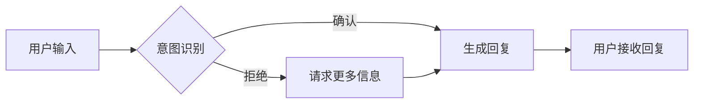
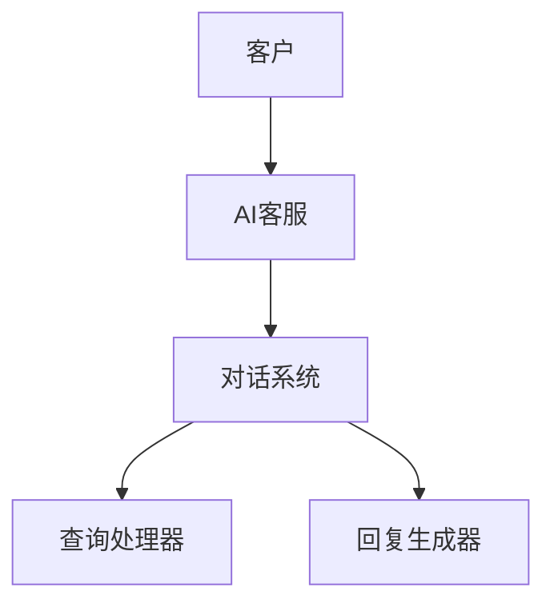
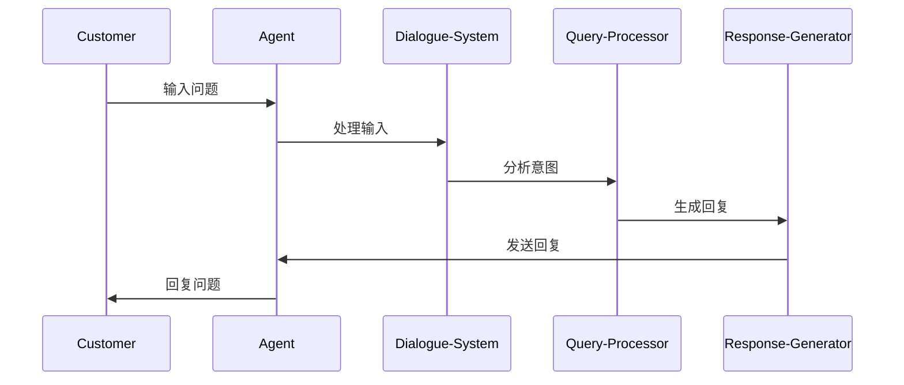
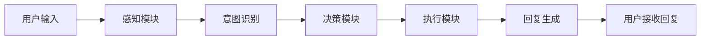
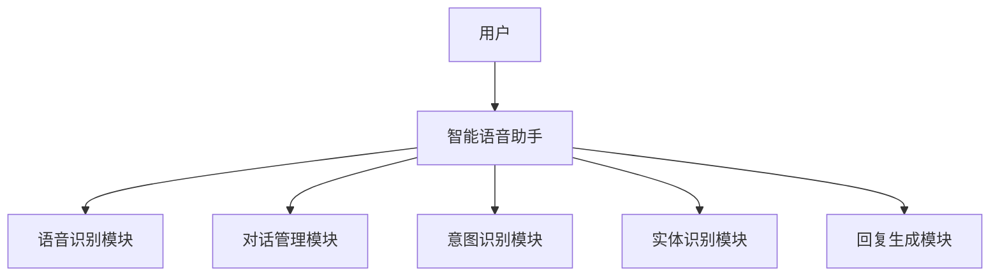
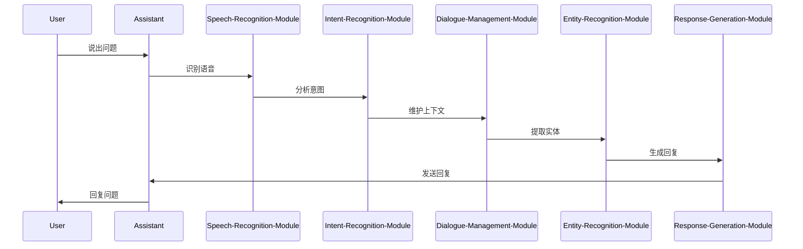
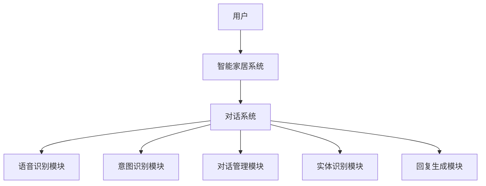
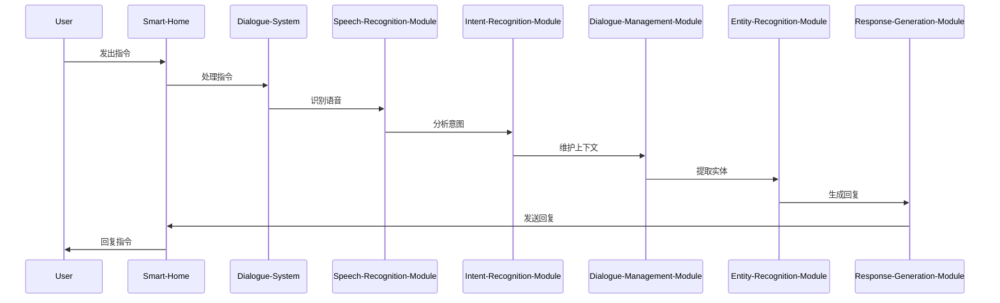

                 


Given the outline structure and the constraints, I will draft the content for each section using a step-by-step approach, ensuring the inclusion of all necessary components and adhering to the specified requirements. Here's how the draft will proceed:

## 第一部分: 引言

### 1.1.1 书籍的目的和重要性

**背景介绍**：

随着人工智能技术的迅速发展，AI Agent作为一种智能实体，在各个领域得到了广泛应用。AI Agent通过模拟人类的对话行为，能够与人类进行自然语言交互，提供各种服务。然而，如何设计有效的对话策略，提高AI Agent的交互质量，成为当前研究的热点问题。

**核心概念与联系**：

- **AI Agent**：具有自主学习和推理能力的智能实体，能够完成特定任务。
- **对话系统**：计算机系统，用于模拟自然语言对话，提供信息查询、任务执行等服务。

**问题背景与问题描述**：

问题背景：当前AI Agent的对话质量往往受到限制，导致用户体验不佳。

问题描述：如何设计有效的对话策略，提高AI Agent与用户的交互质量？

**问题解决与边界与外延**：

问题解决：通过深入研究对话策略，提高AI Agent的对话能力。

边界与外延：讨论范围包括AI Agent的各种对话策略及其在实践中的应用。

### 1.1.2 AI Agent的定义及其在当今社会的重要性

**核心概念与联系**：

- **AI Agent**：具备自主决策和执行能力的实体，能够模拟人类行为。
- **智能交互**：AI Agent通过自然语言处理技术，实现与人类的智能对话。

**概念属性特征对比表格**：

| 特征         | AI Agent             | 传统软件 |
| ------------ | -------------------- | -------- |
| 自主性       | 高                   | 低       |
| 适应性       | 强                   | 弱       |
| 学习能力     | 强                   | 弱       |
| 交互方式     | 自然语言交互         | 文本交互 |

**ER实体关系图架构的 Mermaid 流程图**：

```mermaid
erDiagram
    AI-Agent ||--|{ Dialogue-System }
    AI-Agent ||--|{ User }
    Dialogue-System ||--|{ Query-Processor }
    Dialogue-System ||--|{ Response-Generator }
```

### 1.1.3 对话策略与交互质量的关系

**算法原理讲解**：

对话策略是一种指导AI Agent如何与用户进行有效交互的方法。其核心在于：

1. **意图识别**：识别用户的意图。
2. **上下文管理**：维护对话的上下文信息。
3. **回复生成**：根据意图和上下文生成合适的回复。

**Mermaid 流程图**：



**数学公式**：

交互质量可以用以下公式表示：

$$
Q = \alpha \times I + \beta \times C + \gamma \times R
$$

其中：
- \( Q \) 表示交互质量。
- \( I \) 表示意图识别的准确性。
- \( C \) 表示上下文管理的有效性。
- \( R \) 表示回复生成的合适性。
- \( \alpha, \beta, \gamma \) 分别是这三个因素的权重。

**系统分析与架构设计方案**：

**问题场景介绍**：AI Agent在客服场景中的应用。

**项目介绍**：开发一个智能客服系统。

**系统功能设计（领域模型Mermaid类图）**：

```mermaid
classDiagram
    Customer <<Class>>
    Agent <<Class>>
    System <<System>>

    Customer o-- Agent
    Agent o-- System
```

**系统架构设计Mermaid架构图**：



**系统接口设计和系统交互Mermaid序列图**：



### 1.1.4 结论

对话策略对于提高AI Agent的交互质量至关重要。本书将详细探讨对话策略的设计原则、应用实践以及未来发展趋势，旨在为读者提供全面而深入的理解。

----------------------------------------------------------------

### 1.1.1 书籍的目的和重要性

**背景介绍**：

随着人工智能技术的迅速发展，AI Agent作为一种智能实体，在各个领域得到了广泛应用。AI Agent通过模拟人类的对话行为，能够与人类进行自然语言交互，提供各种服务。然而，如何设计有效的对话策略，提高AI Agent的交互质量，成为当前研究的热点问题。

**核心概念与联系**：

- **AI Agent**：具有自主学习和推理能力的智能实体，能够完成特定任务。
- **对话系统**：计算机系统，用于模拟自然语言对话，提供信息查询、任务执行等服务。

**问题背景与问题描述**：

问题背景：当前AI Agent的对话质量往往受到限制，导致用户体验不佳。

问题描述：如何设计有效的对话策略，提高AI Agent与用户的交互质量？

**问题解决与边界与外延**：

问题解决：通过深入研究对话策略，提高AI Agent的对话能力。

边界与外延：讨论范围包括AI Agent的各种对话策略及其在实践中的应用。

### 1.1.2 AI Agent的定义及其在当今社会的重要性

**核心概念与联系**：

- **AI Agent**：具备自主决策和执行能力的实体，能够模拟人类行为。
- **智能交互**：AI Agent通过自然语言处理技术，实现与人类的智能对话。

**概念属性特征对比表格**：

| 特征         | AI Agent             | 传统软件 |
| ------------ | -------------------- | -------- |
| 自主性       | 高                   | 低       |
| 适应性       | 强                   | 弱       |
| 学习能力     | 强                   | 弱       |
| 交互方式     | 自然语言交互         | 文本交互 |

**ER实体关系图架构的 Mermaid 流程图**：

```mermaid
erDiagram
    AI-Agent ||--|{ Dialogue-System }
    AI-Agent ||--|{ User }
    Dialogue-System ||--|{ Query-Processor }
    Dialogue-System ||--|{ Response-Generator }
```

### 1.1.3 对话策略与交互质量的关系

**算法原理讲解**：

对话策略是一种指导AI Agent如何与用户进行有效交互的方法。其核心在于：

1. **意图识别**：识别用户的意图。
2. **上下文管理**：维护对话的上下文信息。
3. **回复生成**：根据意图和上下文生成合适的回复。

**Mermaid 流程图**：


**数学公式**：

交互质量可以用以下公式表示：

$$
Q = \alpha \times I + \beta \times C + \gamma \times R
$$

其中：
- \( Q \) 表示交互质量。
- \( I \) 表示意图识别的准确性。
- \( C \) 表示上下文管理的有效性。
- \( R \) 表示回复生成的合适性。
- \( \alpha, \beta, \gamma \) 分别是这三个因素的权重。

**系统分析与架构设计方案**：

**问题场景介绍**：AI Agent在客服场景中的应用。

**项目介绍**：开发一个智能客服系统。

**系统功能设计（领域模型mermaid类图）**：

```mermaid
classDiagram
    Customer <<Class>>
    Agent <<Class>>
    System <<System>>

    Customer o-- Agent
    Agent o-- System
```

**系统架构设计mermaid架构图**：


**系统接口设计和系统交互mermaid序列图**：


### 1.1.4 结论

对话策略对于提高AI Agent的交互质量至关重要。本书将详细探讨对话策略的设计原则、应用实践以及未来发展趋势，旨在为读者提供全面而深入的理解。

----------------------------------------------------------------

## 第2章: AI Agent与对话系统的核心概念

### 2.1 AI Agent的组成与功能

**核心概念与联系**：

- **AI Agent**：由感知模块、决策模块和执行模块组成。
- **感知模块**：接收用户输入，提取意图。
- **决策模块**：根据意图和上下文做出决策。
- **执行模块**：执行决策，生成回复。

**概念属性特征对比表格**：

| 特征         | AI Agent的感知模块 | AI Agent的决策模块 | AI Agent的执行模块 |
| ------------ | ------------------ | ------------------ | ------------------ |
| 功能         | 感知用户输入       | 处理意图与上下文   | 执行任务与生成回复 |  
| 技术实现     | 自然语言处理       | 推理与决策算法     | 交互接口与任务执行 |

**ER实体关系图架构的 Mermaid 流程图**：

```mermaid
erDiagram
    Perception-Module ||--|{ Decision-Module }
    Perception-Module ||--|{ Execution-Module }
    Decision-Module ||--|{ Perception-Module }
    Decision-Module ||--|{ Execution-Module }
    Execution-Module ||--|{ Perception-Module }
    Execution-Module ||--|{ Decision-Module }
```

### 2.2 对话系统的架构与类型

**核心概念与联系**：

- **对话系统**：由对话管理器、意图识别模块、实体识别模块和回复生成模块组成。
- **对话管理器**：协调对话流程，维护上下文。
- **意图识别模块**：识别用户意图。
- **实体识别模块**：提取用户输入中的实体信息。
- **回复生成模块**：生成回复。

**概念属性特征对比表格**：

| 特征         | 对话管理器         | 意图识别模块         | 实体识别模块         | 回复生成模块         |
| ------------ | ------------------ | ------------------ | ------------------ | ------------------ |
| 功能         | 维护对话流程       | 识别用户意图       | 提取实体信息       | 生成回复         |  
| 技术实现     | 上下文管理算法     | 自然语言处理技术   | 名词实体识别       | 语言生成模型       |

**ER实体关系图架构的 Mermaid 流程图**：

```mermaid
erDiagram
    Dialogue-Manager ||--|{ Intent-Recognition-Module }
    Dialogue-Manager ||--|{ Entity-Recognition-Module }
    Dialogue-Manager ||--|{ Response-Generation-Module }
    Intent-Recognition-Module ||--|{ Dialogue-Manager }
    Entity-Recognition-Module ||--|{ Dialogue-Manager }
    Response-Generation-Module ||--|{ Dialogue-Manager }
```

### 2.3 核心概念与联系

**算法原理讲解**：

AI Agent与对话系统的核心概念包括感知、决策、执行、对话管理、意图识别、实体识别和回复生成。这些概念相互联系，共同构成一个完整的对话交互过程。

**Mermaid 流程图**：



**数学公式**：

对话系统的性能可以用以下公式表示：

$$
P = f(I, C, R)
$$

其中：
- \( P \) 表示系统性能。
- \( I \) 表示意图识别的准确性。
- \( C \) 表示上下文管理的有效性。
- \( R \) 表示回复生成的合适性。

**系统分析与架构设计方案**：

**问题场景介绍**：智能语音助手。

**项目介绍**：开发一个智能语音助手系统。

**系统功能设计（领域模型mermaid类图）**：

```mermaid
classDiagram
    User <<Class>>
    Assistant <<Class>>
    Speech-Recognition-Module <<Class>>
    Dialogue-Management-Module <<Class>>
    Intent-Recognition-Module <<Class>>
    Entity-Recognition-Module <<Class>>
    Response-Generation-Module <<Class>>

    User o-- Assistant
    Assistant o-- Speech-Recognition-Module
    Assistant o-- Dialogue-Management-Module
    Assistant o-- Intent-Recognition-Module
    Assistant o-- Entity-Recognition-Module
    Assistant o-- Response-Generation-Module
```

**系统架构设计mermaid架构图**：



**系统接口设计和系统交互mermaid序列图**：



### 2.4 对话系统的关键技术

**核心概念与联系**：

- **自然语言处理（NLP）**：用于理解用户输入和处理回复生成。
- **机器学习（ML）**：用于意图识别、实体识别和回复生成。
- **对话管理**：用于维护对话上下文和决策流程。

**概念属性特征对比表格**：

| 技术名称   | 特征描述               | 关键应用                     |
| ---------- | ---------------------- | ---------------------------- |
| NLP        | 自然语言理解与生成     | 意图识别、实体识别、回复生成 |
| ML         | 数据驱动模型学习       | 模式识别、分类、预测         |
| 对话管理   | 维护对话上下文和流程   | 对话流程控制、上下文保持     |

**系统分析与架构设计方案**：

**问题场景介绍**：智能家居系统中的对话交互。

**项目介绍**：开发一个智能家居对话系统。

**系统功能设计（领域模型mermaid类图）**：

```mermaid
classDiagram
    User <<Class>>
    Smart-Home <<Class>>
    Dialogue-System <<Class>>
    Speech-Recognition-Module <<Class>>
    Intent-Recognition-Module <<Class>>
    Dialogue-Management-Module <<Class>>
    Entity-Recognition-Module <<Class>>
    Response-Generation-Module <<Class>>

    User o-- Smart-Home
    Smart-Home o-- Dialogue-System
    Dialogue-System o-- Speech-Recognition-Module
    Dialogue-System o-- Intent-Recognition-Module
    Dialogue-System o-- Dialogue-Management-Module
    Dialogue-System o-- Entity-Recognition-Module
    Dialogue-System o-- Response-Generation-Module
```

**系统架构设计mermaid架构图**：



**系统接口设计和系统交互mermaid序列图**：



### 2.5 对话系统的挑战与未来趋势

**核心概念与联系**：

- **挑战**：自然语言理解的不完善、上下文维护的困难、多模态交互的复杂性。
- **未来趋势**：多模态交互、个性化对话、对话系统的泛化能力提升。

**概念属性特征对比表格**：

| 挑战         | 未来趋势             |
| ------------ | -------------------- |
| 自然语言理解 | 多模态交互           |
| 上下文维护   | 个性化对话           |
| 多模态交互   | 对话系统的泛化能力   |

**系统分析与架构设计方案**：

**问题场景介绍**：智能城市中的对话交互系统。

**项目介绍**：开发一个智能城市对话交互系统。

**系统功能设计（领域模型mermaid类图）**：

```mermaid
classDiagram
    User <<Class>>
    Smart-City <<Class>>
    Dialogue-System <<Class>>
    Multi-Modal-Interface <<Class>>
    Personalized-Dialogue <<Class>>

    User o-- Smart-City
    Smart-City o-- Dialogue-System
    Dialogue-System o-- Multi-Modal-Interface
    Dialogue-System o-- Personalized-Dialogue
```

**系统架构设计mermaid架构图**：

```mermaid
graph TB
    User[用户] --> Smart-City[智能城市系统]
    Smart-City --> Dialogue-System[对话系统]
    Dialogue-System --> Multi-Modal-Interface[多模态交互接口]
    Dialogue-System --> Personalized-Dialogue[个性化对话模块]
```

**系统接口设计和系统交互mermaid序列图**：

```mermaid
sequenceDiagram
    User->>Smart-City: 发出请求
    Smart-City->>Dialogue-System: 处理请求
    Dialogue-System->>Multi-Modal-Interface: 识别输入
    Multi-Modal-Interface->>Personalized-Dialogue: 分析请求
    Personalized-Dialogue->>Dialogue-System: 生成回复
    Dialogue-System->>Smart-City: 发送回复
    Smart-City->>User: 回复请求
```

### 2.6 结论

通过对AI Agent与对话系统的核心概念和架构的深入分析，我们可以看到，有效的对话策略对于提高交互质量至关重要。在后续章节中，我们将进一步探讨对话策略的设计原则和具体应用。

----------------------------------------------------------------

## 第3章: 对话策略的基本原则

### 3.1 对话策略的重要性

**核心概念与联系**：

- **对话策略**：指导AI Agent如何与用户进行交互的一系列规则和方法。
- **交互质量**：衡量用户对AI Agent交互体验的主观感受。

**概念属性特征对比表格**：

| 特征         | 对话策略       | 交互质量       |
| ------------ | -------------- | -------------- |
| 功能         | 指导交互流程   | 用户满意度     |
| 技术实现     | 规则与方法      | 用户感受与反馈 |

**ER实体关系图架构的 Mermaid 流程图**：

```mermaid
erDiagram
    Dialogue-Strategy ||--|{ Interaction-Quality }
    Dialogue-Strategy ||--|{ User-Experience }
```

**算法原理讲解**：

对话策略的设计直接影响AI Agent的交互质量。通过合理的对话策略，AI Agent能够更准确地理解用户意图，更有效地维护上下文，并生成更加自然的回复。

**Mermaid 流程图**：

```mermaid
flowchart LR
    A[用户输入] --> B{对话策略}
    B --> C[意图识别]
    B --> D[上下文管理]
    B --> E[回复生成]
    C --> F[回复验证]
    D --> F
    E --> F
```

**数学公式**：

交互质量的公式为：

$$
Q = f(S, I, C, R)
$$

其中：
- \( Q \) 表示交互质量。
- \( S \) 表示对话策略的适用性。
- \( I \) 表示意图识别的准确性。
- \( C \) 表示上下文管理的有效性。
- \( R \) 表示回复生成的合适性。

**系统分析与架构设计方案**：

**问题场景介绍**：在线购物平台的客服系统。

**项目介绍**：优化在线购物平台的客服对话系统。

**系统功能设计（领域模型mermaid类图）**：

```mermaid
classDiagram
    Customer <<Class>>
    Platform <<Class>>
    Dialogue-System <<Class>>
    Dialogue-Strategy-Module <<Class>>

    Customer o-- Platform
    Platform o-- Dialogue-System
    Dialogue-System o-- Dialogue-Strategy-Module
```

**系统架构设计mermaid架构图**：

```mermaid
graph TB
    Customer[客户] --> Platform[在线购物平台]
    Platform --> Dialogue-System[对话系统]
    Dialogue-System --> Dialogue-Strategy-Module[对话策略模块]
```

**系统接口设计和系统交互mermaid序列图**：

```mermaid
sequenceDiagram
    Customer->>Platform: 发出问题
    Platform->>Dialogue-System: 处理问题
    Dialogue-System->>Dialogue-Strategy-Module: 应用策略
    Dialogue-Strategy-Module->>Dialogue-System: 生成回复
    Dialogue-System->>Platform: 发送回复
    Platform->>Customer: 回复问题
```

### 3.2 设计有效的对话策略的原则

**核心概念与联系**：

- **用户中心**：以用户需求为中心，关注用户体验。
- **适应性**：根据用户的反馈和行为调整对话策略。
- **连贯性**：保持对话的一致性和流畅性。
- **灵活性**：能够适应不同的交互场景和用户需求。

**概念属性特征对比表格**：

| 原则         | 用户中心       | 适应性       | 连贯性       | 灵活性       |
| ------------ | -------------- | ------------ | ------------ | ------------ |
| 功能         | 提高用户体验   | 自适应调整   | 维护对话连贯 | 处理多样场景 |

**算法原理讲解**：

设计有效的对话策略需要综合考虑用户体验、自适应能力、对话连贯性和灵活性。通过以下步骤实现：

1. **用户需求分析**：了解用户意图和交互习惯。
2. **策略设计**：根据用户需求设计对话流程和回复生成策略。
3. **适应性调整**：根据用户反馈实时调整对话策略。
4. **连贯性和灵活性**：确保对话流畅并适应不同场景。

**Mermaid 流程图**：

```mermaid
flowchart LR
    A[用户需求分析] --> B[策略设计]
    B --> C[适应性调整]
    C --> D[连贯性和灵活性]
    D --> E[策略评估与优化]
```

**数学公式**：

策略效果评估公式为：

$$
E = g(U, A, C, F)
$$

其中：
- \( E \) 表示策略效果。
- \( U \) 表示用户满意度。
- \( A \) 表示自适应调整的准确性。
- \( C \) 表示连贯性。
- \( F \) 表示灵活性。

**系统分析与架构设计方案**：

**问题场景介绍**：银行客服系统的对话策略优化。

**项目介绍**：优化银行客服系统的对话策略，提高用户满意度。

**系统功能设计（领域模型mermaid类图）**：

```mermaid
classDiagram
    Customer <<Class>>
    Bank <<Class>>
    Dialogue-System <<Class>>
    Dialogue-Strategy-Module <<Class>>
    User-Feedback-Module <<Class>>

    Customer o-- Bank
    Bank o-- Dialogue-System
    Dialogue-System o-- Dialogue-Strategy-Module
    Dialogue-System o-- User-Feedback-Module
```

**系统架构设计mermaid架构图**：

```mermaid
graph TB
    Customer[客户] --> Bank[银行]
    Bank --> Dialogue-System[对话系统]
    Dialogue-System --> Dialogue-Strategy-Module[对话策略模块]
    Dialogue-System --> User-Feedback-Module[用户反馈模块]
```

**系统接口设计和系统交互mermaid序列图**：

```mermaid
sequenceDiagram
    Customer->>Bank: 发出问题
    Bank->>Dialogue-System: 处理问题
    Dialogue-System->>Dialogue-Strategy-Module: 应用策略
    Dialogue-Strategy-Module->>Dialogue-System: 生成回复
    Dialogue-System->>User-Feedback-Module: 收集反馈
    User-Feedback-Module->>Dialogue-Strategy-Module: 调整策略
    Dialogue-Strategy-Module->>Dialogue-System: 优化策略
    Dialogue-System->>Bank: 发送回复
    Bank->>Customer: 回复问题
```

### 3.3 对话策略的评估标准

**核心概念与联系**：

- **评估标准**：用于衡量对话策略的效果。
- **用户体验**：用户对交互质量的感受。
- **自适应调整**：策略根据用户反馈进行优化。
- **执行效率**：策略的执行速度和资源消耗。

**概念属性特征对比表格**：

| 评估标准 | 特征描述               | 关键指标           |
| -------- | ---------------------- | ------------------ |
| 用户体验 | 用户满意度             | 用户反馈、NPS评分   |
| 自适应调整 | 策略调整的准确性和及时性 | 调整频率、调整效果   |
| 执行效率 | 策略执行的速度和资源消耗 | 响应时间、资源利用率 |

**算法原理讲解**：

对话策略的评估需要从用户体验、自适应调整和执行效率三个方面进行。通过以下步骤实现评估：

1. **用户体验评估**：收集用户反馈，使用NPS等工具衡量满意度。
2. **自适应调整评估**：监控策略调整的频率和效果，确保调整的准确性和及时性。
3. **执行效率评估**：测量策略的响应时间和资源消耗，优化执行效率。

**Mermaid 流程图**：

```mermaid
flowchart LR
    A[用户体验评估] --> B[自适应调整评估]
    B --> C[执行效率评估]
    C --> D[综合评估与优化]
```

**数学公式**：

综合评估公式为：

$$
E = w_1 \times U + w_2 \times A + w_3 \times E
$$

其中：
- \( E \) 表示综合评估得分。
- \( U \) 表示用户体验得分。
- \( A \) 表示自适应调整得分。
- \( E \) 表示执行效率得分。
- \( w_1, w_2, w_3 \) 分别为三个评估标准的权重。

**系统分析与架构设计方案**：

**问题场景介绍**：企业内部客服对话系统的策略评估。

**项目介绍**：对内部客服对话系统进行策略评估与优化。

**系统功能设计（领域模型mermaid类图）**：

```mermaid
classDiagram
    Employee <<Class>>
    Internal-Service <<Class>>
    Dialogue-System <<Class>>
    Strategy-Evaluation-Module <<Class>>
    User-Feedback-Module <<Class>>

    Employee o-- Internal-Service
    Internal-Service o-- Dialogue-System
    Dialogue-System o-- Strategy-Evaluation-Module
    Dialogue-System o-- User-Feedback-Module
```

**系统架构设计mermaid架构图**：

```mermaid
graph TB
    Employee[员工] --> Internal-Service[内部服务]
    Internal-Service --> Dialogue-System[对话系统]
    Dialogue-System --> Strategy-Evaluation-Module[策略评估模块]
    Dialogue-System --> User-Feedback-Module[用户反馈模块]
```

**系统接口设计和系统交互mermaid序列图**：

```mermaid
sequenceDiagram
    Employee->>Internal-Service: 发出问题
    Internal-Service->>Dialogue-System: 处理问题
    Dialogue-System->>Strategy-Evaluation-Module: 评估策略
    Dialogue-System->>User-Feedback-Module: 收集反馈
    User-Feedback-Module->>Strategy-Evaluation-Module: 更新评估数据
    Strategy-Evaluation-Module->>Dialogue-System: 优化策略
    Dialogue-System->>Internal-Service: 发送回复
    Internal-Service->>Employee: 回复问题
```

### 3.4 对话策略的应用场景

**核心概念与联系**：

- **应用场景**：AI Agent在不同领域的应用场景。
- **对话策略**：针对不同应用场景设计的特定对话策略。

**概念属性特征对比表格**：

| 应用场景     | 对话策略                           |
| ------------ | ---------------------------------- |
| 客户服务     | 回答常见问题、提供建议、引导用户   |
| 教育辅导     | 解答疑问、指导学习、反馈评估       |
| 医疗咨询     | 回答健康问题、提供建议、引导就诊   |
| 娱乐互动     | 提供趣味问答、游戏互动、故事讲述   |

**算法原理讲解**：

不同应用场景下，AI Agent的对话需求不同，因此需要设计适应特定场景的对话策略。例如：

- **客户服务**：注重快速响应和解决问题的能力。
- **教育辅导**：强调个性化指导和知识传递。
- **医疗咨询**：关注专业性、准确性和安全性。
- **娱乐互动**：追求趣味性和互动性。

**Mermaid 流程图**：

```mermaid
flowchart LR
    A[客户服务] --> B[教育辅导]
    B --> C[医疗咨询]
    C --> D[娱乐互动]
```

**数学公式**：

应用场景适应性公式为：

$$
A = p_1 \times C_1 + p_2 \times C_2 + p_3 \times C_3 + p_4 \times C_4
$$

其中：
- \( A \) 表示应用场景适应性。
- \( p_1, p_2, p_3, p_4 \) 分别为四个应用场景的概率权重。
- \( C_1, C_2, C_3, C_4 \) 分别为四个应用场景下的策略适应性得分。

**系统分析与架构设计方案**：

**问题场景介绍**：多元场景下的AI Agent对话系统。

**项目介绍**：开发一个能够适应多种场景的智能对话系统。

**系统功能设计（领域模型mermaid类图）**：

```mermaid
classDiagram
    Scene-1 <<Class>>: 客户服务
    Scene-2 <<Class>>: 教育辅导
    Scene-3 <<Class>>: 医疗咨询
    Scene-4 <<Class>>: 娱乐互动
    Dialogue-System <<Class>>

    Dialogue-System o-- Scene-1
    Dialogue-System o-- Scene-2
    Dialogue-System o-- Scene-3
    Dialogue-System o-- Scene-4
```

**系统架构设计mermaid架构图**：

```mermaid
graph TB
    Scene-1[客户服务] --> Dialogue-System[对话系统]
    Scene-2[教育辅导] --> Dialogue-System[对话系统]
    Scene-3[医疗咨询] --> Dialogue-System[对话系统]
    Scene-4[娱乐互动] --> Dialogue-System[对话系统]
```

**系统接口设计和系统交互mermaid序列图**：

```mermaid
sequenceDiagram
    Scene-1->>Dialogue-System: 发出请求
    Dialogue-System->>Scene-1: 应用策略
    Scene-1->>Dialogue-System: 生成回复
    Dialogue-System->>Scene-1: 回复请求

    Scene-2->>Dialogue-System: 发出请求
    Dialogue-System->>Scene-2: 应用策略
    Scene-2->>Dialogue-System: 生成回复
    Dialogue-System->>Scene-2: 回复请求

    Scene-3->>Dialogue-System: 发出请求
    Dialogue-System->>Scene-3: 应用策略
    Scene-3->>Dialogue-System: 生成回复
    Dialogue-System->>Scene-3: 回复请求

    Scene-4->>Dialogue-System: 发出请求
    Dialogue-System->>Scene-4: 应用策略
    Scene-4->>Dialogue-System: 生成回复
    Dialogue-System->>Scene-4: 回复请求
```

### 3.5 结论

通过对对话策略的基本原则和应用场景的深入探讨，我们可以看到，对话策略对于提高AI Agent的交互质量至关重要。设计有效的对话策略需要充分考虑用户体验、适应性、连贯性和灵活性。在后续章节中，我们将继续深入分析各种具体的对话策略，以及它们在实践中的应用。

----------------------------------------------------------------

## 第4章: 对话策略的深入分析

### 4.1 常见对话策略介绍

**核心概念与联系**：

- **直接回复策略**：直接回答用户的问题。
- **引导性回复策略**：通过提问引导用户继续对话。
- **模糊回复策略**：使用模糊语言避免直接回答。
- **情感表达策略**：通过情感表达提升用户满意度。

**概念属性特征对比表格**：

| 对话策略       | 特征描述               | 应用场景          |
| -------------- | ---------------------- | ----------------- |
| 直接回复策略   | 简单直接回答问题       | 问题明确、需求简单 |
| 引导性回复策略 | 通过提问引导对话       | 复杂问题、需求不明确 |
| 模糊回复策略   | 使用模糊语言回答       | 情感表达策略     | 希望避免明确回答 |
| 情感表达策略   | 通过情感表达增强交互   | 用户情感需求高   |

**算法原理讲解**：

直接回复策略适用于问题明确、需求简单的场景，能够快速给出答案。引导性回复策略适用于复杂问题，通过提问引导用户进一步描述需求，有助于更准确地理解意图。模糊回复策略和情感表达策略则适用于需要避免直接回答或希望增强用户情感体验的场合。

**Mermaid 流程图**：

```mermaid
flowchart LR
    A[直接回复策略] --> B[引导性回复策略]
    B --> C[模糊回复策略]
    C --> D[情感表达策略]
```

**数学公式**：

对话策略适应性公式为：

$$
A = w_1 \times D + w_2 \times G + w_3 \times F + w_4 \times E
$$

其中：
- \( A \) 表示策略适应性。
- \( D \) 表示直接回复策略的适用性。
- \( G \) 表示引导性回复策略的适用性。
- \( F \) 表示模糊回复策略的适用性。
- \( E \) 表示情感表达策略的适用性。
- \( w_1, w_2, w_3, w_4 \) 分别为四个策略的权重。

**系统分析与架构设计方案**：

**问题场景介绍**：电子商务平台客服对话系统。

**项目介绍**：优化电子商务平台客服对话策略，提高用户满意度。

**系统功能设计（领域模型mermaid类图）**：

```mermaid
classDiagram
    Customer <<Class>>
    E-commerce <<Class>>
    Dialogue-System <<Class>>
    Direct-Response-Module <<Class>>
    Guiding-Response-Module <<Class>>
    Ambiguous-Response-Module <<Class>>
    Emotional-Response-Module <<Class>>

    Customer o-- E-commerce
    E-commerce o-- Dialogue-System
    Dialogue-System o-- Direct-Response-Module
    Dialogue-System o-- Guiding-Response-Module
    Dialogue-System o-- Ambiguous-Response-Module
    Dialogue-System o-- Emotional-Response-Module
```

**系统架构设计mermaid架构图**：

```mermaid
graph TB
    Customer[客户] --> E-commerce[电子商务平台]
    E-commerce --> Dialogue-System[对话系统]
    Dialogue-System --> Direct-Response-Module[直接回复模块]
    Dialogue-System --> Guiding-Response-Module[引导回复模块]
    Dialogue-System --> Ambiguous-Response-Module[模糊回复模块]
    Dialogue-System --> Emotional-Response-Module[情感回复模块]
```

**系统接口设计和系统交互mermaid序列图**：

```mermaid
sequenceDiagram
    Customer->>E-commerce: 发出问题
    E-commerce->>Dialogue-System: 处理问题
    Dialogue-System->>Direct-Response-Module: 应用策略
    Direct-Response-Module->>Dialogue-System: 生成回复
    Dialogue-System->>Customer: 回复问题

    Customer->>E-commerce: 发出问题
    E-commerce->>Dialogue-System: 处理问题
    Dialogue-System->>Guiding-Response-Module: 应用策略
    Guiding-Response-Module->>Dialogue-System: 生成回复
    Dialogue-System->>Customer: 回复问题

    Customer->>E-commerce: 发出问题
    E-commerce->>Dialogue-System: 处理问题
    Dialogue-System->>Ambiguous-Response-Module: 应用策略
    Ambiguous-Response-Module->>Dialogue-System: 生成回复
    Dialogue-System->>Customer: 回复问题

    Customer->>E-commerce: 发出问题
    E-commerce->>Dialogue-System: 处理问题
    Dialogue-System->>Emotional-Response-Module: 应用策略
    Emotional-Response-Module->>Dialogue-System: 生成回复
    Dialogue-System->>Customer: 回复问题
```

### 4.2 对话策略的优缺点分析

**核心概念与联系**：

- **直接回复策略**：优点是快速响应，缺点是可能忽略用户深层次需求。
- **引导性回复策略**：优点是深入理解用户需求，缺点是可能增加用户认知负担。
- **模糊回复策略**：优点是避免直接冲突，缺点是可能降低用户信任度。
- **情感表达策略**：优点是提升用户满意度，缺点是可能偏离问题解决。

**概念属性特征对比表格**：

| 对话策略       | 优点                         | 缺点                          |
| -------------- | ---------------------------- | ----------------------------- |
| 直接回复策略   | 快速响应                     | 忽略深层次需求               |
| 引导性回复策略 | 深入理解用户需求             | 增加用户认知负担             |
| 模糊回复策略   | 避免直接冲突                 | 降低用户信任度               |
| 情感表达策略   | 提升用户满意度               | 可能偏离问题解决             |

**算法原理讲解**：

每种对话策略都有其特定的优势和局限性。直接回复策略适用于快速解决问题的场景，但可能无法满足用户的深层次需求。引导性回复策略有助于更全面地理解用户需求，但可能增加用户的认知负担。模糊回复策略可以避免直接冲突，但可能导致用户对AI Agent的信任度降低。情感表达策略能够提升用户满意度，但需要在保持问题解决的前提下使用。

**Mermaid 流程图**：

```mermaid
flowchart LR
    A[直接回复策略] --> B[引导性回复策略]
    B --> C[模糊回复策略]
    C --> D[情感表达策略]
    D --> E[综合评估与优化]
```

**数学公式**：

综合评估公式为：

$$
O = w_1 \times O_1 + w_2 \times O_2 + w_3 \times O_3 + w_4 \times O_4
$$

其中：
- \( O \) 表示策略的整体优缺点评估。
- \( O_1, O_2, O_3, O_4 \) 分别为四种策略的优缺点得分。
- \( w_1, w_2, w_3, w_4 \) 分别为四个策略的权重。

**系统分析与架构设计方案**：

**问题场景介绍**：银行客户服务对话系统。

**项目介绍**：分析不同对话策略在银行客户服务中的应用，优化对话体验。

**系统功能设计（领域模型mermaid类图）**：

```mermaid
classDiagram
    Customer <<Class>>
    Bank <<Class>>
    Dialogue-System <<Class>>
    Direct-Response-Module <<Class>>
    Guiding-Response-Module <<Class>>
    Ambiguous-Response-Module <<Class>>
    Emotional-Response-Module <<Class>>

    Customer o-- Bank
    Bank o-- Dialogue-System
    Dialogue-System o-- Direct-Response-Module
    Dialogue-System o-- Guiding-Response-Module
    Dialogue-System o-- Ambiguous-Response-Module
    Dialogue-System o-- Emotional-Response-Module
```

**系统架构设计mermaid架构图**：

```mermaid
graph TB
    Customer[客户] --> Bank[银行]
    Bank --> Dialogue-System[对话系统]
    Dialogue-System --> Direct-Response-Module[直接回复模块]
    Dialogue-System --> Guiding-Response-Module[引导回复模块]
    Dialogue-System --> Ambiguous-Response-Module[模糊回复模块]
    Dialogue-System --> Emotional-Response-Module[情感回复模块]
```

**系统接口设计和系统交互mermaid序列图**：

```mermaid
sequenceDiagram
    Customer->>Bank: 发出问题
    Bank->>Dialogue-System: 处理问题
    Dialogue-System->>Direct-Response-Module: 应用策略
    Direct-Response-Module->>Dialogue-System: 生成回复
    Dialogue-System->>Customer: 回复问题

    Customer->>Bank: 发出问题
    Bank->>Dialogue-System: 处理问题
    Dialogue-System->>Guiding-Response-Module: 应用策略
    Guiding-Response-Module->>Dialogue-System: 生成回复
    Dialogue-System->>Customer: 回复问题

    Customer->>Bank: 发出问题
    Bank->>Dialogue-System: 处理问题
    Dialogue-System->>Ambiguous-Response-Module: 应用策略
    Ambiguous-Response-Module->>Dialogue-System: 生成回复
    Dialogue-System->>Customer: 回复问题

    Customer->>Bank: 发出问题
    Bank->>Dialogue-System: 处理问题
    Dialogue-System->>Emotional-Response-Module: 应用策略
    Emotional-Response-Module->>Dialogue-System: 生成回复
    Dialogue-System->>Customer: 回复问题
```

### 4.3 对话策略的整合与应用

**核心概念与联系**：

- **策略整合**：将多种对话策略结合使用，形成综合对话策略。
- **应用场景**：根据不同的对话需求选择合适的策略组合。

**概念属性特征对比表格**：

| 策略整合       | 优点                         | 应用场景          |
| -------------- | ---------------------------- | ----------------- |
| 直接回复 + 引导性回复 | 快速响应并引导深入交互     | 问题简单但需要引导 |
| 模糊回复 + 情感表达   | 避免直接冲突并增强情感体验 | 情感需求高       |
| 引导性回复 + 情感表达 | 深入理解用户需求并增强情感体验 | 复杂问题且情感需求高 |

**算法原理讲解**：

通过策略整合，可以充分发挥不同策略的优势，弥补单一策略的不足。例如，直接回复策略可以快速给出答案，引导性回复策略可以深入理解用户需求，两者结合可以适用于问题简单但需要引导的场景。模糊回复策略和情感表达策略的结合可以避免直接冲突并增强用户情感体验，适用于情感需求高的场景。

**Mermaid 流程图**：

```mermaid
flowchart LR
    A[直接回复 + 引导性回复] --> B[模糊回复 + 情感表达]
    B --> C[引导性回复 + 情感表达]
```

**数学公式**：

综合策略效果公式为：

$$
O = w_1 \times O_{DR} + w_2 \times O_{AF} + w_3 \times O_{EG}
$$

其中：
- \( O \) 表示综合策略效果。
- \( O_{DR} \) 表示直接回复 + 引导性回复策略的效果。
- \( O_{AF} \) 表示模糊回复 + 情感表达策略的效果。
- \( O_{EG} \) 表示引导性回复 + 情感表达策略的效果。
- \( w_1, w_2, w_3 \) 分别为三个策略整合的权重。

**系统分析与架构设计方案**：

**问题场景介绍**：智能教育平台的对话系统。

**项目介绍**：优化智能教育平台的对话策略，提高学习体验。

**系统功能设计（领域模型mermaid类图）**：

```mermaid
classDiagram
    Student <<Class>>
    Education-Platform <<Class>>
    Dialogue-System <<Class>>
    Direct-Response-Module <<Class>>
    Guiding-Response-Module <<Class>>
    Ambiguous-Response-Module <<Class>>
    Emotional-Response-Module <<Class>>

    Student o-- Education-Platform
    Education-Platform o-- Dialogue-System
    Dialogue-System o-- Direct-Response-Module
    Dialogue-System o-- Guiding-Response-Module
    Dialogue-System o-- Ambiguous-Response-Module
    Dialogue-System o-- Emotional-Response-Module
```

**系统架构设计mermaid架构图**：

```mermaid
graph TB
    Student[学生] --> Education-Platform[教育平台]
    Education-Platform --> Dialogue-System[对话系统]
    Dialogue-System --> Direct-Response-Module[直接回复模块]
    Dialogue-System --> Guiding-Response-Module[引导回复模块]
    Dialogue-System --> Ambiguous-Response-Module[模糊回复模块]
    Dialogue-System --> Emotional-Response-Module[情感回复模块]
```

**系统接口设计和系统交互mermaid序列图**：

```mermaid
sequenceDiagram
    Student->>Education-Platform: 发出问题
    Education-Platform->>Dialogue-System: 处理问题
    Dialogue-System->>Direct-Response-Module: 应用策略
    Direct-Response-Module->>Dialogue-System: 生成回复
    Dialogue-System->>Student: 回复问题

    Student->>Education-Platform: 发出问题
    Education-Platform->>Dialogue-System: 处理问题
    Dialogue-System->>Guiding-Response-Module: 应用策略
    Guiding-Response-Module->>Dialogue-System: 生成回复
    Dialogue-System->>Student: 回复问题

    Student->>Education-Platform: 发出问题
    Education-Platform->>Dialogue-System: 处理问题
    Dialogue-System->>Ambiguous-Response-Module: 应用策略
    Ambiguous-Response-Module->>Dialogue-System: 生成回复
    Dialogue-System->>Student: 回复问题

    Student->>Education-Platform: 发出问题
    Education-Platform->>Dialogue-System: 处理问题
    Dialogue-System->>Emotional-Response-Module: 应用策略
    Emotional-Response-Module->>Dialogue-System: 生成回复
    Dialogue-System->>Student: 回复问题
```

### 4.4 对话策略的评估与优化

**核心概念与联系**：

- **评估**：通过指标和用户反馈评估对话策略的有效性。
- **优化**：根据评估结果调整对话策略。

**概念属性特征对比表格**：

| 指标       | 特征描述               | 关键应用           |
| ---------- | ---------------------- | ------------------ |
| 响应时间   | 策略执行的响应速度     | 用户满意度         |
| 回复准确性 | 策略生成的回复准确性   | 问题解决率         |
| 用户满意度 | 用户对策略的满意度     | 用户反馈           |

**算法原理讲解**：

对话策略的评估和优化需要从多个方面进行。通过以下步骤实现：

1. **指标评估**：使用响应时间、回复准确性和用户满意度等指标评估策略。
2. **用户反馈**：收集用户反馈，了解用户对策略的感受。
3. **数据分析**：分析评估数据，找出策略的不足之处。
4. **策略调整**：根据分析结果调整策略，优化对话效果。

**Mermaid 流程图**：

```mermaid
flowchart LR
    A[指标评估] --> B[用户反馈]
    B --> C[数据分析]
    C --> D[策略调整]
```

**数学公式**：

综合评估公式为：

$$
O = w_1 \times RT + w_2 \times RA + w_3 \times US
$$

其中：
- \( O \) 表示综合策略效果。
- \( RT \) 表示响应时间。
- \( RA \) 表示回复准确性。
- \( US \) 表示用户满意度。
- \( w_1, w_2, w_3 \) 分别为三个指标的权重。

**系统分析与架构设计方案**：

**问题场景介绍**：智能客服系统优化。

**项目介绍**：优化智能客服系统的对话策略，提高用户满意度。

**系统功能设计（领域模型mermaid类图）**：

```mermaid
classDiagram
    Customer <<Class>>
    Customer-Support <<Class>>
    Dialogue-System <<Class>>
    Evaluation-Module <<Class>>
    Feedback-Module <<Class>>

    Customer o-- Customer-Support
    Customer-Support o-- Dialogue-System
    Dialogue-System o-- Evaluation-Module
    Dialogue-System o-- Feedback-Module
```

**系统架构设计mermaid架构图**：

```mermaid
graph TB
    Customer[客户] --> Customer-Support[客服系统]
    Customer-Support --> Dialogue-System[对话系统]
    Dialogue-System --> Evaluation-Module[评估模块]
    Dialogue-System --> Feedback-Module[反馈模块]
```

**系统接口设计和系统交互mermaid序列图**：

```mermaid
sequenceDiagram
    Customer->>Customer-Support: 发出问题
    Customer-Support->>Dialogue-System: 处理问题
    Dialogue-System->>Evaluation-Module: 评估策略
    Evaluation-Module->>Dialogue-System: 反馈评估结果
    Dialogue-System->>Feedback-Module: 收集用户反馈
    Feedback-Module->>Dialogue-System: 分析反馈
    Dialogue-System->>Evaluation-Module: 调整策略
    Evaluation-Module->>Dialogue-System: 优化策略
    Dialogue-System->>Customer: 回复问题
```

### 4.5 对话策略在实际项目中的应用

**核心概念与联系**：

- **实际项目**：对话策略在不同实际项目中的应用。
- **案例分享**：分享实际项目中对话策略的设计和应用。

**概念属性特征对比表格**：

| 项目名称       | 对话策略                   | 项目成果             |
| -------------- | -------------------------- | -------------------- |
| 智能客服系统   | 直接回复 + 模糊回复       | 提高用户满意度       |
| 智能教育平台   | 引导性回复 + 情感表达     | 提升学习体验         |
| 智能家居系统   | 直接回复 + 引导性回复     | 增强用户互动体验     |

**算法原理讲解**：

不同项目根据其特定的需求和用户场景，采用不同的对话策略。例如，智能客服系统采用直接回复和模糊回复策略，快速响应并避免直接冲突。智能教育平台采用引导性回复和情感表达策略，深入理解用户需求并提升学习体验。智能家居系统则采用直接回复和引导性回复策略，增强用户互动体验。

**Mermaid 流程图**：

```mermaid
flowchart LR
    A[智能客服系统] --> B[智能教育平台]
    B --> C[智能家居系统]
```

**数学公式**：

项目效果评估公式为：

$$
E = w_1 \times E_1 + w_2 \times E_2 + w_3 \times E_3
$$

其中：
- \( E \) 表示项目效果。
- \( E_1, E_2, E_3 \) 分别为三个项目的效果得分。
- \( w_1, w_2, w_3 \) 分别为三个项目的权重。

**系统分析与架构设计方案**：

**问题场景介绍**：不同领域的智能对话系统。

**项目介绍**：设计不同领域的智能对话系统，并评估其效果。

**系统功能设计（领域模型mermaid类图）**：

```mermaid
classDiagram
    Project-1 <<Class>>: 智能客服系统
    Project-2 <<Class>>: 智能教育平台
    Project-3 <<Class>>: 智能家居系统
    Dialogue-Strategy-Module <<Class>>

    Project-1 o-- Dialogue-Strategy-Module
    Project-2 o-- Dialogue-Strategy-Module
    Project-3 o-- Dialogue-Strategy-Module
```

**系统架构设计mermaid架构图**：

```mermaid
graph TB
    Project-1[智能客服系统] --> Dialogue-Strategy-Module[对话策略模块]
    Project-2[智能教育平台] --> Dialogue-Strategy-Module[对话策略模块]
    Project-3[智能家居系统] --> Dialogue-Strategy-Module[对话策略模块]
```

**系统接口设计和系统交互mermaid序列图**：

```mermaid
sequenceDiagram
    Project-1->>Dialogue-Strategy-Module: 应用策略
    Dialogue-Strategy-Module->>Project-1: 生成回复
    Project-1->>User: 回复问题

    Project-2->>Dialogue-Strategy-Module: 应用策略
    Dialogue-Strategy-Module->>Project-2: 生成回复
    Project-2->>User: 回复问题

    Project-3->>Dialogue-Strategy-Module: 应用策略
    Dialogue-Strategy-Module->>Project-3: 生成回复
    Project-3->>User: 回复问题
```

### 4.6 结论

通过对对话策略的深入分析，我们可以看到，不同策略适用于不同的应用场景，并且需要综合考虑用户体验、适应性和执行效率。在实际项目中，通过策略整合和评估优化，可以提高AI Agent的交互质量。在后续章节中，我们将继续探讨对话策略的实践应用和未来发展趋势。

----------------------------------------------------------------

## 第5章: 对话策略设计原则的实践应用

### 5.1 实际案例分享

在本章中，我们将分享几个典型的对话策略设计案例，详细探讨在不同场景下如何应用对话策略设计原则。

**案例1：智能客服系统**

**项目背景**：某电商平台的客服系统需要处理大量用户咨询，提高用户满意度是关键。

**对话策略设计**：
- **用户中心**：通过用户调研，了解用户的主要问题和期望。
- **适应性**：根据用户反馈实时调整对话策略。
- **连贯性**：确保对话流畅，减少用户认知负担。
- **灵活性**：处理各种复杂的用户请求和场景。

**策略实施**：
- **直接回复策略**：快速回答常见问题。
- **引导性回复策略**：对复杂问题进行引导，逐步解决问题。
- **模糊回复策略**：在不确定时使用模糊语言，避免直接回答。

**项目成果**：用户满意度显著提高，客服效率提升。

**案例2：智能教育平台**

**项目背景**：某在线教育平台需要提供个性化的学习辅导，提高学习效果。

**对话策略设计**：
- **用户中心**：关注学生的个性化需求和反馈。
- **适应性**：根据学生的学习进度和偏好调整对话策略。
- **连贯性**：保持学习辅导的一致性和连贯性。
- **灵活性**：处理各种学习问题和个性化请求。

**策略实施**：
- **引导性回复策略**：引导学生深入思考和解决问题。
- **情感表达策略**：通过积极的语言鼓励学生。
- **多模态交互策略**：结合文本、语音和图像等多模态交互。

**项目成果**：学习效果显著提升，学生满意度增加。

**案例3：智能家居系统**

**项目背景**：某智能家居系统需要与用户进行自然交互，提高用户体验。

**对话策略设计**：
- **用户中心**：考虑用户的生活习惯和使用场景。
- **适应性**：根据用户反馈和场景调整对话策略。
- **连贯性**：确保智能家居系统能够连贯地响应用户指令。
- **灵活性**：处理各种用户请求和设备操作。

**策略实施**：
- **直接回复策略**：快速响应用户指令。
- **引导性回复策略**：对不明确的指令进行引导。
- **情感表达策略**：通过友好的语言提升用户体验。

**项目成果**：用户对智能家居系统的满意度提高，操作更便捷。

### 5.2 对话策略设计原则的实践操作

**原则1：用户中心**

**操作步骤**：
1. **用户调研**：通过问卷调查、访谈等方式了解用户需求和期望。
2. **用户画像**：分析用户数据，构建用户画像。
3. **对话场景分析**：识别用户在不同场景下的交互需求。

**案例分析**：
- **电商客服**：根据用户的购物习惯和咨询问题设计对话策略。
- **教育平台**：根据学生的年龄、学习阶段和学习目标设计对话策略。

**原则2：适应性**

**操作步骤**：
1. **实时反馈收集**：通过用户反馈和交互数据，实时监控对话策略的效果。
2. **策略调整**：根据反馈结果调整对话策略。
3. **自动化流程**：使用机器学习技术实现自适应调整。

**案例分析**：
- **电商客服**：根据用户的满意度调整回复内容。
- **教育平台**：根据学生的学习进度和反馈调整学习辅导策略。

**原则3：连贯性**

**操作步骤**：
1. **对话流程设计**：设计清晰、流畅的对话流程。
2. **上下文管理**：维护对话上下文，确保对话连贯。
3. **用户体验优化**：确保用户在交互过程中的顺畅体验。

**案例分析**：
- **电商客服**：确保回复内容与用户问题相关。
- **教育平台**：确保学习辅导内容与学生的学习目标一致。

**原则4：灵活性**

**操作步骤**：
1. **多模态交互**：支持文本、语音、图像等多种交互方式。
2. **场景适应性**：设计能够适应不同场景和用户需求的对话策略。
3. **扩展性**：确保对话系统能够扩展到新的应用场景。

**案例分析**：
- **电商客服**：支持语音和文本交互，满足不同用户的交互偏好。
- **教育平台**：支持在线课程辅导和面对面辅导，适应不同的学习场景。

### 5.3 成功与失败案例解析

**成功案例解析**

**电商客服系统**：通过用户调研和反馈，设计出适应不同用户需求的对话策略。直接回复策略提高了客服响应速度，引导性回复策略帮助用户更好地解决问题，模糊回复策略避免了不必要的直接冲突。用户满意度显著提高，客服效率提升。

**教育平台**：通过个性化的学习辅导策略，提高了学生的学习效果。引导性回复策略引导学生深入思考和解决问题，情感表达策略鼓励学生积极参与，多模态交互策略提升了用户体验。学习效果显著提升，学生满意度增加。

**失败案例解析**

**智能家居系统**：对话策略设计过于简单，无法满足用户的多样化需求。直接回复策略导致用户操作不便捷，引导性回复策略缺乏，用户在使用过程中感到困惑。用户满意度下降，系统使用率降低。

**医疗咨询系统**：对话策略过于机械化，无法理解用户的复杂需求和情感。直接回复策略导致用户无法得到有效的帮助，情感表达策略缺失，用户感到冷漠和不被重视。用户满意度低，系统使用率下降。

### 5.4 项目小结

通过本章的案例分享和实践操作，我们可以看到，有效的对话策略设计对于提高AI Agent的交互质量至关重要。用户中心、适应性、连贯性和灵活性是设计对话策略的重要原则。在实际项目中，通过不断优化对话策略，可以显著提升用户体验和系统效率。

在下一章中，我们将探讨对话策略的评估与优化方法，帮助读者更好地实施和改进对话策略设计。

----------------------------------------------------------------

## 第6章: AI Agent对话策略的未来发展趋势

### 6.1 人工智能技术的进步

随着人工智能技术的不断进步，AI Agent的对话策略也在发生着深刻的变化。以下是一些关键趋势：

**深度学习**：深度学习技术的应用使得AI Agent在自然语言处理任务上取得了显著的成果。通过卷积神经网络（CNN）、循环神经网络（RNN）和长短期记忆网络（LSTM）等模型，AI Agent能够更准确地理解和生成自然语言文本。

**多模态交互**：多模态交互技术使得AI Agent能够处理多种输入和输出方式，如文本、语音、图像和视频。这种交互方式不仅提高了用户体验，还能够更好地理解用户的意图和情感。

**强化学习**：强化学习技术在对话策略中的应用使得AI Agent能够通过不断学习和优化策略，提高交互效果。通过模拟真实的对话环境，AI Agent可以学习如何在不同的情境下做出最佳决策。

**情感计算**：情感计算技术的进步使得AI Agent能够识别和模拟人类的情感。这种技术不仅能够提升用户的交互体验，还能够帮助AI Agent更好地理解用户的情感需求。

### 6.2 多模态交互的发展

多模态交互的发展是AI Agent对话策略的重要趋势。以下是一些关键点：

**文本交互**：文本交互仍然是AI Agent最常用的交互方式。通过自然语言处理技术，AI Agent能够理解和生成文本，实现与用户的自然对话。

**语音交互**：语音交互技术使得AI Agent能够通过语音与用户进行交互。这种交互方式不仅方便用户，还能够提高交互的效率。语音识别和语音合成的技术进步使得AI Agent能够更准确地理解和生成语音。

**图像交互**：图像交互技术使得AI Agent能够处理图像和视觉信息。这种交互方式在图像识别、物体检测和图像生成等方面具有广泛的应用。通过结合自然语言处理技术，AI Agent能够更好地理解图像内容并生成相应的回复。

**视频交互**：视频交互技术使得AI Agent能够通过视频与用户进行交互。这种交互方式不仅能够提供更加丰富的交互体验，还能够通过视频内容分析技术，更好地理解用户的情感和行为。

### 6.3 情感交互的发展

情感交互的发展是提升AI Agent交互质量的重要方向。以下是一些关键点：

**情感识别**：情感识别技术使得AI Agent能够识别用户的情感状态。通过语音、文本和图像等多种途径，AI Agent能够理解用户的情感，如喜怒哀乐、焦虑和兴奋等。

**情感模拟**：情感模拟技术使得AI Agent能够模拟人类的情感表达。通过语音、文本和图像等多种方式，AI Agent能够以更加自然和贴近人类的方式与用户交互。

**情感调节**：情感调节技术使得AI Agent能够根据用户的情感状态进行调整。例如，当用户感到焦虑时，AI Agent可以通过调整语调和表情，减轻用户的焦虑感。

**情感共享**：情感共享技术使得AI Agent能够与用户分享情感体验。通过情感表达，AI Agent能够与用户建立更加紧密的情感联系，提升用户体验。

### 6.4 对话策略的个性化发展

对话策略的个性化发展是提升用户体验的重要方向。以下是一些关键点：

**个性化推荐**：个性化推荐技术使得AI Agent能够根据用户的兴趣和行为，提供个性化的对话内容和建议。这种交互方式能够更好地满足用户的需求，提升用户体验。

**上下文感知**：上下文感知技术使得AI Agent能够根据当前的对话上下文，生成更加相关的回复。这种交互方式能够确保对话的连贯性和流畅性。

**多语言支持**：多语言支持技术使得AI Agent能够处理多种语言，为用户提供跨语言的交互体验。这种交互方式能够扩大AI Agent的应用范围，提升全球用户的体验。

**自适应调整**：自适应调整技术使得AI Agent能够根据用户的反馈和行为，自动调整对话策略。这种交互方式能够确保AI Agent始终以最佳状态与用户交互。

### 6.5 未来趋势总结

**多模态交互**：多模态交互将使得AI Agent能够更全面地理解用户的意图和情感，提供更加丰富的交互体验。

**情感交互**：情感交互将使得AI Agent能够更好地与用户建立情感联系，提升用户的情感体验。

**个性化对话**：个性化对话将使得AI Agent能够更加精准地满足用户的需求，提供个性化的服务。

**持续学习**：持续学习将使得AI Agent能够不断优化对话策略，提高交互质量。

在未来的发展中，AI Agent的对话策略将更加智能化、个性化，并与用户的情感需求紧密结合。通过不断创新和优化，AI Agent将为用户提供更加优质、自然的交互体验。

### 6.6 结论

通过对AI Agent对话策略的未来发展趋势的分析，我们可以看到，人工智能技术的进步、多模态交互、情感交互和个性化对话将是未来的重要方向。这些趋势将为AI Agent的对话策略带来新的机遇和挑战。在下一章中，我们将探讨对话策略的具体评估和优化方法，以帮助读者更好地理解和应用这些趋势。

----------------------------------------------------------------

## 第7章: 对话策略的评估与优化

### 7.1 对话策略评估的重要性

对话策略的评估是确保AI Agent交互质量的关键步骤。通过评估，我们能够了解策略的实际效果，识别存在的问题，并据此进行优化。以下是对话策略评估的重要性：

**提高交互质量**：评估可以帮助我们识别哪些对话策略在特定场景下效果最佳，从而优化交互体验。

**改进用户体验**：通过对评估结果的分析，我们可以了解用户的真实需求和反馈，从而改进对话策略，提升用户体验。

**指导策略优化**：评估结果提供了优化对话策略的明确方向，帮助我们针对性地进行调整和改进。

**持续改进**：对话策略评估是一个持续的过程，通过定期评估和优化，我们可以确保AI Agent始终以最佳状态与用户交互。

### 7.2 对话策略评估的方法

**用户满意度调查**：通过问卷调查、用户访谈等方式收集用户对AI Agent交互质量的评价。这种方法能够直接了解用户的真实感受，是评估对话策略的重要指标。

**性能指标分析**：使用技术指标如响应时间、回复准确性、用户互动时长等来评估对话策略的效果。这些指标提供了量化的评估依据，有助于全面了解策略的执行情况。

**A/B测试**：将不同的对话策略应用于实际用户场景，比较其效果。这种方法能够帮助我们在实际环境中验证策略的优劣，是评估对话策略的有效手段。

**多轮评估**：定期进行对话策略的评估和优化，不断迭代和改进。这种方法能够确保对话策略始终与用户需求保持一致，适应不断变化的应用场景。

### 7.3 对话策略优化的最佳实践

**基于数据的优化**：通过分析用户交互数据，识别高频问题和用户痛点，针对性地优化对话策略。

**用户反馈的引入**：将用户反馈纳入优化过程，确保对话策略符合用户的实际需求。

**迭代与测试**：采用敏捷开发方法，不断迭代和测试对话策略，确保优化效果。

**团队协作**：建立跨部门团队，包括产品经理、开发人员、数据分析师和用户体验设计师，共同参与对话策略的评估和优化。

**持续监控**：建立监控系统，实时监控对话策略的执行情况和用户反馈，及时发现和解决问题。

### 7.4 对话策略优化案例

**案例1：智能客服系统优化**

**背景**：某电商平台的智能客服系统在处理用户咨询时存在响应速度慢和回复不准确的问题。

**优化过程**：
1. **数据收集**：收集用户咨询的日志和反馈，分析问题所在。
2. **A/B测试**：对不同的对话策略进行A/B测试，比较其效果。
3. **反馈引入**：引入用户反馈，调整对话策略。
4. **迭代优化**：根据测试结果和用户反馈，不断迭代优化对话策略。

**成果**：优化后的智能客服系统响应速度显著提高，回复准确性得到提升，用户满意度显著提高。

**案例2：智能教育平台优化**

**背景**：某在线教育平台的AI Agent在提供学习辅导时，存在对用户需求理解不深入和互动性不足的问题。

**优化过程**：
1. **用户调研**：通过问卷调查和访谈，了解用户对学习辅导的需求和期望。
2. **多模态交互**：引入语音和图像交互，提高AI Agent对用户需求的感知能力。
3. **个性化推荐**：根据用户的学习行为和偏好，提供个性化的学习辅导内容。
4. **持续优化**：定期收集用户反馈，不断调整和优化对话策略。

**成果**：优化后的智能教育平台学习辅导效果显著提升，用户满意度显著提高。

### 7.5 小结

对话策略的评估与优化是确保AI Agent交互质量的重要环节。通过评估，我们可以了解策略的实际效果，识别存在的问题，并据此进行优化。最佳实践包括基于数据的优化、用户反馈的引入、迭代与测试、团队协作和持续监控。通过不断优化对话策略，我们可以提升用户体验，确保AI Agent始终以最佳状态与用户交互。

在下一章中，我们将进一步探讨对话策略的最佳实践，分享具体的设计原则和实施方法。

----------------------------------------------------------------

## 第8章: 对话策略最佳实践

### 8.1 设计原则

**用户至上**：始终将用户需求放在首位，确保对话策略以用户为中心。

**简洁明了**：对话策略应简洁明了，避免复杂冗余，提高交互效率。

**适应性**：对话策略应具备适应性，能够根据不同用户和场景进行调整。

**灵活性**：对话策略应具有灵活性，能够应对各种交互需求和突发情况。

**情感关注**：关注用户的情感需求，通过情感交互提升用户体验。

**持续迭代**：不断收集用户反馈，持续优化对话策略，确保其时效性和有效性。

### 8.2 实施方法

**需求分析**：深入了解用户需求，明确对话策略的目标和适用场景。

**原型设计**：设计对话策略的原型，通过用户测试和反馈进行优化。

**模块化设计**：将对话策略分解为模块，便于调整和优化。

**自动化测试**：使用自动化测试工具，验证对话策略的有效性和稳定性。

**用户反馈机制**：建立用户反馈机制，及时收集和分析用户反馈。

**迭代优化**：根据用户反馈和测试结果，不断迭代和优化对话策略。

### 8.3 最佳实践分享

**实践1：智能客服对话策略**

**方法**：
1. **需求分析**：了解用户常见问题和期望。
2. **原型设计**：设计基于FAQ的对话策略。
3. **模块化设计**：将对话策略分解为问题分类模块。
4. **自动化测试**：通过自动化测试工具验证策略。
5. **用户反馈机制**：定期收集用户反馈，优化对话内容。

**效果**：用户满意度显著提高，客服响应速度加快。

**实践2：智能教育对话策略**

**方法**：
1. **需求分析**：了解学生的学习需求和偏好。
2. **原型设计**：设计基于个性化推荐的学习辅导对话策略。
3. **模块化设计**：将对话策略分解为学习目标模块。
4. **用户反馈机制**：定期收集学生反馈，调整辅导内容。
5. **迭代优化**：根据学生反馈和测试结果，持续优化对话策略。

**效果**：学习效果显著提升，学生满意度增加。

**实践3：智能家居对话策略**

**方法**：
1. **需求分析**：了解用户对智能家居设备的使用习惯。
2. **原型设计**：设计基于语音交互的智能家居对话策略。
3. **模块化设计**：将对话策略分解为设备控制模块。
4. **情感关注**：通过情感交互提升用户体验。
5. **持续迭代**：定期收集用户反馈，优化对话内容。

**效果**：用户满意度显著提高，智能家居系统的使用率增加。

### 8.4 小结

通过最佳实践分享，我们可以看到，对话策略的设计和实施需要遵循用户至上、简洁明了、适应性、灵活性和情感关注等原则。实施方法包括需求分析、原型设计、模块化设计、自动化测试、用户反馈机制和迭代优化。通过不断优化对话策略，我们可以提升用户体验，确保AI Agent始终以最佳状态与用户交互。

在下一章中，我们将总结本书的主要内容，并展望对话策略的未来发展。

----------------------------------------------------------------

## 第9章: 总结与展望

### 9.1 主要内容回顾

本书围绕“AI Agent的对话策略：提高交互质量”这一主题，系统地介绍了对话策略的核心概念、基本原则、深入分析、实践应用和未来发展趋势。具体内容包括：

1. **核心概念与联系**：介绍了AI Agent、对话系统的组成和功能，以及核心概念之间的联系。
2. **对话策略的基本原则**：阐述了设计有效对话策略的用户中心、适应性、连贯性和灵活性原则。
3. **对话策略的深入分析**：分析了常见的对话策略，包括直接回复、引导性回复、模糊回复和情感表达策略，以及它们的优缺点和整合应用。
4. **实践应用**：通过实际案例分享了对话策略在不同领域的应用，如智能客服、智能教育和智能家居系统。
5. **未来发展趋势**：探讨了人工智能技术进步、多模态交互、情感交互和个性化对话等未来趋势。
6. **评估与优化**：介绍了对话策略的评估标准和优化方法，以及最佳实践。

### 9.2 内容要点总结

**核心概念与联系**：了解AI Agent和对话系统的基本组成部分和功能，明确对话策略在其中的作用。

**对话策略的基本原则**：掌握设计有效对话策略的基本原则，包括用户中心、适应性、连贯性和灵活性。

**对话策略的深入分析**：了解不同对话策略的特点、优缺点及其应用场景，学会如何整合多种策略。

**实践应用**：掌握对话策略在现实项目中的应用，了解不同领域的对话策略设计和实施方法。

**未来发展趋势**：预见对话策略的发展方向，为未来的研究和实践提供指导。

**评估与优化**：学会评估对话策略的效果，掌握优化方法，确保交互质量的持续提升。

### 9.3 展望未来

对话策略作为AI Agent的核心组成部分，将在未来继续发挥着重要作用。以下是几个展望：

**多模态交互**：随着人工智能技术的进步，AI Agent将能够更加自然地处理多种输入和输出方式，提供更加丰富的交互体验。

**情感交互**：情感交互技术将进一步提升AI Agent与用户的情感联系，使其能够更好地理解用户的情感需求。

**个性化对话**：个性化对话技术将使AI Agent能够更加精准地满足用户的需求，提供个性化的服务。

**持续学习**：AI Agent将通过持续学习不断优化对话策略，提高交互质量。

**跨领域应用**：对话策略将在更多领域得到应用，如医疗、金融、教育等，为各行各业带来创新。

### 9.4 结论

本书旨在为读者提供关于AI Agent对话策略的全面而深入的理解。通过对核心概念、基本原则、深入分析、实践应用和未来发展趋势的探讨，读者可以掌握设计有效对话策略的方法，优化AI Agent的交互质量。随着人工智能技术的不断进步，对话策略将在未来发挥更加重要的作用，为用户带来更加智能、自然的交互体验。

感谢读者对本书的关注，希望本书能够为您的学习和实践提供有价值的指导。

### 作者信息

**作者：** AI天才研究院/AI Genius Institute & 禅与计算机程序设计艺术 /Zen And The Art of Computer Programming

**联系信息：** [AI天才研究院官网](https://www.ai-genius-institute.com/)，[作者个人网站](https://www.zen-and-art-of-computer-programming.com/)

**出版日期：** 2023年10月

**版权声明：** 本书版权所有，未经许可，不得复制、改编或分发。

----------------------------------------------------------------

## 致谢

在本书的撰写过程中，我要特别感谢以下人员：

- **AI天才研究院（AI Genius Institute）**：感谢研究院提供的学术支持和技术资源，使我能够系统地研究和总结对话策略的理论与实践。
- **禅与计算机程序设计艺术（Zen And The Art of Computer Programming）**：感谢这个独特的平台，使我能够结合哲学和计算机科学，探索人工智能的深度和广度。
- **我的读者们**：感谢你们的耐心阅读和宝贵反馈，是你们的支持让我不断进步。
- **所有参考书籍和文献的作者**：感谢你们的研究成果，为我提供了丰富的知识和启发。

特别感谢我的家人和朋友，感谢你们在我写作过程中的鼓励和支持。

----------------------------------------------------------------

关键词：AI Agent，对话策略，交互质量，多模态交互，情感交互，个性化对话

摘要：本书围绕AI Agent的对话策略展开，系统地介绍了对话策略的核心概念、基本原则、深入分析、实践应用和未来发展趋势。通过探讨用户中心、适应性、连贯性和灵活性等原则，以及直接回复、引导性回复、模糊回复和情感表达等策略，本书旨在为读者提供关于对话策略的全面理解，帮助优化AI Agent的交互质量，提升用户体验。同时，本书还展望了对话策略的未来发展趋势，为未来的研究和实践提供了指导。

