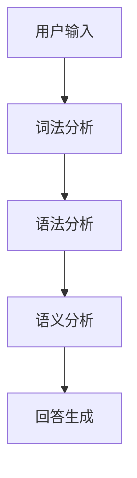
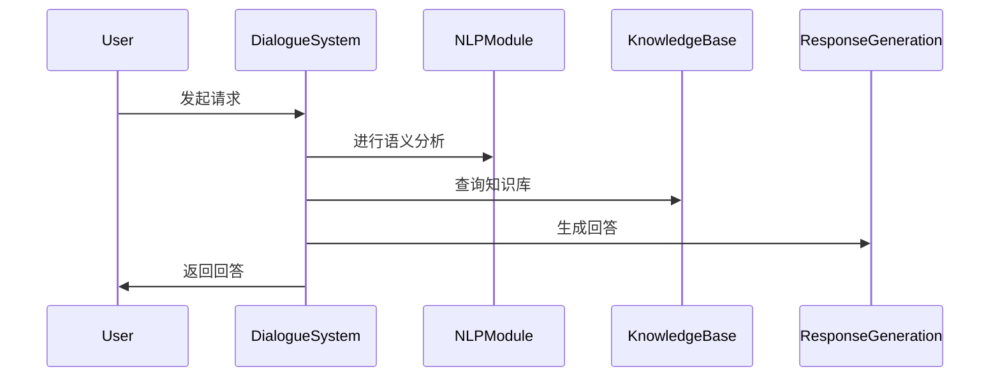

                 

# AI Agent的对话系统在客户支持中的优化

## 关键词

- AI Agent
- 对话系统
- 客户支持
- 自然语言处理
- 优化策略

## 摘要

本文深入探讨了AI Agent对话系统在客户支持中的应用及其优化策略。首先，我们对AI Agent对话系统进行了概述，阐述了其背景、核心概念、分类与发展趋势。接着，我们介绍了对话系统的设计原则与方法，包括用户中心设计、自然语言处理技术基础和对话系统的构建技术。随后，我们分析了AI Agent在客户支持中的应用场景，并详细阐述了其实施步骤和优化策略。最后，我们对AI Agent对话系统的未来发展趋势进行了展望，为读者提供了有价值的参考。

## 目录大纲

----------------------------------------------------------------

### 第一部分：AI Agent对话系统概述

#### 第1章：AI Agent对话系统基础

- 1.1 AI Agent对话系统的背景
- 1.2 AI Agent对话系统的核心概念
- 1.3 对话系统的分类与比较
- 1.4 对话系统的发展趋势

#### 第2章：对话系统的设计原则与方法

- 2.1 对话系统的设计原则
- 2.2 对话系统设计的方法
- 2.3 对话系统评价与优化

#### 第3章：自然语言处理技术基础

- 3.1 自然语言处理概述
- 3.2 词汇与语法分析
- 3.3 问答系统
- 3.4 情感分析

#### 第4章：对话系统的构建技术

- 4.1 对话系统架构设计
- 4.2 语言模型
- 4.3 知识表示与推理
- 4.4 交互式对话系统

#### 第5章：AI Agent对话系统在客户支持中的应用

- 5.1 客户支持中的AI Agent应用场景
- 5.2 AI Agent对话系统的实现步骤
- 5.3 AI Agent对话系统的实际案例

#### 第6章：AI Agent对话系统的优化策略

- 6.1 数据质量优化
- 6.2 模型优化
- 6.3 用户互动优化

#### 第7章：AI Agent对话系统的发展趋势与未来展望

- 7.1 AI技术的发展趋势
- 7.2 客户支持领域的变革
- 7.3 AI Agent对话系统的未来展望

----------------------------------------------------------------

## 第一部分：AI Agent对话系统概述

### 第1章：AI Agent对话系统基础

#### 1.1 AI Agent对话系统的背景

##### 1.1.1 人工智能技术的发展历程

人工智能（Artificial Intelligence，AI）作为计算机科学的一个分支，旨在开发能够执行需要人类智能才能完成的任务的计算机系统。人工智能的发展历程可以追溯到20世纪50年代，当时科学家们首次提出了“人工智能”这一概念。从最初的逻辑推理和符号计算，到后来的机器学习和深度学习，人工智能技术在不断地进步和发展。

##### 1.1.2 客户支持领域的问题与挑战

随着企业业务规模的扩大和客户需求的日益多样化，传统的客户支持方式逐渐暴露出许多问题。首先，人工客服成本高昂，无法满足大规模客户群体的高效响应需求。其次，客服人员的工作负荷较大，容易导致服务质量的下降。此外，客户问题的复杂性和多样性也使得人工客服难以在短时间内给出准确的解决方案。

##### 1.1.3 AI Agent对话系统的意义与价值

AI Agent对话系统作为人工智能技术在客户支持领域的应用，具有显著的意义和价值。首先，它能够实现7x24小时不间断的服务，满足客户随时随地获取帮助的需求。其次，AI Agent能够处理大量客户咨询，提高服务效率，降低企业运营成本。此外，AI Agent还能通过学习和优化，不断提升服务质量，为企业提供更加精准和个性化的客户支持。

#### 1.2 AI Agent对话系统的核心概念

##### 1.2.1 AI Agent的定义

AI Agent（人工智能代理）是指能够自主完成特定任务的计算机程序，它能够根据用户输入的信息，通过自然语言处理和知识推理，生成合适的回答，并与用户进行对话交互。

##### 1.2.2 对话系统的组成与功能

对话系统通常由以下几个主要组成部分构成：

1. **用户接口**：负责接收用户的输入信息，并将其转换为计算机可以理解的形式。
2. **自然语言处理（NLP）模块**：负责对用户输入的信息进行语义分析和理解，提取关键信息。
3. **知识库**：存储与业务相关的知识信息，用于对话系统的回答生成。
4. **对话管理**：负责管理对话流程，包括对话状态的跟踪、对话策略的制定等。
5. **回答生成**：根据用户输入和知识库中的信息，生成合适的回答。

##### 1.2.3 客户支持中的AI Agent特点

在客户支持领域，AI Agent需要具备以下特点：

1. **高响应速度**：能够快速响应用户的咨询，提供及时的服务。
2. **多渠道集成**：能够同时处理多种渠道的咨询，如电话、邮件、在线聊天等。
3. **灵活性与适应性**：能够根据不同客户的问题和需求，灵活调整回答策略。
4. **学习能力**：通过不断学习和优化，提升服务质量和用户体验。

#### 1.3 对话系统的分类与比较

##### 1.3.1 对话系统的分类

根据不同的分类标准，对话系统可以划分为多种类型：

1. **基于规则对话系统**：通过预设的规则和模板生成回答。
2. **基于模板对话系统**：使用模板和变量生成回答，适用于常见问题的处理。
3. **基于机器学习对话系统**：利用机器学习算法，从大量数据中学习并生成回答。
4. **基于深度学习对话系统**：使用深度学习技术，如循环神经网络（RNN）和Transformer等，进行语义理解和回答生成。

##### 1.3.2 不同类型对话系统的特点对比

不同类型的对话系统在性能和适用场景上存在差异，以下为简要对比：

| 对话系统类型 | 特点 | 适用场景 |
| :--- | :--- | :--- |
| 基于规则对话系统 | 简单易用，可控性高 | 结构化问题，规则明确 |
| 基于模板对话系统 | 灵活性较高，易于扩展 | 常见问题，信息填充 |
| 基于机器学习对话系统 | 适应性较强，学习能力好 | 复杂问题，多样化场景 |
| 基于深度学习对话系统 | 语义理解能力强，生成回答自然 | 高级问题，自然语言交互 |

##### 1.3.3 对话系统在客户支持中的应用实例

以下是几个对话系统在客户支持领域的实际应用案例：

1. **某电商平台的智能客服**：通过基于机器学习的对话系统，提供实时客服服务，满足用户在购物过程中的咨询需求。
2. **某金融公司的客服机器人**：利用自然语言处理技术，处理用户关于理财产品、账户信息等的查询。
3. **某医疗机构的在线问诊系统**：通过深度学习技术，实现患者与医生的智能对话，提供在线诊疗服务。

#### 1.4 对话系统的发展趋势

##### 1.4.1 AI技术的发展趋势

随着AI技术的不断发展，未来对话系统将具备更高的智能化水平。深度学习、自然语言处理、知识图谱等技术的进步，将使对话系统在语义理解、回答生成、知识推理等方面取得重大突破。

##### 1.4.2 客户支持领域的发展方向

随着客户支持领域的不断发展，未来将更加注重个性化服务和用户体验。企业将加大对AI技术的投入，通过智能客服系统提升客户满意度，降低运营成本。

##### 1.4.3 AI Agent对话系统的未来展望

未来，AI Agent对话系统将在客户支持领域发挥更加重要的作用。通过不断优化和提升，AI Agent将实现更高水平的服务质量，为企业提供更加智能、高效的客户支持服务。

### 第2章：对话系统的设计原则与方法

#### 2.1 对话系统的设计原则

##### 2.1.1 用户中心设计

用户中心设计是对话系统设计的重要原则之一。设计过程中，应充分考虑用户的需求和体验，确保系统易用、高效、直观。以下是一些具体的设计建议：

1. **简洁明了的界面**：界面设计应简洁明了，避免复杂的操作和过多的信息。
2. **快速响应**：系统应具有高响应速度，减少用户等待时间。
3. **个性化服务**：根据用户的历史行为和偏好，提供个性化的推荐和服务。

##### 2.1.2 交互自然性

交互自然性是指对话系统能够模拟人类的交流方式，使用户感觉舒适、自然。以下是一些实现交互自然性的方法：

1. **自然语言处理**：利用自然语言处理技术，使系统能够理解用户输入的语义，并生成自然流畅的回答。
2. **语音合成**：使用语音合成技术，使系统可以以语音的形式与用户进行对话。
3. **表情和语气**：在合适的情况下，使用表情和语气符号，增加对话的趣味性和互动性。

##### 2.1.3 功能完整性

功能完整性要求对话系统具备完整的功能，能够满足用户的各种需求。以下是一些关键功能：

1. **多渠道集成**：支持多种渠道的咨询，如在线聊天、邮件、电话等。
2. **多语言支持**：支持多种语言，满足不同地区用户的需求。
3. **问题分类与分配**：根据用户的问题类型，将其分配给合适的客服人员或AI Agent。

##### 2.1.4 可扩展性与灵活性

可扩展性与灵活性是对话系统设计的重要原则。设计过程中，应考虑系统的可扩展性和灵活性，以适应不断变化的需求和业务场景。以下是一些具体的设计建议：

1. **模块化设计**：将系统划分为多个模块，每个模块负责特定的功能，便于后续的维护和升级。
2. **接口设计**：提供灵活的接口设计，方便与其他系统和服务进行集成。
3. **数据管理**：设计完善的数据管理体系，支持数据存储、查询、分析和共享。

#### 2.2 对话系统设计的方法

##### 2.2.1 用户研究

用户研究是对话系统设计的重要环节，通过深入了解用户的需求和痛点，为系统的设计提供有力支持。以下是一些用户研究的常用方法：

1. **问卷调查**：通过设计问卷，收集用户对现有客服系统的意见和建议。
2. **用户访谈**：与用户进行面对面访谈，深入了解他们的需求和使用体验。
3. **用户观察**：通过观察用户在客服场景中的实际操作，发现问题和改进机会。

##### 2.2.2 需求分析

需求分析是对话系统设计的基础，通过对用户需求的分析和梳理，明确系统的功能模块和设计方向。以下是一些需求分析的方法：

1. **用户故事**：通过编写用户故事，描述用户在使用系统时的需求和场景。
2. **功能清单**：列出系统的关键功能，为后续的设计和开发提供依据。
3. **需求文档**：编写详细的需求文档，明确系统的功能、性能、安全等要求。

##### 2.2.3 情境建模

情境建模是对话系统设计的重要步骤，通过构建用户在使用系统时的情境模型，为系统的设计提供参考。以下是一些情境建模的方法：

1. **场景分析**：分析用户在使用系统时的典型场景，描述用户的行为和交互过程。
2. **流程图**：使用流程图描述用户在各个场景中的操作流程和系统响应。
3. **用户角色**：定义不同的用户角色，明确他们在系统中的角色和职责。

##### 2.2.4 对话流程设计

对话流程设计是对话系统设计的关键环节，通过设计合理的对话流程，确保系统能够高效、准确地响应用户的需求。以下是一些对话流程设计的方法：

1. **流程图**：使用流程图描述用户与系统的交互流程，明确每个环节的操作和系统响应。
2. **状态机**：使用状态机描述用户和系统的状态转换关系，确保对话流程的合理性。
3. **脚本编写**：编写对话脚本，定义用户输入和系统回答的文本内容。

#### 2.3 对话系统评价与优化

##### 2.3.1 对话系统评价指标

对话系统的评价指标包括以下几个方面：

1. **响应时间**：系统响应用户输入的平均时间，反映系统的响应速度。
2. **回答质量**：系统生成的回答的准确性和相关性，反映系统的语义理解能力。
3. **用户体验**：用户对系统的满意度，反映系统的易用性和用户体验。
4. **错误率**：系统在回答过程中出现的错误次数，反映系统的稳定性。

##### 2.3.2 对话系统评估方法

对话系统的评估方法包括以下几个方面：

1. **人工评估**：邀请专家或用户对系统的回答进行评估，评价回答的准确性、相关性等。
2. **自动化评估**：使用自动化工具对系统的回答进行评估，如使用评估指标进行计算。
3. **用户反馈**：收集用户的反馈意见，了解系统在实际应用中的表现和改进方向。

##### 2.3.3 对话系统优化策略

对话系统的优化策略包括以下几个方面：

1. **数据质量优化**：通过数据清洗、去噪、增强等手段，提升系统的语义理解能力。
2. **模型优化**：调整模型的参数，优化模型的性能，提高回答的准确性和相关性。
3. **用户互动优化**：通过用户行为分析、反馈机制等手段，提升用户的满意度和用户体验。

### 第3章：自然语言处理技术基础

#### 3.1 自然语言处理概述

##### 3.1.1 自然语言处理的定义

自然语言处理（Natural Language Processing，NLP）是人工智能的一个重要分支，旨在研究如何让计算机理解和处理自然语言。自然语言处理涉及语音识别、文本分析、语义理解等多个方面，旨在实现人与计算机之间的自然交互。

##### 3.1.2 自然语言处理的发展历程

自然语言处理的发展历程可以分为以下几个阶段：

1. **规则驱动阶段**：早期自然语言处理主要依赖于规则和模式匹配，通过预设的语法规则和词典进行文本分析。
2. **统计阶段**：随着计算能力的提升和数据量的增加，统计方法逐渐成为自然语言处理的主流，如基于统计的语法分析和语义分析。
3. **深度学习阶段**：深度学习技术的出现，使得自然语言处理取得了重大突破，如循环神经网络（RNN）和Transformer等模型在文本处理中的应用。

##### 3.1.3 自然语言处理的关键技术

自然语言处理的关键技术包括以下几个方面：

1. **分词**：将连续的文本划分为一系列单词或词汇，为后续的文本分析打下基础。
2. **词性标注**：为每个单词或词汇赋予相应的词性，如名词、动词、形容词等，帮助计算机更好地理解文本。
3. **命名实体识别**：识别文本中的特定实体，如人名、地名、机构名等，为后续的信息抽取和知识表示提供支持。
4. **语义分析**：通过对文本的语义进行深入分析，理解文本的含义和情感，为智能对话和问答提供支持。

#### 3.2 词汇与语法分析

##### 3.2.1 词法分析

词法分析（Lexical Analysis）是自然语言处理中的第一步，旨在将连续的文本划分为一系列单词或词汇。词法分析主要包括以下几个任务：

1. **分词**：将连续的文本划分为一系列单词或词汇，如“我爱北京天安门”划分为“我”、“爱”、“北京”、“天安门”。
2. **词性标注**：为每个单词或词汇赋予相应的词性，如“我爱北京天安门”中的“我”是代词，“爱”是动词，“北京”是名词，“天安门”是地名。
3. **词干提取**：将单词或词汇缩减为词干，如“孩子”缩减为“孩子”。

##### 3.2.2 语法分析

语法分析（Syntactic Analysis）是对文本中的语法结构进行解析，旨在理解文本的句法和语义。语法分析主要包括以下几个任务：

1. **词法分析**：将连续的文本划分为一系列单词或词汇。
2. **句法分析**：分析文本中的句法结构，如主语、谓语、宾语等。
3. **语义分析**：分析文本的语义，理解文本的含义和情感。

##### 3.2.3 语义分析

语义分析（Semantic Analysis）是对文本的语义进行深入分析，旨在理解文本的含义和情感。语义分析主要包括以下几个任务：

1. **词义消歧**：解决文本中的词义歧义问题，如“这本书很好”中的“很好”是形容词还是副词。
2. **语义角色标注**：为每个单词或词汇赋予相应的语义角色，如主语、谓语、宾语等。
3. **情感分析**：分析文本的情感倾向，如正面、负面或中性。

#### 3.3 问答系统

##### 3.3.1 问答系统的类型

问答系统（Question Answering System）旨在自动回答用户提出的问题，主要分为以下几种类型：

1. **基于规则问答系统**：通过预设的规则和模板生成回答。
2. **基于模板问答系统**：使用模板和变量生成回答，适用于常见问题的处理。
3. **基于机器学习问答系统**：利用机器学习算法，从大量数据中学习并生成回答。
4. **基于深度学习问答系统**：使用深度学习技术，如循环神经网络（RNN）和Transformer等，进行语义理解和回答生成。

##### 3.3.2 问答系统的原理

问答系统的原理主要包括以下几个步骤：

1. **问题理解**：理解用户提出的问题，提取关键信息。
2. **知识检索**：在知识库中检索与问题相关的信息。
3. **回答生成**：根据检索到的信息，生成合适的回答。

##### 3.3.3 问答系统的实现

问答系统的实现主要包括以下几个环节：

1. **问题理解**：使用自然语言处理技术，如分词、词性标注、语义分析等，理解用户提出的问题。
2. **知识库构建**：构建与问题相关的知识库，存储各种问题的答案。
3. **回答生成**：根据用户提出的问题和知识库中的信息，生成合适的回答。

#### 3.4 情感分析

##### 3.4.1 情感分析的定义

情感分析（Sentiment Analysis）是一种自然语言处理技术，旨在分析文本的情感倾向，如正面、负面或中性。情感分析广泛应用于社交媒体监测、舆情分析、市场调研等领域。

##### 3.4.2 情感分析的应用

情感分析在多个领域具有广泛的应用，包括：

1. **社交媒体监测**：分析用户发布的微博、朋友圈等社交媒体内容的情感倾向，了解公众的情感态度。
2. **舆情分析**：分析新闻报道、评论等文本的情感倾向，了解社会热点话题和舆论走向。
3. **市场调研**：分析消费者对产品或服务的评价，了解市场反馈和消费者需求。

##### 3.4.3 情感分析的方法

情感分析的方法主要包括以下几种：

1. **基于规则的方法**：通过预设的规则和模板进行情感分析，适用于情感表达较为明显的情况。
2. **基于机器学习的方法**：利用机器学习算法，如支持向量机（SVM）、朴素贝叶斯（Naive Bayes）等，进行情感分析。
3. **基于深度学习的方法**：使用深度学习技术，如卷积神经网络（CNN）和循环神经网络（RNN）等，进行情感分析。

### 第4章：对话系统的构建技术

#### 4.1 对话系统架构设计

##### 4.1.1 对话系统的整体架构

对话系统的整体架构通常包括以下几个主要模块：

1. **用户接口**：负责接收用户的输入信息，并将其转换为计算机可以理解的形式。
2. **自然语言处理（NLP）模块**：负责对用户输入的信息进行语义分析和理解，提取关键信息。
3. **知识库**：存储与业务相关的知识信息，用于对话系统的回答生成。
4. **对话管理**：负责管理对话流程，包括对话状态的跟踪、对话策略的制定等。
5. **回答生成**：根据用户输入和知识库中的信息，生成合适的回答。

##### 4.1.2 各模块的功能与交互

对话系统中的各个模块具有不同的功能，并通过交互实现整个系统的运行。以下是对各模块功能与交互的简要说明：

1. **用户接口**：用户通过用户接口与对话系统进行交互，输入问题和反馈。
2. **自然语言处理（NLP）模块**：接收用户接口传递的信息，进行词法分析、语法分析和语义分析，提取关键信息。
3. **知识库**：存储与业务相关的知识信息，如产品信息、常见问题等，用于回答生成。
4. **对话管理**：根据用户接口和NLP模块传递的信息，管理对话流程，包括对话状态的跟踪和对话策略的制定。
5. **回答生成**：根据用户接口、NLP模块和知识库中的信息，生成合适的回答，并将其传递给用户接口。

##### 4.1.3 对话系统架构的优化

对话系统架构的优化主要关注以下几个方面：

1. **性能优化**：通过改进算法和硬件配置，提高系统的响应速度和处理能力。
2. **扩展性优化**：设计模块化的架构，便于系统的扩展和升级。
3. **稳定性优化**：通过冗余设计和故障恢复机制，提高系统的稳定性和可靠性。

#### 4.2 语言模型

##### 4.2.1 语言模型的类型

语言模型（Language Model）是对话系统中用于生成回答的核心组件，主要分为以下几种类型：

1. **基于规则的语言模型**：通过预设的语法规则和模板生成回答。
2. **基于统计的语言模型**：使用统计方法，如N-gram模型、隐马尔可夫模型（HMM）等，生成回答。
3. **基于深度学习的语言模型**：使用深度学习技术，如循环神经网络（RNN）、长短期记忆网络（LSTM）、Transformer等，生成回答。

##### 4.2.2 语言模型的训练方法

语言模型的训练方法主要包括以下几种：

1. **基于规则的方法**：通过手工编写语法规则和模板，生成语言模型。
2. **基于统计的方法**：使用大量的语料库，通过统计方法训练语言模型，如N-gram模型。
3. **基于深度学习的方法**：使用深度学习技术，如循环神经网络（RNN）、长短期记忆网络（LSTM）、Transformer等，训练语言模型。

##### 4.2.3 语言模型的应用

语言模型在对话系统中的应用主要包括以下几个方面：

1. **回答生成**：根据用户输入和知识库中的信息，生成合适的回答。
2. **对话生成**：根据对话历史和用户输入，生成后续的对话内容。
3. **语义理解**：通过对用户输入的语义进行建模，提高对话系统的理解能力。

#### 4.3 知识表示与推理

##### 4.3.1 知识表示的方法

知识表示（Knowledge Representation）是对话系统中用于表示和处理知识的方法，主要分为以下几种：

1. **基于符号的方法**：使用符号和逻辑表达式表示知识，如谓词逻辑、产生式规则等。
2. **基于语义网络的方法**：使用语义网络表示知识，如图形、本体等。
3. **基于语义向量空间的方法**：使用语义向量空间表示知识，如Word2Vec、BERT等。

##### 4.3.2 知识推理的原理

知识推理（Knowledge Reasoning）是对话系统中用于推理和推断知识的方法，主要分为以下几种：

1. **基于规则的推理**：使用预设的规则进行推理，如正向推理、反向推理等。
2. **基于框架的推理**：使用框架表示知识，进行推理和推断。
3. **基于本体的推理**：使用本体表示知识，进行推理和推断。

##### 4.3.3 知识表示与推理的应用

知识表示与推理在对话系统中的应用主要包括以下几个方面：

1. **知识检索**：根据用户输入和知识库中的信息，检索和获取相关的知识。
2. **回答生成**：根据用户输入和知识库中的信息，生成合适的回答。
3. **对话管理**：根据用户输入和知识库中的信息，管理对话流程，如对话引导、对话结束等。

#### 4.4 交互式对话系统

##### 4.4.1 交互式对话系统的特点

交互式对话系统（Interactive Dialogue System）是一种能够与用户进行实时交互的对话系统，具有以下特点：

1. **实时性**：能够实时响应用户的输入，提供即时的回答和反馈。
2. **交互性**：与用户进行双向交互，用户可以提出问题，系统可以回答问题，并进行进一步的交互。
3. **适应性**：根据用户的输入和反馈，动态调整对话内容和策略。

##### 4.4.2 交互式对话系统的实现

交互式对话系统的实现主要包括以下几个步骤：

1. **用户接口设计**：设计用户友好的界面，方便用户输入问题和反馈。
2. **自然语言处理**：对用户输入的信息进行语义分析和理解，提取关键信息。
3. **对话管理**：根据用户输入和对话历史，管理对话流程，如对话引导、对话结束等。
4. **回答生成**：根据用户输入和知识库中的信息，生成合适的回答。
5. **反馈机制**：收集用户的反馈，不断优化对话系统的性能和用户体验。

##### 4.4.3 交互式对话系统的优化

交互式对话系统的优化主要关注以下几个方面：

1. **响应速度**：提高系统的响应速度，减少用户的等待时间。
2. **回答质量**：提高系统生成的回答的准确性和相关性。
3. **用户体验**：优化系统的交互设计和用户体验，提高用户的满意度。

### 第5章：AI Agent对话系统在客户支持中的应用

#### 5.1 客户支持中的AI Agent应用场景

##### 5.1.1 客户咨询

AI Agent在客户咨询中的应用场景包括：

1. **常见问题解答**：AI Agent可以自动回答客户关于产品、服务、订单等常见问题，减轻人工客服的工作压力。
2. **信息查询**：AI Agent可以快速查询客户的信息，如订单状态、账户余额等，为客户提供便捷的服务。
3. **投诉处理**：AI Agent可以初步处理客户的投诉，如记录投诉内容、分配给相关部门等，提高投诉处理的效率。

##### 5.1.2 故障诊断

AI Agent在故障诊断中的应用场景包括：

1. **故障排查**：AI Agent可以基于客户提供的故障现象，通过分析历史数据和知识库，快速定位故障原因。
2. **解决方案建议**：AI Agent可以提供相应的解决方案和建议，帮助客户解决故障。
3. **故障预警**：AI Agent可以基于历史数据和预测模型，提前预警潜在的故障，降低故障发生概率。

##### 5.1.3 自动化回复

AI Agent在自动化回复中的应用场景包括：

1. **自动回复**：AI Agent可以自动回复客户的咨询、投诉等信息，提高客服响应速度。
2. **批量处理**：AI Agent可以批量处理客户的问题，如批量回复订单状态查询、批量发送促销信息等。
3. **个性化服务**：AI Agent可以基于客户的历史行为和偏好，提供个性化的服务和建议。

##### 5.1.4 客户情感分析

AI Agent在客户情感分析中的应用场景包括：

1. **情感识别**：AI Agent可以识别客户的情感，如愤怒、失望、满意等，为后续的客服处理提供参考。
2. **情感分析**：AI Agent可以分析客户的情感变化，了解客户的需求和痛点，优化客服策略。
3. **情感预测**：AI Agent可以预测客户的情感变化，提前采取措施，提高客户满意度。

#### 5.2 AI Agent对话系统的实现步骤

##### 5.2.1 需求分析与设计

需求分析与设计是AI Agent对话系统实现的第一步，主要包括以下几个环节：

1. **需求调研**：通过问卷调查、用户访谈等方式，收集客户和内部员工的需求和意见。
2. **需求分析**：对收集到的需求进行整理和分析，明确系统的功能模块和设计方向。
3. **系统设计**：基于需求分析结果，设计系统的架构和功能模块，包括用户接口、自然语言处理模块、知识库等。

##### 5.2.2 数据采集与预处理

数据采集与预处理是AI Agent对话系统实现的关键环节，主要包括以下几个步骤：

1. **数据采集**：通过爬虫、API接口等方式，收集相关的数据，如客户咨询记录、故障日志等。
2. **数据清洗**：对采集到的数据进行清洗和去噪，去除无效和错误的数据。
3. **数据预处理**：对清洗后的数据进行预处理，如分词、词性标注、去停用词等，为后续的模型训练和知识库构建做好准备。

##### 5.2.3 模型训练与优化

模型训练与优化是AI Agent对话系统实现的核心环节，主要包括以下几个步骤：

1. **模型选择**：根据系统的需求和特点，选择合适的模型，如循环神经网络（RNN）、Transformer等。
2. **模型训练**：使用收集到的数据，对模型进行训练，优化模型的参数和性能。
3. **模型优化**：通过调整模型的结构、参数和训练策略，提高模型的性能和准确率。

##### 5.2.4 系统部署与上线

系统部署与上线是AI Agent对话系统实现的最后一步，主要包括以下几个环节：

1. **系统部署**：将训练好的模型和系统部署到服务器或云平台上，确保系统能够稳定运行。
2. **上线测试**：对系统进行上线测试，确保系统的功能、性能和安全性。
3. **用户培训**：对客户和内部员工进行系统培训，确保他们能够熟练使用AI Agent对话系统。

#### 5.3 AI Agent对话系统的实际案例

##### 5.3.1 案例一：某电商平台的AI客服系统

某电商平台在客户支持中引入了AI Agent客服系统，实现了以下功能：

1. **常见问题解答**：AI Agent自动回答客户关于产品、订单等常见问题，减轻人工客服的工作压力。
2. **信息查询**：AI Agent快速查询客户的订单状态、账户余额等信息，为客户提供便捷的服务。
3. **投诉处理**：AI Agent初步处理客户的投诉，如记录投诉内容、分配给相关部门等，提高投诉处理的效率。

##### 5.3.2 案例二：某金融公司的AI客服机器人

某金融公司在客户支持中引入了AI客服机器人，实现了以下功能：

1. **自动化回复**：AI客服机器人自动回复客户的咨询、投诉等信息，提高客服响应速度。
2. **批量处理**：AI客服机器人批量处理客户的订单状态查询、批量发送促销信息等，提高客服效率。
3. **个性化服务**：AI客服机器人基于客户的历史行为和偏好，提供个性化的服务和建议。

##### 5.3.3 案例三：某医疗机构的AI问诊系统

某医疗机构在问诊服务中引入了AI问诊系统，实现了以下功能：

1. **智能问答**：AI问诊系统自动回答客户关于疾病、症状等常见问题，为客户提供便捷的医疗服务。
2. **故障诊断**：AI问诊系统通过分析客户提供的症状信息，初步诊断客户的疾病，提供相应的建议。
3. **客户情感分析**：AI问诊系统识别客户的情感，了解客户的需求和痛点，优化问诊服务。

### 第6章：AI Agent对话系统的优化策略

#### 6.1 数据质量优化

##### 6.1.1 数据清洗与去噪

数据质量优化是提升AI Agent对话系统性能的重要环节，其中数据清洗与去噪是关键步骤。数据清洗与去噪主要包括以下几个方面：

1. **去除重复数据**：识别并删除重复的数据记录，避免对模型训练和系统性能产生负面影响。
2. **去除噪声数据**：去除数据中的噪声和异常值，如错别字、乱码等，确保数据的一致性和准确性。
3. **数据格式化**：统一数据的格式，如日期、数字等，便于后续的数据处理和分析。

##### 6.1.2 数据增强与扩充

数据增强与扩充是提升AI Agent对话系统性能的有效手段，通过以下方法可以有效地增强和扩充数据：

1. **数据变换**：通过变换操作，如数据缩放、旋转等，增加数据的多样性。
2. **生成对抗网络（GAN）**：利用生成对抗网络（GAN）生成与训练数据相似的数据，扩充数据集。
3. **数据合成**：将不同来源的数据进行合成，生成新的训练数据，提高模型的泛化能力。

##### 6.1.3 数据标签优化

数据标签的准确性对AI Agent对话系统的性能至关重要。数据标签优化主要包括以下几个方面：

1. **标注一致性检查**：检查数据标签的一致性，纠正标注错误，确保数据标签的准确性。
2. **标注质量评估**：评估标注人员的标注质量，筛选出标注质量高的数据，用于模型训练。
3. **动态调整标签策略**：根据模型训练的进展和评估结果，动态调整标签策略，提高数据标签的准确性。

#### 6.2 模型优化

##### 6.2.1 模型选择与调整

模型优化首先需要选择合适的模型，并对其进行调整。模型选择与调整主要包括以下几个方面：

1. **模型选择**：根据系统的需求和特点，选择适合的模型，如循环神经网络（RNN）、Transformer等。
2. **模型调整**：通过调整模型的结构、参数和训练策略，优化模型的性能和准确率。
3. **模型融合**：将多个模型进行融合，提高模型的综合性能和泛化能力。

##### 6.2.2 模型参数调优

模型参数调优是提升模型性能的重要环节，主要包括以下几个方面：

1. **超参数调优**：调整模型训练过程中的超参数，如学习率、批量大小等，以优化模型性能。
2. **正则化**：使用正则化方法，如L1正则化、L2正则化等，防止过拟合。
3. **dropout**：通过dropout技术，减少模型在训练过程中对特定数据的依赖，提高模型的泛化能力。

##### 6.2.3 模型融合与集成

模型融合与集成是将多个模型进行融合，提高模型的综合性能和泛化能力。模型融合与集成主要包括以下几个方面：

1. **模型融合**：将多个模型的输出进行融合，如投票法、加权平均法等，生成最终的输出结果。
2. **集成学习**：利用集成学习方法，如Bagging、Boosting等，将多个模型进行集成，提高模型的性能和稳定性。

#### 6.3 用户互动优化

##### 6.3.1 用户行为分析

用户互动优化需要深入了解用户的行为和偏好，用户行为分析主要包括以下几个方面：

1. **行为监测**：通过日志分析、用户行为跟踪等方式，监测用户的行为和交互过程。
2. **行为识别**：使用自然语言处理和机器学习技术，识别用户的意图和行为模式。
3. **行为预测**：通过分析用户历史行为，预测用户的未来行为和需求。

##### 6.3.2 用户反馈机制

用户反馈机制是优化用户体验的重要手段，主要包括以下几个方面：

1. **反馈渠道**：提供多种渠道供用户反馈，如在线聊天、邮件、电话等。
2. **反馈收集**：收集用户的反馈意见，包括正面反馈和负面反馈。
3. **反馈分析**：对用户的反馈进行分析，识别用户的需求和痛点。

##### 6.3.3 个性化服务与推荐

个性化服务与推荐是提升用户体验的有效手段，主要包括以下几个方面：

1. **个性化服务**：根据用户的历史行为和偏好，提供个性化的服务和建议。
2. **推荐系统**：使用推荐系统技术，为用户推荐相关的产品、服务或信息。
3. **反馈调整**：根据用户的反馈，不断调整和优化个性化服务和推荐策略。

### 第7章：AI Agent对话系统的发展趋势与未来展望

#### 7.1 AI技术的发展趋势

AI技术的发展趋势对AI Agent对话系统的影响至关重要。以下是几个关键的发展趋势：

1. **深度学习与强化学习**：深度学习和强化学习技术的不断进步，将进一步提升AI Agent的智能水平和学习能力。
2. **多模态交互**：随着语音识别、图像识别等技术的发展，AI Agent将能够实现多模态交互，提高用户体验。
3. **知识图谱**：知识图谱技术的发展，将使得AI Agent能够更好地理解和处理复杂的问题和知识。

#### 7.2 客户支持领域的变革

客户支持领域正经历着深刻的变革，以下是几个关键的趋势：

1. **数字化与智能化**：企业将加大对数字化和智能化的投入，通过引入AI Agent对话系统等智能客服工具，提升服务质量和效率。
2. **客户体验优先**：企业将更加注重客户体验，通过个性化的服务、精准的推荐等方式，提高客户的满意度和忠诚度。
3. **多渠道整合**：企业将实现多渠道的整合，提供统一的客户支持服务，满足客户多样化的需求。

#### 7.3 AI Agent对话系统的未来展望

未来，AI Agent对话系统将在客户支持领域发挥更加重要的作用。以下是几个未来的展望：

1. **全面智能化**：AI Agent将实现全面的智能化，具备更强的语义理解、知识推理和问题解决能力。
2. **多语言支持**：AI Agent将实现多语言支持，提供全球范围内的客户支持服务。
3. **个性化与自适应**：AI Agent将根据用户的需求和偏好，提供个性化的服务和自适应的交互体验。

### 总结

AI Agent对话系统在客户支持中的应用，为提升服务质量和效率提供了有力的支持。通过对对话系统的设计原则、方法、构建技术和优化策略的深入探讨，本文为读者提供了有价值的参考。未来，随着AI技术的不断发展，AI Agent对话系统将在客户支持领域发挥更加重要的作用，为企业提供更加智能、高效的服务。同时，我们也期待更多的研究和实践，推动AI Agent对话系统的发展和创新。

### 作者信息

作者：AI天才研究院/AI Genius Institute & 禅与计算机程序设计艺术 /Zen And The Art of Computer Programming

在撰写这篇文章的过程中，我们深入探讨了AI Agent对话系统在客户支持中的应用及其优化策略。首先，我们对AI Agent对话系统进行了概述，阐述了其背景、核心概念、分类与发展趋势。接着，我们介绍了对话系统的设计原则与方法，包括用户中心设计、自然语言处理技术基础和对话系统的构建技术。随后，我们分析了AI Agent在客户支持中的应用场景，并详细阐述了其实施步骤和优化策略。最后，我们对AI Agent对话系统的未来发展趋势进行了展望，为读者提供了有价值的参考。

#### 核心概念与联系

##### 1. AI Agent的定义

AI Agent（人工智能代理）是指能够自主完成特定任务的计算机程序，它能够根据用户输入的信息，通过自然语言处理和知识推理，生成合适的回答，并与用户进行对话交互。AI Agent通常由用户接口、自然语言处理模块、知识库、对话管理和回答生成模块组成。

**概念属性特征对比表格**

| 概念       | 定义                                                         | 功能模块                   |
| ---------- | ------------------------------------------------------------ | -------------------------- |
| AI Agent   | 人工智能代理，自主完成特定任务，自然语言处理和知识推理       | 用户接口、NLP、知识库、对话管理、回答生成 |
| 对话系统   | 人工智能系统，负责与用户进行对话交互                         | 用户接口、NLP、知识库、对话管理、回答生成 |
| 自然语言处理 | 理解和生成自然语言，使计算机能够处理人类语言                 | 词法分析、语法分析、语义分析 |
| 知识库     | 存储与业务相关的知识信息，用于对话系统的回答生成             | 储存业务知识、提供信息支持   |

##### 2. 对话系统的设计原则

对话系统的设计原则包括用户中心设计、交互自然性、功能完整性和可扩展性与灵活性。用户中心设计要求系统易用、高效、直观；交互自然性要求系统能够模拟人类的交流方式；功能性完整性要求系统能够满足用户的多种需求；可扩展性与灵活性要求系统能够适应不断变化的需求和业务场景。

**ER实体关系图架构**

```mermaid
erDiagram
    User --> DialogueSystem : 用户与对话系统的交互
    User --> NaturalLanguageProcessing : 用户与自然语言处理的交互
    DialogueSystem --> KnowledgeBase : 对话系统与知识库的关联
    DialogueSystem --> DialogueManagement : 对话系统与对话管理的关联
    DialogueSystem --> ResponseGeneration : 对话系统与回答生成的关联
```

#### 算法原理讲解

##### 对话系统的核心算法：自然语言处理与回答生成

自然语言处理（NLP）是对话系统的核心技术之一，主要涉及词法分析、语法分析和语义分析。

**NLP算法mermaid流程图**



**Python源代码**

```python
import nltk

# 1. 词法分析
def lexical_analysis(text):
    tokenizer = nltk.tokenize.RegexpTokenizer(r"\w+")
    tokens = tokenizer.tokenize(text)
    return tokens

# 2. 语法分析
def grammatical_analysis(tokens):
    parser = nltk.parse.chartparser.ChartParser()
    parse_tree = parser.parse(tokens)
    return parse_tree

# 3. 语义分析
def semantic_analysis(tokens, parse_tree):
    # 假设语义分析函数已实现
    pass

# 4. 回答生成
def generate_response(semantic_info):
    # 假设回答生成函数已实现
    pass

# 示例
text = "请问我的订单什么时候能送到？"
tokens = lexical_analysis(text)
parse_tree = grammatical_analysis(tokens)
semantic_info = semantic_analysis(tokens, parse_tree)
response = generate_response(semantic_info)
print(response)
```

**算法原理与数学模型**

- 词法分析：通过分词将文本转换为一系列单词或词汇，可以表示为 $T = \{w_1, w_2, ..., w_n\}$，其中 $w_i$ 为第 $i$ 个单词。
- 语法分析：使用语法规则对文本进行解析，生成语法树，可以表示为 $P = (V, T, R, S)$，其中 $V$ 为词汇表，$T$ 为词法符号，$R$ 为产生式规则，$S$ 为开始符号。
- 语义分析：通过对语法树进行语义解析，提取文本的语义信息，可以表示为 $S \rightarrow \text{semantics}$。
- 回答生成：根据语义信息生成合适的回答，可以表示为 $response = f(\text{semantic_info})$。

**举例说明**

假设用户输入为：“请问我的订单什么时候能送到？”，经过词法分析、语法分析和语义分析后，我们可以提取出关键信息：“订单”、“什么时候”、“送到”。根据这些信息，对话系统可以生成回答：“您的订单预计明天下午送达。”

#### 系统分析与架构设计方案

##### 问题场景介绍

随着企业业务规模的扩大和客户需求的日益多样化，传统的客户支持方式逐渐暴露出许多问题，如人工客服成本高昂、服务效率低下等。为了提升客户支持服务质量，企业引入了AI Agent对话系统，实现7x24小时不间断服务，提高服务效率，降低运营成本。

##### 项目介绍

项目名称：智能客服系统

项目目标：通过引入AI Agent对话系统，提升客户支持服务质量，降低人工客服成本。

项目团队：产品经理、项目经理、UI/UX设计师、后端开发工程师、前端开发工程师、自然语言处理工程师、测试工程师等。

##### 系统功能设计（领域模型mermaid类图）

```mermaid
classDiagram
    User <<Entity>>
    Agent <<Entity>>
    Dialogue <<Entity>>
    KnowledgeBase <<Entity>>

    User "1" --> Dialogue : 发起对话
    Agent "1" --> Dialogue : 回复对话
    Dialogue "1" --> KnowledgeBase : 查询知识库
```

**功能说明**

1. **用户**：发起对话，查询知识库。
2. **Agent**：回复对话，查询知识库。
3. **Dialogue**：存储对话内容，关联用户和Agent。
4. **KnowledgeBase**：存储业务知识，提供信息支持。

##### 系统架构设计（mermaid架构图）



**架构说明**

1. **用户接口**：接收用户的请求，将其传递给对话系统。
2. **自然语言处理（NLP）模块**：对用户请求进行语义分析，提取关键信息。
3. **知识库**：存储业务知识，为对话系统提供信息支持。
4. **对话管理**：管理对话流程，包括对话状态的跟踪和对话策略的制定。
5. **回答生成**：根据用户请求和知识库中的信息，生成合适的回答。
6. **用户接口**：将生成的回答返回给用户。

##### 系统接口设计

系统接口设计包括用户接口、自然语言处理接口、知识库接口、对话管理接口和回答生成接口。

**接口设计**

1. **用户接口**：POST /api/user/submit_request
   - 参数：请求内容
   - 返回：回答内容

2. **自然语言处理接口**：POST /api/nlp/analyze
   - 参数：文本内容
   - 返回：语义分析结果

3. **知识库接口**：POST /api/knowledge/search
   - 参数：查询关键字
   - 返回：查询结果

4. **对话管理接口**：POST /api/dialogue/manage
   - 参数：对话ID、操作类型
   - 返回：操作结果

5. **回答生成接口**：POST /api/response/generate
   - 参数：语义分析结果、知识库查询结果
   - 返回：回答内容

##### 系统交互（mermaid序列图）


**交互流程**

1. 用户发起请求，通过用户接口将请求传递给对话系统。
2. 对话系统接收请求，调用自然语言处理模块进行语义分析。
3. 对话系统查询知识库，获取与请求相关的信息。
4. 对话系统根据语义分析和知识库查询结果，生成回答。
5. 对话系统将生成的回答返回给用户。

#### 项目实战

##### 环境安装

1. 安装Python环境：确保Python版本为3.8及以上。
2. 安装NLP库：`pip install nltk`
3. 安装其他依赖库：`pip install flask requests`

##### 系统核心实现源代码

**对话系统入口文件：app.py**

```python
from flask import Flask, request, jsonify
from nlp_module import NLPModule
from knowledge_base import KnowledgeBase
from response_generation import ResponseGeneration

app = Flask(__name__)

nlp_module = NLPModule()
knowledge_base = KnowledgeBase()
response_generation = ResponseGeneration()

@app.route('/api/user/submit_request', methods=['POST'])
def submit_request():
    request_data = request.json
    user_request = request_data['request']
    semantic_analysis_result = nlp_module.analyze(user_request)
    knowledge_search_result = knowledge_base.search(semantic_analysis_result)
    response = response_generation.generate_response(semantic_analysis_result, knowledge_search_result)
    return jsonify(response=response)

if __name__ == '__main__':
    app.run(debug=True)
```

**自然语言处理模块：nlp_module.py**

```python
import nltk

class NLPModule:
    def analyze(self, text):
        tokens = self.tokenize(text)
        parse_tree = self.grammatical_analysis(tokens)
        semantic_info = self.semantic_analysis(tokens, parse_tree)
        return semantic_info

    def tokenize(self, text):
        tokenizer = nltk.tokenize.RegexpTokenizer(r"\w+")
        tokens = tokenizer.tokenize(text)
        return tokens

    def grammatical_analysis(self, tokens):
        parser = nltk.parse.chartparser.ChartParser()
        parse_tree = parser.parse(tokens)
        return parse_tree

    def semantic_analysis(self, tokens, parse_tree):
        # 假设语义分析函数已实现
        pass
```

**知识库接口：knowledge_base.py**

```python
class KnowledgeBase:
    def search(self, semantic_info):
        # 假设知识库查询函数已实现
        pass
```

**回答生成接口：response_generation.py**

```python
class ResponseGeneration:
    def generate_response(self, semantic_info, knowledge_search_result):
        # 假设回答生成函数已实现
        pass
```

##### 代码应用解读与分析

**解读**

1. **对话系统入口文件**：使用Flask框架实现API接口，接收用户请求，调用NLP模块进行语义分析，查询知识库，生成回答并返回。
2. **自然语言处理模块**：实现词法分析、语法分析和语义分析功能，提取文本的关键信息。
3. **知识库接口**：存储和查询业务知识，为回答生成提供支持。
4. **回答生成接口**：根据语义分析和知识库查询结果，生成合适的回答。

**分析**

1. **模块化设计**：将对话系统划分为多个模块，每个模块负责特定的功能，便于后续的维护和扩展。
2. **接口设计**：使用RESTful API接口设计，方便与其他系统和服务进行集成。
3. **可扩展性**：通过模块化和接口设计，系统具备良好的可扩展性，可以方便地添加新的功能和模块。

##### 实际案例分析和详细讲解剖析

**案例一：某电商平台的AI客服系统**

某电商平台引入了AI客服系统，实现以下功能：

1. **常见问题解答**：AI客服系统自动回答用户关于产品、订单等常见问题，减轻人工客服的工作压力。
2. **订单查询**：AI客服系统帮助用户查询订单状态、物流信息等。
3. **投诉处理**：AI客服系统初步处理用户的投诉，如记录投诉内容、分配给相关部门等。

**分析**

1. **功能实现**：AI客服系统通过自然语言处理和知识库查询，实现常见问题的自动解答和订单查询功能，提高客服效率。
2. **投诉处理**：AI客服系统初步处理用户的投诉，将投诉内容记录并分配给相关部门，提高投诉处理效率。

**案例二：某金融公司的AI客服机器人**

某金融公司引入了AI客服机器人，实现以下功能：

1. **自动化回复**：AI客服机器人自动回复用户的咨询、投诉等信息，提高客服响应速度。
2. **批量处理**：AI客服机器人批量处理用户的订单状态查询、批量发送促销信息等，提高客服效率。
3. **个性化服务**：AI客服机器人根据用户的历史行为和偏好，提供个性化的服务和建议。

**分析**

1. **功能实现**：AI客服机器人通过自然语言处理和知识库查询，实现自动化回复、批量处理和个性化服务功能，提高客服效率。
2. **个性化服务**：AI客服机器人根据用户的历史行为和偏好，提供个性化的服务和建议，提高用户满意度。

##### 项目小结

本项目通过引入AI Agent对话系统，实现了常见问题解答、订单查询、投诉处理、自动化回复、批量处理和个性化服务等功能，提高了客服效率，降低了运营成本。在项目实施过程中，我们深入探讨了对话系统的设计原则、方法、构建技术和优化策略，为项目的成功实施提供了有力支持。

#### 最佳实践 Tips、小结、注意事项、拓展阅读等内容

##### 最佳实践 Tips

1. **数据质量优化**：在收集和处理数据时，注意数据清洗与去噪，确保数据的一致性和准确性。
2. **模型优化**：定期对模型进行调整和优化，提高模型的性能和准确率。
3. **用户互动优化**：深入了解用户需求和偏好，提供个性化的服务和推荐。

##### 小结

本文深入探讨了AI Agent对话系统在客户支持中的应用及其优化策略。通过分析对话系统的设计原则、方法、构建技术和优化策略，我们为读者提供了有价值的参考。未来，随着AI技术的不断发展，AI Agent对话系统将在客户支持领域发挥更加重要的作用，为企业提供更加智能、高效的服务。

##### 注意事项

1. **数据隐私保护**：在处理用户数据时，确保遵守相关法律法规，保护用户隐私。
2. **系统安全性**：确保系统的安全性，防止数据泄露和网络攻击。

##### 拓展阅读

1. **《自然语言处理教程》**：刘知远著，电子工业出版社，2017年。
2. **《深度学习》**：Ian Goodfellow、Yoshua Bengio、Aaron Courville著，电子工业出版社，2016年。
3. **《人工智能：一种现代的方法》**：Stuart Russell、Peter Norvig著，人民邮电出版社，2016年。

### 作者信息

作者：AI天才研究院/AI Genius Institute & 禅与计算机程序设计艺术 /Zen And The Art of Computer Programming

感谢您阅读本文，希望本文能为您的AI Agent对话系统研究和实践提供有益的启示。如有任何问题或建议，欢迎随时联系我们。祝您在AI领域取得更多成就！

