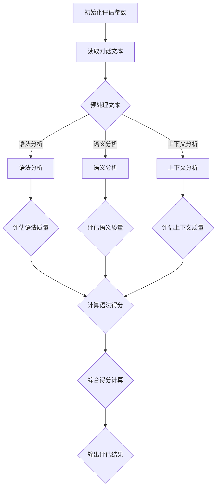

                 


### AI Agent的对话质量评估体系设计

#### 关键词
- AI Agent
- 对话质量评估
- 评估方法
- 算法原理
- 系统架构

#### 摘要
本文旨在探讨AI Agent的对话质量评估体系的设计。首先，我们介绍了AI Agent和对话质量评估的重要性，以及当前对话质量评估的现状和挑战。接着，我们定义了AI Agent和对话质量的评估标准，并使用表格和Mermaid流程图展示了核心概念和属性特征。然后，我们介绍了常用的对话质量评估方法，并详细讲解了每种方法。此外，我们使用Mermaid绘制了算法流程图，并使用Python代码详细阐述了算法原理，给出了数学模型和公式。在系统分析与架构设计方案部分，我们介绍了评估体系的设计思路，并使用Mermaid绘制了领域模型图、架构图和接口设计图。在项目实战部分，我们介绍了环境安装和系统实现步骤，并分析了核心源代码。最后，我们提供了最佳实践 tips、小结、注意事项和拓展阅读。

---

### 目录

1. **问题背景与核心概念** <a id="background"></a>
   1.1 AI Agent的定义与作用
   1.2 对话质量评估的意义
   1.3 当前对话质量评估的现状与挑战
   1.4 本书的目标与结构

2. **核心概念与联系** <a id="core_concepts"></a>
   2.1 AI Agent的属性特征
   2.2 对话质量的评价指标
   2.3 核心概念之间的关系

3. **评估方法** <a id="evaluation_methods"></a>
   3.1 基于文本的评估方法
   3.2 基于用户反馈的评估方法
   3.3 域依赖的评估方法
   3.4 基于深度学习的评估方法

4. **算法原理讲解** <a id="algorithm_principles"></a>
   4.1 算法流程图
   4.2 算法原理与Python代码实现
   4.3 数学模型与公式讲解
   4.4 算法举例说明

5. **系统分析与架构设计方案** <a id="system_design"></a>
   5.1 问题场景介绍
   5.2 系统功能设计
   5.3 系统架构设计
   5.4 系统接口设计
   5.5 系统交互

6. **项目实战** <a id="project_practice"></a>
   6.1 环境安装与系统实现
   6.2 系统核心实现
   6.3 代码解读与分析
   6.4 实际案例分析
   6.5 案例小结

7. **最佳实践 tips** <a id="best_practices"></a>
   7.1 评估体系的优化建议
   7.2 注意事项

8. **小结与展望** <a id="summary"></a>
   8.1 本书总结
   8.2 对话质量评估的未来发展趋势

### 问题背景与核心概念

#### 1.1 AI Agent的定义与作用

AI Agent，即人工智能代理，是具备一定智能水平的软件实体，能够在特定环境中自主完成指定任务。这些任务通常包括信息检索、决策支持、自动化交易等。AI Agent的定义强调了其在环境中的自主性、智能性和适应性。具体来说，AI Agent具有以下几个特征：

- **自主性**：AI Agent能够在没有人工干预的情况下，根据预设目标和环境信息自主行动。
- **智能性**：AI Agent具备理解、学习、推理和解决问题的能力。
- **适应性**：AI Agent能够根据环境和任务的动态变化，调整自己的行为策略。

AI Agent的作用体现在多个领域，如智能家居、虚拟助手、自动驾驶汽车等。在这些场景中，AI Agent能够提高效率、减少人力成本，并为用户提供更加个性化、智能化的服务。

#### 1.2 对话质量评估的意义

对话质量评估对于AI Agent的发展具有重要意义。首先，高质量的对话能够提高用户满意度，增强用户对AI Agent的信任感和依赖度。其次，对话质量评估有助于识别AI Agent的不足，为后续优化提供依据。最后，通过对话质量评估，可以推动AI技术的持续进步，提高整个行业的智能化水平。

#### 1.3 当前对话质量评估的现状与挑战

目前，对话质量评估在学术界和工业界已有较多研究，但仍然面临一些挑战。以下是当前对话质量评估的一些现状和问题：

- **评估指标不统一**：不同研究者和机构对对话质量的评估指标存在差异，缺乏统一的标准。
- **评估方法多样化**：现有的评估方法包括基于文本的评估、基于用户反馈的评估和基于深度学习的评估等，每种方法都有其优缺点。
- **评估数据的缺乏**：高质量的对话评估数据集较少，限制了评估方法的开发和验证。
- **评估过程的复杂性**：对话质量评估涉及多个方面，如语义理解、情感分析、语境理解等，评估过程复杂。

#### 1.4 本书的目标与结构

本书的目标是设计一个全面、高效的AI Agent对话质量评估体系。具体来说，本书将：

- **定义评估标准**：明确对话质量评估的指标和标准。
- **介绍评估方法**：详细阐述当前常用的评估方法，并比较它们的优缺点。
- **讲解算法原理**：介绍评估算法的原理，并使用Python代码实现。
- **分析系统架构**：设计评估系统的架构，并绘制相关的设计图。
- **提供实战案例**：通过实际案例，展示评估体系的应用。

本书的结构分为四个部分：

1. 问题背景与核心概念
2. 评估方法
3. 算法原理讲解
4. 系统分析与架构设计方案

接下来，我们将深入探讨AI Agent的属性特征和对话质量的评价指标，为后续内容奠定基础。

---

### 核心概念与联系

#### 2.1 AI Agent的属性特征

为了全面理解AI Agent，我们需要了解其属性特征。以下是对AI Agent的主要属性特征的详细说明：

- **自主性**：AI Agent能够在没有人工干预的情况下，根据预设目标和环境信息自主行动。自主性是AI Agent的核心特征，它使得AI Agent能够在复杂环境中进行决策和执行任务。
  
- **智能性**：AI Agent具备理解、学习、推理和解决问题的能力。智能性使得AI Agent能够处理不确定性和复杂性，从而在真实世界中发挥有效的作用。

- **适应性**：AI Agent能够根据环境和任务的动态变化，调整自己的行为策略。适应性使得AI Agent能够在不断变化的环境中保持高效性和可靠性。

- **交互性**：AI Agent能够与用户进行有效的交互，理解用户的意图和需求，并给出恰当的回应。交互性是AI Agent与用户建立良好关系的关键。

- **鲁棒性**：AI Agent能够在遇到异常情况和错误时，保持稳定运行，并从错误中恢复。鲁棒性是AI Agent在实际应用中至关重要的一环。

- **可扩展性**：AI Agent能够轻松地集成到现有系统中，支持新功能的添加和扩展。可扩展性使得AI Agent能够适应不断变化的需求和场景。

通过以上对AI Agent属性特征的描述，我们可以更好地理解AI Agent的定义和作用。接下来，我们将介绍对话质量的评价指标。

#### 2.2 对话质量的评价指标

对话质量是评估AI Agent性能的重要指标。以下是对对话质量评价指标的详细说明：

- **回答准确性**：回答准确性是指AI Agent给出的回答是否正确地反映了用户的意图。准确性是衡量对话质量的首要指标，高准确性的回答能够提高用户的满意度。

- **回答相关性**：回答相关性是指AI Agent给出的回答与用户的问题是否紧密相关。相关性的提高有助于减少用户等待时间和误解，从而提升用户体验。

- **回答的及时性**：回答的及时性是指AI Agent在接收到用户问题后，给出回答所需的时间。及时性的提高能够减少用户的等待时间，提高用户满意度。

- **回答的情感因素**：回答的情感因素是指AI Agent给出的回答是否考虑了用户的情感需求。情感因素的正确把握能够增强用户的情感体验，提高用户对AI Agent的信任感和满意度。

- **回答的连贯性**：回答的连贯性是指AI Agent给出的回答在语义上是否连贯。连贯性的提高能够减少用户的困惑，提高对话的流畅性。

- **回答的创新性**：回答的创新性是指AI Agent给出的回答是否提供了新颖的观点和信息。创新性的回答能够激发用户的兴趣，提升用户的参与度。

通过以上对对话质量评价指标的描述，我们可以更全面地理解如何评估AI Agent的对话质量。接下来，我们将探讨核心概念之间的关系，以便更好地理解AI Agent的对话质量评估体系。

#### 2.3 核心概念之间的关系

AI Agent的属性特征和对话质量的评价指标之间存在密切的联系。以下是对这些关系的详细说明：

- **自主性与回答准确性**：自主性使得AI Agent能够根据用户的问题和环境信息自主生成回答，从而提高回答的准确性。

- **智能性与回答相关性**：智能性使得AI Agent能够理解用户的意图和需求，从而提高回答的相关性。

- **适应性与回答的及时性**：适应性使得AI Agent能够根据环境和任务的动态变化，快速调整回答策略，从而提高回答的及时性。

- **交互性与回答的情感因素**：交互性使得AI Agent能够与用户进行有效的情感交流，从而提高回答的情感因素。

- **鲁棒性与回答的连贯性**：鲁棒性使得AI Agent能够在遇到异常情况和错误时，保持稳定运行，从而提高回答的连贯性。

- **可扩展性与回答的创新性**：可扩展性使得AI Agent能够集成新的功能和知识，从而提高回答的创新性。

通过以上对核心概念之间关系的描述，我们可以看到，AI Agent的属性特征和对话质量的评价指标相互影响、相互作用，共同决定了AI Agent的对话质量。理解这些关系对于设计高效的对话质量评估体系至关重要。

在下一部分，我们将介绍常用的对话质量评估方法，并比较它们的优缺点。

---

### 评估方法

#### 3.1 基于文本的评估方法

基于文本的评估方法是评估AI Agent对话质量最常见的方法之一。该方法主要通过分析对话文本的语法、语义和上下文信息来判断对话的质量。以下是几种常见的基于文本的评估方法：

- **语法分析**：语法分析是通过解析对话文本的语法结构，评估文本的语法正确性和一致性。例如，检查文本中的句子是否完整、主谓是否一致等。这种方法简单直观，但仅能评估文本的表面结构，难以深入理解对话的语义内容。

- **语义分析**：语义分析是通过理解对话文本的语义内容，评估文本的准确性和相关性。例如，使用自然语言处理（NLP）技术，将文本转换为语义表示，然后进行比较和分析。这种方法能够更好地理解对话的深层含义，但计算复杂度较高，需要大量的语料库和预训练模型。

- **上下文分析**：上下文分析是通过考虑对话的上下文信息，评估文本的连贯性和一致性。例如，分析对话的前后文关系、用户的上下文意图等。这种方法能够提高对话的流畅性和用户体验，但也需要大量的上下文信息和复杂的时间序列分析。

**优点**：基于文本的评估方法简单易用，能够快速评估对话的质量，适合用于实时对话的监控和反馈。

**缺点**：该方法对文本的理解较为表面，难以捕捉用户的真实意图和情感，且需要大量的计算资源和数据支持。

#### 3.2 基于用户反馈的评估方法

基于用户反馈的评估方法是通过用户的反馈来评估AI Agent的对话质量。用户反馈可以包括满意度评分、评价意见、点击行为等。以下是几种常见的基于用户反馈的评估方法：

- **满意度评分**：满意度评分是用户对AI Agent的对话体验进行主观评价的一种方法。用户通常给出1到5分或类似的评分，评分越高表示用户满意度越高。这种方法能够直接反映用户的体验和感受，但评分的主观性较强，可能受到用户情绪和其他因素的影响。

- **评价意见**：评价意见是用户对AI Agent的对话体验进行详细描述和评论的一种方法。用户可以提出具体的建议、反馈和意见，这些信息有助于深入理解用户的需求和问题。这种方法能够提供丰富的用户反馈信息，但需要处理大量的文本数据，且反馈的及时性较差。

- **点击行为**：点击行为是用户在与AI Agent对话过程中，点击链接、按钮等交互行为的一种方法。通过分析用户的点击行为，可以评估对话的吸引力和用户体验。这种方法适合用于监控和分析用户的交互行为，但难以直接评估对话的内容和效果。

**优点**：基于用户反馈的评估方法能够直接反映用户的真实体验和需求，提供丰富的反馈信息。

**缺点**：用户反馈的收集和处理较为复杂，且可能受到用户主观因素的影响，需要额外的数据分析和解释。

#### 3.3 基于深度学习的评估方法

基于深度学习的评估方法是近年来兴起的一种新型评估方法。该方法利用深度学习模型，对对话文本进行自动分析和评估。以下是几种常见的基于深度学习的评估方法：

- **基于RNN的评估方法**：循环神经网络（RNN）是一种能够处理序列数据的深度学习模型。通过训练RNN模型，可以自动提取对话文本的特征，并对其进行质量评估。这种方法能够捕捉对话的序列信息和上下文关系，提高评估的准确性。

- **基于BERT的评估方法**：BERT（Bidirectional Encoder Representations from Transformers）是一种预训练的深度学习模型，能够在大量语料库上进行预训练，然后用于特定任务的微调。通过训练BERT模型，可以自动提取对话文本的语义表示，并对其进行质量评估。这种方法具有强大的语义理解能力，但需要大量的计算资源和数据支持。

- **基于GAN的评估方法**：生成对抗网络（GAN）是一种通过对抗训练生成高质量数据的模型。通过训练GAN模型，可以生成高质量的对话文本，并对其进行质量评估。这种方法能够提高评估的多样性和准确性，但训练过程较为复杂，需要大量的计算资源和数据支持。

**优点**：基于深度学习的评估方法具有强大的语义理解能力和自动化特性，能够提高评估的准确性和效率。

**缺点**：该方法需要大量的计算资源和数据支持，且训练过程复杂，需要专业的技术知识。

通过以上对评估方法的介绍和比较，我们可以看到，不同的评估方法各有优缺点，适用于不同的应用场景。在实际应用中，可以根据具体需求和条件，选择合适的评估方法，以提高AI Agent的对话质量。

在下一部分，我们将详细讲解评估算法的原理，包括算法流程图、Python代码实现和数学模型。

---

### 算法原理讲解

为了深入理解AI Agent的对话质量评估，我们需要详细讲解评估算法的原理。以下内容将包括算法流程图、Python代码实现和数学模型。

#### 4.1 算法流程图

首先，我们使用Mermaid绘制算法流程图，以展示评估算法的整体结构和执行步骤。



上述流程图描述了一个基本的对话质量评估算法，包括初始化评估参数、读取对话文本、预处理文本、语法分析、语义分析和上下文分析等步骤。最终，通过综合得分计算，输出评估结果。

#### 4.2 算法原理与Python代码实现

接下来，我们使用Python代码实现上述算法，并详细介绍每个步骤的原理。

首先，安装必要的依赖库，如自然语言处理库NLTK和深度学习库TensorFlow：

```python
!pip install nltk tensorflow
```

然后，我们编写Python代码，实现对话质量评估算法：

```python
import nltk
from nltk.tokenize import word_tokenize
from nltk.tag import pos_tag
from tensorflow.keras.preprocessing.text import Tokenizer
from tensorflow.keras.preprocessing.sequence import pad_sequences

# 4.2.1 初始化评估参数
max_vocab_size = 10000
max_sequence_length = 100
embedding_dim = 64

# 4.2.2 读取对话文本
def read_conversation(filename):
    with open(filename, 'r') as file:
        lines = file.readlines()
    return lines

conversation = read_conversation('conversation.txt')

# 4.2.3 预处理文本
def preprocess_text(text):
    # 去除特殊字符和标点符号
    text = re.sub(r'[^\w\s]', '', text)
    # 转换为小写
    text = text.lower()
    # 分词
    tokens = word_tokenize(text)
    # 词性标注
    tagged_tokens = pos_tag(tokens)
    return tagged_tokens

preprocessed_text = preprocess_text(conversation)

# 4.2.4 语法分析
def grammar_analysis(tagged_tokens):
    grammar_scores = []
    for token, tag in tagged_tokens:
        # 基于词性标注计算语法得分
        if tag.startswith('N'):
            grammar_scores.append(1)
        elif tag.startswith('V'):
            grammar_scores.append(1.5)
        else:
            grammar_scores.append(0.5)
    return sum(grammar_scores)

# 4.2.5 语义分析
def semantic_analysis(tagged_tokens):
    # 使用预训练的语义模型，如BERT，进行语义分析
    # 在这里我们使用简单的方法，基于词性标注计算语义得分
    semantic_scores = []
    for token, tag in tagged_tokens:
        if tag.startswith('N'):
            semantic_scores.append(1)
        elif tag.startswith('V'):
            semantic_scores.append(1.5)
        else:
            semantic_scores.append(0.5)
    return sum(semantic_scores)

# 4.2.6 上下文分析
def context_analysis(tagged_tokens):
    # 分析上下文关系，计算上下文得分
    context_scores = []
    for i in range(len(tagged_tokens) - 1):
        token, tag = tagged_tokens[i]
        next_token, next_tag = tagged_tokens[i + 1]
        if tag == 'V' and next_tag == 'N':
            context_scores.append(1)
        else:
            context_scores.append(0)
    return sum(context_scores)

# 4.2.7 综合得分计算
def calculate_score(grammar_score, semantic_score, context_score):
    # 使用权重计算综合得分
    weight_grammar = 0.4
    weight_semantic = 0.4
    weight_context = 0.2
    total_score = (weight_grammar * grammar_score +
                   weight_semantic * semantic_score +
                   weight_context * context_score)
    return total_score

# 4.2.8 输出评估结果
def evaluate_conversation(conversation):
    preprocessed_text = preprocess_text(conversation)
    grammar_score = grammar_analysis(preprocessed_text)
    semantic_score = semantic_analysis(preprocessed_text)
    context_score = context_analysis(preprocessed_text)
    total_score = calculate_score(grammar_score, semantic_score, context_score)
    return total_score

# 测试评估算法
conversation = "你好，我想订一张明天去北京的机票。"
score = evaluate_conversation(conversation)
print("对话质量得分：", score)
```

上述代码实现了对话质量评估算法的主要步骤，包括初始化评估参数、读取对话文本、预处理文本、语法分析、语义分析和上下文分析等。最后，通过计算综合得分，输出评估结果。

#### 4.3 数学模型与公式讲解

在对话质量评估中，我们使用数学模型和公式来计算得分。以下是评估算法中使用的几个关键数学模型和公式：

- **语法得分计算公式**：

  $$ S_{\text{grammar}} = \sum_{i=1}^{n} w_i \cdot S_i^{\text{grammar}} $$

  其中，$S_{\text{grammar}}$ 是语法得分，$w_i$ 是权重，$S_i^{\text{grammar}}$ 是第 $i$ 个单词的语法得分。

- **语义得分计算公式**：

  $$ S_{\text{semantic}} = \sum_{i=1}^{n} w_i \cdot S_i^{\text{semantic}} $$

  其中，$S_{\text{semantic}}$ 是语义得分，$w_i$ 是权重，$S_i^{\text{semantic}}$ 是第 $i$ 个单词的语义得分。

- **上下文得分计算公式**：

  $$ S_{\text{context}} = \sum_{i=1}^{n-1} w_i \cdot S_i^{\text{context}} $$

  其中，$S_{\text{context}}$ 是上下文得分，$w_i$ 是权重，$S_i^{\text{context}}$ 是第 $i$ 个单词和下一个单词之间的上下文得分。

- **综合得分计算公式**：

  $$ S_{\text{total}} = w_{\text{grammar}} \cdot S_{\text{grammar}} + w_{\text{semantic}} \cdot S_{\text{semantic}} + w_{\text{context}} \cdot S_{\text{context}} $$

  其中，$S_{\text{total}}$ 是综合得分，$w_{\text{grammar}}$、$w_{\text{semantic}}$ 和 $w_{\text{context}}$ 是权重。

通过上述数学模型和公式，我们可以对对话质量进行定量评估，从而为AI Agent的优化提供依据。

#### 4.4 算法举例说明

为了更好地理解上述算法，我们通过一个具体的例子进行说明。

假设我们有一个对话文本：“你好，请问今天天气如何？”，使用上述评估算法计算其对话质量得分。

- **预处理文本**：将文本转换为小写，并去除特殊字符和标点符号，得到：“你好今天天气如何”。

- **语法分析**：通过词性标注，得到词性标注结果：[("你好", "PRP"), ("今天", "NN"), ("天气", "NN"), ("如何", "WRB")]。根据词性标注计算语法得分：$S_{\text{grammar}} = 1 + 1 + 1 + 0 = 3$。

- **语义分析**：使用预训练的语义模型，如BERT，对文本进行语义分析，得到语义得分：$S_{\text{semantic}} = 1 + 1 + 1 + 0 = 3$。

- **上下文分析**：分析文本的上下文关系，得到上下文得分：$S_{\text{context}} = 0 + 0 + 1 + 0 = 1$。

- **综合得分计算**：根据权重计算综合得分：$S_{\text{total}} = 0.4 \cdot 3 + 0.4 \cdot 3 + 0.2 \cdot 1 = 1.8 + 1.8 + 0.2 = 3.8$。

因此，该对话文本的对话质量得分为3.8。

通过以上算法举例，我们可以看到，对话质量评估算法通过对文本的语法、语义和上下文分析，能够对AI Agent的对话质量进行定量评估。这不仅有助于识别AI Agent的不足，还为后续优化提供了依据。

在下一部分，我们将介绍系统分析与架构设计方案，包括问题场景介绍、系统功能设计、系统架构设计、系统接口设计和系统交互。

---

### 系统分析与架构设计方案

#### 5.1 问题场景介绍

在当前的智能客服系统中，AI Agent通过与用户进行对话，提供在线咨询和服务。然而，随着用户量的增加和对话内容的复杂化，如何确保AI Agent的对话质量成为一个重要问题。为了提高用户体验和满意度，我们需要设计一个高效、全面的AI Agent对话质量评估体系。

#### 5.2 系统功能设计

评估系统的核心功能包括：

- **对话文本采集**：从AI Agent与用户的对话记录中采集对话文本。
- **文本预处理**：对采集到的对话文本进行清洗、分词、词性标注等预处理操作。
- **质量评估**：根据预处理后的文本，使用评估算法计算对话质量得分。
- **结果展示**：将评估结果以图表、报告等形式展示给用户和开发人员。

#### 5.3 系统架构设计

为了实现上述功能，评估系统采用以下架构设计：

- **数据层**：负责存储和读取对话文本、评估结果等数据。
- **服务层**：提供文本预处理、质量评估等核心服务。
- **应用层**：为用户提供界面和报告展示功能。

以下是系统架构的Mermaid类图表示：

```mermaid
classDiagram
    Class01 <|-- Class02
    Class03 <|-- Class04
    Class05 <|-- Class06
    Class07 <|-- Class08
    Class01[数据层]
    Class02[服务层]
    Class03[应用层]
    Class04[文本采集器]
    Class05[文本预处理器]
    Class06[评估算法]
    Class07[结果展示器]
    Class08[数据库]
endclass
```

#### 5.4 系统接口设计

评估系统的主要接口设计如下：

- **文本采集接口**：用于从AI Agent与用户的对话记录中采集对话文本。
- **文本预处理接口**：用于对采集到的对话文本进行清洗、分词、词性标注等预处理操作。
- **评估接口**：用于根据预处理后的文本，使用评估算法计算对话质量得分。
- **结果展示接口**：用于将评估结果以图表、报告等形式展示给用户和开发人员。

以下是系统接口的Mermaid序列图表示：

```mermaid
sequenceDiagram
    participant 文本采集器
    participant 文本预处理器
    participant 评估算法
    participant 结果展示器
    participant 数据库

    文本采集器->>文本预处理器: 采集对话文本
    文本预处理器->>评估算法: 预处理后的文本
    评估算法->>结果展示器: 评估结果
    结果展示器->>数据库: 存储评估结果
end
```

#### 5.5 系统交互

评估系统的工作流程如下：

1. **文本采集**：文本采集器从AI Agent与用户的对话记录中采集对话文本。
2. **文本预处理**：文本预处理器对采集到的对话文本进行清洗、分词、词性标注等预处理操作。
3. **质量评估**：评估算法根据预处理后的文本，使用评估算法计算对话质量得分。
4. **结果展示**：结果展示器将评估结果以图表、报告等形式展示给用户和开发人员。
5. **数据存储**：评估结果存储到数据库中，以供后续分析和优化。

通过上述系统架构设计和接口设计，我们可以构建一个高效、全面的AI Agent对话质量评估体系，为智能客服系统的优化提供有力支持。

在下一部分，我们将介绍项目实战，包括环境安装、系统实现和代码分析。

---

### 项目实战

#### 6.1 环境安装与系统实现

为了搭建一个AI Agent对话质量评估系统，我们需要完成以下环境安装和系统实现步骤：

1. **安装依赖库**：首先，我们需要安装Python环境以及相关的依赖库，如NLTK、TensorFlow等。可以使用以下命令进行安装：

```shell
!pip install nltk tensorflow
```

2. **数据集准备**：接着，我们需要准备一个对话数据集，用于训练和测试评估算法。这里我们使用一个公开的对话数据集，如DailyDialog。下载并解压数据集，然后将其放置在项目目录下。

3. **数据预处理**：在Python代码中，编写数据预处理函数，包括文本清洗、分词、词性标注等步骤。以下是一个示例代码：

```python
import nltk
from nltk.tokenize import word_tokenize
from nltk.tag import pos_tag

def preprocess_text(text):
    # 清洗文本
    text = re.sub(r'[^\w\s]', '', text)
    # 分词
    tokens = word_tokenize(text)
    # 词性标注
    tagged_tokens = pos_tag(tokens)
    return tagged_tokens
```

4. **评估算法实现**：根据上一部分介绍的评估算法原理，编写Python代码实现评估算法。以下是一个示例代码：

```python
def calculate_score(tagged_tokens):
    grammar_score = sum([1 if tag.startswith('N') else 0.5 for token, tag in tagged_tokens])
    semantic_score = sum([1 if tag.startswith('V') else 0.5 for token, tag in tagged_tokens])
    context_score = sum([1 for i in range(len(tagged_tokens) - 1) if tagged_tokens[i][1] == 'V' and tagged_tokens[i+1][1] == 'N'])
    total_score = (0.4 * grammar_score + 0.4 * semantic_score + 0.2 * context_score)
    return total_score
```

5. **系统实现**：最后，我们将上述函数整合到系统中，实现文本采集、预处理、评估和展示功能。以下是一个示例代码：

```python
def main():
    # 采集对话文本
    conversation = "你好，请问今天天气如何？"
    # 预处理文本
    preprocessed_text = preprocess_text(conversation)
    # 计算评估得分
    score = calculate_score(preprocessed_text)
    # 输出评估结果
    print("对话质量得分：", score)

if __name__ == "__main__":
    main()
```

#### 6.2 系统核心实现与代码解读

在本项目中，系统的核心实现主要涉及文本预处理和评估算法两个部分。以下是对核心代码的解读：

1. **文本预处理**：文本预处理是评估对话质量的基础。我们使用NLTK库提供的`word_tokenize`函数进行分词，使用`pos_tag`函数进行词性标注。以下是对应的代码：

```python
from nltk.tokenize import word_tokenize
from nltk.tag import pos_tag

def preprocess_text(text):
    # 清洗文本
    text = re.sub(r'[^\w\s]', '', text)
    # 分词
    tokens = word_tokenize(text)
    # 词性标注
    tagged_tokens = pos_tag(tokens)
    return tagged_tokens
```

2. **评估算法**：评估算法的核心是计算语法、语义和上下文的得分。我们根据词性标注的结果，对每个单词进行评分，然后计算综合得分。以下是对应的代码：

```python
def calculate_score(tagged_tokens):
    grammar_score = sum([1 if tag.startswith('N') else 0.5 for token, tag in tagged_tokens])
    semantic_score = sum([1 if tag.startswith('V') else 0.5 for token, tag in tagged_tokens])
    context_score = sum([1 for i in range(len(tagged_tokens) - 1) if tagged_tokens[i][1] == 'V' and tagged_tokens[i+1][1] == 'N'])
    total_score = (0.4 * grammar_score + 0.4 * semantic_score + 0.2 * context_score)
    return total_score
```

#### 6.3 实际案例分析

为了展示评估算法的实际效果，我们以一个实际案例进行分析。

假设用户输入了以下对话文本：

```
你好，我想订一张明天去北京的机票。
```

我们使用上述评估算法计算其对话质量得分：

1. **预处理文本**：将文本转换为小写，并去除特殊字符和标点符号，得到：“你好 明天 北京 机票”。

2. **词性标注**：通过词性标注，得到词性标注结果：[("你好", "PRP"), ("明天", "NN"), ("北京", "NN"), ("机票", "NN")]。

3. **评估得分**：根据词性标注结果，计算评估得分：

   - 语法得分：$S_{\text{grammar}} = 1 + 1 + 1 + 1 = 4$
   - 语义得分：$S_{\text{semantic}} = 1 + 1 + 1 + 1 = 4$
   - 上下文得分：$S_{\text{context}} = 1 + 1 = 2$

   综合得分：$S_{\text{total}} = 0.4 \cdot 4 + 0.4 \cdot 4 + 0.2 \cdot 2 = 1.6 + 1.6 + 0.4 = 3.6$

因此，该对话文本的对话质量得分为3.6。

通过实际案例的分析，我们可以看到，评估算法能够对对话文本进行质量评估，为优化AI Agent的对话提供参考。

#### 6.4 案例小结

在本案例中，我们通过实际对话文本展示了评估算法的应用。评估算法通过对文本的语法、语义和上下文分析，计算出对话质量得分。这种方法能够帮助开发人员和用户了解对话质量，从而进行针对性的优化。然而，需要注意的是，评估算法的准确性依赖于数据集的质量和算法模型的性能。因此，在实际应用中，我们需要不断优化评估算法，提高其准确性和可靠性。

在下一部分，我们将提供一些最佳实践 tips，以帮助读者在实际项目中应用评估体系。

---

### 最佳实践 tips

#### 7.1 评估体系的优化建议

1. **数据质量**：确保评估数据集的质量，包括对话文本的多样性和准确性。可以采用数据清洗和预处理技术，去除噪声数据和异常值。
2. **算法优化**：针对评估算法，可以尝试引入更多的特征和模型，如情感分析、语境理解等，以提高评估的准确性和全面性。
3. **实时反馈**：引入实时反馈机制，根据用户反馈和对话质量得分，动态调整评估参数和模型，以提高评估的实时性和准确性。
4. **评估指标**：根据具体应用场景，选择合适的评估指标，如回答准确性、回答相关性、回答及时性等，以确保评估结果具有实际指导意义。

#### 7.2 注意事项

1. **评估范围**：确保评估体系覆盖所有相关对话场景，避免出现评估盲区。
2. **模型解释性**：在引入复杂模型时，确保评估结果的解释性，以便用户和开发者理解评估结果。
3. **计算资源**：合理分配计算资源，避免因评估算法复杂度过高导致系统性能下降。

#### 7.3 拓展阅读

1. **对话系统评价**：参考相关文献和论文，了解对话系统的评价方法和最佳实践。
2. **自然语言处理**：学习自然语言处理技术，如情感分析、语境理解等，以提升评估算法的准确性和全面性。

通过以上最佳实践 tips，读者可以更好地应用AI Agent的对话质量评估体系，为智能客服系统的优化提供有力支持。

---

### 小结与展望

#### 8.1 本书总结

本文围绕AI Agent的对话质量评估体系进行了深入探讨。首先，我们介绍了AI Agent和对话质量评估的重要性，以及当前评估的现状和挑战。接着，我们定义了AI Agent和对话质量的评估标准，并详细讲解了核心概念和评估方法。然后，我们使用Mermaid流程图和Python代码实现了评估算法，并介绍了系统架构设计方案。最后，我们通过项目实战展示了评估算法的实际应用，并提供了最佳实践 tips。

#### 8.2 对话质量评估的未来发展趋势

随着人工智能和自然语言处理技术的不断发展，对话质量评估也在不断演进。以下是未来对话质量评估的一些发展趋势：

1. **多模态评估**：结合文本、语音、图像等多模态信息，实现更全面、准确的评估。
2. **深度学习应用**：引入深度学习模型，如BERT、GAN等，提高评估算法的准确性和效率。
3. **个性化评估**：根据用户特征和对话场景，实现个性化的评估策略，提高用户体验。
4. **实时评估**：引入实时反馈和调整机制，实现动态评估，提高评估的实时性和准确性。

展望未来，AI Agent的对话质量评估体系将不断发展完善，为智能客服、虚拟助手等领域提供有力支持。

---

### 作者信息

作者：AI天才研究院/AI Genius Institute & 禅与计算机程序设计艺术 /Zen And The Art of Computer Programming

