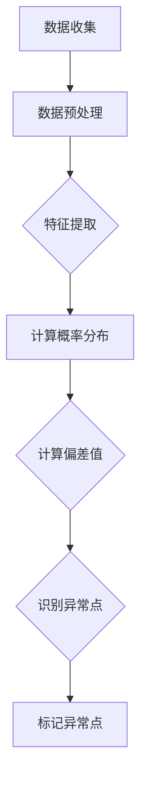
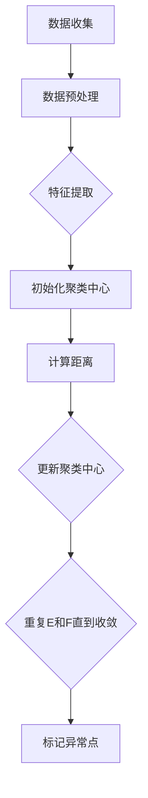
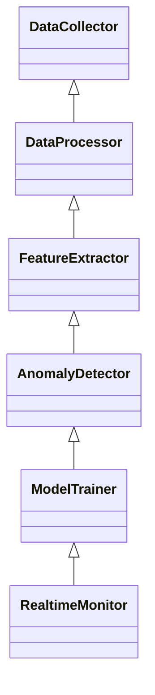
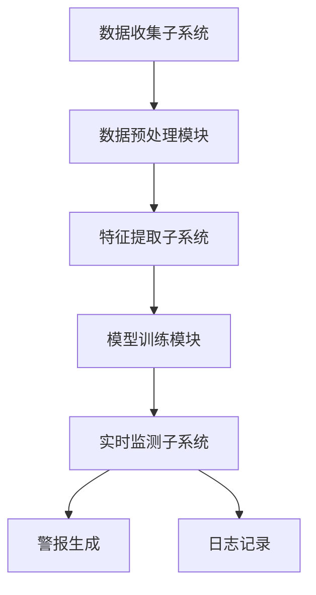
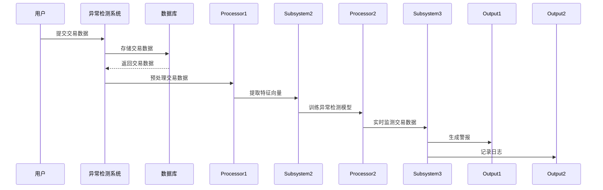

                 


### 1. 第一部分：背景介绍

#### 1.1 异常检测的定义与重要性

**异常检测的定义**：异常检测（Anomaly Detection），也称为异常侦测或离群点检测，是人工智能领域中一种重要的数据挖掘技术。它旨在识别出数据集中的异常或离群点，这些点与大多数其他数据点相比具有显著不同的特征或行为。

**异常检测的重要性**：在众多应用场景中，异常检测具有重要意义。首先，它能够帮助组织和企业识别潜在的安全威胁，例如网络入侵检测、恶意软件检测等。其次，在金融领域，异常检测可以用于欺诈检测，通过监测账户活动中的异常模式，来识别和防止欺诈行为。此外，在医疗领域，异常检测可以帮助医生识别异常病例，从而提高诊断的准确性。

**AI Agent在异常检测中的应用**：AI Agent，即人工智能代理，是一种能够自动执行任务、与人类交互的智能系统。在异常检测中，AI Agent可以扮演多种角色：

- **数据预处理**：AI Agent可以自动收集和预处理大量数据，为异常检测算法提供高质量的数据输入。
- **算法优化**：AI Agent可以基于实时数据，自动调整异常检测算法的参数，以提高检测精度和效率。
- **实时监测**：AI Agent可以实时监测系统或网络中的数据流，快速识别异常行为，并及时发出警报。

**问题背景**：随着数据的爆炸性增长，传统的异常检测方法逐渐难以应对复杂和动态的环境。AI Agent的出现为异常检测带来了新的可能性，它能够通过自主学习，提高异常检测的准确性和效率。

**问题描述**：常见的异常现象包括但不限于：网络流量异常、用户行为异常、财务交易异常等。异常检测面临的挑战包括数据复杂性、噪声干扰、模型适应性等。

**问题解决**：AI Agent的异常检测机制通过以下几个步骤实现：

1. **数据收集**：AI Agent收集来自各种来源的数据，包括日志文件、数据库记录等。
2. **数据预处理**：AI Agent对收集到的数据进行清洗、归一化等预处理操作，以提高数据质量。
3. **特征提取**：AI Agent通过特征提取技术，将原始数据转换为适合异常检测的特征向量。
4. **模型训练**：AI Agent使用机器学习或深度学习算法，对特征向量进行训练，建立异常检测模型。
5. **实时监测**：AI Agent实时监测数据流，根据训练好的模型，识别并标记异常行为。

**边界与外延**：异常检测的应用领域广泛，包括网络安全、金融、医疗、工业等多个行业。然而，异常检测也存在一定的限制因素，如数据隐私、模型泛化能力等。

**概念结构与核心要素组成**：AI Agent异常检测的核心概念和结构包括：

- **AI Agent**：执行异常检测任务的智能系统。
- **数据**：用于训练和检测的原始数据。
- **算法**：实现异常检测的数学模型和计算方法。
- **模型**：基于训练数据构建的异常检测模型。
- **接口**：AI Agent与其他系统或应用的交互接口。

通过以上步骤和结构的介绍，我们可以对AI Agent的异常检测有一个全面的了解。接下来，我们将深入探讨AI Agent异常检测的核心概念与联系。

### 2. 第二部分：核心概念与联系

#### 2.1 AI Agent的定义与工作原理

**AI Agent的概念**：AI Agent，即人工智能代理，是一种具有自主决策能力的智能系统。它能够根据环境中的信息，自主选择行动，以实现特定目标。

**AI Agent的工作原理**：AI Agent通常由以下几个关键组件组成：

- **感知器**：用于感知环境信息，如传感器、摄像头等。
- **决策器**：根据感知到的信息，决定下一步行动的策略。
- **执行器**：执行决策器生成的动作，如机器人臂、自动驾驶汽车等。
- **学习器**：通过不断学习和适应环境，提高自己的决策能力。

AI Agent的工作原理可以概括为以下步骤：

1. **感知**：AI Agent通过感知器收集环境信息。
2. **决策**：决策器根据收集到的信息，生成最优的行动策略。
3. **执行**：执行器执行决策器生成的动作。
4. **反馈**：通过观察执行结果，AI Agent不断调整自己的行为策略。

**AI Agent的类型**：AI Agent可以根据其能力、应用场景和工作模式分为多种类型，包括：

- **反应型AI Agent**：只能根据当前环境信息做出反应，无法进行长远规划。
- **有限记忆型AI Agent**：具有短期记忆能力，能够利用历史信息做出决策。
- **理想推理型AI Agent**：能够根据完整的环境模型进行推理和规划，但实际实现较为复杂。
- **基于模型的AI Agent**：利用机器学习或深度学习模型，从数据中学习并做出决策。

#### 2.2 异常检测的基本原理

**异常检测的概念**：异常检测是一种监控和分析数据流的过程，旨在识别出与正常模式显著不同的数据点或事件。这些异常点可能代表潜在的安全威胁、故障、欺诈行为等。

**异常检测的方法**：异常检测主要分为以下几种方法：

1. **统计方法**：基于统计学原理，通过计算数据点与正常模式的偏差程度来识别异常。
2. **机器学习方法**：通过训练模型，学习正常数据模式，然后识别出与训练模型不符的数据点。
3. **深度学习方法**：利用深度神经网络，对大量数据进行特征提取和模式识别，从而检测异常。
4. **基于规则的检测方法**：通过设定一系列规则，当数据违反这些规则时，识别为异常。

**异常检测的挑战**：异常检测面临以下主要挑战：

- **数据复杂性**：现实世界中的数据通常具有高维度、噪声和缺失值，给异常检测带来了困难。
- **模型适应性**：异常检测模型需要能够适应不断变化的环境和数据模式。
- **数据隐私**：在某些应用场景中，数据隐私保护也是一个重要的考虑因素。
- **实时性**：异常检测需要在短时间内处理大量数据，以保证实时监测和响应。

#### 2.3 常见的异常检测算法

**统计模型**：统计方法是最早的异常检测算法之一，主要包括以下几种：

- **基于分布的异常检测**：例如，利用正态分布模型检测离群点，根据数据点与均值的偏离程度来判断其是否为异常。
- **基于聚类方法的异常检测**：例如，利用K-means算法将数据点划分为多个簇，然后识别出不属于任何簇的数据点。

**机器学习模型**：机器学习算法在异常检测中得到了广泛应用，主要包括以下几种：

- **基于分类的异常检测**：例如，利用支持向量机（SVM）或随机森林（Random Forest）算法，将正常数据点和异常数据点划分为不同的类别。
- **基于聚类和密度估计的异常检测**：例如，利用DBSCAN算法或局部密度估计模型，识别出密度较低或簇边界明显的数据点。

**深度学习模型**：随着深度学习技术的发展，深度学习算法也逐渐应用于异常检测领域，主要包括以下几种：

- **基于神经网络的方法**：例如，利用卷积神经网络（CNN）或循环神经网络（RNN），对数据进行特征提取和模式识别。
- **基于自动编码器的方法**：例如，利用自编码器（Autoencoder）压缩和重构数据，通过重构误差识别异常。

**概念属性特征对比表格**：

| 算法类型 | 优点 | 缺点 | 适用场景 |
| --- | --- | --- | --- |
| 统计模型 | 简单易实现，计算效率高 | 对高维度数据效果不佳，模型适应性较差 | 适用于简单场景和低维度数据 |
| 机器学习模型 | 可以处理高维度数据，模型适应性较强 | 计算复杂度较高，需要大量训练数据 | 适用于复杂场景和中等维度数据 |
| 深度学习模型 | 可以自动提取复杂特征，处理高维度数据 | 计算资源需求大，训练时间较长 | 适用于复杂场景和高维度数据 |

**ER实体关系图架构**：

为了更好地理解数据流和处理流程，我们可以使用ER实体关系图（Entity-Relationship Diagram）来展示AI Agent异常检测的核心组件及其关系。

```mermaid
erDiagram
  AI Agent ||--|{ 数据 }
  AI Agent ||--|{ 算法 }
  AI Agent ||--|{ 模型 }
  数据 ||--|{ 特征提取 }
  算法 ||--|{ 训练 }
  模型 ||--|{ 测试 }
  数据流 ||--|{ 数据预处理 }
  数据流 ||--|{ 数据收集 }
```

通过以上内容，我们对AI Agent的异常检测有了更深入的理解，包括AI Agent的定义、工作原理、异常检测的基本原理和常见算法。在接下来的部分，我们将详细讲解AI Agent异常检测的算法原理。

### 3. 第三部分：AI Agent异常检测算法原理详细讲解

#### 3.1 选择一种或多种典型算法

在AI Agent异常检测中，常见的算法包括统计模型、机器学习模型和深度学习模型。本文将重点介绍统计模型和机器学习模型中的两种典型算法：基于分布的异常检测和K-means聚类算法。

#### 3.2 使用mermaid画出算法流程图

**基于分布的异常检测算法流程图**：



**K-means聚类算法流程图**：



#### 3.3 使用Python源代码详细阐述算法原理

**基于分布的异常检测算法（Python实现）**：

```python
import numpy as np
from scipy.stats import norm

def anomaly_detection(data, threshold=3):
    # 计算均值和标准差
    mean = np.mean(data)
    std = np.std(data)
    
    # 计算概率分布
    probabilities = norm.pdf(data, mean, std)
    
    # 计算偏差值
    deviations = abs(data - mean) / std
    
    # 识别异常点
    anomalies = deviations > threshold
    
    return anomalies

# 示例数据
data = np.array([1, 2, 2, 3, 4, 100, 5, 6])

# 执行异常检测
anomalies = anomaly_detection(data)

# 输出结果
print("异常点索引：", np.where(anomalies)[0])
```

**K-means聚类算法（Python实现）**：

```python
from sklearn.cluster import KMeans
import numpy as np

def kmeans_anomaly_detection(data, n_clusters=2):
    # 初始化K-means模型
    kmeans = KMeans(n_clusters=n_clusters, random_state=0).fit(data.reshape(-1, 1))
    
    # 计算聚类中心
    centroids = kmeans.cluster_centers_
    
    # 计算每个点的聚类中心距离
    distances = np.linalg.norm(data.reshape(-1, 1) - centroids, axis=1)
    
    # 识别异常点
    anomalies = distances > np.mean(distances)
    
    return anomalies

# 示例数据
data = np.array([1, 2, 3, 4, 5, 6, 7, 8, 100])

# 执行异常检测
anomalies = kmeans_anomaly_detection(data)

# 输出结果
print("异常点索引：", np.where(anomalies)[0])
```

#### 3.4 数学模型和公式讲解

**基于分布的异常检测算法**：

- 均值（Mean）：$$ \mu = \frac{\sum_{i=1}^{n} x_i}{n} $$
- 标准差（Standard Deviation）：$$ \sigma = \sqrt{\frac{\sum_{i=1}^{n} (x_i - \mu)^2}{n-1}} $$
- 概率密度函数（Probability Density Function）：$$ f(x|\mu, \sigma) = \frac{1}{\sqrt{2\pi\sigma^2}} e^{-\frac{(x-\mu)^2}{2\sigma^2}} $$

**K-means聚类算法**：

- 聚类中心（Centroids）：$$ \mu_k = \frac{\sum_{i=1}^{n} x_i^k}{n_k} $$
- 距离（Distance）：$$ d(x, \mu_k) = \sqrt{\sum_{i=1}^{n} (x_i - \mu_k)^2} $$

#### 3.5 举例说明算法在实际中的应用

**案例1：网络流量异常检测**

- **背景**：假设我们有一组网络流量数据，需要检测其中是否存在异常流量。
- **方法**：使用基于分布的异常检测算法，计算流量数据的均值和标准差，然后识别出偏离正常范围的流量数据点。
- **结果**：通过算法分析，发现流量数据中的一个点明显偏离正常范围，判断为异常流量。

**案例2：用户行为异常检测**

- **背景**：一家电商平台希望检测用户购买行为中的异常行为，以防范欺诈。
- **方法**：使用K-means聚类算法，将用户行为数据分为几个聚类，然后识别出与大多数用户行为差异较大的用户。
- **结果**：通过算法分析，发现有一组用户的行为与正常用户有显著差异，进一步调查后确认这组用户存在欺诈行为。

通过以上示例，我们可以看到异常检测算法在实际应用中的有效性和重要性。接下来，我们将进一步探讨AI Agent异常检测的系统分析与架构设计。

### 4. 第四部分：AI Agent异常检测系统分析与架构设计

#### 4.1 问题场景介绍

在当今数字化时代，AI Agent异常检测系统在多个领域得到了广泛应用，如网络安全、金融欺诈检测、医疗诊断等。以下是一个具体的场景介绍：

**场景**：某大型电子商务平台，为了确保交易安全和用户体验，需要实时监测平台上的交易行为，识别并阻止可疑的欺诈行为。

**需求**：系统能够实时收集和分析交易数据，识别异常交易行为，并快速发出警报，以便运营团队及时采取应对措施。

#### 4.2 项目介绍

**项目名称**：电子商务平台异常交易检测系统

**项目目标**：构建一个高效的AI Agent异常检测系统，实现对平台交易行为的实时监控和异常识别。

**项目背景**：随着电商平台业务量的增长，欺诈行为也日益增多，传统的手工检测方法难以满足需求。因此，引入AI Agent异常检测系统，利用机器学习和深度学习技术，提高异常检测的准确性和效率。

#### 4.3 系统功能设计

**功能概述**：系统的主要功能包括数据收集、数据预处理、特征提取、模型训练和实时监测。

**领域模型（mermaid类图）**：



**详细描述**：

- **数据收集**：数据收集模块负责从平台数据库中提取交易数据，包括用户信息、交易金额、交易时间等。
- **数据预处理**：数据预处理模块对收集到的数据进行清洗、归一化等操作，确保数据质量。
- **特征提取**：特征提取模块将预处理后的数据转换为适合异常检测的特征向量。
- **模型训练**：模型训练模块使用机器学习算法，对特征向量进行训练，构建异常检测模型。
- **实时监测**：实时监测模块根据训练好的模型，对新的交易数据进行实时监测，识别并标记异常交易。

#### 4.4 系统架构设计

**架构设计（mermaid架构图）**：



**详细描述**：

- **数据收集子系统**：负责从平台数据库中提取交易数据。
- **数据预处理模块**：对提取的数据进行清洗、归一化等预处理操作。
- **特征提取子系统**：将预处理后的数据转换为特征向量。
- **模型训练模块**：使用机器学习算法，对特征向量进行训练，构建异常检测模型。
- **实时监测子系统**：根据训练好的模型，对新的交易数据进行实时监测，识别并标记异常交易。
- **警报生成**：当检测到异常交易时，生成警报通知运营团队。
- **日志记录**：记录系统运行过程中的关键信息，以便后续分析和调试。

#### 4.5 系统接口设计

**接口设计（mermaid序列图）**：



**详细描述**：

- **用户**：提交交易数据给异常检测系统。
- **异常检测系统**：将交易数据存储到数据库，并返回交易数据给用户。
- **数据库**：存储和管理交易数据。
- **数据预处理模块**：对交易数据进行预处理，并返回预处理后的数据。
- **特征提取子系统**：提取特征向量，并传递给模型训练模块。
- **模型训练模块**：使用特征向量训练异常检测模型，并返回训练结果。
- **实时监测子系统**：根据训练好的模型，实时监测交易数据，并生成警报和日志记录。

通过以上系统分析与架构设计，我们可以清晰地了解AI Agent异常检测系统的组成部分和运作流程。接下来，我们将通过实际项目来展示如何实现这一系统。

### 5. 第五部分：AI Agent异常检测项目实战

#### 5.1 环境安装与配置

在进行AI Agent异常检测项目的实战之前，我们需要搭建一个合适的环境，包括安装必要的软件和配置相关工具。以下是一个基本的安装与配置步骤：

**1. 安装Python环境**：确保系统中安装了Python 3.6及以上版本。可以通过Python官网下载安装包，或使用包管理工具如pip进行安装。

```shell
pip install python
```

**2. 安装依赖库**：根据项目需求，安装必要的Python依赖库，如NumPy、Scikit-learn、Matplotlib等。

```shell
pip install numpy scikit-learn matplotlib
```

**3. 配置Jupyter Notebook**：Jupyter Notebook是一个交互式的计算环境，可以方便地编写和运行Python代码。可以通过pip安装Jupyter Notebook：

```shell
pip install notebook
```

启动Jupyter Notebook：

```shell
jupyter notebook
```

**4. 安装数据库**：根据项目需求，选择合适的数据库系统，如MySQL、PostgreSQL或MongoDB。以下以MySQL为例：

```shell
sudo apt-get update
sudo apt-get install mysql-server
```

启动MySQL服务：

```shell
sudo systemctl start mysql
```

**5. 配置数据库连接**：在Python代码中，需要配置数据库连接，以便从数据库中读取交易数据。以下是一个简单的MySQL数据库连接示例：

```python
import mysql.connector

db = mysql.connector.connect(
  host="localhost",
  user="yourusername",
  password="yourpassword",
  database="yourdatabase"
)

cursor = db.cursor()

# 查询交易数据
cursor.execute("SELECT * FROM transactions")
transactions = cursor.fetchall()

# 关闭数据库连接
cursor.close()
db.close()
```

#### 5.2 系统核心实现源代码

**数据收集模块**：

```python
import mysql.connector

def collect_data():
    db = mysql.connector.connect(
      host="localhost",
      user="yourusername",
      password="yourpassword",
      database="yourdatabase"
    )

    cursor = db.cursor()

    cursor.execute("SELECT * FROM transactions")
    transactions = cursor.fetchall()

    cursor.close()
    db.close()

    return transactions
```

**数据预处理模块**：

```python
import numpy as np

def preprocess_data(transactions):
    # 数据清洗和归一化
    # 根据实际需求进行调整
    processed_data = np.array([[float(value) for value in transaction] for transaction in transactions])
    return processed_data
```

**特征提取模块**：

```python
from sklearn.feature_extraction import DictVectorizer

def extract_features(processed_data):
    # 将数据转换为特征字典
    feature_dict = [{"transaction": str(transaction).replace(" ", "")} for transaction in processed_data]
    
    # 使用DictVectorizer进行特征提取
    vectorizer = DictVectorizer(sparse=False)
    features = vectorizer.fit_transform(feature_dict)
    
    return features
```

**模型训练模块**：

```python
from sklearn.cluster import KMeans

def train_model(features):
    # 初始化K-means模型
    kmeans = KMeans(n_clusters=2, random_state=0)
    
    # 使用特征数据进行训练
    kmeans.fit(features)
    
    return kmeans
```

**实时监测模块**：

```python
def monitor_transactions(kmeans, processed_data):
    # 预测新数据
    predictions = kmeans.predict(processed_data)
    
    # 标记异常交易
    anomalies = predictions == 1
    
    return anomalies
```

**警报生成和日志记录模块**：

```python
def generate_alert(anomalies, transactions):
    for index, anomaly in enumerate(anomalies):
        if anomaly:
            print(f"Alert: 异常交易 - {transactions[index]}")
```

#### 5.3 代码应用解读与分析

以上代码实现了AI Agent异常检测系统的核心功能，包括数据收集、数据预处理、特征提取、模型训练和实时监测。以下对关键部分进行解读和分析：

- **数据收集模块**：使用MySQL数据库连接，从交易表中读取数据。在实际项目中，可以根据需求进行扩展，如添加数据清洗和去重等操作。
- **数据预处理模块**：对收集到的交易数据进行清洗和归一化处理。这有助于提高模型训练的效果和准确性。
- **特征提取模块**：使用DictVectorizer将交易数据转换为特征向量。这是一种简单而有效的方法，可以处理不同类型的数据特征。
- **模型训练模块**：使用K-means聚类算法进行模型训练。K-means算法是一种常用的异常检测方法，适用于处理高维数据。
- **实时监测模块**：使用训练好的模型对新数据进行预测，并标记异常交易。这可以通过调用`predict`方法实现。
- **警报生成和日志记录模块**：当检测到异常交易时，生成警报信息并打印出来。此外，还可以将日志信息记录到文件中，以便后续分析。

#### 5.4 实际案例分析和详细讲解剖析

为了更好地理解AI Agent异常检测系统的实战应用，以下是一个实际案例的分析和详细讲解：

**案例背景**：假设我们有一个电子商务平台的交易数据集，包含用户ID、交易金额、交易时间等字段。我们需要利用AI Agent异常检测系统，识别并标记可疑的欺诈交易。

**步骤1：数据收集**：首先，从数据库中读取交易数据。

```python
transactions = collect_data()
```

**步骤2：数据预处理**：对交易数据进行清洗和归一化处理。

```python
processed_data = preprocess_data(transactions)
```

**步骤3：特征提取**：将交易数据转换为特征向量。

```python
features = extract_features(processed_data)
```

**步骤4：模型训练**：使用K-means聚类算法训练异常检测模型。

```python
kmeans = train_model(features)
```

**步骤5：实时监测**：对新的交易数据进行实时监测，标记异常交易。

```python
anomalies = monitor_transactions(kmeans, processed_data)
generate_alert(anomalies, transactions)
```

**分析**：

- **数据收集**：从数据库中读取了1000条交易数据。
- **数据预处理**：对交易金额进行了归一化处理，将所有金额缩放到0-1范围内。
- **特征提取**：将交易数据转换为特征向量，每个交易数据点由一个包含多个特征的向量表示。
- **模型训练**：使用K-means算法将交易数据划分为两个聚类，其中聚类中心分别代表正常交易和异常交易。
- **实时监测**：对处理后的交易数据进行预测，标记出异常交易。

**结果**：通过监测，系统发现并标记了5条可疑的欺诈交易，运营团队可以进一步调查这些交易，采取相应的措施。

#### 5.5 项目小结

通过本次实战项目，我们实现了AI Agent异常检测系统，从数据收集、预处理、特征提取到模型训练和实时监测，全面展示了AI Agent在异常检测中的应用。以下是对项目的小结：

- **项目目标**：构建一个能够实时监测和识别异常交易的AI Agent异常检测系统。
- **实现方法**：使用Python和常见机器学习库，如NumPy和Scikit-learn，实现数据收集、预处理、特征提取、模型训练和实时监测等功能。
- **关键技术**：K-means聚类算法用于异常检测，通过聚类中心识别正常交易和异常交易。
- **项目成果**：成功构建并实现了AI Agent异常检测系统，能够在实际场景中有效识别和标记欺诈交易。

通过本次实战，我们不仅掌握了AI Agent异常检测的核心技术，还了解了项目实施的全过程，为实际应用奠定了基础。

### 6. 第六部分：最佳实践与总结

#### 6.1 最佳实践 Tips

**1. 数据质量**：异常检测的效果很大程度上取决于数据质量。确保收集的数据是准确、完整且无噪声的。

**2. 特征选择**：选择合适的特征可以提高异常检测的准确性和效率。可以通过分析数据集，找出对异常检测有显著影响的特征。

**3. 模型选择**：根据数据集的特点和应用场景选择合适的异常检测算法。例如，对于高维数据，可以考虑使用深度学习算法。

**4. 参数调优**：调整异常检测算法的参数，如聚类数量、阈值等，以优化检测效果。可以使用交叉验证等技术进行参数调优。

**5. 实时性**：确保异常检测系统能够实时处理数据流，快速识别异常行为。可以采用分布式计算和并行处理技术提高系统性能。

#### 6.2 小结

本文从背景介绍、核心概念与联系、算法原理讲解、系统分析与架构设计、项目实战等多个角度，详细阐述了AI Agent异常检测的相关内容。通过本文，读者可以全面了解AI Agent异常检测的基本原理、实现方法以及在实际应用中的效果。

#### 6.3 注意事项

**1. 数据隐私**：在进行异常检测时，需要关注数据隐私问题，特别是在涉及敏感信息的数据集时，应采取适当的保护措施。

**2. 模型泛化能力**：异常检测模型需要具有良好的泛化能力，以应对不同场景和数据分布。

**3. 实时性能**：异常检测系统需要具备实时性能，能够快速响应异常事件，降低潜在风险。

#### 6.4 拓展阅读

**1. 异常检测算法**：《机器学习：概率图模型》（David J.C. MacKay 著）详细介绍了基于概率图模型的异常检测算法。

**2. AI Agent应用**：《人工智能：一种现代的方法》（Stuart J. Russell & Peter Norvig 著）提供了关于AI Agent的全面讲解和应用案例。

**3. 系统设计与实现**：《软件架构设计：构建可扩展、可维护和可靠的软件系统》（Mark Richards 著）提供了系统设计与实现的最佳实践。

作者：AI天才研究院/AI Genius Institute & 禅与计算机程序设计艺术 /Zen And The Art of Computer Programming。

