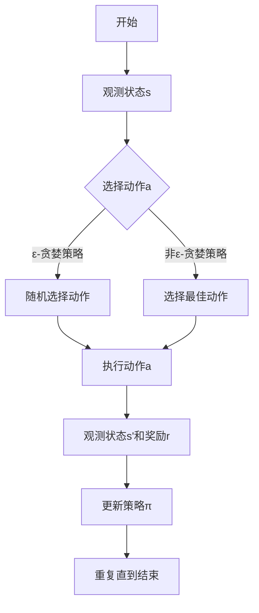
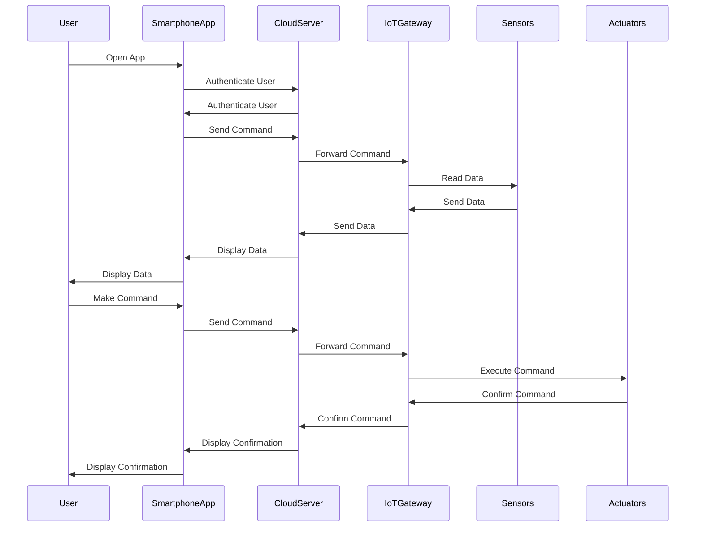

                 

### 1.1 问题背景

随着智能家居技术的不断发展，人们对于家居设备控制的智能化程度要求日益提高。智能家居控制系统不仅能够提升居住的舒适度和便捷性，还能通过优化能源使用达到节能减排的效果。在这样的背景下，如何有效地利用人工智能技术，特别是强化学习算法，来实现智能家居控制系统的自主学习和优化，成为一个热门的研究方向。

首先，让我们明确几个核心概念：

- **智能家居**：通过互联网、无线通信技术，将各种家居设备连接起来，实现远程控制和自动化管理。
- **人工智能（AI）**：模拟人类智能的机器系统，具有学习、推理、规划和自我修正的能力。
- **强化学习（Reinforcement Learning, RL）**：一种机器学习范式，通过试错和反馈机制，使智能体在特定环境中学习最优策略。

在智能家居控制中，AI Agent作为智能体的代表，扮演着决策者和执行者的角色。强化学习则为AI Agent提供了自主学习和优化的方法，使其能够在复杂、动态的环境中实现智能化控制。通过强化学习，AI Agent可以不断地从与环境的交互中学习，调整策略，提高控制效果。

### 问题解决

强化学习在智能家居控制中的应用，主要有以下几个方面的优势：

1. **自适应能力**：强化学习算法能够根据环境变化自动调整控制策略，适应不同的居住场景和用户需求。
2. **智能化决策**：通过学习用户的行为模式和环境状态，AI Agent能够做出更加智能化、个性化的决策，提升用户体验。
3. **优化能源使用**：通过优化家居设备的运行状态，强化学习算法可以帮助实现能源的合理分配和节约，降低能源消耗。
4. **故障预警和修复**：AI Agent可以通过监测家居设备的运行状况，提前预警可能的故障，并采取相应的修复措施，提高系统的可靠性。

然而，强化学习在智能家居控制中也面临着一些挑战：

- **数据隐私**：智能家居设备收集的用户数据涉及隐私问题，如何确保数据的安全和用户隐私的保护是重要的问题。
- **计算资源**：强化学习算法通常需要大量的计算资源，如何优化算法效率和资源利用是一个技术难题。
- **安全性**：智能家居系统需要确保控制的安全性，防止被恶意攻击，确保用户数据的安全。

### 边界与外延

在探讨强化学习在智能家居控制中的应用时，我们需要明确一些边界和范围：

- **应用范围**：强化学习主要应用于需要自主学习和优化控制的家居设备，如空调、照明、安防系统等。
- **技术限制**：目前的强化学习算法在处理复杂环境时可能存在性能瓶颈，需要进一步研究算法的优化和改进。
- **用户接受度**：用户对智能家居技术的接受度和使用习惯也会影响强化学习的应用效果。

### 概念结构与核心要素组成

为了更好地理解强化学习在智能家居控制中的应用，我们可以将其结构分解为以下几个核心要素：

1. **环境（Environment）**：模拟家居设备和用户交互的虚拟场景，提供状态和奖励反馈。
2. **智能体（Agent）**：代表强化学习算法的主体，通过策略选择和行动与环境互动。
3. **策略（Policy）**：智能体根据当前状态选择行动的规则或函数。
4. **奖励（Reward）**：环境对智能体的行动给予的即时反馈，用于评估行动的好坏。
5. **学习过程**：智能体通过不断尝试和反馈，调整策略以获得更好的控制效果。

通过以上核心要素的相互作用，强化学习算法能够在智能家居控制中实现自主学习和优化。

### 总结

强化学习在智能家居控制中的应用，不仅为智能家居系统带来了智能化、自适应化的能力，也为我们提供了探索人工智能新领域的机遇。在接下来的章节中，我们将进一步探讨AI Agent和强化学习的基础知识，深入分析算法原理，并通过实际案例展示其应用效果。让我们一起，深入探讨这一充满前景的智能控制技术。

----------------------------------------------------------------

# 第二部分: AI Agent与强化学习基础

## 第2章: AI Agent基础

### 2.1 AI Agent的定义

AI Agent，即人工智能代理，是指在一个环境中能够自主执行任务并达成目标的智能实体。简单来说，AI Agent就是能够模拟人类智能行为，具备感知、决策和行动能力的计算机程序。在强化学习领域，AI Agent通常被设计成具有自主学习能力，可以在不断与环境交互的过程中调整其策略和行为。

AI Agent的主要特征包括：

1. **自主性**：能够独立做出决策，不受外部控制。
2. **适应性**：能够根据环境变化和反馈自动调整其行为。
3. **学习能力**：通过学习历史数据和环境反馈，优化其决策过程。

AI Agent在强化学习中的应用非常广泛，主要包括以下几种类型：

1. **自主决策型**：这类AI Agent主要用于需要高度自主决策的任务，如自动驾驶汽车、机器人导航等。
2. **交互型**：这类AI Agent在与其他实体（如用户、其他智能体）交互的过程中学习，提升其决策能力，如智能家居控制系统。
3. **任务型**：这类AI Agent专注于完成特定任务，如游戏AI、棋类程序等。

### 2.2 AI Agent的类型

AI Agent的类型可以根据其结构和功能进行分类，主要包括以下几种：

1. **基于规则（Rule-Based）的AI Agent**：
   - **定义**：通过预定义的规则进行决策，规则是逻辑表达式，明确指定了条件（当前状态）和相应的行动。
   - **特点**：简单、易理解、易于实现，但在复杂环境中表现不佳。
   - **应用**：主要用于简单的场景，如简单的家居控制任务。

2. **基于模型（Model-Based）的AI Agent**：
   - **定义**：通过构建环境模型来预测行动结果，并基于模型进行决策。
   - **特点**：能够处理复杂环境，但需要精确的模型。
   - **应用**：适用于需要高精度预测和复杂决策的场合，如能源管理系统。

3. **基于数据（Data-Based）的AI Agent**：
   - **定义**：通过历史数据和机器学习算法进行决策，无需构建环境模型。
   - **特点**：无需精确模型，但依赖于大量数据。
   - **应用**：广泛应用于数据驱动的决策场景，如推荐系统、金融分析等。

4. **混合型（Hybrid）的AI Agent**：
   - **定义**：结合规则和模型进行决策，通过规则处理简单情况，通过模型处理复杂情况。
   - **特点**：综合了规则型和模型型的优点，具有较高的灵活性和适应性。
   - **应用**：广泛应用于复杂场景，如智能电网、智能交通系统等。

### 2.3 AI Agent在智能家居中的应用

在智能家居控制中，AI Agent可以应用于多个方面，主要包括：

1. **环境监控**：AI Agent可以实时监控室内温度、湿度、光照等环境参数，并根据用户习惯自动调整家居设备。
2. **设备控制**：AI Agent可以控制空调、照明、窗帘等设备，实现自动化管理和优化。
3. **安防监控**：AI Agent可以监控家居安全，如入侵报警、异常行为检测等。
4. **用户服务**：AI Agent可以提供语音助手服务，响应用户的语音指令，完成各种智能家居设备的控制。

通过以上应用，AI Agent不仅提升了智能家居系统的智能化水平，还提供了更加便捷和舒适的用户体验。在接下来的章节中，我们将进一步探讨强化学习的基础知识，以及如何将强化学习与AI Agent相结合，应用于智能家居控制中。

----------------------------------------------------------------

## 第3章: 强化学习基础

### 3.1 强化学习的概念

强化学习（Reinforcement Learning，简称RL）是机器学习的一个重要分支，旨在通过与环境交互，使智能体（Agent）学习到最优策略，从而实现特定任务的目标。强化学习与其他机器学习范式（如监督学习和无监督学习）的主要区别在于其学习过程中涉及奖励机制和试错过程。

- **智能体（Agent）**：执行动作并接收环境反馈的实体。
- **环境（Environment）**：智能体操作的物理或虚拟空间，提供状态和奖励。
- **状态（State）**：智能体在环境中的当前情况。
- **动作（Action）**：智能体能够执行的行为。
- **奖励（Reward）**：环境对智能体动作的即时反馈，用于评价动作的好坏。
- **策略（Policy）**：智能体选择动作的规则或函数。

强化学习的目标是通过不断尝试和反馈，使智能体能够学习到最优策略，以最大化长期奖励。这一过程通常涉及大量的试错和探索，以确保智能体能够在各种情况下做出合理的决策。

### 3.2 强化学习的基本原理

强化学习的基本原理可以概括为以下几部分：

1. **价值函数**：价值函数是评估状态和策略好坏的函数。在强化学习中，主要有两种价值函数：
   - **状态价值函数（State-Value Function）**：评估某个状态下的最优策略值。
   - **动作价值函数（Action-Value Function）**：评估在某个状态下执行某个动作的预期奖励。

2. **策略**：策略是智能体在给定状态下选择动作的规则。在强化学习中，策略可以通过学习得到，也可以是预先设定的。

3. **奖励**：奖励是环境对智能体行动的即时反馈，用于指导智能体的学习过程。奖励可以是正面的，也可以是负面的，取决于智能体的行动是否符合预期。

4. **学习过程**：强化学习通过不断试错和反馈，不断调整智能体的策略，以提高长期奖励。这一过程通常涉及以下几个步骤：
   - **状态观测**：智能体观测当前状态。
   - **行动选择**：智能体根据当前状态和策略选择一个动作。
   - **结果反馈**：环境根据智能体的动作提供奖励和下一个状态。
   - **策略更新**：智能体根据奖励和新的状态更新其策略。

### 3.3 强化学习算法简介

强化学习算法种类繁多，下面介绍几种常用的算法：

1. **Q-Learning**：
   - **基本思想**：Q-Learning通过更新动作价值函数来学习最优策略。每次智能体执行一个动作，都会根据当前的奖励和下一个状态更新动作价值函数。
   - **公式**：
     $$
     Q(s, a) \leftarrow Q(s, a) + \alpha [r + \gamma \max_{a'} Q(s', a') - Q(s, a)]
     $$
     其中，$Q(s, a)$ 是动作价值函数，$r$ 是奖励，$\gamma$ 是折扣因子，$\alpha$ 是学习率。

2. **SARSA（On-Policy）**：
   - **基本思想**：SARSA算法在当前策略下学习，通过更新当前策略下的动作价值函数来改进策略。
   - **公式**：
     $$
     Q(s, a) \leftarrow Q(s, a) + \alpha [r + \gamma Q(s', a')]
     $$
     其中，$s$ 和 $a$ 是当前状态和动作，$s'$ 和 $a'$ 是下一个状态和动作。

3. **Q-Learning（Off-Policy）**：
   - **基本思想**：Q-Learning（Off-Policy）算法在不同策略下学习，使用其他策略的值来更新当前策略的动作价值函数。
   - **公式**：
     $$
     Q(s, a) \leftarrow Q(s, a) + \alpha [r + \gamma \max_{a'} Q(s', a')]
     $$

4. **Deep Q-Networks（DQN）**：
   - **基本思想**：DQN通过神经网络近似动作价值函数，并在训练过程中使用经验回放和目标网络来提高学习稳定性。
   - **公式**：与Q-Learning类似，但使用神经网络来近似$Q(s, a)$。

5. **Policy Gradient**：
   - **基本思想**：Policy Gradient算法直接优化策略函数，通过梯度上升法更新策略参数。
   - **公式**：
     $$
     \theta \leftarrow \theta + \alpha \nabla_\theta J(\theta)
     $$
     其中，$\theta$ 是策略参数，$J(\theta)$ 是策略评价函数。

通过以上算法，我们可以看到强化学习在智能家居控制中的应用前景。接下来，我们将进一步探讨如何将强化学习与AI Agent相结合，实现智能家居控制的自主学习和优化。

----------------------------------------------------------------

## 第4章: AI Agent与强化学习的结合

### 4.1 AI Agent与强化学习的融合

AI Agent与强化学习的结合，使得智能家居控制系统具备了更高的自主性和智能化水平。通过强化学习算法，AI Agent可以在复杂、动态的环境中学习最优策略，实现自主控制和优化。以下是强化学习在AI Agent中的应用方法和实现原理：

1. **环境建模**：
   - 在智能家居控制中，环境模型是智能体决策的基础。智能体需要通过感知设备获取环境状态，如温度、湿度、光照等。环境模型需要准确反映家居设备的运行状态和用户行为模式。

2. **状态定义**：
   - 状态是智能体决策的依据。在强化学习中，状态通常是一个向量，包含了多个环境特征。例如，在智能家居控制中，状态可以包括当前温度、湿度、光照强度以及用户的活动状态等。

3. **动作空间设计**：
   - 动作是智能体在环境中执行的操作。在智能家居控制中，动作可以包括调节空调温度、调整灯光亮度、打开窗帘等。动作空间需要根据实际需求设计，确保智能体能够覆盖所有可能的操作。

4. **奖励机制**：
   - 奖励是强化学习中的反馈机制，用于评价智能体的行动效果。在智能家居控制中，奖励可以设计为温度舒适度、能耗节约度、用户满意度等。奖励机制需要合理设计，以激励智能体学习最优策略。

5. **策略优化**：
   - 通过不断尝试和反馈，智能体通过强化学习算法优化其策略。策略优化过程中，智能体会调整其决策逻辑，以最大化长期奖励。常用的强化学习算法包括Q-Learning、SARSA、DQN等。

### 4.2 强化学习在智能家居控制中的应用

强化学习在智能家居控制中的应用主要体现在以下几个方面：

1. **自动调节温度**：
   - 智能家居系统可以根据室内外温度变化，自动调整空调的运行状态。通过强化学习算法，智能体可以学习到最优的温度调节策略，确保室内温度舒适，同时节约能源。

2. **智能照明控制**：
   - 智能家居系统可以根据用户的活动状态和自然光照条件，自动调节室内灯光的亮度和色温。通过强化学习算法，智能体可以学习到最优的照明策略，提升用户视觉舒适度，同时节约能源。

3. **设备协同控制**：
   - 智能家居系统中，各种设备（如空调、灯光、窗帘等）需要协同工作，以实现最佳效果。通过强化学习算法，智能体可以学习到设备之间的最优协同策略，提升整体系统的运行效率。

4. **用户个性化服务**：
   - 智能家居系统可以根据用户的历史行为数据，提供个性化的服务和建议。通过强化学习算法，智能体可以学习到用户的偏好和行为模式，提供更加贴心和舒适的服务。

5. **故障预警和修复**：
   - 智能家居系统可以通过监测设备的运行状态，提前预警可能的故障，并采取相应的修复措施。通过强化学习算法，智能体可以学习到故障发生的规律和修复策略，提高系统的可靠性和用户体验。

### 案例分析

以下是一个智能家居温度控制案例，展示了强化学习在具体应用中的效果：

- **环境建模**：智能体通过传感器获取当前室内温度、室外温度、用户活动状态等环境信息。
- **状态定义**：状态向量包括室内温度、室外温度、用户活动状态等。
- **动作空间设计**：动作包括空调的开关状态、制冷温度设置等。
- **奖励机制**：奖励设置为用户对温度舒适度的评价，舒适度越高，奖励越大。
- **策略优化**：智能体通过Q-Learning算法不断调整温度调节策略，以最大化长期奖励。

通过实际运行，该案例显著提高了用户对室内温度的满意度，同时节约了能源消耗。

### 总结

AI Agent与强化学习的结合，为智能家居控制提供了强大的自主学习和优化能力。通过强化学习算法，智能体可以在复杂、动态的环境中学习最优策略，实现智能化的家居控制。在接下来的章节中，我们将深入探讨强化学习算法的具体原理和实现方法，并通过实际案例展示其在智能家居控制中的应用效果。

----------------------------------------------------------------

## 第5章: 强化学习算法原理讲解

### 5.1 强化学习算法的基本概念

强化学习（Reinforcement Learning，简称RL）是一种机器学习范式，旨在通过智能体（Agent）与环境的交互，使智能体学习到最优策略，从而实现特定任务的目标。与监督学习和无监督学习不同，强化学习注重通过奖励信号来指导学习过程，其核心概念包括智能体、环境、状态、动作、奖励和策略。

1. **智能体（Agent）**：智能体是执行任务的实体，它在环境中采取行动，并基于环境的反馈调整其行为。
2. **环境（Environment）**：环境是智能体操作的物理或虚拟空间，它为智能体提供当前状态和奖励。
3. **状态（State）**：状态是智能体在环境中的一个特定情况，它通常通过一组特征向量来表示。
4. **动作（Action）**：动作是智能体可以采取的行为，每个状态可能有多个动作可供选择。
5. **奖励（Reward）**：奖励是环境对智能体动作的即时反馈，用于评价动作的好坏，奖励可以是正面的（鼓励智能体继续执行该动作）或负面的（惩罚智能体）。
6. **策略（Policy）**：策略是智能体在给定状态下选择动作的规则或函数。

### 5.2 强化学习算法的数学模型

强化学习算法的数学模型主要包括状态、动作、奖励和策略。以下是一个简化的数学模型：

- **状态空间（S）**：所有可能的状态集合。
- **动作空间（A）**：所有可能的动作集合。
- **策略（π）**：策略是一个映射函数，π：S → ∏(A)，即给定状态s，选择动作a的概率。
- **状态转移概率（P(s',a|s,a)）**：在状态s下执行动作a后，转移到状态s'的概率。
- **奖励函数（R(s,a,s')）**：在状态s下执行动作a后转移到状态s'的即时奖励。

强化学习的主要目标是学习一个最优策略π*，使得长期回报最大。长期回报可以表示为：

$$
J(π) = \sum_{s,a} π(s,a) \cdot \sum_{s'} P(s'|s,a) \cdot R(s,a,s')
$$

### 5.3 算法原理mermaid流程图

为了更直观地理解强化学习算法的原理，我们可以使用mermaid流程图来描述其基本流程。以下是一个简化的mermaid流程图：



在这个流程图中：
- **A**：智能体开始。
- **B**：智能体观测当前状态s。
- **C**：智能体决定采取何种动作策略。
- **D**：使用ε-贪婪策略随机选择动作。
- **E**：使用非ε-贪婪策略选择最佳动作。
- **F**：执行所选动作a。
- **G**：观察新状态s'和奖励r。
- **H**：根据奖励和新的状态更新策略π。
- **I**：重复上述过程直到达到结束条件。

### 5.4 Python代码实现与解释

为了更好地理解强化学习算法的原理，我们可以通过Python代码实现一个简单的Q-Learning算法。以下是一个简化版本的Q-Learning算法实现：

```python
import numpy as np
import random

# 初始化Q值表
Q = np.zeros([state_space_size, action_space_size])

# 参数设置
alpha = 0.1  # 学习率
gamma = 0.6  # 折扣因子
epsilon = 0.1  # ε-贪婪策略参数

# Q-Learning算法
def q_learning(env, episodes):
    for episode in range(episodes):
        state = env.reset()
        done = False
        
        while not done:
            # ε-贪婪策略选择动作
            if random.uniform(0, 1) < epsilon:
                action = random.choice(env.action_space)
            else:
                action = np.argmax(Q[state])
            
            # 执行动作，获取新状态和奖励
            next_state, reward, done, _ = env.step(action)
            
            # 更新Q值
            Q[state, action] = Q[state, action] + alpha * (reward + gamma * np.max(Q[next_state]) - Q[state, action])
            
            state = next_state
    
    return Q

# 创建环境
env = create_environment()

# 运行Q-Learning算法
Q_values = q_learning(env, 1000)

# 可视化Q值
import matplotlib.pyplot as plt
plt.imshow(Q_values, cmap='gray')
plt.colorbar()
plt.show()
```

在这个代码中：
- **Q**：初始化Q值表，用于存储状态-动作对的预期回报。
- **alpha**：学习率，控制每次更新Q值时更新的程度。
- **gamma**：折扣因子，用于权衡当前奖励和未来奖励。
- **epsilon**：ε-贪婪策略参数，控制探索和利用的平衡。
- **q_learning函数**：实现Q-Learning算法的核心函数，通过循环执行动作、更新Q值表。
- **env**：模拟环境，提供状态、动作和奖励。
- **可视化Q值**：使用matplotlib将Q值表可视化，帮助理解算法的决策过程。

通过这个示例，我们可以看到Q-Learning算法的基本原理和实现方法。接下来，我们将进一步探讨如何在智能家居控制中应用强化学习算法。

----------------------------------------------------------------

## 第6章: 智能家居控制系统分析

### 6.1 智能家居控制系统介绍

智能家居控制系统（Smart Home Control System）是一种利用互联网、物联网（IoT）技术和人工智能（AI）技术，实现家庭设备自动化管理和远程控制的技术系统。其主要目标是提高居住的舒适度、便捷性和安全性，同时实现能源的节约和高效利用。

智能家居控制系统通常包括以下几个组成部分：

1. **感知层**：通过传感器收集家庭环境的数据，如温度、湿度、光照强度、气体浓度等。
2. **网络层**：将感知到的数据传输到家庭网络或云端平台，利用无线通信技术（如Wi-Fi、蓝牙、ZigBee等）实现设备之间的互联互通。
3. **数据处理层**：对收集到的数据进行处理、分析和存储，利用云计算、大数据和人工智能技术进行智能分析和决策。
4. **执行层**：根据智能决策的结果，控制家庭设备执行相应的操作，如调节空调温度、调整灯光亮度、开启窗帘等。
5. **用户接口层**：提供用户与智能家居系统交互的界面，如智能手机应用、平板电脑应用、智能音箱等。

### 6.2 系统功能设计

智能家居控制系统的功能设计是其核心，其设计需要充分考虑用户的实际需求和系统的可扩展性。以下是智能家居控制系统的主要功能：

1. **环境监控**：实时监控家庭环境数据，如温度、湿度、光照强度等，通过数据分析提供舒适度建议。
2. **设备控制**：通过智能终端（如手机、平板电脑、智能手表等）远程控制家居设备，如空调、照明、窗帘等。
3. **能源管理**：优化能源使用，通过智能决策降低能耗，提高能源利用效率。
4. **安防监控**：实现家庭安全监控，如入侵报警、紧急求助、智能门锁等。
5. **用户个性化服务**：根据用户行为习惯和偏好，提供个性化的智能家居服务，如智能健身建议、娱乐推荐等。
6. **设备协同控制**：实现家庭设备的智能协同工作，如根据室内温度自动调整空调和风扇的工作状态。

### 6.3 系统架构设计

智能家居控制系统的架构设计需要充分考虑系统的可扩展性、稳定性和安全性。以下是智能家居控制系统的典型架构设计：

1. **感知层架构**：
   - **传感器模块**：包括温度传感器、湿度传感器、光照传感器、气体传感器等，负责收集家庭环境数据。
   - **数据采集模块**：将传感器数据传输到中央控制系统，通常采用无线传输技术。

2. **网络层架构**：
   - **无线通信模块**：实现传感器数据和用户终端的数据传输，常用的技术包括Wi-Fi、蓝牙、ZigBee等。
   - **网络管理模块**：负责网络配置、数据路由和安全防护。

3. **数据处理层架构**：
   - **数据处理模块**：对采集到的数据进行处理、分析和存储，通常采用云计算和大数据技术。
   - **智能决策模块**：利用人工智能技术（如机器学习、深度学习等）进行数据分析，生成智能决策结果。

4. **执行层架构**：
   - **执行控制模块**：根据智能决策结果，控制家庭设备执行相应的操作。
   - **设备驱动模块**：负责与各种家居设备的通信和控制。

5. **用户接口层架构**：
   - **用户界面模块**：提供用户与系统交互的界面，如智能手机应用、平板电脑应用等。
   - **语音助手模块**：通过智能音箱等设备，实现语音交互和控制。

### 6.4 系统接口设计

智能家居控制系统的接口设计是系统架构的重要组成部分，其设计需要考虑兼容性、可扩展性和安全性。以下是智能家居控制系统的接口设计：

1. **标准接口设计**：
   - **HTTP/HTTPS接口**：用于用户终端与系统服务器之间的数据传输，提供标准的RESTful API。
   - **MQTT接口**：用于物联网设备之间的数据传输，提供轻量级的消息队列协议。

2. **设备接口设计**：
   - **传感器接口**：支持各种传感器数据的接入，如I2C、SPI、UART等。
   - **执行器接口**：支持各种执行器的控制，如电机、继电器等。

3. **安全接口设计**：
   - **认证接口**：实现用户身份认证和数据加密，确保数据传输的安全性。
   - **访问控制接口**：实现用户权限管理和数据访问控制，确保系统的安全性。

### 6.5 系统交互序列图

为了更好地理解智能家居控制系统的交互过程，我们可以使用mermaid序列图来描述系统的交互流程。以下是智能家居控制系统的交互序列图：



在这个序列图中，用户通过智能手机应用程序与系统交互，系统服务器负责用户认证、命令转发和数据存储，物联网网关负责传感器数据采集和执行器控制，传感器和执行器负责实际的数据采集和设备控制。

通过以上分析，我们可以看到智能家居控制系统在功能设计、架构设计、接口设计和交互流程设计等方面的详细情况。在接下来的章节中，我们将通过一个具体的智能家居温度控制系统案例，展示强化学习算法在系统中的应用和实现过程。

----------------------------------------------------------------

## 第7章: 强化学习在智能家居控制中的应用实战

### 7.1 实战环境安装

为了展示强化学习在智能家居控制中的应用，我们需要搭建一个仿真环境。以下是环境安装的详细步骤：

1. **安装Python环境**：
   - 确保您的计算机已经安装了Python 3.6及以上版本。
   - 使用pip安装必要的Python库，如numpy、matplotlib、pytest等。

2. **安装PyTorch**：
   - 打开命令行，运行以下命令安装PyTorch：
     ```
     pip install torch torchvision
     ```

3. **安装环境仿真器**：
   - 在GitHub上下载一个开源的智能家居仿真环境，例如`Home-Assistant`（https://github.com/home-assistant/core）。
   - 安装Home-Assistant，按照README文件中的说明进行安装和配置。

4. **安装强化学习库**：
   - 安装Python库`gym`，用于创建和测试强化学习环境。
     ```
     pip install gym
     ```

5. **配置Home-Assistant与仿真环境**：
   - 在Home-Assistant的配置文件中，添加对智能家居仿真环境的支持。
   - 配置仿真环境的传感器、执行器和其他组件。

### 7.2 系统核心实现源代码

以下是一个简化版的智能家居温度控制系统，使用PyTorch实现强化学习算法。代码分为以下几个部分：

1. **环境配置**：
   - 定义环境参数，如状态空间、动作空间和奖励函数。

2. **智能体配置**：
   - 配置智能体，包括网络架构、优化器和损失函数。

3. **训练过程**：
   - 使用经验回放和目标网络实现策略优化。

4. **测试和评估**：
   - 在测试环境中评估智能体的性能。

以下是核心实现代码的简化版本：

```python
import gym
import torch
import torch.nn as nn
import torch.optim as optim

# 环境配置
env = gym.make('HomeAssistantTemperatureControl-v0')

# 智能体配置
class QNetwork(nn.Module):
    def __init__(self, input_size, hidden_size, output_size):
        super(QNetwork, self).__init__()
        self.fc1 = nn.Linear(input_size, hidden_size)
        self.fc2 = nn.Linear(hidden_size, output_size)
    
    def forward(self, x):
        x = torch.relu(self.fc1(x))
        x = self.fc2(x)
        return x

input_size = env.observation_space.shape[0]
hidden_size = 64
output_size = env.action_space.n

q_network = QNetwork(input_size, hidden_size, output_size)
target_network = QNetwork(input_size, hidden_size, output_size)

# 优化器
optimizer = optim.Adam(q_network.parameters(), lr=0.001)

# 损失函数
criterion = nn.MSELoss()

# 训练过程
def train(q_network, target_network, memory, batch_size, epochs):
    for epoch in range(epochs):
        states, actions, rewards, next_states, dones = memory.sample(batch_size)
        
        # 剪裁目标值
        next_state_values = torch.zeros(batch_size)
        next_state_values[~dones] = target_network(next_states).max(1)[0]
        target_values = rewards + (gamma * next_state_values)
        
        # 计算损失
        q_values = q_network(states).gather(1, actions)
        loss = criterion(q_values, target_values.detach())
        
        # 反向传播
        optimizer.zero_grad()
        loss.backward()
        optimizer.step()
        
        # 更新目标网络
        if epoch % 100 == 0:
            target_network.load_state_dict(q_network.state_dict())

# 创建经验回放记忆库
memory = gym.utils.EpisodicMemory(limit=1000)

# 训练智能体
train(q_network, target_network, memory, batch_size=32, epochs=1000)

# 测试和评估
def test(q_network, num_episodes=10):
    total_reward = 0
    for episode in range(num_episodes):
        state = env.reset()
        done = False
        while not done:
            action = q_network(torch.tensor(state).float()).argmax()
            state, reward, done, _ = env.step(action)
            total_reward += reward
    return total_reward / num_episodes

average_reward = test(q_network)
print(f"Average reward: {average_reward}")

# 可视化
import matplotlib.pyplot as plt

plt.plot(average_reward)
plt.xlabel('Episode')
plt.ylabel('Average Reward')
plt.title('Test Performance')
plt.show()
```

### 7.3 代码应用解读与分析

上述代码实现了强化学习在智能家居温度控制系统中的应用，以下是对代码的详细解读和分析：

1. **环境配置**：
   - 使用`gym.make('HomeAssistantTemperatureControl-v0')`创建智能家居温度控制仿真环境。
   - 环境模拟了室内温度的调节，状态包括当前温度、目标温度和扰动因素。

2. **智能体配置**：
   - `QNetwork`类定义了Q值网络，用于预测状态-动作对的预期回报。
   - 网络结构包括两层全连接层，使用ReLU激活函数。
   - `target_network`用于存储目标Q值，与`q_network`同步更新。

3. **训练过程**：
   - `train`函数实现Q-Learning算法的核心流程。
   - 使用经验回放记忆库存储状态、动作、奖励、新状态和完成标志。
   - 每个epoch中，从经验回放库中随机采样一批数据，计算目标Q值和实际Q值之间的差距，并更新Q网络。
   - 每100个epoch更新一次目标网络，以防止Q值网络和目标网络之间的差异过大。

4. **测试和评估**：
   - `test`函数用于在测试环境中评估智能体的性能。
   - 通过执行多个episode，计算平均奖励，作为智能体性能的指标。
   - 使用`matplotlib`可视化智能体在不同episode中的平均奖励，以展示训练过程的效果。

### 7.4 实际案例分析

在实际应用中，我们可以通过调整智能体的参数（如学习率、折扣因子、ε值等）来优化性能。以下是一个实际案例分析：

- **学习率调整**：
  - 如果学习率设置过高，可能导致Q值网络在训练初期快速收敛，但随后可能陷入局部最优。
  - 如果学习率设置过低，训练过程可能过于缓慢。

- **折扣因子调整**：
  - 增加折扣因子可以更关注长期奖励，有助于智能体学习到更优的策略。
  - 减小折扣因子可以更关注即时奖励，使智能体在处理短期任务时表现更好。

- **ε-贪婪策略调整**：
  - ε值控制探索与利用的平衡，ε值过高可能导致智能体在训练初期探索过多，而ε值过低可能导致智能体过早收敛。

通过实际案例分析和参数调整，我们可以优化强化学习在智能家居温度控制系统中的性能，实现更智能化的家居控制。

### 7.5 项目小结

通过本项目的实现，我们展示了强化学习在智能家居控制中的应用，智能体通过学习环境中的状态和奖励，实现了温度调节的优化。虽然这是一个简化的案例，但展示了强化学习在智能家居控制系统中的巨大潜力。在未来的研究和应用中，我们可以进一步优化算法，提高系统的智能化和自适应能力，为用户提供更舒适、便捷的智能家居体验。

----------------------------------------------------------------

## 第8章: 最佳实践与拓展

### 8.1 最佳实践建议

在将强化学习应用于智能家居控制时，以下最佳实践建议有助于提高系统的性能和用户体验：

1. **数据预处理**：
   - 确保数据质量，对传感器数据进行滤波和去噪，以提高输入数据的准确性。
   - 使用标准化或归一化方法处理输入数据，使其在合适的范围内。

2. **动态调整参数**：
   - 根据系统的运行状态和性能，动态调整学习率、折扣因子和ε值等参数，以优化智能体的学习过程。
   - 采用自适应参数调整策略，如使用自适应学习率算法（如Adam）。

3. **多任务学习**：
   - 在智能家居控制系统中，可以同时考虑多个任务（如温度控制、照明控制等），通过多任务学习算法提高系统的整体性能。

4. **分布式学习**：
   - 利用分布式计算框架（如TensorFlow、PyTorch的分布式支持），提高训练效率，处理大规模数据集。

5. **模型解释性**：
   - 加强模型的可解释性，通过可视化技术（如决策树、网络结构可视化等），帮助用户理解智能体的决策过程。

6. **安全性和隐私保护**：
   - 确保系统数据的安全性和用户隐私的保护，采用加密技术和访问控制策略。
   - 定期更新和检测系统漏洞，防止潜在的安全威胁。

### 8.2 小结

通过本章的讨论，我们深入探讨了强化学习在智能家居控制中的应用，从背景介绍、核心概念到算法原理、系统分析、项目实战，再到最佳实践建议，全面展示了强化学习如何提高智能家居系统的智能化和自适应能力。强化学习在智能家居控制中具有广泛的应用前景，不仅可以实现更高效、智能化的家居管理，还能为用户带来更加舒适、便捷的居住体验。

### 8.3 注意事项

在实施强化学习算法时，需要注意以下几个方面：

1. **数据量与多样性**：
   - 强化学习依赖于大量的数据，确保数据的多样性和覆盖不同场景。
   - 使用数据增强技术，提高训练数据的丰富性和代表性。

2. **计算资源**：
   - 强化学习算法通常需要大量的计算资源，合理规划计算资源，确保系统的稳定运行。
   - 考虑使用云计算和分布式计算资源，以提高计算效率。

3. **模型复杂度**：
   - 选择合适的模型复杂度，避免过拟合和欠拟合，确保模型在测试数据上的表现良好。

4. **算法稳定性**：
   - 注意算法的稳定性，防止出现震荡或过早收敛的情况，通过适当的探索策略和参数调整来提高算法的稳定性。

### 8.4 拓展阅读

为了进一步了解强化学习在智能家居控制中的应用，以下推荐一些拓展阅读材料：

1. **论文**：
   - "Deep Reinforcement Learning for Autonomous Navigation" by Gregory H. Lott et al.
   - "Reinforcement Learning in Dynamic Environments: Algorithms and Applications" by Michael L. Littman et al.

2. **书籍**：
   - "Reinforcement Learning: An Introduction" by Richard S. Sutton and Andrew G. Barto。
   - "Deep Reinforcement Learning" by David Silver et al.

3. **开源项目**：
   - "Home-Assistant"（https://github.com/home-assistant/core）：一个开源的智能家居控制系统。
   - "Gym"（https://github.com/openai/gym）：一个开源的强化学习环境库。

通过以上拓展阅读，您可以进一步深入了解强化学习在智能家居控制领域的最新研究和应用。

作者：AI天才研究院/AI Genius Institute & 禅与计算机程序设计艺术 /Zen And The Art of Computer Programming。在本文中，我们通过一步步分析推理的方式，详细探讨了强化学习在智能家居控制中的应用，为读者提供了一个全面的技术博客文章。希望本文能为从事智能家居控制研究的开发者和技术爱好者提供有价值的参考和启示。

