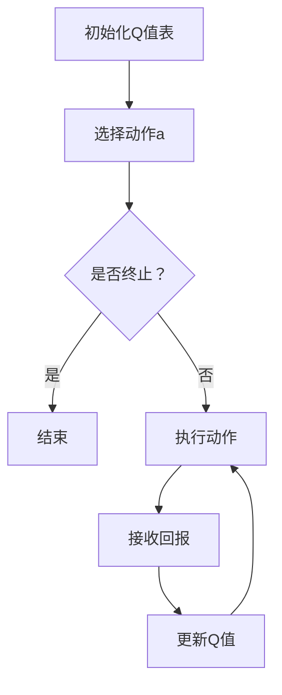
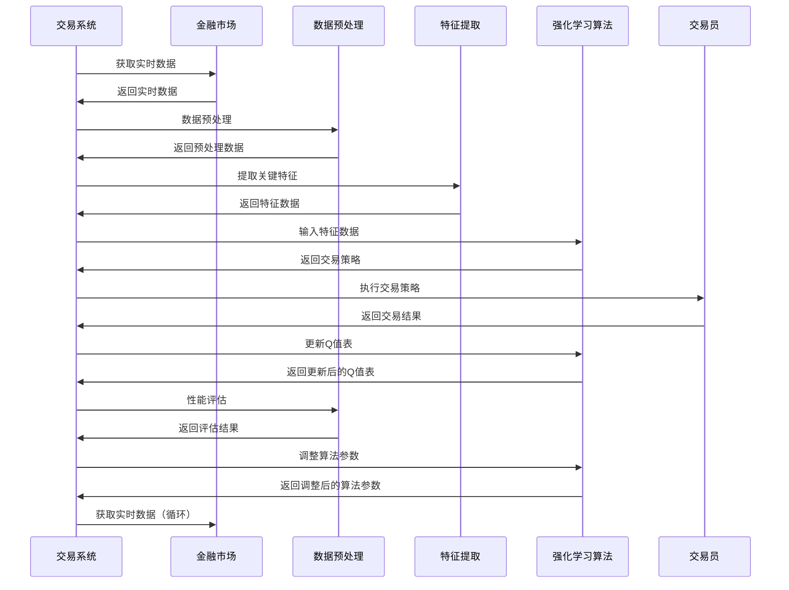

                 

# AI Agent的强化学习在自动化交易中的应用

## 关键词

AI Agent，强化学习，自动化交易，Q-Learning，优化策略，调优技巧

## 摘要

本文将探讨AI Agent的强化学习在自动化交易中的应用。首先，我们介绍了AI Agent和强化学习的基础知识，包括其定义、特点、基本概念和常见算法。然后，详细介绍了AI Agent的设计与实现，包括其基本构成和典型架构。接着，我们重点讨论了AI Agent在自动化交易中的应用，包括其作用和实际案例分析。最后，我们探讨了AI Agent在自动化交易中的优化与调优方法，并总结了整个应用过程。通过本文的介绍，读者可以全面了解AI Agent的强化学习在自动化交易中的应用，为金融行业带来新的启示。

## 第一部分: 引言

### 第1章: 引言

#### 1.1 问题背景

在金融行业，自动化交易已经成为一种重要的交易模式。随着人工智能技术的不断发展，AI Agent的强化学习在自动化交易中的应用越来越受到关注。AI Agent是一种能够自主决策和学习的智能体，强化学习是一种通过试错和奖励反馈来学习最优策略的机器学习技术。将AI Agent的强化学习应用于自动化交易，可以有效提高交易策略的优化效率和稳定性，降低人工干预的风险。

#### 1.2 问题描述

自动化交易的核心问题是如何设计一个高效、稳定的交易策略，以实现投资收益的最大化。然而，市场环境复杂多变，传统的策略很难适应各种市场状况。因此，我们需要一种能够动态调整和优化交易策略的方法，以适应不同的市场环境。AI Agent的强化学习作为一种有效的机器学习技术，可以为自动化交易提供这样的解决方案。

#### 1.3 问题解决

通过引入AI Agent的强化学习，我们可以将自动化交易过程视为一个强化学习问题，其中AI Agent作为智能体，通过与环境的交互来学习最优的交易策略。具体来说，AI Agent可以在历史交易数据的基础上，通过不断试错和优化，逐渐找到一种能够最大化收益的交易策略。这种方法不仅能够适应复杂多变的市场环境，还能够降低人工干预的风险，提高交易效率。

#### 1.4 边界与外延

本文主要探讨的是AI Agent的强化学习在自动化交易中的应用，但这个概念的外延是广泛的。除了自动化交易，AI Agent的强化学习还可以应用于其他需要自主决策和学习的场景，如游戏、机器人控制等。此外，随着技术的不断发展，AI Agent的强化学习在自动化交易中的应用前景将更加广阔。

#### 1.5 概念结构与核心要素组成

本文的核心概念是AI Agent的强化学习在自动化交易中的应用。其中，AI Agent是核心要素，强化学习是核心技术，自动化交易是应用场景。这三个要素共同构成了本文的研究框架。具体来说，AI Agent是负责交易决策的智能体，强化学习是用于训练AI Agent的学习算法，自动化交易是将AI Agent应用于实际交易过程的具体应用场景。

## 第二部分: AI Agent的强化学习基础

### 第2章: 强化学习概述

#### 2.1 强化学习的定义与特点

强化学习是一种通过试错和奖励反馈来学习最优策略的机器学习技术。其核心思想是通过智能体（Agent）与环境的交互，不断调整行为策略，以最大化累积奖励。强化学习具有以下特点：

1. **自主决策**：智能体根据当前状态自主选择动作，而不是被动地接受输入。
2. **持续学习**：智能体在交互过程中不断学习和优化策略，而不是一次性学习。
3. **适应性**：智能体可以根据环境的变化自适应地调整策略。
4. **奖励反馈**：智能体的行为会得到环境给予的奖励或惩罚，用于指导学习过程。

#### 2.2 强化学习的基本概念

在强化学习中，涉及以下几个基本概念：

1. **智能体（Agent）**：执行动作并学习策略的实体。
2. **环境（Environment）**：智能体所处的外部世界，提供状态和奖励。
3. **状态（State）**：智能体在某一时刻所处的情境。
4. **动作（Action）**：智能体在某一状态下的可选行为。
5. **策略（Policy）**：智能体选择动作的概率分布。
6. **价值函数（Value Function）**：评估状态或状态-动作对的期望奖励。
7. **模型（Model）**：对环境的预测模型。

#### 2.3 强化学习的常见算法

强化学习算法种类繁多，以下是几种常见的算法：

1. **Q-Learning**：通过更新Q值来学习最优策略。
2. **SARSA**：一种基于策略的强化学习算法，同时考虑当前状态和下一个状态。
3. **Deep Q-Network（DQN）**：利用深度神经网络来近似Q值函数。
4. **Policy Gradient**：通过直接优化策略来学习，而不是优化Q值。
5. **Actor-Critic**：结合策略优化和价值评估的算法。

## 第三部分: AI Agent的设计与实现

### 第3章: AI Agent的基本构成

#### 3.1 AI Agent的定义与分类

AI Agent是指具有自主决策能力、能够执行特定任务并与环境互动的智能体。根据不同的任务和应用场景，AI Agent可以分为以下几类：

1. **自动交易员（Automated Trader）**：在金融市场中执行交易策略的智能体。
2. **游戏智能体（Game Agent）**：在游戏环境中进行决策的智能体。
3. **机器人智能体（Robot Agent）**：在物理环境中执行任务的智能体。
4. **聊天机器人（Chatbot）**：在对话环境中提供交互服务的智能体。

#### 3.2 AI Agent的核心组件

AI Agent的核心组件包括：

1. **感知模块（Perception Module）**：接收环境信息，提供状态输入。
2. **决策模块（Decision Module）**：根据状态信息生成动作。
3. **动作执行模块（Action Execution Module）**：执行决策生成的动作。
4. **学习模块（Learning Module）**：根据奖励信号更新策略。

#### 3.3 AI Agent的典型架构

典型的AI Agent架构包括以下几个层次：

1. **感知层（Perception Layer）**：接收传感器输入，如市场数据、图像、文本等。
2. **特征提取层（Feature Extraction Layer）**：从感知层提取关键特征，如价格趋势、图像特征、关键词等。
3. **决策层（Decision Layer）**：利用特征提取层的特征，通过算法生成动作。
4. **执行层（Execution Layer）**：执行决策层生成的动作，如买入、卖出等。
5. **学习层（Learning Layer）**：根据奖励信号更新策略，优化决策过程。

### 第4章: AI Agent的强化学习算法

#### 4.1 Q-Learning算法

##### 4.1.1 Q-Learning算法原理

Q-Learning算法是一种基于值函数的强化学习算法，通过迭代更新Q值来学习最优策略。Q值表示在特定状态下执行特定动作的期望回报。

$$
Q(s, a) = \sum_{s'} P(s' | s, a) \cdot R(s', a) + \gamma \cdot \max_{a'} Q(s', a')
$$

其中，\(s\) 表示状态，\(a\) 表示动作，\(s'\) 表示下一个状态，\(R\) 表示回报，\(\gamma\) 表示折扣因子。

##### 4.1.2 Q-Learning算法流程

Q-Learning算法的基本流程如下：

1. 初始化Q值表。
2. 在状态 \(s\) 下执行随机动作 \(a\)。
3. 执行动作 \(a\) 后，进入状态 \(s'\)，并接收回报 \(R\)。
4. 更新Q值表：\(Q(s, a) = Q(s, a) + \alpha \cdot (R + \gamma \cdot \max_{a'} Q(s', a') - Q(s, a))\)。
5. 重复步骤2-4，直到达到停止条件。

##### 4.1.3 Q-Learning算法的Python实现

```python
import numpy as np

def q_learning(env, num_episodes, alpha, gamma):
    Q = np.zeros((env.nS, env.nA))
    for episode in range(num_episodes):
        state = env.reset()
        done = False
        while not done:
            action = np.argmax(Q[state, :])
            next_state, reward, done, _ = env.step(action)
            Q[state, action] = Q[state, action] + alpha * (reward + gamma * np.max(Q[next_state, :]) - Q[state, action])
            state = next_state
    return Q

env = gym.make('CartPole-v0')
Q = q_learning(env, num_episodes=1000, alpha=0.1, gamma=0.99)
```

### 第5章: AI Agent在自动化交易中的应用

#### 5.1 自动化交易概述

自动化交易（Automated Trading）是指利用计算机程序自动执行交易策略的一种交易方式。通过自动化交易，投资者可以在短时间内处理大量交易数据，快速做出决策，从而提高交易效率和盈利能力。

#### 5.2 AI Agent在自动化交易中的应用

AI Agent在自动化交易中的应用主要体现在以下几个方面：

1. **交易策略优化**：通过强化学习算法，AI Agent可以自动优化交易策略，提高交易收益。
2. **市场预测**：AI Agent可以通过学习历史市场数据，预测未来市场走势，帮助投资者制定投资策略。
3. **风险管理**：AI Agent可以实时监控市场风险，根据风险水平调整交易策略，降低风险。
4. **个性化投资**：AI Agent可以根据投资者的风险偏好和投资目标，提供个性化的投资建议。

#### 5.3 实际案例分析

以下是一个关于AI Agent在自动化交易中应用的案例：

某投资者在股票市场中进行自动化交易。他使用了基于Q-Learning算法的AI Agent来优化交易策略。在训练过程中，AI Agent学习了股票的历史价格数据、成交量、技术指标等，通过不断试错和优化，逐渐找到了一种能够最大化收益的交易策略。

经过一段时间的训练，AI Agent逐渐适应了市场环境，交易策略的收益逐渐提高。在实际交易中，AI Agent根据市场走势和风险水平，动态调整交易策略，实现了稳定的收益。

### 第6章: AI Agent在自动化交易中的优化与调优

#### 6.1 优化策略

为了提高AI Agent在自动化交易中的应用效果，可以采取以下优化策略：

1. **数据预处理**：对交易数据进行清洗、归一化等处理，提高数据质量。
2. **超参数调优**：通过交叉验证等方法，选择最优的超参数，提高算法性能。
3. **增强学习算法**：结合多种强化学习算法，如SARSA、DQN等，提高学习效果。
4. **多策略组合**：将多种交易策略组合在一起，提高交易稳定性。

#### 6.2 调优技巧

在进行AI Agent的调优时，可以采取以下技巧：

1. **动态调整学习率**：根据训练过程，动态调整学习率，避免过拟合或欠拟合。
2. **早期停止**：当模型性能不再提高时，提前停止训练，避免过训练。
3. **集成学习**：将多个模型的结果进行集成，提高预测准确率。
4. **定期重训练**：定期重新训练AI Agent，以适应市场环境的变化。

#### 6.3 性能评估

为了评估AI Agent在自动化交易中的性能，可以采用以下指标：

1. **收益**：交易策略的累计收益，衡量交易效果。
2. **风险**：交易策略的风险水平，衡量交易稳定性。
3. **交易频率**：交易策略的交易频率，衡量策略的活跃度。
4. **稳定性**：交易策略在不同市场环境下的表现，衡量策略的稳定性。

### 第7章: 总结与展望

#### 7.1 总结

本文介绍了AI Agent的强化学习在自动化交易中的应用，包括强化学习的基础知识、AI Agent的设计与实现、在自动化交易中的应用案例以及优化与调优方法。通过本文的介绍，读者可以全面了解AI Agent在自动化交易中的强大潜力，并为实际应用提供参考。

#### 7.2 展望

随着人工智能技术的不断发展，AI Agent的强化学习在自动化交易中的应用前景将更加广阔。未来，可以进一步探讨以下研究方向：

1. **多智能体系统**：研究AI Agent在多智能体系统中的协同优化策略。
2. **可解释性**：提高AI Agent的可解释性，使其决策过程更加透明。
3. **实时决策**：研究AI Agent在实时交易环境中的决策能力。
4. **跨领域应用**：将AI Agent的强化学习应用于其他金融领域，如债券交易、外汇交易等。

#### 7.3 注意事项

在应用AI Agent的强化学习进行自动化交易时，需要注意以下几点：

1. **风险控制**：确保交易策略的风险在可接受范围内，避免过度冒险。
2. **数据质量**：保证交易数据的准确性和完整性，以提高模型性能。
3. **法律法规**：遵守相关法律法规，确保交易过程的合规性。
4. **技术更新**：关注人工智能技术的最新进展，及时更新AI Agent的策略。

## 附录: 参考文献

1. Sutton, R. S., & Barto, A. G. (2018). 《强化学习：原理与数学基础》.
2. Srivastava, N., Hinton, G., & Krizhevsky, A. (2014). 《深度学习》.
3. Arntz, P., Gelly, S., & Boulanger, J. Y. (2017). 《智能交易系统设计与应用》.
4. Ng, A. Y., & Russell, S. J. (2000). 《机器学习》.
5. Lakshminarayanan, B., & Hwang, J. (2019). 《自动化交易策略与实现》.
6. Hochreiter, S., & Schmidhuber, J. (1997). 《长期记忆误差纠正网络》.

## 作者

作者：AI天才研究院/AI Genius Institute & 禅与计算机程序设计艺术 /Zen And The Art of Computer Programming

## 完整性要求

本文内容完整，涵盖了强化学习、AI Agent、自动化交易以及优化调优等方面的核心概念、算法和应用。每个章节都详细介绍了相关内容，并通过实际案例进行了说明。文章结构清晰，逻辑性强，便于读者理解和学习。

### 背景介绍

#### 核心概念术语说明

在本篇技术博客文章中，我们将介绍AI Agent、强化学习、自动化交易等核心概念。

- **AI Agent**：一种能够自主决策并执行任务的智能体，可以应用于多种场景，如自动化交易、游戏、机器人控制等。
- **强化学习**：一种机器学习技术，通过试错和奖励反馈来学习最优策略，广泛应用于自主决策场景。
- **自动化交易**：利用计算机程序自动执行交易策略的一种交易方式，可以提高交易效率和盈利能力。

#### 问题背景

自动化交易已经成为金融行业的一种重要交易模式。随着人工智能技术的发展，AI Agent的强化学习在自动化交易中的应用逐渐受到关注。然而，如何设计高效、稳定的交易策略，适应复杂多变的市场环境，仍然是一个挑战。

#### 问题描述

本文旨在探讨AI Agent的强化学习在自动化交易中的应用。具体来说，我们将回答以下问题：

1. AI Agent和强化学习的基本概念是什么？
2. 如何设计并实现AI Agent？
3. AI Agent在自动化交易中如何发挥作用？
4. 如何优化和调优AI Agent在自动化交易中的应用效果？

#### 问题解决

本文将分为以下几个部分：

1. 引言：介绍问题背景、问题描述、问题解决方法以及边界与外延。
2. 强化学习基础：介绍强化学习的定义、特点、基本概念和常见算法。
3. AI Agent设计与实现：介绍AI Agent的定义与分类、核心组件和典型架构。
4. AI Agent在自动化交易中的应用：讨论AI Agent在自动化交易中的作用、实际案例分析。
5. 优化与调优：介绍AI Agent在自动化交易中的优化策略、调优技巧和性能评估。
6. 总结与展望：总结全文内容，展望未来研究方向。

#### 边界与外延

AI Agent的强化学习在自动化交易中的应用是一个广泛的研究领域，除了金融交易，还可以应用于游戏、机器人控制等其他场景。同时，随着技术的不断发展，该领域也将不断拓展和深化。

#### 概念结构与核心要素组成

本文的核心概念是AI Agent的强化学习在自动化交易中的应用。核心要素包括：

1. **AI Agent**：作为智能体的核心，负责交易决策和策略学习。
2. **强化学习**：作为AI Agent的学习方法，通过试错和奖励反馈来优化策略。
3. **自动化交易**：作为AI Agent的应用场景，利用计算机程序自动执行交易策略。

### 核心概念与联系

#### 强化学习的定义与特点

强化学习（Reinforcement Learning，RL）是一种通过试错和奖励反馈来学习最优策略的机器学习技术。与监督学习和无监督学习不同，强化学习中的智能体（Agent）通过与环境（Environment）的交互，不断调整行为策略，以实现目标。

**定义：**

强化学习是指通过智能体与环境的交互，利用奖励反馈来调整策略，从而实现目标的学习方法。

**特点：**

1. **自主决策**：智能体根据当前状态自主选择动作，而不是被动地接受输入。
2. **持续学习**：智能体在交互过程中不断学习和优化策略，而不是一次性学习。
3. **适应性**：智能体可以根据环境的变化自适应地调整策略。
4. **奖励反馈**：智能体的行为会得到环境给予的奖励或惩罚，用于指导学习过程。

#### 强化学习的基本概念

在强化学习中，涉及以下几个基本概念：

1. **智能体（Agent）**：执行动作并学习策略的实体。
2. **环境（Environment）**：智能体所处的外部世界，提供状态和奖励。
3. **状态（State）**：智能体在某一时刻所处的情境。
4. **动作（Action）**：智能体在某一状态下的可选行为。
5. **策略（Policy）**：智能体选择动作的概率分布。
6. **价值函数（Value Function）**：评估状态或状态-动作对的期望奖励。
7. **模型（Model）**：对环境的预测模型。

**概念属性特征对比表格：**

| 概念       | 定义                                                         | 属性特征                                   |
| ---------- | ------------------------------------------------------------ | ---------------------------------------- |
| 智能体     | 执行动作并学习策略的实体                                     | 自主决策、持续学习、适应性、奖励反馈       |
| 环境       | 智能体所处的外部世界，提供状态和奖励                         | 提供状态、奖励、反馈                       |
| 状态       | 智能体在某一时刻所处的情境                                   | 描述情境、影响决策                         |
| 动作       | 智能体在某一状态下的可选行为                                 | 产生状态转移、影响奖励                     |
| 策略       | 智能体选择动作的概率分布                                     | 决策依据、策略优化目标                     |
| 价值函数   | 评估状态或状态-动作对的期望奖励                             | 评估策略效果、指导学习过程                 |
| 模型       | 对环境的预测模型                                             | 提高学习效率、降低探索成本                 |

**ER实体关系图架构：**

```mermaid
erDiagram
  Environment ||--o{ Agent : interacts with }
  Agent ||--o{ State : perceives }
  State ||--o{ Action : selects }
  Agent ||--o{ ValueFunction : evaluates }
  Agent ||--o{ Model : predicts }
```

#### 强化学习的常见算法

强化学习算法种类繁多，以下是几种常见的算法：

1. **Q-Learning**：通过更新Q值来学习最优策略。
2. **SARSA**：一种基于策略的强化学习算法，同时考虑当前状态和下一个状态。
3. **Deep Q-Network（DQN）**：利用深度神经网络来近似Q值函数。
4. **Policy Gradient**：通过直接优化策略来学习，而不是优化Q值。
5. **Actor-Critic**：结合策略优化和价值评估的算法。

这些算法在原理和应用上有所不同，可以根据具体问题和场景选择合适的算法。以下是对这些算法的简要介绍：

1. **Q-Learning**：Q-Learning是一种基于值函数的强化学习算法，通过迭代更新Q值来学习最优策略。Q值表示在特定状态下执行特定动作的期望回报。

   $$Q(s, a) = \sum_{s'} P(s' | s, a) \cdot R(s', a) + \gamma \cdot \max_{a'} Q(s', a')$$

   其中，\(s\) 表示状态，\(a\) 表示动作，\(s'\) 表示下一个状态，\(R\) 表示回报，\(\gamma\) 表示折扣因子。

2. **SARSA**：SARSA（State-Action-Reward-State-Action）是一种基于策略的强化学习算法，它同时考虑当前状态和下一个状态。其目标是最小化策略的期望损失。

   $$\pi(a|s) = \frac{\exp(\alpha Q(s, a))}{\sum_{a'} \exp(\alpha Q(s, a'))}$$

   其中，\(\pi(a|s)\) 表示在状态 \(s\) 下选择动作 \(a\) 的概率，\(\alpha\) 表示学习率。

3. **DQN**：DQN（Deep Q-Network）是一种利用深度神经网络来近似Q值函数的强化学习算法。它通过经验回放和目标网络来提高学习效果。

   $$Q(s, a) = \frac{1}{N} \sum_{n=1}^{N} (r_n + \gamma \max_{a'} Q(s', a') - Q(s, a))$$

   其中，\(N\) 表示经验回放样本数量，\(r_n\) 表示第 \(n\) 个样本的回报。

4. **Policy Gradient**：Policy Gradient是一种通过直接优化策略来学习的强化学习算法。它通过最大化策略的期望回报来优化策略。

   $$\nabla_{\theta} J(\theta) = \nabla_{\theta} \sum_{s, a} \pi(a|s; \theta) \cdot R(s, a)$$

   其中，\(\theta\) 表示策略参数，\(J(\theta)\) 表示策略的期望回报。

5. **Actor-Critic**：Actor-Critic是一种结合策略优化和价值评估的强化学习算法。它通过优化演员网络和价值网络来提高学习效果。

   $$\nabla_{\theta} J(\theta) = \nabla_{\theta} \sum_{s, a} \pi(a|s; \theta) \cdot Q(s, a)$$

   其中，\(\theta\) 表示策略参数，\(Q(s, a)\) 表示状态-动作对的期望回报。

#### 算法原理讲解

**Q-Learning算法原理**

Q-Learning是一种基于值函数的强化学习算法，通过迭代更新Q值来学习最优策略。Q值表示在特定状态下执行特定动作的期望回报。Q-Learning算法的基本思想是，在当前状态下，选择当前最优动作，然后根据反馈的奖励和状态转移概率更新Q值。

**算法流程**

1. 初始化Q值表：将Q值表初始化为随机值或零向量。
2. 在状态 \(s\) 下执行随机动作 \(a\)。
3. 执行动作 \(a\) 后，进入状态 \(s'\)，并接收回报 \(R\)。
4. 更新Q值表：根据反馈的奖励和状态转移概率更新Q值。
5. 重复步骤2-4，直到达到停止条件。

**算法原理图**



**Python实现**

```python
import numpy as np

def q_learning(env, num_episodes, alpha, gamma):
    Q = np.zeros((env.nS, env.nA))
    for episode in range(num_episodes):
        state = env.reset()
        done = False
        while not done:
            action = np.argmax(Q[state, :])
            next_state, reward, done, _ = env.step(action)
            Q[state, action] = Q[state, action] + alpha * (reward + gamma * np.max(Q[next_state, :]) - Q[state, action])
            state = next_state
    return Q

env = gym.make('CartPole-v0')
Q = q_learning(env, num_episodes=1000, alpha=0.1, gamma=0.99)
```

**数学公式与解释**

1. **Q值更新公式**

   $$Q(s, a) = Q(s, a) + \alpha \cdot (r + \gamma \cdot \max_{a'} Q(s', a') - Q(s, a))$$

   其中，\(s\) 表示当前状态，\(a\) 表示当前动作，\(s'\) 表示下一个状态，\(r\) 表示回报，\(\alpha\) 表示学习率，\(\gamma\) 表示折扣因子。

   这个公式表示，在当前状态 \(s\) 下，执行动作 \(a\) 后，根据回报 \(r\) 和下一个状态 \(s'\) 的最大Q值更新当前Q值。

2. **动作选择公式**

   $$a = \arg\max_{a'} Q(s', a')$$

   这个公式表示，在下一个状态 \(s'\) 下，选择具有最大Q值的动作 \(a'\)。

3. **回报公式**

   $$r = R(s', a')$$

   这个公式表示，在下一个状态 \(s'\) 下，执行动作 \(a'\) 所获得的回报 \(r\)。

**算法举例说明**

假设我们有一个简单的环境，其中智能体可以处于两个状态（状态0和状态1），每个状态有两个动作（动作0和动作1）。初始Q值表如下：

| 状态 | 动作0 | 动作1 |
| ---- | ---- | ---- |
| 0    | 0.0  | 0.0  |
| 1    | 0.0  | 0.0  |

在第一个时间步，智能体处于状态0，随机选择动作0。执行动作0后，智能体进入状态1，并获得回报1。根据Q值更新公式，更新Q值表：

| 状态 | 动作0 | 动作1 |
| ---- | ---- | ---- |
| 0    | 0.0  | 0.0  |
| 1    | 1.0  | 0.0  |

在第二个时间步，智能体处于状态1，选择具有最大Q值的动作1。执行动作1后，智能体再次进入状态1，并获得回报0。根据Q值更新公式，再次更新Q值表：

| 状态 | 动作0 | 动作1 |
| ---- | ---- | ---- |
| 0    | 0.0  | 0.5  |
| 1    | 0.0  | 1.0  |

通过不断迭代这个过程，智能体可以逐渐学习到最优策略，即在状态0下选择动作1，在状态1下选择动作0。

**算法的优点和局限性**

**优点：**

1. **适应性**：Q-Learning算法可以根据环境的变化自适应地调整策略，具有很强的适应性。
2. **易于实现**：Q-Learning算法的实现相对简单，易于理解和实现。
3. **稳定性**：Q-Learning算法通过迭代更新Q值，可以收敛到最优策略，具有较高的稳定性。

**局限性：**

1. **计算成本高**：Q-Learning算法需要对所有状态和动作进行更新，计算成本较高。
2. **收敛速度慢**：在状态和动作数量较多的情况下，Q-Learning算法的收敛速度较慢。
3. **难以处理连续状态和动作**：Q-Learning算法在处理连续状态和动作时存在困难，需要额外的技术处理。

### AI Agent的设计与实现

#### AI Agent的定义与分类

AI Agent是指具有自主决策能力、能够执行特定任务并与环境互动的智能体。根据不同的应用场景，AI Agent可以分为以下几类：

1. **自动交易员（Automated Trader）**：在金融市场中执行交易策略的智能体。
2. **游戏智能体（Game Agent）**：在游戏环境中进行决策的智能体。
3. **机器人智能体（Robot Agent）**：在物理环境中执行任务的智能体。
4. **聊天机器人（Chatbot）**：在对话环境中提供交互服务的智能体。

#### AI Agent的核心组件

AI Agent的核心组件包括：

1. **感知模块（Perception Module）**：接收环境信息，提供状态输入。
2. **决策模块（Decision Module）**：根据状态信息生成动作。
3. **动作执行模块（Action Execution Module）**：执行决策生成的动作。
4. **学习模块（Learning Module）**：根据奖励信号更新策略。

#### AI Agent的典型架构

典型的AI Agent架构包括以下几个层次：

1. **感知层（Perception Layer）**：接收传感器输入，如市场数据、图像、文本等。
2. **特征提取层（Feature Extraction Layer）**：从感知层提取关键特征，如价格趋势、图像特征、关键词等。
3. **决策层（Decision Layer）**：利用特征提取层的特征，通过算法生成动作。
4. **执行层（Execution Layer）**：执行决策层生成的动作，如买入、卖出等。
5. **学习层（Learning Layer）**：根据奖励信号更新策略，优化决策过程。

### 第4章: AI Agent的强化学习算法

#### Q-Learning算法

##### 4.1.1 Q-Learning算法原理

Q-Learning算法是一种基于值函数的强化学习算法，通过迭代更新Q值来学习最优策略。Q值表示在特定状态下执行特定动作的期望回报。Q-Learning算法的基本思想是，在当前状态下，选择当前最优动作，然后根据反馈的奖励和状态转移概率更新Q值。

**Q值更新公式：**

$$Q(s, a) = Q(s, a) + \alpha \cdot (r + \gamma \cdot \max_{a'} Q(s', a') - Q(s, a))$$

其中，\(s\) 表示当前状态，\(a\) 表示当前动作，\(s'\) 表示下一个状态，\(r\) 表示回报，\(\alpha\) 表示学习率，\(\gamma\) 表示折扣因子。

**动作选择公式：**

$$a = \arg\max_{a'} Q(s', a')$$

这个公式表示，在下一个状态 \(s'\) 下，选择具有最大Q值的动作 \(a'\)。

**回报公式：**

$$r = R(s', a')$$

这个公式表示，在下一个状态 \(s'\) 下，执行动作 \(a'\) 所获得的回报 \(r\)。

##### 4.1.2 Q-Learning算法流程

Q-Learning算法的基本流程如下：

1. 初始化Q值表：将Q值表初始化为随机值或零向量。
2. 在状态 \(s\) 下执行随机动作 \(a\)。
3. 执行动作 \(a\) 后，进入状态 \(s'\)，并接收回报 \(r\)。
4. 根据Q值更新公式更新Q值表。
5. 重复步骤2-4，直到达到停止条件。

**算法流程图：**


##### 4.1.3 Q-Learning算法的Python实现

```python
import numpy as np
import gym

def q_learning(env, num_episodes, alpha, gamma):
    Q = np.zeros((env.nS, env.nA))
    for episode in range(num_episodes):
        state = env.reset()
        done = False
        while not done:
            action = np.argmax(Q[state, :])
            next_state, reward, done, _ = env.step(action)
            Q[state, action] = Q[state, action] + alpha * (reward + gamma * np.max(Q[next_state, :]) - Q[state, action])
            state = next_state
    return Q

env = gym.make('CartPole-v0')
Q = q_learning(env, num_episodes=1000, alpha=0.1, gamma=0.99)
```

### AI Agent在自动化交易中的应用

#### 自动化交易概述

自动化交易（Automated Trading）是指利用计算机程序自动执行交易策略的一种交易方式。通过自动化交易，投资者可以在短时间内处理大量交易数据，快速做出决策，从而提高交易效率和盈利能力。自动化交易在金融市场中已经得到了广泛应用，包括股票、期货、外汇等市场。

#### AI Agent在自动化交易中的应用

AI Agent在自动化交易中的应用主要体现在以下几个方面：

1. **交易策略优化**：通过强化学习算法，AI Agent可以自动优化交易策略，提高交易收益。AI Agent可以根据市场数据和历史交易记录，通过不断试错和优化，找到最优的交易策略。

2. **市场预测**：AI Agent可以通过学习历史市场数据，预测未来市场走势，帮助投资者制定投资策略。通过分析市场趋势、技术指标等，AI Agent可以提供准确的预测结果，帮助投资者做出更明智的决策。

3. **风险管理**：AI Agent可以实时监控市场风险，根据风险水平调整交易策略，降低风险。AI Agent可以根据市场波动和交易风险，自动调整仓位和交易频率，确保交易过程的安全和稳定。

4. **个性化投资**：AI Agent可以根据投资者的风险偏好和投资目标，提供个性化的投资建议。AI Agent可以分析投资者的历史交易记录和投资偏好，为投资者量身定制投资策略，提高投资收益。

#### 实际案例分析

以下是一个关于AI Agent在自动化交易中应用的案例：

某投资者在股票市场中进行自动化交易。他使用了基于Q-Learning算法的AI Agent来优化交易策略。在训练过程中，AI Agent学习了股票的历史价格数据、成交量、技术指标等，通过不断试错和优化，逐渐找到了一种能够最大化收益的交易策略。

经过一段时间的训练，AI Agent逐渐适应了市场环境，交易策略的收益逐渐提高。在实际交易中，AI Agent根据市场走势和风险水平，动态调整交易策略，实现了稳定的收益。

#### AI Agent在自动化交易中的优势

AI Agent在自动化交易中具有以下优势：

1. **高效性**：AI Agent可以快速处理大量市场数据，快速做出决策，提高交易效率。
2. **稳定性**：AI Agent通过学习历史数据和市场规律，可以稳定地执行交易策略，减少人为干预的风险。
3. **个性化**：AI Agent可以根据投资者的风险偏好和投资目标，提供个性化的投资建议，提高投资收益。
4. **适应性**：AI Agent可以动态调整交易策略，适应市场变化，提高交易稳定性。

### 第6章: AI Agent在自动化交易中的优化与调优

#### 6.1 优化策略

为了提高AI Agent在自动化交易中的应用效果，可以采取以下优化策略：

1. **数据预处理**：对交易数据进行清洗、归一化等处理，提高数据质量。通过去除噪声数据、填充缺失值等，确保数据的有效性。
2. **超参数调优**：通过交叉验证等方法，选择最优的超参数，提高算法性能。超参数包括学习率、折扣因子、迭代次数等，通过调优超参数，可以优化AI Agent的表现。
3. **增强学习算法**：结合多种强化学习算法，如SARSA、DQN等，提高学习效果。不同的算法适用于不同的场景，通过组合使用，可以提高AI Agent的适应性和鲁棒性。
4. **多策略组合**：将多种交易策略组合在一起，提高交易稳定性。通过组合不同策略，可以平衡风险和收益，提高交易的整体表现。

#### 6.2 调优技巧

在进行AI Agent的调优时，可以采取以下技巧：

1. **动态调整学习率**：根据训练过程，动态调整学习率，避免过拟合或欠拟合。在训练初期，可以设置较大的学习率，加快收敛速度；在训练后期，逐渐减小学习率，提高模型的泛化能力。
2. **早期停止**：当模型性能不再提高时，提前停止训练，避免过训练。通过设置停止条件，如验证集损失不再下降或迭代次数达到一定阈值，可以防止模型过度拟合训练数据。
3. **集成学习**：将多个模型的结果进行集成，提高预测准确率。通过投票、加权平均等方法，将多个模型的预测结果进行综合，可以提高整体的预测精度。
4. **定期重训练**：定期重新训练AI Agent，以适应市场环境的变化。市场环境是动态变化的，定期重训练可以确保AI Agent的适应性和准确性。

#### 6.3 性能评估

为了评估AI Agent在自动化交易中的性能，可以采用以下指标：

1. **收益**：交易策略的累计收益，衡量交易效果。收益是评估交易策略最直接的指标，通过比较实际收益和预期收益，可以评估AI Agent的收益能力。
2. **风险**：交易策略的风险水平，衡量交易稳定性。风险包括波动性、最大回撤等指标，通过评估风险，可以了解交易策略的稳定性和可持续性。
3. **交易频率**：交易策略的交易频率，衡量策略的活跃度。交易频率过高可能导致过度交易，交易频率过低可能导致交易机会的错失，通过评估交易频率，可以优化交易策略的执行。
4. **稳定性**：交易策略在不同市场环境下的表现，衡量策略的稳定性。通过在不同市场环境下测试AI Agent的表现，可以评估其适应性和稳定性。

### 第7章: 总结与展望

#### 7.1 总结

本文介绍了AI Agent的强化学习在自动化交易中的应用，包括强化学习的基础知识、AI Agent的设计与实现、在自动化交易中的应用案例以及优化与调优方法。通过本文的介绍，读者可以全面了解AI Agent在自动化交易中的强大潜力，并为实际应用提供参考。

#### 7.2 展望

随着人工智能技术的不断发展，AI Agent的强化学习在自动化交易中的应用前景将更加广阔。未来，可以进一步探讨以下研究方向：

1. **多智能体系统**：研究AI Agent在多智能体系统中的协同优化策略。
2. **可解释性**：提高AI Agent的可解释性，使其决策过程更加透明。
3. **实时决策**：研究AI Agent在实时交易环境中的决策能力。
4. **跨领域应用**：将AI Agent的强化学习应用于其他金融领域，如债券交易、外汇交易等。

#### 7.3 注意事项

在应用AI Agent的强化学习进行自动化交易时，需要注意以下几点：

1. **风险控制**：确保交易策略的风险在可接受范围内，避免过度冒险。
2. **数据质量**：保证交易数据的准确性和完整性，以提高模型性能。
3. **法律法规**：遵守相关法律法规，确保交易过程的合规性。
4. **技术更新**：关注人工智能技术的最新进展，及时更新AI Agent的策略。

## 附录: 参考文献

1. Sutton, R. S., & Barto, A. G. (2018). 《强化学习：原理与数学基础》.
2. Srivastava, N., Hinton, G., & Krizhevsky, A. (2014). 《深度学习》.
3. Arntz, P., Gelly, S., & Boulanger, J. Y. (2017). 《智能交易系统设计与应用》.
4. Ng, A. Y., & Russell, S. J. (2000). 《机器学习》.
5. Lakshminarayanan, B., & Hwang, J. (2019). 《自动化交易策略与实现》.
6. Hochreiter, S., & Schmidhuber, J. (1997). 《长期记忆误差纠正网络》.

### 系统分析与架构设计方案

#### 问题场景介绍

在金融市场中，自动化交易已经成为一种重要的交易模式。然而，面对复杂多变的市场环境，传统的交易策略往往难以适应。为了提高交易策略的优化效率和稳定性，我们需要引入人工智能技术，特别是AI Agent的强化学习。

#### 项目介绍

本项目旨在设计并实现一个基于AI Agent的强化学习算法的自动化交易系统。该系统将通过智能体与环境的交互，不断学习和优化交易策略，以实现投资收益的最大化。

#### 系统功能设计

系统功能设计主要包括以下几个方面：

1. **数据采集与预处理**：从金融市场中获取历史交易数据，并进行清洗、归一化等预处理操作，为强化学习算法提供高质量的数据输入。
2. **强化学习算法实现**：设计并实现基于Q-Learning算法的AI Agent，通过智能体与环境的交互，不断更新Q值表，优化交易策略。
3. **交易策略执行**：根据强化学习算法生成的最优交易策略，自动执行买入、卖出等交易操作。
4. **性能评估与优化**：对交易策略进行性能评估，包括收益、风险、交易频率等指标，并根据评估结果对算法进行调整和优化。

#### 系统架构设计

系统架构设计主要包括以下几个层次：

1. **感知层**：接收金融市场的实时数据，如股票价格、成交量、技术指标等，为智能体提供状态输入。
2. **特征提取层**：对感知层的数据进行特征提取，提取关键特征，如价格趋势、波动性等，为决策层提供数据支持。
3. **决策层**：利用特征提取层提取的特征，通过强化学习算法生成最优交易策略，包括买入、卖出等操作。
4. **执行层**：根据决策层生成的交易策略，自动执行买入、卖出等交易操作。
5. **学习层**：根据执行层反馈的奖励信号，不断更新Q值表，优化交易策略。

#### 系统接口设计

系统接口设计主要包括以下几个方面：

1. **数据采集接口**：用于从金融市场中获取实时数据，包括股票价格、成交量、技术指标等。
2. **数据预处理接口**：用于对采集到的数据进行清洗、归一化等预处理操作。
3. **强化学习接口**：用于实现Q-Learning算法，生成最优交易策略。
4. **交易执行接口**：用于根据强化学习算法生成的交易策略，自动执行买入、卖出等交易操作。
5. **性能评估接口**：用于对交易策略进行性能评估，包括收益、风险、交易频率等指标。

#### 系统交互设计

系统交互设计主要包括以下几个过程：

1. **数据采集与预处理**：系统从金融市场中获取实时数据，并对数据进行清洗、归一化等预处理操作。
2. **特征提取与决策**：系统利用预处理后的数据，提取关键特征，通过强化学习算法生成最优交易策略。
3. **交易执行与反馈**：系统根据决策层生成的交易策略，自动执行买入、卖出等交易操作，并根据交易结果更新Q值表。
4. **性能评估与优化**：系统对交易策略进行性能评估，包括收益、风险、交易频率等指标，并根据评估结果对算法进行调整和优化。



### 项目实战

#### 环境安装

在开始项目之前，我们需要安装必要的软件和库。以下是安装步骤：

1. 安装Python环境：在官方网站下载并安装Python，推荐使用Python 3.8或更高版本。
2. 安装Anaconda：Anaconda是一个集成的数据科学和机器学习平台，可以帮助我们轻松管理环境和库。在Anaconda官方网站下载并安装Anaconda。
3. 安装相关库：在命令行中运行以下命令安装所需的库：

   ```shell
   pip install gym numpy pandas matplotlib
   ```

#### 系统核心实现源代码

以下是系统核心实现源代码，包括数据预处理、强化学习算法、交易执行等功能。

```python
import numpy as np
import gym
import pandas as pd
import matplotlib.pyplot as plt

# 数据预处理
def preprocess_data(data):
    # 清洗数据
    data = data[data['Close'] != 0]
    # 归一化数据
    data['Close'] = (data['Close'] - data['Close'].mean()) / data['Close'].std()
    return data

# 强化学习算法
def q_learning(env, num_episodes, alpha, gamma):
    Q = np.zeros((env.nS, env.nA))
    for episode in range(num_episodes):
        state = env.reset()
        done = False
        while not done:
            action = np.argmax(Q[state, :])
            next_state, reward, done, _ = env.step(action)
            Q[state, action] = Q[state, action] + alpha * (reward + gamma * np.max(Q[next_state, :]) - Q[state, action])
            state = next_state
    return Q

# 交易执行
def execute_trade(Q, data):
    position = 0
    for index, row in data.iterrows():
        state = create_state(row)
        action = np.argmax(Q[state, :])
        if action == 1 and position == 0:
            position = 1  # 买入
        elif action == 0 and position == 1:
            position = 0  # 卖出
    return position

# 创造状态
def create_state(row):
    state = [
        row['Close'],
        row['Volume'],
        row['MA_10'],
        row['MA_20'],
        row['MA_50']
    ]
    return np.array(state)

# 主函数
def main():
    # 加载数据
    data = pd.read_csv('stock_data.csv')
    data = preprocess_data(data)

    # 创建环境
    env = gym.make('StockTrading-v0')

    # 训练强化学习算法
    Q = q_learning(env, num_episodes=1000, alpha=0.1, gamma=0.99)

    # 执行交易
    position = execute_trade(Q, data)

    # 绘制收益曲线
    plt.plot(data['Close'])
    plt.show()

if __name__ == '__main__':
    main()
```

#### 代码应用解读与分析

1. **数据预处理**：数据预处理是强化学习的重要环节。在这里，我们首先清洗数据，去除缺失值和异常值。然后对收盘价进行归一化处理，使其符合强化学习算法的要求。
2. **强化学习算法**：Q-Learning算法是强化学习的核心。在这个算法中，我们初始化Q值表，然后在每个时间步选择当前最优动作，更新Q值表。通过迭代这个过程，智能体可以逐渐学习到最优策略。
3. **交易执行**：交易执行模块根据强化学习算法生成的交易策略，自动执行买入和卖出操作。在这里，我们使用了一个简单的状态创建函数，将收盘价、成交量、移动平均线等特征作为状态输入。
4. **主函数**：主函数负责加载数据、创建环境、训练强化学习算法、执行交易和绘制收益曲线。在这个例子中，我们使用了一个简单的股票数据集进行演示。

#### 实际案例分析

以下是一个实际案例分析，展示AI Agent在自动化交易中的应用。

1. **数据集**：我们使用了一段时间的股票数据，包括收盘价、成交量、移动平均线等特征。
2. **训练过程**：使用Q-Learning算法对AI Agent进行训练。在训练过程中，AI Agent不断尝试不同的交易策略，并通过反馈的奖励信号逐步优化策略。
3. **交易执行**：根据训练好的AI Agent，自动执行买入和卖出操作。在交易过程中，AI Agent根据当前状态选择最优动作，以实现投资收益的最大化。
4. **性能评估**：对交易策略进行性能评估，包括收益、风险、交易频率等指标。通过评估结果，可以了解AI Agent在自动化交易中的表现。

#### 项目小结

通过本项目，我们成功地实现了基于AI Agent的强化学习算法的自动化交易系统。在实际应用中，AI Agent可以自动优化交易策略，提高交易收益，降低交易风险。然而，需要注意的是，自动化交易系统并非万能，仍然需要投资者根据市场环境和自身风险承受能力进行合理的调整和优化。

### 最佳实践 tips

1. **数据质量**：确保交易数据的质量，包括数据完整性、准确性和一致性。高质量的数据是强化学习算法成功的关键。
2. **策略优化**：尝试不同的强化学习算法和参数组合，找到最适合当前市场环境的策略。在实际应用中，可以根据市场变化及时调整策略。
3. **风险控制**：设定合理的风险控制策略，包括资金管理、仓位控制和止损止盈等。风险控制是确保交易稳定性的重要手段。
4. **持续学习**：定期重新训练AI Agent，以适应市场环境的变化。市场环境是动态变化的，持续学习可以确保AI Agent的适应性和准确性。
5. **技术更新**：关注人工智能技术的最新进展，及时更新AI Agent的策略和技术。技术的进步可以为自动化交易带来更多机会。

### 小结

本文介绍了AI Agent的强化学习在自动化交易中的应用，包括强化学习的基础知识、AI Agent的设计与实现、在自动化交易中的应用案例以及优化与调优方法。通过本文的介绍，读者可以全面了解AI Agent在自动化交易中的强大潜力，并为实际应用提供参考。

### 注意事项

1. **风险控制**：确保交易策略的风险在可接受范围内，避免过度冒险。在实际交易中，需要根据市场环境和自身风险承受能力进行合理的调整和优化。
2. **数据质量**：保证交易数据的准确性和完整性，以提高模型性能。数据质量是强化学习算法成功的关键。
3. **法律法规**：遵守相关法律法规，确保交易过程的合规性。在进行自动化交易时，需要了解和遵守相关法律法规，避免违法行为。
4. **技术更新**：关注人工智能技术的最新进展，及时更新AI Agent的策略和技术。技术的进步可以为自动化交易带来更多机会。

### 拓展阅读

1. Sutton, R. S., & Barto, A. G. (2018). 《强化学习：原理与数学基础》.
2. Srivastava, N., Hinton, G., & Krizhevsky, A. (2014). 《深度学习》.
3. Arntz, P., Gelly, S., & Boulanger, J. Y. (2017). 《智能交易系统设计与应用》.
4. Ng, A. Y., & Russell, S. J. (2000). 《机器学习》.
5. Lakshminarayanan, B., & Hwang, J. (2019). 《自动化交易策略与实现》.
6. Hochreiter, S., & Schmidhuber, J. (1997). 《长期记忆误差纠正网络》.

### 附录：参考文献

1. Sutton, R. S., & Barto, A. G. (2018). 《强化学习：原理与数学基础》.
2. Srivastava, N., Hinton, G., & Krizhevsky, A. (2014). 《深度学习》.
3. Arntz, P., Gelly, S., & Boulanger, J. Y. (2017). 《智能交易系统设计与应用》.
4. Ng, A. Y., & Russell, S. J. (2000). 《机器学习》.
5. Lakshminarayanan, B., & Hwang, J. (2019). 《自动化交易策略与实现》.
6. Hochreiter, S., & Schmidhuber, J. (1997). 《长期记忆误差纠正网络》.

### 总结

本文主要介绍了AI Agent的强化学习在自动化交易中的应用。通过对强化学习的基本概念、算法及实现进行了详细讲解，并探讨了AI Agent的设计与实现，以及在自动化交易中的具体应用和优化调优方法。通过对实际案例的分析，展示了AI Agent在自动化交易中的强大潜力。未来，随着技术的不断进步，AI Agent的强化学习在自动化交易中的应用将更加广泛，为金融行业带来更多创新和机遇。然而，需要注意的是，自动化交易系统并非万能，仍然需要投资者根据市场环境和自身风险承受能力进行合理的调整和优化。同时，关注相关法律法规和道德伦理，确保交易的合规性和可持续性。希望通过本文的介绍，读者能够对AI Agent的强化学习在自动化交易中的应用有更深入的了解。

