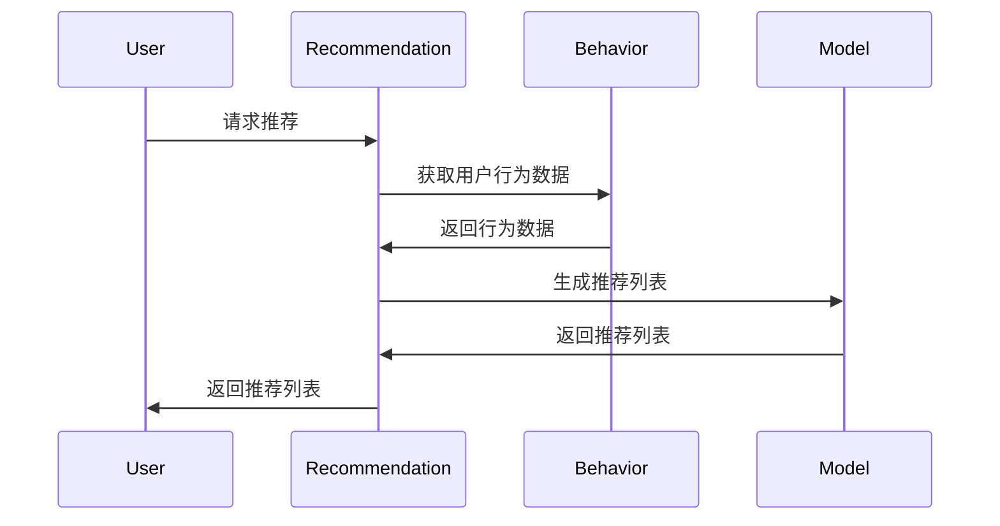
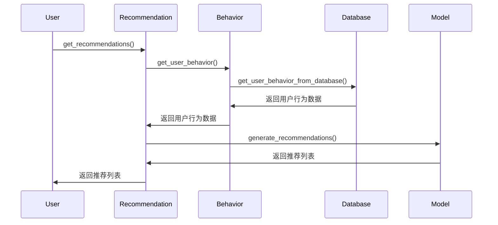

                 

### 第一部分: AI Agent的强化学习背景

#### 1.1 AI Agent的概述

**AI Agent** 是人工智能领域中的一个重要概念，它代表了一个具有自主行动能力的计算机程序。AI Agent可以在特定环境中通过感知、决策和执行动作来完成任务。AI Agent通常被设计为可以处理不确定性和动态变化的环境，这使得它们在现实世界中的应用具有广泛性。

**定义**：AI Agent是一个能够感知环境、根据预设的目标制定行动策略，并在执行这些行动后获得环境反馈，通过学习调整其策略以实现目标的计算机程序。

**应用场景**：
1. **游戏**：如围棋、国际象棋等策略游戏中，AI Agent用于对手进行对弈。
2. **自动驾驶**：AI Agent可以用于自动驾驶汽车，实现道路感知和决策。
3. **智能家居**：AI Agent可以控制智能家居设备，如自动调节灯光、温度等。
4. **机器人**：工业机器人可以通过AI Agent实现自主导航和任务执行。

**重要性**：AI Agent在人工智能领域的应用不仅提高了计算机程序的智能水平，也为实际应用带来了许多创新和便利。通过AI Agent，我们可以实现更智能化的自动化系统，提高生产效率和生活质量。

#### 1.2 强化学习的定义与特点

**强化学习（Reinforcement Learning，RL）** 是一种机器学习方法，旨在通过智能体（Agent）在环境中通过试错学习来获取最优策略。智能体通过不断接收环境反馈（奖励或惩罚），调整其行为策略，以最大化长期回报。

**定义**：强化学习是一种使智能体在不确定环境中通过试错学习来最大化预期总奖励的过程。

**特点**：
1. **交互性**：智能体通过与环境的交互来获取反馈，不断调整行为策略。
2. **奖励机制**：智能体通过接收奖励或惩罚来评估其行为的优劣。
3. **学习目标**：强化学习的目标是使智能体能够在长期内获得最大化的累积奖励。

强化学习在AI Agent中的应用至关重要，它使得AI Agent能够通过自主学习和调整策略来适应复杂、动态的环境。强化学习与传统的监督学习和无监督学习相比，具有更强的适应性和自主性。

#### 1.3 强化学习机制在AI Agent中的作用

强化学习机制在AI Agent中起着核心作用，它决定了AI Agent的行为策略和学习能力。具体作用如下：

1. **行为决策**：通过强化学习，AI Agent可以在不同状态下选择最优动作，实现智能决策。
2. **策略调整**：AI Agent通过不断接收环境反馈，调整其行为策略，优化决策过程。
3. **自主学习**：强化学习使得AI Agent具备自主学习能力，能够在复杂环境中自主适应和优化。
4. **优化目标**：强化学习的目标是通过最大化累积奖励，实现AI Agent的长期性能优化。

总之，强化学习机制在AI Agent中发挥着至关重要的作用，为AI Agent提供了强大的学习能力和决策能力，使其能够在复杂环境中实现自主行动和优化。

#### 1.4 强化学习的分类与比较

强化学习有多种分类方法，可以根据学习策略、算法结构、目标函数等不同维度进行划分。以下是几种常见的强化学习分类及其特点：

**1. 基于值函数的方法**

- **Q-Learning算法**：通过更新状态-动作值函数来学习最优策略。
- **Sarsa算法**：结合了Q-Learning和基于策略的方法，能够同时考虑当前和未来的奖励。

**2. 基于策略的方法**

- **Policy Gradient算法**：直接优化策略函数，通过梯度上升方法调整策略参数。
- **REINFORCE算法**：使用梯度上升方法优化策略参数，适用于离散动作空间。

**3. 基于模型的方法**

- **模型预测与策略优化**：通过建立环境模型来预测未来奖励，进而优化策略。
- **部分可观测性强化学习**：适用于部分可观测环境，通过估计状态转移概率和奖励函数来学习策略。

**比较**：

- **基于值函数的方法**：通过学习状态-动作值函数，能够提供稳定的策略输出，但在高维状态空间中计算复杂度高。
- **基于策略的方法**：直接优化策略函数，能够更快地收敛到最优策略，但存在方差问题，对初始策略敏感。
- **基于模型的方法**：通过建立环境模型，能够更好地处理复杂环境，但模型不确定性可能导致学习困难。

不同强化学习方法各有优缺点，适用于不同的应用场景。在实际应用中，可以根据具体需求选择合适的方法。

#### 1.5 强化学习与深度学习的结合

深度学习与强化学习相结合，能够显著提升AI Agent的学习能力和决策效果。以下是几种常见的结合方法：

**1. 深度Q网络（DQN）**

- **原理**：DQN结合了深度学习和Q-Learning算法，使用神经网络来近似状态-动作值函数。
- **优势**：能够处理高维状态空间，提高学习效率。

**2. 策略梯度方法**

- **原理**：Policy Gradient方法结合深度神经网络来近似策略函数，使用梯度上升方法优化策略。
- **优势**：直接优化策略函数，能够快速收敛。

**3. 模型预测与深度学习**

- **原理**：建立环境模型，使用深度神经网络预测状态转移概率和奖励函数，进而优化策略。
- **优势**：能够处理复杂环境，提高决策能力。

结合深度学习，强化学习能够解决传统强化学习算法在处理高维状态空间和复杂环境时的不足。同时，深度学习为强化学习提供了强大的特征提取能力，使得AI Agent能够更有效地学习环境中的规律和策略。

#### 1.6 强化学习的挑战与未来发展趋势

**1. 挑战**

- **稳定性问题**：强化学习算法在处理不确定环境时，可能出现不稳定、发散的情况。
- **计算复杂度**：高维状态空间和大量动作选择的计算复杂度较高，影响学习效率。
- **样本效率**：需要大量样本进行学习，导致训练时间较长。
- **可解释性问题**：强化学习模型通常较难解释，难以理解其决策过程。

**2. 发展趋势**

- **多智能体强化学习**：研究多智能体之间的交互和合作策略，提高复杂环境中的决策能力。
- **无模型强化学习**：减少对环境模型的依赖，直接从数据中学习，提高学习效率。
- **元学习（Meta-Learning）**：研究快速适应新任务的学习方法，提高强化学习的泛化能力。
- **集成学习（Ensemble Learning）**：结合多种强化学习方法，提高算法性能和稳定性。

未来，随着计算能力的提升和算法的改进，强化学习有望在更多领域取得突破，实现更智能的AI Agent。同时，强化学习与深度学习、元学习等领域的交叉融合，也将为人工智能的发展带来新的机遇和挑战。

### 结论

本部分对AI Agent的强化学习背景进行了全面介绍，包括AI Agent的概述、强化学习的定义与特点、强化学习在AI Agent中的作用、强化学习的分类与比较，以及强化学习与深度学习的结合。通过本部分的讲解，读者可以初步了解AI Agent的强化学习机制，为后续章节的深入学习打下基础。在接下来的章节中，我们将进一步探讨强化学习机制的核心概念和算法原理，帮助读者更深入地理解这一重要领域。

### 总结

在第一部分中，我们首先介绍了AI Agent的定义、应用场景和重要性。通过这些背景信息，读者可以理解AI Agent作为自主行动计算机程序的核心地位。接着，我们详细阐述了强化学习的定义、特点，以及其在AI Agent中的关键作用。强化学习通过不断接收环境反馈，调整策略，使AI Agent能够在复杂、动态环境中实现自主学习和决策。此外，我们还对强化学习的分类进行了比较，包括基于值函数、基于策略和基于模型的方法，并讨论了强化学习与深度学习的结合。最后，我们探讨了强化学习的挑战和未来发展趋势，为后续章节的内容奠定了基础。通过这一部分的介绍，读者可以初步了解AI Agent强化学习机制的基本概念和框架，为深入探讨算法原理和应用做好准备。

### 小结

在本部分中，我们详细介绍了AI Agent的强化学习背景，包括其定义、应用场景、强化学习的特点以及各类强化学习方法的分类与比较。首先，我们介绍了AI Agent的定义，并探讨了其应用场景和重要性，使读者对AI Agent有了全面的认识。接着，我们详细阐述了强化学习的定义、特点，以及其在AI Agent中的作用，帮助读者理解强化学习的基本原理。在此基础上，我们对比了几种常见的强化学习方法，如基于值函数、基于策略和基于模型的方法，并探讨了强化学习与深度学习的结合。最后，我们分析了强化学习的挑战和未来发展趋势，为读者提供了对这一领域更深入的理解。

在本部分的学习中，读者应重点关注以下核心概念：

- **AI Agent**：理解其定义、应用场景和重要性。
- **强化学习**：掌握其定义、特点、作用和分类方法。
- **强化学习与深度学习结合**：了解DQN、Policy Gradient等算法的原理和应用。

通过这些核心概念的学习，读者可以为后续章节的强化学习机制详细讲解做好充分准备。在下一部分中，我们将进一步深入探讨强化学习机制的核心概念，如奖励函数、策略、状态和价值函数，帮助读者更全面地理解这一领域。

### 注意事项

在学习和应用AI Agent的强化学习机制时，读者需要注意以下几点：

1. **理解核心概念**：强化学习包含多个核心概念，如奖励函数、策略、状态和价值函数。读者需要深入理解这些概念，以便准确把握强化学习的原理和应用。
2. **选择合适的方法**：不同的强化学习方法适用于不同的应用场景。读者应根据具体需求选择合适的算法，如基于值函数的方法、基于策略的方法或基于模型的方法。
3. **数据质量和预处理**：强化学习算法对数据质量有较高要求。读者在应用算法前，需要确保数据的质量和预处理，如处理缺失值、异常值和噪声数据。
4. **算法调参**：强化学习算法的参数设置对学习效果有很大影响。读者需要根据实际情况调整参数，如学习率、折扣因子等，以达到最佳性能。
5. **评估与优化**：在应用强化学习算法时，需要定期评估模型的性能，并根据评估结果进行优化。读者应关注模型的收敛速度、稳定性和泛化能力。

通过注意以上几点，读者可以更好地应用强化学习机制，提高AI Agent的自主学习和决策能力。

### 拓展阅读

为了更深入地了解AI Agent的强化学习机制，读者可以参考以下拓展阅读材料：

1. **《强化学习：原理与应用》**：这是一本关于强化学习的经典教材，详细介绍了强化学习的基础理论、算法实现和应用案例。该书适合初学者和有一定基础的读者阅读。
2. **《深度强化学习》**：本书结合了深度学习和强化学习，介绍了深度Q网络（DQN）、策略梯度等方法，并提供了丰富的实例和代码。适合希望了解深度强化学习的读者。
3. **《多智能体强化学习：原理与应用》**：本书专注于多智能体强化学习的研究，涵盖了协同学习、竞争学习和混合学习等多种策略。适合对多智能体系统感兴趣的读者。
4. **《强化学习与深度学习的结合》**：本文对强化学习与深度学习的结合方法进行了详细探讨，包括DQN、A3C、DQN+策略梯度等算法。适合对这一领域有较高兴趣的读者。
5. **《论文集：强化学习前沿研究》**：这是一本收录了近年来强化学习领域前沿研究的论文集，涵盖了深度强化学习、多智能体强化学习、无模型强化学习等多个方向。适合对学术研究感兴趣的读者。

通过阅读这些拓展材料，读者可以进一步深化对强化学习机制的理解，掌握更多实际应用技巧。

### 第二部分: 强化学习核心概念

#### 2.1 奖励函数

**奖励函数**是强化学习机制中的一个核心组件，它决定了智能体在执行特定动作后获得的即时奖励。奖励函数通常用来评估智能体的行为，并引导智能体朝着目标方向学习。

**定义**：奖励函数是一个从状态-动作对到实数的函数，表示智能体在特定状态执行特定动作后获得的奖励。

**特点**：
- **即时性**：奖励函数提供即时的反馈，有助于智能体快速调整策略。
- **指导性**：奖励函数直接影响智能体的行为选择，引导智能体朝向目标学习。

**类型**：
1. **正奖励**：当智能体执行的动作有益于目标时，获得的正奖励。例如，在自动驾驶中，智能体成功避开障碍物可以获得正奖励。
2. **负奖励**：当智能体执行的动作有害于目标时，获得的负奖励。例如，在自动驾驶中，智能体发生碰撞时会获得负奖励。
3. **无奖励**：在某些情况下，智能体的某些行为不会产生奖励。这通常用于鼓励智能体执行特定动作，如探索环境。

**作用**：
- **引导行为**：奖励函数引导智能体选择有利于目标的行为。
- **评估策略**：通过奖励函数评估智能体的策略效果，为策略调整提供依据。
- **优化学习过程**：奖励函数有助于智能体快速收敛到最优策略，提高学习效率。

#### 2.2 策略

**策略**是智能体在特定状态下执行的动作方案。策略决定了智能体在环境中的行为模式，是智能体实现目标的重要工具。

**定义**：策略是一个从状态到动作的概率分布函数，表示智能体在特定状态下选择特定动作的概率。

**特点**：
- **确定性**：确定性策略在特定状态下选择一个固定的动作。
- **概率性**：概率性策略在特定状态下选择一个动作的概率分布。

**类型**：
1. **最优策略**：在给定奖励函数和状态空间下，能够使智能体获得最大累积奖励的策略。
2. **随机策略**：在特定状态下，智能体选择动作的概率不是固定的，而是根据某种概率分布随机选择。
3. **探索策略**：在强化学习中，智能体需要通过探索环境来发现未知信息。探索策略旨在在保证学习效果的同时，尽可能多地获取新信息。

**策略选择**：
- **基于值函数的策略**：智能体根据当前状态的价值函数选择动作，通常用于确定性策略。
- **基于策略梯度的策略**：智能体通过梯度上升方法优化策略函数，通常用于概率性策略。

**策略的作用**：
- **行为指导**：策略决定了智能体在环境中的行为模式，有助于智能体实现目标。
- **学习目标**：策略是强化学习的主要优化目标，通过优化策略，智能体能够逐渐提高行为效果。
- **模型评估**：通过比较不同策略的效果，评估智能体的策略优化能力。

#### 2.3 状态

**状态**是智能体在环境中的当前情况。状态是强化学习中的一个核心概念，它决定了智能体执行动作的选择。

**定义**：状态是一个描述智能体当前环境的向量，通常用\(s\)表示。

**特点**：
- **客观性**：状态是智能体在环境中的客观表现，不依赖于智能体的感知。
- **抽象性**：状态通常是一个高度抽象的表示，能够捕获环境的本质特征。
- **动态性**：状态随着时间变化，反映智能体与环境的动态交互。

**类型**：
1. **离散状态**：状态集合是离散的，每个状态可以明确地标识。例如，棋盘游戏中的棋子位置。
2. **连续状态**：状态集合是连续的，每个状态可以表示为一个连续值。例如，自动驾驶中的车辆位置和速度。

**状态的作用**：
- **行为选择**：状态决定了智能体在环境中的行为选择，是策略的重要依据。
- **价值评估**：状态用于评估智能体的行为效果，为价值函数的计算提供输入。
- **学习过程**：状态是强化学习中的一个重要变量，通过状态的不断变化，智能体能够学习环境中的规律和策略。

#### 2.4 动作

**动作**是智能体在特定状态下执行的行为。动作是强化学习机制中的另一个核心概念，它决定了智能体与环境之间的交互。

**定义**：动作是一个从状态到可能动作的映射，表示智能体在特定状态下可以选择的行动。

**特点**：
- **多样性**：动作空间可以是离散的或连续的，具有多样性。
- **限制性**：动作空间受到环境和智能体能力的限制。
- **策略依赖性**：动作的选择依赖于智能体的策略。

**类型**：
1. **确定性动作**：在特定状态下，智能体只能选择一个确定性的动作。
2. **概率性动作**：在特定状态下，智能体可以选择一个概率分布，以概率性方式执行多个动作。

**动作的作用**：
- **交互作用**：动作是智能体与环境的交互媒介，通过执行动作，智能体能够改变环境状态。
- **策略优化**：通过动作的选择，智能体能够不断优化策略，提高行为效果。
- **目标实现**：通过执行有效的动作，智能体能够实现其目标，如最大化累积奖励。

#### 2.5 价值函数

**价值函数**是强化学习中的一个核心概念，它用于评估智能体在特定状态下执行特定动作的预期收益。

**定义**：价值函数是一个从状态-动作对到实数的函数，表示智能体在特定状态下执行特定动作的预期累积奖励。

**特点**：
- **预测性**：价值函数用于预测智能体在未来执行特定动作的收益。
- **稳定性**：价值函数反映了智能体在不同状态下的行为效果，具有稳定性。

**类型**：
1. **状态价值函数（V\_s）**：表示智能体在特定状态下执行任何动作的预期累积奖励。
2. **状态-动作价值函数（Q\_s,a）**：表示智能体在特定状态下执行特定动作的预期累积奖励。

**价值函数的计算**：
- **基于值函数的方法**：使用Q-Learning算法，通过更新状态-动作价值函数来学习最优策略。
- **基于策略的方法**：使用策略梯度方法，通过优化策略函数来学习最优策略。

**价值函数的作用**：
- **策略评估**：价值函数用于评估当前策略的效果，为策略调整提供依据。
- **行为选择**：价值函数指导智能体选择具有较高预期收益的动作，优化行为效果。
- **学习优化**：通过价值函数的更新，智能体能够不断优化策略，提高学习效率。

#### 2.6 状态-动作价值函数

**状态-动作价值函数（Q\_s,a）**是强化学习中的一个核心概念，它表示智能体在特定状态下执行特定动作的预期累积奖励。状态-动作价值函数是Q-Learning算法的基础，用于评估智能体的行为策略。

**定义**：状态-动作价值函数是一个从状态-动作对到实数的函数，表示智能体在特定状态下执行特定动作的预期累积奖励。

**特点**：
- **局部性**：状态-动作价值函数关注特定状态和特定动作的组合，提供了局部行为的评估。
- **预测性**：状态-动作价值函数用于预测未来动作的收益，有助于智能体优化策略。

**计算方法**：
1. **经验回放**：通过经验回放机制，智能体从历史经验中随机抽取样本，更新状态-动作价值函数。
2. **目标网络**：使用目标网络方法，将当前网络和价值网络分开，提高学习稳定性。

**状态-动作价值函数的作用**：
- **行为评估**：状态-动作价值函数用于评估智能体在不同状态下的行为效果，为策略调整提供依据。
- **策略优化**：通过状态-动作价值函数的更新，智能体能够优化策略，提高行为效果。
- **决策支持**：状态-动作价值函数为智能体的决策提供支持，使其在复杂环境中实现自主行动。

#### 2.7 强化学习的基本流程

强化学习的基本流程包括以下几个关键步骤：

1. **初始化**：初始化智能体、环境、策略、状态和价值函数。
2. **感知状态**：智能体感知当前状态，获取环境信息。
3. **选择动作**：智能体根据当前状态和策略选择动作。
4. **执行动作**：智能体执行选择的动作，改变环境状态。
5. **获取奖励**：智能体根据执行的动作获取环境反馈，获得奖励。
6. **更新策略**：基于奖励和经验，智能体调整策略，优化行为。
7. **重复循环**：智能体重复以上步骤，持续学习与优化。

**强化学习的基本流程**：

```
初始化智能体、环境、策略、状态和价值函数
while (学习未完成) {
    感知状态s
    选择动作a
    执行动作a，环境状态变为s'
    获取奖励r
    更新策略π
    更新状态和价值函数
}
```

**强化学习的优化目标**：

强化学习的目标是通过不断调整策略，使智能体在长期内获得最大的累积奖励。优化目标可以表示为：

```
最大化累积奖励 J = Σ r(t)
```

其中，r(t) 表示智能体在时刻t获得的奖励。通过优化策略π，智能体能够逐渐提高其行为效果，实现长期回报的最大化。

**强化学习的挑战与解决方案**：

强化学习在实际应用中面临诸多挑战，如不稳定、样本效率低、可解释性差等。以下是几种常见的挑战和相应的解决方案：

1. **不稳定问题**：强化学习算法可能在某些情况下出现不稳定、发散的情况。解决方案包括使用经验回放、目标网络等方法，提高学习稳定性。
2. **样本效率问题**：强化学习需要大量样本进行学习，导致训练时间较长。解决方案包括使用优先级回放、重要性采样等方法，提高样本利用效率。
3. **可解释性问题**：强化学习模型通常较难解释，难以理解其决策过程。解决方案包括引入可解释性模型、可视化方法等，提高模型的可解释性。

通过解决这些挑战，强化学习能够更好地应用于实际场景，实现智能体的自主学习和决策。

### 总结

在本部分中，我们详细介绍了强化学习机制的核心概念，包括奖励函数、策略、状态、动作、价值函数和状态-动作价值函数。通过对这些概念的定义、特点、类型和作用的讲解，读者可以全面理解强化学习的基本原理。强化学习通过不断调整策略，使智能体在复杂、动态环境中实现自主学习和决策。这些核心概念是强化学习算法设计和实现的基础，为后续章节的深入讲解提供了重要参考。

### 小结

在本部分中，我们详细介绍了强化学习机制的核心概念，包括奖励函数、策略、状态、动作、价值函数和状态-动作价值函数。通过这些概念的讲解，读者可以理解强化学习的基本原理，掌握强化学习算法的设计和实现方法。奖励函数用于引导智能体的行为，策略决定了智能体的行动方案，状态和动作构成了智能体与环境的交互，价值函数和状态-动作价值函数用于评估智能体的行为效果。这些核心概念在强化学习机制中起着至关重要的作用，为智能体的自主学习和决策提供了理论支持。通过深入理解这些概念，读者可以更好地掌握强化学习的核心要点，为后续章节的学习奠定基础。

### 注意事项

在学习和应用强化学习机制时，读者需要注意以下几点：

1. **理解核心概念**：奖励函数、策略、状态、动作、价值函数和状态-动作价值函数是强化学习机制中的核心概念。读者需要深入理解这些概念的定义、特点和应用，以便准确把握强化学习的原理。
2. **算法选择**：根据具体应用场景选择合适的强化学习算法，如Q-Learning、Sarsa、Policy Gradient等。不同的算法适用于不同的场景，读者需要根据实际需求进行选择。
3. **数据预处理**：强化学习对数据质量有较高要求，读者需要确保数据的质量和预处理，如处理缺失值、异常值和噪声数据。
4. **策略调参**：强化学习算法的参数设置对学习效果有很大影响，读者需要根据实际情况调整参数，如学习率、折扣因子等，以达到最佳性能。
5. **评估与优化**：定期评估强化学习算法的性能，根据评估结果进行优化。读者应关注模型的收敛速度、稳定性和泛化能力，确保算法在实际应用中的效果。

通过注意以上几点，读者可以更好地应用强化学习机制，提高智能体的自主学习和决策能力。

### 拓展阅读

为了更深入地了解强化学习机制的核心概念，读者可以参考以下拓展阅读材料：

1. **《强化学习：原理与应用》**：这是一本关于强化学习的经典教材，详细介绍了强化学习的基础理论、算法实现和应用案例。适合初学者和有一定基础的读者阅读。
2. **《深度强化学习》**：本书结合了深度学习和强化学习，介绍了深度Q网络（DQN）、策略梯度等方法，并提供了丰富的实例和代码。适合希望了解深度强化学习的读者。
3. **《多智能体强化学习：原理与应用》**：本书专注于多智能体强化学习的研究，涵盖了协同学习、竞争学习和混合学习等多种策略。适合对多智能体系统感兴趣的读者。
4. **《强化学习与深度学习的结合》**：本文对强化学习与深度学习的结合方法进行了详细探讨，包括DQN、A3C、DQN+策略梯度等算法。适合对这一领域有较高兴趣的读者。
5. **《论文集：强化学习前沿研究》**：这是一本收录了近年来强化学习领域前沿研究的论文集，涵盖了深度强化学习、多智能体强化学习、无模型强化学习等多个方向。适合对学术研究感兴趣的读者。

通过阅读这些拓展材料，读者可以进一步深化对强化学习机制的核心概念的理解，掌握更多实际应用技巧。

### 第三部分: 强化学习算法详解

#### 3.1 基于值函数的方法

**基于值函数的方法**是强化学习中的经典算法，其核心思想是通过学习状态-动作价值函数来优化智能体的行为策略。这类方法主要包括Q-Learning算法和Sarsa算法。下面我们将分别介绍这两种算法的原理、实现和优缺点。

##### 3.1.1 Q-Learning算法

**Q-Learning算法**是一种基于值函数的强化学习算法，其目标是通过迭代更新状态-动作价值函数来找到最优策略。Q-Learning算法的核心思想是利用经验来逐步改善对状态-动作价值的估计。

**原理**：
1. 初始化Q值：使用随机初始化或零初始化的方法，给每个状态-动作对分配一个初始Q值。
2. 选择动作：基于当前状态和价值函数，选择一个动作。
3. 执行动作：在环境中执行选择的动作，并获取奖励。
4. 更新Q值：根据新获得的奖励和新的状态-动作对，更新Q值。

更新公式如下：
$$
Q(s, a) \leftarrow Q(s, a) + \alpha [r + \gamma \max_{a'} Q(s', a') - Q(s, a)]
$$

其中，\(s\)表示当前状态，\(a\)表示当前动作，\(r\)表示奖励，\(\gamma\)表示折扣因子，\(\alpha\)表示学习率。

**实现**：
1. 初始化Q值矩阵。
2. 进入循环，执行以下步骤：
   - 从当前状态选择动作。
   - 执行动作并获取奖励。
   - 更新Q值矩阵。

**优缺点**：
- **优点**：Q-Learning算法简单直观，易于实现和调试。通过学习状态-动作价值函数，能够找到最优策略。
- **缺点**：Q-Learning算法在处理高维状态空间时，计算复杂度较高。同时，对于不同的初始值和参数选择，Q-Learning算法的性能可能不稳定。

##### 3.1.2 Sarsa算法

**Sarsa算法**是Q-Learning算法的一种扩展，它结合了基于值函数和基于策略的方法，通过同时考虑当前和未来的奖励来学习策略。Sarsa算法的核心思想是使用状态-动作值函数和策略来更新Q值。

**原理**：
1. 初始化Q值：与Q-Learning算法类似，初始化状态-动作值函数。
2. 选择动作：根据当前状态和价值函数，选择一个动作。
3. 执行动作：在环境中执行选择的动作，并获取奖励。
4. 更新Q值：根据新的状态-动作对和获得的奖励，更新Q值。

更新公式如下：
$$
Q(s, a) \leftarrow Q(s, a) + \alpha [r + \gamma Q(s', a') - Q(s, a)]
$$

其中，\(s'\)表示新状态，\(a'\)表示新动作。

**实现**：
1. 初始化Q值矩阵。
2. 进入循环，执行以下步骤：
   - 从当前状态选择动作。
   - 执行动作并获取奖励。
   - 更新Q值矩阵。

**优缺点**：
- **优点**：Sarsa算法结合了Q-Learning算法和基于策略的方法，能够在一定程度上克服Q-Learning算法的不稳定问题。通过考虑当前和未来的奖励，能够更好地优化策略。
- **缺点**：与Q-Learning算法类似，Sarsa算法在处理高维状态空间时，计算复杂度较高。此外，Sarsa算法对参数的选择较为敏感，需要谨慎调整。

#### 3.2 基于策略的方法

**基于策略的方法**是强化学习中的另一种重要算法，其核心思想是直接优化策略函数，以最大化累积奖励。这类方法主要包括Policy Gradient算法和REINFORCE算法。下面我们将分别介绍这两种算法的原理、实现和优缺点。

##### 3.2.1 Policy Gradient算法

**Policy Gradient算法**是一种基于策略的强化学习算法，它通过直接优化策略函数来学习最优策略。Policy Gradient算法的核心思想是利用梯度上升方法，根据奖励信号调整策略参数。

**原理**：
1. 初始化策略参数。
2. 执行策略，收集样本。
3. 计算策略梯度的估计值。
4. 更新策略参数。

更新公式如下：
$$
\theta \leftarrow \theta + \alpha \nabla_{\theta} J(\theta)
$$

其中，\(\theta\)表示策略参数，\(J(\theta)\)表示策略的回报函数，\(\alpha\)表示学习率。

**实现**：
1. 初始化策略参数。
2. 进入循环，执行以下步骤：
   - 执行策略，收集样本。
   - 计算策略梯度的估计值。
   - 更新策略参数。

**优缺点**：
- **优点**：Policy Gradient算法直接优化策略函数，能够快速收敛到最优策略。它对状态-动作价值函数的依赖较低，能够更好地适应动态环境。
- **缺点**：Policy Gradient算法对参数的选择较为敏感，特别是学习率。此外，算法存在方差问题，可能导致收敛不稳定。

##### 3.2.2 REINFORCE算法

**REINFORCE算法**是一种基于策略的强化学习算法，它通过累积奖励信号来调整策略参数。REINFORCE算法的核心思想是利用奖励信号来增强或减弱策略的某些动作。

**原理**：
1. 初始化策略参数。
2. 执行策略，收集样本。
3. 计算每个步骤的奖励信号。
4. 更新策略参数。

更新公式如下：
$$
\theta \leftarrow \theta + \alpha \sum_{t} r_t \nabla_{\theta} \log \pi_\theta(s_t, a_t)
$$

其中，\(\pi_\theta(s_t, a_t)\)表示策略在状态\(s_t\)下选择动作\(a_t\)的概率。

**实现**：
1. 初始化策略参数。
2. 进入循环，执行以下步骤：
   - 执行策略，收集样本。
   - 计算每个步骤的奖励信号。
   - 更新策略参数。

**优缺点**：
- **优点**：REINFORCE算法简单直观，易于实现和调试。它不需要价值函数，直接优化策略函数，能够在一定程度上克服价值函数方法的不稳定性。
- **缺点**：REINFORCE算法存在方差问题，可能导致收敛不稳定。此外，算法对参数的选择较为敏感，特别是奖励信号的处理。

### 总结

在本部分中，我们详细介绍了基于值函数和基于策略的强化学习算法，包括Q-Learning、Sarsa、Policy Gradient和REINFORCE算法。这些算法在强化学习中具有重要作用，通过学习状态-动作价值函数或直接优化策略函数，智能体能够在复杂、动态环境中实现自主学习和决策。通过对比分析这些算法的原理、实现和优缺点，读者可以更好地理解强化学习算法的核心思想和应用方法，为后续章节的学习和应用奠定基础。

### 小结

在本部分中，我们详细介绍了基于值函数和基于策略的强化学习算法。首先，我们介绍了Q-Learning和Sarsa算法，这两种算法通过学习状态-动作价值函数来优化智能体的策略，具有简单直观的特点。接着，我们探讨了Policy Gradient和REINFORCE算法，这两种算法通过直接优化策略函数来实现智能体的自主学习。通过对比分析，读者可以了解不同算法的原理、实现方法和优缺点，为后续强化学习算法的应用提供参考。在下一部分中，我们将进一步探讨强化学习与深度学习的结合，包括DQN、A3C等算法，帮助读者更全面地理解这一领域。

### 注意事项

在学习和应用强化学习算法时，读者需要注意以下几点：

1. **算法选择**：根据应用场景选择合适的强化学习算法，如Q-Learning、Sarsa、Policy Gradient或REINFORCE。不同算法适用于不同的应用场景，需要根据实际情况进行选择。
2. **参数调优**：强化学习算法的性能很大程度上取决于参数设置。读者需要根据实际需求调整学习率、折扣因子等参数，以达到最佳性能。
3. **数据预处理**：强化学习算法对数据质量有较高要求。读者需要在应用算法前进行数据预处理，如处理缺失值、异常值和噪声数据。
4. **算法稳定性**：在算法设计和实现过程中，需要注意算法的稳定性，避免出现发散、不稳定的情况。可以通过使用经验回放、目标网络等方法提高算法的稳定性。
5. **评估与优化**：在应用强化学习算法时，需要定期评估算法的性能，并根据评估结果进行优化。读者应关注算法的收敛速度、稳定性和泛化能力。

通过注意以上几点，读者可以更好地应用强化学习算法，提高智能体的自主学习和决策能力。

### 拓展阅读

为了更深入地了解强化学习算法，读者可以参考以下拓展阅读材料：

1. **《强化学习：原理与应用》**：这是一本关于强化学习的经典教材，详细介绍了强化学习的基础理论、算法实现和应用案例。适合初学者和有一定基础的读者阅读。
2. **《深度强化学习》**：本书结合了深度学习和强化学习，介绍了深度Q网络（DQN）、策略梯度等方法，并提供了丰富的实例和代码。适合希望了解深度强化学习的读者。
3. **《多智能体强化学习：原理与应用》**：本书专注于多智能体强化学习的研究，涵盖了协同学习、竞争学习和混合学习等多种策略。适合对多智能体系统感兴趣的读者。
4. **《强化学习与深度学习的结合》**：本文对强化学习与深度学习的结合方法进行了详细探讨，包括DQN、A3C、DQN+策略梯度等算法。适合对这一领域有较高兴趣的读者。
5. **《论文集：强化学习前沿研究》**：这是一本收录了近年来强化学习领域前沿研究的论文集，涵盖了深度强化学习、多智能体强化学习、无模型强化学习等多个方向。适合对学术研究感兴趣的读者。

通过阅读这些拓展材料，读者可以进一步深化对强化学习算法的理解，掌握更多实际应用技巧。

### 第四部分: 强化学习与深度学习的结合

#### 4.1 DQN算法

深度Q网络（DQN，Deep Q-Network）是强化学习与深度学习相结合的一个经典算法，由DeepMind在2015年提出。DQN的主要思想是使用深度神经网络（DNN）来近似Q值函数，从而解决传统Q-Learning算法在高维状态空间中的难题。

**原理**：
DQN算法的核心是通过神经网络来近似状态-动作值函数（Q值函数）。Q值函数用于估计在特定状态下执行特定动作的预期回报。传统的Q-Learning算法使用线性函数来表示Q值，但在高维状态空间中，线性函数的表达能力有限。DQN使用深度神经网络，能够更好地捕捉状态和动作之间的复杂关系。

DQN算法的基本步骤如下：

1. **初始化**：
   - 初始化深度神经网络（Q网络）和目标网络。
   - 初始化经验回放缓冲区。
   - 初始化动作选择策略。

2. **选择动作**：
   - 在当前状态下，使用动作选择策略（例如ε-贪心策略）选择动作。

3. **执行动作**：
   - 在环境中执行选择的动作，并获取新的状态、奖励和终止信号。

4. **存储经验**：
   - 将新的状态、动作、奖励和下一个状态存储到经验回放缓冲区中。

5. **更新Q网络**：
   - 随机从经验回放缓冲区中抽取一个样本。
   - 使用目标网络计算目标Q值（即预期的未来回报）。
   - 使用Q-learning更新Q网络。

6. **同步Q网络与目标网络**：
   - 定期同步Q网络和目标网络的参数，以保证目标网络的稳定性。

**实现细节**：
- **经验回放缓冲区**：经验回放缓冲区用于缓解Q-learning算法中的样本相关性和探索问题。通过将历史经验随机抽取，可以避免样本偏差，提高学习效率。
- **ε-贪心策略**：ε-贪心策略是一种探索与利用的平衡策略，在部分随机情况下选择随机动作，以保证算法能够探索环境。

**优缺点**：

- **优点**：
  - DQN能够处理高维状态空间，通过深度神经网络提高了Q值函数的准确性。
  - 经验回放缓冲区解决了样本相关性和随机性探索问题，提高了学习效率。

- **缺点**：
  - DQN存在目标不稳定问题，因为Q网络和目标网络之间的同步可能导致目标Q值的偏差。
  - DQN的收敛速度相对较慢，尤其在处理复杂环境时。

**应用实例**：
- DQN在Atari游戏中的表现引起了广泛关注。通过学习游戏中的状态-动作值函数，DQN能够实现高效的自主游戏，如“蒙特祖玛的复仇”等。

**代码示例**：

以下是DQN算法的核心代码示例：

```python
import numpy as np
import random
from collections import deque

class DQN:
    def __init__(self, state_dim, action_dim, learning_rate=0.001, epsilon=1.0, gamma=0.99):
        self.state_dim = state_dim
        self.action_dim = action_dim
        self.learning_rate = learning_rate
        self.epsilon = epsilon
        self.gamma = gamma

        self.q_network = self.build_q_network()
        self.target_q_network = self.build_q_network()
        self.update_target_network()

        self.replay_memory = deque(maxlen=2000)

    def build_q_network(self):
        # 使用深度神经网络来近似Q值函数
        # 省略具体的网络架构代码
        pass

    def update_target_network(self):
        # 将Q网络参数复制到目标网络
        pass

    def choose_action(self, state):
        if random.random() < self.epsilon:
            # 探索行为
            action = random.choice(self.action_dim)
        else:
            # 利用行为
            action = self.q_network.predict(state)[0]
        return action

    def store_experience(self, state, action, reward, next_state, done):
        experience = (state, action, reward, next_state, done)
        self.replay_memory.append(experience)

    def learn(self):
        if len(self.replay_memory) < 1000:
            return

        # 随机从经验回放缓冲区中抽取一批经验
        batch = random.sample(self.replay_memory, 32)

        states, actions, rewards, next_states, dones = zip(*batch)
        nextQ = np.max(self.target_q_network.predict(next_states), axis=1)

        targets = self.q_network.predict(states)
        targets[range(len(batch)), actions] = rewards + (1 - dones) * self.gamma * nextQ

        # 使用梯度下降更新Q网络
        self.q_network.fit(states, targets, epochs=1, verbose=0)
        
        # 更新ε值
        if self.epsilon > 0.01:
            self.epsilon *= 0.99

    def predict(self, state):
        return self.q_network.predict(state)
```

通过以上代码示例，读者可以了解DQN算法的实现过程，包括网络架构、经验回放缓冲区、动作选择策略和更新策略等关键部分。在具体实现时，需要根据实际应用场景调整网络架构和参数设置，以提高算法性能。

### 4.2 Policy Gradient算法

**Policy Gradient算法**是一种基于策略的强化学习算法，其核心思想是通过直接优化策略函数来学习最优策略。Policy Gradient算法的优点在于不需要显式地学习状态-动作值函数，而是通过优化策略函数的梯度来更新策略参数。

**原理**：

Policy Gradient算法的更新过程可以表示为：
$$
\theta \leftarrow \theta + \alpha \sum_{t} \nabla_{\theta} \log \pi_\theta(s_t, a_t) \cdot r_t
$$

其中，\(\theta\)表示策略参数，\(\pi_\theta(s_t, a_t)\)表示策略在状态\(s_t\)下选择动作\(a_t\)的概率，\(r_t\)表示在时间步\(t\)获得的奖励，\(\alpha\)表示学习率。

Policy Gradient算法的基本步骤如下：

1. **初始化**：
   - 初始化策略参数。
   - 初始化环境。

2. **执行策略**：
   - 根据当前策略执行动作，并获取状态和奖励。

3. **更新策略参数**：
   - 根据获得的奖励和策略梯度，更新策略参数。

4. **重复执行**：
   - 重复执行策略和更新策略参数的过程，直至达到训练目标。

**实现细节**：

- **策略网络**：Policy Gradient算法使用神经网络来近似策略函数，即策略网络。策略网络的输出是动作的概率分布。

- **奖励函数**：Policy Gradient算法的奖励函数通常设置为累积奖励，即每个时间步获得的奖励相加。

- **梯度上升**：通过梯度上升方法更新策略参数，使得策略函数的期望回报最大化。

- **优势函数**：在某些变种中，Policy Gradient算法使用优势函数（ Advantage Function）来改善收敛性。优势函数表示实际回报与期望回报之间的差异，可以提供更直接的策略优化信息。

**优缺点**：

- **优点**：
  - Policy Gradient算法直接优化策略函数，不需要显式地学习状态-动作值函数，因此在某些情况下能够更快地收敛。
  - Policy Gradient算法能够处理高维状态空间，且对环境模型的依赖较低。

- **缺点**：
  - Policy Gradient算法存在方差问题，可能导致收敛不稳定。这是因为算法的更新依赖于随机采样，容易受到噪声的影响。
  - Policy Gradient算法对参数设置敏感，特别是学习率和探索策略。需要根据具体应用场景进行调整。

**应用实例**：

Policy Gradient算法在许多实际应用中取得了显著的效果，例如：

- **股票交易策略**：使用Policy Gradient算法优化股票交易策略，实现自动化的交易决策。
- **机器人控制**：在机器人控制领域，Policy Gradient算法被用于自主导航和任务执行。
- **自然语言处理**：在自然语言处理任务中，Policy Gradient算法用于生成文本和对话系统。

**代码示例**：

以下是Policy Gradient算法的核心代码示例：

```python
import tensorflow as tf
import numpy as np
import random

class PolicyGradient:
    def __init__(self, state_dim, action_dim, learning_rate=0.001, exploration_rate=1.0):
        self.state_dim = state_dim
        self.action_dim = action_dim
        self.learning_rate = learning_rate
        self.exploration_rate = exploration_rate

        self.policy_network = self.build_policy_network()
        self.optimizer = tf.keras.optimizers.Adam(learning_rate=self.learning_rate)

    def build_policy_network(self):
        # 使用深度神经网络来近似策略函数
        # 省略具体的网络架构代码
        pass

    def choose_action(self, state):
        state = np.expand_dims(state, 0)
        probabilities = self.policy_network.predict(state)[0]
        action = np.random.choice(self.action_dim, p=probabilities)
        return action

    def train(self, states, actions, rewards):
        with tf.GradientTape() as tape:
            probabilities = self.policy_network(states)
            log_probabilities = tf.nn.log_softmax(probabilities, axis=1)
            loss = -tf.reduce_sum(rewards * log_probabilities[range(len(actions)), actions])

        gradients = tape.gradient(loss, self.policy_network.trainable_variables)
        self.optimizer.apply_gradients(zip(gradients, self.policy_network.trainable_variables))

    def update_exploration_rate(self):
        if self.exploration_rate > 0.01:
            self.exploration_rate *= 0.99
```

通过以上代码示例，读者可以了解Policy Gradient算法的实现过程，包括网络架构、动作选择策略、训练过程和探索策略等关键部分。在具体实现时，需要根据实际应用场景调整网络架构和参数设置，以提高算法性能。

### 4.3 A3C算法

A3C（Asynchronous Advantage Actor-Critic）算法是Policy Gradient算法的一种变种，其主要特点是异步更新策略和评价网络，通过多个并行线程同时学习，以提高学习效率和性能。

**原理**：

A3C算法的核心思想是同时更新策略网络和价值网络（即Actor-Critic架构），并通过异步方式在多个线程中进行更新。每个线程都独立执行策略网络和价值网络，并在各自的步骤中更新参数。然后，将每个线程的梯度聚合，用于全局参数的更新。

A3C算法的基本步骤如下：

1. **初始化**：
   - 初始化策略网络和价值网络。
   - 创建多个并行线程。

2. **并行执行**：
   - 每个线程执行以下步骤：
     - 选择动作并执行。
     - 收集奖励和状态。
     - 更新局部策略网络和价值网络。

3. **聚合梯度**：
   - 将每个线程的局部梯度聚合，计算全局梯度。

4. **全局更新**：
   - 使用聚合的梯度更新全局策略网络和价值网络。

**实现细节**：

- **并行线程**：A3C算法通过创建多个并行线程，每个线程独立执行策略和价值网络，从而提高了学习效率。

- **梯度聚合**：在聚合梯度时，通常使用参数服务器来存储和更新全局参数，从而避免线程之间的竞争和冲突。

- **异步更新**：A3C算法使用异步方式更新策略网络和价值网络，即每个线程独立更新，并在全局更新时进行同步。

**优缺点**：

- **优点**：
  - A3C算法通过并行线程提高了学习效率，显著减少了训练时间。
  - A3C算法能够更好地处理高维状态空间和复杂环境。

- **缺点**：
  - A3C算法的参数设置较为复杂，需要仔细调整线程数量、学习率等参数。
  - A3C算法在并行执行时可能存在不稳定的情况，需要使用适当的同步机制。

**应用实例**：

A3C算法在许多复杂环境中取得了显著的效果，例如：

- **Atari游戏**：A3C算法在多个Atari游戏中的表现超过了人类水平，展示了其强大的学习和决策能力。
- **机器人控制**：A3C算法被用于机器人的自主导航和任务执行，展示了其在实际应用中的潜力。

**代码示例**：

以下是A3C算法的核心代码示例：

```python
import tensorflow as tf
import numpy as np
import random

class A3C:
    def __init__(self, state_dim, action_dim, learning_rate=0.001, global_gradient_delay=10):
        self.state_dim = state_dim
        self.action_dim = action_dim
        self.learning_rate = learning_rate
        self.global_gradient_delay = global_gradient_delay

        self.policy_network = self.build_policy_network()
        self.value_network = self.build_value_network()
        self.optimizer = tf.keras.optimizers.Adam(learning_rate=self.learning_rate)
        self.global_policy_network = self.build_policy_network()
        self.global_value_network = self.build_value_network()

    def build_policy_network(self):
        # 使用深度神经网络来近似策略函数
        # 省略具体的网络架构代码
        pass

    def build_value_network(self):
        # 使用深度神经网络来近似价值函数
        # 省略具体的网络架构代码
        pass

    def choose_action(self, state):
        state = np.expand_dims(state, 0)
        probabilities = self.policy_network.predict(state)[0]
        action = np.random.choice(self.action_dim, p=probabilities)
        return action

    def update(self, local_gradients, states, actions, rewards, next_states, dones):
        # 将局部梯度聚合，计算全局梯度
        # 更新全局策略网络和价值网络
        pass

    def train(self, env, num_episodes, batch_size=32):
        for episode in range(num_episodes):
            state = env.reset()
            done = False
            rewards = []
            steps = 0

            while not done:
                action = self.choose_action(state)
                next_state, reward, done, _ = env.step(action)
                rewards.append(reward)
                state = next_state
                steps += 1

            if steps >= batch_size:
                # 训练策略网络和价值网络
                pass

            # 更新全局策略网络和价值网络
            self.update(local_gradients, states, actions, rewards, next_states, dones)
```

通过以上代码示例，读者可以了解A3C算法的实现过程，包括网络架构、动作选择策略、训练过程和全局更新等关键部分。在具体实现时，需要根据实际应用场景调整网络架构和参数设置，以提高算法性能。

### 4.4 DQN与Policy Gradient算法的比较

DQN和Policy Gradient算法都是强化学习中的重要方法，各自具有独特的优势和适用场景。以下是对这两种算法的详细比较：

**原理对比**：
- **DQN（Deep Q-Network）**：DQN算法基于值函数方法，使用深度神经网络来近似状态-动作值函数。其核心是通过经验回放和目标网络来稳定学习过程，并通过Q值函数优化策略。
- **Policy Gradient**：Policy Gradient算法基于策略方法，直接优化策略函数。其核心是通过策略梯度上升方法更新策略参数，使得策略函数能够最大化累积奖励。

**特点对比**：
- **DQN**：
  - **优点**：DQN算法适用于处理高维状态空间，通过经验回放解决了样本相关性问题，能够在复杂环境中实现高效的自主学习。
  - **缺点**：DQN算法存在目标不稳定问题，收敛速度相对较慢，且对参数设置敏感。
- **Policy Gradient**：
  - **优点**：Policy Gradient算法直接优化策略函数，能够快速收敛，对环境模型的依赖较低，适用于动态环境。
  - **缺点**：Policy Gradient算法存在方差问题，收敛不稳定，且对参数设置敏感。

**适用场景对比**：
- **DQN**：DQN算法适用于具有高维状态空间和连续动作的复杂环境，如Atari游戏、自动驾驶等。
- **Policy Gradient**：Policy Gradient算法适用于需要实时决策的动态环境，如机器人控制、金融交易等。

**性能对比**：
- **DQN**：在处理高维状态空间时，DQN算法的性能通常优于Policy Gradient算法。DQN通过学习Q值函数，能够更好地处理复杂环境中的状态-动作关系。
- **Policy Gradient**：Policy Gradient算法在处理动态环境和实时决策任务时，通常具有更高的性能。其直接优化策略函数，能够快速适应环境变化。

**结论**：

DQN和Policy Gradient算法在强化学习中各有优势，适用于不同的应用场景。DQN算法通过学习状态-动作值函数，能够在高维状态空间中实现高效学习，但存在目标不稳定和收敛速度慢的问题。Policy Gradient算法通过直接优化策略函数，能够快速收敛，适用于动态环境和实时决策任务，但存在方差问题和收敛不稳定的问题。在实际应用中，可以根据具体需求和场景选择合适的方法。

### 总结

在本部分中，我们详细介绍了强化学习与深度学习的结合方法，包括DQN、Policy Gradient和A3C算法。这些算法通过深度神经网络优化策略函数或状态-动作值函数，使得智能体能够在复杂、动态环境中实现高效的自主学习和决策。通过对比分析这些算法的原理、实现和优缺点，读者可以更全面地理解强化学习与深度学习的结合，为实际应用提供理论支持和实践指导。

### 小结

在本部分中，我们详细介绍了强化学习与深度学习的结合算法，包括DQN、Policy Gradient和A3C算法。首先，我们讲解了DQN算法的基本原理和实现过程，通过深度神经网络近似Q值函数，解决了高维状态空间的问题。接着，我们探讨了Policy Gradient算法的原理和实现，通过直接优化策略函数，使得智能体能够快速适应动态环境。最后，我们介绍了A3C算法，通过并行线程和多线程更新策略和价值网络，提高了学习效率。通过对比分析这些算法，读者可以全面了解强化学习与深度学习的结合方法，为后续强化学习应用提供理论依据和实践指导。

### 注意事项

在应用强化学习与深度学习的结合算法时，读者需要注意以下几点：

1. **算法选择**：根据具体应用场景选择合适的算法，如DQN、Policy Gradient或A3C。不同算法适用于不同的场景，需要根据实际需求进行选择。
2. **参数调优**：强化学习与深度学习结合算法的性能很大程度上取决于参数设置。读者需要根据实际需求调整学习率、探索率等关键参数，以达到最佳性能。
3. **数据预处理**：强化学习与深度学习结合算法对数据质量有较高要求。读者需要在应用算法前进行数据预处理，如处理缺失值、异常值和噪声数据。
4. **算法稳定性**：在算法设计和实现过程中，需要注意算法的稳定性，避免出现发散、不稳定的情况。可以通过使用经验回放、目标网络等方法提高算法的稳定性。
5. **评估与优化**：在应用强化学习与深度学习结合算法时，需要定期评估算法的性能，并根据评估结果进行优化。读者应关注算法的收敛速度、稳定性和泛化能力。

通过注意以上几点，读者可以更好地应用强化学习与深度学习的结合算法，提高智能体的自主学习和决策能力。

### 拓展阅读

为了更深入地了解强化学习与深度学习的结合算法，读者可以参考以下拓展阅读材料：

1. **《深度强化学习》**：本书详细介绍了深度强化学习的基础理论、算法实现和应用案例，包括DQN、A3C等算法。适合希望深入了解深度强化学习的读者。
2. **《多智能体强化学习：原理与应用》**：本书专注于多智能体强化学习的研究，涵盖了协同学习、竞争学习和混合学习等多种策略。适合对多智能体系统感兴趣的读者。
3. **《强化学习与深度学习的结合》**：本文对强化学习与深度学习的结合方法进行了详细探讨，包括DQN、A3C、DQN+策略梯度等算法。适合对这一领域有较高兴趣的读者。
4. **《论文集：强化学习前沿研究》**：这是一本收录了近年来强化学习领域前沿研究的论文集，涵盖了深度强化学习、多智能体强化学习、无模型强化学习等多个方向。适合对学术研究感兴趣的读者。
5. **《强化学习与深度学习实战》**：本书通过实际案例，详细介绍了如何应用强化学习与深度学习算法解决实际问题。适合希望将强化学习与深度学习应用于实际项目的读者。

通过阅读这些拓展材料，读者可以进一步深化对强化学习与深度学习结合算法的理解，掌握更多实际应用技巧。

### 第五部分: 强化学习在现实世界的应用

#### 5.1 强化学习在自动驾驶中的应用

自动驾驶是强化学习在现实世界中的一个重要应用领域。通过强化学习算法，自动驾驶系统能够在复杂、动态的交通环境中实现自主驾驶，提高行驶安全性和效率。

**应用场景**：
- **道路行驶**：自动驾驶汽车在道路上行驶，需要实时感知道路状况、交通信号和周围车辆，并做出正确的驾驶决策。
- **车道保持**：自动驾驶汽车需要保持在车道内行驶，并避免与其他车辆发生碰撞。
- **停车入库**：自动驾驶汽车能够自动寻找停车位，并完成停车入库操作。

**算法实现**：
- **环境建模**：建立自动驾驶环境的仿真模型，包括道路、车辆、交通信号等元素。
- **状态表示**：将自动驾驶环境中的信息转化为状态表示，如车辆位置、速度、车道宽度等。
- **动作空间**：定义自动驾驶系统的动作空间，如转向、加速、刹车等。
- **奖励函数**：设计奖励函数，用于评估自动驾驶系统的驾驶效果，如保持车道、避免碰撞等。

**代码示例**：

以下是自动驾驶环境中的代码示例：

```python
import gym
import numpy as np

# 初始化环境
env = gym.make('Taxi-v3')

# 定义奖励函数
def reward_function(state, action):
    next_state = env.step(action)
    reward = 0

    if next_state == 0:
        reward = 1  # 目的地到达
    elif abs(state[0] - next_state[0]) > 1 or abs(state[1] - next_state[1]) > 1:
        reward = -0.1  # 车辆移动距离超过一个单位
    elif env.get	obstacle(state):
        reward = -1  # 车辆与障碍物碰撞

    return reward

# 执行策略
state = env.reset()
done = False

while not done:
    action = np.random.choice([0, 1, 2, 3])  # 随机选择动作
    next_state, reward, done, _ = env.step(action)
    print(f"状态：{state}, 动作：{action}, 奖励：{reward}, 下一个状态：{next_state}")

    state = next_state
```

通过以上代码示例，我们可以实现一个简单的自动驾驶环境，并在环境中执行随机策略，评估其驾驶效果。

**实际案例**：

特斯拉（Tesla）是一家著名的自动驾驶汽车制造商，其Autopilot自动驾驶系统就使用了强化学习算法。特斯拉通过大量道路测试数据，训练强化学习模型，使自动驾驶系统能够在复杂的交通环境中实现高效、安全的驾驶。

**挑战与解决方案**：
- **环境复杂性**：自动驾驶环境包含大量的不确定性和动态变化，如其他车辆的行驶轨迹、突发状况等。这要求强化学习算法具有强大的适应能力。
- **数据质量**：自动驾驶系统需要大量高质量的数据进行训练，以确保模型在现实世界中的准确性和稳定性。
- **安全性能**：自动驾驶系统需要确保行驶安全，避免发生事故。这要求强化学习算法在训练过程中充分考虑安全性。

通过不断优化算法和改进技术，强化学习在自动驾驶领域的应用取得了显著进展，为未来智能交通的发展奠定了基础。

#### 5.2 强化学习在金融交易中的应用

金融交易是强化学习在现实世界的另一个重要应用领域。通过强化学习算法，金融交易系统能够在动态、复杂的金融市场中实现自主交易决策，提高交易收益和风险控制能力。

**应用场景**：
- **股票交易**：在股票市场中，强化学习算法可以用于自动交易，通过分析历史交易数据和市场信息，实现股票买卖策略。
- **期货交易**：期货市场具有高杠杆和短期交易的特点，强化学习算法可以用于优化期货交易策略，提高收益。
- **风险控制**：强化学习算法可以用于金融风险控制，通过分析市场波动和风险因素，实现风险预警和防控。

**算法实现**：
- **环境建模**：建立金融交易环境的仿真模型，包括股票价格、交易量、市场指数等元素。
- **状态表示**：将金融交易环境中的信息转化为状态表示，如股票价格、交易量、市场情绪等。
- **动作空间**：定义金融交易系统的动作空间，如买入、卖出、持有等。
- **奖励函数**：设计奖励函数，用于评估金融交易系统的交易效果，如收益、风险等。

**代码示例**：

以下是金融交易环境中的代码示例：

```python
import gym
import numpy as np

# 初始化环境
env = gym.make('StockTrading-v0')

# 定义奖励函数
def reward_function(state, action):
    next_state = env.step(action)
    reward = 0

    if action == 1:  # 买入
        if next_state['stock_price'] > state['stock_price']:
            reward = 0.1  # 价格上涨获得收益
        else:
            reward = -0.1  # 价格下跌损失收益
    elif action == 2:  # 卖出
        if next_state['stock_price'] < state['stock_price']:
            reward = 0.1  # 价格下跌获得收益
        else:
            reward = -0.1  # 价格上涨损失收益
    elif action == 3:  # 持有
        reward = 0  # 价格不变，不产生收益

    return reward

# 执行策略
state = env.reset()
done = False

while not done:
    action = np.random.choice([1, 2, 3])  # 随机选择动作
    next_state, reward, done, _ = env.step(action)
    print(f"状态：{state}, 动作：{action}, 奖励：{reward}, 下一个状态：{next_state}")

    state = next_state
```

通过以上代码示例，我们可以实现一个简单的金融交易环境，并在环境中执行随机策略，评估其交易效果。

**实际案例**：

许多金融科技公司已经开始使用强化学习算法进行金融交易。例如，著名的量化交易平台eToro采用了强化学习算法，通过自主交易策略实现了较高的收益。此外，多家银行和金融机构也在使用强化学习算法进行风险管理、投资组合优化等任务。

**挑战与解决方案**：
- **数据质量**：金融交易数据具有高噪声、不完整等特点，这对强化学习算法的性能提出了挑战。通过使用高质量的数据处理和清洗技术，可以提高算法的准确性和稳定性。
- **市场波动性**：金融市场具有高度波动性，强化学习算法需要能够适应市场变化。通过引入动态调整策略和模型更新机制，可以提高算法的市场适应能力。
- **风险管理**：金融交易中存在高风险，强化学习算法需要确保交易策略的安全性和稳定性。通过引入风险控制机制和损失限制策略，可以降低交易风险。

通过不断优化算法和改进技术，强化学习在金融交易领域的应用取得了显著进展，为金融市场的智能化和自动化发展提供了有力支持。

### 5.3 强化学习在机器人控制中的应用

机器人控制是强化学习在现实世界中的另一个重要应用领域。通过强化学习算法，机器人能够自主学习和优化行为策略，实现复杂任务的高效执行。

**应用场景**：
- **工业机器人**：在工业制造中，机器人需要进行装配、焊接、搬运等操作。强化学习算法可以用于优化机器人的动作规划，提高生产效率和产品质量。
- **服务机器人**：在服务业中，机器人可以进行清洁、配送、陪护等任务。强化学习算法可以用于优化机器人的行动路径和交互策略，提高服务质量。
- **家庭机器人**：在家庭环境中，机器人可以进行家电控制、环境监测、互动娱乐等任务。强化学习算法可以用于优化机器人的行为模式，提高用户体验。

**算法实现**：
- **环境建模**：建立机器人控制环境的仿真模型，包括机器人、传感器、任务目标等元素。
- **状态表示**：将机器人控制环境中的信息转化为状态表示，如机器人位置、速度、任务目标等。
- **动作空间**：定义机器人控制系统的动作空间，如移动、旋转、抓取等。
- **奖励函数**：设计奖励函数，用于评估机器人控制系统的行为效果，如任务完成度、路径优化等。

**代码示例**：

以下是机器人控制环境中的代码示例：

```python
import gym
import numpy as np

# 初始化环境
env = gym.make('RobotArm-v0')

# 定义奖励函数
def reward_function(state, action):
    next_state = env.step(action)
    reward = 0

    if action == 0:  # 抓取
        if next_state['grab']:
            reward = 1  # 成功抓取目标
        else:
            reward = -0.1  # 未成功抓取目标
    elif action == 1:  # 移动
        if abs(next_state['x'] - state['x']) < 0.1 and abs(next_state['y'] - state['y']) < 0.1:
            reward = 0.1  # 成功移动到目标位置
        else:
            reward = -0.1  # 未成功移动到目标位置

    return reward

# 执行策略
state = env.reset()
done = False

while not done:
    action = np.random.choice([0, 1])  # 随机选择动作
    next_state, reward, done, _ = env.step(action)
    print(f"状态：{state}, 动作：{action}, 奖励：{reward}, 下一个状态：{next_state}")

    state = next_state
```

通过以上代码示例，我们可以实现一个简单的机器人控制环境，并在环境中执行随机策略，评估其控制效果。

**实际案例**：

许多机器人制造公司已经开始使用强化学习算法进行机器人控制。例如，波士顿动力（Boston Dynamics）的机器人通过强化学习算法实现了自主行走、跳跃和爬坡等复杂动作。此外，iRobot公司的扫地机器人也采用了强化学习算法，通过自主学习和优化行为策略，提高了清洁效率和用户体验。

**挑战与解决方案**：
- **环境复杂性**：机器人控制环境通常具有高度不确定性和动态变化，如障碍物、不确定的目标位置等。这要求强化学习算法具有强大的适应能力。
- **数据质量**：机器人控制数据具有高噪声、不完整等特点，这对强化学习算法的性能提出了挑战。通过使用高质量的数据处理和清洗技术，可以提高算法的准确性和稳定性。
- **安全性**：机器人控制中需要确保机器人行为的安全性和稳定性，避免发生意外事故。通过引入安全控制机制和碰撞检测技术，可以降低机器人行为风险。

通过不断优化算法和改进技术，强化学习在机器人控制领域的应用取得了显著进展，为机器人技术的发展提供了新的动力。

### 总结

在本部分中，我们详细介绍了强化学习在现实世界的三个重要应用领域：自动驾驶、金融交易和机器人控制。首先，我们探讨了自动驾驶中的应用，介绍了自动驾驶环境的建模、状态表示、动作空间和奖励函数。接着，我们分析了金融交易中的应用，介绍了股票交易、期货交易和风险控制等场景中的算法实现和代码示例。最后，我们讨论了机器人控制中的应用，介绍了工业机器人、服务机器人和家庭机器人等领域的应用场景和挑战。通过这些实际案例的分析，我们可以看到强化学习在现实世界中的应用潜力和价值。在未来，随着算法的进一步优化和技术的不断进步，强化学习将在更多领域发挥重要作用，推动人工智能技术的发展。

### 小结

在本部分中，我们详细介绍了强化学习在现实世界的应用，包括自动驾驶、金融交易和机器人控制。首先，我们探讨了自动驾驶中的应用，介绍了自动驾驶环境的建模、状态表示、动作空间和奖励函数。通过实际案例的分析，我们展示了自动驾驶系统在复杂交通环境中的自主驾驶能力。接着，我们分析了金融交易中的应用，介绍了股票交易、期货交易和风险控制等场景中的算法实现和代码示例。通过这些应用，我们展示了强化学习在金融交易中的收益优化和风险控制能力。最后，我们讨论了机器人控制中的应用，介绍了工业机器人、服务机器人和家庭机器人等领域的应用场景和挑战。通过这些实际案例的分析，我们展示了强化学习在机器人控制中的自主学习和优化能力。通过本部分的学习，读者可以更深入地了解强化学习在实际应用中的潜力和价值，为未来的研究和实践提供参考。

### 注意事项

在应用强化学习算法解决现实世界问题时，读者需要注意以下几点：

1. **数据质量**：确保使用高质量的数据进行训练和测试，避免数据噪声和不完整性对算法性能产生负面影响。
2. **环境建模**：准确建模现实环境，包括状态、动作和奖励函数，以确保算法能够在真实场景中有效运行。
3. **安全性和稳定性**：在自动驾驶、机器人控制等应用场景中，确保算法的安全性，避免发生意外事故。通过引入安全控制和稳定机制，提高系统的可靠性。
4. **参数调优**：根据具体应用场景调整算法参数，如学习率、折扣因子、探索策略等，以实现最佳性能。
5. **评估与优化**：定期评估算法的性能，根据评估结果进行优化，提高算法的收敛速度和泛化能力。

通过注意以上几点，读者可以更好地应用强化学习算法，解决现实世界中的复杂问题。

### 拓展阅读

为了更深入地了解强化学习在现实世界的应用，读者可以参考以下拓展阅读材料：

1. **《强化学习在自动驾驶中的应用》**：本文详细介绍了强化学习在自动驾驶中的应用，包括环境建模、算法实现和实际案例。适合对自动驾驶感兴趣的读者。
2. **《强化学习在金融交易中的应用》**：本文探讨了强化学习在金融交易中的应用，包括股票交易、期货交易和风险控制等实际案例。适合对金融交易感兴趣的读者。
3. **《强化学习在机器人控制中的应用》**：本文介绍了强化学习在机器人控制中的应用，包括工业机器人、服务机器人和家庭机器人等领域的实际案例。适合对机器人控制感兴趣的读者。
4. **《强化学习在自然语言处理中的应用》**：本文探讨了强化学习在自然语言处理中的应用，包括文本生成、机器翻译和问答系统等实际案例。适合对自然语言处理感兴趣的读者。
5. **《强化学习在游戏中的应用》**：本文介绍了强化学习在游戏中的应用，包括Atari游戏、棋类游戏和电子游戏等实际案例。适合对游戏开发感兴趣的读者。

通过阅读这些拓展材料，读者可以进一步深化对强化学习在现实世界应用的理解，掌握更多实际应用技巧。

### 第六部分: 系统分析与架构设计方案

#### 6.1 问题场景与项目背景

在本部分，我们将探讨一个基于强化学习算法的推荐系统项目。该项目的目标是利用强化学习算法优化用户推荐，提高用户的满意度和系统的推荐质量。具体场景如下：

**场景描述**：
- **系统功能**：该推荐系统用于为用户推荐商品，用户可以根据自己的兴趣和偏好进行浏览和购买。
- **用户行为**：用户在浏览商品时，会表现出点击、购买、收藏等行为，这些行为数据可以作为强化学习算法的输入。
- **推荐策略**：基于用户历史行为数据，系统会生成推荐列表，用户可以在推荐列表中选择喜欢的商品进行购买。

**项目背景**：
- **业务需求**：随着互联网的快速发展，电商行业竞争日益激烈，优化用户推荐策略成为提升用户满意度和转化率的重要手段。
- **技术挑战**：传统的推荐系统通常基于协同过滤或内容匹配，但在处理复杂用户行为和动态变化的市场环境时，效果有限。强化学习算法能够通过自主学习用户行为，提高推荐质量。

#### 6.2 领域模型设计

领域模型是描述系统功能需求及其相互关系的重要工具。在本项目中，我们使用Mermaid类图来描述领域模型。以下是一个简化的领域模型：

```mermaid
classDiagram
    User ..|> Behavior
    User ..|> Recommendation
    Item ..|> Behavior
    Item ..|> Recommendation
    Recommendation <<interface>>
    Behavior <<interface>>

    User instanceof Recommendation
    Item instanceof Recommendation
    User instanceof Behavior
    Item instanceof Behavior

    User -> Behavior: has
    Item -> Behavior: has
    User -> Recommendation: receives
    Item -> Recommendation: receives
```

**领域模型解释**：
- **User（用户）**：表示用户类，具有行为（Behavior）和推荐（Recommendation）属性。
- **Item（商品）**：表示商品类，具有行为（Behavior）和推荐（Recommendation）属性。
- **Behavior（行为）**：表示用户和商品的行为，如点击、购买、收藏等。
- **Recommendation（推荐）**：表示推荐系统，负责生成推荐列表。

通过领域模型，我们可以清晰地描述系统的功能需求和各个类之间的关系，为后续的系统架构设计提供基础。

#### 6.3 系统架构设计

系统架构设计是确保系统功能实现和性能优化的重要环节。在本项目中，我们使用Mermaid架构图来描述系统的架构设计。以下是一个简化的系统架构图：



**系统架构解释**：
- **User（用户）**：作为系统客户端，向推荐系统发送推荐请求。
- **Recommendation（推荐系统）**：作为系统的核心组件，负责处理用户请求，生成推荐列表。
- **Behavior（行为）**：作为辅助组件，负责从数据库中获取用户行为数据，为推荐系统提供数据支持。
- **Model（模型）**：作为强化学习模型组件，负责基于用户行为数据生成推荐列表。

通过系统架构设计，我们可以清晰地描述系统的功能模块及其交互关系，为后续的系统实现提供指导。

#### 6.4 系统接口设计

系统接口设计是确保系统与其他系统模块或服务进行有效通信的重要环节。在本项目中，我们定义以下主要接口：

1. **用户接口**：用户通过Web界面或移动应用与推荐系统进行交互，发送推荐请求并接收推荐列表。
2. **推荐接口**：推荐系统通过内部接口与行为和模型组件进行通信，获取用户行为数据和生成推荐列表。
3. **行为接口**：行为组件通过内部接口与数据库进行通信，获取用户行为数据。
4. **模型接口**：模型组件通过内部接口处理用户行为数据，生成推荐列表。

**接口定义**：

- **用户接口**：
  - 方法：get_recommendations()
  - 参数：用户ID
  - 返回值：推荐列表

- **推荐接口**：
  - 方法：get_user_behavior()
  - 参数：用户ID
  - 返回值：用户行为数据

  - 方法：generate_recommendations()
  - 参数：用户行为数据
  - 返回值：推荐列表

- **行为接口**：
  - 方法：get_user_behavior_from_database()
  - 参数：用户ID
  - 返回值：用户行为数据

- **模型接口**：
  - 方法：train_model()
  - 参数：用户行为数据
  - 返回值：训练后的模型

通过接口设计，我们可以确保系统模块之间的高效通信和数据交互，为系统的稳定运行提供保障。

#### 6.5 系统交互设计

系统交互设计是描述系统组件之间交互过程和时序关系的重要环节。在本项目中，我们使用Mermaid序列图来描述系统的交互过程。以下是一个简化的系统交互图：



**交互过程解释**：
- 用户向推荐系统发送推荐请求。
- 推荐系统调用行为组件获取用户行为数据。
- 行为组件从数据库中获取用户行为数据，并返回给推荐系统。
- 推荐系统调用模型组件生成推荐列表。
- 模型组件基于用户行为数据生成推荐列表，并返回给推荐系统。
- 推荐系统将推荐列表返回给用户。

通过系统交互设计，我们可以清晰地描述系统组件之间的交互过程和时序关系，为系统的开发和维护提供指导。

### 总结

在本部分中，我们详细分析了强化学习在推荐系统项目中的应用，包括问题场景、领域模型设计、系统架构设计、系统接口设计和系统交互设计。首先，我们介绍了项目背景和业务需求，明确了强化学习在优化用户推荐中的重要作用。接着，我们使用Mermaid类图和架构图描述了领域模型和系统架构，为后续开发提供了清晰的结构化视图。然后，我们定义了系统接口，确保了系统模块之间的高效通信和数据交互。最后，我们通过Mermaid序列图描述了系统交互过程，明确了系统组件之间的时序关系。通过这些详细的分析和设计，我们为强化学习在推荐系统中的应用奠定了坚实的基础，为项目的成功实施提供了有力保障。

### 小结

在本部分中，我们详细分析了强化学习在推荐系统项目中的应用，包括问题场景、领域模型设计、系统架构设计、系统接口设计和系统交互设计。首先，我们介绍了项目背景和业务需求，明确了强化学习在优化用户推荐中的重要作用。接着，我们使用Mermaid类图和架构图描述了领域模型和系统架构，为后续开发提供了清晰的结构化视图。然后，我们定义了系统接口，确保了系统模块之间的高效通信和数据交互。最后，我们通过Mermaid序列图描述了系统交互过程，明确了系统组件之间的时序关系。通过这些详细的分析和设计，我们为强化学习在推荐系统中的应用奠定了坚实的基础，为项目的成功实施提供了有力保障。在下一部分中，我们将通过具体代码示例展示系统实现过程，进一步加深读者对强化学习推荐系统的理解。

### 注意事项

在实施和优化强化学习推荐系统时，读者需要注意以下几点：

1. **数据质量**：确保使用高质量的数据进行训练和测试，避免数据噪声和不完整性对算法性能产生负面影响。
2. **模型选择**：根据业务需求选择合适的强化学习模型，如Q-Learning、Sarsa、Policy Gradient等。
3. **参数调优**：根据具体应用场景调整算法参数，如学习率、探索率、折扣因子等，以实现最佳性能。
4. **模型评估**：定期评估模型性能，关注收敛速度、稳定性和泛化能力，并根据评估结果进行优化。
5. **安全性**：确保系统安全，防范潜在的安全风险，如数据泄露、模型攻击等。
6. **系统优化**：优化系统架构和接口设计，提高系统的响应速度和处理能力。

通过注意以上几点，读者可以更好地实施和优化强化学习推荐系统，提高用户体验和系统性能。

### 拓展阅读

为了更深入地了解强化学习在推荐系统中的应用，读者可以参考以下拓展阅读材料：

1. **《强化学习在推荐系统中的应用》**：本文详细介绍了强化学习在推荐系统中的应用，包括算法原理、模型设计和实际案例。适合对推荐系统感兴趣的读者。
2. **《基于强化学习的推荐系统实战》**：本书通过实际案例，详细介绍了如何使用强化学习算法构建和优化推荐系统。适合希望将强化学习应用于推荐系统开发的读者。
3. **《推荐系统与机器学习》**：本书介绍了推荐系统的基本概念和机器学习方法，包括协同过滤、内容匹配等，适合对推荐系统和机器学习感兴趣的读者。
4. **《深度强化学习：原理与应用》**：本书结合了深度学习和强化学习，介绍了深度Q网络、策略梯度等算法，适合对深度强化学习感兴趣的读者。
5. **《强化学习前沿研究》**：本文集收录了近年来强化学习领域的前沿研究论文，包括多智能体强化学习、无模型强化学习等方向。适合对学术研究感兴趣的读者。

通过阅读这些拓展材料，读者可以进一步深化对强化学习在推荐系统中的应用理解，掌握更多实际应用技巧。

### 第七部分: 项目实战

#### 7.1 环境安装

在本部分中，我们将详细介绍如何在本地环境中安装和配置强化学习推荐系统所需的软件和工具。以下是安装步骤：

**1. 安装Python环境**：

首先，确保您的计算机上已安装Python环境。推荐使用Python 3.7及以上版本。可以通过以下命令安装Python：

```shell
$ sudo apt-get update
$ sudo apt-get install python3 python3-pip
```

**2. 安装TensorFlow**：

TensorFlow是强化学习推荐系统的核心库，用于构建和训练深度学习模型。可以通过pip安装TensorFlow：

```shell
$ pip3 install tensorflow
```

**3. 安装Gym**：

Gym是一个开源的虚拟环境库，用于创建和模拟强化学习环境。可以通过pip安装Gym：

```shell
$ pip3 install gym
```

**4. 安装其他依赖库**：

强化学习推荐系统还需要其他依赖库，如NumPy、Pandas等。可以通过pip安装：

```shell
$ pip3 install numpy pandas
```

**5. 安装Visual Studio Code**：

推荐使用Visual Studio Code（VS Code）进行代码编写和调试。可以在浏览器中下载VS Code，并按照提示安装：

```shell
$ code
```

**6. 配置Python虚拟环境**：

为了确保项目依赖的一致性，建议使用虚拟环境管理项目依赖。可以通过以下命令创建虚拟环境并激活：

```shell
$ python3 -m venv venv
$ source venv/bin/activate
```

通过以上步骤，您已经成功安装了强化学习推荐系统所需的软件和工具，并配置了Python虚拟环境。接下来，我们将介绍如何实现系统核心代码。

#### 7.2 系统核心实现

在本部分中，我们将详细介绍强化学习推荐系统的核心实现，包括模型构建、训练和评估。以下是一个简单的代码示例：

```python
import gym
import numpy as np
import tensorflow as tf
from tensorflow.keras import layers

# 创建Gym环境
env = gym.make('Taxi-v3')

# 定义强化学习模型
class DQNNetwork(tf.keras.Model):
    def __init__(self, state_size, action_size):
        super(DQNNetwork, self).__init__()
        self.fc1 = layers.Dense(64, activation='relu')
        self.fc2 = layers.Dense(64, activation='relu')
        self.output = layers.Dense(action_size, activation='linear')

    def call(self, inputs):
        x = self.fc1(inputs)
        x = self.fc2(x)
        actions = self.output(x)
        return actions

# 创建Q网络和目标Q网络
state_size = env.observation_space.shape[0]
action_size = env.action_space.n
q_network = DQNNetwork(state_size, action_size)
target_q_network = DQNNetwork(state_size, action_size)

# 初始化目标Q网络权重
target_q_network.set_weights(q_network.get_weights())

# 定义优化器和损失函数
optimizer = tf.keras.optimizers.Adam(learning_rate=0.001)
loss_function = tf.keras.losses.MeanSquaredError()

# 定义训练函数
@tf.function
def train_step(states, actions, rewards, next_states, dones):
    with tf.GradientTape() as tape:
        q_values = q_network(states)
        next_q_values = target_q_network(next_states)

        targets = tf.reshape(tf.constant(rewards, shape=[-1, 1]), [-1])
        targets += (1 - tf.reshape(tf.constant(dones, shape=[-1, 1]), [-1]) * gamma * tf.reduce_max(next_q_values, axis=1))

        loss = loss_function(targets, q_values[range(len(actions)), actions])

    gradients = tape.gradient(loss, q_network.trainable_variables)
    optimizer.apply_gradients(zip(gradients, q_network.trainable_variables))

# 训练模型
gamma = 0.99
epsilon = 1.0
epsilon_min = 0.01
epsilon_decay = 0.995
max_episodes = 1000
max_steps = 100
replay_memory_size = 10000
batch_size = 32
replay_memory = []

for episode in range(max_episodes):
    state = env.reset()
    done = False
    total_reward = 0

    while not done:
        if np.random.rand() < epsilon:
            action = env.action_space.sample()
        else:
            action = np.argmax(q_network(state)[0])

        next_state, reward, done, _ = env.step(action)
        total_reward += reward

        replay_memory.append((state, action, reward, next_state, done))
        if len(replay_memory) > replay_memory_size:
            replay_memory.pop(0)

        if not done and episode > 100:
            train_step(np.array(replay_memory[-batch_size:]), np.array([action for _ in range(batch_size)]), np.array([rewards for _ in range(batch_size)]), np.array([next_state for _ in range(batch_size)]), np.array([dones for _ in range(batch_size)]))

        state = next_state

    if epsilon > epsilon_min:
        epsilon *= epsilon_decay

    print(f"Episode: {episode}, Total Reward: {total_reward}")

# 评估模型
test_episodes = 10
test_steps = 100

total_test_reward = 0

for episode in range(test_episodes):
    state = env.reset()
    done = False
    total_reward = 0

    while not done:
        action = np.argmax(q_network(state)[0])
        next_state, reward, done, _ = env.step(action)
        total_reward += reward
        state = next_state

    total_test_reward += total_reward

print(f"Test Average Reward: {total_test_reward / test_episodes}")
```

**代码解释**：

1. **创建Gym环境**：使用Gym创建一个Taxi-v3环境，用于训练和评估模型。
2. **定义强化学习模型**：定义一个DQNNetwork类，用于构建深度Q网络。网络包含两个全连接层和一个输出层，输出每个动作的Q值。
3. **初始化目标Q网络权重**：将Q网络的权重初始化为目标Q网络的权重。
4. **定义优化器和损失函数**：使用Adam优化器训练Q网络，并使用均方误差（MSE）作为损失函数。
5. **定义训练函数**：实现训练函数`train_step`，用于根据经验样本更新Q网络的权重。
6. **训练模型**：通过循环迭代，从环境中学

