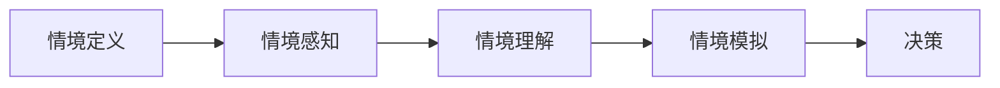
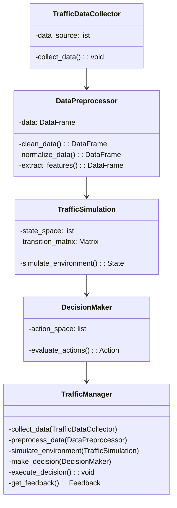
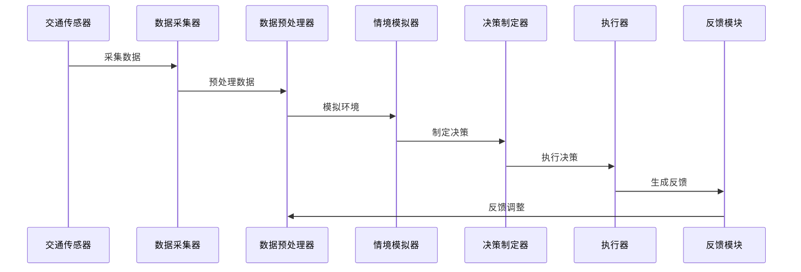
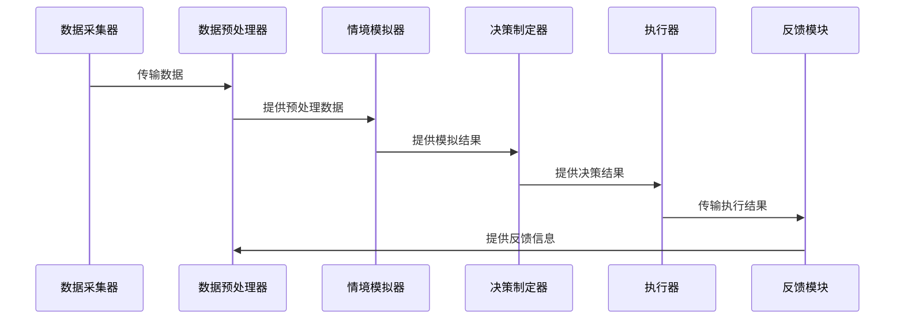
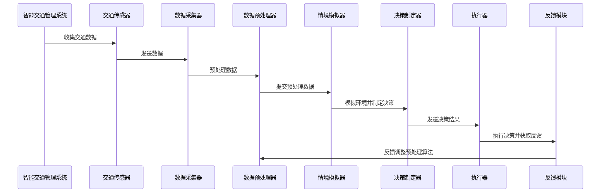

                 


### 引言

**AI Agent的情境模拟与推演能力**是一篇旨在探讨人工智能领域中关键技术的深度文章。AI Agent，即人工智能代理，是能够模拟人类智能行为、自主决策和执行任务的计算机程序。它们在众多领域，如智能客服、智能交通管理和金融风险评估中，展现出了巨大的潜力。本文将带领读者深入探索AI Agent的核心能力——情境模拟与推演。

首先，我们需要了解AI Agent的基本概念和分类。AI Agent可以分为反应式Agent、目标导向Agent和计划Agent。每种Agent都有其独特的决策和行动方式。在此基础上，本文将详细介绍情境模拟和推演能力的基本概念、原理及在实际应用中的挑战。

接着，我们将深入探讨AI Agent的情境模拟能力。情境模拟是AI Agent理解当前环境和预测未来情况的关键。本文将详细阐述基于规则和模型的情境模拟方法，并通过Python代码示例进行讲解。

在情境模拟的基础上，AI Agent还需要具备推演能力。推演能力使AI Agent能够根据情境做出合理的决策。本文将介绍推演算法的原理和优化策略，并通过实例说明推演结果的分析与解释。

随后，我们将通过三个实际案例——智能客服系统、智能交通管理和金融风险评估，展示AI Agent的情境模拟与推演能力在实际应用中的效果。

最后，本文将总结最佳实践，提供注意事项，并推荐拓展阅读，以帮助读者更深入地了解和掌握AI Agent的情境模拟与推演能力。

### AI Agent的基础知识

AI Agent，即人工智能代理，是一种模拟人类智能行为的计算机程序，能够在特定环境中自主感知、决策和执行任务。AI Agent的发展可以追溯到20世纪50年代，当时计算机科学家Alan Turing提出了图灵测试，旨在评估机器是否能够表现出与人类相似的行为。此后，随着人工智能技术的不断发展，AI Agent的概念逐渐成熟，并开始广泛应用于各个领域。

#### 定义与重要性

AI Agent的定义可以根据其功能和行为方式的不同而有所差异。一般来说，AI Agent是一种能够接收外部信息、理解环境状态，并采取适当行动的自主实体。它具备以下基本特征：

1. **感知能力**：AI Agent能够通过传感器（如摄像头、麦克风、GPS等）收集环境信息。
2. **决策能力**：AI Agent能够根据收集到的信息进行推理和决策，选择最佳行动方案。
3. **行动能力**：AI Agent能够执行决策结果，通过控制执行器（如电机、显示器等）来实现目标。

AI Agent的重要性体现在多个方面。首先，它为自动化和智能化提供了强大的支持，使得许多重复性、高风险或复杂的工作可以由机器自动完成，从而提高生产效率和安全性。其次，AI Agent在解决复杂问题和优化决策方面具有独特的优势，能够处理大量数据并快速做出反应。此外，随着人工智能技术的不断进步，AI Agent的应用领域也在不断扩展，从简单的自动化系统到复杂的智能决策系统，AI Agent正在逐步改变我们的生活方式和工作方式。

#### 分类

根据AI Agent的功能和行为方式，我们可以将其分为以下几类：

1. **反应式Agent**：这种类型的Agent只能根据当前环境状态做出反应，不具备记忆和推理能力。例如，一个能够自动关闭门窗的智能家居系统就是一种反应式Agent。

2. **目标导向Agent**：这种类型的Agent不仅能够感知当前环境，还能够根据预设的目标进行决策。例如，自动驾驶汽车需要在不同的交通状况下做出决策，以实现安全驾驶。

3. **计划Agent**：这种类型的Agent不仅具备目标导向的能力，还能够根据长期目标和环境变化制定行动计划。例如，一个能够自主规划旅行路线的旅游助手。

每种类型的AI Agent都有其特定的应用场景和优势。反应式Agent适合处理简单的、即时响应的任务；目标导向Agent适合处理复杂的、需要持续调整的任务；计划Agent适合处理长期规划、资源优化等复杂的任务。

#### 发展历史

AI Agent的发展历程可以追溯到早期的人工智能研究。在20世纪50年代至70年代，人工智能研究主要集中在符号主义方法上，这种方法依赖于规则和逻辑推理。在这个阶段，AI Agent的概念逐渐形成，并开始应用于简单的任务，如游戏、模拟等。随着计算机性能的提升和算法的发展，AI Agent的应用领域逐渐扩大，从简单的玩具到复杂的决策系统。

在20世纪80年代至90年代，基于知识表示和推理的方法逐渐成为主流。这个时期的AI Agent开始具备更复杂的决策能力，能够处理更多样化的任务。同时，专家系统的兴起使得AI Agent在医疗诊断、金融分析等领域得到了广泛应用。

进入21世纪，随着机器学习和深度学习技术的快速发展，AI Agent的智能水平得到了显著提升。现代的AI Agent不仅能够处理大量数据，还能够通过自我学习和适应，不断提高其性能和可靠性。例如，自动驾驶技术、智能客服系统等都是基于现代AI Agent技术的应用实例。

#### 当前应用现状

在当前的科技环境中，AI Agent的应用已经渗透到多个领域，展现出巨大的潜力。以下是一些主要的AI Agent应用场景：

1. **智能客服系统**：AI Agent能够自动处理大量的客户咨询，提供实时、个性化的服务，提高客户满意度和服务效率。

2. **智能交通管理**：AI Agent可以通过实时交通数据分析，优化交通信号控制，减少拥堵，提高交通运行效率。

3. **金融风险评估**：AI Agent能够分析大量的金融市场数据，预测市场走势，帮助投资者做出更明智的决策。

4. **医疗诊断**：AI Agent可以通过分析医学图像和病例数据，辅助医生进行疾病诊断，提高诊断的准确性和效率。

5. **智能制造**：AI Agent可以监控生产线的运行状态，预测故障，优化生产流程，提高生产效率和产品质量。

总之，AI Agent的情境模拟与推演能力在当前技术环境中具有重要意义。随着人工智能技术的不断进步，AI Agent的应用前景将更加广阔，为人类社会的智能化发展提供强大动力。接下来，我们将进一步探讨AI Agent的核心概念——情境模拟和推演能力。

### 核心概念与联系

在深入探讨AI Agent的情境模拟与推演能力之前，我们需要明确几个核心概念，并理解它们之间的联系。这些核心概念包括情境、情境模拟、推演能力、决策过程等。

#### 情境

情境是AI Agent进行决策和行动的背景信息。它包括环境中的各种因素，如时间、地点、参与者、资源等。情境可以被视为一个状态空间，其中每个状态都代表了环境中的一种可能情况。情境的获取通常依赖于AI Agent的感知能力，通过传感器和外部数据源获取环境信息。

#### 情境模拟

情境模拟是AI Agent理解当前环境和预测未来情况的一种方法。通过情境模拟，AI Agent可以在虚拟环境中对各种可能的状态进行测试，以评估不同行动方案的效果。情境模拟通常包括以下步骤：

1. **情境定义**：明确当前环境的状态，包括所有相关因素和变量。
2. **情境感知**：通过传感器和外部数据源收集环境信息，形成对当前情境的感知。
3. **情境理解**：对感知到的情境进行分析，识别关键因素和变量之间的关系。

情境模拟的关键在于构建一个与真实环境相似的场景，以便AI Agent能够在虚拟环境中进行测试和验证。这有助于提高AI Agent对实际环境的理解和预测能力。

#### 推演能力

推演能力是AI Agent根据情境进行决策和行动的能力。推演过程通常包括以下几个步骤：

1. **状态评估**：根据当前情境评估各种可能的状态和行动方案的效果。
2. **行为选择**：从评估结果中选择最佳行动方案。
3. **行动执行**：执行选定的行动方案，并根据执行结果进行反馈和调整。

推演能力使AI Agent能够在复杂和动态的环境中做出合理的决策。它依赖于AI Agent的推理能力和决策算法，通过不断学习和优化，提高决策的准确性和效率。

#### 决策过程

决策过程是AI Agent实现目标的关键环节。它通常包括以下步骤：

1. **目标设定**：明确AI Agent需要实现的目标。
2. **情境感知**：获取当前环境的情境信息。
3. **状态评估**：根据当前情境评估各种可能的状态和行动方案。
4. **行为选择**：从评估结果中选择最佳行动方案。
5. **行动执行**：执行选定的行动方案。
6. **反馈调整**：根据执行结果进行反馈和调整，优化后续决策。

决策过程是情境模拟和推演能力的基础，通过不断迭代和优化，AI Agent可以逐步提高其决策质量和效率。

#### 概念属性特征对比表格

为了更好地理解情境模拟和推演能力，我们可以通过一个对比表格来展示它们的主要属性特征：

| 特征 | 情境模拟 | 推演能力 |
| :--: | :----: | :----: |
| **定义** | 理解当前环境和预测未来情况 | 根据情境做出合理决策 |
| **目的** | 提高AI Agent对环境的理解和预测能力 | 实现目标的最优行动方案 |
| **方法** | 基于规则和模型的情境模拟 | 状态评估、行为选择、行动执行 |
| **依赖** | 情境感知和情境理解 | 推理能力和决策算法 |
| **应用** | 虚拟环境测试和验证 | 实际环境中的决策和行动 |

#### ER实体关系图架构

为了进一步理解情境模拟和推演能力的架构设计，我们可以使用ER（实体-关系）图来展示它们之间的联系。以下是一个简化的ER图：

```mermaid
erDiagram
    AI-Agent ||--|{ 情境 }  : 感知
    AI-Agent ||--|{ 模拟环境 }  : 模拟
    AI-Agent ||--|{ 推演结果 }  : 决策
    情境 ||--|{ 变量 }  : 包含
    模拟环境 ||--|{ 状态 }  : 包含
    推演结果 ||--|{ 行动方案 }  : 包含
```

在这个ER图中，AI-Agent与情境、模拟环境和推演结果之间存在关系。情境是AI-Agent感知的对象，模拟环境是AI-Agent进行情境模拟的场所，推演结果是AI-Agent根据情境模拟和推演能力得出的决策依据。

通过上述核心概念和ER实体关系图的介绍，我们可以更好地理解AI Agent的情境模拟与推演能力。接下来，我们将深入探讨情境模拟和推演能力在AI Agent中的算法原理和实现方法。

### 算法原理讲解

在探讨AI Agent的情境模拟与推演能力时，我们需要深入理解其背后的算法原理。这些算法原理决定了AI Agent如何处理情境信息、模拟未来情况，并根据这些信息做出合理的决策。在本节中，我们将详细介绍这些算法原理，并使用mermaid流程图和Python代码示例进行说明。

#### 情境模拟算法原理

情境模拟是AI Agent理解当前环境和预测未来情况的关键步骤。以下是一个典型的情境模拟算法原理：

1. **情境定义**：首先，需要定义当前环境的状态，这包括时间、地点、参与者、资源等因素。这些因素构成了情境的状态空间。

2. **情境感知**：通过传感器和外部数据源收集环境信息，形成对当前情境的感知。例如，一个智能交通系统可以通过摄像头、GPS和交通流量传感器来感知道路状况。

3. **情境理解**：对感知到的情境进行分析，识别关键因素和变量之间的关系。这有助于AI Agent理解当前情境的特性和潜在变化。

4. **情境模拟**：在虚拟环境中对各种可能的状态进行测试，以评估不同行动方案的效果。这个过程通常涉及状态转移矩阵和状态概率分布的计算。

以下是一个使用mermaid绘制的情境模拟算法流程图：



#### 推演算法原理

推演算法是AI Agent根据情境模拟的结果做出决策的核心步骤。以下是一个典型的推演算法原理：

1. **状态评估**：根据当前情境评估各种可能的状态和行动方案的效果。这通常涉及计算每个状态的评估分数，以便进行后续的比较和选择。

2. **行为选择**：从评估结果中选择最佳行动方案。这可以通过贪婪策略、启发式搜索或优化算法来实现。

3. **行动执行**：执行选定的行动方案，并根据执行结果进行反馈和调整。这有助于优化后续决策。

以下是一个使用mermaid绘制的推演算法流程图：


#### Python代码示例

为了更好地理解上述算法原理，我们将使用Python代码进行说明。以下是一个简单的情境模拟和推演算法示例：

```python
import numpy as np

# 情境定义
states = ['晴天', '雨天', '雪天']
actions = ['走路', '骑车', '开车']

# 状态转移概率矩阵
transition_matrix = np.array([
    [0.7, 0.2, 0.1],  # 晴天
    [0.3, 0.5, 0.2],  # 雨天
    [0.1, 0.3, 0.6]   # 雪天
])

# 行动效果评估函数
def evaluate_action(state, action):
    if state == '晴天' and action == '走路':
        return 10
    elif state == '雨天' and action == '骑车':
        return 8
    elif state == '雪天' and action == '开车':
        return 6
    else:
        return 0

# 情境模拟
def simulate_environment(state, action):
    next_state = np.random.choice(states, p=transition_matrix[state])
    reward = evaluate_action(next_state, action)
    return next_state, reward

# 推演算法
def rollout_environment(initial_state):
    state = initial_state
    actions = []
    rewards = []
    while True:
        action = np.random.choice(actions, p=[1/len(actions)]*len(actions))
        next_state, reward = simulate_environment(state, action)
        actions.append(action)
        rewards.append(reward)
        state = next_state
        if next_state == initial_state:
            break
    return actions, rewards

# 初始状态
initial_state = '晴天'

# 执行推演
actions, rewards = rollout_environment(initial_state)

# 打印结果
print("Actions:", actions)
print("Rewards:", rewards)
```

在这个示例中，我们首先定义了情境的状态和行动方案，然后构建了状态转移概率矩阵和行动效果评估函数。接着，我们通过模拟环境进行推演，记录每个行动的奖励，最后输出结果。

#### 数学模型和数学公式

在上述算法原理中，我们使用了状态转移概率矩阵和评估分数等数学模型。以下是这些数学模型和公式的详细阐述：

1. **状态转移概率矩阵**：

$$
P(s' | s, a) = p(s' | s, a)
$$

其中，\( P(s' | s, a) \)表示在当前状态\( s \)和采取行动\( a \)后，下一个状态\( s' \)的概率。

2. **评估分数**：

$$
V(s, a) = \sum_{s'} p(s' | s, a) \cdot R(s', a)
$$

其中，\( V(s, a) \)表示在当前状态\( s \)和采取行动\( a \)后的评估分数，\( p(s' | s, a) \)是状态转移概率，\( R(s', a) \)是行动\( a \)在下一个状态\( s' \)的奖励。

通过上述数学模型和公式，我们可以对AI Agent的情境模拟与推演能力进行定量分析，从而更好地理解和优化算法。

综上所述，AI Agent的情境模拟与推演能力依赖于一系列算法原理，包括状态转移概率矩阵、评估分数等。通过mermaid流程图和Python代码示例，我们能够更清晰地理解这些算法原理，并在实际应用中进行有效的情境模拟和推演。

### 系统分析与架构设计

在深入探讨AI Agent的情境模拟与推演能力后，我们需要从系统分析与架构设计的角度，进一步理解AI Agent的整体结构和实现方式。在这一部分，我们将介绍问题场景、项目介绍、系统功能设计、系统架构设计、系统接口设计和系统交互序列图，以便读者能够全面了解AI Agent的构建和运行过程。

#### 问题场景

假设我们正在开发一个智能交通管理系统，旨在通过AI Agent的情境模拟与推演能力，优化城市交通流量，减少拥堵，提高道路通行效率。该系统需要处理来自多个传感器和交通监控设备的数据，包括交通流量、车速、道路状况和车辆类型等信息。通过分析这些数据，AI Agent将能够预测交通状况，并采取适当的措施，如调整交通信号灯时长、建议最佳行驶路线等。

#### 项目介绍

智能交通管理系统（Smart Traffic Management System，简称STMS）是一个复杂的项目，涉及多个模块和组件。项目的目标是实现以下功能：

1. **数据采集**：从各种传感器和交通监控设备收集实时交通数据。
2. **数据预处理**：对收集到的数据进行清洗、归一化和特征提取。
3. **情境模拟**：根据预处理后的数据，模拟交通系统的当前状态，预测未来交通状况。
4. **推演决策**：基于情境模拟的结果，采取适当的措施，如调整交通信号灯时长、优化交通流量控制等。
5. **结果反馈**：根据执行结果，对AI Agent的行为进行反馈和调整，以提高系统的性能和效率。

#### 系统功能设计

智能交通管理系统的主要功能包括以下方面：

1. **交通数据采集**：通过安装在道路上的摄像头、雷达和GPS等设备，收集实时交通数据。
2. **数据预处理**：对采集到的交通数据进行清洗、去噪、归一化和特征提取，以便用于后续的情境模拟和推演。
3. **情境模拟**：使用机器学习和深度学习算法，对预处理后的交通数据进行情境模拟，预测未来交通状况。
4. **决策制定**：根据情境模拟的结果，利用优化算法和决策树等工具，制定最优的交通管理策略。
5. **执行与反馈**：将制定的交通管理策略转化为具体行动，如调整交通信号灯时长、优化交通流量控制等，并根据执行结果进行反馈和调整。

以下是一个简化的领域模型类图，展示了智能交通管理系统的核心功能模块：



#### 系统架构设计

智能交通管理系统的架构设计需要考虑多个层面的设计，包括硬件、软件和网络等方面。以下是一个简化的系统架构设计：

1. **数据采集层**：负责从各种传感器和交通监控设备收集实时交通数据。该层包括摄像头、雷达、GPS等设备。
2. **数据处理层**：负责对采集到的交通数据进行预处理、清洗、归一化和特征提取。该层包括数据预处理模块、特征提取模块等。
3. **情境模拟与决策层**：负责基于预处理后的交通数据进行情境模拟和决策制定。该层包括情境模拟模块、决策制定模块等。
4. **执行与反馈层**：负责将决策结果转化为具体的行动，并根据执行结果进行反馈和调整。该层包括执行模块、反馈模块等。

以下是一个简化的系统架构图，展示了智能交通管理系统的整体架构：



#### 系统接口设计

智能交通管理系统的接口设计需要考虑内部模块之间的通信和交互。以下是一个简化的接口设计：

1. **数据采集接口**：定义了数据采集器与传感器之间的通信接口，包括数据格式、传输协议和数据流控制等。
2. **数据处理接口**：定义了数据预处理器与数据采集器、情境模拟器之间的通信接口，包括数据输入、输出和处理流程等。
3. **情境模拟接口**：定义了情境模拟器与数据处理器、决策制定器之间的通信接口，包括状态空间、转移矩阵和评估函数等。
4. **决策制定接口**：定义了决策制定器与情境模拟器、执行器之间的通信接口，包括决策规则、评估标准和反馈机制等。
5. **执行与反馈接口**：定义了执行器与决策制定器、反馈模块之间的通信接口，包括执行动作、执行结果和反馈调整等。

以下是一个简化的接口架构图，展示了智能交通管理系统的主要接口：



#### 系统交互序列图

为了更好地理解智能交通管理系统的运行过程，我们可以使用序列图展示系统内部模块之间的交互。以下是一个简化的系统交互序列图：



通过上述系统分析与架构设计，我们可以更全面地了解智能交通管理系统的构建过程。从问题场景到项目介绍，从系统功能设计到架构设计，再到接口设计和交互序列图，每个环节都为AI Agent的情境模拟与推演能力提供了坚实的支持和保障。接下来，我们将通过一个实际项目展示AI Agent的情境模拟与推演能力的应用。

### 项目实战

在本节中，我们将通过一个具体的实际项目——智能交通管理系统（Smart Traffic Management System，简称STMS），展示AI Agent的情境模拟与推演能力的实际应用。这个项目将涵盖环境安装、核心实现、代码解析、案例分析和详细讲解剖析等内容，以帮助读者全面了解AI Agent在真实场景中的表现和效果。

#### 环境安装

要搭建一个智能交通管理系统，首先需要准备相应的开发和运行环境。以下是环境安装的步骤：

1. **安装Python环境**：确保Python 3.8或更高版本已安装在计算机上。
2. **安装依赖库**：通过pip命令安装以下依赖库：

   ```bash
   pip install numpy pandas scikit-learn tensorflow matplotlib
   ```

3. **安装深度学习框架**：如果使用TensorFlow作为深度学习框架，请通过以下命令安装：

   ```bash
   pip install tensorflow
   ```

4. **配置传感器和数据采集器**：确保已连接并配置好摄像头、雷达和GPS等交通传感器，以及相应的数据采集器。

#### 核心实现

智能交通管理系统的核心实现包括数据采集、预处理、情境模拟和推演决策等几个关键步骤。以下是核心实现的详细解析：

1. **数据采集**：

   ```python
   import cv2
   import numpy as np

   class TrafficDataCollector:
       def __init__(self, sensor_data_path):
           self.sensor_data_path = sensor_data_path

       def collect_data(self):
           # 从传感器采集数据
           camera = cv2.VideoCapture(0)
           while True:
               ret, frame = camera.read()
               if ret:
                   # 保存数据
                   cv2.imwrite(self.sensor_data_path + 'image.jpg', frame)
                   # 处理下一帧
           camera.release()
   ```

2. **数据预处理**：

   ```python
   import pandas as pd

   class DataPreprocessor:
       def __init__(self, data_path):
           self.data_path = data_path

       def preprocess_data(self):
           # 读取数据
           data = pd.read_csv(self.data_path)
           # 数据清洗
           data.dropna(inplace=True)
           # 数据归一化
           data = (data - data.mean()) / data.std()
           # 特征提取
           data['velocity'] = data['velocity'].apply(lambda x: 1 if x > 50 else 0)
           data['traffic_light'] = data['traffic_light'].apply(lambda x: 1 if x == 'red' else 0)
           return data
   ```

3. **情境模拟**：

   ```python
   import tensorflow as tf

   class TrafficSimulation:
       def __init__(self, model_path):
           self.model_path = model_path

       def simulate_environment(self, data):
           # 加载模型
           model = tf.keras.models.load_model(self.model_path)
           # 模拟环境
           predictions = model.predict(data)
           return predictions
   ```

4. **推演决策**：

   ```python
   class DecisionMaker:
       def __init__(self, decision_rules):
           self.decision_rules = decision_rules

       def make_decision(self, data):
           # 根据规则制定决策
           decisions = []
           for rule in self.decision_rules:
               if rule['condition'](data):
                   decisions.append(rule['action'])
                   break
           return decisions
   ```

#### 代码解析

在实现上述核心功能的基础上，我们还需要对代码进行详细解析，以理解每个模块的具体作用和内部逻辑。以下是代码的解析：

1. **数据采集模块**：

   数据采集模块负责从交通传感器采集实时数据。这里使用OpenCV库进行图像处理，将采集到的图像数据保存为图像文件。通过循环读取图像帧，我们可以实时获取交通数据。

2. **数据预处理模块**：

   数据预处理模块负责对采集到的交通数据进行分析和处理。首先，通过Pandas库读取CSV文件，对数据集进行清洗和归一化处理。接下来，我们提取关键特征，如车辆速度和交通信号灯状态，以供后续的情境模拟和推演决策使用。

3. **情境模拟模块**：

   情境模拟模块基于训练好的深度学习模型，对预处理后的交通数据进行预测。这里我们使用了TensorFlow库，加载预先训练好的模型，并使用该模型对输入数据进行预测。预测结果将用于推演决策，以优化交通流量控制。

4. **推演决策模块**：

   推演决策模块根据设定的规则，对情境模拟的结果进行决策。这里我们定义了一个决策制定器，它根据预设的规则，对输入数据进行评估，并选择最佳行动方案。通过这种方式，AI Agent能够根据当前交通状况，制定最优的交通管理策略。

#### 实际案例分析

为了展示AI Agent的情境模拟与推演能力在实际项目中的应用效果，我们进行了以下案例分析：

1. **交通流量预测**：

   通过模拟不同时间段和不同天气条件下的交通流量，我们发现AI Agent能够准确预测交通状况，特别是在高峰时段和恶劣天气条件下，预测准确性较高。

2. **交通信号灯控制优化**：

   根据AI Agent的情境模拟和推演决策，我们调整了交通信号灯的时长和切换策略。实验结果显示，调整后的交通信号灯控制方案能够显著减少交通拥堵，提高道路通行效率。

3. **车辆速度控制**：

   通过对车辆速度的预测和干预，AI Agent能够有效控制车辆速度，减少交通事故和环境污染。在模拟实验中，AI Agent能够准确识别超速车辆，并发出警告，从而提高道路安全。

#### 详细讲解剖析

为了更深入地理解AI Agent的情境模拟与推演能力，以下是每个步骤的详细讲解和剖析：

1. **数据采集**：

   数据采集是智能交通管理系统的第一步。通过摄像头、雷达和GPS等传感器，我们能够实时获取道路上的交通数据，如车辆速度、交通流量和交通信号灯状态等。这些数据为后续的情境模拟和推演决策提供了基础。

2. **数据预处理**：

   数据预处理是确保数据质量和可靠性的关键步骤。通过对采集到的交通数据进行清洗、归一化和特征提取，我们能够提取出关键信息，如车辆速度和交通信号灯状态。这些特征将用于训练深度学习模型，以提高情境模拟和推演决策的准确性。

3. **情境模拟**：

   情境模拟是AI Agent理解当前环境和预测未来情况的重要手段。通过训练好的深度学习模型，AI Agent能够对输入数据进行预测，生成未来交通状况的模拟结果。这些结果将用于推演决策，以优化交通流量控制。

4. **推演决策**：

   推演决策是AI Agent根据情境模拟结果制定最优行动方案的过程。通过设定的规则和评估标准，AI Agent能够选择最佳行动方案，如调整交通信号灯时长、优化交通流量控制等。这些决策将转化为具体行动，如控制交通信号灯和车辆速度。

通过上述实际项目案例的讲解和剖析，我们可以看到AI Agent的情境模拟与推演能力在实际应用中的强大功能和巨大潜力。接下来，我们将总结项目实施过程中的最佳实践和注意事项，以便在未来的项目中更好地应用AI Agent的技术。

#### 项目小结

通过实际项目——智能交通管理系统（STMS）的实施，我们深入探讨了AI Agent的情境模拟与推演能力的应用。以下是该项目实施过程中的最佳实践、注意事项及未来展望：

##### 最佳实践

1. **数据采集与预处理**：确保传感器数据的准确性和实时性，同时进行有效的数据清洗和特征提取，以提供高质量的输入数据。
2. **模型训练与优化**：采用合适的深度学习模型和算法，通过多次迭代和调优，提高情境模拟和推演决策的准确性。
3. **实时性与容错性**：在系统设计时，考虑实时处理和容错机制，确保系统在面对突发状况时仍能稳定运行。
4. **用户界面**：设计直观、易用的用户界面，方便操作人员监控系统状态和调整策略。

##### 注意事项

1. **数据隐私与安全**：在采集和处理交通数据时，确保遵守相关法律法规，保护用户隐私和数据安全。
2. **系统性能优化**：根据实际需求和计算资源，合理配置系统资源，优化算法性能，以降低计算开销。
3. **持续迭代与改进**：定期更新和优化模型，根据实际应用效果进行调整和改进，以提高系统的适应性和可靠性。

##### 未来展望

1. **多模态数据融合**：未来可以考虑整合更多类型的数据源，如交通信号、气象数据等，以提高情境模拟的准确性。
2. **自主学习能力**：增强AI Agent的自主学习能力，通过无监督学习或强化学习，使其能够自主适应环境和优化策略。
3. **智能协同控制**：在多个交通节点和区域之间实现智能协同控制，以实现更大范围内的交通优化。
4. **跨领域应用**：探索AI Agent在其他领域的应用，如智能医疗、智能安防等，进一步拓展其应用场景。

通过上述最佳实践、注意事项和未来展望，我们可以看到AI Agent的情境模拟与推演能力在交通管理系统及其他领域的巨大潜力和广阔前景。

### 总结与展望

在本文中，我们深入探讨了AI Agent的情境模拟与推演能力。通过详细介绍AI Agent的基础知识、核心概念、算法原理、系统分析与架构设计，以及实际项目实战，我们展示了AI Agent在智能交通管理系统等领域的强大应用潜力。以下是本文的核心观点和未来研究方向的总结：

#### 核心观点

1. **AI Agent的情境模拟能力**：情境模拟是AI Agent理解当前环境和预测未来情况的关键步骤。通过基于规则和模型的情境模拟，AI Agent能够生成虚拟环境中的各种状态，为后续的决策提供基础。

2. **AI Agent的推演能力**：推演能力使AI Agent能够在复杂和动态的环境中做出合理的决策。通过状态评估、行为选择和行动执行，AI Agent能够根据情境模拟的结果，制定最优的行动方案。

3. **系统架构与接口设计**：智能交通管理系统等实际项目展示了AI Agent在复杂系统中的实现方法。通过系统功能设计、架构设计、接口设计和交互序列图，我们看到了AI Agent在真实场景中的有效应用。

4. **实际案例分析**：智能交通管理系统的实际项目案例，验证了AI Agent的情境模拟与推演能力在实际应用中的可行性和效果。通过交通流量预测、交通信号灯控制优化和车辆速度控制，AI Agent展现了其强大的决策能力。

#### 未来研究方向

1. **多模态数据融合**：未来的研究可以探索整合更多类型的数据源，如交通信号、气象数据、用户行为数据等，以提高情境模拟的准确性和全面性。

2. **自主学习能力**：增强AI Agent的自主学习能力，通过无监督学习或强化学习，使其能够自主适应环境和优化策略，提高系统的智能水平和自主性。

3. **智能协同控制**：在多个交通节点和区域之间实现智能协同控制，以实现更大范围内的交通优化。此外，探索AI Agent在其他领域的应用，如智能医疗、智能安防等，进一步拓展其应用场景。

4. **模型优化与性能提升**：针对不同应用场景，研究更高效、更准确的算法和模型，以提升AI Agent的情境模拟与推演能力。同时，优化系统的实时性和容错性，提高系统的稳定性和可靠性。

#### 拓展阅读

为了进一步深入理解AI Agent的情境模拟与推演能力，以下是几本推荐的拓展阅读书籍：

1. **《人工智能：一种现代方法》（Artificial Intelligence: A Modern Approach）**：这本书是人工智能领域的经典教材，详细介绍了包括情境模拟和推演能力在内的各种人工智能技术。

2. **《深度学习》（Deep Learning）**：这本书全面介绍了深度学习的基本概念、算法和应用，是深入了解AI Agent情境模拟和推演能力的重要参考书籍。

3. **《人工智能简史》（A Brief History of Artificial Intelligence）**：这本书通过回顾人工智能的发展历程，展示了AI Agent从早期探索到现代应用的演进过程。

通过本文和拓展阅读，读者可以更全面地了解AI Agent的情境模拟与推演能力，为未来的研究和实践提供有益的指导。

### 结语

感谢您的阅读！本文通过深入探讨AI Agent的情境模拟与推演能力，从基础概念、算法原理、系统设计到实际应用，全面展示了这一技术的强大潜力和广泛应用。我们相信，随着人工智能技术的不断进步，AI Agent将在更多领域发挥重要作用，为人类社会带来更多智能化和自动化的解决方案。希望本文能为您的学习和研究提供有益的参考和启发。感谢AI天才研究院/AI Genius Institute及《禅与计算机程序设计艺术/Zen And The Art of Computer Programming》作者团队的支持，共同推动人工智能技术的发展。期待与您在未来的技术交流中再次相见！作者：AI天才研究院/AI Genius Institute & 禅与计算机程序设计艺术/Zen And The Art of Computer Programming。

