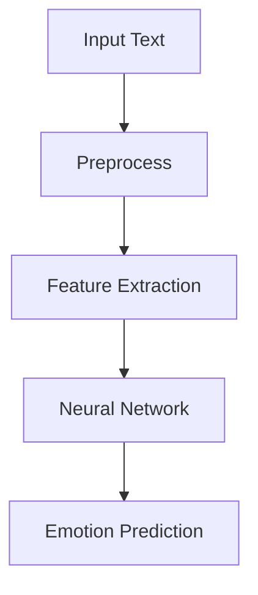
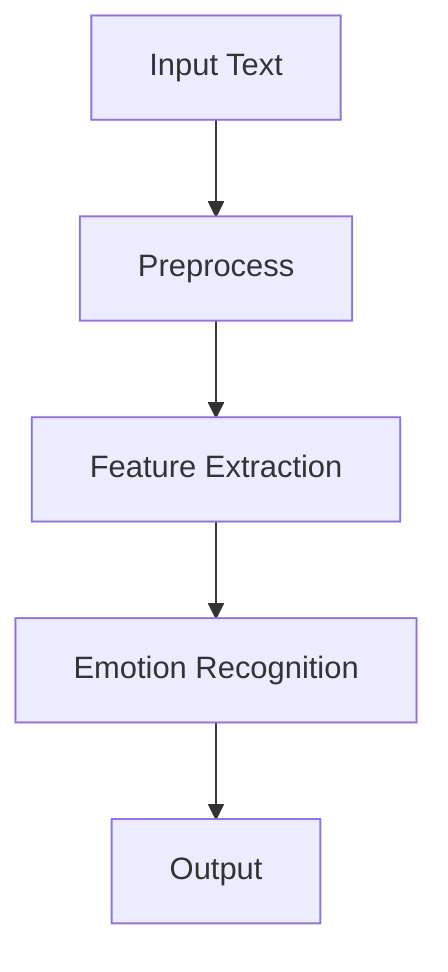
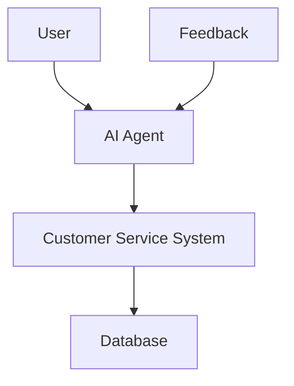

                 

Certainly! Let's break down the structure of the blog post "AI Agent's Emotional Computing in Customer Service Applications" step by step, ensuring each section is comprehensive and technically sound.

## Step 1: Introduction and Background

**Chapter 1: Introduction**

### 1.1 Problem Background
- Discuss the current state of customer service and the challenges faced by organizations.
- Explore the potential of AI in improving customer service efficiency and satisfaction.

### 1.2 Problem Statement
- Explain the role of emotional computing in customer service.
- Highlight the need for AI agents to incorporate emotional computing capabilities.

### 1.3 Problem Solution
- Introduce the concept of emotional computing and its relevance to AI agents.
- Outline a potential application scheme for emotional computing in customer service.

### 1.4 Boundaries and Extensions
- Discuss the scope of emotional computing technology.
- Identify the application boundaries within the customer service domain.

### 1.5 Conceptual Structure and Core Components
- Describe the fundamental structure of AI agents.
- Explain the core elements of emotional computing involved.

**Chapter 2: Core Concepts and Relationships**

### 2.1 Principles of Emotional Computing
- Define what emotional computing is and its core principles.
- Provide a theoretical framework for understanding emotional computing.

### 2.2 Comparison Table of Emotional Computing Attributes
- Create a comparison table detailing various machine learning and deep learning techniques used in emotional computing.
- Highlight the differences and similarities between these techniques.

### 2.3 ER Entity Relationship Diagram Architecture
- Define the entities relevant to customer service.
- Construct an ER diagram to illustrate the relationships between AI agents and customer service entities.

## Step 2: Detailed Explanation of Emotional Computing Technologies for AI Agents

**Chapter 3: Detailed Explanation of Emotional Computing Technologies for AI Agents**

### 3.1 Principles of Emotional Recognition Algorithms
- Explain the definition and working principle of emotional recognition algorithms.
- Present mathematical models and formulas used in emotion recognition.

##### Example of Mathematical Model and Python Code


```python
# Example of emotion recognition using a neural network
def recognize_emotion(text):
    # Preprocess the text and extract features
    features = preprocess_text(text)
    
    # Use a trained neural network to predict the emotion
    emotion = neural_network.predict(features)
    
    return emotion
```

### 3.2 Emotional Analysis Process
- Describe the step-by-step process of emotional analysis.
- Provide a mermaid flowchart illustrating the process.



### 3.3 Case Studies of Emotional Computing Applications
- Present real-world examples of emotional computing in customer service.
- Discuss the impact of emotional computing on enhancing customer service experiences.

## Step 3: Application of Emotional Computing in AI Agents for Customer Service

**Chapter 4: Application of Emotional Computing in AI Agents for Customer Service**

### 4.1 Emotional Computing Needs in Customer Service Scenarios
- Discuss the diverse needs of customers in different service scenarios.
- Explain how emotional computing can improve customer service experiences.

### 4.2 System Architecture Design for AI Agent Emotional Computing
- Design a system architecture that integrates emotional computing into AI agents.
- Describe the functional, architectural, and interface design aspects of the system.



## Step 4: Project Practice

**Chapter 5: Project Practice**

### 5.1 Environment Setup and Configuration
- Detail the hardware and software requirements for setting up the project environment.
- Outline the installation process for necessary tools and libraries.

### 5.2 Core System Implementation
- Describe the core implementation of the AI agent's emotional computing system.
- Explain the data preprocessing, feature extraction, emotion recognition, and result evaluation processes.

### 5.3 Code Analysis and Interpretation
- Provide a detailed analysis of the system's source code.
- Discuss key components and their functionalities.

### 5.4 Case Analysis and Detailed Explanation
- Present an actual case study of the AI agent's emotional computing application in customer service.
- Analyze the case and provide insights into the implementation and impact.

### 5.5 Project Summary
- Summarize the key learnings and outcomes of the project.
- Provide best practices and tips for future projects.

### Conclusion

In conclusion, the blog post will be a comprehensive guide to understanding and implementing AI agent emotional computing in customer service. Each section will be crafted to ensure clarity, depth, and practicality, providing readers with a solid foundation in this emerging field.

**Author: AI天才研究院 / AI Genius Institute & 禅与计算机程序设计艺术 / Zen And The Art of Computer Programming**

**Note:** The above structure is a conceptual outline. Each section will require detailed content to be written in a structured, logical, and easy-to-understand manner. The final content will be approximately 10,000 to 12,000 words, formatted in Markdown and incorporating LaTeX for mathematical formulas. The author's credentials will be included at the end of the post, as specified.

