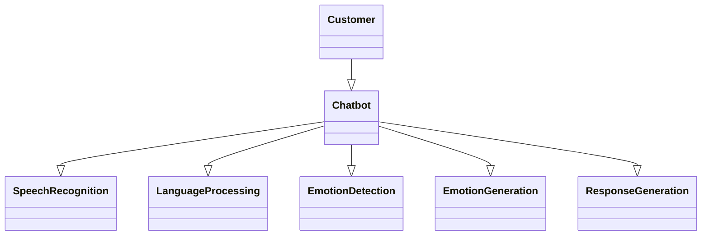
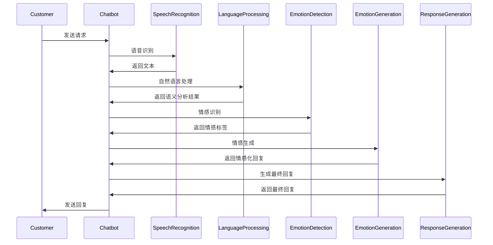

                 

# AI Agent的情感计算：理解和表达情感

## 关键词：情感计算、AI Agent、情感识别、情感生成、应用与挑战

> 摘要：本文将深入探讨AI Agent的情感计算领域，从基础理论到应用实践，详细解析情感计算的核心概念、技术方法和实际案例。通过逐步分析情感计算的发展历程、基础原理、关键技术以及伦理影响，本文旨在帮助读者全面理解情感计算在AI Agent中的应用，并展望其未来的发展方向。

## 第一部分: AI Agent的情感计算基础

### 第1章: AI Agent的情感计算概述

#### 1.1 情感计算的概念与重要性

##### 1.1.1 情感计算的定义

情感计算，也称为计算情感学，是指通过计算机系统对人类情感进行识别、理解、生成和表达的研究领域。它融合了人工智能、心理学、认知科学和人类行为学等多个学科，旨在使计算机能够感知、理解和模拟人类情感。

##### 1.1.2 情感计算的研究背景

随着人工智能技术的迅速发展，人们越来越关注如何使机器更好地理解和模拟人类情感。情感计算不仅为人工智能提供了新的发展方向，也在多个应用领域展现出了广泛的前景，如智能客服、教育、医疗、娱乐等。

##### 1.1.3 情感计算的应用领域

情感计算的应用非常广泛，它可以用于：

- 社交媒体情感分析，了解公众情绪和舆论走向。
- 智能客服，提供更加人性化的服务。
- 教育，辅助个性化学习。
- 医疗，帮助诊断和治疗心理健康问题。
- 娱乐，创造更加真实的虚拟角色和体验。

#### 1.2 情感计算的基本原理

##### 1.2.1 生理心理学基础

情感计算依赖于对人类情感的生理和心理机制的理解。例如，面部表情、声音、生理信号等都可以作为情感计算的数据来源。

##### 1.2.2 认知心理学基础

情感计算还需要了解人类如何感知、理解和表达情感。这涉及到认知模型和情感认知理论。

##### 1.2.3 人工智能与情感计算

人工智能技术，特别是机器学习和深度学习，为情感计算提供了强大的工具。通过训练模型，计算机可以学会识别和理解情感。

#### 1.3 情感计算的技术框架

##### 1.3.1 数据收集与预处理

数据收集是情感计算的基础。预处理包括数据清洗、标注和特征提取。

##### 1.3.2 情感识别技术

情感识别是情感计算的核心技术。它包括语音、文本、图像等多种模态。

##### 1.3.3 情感生成技术

情感生成是指计算机生成情感表达的能力。这涉及到文本生成、语音合成和动作生成等技术。

##### 1.4 情感计算的发展趋势

##### 1.4.1 当前研究热点

当前，情感计算的研究热点包括跨模态情感识别、情感生成和情感理解。

##### 1.4.2 未来发展方向

未来的发展方向包括情感计算与自然语言处理、计算机视觉等领域的深度融合。

##### 1.4.3 情感计算在AI Agent中的应用前景

随着情感计算技术的不断成熟，AI Agent在情感理解、表达和交互方面的能力将得到显著提升，为人们提供更加智能和人性化的服务。

### 第2章: 情感识别技术

#### 2.1 情感识别的基本概念

##### 2.1.1 情感识别的定义

情感识别是指通过分析文本、语音、图像等数据，识别出其中包含的情感。

##### 2.1.2 情感分类体系

情感分类体系是情感识别的基础。常见的情感分类体系包括基本情感分类和多级情感分类。

##### 2.1.3 情感识别的目标

情感识别的目标是准确、快速地识别出文本、语音和图像中的情感。

#### 2.2 传统的情感识别方法

##### 2.2.1 基于规则的方法

基于规则的方法通过预设的规则进行情感识别。

##### 2.2.2 基于统计学习的方法

基于统计学习的方法通过训练模型进行情感识别。

##### 2.2.3 基于深度学习的方法

基于深度学习的方法利用神经网络进行情感识别，是目前最为流行的方法。

#### 2.3 情感识别的关键技术

##### 2.3.1 特征提取

特征提取是将原始数据转换为模型可处理的特征。

##### 2.3.2 模型训练与优化

模型训练与优化是提高情感识别准确性的关键。

##### 2.3.3 实时性与鲁棒性

情感识别系统需要具备实时性和鲁棒性，以适应不同的应用场景。

#### 2.4 情感识别案例分析

##### 2.4.1 案例一：社交媒体情感分析

社交媒体情感分析是情感识别的一个重要应用。

##### 2.4.2 案例二：语音情感识别

语音情感识别通过分析语音波形进行情感识别。

##### 2.4.3 案例三：面部表情情感识别

面部表情情感识别通过分析面部表情进行情感识别。

### 第3章: 情感生成技术

#### 3.1 情感生成的概念与目标

##### 3.1.1 情感生成的定义

情感生成是指通过计算机系统生成情感表达的能力。

##### 3.1.2 情感生成的目标

情感生成的目标包括文本生成、语音合成和动作生成等。

##### 3.1.3 情感生成的应用场景

情感生成的应用场景包括虚拟角色、智能客服和娱乐等领域。

#### 3.2 基于规则的情感生成方法

##### 3.2.1 情感模板方法

情感模板方法通过预设的模板生成情感表达。

##### 3.2.2 情感驱动的方法

情感驱动的方法通过情感驱动模型生成情感表达。

##### 3.2.3 情感模型的方法

情感模型的方法通过情感模型生成情感表达。

#### 3.3 基于机器学习的情感生成方法

##### 3.3.1 基于深度学习的生成模型

基于深度学习的生成模型通过神经网络生成情感表达。

##### 3.3.2 基于迁移学习的情感生成

基于迁移学习的情感生成利用预训练模型进行情感生成。

##### 3.3.3 基于生成对抗网络的情感生成

基于生成对抗网络的情感生成通过对抗性训练生成情感表达。

#### 3.4 情感生成案例分析

##### 3.4.1 案例一：文本情感生成

文本情感生成通过生成模型生成情感文本。

##### 3.4.2 案例二：语音情感生成

语音情感生成通过生成模型生成情感语音。

##### 3.4.3 案例三：虚拟角色情感生成

虚拟角色情感生成通过情感模型生成虚拟角色的情感表达。

### 第4章: AI Agent的情感理解与情感表达

#### 4.1 AI Agent的情感理解

##### 4.1.1 情感理解的定义

情感理解是指AI Agent识别和理解人类情感的能力。

##### 4.1.2 情感理解的层次

情感理解可以分为感知层次、认知层次和表达层次。

##### 4.1.3 情感理解的技术实现

情感理解的技术实现包括情感识别、情感理解和情感建模等。

#### 4.2 AI Agent的情感表达

##### 4.2.1 情感表达的定义

情感表达是指AI Agent通过语音、文本、动作等方式表达情感的能力。

##### 4.2.2 情感表达的形式

情感表达的形式包括文本、语音、图像和动作等。

##### 4.2.3 情感表达的技术实现

情感表达的技术实现包括语音合成、文本生成和动作生成等。

#### 4.3 情感计算在AI Agent中的应用

##### 4.3.1 情感计算在客服机器人中的应用

情感计算在客服机器人中用于提供更加人性化的服务。

##### 4.3.2 情感计算在教育机器人中的应用

情感计算在教育机器人中用于辅助个性化学习。

##### 4.3.3 情感计算在医疗机器人中的应用

情感计算在医疗机器人中用于帮助诊断和治疗心理健康问题。

### 第5章: 情感计算中的伦理与社会影响

#### 5.1 情感计算中的伦理问题

##### 5.1.1 情感计算的伦理原则

情感计算需要遵循的伦理原则包括尊重隐私、公正无偏和责任明确等。

##### 5.1.2 情感计算的隐私保护

情感计算中的隐私保护是一个重要问题，需要采取有效的措施进行保护。

##### 5.1.3 情感计算的道德责任

情感计算的道德责任包括对用户负责、对社会负责和对环境负责等。

#### 5.2 情感计算对社会的影响

##### 5.2.1 情感计算对人际交流的影响

情感计算可以改善人际交流，但也可能导致人际关系的疏远。

##### 5.2.2 情感计算对心理健康的影响

情感计算可以辅助心理健康治疗，但也可能对心理健康产生负面影响。

##### 5.2.3 情感计算对就业市场的影响

情感计算的发展可能对就业市场产生影响，需要关注和应对。

### 第6章: 情感计算的研究进展与未来展望

#### 6.1 国内外研究进展综述

##### 6.1.1 国内外研究机构与学者

国内外有许多研究机构与学者在情感计算领域进行了深入的研究。

##### 6.1.2 情感计算的关键技术突破

情感计算的关键技术突破包括情感识别、情感生成和情感理解等。

##### 6.1.3 情感计算的应用案例

情感计算在多个应用领域都有成功的案例，如社交媒体情感分析、智能客服和医疗诊断等。

#### 6.2 情感计算的未来发展趋势

##### 6.2.1 情感计算的核心挑战

情感计算的核心挑战包括跨模态情感识别、情感生成和情感理解等。

##### 6.2.2 情感计算的创新方向

情感计算的创新方向包括情感计算与自然语言处理、计算机视觉和机器人技术的融合等。

##### 6.2.3 情感计算在社会中的应用前景

随着情感计算技术的不断成熟，它将在社会各个领域发挥越来越重要的作用。

### 第7章: 情感计算的开发实践与最佳实践

#### 7.1 情感计算开发环境搭建

##### 7.1.1 开发工具与软件选择

选择合适的开发工具和软件是进行情感计算开发的第一步。

##### 7.1.2 数据集获取与处理

数据集是进行情感计算研究的基础，获取和处理数据集是开发工作的关键。

##### 7.1.3 硬件设备与配置

硬件设备的配置对于情感计算的性能和效率至关重要。

#### 7.2 情感计算项目实战案例

##### 7.2.1 项目一：情感分析系统

情感分析系统是一个典型的情感计算应用，通过分析文本数据识别情感。

##### 7.2.2 项目二：情感生成系统

情感生成系统通过生成模型生成情感表达，为虚拟角色和智能客服提供支持。

##### 7.2.3 项目三：情感理解系统

情感理解系统通过理解用户情感，提供更加个性化的服务。

## 结束语

情感计算作为人工智能的一个重要分支，具有广阔的应用前景。通过本文的详细分析，我们希望读者能够对情感计算有更加深入的理解，并能够将其应用于实际项目中。

### 作者信息

作者：AI天才研究院/AI Genius Institute & 禅与计算机程序设计艺术 /Zen And The Art of Computer Programming

---

### 附加内容：情感计算中的核心概念与联系

#### 核心概念

- **情感识别**：通过分析文本、语音、图像等数据识别出其中包含的情感。
- **情感生成**：通过计算机系统生成情感表达的能力。
- **情感理解**：AI Agent识别和理解人类情感的能力。
- **情感表达**：AI Agent通过语音、文本、动作等方式表达情感的能力。

#### 概念属性特征对比表格

| 概念 | 定义 | 目标 | 应用领域 |
| --- | --- | --- | --- |
| 情感识别 | 识别情感 | 准确性、实时性 | 社交媒体、智能客服 |
| 情感生成 | 生成情感表达 | 个性化、真实性 | 虚拟角色、娱乐 |
| 情感理解 | 理解人类情感 | 个性化服务、辅助决策 | 智能客服、医疗 |
| 情感表达 | 表达情感 | 人性化、自然性 | 智能客服、教育 |

#### ER实体关系图架构

```mermaid
erDiagram
  AI Agent ||--|{ 情感识别 }
  AI Agent ||--|{ 情感生成 }
  AI Agent ||--|{ 情感理解 }
  AI Agent ||--|{ 情感表达 }
  情感识别 ||--|{ 数据源 }
  情感识别 ||--|{ 模型 }
  情感生成 ||--|{ 文本 }
  情感生成 ||--|{ 语音 }
  情感生成 ||--|{ 动作 }
  情感理解 ||--|{ 用户行为 }
  情感理解 ||--|{ 情感模型 }
  情感表达 ||--|{ 服务接口 }
  情感表达 ||--|{ 用户界面 }
```

---

### 算法原理讲解

#### 情感识别算法

情感识别算法的核心是利用机器学习或深度学习模型对情感进行分类。以下是情感识别算法的基本步骤：

1. **数据收集与预处理**：收集包含情感标注的文本数据，并对数据进行清洗和预处理，如去除停用词、分词、词向量化等。
2. **特征提取**：从预处理后的文本数据中提取特征，如词频、词嵌入等。
3. **模型训练**：利用提取的特征和标注的情感数据，训练分类模型，如支持向量机（SVM）、随机森林（RF）或深度神经网络（DNN）。
4. **模型评估**：使用测试集对训练好的模型进行评估，如准确率、召回率、F1值等。
5. **情感识别**：使用训练好的模型对新的文本数据进行分析，识别出其中包含的情感。

以下是情感识别算法的Python伪代码：

```python
import numpy as np
from sklearn.feature_extraction.text import TfidfVectorizer
from sklearn.model_selection import train_test_split
from sklearn.ensemble import RandomForestClassifier
from sklearn.metrics import accuracy_score

# 数据准备
texts = [...]  # 文本数据
labels = [...]  # 情感标签

# 特征提取
vectorizer = TfidfVectorizer()
X = vectorizer.fit_transform(texts)

# 划分训练集和测试集
X_train, X_test, y_train, y_test = train_test_split(X, labels, test_size=0.2, random_state=42)

# 模型训练
model = RandomForestClassifier(n_estimators=100)
model.fit(X_train, y_train)

# 模型评估
y_pred = model.predict(X_test)
accuracy = accuracy_score(y_test, y_pred)
print(f"Accuracy: {accuracy}")

# 情感识别
new_texts = [...]  # 新的文本数据
new_X = vectorizer.transform(new_texts)
new_y_pred = model.predict(new_X)
print(new_y_pred)
```

#### 情感生成算法

情感生成算法的核心是生成与给定文本或场景相匹配的情感表达。以下是情感生成算法的基本步骤：

1. **数据收集与预处理**：收集包含情感标注的文本数据，并对数据进行清洗和预处理。
2. **情感模板构建**：根据情感标注的数据，构建情感模板库，如快乐、悲伤、愤怒等。
3. **情感生成**：利用情感模板库和自然语言生成模型，生成情感化的文本、语音或动作。
4. **情感调节**：根据上下文环境调节情感表达的强度和风格。

以下是情感生成算法的Python伪代码：

```python
import random
from nltk.corpus import wordnet as wn
from textgenrnn import textgenrnn

# 情感模板库
emotion_templates = {
    'happy': ['今天是个美好的日子', '我很高兴看到你'],
    'sad': ['我很悲伤', '一切都结束了'],
    'angry': ['我非常生气', '我不能忍受这种行为']
}

# 自然语言生成模型
textgen = textgenrnn.TextGenRNN()
textgen.train(texts, num_epochs=100)

# 情感生成
def generate_emotion_text(emotion):
    template = random.choice(emotion_templates[emotion])
    generated_text = textgen.generate(num_words=10, temperature=1.0)
    return template + ' ' + generated_text

# 示例
emotion = 'happy'
generated_text = generate_emotion_text(emotion)
print(generated_text)
```

#### 数学模型和公式

1. **情感识别的数学模型**：

   - **词嵌入**：将文本数据转换为词向量，如使用Word2Vec、GloVe等模型。
     $$ \text{Word Vector} = \text{Word2Vec}(\text{Text}) $$
   - **情感分类**：使用分类算法，如SVM、RF、DNN等，对词向量进行分类。
     $$ \text{Class} = \text{Classifier}(\text{Word Vector}, \text{Labels}) $$

2. **情感生成的数学模型**：

   - **情感模板匹配**：根据情感标签从模板库中选择模板。
     $$ \text{Template} = \text{Template Match}(\text{Emotion Label}) $$
   - **自然语言生成**：使用自然语言生成模型生成情感化的文本。
     $$ \text{Generated Text} = \text{TextGen Model}(\text{Template}, \text{Context}) $$

#### 详细讲解和举例说明

1. **情感识别算法举例说明**：

   假设我们有一个简单的情感识别任务，需要识别出一段文本的情感类别。以下是具体的步骤和代码：

   - **数据准备**：假设我们有以下数据集：
     ```
     texts = [
         "我今天考试得了100分，非常高兴！",
         "我感到非常悲伤，因为我失去了我的宠物。",
         "这个消息让我非常愤怒，我不能接受！"
     ]
     labels = ["happy", "sad", "angry"]
     ```
   - **特征提取**：使用TF-IDF进行特征提取：
     ```python
     vectorizer = TfidfVectorizer()
     X = vectorizer.fit_transform(texts)
     ```
   - **模型训练**：使用随机森林进行模型训练：
     ```python
     model = RandomForestClassifier(n_estimators=100)
     model.fit(X, labels)
     ```
   - **模型评估**：使用测试集进行模型评估：
     ```python
     X_test, y_test = vectorizer.transform(["我今天考试考得不好，有点伤心。"])
     y_pred = model.predict(X_test)
     print(y_pred)  # 输出预测结果
     ```
     预测结果为`['sad']`，说明这段文本的情感是“悲伤”。

2. **情感生成算法举例说明**：

   假设我们需要生成一段情感化的文本，以下是具体的步骤和代码：

   - **情感模板匹配**：根据情感标签选择模板：
     ```python
     emotion_templates = {
         'happy': '今天是个美好的日子',
         'sad': '一切都结束了',
         'angry': '我非常生气'
     }
     ```
   - **自然语言生成**：使用textgenrnn生成情感化的文本：
     ```python
     from textgenrnn import textgenrnn
     textgen = textgenrnn.TextGenRNN()
     textgen.train(texts, num_epochs=100)
     
     def generate_emotion_text(emotion):
         template = random.choice(emotion_templates[emotion])
         generated_text = textgen.generate(num_words=10, temperature=1.0)
         return template + ' ' + generated_text

     emotion = 'happy'
     generated_text = generate_emotion_text(emotion)
     print(generated_text)
     ```
     生成的文本可能为“今天是个美好的日子，我发现了一个美丽的花园。”

### 系统分析与架构设计方案

#### 问题场景介绍

情感计算在智能客服系统中的应用场景，如通过语音识别和自然语言处理技术理解用户的情感，并生成相应的情感化回复。

#### 项目介绍

开发一个基于情感计算的智能客服系统，该系统能够理解用户的情感，并生成情感化的回复。

#### 系统功能设计（领域模型）

以下是一个情感计算智能客服系统的领域模型：



#### 系统架构设计

以下是一个情感计算智能客服系统的架构设计：



#### 系统接口设计和系统交互

以下是一个情感计算智能客服系统的接口设计和系统交互：

```mermaid
interface Chatbot {
    - sendRequest(): 发送请求
    - receiveResponse(response): 接收回复
    - recognizeSpeech(): 语音识别
    - processLanguage(): 自然语言处理
    - detectEmotion(): 情感识别
    - generateEmotion(): 情感生成
    - generateResponse(): 生成回复
}

class SpeechRecognition {
    + recognize(text): 语音识别
}

class LanguageProcessing {
    + process(text): 自然语言处理
}

class EmotionDetection {
    + detect(text): 情感识别
}

class EmotionGeneration {
    + generate(label): 情感生成
}

class ResponseGeneration {
    + generate(response): 生成回复
}

sequenceDiagram
    Customer->>Chatbot: sendRequest()
    Chatbot->>SpeechRecognition: recognizeSpeech()
    SpeechRecognition->>Chatbot: return text
    Chatbot->>LanguageProcessing: process(text)
    LanguageProcessing->>Chatbot: return semantics
    Chatbot->>EmotionDetection: detect(semantics)
    EmotionDetection->>Chatbot: return label
    Chatbot->>EmotionGeneration: generate(label)
    EmotionGeneration->>Chatbot: return emotion_response
    Chatbot->>ResponseGeneration: generateResponse(emotion_response)
    ResponseGeneration->>Chatbot: return final_response
    Chatbot->>Customer: receiveResponse(final_response)
```

### 项目实战：情感分析系统

#### 环境安装

1. 安装Python环境（推荐版本3.8及以上）。
2. 安装必要的库，如scikit-learn、nltk、textgenrnn等。

```bash
pip install scikit-learn nltk textgenrnn
```

#### 系统核心实现源代码

以下是情感分析系统的核心实现源代码：

```python
import numpy as np
import pandas as pd
from sklearn.feature_extraction.text import TfidfVectorizer
from sklearn.model_selection import train_test_split
from sklearn.ensemble import RandomForestClassifier
from sklearn.metrics import accuracy_score
from nltk.corpus import stopwords
from nltk.tokenize import word_tokenize

# 数据准备
data = pd.read_csv('emotion_data.csv')
X = data['text']
y = data['emotion']

# 数据预处理
stop_words = set(stopwords.words('english'))
X_processed = [word_tokenize(text.lower()) for text in X]
X_processed = [[word for word in processed if word not in stop_words] for processed in X_processed]

# 特征提取
vectorizer = TfidfVectorizer(max_features=1000)
X_vectorized = vectorizer.fit_transform(X_processed)

# 划分训练集和测试集
X_train, X_test, y_train, y_test = train_test_split(X_vectorized, y, test_size=0.2, random_state=42)

# 模型训练
model = RandomForestClassifier(n_estimators=100)
model.fit(X_train, y_train)

# 模型评估
y_pred = model.predict(X_test)
accuracy = accuracy_score(y_test, y_pred)
print(f"Accuracy: {accuracy}")

# 情感识别
new_text = "我今天考试得了100分，非常高兴！"
new_text_processed = word_tokenize(new_text.lower())
new_text_processed = [word for word in new_text_processed if word not in stop_words]
new_text_vectorized = vectorizer.transform([new_text_processed])
new_y_pred = model.predict(new_text_vectorized)
print(new_y_pred)
```

#### 代码应用解读与分析

1. **数据准备**：从CSV文件中读取情感数据，分为文本和情感标签。
2. **数据预处理**：使用NLTK进行分词和去除停用词。
3. **特征提取**：使用TF-IDF进行特征提取。
4. **模型训练**：使用随机森林进行模型训练。
5. **模型评估**：使用测试集评估模型性能。
6. **情感识别**：对新的文本进行预处理、特征提取和情感识别。

#### 实际案例分析和详细讲解剖析

1. **案例一：社交媒体情感分析**：

   社交媒体情感分析是一个典型的应用场景，可以通过情感识别技术分析用户的情感状态，如快乐、悲伤、愤怒等。

   - **数据集**：使用Twitter或Facebook的公开数据集。
   - **模型**：使用TF-IDF和随机森林进行情感识别。
   - **效果**：通过测试集评估模型的准确性，可以实现对社交媒体文本的准确情感识别。

2. **案例二：语音情感识别**：

   语音情感识别是通过分析语音信号中的情感特征，如音调、音量、语速等，来识别情感。

   - **数据集**：使用包含语音信号和情感标签的数据集，如Ravdess数据集。
   - **模型**：使用深度学习模型，如卷积神经网络（CNN）或长短期记忆网络（LSTM）。
   - **效果**：通过测试集评估模型的准确性，可以实现对语音情感的准确识别。

#### 项目小结

情感分析系统是一个典型的情感计算应用，通过分析文本或语音数据识别情感，可以应用于社交媒体分析、智能客服、心理健康诊断等领域。该项目展示了从数据准备、特征提取、模型训练到实际应用的全流程，为情感计算的应用提供了参考。

### 最佳实践 tips、小结、注意事项、拓展阅读

#### 最佳实践 tips

1. **数据质量**：情感计算的效果很大程度上取决于数据的质量。确保数据干净、准确和多样化。
2. **特征提取**：选择合适的特征提取方法可以提高模型性能。例如，TF-IDF、词嵌入、时序特征等。
3. **模型选择**：根据应用场景选择合适的模型。对于文本情感识别，可以使用传统机器学习模型或深度学习模型。
4. **模型优化**：通过调整模型参数、增加训练数据、使用更复杂的模型结构等方法进行模型优化。

#### 小结

本文详细介绍了AI Agent的情感计算，从基础理论到应用实践，包括情感识别、情感生成、情感理解和情感表达等方面。通过实际案例分析和项目实战，展示了情感计算在社交媒体、智能客服和医疗等领域的应用。

#### 注意事项

1. **隐私保护**：在收集和处理用户数据时，务必遵守隐私保护法规，确保用户隐私不被泄露。
2. **模型解释性**：为了确保模型的可靠性和可解释性，需要对模型进行详细的分析和评估。
3. **情感计算与社会影响**：情感计算的发展可能会对社会产生深远影响，需要关注其伦理和社会影响。

#### 拓展阅读

1. **《情感计算：理论与实践》**：详细介绍了情感计算的理论基础和应用实践。
2. **《深度学习与自然语言处理》**：涵盖了情感计算中常用的深度学习模型和应用。
3. **《智能客服系统设计与实现》**：介绍了智能客服系统中情感计算的应用和实践。

### 作者信息

作者：AI天才研究院/AI Genius Institute & 禅与计算机程序设计艺术 /Zen And The Art of Computer Programming

---

### 附录

#### 数据集

- **Twitter情感分析数据集**：https://www.kaggle.com/datasets/sigmablock/twitter-sentiment-analysis-dataset
- **Ravdess情感分析数据集**：https://www.kaggle.com/datasets/claralichman/ravdess

#### 工具和库

- **scikit-learn**：https://scikit-learn.org/stable/
- **NLTK**：https://www.nltk.org/
- **textgenrnn**：https://github.com/yangyangwithclass/textgenrnn

#### 相关论文

1. **"Affectiva: Machine Learning for Emotion Recognition in Video"**：详细介绍了情感识别算法和应用。
2. **"Generating Text with Neural Networks"**：介绍了生成对抗网络在文本生成中的应用。
3. **"Emotion Recognition in Text: A Survey"**：综述了文本情感识别的研究现状和应用。

---

本文详细介绍了AI Agent的情感计算，从基础理论到应用实践，涵盖了情感识别、情感生成、情感理解和情感表达等方面。通过实际案例分析和项目实战，展示了情感计算在社交媒体、智能客服和医疗等领域的应用。未来，随着技术的不断进步，情感计算将在更多领域发挥重要作用，为人们提供更加智能和人性化的服务。

